cola Report for GDS5420
==================

**Date**: 2019-12-25 22:12:16 CET, **cola version**: 1.3.2

----------------------------------------------------------------

<style type='text/css'>

body, td, th {
   font-family: Arial,Helvetica,sans-serif;
   background-color: white;
   font-size: 13px;
  max-width: 800px;
  margin: auto;
  margin-left:210px;
  padding: 0px 10px 0px 10px;
  border-left: 1px solid #EEEEEE;
  line-height: 150%;
}

tt, code, pre {
   font-family: 'DejaVu Sans Mono', 'Droid Sans Mono', 'Lucida Console', Consolas, Monaco, 

monospace;
}

h1 {
   font-size:2.2em;
}

h2 {
   font-size:1.8em;
}

h3 {
   font-size:1.4em;
}

h4 {
   font-size:1.0em;
}

h5 {
   font-size:0.9em;
}

h6 {
   font-size:0.8em;
}

a {
  text-decoration: none;
  color: #0366d6;
}

a:hover {
  text-decoration: underline;
}

a:visited {
   color: #0366d6;
}

pre, img {
  max-width: 100%;
}
pre {
  overflow-x: auto;
}
pre code {
   display: block; padding: 0.5em;
}

code {
  font-size: 92%;
  border: 1px solid #ccc;
}

code[class] {
  background-color: #F8F8F8;
}

table, td, th {
  border: 1px solid #ccc;
}

blockquote {
   color:#666666;
   margin:0;
   padding-left: 1em;
   border-left: 0.5em #EEE solid;
}

hr {
   height: 0px;
   border-bottom: none;
   border-top-width: thin;
   border-top-style: dotted;
   border-top-color: #999999;
}

@media print {
   * {
      background: transparent !important;
      color: black !important;
      filter:none !important;
      -ms-filter: none !important;
   }

   body {
      font-size:12pt;
      max-width:100%;
   }

   a, a:visited {
      text-decoration: underline;
   }

   hr {
      visibility: hidden;
      page-break-before: always;
   }

   pre, blockquote {
      padding-right: 1em;
      page-break-inside: avoid;
   }

   tr, img {
      page-break-inside: avoid;
   }

   img {
      max-width: 100% !important;
   }

   @page :left {
      margin: 15mm 20mm 15mm 10mm;
   }

   @page :right {
      margin: 15mm 10mm 15mm 20mm;
   }

   p, h2, h3 {
      orphans: 3; widows: 3;
   }

   h2, h3 {
      page-break-after: avoid;
   }
}
</style>


## Summary


All available functions which can be applied to this `res_list` object:


```r
res_list
```

```
#> A 'ConsensusPartitionList' object with 24 methods.
#>   On a matrix with 45638 rows and 99 columns.
#>   Top rows are extracted by 'SD, CV, MAD, ATC' methods.
#>   Subgroups are detected by 'hclust, kmeans, skmeans, pam, mclust, NMF' method.
#>   Number of partitions are tried for k = 2, 3, 4, 5, 6.
#>   Performed in total 30000 partitions by row resampling.
#> 
#> Following methods can be applied to this 'ConsensusPartitionList' object:
#>  [1] "cola_report"           "collect_classes"       "collect_plots"         "collect_stats"        
#>  [5] "colnames"              "functional_enrichment" "get_anno_col"          "get_anno"             
#>  [9] "get_classes"           "get_matrix"            "get_membership"        "get_stats"            
#> [13] "is_best_k"             "is_stable_k"           "ncol"                  "nrow"                 
#> [17] "rownames"              "show"                  "suggest_best_k"        "test_to_known_factors"
#> [21] "top_rows_heatmap"      "top_rows_overlap"     
#> 
#> You can get result for a single method by, e.g. object["SD", "hclust"] or object["SD:hclust"]
#> or a subset of methods by object[c("SD", "CV")], c("hclust", "kmeans")]
```

The call of `run_all_consensus_partition_methods()` was:


```
#> run_all_consensus_partition_methods(data = mat, mc.cores = 4, anno = anno)
```

Dimension of the input matrix:


```r
mat = get_matrix(res_list)
dim(mat)
```

```
#> [1] 45638    99
```

### Density distribution

The density distribution for each sample is visualized as in one column in the
following heatmap. The clustering is based on the distance which is the
Kolmogorov-Smirnov statistic between two distributions.


```r
library(ComplexHeatmap)
densityHeatmap(mat, top_annotation = HeatmapAnnotation(df = get_anno(res_list), 
    col = get_anno_col(res_list)), ylab = "value", cluster_columns = TRUE, show_column_names = FALSE,
    mc.cores = 4)
```


### Suggest the best k


Folowing table shows the best `k` (number of partitions) for each combination
of top-value methods and partition methods. Clicking on the method name in
the table goes to the section for a single combination of methods.

[The cola vignette](http://bioconductor.org/packages/devel/bioc/vignettes/cola/inst/doc/cola.html#toc_13)
explains the definition of the metrics used for determining the best
number of partitions.


```r
suggest_best_k(res_list)
```


|                            | The best k| 1-PAC| Mean silhouette| Concordance|   |Optional k |
|:---------------------------|----------:|-----:|---------------:|-----------:|:--|:----------|
|[ATC:kmeans](#ATC-kmeans)   |          2| 1.000|           1.000|       1.000|** |           |
|[ATC:skmeans](#ATC-skmeans) |          3| 1.000|           0.961|       0.983|** |2          |
|[ATC:mclust](#ATC-mclust)   |          5| 1.000|           0.973|       0.981|** |2,3        |
|[ATC:NMF](#ATC-NMF)         |          2| 1.000|           0.968|       0.987|** |           |
|[MAD:skmeans](#MAD-skmeans) |          4| 0.997|           0.965|       0.981|** |3          |
|[ATC:pam](#ATC-pam)         |          3| 0.987|           0.941|       0.978|** |           |
|[SD:NMF](#SD-NMF)           |          2| 0.978|           0.956|       0.982|** |           |
|[CV:skmeans](#CV-skmeans)   |          3| 0.944|           0.912|       0.966|*  |           |
|[SD:skmeans](#SD-skmeans)   |          4| 0.920|           0.905|       0.955|*  |3          |
|[CV:NMF](#CV-NMF)           |          2| 0.916|           0.927|       0.970|*  |           |
|[MAD:pam](#MAD-pam)         |          3| 0.914|           0.910|       0.961|*  |           |
|[MAD:NMF](#MAD-NMF)         |          3| 0.905|           0.904|       0.959|*  |2          |
|[SD:kmeans](#SD-kmeans)     |          2| 0.902|           0.963|       0.982|*  |           |
|[CV:kmeans](#CV-kmeans)     |          3| 0.882|           0.942|       0.970|   |           |
|[ATC:hclust](#ATC-hclust)   |          5| 0.876|           0.885|       0.931|   |           |
|[SD:mclust](#SD-mclust)     |          5| 0.871|           0.881|       0.927|   |           |
|[SD:pam](#SD-pam)           |          3| 0.870|           0.857|       0.945|   |           |
|[MAD:kmeans](#MAD-kmeans)   |          3| 0.846|           0.905|       0.956|   |           |
|[MAD:mclust](#MAD-mclust)   |          3| 0.796|           0.886|       0.937|   |           |
|[CV:pam](#CV-pam)           |          3| 0.724|           0.855|       0.931|   |           |
|[CV:mclust](#CV-mclust)     |          3| 0.479|           0.768|       0.837|   |           |
|[MAD:hclust](#MAD-hclust)   |          2| 0.451|           0.737|       0.877|   |           |
|[SD:hclust](#SD-hclust)     |          2| 0.266|           0.670|       0.846|   |           |
|[CV:hclust](#CV-hclust)     |          2| 0.253|           0.672|       0.837|   |           |

\*\*: 1-PAC > 0.95, \*: 1-PAC > 0.9


### CDF of consensus matrices

Cumulative distribution function curves of consensus matrix for all methods.


```r
collect_plots(res_list, fun = plot_ecdf)
```


### Consensus heatmap

Consensus heatmaps for all methods. ([What is a consensus heatmap?](http://bioconductor.org/packages/devel/bioc/vignettes/cola/inst/doc/cola.html#toc_9))


<style type='text/css'>


.ui-helper-hidden {
	display: none;
}
.ui-helper-hidden-accessible {
	border: 0;
	clip: rect(0 0 0 0);
	height: 1px;
	margin: -1px;
	overflow: hidden;
	padding: 0;
	position: absolute;
	width: 1px;
}
.ui-helper-reset {
	margin: 0;
	padding: 0;
	border: 0;
	outline: 0;
	line-height: 1.3;
	text-decoration: none;
	font-size: 100%;
	list-style: none;
}
.ui-helper-clearfix:before,
.ui-helper-clearfix:after {
	content: "";
	display: table;
	border-collapse: collapse;
}
.ui-helper-clearfix:after {
	clear: both;
}
.ui-helper-zfix {
	width: 100%;
	height: 100%;
	top: 0;
	left: 0;
	position: absolute;
	opacity: 0;
	filter:Alpha(Opacity=0); 
}

.ui-front {
	z-index: 100;
}


.ui-state-disabled {
	cursor: default !important;
	pointer-events: none;
}


.ui-icon {
	display: inline-block;
	vertical-align: middle;
	margin-top: -.25em;
	position: relative;
	text-indent: -99999px;
	overflow: hidden;
	background-repeat: no-repeat;
}

.ui-widget-icon-block {
	left: 50%;
	margin-left: -8px;
	display: block;
}


.ui-widget-overlay {
	position: fixed;
	top: 0;
	left: 0;
	width: 100%;
	height: 100%;
}
.ui-accordion .ui-accordion-header {
	display: block;
	cursor: pointer;
	position: relative;
	margin: 2px 0 0 0;
	padding: .5em .5em .5em .7em;
	font-size: 100%;
}
.ui-accordion .ui-accordion-content {
	padding: 1em 2.2em;
	border-top: 0;
	overflow: auto;
}
.ui-autocomplete {
	position: absolute;
	top: 0;
	left: 0;
	cursor: default;
}
.ui-menu {
	list-style: none;
	padding: 0;
	margin: 0;
	display: block;
	outline: 0;
}
.ui-menu .ui-menu {
	position: absolute;
}
.ui-menu .ui-menu-item {
	margin: 0;
	cursor: pointer;
	
	list-style-image: url("data:image/gif;base64,R0lGODlhAQABAIAAAAAAAP///yH5BAEAAAAALAAAAAABAAEAAAIBRAA7");
}
.ui-menu .ui-menu-item-wrapper {
	position: relative;
	padding: 3px 1em 3px .4em;
}
.ui-menu .ui-menu-divider {
	margin: 5px 0;
	height: 0;
	font-size: 0;
	line-height: 0;
	border-width: 1px 0 0 0;
}
.ui-menu .ui-state-focus,
.ui-menu .ui-state-active {
	margin: -1px;
}


.ui-menu-icons {
	position: relative;
}
.ui-menu-icons .ui-menu-item-wrapper {
	padding-left: 2em;
}


.ui-menu .ui-icon {
	position: absolute;
	top: 0;
	bottom: 0;
	left: .2em;
	margin: auto 0;
}


.ui-menu .ui-menu-icon {
	left: auto;
	right: 0;
}
.ui-button {
	padding: .4em 1em;
	display: inline-block;
	position: relative;
	line-height: normal;
	margin-right: .1em;
	cursor: pointer;
	vertical-align: middle;
	text-align: center;
	-webkit-user-select: none;
	-moz-user-select: none;
	-ms-user-select: none;
	user-select: none;

	
	overflow: visible;
}

.ui-button,
.ui-button:link,
.ui-button:visited,
.ui-button:hover,
.ui-button:active {
	text-decoration: none;
}


.ui-button-icon-only {
	width: 2em;
	box-sizing: border-box;
	text-indent: -9999px;
	white-space: nowrap;
}


input.ui-button.ui-button-icon-only {
	text-indent: 0;
}


.ui-button-icon-only .ui-icon {
	position: absolute;
	top: 50%;
	left: 50%;
	margin-top: -8px;
	margin-left: -8px;
}

.ui-button.ui-icon-notext .ui-icon {
	padding: 0;
	width: 2.1em;
	height: 2.1em;
	text-indent: -9999px;
	white-space: nowrap;

}

input.ui-button.ui-icon-notext .ui-icon {
	width: auto;
	height: auto;
	text-indent: 0;
	white-space: normal;
	padding: .4em 1em;
}


input.ui-button::-moz-focus-inner,
button.ui-button::-moz-focus-inner {
	border: 0;
	padding: 0;
}
.ui-controlgroup {
	vertical-align: middle;
	display: inline-block;
}
.ui-controlgroup > .ui-controlgroup-item {
	float: left;
	margin-left: 0;
	margin-right: 0;
}
.ui-controlgroup > .ui-controlgroup-item:focus,
.ui-controlgroup > .ui-controlgroup-item.ui-visual-focus {
	z-index: 9999;
}
.ui-controlgroup-vertical > .ui-controlgroup-item {
	display: block;
	float: none;
	width: 100%;
	margin-top: 0;
	margin-bottom: 0;
	text-align: left;
}
.ui-controlgroup-vertical .ui-controlgroup-item {
	box-sizing: border-box;
}
.ui-controlgroup .ui-controlgroup-label {
	padding: .4em 1em;
}
.ui-controlgroup .ui-controlgroup-label span {
	font-size: 80%;
}
.ui-controlgroup-horizontal .ui-controlgroup-label + .ui-controlgroup-item {
	border-left: none;
}
.ui-controlgroup-vertical .ui-controlgroup-label + .ui-controlgroup-item {
	border-top: none;
}
.ui-controlgroup-horizontal .ui-controlgroup-label.ui-widget-content {
	border-right: none;
}
.ui-controlgroup-vertical .ui-controlgroup-label.ui-widget-content {
	border-bottom: none;
}


.ui-controlgroup-vertical .ui-spinner-input {

	
	width: 75%;
	width: calc( 100% - 2.4em );
}
.ui-controlgroup-vertical .ui-spinner .ui-spinner-up {
	border-top-style: solid;
}

.ui-checkboxradio-label .ui-icon-background {
	box-shadow: inset 1px 1px 1px #ccc;
	border-radius: .12em;
	border: none;
}
.ui-checkboxradio-radio-label .ui-icon-background {
	width: 16px;
	height: 16px;
	border-radius: 1em;
	overflow: visible;
	border: none;
}
.ui-checkboxradio-radio-label.ui-checkboxradio-checked .ui-icon,
.ui-checkboxradio-radio-label.ui-checkboxradio-checked:hover .ui-icon {
	background-image: none;
	width: 8px;
	height: 8px;
	border-width: 4px;
	border-style: solid;
}
.ui-checkboxradio-disabled {
	pointer-events: none;
}
.ui-datepicker {
	width: 17em;
	padding: .2em .2em 0;
	display: none;
}
.ui-datepicker .ui-datepicker-header {
	position: relative;
	padding: .2em 0;
}
.ui-datepicker .ui-datepicker-prev,
.ui-datepicker .ui-datepicker-next {
	position: absolute;
	top: 2px;
	width: 1.8em;
	height: 1.8em;
}
.ui-datepicker .ui-datepicker-prev-hover,
.ui-datepicker .ui-datepicker-next-hover {
	top: 1px;
}
.ui-datepicker .ui-datepicker-prev {
	left: 2px;
}
.ui-datepicker .ui-datepicker-next {
	right: 2px;
}
.ui-datepicker .ui-datepicker-prev-hover {
	left: 1px;
}
.ui-datepicker .ui-datepicker-next-hover {
	right: 1px;
}
.ui-datepicker .ui-datepicker-prev span,
.ui-datepicker .ui-datepicker-next span {
	display: block;
	position: absolute;
	left: 50%;
	margin-left: -8px;
	top: 50%;
	margin-top: -8px;
}
.ui-datepicker .ui-datepicker-title {
	margin: 0 2.3em;
	line-height: 1.8em;
	text-align: center;
}
.ui-datepicker .ui-datepicker-title select {
	font-size: 1em;
	margin: 1px 0;
}
.ui-datepicker select.ui-datepicker-month,
.ui-datepicker select.ui-datepicker-year {
	width: 45%;
}
.ui-datepicker table {
	width: 100%;
	font-size: .9em;
	border-collapse: collapse;
	margin: 0 0 .4em;
}
.ui-datepicker th {
	padding: .7em .3em;
	text-align: center;
	font-weight: bold;
	border: 0;
}
.ui-datepicker td {
	border: 0;
	padding: 1px;
}
.ui-datepicker td span,
.ui-datepicker td a {
	display: block;
	padding: .2em;
	text-align: right;
	text-decoration: none;
}
.ui-datepicker .ui-datepicker-buttonpane {
	background-image: none;
	margin: .7em 0 0 0;
	padding: 0 .2em;
	border-left: 0;
	border-right: 0;
	border-bottom: 0;
}
.ui-datepicker .ui-datepicker-buttonpane button {
	float: right;
	margin: .5em .2em .4em;
	cursor: pointer;
	padding: .2em .6em .3em .6em;
	width: auto;
	overflow: visible;
}
.ui-datepicker .ui-datepicker-buttonpane button.ui-datepicker-current {
	float: left;
}


.ui-datepicker.ui-datepicker-multi {
	width: auto;
}
.ui-datepicker-multi .ui-datepicker-group {
	float: left;
}
.ui-datepicker-multi .ui-datepicker-group table {
	width: 95%;
	margin: 0 auto .4em;
}
.ui-datepicker-multi-2 .ui-datepicker-group {
	width: 50%;
}
.ui-datepicker-multi-3 .ui-datepicker-group {
	width: 33.3%;
}
.ui-datepicker-multi-4 .ui-datepicker-group {
	width: 25%;
}
.ui-datepicker-multi .ui-datepicker-group-last .ui-datepicker-header,
.ui-datepicker-multi .ui-datepicker-group-middle .ui-datepicker-header {
	border-left-width: 0;
}
.ui-datepicker-multi .ui-datepicker-buttonpane {
	clear: left;
}
.ui-datepicker-row-break {
	clear: both;
	width: 100%;
	font-size: 0;
}


.ui-datepicker-rtl {
	direction: rtl;
}
.ui-datepicker-rtl .ui-datepicker-prev {
	right: 2px;
	left: auto;
}
.ui-datepicker-rtl .ui-datepicker-next {
	left: 2px;
	right: auto;
}
.ui-datepicker-rtl .ui-datepicker-prev:hover {
	right: 1px;
	left: auto;
}
.ui-datepicker-rtl .ui-datepicker-next:hover {
	left: 1px;
	right: auto;
}
.ui-datepicker-rtl .ui-datepicker-buttonpane {
	clear: right;
}
.ui-datepicker-rtl .ui-datepicker-buttonpane button {
	float: left;
}
.ui-datepicker-rtl .ui-datepicker-buttonpane button.ui-datepicker-current,
.ui-datepicker-rtl .ui-datepicker-group {
	float: right;
}
.ui-datepicker-rtl .ui-datepicker-group-last .ui-datepicker-header,
.ui-datepicker-rtl .ui-datepicker-group-middle .ui-datepicker-header {
	border-right-width: 0;
	border-left-width: 1px;
}


.ui-datepicker .ui-icon {
	display: block;
	text-indent: -99999px;
	overflow: hidden;
	background-repeat: no-repeat;
	left: .5em;
	top: .3em;
}
.ui-dialog {
	position: absolute;
	top: 0;
	left: 0;
	padding: .2em;
	outline: 0;
}
.ui-dialog .ui-dialog-titlebar {
	padding: .4em 1em;
	position: relative;
}
.ui-dialog .ui-dialog-title {
	float: left;
	margin: .1em 0;
	white-space: nowrap;
	width: 90%;
	overflow: hidden;
	text-overflow: ellipsis;
}
.ui-dialog .ui-dialog-titlebar-close {
	position: absolute;
	right: .3em;
	top: 50%;
	width: 20px;
	margin: -10px 0 0 0;
	padding: 1px;
	height: 20px;
}
.ui-dialog .ui-dialog-content {
	position: relative;
	border: 0;
	padding: .5em 1em;
	background: none;
	overflow: auto;
}
.ui-dialog .ui-dialog-buttonpane {
	text-align: left;
	border-width: 1px 0 0 0;
	background-image: none;
	margin-top: .5em;
	padding: .3em 1em .5em .4em;
}
.ui-dialog .ui-dialog-buttonpane .ui-dialog-buttonset {
	float: right;
}
.ui-dialog .ui-dialog-buttonpane button {
	margin: .5em .4em .5em 0;
	cursor: pointer;
}
.ui-dialog .ui-resizable-n {
	height: 2px;
	top: 0;
}
.ui-dialog .ui-resizable-e {
	width: 2px;
	right: 0;
}
.ui-dialog .ui-resizable-s {
	height: 2px;
	bottom: 0;
}
.ui-dialog .ui-resizable-w {
	width: 2px;
	left: 0;
}
.ui-dialog .ui-resizable-se,
.ui-dialog .ui-resizable-sw,
.ui-dialog .ui-resizable-ne,
.ui-dialog .ui-resizable-nw {
	width: 7px;
	height: 7px;
}
.ui-dialog .ui-resizable-se {
	right: 0;
	bottom: 0;
}
.ui-dialog .ui-resizable-sw {
	left: 0;
	bottom: 0;
}
.ui-dialog .ui-resizable-ne {
	right: 0;
	top: 0;
}
.ui-dialog .ui-resizable-nw {
	left: 0;
	top: 0;
}
.ui-draggable .ui-dialog-titlebar {
	cursor: move;
}
.ui-draggable-handle {
	-ms-touch-action: none;
	touch-action: none;
}
.ui-resizable {
	position: relative;
}
.ui-resizable-handle {
	position: absolute;
	font-size: 0.1px;
	display: block;
	-ms-touch-action: none;
	touch-action: none;
}
.ui-resizable-disabled .ui-resizable-handle,
.ui-resizable-autohide .ui-resizable-handle {
	display: none;
}
.ui-resizable-n {
	cursor: n-resize;
	height: 7px;
	width: 100%;
	top: -5px;
	left: 0;
}
.ui-resizable-s {
	cursor: s-resize;
	height: 7px;
	width: 100%;
	bottom: -5px;
	left: 0;
}
.ui-resizable-e {
	cursor: e-resize;
	width: 7px;
	right: -5px;
	top: 0;
	height: 100%;
}
.ui-resizable-w {
	cursor: w-resize;
	width: 7px;
	left: -5px;
	top: 0;
	height: 100%;
}
.ui-resizable-se {
	cursor: se-resize;
	width: 12px;
	height: 12px;
	right: 1px;
	bottom: 1px;
}
.ui-resizable-sw {
	cursor: sw-resize;
	width: 9px;
	height: 9px;
	left: -5px;
	bottom: -5px;
}
.ui-resizable-nw {
	cursor: nw-resize;
	width: 9px;
	height: 9px;
	left: -5px;
	top: -5px;
}
.ui-resizable-ne {
	cursor: ne-resize;
	width: 9px;
	height: 9px;
	right: -5px;
	top: -5px;
}
.ui-progressbar {
	height: 2em;
	text-align: left;
	overflow: hidden;
}
.ui-progressbar .ui-progressbar-value {
	margin: -1px;
	height: 100%;
}
.ui-progressbar .ui-progressbar-overlay {
	background: url("data:image/gif;base64,R0lGODlhKAAoAIABAAAAAP///yH/C05FVFNDQVBFMi4wAwEAAAAh+QQJAQABACwAAAAAKAAoAAACkYwNqXrdC52DS06a7MFZI+4FHBCKoDeWKXqymPqGqxvJrXZbMx7Ttc+w9XgU2FB3lOyQRWET2IFGiU9m1frDVpxZZc6bfHwv4c1YXP6k1Vdy292Fb6UkuvFtXpvWSzA+HycXJHUXiGYIiMg2R6W459gnWGfHNdjIqDWVqemH2ekpObkpOlppWUqZiqr6edqqWQAAIfkECQEAAQAsAAAAACgAKAAAApSMgZnGfaqcg1E2uuzDmmHUBR8Qil95hiPKqWn3aqtLsS18y7G1SzNeowWBENtQd+T1JktP05nzPTdJZlR6vUxNWWjV+vUWhWNkWFwxl9VpZRedYcflIOLafaa28XdsH/ynlcc1uPVDZxQIR0K25+cICCmoqCe5mGhZOfeYSUh5yJcJyrkZWWpaR8doJ2o4NYq62lAAACH5BAkBAAEALAAAAAAoACgAAAKVDI4Yy22ZnINRNqosw0Bv7i1gyHUkFj7oSaWlu3ovC8GxNso5fluz3qLVhBVeT/Lz7ZTHyxL5dDalQWPVOsQWtRnuwXaFTj9jVVh8pma9JjZ4zYSj5ZOyma7uuolffh+IR5aW97cHuBUXKGKXlKjn+DiHWMcYJah4N0lYCMlJOXipGRr5qdgoSTrqWSq6WFl2ypoaUAAAIfkECQEAAQAsAAAAACgAKAAAApaEb6HLgd/iO7FNWtcFWe+ufODGjRfoiJ2akShbueb0wtI50zm02pbvwfWEMWBQ1zKGlLIhskiEPm9R6vRXxV4ZzWT2yHOGpWMyorblKlNp8HmHEb/lCXjcW7bmtXP8Xt229OVWR1fod2eWqNfHuMjXCPkIGNileOiImVmCOEmoSfn3yXlJWmoHGhqp6ilYuWYpmTqKUgAAIfkECQEAAQAsAAAAACgAKAAAApiEH6kb58biQ3FNWtMFWW3eNVcojuFGfqnZqSebuS06w5V80/X02pKe8zFwP6EFWOT1lDFk8rGERh1TTNOocQ61Hm4Xm2VexUHpzjymViHrFbiELsefVrn6XKfnt2Q9G/+Xdie499XHd2g4h7ioOGhXGJboGAnXSBnoBwKYyfioubZJ2Hn0RuRZaflZOil56Zp6iioKSXpUAAAh+QQJAQABACwAAAAAKAAoAAACkoQRqRvnxuI7kU1a1UU5bd5tnSeOZXhmn5lWK3qNTWvRdQxP8qvaC+/yaYQzXO7BMvaUEmJRd3TsiMAgswmNYrSgZdYrTX6tSHGZO73ezuAw2uxuQ+BbeZfMxsexY35+/Qe4J1inV0g4x3WHuMhIl2jXOKT2Q+VU5fgoSUI52VfZyfkJGkha6jmY+aaYdirq+lQAACH5BAkBAAEALAAAAAAoACgAAAKWBIKpYe0L3YNKToqswUlvznigd4wiR4KhZrKt9Upqip61i9E3vMvxRdHlbEFiEXfk9YARYxOZZD6VQ2pUunBmtRXo1Lf8hMVVcNl8JafV38aM2/Fu5V16Bn63r6xt97j09+MXSFi4BniGFae3hzbH9+hYBzkpuUh5aZmHuanZOZgIuvbGiNeomCnaxxap2upaCZsq+1kAACH5BAkBAAEALAAAAAAoACgAAAKXjI8By5zf4kOxTVrXNVlv1X0d8IGZGKLnNpYtm8Lr9cqVeuOSvfOW79D9aDHizNhDJidFZhNydEahOaDH6nomtJjp1tutKoNWkvA6JqfRVLHU/QUfau9l2x7G54d1fl995xcIGAdXqMfBNadoYrhH+Mg2KBlpVpbluCiXmMnZ2Sh4GBqJ+ckIOqqJ6LmKSllZmsoq6wpQAAAh+QQJAQABACwAAAAAKAAoAAAClYx/oLvoxuJDkU1a1YUZbJ59nSd2ZXhWqbRa2/gF8Gu2DY3iqs7yrq+xBYEkYvFSM8aSSObE+ZgRl1BHFZNr7pRCavZ5BW2142hY3AN/zWtsmf12p9XxxFl2lpLn1rseztfXZjdIWIf2s5dItwjYKBgo9yg5pHgzJXTEeGlZuenpyPmpGQoKOWkYmSpaSnqKileI2FAAACH5BAkBAAEALAAAAAAoACgAAAKVjB+gu+jG4kORTVrVhRlsnn2dJ3ZleFaptFrb+CXmO9OozeL5VfP99HvAWhpiUdcwkpBH3825AwYdU8xTqlLGhtCosArKMpvfa1mMRae9VvWZfeB2XfPkeLmm18lUcBj+p5dnN8jXZ3YIGEhYuOUn45aoCDkp16hl5IjYJvjWKcnoGQpqyPlpOhr3aElaqrq56Bq7VAAAOw==");
	height: 100%;
	filter: alpha(opacity=25); 
	opacity: 0.25;
}
.ui-progressbar-indeterminate .ui-progressbar-value {
	background-image: none;
}
.ui-selectable {
	-ms-touch-action: none;
	touch-action: none;
}
.ui-selectable-helper {
	position: absolute;
	z-index: 100;
	border: 1px dotted black;
}
.ui-selectmenu-menu {
	padding: 0;
	margin: 0;
	position: absolute;
	top: 0;
	left: 0;
	display: none;
}
.ui-selectmenu-menu .ui-menu {
	overflow: auto;
	overflow-x: hidden;
	padding-bottom: 1px;
}
.ui-selectmenu-menu .ui-menu .ui-selectmenu-optgroup {
	font-size: 1em;
	font-weight: bold;
	line-height: 1.5;
	padding: 2px 0.4em;
	margin: 0.5em 0 0 0;
	height: auto;
	border: 0;
}
.ui-selectmenu-open {
	display: block;
}
.ui-selectmenu-text {
	display: block;
	margin-right: 20px;
	overflow: hidden;
	text-overflow: ellipsis;
}
.ui-selectmenu-button.ui-button {
	text-align: left;
	white-space: nowrap;
	width: 14em;
}
.ui-selectmenu-icon.ui-icon {
	float: right;
	margin-top: 0;
}
.ui-slider {
	position: relative;
	text-align: left;
}
.ui-slider .ui-slider-handle {
	position: absolute;
	z-index: 2;
	width: 1.2em;
	height: 1.2em;
	cursor: default;
	-ms-touch-action: none;
	touch-action: none;
}
.ui-slider .ui-slider-range {
	position: absolute;
	z-index: 1;
	font-size: .7em;
	display: block;
	border: 0;
	background-position: 0 0;
}


.ui-slider.ui-state-disabled .ui-slider-handle,
.ui-slider.ui-state-disabled .ui-slider-range {
	filter: inherit;
}

.ui-slider-horizontal {
	height: .8em;
}
.ui-slider-horizontal .ui-slider-handle {
	top: -.3em;
	margin-left: -.6em;
}
.ui-slider-horizontal .ui-slider-range {
	top: 0;
	height: 100%;
}
.ui-slider-horizontal .ui-slider-range-min {
	left: 0;
}
.ui-slider-horizontal .ui-slider-range-max {
	right: 0;
}

.ui-slider-vertical {
	width: .8em;
	height: 100px;
}
.ui-slider-vertical .ui-slider-handle {
	left: -.3em;
	margin-left: 0;
	margin-bottom: -.6em;
}
.ui-slider-vertical .ui-slider-range {
	left: 0;
	width: 100%;
}
.ui-slider-vertical .ui-slider-range-min {
	bottom: 0;
}
.ui-slider-vertical .ui-slider-range-max {
	top: 0;
}
.ui-sortable-handle {
	-ms-touch-action: none;
	touch-action: none;
}
.ui-spinner {
	position: relative;
	display: inline-block;
	overflow: hidden;
	padding: 0;
	vertical-align: middle;
}
.ui-spinner-input {
	border: none;
	background: none;
	color: inherit;
	padding: .222em 0;
	margin: .2em 0;
	vertical-align: middle;
	margin-left: .4em;
	margin-right: 2em;
}
.ui-spinner-button {
	width: 1.6em;
	height: 50%;
	font-size: .5em;
	padding: 0;
	margin: 0;
	text-align: center;
	position: absolute;
	cursor: default;
	display: block;
	overflow: hidden;
	right: 0;
}

.ui-spinner a.ui-spinner-button {
	border-top-style: none;
	border-bottom-style: none;
	border-right-style: none;
}
.ui-spinner-up {
	top: 0;
}
.ui-spinner-down {
	bottom: 0;
}
.ui-tabs {
	position: relative;
	padding: .2em;
}
.ui-tabs .ui-tabs-nav {
	margin: 0;
	padding: .2em .2em 0;
}
.ui-tabs .ui-tabs-nav li {
	list-style: none;
	float: left;
	position: relative;
	top: 0;
	margin: 1px .2em 0 0;
	border-bottom-width: 0;
	padding: 0;
	white-space: nowrap;
}
.ui-tabs .ui-tabs-nav .ui-tabs-anchor {
	float: left;
	padding: .5em 1em;
	text-decoration: none;
}
.ui-tabs .ui-tabs-nav li.ui-tabs-active {
	margin-bottom: -1px;
	padding-bottom: 1px;
}
.ui-tabs .ui-tabs-nav li.ui-tabs-active .ui-tabs-anchor,
.ui-tabs .ui-tabs-nav li.ui-state-disabled .ui-tabs-anchor,
.ui-tabs .ui-tabs-nav li.ui-tabs-loading .ui-tabs-anchor {
	cursor: text;
}
.ui-tabs-collapsible .ui-tabs-nav li.ui-tabs-active .ui-tabs-anchor {
	cursor: pointer;
}
.ui-tabs .ui-tabs-panel {
	display: block;
	border-width: 0;
	padding: 1em 1.4em;
	background: none;
}
.ui-tooltip {
	padding: 8px;
	position: absolute;
	z-index: 9999;
	max-width: 300px;
}
body .ui-tooltip {
	border-width: 2px;
}

.ui-widget {
	font-family: Arial,Helvetica,sans-serif;
	font-size: 1em;
}
.ui-widget .ui-widget {
	font-size: 1em;
}
.ui-widget input,
.ui-widget select,
.ui-widget textarea,
.ui-widget button {
	font-family: Arial,Helvetica,sans-serif;
	font-size: 1em;
}
.ui-widget.ui-widget-content {
	border: 1px solid #c5c5c5;
}
.ui-widget-content {
	border: 1px solid #dddddd;
	background: #ffffff;
	color: #333333;
}
.ui-widget-content a {
	color: #333333;
}
.ui-widget-header {
	border: 1px solid #dddddd;
	background: #e9e9e9;
	color: #333333;
	font-weight: bold;
}
.ui-widget-header a {
	color: #333333;
}


.ui-state-default,
.ui-widget-content .ui-state-default,
.ui-widget-header .ui-state-default,
.ui-button,


html .ui-button.ui-state-disabled:hover,
html .ui-button.ui-state-disabled:active {
	border: 1px solid #c5c5c5;
	background: #f6f6f6;
	font-weight: normal;
	color: #454545;
}
.ui-state-default a,
.ui-state-default a:link,
.ui-state-default a:visited,
a.ui-button,
a:link.ui-button,
a:visited.ui-button,
.ui-button {
	color: #454545;
	text-decoration: none;
}
.ui-state-hover,
.ui-widget-content .ui-state-hover,
.ui-widget-header .ui-state-hover,
.ui-state-focus,
.ui-widget-content .ui-state-focus,
.ui-widget-header .ui-state-focus,
.ui-button:hover,
.ui-button:focus {
	border: 1px solid #cccccc;
	background: #ededed;
	font-weight: normal;
	color: #2b2b2b;
}
.ui-state-hover a,
.ui-state-hover a:hover,
.ui-state-hover a:link,
.ui-state-hover a:visited,
.ui-state-focus a,
.ui-state-focus a:hover,
.ui-state-focus a:link,
.ui-state-focus a:visited,
a.ui-button:hover,
a.ui-button:focus {
	color: #2b2b2b;
	text-decoration: none;
}

.ui-visual-focus {
	box-shadow: 0 0 3px 1px rgb(94, 158, 214);
}
.ui-state-active,
.ui-widget-content .ui-state-active,
.ui-widget-header .ui-state-active,
a.ui-button:active,
.ui-button:active,
.ui-button.ui-state-active:hover {
	border: 1px solid #003eff;
	background: #007fff;
	font-weight: normal;
	color: #ffffff;
}
.ui-icon-background,
.ui-state-active .ui-icon-background {
	border: #003eff;
	background-color: #ffffff;
}
.ui-state-active a,
.ui-state-active a:link,
.ui-state-active a:visited {
	color: #ffffff;
	text-decoration: none;
}


.ui-state-highlight,
.ui-widget-content .ui-state-highlight,
.ui-widget-header .ui-state-highlight {
	border: 1px solid #dad55e;
	background: #fffa90;
	color: #777620;
}
.ui-state-checked {
	border: 1px solid #dad55e;
	background: #fffa90;
}
.ui-state-highlight a,
.ui-widget-content .ui-state-highlight a,
.ui-widget-header .ui-state-highlight a {
	color: #777620;
}
.ui-state-error,
.ui-widget-content .ui-state-error,
.ui-widget-header .ui-state-error {
	border: 1px solid #f1a899;
	background: #fddfdf;
	color: #5f3f3f;
}
.ui-state-error a,
.ui-widget-content .ui-state-error a,
.ui-widget-header .ui-state-error a {
	color: #5f3f3f;
}
.ui-state-error-text,
.ui-widget-content .ui-state-error-text,
.ui-widget-header .ui-state-error-text {
	color: #5f3f3f;
}
.ui-priority-primary,
.ui-widget-content .ui-priority-primary,
.ui-widget-header .ui-priority-primary {
	font-weight: bold;
}
.ui-priority-secondary,
.ui-widget-content .ui-priority-secondary,
.ui-widget-header .ui-priority-secondary {
	opacity: .7;
	filter:Alpha(Opacity=70); 
	font-weight: normal;
}
.ui-state-disabled,
.ui-widget-content .ui-state-disabled,
.ui-widget-header .ui-state-disabled {
	opacity: .35;
	filter:Alpha(Opacity=35); 
	background-image: none;
}
.ui-state-disabled .ui-icon {
	filter:Alpha(Opacity=35); 
}


.ui-icon {
	width: 16px;
	height: 16px;
}
.ui-icon,
.ui-widget-content .ui-icon {
	background-image: url("images/ui-icons_444444_256x240.png");
}
.ui-widget-header .ui-icon {
	background-image: url("images/ui-icons_444444_256x240.png");
}
.ui-state-hover .ui-icon,
.ui-state-focus .ui-icon,
.ui-button:hover .ui-icon,
.ui-button:focus .ui-icon {
	background-image: url("images/ui-icons_555555_256x240.png");
}
.ui-state-active .ui-icon,
.ui-button:active .ui-icon {
	background-image: url("images/ui-icons_ffffff_256x240.png");
}
.ui-state-highlight .ui-icon,
.ui-button .ui-state-highlight.ui-icon {
	background-image: url("images/ui-icons_777620_256x240.png");
}
.ui-state-error .ui-icon,
.ui-state-error-text .ui-icon {
	background-image: url("images/ui-icons_cc0000_256x240.png");
}
.ui-button .ui-icon {
	background-image: url("images/ui-icons_777777_256x240.png");
}


.ui-icon-blank { background-position: 16px 16px; }
.ui-icon-caret-1-n { background-position: 0 0; }
.ui-icon-caret-1-ne { background-position: -16px 0; }
.ui-icon-caret-1-e { background-position: -32px 0; }
.ui-icon-caret-1-se { background-position: -48px 0; }
.ui-icon-caret-1-s { background-position: -65px 0; }
.ui-icon-caret-1-sw { background-position: -80px 0; }
.ui-icon-caret-1-w { background-position: -96px 0; }
.ui-icon-caret-1-nw { background-position: -112px 0; }
.ui-icon-caret-2-n-s { background-position: -128px 0; }
.ui-icon-caret-2-e-w { background-position: -144px 0; }
.ui-icon-triangle-1-n { background-position: 0 -16px; }
.ui-icon-triangle-1-ne { background-position: -16px -16px; }
.ui-icon-triangle-1-e { background-position: -32px -16px; }
.ui-icon-triangle-1-se { background-position: -48px -16px; }
.ui-icon-triangle-1-s { background-position: -65px -16px; }
.ui-icon-triangle-1-sw { background-position: -80px -16px; }
.ui-icon-triangle-1-w { background-position: -96px -16px; }
.ui-icon-triangle-1-nw { background-position: -112px -16px; }
.ui-icon-triangle-2-n-s { background-position: -128px -16px; }
.ui-icon-triangle-2-e-w { background-position: -144px -16px; }
.ui-icon-arrow-1-n { background-position: 0 -32px; }
.ui-icon-arrow-1-ne { background-position: -16px -32px; }
.ui-icon-arrow-1-e { background-position: -32px -32px; }
.ui-icon-arrow-1-se { background-position: -48px -32px; }
.ui-icon-arrow-1-s { background-position: -65px -32px; }
.ui-icon-arrow-1-sw { background-position: -80px -32px; }
.ui-icon-arrow-1-w { background-position: -96px -32px; }
.ui-icon-arrow-1-nw { background-position: -112px -32px; }
.ui-icon-arrow-2-n-s { background-position: -128px -32px; }
.ui-icon-arrow-2-ne-sw { background-position: -144px -32px; }
.ui-icon-arrow-2-e-w { background-position: -160px -32px; }
.ui-icon-arrow-2-se-nw { background-position: -176px -32px; }
.ui-icon-arrowstop-1-n { background-position: -192px -32px; }
.ui-icon-arrowstop-1-e { background-position: -208px -32px; }
.ui-icon-arrowstop-1-s { background-position: -224px -32px; }
.ui-icon-arrowstop-1-w { background-position: -240px -32px; }
.ui-icon-arrowthick-1-n { background-position: 1px -48px; }
.ui-icon-arrowthick-1-ne { background-position: -16px -48px; }
.ui-icon-arrowthick-1-e { background-position: -32px -48px; }
.ui-icon-arrowthick-1-se { background-position: -48px -48px; }
.ui-icon-arrowthick-1-s { background-position: -64px -48px; }
.ui-icon-arrowthick-1-sw { background-position: -80px -48px; }
.ui-icon-arrowthick-1-w { background-position: -96px -48px; }
.ui-icon-arrowthick-1-nw { background-position: -112px -48px; }
.ui-icon-arrowthick-2-n-s { background-position: -128px -48px; }
.ui-icon-arrowthick-2-ne-sw { background-position: -144px -48px; }
.ui-icon-arrowthick-2-e-w { background-position: -160px -48px; }
.ui-icon-arrowthick-2-se-nw { background-position: -176px -48px; }
.ui-icon-arrowthickstop-1-n { background-position: -192px -48px; }
.ui-icon-arrowthickstop-1-e { background-position: -208px -48px; }
.ui-icon-arrowthickstop-1-s { background-position: -224px -48px; }
.ui-icon-arrowthickstop-1-w { background-position: -240px -48px; }
.ui-icon-arrowreturnthick-1-w { background-position: 0 -64px; }
.ui-icon-arrowreturnthick-1-n { background-position: -16px -64px; }
.ui-icon-arrowreturnthick-1-e { background-position: -32px -64px; }
.ui-icon-arrowreturnthick-1-s { background-position: -48px -64px; }
.ui-icon-arrowreturn-1-w { background-position: -64px -64px; }
.ui-icon-arrowreturn-1-n { background-position: -80px -64px; }
.ui-icon-arrowreturn-1-e { background-position: -96px -64px; }
.ui-icon-arrowreturn-1-s { background-position: -112px -64px; }
.ui-icon-arrowrefresh-1-w { background-position: -128px -64px; }
.ui-icon-arrowrefresh-1-n { background-position: -144px -64px; }
.ui-icon-arrowrefresh-1-e { background-position: -160px -64px; }
.ui-icon-arrowrefresh-1-s { background-position: -176px -64px; }
.ui-icon-arrow-4 { background-position: 0 -80px; }
.ui-icon-arrow-4-diag { background-position: -16px -80px; }
.ui-icon-extlink { background-position: -32px -80px; }
.ui-icon-newwin { background-position: -48px -80px; }
.ui-icon-refresh { background-position: -64px -80px; }
.ui-icon-shuffle { background-position: -80px -80px; }
.ui-icon-transfer-e-w { background-position: -96px -80px; }
.ui-icon-transferthick-e-w { background-position: -112px -80px; }
.ui-icon-folder-collapsed { background-position: 0 -96px; }
.ui-icon-folder-open { background-position: -16px -96px; }
.ui-icon-document { background-position: -32px -96px; }
.ui-icon-document-b { background-position: -48px -96px; }
.ui-icon-note { background-position: -64px -96px; }
.ui-icon-mail-closed { background-position: -80px -96px; }
.ui-icon-mail-open { background-position: -96px -96px; }
.ui-icon-suitcase { background-position: -112px -96px; }
.ui-icon-comment { background-position: -128px -96px; }
.ui-icon-person { background-position: -144px -96px; }
.ui-icon-print { background-position: -160px -96px; }
.ui-icon-trash { background-position: -176px -96px; }
.ui-icon-locked { background-position: -192px -96px; }
.ui-icon-unlocked { background-position: -208px -96px; }
.ui-icon-bookmark { background-position: -224px -96px; }
.ui-icon-tag { background-position: -240px -96px; }
.ui-icon-home { background-position: 0 -112px; }
.ui-icon-flag { background-position: -16px -112px; }
.ui-icon-calendar { background-position: -32px -112px; }
.ui-icon-cart { background-position: -48px -112px; }
.ui-icon-pencil { background-position: -64px -112px; }
.ui-icon-clock { background-position: -80px -112px; }
.ui-icon-disk { background-position: -96px -112px; }
.ui-icon-calculator { background-position: -112px -112px; }
.ui-icon-zoomin { background-position: -128px -112px; }
.ui-icon-zoomout { background-position: -144px -112px; }
.ui-icon-search { background-position: -160px -112px; }
.ui-icon-wrench { background-position: -176px -112px; }
.ui-icon-gear { background-position: -192px -112px; }
.ui-icon-heart { background-position: -208px -112px; }
.ui-icon-star { background-position: -224px -112px; }
.ui-icon-link { background-position: -240px -112px; }
.ui-icon-cancel { background-position: 0 -128px; }
.ui-icon-plus { background-position: -16px -128px; }
.ui-icon-plusthick { background-position: -32px -128px; }
.ui-icon-minus { background-position: -48px -128px; }
.ui-icon-minusthick { background-position: -64px -128px; }
.ui-icon-close { background-position: -80px -128px; }
.ui-icon-closethick { background-position: -96px -128px; }
.ui-icon-key { background-position: -112px -128px; }
.ui-icon-lightbulb { background-position: -128px -128px; }
.ui-icon-scissors { background-position: -144px -128px; }
.ui-icon-clipboard { background-position: -160px -128px; }
.ui-icon-copy { background-position: -176px -128px; }
.ui-icon-contact { background-position: -192px -128px; }
.ui-icon-image { background-position: -208px -128px; }
.ui-icon-video { background-position: -224px -128px; }
.ui-icon-script { background-position: -240px -128px; }
.ui-icon-alert { background-position: 0 -144px; }
.ui-icon-info { background-position: -16px -144px; }
.ui-icon-notice { background-position: -32px -144px; }
.ui-icon-help { background-position: -48px -144px; }
.ui-icon-check { background-position: -64px -144px; }
.ui-icon-bullet { background-position: -80px -144px; }
.ui-icon-radio-on { background-position: -96px -144px; }
.ui-icon-radio-off { background-position: -112px -144px; }
.ui-icon-pin-w { background-position: -128px -144px; }
.ui-icon-pin-s { background-position: -144px -144px; }
.ui-icon-play { background-position: 0 -160px; }
.ui-icon-pause { background-position: -16px -160px; }
.ui-icon-seek-next { background-position: -32px -160px; }
.ui-icon-seek-prev { background-position: -48px -160px; }
.ui-icon-seek-end { background-position: -64px -160px; }
.ui-icon-seek-start { background-position: -80px -160px; }

.ui-icon-seek-first { background-position: -80px -160px; }
.ui-icon-stop { background-position: -96px -160px; }
.ui-icon-eject { background-position: -112px -160px; }
.ui-icon-volume-off { background-position: -128px -160px; }
.ui-icon-volume-on { background-position: -144px -160px; }
.ui-icon-power { background-position: 0 -176px; }
.ui-icon-signal-diag { background-position: -16px -176px; }
.ui-icon-signal { background-position: -32px -176px; }
.ui-icon-battery-0 { background-position: -48px -176px; }
.ui-icon-battery-1 { background-position: -64px -176px; }
.ui-icon-battery-2 { background-position: -80px -176px; }
.ui-icon-battery-3 { background-position: -96px -176px; }
.ui-icon-circle-plus { background-position: 0 -192px; }
.ui-icon-circle-minus { background-position: -16px -192px; }
.ui-icon-circle-close { background-position: -32px -192px; }
.ui-icon-circle-triangle-e { background-position: -48px -192px; }
.ui-icon-circle-triangle-s { background-position: -64px -192px; }
.ui-icon-circle-triangle-w { background-position: -80px -192px; }
.ui-icon-circle-triangle-n { background-position: -96px -192px; }
.ui-icon-circle-arrow-e { background-position: -112px -192px; }
.ui-icon-circle-arrow-s { background-position: -128px -192px; }
.ui-icon-circle-arrow-w { background-position: -144px -192px; }
.ui-icon-circle-arrow-n { background-position: -160px -192px; }
.ui-icon-circle-zoomin { background-position: -176px -192px; }
.ui-icon-circle-zoomout { background-position: -192px -192px; }
.ui-icon-circle-check { background-position: -208px -192px; }
.ui-icon-circlesmall-plus { background-position: 0 -208px; }
.ui-icon-circlesmall-minus { background-position: -16px -208px; }
.ui-icon-circlesmall-close { background-position: -32px -208px; }
.ui-icon-squaresmall-plus { background-position: -48px -208px; }
.ui-icon-squaresmall-minus { background-position: -64px -208px; }
.ui-icon-squaresmall-close { background-position: -80px -208px; }
.ui-icon-grip-dotted-vertical { background-position: 0 -224px; }
.ui-icon-grip-dotted-horizontal { background-position: -16px -224px; }
.ui-icon-grip-solid-vertical { background-position: -32px -224px; }
.ui-icon-grip-solid-horizontal { background-position: -48px -224px; }
.ui-icon-gripsmall-diagonal-se { background-position: -64px -224px; }
.ui-icon-grip-diagonal-se { background-position: -80px -224px; }


.ui-corner-all,
.ui-corner-top,
.ui-corner-left,
.ui-corner-tl {
	border-top-left-radius: 3px;
}
.ui-corner-all,
.ui-corner-top,
.ui-corner-right,
.ui-corner-tr {
	border-top-right-radius: 3px;
}
.ui-corner-all,
.ui-corner-bottom,
.ui-corner-left,
.ui-corner-bl {
	border-bottom-left-radius: 3px;
}
.ui-corner-all,
.ui-corner-bottom,
.ui-corner-right,
.ui-corner-br {
	border-bottom-right-radius: 3px;
}


.ui-widget-overlay {
	background: #aaaaaa;
	opacity: .3;
	filter: Alpha(Opacity=30); 
}
.ui-widget-shadow {
	-webkit-box-shadow: 0px 0px 5px #666666;
	box-shadow: 0px 0px 5px #666666;
} 
</style>
<script src='js/jquery-1.12.4.js'></script>
<script src='js/jquery-ui.js'></script>

<script>
$( function() {
	$( '#tabs-collect-consensus-heatmap' ).tabs();
} );
</script>
<div id='tabs-collect-consensus-heatmap'>
<ul>
<li><a href='#tab-collect-consensus-heatmap-1'>k = 2</a></li>
<li><a href='#tab-collect-consensus-heatmap-2'>k = 3</a></li>
<li><a href='#tab-collect-consensus-heatmap-3'>k = 4</a></li>
<li><a href='#tab-collect-consensus-heatmap-4'>k = 5</a></li>
<li><a href='#tab-collect-consensus-heatmap-5'>k = 6</a></li>
</ul>
<div id='tab-collect-consensus-heatmap-1'>
<pre><code class="r">collect_plots(res_list, k = 2, fun = consensus_heatmap, mc.cores = 4)
</code></pre>

<p></p>

</div>
<div id='tab-collect-consensus-heatmap-2'>
<pre><code class="r">collect_plots(res_list, k = 3, fun = consensus_heatmap, mc.cores = 4)
</code></pre>

<p></p>

</div>
<div id='tab-collect-consensus-heatmap-3'>
<pre><code class="r">collect_plots(res_list, k = 4, fun = consensus_heatmap, mc.cores = 4)
</code></pre>

<p></p>

</div>
<div id='tab-collect-consensus-heatmap-4'>
<pre><code class="r">collect_plots(res_list, k = 5, fun = consensus_heatmap, mc.cores = 4)
</code></pre>

<p></p>

</div>
<div id='tab-collect-consensus-heatmap-5'>
<pre><code class="r">collect_plots(res_list, k = 6, fun = consensus_heatmap, mc.cores = 4)
</code></pre>

<p></p>

</div>
</div>


### Membership heatmap

Membership heatmaps for all methods. ([What is a membership heatmap?](http://bioconductor.org/packages/devel/bioc/vignettes/cola/inst/doc/cola.html#toc_12))


<script>
$( function() {
	$( '#tabs-collect-membership-heatmap' ).tabs();
} );
</script>
<div id='tabs-collect-membership-heatmap'>
<ul>
<li><a href='#tab-collect-membership-heatmap-1'>k = 2</a></li>
<li><a href='#tab-collect-membership-heatmap-2'>k = 3</a></li>
<li><a href='#tab-collect-membership-heatmap-3'>k = 4</a></li>
<li><a href='#tab-collect-membership-heatmap-4'>k = 5</a></li>
<li><a href='#tab-collect-membership-heatmap-5'>k = 6</a></li>
</ul>
<div id='tab-collect-membership-heatmap-1'>
<pre><code class="r">collect_plots(res_list, k = 2, fun = membership_heatmap, mc.cores = 4)
</code></pre>

<p></p>

</div>
<div id='tab-collect-membership-heatmap-2'>
<pre><code class="r">collect_plots(res_list, k = 3, fun = membership_heatmap, mc.cores = 4)
</code></pre>

<p></p>

</div>
<div id='tab-collect-membership-heatmap-3'>
<pre><code class="r">collect_plots(res_list, k = 4, fun = membership_heatmap, mc.cores = 4)
</code></pre>

<p></p>

</div>
<div id='tab-collect-membership-heatmap-4'>
<pre><code class="r">collect_plots(res_list, k = 5, fun = membership_heatmap, mc.cores = 4)
</code></pre>

<p></p>

</div>
<div id='tab-collect-membership-heatmap-5'>
<pre><code class="r">collect_plots(res_list, k = 6, fun = membership_heatmap, mc.cores = 4)
</code></pre>

<p></p>

</div>
</div>


### Signature heatmap

Signature heatmaps for all methods. ([What is a signature heatmap?](http://bioconductor.org/packages/devel/bioc/vignettes/cola/inst/doc/cola.html#toc_22))


Note in following heatmaps, rows are scaled.


<script>
$( function() {
	$( '#tabs-collect-get-signatures' ).tabs();
} );
</script>
<div id='tabs-collect-get-signatures'>
<ul>
<li><a href='#tab-collect-get-signatures-1'>k = 2</a></li>
<li><a href='#tab-collect-get-signatures-2'>k = 3</a></li>
<li><a href='#tab-collect-get-signatures-3'>k = 4</a></li>
<li><a href='#tab-collect-get-signatures-4'>k = 5</a></li>
<li><a href='#tab-collect-get-signatures-5'>k = 6</a></li>
</ul>
<div id='tab-collect-get-signatures-1'>
<pre><code class="r">collect_plots(res_list, k = 2, fun = get_signatures, mc.cores = 4)
</code></pre>

<p></p>

</div>
<div id='tab-collect-get-signatures-2'>
<pre><code class="r">collect_plots(res_list, k = 3, fun = get_signatures, mc.cores = 4)
</code></pre>

<p></p>

</div>
<div id='tab-collect-get-signatures-3'>
<pre><code class="r">collect_plots(res_list, k = 4, fun = get_signatures, mc.cores = 4)
</code></pre>

<p></p>

</div>
<div id='tab-collect-get-signatures-4'>
<pre><code class="r">collect_plots(res_list, k = 5, fun = get_signatures, mc.cores = 4)
</code></pre>

<p></p>

</div>
<div id='tab-collect-get-signatures-5'>
<pre><code class="r">collect_plots(res_list, k = 6, fun = get_signatures, mc.cores = 4)
</code></pre>

<p></p>

</div>
</div>


### Statistics table

The statistics used for measuring the stability of consensus partitioning.
([How are they
defined?](http://bioconductor.org/packages/devel/bioc/vignettes/cola/inst/doc/cola.html#toc_13))


<script>
$( function() {
	$( '#tabs-get-stats-from-consensus-partition-list' ).tabs();
} );
</script>
<div id='tabs-get-stats-from-consensus-partition-list'>
<ul>
<li><a href='#tab-get-stats-from-consensus-partition-list-1'>k = 2</a></li>
<li><a href='#tab-get-stats-from-consensus-partition-list-2'>k = 3</a></li>
<li><a href='#tab-get-stats-from-consensus-partition-list-3'>k = 4</a></li>
<li><a href='#tab-get-stats-from-consensus-partition-list-4'>k = 5</a></li>
<li><a href='#tab-get-stats-from-consensus-partition-list-5'>k = 6</a></li>
</ul>
<div id='tab-get-stats-from-consensus-partition-list-1'>
<pre><code class="r">get_stats(res_list, k = 2)
</code></pre>

<pre><code>#&gt;             k 1-PAC mean_silhouette concordance area_increased  Rand Jaccard
#&gt; SD:NMF      2 0.978           0.956       0.982          0.494 0.506   0.506
#&gt; CV:NMF      2 0.916           0.927       0.970          0.502 0.496   0.496
#&gt; MAD:NMF     2 0.958           0.934       0.974          0.493 0.506   0.506
#&gt; ATC:NMF     2 1.000           0.968       0.987          0.502 0.499   0.499
#&gt; SD:skmeans  2 0.808           0.927       0.967          0.501 0.501   0.501
#&gt; CV:skmeans  2 0.877           0.916       0.966          0.501 0.504   0.504
#&gt; MAD:skmeans 2 0.757           0.899       0.955          0.502 0.499   0.499
#&gt; ATC:skmeans 2 1.000           0.992       0.997          0.501 0.499   0.499
#&gt; SD:mclust   2 0.430           0.716       0.813          0.416 0.514   0.514
#&gt; CV:mclust   2 0.450           0.635       0.764          0.376 0.640   0.640
#&gt; MAD:mclust  2 0.440           0.410       0.778          0.396 0.499   0.499
#&gt; ATC:mclust  2 1.000           0.995       0.997          0.437 0.565   0.565
#&gt; SD:kmeans   2 0.902           0.963       0.982          0.487 0.514   0.514
#&gt; CV:kmeans   2 0.744           0.918       0.958          0.488 0.510   0.510
#&gt; MAD:kmeans  2 0.710           0.897       0.946          0.490 0.518   0.518
#&gt; ATC:kmeans  2 1.000           1.000       1.000          0.497 0.504   0.504
#&gt; SD:pam      2 0.260           0.657       0.797          0.486 0.504   0.504
#&gt; CV:pam      2 0.265           0.413       0.751          0.495 0.504   0.504
#&gt; MAD:pam     2 0.300           0.780       0.856          0.483 0.514   0.514
#&gt; ATC:pam     2 0.763           0.859       0.941          0.496 0.501   0.501
#&gt; SD:hclust   2 0.266           0.670       0.846          0.456 0.504   0.504
#&gt; CV:hclust   2 0.253           0.672       0.837          0.453 0.538   0.538
#&gt; MAD:hclust  2 0.451           0.737       0.877          0.452 0.558   0.558
#&gt; ATC:hclust  2 0.867           0.860       0.946          0.494 0.496   0.496
</code></pre>

</div>
<div id='tab-get-stats-from-consensus-partition-list-2'>
<pre><code class="r">get_stats(res_list, k = 3)
</code></pre>

<pre><code>#&gt;             k 1-PAC mean_silhouette concordance area_increased  Rand Jaccard
#&gt; SD:NMF      3 0.863           0.882       0.949          0.358 0.744   0.531
#&gt; CV:NMF      3 0.887           0.889       0.951          0.321 0.772   0.571
#&gt; MAD:NMF     3 0.905           0.904       0.959          0.361 0.729   0.510
#&gt; ATC:NMF     3 0.737           0.875       0.919          0.307 0.770   0.567
#&gt; SD:skmeans  3 1.000           0.980       0.992          0.343 0.724   0.500
#&gt; CV:skmeans  3 0.944           0.912       0.966          0.338 0.752   0.541
#&gt; MAD:skmeans 3 1.000           0.985       0.994          0.340 0.728   0.505
#&gt; ATC:skmeans 3 1.000           0.961       0.983          0.237 0.870   0.742
#&gt; SD:mclust   3 0.757           0.846       0.925          0.581 0.793   0.605
#&gt; CV:mclust   3 0.479           0.768       0.837          0.641 0.593   0.407
#&gt; MAD:mclust  3 0.796           0.886       0.937          0.659 0.673   0.434
#&gt; ATC:mclust  3 1.000           0.994       0.996          0.538 0.763   0.580
#&gt; SD:kmeans   3 0.811           0.894       0.946          0.377 0.729   0.513
#&gt; CV:kmeans   3 0.882           0.942       0.970          0.370 0.734   0.518
#&gt; MAD:kmeans  3 0.846           0.905       0.956          0.372 0.725   0.509
#&gt; ATC:kmeans  3 0.886           0.955       0.979          0.352 0.728   0.507
#&gt; SD:pam      3 0.870           0.857       0.945          0.368 0.683   0.450
#&gt; CV:pam      3 0.724           0.855       0.931          0.345 0.664   0.426
#&gt; MAD:pam     3 0.914           0.910       0.961          0.378 0.716   0.499
#&gt; ATC:pam     3 0.987           0.941       0.978          0.358 0.713   0.486
#&gt; SD:hclust   3 0.472           0.722       0.821          0.410 0.855   0.712
#&gt; CV:hclust   3 0.390           0.638       0.819          0.401 0.790   0.615
#&gt; MAD:hclust  3 0.420           0.619       0.808          0.408 0.796   0.638
#&gt; ATC:hclust  3 0.659           0.745       0.816          0.291 0.841   0.689
</code></pre>

</div>
<div id='tab-get-stats-from-consensus-partition-list-3'>
<pre><code class="r">get_stats(res_list, k = 4)
</code></pre>

<pre><code>#&gt;             k 1-PAC mean_silhouette concordance area_increased  Rand Jaccard
#&gt; SD:NMF      4 0.755           0.776       0.887         0.1017 0.825   0.544
#&gt; CV:NMF      4 0.653           0.714       0.832         0.1156 0.863   0.630
#&gt; MAD:NMF     4 0.812           0.790       0.901         0.1020 0.820   0.528
#&gt; ATC:NMF     4 0.746           0.787       0.876         0.1107 0.864   0.633
#&gt; SD:skmeans  4 0.920           0.905       0.955         0.1103 0.856   0.603
#&gt; CV:skmeans  4 0.759           0.581       0.779         0.1002 0.853   0.599
#&gt; MAD:skmeans 4 0.997           0.965       0.981         0.1111 0.856   0.603
#&gt; ATC:skmeans 4 0.794           0.776       0.883         0.1429 0.825   0.576
#&gt; SD:mclust   4 0.632           0.691       0.781         0.0817 0.811   0.514
#&gt; CV:mclust   4 0.522           0.594       0.735         0.1666 0.797   0.482
#&gt; MAD:mclust  4 0.629           0.618       0.752         0.0730 0.806   0.514
#&gt; ATC:mclust  4 0.875           0.955       0.950         0.0665 0.955   0.862
#&gt; SD:kmeans   4 0.711           0.689       0.826         0.1153 0.795   0.473
#&gt; CV:kmeans   4 0.709           0.602       0.771         0.1066 0.912   0.753
#&gt; MAD:kmeans  4 0.752           0.712       0.845         0.1113 0.810   0.504
#&gt; ATC:kmeans  4 0.748           0.856       0.898         0.1152 0.829   0.543
#&gt; SD:pam      4 0.755           0.741       0.870         0.1235 0.829   0.545
#&gt; CV:pam      4 0.762           0.682       0.844         0.1120 0.879   0.657
#&gt; MAD:pam     4 0.784           0.822       0.915         0.1187 0.867   0.632
#&gt; ATC:pam     4 0.888           0.838       0.935         0.0978 0.881   0.662
#&gt; SD:hclust   4 0.600           0.662       0.817         0.1461 0.822   0.546
#&gt; CV:hclust   4 0.591           0.669       0.820         0.1655 0.843   0.578
#&gt; MAD:hclust  4 0.619           0.661       0.806         0.1585 0.830   0.568
#&gt; ATC:hclust  4 0.762           0.795       0.875         0.1134 0.951   0.868
</code></pre>

</div>
<div id='tab-get-stats-from-consensus-partition-list-4'>
<pre><code class="r">get_stats(res_list, k = 5)
</code></pre>

<pre><code>#&gt;             k 1-PAC mean_silhouette concordance area_increased  Rand Jaccard
#&gt; SD:NMF      5 0.763           0.774       0.874         0.0691 0.878   0.586
#&gt; CV:NMF      5 0.663           0.720       0.803         0.0649 0.905   0.663
#&gt; MAD:NMF     5 0.844           0.816       0.905         0.0669 0.892   0.625
#&gt; ATC:NMF     5 0.801           0.773       0.878         0.0578 0.921   0.725
#&gt; SD:skmeans  5 0.802           0.779       0.871         0.0561 0.904   0.659
#&gt; CV:skmeans  5 0.747           0.727       0.837         0.0625 0.873   0.576
#&gt; MAD:skmeans 5 0.841           0.853       0.919         0.0548 0.929   0.737
#&gt; ATC:skmeans 5 0.766           0.699       0.851         0.0541 0.918   0.735
#&gt; SD:mclust   5 0.871           0.881       0.927         0.1029 0.831   0.475
#&gt; CV:mclust   5 0.566           0.638       0.761         0.0619 0.843   0.495
#&gt; MAD:mclust  5 0.788           0.795       0.872         0.0976 0.801   0.422
#&gt; ATC:mclust  5 1.000           0.973       0.981         0.0732 0.950   0.823
#&gt; SD:kmeans   5 0.757           0.677       0.748         0.0629 0.861   0.531
#&gt; CV:kmeans   5 0.701           0.614       0.735         0.0706 0.870   0.590
#&gt; MAD:kmeans  5 0.772           0.741       0.850         0.0651 0.894   0.617
#&gt; ATC:kmeans  5 0.790           0.767       0.854         0.0606 0.946   0.788
#&gt; SD:pam      5 0.743           0.610       0.790         0.0576 0.831   0.460
#&gt; CV:pam      5 0.859           0.839       0.915         0.0660 0.894   0.629
#&gt; MAD:pam     5 0.815           0.779       0.874         0.0593 0.922   0.714
#&gt; ATC:pam     5 0.810           0.813       0.906         0.0754 0.918   0.696
#&gt; SD:hclust   5 0.706           0.670       0.815         0.0663 0.928   0.724
#&gt; CV:hclust   5 0.667           0.653       0.797         0.0566 0.947   0.788
#&gt; MAD:hclust  5 0.700           0.668       0.822         0.0614 0.963   0.853
#&gt; ATC:hclust  5 0.876           0.885       0.931         0.1095 0.880   0.643
</code></pre>

</div>
<div id='tab-get-stats-from-consensus-partition-list-5'>
<pre><code class="r">get_stats(res_list, k = 6)
</code></pre>

<pre><code>#&gt;             k 1-PAC mean_silhouette concordance area_increased  Rand Jaccard
#&gt; SD:NMF      6 0.739           0.706       0.831         0.0325 0.943   0.744
#&gt; CV:NMF      6 0.678           0.577       0.754         0.0386 0.959   0.817
#&gt; MAD:NMF     6 0.713           0.657       0.804         0.0294 0.959   0.818
#&gt; ATC:NMF     6 0.758           0.670       0.809         0.0398 0.946   0.774
#&gt; SD:skmeans  6 0.884           0.816       0.913         0.0427 0.948   0.766
#&gt; CV:skmeans  6 0.802           0.716       0.852         0.0442 0.957   0.806
#&gt; MAD:skmeans 6 0.895           0.867       0.930         0.0420 0.949   0.770
#&gt; ATC:skmeans 6 0.802           0.736       0.821         0.0496 0.905   0.671
#&gt; SD:mclust   6 0.763           0.714       0.853         0.0430 0.877   0.510
#&gt; CV:mclust   6 0.724           0.763       0.845         0.0650 0.852   0.449
#&gt; MAD:mclust  6 0.793           0.791       0.885         0.0609 0.871   0.498
#&gt; ATC:mclust  6 0.842           0.846       0.903         0.0533 0.941   0.752
#&gt; SD:kmeans   6 0.792           0.830       0.854         0.0418 0.954   0.780
#&gt; CV:kmeans   6 0.727           0.711       0.793         0.0423 0.925   0.669
#&gt; MAD:kmeans  6 0.862           0.885       0.896         0.0406 0.942   0.725
#&gt; ATC:kmeans  6 0.782           0.666       0.768         0.0371 0.973   0.877
#&gt; SD:pam      6 0.773           0.739       0.846         0.0471 0.896   0.569
#&gt; CV:pam      6 0.803           0.741       0.842         0.0437 0.967   0.847
#&gt; MAD:pam     6 0.801           0.712       0.828         0.0462 0.951   0.774
#&gt; ATC:pam     6 0.837           0.779       0.864         0.0396 0.919   0.644
#&gt; SD:hclust   6 0.757           0.632       0.796         0.0324 0.978   0.891
#&gt; CV:hclust   6 0.712           0.582       0.776         0.0339 0.996   0.982
#&gt; MAD:hclust  6 0.770           0.666       0.780         0.0460 0.886   0.558
#&gt; ATC:hclust  6 0.852           0.884       0.912         0.0259 0.977   0.893
</code></pre>

</div>
</div>

Following heatmap plots the partition for each combination of methods and the
lightness correspond to the silhouette scores for samples in each method. On
top the consensus subgroup is inferred from all methods by taking the mean
silhouette scores as weight.


<script>
$( function() {
	$( '#tabs-collect-stats-from-consensus-partition-list' ).tabs();
} );
</script>
<div id='tabs-collect-stats-from-consensus-partition-list'>
<ul>
<li><a href='#tab-collect-stats-from-consensus-partition-list-1'>k = 2</a></li>
<li><a href='#tab-collect-stats-from-consensus-partition-list-2'>k = 3</a></li>
<li><a href='#tab-collect-stats-from-consensus-partition-list-3'>k = 4</a></li>
<li><a href='#tab-collect-stats-from-consensus-partition-list-4'>k = 5</a></li>
<li><a href='#tab-collect-stats-from-consensus-partition-list-5'>k = 6</a></li>
</ul>
<div id='tab-collect-stats-from-consensus-partition-list-1'>
<pre><code class="r">collect_stats(res_list, k = 2)
</code></pre>

<p></p>

</div>
<div id='tab-collect-stats-from-consensus-partition-list-2'>
<pre><code class="r">collect_stats(res_list, k = 3)
</code></pre>

<p></p>

</div>
<div id='tab-collect-stats-from-consensus-partition-list-3'>
<pre><code class="r">collect_stats(res_list, k = 4)
</code></pre>

<p></p>

</div>
<div id='tab-collect-stats-from-consensus-partition-list-4'>
<pre><code class="r">collect_stats(res_list, k = 5)
</code></pre>

<p></p>

</div>
<div id='tab-collect-stats-from-consensus-partition-list-5'>
<pre><code class="r">collect_stats(res_list, k = 6)
</code></pre>

<p></p>

</div>
</div>

### Partition from all methods


Collect partitions from all methods:


<script>
$( function() {
	$( '#tabs-collect-classes-from-consensus-partition-list' ).tabs();
} );
</script>
<div id='tabs-collect-classes-from-consensus-partition-list'>
<ul>
<li><a href='#tab-collect-classes-from-consensus-partition-list-1'>k = 2</a></li>
<li><a href='#tab-collect-classes-from-consensus-partition-list-2'>k = 3</a></li>
<li><a href='#tab-collect-classes-from-consensus-partition-list-3'>k = 4</a></li>
<li><a href='#tab-collect-classes-from-consensus-partition-list-4'>k = 5</a></li>
<li><a href='#tab-collect-classes-from-consensus-partition-list-5'>k = 6</a></li>
</ul>
<div id='tab-collect-classes-from-consensus-partition-list-1'>
<pre><code class="r">collect_classes(res_list, k = 2)
</code></pre>

<p></p>

</div>
<div id='tab-collect-classes-from-consensus-partition-list-2'>
<pre><code class="r">collect_classes(res_list, k = 3)
</code></pre>

<p></p>

</div>
<div id='tab-collect-classes-from-consensus-partition-list-3'>
<pre><code class="r">collect_classes(res_list, k = 4)
</code></pre>

<p></p>

</div>
<div id='tab-collect-classes-from-consensus-partition-list-4'>
<pre><code class="r">collect_classes(res_list, k = 5)
</code></pre>

<p></p>

</div>
<div id='tab-collect-classes-from-consensus-partition-list-5'>
<pre><code class="r">collect_classes(res_list, k = 6)
</code></pre>

<p></p>

</div>
</div>


### Top rows overlap


Overlap of top rows from different top-row methods:


<script>
$( function() {
	$( '#tabs-top-rows-overlap-by-euler' ).tabs();
} );
</script>
<div id='tabs-top-rows-overlap-by-euler'>
<ul>
<li><a href='#tab-top-rows-overlap-by-euler-1'>top_n = 1000</a></li>
<li><a href='#tab-top-rows-overlap-by-euler-2'>top_n = 2000</a></li>
<li><a href='#tab-top-rows-overlap-by-euler-3'>top_n = 3000</a></li>
<li><a href='#tab-top-rows-overlap-by-euler-4'>top_n = 4000</a></li>
<li><a href='#tab-top-rows-overlap-by-euler-5'>top_n = 5000</a></li>
</ul>
<div id='tab-top-rows-overlap-by-euler-1'>
<pre><code class="r">top_rows_overlap(res_list, top_n = 1000, method = &quot;euler&quot;)
</code></pre>

<p></p>

</div>
<div id='tab-top-rows-overlap-by-euler-2'>
<pre><code class="r">top_rows_overlap(res_list, top_n = 2000, method = &quot;euler&quot;)
</code></pre>

<p></p>

</div>
<div id='tab-top-rows-overlap-by-euler-3'>
<pre><code class="r">top_rows_overlap(res_list, top_n = 3000, method = &quot;euler&quot;)
</code></pre>

<p></p>

</div>
<div id='tab-top-rows-overlap-by-euler-4'>
<pre><code class="r">top_rows_overlap(res_list, top_n = 4000, method = &quot;euler&quot;)
</code></pre>

<p></p>

</div>
<div id='tab-top-rows-overlap-by-euler-5'>
<pre><code class="r">top_rows_overlap(res_list, top_n = 5000, method = &quot;euler&quot;)
</code></pre>

<p></p>

</div>
</div>

Also visualize the correspondance of rankings between different top-row methods:


<script>
$( function() {
	$( '#tabs-top-rows-overlap-by-correspondance' ).tabs();
} );
</script>
<div id='tabs-top-rows-overlap-by-correspondance'>
<ul>
<li><a href='#tab-top-rows-overlap-by-correspondance-1'>top_n = 1000</a></li>
<li><a href='#tab-top-rows-overlap-by-correspondance-2'>top_n = 2000</a></li>
<li><a href='#tab-top-rows-overlap-by-correspondance-3'>top_n = 3000</a></li>
<li><a href='#tab-top-rows-overlap-by-correspondance-4'>top_n = 4000</a></li>
<li><a href='#tab-top-rows-overlap-by-correspondance-5'>top_n = 5000</a></li>
</ul>
<div id='tab-top-rows-overlap-by-correspondance-1'>
<pre><code class="r">top_rows_overlap(res_list, top_n = 1000, method = &quot;correspondance&quot;)
</code></pre>

<p></p>

</div>
<div id='tab-top-rows-overlap-by-correspondance-2'>
<pre><code class="r">top_rows_overlap(res_list, top_n = 2000, method = &quot;correspondance&quot;)
</code></pre>

<p></p>

</div>
<div id='tab-top-rows-overlap-by-correspondance-3'>
<pre><code class="r">top_rows_overlap(res_list, top_n = 3000, method = &quot;correspondance&quot;)
</code></pre>

<p></p>

</div>
<div id='tab-top-rows-overlap-by-correspondance-4'>
<pre><code class="r">top_rows_overlap(res_list, top_n = 4000, method = &quot;correspondance&quot;)
</code></pre>

<p></p>

</div>
<div id='tab-top-rows-overlap-by-correspondance-5'>
<pre><code class="r">top_rows_overlap(res_list, top_n = 5000, method = &quot;correspondance&quot;)
</code></pre>

<p></p>

</div>
</div>


Heatmaps of the top rows:


<script>
$( function() {
	$( '#tabs-top-rows-heatmap' ).tabs();
} );
</script>
<div id='tabs-top-rows-heatmap'>
<ul>
<li><a href='#tab-top-rows-heatmap-1'>top_n = 1000</a></li>
<li><a href='#tab-top-rows-heatmap-2'>top_n = 2000</a></li>
<li><a href='#tab-top-rows-heatmap-3'>top_n = 3000</a></li>
<li><a href='#tab-top-rows-heatmap-4'>top_n = 4000</a></li>
<li><a href='#tab-top-rows-heatmap-5'>top_n = 5000</a></li>
</ul>
<div id='tab-top-rows-heatmap-1'>
<pre><code class="r">top_rows_heatmap(res_list, top_n = 1000)
</code></pre>

<p>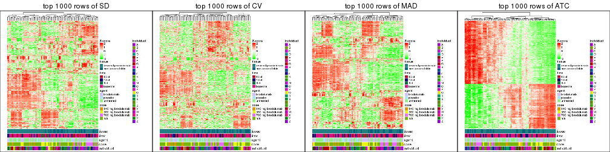</p>

</div>
<div id='tab-top-rows-heatmap-2'>
<pre><code class="r">top_rows_heatmap(res_list, top_n = 2000)
</code></pre>

<p></p>

</div>
<div id='tab-top-rows-heatmap-3'>
<pre><code class="r">top_rows_heatmap(res_list, top_n = 3000)
</code></pre>

<p></p>

</div>
<div id='tab-top-rows-heatmap-4'>
<pre><code class="r">top_rows_heatmap(res_list, top_n = 4000)
</code></pre>

<p></p>

</div>
<div id='tab-top-rows-heatmap-5'>
<pre><code class="r">top_rows_heatmap(res_list, top_n = 5000)
</code></pre>

<p></p>

</div>
</div>


### Test to known annotations


Test correlation between subgroups and known annotations. If the known
annotation is numeric, one-way ANOVA test is applied, and if the known
annotation is discrete, chi-squared contingency table test is applied.


<script>
$( function() {
	$( '#tabs-test-to-known-factors-from-consensus-partition-list' ).tabs();
} );
</script>
<div id='tabs-test-to-known-factors-from-consensus-partition-list'>
<ul>
<li><a href='#tab-test-to-known-factors-from-consensus-partition-list-1'>k = 2</a></li>
<li><a href='#tab-test-to-known-factors-from-consensus-partition-list-2'>k = 3</a></li>
<li><a href='#tab-test-to-known-factors-from-consensus-partition-list-3'>k = 4</a></li>
<li><a href='#tab-test-to-known-factors-from-consensus-partition-list-4'>k = 5</a></li>
<li><a href='#tab-test-to-known-factors-from-consensus-partition-list-5'>k = 6</a></li>
</ul>
<div id='tab-test-to-known-factors-from-consensus-partition-list-1'>
<pre><code class="r">test_to_known_factors(res_list, k = 2)
</code></pre>

<pre><code>#&gt;              n tissue(p) time(p) agent(p)  dose(p) individual(p) k
#&gt; SD:NMF      98   0.01332 0.12424   0.7066 1.03e-06      2.80e-03 2
#&gt; CV:NMF      96   0.00614 0.10600   0.8284 3.64e-06      4.26e-03 2
#&gt; MAD:NMF     96   0.04393 0.08622   0.5448 9.92e-07      3.71e-04 2
#&gt; ATC:NMF     98   0.82115 0.09866   0.7101 4.33e-06      8.62e-05 2
#&gt; SD:skmeans  97   0.02132 0.09662   0.6464 1.83e-06      1.53e-03 2
#&gt; CV:skmeans  94   0.00267 0.15640   0.7749 1.93e-06      6.19e-03 2
#&gt; MAD:skmeans 93   0.04700 0.10906   0.7353 2.08e-06      7.18e-04 2
#&gt; ATC:skmeans 99   0.78077 0.09173   0.6564 4.03e-06      9.83e-05 2
#&gt; SD:mclust   97   0.31189 0.03558   0.7813 4.61e-04      4.28e-07 2
#&gt; CV:mclust   96   0.08116 0.30546   0.0679 9.22e-07      5.12e-03 2
#&gt; MAD:mclust  50   0.49604 0.10975   0.3229 3.16e-05      4.22e-05 2
#&gt; ATC:mclust  99   1.00000 0.00374   0.6508 7.14e-05      1.73e-10 2
#&gt; SD:kmeans   98   0.01755 0.19258   0.3099 4.41e-07      1.57e-03 2
#&gt; CV:kmeans   96   0.00833 0.23703   0.1662 4.04e-07      1.28e-03 2
#&gt; MAD:kmeans  97   0.02811 0.17663   0.2818 3.51e-07      8.99e-04 2
#&gt; ATC:kmeans  99   0.97141 0.10095   0.6449 2.49e-05      3.97e-04 2
#&gt; SD:pam      97   0.91470 0.05081   0.6488 1.74e-05      5.77e-07 2
#&gt; CV:pam      50   0.00163 0.51011   0.1135 3.30e-03      2.09e-02 2
#&gt; MAD:pam     99   0.92500 0.03967   0.6523 8.96e-06      1.16e-07 2
#&gt; ATC:pam     86   0.90241 0.06481   0.5796 1.69e-05      1.22e-05 2
#&gt; SD:hclust   81   0.06548 0.10792   0.1221 5.04e-08      1.27e-03 2
#&gt; CV:hclust   84   0.05021 0.12297   0.1476 5.78e-08      4.69e-04 2
#&gt; MAD:hclust  81   0.03903 0.18087   0.0887 7.22e-08      2.60e-03 2
#&gt; ATC:hclust  91   0.51924 0.10241   0.7073 2.12e-05      4.11e-04 2
</code></pre>

</div>
<div id='tab-test-to-known-factors-from-consensus-partition-list-2'>
<pre><code class="r">test_to_known_factors(res_list, k = 3)
</code></pre>

<pre><code>#&gt;              n tissue(p) time(p) agent(p)  dose(p) individual(p) k
#&gt; SD:NMF      95  1.25e-03 0.20050  0.02270 2.79e-09      1.41e-05 3
#&gt; CV:NMF      94  1.52e-03 0.06479  0.00783 6.44e-10      6.58e-07 3
#&gt; MAD:NMF     95  8.19e-04 0.17901  0.01069 9.41e-10      5.49e-06 3
#&gt; ATC:NMF     96  6.35e-02 0.08261  0.85556 4.35e-06      2.64e-06 3
#&gt; SD:skmeans  98  2.15e-04 0.09482  0.00878 7.38e-09      3.95e-06 3
#&gt; CV:skmeans  92  1.98e-04 0.14055  0.01357 1.93e-08      6.66e-07 3
#&gt; MAD:skmeans 98  2.92e-04 0.08705  0.01369 1.07e-08      1.82e-06 3
#&gt; ATC:skmeans 97  2.43e-01 0.12961  0.92500 5.81e-07      1.04e-06 3
#&gt; SD:mclust   90  4.29e-04 0.04536  0.00638 3.71e-09      1.32e-07 3
#&gt; CV:mclust   87  9.12e-04 0.10933  0.01545 7.11e-09      7.56e-06 3
#&gt; MAD:mclust  99  5.86e-04 0.08731  0.00650 9.07e-09      1.87e-06 3
#&gt; ATC:mclust  99  6.66e-01 0.01005  0.67836 9.51e-07      1.83e-16 3
#&gt; SD:kmeans   98  1.71e-03 0.02278  0.00703 1.44e-09      1.50e-08 3
#&gt; CV:kmeans   98  1.03e-03 0.12963  0.00319 1.77e-09      9.50e-08 3
#&gt; MAD:kmeans  95  4.28e-03 0.02821  0.00738 2.66e-09      1.38e-08 3
#&gt; ATC:kmeans  99  5.23e-01 0.00303  0.41319 1.18e-05      1.51e-06 3
#&gt; SD:pam      92  6.16e-03 0.02361  0.01176 7.56e-08      6.82e-08 3
#&gt; CV:pam      92  1.82e-02 0.04180  0.02753 1.28e-07      1.84e-07 3
#&gt; MAD:pam     95  3.04e-03 0.01749  0.02335 1.40e-07      4.34e-08 3
#&gt; ATC:pam     95  4.69e-01 0.00350  0.41251 1.53e-05      2.74e-06 3
#&gt; SD:hclust   88  9.62e-05 0.03009  0.15850 7.96e-11      5.72e-04 3
#&gt; CV:hclust   82  2.42e-04 0.02677  0.04893 3.65e-11      1.59e-04 3
#&gt; MAD:hclust  66  8.72e-03 0.02112  0.21750 1.47e-08      5.19e-05 3
#&gt; ATC:hclust  94  3.33e-01 0.13399  0.51421 2.05e-05      3.43e-04 3
</code></pre>

</div>
<div id='tab-test-to-known-factors-from-consensus-partition-list-3'>
<pre><code class="r">test_to_known_factors(res_list, k = 4)
</code></pre>

<pre><code>#&gt;              n tissue(p) time(p) agent(p)  dose(p) individual(p) k
#&gt; SD:NMF      89  1.39e-03  0.3857 0.009284 1.76e-08      8.72e-09 4
#&gt; CV:NMF      86  1.84e-03  0.3345 0.008261 4.12e-08      4.29e-09 4
#&gt; MAD:NMF     88  1.71e-03  0.3431 0.022341 2.08e-08      3.05e-08 4
#&gt; ATC:NMF     91  1.10e-01  0.0575 0.563951 6.90e-07      7.61e-10 4
#&gt; SD:skmeans  94  9.59e-05  0.2752 0.002733 3.96e-10      5.27e-05 4
#&gt; CV:skmeans  61  3.35e-02  0.0916 0.004780 3.69e-06      1.22e-03 4
#&gt; MAD:skmeans 99  4.18e-05  0.1178 0.003058 1.00e-10      5.61e-05 4
#&gt; ATC:skmeans 87  1.38e-01  0.0690 0.272413 3.70e-07      3.23e-11 4
#&gt; SD:mclust   78  7.47e-03  0.0691 0.083152 4.16e-07      2.20e-07 4
#&gt; CV:mclust   68  1.58e-02  0.1761 0.004014 3.46e-08      2.54e-07 4
#&gt; MAD:mclust  63  3.38e-02  0.2615 0.077091 5.41e-06      3.04e-07 4
#&gt; ATC:mclust  99  7.21e-02  0.0201 0.203164 1.94e-09      5.15e-14 4
#&gt; SD:kmeans   83  2.35e-05  0.5483 0.004578 7.26e-09      1.48e-04 4
#&gt; CV:kmeans   72  1.29e-04  0.0524 0.005288 4.79e-06      1.79e-05 4
#&gt; MAD:kmeans  81  1.00e-04  0.5558 0.006490 1.90e-09      2.22e-05 4
#&gt; ATC:kmeans  96  5.86e-01  0.0701 0.451400 1.65e-05      5.83e-08 4
#&gt; SD:pam      84  3.72e-05  0.0184 0.025073 7.63e-08      9.02e-05 4
#&gt; CV:pam      77  1.40e-06  0.0353 0.092440 1.15e-05      1.01e-04 4
#&gt; MAD:pam     95  3.28e-04  0.1725 0.015729 6.47e-08      4.03e-05 4
#&gt; ATC:pam     86  8.95e-01  0.0912 0.082407 4.59e-07      5.16e-08 4
#&gt; SD:hclust   70  7.61e-04  0.2827 0.002001 6.46e-07      1.34e-04 4
#&gt; CV:hclust   79  4.77e-05  0.1667 0.012697 4.91e-09      2.64e-05 4
#&gt; MAD:hclust  82  1.94e-03  0.1470 0.000135 8.49e-09      1.84e-04 4
#&gt; ATC:hclust  98  1.49e-01  0.1308 0.676597 1.36e-04      2.90e-04 4
</code></pre>

</div>
<div id='tab-test-to-known-factors-from-consensus-partition-list-4'>
<pre><code class="r">test_to_known_factors(res_list, k = 5)
</code></pre>

<pre><code>#&gt;              n tissue(p) time(p) agent(p)  dose(p) individual(p) k
#&gt; SD:NMF      88  3.07e-03  0.2091  0.09137 2.98e-07      2.41e-08 5
#&gt; CV:NMF      87  3.73e-03  0.3843  0.26943 6.49e-07      3.25e-08 5
#&gt; MAD:NMF     91  2.65e-03  0.2701  0.17981 8.21e-08      8.09e-09 5
#&gt; ATC:NMF     88  1.60e-01  0.0701  0.41231 2.85e-06      1.21e-07 5
#&gt; SD:skmeans  90  1.49e-04  0.2527  0.04283 1.08e-07      8.18e-06 5
#&gt; CV:skmeans  87  4.20e-05  0.5135  0.05125 2.07e-07      4.60e-07 5
#&gt; MAD:skmeans 94  5.12e-05  0.3170  0.02353 7.87e-08      1.60e-05 5
#&gt; ATC:skmeans 81  4.09e-01  0.2768  0.12452 8.59e-07      2.92e-13 5
#&gt; SD:mclust   96  2.41e-05  0.5305  0.05245 1.66e-09      4.79e-07 5
#&gt; CV:mclust   76  1.11e-04  0.5185  0.19781 3.27e-07      1.34e-06 5
#&gt; MAD:mclust  93  4.57e-05  0.4726  0.02951 6.96e-10      5.63e-07 5
#&gt; ATC:mclust  98  1.37e-02  0.0271  0.07051 5.50e-10      3.18e-10 5
#&gt; SD:kmeans   78  2.08e-04  0.2435  0.04055 2.45e-06      5.35e-05 5
#&gt; CV:kmeans   84  6.44e-05  0.2446  0.09096 2.60e-08      4.48e-05 5
#&gt; MAD:kmeans  87  1.25e-04  0.3311  0.01999 5.74e-08      5.60e-05 5
#&gt; ATC:kmeans  90  1.25e-02  0.0534  0.52117 1.64e-04      3.33e-07 5
#&gt; SD:pam      73  7.44e-04  0.2673  0.04959 3.06e-08      5.34e-06 5
#&gt; CV:pam      91  1.70e-05  0.1135  0.17976 8.52e-08      1.82e-08 5
#&gt; MAD:pam     92  5.65e-04  0.1533  0.02102 1.13e-07      5.35e-05 5
#&gt; ATC:pam     87  9.00e-03  0.2425  0.22263 3.08e-06      1.80e-06 5
#&gt; SD:hclust   77  3.37e-04  0.2773  0.16677 6.92e-09      4.55e-06 5
#&gt; CV:hclust   81  4.91e-04  0.1810  0.06265 1.43e-08      2.81e-08 5
#&gt; MAD:hclust  82  1.48e-04  0.1220  0.00476 8.38e-07      1.43e-04 5
#&gt; ATC:hclust  99  1.47e-01  0.0209  0.73084 3.70e-05      2.57e-07 5
</code></pre>

</div>
<div id='tab-test-to-known-factors-from-consensus-partition-list-5'>
<pre><code class="r">test_to_known_factors(res_list, k = 6)
</code></pre>

<pre><code>#&gt;              n tissue(p) time(p) agent(p)  dose(p) individual(p) k
#&gt; SD:NMF      84  3.29e-02  0.0655  0.08509 7.51e-09      7.60e-08 6
#&gt; CV:NMF      72  2.23e-02  0.2778  0.12889 1.83e-08      2.83e-08 6
#&gt; MAD:NMF     82  2.87e-02  0.1962  0.07321 2.64e-08      1.23e-07 6
#&gt; ATC:NMF     79  9.19e-02  0.1397  0.51636 8.68e-05      5.74e-09 6
#&gt; SD:skmeans  90  3.49e-04  0.1046  0.23699 2.70e-06      7.88e-06 6
#&gt; CV:skmeans  84  9.19e-05  0.5458  0.14642 6.41e-07      1.18e-06 6
#&gt; MAD:skmeans 97  2.35e-04  0.1448  0.10802 3.47e-07      3.45e-05 6
#&gt; ATC:skmeans 82  1.38e-02  0.6681  0.26467 3.73e-06      1.52e-09 6
#&gt; SD:mclust   85  3.06e-04  0.3664  0.30681 1.02e-06      5.15e-07 6
#&gt; CV:mclust   91  4.17e-04  0.6910  0.37174 4.40e-07      9.00e-06 6
#&gt; MAD:mclust  92  8.03e-04  0.3884  0.18018 5.82e-08      3.63e-06 6
#&gt; ATC:mclust  92  1.44e-02  0.0107  0.02033 1.59e-08      3.81e-08 6
#&gt; SD:kmeans   97  8.78e-05  0.1900  0.06137 5.51e-07      4.76e-06 6
#&gt; CV:kmeans   84  1.12e-04  0.2974  0.20704 2.22e-08      2.66e-06 6
#&gt; MAD:kmeans  97  6.48e-05  0.1362  0.08301 7.95e-07      7.79e-06 6
#&gt; ATC:kmeans  84  6.85e-03  0.1171  0.43544 5.00e-05      4.62e-07 6
#&gt; SD:pam      88  2.04e-04  0.1396  0.17381 6.20e-06      1.27e-07 6
#&gt; CV:pam      85  1.20e-04  0.3799  0.38054 1.59e-06      1.98e-08 6
#&gt; MAD:pam     84  4.81e-05  0.3129  0.01151 1.77e-09      6.83e-05 6
#&gt; ATC:pam     88  4.55e-02  0.1371  0.30018 6.25e-05      6.79e-08 6
#&gt; SD:hclust   77  1.21e-03  0.4201  0.24530 1.78e-09      9.81e-12 6
#&gt; CV:hclust   71  2.76e-04  0.1167  0.17128 1.80e-09      6.96e-06 6
#&gt; MAD:hclust  68  1.14e-02  0.3139  0.00947 5.73e-05      2.85e-06 6
#&gt; ATC:hclust  98  2.11e-01  0.0234  0.83176 1.80e-04      1.40e-08 6
</code></pre>

</div>
</div>


 
## Results for each method


---------------------------------------------------


### SD:hclust


The object with results only for a single top-value method and a single partition method 
can be extracted as:

```r
res = res_list["SD", "hclust"]
# you can also extract it by
# res = res_list["SD:hclust"]
```

A summary of `res` and all the functions that can be applied to it:

```r
res
```

```
#> A 'ConsensusPartition' object with k = 2, 3, 4, 5, 6.
#>   On a matrix with 45638 rows and 99 columns.
#>   Top rows (1000, 2000, 3000, 4000, 5000) are extracted by 'SD' method.
#>   Subgroups are detected by 'hclust' method.
#>   Performed in total 1250 partitions by row resampling.
#>   Best k for subgroups seems to be 2.
#> 
#> Following methods can be applied to this 'ConsensusPartition' object:
#>  [1] "cola_report"             "collect_classes"         "collect_plots"          
#>  [4] "collect_stats"           "colnames"                "compare_signatures"     
#>  [7] "consensus_heatmap"       "dimension_reduction"     "functional_enrichment"  
#> [10] "get_anno_col"            "get_anno"                "get_classes"            
#> [13] "get_consensus"           "get_matrix"              "get_membership"         
#> [16] "get_param"               "get_signatures"          "get_stats"              
#> [19] "is_best_k"               "is_stable_k"             "membership_heatmap"     
#> [22] "ncol"                    "nrow"                    "plot_ecdf"              
#> [25] "rownames"                "select_partition_number" "show"                   
#> [28] "suggest_best_k"          "test_to_known_factors"
```

`collect_plots()` function collects all the plots made from `res` for all `k` (number of partitions)
into one single page to provide an easy and fast comparison between different `k`.

```r
collect_plots(res)
```


The plots are:

- The first row: a plot of the ECDF (empirical cumulative distribution
  function) curves of the consensus matrix for each `k` and the heatmap of
  predicted classes for each `k`.
- The second row: heatmaps of the consensus matrix for each `k`.
- The third row: heatmaps of the membership matrix for each `k`.
- The fouth row: heatmaps of the signatures for each `k`.

All the plots in panels can be made by individual functions and they are
plotted later in this section.

`select_partition_number()` produces several plots showing different
statistics for choosing "optimized" `k`. There are following statistics:

- ECDF curves of the consensus matrix for each `k`;
- 1-PAC. [The PAC
  score](https://en.wikipedia.org/wiki/Consensus_clustering#Over-interpretation_potential_of_consensus_clustering)
  measures the proportion of the ambiguous subgrouping.
- Mean silhouette score.
- Concordance. The mean probability of fiting the consensus class ids in all
  partitions.
- Area increased. Denote $A_k$ as the area under the ECDF curve for current
  `k`, the area increased is defined as $A_k - A_{k-1}$.
- Rand index. The percent of pairs of samples that are both in a same cluster
  or both are not in a same cluster in the partition of k and k-1.
- Jaccard index. The ratio of pairs of samples are both in a same cluster in
  the partition of k and k-1 and the pairs of samples are both in a same
  cluster in the partition k or k-1.

The detailed explanations of these statistics can be found in [the _cola_
vignette](http://bioconductor.org/packages/devel/bioc/vignettes/cola/inst/doc/cola.html#toc_13).

Generally speaking, lower PAC score, higher mean silhouette score or higher
concordance corresponds to better partition. Rand index and Jaccard index
measure how similar the current partition is compared to partition with `k-1`.
If they are too similar, we won't accept `k` is better than `k-1`.

```r
select_partition_number(res)
```


The numeric values for all these statistics can be obtained by `get_stats()`.

```r
get_stats(res)
```

```
#>   k 1-PAC mean_silhouette concordance area_increased  Rand Jaccard
#> 2 2 0.266           0.670       0.846         0.4560 0.504   0.504
#> 3 3 0.472           0.722       0.821         0.4103 0.855   0.712
#> 4 4 0.600           0.662       0.817         0.1461 0.822   0.546
#> 5 5 0.706           0.670       0.815         0.0663 0.928   0.724
#> 6 6 0.757           0.632       0.796         0.0324 0.978   0.891
```

`suggest_best_k()` suggests the best $k$ based on these statistics. The rules are as follows:

- All $k$ with Jaccard index larger than 0.95 are removed because increasing
  $k$ does not provide enough extra information. If all $k$ are removed, it is
  marked as no subgroup is detected.
- For all $k$ with 1-PAC score larger than 0.9, the maximal $k$ is taken as
  the best $k$, and other $k$ are marked as optional $k$.
- If it does not fit the second rule. The $k$ with the maximal vote of the
  highest 1-PAC score, highest mean silhouette, and highest concordance is
  taken as the best $k$.

```r
suggest_best_k(res)
```

```
#> [1] 2
```


Following shows the table of the partitions (You need to click the **show/hide
code output** link to see it). The membership matrix (columns with name `p*`)
is inferred by
[`clue::cl_consensus()`](https://www.rdocumentation.org/link/cl_consensus?package=clue)
function with the `SE` method. Basically the value in the membership matrix
represents the probability to belong to a certain group. The finall class
label for an item is determined with the group with highest probability it
belongs to.

In `get_classes()` function, the entropy is calculated from the membership
matrix and the silhouette score is calculated from the consensus matrix.


<script>
$( function() {
	$( '#tabs-SD-hclust-get-classes' ).tabs();
} );
</script>
<div id='tabs-SD-hclust-get-classes'>
<ul>
<li><a href='#tab-SD-hclust-get-classes-1'>k = 2</a></li>
<li><a href='#tab-SD-hclust-get-classes-2'>k = 3</a></li>
<li><a href='#tab-SD-hclust-get-classes-3'>k = 4</a></li>
<li><a href='#tab-SD-hclust-get-classes-4'>k = 5</a></li>
<li><a href='#tab-SD-hclust-get-classes-5'>k = 6</a></li>
</ul>

<div id='tab-SD-hclust-get-classes-1'>
<p><a id='tab-SD-hclust-get-classes-1-a' style='color:#0366d6' href='#'>show/hide code output</a></p>
<pre><code class="r">cbind(get_classes(res, k = 2), get_membership(res, k = 2))
</code></pre>

<pre><code>#&gt;            class entropy silhouette    p1    p2
#&gt; GSM1296094     2  0.8661      0.520 0.288 0.712
#&gt; GSM1296119     2  0.0000      0.810 0.000 1.000
#&gt; GSM1296076     2  0.0000      0.810 0.000 1.000
#&gt; GSM1296092     2  0.0000      0.810 0.000 1.000
#&gt; GSM1296103     2  0.8661      0.520 0.288 0.712
#&gt; GSM1296078     2  0.0000      0.810 0.000 1.000
#&gt; GSM1296107     2  0.0000      0.810 0.000 1.000
#&gt; GSM1296109     2  0.0000      0.810 0.000 1.000
#&gt; GSM1296080     1  0.9635      0.418 0.612 0.388
#&gt; GSM1296090     2  0.0000      0.810 0.000 1.000
#&gt; GSM1296074     2  0.0000      0.810 0.000 1.000
#&gt; GSM1296111     2  0.0000      0.810 0.000 1.000
#&gt; GSM1296099     2  0.7139      0.679 0.196 0.804
#&gt; GSM1296086     2  0.5629      0.751 0.132 0.868
#&gt; GSM1296117     2  0.0000      0.810 0.000 1.000
#&gt; GSM1296113     2  0.0000      0.810 0.000 1.000
#&gt; GSM1296096     2  0.7139      0.679 0.196 0.804
#&gt; GSM1296105     1  0.9661      0.445 0.608 0.392
#&gt; GSM1296098     1  0.9775      0.356 0.588 0.412
#&gt; GSM1296101     2  0.6887      0.684 0.184 0.816
#&gt; GSM1296121     2  0.0000      0.810 0.000 1.000
#&gt; GSM1296088     2  0.6801      0.704 0.180 0.820
#&gt; GSM1296082     2  0.0000      0.810 0.000 1.000
#&gt; GSM1296115     2  0.0000      0.810 0.000 1.000
#&gt; GSM1296084     1  0.4939      0.728 0.892 0.108
#&gt; GSM1296072     2  0.7602      0.703 0.220 0.780
#&gt; GSM1296069     2  0.6712      0.747 0.176 0.824
#&gt; GSM1296071     2  0.6801      0.744 0.180 0.820
#&gt; GSM1296070     2  0.6712      0.747 0.176 0.824
#&gt; GSM1296073     2  0.0000      0.810 0.000 1.000
#&gt; GSM1296034     1  0.1184      0.754 0.984 0.016
#&gt; GSM1296041     2  0.0000      0.810 0.000 1.000
#&gt; GSM1296035     2  0.7139      0.679 0.196 0.804
#&gt; GSM1296038     2  0.3431      0.789 0.064 0.936
#&gt; GSM1296047     2  0.7602      0.703 0.220 0.780
#&gt; GSM1296039     2  0.0000      0.810 0.000 1.000
#&gt; GSM1296042     2  0.0000      0.810 0.000 1.000
#&gt; GSM1296043     2  0.6712      0.747 0.176 0.824
#&gt; GSM1296037     1  0.0000      0.757 1.000 0.000
#&gt; GSM1296046     2  0.6801      0.744 0.180 0.820
#&gt; GSM1296044     2  0.6801      0.744 0.180 0.820
#&gt; GSM1296045     2  0.6712      0.747 0.176 0.824
#&gt; GSM1296025     1  0.0000      0.757 1.000 0.000
#&gt; GSM1296033     1  0.7745      0.655 0.772 0.228
#&gt; GSM1296027     1  0.0000      0.757 1.000 0.000
#&gt; GSM1296032     1  0.0000      0.757 1.000 0.000
#&gt; GSM1296024     1  0.0000      0.757 1.000 0.000
#&gt; GSM1296031     1  0.8861      0.575 0.696 0.304
#&gt; GSM1296028     1  0.0000      0.757 1.000 0.000
#&gt; GSM1296029     1  0.4298      0.735 0.912 0.088
#&gt; GSM1296026     2  0.9460      0.323 0.364 0.636
#&gt; GSM1296030     1  0.9775      0.361 0.588 0.412
#&gt; GSM1296040     1  0.9427      0.478 0.640 0.360
#&gt; GSM1296036     1  0.9775      0.356 0.588 0.412
#&gt; GSM1296048     2  0.0000      0.810 0.000 1.000
#&gt; GSM1296059     2  0.8661      0.520 0.288 0.712
#&gt; GSM1296066     2  0.0000      0.810 0.000 1.000
#&gt; GSM1296060     2  0.7139      0.679 0.196 0.804
#&gt; GSM1296063     2  0.3431      0.789 0.064 0.936
#&gt; GSM1296064     2  0.0000      0.810 0.000 1.000
#&gt; GSM1296067     2  0.8327      0.639 0.264 0.736
#&gt; GSM1296062     1  0.9427      0.470 0.640 0.360
#&gt; GSM1296068     2  0.6801      0.744 0.180 0.820
#&gt; GSM1296050     1  0.1184      0.753 0.984 0.016
#&gt; GSM1296057     1  0.8713      0.600 0.708 0.292
#&gt; GSM1296052     1  0.0000      0.757 1.000 0.000
#&gt; GSM1296054     1  0.0000      0.757 1.000 0.000
#&gt; GSM1296049     1  0.0000      0.757 1.000 0.000
#&gt; GSM1296055     1  0.8909      0.571 0.692 0.308
#&gt; GSM1296053     1  0.0000      0.757 1.000 0.000
#&gt; GSM1296058     1  0.9922      0.304 0.552 0.448
#&gt; GSM1296051     2  0.9460      0.323 0.364 0.636
#&gt; GSM1296056     2  0.0938      0.807 0.012 0.988
#&gt; GSM1296065     1  0.9922      0.304 0.552 0.448
#&gt; GSM1296061     1  0.9775      0.356 0.588 0.412
#&gt; GSM1296095     2  0.9209      0.488 0.336 0.664
#&gt; GSM1296120     2  0.7602      0.703 0.220 0.780
#&gt; GSM1296077     1  0.0000      0.757 1.000 0.000
#&gt; GSM1296093     1  0.0000      0.757 1.000 0.000
#&gt; GSM1296104     1  0.9944      0.280 0.544 0.456
#&gt; GSM1296079     1  0.0000      0.757 1.000 0.000
#&gt; GSM1296108     2  0.6801      0.744 0.180 0.820
#&gt; GSM1296110     2  0.8327      0.639 0.264 0.736
#&gt; GSM1296081     1  0.0000      0.757 1.000 0.000
#&gt; GSM1296091     1  0.9460      0.498 0.636 0.364
#&gt; GSM1296075     1  0.9710      0.426 0.600 0.400
#&gt; GSM1296112     2  0.6801      0.744 0.180 0.820
#&gt; GSM1296100     1  0.0000      0.757 1.000 0.000
#&gt; GSM1296087     1  0.0376      0.756 0.996 0.004
#&gt; GSM1296118     2  0.8861      0.568 0.304 0.696
#&gt; GSM1296114     2  0.6801      0.744 0.180 0.820
#&gt; GSM1296097     1  0.9922      0.304 0.552 0.448
#&gt; GSM1296106     1  0.9922      0.304 0.552 0.448
#&gt; GSM1296102     1  0.4815      0.727 0.896 0.104
#&gt; GSM1296122     2  0.9044      0.535 0.320 0.680
#&gt; GSM1296089     1  0.8861      0.575 0.696 0.304
#&gt; GSM1296083     1  0.0000      0.757 1.000 0.000
#&gt; GSM1296116     2  0.6801      0.744 0.180 0.820
#&gt; GSM1296085     1  0.0000      0.757 1.000 0.000
</code></pre>

<script>
$('#tab-SD-hclust-get-classes-1-a').parent().next().next().hide();
$('#tab-SD-hclust-get-classes-1-a').click(function(){
  $('#tab-SD-hclust-get-classes-1-a').parent().next().next().toggle();
  return(false);
});
</script>
</div>

<div id='tab-SD-hclust-get-classes-2'>
<p><a id='tab-SD-hclust-get-classes-2-a' style='color:#0366d6' href='#'>show/hide code output</a></p>
<pre><code class="r">cbind(get_classes(res, k = 3), get_membership(res, k = 3))
</code></pre>

<pre><code>#&gt;            class entropy silhouette    p1    p2    p3
#&gt; GSM1296094     3  0.6402      0.568 0.236 0.040 0.724
#&gt; GSM1296119     3  0.4750      0.759 0.000 0.216 0.784
#&gt; GSM1296076     3  0.2356      0.805 0.000 0.072 0.928
#&gt; GSM1296092     3  0.2356      0.805 0.000 0.072 0.928
#&gt; GSM1296103     3  0.6402      0.568 0.236 0.040 0.724
#&gt; GSM1296078     3  0.2356      0.805 0.000 0.072 0.928
#&gt; GSM1296107     3  0.4750      0.759 0.000 0.216 0.784
#&gt; GSM1296109     3  0.3816      0.793 0.000 0.148 0.852
#&gt; GSM1296080     1  0.7430      0.385 0.540 0.036 0.424
#&gt; GSM1296090     3  0.2356      0.805 0.000 0.072 0.928
#&gt; GSM1296074     3  0.2356      0.805 0.000 0.072 0.928
#&gt; GSM1296111     3  0.4750      0.759 0.000 0.216 0.784
#&gt; GSM1296099     3  0.5816      0.699 0.156 0.056 0.788
#&gt; GSM1296086     3  0.5285      0.747 0.112 0.064 0.824
#&gt; GSM1296117     3  0.4750      0.759 0.000 0.216 0.784
#&gt; GSM1296113     3  0.4750      0.759 0.000 0.216 0.784
#&gt; GSM1296096     3  0.5816      0.699 0.156 0.056 0.788
#&gt; GSM1296105     1  0.9231      0.582 0.532 0.252 0.216
#&gt; GSM1296098     1  0.7471      0.334 0.516 0.036 0.448
#&gt; GSM1296101     3  0.5435      0.715 0.144 0.048 0.808
#&gt; GSM1296121     3  0.4750      0.759 0.000 0.216 0.784
#&gt; GSM1296088     3  0.5696      0.705 0.148 0.056 0.796
#&gt; GSM1296082     3  0.2356      0.805 0.000 0.072 0.928
#&gt; GSM1296115     3  0.4750      0.759 0.000 0.216 0.784
#&gt; GSM1296084     1  0.5357      0.745 0.820 0.064 0.116
#&gt; GSM1296072     2  0.2176      0.944 0.032 0.948 0.020
#&gt; GSM1296069     2  0.1163      0.957 0.000 0.972 0.028
#&gt; GSM1296071     2  0.1031      0.959 0.000 0.976 0.024
#&gt; GSM1296070     2  0.1163      0.957 0.000 0.972 0.028
#&gt; GSM1296073     3  0.4750      0.759 0.000 0.216 0.784
#&gt; GSM1296034     1  0.1315      0.771 0.972 0.020 0.008
#&gt; GSM1296041     3  0.4750      0.759 0.000 0.216 0.784
#&gt; GSM1296035     3  0.5816      0.699 0.156 0.056 0.788
#&gt; GSM1296038     3  0.2301      0.788 0.004 0.060 0.936
#&gt; GSM1296047     2  0.2176      0.944 0.032 0.948 0.020
#&gt; GSM1296039     3  0.2356      0.805 0.000 0.072 0.928
#&gt; GSM1296042     3  0.4750      0.759 0.000 0.216 0.784
#&gt; GSM1296043     2  0.1163      0.957 0.000 0.972 0.028
#&gt; GSM1296037     1  0.0747      0.772 0.984 0.000 0.016
#&gt; GSM1296046     2  0.1031      0.959 0.000 0.976 0.024
#&gt; GSM1296044     2  0.1031      0.959 0.000 0.976 0.024
#&gt; GSM1296045     2  0.1163      0.957 0.000 0.972 0.028
#&gt; GSM1296025     1  0.0000      0.773 1.000 0.000 0.000
#&gt; GSM1296033     1  0.7397      0.701 0.704 0.148 0.148
#&gt; GSM1296027     1  0.0000      0.773 1.000 0.000 0.000
#&gt; GSM1296032     1  0.0000      0.773 1.000 0.000 0.000
#&gt; GSM1296024     1  0.0000      0.773 1.000 0.000 0.000
#&gt; GSM1296031     1  0.7467      0.550 0.624 0.320 0.056
#&gt; GSM1296028     1  0.0000      0.773 1.000 0.000 0.000
#&gt; GSM1296029     1  0.4737      0.752 0.852 0.064 0.084
#&gt; GSM1296026     3  0.6897      0.406 0.292 0.040 0.668
#&gt; GSM1296030     1  0.7561      0.243 0.516 0.040 0.444
#&gt; GSM1296040     1  0.8775      0.576 0.568 0.152 0.280
#&gt; GSM1296036     1  0.7471      0.334 0.516 0.036 0.448
#&gt; GSM1296048     3  0.4750      0.759 0.000 0.216 0.784
#&gt; GSM1296059     3  0.6402      0.568 0.236 0.040 0.724
#&gt; GSM1296066     3  0.4750      0.759 0.000 0.216 0.784
#&gt; GSM1296060     3  0.5816      0.699 0.156 0.056 0.788
#&gt; GSM1296063     3  0.2200      0.789 0.004 0.056 0.940
#&gt; GSM1296064     3  0.2356      0.805 0.000 0.072 0.928
#&gt; GSM1296067     2  0.3183      0.906 0.076 0.908 0.016
#&gt; GSM1296062     1  0.7353      0.433 0.568 0.036 0.396
#&gt; GSM1296068     2  0.1031      0.959 0.000 0.976 0.024
#&gt; GSM1296050     1  0.0892      0.768 0.980 0.020 0.000
#&gt; GSM1296057     1  0.8250      0.644 0.628 0.232 0.140
#&gt; GSM1296052     1  0.0000      0.773 1.000 0.000 0.000
#&gt; GSM1296054     1  0.0000      0.773 1.000 0.000 0.000
#&gt; GSM1296049     1  0.0000      0.773 1.000 0.000 0.000
#&gt; GSM1296055     1  0.7580      0.522 0.604 0.340 0.056
#&gt; GSM1296053     1  0.0000      0.773 1.000 0.000 0.000
#&gt; GSM1296058     1  0.9598      0.516 0.468 0.304 0.228
#&gt; GSM1296051     3  0.6897      0.406 0.292 0.040 0.668
#&gt; GSM1296056     3  0.1964      0.802 0.000 0.056 0.944
#&gt; GSM1296065     1  0.9355      0.496 0.480 0.340 0.180
#&gt; GSM1296061     1  0.7471      0.334 0.516 0.036 0.448
#&gt; GSM1296095     3  0.9760     -0.077 0.276 0.280 0.444
#&gt; GSM1296120     2  0.2176      0.944 0.032 0.948 0.020
#&gt; GSM1296077     1  0.0000      0.773 1.000 0.000 0.000
#&gt; GSM1296093     1  0.0000      0.773 1.000 0.000 0.000
#&gt; GSM1296104     1  0.9648      0.508 0.460 0.304 0.236
#&gt; GSM1296079     1  0.0000      0.773 1.000 0.000 0.000
#&gt; GSM1296108     2  0.1031      0.959 0.000 0.976 0.024
#&gt; GSM1296110     2  0.3183      0.906 0.076 0.908 0.016
#&gt; GSM1296081     1  0.0000      0.773 1.000 0.000 0.000
#&gt; GSM1296091     1  0.8677      0.583 0.572 0.288 0.140
#&gt; GSM1296075     1  0.8902      0.542 0.536 0.320 0.144
#&gt; GSM1296112     2  0.1031      0.959 0.000 0.976 0.024
#&gt; GSM1296100     1  0.0747      0.772 0.984 0.000 0.016
#&gt; GSM1296087     1  0.0661      0.774 0.988 0.004 0.008
#&gt; GSM1296118     2  0.3607      0.864 0.112 0.880 0.008
#&gt; GSM1296114     2  0.1031      0.959 0.000 0.976 0.024
#&gt; GSM1296097     1  0.9598      0.516 0.468 0.304 0.228
#&gt; GSM1296106     1  0.9355      0.496 0.480 0.340 0.180
#&gt; GSM1296102     1  0.4891      0.729 0.836 0.124 0.040
#&gt; GSM1296122     2  0.3965      0.836 0.132 0.860 0.008
#&gt; GSM1296089     1  0.7467      0.550 0.624 0.320 0.056
#&gt; GSM1296083     1  0.0000      0.773 1.000 0.000 0.000
#&gt; GSM1296116     2  0.1031      0.959 0.000 0.976 0.024
#&gt; GSM1296085     1  0.0000      0.773 1.000 0.000 0.000
</code></pre>

<script>
$('#tab-SD-hclust-get-classes-2-a').parent().next().next().hide();
$('#tab-SD-hclust-get-classes-2-a').click(function(){
  $('#tab-SD-hclust-get-classes-2-a').parent().next().next().toggle();
  return(false);
});
</script>
</div>

<div id='tab-SD-hclust-get-classes-3'>
<p><a id='tab-SD-hclust-get-classes-3-a' style='color:#0366d6' href='#'>show/hide code output</a></p>
<pre><code class="r">cbind(get_classes(res, k = 4), get_membership(res, k = 4))
</code></pre>

<pre><code>#&gt;            class entropy silhouette    p1    p2    p3    p4
#&gt; GSM1296094     3  0.5231     0.3327 0.012 0.000 0.604 0.384
#&gt; GSM1296119     4  0.2530     0.8110 0.000 0.112 0.000 0.888
#&gt; GSM1296076     4  0.1389     0.7991 0.000 0.000 0.048 0.952
#&gt; GSM1296092     4  0.1389     0.7991 0.000 0.000 0.048 0.952
#&gt; GSM1296103     3  0.5231     0.3327 0.012 0.000 0.604 0.384
#&gt; GSM1296078     4  0.1389     0.7991 0.000 0.000 0.048 0.952
#&gt; GSM1296107     4  0.2530     0.8110 0.000 0.112 0.000 0.888
#&gt; GSM1296109     4  0.4853     0.6148 0.000 0.036 0.220 0.744
#&gt; GSM1296080     3  0.2227     0.5885 0.036 0.000 0.928 0.036
#&gt; GSM1296090     4  0.1389     0.7991 0.000 0.000 0.048 0.952
#&gt; GSM1296074     4  0.1389     0.7991 0.000 0.000 0.048 0.952
#&gt; GSM1296111     4  0.2530     0.8110 0.000 0.112 0.000 0.888
#&gt; GSM1296099     3  0.5168     0.1109 0.004 0.000 0.504 0.492
#&gt; GSM1296086     4  0.5004     0.2218 0.004 0.000 0.392 0.604
#&gt; GSM1296117     4  0.2530     0.8110 0.000 0.112 0.000 0.888
#&gt; GSM1296113     4  0.2530     0.8110 0.000 0.112 0.000 0.888
#&gt; GSM1296096     3  0.5168     0.1109 0.004 0.000 0.504 0.492
#&gt; GSM1296105     3  0.6829     0.4808 0.140 0.200 0.644 0.016
#&gt; GSM1296098     3  0.1938     0.5894 0.012 0.000 0.936 0.052
#&gt; GSM1296101     4  0.5163    -0.0967 0.004 0.000 0.480 0.516
#&gt; GSM1296121     4  0.2530     0.8110 0.000 0.112 0.000 0.888
#&gt; GSM1296088     4  0.5360     0.0548 0.012 0.000 0.436 0.552
#&gt; GSM1296082     4  0.1389     0.7991 0.000 0.000 0.048 0.952
#&gt; GSM1296115     4  0.2530     0.8110 0.000 0.112 0.000 0.888
#&gt; GSM1296084     1  0.6434     0.3183 0.560 0.032 0.384 0.024
#&gt; GSM1296072     2  0.0992     0.9462 0.008 0.976 0.004 0.012
#&gt; GSM1296069     2  0.1302     0.9586 0.000 0.956 0.000 0.044
#&gt; GSM1296071     2  0.1118     0.9622 0.000 0.964 0.000 0.036
#&gt; GSM1296070     2  0.1302     0.9586 0.000 0.956 0.000 0.044
#&gt; GSM1296073     4  0.2530     0.8110 0.000 0.112 0.000 0.888
#&gt; GSM1296034     1  0.4819     0.5008 0.652 0.004 0.344 0.000
#&gt; GSM1296041     4  0.2530     0.8110 0.000 0.112 0.000 0.888
#&gt; GSM1296035     3  0.5168     0.1109 0.004 0.000 0.504 0.492
#&gt; GSM1296038     4  0.3443     0.7169 0.000 0.016 0.136 0.848
#&gt; GSM1296047     2  0.0992     0.9462 0.008 0.976 0.004 0.012
#&gt; GSM1296039     4  0.1389     0.7991 0.000 0.000 0.048 0.952
#&gt; GSM1296042     4  0.2530     0.8110 0.000 0.112 0.000 0.888
#&gt; GSM1296043     2  0.1302     0.9586 0.000 0.956 0.000 0.044
#&gt; GSM1296037     1  0.1902     0.8018 0.932 0.004 0.064 0.000
#&gt; GSM1296046     2  0.1118     0.9622 0.000 0.964 0.000 0.036
#&gt; GSM1296044     2  0.1118     0.9622 0.000 0.964 0.000 0.036
#&gt; GSM1296045     2  0.1302     0.9586 0.000 0.956 0.000 0.044
#&gt; GSM1296025     1  0.0000     0.8358 1.000 0.000 0.000 0.000
#&gt; GSM1296033     3  0.7800    -0.0318 0.416 0.120 0.436 0.028
#&gt; GSM1296027     1  0.0000     0.8358 1.000 0.000 0.000 0.000
#&gt; GSM1296032     1  0.0000     0.8358 1.000 0.000 0.000 0.000
#&gt; GSM1296024     1  0.0000     0.8358 1.000 0.000 0.000 0.000
#&gt; GSM1296031     1  0.7542     0.2773 0.472 0.320 0.208 0.000
#&gt; GSM1296028     1  0.0000     0.8358 1.000 0.000 0.000 0.000
#&gt; GSM1296029     1  0.5839     0.4469 0.624 0.032 0.336 0.008
#&gt; GSM1296026     3  0.6041     0.4192 0.060 0.000 0.608 0.332
#&gt; GSM1296030     3  0.7626     0.3698 0.304 0.000 0.464 0.232
#&gt; GSM1296040     3  0.5820     0.5586 0.084 0.116 0.756 0.044
#&gt; GSM1296036     3  0.1938     0.5894 0.012 0.000 0.936 0.052
#&gt; GSM1296048     4  0.2530     0.8110 0.000 0.112 0.000 0.888
#&gt; GSM1296059     3  0.5231     0.3327 0.012 0.000 0.604 0.384
#&gt; GSM1296066     4  0.2530     0.8110 0.000 0.112 0.000 0.888
#&gt; GSM1296060     3  0.5168     0.1109 0.004 0.000 0.504 0.492
#&gt; GSM1296063     4  0.3390     0.7215 0.000 0.016 0.132 0.852
#&gt; GSM1296064     4  0.1389     0.7991 0.000 0.000 0.048 0.952
#&gt; GSM1296067     2  0.1624     0.9160 0.020 0.952 0.028 0.000
#&gt; GSM1296062     3  0.2739     0.5743 0.060 0.000 0.904 0.036
#&gt; GSM1296068     2  0.1118     0.9622 0.000 0.964 0.000 0.036
#&gt; GSM1296050     1  0.0927     0.8254 0.976 0.008 0.016 0.000
#&gt; GSM1296057     1  0.7978    -0.0128 0.404 0.196 0.388 0.012
#&gt; GSM1296052     1  0.0000     0.8358 1.000 0.000 0.000 0.000
#&gt; GSM1296054     1  0.0000     0.8358 1.000 0.000 0.000 0.000
#&gt; GSM1296049     1  0.0000     0.8358 1.000 0.000 0.000 0.000
#&gt; GSM1296055     1  0.7647     0.2317 0.444 0.336 0.220 0.000
#&gt; GSM1296053     1  0.0000     0.8358 1.000 0.000 0.000 0.000
#&gt; GSM1296058     3  0.7373     0.4830 0.112 0.256 0.596 0.036
#&gt; GSM1296051     3  0.6041     0.4192 0.060 0.000 0.608 0.332
#&gt; GSM1296056     4  0.1867     0.7833 0.000 0.000 0.072 0.928
#&gt; GSM1296065     3  0.7448     0.4341 0.124 0.292 0.560 0.024
#&gt; GSM1296061     3  0.1938     0.5894 0.012 0.000 0.936 0.052
#&gt; GSM1296095     3  0.8069     0.3807 0.016 0.216 0.456 0.312
#&gt; GSM1296120     2  0.0992     0.9462 0.008 0.976 0.004 0.012
#&gt; GSM1296077     1  0.0000     0.8358 1.000 0.000 0.000 0.000
#&gt; GSM1296093     1  0.0000     0.8358 1.000 0.000 0.000 0.000
#&gt; GSM1296104     3  0.7354     0.4842 0.104 0.256 0.600 0.040
#&gt; GSM1296079     1  0.0000     0.8358 1.000 0.000 0.000 0.000
#&gt; GSM1296108     2  0.1118     0.9622 0.000 0.964 0.000 0.036
#&gt; GSM1296110     2  0.1624     0.9160 0.020 0.952 0.028 0.000
#&gt; GSM1296081     1  0.0000     0.8358 1.000 0.000 0.000 0.000
#&gt; GSM1296091     3  0.7824     0.3298 0.232 0.252 0.504 0.012
#&gt; GSM1296075     3  0.7851     0.3670 0.196 0.284 0.504 0.016
#&gt; GSM1296112     2  0.1118     0.9622 0.000 0.964 0.000 0.036
#&gt; GSM1296100     1  0.1902     0.8018 0.932 0.004 0.064 0.000
#&gt; GSM1296087     1  0.1716     0.8017 0.936 0.000 0.064 0.000
#&gt; GSM1296118     2  0.2565     0.8807 0.056 0.912 0.032 0.000
#&gt; GSM1296114     2  0.1118     0.9622 0.000 0.964 0.000 0.036
#&gt; GSM1296097     3  0.7373     0.4830 0.112 0.256 0.596 0.036
#&gt; GSM1296106     3  0.7448     0.4341 0.124 0.292 0.560 0.024
#&gt; GSM1296102     1  0.5522     0.6404 0.732 0.120 0.148 0.000
#&gt; GSM1296122     2  0.2996     0.8588 0.064 0.892 0.044 0.000
#&gt; GSM1296089     1  0.7542     0.2773 0.472 0.320 0.208 0.000
#&gt; GSM1296083     1  0.0000     0.8358 1.000 0.000 0.000 0.000
#&gt; GSM1296116     2  0.1118     0.9622 0.000 0.964 0.000 0.036
#&gt; GSM1296085     1  0.0000     0.8358 1.000 0.000 0.000 0.000
</code></pre>

<script>
$('#tab-SD-hclust-get-classes-3-a').parent().next().next().hide();
$('#tab-SD-hclust-get-classes-3-a').click(function(){
  $('#tab-SD-hclust-get-classes-3-a').parent().next().next().toggle();
  return(false);
});
</script>
</div>

<div id='tab-SD-hclust-get-classes-4'>
<p><a id='tab-SD-hclust-get-classes-4-a' style='color:#0366d6' href='#'>show/hide code output</a></p>
<pre><code class="r">cbind(get_classes(res, k = 5), get_membership(res, k = 5))
</code></pre>

<pre><code>#&gt;            class entropy silhouette    p1    p2    p3    p4    p5
#&gt; GSM1296094     3  0.3616    0.62621 0.000 0.000 0.804 0.032 0.164
#&gt; GSM1296119     5  0.1341    0.78909 0.000 0.056 0.000 0.000 0.944
#&gt; GSM1296076     5  0.4333    0.71336 0.000 0.000 0.188 0.060 0.752
#&gt; GSM1296092     5  0.4333    0.71336 0.000 0.000 0.188 0.060 0.752
#&gt; GSM1296103     3  0.3616    0.62621 0.000 0.000 0.804 0.032 0.164
#&gt; GSM1296078     5  0.4333    0.71336 0.000 0.000 0.188 0.060 0.752
#&gt; GSM1296107     5  0.1341    0.78909 0.000 0.056 0.000 0.000 0.944
#&gt; GSM1296109     5  0.4994    0.27465 0.000 0.012 0.396 0.016 0.576
#&gt; GSM1296080     3  0.3586    0.41656 0.020 0.000 0.792 0.188 0.000
#&gt; GSM1296090     5  0.4333    0.71336 0.000 0.000 0.188 0.060 0.752
#&gt; GSM1296074     5  0.4333    0.71336 0.000 0.000 0.188 0.060 0.752
#&gt; GSM1296111     5  0.1341    0.78909 0.000 0.056 0.000 0.000 0.944
#&gt; GSM1296099     3  0.4901    0.55597 0.000 0.000 0.672 0.060 0.268
#&gt; GSM1296086     3  0.6461    0.21194 0.000 0.000 0.444 0.184 0.372
#&gt; GSM1296117     5  0.1341    0.78909 0.000 0.056 0.000 0.000 0.944
#&gt; GSM1296113     5  0.1341    0.78909 0.000 0.056 0.000 0.000 0.944
#&gt; GSM1296096     3  0.4901    0.55597 0.000 0.000 0.672 0.060 0.268
#&gt; GSM1296105     4  0.5361    0.62484 0.076 0.044 0.144 0.732 0.004
#&gt; GSM1296098     3  0.2891    0.44626 0.000 0.000 0.824 0.176 0.000
#&gt; GSM1296101     3  0.5068    0.43864 0.000 0.000 0.592 0.044 0.364
#&gt; GSM1296121     5  0.1341    0.78909 0.000 0.056 0.000 0.000 0.944
#&gt; GSM1296088     3  0.6517    0.33351 0.000 0.000 0.468 0.212 0.320
#&gt; GSM1296082     5  0.4333    0.71336 0.000 0.000 0.188 0.060 0.752
#&gt; GSM1296115     5  0.1341    0.78909 0.000 0.056 0.000 0.000 0.944
#&gt; GSM1296084     1  0.6432   -0.00641 0.484 0.000 0.128 0.376 0.012
#&gt; GSM1296072     2  0.1117    0.93366 0.000 0.964 0.000 0.016 0.020
#&gt; GSM1296069     2  0.1608    0.94217 0.000 0.928 0.000 0.000 0.072
#&gt; GSM1296071     2  0.1341    0.94877 0.000 0.944 0.000 0.000 0.056
#&gt; GSM1296070     2  0.1608    0.94217 0.000 0.928 0.000 0.000 0.072
#&gt; GSM1296073     5  0.1341    0.78909 0.000 0.056 0.000 0.000 0.944
#&gt; GSM1296034     1  0.5752    0.40796 0.636 0.004 0.164 0.196 0.000
#&gt; GSM1296041     5  0.1341    0.78909 0.000 0.056 0.000 0.000 0.944
#&gt; GSM1296035     3  0.4901    0.55597 0.000 0.000 0.672 0.060 0.268
#&gt; GSM1296038     5  0.5185    0.64289 0.000 0.004 0.128 0.168 0.700
#&gt; GSM1296047     2  0.1117    0.93366 0.000 0.964 0.000 0.016 0.020
#&gt; GSM1296039     5  0.4333    0.71336 0.000 0.000 0.188 0.060 0.752
#&gt; GSM1296042     5  0.1341    0.78909 0.000 0.056 0.000 0.000 0.944
#&gt; GSM1296043     2  0.1608    0.94217 0.000 0.928 0.000 0.000 0.072
#&gt; GSM1296037     1  0.2733    0.76595 0.872 0.004 0.012 0.112 0.000
#&gt; GSM1296046     2  0.1341    0.94877 0.000 0.944 0.000 0.000 0.056
#&gt; GSM1296044     2  0.1270    0.94952 0.000 0.948 0.000 0.000 0.052
#&gt; GSM1296045     2  0.1608    0.94217 0.000 0.928 0.000 0.000 0.072
#&gt; GSM1296025     1  0.0000    0.84409 1.000 0.000 0.000 0.000 0.000
#&gt; GSM1296033     4  0.6709    0.39287 0.336 0.024 0.112 0.520 0.008
#&gt; GSM1296027     1  0.0000    0.84409 1.000 0.000 0.000 0.000 0.000
#&gt; GSM1296032     1  0.0000    0.84409 1.000 0.000 0.000 0.000 0.000
#&gt; GSM1296024     1  0.0000    0.84409 1.000 0.000 0.000 0.000 0.000
#&gt; GSM1296031     1  0.7139   -0.12294 0.396 0.228 0.008 0.360 0.008
#&gt; GSM1296028     1  0.0000    0.84409 1.000 0.000 0.000 0.000 0.000
#&gt; GSM1296029     1  0.5887    0.18703 0.552 0.000 0.100 0.344 0.004
#&gt; GSM1296026     3  0.5940    0.40060 0.004 0.000 0.544 0.348 0.104
#&gt; GSM1296030     3  0.7278   -0.02640 0.236 0.000 0.412 0.324 0.028
#&gt; GSM1296040     3  0.6112   -0.07309 0.044 0.032 0.472 0.448 0.004
#&gt; GSM1296036     3  0.2891    0.44626 0.000 0.000 0.824 0.176 0.000
#&gt; GSM1296048     5  0.1341    0.78909 0.000 0.056 0.000 0.000 0.944
#&gt; GSM1296059     3  0.3616    0.62621 0.000 0.000 0.804 0.032 0.164
#&gt; GSM1296066     5  0.1341    0.78909 0.000 0.056 0.000 0.000 0.944
#&gt; GSM1296060     3  0.4901    0.55597 0.000 0.000 0.672 0.060 0.268
#&gt; GSM1296063     5  0.5150    0.64828 0.000 0.004 0.128 0.164 0.704
#&gt; GSM1296064     5  0.4333    0.71336 0.000 0.000 0.188 0.060 0.752
#&gt; GSM1296067     2  0.1892    0.87701 0.000 0.916 0.004 0.080 0.000
#&gt; GSM1296062     3  0.4134    0.38984 0.044 0.000 0.760 0.196 0.000
#&gt; GSM1296068     2  0.1270    0.94952 0.000 0.948 0.000 0.000 0.052
#&gt; GSM1296050     1  0.1153    0.82493 0.964 0.008 0.000 0.024 0.004
#&gt; GSM1296057     4  0.4912    0.46950 0.320 0.024 0.012 0.644 0.000
#&gt; GSM1296052     1  0.0000    0.84409 1.000 0.000 0.000 0.000 0.000
#&gt; GSM1296054     1  0.0000    0.84409 1.000 0.000 0.000 0.000 0.000
#&gt; GSM1296049     1  0.0000    0.84409 1.000 0.000 0.000 0.000 0.000
#&gt; GSM1296055     4  0.7190    0.07553 0.368 0.244 0.008 0.372 0.008
#&gt; GSM1296053     1  0.0000    0.84409 1.000 0.000 0.000 0.000 0.000
#&gt; GSM1296058     4  0.2234    0.69945 0.012 0.032 0.036 0.920 0.000
#&gt; GSM1296051     3  0.5940    0.40060 0.004 0.000 0.544 0.348 0.104
#&gt; GSM1296056     5  0.4219    0.71650 0.000 0.000 0.156 0.072 0.772
#&gt; GSM1296065     4  0.3581    0.71139 0.040 0.092 0.016 0.848 0.004
#&gt; GSM1296061     3  0.2891    0.44626 0.000 0.000 0.824 0.176 0.000
#&gt; GSM1296095     4  0.6239    0.26343 0.000 0.088 0.044 0.608 0.260
#&gt; GSM1296120     2  0.1117    0.93366 0.000 0.964 0.000 0.016 0.020
#&gt; GSM1296077     1  0.0000    0.84409 1.000 0.000 0.000 0.000 0.000
#&gt; GSM1296093     1  0.0000    0.84409 1.000 0.000 0.000 0.000 0.000
#&gt; GSM1296104     4  0.2156    0.69332 0.004 0.032 0.036 0.924 0.004
#&gt; GSM1296079     1  0.0162    0.84212 0.996 0.000 0.000 0.004 0.000
#&gt; GSM1296108     2  0.1430    0.94944 0.000 0.944 0.000 0.004 0.052
#&gt; GSM1296110     2  0.1892    0.87701 0.000 0.916 0.004 0.080 0.000
#&gt; GSM1296081     1  0.0000    0.84409 1.000 0.000 0.000 0.000 0.000
#&gt; GSM1296091     4  0.3799    0.70468 0.144 0.032 0.012 0.812 0.000
#&gt; GSM1296075     4  0.4216    0.71450 0.120 0.072 0.012 0.796 0.000
#&gt; GSM1296112     2  0.1430    0.94944 0.000 0.944 0.000 0.004 0.052
#&gt; GSM1296100     1  0.2733    0.76595 0.872 0.004 0.012 0.112 0.000
#&gt; GSM1296087     1  0.1965    0.77918 0.904 0.000 0.000 0.096 0.000
#&gt; GSM1296118     2  0.3096    0.83739 0.032 0.872 0.004 0.084 0.008
#&gt; GSM1296114     2  0.1270    0.94952 0.000 0.948 0.000 0.000 0.052
#&gt; GSM1296097     4  0.2234    0.69945 0.012 0.032 0.036 0.920 0.000
#&gt; GSM1296106     4  0.3581    0.71139 0.040 0.092 0.016 0.848 0.004
#&gt; GSM1296102     1  0.4860    0.50890 0.668 0.028 0.012 0.292 0.000
#&gt; GSM1296122     2  0.3452    0.81403 0.036 0.848 0.004 0.104 0.008
#&gt; GSM1296089     1  0.7139   -0.12294 0.396 0.228 0.008 0.360 0.008
#&gt; GSM1296083     1  0.0000    0.84409 1.000 0.000 0.000 0.000 0.000
#&gt; GSM1296116     2  0.1270    0.94952 0.000 0.948 0.000 0.000 0.052
#&gt; GSM1296085     1  0.0000    0.84409 1.000 0.000 0.000 0.000 0.000
</code></pre>

<script>
$('#tab-SD-hclust-get-classes-4-a').parent().next().next().hide();
$('#tab-SD-hclust-get-classes-4-a').click(function(){
  $('#tab-SD-hclust-get-classes-4-a').parent().next().next().toggle();
  return(false);
});
</script>
</div>

<div id='tab-SD-hclust-get-classes-5'>
<p><a id='tab-SD-hclust-get-classes-5-a' style='color:#0366d6' href='#'>show/hide code output</a></p>
<pre><code class="r">cbind(get_classes(res, k = 6), get_membership(res, k = 6))
</code></pre>

<pre><code>#&gt;            class entropy silhouette    p1    p2    p3    p4    p5    p6
#&gt; GSM1296094     3  0.2723     0.6567 0.000 0.000 0.856 0.020 0.120 0.004
#&gt; GSM1296119     5  0.1501     0.7605 0.000 0.076 0.000 0.000 0.924 0.000
#&gt; GSM1296076     5  0.4111     0.6681 0.000 0.000 0.244 0.028 0.716 0.012
#&gt; GSM1296092     5  0.4111     0.6681 0.000 0.000 0.244 0.028 0.716 0.012
#&gt; GSM1296103     3  0.2723     0.6567 0.000 0.000 0.856 0.020 0.120 0.004
#&gt; GSM1296078     5  0.4111     0.6681 0.000 0.000 0.244 0.028 0.716 0.012
#&gt; GSM1296107     5  0.1501     0.7605 0.000 0.076 0.000 0.000 0.924 0.000
#&gt; GSM1296109     5  0.4460     0.1902 0.000 0.028 0.452 0.000 0.520 0.000
#&gt; GSM1296080     3  0.4053     0.4615 0.004 0.000 0.688 0.288 0.004 0.016
#&gt; GSM1296090     5  0.4111     0.6681 0.000 0.000 0.244 0.028 0.716 0.012
#&gt; GSM1296074     5  0.4111     0.6681 0.000 0.000 0.244 0.028 0.716 0.012
#&gt; GSM1296111     5  0.1501     0.7605 0.000 0.076 0.000 0.000 0.924 0.000
#&gt; GSM1296099     3  0.3384     0.5941 0.000 0.000 0.760 0.004 0.228 0.008
#&gt; GSM1296086     3  0.6268     0.2521 0.000 0.000 0.500 0.080 0.336 0.084
#&gt; GSM1296117     5  0.1501     0.7605 0.000 0.076 0.000 0.000 0.924 0.000
#&gt; GSM1296113     5  0.1501     0.7605 0.000 0.076 0.000 0.000 0.924 0.000
#&gt; GSM1296096     3  0.3384     0.5941 0.000 0.000 0.760 0.004 0.228 0.008
#&gt; GSM1296105     6  0.4059     0.5960 0.044 0.000 0.108 0.048 0.004 0.796
#&gt; GSM1296098     3  0.3512     0.4826 0.000 0.000 0.720 0.272 0.000 0.008
#&gt; GSM1296101     3  0.3894     0.4872 0.000 0.000 0.664 0.004 0.324 0.008
#&gt; GSM1296121     5  0.1501     0.7605 0.000 0.076 0.000 0.000 0.924 0.000
#&gt; GSM1296088     3  0.6393     0.3636 0.000 0.000 0.524 0.088 0.284 0.104
#&gt; GSM1296082     5  0.4111     0.6681 0.000 0.000 0.244 0.028 0.716 0.012
#&gt; GSM1296115     5  0.1501     0.7605 0.000 0.076 0.000 0.000 0.924 0.000
#&gt; GSM1296084     1  0.7554    -0.3688 0.376 0.000 0.112 0.212 0.012 0.288
#&gt; GSM1296072     2  0.1913     0.8664 0.000 0.908 0.000 0.080 0.000 0.012
#&gt; GSM1296069     2  0.1007     0.8940 0.000 0.956 0.000 0.000 0.044 0.000
#&gt; GSM1296071     2  0.0547     0.9033 0.000 0.980 0.000 0.000 0.020 0.000
#&gt; GSM1296070     2  0.1007     0.8940 0.000 0.956 0.000 0.000 0.044 0.000
#&gt; GSM1296073     5  0.1501     0.7605 0.000 0.076 0.000 0.000 0.924 0.000
#&gt; GSM1296034     4  0.5857     0.0201 0.400 0.000 0.108 0.472 0.004 0.016
#&gt; GSM1296041     5  0.1501     0.7605 0.000 0.076 0.000 0.000 0.924 0.000
#&gt; GSM1296035     3  0.3384     0.5941 0.000 0.000 0.760 0.004 0.228 0.008
#&gt; GSM1296038     5  0.5418     0.6134 0.000 0.004 0.184 0.044 0.668 0.100
#&gt; GSM1296047     2  0.1913     0.8664 0.000 0.908 0.000 0.080 0.000 0.012
#&gt; GSM1296039     5  0.4111     0.6681 0.000 0.000 0.244 0.028 0.716 0.012
#&gt; GSM1296042     5  0.1501     0.7605 0.000 0.076 0.000 0.000 0.924 0.000
#&gt; GSM1296043     2  0.1007     0.8940 0.000 0.956 0.000 0.000 0.044 0.000
#&gt; GSM1296037     1  0.4969     0.2799 0.636 0.000 0.000 0.260 0.004 0.100
#&gt; GSM1296046     2  0.0547     0.9033 0.000 0.980 0.000 0.000 0.020 0.000
#&gt; GSM1296044     2  0.0458     0.9039 0.000 0.984 0.000 0.000 0.016 0.000
#&gt; GSM1296045     2  0.1007     0.8940 0.000 0.956 0.000 0.000 0.044 0.000
#&gt; GSM1296025     1  0.0000     0.8149 1.000 0.000 0.000 0.000 0.000 0.000
#&gt; GSM1296033     6  0.6872    -0.0255 0.252 0.000 0.096 0.128 0.012 0.512
#&gt; GSM1296027     1  0.0000     0.8149 1.000 0.000 0.000 0.000 0.000 0.000
#&gt; GSM1296032     1  0.0000     0.8149 1.000 0.000 0.000 0.000 0.000 0.000
#&gt; GSM1296024     1  0.0000     0.8149 1.000 0.000 0.000 0.000 0.000 0.000
#&gt; GSM1296031     4  0.6663     0.6622 0.296 0.024 0.000 0.400 0.004 0.276
#&gt; GSM1296028     1  0.0000     0.8149 1.000 0.000 0.000 0.000 0.000 0.000
#&gt; GSM1296029     1  0.7074    -0.2957 0.444 0.000 0.088 0.192 0.004 0.272
#&gt; GSM1296026     3  0.6069     0.4461 0.000 0.000 0.592 0.124 0.072 0.212
#&gt; GSM1296030     3  0.7785     0.0903 0.160 0.000 0.416 0.168 0.028 0.228
#&gt; GSM1296040     6  0.5825     0.2199 0.040 0.000 0.408 0.064 0.004 0.484
#&gt; GSM1296036     3  0.3512     0.4826 0.000 0.000 0.720 0.272 0.000 0.008
#&gt; GSM1296048     5  0.1501     0.7605 0.000 0.076 0.000 0.000 0.924 0.000
#&gt; GSM1296059     3  0.2723     0.6567 0.000 0.000 0.856 0.020 0.120 0.004
#&gt; GSM1296066     5  0.1501     0.7605 0.000 0.076 0.000 0.000 0.924 0.000
#&gt; GSM1296060     3  0.3384     0.5941 0.000 0.000 0.760 0.004 0.228 0.008
#&gt; GSM1296063     5  0.5375     0.6180 0.000 0.004 0.184 0.044 0.672 0.096
#&gt; GSM1296064     5  0.4111     0.6681 0.000 0.000 0.244 0.028 0.716 0.012
#&gt; GSM1296067     2  0.3445     0.7306 0.000 0.732 0.000 0.260 0.000 0.008
#&gt; GSM1296062     3  0.4804     0.4314 0.040 0.000 0.656 0.276 0.000 0.028
#&gt; GSM1296068     2  0.0458     0.9039 0.000 0.984 0.000 0.000 0.016 0.000
#&gt; GSM1296050     1  0.1418     0.7575 0.944 0.000 0.000 0.024 0.000 0.032
#&gt; GSM1296057     6  0.4837     0.1437 0.248 0.000 0.008 0.084 0.000 0.660
#&gt; GSM1296052     1  0.0000     0.8149 1.000 0.000 0.000 0.000 0.000 0.000
#&gt; GSM1296054     1  0.0000     0.8149 1.000 0.000 0.000 0.000 0.000 0.000
#&gt; GSM1296049     1  0.0000     0.8149 1.000 0.000 0.000 0.000 0.000 0.000
#&gt; GSM1296055     4  0.6805     0.6277 0.268 0.036 0.000 0.404 0.004 0.288
#&gt; GSM1296053     1  0.0000     0.8149 1.000 0.000 0.000 0.000 0.000 0.000
#&gt; GSM1296058     6  0.1931     0.6736 0.004 0.000 0.028 0.040 0.004 0.924
#&gt; GSM1296051     3  0.6069     0.4461 0.000 0.000 0.592 0.124 0.072 0.212
#&gt; GSM1296056     5  0.4071     0.6745 0.000 0.000 0.216 0.036 0.736 0.012
#&gt; GSM1296065     6  0.2006     0.6626 0.004 0.044 0.008 0.016 0.004 0.924
#&gt; GSM1296061     3  0.3512     0.4826 0.000 0.000 0.720 0.272 0.000 0.008
#&gt; GSM1296095     6  0.5915     0.3858 0.000 0.056 0.060 0.020 0.256 0.608
#&gt; GSM1296120     2  0.1913     0.8664 0.000 0.908 0.000 0.080 0.000 0.012
#&gt; GSM1296077     1  0.0000     0.8149 1.000 0.000 0.000 0.000 0.000 0.000
#&gt; GSM1296093     1  0.0000     0.8149 1.000 0.000 0.000 0.000 0.000 0.000
#&gt; GSM1296104     6  0.1901     0.6726 0.000 0.000 0.028 0.040 0.008 0.924
#&gt; GSM1296079     1  0.0146     0.8109 0.996 0.000 0.000 0.000 0.000 0.004
#&gt; GSM1296108     2  0.0603     0.9038 0.000 0.980 0.000 0.004 0.016 0.000
#&gt; GSM1296110     2  0.3445     0.7306 0.000 0.732 0.000 0.260 0.000 0.008
#&gt; GSM1296081     1  0.0000     0.8149 1.000 0.000 0.000 0.000 0.000 0.000
#&gt; GSM1296091     6  0.2747     0.5737 0.096 0.000 0.000 0.044 0.000 0.860
#&gt; GSM1296075     6  0.3327     0.5975 0.076 0.036 0.000 0.044 0.000 0.844
#&gt; GSM1296112     2  0.0603     0.9038 0.000 0.980 0.000 0.004 0.016 0.000
#&gt; GSM1296100     1  0.4969     0.2799 0.636 0.000 0.000 0.260 0.004 0.100
#&gt; GSM1296087     1  0.3068     0.6227 0.840 0.000 0.000 0.088 0.000 0.072
#&gt; GSM1296118     2  0.4407     0.6459 0.020 0.660 0.000 0.304 0.004 0.012
#&gt; GSM1296114     2  0.0458     0.9039 0.000 0.984 0.000 0.000 0.016 0.000
#&gt; GSM1296097     6  0.1931     0.6736 0.004 0.000 0.028 0.040 0.004 0.924
#&gt; GSM1296106     6  0.2006     0.6626 0.004 0.044 0.008 0.016 0.004 0.924
#&gt; GSM1296102     1  0.6289    -0.2204 0.472 0.012 0.000 0.248 0.004 0.264
#&gt; GSM1296122     2  0.4864     0.6145 0.024 0.636 0.000 0.304 0.004 0.032
#&gt; GSM1296089     4  0.6663     0.6622 0.296 0.024 0.000 0.400 0.004 0.276
#&gt; GSM1296083     1  0.0000     0.8149 1.000 0.000 0.000 0.000 0.000 0.000
#&gt; GSM1296116     2  0.0458     0.9039 0.000 0.984 0.000 0.000 0.016 0.000
#&gt; GSM1296085     1  0.0000     0.8149 1.000 0.000 0.000 0.000 0.000 0.000
</code></pre>

<script>
$('#tab-SD-hclust-get-classes-5-a').parent().next().next().hide();
$('#tab-SD-hclust-get-classes-5-a').click(function(){
  $('#tab-SD-hclust-get-classes-5-a').parent().next().next().toggle();
  return(false);
});
</script>
</div>
</div>

Heatmaps for the consensus matrix. It visualizes the probability of two
samples to be in a same group.


<script>
$( function() {
	$( '#tabs-SD-hclust-consensus-heatmap' ).tabs();
} );
</script>
<div id='tabs-SD-hclust-consensus-heatmap'>
<ul>
<li><a href='#tab-SD-hclust-consensus-heatmap-1'>k = 2</a></li>
<li><a href='#tab-SD-hclust-consensus-heatmap-2'>k = 3</a></li>
<li><a href='#tab-SD-hclust-consensus-heatmap-3'>k = 4</a></li>
<li><a href='#tab-SD-hclust-consensus-heatmap-4'>k = 5</a></li>
<li><a href='#tab-SD-hclust-consensus-heatmap-5'>k = 6</a></li>
</ul>
<div id='tab-SD-hclust-consensus-heatmap-1'>
<pre><code class="r">consensus_heatmap(res, k = 2)
</code></pre>

<p></p>

</div>
<div id='tab-SD-hclust-consensus-heatmap-2'>
<pre><code class="r">consensus_heatmap(res, k = 3)
</code></pre>

<p></p>

</div>
<div id='tab-SD-hclust-consensus-heatmap-3'>
<pre><code class="r">consensus_heatmap(res, k = 4)
</code></pre>

<p></p>

</div>
<div id='tab-SD-hclust-consensus-heatmap-4'>
<pre><code class="r">consensus_heatmap(res, k = 5)
</code></pre>

<p></p>

</div>
<div id='tab-SD-hclust-consensus-heatmap-5'>
<pre><code class="r">consensus_heatmap(res, k = 6)
</code></pre>

<p></p>

</div>
</div>

Heatmaps for the membership of samples in all partitions to see how consistent they are:


<script>
$( function() {
	$( '#tabs-SD-hclust-membership-heatmap' ).tabs();
} );
</script>
<div id='tabs-SD-hclust-membership-heatmap'>
<ul>
<li><a href='#tab-SD-hclust-membership-heatmap-1'>k = 2</a></li>
<li><a href='#tab-SD-hclust-membership-heatmap-2'>k = 3</a></li>
<li><a href='#tab-SD-hclust-membership-heatmap-3'>k = 4</a></li>
<li><a href='#tab-SD-hclust-membership-heatmap-4'>k = 5</a></li>
<li><a href='#tab-SD-hclust-membership-heatmap-5'>k = 6</a></li>
</ul>
<div id='tab-SD-hclust-membership-heatmap-1'>
<pre><code class="r">membership_heatmap(res, k = 2)
</code></pre>

<p></p>

</div>
<div id='tab-SD-hclust-membership-heatmap-2'>
<pre><code class="r">membership_heatmap(res, k = 3)
</code></pre>

<p></p>

</div>
<div id='tab-SD-hclust-membership-heatmap-3'>
<pre><code class="r">membership_heatmap(res, k = 4)
</code></pre>

<p></p>

</div>
<div id='tab-SD-hclust-membership-heatmap-4'>
<pre><code class="r">membership_heatmap(res, k = 5)
</code></pre>

<p></p>

</div>
<div id='tab-SD-hclust-membership-heatmap-5'>
<pre><code class="r">membership_heatmap(res, k = 6)
</code></pre>

<p></p>

</div>
</div>

As soon as we have had the classes for columns, we can look for signatures
which are significantly different between classes which can be candidate marks
for certain classes. Following are the heatmaps for signatures.


Signature heatmaps where rows are scaled:


<script>
$( function() {
	$( '#tabs-SD-hclust-get-signatures' ).tabs();
} );
</script>
<div id='tabs-SD-hclust-get-signatures'>
<ul>
<li><a href='#tab-SD-hclust-get-signatures-1'>k = 2</a></li>
<li><a href='#tab-SD-hclust-get-signatures-2'>k = 3</a></li>
<li><a href='#tab-SD-hclust-get-signatures-3'>k = 4</a></li>
<li><a href='#tab-SD-hclust-get-signatures-4'>k = 5</a></li>
<li><a href='#tab-SD-hclust-get-signatures-5'>k = 6</a></li>
</ul>
<div id='tab-SD-hclust-get-signatures-1'>
<pre><code class="r">get_signatures(res, k = 2)
</code></pre>

<p></p>

</div>
<div id='tab-SD-hclust-get-signatures-2'>
<pre><code class="r">get_signatures(res, k = 3)
</code></pre>

<p></p>

</div>
<div id='tab-SD-hclust-get-signatures-3'>
<pre><code class="r">get_signatures(res, k = 4)
</code></pre>

<p></p>

</div>
<div id='tab-SD-hclust-get-signatures-4'>
<pre><code class="r">get_signatures(res, k = 5)
</code></pre>

<p></p>

</div>
<div id='tab-SD-hclust-get-signatures-5'>
<pre><code class="r">get_signatures(res, k = 6)
</code></pre>

<p>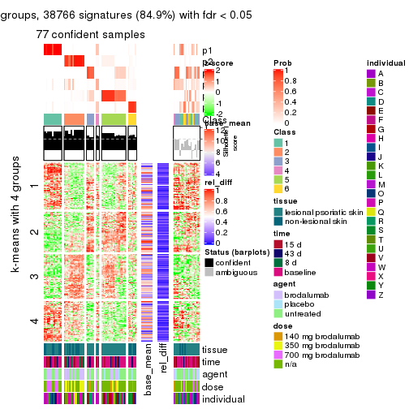</p>

</div>
</div>


Signature heatmaps where rows are not scaled:


<script>
$( function() {
	$( '#tabs-SD-hclust-get-signatures-no-scale' ).tabs();
} );
</script>
<div id='tabs-SD-hclust-get-signatures-no-scale'>
<ul>
<li><a href='#tab-SD-hclust-get-signatures-no-scale-1'>k = 2</a></li>
<li><a href='#tab-SD-hclust-get-signatures-no-scale-2'>k = 3</a></li>
<li><a href='#tab-SD-hclust-get-signatures-no-scale-3'>k = 4</a></li>
<li><a href='#tab-SD-hclust-get-signatures-no-scale-4'>k = 5</a></li>
<li><a href='#tab-SD-hclust-get-signatures-no-scale-5'>k = 6</a></li>
</ul>
<div id='tab-SD-hclust-get-signatures-no-scale-1'>
<pre><code class="r">get_signatures(res, k = 2, scale_rows = FALSE)
</code></pre>

<p></p>

</div>
<div id='tab-SD-hclust-get-signatures-no-scale-2'>
<pre><code class="r">get_signatures(res, k = 3, scale_rows = FALSE)
</code></pre>

<p></p>

</div>
<div id='tab-SD-hclust-get-signatures-no-scale-3'>
<pre><code class="r">get_signatures(res, k = 4, scale_rows = FALSE)
</code></pre>

<p></p>

</div>
<div id='tab-SD-hclust-get-signatures-no-scale-4'>
<pre><code class="r">get_signatures(res, k = 5, scale_rows = FALSE)
</code></pre>

<p></p>

</div>
<div id='tab-SD-hclust-get-signatures-no-scale-5'>
<pre><code class="r">get_signatures(res, k = 6, scale_rows = FALSE)
</code></pre>

<p></p>

</div>
</div>


Compare the overlap of signatures from different k:

```r
compare_signatures(res)
```


`get_signature()` returns a data frame invisibly. TO get the list of signatures, the function
call should be assigned to a variable explicitly. In following code, if `plot` argument is set
to `FALSE`, no heatmap is plotted while only the differential analysis is performed.

```r
# code only for demonstration
tb = get_signature(res, k = ..., plot = FALSE)
```

An example of the output of `tb` is:

```
#>   which_row         fdr    mean_1    mean_2 scaled_mean_1 scaled_mean_2 km
#> 1        38 0.042760348  8.373488  9.131774    -0.5533452     0.5164555  1
#> 2        40 0.018707592  7.106213  8.469186    -0.6173731     0.5762149  1
#> 3        55 0.019134737 10.221463 11.207825    -0.6159697     0.5749050  1
#> 4        59 0.006059896  5.921854  7.869574    -0.6899429     0.6439467  1
#> 5        60 0.018055526  8.928898 10.211722    -0.6204761     0.5791110  1
#> 6        98 0.009384629 15.714769 14.887706     0.6635654    -0.6193277  2
...
```

The columns in `tb` are:

1. `which_row`: row indices corresponding to the input matrix.
2. `fdr`: FDR for the differential test. 
3. `mean_x`: The mean value in group x.
4. `scaled_mean_x`: The mean value in group x after rows are scaled.
5. `km`: Row groups if k-means clustering is applied to rows.


UMAP plot which shows how samples are separated.


<script>
$( function() {
	$( '#tabs-SD-hclust-dimension-reduction' ).tabs();
} );
</script>
<div id='tabs-SD-hclust-dimension-reduction'>
<ul>
<li><a href='#tab-SD-hclust-dimension-reduction-1'>k = 2</a></li>
<li><a href='#tab-SD-hclust-dimension-reduction-2'>k = 3</a></li>
<li><a href='#tab-SD-hclust-dimension-reduction-3'>k = 4</a></li>
<li><a href='#tab-SD-hclust-dimension-reduction-4'>k = 5</a></li>
<li><a href='#tab-SD-hclust-dimension-reduction-5'>k = 6</a></li>
</ul>
<div id='tab-SD-hclust-dimension-reduction-1'>
<pre><code class="r">dimension_reduction(res, k = 2, method = &quot;UMAP&quot;)
</code></pre>

<p></p>

</div>
<div id='tab-SD-hclust-dimension-reduction-2'>
<pre><code class="r">dimension_reduction(res, k = 3, method = &quot;UMAP&quot;)
</code></pre>

<p></p>

</div>
<div id='tab-SD-hclust-dimension-reduction-3'>
<pre><code class="r">dimension_reduction(res, k = 4, method = &quot;UMAP&quot;)
</code></pre>

<p></p>

</div>
<div id='tab-SD-hclust-dimension-reduction-4'>
<pre><code class="r">dimension_reduction(res, k = 5, method = &quot;UMAP&quot;)
</code></pre>

<p></p>

</div>
<div id='tab-SD-hclust-dimension-reduction-5'>
<pre><code class="r">dimension_reduction(res, k = 6, method = &quot;UMAP&quot;)
</code></pre>

<p></p>

</div>
</div>


Following heatmap shows how subgroups are split when increasing `k`:

```r
collect_classes(res)
```


Test correlation between subgroups and known annotations. If the known
annotation is numeric, one-way ANOVA test is applied, and if the known
annotation is discrete, chi-squared contingency table test is applied.

```r
test_to_known_factors(res)
```

```
#>            n tissue(p) time(p) agent(p)  dose(p) individual(p) k
#> SD:hclust 81  6.55e-02  0.1079    0.122 5.04e-08      1.27e-03 2
#> SD:hclust 88  9.62e-05  0.0301    0.158 7.96e-11      5.72e-04 3
#> SD:hclust 70  7.61e-04  0.2827    0.002 6.46e-07      1.34e-04 4
#> SD:hclust 77  3.37e-04  0.2773    0.167 6.92e-09      4.55e-06 5
#> SD:hclust 77  1.21e-03  0.4201    0.245 1.78e-09      9.81e-12 6
```


If matrix rows can be associated to genes, consider to use `functional_enrichment(res,
...)` to perform function enrichment for the signature genes. See [this vignette](http://bioconductor.org/packages/devel/bioc/vignettes/cola/inst/doc/functional_enrichment.html) for more detailed explanations.


 

---------------------------------------------------


### SD:kmeans*


The object with results only for a single top-value method and a single partition method 
can be extracted as:

```r
res = res_list["SD", "kmeans"]
# you can also extract it by
# res = res_list["SD:kmeans"]
```

A summary of `res` and all the functions that can be applied to it:

```r
res
```

```
#> A 'ConsensusPartition' object with k = 2, 3, 4, 5, 6.
#>   On a matrix with 45638 rows and 99 columns.
#>   Top rows (1000, 2000, 3000, 4000, 5000) are extracted by 'SD' method.
#>   Subgroups are detected by 'kmeans' method.
#>   Performed in total 1250 partitions by row resampling.
#>   Best k for subgroups seems to be 2.
#> 
#> Following methods can be applied to this 'ConsensusPartition' object:
#>  [1] "cola_report"             "collect_classes"         "collect_plots"          
#>  [4] "collect_stats"           "colnames"                "compare_signatures"     
#>  [7] "consensus_heatmap"       "dimension_reduction"     "functional_enrichment"  
#> [10] "get_anno_col"            "get_anno"                "get_classes"            
#> [13] "get_consensus"           "get_matrix"              "get_membership"         
#> [16] "get_param"               "get_signatures"          "get_stats"              
#> [19] "is_best_k"               "is_stable_k"             "membership_heatmap"     
#> [22] "ncol"                    "nrow"                    "plot_ecdf"              
#> [25] "rownames"                "select_partition_number" "show"                   
#> [28] "suggest_best_k"          "test_to_known_factors"
```

`collect_plots()` function collects all the plots made from `res` for all `k` (number of partitions)
into one single page to provide an easy and fast comparison between different `k`.

```r
collect_plots(res)
```


The plots are:

- The first row: a plot of the ECDF (empirical cumulative distribution
  function) curves of the consensus matrix for each `k` and the heatmap of
  predicted classes for each `k`.
- The second row: heatmaps of the consensus matrix for each `k`.
- The third row: heatmaps of the membership matrix for each `k`.
- The fouth row: heatmaps of the signatures for each `k`.

All the plots in panels can be made by individual functions and they are
plotted later in this section.

`select_partition_number()` produces several plots showing different
statistics for choosing "optimized" `k`. There are following statistics:

- ECDF curves of the consensus matrix for each `k`;
- 1-PAC. [The PAC
  score](https://en.wikipedia.org/wiki/Consensus_clustering#Over-interpretation_potential_of_consensus_clustering)
  measures the proportion of the ambiguous subgrouping.
- Mean silhouette score.
- Concordance. The mean probability of fiting the consensus class ids in all
  partitions.
- Area increased. Denote $A_k$ as the area under the ECDF curve for current
  `k`, the area increased is defined as $A_k - A_{k-1}$.
- Rand index. The percent of pairs of samples that are both in a same cluster
  or both are not in a same cluster in the partition of k and k-1.
- Jaccard index. The ratio of pairs of samples are both in a same cluster in
  the partition of k and k-1 and the pairs of samples are both in a same
  cluster in the partition k or k-1.

The detailed explanations of these statistics can be found in [the _cola_
vignette](http://bioconductor.org/packages/devel/bioc/vignettes/cola/inst/doc/cola.html#toc_13).

Generally speaking, lower PAC score, higher mean silhouette score or higher
concordance corresponds to better partition. Rand index and Jaccard index
measure how similar the current partition is compared to partition with `k-1`.
If they are too similar, we won't accept `k` is better than `k-1`.

```r
select_partition_number(res)
```


The numeric values for all these statistics can be obtained by `get_stats()`.

```r
get_stats(res)
```

```
#>   k 1-PAC mean_silhouette concordance area_increased  Rand Jaccard
#> 2 2 0.902           0.963       0.982         0.4870 0.514   0.514
#> 3 3 0.811           0.894       0.946         0.3771 0.729   0.513
#> 4 4 0.711           0.689       0.826         0.1153 0.795   0.473
#> 5 5 0.757           0.677       0.748         0.0629 0.861   0.531
#> 6 6 0.792           0.830       0.854         0.0418 0.954   0.780
```

`suggest_best_k()` suggests the best $k$ based on these statistics. The rules are as follows:

- All $k$ with Jaccard index larger than 0.95 are removed because increasing
  $k$ does not provide enough extra information. If all $k$ are removed, it is
  marked as no subgroup is detected.
- For all $k$ with 1-PAC score larger than 0.9, the maximal $k$ is taken as
  the best $k$, and other $k$ are marked as optional $k$.
- If it does not fit the second rule. The $k$ with the maximal vote of the
  highest 1-PAC score, highest mean silhouette, and highest concordance is
  taken as the best $k$.

```r
suggest_best_k(res)
```

```
#> [1] 2
```


Following shows the table of the partitions (You need to click the **show/hide
code output** link to see it). The membership matrix (columns with name `p*`)
is inferred by
[`clue::cl_consensus()`](https://www.rdocumentation.org/link/cl_consensus?package=clue)
function with the `SE` method. Basically the value in the membership matrix
represents the probability to belong to a certain group. The finall class
label for an item is determined with the group with highest probability it
belongs to.

In `get_classes()` function, the entropy is calculated from the membership
matrix and the silhouette score is calculated from the consensus matrix.


<script>
$( function() {
	$( '#tabs-SD-kmeans-get-classes' ).tabs();
} );
</script>
<div id='tabs-SD-kmeans-get-classes'>
<ul>
<li><a href='#tab-SD-kmeans-get-classes-1'>k = 2</a></li>
<li><a href='#tab-SD-kmeans-get-classes-2'>k = 3</a></li>
<li><a href='#tab-SD-kmeans-get-classes-3'>k = 4</a></li>
<li><a href='#tab-SD-kmeans-get-classes-4'>k = 5</a></li>
<li><a href='#tab-SD-kmeans-get-classes-5'>k = 6</a></li>
</ul>

<div id='tab-SD-kmeans-get-classes-1'>
<p><a id='tab-SD-kmeans-get-classes-1-a' style='color:#0366d6' href='#'>show/hide code output</a></p>
<pre><code class="r">cbind(get_classes(res, k = 2), get_membership(res, k = 2))
</code></pre>

<pre><code>#&gt;            class entropy silhouette    p1    p2
#&gt; GSM1296094     2  0.0000      0.982 0.000 1.000
#&gt; GSM1296119     2  0.0000      0.982 0.000 1.000
#&gt; GSM1296076     2  0.0000      0.982 0.000 1.000
#&gt; GSM1296092     2  0.0000      0.982 0.000 1.000
#&gt; GSM1296103     2  0.0000      0.982 0.000 1.000
#&gt; GSM1296078     2  0.0000      0.982 0.000 1.000
#&gt; GSM1296107     2  0.0000      0.982 0.000 1.000
#&gt; GSM1296109     2  0.0000      0.982 0.000 1.000
#&gt; GSM1296080     1  0.0000      0.981 1.000 0.000
#&gt; GSM1296090     2  0.0000      0.982 0.000 1.000
#&gt; GSM1296074     2  0.0000      0.982 0.000 1.000
#&gt; GSM1296111     2  0.0000      0.982 0.000 1.000
#&gt; GSM1296099     2  0.0000      0.982 0.000 1.000
#&gt; GSM1296086     2  0.0000      0.982 0.000 1.000
#&gt; GSM1296117     2  0.0000      0.982 0.000 1.000
#&gt; GSM1296113     2  0.0000      0.982 0.000 1.000
#&gt; GSM1296096     2  0.0000      0.982 0.000 1.000
#&gt; GSM1296105     1  0.0000      0.981 1.000 0.000
#&gt; GSM1296098     2  0.0000      0.982 0.000 1.000
#&gt; GSM1296101     2  0.0000      0.982 0.000 1.000
#&gt; GSM1296121     2  0.0000      0.982 0.000 1.000
#&gt; GSM1296088     2  0.0000      0.982 0.000 1.000
#&gt; GSM1296082     2  0.0000      0.982 0.000 1.000
#&gt; GSM1296115     2  0.0000      0.982 0.000 1.000
#&gt; GSM1296084     1  0.0376      0.978 0.996 0.004
#&gt; GSM1296072     2  0.0000      0.982 0.000 1.000
#&gt; GSM1296069     2  0.0000      0.982 0.000 1.000
#&gt; GSM1296071     2  0.0000      0.982 0.000 1.000
#&gt; GSM1296070     2  0.0000      0.982 0.000 1.000
#&gt; GSM1296073     2  0.0000      0.982 0.000 1.000
#&gt; GSM1296034     1  0.0000      0.981 1.000 0.000
#&gt; GSM1296041     2  0.0000      0.982 0.000 1.000
#&gt; GSM1296035     2  0.0000      0.982 0.000 1.000
#&gt; GSM1296038     2  0.0000      0.982 0.000 1.000
#&gt; GSM1296047     2  0.5408      0.874 0.124 0.876
#&gt; GSM1296039     2  0.0000      0.982 0.000 1.000
#&gt; GSM1296042     2  0.0000      0.982 0.000 1.000
#&gt; GSM1296043     2  0.0000      0.982 0.000 1.000
#&gt; GSM1296037     1  0.0000      0.981 1.000 0.000
#&gt; GSM1296046     2  0.0000      0.982 0.000 1.000
#&gt; GSM1296044     2  0.0376      0.979 0.004 0.996
#&gt; GSM1296045     2  0.0000      0.982 0.000 1.000
#&gt; GSM1296025     1  0.0000      0.981 1.000 0.000
#&gt; GSM1296033     1  0.0000      0.981 1.000 0.000
#&gt; GSM1296027     1  0.0000      0.981 1.000 0.000
#&gt; GSM1296032     1  0.0000      0.981 1.000 0.000
#&gt; GSM1296024     1  0.0000      0.981 1.000 0.000
#&gt; GSM1296031     1  0.0000      0.981 1.000 0.000
#&gt; GSM1296028     1  0.0000      0.981 1.000 0.000
#&gt; GSM1296029     1  0.0000      0.981 1.000 0.000
#&gt; GSM1296026     1  0.9661      0.381 0.608 0.392
#&gt; GSM1296030     1  0.0376      0.978 0.996 0.004
#&gt; GSM1296040     2  0.0000      0.982 0.000 1.000
#&gt; GSM1296036     2  0.0000      0.982 0.000 1.000
#&gt; GSM1296048     2  0.0000      0.982 0.000 1.000
#&gt; GSM1296059     2  0.0000      0.982 0.000 1.000
#&gt; GSM1296066     2  0.0000      0.982 0.000 1.000
#&gt; GSM1296060     2  0.0000      0.982 0.000 1.000
#&gt; GSM1296063     2  0.0000      0.982 0.000 1.000
#&gt; GSM1296064     2  0.0000      0.982 0.000 1.000
#&gt; GSM1296067     2  0.5519      0.870 0.128 0.872
#&gt; GSM1296062     1  0.0000      0.981 1.000 0.000
#&gt; GSM1296068     2  0.5408      0.874 0.124 0.876
#&gt; GSM1296050     1  0.0000      0.981 1.000 0.000
#&gt; GSM1296057     1  0.0000      0.981 1.000 0.000
#&gt; GSM1296052     1  0.0000      0.981 1.000 0.000
#&gt; GSM1296054     1  0.0000      0.981 1.000 0.000
#&gt; GSM1296049     1  0.0000      0.981 1.000 0.000
#&gt; GSM1296055     1  0.0000      0.981 1.000 0.000
#&gt; GSM1296053     1  0.0000      0.981 1.000 0.000
#&gt; GSM1296058     1  0.0376      0.978 0.996 0.004
#&gt; GSM1296051     2  0.0000      0.982 0.000 1.000
#&gt; GSM1296056     2  0.0000      0.982 0.000 1.000
#&gt; GSM1296065     2  0.0000      0.982 0.000 1.000
#&gt; GSM1296061     1  0.7950      0.694 0.760 0.240
#&gt; GSM1296095     2  0.0000      0.982 0.000 1.000
#&gt; GSM1296120     2  0.5408      0.874 0.124 0.876
#&gt; GSM1296077     1  0.0000      0.981 1.000 0.000
#&gt; GSM1296093     1  0.0000      0.981 1.000 0.000
#&gt; GSM1296104     2  0.0000      0.982 0.000 1.000
#&gt; GSM1296079     1  0.0000      0.981 1.000 0.000
#&gt; GSM1296108     2  0.5294      0.878 0.120 0.880
#&gt; GSM1296110     2  0.2778      0.946 0.048 0.952
#&gt; GSM1296081     1  0.0000      0.981 1.000 0.000
#&gt; GSM1296091     1  0.0000      0.981 1.000 0.000
#&gt; GSM1296075     1  0.0000      0.981 1.000 0.000
#&gt; GSM1296112     2  0.5408      0.874 0.124 0.876
#&gt; GSM1296100     1  0.0000      0.981 1.000 0.000
#&gt; GSM1296087     1  0.0000      0.981 1.000 0.000
#&gt; GSM1296118     1  0.3879      0.905 0.924 0.076
#&gt; GSM1296114     2  0.2423      0.952 0.040 0.960
#&gt; GSM1296097     2  0.6148      0.840 0.152 0.848
#&gt; GSM1296106     1  0.0000      0.981 1.000 0.000
#&gt; GSM1296102     1  0.0000      0.981 1.000 0.000
#&gt; GSM1296122     1  0.0000      0.981 1.000 0.000
#&gt; GSM1296089     1  0.0000      0.981 1.000 0.000
#&gt; GSM1296083     1  0.0000      0.981 1.000 0.000
#&gt; GSM1296116     2  0.2778      0.946 0.048 0.952
#&gt; GSM1296085     1  0.0000      0.981 1.000 0.000
</code></pre>

<script>
$('#tab-SD-kmeans-get-classes-1-a').parent().next().next().hide();
$('#tab-SD-kmeans-get-classes-1-a').click(function(){
  $('#tab-SD-kmeans-get-classes-1-a').parent().next().next().toggle();
  return(false);
});
</script>
</div>

<div id='tab-SD-kmeans-get-classes-2'>
<p><a id='tab-SD-kmeans-get-classes-2-a' style='color:#0366d6' href='#'>show/hide code output</a></p>
<pre><code class="r">cbind(get_classes(res, k = 3), get_membership(res, k = 3))
</code></pre>

<pre><code>#&gt;            class entropy silhouette    p1    p2    p3
#&gt; GSM1296094     3   0.000      0.926 0.000 0.000 1.000
#&gt; GSM1296119     2   0.470      0.804 0.000 0.788 0.212
#&gt; GSM1296076     3   0.000      0.926 0.000 0.000 1.000
#&gt; GSM1296092     3   0.000      0.926 0.000 0.000 1.000
#&gt; GSM1296103     3   0.000      0.926 0.000 0.000 1.000
#&gt; GSM1296078     3   0.000      0.926 0.000 0.000 1.000
#&gt; GSM1296107     2   0.254      0.896 0.000 0.920 0.080
#&gt; GSM1296109     3   0.000      0.926 0.000 0.000 1.000
#&gt; GSM1296080     3   0.489      0.708 0.228 0.000 0.772
#&gt; GSM1296090     3   0.000      0.926 0.000 0.000 1.000
#&gt; GSM1296074     3   0.000      0.926 0.000 0.000 1.000
#&gt; GSM1296111     2   0.394      0.849 0.000 0.844 0.156
#&gt; GSM1296099     3   0.000      0.926 0.000 0.000 1.000
#&gt; GSM1296086     3   0.000      0.926 0.000 0.000 1.000
#&gt; GSM1296117     2   0.475      0.800 0.000 0.784 0.216
#&gt; GSM1296113     2   0.271      0.892 0.000 0.912 0.088
#&gt; GSM1296096     3   0.000      0.926 0.000 0.000 1.000
#&gt; GSM1296105     1   0.271      0.884 0.912 0.000 0.088
#&gt; GSM1296098     3   0.000      0.926 0.000 0.000 1.000
#&gt; GSM1296101     3   0.000      0.926 0.000 0.000 1.000
#&gt; GSM1296121     2   0.475      0.800 0.000 0.784 0.216
#&gt; GSM1296088     3   0.000      0.926 0.000 0.000 1.000
#&gt; GSM1296082     3   0.000      0.926 0.000 0.000 1.000
#&gt; GSM1296115     2   0.475      0.800 0.000 0.784 0.216
#&gt; GSM1296084     3   0.429      0.768 0.180 0.000 0.820
#&gt; GSM1296072     2   0.000      0.925 0.000 1.000 0.000
#&gt; GSM1296069     2   0.000      0.925 0.000 1.000 0.000
#&gt; GSM1296071     2   0.000      0.925 0.000 1.000 0.000
#&gt; GSM1296070     2   0.000      0.925 0.000 1.000 0.000
#&gt; GSM1296073     2   0.484      0.790 0.000 0.776 0.224
#&gt; GSM1296034     1   0.000      0.969 1.000 0.000 0.000
#&gt; GSM1296041     2   0.470      0.804 0.000 0.788 0.212
#&gt; GSM1296035     3   0.000      0.926 0.000 0.000 1.000
#&gt; GSM1296038     3   0.000      0.926 0.000 0.000 1.000
#&gt; GSM1296047     2   0.000      0.925 0.000 1.000 0.000
#&gt; GSM1296039     3   0.000      0.926 0.000 0.000 1.000
#&gt; GSM1296042     2   0.263      0.894 0.000 0.916 0.084
#&gt; GSM1296043     2   0.000      0.925 0.000 1.000 0.000
#&gt; GSM1296037     1   0.000      0.969 1.000 0.000 0.000
#&gt; GSM1296046     2   0.000      0.925 0.000 1.000 0.000
#&gt; GSM1296044     2   0.000      0.925 0.000 1.000 0.000
#&gt; GSM1296045     2   0.000      0.925 0.000 1.000 0.000
#&gt; GSM1296025     1   0.000      0.969 1.000 0.000 0.000
#&gt; GSM1296033     1   0.000      0.969 1.000 0.000 0.000
#&gt; GSM1296027     1   0.000      0.969 1.000 0.000 0.000
#&gt; GSM1296032     1   0.000      0.969 1.000 0.000 0.000
#&gt; GSM1296024     1   0.000      0.969 1.000 0.000 0.000
#&gt; GSM1296031     1   0.000      0.969 1.000 0.000 0.000
#&gt; GSM1296028     1   0.000      0.969 1.000 0.000 0.000
#&gt; GSM1296029     1   0.000      0.969 1.000 0.000 0.000
#&gt; GSM1296026     3   0.000      0.926 0.000 0.000 1.000
#&gt; GSM1296030     3   0.562      0.580 0.308 0.000 0.692
#&gt; GSM1296040     3   0.000      0.926 0.000 0.000 1.000
#&gt; GSM1296036     3   0.000      0.926 0.000 0.000 1.000
#&gt; GSM1296048     2   0.475      0.800 0.000 0.784 0.216
#&gt; GSM1296059     3   0.000      0.926 0.000 0.000 1.000
#&gt; GSM1296066     2   0.103      0.917 0.000 0.976 0.024
#&gt; GSM1296060     3   0.000      0.926 0.000 0.000 1.000
#&gt; GSM1296063     3   0.406      0.759 0.000 0.164 0.836
#&gt; GSM1296064     3   0.000      0.926 0.000 0.000 1.000
#&gt; GSM1296067     2   0.000      0.925 0.000 1.000 0.000
#&gt; GSM1296062     3   0.518      0.670 0.256 0.000 0.744
#&gt; GSM1296068     2   0.000      0.925 0.000 1.000 0.000
#&gt; GSM1296050     1   0.000      0.969 1.000 0.000 0.000
#&gt; GSM1296057     1   0.000      0.969 1.000 0.000 0.000
#&gt; GSM1296052     1   0.000      0.969 1.000 0.000 0.000
#&gt; GSM1296054     1   0.000      0.969 1.000 0.000 0.000
#&gt; GSM1296049     1   0.000      0.969 1.000 0.000 0.000
#&gt; GSM1296055     1   0.271      0.898 0.912 0.088 0.000
#&gt; GSM1296053     1   0.000      0.969 1.000 0.000 0.000
#&gt; GSM1296058     1   0.533      0.599 0.728 0.000 0.272
#&gt; GSM1296051     3   0.000      0.926 0.000 0.000 1.000
#&gt; GSM1296056     3   0.000      0.926 0.000 0.000 1.000
#&gt; GSM1296065     3   0.571      0.569 0.000 0.320 0.680
#&gt; GSM1296061     3   0.000      0.926 0.000 0.000 1.000
#&gt; GSM1296095     3   0.440      0.760 0.000 0.188 0.812
#&gt; GSM1296120     2   0.000      0.925 0.000 1.000 0.000
#&gt; GSM1296077     1   0.000      0.969 1.000 0.000 0.000
#&gt; GSM1296093     1   0.000      0.969 1.000 0.000 0.000
#&gt; GSM1296104     3   0.550      0.633 0.000 0.292 0.708
#&gt; GSM1296079     1   0.000      0.969 1.000 0.000 0.000
#&gt; GSM1296108     2   0.000      0.925 0.000 1.000 0.000
#&gt; GSM1296110     2   0.000      0.925 0.000 1.000 0.000
#&gt; GSM1296081     1   0.000      0.969 1.000 0.000 0.000
#&gt; GSM1296091     1   0.000      0.969 1.000 0.000 0.000
#&gt; GSM1296075     1   0.406      0.819 0.836 0.164 0.000
#&gt; GSM1296112     2   0.000      0.925 0.000 1.000 0.000
#&gt; GSM1296100     1   0.000      0.969 1.000 0.000 0.000
#&gt; GSM1296087     1   0.000      0.969 1.000 0.000 0.000
#&gt; GSM1296118     2   0.263      0.858 0.084 0.916 0.000
#&gt; GSM1296114     2   0.000      0.925 0.000 1.000 0.000
#&gt; GSM1296097     3   0.930      0.423 0.248 0.228 0.524
#&gt; GSM1296106     1   0.406      0.819 0.836 0.164 0.000
#&gt; GSM1296102     1   0.000      0.969 1.000 0.000 0.000
#&gt; GSM1296122     1   0.406      0.819 0.836 0.164 0.000
#&gt; GSM1296089     1   0.000      0.969 1.000 0.000 0.000
#&gt; GSM1296083     1   0.000      0.969 1.000 0.000 0.000
#&gt; GSM1296116     2   0.000      0.925 0.000 1.000 0.000
#&gt; GSM1296085     1   0.000      0.969 1.000 0.000 0.000
</code></pre>

<script>
$('#tab-SD-kmeans-get-classes-2-a').parent().next().next().hide();
$('#tab-SD-kmeans-get-classes-2-a').click(function(){
  $('#tab-SD-kmeans-get-classes-2-a').parent().next().next().toggle();
  return(false);
});
</script>
</div>

<div id='tab-SD-kmeans-get-classes-3'>
<p><a id='tab-SD-kmeans-get-classes-3-a' style='color:#0366d6' href='#'>show/hide code output</a></p>
<pre><code class="r">cbind(get_classes(res, k = 4), get_membership(res, k = 4))
</code></pre>

<pre><code>#&gt;            class entropy silhouette    p1    p2    p3    p4
#&gt; GSM1296094     3  0.0000     0.8604 0.000 0.000 1.000 0.000
#&gt; GSM1296119     4  0.4964     0.5535 0.000 0.380 0.004 0.616
#&gt; GSM1296076     4  0.4948     0.1729 0.000 0.000 0.440 0.560
#&gt; GSM1296092     3  0.3801     0.7229 0.000 0.000 0.780 0.220
#&gt; GSM1296103     3  0.0336     0.8602 0.000 0.000 0.992 0.008
#&gt; GSM1296078     4  0.4933     0.1904 0.000 0.000 0.432 0.568
#&gt; GSM1296107     4  0.4877     0.5220 0.000 0.408 0.000 0.592
#&gt; GSM1296109     4  0.4985     0.2160 0.000 0.000 0.468 0.532
#&gt; GSM1296080     3  0.0524     0.8571 0.008 0.000 0.988 0.004
#&gt; GSM1296090     4  0.4992     0.0767 0.000 0.000 0.476 0.524
#&gt; GSM1296074     4  0.4992     0.0767 0.000 0.000 0.476 0.524
#&gt; GSM1296111     4  0.4804     0.5496 0.000 0.384 0.000 0.616
#&gt; GSM1296099     3  0.1474     0.8507 0.000 0.000 0.948 0.052
#&gt; GSM1296086     3  0.3801     0.7229 0.000 0.000 0.780 0.220
#&gt; GSM1296117     4  0.4964     0.5535 0.000 0.380 0.004 0.616
#&gt; GSM1296113     4  0.4877     0.5220 0.000 0.408 0.000 0.592
#&gt; GSM1296096     3  0.1792     0.8447 0.000 0.000 0.932 0.068
#&gt; GSM1296105     3  0.6551     0.4859 0.136 0.000 0.624 0.240
#&gt; GSM1296098     3  0.0188     0.8599 0.000 0.000 0.996 0.004
#&gt; GSM1296101     3  0.0000     0.8604 0.000 0.000 1.000 0.000
#&gt; GSM1296121     4  0.4872     0.5596 0.000 0.356 0.004 0.640
#&gt; GSM1296088     3  0.0921     0.8589 0.000 0.000 0.972 0.028
#&gt; GSM1296082     4  0.4992     0.0767 0.000 0.000 0.476 0.524
#&gt; GSM1296115     4  0.4964     0.5535 0.000 0.380 0.004 0.616
#&gt; GSM1296084     3  0.1118     0.8585 0.000 0.000 0.964 0.036
#&gt; GSM1296072     2  0.1474     0.7309 0.000 0.948 0.000 0.052
#&gt; GSM1296069     2  0.4008     0.4191 0.000 0.756 0.000 0.244
#&gt; GSM1296071     2  0.0000     0.7306 0.000 1.000 0.000 0.000
#&gt; GSM1296070     2  0.4961    -0.2264 0.000 0.552 0.000 0.448
#&gt; GSM1296073     4  0.4420     0.5603 0.000 0.240 0.012 0.748
#&gt; GSM1296034     1  0.1661     0.9164 0.944 0.000 0.052 0.004
#&gt; GSM1296041     4  0.4804     0.5496 0.000 0.384 0.000 0.616
#&gt; GSM1296035     3  0.1792     0.8447 0.000 0.000 0.932 0.068
#&gt; GSM1296038     3  0.3688     0.7477 0.000 0.000 0.792 0.208
#&gt; GSM1296047     2  0.2868     0.7190 0.000 0.864 0.000 0.136
#&gt; GSM1296039     4  0.4996     0.0679 0.000 0.000 0.484 0.516
#&gt; GSM1296042     4  0.4877     0.5220 0.000 0.408 0.000 0.592
#&gt; GSM1296043     2  0.3172     0.5621 0.000 0.840 0.000 0.160
#&gt; GSM1296037     1  0.2469     0.8990 0.892 0.000 0.000 0.108
#&gt; GSM1296046     2  0.0000     0.7306 0.000 1.000 0.000 0.000
#&gt; GSM1296044     2  0.0000     0.7306 0.000 1.000 0.000 0.000
#&gt; GSM1296045     2  0.3400     0.5315 0.000 0.820 0.000 0.180
#&gt; GSM1296025     1  0.0000     0.9546 1.000 0.000 0.000 0.000
#&gt; GSM1296033     1  0.4070     0.8440 0.824 0.000 0.044 0.132
#&gt; GSM1296027     1  0.0000     0.9546 1.000 0.000 0.000 0.000
#&gt; GSM1296032     1  0.0000     0.9546 1.000 0.000 0.000 0.000
#&gt; GSM1296024     1  0.0000     0.9546 1.000 0.000 0.000 0.000
#&gt; GSM1296031     1  0.1557     0.9296 0.944 0.000 0.000 0.056
#&gt; GSM1296028     1  0.0000     0.9546 1.000 0.000 0.000 0.000
#&gt; GSM1296029     1  0.0000     0.9546 1.000 0.000 0.000 0.000
#&gt; GSM1296026     3  0.0921     0.8598 0.000 0.000 0.972 0.028
#&gt; GSM1296030     3  0.2300     0.8131 0.064 0.000 0.920 0.016
#&gt; GSM1296040     3  0.0336     0.8592 0.000 0.000 0.992 0.008
#&gt; GSM1296036     3  0.0188     0.8599 0.000 0.000 0.996 0.004
#&gt; GSM1296048     4  0.4720     0.5623 0.000 0.324 0.004 0.672
#&gt; GSM1296059     3  0.0336     0.8602 0.000 0.000 0.992 0.008
#&gt; GSM1296066     4  0.4877     0.5220 0.000 0.408 0.000 0.592
#&gt; GSM1296060     3  0.1792     0.8447 0.000 0.000 0.932 0.068
#&gt; GSM1296063     4  0.5035     0.5616 0.000 0.196 0.056 0.748
#&gt; GSM1296064     4  0.4948     0.1854 0.000 0.000 0.440 0.560
#&gt; GSM1296067     2  0.2469     0.7249 0.000 0.892 0.000 0.108
#&gt; GSM1296062     3  0.0895     0.8525 0.004 0.000 0.976 0.020
#&gt; GSM1296068     2  0.0000     0.7306 0.000 1.000 0.000 0.000
#&gt; GSM1296050     1  0.0000     0.9546 1.000 0.000 0.000 0.000
#&gt; GSM1296057     1  0.4453     0.7639 0.744 0.000 0.012 0.244
#&gt; GSM1296052     1  0.0000     0.9546 1.000 0.000 0.000 0.000
#&gt; GSM1296054     1  0.0000     0.9546 1.000 0.000 0.000 0.000
#&gt; GSM1296049     1  0.0000     0.9546 1.000 0.000 0.000 0.000
#&gt; GSM1296055     2  0.7760     0.4756 0.228 0.516 0.012 0.244
#&gt; GSM1296053     1  0.0000     0.9546 1.000 0.000 0.000 0.000
#&gt; GSM1296058     3  0.7005     0.4518 0.172 0.000 0.572 0.256
#&gt; GSM1296051     3  0.3942     0.7125 0.000 0.000 0.764 0.236
#&gt; GSM1296056     3  0.3688     0.7344 0.000 0.000 0.792 0.208
#&gt; GSM1296065     2  0.7012     0.4788 0.000 0.504 0.124 0.372
#&gt; GSM1296061     3  0.0188     0.8599 0.000 0.000 0.996 0.004
#&gt; GSM1296095     3  0.7849     0.0379 0.000 0.352 0.380 0.268
#&gt; GSM1296120     2  0.2973     0.7168 0.000 0.856 0.000 0.144
#&gt; GSM1296077     1  0.0000     0.9546 1.000 0.000 0.000 0.000
#&gt; GSM1296093     1  0.0000     0.9546 1.000 0.000 0.000 0.000
#&gt; GSM1296104     2  0.6937     0.4911 0.000 0.508 0.116 0.376
#&gt; GSM1296079     1  0.0000     0.9546 1.000 0.000 0.000 0.000
#&gt; GSM1296108     2  0.0000     0.7306 0.000 1.000 0.000 0.000
#&gt; GSM1296110     2  0.0000     0.7306 0.000 1.000 0.000 0.000
#&gt; GSM1296081     1  0.0000     0.9546 1.000 0.000 0.000 0.000
#&gt; GSM1296091     1  0.3649     0.8170 0.796 0.000 0.000 0.204
#&gt; GSM1296075     2  0.7220     0.5147 0.212 0.548 0.000 0.240
#&gt; GSM1296112     2  0.0000     0.7306 0.000 1.000 0.000 0.000
#&gt; GSM1296100     1  0.2469     0.8990 0.892 0.000 0.000 0.108
#&gt; GSM1296087     1  0.0000     0.9546 1.000 0.000 0.000 0.000
#&gt; GSM1296118     2  0.3257     0.7128 0.004 0.844 0.000 0.152
#&gt; GSM1296114     2  0.0000     0.7306 0.000 1.000 0.000 0.000
#&gt; GSM1296097     2  0.8130     0.5067 0.048 0.508 0.140 0.304
#&gt; GSM1296106     2  0.7246     0.5713 0.160 0.584 0.012 0.244
#&gt; GSM1296102     1  0.4328     0.7680 0.748 0.000 0.008 0.244
#&gt; GSM1296122     2  0.6609     0.5924 0.144 0.620 0.000 0.236
#&gt; GSM1296089     1  0.1557     0.9296 0.944 0.000 0.000 0.056
#&gt; GSM1296083     1  0.0000     0.9546 1.000 0.000 0.000 0.000
#&gt; GSM1296116     2  0.0000     0.7306 0.000 1.000 0.000 0.000
#&gt; GSM1296085     1  0.0000     0.9546 1.000 0.000 0.000 0.000
</code></pre>

<script>
$('#tab-SD-kmeans-get-classes-3-a').parent().next().next().hide();
$('#tab-SD-kmeans-get-classes-3-a').click(function(){
  $('#tab-SD-kmeans-get-classes-3-a').parent().next().next().toggle();
  return(false);
});
</script>
</div>

<div id='tab-SD-kmeans-get-classes-4'>
<p><a id='tab-SD-kmeans-get-classes-4-a' style='color:#0366d6' href='#'>show/hide code output</a></p>
<pre><code class="r">cbind(get_classes(res, k = 5), get_membership(res, k = 5))
</code></pre>

<pre><code>#&gt;            class entropy silhouette    p1    p2    p3    p4    p5
#&gt; GSM1296094     3  0.3752     0.6723 0.000 0.000 0.708 0.292 0.000
#&gt; GSM1296119     5  0.3242     0.8408 0.000 0.216 0.000 0.000 0.784
#&gt; GSM1296076     3  0.4449     0.2355 0.000 0.000 0.512 0.004 0.484
#&gt; GSM1296092     3  0.3910     0.5061 0.000 0.000 0.720 0.008 0.272
#&gt; GSM1296103     3  0.3707     0.6745 0.000 0.000 0.716 0.284 0.000
#&gt; GSM1296078     3  0.4451     0.2180 0.000 0.000 0.504 0.004 0.492
#&gt; GSM1296107     5  0.3741     0.8187 0.000 0.264 0.000 0.004 0.732
#&gt; GSM1296109     5  0.4836     0.2427 0.000 0.000 0.304 0.044 0.652
#&gt; GSM1296080     3  0.4260     0.6600 0.004 0.000 0.680 0.308 0.008
#&gt; GSM1296090     3  0.4489     0.3486 0.000 0.000 0.572 0.008 0.420
#&gt; GSM1296074     3  0.4383     0.3456 0.000 0.000 0.572 0.004 0.424
#&gt; GSM1296111     5  0.3274     0.8419 0.000 0.220 0.000 0.000 0.780
#&gt; GSM1296099     3  0.4547     0.6708 0.000 0.000 0.704 0.252 0.044
#&gt; GSM1296086     3  0.3910     0.5061 0.000 0.000 0.720 0.008 0.272
#&gt; GSM1296117     5  0.3274     0.8419 0.000 0.220 0.000 0.000 0.780
#&gt; GSM1296113     5  0.3586     0.8203 0.000 0.264 0.000 0.000 0.736
#&gt; GSM1296096     3  0.4547     0.6689 0.000 0.000 0.704 0.252 0.044
#&gt; GSM1296105     4  0.1430     0.4705 0.004 0.000 0.052 0.944 0.000
#&gt; GSM1296098     3  0.3752     0.6723 0.000 0.000 0.708 0.292 0.000
#&gt; GSM1296101     3  0.3774     0.6736 0.000 0.000 0.704 0.296 0.000
#&gt; GSM1296121     5  0.3242     0.8408 0.000 0.216 0.000 0.000 0.784
#&gt; GSM1296088     3  0.4301     0.6776 0.000 0.000 0.712 0.260 0.028
#&gt; GSM1296082     3  0.4383     0.3456 0.000 0.000 0.572 0.004 0.424
#&gt; GSM1296115     5  0.3274     0.8419 0.000 0.220 0.000 0.000 0.780
#&gt; GSM1296084     3  0.4518     0.6527 0.004 0.000 0.660 0.320 0.016
#&gt; GSM1296072     2  0.0703     0.8817 0.000 0.976 0.000 0.024 0.000
#&gt; GSM1296069     5  0.4821     0.4030 0.000 0.464 0.000 0.020 0.516
#&gt; GSM1296071     2  0.0000     0.8865 0.000 1.000 0.000 0.000 0.000
#&gt; GSM1296070     5  0.4540     0.6951 0.000 0.340 0.000 0.020 0.640
#&gt; GSM1296073     5  0.1251     0.6838 0.000 0.036 0.008 0.000 0.956
#&gt; GSM1296034     1  0.2701     0.8608 0.896 0.000 0.048 0.044 0.012
#&gt; GSM1296041     5  0.3274     0.8419 0.000 0.220 0.000 0.000 0.780
#&gt; GSM1296035     3  0.4547     0.6689 0.000 0.000 0.704 0.252 0.044
#&gt; GSM1296038     4  0.5674    -0.2225 0.000 0.000 0.324 0.576 0.100
#&gt; GSM1296047     2  0.1544     0.8420 0.000 0.932 0.000 0.068 0.000
#&gt; GSM1296039     3  0.4489     0.3410 0.000 0.000 0.572 0.008 0.420
#&gt; GSM1296042     5  0.3741     0.8187 0.000 0.264 0.000 0.004 0.732
#&gt; GSM1296043     2  0.4599     0.0892 0.000 0.624 0.000 0.020 0.356
#&gt; GSM1296037     1  0.4067     0.5313 0.692 0.000 0.000 0.300 0.008
#&gt; GSM1296046     2  0.0609     0.8789 0.000 0.980 0.000 0.020 0.000
#&gt; GSM1296044     2  0.0000     0.8865 0.000 1.000 0.000 0.000 0.000
#&gt; GSM1296045     2  0.4181     0.3954 0.000 0.712 0.000 0.020 0.268
#&gt; GSM1296025     1  0.0671     0.9371 0.980 0.000 0.000 0.004 0.016
#&gt; GSM1296033     4  0.4590     0.2789 0.420 0.000 0.000 0.568 0.012
#&gt; GSM1296027     1  0.0579     0.9362 0.984 0.000 0.000 0.008 0.008
#&gt; GSM1296032     1  0.0162     0.9377 0.996 0.000 0.000 0.004 0.000
#&gt; GSM1296024     1  0.0671     0.9371 0.980 0.000 0.000 0.004 0.016
#&gt; GSM1296031     1  0.2624     0.8310 0.872 0.000 0.000 0.116 0.012
#&gt; GSM1296028     1  0.0579     0.9345 0.984 0.000 0.000 0.008 0.008
#&gt; GSM1296029     1  0.0579     0.9345 0.984 0.000 0.000 0.008 0.008
#&gt; GSM1296026     3  0.4603     0.6676 0.000 0.000 0.668 0.300 0.032
#&gt; GSM1296030     3  0.5551     0.6227 0.060 0.000 0.620 0.304 0.016
#&gt; GSM1296040     3  0.3857     0.6627 0.000 0.000 0.688 0.312 0.000
#&gt; GSM1296036     3  0.3796     0.6691 0.000 0.000 0.700 0.300 0.000
#&gt; GSM1296048     5  0.3143     0.8330 0.000 0.204 0.000 0.000 0.796
#&gt; GSM1296059     3  0.3752     0.6743 0.000 0.000 0.708 0.292 0.000
#&gt; GSM1296066     5  0.3741     0.8187 0.000 0.264 0.000 0.004 0.732
#&gt; GSM1296060     3  0.4547     0.6700 0.000 0.000 0.704 0.252 0.044
#&gt; GSM1296063     5  0.4454     0.3237 0.000 0.020 0.268 0.008 0.704
#&gt; GSM1296064     3  0.4562     0.1917 0.000 0.000 0.496 0.008 0.496
#&gt; GSM1296067     2  0.1484     0.8574 0.000 0.944 0.000 0.048 0.008
#&gt; GSM1296062     3  0.4084     0.6477 0.000 0.000 0.668 0.328 0.004
#&gt; GSM1296068     2  0.0000     0.8865 0.000 1.000 0.000 0.000 0.000
#&gt; GSM1296050     1  0.0671     0.9371 0.980 0.000 0.000 0.004 0.016
#&gt; GSM1296057     4  0.3913     0.4612 0.324 0.000 0.000 0.676 0.000
#&gt; GSM1296052     1  0.0579     0.9362 0.984 0.000 0.000 0.008 0.008
#&gt; GSM1296054     1  0.0162     0.9377 0.996 0.000 0.000 0.004 0.000
#&gt; GSM1296049     1  0.0566     0.9374 0.984 0.000 0.000 0.004 0.012
#&gt; GSM1296055     4  0.4774     0.5713 0.020 0.308 0.000 0.660 0.012
#&gt; GSM1296053     1  0.0162     0.9377 0.996 0.000 0.000 0.004 0.000
#&gt; GSM1296058     4  0.2376     0.5343 0.052 0.000 0.044 0.904 0.000
#&gt; GSM1296051     3  0.4691     0.4792 0.000 0.000 0.680 0.044 0.276
#&gt; GSM1296056     3  0.3890     0.5111 0.000 0.000 0.736 0.012 0.252
#&gt; GSM1296065     4  0.4616     0.5827 0.000 0.288 0.028 0.680 0.004
#&gt; GSM1296061     3  0.3796     0.6691 0.000 0.000 0.700 0.300 0.000
#&gt; GSM1296095     4  0.8144     0.3161 0.000 0.240 0.240 0.396 0.124
#&gt; GSM1296120     2  0.1544     0.8420 0.000 0.932 0.000 0.068 0.000
#&gt; GSM1296077     1  0.0671     0.9371 0.980 0.000 0.000 0.004 0.016
#&gt; GSM1296093     1  0.0162     0.9377 0.996 0.000 0.000 0.000 0.004
#&gt; GSM1296104     4  0.4616     0.5827 0.000 0.288 0.028 0.680 0.004
#&gt; GSM1296079     1  0.0671     0.9371 0.980 0.000 0.000 0.004 0.016
#&gt; GSM1296108     2  0.0000     0.8865 0.000 1.000 0.000 0.000 0.000
#&gt; GSM1296110     2  0.0000     0.8865 0.000 1.000 0.000 0.000 0.000
#&gt; GSM1296081     1  0.0671     0.9371 0.980 0.000 0.000 0.004 0.016
#&gt; GSM1296091     4  0.4415     0.3474 0.388 0.000 0.000 0.604 0.008
#&gt; GSM1296075     4  0.4536     0.5612 0.016 0.324 0.000 0.656 0.004
#&gt; GSM1296112     2  0.0404     0.8817 0.000 0.988 0.000 0.012 0.000
#&gt; GSM1296100     1  0.4067     0.5313 0.692 0.000 0.000 0.300 0.008
#&gt; GSM1296087     1  0.0693     0.9348 0.980 0.000 0.000 0.008 0.012
#&gt; GSM1296118     2  0.1764     0.8382 0.000 0.928 0.000 0.064 0.008
#&gt; GSM1296114     2  0.0000     0.8865 0.000 1.000 0.000 0.000 0.000
#&gt; GSM1296097     4  0.4442     0.5731 0.000 0.304 0.016 0.676 0.004
#&gt; GSM1296106     4  0.4440     0.5611 0.012 0.324 0.000 0.660 0.004
#&gt; GSM1296102     4  0.4235     0.4491 0.336 0.000 0.000 0.656 0.008
#&gt; GSM1296122     2  0.4604     0.3329 0.016 0.680 0.000 0.292 0.012
#&gt; GSM1296089     1  0.2674     0.8263 0.868 0.000 0.000 0.120 0.012
#&gt; GSM1296083     1  0.0671     0.9371 0.980 0.000 0.000 0.004 0.016
#&gt; GSM1296116     2  0.0510     0.8808 0.000 0.984 0.000 0.016 0.000
#&gt; GSM1296085     1  0.0162     0.9377 0.996 0.000 0.000 0.004 0.000
</code></pre>

<script>
$('#tab-SD-kmeans-get-classes-4-a').parent().next().next().hide();
$('#tab-SD-kmeans-get-classes-4-a').click(function(){
  $('#tab-SD-kmeans-get-classes-4-a').parent().next().next().toggle();
  return(false);
});
</script>
</div>

<div id='tab-SD-kmeans-get-classes-5'>
<p><a id='tab-SD-kmeans-get-classes-5-a' style='color:#0366d6' href='#'>show/hide code output</a></p>
<pre><code class="r">cbind(get_classes(res, k = 6), get_membership(res, k = 6))
</code></pre>

<pre><code>#&gt;            class entropy silhouette    p1    p2    p3    p4    p5    p6
#&gt; GSM1296094     3  0.0551      0.866 0.000 0.000 0.984 0.004 0.008 0.004
#&gt; GSM1296119     5  0.1152      0.895 0.000 0.044 0.000 0.000 0.952 0.004
#&gt; GSM1296076     4  0.4596      0.830 0.000 0.000 0.088 0.672 0.240 0.000
#&gt; GSM1296092     4  0.4682      0.817 0.000 0.000 0.224 0.680 0.092 0.004
#&gt; GSM1296103     3  0.0837      0.867 0.000 0.000 0.972 0.020 0.004 0.004
#&gt; GSM1296078     4  0.4596      0.830 0.000 0.000 0.088 0.672 0.240 0.000
#&gt; GSM1296107     5  0.1908      0.886 0.000 0.096 0.000 0.000 0.900 0.004
#&gt; GSM1296109     5  0.4346      0.455 0.000 0.000 0.284 0.020 0.676 0.020
#&gt; GSM1296080     3  0.1343      0.850 0.004 0.012 0.956 0.020 0.004 0.004
#&gt; GSM1296090     4  0.5008      0.866 0.000 0.000 0.160 0.676 0.152 0.012
#&gt; GSM1296074     4  0.4800      0.868 0.000 0.000 0.168 0.672 0.160 0.000
#&gt; GSM1296111     5  0.1075      0.896 0.000 0.048 0.000 0.000 0.952 0.000
#&gt; GSM1296099     3  0.3512      0.807 0.000 0.000 0.808 0.140 0.012 0.040
#&gt; GSM1296086     4  0.4682      0.817 0.000 0.000 0.224 0.680 0.092 0.004
#&gt; GSM1296117     5  0.1152      0.895 0.000 0.044 0.000 0.000 0.952 0.004
#&gt; GSM1296113     5  0.1765      0.887 0.000 0.096 0.000 0.000 0.904 0.000
#&gt; GSM1296096     3  0.3627      0.796 0.000 0.000 0.796 0.152 0.012 0.040
#&gt; GSM1296105     6  0.1926      0.846 0.000 0.000 0.068 0.020 0.000 0.912
#&gt; GSM1296098     3  0.0146      0.866 0.000 0.000 0.996 0.000 0.004 0.000
#&gt; GSM1296101     3  0.1922      0.864 0.000 0.000 0.924 0.024 0.012 0.040
#&gt; GSM1296121     5  0.1718      0.892 0.000 0.044 0.000 0.008 0.932 0.016
#&gt; GSM1296088     3  0.3323      0.751 0.000 0.008 0.780 0.204 0.000 0.008
#&gt; GSM1296082     4  0.4800      0.868 0.000 0.000 0.168 0.672 0.160 0.000
#&gt; GSM1296115     5  0.1624      0.893 0.000 0.044 0.000 0.008 0.936 0.012
#&gt; GSM1296084     3  0.3952      0.800 0.000 0.016 0.800 0.104 0.008 0.072
#&gt; GSM1296072     2  0.2247      0.907 0.000 0.904 0.000 0.024 0.012 0.060
#&gt; GSM1296069     5  0.4080      0.688 0.000 0.232 0.000 0.036 0.724 0.008
#&gt; GSM1296071     2  0.1225      0.920 0.000 0.952 0.000 0.000 0.036 0.012
#&gt; GSM1296070     5  0.3908      0.802 0.000 0.164 0.000 0.040 0.776 0.020
#&gt; GSM1296073     5  0.1951      0.797 0.000 0.000 0.000 0.076 0.908 0.016
#&gt; GSM1296034     1  0.4451      0.772 0.756 0.008 0.132 0.088 0.016 0.000
#&gt; GSM1296041     5  0.1007      0.895 0.000 0.044 0.000 0.000 0.956 0.000
#&gt; GSM1296035     3  0.3627      0.796 0.000 0.000 0.796 0.152 0.012 0.040
#&gt; GSM1296038     6  0.5291      0.563 0.000 0.000 0.136 0.128 0.052 0.684
#&gt; GSM1296047     2  0.2011      0.898 0.000 0.912 0.000 0.020 0.004 0.064
#&gt; GSM1296039     4  0.5283      0.863 0.000 0.000 0.164 0.648 0.172 0.016
#&gt; GSM1296042     5  0.2376      0.886 0.000 0.096 0.000 0.008 0.884 0.012
#&gt; GSM1296043     2  0.4154      0.652 0.000 0.712 0.000 0.036 0.244 0.008
#&gt; GSM1296037     1  0.5271      0.616 0.636 0.004 0.000 0.124 0.008 0.228
#&gt; GSM1296046     2  0.1906      0.905 0.000 0.924 0.000 0.032 0.036 0.008
#&gt; GSM1296044     2  0.1225      0.920 0.000 0.952 0.000 0.000 0.036 0.012
#&gt; GSM1296045     2  0.4230      0.701 0.000 0.740 0.000 0.044 0.196 0.020
#&gt; GSM1296025     1  0.1149      0.897 0.960 0.008 0.000 0.024 0.008 0.000
#&gt; GSM1296033     6  0.5379      0.617 0.216 0.020 0.004 0.092 0.008 0.660
#&gt; GSM1296027     1  0.1719      0.893 0.928 0.008 0.000 0.056 0.008 0.000
#&gt; GSM1296032     1  0.1493      0.898 0.936 0.000 0.000 0.056 0.004 0.004
#&gt; GSM1296024     1  0.0881      0.899 0.972 0.008 0.000 0.012 0.008 0.000
#&gt; GSM1296031     1  0.4982      0.751 0.716 0.016 0.000 0.136 0.016 0.116
#&gt; GSM1296028     1  0.2619      0.886 0.876 0.012 0.000 0.096 0.012 0.004
#&gt; GSM1296029     1  0.2257      0.889 0.904 0.012 0.000 0.068 0.008 0.008
#&gt; GSM1296026     3  0.3917      0.740 0.000 0.012 0.752 0.204 0.000 0.032
#&gt; GSM1296030     3  0.5386      0.669 0.108 0.020 0.708 0.128 0.008 0.028
#&gt; GSM1296040     3  0.0935      0.866 0.000 0.000 0.964 0.004 0.000 0.032
#&gt; GSM1296036     3  0.0146      0.866 0.000 0.000 0.996 0.000 0.004 0.000
#&gt; GSM1296048     5  0.1750      0.889 0.000 0.040 0.000 0.012 0.932 0.016
#&gt; GSM1296059     3  0.2287      0.859 0.000 0.000 0.904 0.048 0.012 0.036
#&gt; GSM1296066     5  0.1908      0.886 0.000 0.096 0.000 0.000 0.900 0.004
#&gt; GSM1296060     3  0.3551      0.803 0.000 0.000 0.804 0.144 0.012 0.040
#&gt; GSM1296063     4  0.4602      0.312 0.000 0.000 0.004 0.484 0.484 0.028
#&gt; GSM1296064     4  0.5013      0.814 0.000 0.000 0.080 0.648 0.256 0.016
#&gt; GSM1296067     2  0.2070      0.896 0.000 0.908 0.000 0.044 0.000 0.048
#&gt; GSM1296062     3  0.1852      0.824 0.004 0.000 0.928 0.040 0.004 0.024
#&gt; GSM1296068     2  0.1225      0.920 0.000 0.952 0.000 0.000 0.036 0.012
#&gt; GSM1296050     1  0.2178      0.889 0.912 0.012 0.000 0.056 0.012 0.008
#&gt; GSM1296057     6  0.1788      0.852 0.040 0.000 0.004 0.028 0.000 0.928
#&gt; GSM1296052     1  0.1781      0.892 0.924 0.008 0.000 0.060 0.008 0.000
#&gt; GSM1296054     1  0.1429      0.897 0.940 0.000 0.000 0.052 0.004 0.004
#&gt; GSM1296049     1  0.1413      0.899 0.948 0.008 0.000 0.036 0.004 0.004
#&gt; GSM1296055     6  0.2433      0.846 0.000 0.044 0.000 0.072 0.000 0.884
#&gt; GSM1296053     1  0.1699      0.896 0.928 0.004 0.000 0.060 0.004 0.004
#&gt; GSM1296058     6  0.1649      0.852 0.000 0.000 0.032 0.036 0.000 0.932
#&gt; GSM1296051     4  0.5221      0.813 0.000 0.000 0.184 0.680 0.084 0.052
#&gt; GSM1296056     4  0.5040      0.795 0.000 0.000 0.236 0.656 0.092 0.016
#&gt; GSM1296065     6  0.1092      0.860 0.000 0.020 0.000 0.020 0.000 0.960
#&gt; GSM1296061     3  0.0146      0.866 0.000 0.000 0.996 0.000 0.004 0.000
#&gt; GSM1296095     6  0.5165      0.637 0.000 0.016 0.104 0.116 0.044 0.720
#&gt; GSM1296120     2  0.2011      0.898 0.000 0.912 0.000 0.020 0.004 0.064
#&gt; GSM1296077     1  0.1453      0.896 0.944 0.008 0.000 0.040 0.008 0.000
#&gt; GSM1296093     1  0.1440      0.897 0.944 0.004 0.000 0.044 0.004 0.004
#&gt; GSM1296104     6  0.1261      0.860 0.000 0.024 0.000 0.024 0.000 0.952
#&gt; GSM1296079     1  0.1382      0.896 0.948 0.008 0.000 0.036 0.008 0.000
#&gt; GSM1296108     2  0.1370      0.920 0.000 0.948 0.000 0.004 0.036 0.012
#&gt; GSM1296110     2  0.1370      0.920 0.000 0.948 0.000 0.004 0.036 0.012
#&gt; GSM1296081     1  0.0951      0.900 0.968 0.008 0.000 0.020 0.004 0.000
#&gt; GSM1296091     6  0.4763      0.685 0.172 0.012 0.000 0.084 0.012 0.720
#&gt; GSM1296075     6  0.2487      0.840 0.004 0.076 0.000 0.028 0.004 0.888
#&gt; GSM1296112     2  0.1649      0.909 0.000 0.932 0.000 0.032 0.036 0.000
#&gt; GSM1296100     1  0.5271      0.616 0.636 0.004 0.000 0.124 0.008 0.228
#&gt; GSM1296087     1  0.2312      0.885 0.896 0.012 0.000 0.080 0.008 0.004
#&gt; GSM1296118     2  0.1844      0.901 0.000 0.924 0.000 0.024 0.004 0.048
#&gt; GSM1296114     2  0.1225      0.920 0.000 0.952 0.000 0.000 0.036 0.012
#&gt; GSM1296097     6  0.1151      0.860 0.000 0.032 0.000 0.012 0.000 0.956
#&gt; GSM1296106     6  0.1779      0.849 0.000 0.064 0.000 0.016 0.000 0.920
#&gt; GSM1296102     6  0.3345      0.823 0.052 0.004 0.000 0.112 0.004 0.828
#&gt; GSM1296122     2  0.4390      0.691 0.000 0.724 0.000 0.096 0.004 0.176
#&gt; GSM1296089     1  0.5023      0.746 0.712 0.016 0.000 0.136 0.016 0.120
#&gt; GSM1296083     1  0.0951      0.900 0.968 0.008 0.000 0.020 0.004 0.000
#&gt; GSM1296116     2  0.1867      0.906 0.000 0.924 0.000 0.036 0.036 0.004
#&gt; GSM1296085     1  0.1555      0.897 0.932 0.000 0.000 0.060 0.004 0.004
</code></pre>

<script>
$('#tab-SD-kmeans-get-classes-5-a').parent().next().next().hide();
$('#tab-SD-kmeans-get-classes-5-a').click(function(){
  $('#tab-SD-kmeans-get-classes-5-a').parent().next().next().toggle();
  return(false);
});
</script>
</div>
</div>

Heatmaps for the consensus matrix. It visualizes the probability of two
samples to be in a same group.


<script>
$( function() {
	$( '#tabs-SD-kmeans-consensus-heatmap' ).tabs();
} );
</script>
<div id='tabs-SD-kmeans-consensus-heatmap'>
<ul>
<li><a href='#tab-SD-kmeans-consensus-heatmap-1'>k = 2</a></li>
<li><a href='#tab-SD-kmeans-consensus-heatmap-2'>k = 3</a></li>
<li><a href='#tab-SD-kmeans-consensus-heatmap-3'>k = 4</a></li>
<li><a href='#tab-SD-kmeans-consensus-heatmap-4'>k = 5</a></li>
<li><a href='#tab-SD-kmeans-consensus-heatmap-5'>k = 6</a></li>
</ul>
<div id='tab-SD-kmeans-consensus-heatmap-1'>
<pre><code class="r">consensus_heatmap(res, k = 2)
</code></pre>

<p></p>

</div>
<div id='tab-SD-kmeans-consensus-heatmap-2'>
<pre><code class="r">consensus_heatmap(res, k = 3)
</code></pre>

<p></p>

</div>
<div id='tab-SD-kmeans-consensus-heatmap-3'>
<pre><code class="r">consensus_heatmap(res, k = 4)
</code></pre>

<p></p>

</div>
<div id='tab-SD-kmeans-consensus-heatmap-4'>
<pre><code class="r">consensus_heatmap(res, k = 5)
</code></pre>

<p></p>

</div>
<div id='tab-SD-kmeans-consensus-heatmap-5'>
<pre><code class="r">consensus_heatmap(res, k = 6)
</code></pre>

<p></p>

</div>
</div>

Heatmaps for the membership of samples in all partitions to see how consistent they are:


<script>
$( function() {
	$( '#tabs-SD-kmeans-membership-heatmap' ).tabs();
} );
</script>
<div id='tabs-SD-kmeans-membership-heatmap'>
<ul>
<li><a href='#tab-SD-kmeans-membership-heatmap-1'>k = 2</a></li>
<li><a href='#tab-SD-kmeans-membership-heatmap-2'>k = 3</a></li>
<li><a href='#tab-SD-kmeans-membership-heatmap-3'>k = 4</a></li>
<li><a href='#tab-SD-kmeans-membership-heatmap-4'>k = 5</a></li>
<li><a href='#tab-SD-kmeans-membership-heatmap-5'>k = 6</a></li>
</ul>
<div id='tab-SD-kmeans-membership-heatmap-1'>
<pre><code class="r">membership_heatmap(res, k = 2)
</code></pre>

<p></p>

</div>
<div id='tab-SD-kmeans-membership-heatmap-2'>
<pre><code class="r">membership_heatmap(res, k = 3)
</code></pre>

<p></p>

</div>
<div id='tab-SD-kmeans-membership-heatmap-3'>
<pre><code class="r">membership_heatmap(res, k = 4)
</code></pre>

<p></p>

</div>
<div id='tab-SD-kmeans-membership-heatmap-4'>
<pre><code class="r">membership_heatmap(res, k = 5)
</code></pre>

<p></p>

</div>
<div id='tab-SD-kmeans-membership-heatmap-5'>
<pre><code class="r">membership_heatmap(res, k = 6)
</code></pre>

<p></p>

</div>
</div>

As soon as we have had the classes for columns, we can look for signatures
which are significantly different between classes which can be candidate marks
for certain classes. Following are the heatmaps for signatures.


Signature heatmaps where rows are scaled:


<script>
$( function() {
	$( '#tabs-SD-kmeans-get-signatures' ).tabs();
} );
</script>
<div id='tabs-SD-kmeans-get-signatures'>
<ul>
<li><a href='#tab-SD-kmeans-get-signatures-1'>k = 2</a></li>
<li><a href='#tab-SD-kmeans-get-signatures-2'>k = 3</a></li>
<li><a href='#tab-SD-kmeans-get-signatures-3'>k = 4</a></li>
<li><a href='#tab-SD-kmeans-get-signatures-4'>k = 5</a></li>
<li><a href='#tab-SD-kmeans-get-signatures-5'>k = 6</a></li>
</ul>
<div id='tab-SD-kmeans-get-signatures-1'>
<pre><code class="r">get_signatures(res, k = 2)
</code></pre>

<p></p>

</div>
<div id='tab-SD-kmeans-get-signatures-2'>
<pre><code class="r">get_signatures(res, k = 3)
</code></pre>

<p></p>

</div>
<div id='tab-SD-kmeans-get-signatures-3'>
<pre><code class="r">get_signatures(res, k = 4)
</code></pre>

<p></p>

</div>
<div id='tab-SD-kmeans-get-signatures-4'>
<pre><code class="r">get_signatures(res, k = 5)
</code></pre>

<p></p>

</div>
<div id='tab-SD-kmeans-get-signatures-5'>
<pre><code class="r">get_signatures(res, k = 6)
</code></pre>

<p></p>

</div>
</div>


Signature heatmaps where rows are not scaled:


<script>
$( function() {
	$( '#tabs-SD-kmeans-get-signatures-no-scale' ).tabs();
} );
</script>
<div id='tabs-SD-kmeans-get-signatures-no-scale'>
<ul>
<li><a href='#tab-SD-kmeans-get-signatures-no-scale-1'>k = 2</a></li>
<li><a href='#tab-SD-kmeans-get-signatures-no-scale-2'>k = 3</a></li>
<li><a href='#tab-SD-kmeans-get-signatures-no-scale-3'>k = 4</a></li>
<li><a href='#tab-SD-kmeans-get-signatures-no-scale-4'>k = 5</a></li>
<li><a href='#tab-SD-kmeans-get-signatures-no-scale-5'>k = 6</a></li>
</ul>
<div id='tab-SD-kmeans-get-signatures-no-scale-1'>
<pre><code class="r">get_signatures(res, k = 2, scale_rows = FALSE)
</code></pre>

<p></p>

</div>
<div id='tab-SD-kmeans-get-signatures-no-scale-2'>
<pre><code class="r">get_signatures(res, k = 3, scale_rows = FALSE)
</code></pre>

<p></p>

</div>
<div id='tab-SD-kmeans-get-signatures-no-scale-3'>
<pre><code class="r">get_signatures(res, k = 4, scale_rows = FALSE)
</code></pre>

<p></p>

</div>
<div id='tab-SD-kmeans-get-signatures-no-scale-4'>
<pre><code class="r">get_signatures(res, k = 5, scale_rows = FALSE)
</code></pre>

<p></p>

</div>
<div id='tab-SD-kmeans-get-signatures-no-scale-5'>
<pre><code class="r">get_signatures(res, k = 6, scale_rows = FALSE)
</code></pre>

<p></p>

</div>
</div>


Compare the overlap of signatures from different k:

```r
compare_signatures(res)
```


`get_signature()` returns a data frame invisibly. TO get the list of signatures, the function
call should be assigned to a variable explicitly. In following code, if `plot` argument is set
to `FALSE`, no heatmap is plotted while only the differential analysis is performed.

```r
# code only for demonstration
tb = get_signature(res, k = ..., plot = FALSE)
```

An example of the output of `tb` is:

```
#>   which_row         fdr    mean_1    mean_2 scaled_mean_1 scaled_mean_2 km
#> 1        38 0.042760348  8.373488  9.131774    -0.5533452     0.5164555  1
#> 2        40 0.018707592  7.106213  8.469186    -0.6173731     0.5762149  1
#> 3        55 0.019134737 10.221463 11.207825    -0.6159697     0.5749050  1
#> 4        59 0.006059896  5.921854  7.869574    -0.6899429     0.6439467  1
#> 5        60 0.018055526  8.928898 10.211722    -0.6204761     0.5791110  1
#> 6        98 0.009384629 15.714769 14.887706     0.6635654    -0.6193277  2
...
```

The columns in `tb` are:

1. `which_row`: row indices corresponding to the input matrix.
2. `fdr`: FDR for the differential test. 
3. `mean_x`: The mean value in group x.
4. `scaled_mean_x`: The mean value in group x after rows are scaled.
5. `km`: Row groups if k-means clustering is applied to rows.


UMAP plot which shows how samples are separated.


<script>
$( function() {
	$( '#tabs-SD-kmeans-dimension-reduction' ).tabs();
} );
</script>
<div id='tabs-SD-kmeans-dimension-reduction'>
<ul>
<li><a href='#tab-SD-kmeans-dimension-reduction-1'>k = 2</a></li>
<li><a href='#tab-SD-kmeans-dimension-reduction-2'>k = 3</a></li>
<li><a href='#tab-SD-kmeans-dimension-reduction-3'>k = 4</a></li>
<li><a href='#tab-SD-kmeans-dimension-reduction-4'>k = 5</a></li>
<li><a href='#tab-SD-kmeans-dimension-reduction-5'>k = 6</a></li>
</ul>
<div id='tab-SD-kmeans-dimension-reduction-1'>
<pre><code class="r">dimension_reduction(res, k = 2, method = &quot;UMAP&quot;)
</code></pre>

<p></p>

</div>
<div id='tab-SD-kmeans-dimension-reduction-2'>
<pre><code class="r">dimension_reduction(res, k = 3, method = &quot;UMAP&quot;)
</code></pre>

<p></p>

</div>
<div id='tab-SD-kmeans-dimension-reduction-3'>
<pre><code class="r">dimension_reduction(res, k = 4, method = &quot;UMAP&quot;)
</code></pre>

<p></p>

</div>
<div id='tab-SD-kmeans-dimension-reduction-4'>
<pre><code class="r">dimension_reduction(res, k = 5, method = &quot;UMAP&quot;)
</code></pre>

<p></p>

</div>
<div id='tab-SD-kmeans-dimension-reduction-5'>
<pre><code class="r">dimension_reduction(res, k = 6, method = &quot;UMAP&quot;)
</code></pre>

<p></p>

</div>
</div>


Following heatmap shows how subgroups are split when increasing `k`:

```r
collect_classes(res)
```


Test correlation between subgroups and known annotations. If the known
annotation is numeric, one-way ANOVA test is applied, and if the known
annotation is discrete, chi-squared contingency table test is applied.

```r
test_to_known_factors(res)
```

```
#>            n tissue(p) time(p) agent(p)  dose(p) individual(p) k
#> SD:kmeans 98  1.75e-02  0.1926  0.30995 4.41e-07      1.57e-03 2
#> SD:kmeans 98  1.71e-03  0.0228  0.00703 1.44e-09      1.50e-08 3
#> SD:kmeans 83  2.35e-05  0.5483  0.00458 7.26e-09      1.48e-04 4
#> SD:kmeans 78  2.08e-04  0.2435  0.04055 2.45e-06      5.35e-05 5
#> SD:kmeans 97  8.78e-05  0.1900  0.06137 5.51e-07      4.76e-06 6
```


If matrix rows can be associated to genes, consider to use `functional_enrichment(res,
...)` to perform function enrichment for the signature genes. See [this vignette](http://bioconductor.org/packages/devel/bioc/vignettes/cola/inst/doc/functional_enrichment.html) for more detailed explanations.


 

---------------------------------------------------


### SD:skmeans*


The object with results only for a single top-value method and a single partition method 
can be extracted as:

```r
res = res_list["SD", "skmeans"]
# you can also extract it by
# res = res_list["SD:skmeans"]
```

A summary of `res` and all the functions that can be applied to it:

```r
res
```

```
#> A 'ConsensusPartition' object with k = 2, 3, 4, 5, 6.
#>   On a matrix with 45638 rows and 99 columns.
#>   Top rows (1000, 2000, 3000, 4000, 5000) are extracted by 'SD' method.
#>   Subgroups are detected by 'skmeans' method.
#>   Performed in total 1250 partitions by row resampling.
#>   Best k for subgroups seems to be 4.
#> 
#> Following methods can be applied to this 'ConsensusPartition' object:
#>  [1] "cola_report"             "collect_classes"         "collect_plots"          
#>  [4] "collect_stats"           "colnames"                "compare_signatures"     
#>  [7] "consensus_heatmap"       "dimension_reduction"     "functional_enrichment"  
#> [10] "get_anno_col"            "get_anno"                "get_classes"            
#> [13] "get_consensus"           "get_matrix"              "get_membership"         
#> [16] "get_param"               "get_signatures"          "get_stats"              
#> [19] "is_best_k"               "is_stable_k"             "membership_heatmap"     
#> [22] "ncol"                    "nrow"                    "plot_ecdf"              
#> [25] "rownames"                "select_partition_number" "show"                   
#> [28] "suggest_best_k"          "test_to_known_factors"
```

`collect_plots()` function collects all the plots made from `res` for all `k` (number of partitions)
into one single page to provide an easy and fast comparison between different `k`.

```r
collect_plots(res)
```


The plots are:

- The first row: a plot of the ECDF (empirical cumulative distribution
  function) curves of the consensus matrix for each `k` and the heatmap of
  predicted classes for each `k`.
- The second row: heatmaps of the consensus matrix for each `k`.
- The third row: heatmaps of the membership matrix for each `k`.
- The fouth row: heatmaps of the signatures for each `k`.

All the plots in panels can be made by individual functions and they are
plotted later in this section.

`select_partition_number()` produces several plots showing different
statistics for choosing "optimized" `k`. There are following statistics:

- ECDF curves of the consensus matrix for each `k`;
- 1-PAC. [The PAC
  score](https://en.wikipedia.org/wiki/Consensus_clustering#Over-interpretation_potential_of_consensus_clustering)
  measures the proportion of the ambiguous subgrouping.
- Mean silhouette score.
- Concordance. The mean probability of fiting the consensus class ids in all
  partitions.
- Area increased. Denote $A_k$ as the area under the ECDF curve for current
  `k`, the area increased is defined as $A_k - A_{k-1}$.
- Rand index. The percent of pairs of samples that are both in a same cluster
  or both are not in a same cluster in the partition of k and k-1.
- Jaccard index. The ratio of pairs of samples are both in a same cluster in
  the partition of k and k-1 and the pairs of samples are both in a same
  cluster in the partition k or k-1.

The detailed explanations of these statistics can be found in [the _cola_
vignette](http://bioconductor.org/packages/devel/bioc/vignettes/cola/inst/doc/cola.html#toc_13).

Generally speaking, lower PAC score, higher mean silhouette score or higher
concordance corresponds to better partition. Rand index and Jaccard index
measure how similar the current partition is compared to partition with `k-1`.
If they are too similar, we won't accept `k` is better than `k-1`.

```r
select_partition_number(res)
```


The numeric values for all these statistics can be obtained by `get_stats()`.

```r
get_stats(res)
```

```
#>   k 1-PAC mean_silhouette concordance area_increased  Rand Jaccard
#> 2 2 0.808           0.927       0.967         0.5008 0.501   0.501
#> 3 3 1.000           0.980       0.992         0.3432 0.724   0.500
#> 4 4 0.920           0.905       0.955         0.1103 0.856   0.603
#> 5 5 0.802           0.779       0.871         0.0561 0.904   0.659
#> 6 6 0.884           0.816       0.913         0.0427 0.948   0.766
```

`suggest_best_k()` suggests the best $k$ based on these statistics. The rules are as follows:

- All $k$ with Jaccard index larger than 0.95 are removed because increasing
  $k$ does not provide enough extra information. If all $k$ are removed, it is
  marked as no subgroup is detected.
- For all $k$ with 1-PAC score larger than 0.9, the maximal $k$ is taken as
  the best $k$, and other $k$ are marked as optional $k$.
- If it does not fit the second rule. The $k$ with the maximal vote of the
  highest 1-PAC score, highest mean silhouette, and highest concordance is
  taken as the best $k$.

```r
suggest_best_k(res)
```

```
#> [1] 4
#> attr(,"optional")
#> [1] 3
```

There is also optional best $k$ = 3 that is worth to check.

Following shows the table of the partitions (You need to click the **show/hide
code output** link to see it). The membership matrix (columns with name `p*`)
is inferred by
[`clue::cl_consensus()`](https://www.rdocumentation.org/link/cl_consensus?package=clue)
function with the `SE` method. Basically the value in the membership matrix
represents the probability to belong to a certain group. The finall class
label for an item is determined with the group with highest probability it
belongs to.

In `get_classes()` function, the entropy is calculated from the membership
matrix and the silhouette score is calculated from the consensus matrix.


<script>
$( function() {
	$( '#tabs-SD-skmeans-get-classes' ).tabs();
} );
</script>
<div id='tabs-SD-skmeans-get-classes'>
<ul>
<li><a href='#tab-SD-skmeans-get-classes-1'>k = 2</a></li>
<li><a href='#tab-SD-skmeans-get-classes-2'>k = 3</a></li>
<li><a href='#tab-SD-skmeans-get-classes-3'>k = 4</a></li>
<li><a href='#tab-SD-skmeans-get-classes-4'>k = 5</a></li>
<li><a href='#tab-SD-skmeans-get-classes-5'>k = 6</a></li>
</ul>

<div id='tab-SD-skmeans-get-classes-1'>
<p><a id='tab-SD-skmeans-get-classes-1-a' style='color:#0366d6' href='#'>show/hide code output</a></p>
<pre><code class="r">cbind(get_classes(res, k = 2), get_membership(res, k = 2))
</code></pre>

<pre><code>#&gt;            class entropy silhouette    p1    p2
#&gt; GSM1296094     2  0.0000      0.958 0.000 1.000
#&gt; GSM1296119     2  0.0000      0.958 0.000 1.000
#&gt; GSM1296076     2  0.0000      0.958 0.000 1.000
#&gt; GSM1296092     2  0.0000      0.958 0.000 1.000
#&gt; GSM1296103     2  0.0000      0.958 0.000 1.000
#&gt; GSM1296078     2  0.0000      0.958 0.000 1.000
#&gt; GSM1296107     2  0.0000      0.958 0.000 1.000
#&gt; GSM1296109     2  0.0000      0.958 0.000 1.000
#&gt; GSM1296080     1  0.0000      0.971 1.000 0.000
#&gt; GSM1296090     2  0.0000      0.958 0.000 1.000
#&gt; GSM1296074     2  0.0000      0.958 0.000 1.000
#&gt; GSM1296111     2  0.0000      0.958 0.000 1.000
#&gt; GSM1296099     2  0.0000      0.958 0.000 1.000
#&gt; GSM1296086     2  0.0000      0.958 0.000 1.000
#&gt; GSM1296117     2  0.0000      0.958 0.000 1.000
#&gt; GSM1296113     2  0.0000      0.958 0.000 1.000
#&gt; GSM1296096     2  0.0000      0.958 0.000 1.000
#&gt; GSM1296105     1  0.0000      0.971 1.000 0.000
#&gt; GSM1296098     2  0.7745      0.696 0.228 0.772
#&gt; GSM1296101     2  0.0000      0.958 0.000 1.000
#&gt; GSM1296121     2  0.0000      0.958 0.000 1.000
#&gt; GSM1296088     2  0.9286      0.460 0.344 0.656
#&gt; GSM1296082     2  0.0000      0.958 0.000 1.000
#&gt; GSM1296115     2  0.0000      0.958 0.000 1.000
#&gt; GSM1296084     1  0.0000      0.971 1.000 0.000
#&gt; GSM1296072     2  0.0000      0.958 0.000 1.000
#&gt; GSM1296069     2  0.0000      0.958 0.000 1.000
#&gt; GSM1296071     2  0.0672      0.953 0.008 0.992
#&gt; GSM1296070     2  0.0000      0.958 0.000 1.000
#&gt; GSM1296073     2  0.0000      0.958 0.000 1.000
#&gt; GSM1296034     1  0.0000      0.971 1.000 0.000
#&gt; GSM1296041     2  0.0000      0.958 0.000 1.000
#&gt; GSM1296035     2  0.0000      0.958 0.000 1.000
#&gt; GSM1296038     2  0.0000      0.958 0.000 1.000
#&gt; GSM1296047     2  0.7299      0.771 0.204 0.796
#&gt; GSM1296039     2  0.0000      0.958 0.000 1.000
#&gt; GSM1296042     2  0.0000      0.958 0.000 1.000
#&gt; GSM1296043     2  0.0000      0.958 0.000 1.000
#&gt; GSM1296037     1  0.0000      0.971 1.000 0.000
#&gt; GSM1296046     2  0.0000      0.958 0.000 1.000
#&gt; GSM1296044     2  0.1633      0.942 0.024 0.976
#&gt; GSM1296045     2  0.0000      0.958 0.000 1.000
#&gt; GSM1296025     1  0.0000      0.971 1.000 0.000
#&gt; GSM1296033     1  0.0000      0.971 1.000 0.000
#&gt; GSM1296027     1  0.0000      0.971 1.000 0.000
#&gt; GSM1296032     1  0.0000      0.971 1.000 0.000
#&gt; GSM1296024     1  0.0000      0.971 1.000 0.000
#&gt; GSM1296031     1  0.0000      0.971 1.000 0.000
#&gt; GSM1296028     1  0.0000      0.971 1.000 0.000
#&gt; GSM1296029     1  0.0000      0.971 1.000 0.000
#&gt; GSM1296026     1  0.7219      0.755 0.800 0.200
#&gt; GSM1296030     1  0.0672      0.964 0.992 0.008
#&gt; GSM1296040     1  0.7299      0.749 0.796 0.204
#&gt; GSM1296036     1  0.6973      0.771 0.812 0.188
#&gt; GSM1296048     2  0.0000      0.958 0.000 1.000
#&gt; GSM1296059     2  0.0000      0.958 0.000 1.000
#&gt; GSM1296066     2  0.0000      0.958 0.000 1.000
#&gt; GSM1296060     2  0.0000      0.958 0.000 1.000
#&gt; GSM1296063     2  0.0000      0.958 0.000 1.000
#&gt; GSM1296064     2  0.0000      0.958 0.000 1.000
#&gt; GSM1296067     1  0.9795      0.225 0.584 0.416
#&gt; GSM1296062     1  0.0000      0.971 1.000 0.000
#&gt; GSM1296068     2  0.7299      0.771 0.204 0.796
#&gt; GSM1296050     1  0.0000      0.971 1.000 0.000
#&gt; GSM1296057     1  0.0000      0.971 1.000 0.000
#&gt; GSM1296052     1  0.0000      0.971 1.000 0.000
#&gt; GSM1296054     1  0.0000      0.971 1.000 0.000
#&gt; GSM1296049     1  0.0000      0.971 1.000 0.000
#&gt; GSM1296055     1  0.0000      0.971 1.000 0.000
#&gt; GSM1296053     1  0.0000      0.971 1.000 0.000
#&gt; GSM1296058     1  0.0000      0.971 1.000 0.000
#&gt; GSM1296051     2  0.0000      0.958 0.000 1.000
#&gt; GSM1296056     2  0.0000      0.958 0.000 1.000
#&gt; GSM1296065     2  0.0000      0.958 0.000 1.000
#&gt; GSM1296061     1  0.5946      0.825 0.856 0.144
#&gt; GSM1296095     2  0.0000      0.958 0.000 1.000
#&gt; GSM1296120     2  0.7299      0.771 0.204 0.796
#&gt; GSM1296077     1  0.0000      0.971 1.000 0.000
#&gt; GSM1296093     1  0.0000      0.971 1.000 0.000
#&gt; GSM1296104     2  0.1843      0.939 0.028 0.972
#&gt; GSM1296079     1  0.0000      0.971 1.000 0.000
#&gt; GSM1296108     2  0.7219      0.776 0.200 0.800
#&gt; GSM1296110     2  0.6343      0.822 0.160 0.840
#&gt; GSM1296081     1  0.0000      0.971 1.000 0.000
#&gt; GSM1296091     1  0.0000      0.971 1.000 0.000
#&gt; GSM1296075     1  0.0000      0.971 1.000 0.000
#&gt; GSM1296112     2  0.7299      0.771 0.204 0.796
#&gt; GSM1296100     1  0.0000      0.971 1.000 0.000
#&gt; GSM1296087     1  0.0000      0.971 1.000 0.000
#&gt; GSM1296118     1  0.0000      0.971 1.000 0.000
#&gt; GSM1296114     2  0.6048      0.834 0.148 0.852
#&gt; GSM1296097     1  0.0000      0.971 1.000 0.000
#&gt; GSM1296106     1  0.0000      0.971 1.000 0.000
#&gt; GSM1296102     1  0.0000      0.971 1.000 0.000
#&gt; GSM1296122     1  0.0000      0.971 1.000 0.000
#&gt; GSM1296089     1  0.0000      0.971 1.000 0.000
#&gt; GSM1296083     1  0.0000      0.971 1.000 0.000
#&gt; GSM1296116     2  0.6343      0.822 0.160 0.840
#&gt; GSM1296085     1  0.0000      0.971 1.000 0.000
</code></pre>

<script>
$('#tab-SD-skmeans-get-classes-1-a').parent().next().next().hide();
$('#tab-SD-skmeans-get-classes-1-a').click(function(){
  $('#tab-SD-skmeans-get-classes-1-a').parent().next().next().toggle();
  return(false);
});
</script>
</div>

<div id='tab-SD-skmeans-get-classes-2'>
<p><a id='tab-SD-skmeans-get-classes-2-a' style='color:#0366d6' href='#'>show/hide code output</a></p>
<pre><code class="r">cbind(get_classes(res, k = 3), get_membership(res, k = 3))
</code></pre>

<pre><code>#&gt;            class entropy silhouette    p1    p2    p3
#&gt; GSM1296094     3  0.0000      0.983 0.000 0.000 1.000
#&gt; GSM1296119     2  0.0000      0.991 0.000 1.000 0.000
#&gt; GSM1296076     3  0.0000      0.983 0.000 0.000 1.000
#&gt; GSM1296092     3  0.0000      0.983 0.000 0.000 1.000
#&gt; GSM1296103     3  0.0000      0.983 0.000 0.000 1.000
#&gt; GSM1296078     3  0.0000      0.983 0.000 0.000 1.000
#&gt; GSM1296107     2  0.0000      0.991 0.000 1.000 0.000
#&gt; GSM1296109     3  0.0000      0.983 0.000 0.000 1.000
#&gt; GSM1296080     3  0.0000      0.983 0.000 0.000 1.000
#&gt; GSM1296090     3  0.0000      0.983 0.000 0.000 1.000
#&gt; GSM1296074     3  0.0000      0.983 0.000 0.000 1.000
#&gt; GSM1296111     2  0.0000      0.991 0.000 1.000 0.000
#&gt; GSM1296099     3  0.0000      0.983 0.000 0.000 1.000
#&gt; GSM1296086     3  0.0000      0.983 0.000 0.000 1.000
#&gt; GSM1296117     2  0.0000      0.991 0.000 1.000 0.000
#&gt; GSM1296113     2  0.0000      0.991 0.000 1.000 0.000
#&gt; GSM1296096     3  0.0000      0.983 0.000 0.000 1.000
#&gt; GSM1296105     1  0.0000      1.000 1.000 0.000 0.000
#&gt; GSM1296098     3  0.0000      0.983 0.000 0.000 1.000
#&gt; GSM1296101     3  0.0000      0.983 0.000 0.000 1.000
#&gt; GSM1296121     2  0.0000      0.991 0.000 1.000 0.000
#&gt; GSM1296088     3  0.0000      0.983 0.000 0.000 1.000
#&gt; GSM1296082     3  0.0000      0.983 0.000 0.000 1.000
#&gt; GSM1296115     2  0.0000      0.991 0.000 1.000 0.000
#&gt; GSM1296084     3  0.0000      0.983 0.000 0.000 1.000
#&gt; GSM1296072     2  0.0000      0.991 0.000 1.000 0.000
#&gt; GSM1296069     2  0.0000      0.991 0.000 1.000 0.000
#&gt; GSM1296071     2  0.0000      0.991 0.000 1.000 0.000
#&gt; GSM1296070     2  0.0000      0.991 0.000 1.000 0.000
#&gt; GSM1296073     2  0.0000      0.991 0.000 1.000 0.000
#&gt; GSM1296034     1  0.0000      1.000 1.000 0.000 0.000
#&gt; GSM1296041     2  0.0000      0.991 0.000 1.000 0.000
#&gt; GSM1296035     3  0.0000      0.983 0.000 0.000 1.000
#&gt; GSM1296038     3  0.0000      0.983 0.000 0.000 1.000
#&gt; GSM1296047     2  0.0000      0.991 0.000 1.000 0.000
#&gt; GSM1296039     3  0.0000      0.983 0.000 0.000 1.000
#&gt; GSM1296042     2  0.0000      0.991 0.000 1.000 0.000
#&gt; GSM1296043     2  0.0000      0.991 0.000 1.000 0.000
#&gt; GSM1296037     1  0.0000      1.000 1.000 0.000 0.000
#&gt; GSM1296046     2  0.0000      0.991 0.000 1.000 0.000
#&gt; GSM1296044     2  0.0000      0.991 0.000 1.000 0.000
#&gt; GSM1296045     2  0.0000      0.991 0.000 1.000 0.000
#&gt; GSM1296025     1  0.0000      1.000 1.000 0.000 0.000
#&gt; GSM1296033     1  0.0000      1.000 1.000 0.000 0.000
#&gt; GSM1296027     1  0.0000      1.000 1.000 0.000 0.000
#&gt; GSM1296032     1  0.0000      1.000 1.000 0.000 0.000
#&gt; GSM1296024     1  0.0000      1.000 1.000 0.000 0.000
#&gt; GSM1296031     1  0.0000      1.000 1.000 0.000 0.000
#&gt; GSM1296028     1  0.0000      1.000 1.000 0.000 0.000
#&gt; GSM1296029     1  0.0000      1.000 1.000 0.000 0.000
#&gt; GSM1296026     3  0.0000      0.983 0.000 0.000 1.000
#&gt; GSM1296030     3  0.2356      0.911 0.072 0.000 0.928
#&gt; GSM1296040     3  0.0000      0.983 0.000 0.000 1.000
#&gt; GSM1296036     3  0.0000      0.983 0.000 0.000 1.000
#&gt; GSM1296048     2  0.0000      0.991 0.000 1.000 0.000
#&gt; GSM1296059     3  0.0000      0.983 0.000 0.000 1.000
#&gt; GSM1296066     2  0.0000      0.991 0.000 1.000 0.000
#&gt; GSM1296060     3  0.0000      0.983 0.000 0.000 1.000
#&gt; GSM1296063     2  0.0424      0.984 0.000 0.992 0.008
#&gt; GSM1296064     3  0.0000      0.983 0.000 0.000 1.000
#&gt; GSM1296067     2  0.0000      0.991 0.000 1.000 0.000
#&gt; GSM1296062     3  0.6235      0.227 0.436 0.000 0.564
#&gt; GSM1296068     2  0.0000      0.991 0.000 1.000 0.000
#&gt; GSM1296050     1  0.0000      1.000 1.000 0.000 0.000
#&gt; GSM1296057     1  0.0000      1.000 1.000 0.000 0.000
#&gt; GSM1296052     1  0.0000      1.000 1.000 0.000 0.000
#&gt; GSM1296054     1  0.0000      1.000 1.000 0.000 0.000
#&gt; GSM1296049     1  0.0000      1.000 1.000 0.000 0.000
#&gt; GSM1296055     1  0.0000      1.000 1.000 0.000 0.000
#&gt; GSM1296053     1  0.0000      1.000 1.000 0.000 0.000
#&gt; GSM1296058     1  0.0000      1.000 1.000 0.000 0.000
#&gt; GSM1296051     3  0.0000      0.983 0.000 0.000 1.000
#&gt; GSM1296056     3  0.0000      0.983 0.000 0.000 1.000
#&gt; GSM1296065     2  0.0000      0.991 0.000 1.000 0.000
#&gt; GSM1296061     3  0.0000      0.983 0.000 0.000 1.000
#&gt; GSM1296095     2  0.0000      0.991 0.000 1.000 0.000
#&gt; GSM1296120     2  0.0000      0.991 0.000 1.000 0.000
#&gt; GSM1296077     1  0.0000      1.000 1.000 0.000 0.000
#&gt; GSM1296093     1  0.0000      1.000 1.000 0.000 0.000
#&gt; GSM1296104     2  0.1411      0.956 0.036 0.964 0.000
#&gt; GSM1296079     1  0.0000      1.000 1.000 0.000 0.000
#&gt; GSM1296108     2  0.0000      0.991 0.000 1.000 0.000
#&gt; GSM1296110     2  0.0000      0.991 0.000 1.000 0.000
#&gt; GSM1296081     1  0.0000      1.000 1.000 0.000 0.000
#&gt; GSM1296091     1  0.0000      1.000 1.000 0.000 0.000
#&gt; GSM1296075     1  0.0000      1.000 1.000 0.000 0.000
#&gt; GSM1296112     2  0.0000      0.991 0.000 1.000 0.000
#&gt; GSM1296100     1  0.0000      1.000 1.000 0.000 0.000
#&gt; GSM1296087     1  0.0000      1.000 1.000 0.000 0.000
#&gt; GSM1296118     2  0.5058      0.677 0.244 0.756 0.000
#&gt; GSM1296114     2  0.0000      0.991 0.000 1.000 0.000
#&gt; GSM1296097     1  0.0000      1.000 1.000 0.000 0.000
#&gt; GSM1296106     1  0.0000      1.000 1.000 0.000 0.000
#&gt; GSM1296102     1  0.0000      1.000 1.000 0.000 0.000
#&gt; GSM1296122     1  0.0000      1.000 1.000 0.000 0.000
#&gt; GSM1296089     1  0.0000      1.000 1.000 0.000 0.000
#&gt; GSM1296083     1  0.0000      1.000 1.000 0.000 0.000
#&gt; GSM1296116     2  0.0000      0.991 0.000 1.000 0.000
#&gt; GSM1296085     1  0.0000      1.000 1.000 0.000 0.000
</code></pre>

<script>
$('#tab-SD-skmeans-get-classes-2-a').parent().next().next().hide();
$('#tab-SD-skmeans-get-classes-2-a').click(function(){
  $('#tab-SD-skmeans-get-classes-2-a').parent().next().next().toggle();
  return(false);
});
</script>
</div>

<div id='tab-SD-skmeans-get-classes-3'>
<p><a id='tab-SD-skmeans-get-classes-3-a' style='color:#0366d6' href='#'>show/hide code output</a></p>
<pre><code class="r">cbind(get_classes(res, k = 4), get_membership(res, k = 4))
</code></pre>

<pre><code>#&gt;            class entropy silhouette    p1    p2    p3    p4
#&gt; GSM1296094     3  0.0000      0.936 0.000 0.000 1.000 0.000
#&gt; GSM1296119     4  0.1557      0.944 0.000 0.056 0.000 0.944
#&gt; GSM1296076     4  0.0188      0.941 0.000 0.000 0.004 0.996
#&gt; GSM1296092     3  0.4790      0.459 0.000 0.000 0.620 0.380
#&gt; GSM1296103     3  0.0000      0.936 0.000 0.000 1.000 0.000
#&gt; GSM1296078     4  0.0188      0.941 0.000 0.000 0.004 0.996
#&gt; GSM1296107     4  0.2216      0.922 0.000 0.092 0.000 0.908
#&gt; GSM1296109     4  0.2760      0.867 0.000 0.000 0.128 0.872
#&gt; GSM1296080     3  0.0188      0.934 0.004 0.000 0.996 0.000
#&gt; GSM1296090     4  0.1389      0.924 0.000 0.000 0.048 0.952
#&gt; GSM1296074     4  0.1389      0.924 0.000 0.000 0.048 0.952
#&gt; GSM1296111     4  0.1637      0.942 0.000 0.060 0.000 0.940
#&gt; GSM1296099     3  0.0000      0.936 0.000 0.000 1.000 0.000
#&gt; GSM1296086     3  0.4804      0.449 0.000 0.000 0.616 0.384
#&gt; GSM1296117     4  0.1557      0.944 0.000 0.056 0.000 0.944
#&gt; GSM1296113     4  0.2216      0.922 0.000 0.092 0.000 0.908
#&gt; GSM1296096     3  0.0000      0.936 0.000 0.000 1.000 0.000
#&gt; GSM1296105     1  0.3400      0.768 0.820 0.000 0.180 0.000
#&gt; GSM1296098     3  0.0000      0.936 0.000 0.000 1.000 0.000
#&gt; GSM1296101     3  0.0000      0.936 0.000 0.000 1.000 0.000
#&gt; GSM1296121     4  0.1557      0.944 0.000 0.056 0.000 0.944
#&gt; GSM1296088     3  0.0188      0.935 0.000 0.000 0.996 0.004
#&gt; GSM1296082     4  0.1389      0.924 0.000 0.000 0.048 0.952
#&gt; GSM1296115     4  0.1557      0.944 0.000 0.056 0.000 0.944
#&gt; GSM1296084     3  0.0188      0.934 0.004 0.000 0.996 0.000
#&gt; GSM1296072     2  0.0000      0.951 0.000 1.000 0.000 0.000
#&gt; GSM1296069     2  0.1302      0.917 0.000 0.956 0.000 0.044
#&gt; GSM1296071     2  0.0000      0.951 0.000 1.000 0.000 0.000
#&gt; GSM1296070     2  0.4948      0.144 0.000 0.560 0.000 0.440
#&gt; GSM1296073     4  0.0000      0.941 0.000 0.000 0.000 1.000
#&gt; GSM1296034     1  0.0000      0.966 1.000 0.000 0.000 0.000
#&gt; GSM1296041     4  0.1557      0.944 0.000 0.056 0.000 0.944
#&gt; GSM1296035     3  0.0000      0.936 0.000 0.000 1.000 0.000
#&gt; GSM1296038     4  0.0592      0.940 0.000 0.000 0.016 0.984
#&gt; GSM1296047     2  0.0000      0.951 0.000 1.000 0.000 0.000
#&gt; GSM1296039     4  0.1211      0.929 0.000 0.000 0.040 0.960
#&gt; GSM1296042     4  0.2281      0.919 0.000 0.096 0.000 0.904
#&gt; GSM1296043     2  0.0336      0.946 0.000 0.992 0.000 0.008
#&gt; GSM1296037     1  0.0000      0.966 1.000 0.000 0.000 0.000
#&gt; GSM1296046     2  0.0000      0.951 0.000 1.000 0.000 0.000
#&gt; GSM1296044     2  0.0000      0.951 0.000 1.000 0.000 0.000
#&gt; GSM1296045     2  0.0336      0.946 0.000 0.992 0.000 0.008
#&gt; GSM1296025     1  0.0000      0.966 1.000 0.000 0.000 0.000
#&gt; GSM1296033     1  0.0000      0.966 1.000 0.000 0.000 0.000
#&gt; GSM1296027     1  0.0000      0.966 1.000 0.000 0.000 0.000
#&gt; GSM1296032     1  0.0000      0.966 1.000 0.000 0.000 0.000
#&gt; GSM1296024     1  0.0000      0.966 1.000 0.000 0.000 0.000
#&gt; GSM1296031     1  0.0000      0.966 1.000 0.000 0.000 0.000
#&gt; GSM1296028     1  0.0000      0.966 1.000 0.000 0.000 0.000
#&gt; GSM1296029     1  0.0000      0.966 1.000 0.000 0.000 0.000
#&gt; GSM1296026     3  0.0336      0.933 0.000 0.000 0.992 0.008
#&gt; GSM1296030     3  0.1716      0.879 0.064 0.000 0.936 0.000
#&gt; GSM1296040     3  0.0000      0.936 0.000 0.000 1.000 0.000
#&gt; GSM1296036     3  0.0000      0.936 0.000 0.000 1.000 0.000
#&gt; GSM1296048     4  0.1557      0.944 0.000 0.056 0.000 0.944
#&gt; GSM1296059     3  0.0000      0.936 0.000 0.000 1.000 0.000
#&gt; GSM1296066     4  0.2345      0.916 0.000 0.100 0.000 0.900
#&gt; GSM1296060     3  0.0000      0.936 0.000 0.000 1.000 0.000
#&gt; GSM1296063     4  0.0000      0.941 0.000 0.000 0.000 1.000
#&gt; GSM1296064     4  0.0188      0.941 0.000 0.000 0.004 0.996
#&gt; GSM1296067     2  0.0000      0.951 0.000 1.000 0.000 0.000
#&gt; GSM1296062     3  0.0336      0.931 0.008 0.000 0.992 0.000
#&gt; GSM1296068     2  0.0000      0.951 0.000 1.000 0.000 0.000
#&gt; GSM1296050     1  0.0000      0.966 1.000 0.000 0.000 0.000
#&gt; GSM1296057     1  0.0000      0.966 1.000 0.000 0.000 0.000
#&gt; GSM1296052     1  0.0000      0.966 1.000 0.000 0.000 0.000
#&gt; GSM1296054     1  0.0000      0.966 1.000 0.000 0.000 0.000
#&gt; GSM1296049     1  0.0000      0.966 1.000 0.000 0.000 0.000
#&gt; GSM1296055     1  0.0336      0.960 0.992 0.008 0.000 0.000
#&gt; GSM1296053     1  0.0000      0.966 1.000 0.000 0.000 0.000
#&gt; GSM1296058     1  0.0188      0.963 0.996 0.000 0.004 0.000
#&gt; GSM1296051     4  0.1302      0.927 0.000 0.000 0.044 0.956
#&gt; GSM1296056     3  0.4661      0.522 0.000 0.000 0.652 0.348
#&gt; GSM1296065     4  0.1022      0.940 0.000 0.032 0.000 0.968
#&gt; GSM1296061     3  0.0000      0.936 0.000 0.000 1.000 0.000
#&gt; GSM1296095     4  0.2704      0.853 0.000 0.124 0.000 0.876
#&gt; GSM1296120     2  0.0000      0.951 0.000 1.000 0.000 0.000
#&gt; GSM1296077     1  0.0000      0.966 1.000 0.000 0.000 0.000
#&gt; GSM1296093     1  0.0000      0.966 1.000 0.000 0.000 0.000
#&gt; GSM1296104     2  0.2408      0.864 0.000 0.896 0.000 0.104
#&gt; GSM1296079     1  0.0000      0.966 1.000 0.000 0.000 0.000
#&gt; GSM1296108     2  0.0000      0.951 0.000 1.000 0.000 0.000
#&gt; GSM1296110     2  0.0000      0.951 0.000 1.000 0.000 0.000
#&gt; GSM1296081     1  0.0000      0.966 1.000 0.000 0.000 0.000
#&gt; GSM1296091     1  0.0000      0.966 1.000 0.000 0.000 0.000
#&gt; GSM1296075     1  0.1557      0.916 0.944 0.056 0.000 0.000
#&gt; GSM1296112     2  0.0000      0.951 0.000 1.000 0.000 0.000
#&gt; GSM1296100     1  0.0000      0.966 1.000 0.000 0.000 0.000
#&gt; GSM1296087     1  0.0000      0.966 1.000 0.000 0.000 0.000
#&gt; GSM1296118     2  0.0000      0.951 0.000 1.000 0.000 0.000
#&gt; GSM1296114     2  0.0000      0.951 0.000 1.000 0.000 0.000
#&gt; GSM1296097     1  0.4907      0.300 0.580 0.420 0.000 0.000
#&gt; GSM1296106     1  0.4790      0.390 0.620 0.380 0.000 0.000
#&gt; GSM1296102     1  0.0000      0.966 1.000 0.000 0.000 0.000
#&gt; GSM1296122     2  0.4072      0.638 0.252 0.748 0.000 0.000
#&gt; GSM1296089     1  0.0000      0.966 1.000 0.000 0.000 0.000
#&gt; GSM1296083     1  0.0000      0.966 1.000 0.000 0.000 0.000
#&gt; GSM1296116     2  0.0000      0.951 0.000 1.000 0.000 0.000
#&gt; GSM1296085     1  0.0000      0.966 1.000 0.000 0.000 0.000
</code></pre>

<script>
$('#tab-SD-skmeans-get-classes-3-a').parent().next().next().hide();
$('#tab-SD-skmeans-get-classes-3-a').click(function(){
  $('#tab-SD-skmeans-get-classes-3-a').parent().next().next().toggle();
  return(false);
});
</script>
</div>

<div id='tab-SD-skmeans-get-classes-4'>
<p><a id='tab-SD-skmeans-get-classes-4-a' style='color:#0366d6' href='#'>show/hide code output</a></p>
<pre><code class="r">cbind(get_classes(res, k = 5), get_membership(res, k = 5))
</code></pre>

<pre><code>#&gt;            class entropy silhouette    p1    p2    p3    p4    p5
#&gt; GSM1296094     3  0.0000      0.875 0.000 0.000 1.000 0.000 0.000
#&gt; GSM1296119     5  0.0609      0.790 0.000 0.020 0.000 0.000 0.980
#&gt; GSM1296076     4  0.4184      0.818 0.000 0.000 0.016 0.700 0.284
#&gt; GSM1296092     4  0.5083      0.725 0.000 0.000 0.160 0.700 0.140
#&gt; GSM1296103     3  0.0963      0.873 0.000 0.000 0.964 0.036 0.000
#&gt; GSM1296078     4  0.4184      0.818 0.000 0.000 0.016 0.700 0.284
#&gt; GSM1296107     5  0.1410      0.788 0.000 0.060 0.000 0.000 0.940
#&gt; GSM1296109     5  0.3635      0.524 0.000 0.000 0.248 0.004 0.748
#&gt; GSM1296080     3  0.0404      0.869 0.012 0.000 0.988 0.000 0.000
#&gt; GSM1296090     4  0.4315      0.823 0.000 0.000 0.024 0.700 0.276
#&gt; GSM1296074     4  0.4315      0.823 0.000 0.000 0.024 0.700 0.276
#&gt; GSM1296111     5  0.0609      0.790 0.000 0.020 0.000 0.000 0.980
#&gt; GSM1296099     3  0.2329      0.833 0.000 0.000 0.876 0.124 0.000
#&gt; GSM1296086     4  0.5083      0.725 0.000 0.000 0.160 0.700 0.140
#&gt; GSM1296117     5  0.0609      0.790 0.000 0.020 0.000 0.000 0.980
#&gt; GSM1296113     5  0.1341      0.788 0.000 0.056 0.000 0.000 0.944
#&gt; GSM1296096     3  0.2424      0.828 0.000 0.000 0.868 0.132 0.000
#&gt; GSM1296105     1  0.5602      0.578 0.644 0.008 0.244 0.104 0.000
#&gt; GSM1296098     3  0.0000      0.875 0.000 0.000 1.000 0.000 0.000
#&gt; GSM1296101     3  0.0880      0.873 0.000 0.000 0.968 0.032 0.000
#&gt; GSM1296121     5  0.0609      0.790 0.000 0.020 0.000 0.000 0.980
#&gt; GSM1296088     3  0.3774      0.614 0.000 0.000 0.704 0.296 0.000
#&gt; GSM1296082     4  0.4315      0.823 0.000 0.000 0.024 0.700 0.276
#&gt; GSM1296115     5  0.0609      0.790 0.000 0.020 0.000 0.000 0.980
#&gt; GSM1296084     3  0.4064      0.742 0.092 0.000 0.792 0.116 0.000
#&gt; GSM1296072     2  0.1792      0.834 0.000 0.916 0.000 0.000 0.084
#&gt; GSM1296069     5  0.3816      0.578 0.000 0.304 0.000 0.000 0.696
#&gt; GSM1296071     2  0.0290      0.916 0.000 0.992 0.000 0.000 0.008
#&gt; GSM1296070     5  0.3366      0.662 0.000 0.232 0.000 0.000 0.768
#&gt; GSM1296073     5  0.0703      0.762 0.000 0.000 0.000 0.024 0.976
#&gt; GSM1296034     1  0.1043      0.905 0.960 0.000 0.040 0.000 0.000
#&gt; GSM1296041     5  0.0609      0.790 0.000 0.020 0.000 0.000 0.980
#&gt; GSM1296035     3  0.2424      0.828 0.000 0.000 0.868 0.132 0.000
#&gt; GSM1296038     5  0.4973      0.180 0.000 0.000 0.048 0.320 0.632
#&gt; GSM1296047     2  0.0290      0.916 0.000 0.992 0.000 0.000 0.008
#&gt; GSM1296039     4  0.4318      0.811 0.000 0.000 0.020 0.688 0.292
#&gt; GSM1296042     5  0.1410      0.788 0.000 0.060 0.000 0.000 0.940
#&gt; GSM1296043     5  0.4268      0.314 0.000 0.444 0.000 0.000 0.556
#&gt; GSM1296037     1  0.2408      0.872 0.892 0.004 0.000 0.096 0.008
#&gt; GSM1296046     2  0.0290      0.916 0.000 0.992 0.000 0.000 0.008
#&gt; GSM1296044     2  0.0290      0.916 0.000 0.992 0.000 0.000 0.008
#&gt; GSM1296045     5  0.4307      0.170 0.000 0.496 0.000 0.000 0.504
#&gt; GSM1296025     1  0.0000      0.929 1.000 0.000 0.000 0.000 0.000
#&gt; GSM1296033     1  0.0609      0.920 0.980 0.000 0.000 0.020 0.000
#&gt; GSM1296027     1  0.0000      0.929 1.000 0.000 0.000 0.000 0.000
#&gt; GSM1296032     1  0.0000      0.929 1.000 0.000 0.000 0.000 0.000
#&gt; GSM1296024     1  0.0000      0.929 1.000 0.000 0.000 0.000 0.000
#&gt; GSM1296031     1  0.0000      0.929 1.000 0.000 0.000 0.000 0.000
#&gt; GSM1296028     1  0.0000      0.929 1.000 0.000 0.000 0.000 0.000
#&gt; GSM1296029     1  0.0000      0.929 1.000 0.000 0.000 0.000 0.000
#&gt; GSM1296026     3  0.4127      0.568 0.008 0.000 0.680 0.312 0.000
#&gt; GSM1296030     3  0.5532      0.490 0.280 0.000 0.616 0.104 0.000
#&gt; GSM1296040     3  0.0000      0.875 0.000 0.000 1.000 0.000 0.000
#&gt; GSM1296036     3  0.0000      0.875 0.000 0.000 1.000 0.000 0.000
#&gt; GSM1296048     5  0.0510      0.787 0.000 0.016 0.000 0.000 0.984
#&gt; GSM1296059     3  0.1270      0.868 0.000 0.000 0.948 0.052 0.000
#&gt; GSM1296066     5  0.1544      0.784 0.000 0.068 0.000 0.000 0.932
#&gt; GSM1296060     3  0.2424      0.828 0.000 0.000 0.868 0.132 0.000
#&gt; GSM1296063     5  0.3039      0.535 0.000 0.000 0.000 0.192 0.808
#&gt; GSM1296064     4  0.4547      0.643 0.000 0.000 0.012 0.588 0.400
#&gt; GSM1296067     2  0.0290      0.916 0.000 0.992 0.000 0.000 0.008
#&gt; GSM1296062     3  0.0609      0.864 0.020 0.000 0.980 0.000 0.000
#&gt; GSM1296068     2  0.0290      0.916 0.000 0.992 0.000 0.000 0.008
#&gt; GSM1296050     1  0.0000      0.929 1.000 0.000 0.000 0.000 0.000
#&gt; GSM1296057     1  0.4477      0.710 0.688 0.008 0.000 0.288 0.016
#&gt; GSM1296052     1  0.0000      0.929 1.000 0.000 0.000 0.000 0.000
#&gt; GSM1296054     1  0.0000      0.929 1.000 0.000 0.000 0.000 0.000
#&gt; GSM1296049     1  0.0000      0.929 1.000 0.000 0.000 0.000 0.000
#&gt; GSM1296055     1  0.4590      0.715 0.696 0.016 0.000 0.272 0.016
#&gt; GSM1296053     1  0.0000      0.929 1.000 0.000 0.000 0.000 0.000
#&gt; GSM1296058     1  0.4852      0.595 0.596 0.008 0.000 0.380 0.016
#&gt; GSM1296051     4  0.4315      0.823 0.000 0.000 0.024 0.700 0.276
#&gt; GSM1296056     4  0.5050      0.692 0.000 0.000 0.180 0.700 0.120
#&gt; GSM1296065     5  0.5622      0.324 0.000 0.076 0.000 0.416 0.508
#&gt; GSM1296061     3  0.0000      0.875 0.000 0.000 1.000 0.000 0.000
#&gt; GSM1296095     5  0.1901      0.763 0.000 0.012 0.004 0.056 0.928
#&gt; GSM1296120     2  0.0290      0.916 0.000 0.992 0.000 0.000 0.008
#&gt; GSM1296077     1  0.0000      0.929 1.000 0.000 0.000 0.000 0.000
#&gt; GSM1296093     1  0.0000      0.929 1.000 0.000 0.000 0.000 0.000
#&gt; GSM1296104     4  0.4894     -0.317 0.000 0.456 0.000 0.520 0.024
#&gt; GSM1296079     1  0.0000      0.929 1.000 0.000 0.000 0.000 0.000
#&gt; GSM1296108     2  0.0290      0.916 0.000 0.992 0.000 0.000 0.008
#&gt; GSM1296110     2  0.0290      0.916 0.000 0.992 0.000 0.000 0.008
#&gt; GSM1296081     1  0.0000      0.929 1.000 0.000 0.000 0.000 0.000
#&gt; GSM1296091     1  0.1121      0.909 0.956 0.000 0.000 0.044 0.000
#&gt; GSM1296075     1  0.6433      0.299 0.516 0.296 0.000 0.184 0.004
#&gt; GSM1296112     2  0.0290      0.916 0.000 0.992 0.000 0.000 0.008
#&gt; GSM1296100     1  0.2408      0.872 0.892 0.004 0.000 0.096 0.008
#&gt; GSM1296087     1  0.0000      0.929 1.000 0.000 0.000 0.000 0.000
#&gt; GSM1296118     2  0.0290      0.916 0.000 0.992 0.000 0.000 0.008
#&gt; GSM1296114     2  0.0290      0.916 0.000 0.992 0.000 0.000 0.008
#&gt; GSM1296097     2  0.7170      0.160 0.292 0.392 0.000 0.300 0.016
#&gt; GSM1296106     2  0.6318      0.467 0.128 0.556 0.000 0.300 0.016
#&gt; GSM1296102     1  0.3154      0.835 0.836 0.004 0.000 0.148 0.012
#&gt; GSM1296122     2  0.2456      0.831 0.064 0.904 0.000 0.024 0.008
#&gt; GSM1296089     1  0.0000      0.929 1.000 0.000 0.000 0.000 0.000
#&gt; GSM1296083     1  0.0000      0.929 1.000 0.000 0.000 0.000 0.000
#&gt; GSM1296116     2  0.0290      0.916 0.000 0.992 0.000 0.000 0.008
#&gt; GSM1296085     1  0.0000      0.929 1.000 0.000 0.000 0.000 0.000
</code></pre>

<script>
$('#tab-SD-skmeans-get-classes-4-a').parent().next().next().hide();
$('#tab-SD-skmeans-get-classes-4-a').click(function(){
  $('#tab-SD-skmeans-get-classes-4-a').parent().next().next().toggle();
  return(false);
});
</script>
</div>

<div id='tab-SD-skmeans-get-classes-5'>
<p><a id='tab-SD-skmeans-get-classes-5-a' style='color:#0366d6' href='#'>show/hide code output</a></p>
<pre><code class="r">cbind(get_classes(res, k = 6), get_membership(res, k = 6))
</code></pre>

<pre><code>#&gt;            class entropy silhouette    p1    p2    p3    p4    p5    p6
#&gt; GSM1296094     3  0.0146     0.8264 0.000 0.000 0.996 0.000 0.000 0.004
#&gt; GSM1296119     5  0.0717     0.8957 0.000 0.016 0.000 0.008 0.976 0.000
#&gt; GSM1296076     4  0.0260     0.9175 0.000 0.000 0.000 0.992 0.008 0.000
#&gt; GSM1296092     4  0.0260     0.9175 0.000 0.000 0.000 0.992 0.008 0.000
#&gt; GSM1296103     3  0.1643     0.8185 0.000 0.000 0.924 0.068 0.000 0.008
#&gt; GSM1296078     4  0.0260     0.9175 0.000 0.000 0.000 0.992 0.008 0.000
#&gt; GSM1296107     5  0.0632     0.8944 0.000 0.024 0.000 0.000 0.976 0.000
#&gt; GSM1296109     5  0.3426     0.6608 0.000 0.000 0.220 0.004 0.764 0.012
#&gt; GSM1296080     3  0.0653     0.8221 0.004 0.000 0.980 0.004 0.000 0.012
#&gt; GSM1296090     4  0.0260     0.9175 0.000 0.000 0.000 0.992 0.008 0.000
#&gt; GSM1296074     4  0.0260     0.9175 0.000 0.000 0.000 0.992 0.008 0.000
#&gt; GSM1296111     5  0.0717     0.8957 0.000 0.016 0.000 0.008 0.976 0.000
#&gt; GSM1296099     3  0.3421     0.7648 0.000 0.000 0.804 0.160 0.016 0.020
#&gt; GSM1296086     4  0.0260     0.9175 0.000 0.000 0.000 0.992 0.008 0.000
#&gt; GSM1296117     5  0.0717     0.8957 0.000 0.016 0.000 0.008 0.976 0.000
#&gt; GSM1296113     5  0.0632     0.8944 0.000 0.024 0.000 0.000 0.976 0.000
#&gt; GSM1296096     3  0.3593     0.7488 0.000 0.000 0.784 0.180 0.016 0.020
#&gt; GSM1296105     1  0.6245     0.1452 0.488 0.000 0.248 0.008 0.008 0.248
#&gt; GSM1296098     3  0.0291     0.8261 0.000 0.000 0.992 0.004 0.000 0.004
#&gt; GSM1296101     3  0.2068     0.8184 0.000 0.000 0.916 0.048 0.016 0.020
#&gt; GSM1296121     5  0.0862     0.8955 0.000 0.016 0.000 0.008 0.972 0.004
#&gt; GSM1296088     3  0.4183     0.0632 0.000 0.000 0.508 0.480 0.000 0.012
#&gt; GSM1296082     4  0.0260     0.9175 0.000 0.000 0.000 0.992 0.008 0.000
#&gt; GSM1296115     5  0.0862     0.8955 0.000 0.016 0.000 0.008 0.972 0.004
#&gt; GSM1296084     3  0.5043     0.5722 0.120 0.000 0.680 0.180 0.000 0.020
#&gt; GSM1296072     2  0.1745     0.8843 0.000 0.920 0.000 0.000 0.068 0.012
#&gt; GSM1296069     5  0.1970     0.8377 0.000 0.092 0.000 0.000 0.900 0.008
#&gt; GSM1296071     2  0.0146     0.9523 0.000 0.996 0.000 0.000 0.000 0.004
#&gt; GSM1296070     5  0.1124     0.8858 0.000 0.036 0.000 0.000 0.956 0.008
#&gt; GSM1296073     5  0.0767     0.8909 0.000 0.008 0.000 0.012 0.976 0.004
#&gt; GSM1296034     1  0.1471     0.8797 0.932 0.000 0.064 0.000 0.004 0.000
#&gt; GSM1296041     5  0.0717     0.8957 0.000 0.016 0.000 0.008 0.976 0.000
#&gt; GSM1296035     3  0.3593     0.7488 0.000 0.000 0.784 0.180 0.016 0.020
#&gt; GSM1296038     5  0.6202     0.3168 0.000 0.000 0.044 0.284 0.528 0.144
#&gt; GSM1296047     2  0.0146     0.9515 0.000 0.996 0.000 0.000 0.000 0.004
#&gt; GSM1296039     4  0.1942     0.8650 0.000 0.000 0.008 0.916 0.064 0.012
#&gt; GSM1296042     5  0.0777     0.8943 0.000 0.024 0.000 0.000 0.972 0.004
#&gt; GSM1296043     5  0.4096     0.0216 0.000 0.484 0.000 0.000 0.508 0.008
#&gt; GSM1296037     1  0.2883     0.7093 0.788 0.000 0.000 0.000 0.000 0.212
#&gt; GSM1296046     2  0.0260     0.9502 0.000 0.992 0.000 0.000 0.000 0.008
#&gt; GSM1296044     2  0.0000     0.9533 0.000 1.000 0.000 0.000 0.000 0.000
#&gt; GSM1296045     2  0.4066     0.2816 0.000 0.596 0.000 0.000 0.392 0.012
#&gt; GSM1296025     1  0.0146     0.9295 0.996 0.000 0.000 0.000 0.004 0.000
#&gt; GSM1296033     1  0.1267     0.8874 0.940 0.000 0.000 0.000 0.000 0.060
#&gt; GSM1296027     1  0.0146     0.9283 0.996 0.000 0.000 0.000 0.000 0.004
#&gt; GSM1296032     1  0.0000     0.9297 1.000 0.000 0.000 0.000 0.000 0.000
#&gt; GSM1296024     1  0.0146     0.9295 0.996 0.000 0.000 0.000 0.004 0.000
#&gt; GSM1296031     1  0.0000     0.9297 1.000 0.000 0.000 0.000 0.000 0.000
#&gt; GSM1296028     1  0.0146     0.9283 0.996 0.000 0.000 0.000 0.000 0.004
#&gt; GSM1296029     1  0.0000     0.9297 1.000 0.000 0.000 0.000 0.000 0.000
#&gt; GSM1296026     4  0.4234     0.0462 0.000 0.000 0.440 0.544 0.000 0.016
#&gt; GSM1296030     3  0.5846     0.2125 0.392 0.000 0.468 0.124 0.000 0.016
#&gt; GSM1296040     3  0.0146     0.8265 0.000 0.000 0.996 0.000 0.004 0.000
#&gt; GSM1296036     3  0.0291     0.8261 0.000 0.000 0.992 0.004 0.000 0.004
#&gt; GSM1296048     5  0.0862     0.8955 0.000 0.016 0.000 0.008 0.972 0.004
#&gt; GSM1296059     3  0.2936     0.7934 0.000 0.000 0.852 0.112 0.016 0.020
#&gt; GSM1296066     5  0.0632     0.8944 0.000 0.024 0.000 0.000 0.976 0.000
#&gt; GSM1296060     3  0.3492     0.7591 0.000 0.000 0.796 0.168 0.016 0.020
#&gt; GSM1296063     5  0.3043     0.7021 0.000 0.000 0.000 0.200 0.792 0.008
#&gt; GSM1296064     4  0.3141     0.7088 0.000 0.000 0.000 0.788 0.200 0.012
#&gt; GSM1296067     2  0.0000     0.9533 0.000 1.000 0.000 0.000 0.000 0.000
#&gt; GSM1296062     3  0.0291     0.8261 0.000 0.000 0.992 0.004 0.000 0.004
#&gt; GSM1296068     2  0.0000     0.9533 0.000 1.000 0.000 0.000 0.000 0.000
#&gt; GSM1296050     1  0.0146     0.9295 0.996 0.000 0.000 0.000 0.004 0.000
#&gt; GSM1296057     6  0.1610     0.8539 0.084 0.000 0.000 0.000 0.000 0.916
#&gt; GSM1296052     1  0.0146     0.9283 0.996 0.000 0.000 0.000 0.000 0.004
#&gt; GSM1296054     1  0.0000     0.9297 1.000 0.000 0.000 0.000 0.000 0.000
#&gt; GSM1296049     1  0.0146     0.9295 0.996 0.000 0.000 0.000 0.004 0.000
#&gt; GSM1296055     6  0.1910     0.8362 0.108 0.000 0.000 0.000 0.000 0.892
#&gt; GSM1296053     1  0.0000     0.9297 1.000 0.000 0.000 0.000 0.000 0.000
#&gt; GSM1296058     6  0.1074     0.8672 0.028 0.000 0.000 0.012 0.000 0.960
#&gt; GSM1296051     4  0.0260     0.9175 0.000 0.000 0.000 0.992 0.008 0.000
#&gt; GSM1296056     4  0.1232     0.8963 0.000 0.000 0.004 0.956 0.024 0.016
#&gt; GSM1296065     6  0.2609     0.7974 0.000 0.000 0.000 0.036 0.096 0.868
#&gt; GSM1296061     3  0.0291     0.8261 0.000 0.000 0.992 0.004 0.000 0.004
#&gt; GSM1296095     5  0.2508     0.8130 0.000 0.000 0.016 0.016 0.884 0.084
#&gt; GSM1296120     2  0.0146     0.9515 0.000 0.996 0.000 0.000 0.000 0.004
#&gt; GSM1296077     1  0.0146     0.9295 0.996 0.000 0.000 0.000 0.004 0.000
#&gt; GSM1296093     1  0.0000     0.9297 1.000 0.000 0.000 0.000 0.000 0.000
#&gt; GSM1296104     6  0.0820     0.8590 0.000 0.012 0.000 0.016 0.000 0.972
#&gt; GSM1296079     1  0.0146     0.9295 0.996 0.000 0.000 0.000 0.004 0.000
#&gt; GSM1296108     2  0.0000     0.9533 0.000 1.000 0.000 0.000 0.000 0.000
#&gt; GSM1296110     2  0.0146     0.9523 0.000 0.996 0.000 0.000 0.000 0.004
#&gt; GSM1296081     1  0.0146     0.9295 0.996 0.000 0.000 0.000 0.004 0.000
#&gt; GSM1296091     1  0.2562     0.7615 0.828 0.000 0.000 0.000 0.000 0.172
#&gt; GSM1296075     6  0.5114     0.4481 0.340 0.072 0.000 0.004 0.004 0.580
#&gt; GSM1296112     2  0.0000     0.9533 0.000 1.000 0.000 0.000 0.000 0.000
#&gt; GSM1296100     1  0.2883     0.7093 0.788 0.000 0.000 0.000 0.000 0.212
#&gt; GSM1296087     1  0.0146     0.9283 0.996 0.000 0.000 0.000 0.000 0.004
#&gt; GSM1296118     2  0.0000     0.9533 0.000 1.000 0.000 0.000 0.000 0.000
#&gt; GSM1296114     2  0.0000     0.9533 0.000 1.000 0.000 0.000 0.000 0.000
#&gt; GSM1296097     6  0.0725     0.8669 0.012 0.012 0.000 0.000 0.000 0.976
#&gt; GSM1296106     6  0.2044     0.8432 0.008 0.076 0.000 0.004 0.004 0.908
#&gt; GSM1296102     1  0.3706     0.3767 0.620 0.000 0.000 0.000 0.000 0.380
#&gt; GSM1296122     2  0.1826     0.8753 0.052 0.924 0.000 0.000 0.004 0.020
#&gt; GSM1296089     1  0.0000     0.9297 1.000 0.000 0.000 0.000 0.000 0.000
#&gt; GSM1296083     1  0.0146     0.9295 0.996 0.000 0.000 0.000 0.004 0.000
#&gt; GSM1296116     2  0.0146     0.9523 0.000 0.996 0.000 0.000 0.000 0.004
#&gt; GSM1296085     1  0.0000     0.9297 1.000 0.000 0.000 0.000 0.000 0.000
</code></pre>

<script>
$('#tab-SD-skmeans-get-classes-5-a').parent().next().next().hide();
$('#tab-SD-skmeans-get-classes-5-a').click(function(){
  $('#tab-SD-skmeans-get-classes-5-a').parent().next().next().toggle();
  return(false);
});
</script>
</div>
</div>

Heatmaps for the consensus matrix. It visualizes the probability of two
samples to be in a same group.


<script>
$( function() {
	$( '#tabs-SD-skmeans-consensus-heatmap' ).tabs();
} );
</script>
<div id='tabs-SD-skmeans-consensus-heatmap'>
<ul>
<li><a href='#tab-SD-skmeans-consensus-heatmap-1'>k = 2</a></li>
<li><a href='#tab-SD-skmeans-consensus-heatmap-2'>k = 3</a></li>
<li><a href='#tab-SD-skmeans-consensus-heatmap-3'>k = 4</a></li>
<li><a href='#tab-SD-skmeans-consensus-heatmap-4'>k = 5</a></li>
<li><a href='#tab-SD-skmeans-consensus-heatmap-5'>k = 6</a></li>
</ul>
<div id='tab-SD-skmeans-consensus-heatmap-1'>
<pre><code class="r">consensus_heatmap(res, k = 2)
</code></pre>

<p></p>

</div>
<div id='tab-SD-skmeans-consensus-heatmap-2'>
<pre><code class="r">consensus_heatmap(res, k = 3)
</code></pre>

<p></p>

</div>
<div id='tab-SD-skmeans-consensus-heatmap-3'>
<pre><code class="r">consensus_heatmap(res, k = 4)
</code></pre>

<p></p>

</div>
<div id='tab-SD-skmeans-consensus-heatmap-4'>
<pre><code class="r">consensus_heatmap(res, k = 5)
</code></pre>

<p></p>

</div>
<div id='tab-SD-skmeans-consensus-heatmap-5'>
<pre><code class="r">consensus_heatmap(res, k = 6)
</code></pre>

<p></p>

</div>
</div>

Heatmaps for the membership of samples in all partitions to see how consistent they are:


<script>
$( function() {
	$( '#tabs-SD-skmeans-membership-heatmap' ).tabs();
} );
</script>
<div id='tabs-SD-skmeans-membership-heatmap'>
<ul>
<li><a href='#tab-SD-skmeans-membership-heatmap-1'>k = 2</a></li>
<li><a href='#tab-SD-skmeans-membership-heatmap-2'>k = 3</a></li>
<li><a href='#tab-SD-skmeans-membership-heatmap-3'>k = 4</a></li>
<li><a href='#tab-SD-skmeans-membership-heatmap-4'>k = 5</a></li>
<li><a href='#tab-SD-skmeans-membership-heatmap-5'>k = 6</a></li>
</ul>
<div id='tab-SD-skmeans-membership-heatmap-1'>
<pre><code class="r">membership_heatmap(res, k = 2)
</code></pre>

<p></p>

</div>
<div id='tab-SD-skmeans-membership-heatmap-2'>
<pre><code class="r">membership_heatmap(res, k = 3)
</code></pre>

<p></p>

</div>
<div id='tab-SD-skmeans-membership-heatmap-3'>
<pre><code class="r">membership_heatmap(res, k = 4)
</code></pre>

<p></p>

</div>
<div id='tab-SD-skmeans-membership-heatmap-4'>
<pre><code class="r">membership_heatmap(res, k = 5)
</code></pre>

<p></p>

</div>
<div id='tab-SD-skmeans-membership-heatmap-5'>
<pre><code class="r">membership_heatmap(res, k = 6)
</code></pre>

<p></p>

</div>
</div>

As soon as we have had the classes for columns, we can look for signatures
which are significantly different between classes which can be candidate marks
for certain classes. Following are the heatmaps for signatures.


Signature heatmaps where rows are scaled:


<script>
$( function() {
	$( '#tabs-SD-skmeans-get-signatures' ).tabs();
} );
</script>
<div id='tabs-SD-skmeans-get-signatures'>
<ul>
<li><a href='#tab-SD-skmeans-get-signatures-1'>k = 2</a></li>
<li><a href='#tab-SD-skmeans-get-signatures-2'>k = 3</a></li>
<li><a href='#tab-SD-skmeans-get-signatures-3'>k = 4</a></li>
<li><a href='#tab-SD-skmeans-get-signatures-4'>k = 5</a></li>
<li><a href='#tab-SD-skmeans-get-signatures-5'>k = 6</a></li>
</ul>
<div id='tab-SD-skmeans-get-signatures-1'>
<pre><code class="r">get_signatures(res, k = 2)
</code></pre>

<p></p>

</div>
<div id='tab-SD-skmeans-get-signatures-2'>
<pre><code class="r">get_signatures(res, k = 3)
</code></pre>

<p></p>

</div>
<div id='tab-SD-skmeans-get-signatures-3'>
<pre><code class="r">get_signatures(res, k = 4)
</code></pre>

<p></p>

</div>
<div id='tab-SD-skmeans-get-signatures-4'>
<pre><code class="r">get_signatures(res, k = 5)
</code></pre>

<p></p>

</div>
<div id='tab-SD-skmeans-get-signatures-5'>
<pre><code class="r">get_signatures(res, k = 6)
</code></pre>

<p></p>

</div>
</div>


Signature heatmaps where rows are not scaled:


<script>
$( function() {
	$( '#tabs-SD-skmeans-get-signatures-no-scale' ).tabs();
} );
</script>
<div id='tabs-SD-skmeans-get-signatures-no-scale'>
<ul>
<li><a href='#tab-SD-skmeans-get-signatures-no-scale-1'>k = 2</a></li>
<li><a href='#tab-SD-skmeans-get-signatures-no-scale-2'>k = 3</a></li>
<li><a href='#tab-SD-skmeans-get-signatures-no-scale-3'>k = 4</a></li>
<li><a href='#tab-SD-skmeans-get-signatures-no-scale-4'>k = 5</a></li>
<li><a href='#tab-SD-skmeans-get-signatures-no-scale-5'>k = 6</a></li>
</ul>
<div id='tab-SD-skmeans-get-signatures-no-scale-1'>
<pre><code class="r">get_signatures(res, k = 2, scale_rows = FALSE)
</code></pre>

<p></p>

</div>
<div id='tab-SD-skmeans-get-signatures-no-scale-2'>
<pre><code class="r">get_signatures(res, k = 3, scale_rows = FALSE)
</code></pre>

<p></p>

</div>
<div id='tab-SD-skmeans-get-signatures-no-scale-3'>
<pre><code class="r">get_signatures(res, k = 4, scale_rows = FALSE)
</code></pre>

<p></p>

</div>
<div id='tab-SD-skmeans-get-signatures-no-scale-4'>
<pre><code class="r">get_signatures(res, k = 5, scale_rows = FALSE)
</code></pre>

<p></p>

</div>
<div id='tab-SD-skmeans-get-signatures-no-scale-5'>
<pre><code class="r">get_signatures(res, k = 6, scale_rows = FALSE)
</code></pre>

<p></p>

</div>
</div>


Compare the overlap of signatures from different k:

```r
compare_signatures(res)
```


`get_signature()` returns a data frame invisibly. TO get the list of signatures, the function
call should be assigned to a variable explicitly. In following code, if `plot` argument is set
to `FALSE`, no heatmap is plotted while only the differential analysis is performed.

```r
# code only for demonstration
tb = get_signature(res, k = ..., plot = FALSE)
```

An example of the output of `tb` is:

```
#>   which_row         fdr    mean_1    mean_2 scaled_mean_1 scaled_mean_2 km
#> 1        38 0.042760348  8.373488  9.131774    -0.5533452     0.5164555  1
#> 2        40 0.018707592  7.106213  8.469186    -0.6173731     0.5762149  1
#> 3        55 0.019134737 10.221463 11.207825    -0.6159697     0.5749050  1
#> 4        59 0.006059896  5.921854  7.869574    -0.6899429     0.6439467  1
#> 5        60 0.018055526  8.928898 10.211722    -0.6204761     0.5791110  1
#> 6        98 0.009384629 15.714769 14.887706     0.6635654    -0.6193277  2
...
```

The columns in `tb` are:

1. `which_row`: row indices corresponding to the input matrix.
2. `fdr`: FDR for the differential test. 
3. `mean_x`: The mean value in group x.
4. `scaled_mean_x`: The mean value in group x after rows are scaled.
5. `km`: Row groups if k-means clustering is applied to rows.


UMAP plot which shows how samples are separated.


<script>
$( function() {
	$( '#tabs-SD-skmeans-dimension-reduction' ).tabs();
} );
</script>
<div id='tabs-SD-skmeans-dimension-reduction'>
<ul>
<li><a href='#tab-SD-skmeans-dimension-reduction-1'>k = 2</a></li>
<li><a href='#tab-SD-skmeans-dimension-reduction-2'>k = 3</a></li>
<li><a href='#tab-SD-skmeans-dimension-reduction-3'>k = 4</a></li>
<li><a href='#tab-SD-skmeans-dimension-reduction-4'>k = 5</a></li>
<li><a href='#tab-SD-skmeans-dimension-reduction-5'>k = 6</a></li>
</ul>
<div id='tab-SD-skmeans-dimension-reduction-1'>
<pre><code class="r">dimension_reduction(res, k = 2, method = &quot;UMAP&quot;)
</code></pre>

<p></p>

</div>
<div id='tab-SD-skmeans-dimension-reduction-2'>
<pre><code class="r">dimension_reduction(res, k = 3, method = &quot;UMAP&quot;)
</code></pre>

<p></p>

</div>
<div id='tab-SD-skmeans-dimension-reduction-3'>
<pre><code class="r">dimension_reduction(res, k = 4, method = &quot;UMAP&quot;)
</code></pre>

<p></p>

</div>
<div id='tab-SD-skmeans-dimension-reduction-4'>
<pre><code class="r">dimension_reduction(res, k = 5, method = &quot;UMAP&quot;)
</code></pre>

<p></p>

</div>
<div id='tab-SD-skmeans-dimension-reduction-5'>
<pre><code class="r">dimension_reduction(res, k = 6, method = &quot;UMAP&quot;)
</code></pre>

<p></p>

</div>
</div>


Following heatmap shows how subgroups are split when increasing `k`:

```r
collect_classes(res)
```


Test correlation between subgroups and known annotations. If the known
annotation is numeric, one-way ANOVA test is applied, and if the known
annotation is discrete, chi-squared contingency table test is applied.

```r
test_to_known_factors(res)
```

```
#>             n tissue(p) time(p) agent(p)  dose(p) individual(p) k
#> SD:skmeans 97  2.13e-02  0.0966  0.64637 1.83e-06      1.53e-03 2
#> SD:skmeans 98  2.15e-04  0.0948  0.00878 7.38e-09      3.95e-06 3
#> SD:skmeans 94  9.59e-05  0.2752  0.00273 3.96e-10      5.27e-05 4
#> SD:skmeans 90  1.49e-04  0.2527  0.04283 1.08e-07      8.18e-06 5
#> SD:skmeans 90  3.49e-04  0.1046  0.23699 2.70e-06      7.88e-06 6
```


If matrix rows can be associated to genes, consider to use `functional_enrichment(res,
...)` to perform function enrichment for the signature genes. See [this vignette](http://bioconductor.org/packages/devel/bioc/vignettes/cola/inst/doc/functional_enrichment.html) for more detailed explanations.


 

---------------------------------------------------


### SD:pam


The object with results only for a single top-value method and a single partition method 
can be extracted as:

```r
res = res_list["SD", "pam"]
# you can also extract it by
# res = res_list["SD:pam"]
```

A summary of `res` and all the functions that can be applied to it:

```r
res
```

```
#> A 'ConsensusPartition' object with k = 2, 3, 4, 5, 6.
#>   On a matrix with 45638 rows and 99 columns.
#>   Top rows (1000, 2000, 3000, 4000, 5000) are extracted by 'SD' method.
#>   Subgroups are detected by 'pam' method.
#>   Performed in total 1250 partitions by row resampling.
#>   Best k for subgroups seems to be 3.
#> 
#> Following methods can be applied to this 'ConsensusPartition' object:
#>  [1] "cola_report"             "collect_classes"         "collect_plots"          
#>  [4] "collect_stats"           "colnames"                "compare_signatures"     
#>  [7] "consensus_heatmap"       "dimension_reduction"     "functional_enrichment"  
#> [10] "get_anno_col"            "get_anno"                "get_classes"            
#> [13] "get_consensus"           "get_matrix"              "get_membership"         
#> [16] "get_param"               "get_signatures"          "get_stats"              
#> [19] "is_best_k"               "is_stable_k"             "membership_heatmap"     
#> [22] "ncol"                    "nrow"                    "plot_ecdf"              
#> [25] "rownames"                "select_partition_number" "show"                   
#> [28] "suggest_best_k"          "test_to_known_factors"
```

`collect_plots()` function collects all the plots made from `res` for all `k` (number of partitions)
into one single page to provide an easy and fast comparison between different `k`.

```r
collect_plots(res)
```


The plots are:

- The first row: a plot of the ECDF (empirical cumulative distribution
  function) curves of the consensus matrix for each `k` and the heatmap of
  predicted classes for each `k`.
- The second row: heatmaps of the consensus matrix for each `k`.
- The third row: heatmaps of the membership matrix for each `k`.
- The fouth row: heatmaps of the signatures for each `k`.

All the plots in panels can be made by individual functions and they are
plotted later in this section.

`select_partition_number()` produces several plots showing different
statistics for choosing "optimized" `k`. There are following statistics:

- ECDF curves of the consensus matrix for each `k`;
- 1-PAC. [The PAC
  score](https://en.wikipedia.org/wiki/Consensus_clustering#Over-interpretation_potential_of_consensus_clustering)
  measures the proportion of the ambiguous subgrouping.
- Mean silhouette score.
- Concordance. The mean probability of fiting the consensus class ids in all
  partitions.
- Area increased. Denote $A_k$ as the area under the ECDF curve for current
  `k`, the area increased is defined as $A_k - A_{k-1}$.
- Rand index. The percent of pairs of samples that are both in a same cluster
  or both are not in a same cluster in the partition of k and k-1.
- Jaccard index. The ratio of pairs of samples are both in a same cluster in
  the partition of k and k-1 and the pairs of samples are both in a same
  cluster in the partition k or k-1.

The detailed explanations of these statistics can be found in [the _cola_
vignette](http://bioconductor.org/packages/devel/bioc/vignettes/cola/inst/doc/cola.html#toc_13).

Generally speaking, lower PAC score, higher mean silhouette score or higher
concordance corresponds to better partition. Rand index and Jaccard index
measure how similar the current partition is compared to partition with `k-1`.
If they are too similar, we won't accept `k` is better than `k-1`.

```r
select_partition_number(res)
```


The numeric values for all these statistics can be obtained by `get_stats()`.

```r
get_stats(res)
```

```
#>   k 1-PAC mean_silhouette concordance area_increased  Rand Jaccard
#> 2 2 0.260           0.657       0.797         0.4857 0.504   0.504
#> 3 3 0.870           0.857       0.945         0.3675 0.683   0.450
#> 4 4 0.755           0.741       0.870         0.1235 0.829   0.545
#> 5 5 0.743           0.610       0.790         0.0576 0.831   0.460
#> 6 6 0.773           0.739       0.846         0.0471 0.896   0.569
```

`suggest_best_k()` suggests the best $k$ based on these statistics. The rules are as follows:

- All $k$ with Jaccard index larger than 0.95 are removed because increasing
  $k$ does not provide enough extra information. If all $k$ are removed, it is
  marked as no subgroup is detected.
- For all $k$ with 1-PAC score larger than 0.9, the maximal $k$ is taken as
  the best $k$, and other $k$ are marked as optional $k$.
- If it does not fit the second rule. The $k$ with the maximal vote of the
  highest 1-PAC score, highest mean silhouette, and highest concordance is
  taken as the best $k$.

```r
suggest_best_k(res)
```

```
#> [1] 3
```


Following shows the table of the partitions (You need to click the **show/hide
code output** link to see it). The membership matrix (columns with name `p*`)
is inferred by
[`clue::cl_consensus()`](https://www.rdocumentation.org/link/cl_consensus?package=clue)
function with the `SE` method. Basically the value in the membership matrix
represents the probability to belong to a certain group. The finall class
label for an item is determined with the group with highest probability it
belongs to.

In `get_classes()` function, the entropy is calculated from the membership
matrix and the silhouette score is calculated from the consensus matrix.


<script>
$( function() {
	$( '#tabs-SD-pam-get-classes' ).tabs();
} );
</script>
<div id='tabs-SD-pam-get-classes'>
<ul>
<li><a href='#tab-SD-pam-get-classes-1'>k = 2</a></li>
<li><a href='#tab-SD-pam-get-classes-2'>k = 3</a></li>
<li><a href='#tab-SD-pam-get-classes-3'>k = 4</a></li>
<li><a href='#tab-SD-pam-get-classes-4'>k = 5</a></li>
<li><a href='#tab-SD-pam-get-classes-5'>k = 6</a></li>
</ul>

<div id='tab-SD-pam-get-classes-1'>
<p><a id='tab-SD-pam-get-classes-1-a' style='color:#0366d6' href='#'>show/hide code output</a></p>
<pre><code class="r">cbind(get_classes(res, k = 2), get_membership(res, k = 2))
</code></pre>

<pre><code>#&gt;            class entropy silhouette    p1    p2
#&gt; GSM1296094     1  0.6148      0.635 0.848 0.152
#&gt; GSM1296119     2  0.7950      0.732 0.240 0.760
#&gt; GSM1296076     2  0.9608      0.640 0.384 0.616
#&gt; GSM1296092     1  0.6148      0.635 0.848 0.152
#&gt; GSM1296103     1  0.6148      0.635 0.848 0.152
#&gt; GSM1296078     2  0.9608      0.640 0.384 0.616
#&gt; GSM1296107     2  0.7950      0.732 0.240 0.760
#&gt; GSM1296109     2  0.9608      0.640 0.384 0.616
#&gt; GSM1296080     1  0.5519      0.647 0.872 0.128
#&gt; GSM1296090     1  0.6148      0.635 0.848 0.152
#&gt; GSM1296074     1  0.6148      0.635 0.848 0.152
#&gt; GSM1296111     2  0.7950      0.732 0.240 0.760
#&gt; GSM1296099     1  0.6148      0.635 0.848 0.152
#&gt; GSM1296086     1  0.6148      0.635 0.848 0.152
#&gt; GSM1296117     2  0.7950      0.732 0.240 0.760
#&gt; GSM1296113     2  0.7950      0.732 0.240 0.760
#&gt; GSM1296096     2  0.9732      0.611 0.404 0.596
#&gt; GSM1296105     1  0.9491      0.694 0.632 0.368
#&gt; GSM1296098     1  0.6148      0.635 0.848 0.152
#&gt; GSM1296101     1  0.6148      0.635 0.848 0.152
#&gt; GSM1296121     2  0.7950      0.732 0.240 0.760
#&gt; GSM1296088     1  0.6148      0.635 0.848 0.152
#&gt; GSM1296082     1  0.6148      0.635 0.848 0.152
#&gt; GSM1296115     2  0.7950      0.732 0.240 0.760
#&gt; GSM1296084     1  0.5519      0.647 0.872 0.128
#&gt; GSM1296072     2  0.2778      0.717 0.048 0.952
#&gt; GSM1296069     2  0.6887      0.736 0.184 0.816
#&gt; GSM1296071     2  0.0000      0.702 0.000 1.000
#&gt; GSM1296070     2  0.7815      0.734 0.232 0.768
#&gt; GSM1296073     2  0.9580      0.644 0.380 0.620
#&gt; GSM1296034     1  0.7950      0.724 0.760 0.240
#&gt; GSM1296041     2  0.7950      0.732 0.240 0.760
#&gt; GSM1296035     1  0.6148      0.635 0.848 0.152
#&gt; GSM1296038     2  0.9608      0.640 0.384 0.616
#&gt; GSM1296047     2  0.0000      0.702 0.000 1.000
#&gt; GSM1296039     2  0.9608      0.640 0.384 0.616
#&gt; GSM1296042     2  0.7950      0.732 0.240 0.760
#&gt; GSM1296043     2  0.0000      0.702 0.000 1.000
#&gt; GSM1296037     1  0.7950      0.724 0.760 0.240
#&gt; GSM1296046     2  0.0000      0.702 0.000 1.000
#&gt; GSM1296044     2  0.0000      0.702 0.000 1.000
#&gt; GSM1296045     2  0.0376      0.703 0.004 0.996
#&gt; GSM1296025     1  0.7950      0.724 0.760 0.240
#&gt; GSM1296033     1  0.9358      0.698 0.648 0.352
#&gt; GSM1296027     1  0.7950      0.724 0.760 0.240
#&gt; GSM1296032     1  0.7950      0.724 0.760 0.240
#&gt; GSM1296024     1  0.7950      0.724 0.760 0.240
#&gt; GSM1296031     1  0.9358      0.604 0.648 0.352
#&gt; GSM1296028     1  0.7950      0.724 0.760 0.240
#&gt; GSM1296029     1  0.7883      0.724 0.764 0.236
#&gt; GSM1296026     1  0.5519      0.647 0.872 0.128
#&gt; GSM1296030     1  0.5519      0.647 0.872 0.128
#&gt; GSM1296040     1  0.6343      0.638 0.840 0.160
#&gt; GSM1296036     1  0.6048      0.637 0.852 0.148
#&gt; GSM1296048     2  0.7950      0.732 0.240 0.760
#&gt; GSM1296059     1  0.6148      0.635 0.848 0.152
#&gt; GSM1296066     2  0.7883      0.733 0.236 0.764
#&gt; GSM1296060     1  0.6148      0.635 0.848 0.152
#&gt; GSM1296063     2  0.9580      0.644 0.380 0.620
#&gt; GSM1296064     2  0.9608      0.640 0.384 0.616
#&gt; GSM1296067     2  0.0376      0.699 0.004 0.996
#&gt; GSM1296062     1  0.5519      0.647 0.872 0.128
#&gt; GSM1296068     2  0.5408      0.584 0.124 0.876
#&gt; GSM1296050     1  0.9580      0.566 0.620 0.380
#&gt; GSM1296057     1  0.9460      0.696 0.636 0.364
#&gt; GSM1296052     1  0.7950      0.724 0.760 0.240
#&gt; GSM1296054     1  0.7950      0.724 0.760 0.240
#&gt; GSM1296049     1  0.7950      0.724 0.760 0.240
#&gt; GSM1296055     2  0.9996     -0.419 0.488 0.512
#&gt; GSM1296053     1  0.7950      0.724 0.760 0.240
#&gt; GSM1296058     1  0.9460      0.694 0.636 0.364
#&gt; GSM1296051     1  0.6148      0.635 0.848 0.152
#&gt; GSM1296056     1  0.6148      0.635 0.848 0.152
#&gt; GSM1296065     2  0.5946      0.580 0.144 0.856
#&gt; GSM1296061     1  0.5519      0.647 0.872 0.128
#&gt; GSM1296095     2  0.9209      0.648 0.336 0.664
#&gt; GSM1296120     2  0.2423      0.670 0.040 0.960
#&gt; GSM1296077     1  0.7950      0.724 0.760 0.240
#&gt; GSM1296093     1  0.7950      0.724 0.760 0.240
#&gt; GSM1296104     1  0.9710      0.673 0.600 0.400
#&gt; GSM1296079     1  0.8016      0.721 0.756 0.244
#&gt; GSM1296108     2  0.5178      0.593 0.116 0.884
#&gt; GSM1296110     2  0.0000      0.702 0.000 1.000
#&gt; GSM1296081     1  0.7950      0.724 0.760 0.240
#&gt; GSM1296091     1  0.8016      0.723 0.756 0.244
#&gt; GSM1296075     1  0.9580      0.566 0.620 0.380
#&gt; GSM1296112     2  0.5178      0.593 0.116 0.884
#&gt; GSM1296100     1  0.7950      0.724 0.760 0.240
#&gt; GSM1296087     1  0.7950      0.724 0.760 0.240
#&gt; GSM1296118     2  0.6148      0.549 0.152 0.848
#&gt; GSM1296114     2  0.0000      0.702 0.000 1.000
#&gt; GSM1296097     2  0.8955      0.141 0.312 0.688
#&gt; GSM1296106     1  0.9608      0.566 0.616 0.384
#&gt; GSM1296102     1  0.8016      0.723 0.756 0.244
#&gt; GSM1296122     2  0.6048      0.556 0.148 0.852
#&gt; GSM1296089     1  0.9580      0.566 0.620 0.380
#&gt; GSM1296083     1  0.7950      0.724 0.760 0.240
#&gt; GSM1296116     2  0.3114      0.655 0.056 0.944
#&gt; GSM1296085     1  0.7950      0.724 0.760 0.240
</code></pre>

<script>
$('#tab-SD-pam-get-classes-1-a').parent().next().next().hide();
$('#tab-SD-pam-get-classes-1-a').click(function(){
  $('#tab-SD-pam-get-classes-1-a').parent().next().next().toggle();
  return(false);
});
</script>
</div>

<div id='tab-SD-pam-get-classes-2'>
<p><a id='tab-SD-pam-get-classes-2-a' style='color:#0366d6' href='#'>show/hide code output</a></p>
<pre><code class="r">cbind(get_classes(res, k = 3), get_membership(res, k = 3))
</code></pre>

<pre><code>#&gt;            class entropy silhouette    p1    p2    p3
#&gt; GSM1296094     3  0.0000     0.9474 0.000 0.000 1.000
#&gt; GSM1296119     2  0.1411     0.9073 0.000 0.964 0.036
#&gt; GSM1296076     3  0.0000     0.9474 0.000 0.000 1.000
#&gt; GSM1296092     3  0.0000     0.9474 0.000 0.000 1.000
#&gt; GSM1296103     3  0.0000     0.9474 0.000 0.000 1.000
#&gt; GSM1296078     3  0.0747     0.9363 0.000 0.016 0.984
#&gt; GSM1296107     2  0.0000     0.9314 0.000 1.000 0.000
#&gt; GSM1296109     3  0.0000     0.9474 0.000 0.000 1.000
#&gt; GSM1296080     3  0.5178     0.6389 0.256 0.000 0.744
#&gt; GSM1296090     3  0.0000     0.9474 0.000 0.000 1.000
#&gt; GSM1296074     3  0.0000     0.9474 0.000 0.000 1.000
#&gt; GSM1296111     2  0.1643     0.8991 0.000 0.956 0.044
#&gt; GSM1296099     3  0.0000     0.9474 0.000 0.000 1.000
#&gt; GSM1296086     3  0.0000     0.9474 0.000 0.000 1.000
#&gt; GSM1296117     2  0.1289     0.9102 0.000 0.968 0.032
#&gt; GSM1296113     2  0.0000     0.9314 0.000 1.000 0.000
#&gt; GSM1296096     3  0.0000     0.9474 0.000 0.000 1.000
#&gt; GSM1296105     3  0.0747     0.9361 0.016 0.000 0.984
#&gt; GSM1296098     3  0.0000     0.9474 0.000 0.000 1.000
#&gt; GSM1296101     3  0.0000     0.9474 0.000 0.000 1.000
#&gt; GSM1296121     2  0.1289     0.9108 0.000 0.968 0.032
#&gt; GSM1296088     3  0.0000     0.9474 0.000 0.000 1.000
#&gt; GSM1296082     3  0.0000     0.9474 0.000 0.000 1.000
#&gt; GSM1296115     2  0.5431     0.5824 0.000 0.716 0.284
#&gt; GSM1296084     3  0.2711     0.8685 0.088 0.000 0.912
#&gt; GSM1296072     2  0.0000     0.9314 0.000 1.000 0.000
#&gt; GSM1296069     2  0.0000     0.9314 0.000 1.000 0.000
#&gt; GSM1296071     2  0.0000     0.9314 0.000 1.000 0.000
#&gt; GSM1296070     2  0.0000     0.9314 0.000 1.000 0.000
#&gt; GSM1296073     3  0.6309    -0.0410 0.000 0.500 0.500
#&gt; GSM1296034     1  0.0424     0.9275 0.992 0.000 0.008
#&gt; GSM1296041     2  0.0592     0.9243 0.000 0.988 0.012
#&gt; GSM1296035     3  0.0000     0.9474 0.000 0.000 1.000
#&gt; GSM1296038     3  0.0000     0.9474 0.000 0.000 1.000
#&gt; GSM1296047     2  0.0000     0.9314 0.000 1.000 0.000
#&gt; GSM1296039     3  0.0000     0.9474 0.000 0.000 1.000
#&gt; GSM1296042     2  0.0000     0.9314 0.000 1.000 0.000
#&gt; GSM1296043     2  0.0000     0.9314 0.000 1.000 0.000
#&gt; GSM1296037     1  0.0000     0.9336 1.000 0.000 0.000
#&gt; GSM1296046     2  0.0000     0.9314 0.000 1.000 0.000
#&gt; GSM1296044     2  0.0000     0.9314 0.000 1.000 0.000
#&gt; GSM1296045     2  0.0000     0.9314 0.000 1.000 0.000
#&gt; GSM1296025     1  0.0000     0.9336 1.000 0.000 0.000
#&gt; GSM1296033     1  0.5098     0.6619 0.752 0.000 0.248
#&gt; GSM1296027     1  0.0000     0.9336 1.000 0.000 0.000
#&gt; GSM1296032     1  0.0000     0.9336 1.000 0.000 0.000
#&gt; GSM1296024     1  0.0000     0.9336 1.000 0.000 0.000
#&gt; GSM1296031     1  0.0000     0.9336 1.000 0.000 0.000
#&gt; GSM1296028     1  0.0000     0.9336 1.000 0.000 0.000
#&gt; GSM1296029     1  0.0000     0.9336 1.000 0.000 0.000
#&gt; GSM1296026     3  0.0000     0.9474 0.000 0.000 1.000
#&gt; GSM1296030     1  0.6274     0.1667 0.544 0.000 0.456
#&gt; GSM1296040     3  0.0000     0.9474 0.000 0.000 1.000
#&gt; GSM1296036     3  0.0000     0.9474 0.000 0.000 1.000
#&gt; GSM1296048     2  0.0000     0.9314 0.000 1.000 0.000
#&gt; GSM1296059     3  0.0000     0.9474 0.000 0.000 1.000
#&gt; GSM1296066     2  0.0000     0.9314 0.000 1.000 0.000
#&gt; GSM1296060     3  0.0000     0.9474 0.000 0.000 1.000
#&gt; GSM1296063     2  0.6309    -0.0157 0.000 0.500 0.500
#&gt; GSM1296064     3  0.0000     0.9474 0.000 0.000 1.000
#&gt; GSM1296067     2  0.0000     0.9314 0.000 1.000 0.000
#&gt; GSM1296062     3  0.0000     0.9474 0.000 0.000 1.000
#&gt; GSM1296068     2  0.0000     0.9314 0.000 1.000 0.000
#&gt; GSM1296050     1  0.0000     0.9336 1.000 0.000 0.000
#&gt; GSM1296057     3  0.5465     0.5735 0.288 0.000 0.712
#&gt; GSM1296052     1  0.0000     0.9336 1.000 0.000 0.000
#&gt; GSM1296054     1  0.0000     0.9336 1.000 0.000 0.000
#&gt; GSM1296049     1  0.0000     0.9336 1.000 0.000 0.000
#&gt; GSM1296055     3  0.7937     0.3258 0.068 0.364 0.568
#&gt; GSM1296053     1  0.0000     0.9336 1.000 0.000 0.000
#&gt; GSM1296058     3  0.0237     0.9448 0.004 0.000 0.996
#&gt; GSM1296051     3  0.0000     0.9474 0.000 0.000 1.000
#&gt; GSM1296056     3  0.0000     0.9474 0.000 0.000 1.000
#&gt; GSM1296065     3  0.3879     0.8011 0.000 0.152 0.848
#&gt; GSM1296061     3  0.0000     0.9474 0.000 0.000 1.000
#&gt; GSM1296095     3  0.0237     0.9448 0.000 0.004 0.996
#&gt; GSM1296120     2  0.0000     0.9314 0.000 1.000 0.000
#&gt; GSM1296077     1  0.0000     0.9336 1.000 0.000 0.000
#&gt; GSM1296093     1  0.0000     0.9336 1.000 0.000 0.000
#&gt; GSM1296104     3  0.2448     0.8857 0.000 0.076 0.924
#&gt; GSM1296079     1  0.0000     0.9336 1.000 0.000 0.000
#&gt; GSM1296108     2  0.0000     0.9314 0.000 1.000 0.000
#&gt; GSM1296110     2  0.0000     0.9314 0.000 1.000 0.000
#&gt; GSM1296081     1  0.0000     0.9336 1.000 0.000 0.000
#&gt; GSM1296091     1  0.5431     0.6010 0.716 0.000 0.284
#&gt; GSM1296075     1  0.7665     0.0833 0.500 0.456 0.044
#&gt; GSM1296112     2  0.0000     0.9314 0.000 1.000 0.000
#&gt; GSM1296100     1  0.0000     0.9336 1.000 0.000 0.000
#&gt; GSM1296087     1  0.0000     0.9336 1.000 0.000 0.000
#&gt; GSM1296118     2  0.0892     0.9164 0.020 0.980 0.000
#&gt; GSM1296114     2  0.0000     0.9314 0.000 1.000 0.000
#&gt; GSM1296097     3  0.1289     0.9229 0.000 0.032 0.968
#&gt; GSM1296106     2  0.7969     0.1137 0.060 0.508 0.432
#&gt; GSM1296102     1  0.4121     0.7756 0.832 0.000 0.168
#&gt; GSM1296122     2  0.6274     0.1010 0.456 0.544 0.000
#&gt; GSM1296089     1  0.0000     0.9336 1.000 0.000 0.000
#&gt; GSM1296083     1  0.0000     0.9336 1.000 0.000 0.000
#&gt; GSM1296116     2  0.0000     0.9314 0.000 1.000 0.000
#&gt; GSM1296085     1  0.0000     0.9336 1.000 0.000 0.000
</code></pre>

<script>
$('#tab-SD-pam-get-classes-2-a').parent().next().next().hide();
$('#tab-SD-pam-get-classes-2-a').click(function(){
  $('#tab-SD-pam-get-classes-2-a').parent().next().next().toggle();
  return(false);
});
</script>
</div>

<div id='tab-SD-pam-get-classes-3'>
<p><a id='tab-SD-pam-get-classes-3-a' style='color:#0366d6' href='#'>show/hide code output</a></p>
<pre><code class="r">cbind(get_classes(res, k = 4), get_membership(res, k = 4))
</code></pre>

<pre><code>#&gt;            class entropy silhouette    p1    p2    p3    p4
#&gt; GSM1296094     3  0.0000     0.9373 0.000 0.000 1.000 0.000
#&gt; GSM1296119     2  0.0336     0.7986 0.000 0.992 0.008 0.000
#&gt; GSM1296076     3  0.2408     0.8566 0.000 0.104 0.896 0.000
#&gt; GSM1296092     3  0.0000     0.9373 0.000 0.000 1.000 0.000
#&gt; GSM1296103     3  0.0000     0.9373 0.000 0.000 1.000 0.000
#&gt; GSM1296078     3  0.4697     0.5585 0.000 0.356 0.644 0.000
#&gt; GSM1296107     2  0.0592     0.8041 0.000 0.984 0.000 0.016
#&gt; GSM1296109     3  0.4713     0.5494 0.000 0.360 0.640 0.000
#&gt; GSM1296080     1  0.4855     0.3487 0.600 0.000 0.400 0.000
#&gt; GSM1296090     3  0.0188     0.9355 0.000 0.004 0.996 0.000
#&gt; GSM1296074     3  0.1118     0.9159 0.000 0.036 0.964 0.000
#&gt; GSM1296111     2  0.0000     0.8014 0.000 1.000 0.000 0.000
#&gt; GSM1296099     3  0.0000     0.9373 0.000 0.000 1.000 0.000
#&gt; GSM1296086     3  0.0000     0.9373 0.000 0.000 1.000 0.000
#&gt; GSM1296117     2  0.0336     0.7986 0.000 0.992 0.008 0.000
#&gt; GSM1296113     2  0.3219     0.7871 0.000 0.836 0.000 0.164
#&gt; GSM1296096     3  0.0000     0.9373 0.000 0.000 1.000 0.000
#&gt; GSM1296105     4  0.4855     0.4841 0.000 0.000 0.400 0.600
#&gt; GSM1296098     3  0.0000     0.9373 0.000 0.000 1.000 0.000
#&gt; GSM1296101     3  0.0000     0.9373 0.000 0.000 1.000 0.000
#&gt; GSM1296121     2  0.0000     0.8014 0.000 1.000 0.000 0.000
#&gt; GSM1296088     3  0.0000     0.9373 0.000 0.000 1.000 0.000
#&gt; GSM1296082     3  0.2760     0.8327 0.000 0.128 0.872 0.000
#&gt; GSM1296115     2  0.0000     0.8014 0.000 1.000 0.000 0.000
#&gt; GSM1296084     3  0.0000     0.9373 0.000 0.000 1.000 0.000
#&gt; GSM1296072     2  0.4843     0.7054 0.000 0.604 0.000 0.396
#&gt; GSM1296069     2  0.4624     0.7342 0.000 0.660 0.000 0.340
#&gt; GSM1296071     2  0.4855     0.7029 0.000 0.600 0.000 0.400
#&gt; GSM1296070     2  0.1637     0.8036 0.000 0.940 0.000 0.060
#&gt; GSM1296073     2  0.0000     0.8014 0.000 1.000 0.000 0.000
#&gt; GSM1296034     1  0.1118     0.8721 0.964 0.000 0.000 0.036
#&gt; GSM1296041     2  0.0000     0.8014 0.000 1.000 0.000 0.000
#&gt; GSM1296035     3  0.0000     0.9373 0.000 0.000 1.000 0.000
#&gt; GSM1296038     3  0.0921     0.9216 0.000 0.028 0.972 0.000
#&gt; GSM1296047     4  0.0000     0.6184 0.000 0.000 0.000 1.000
#&gt; GSM1296039     3  0.0921     0.9214 0.000 0.028 0.972 0.000
#&gt; GSM1296042     2  0.1022     0.8047 0.000 0.968 0.000 0.032
#&gt; GSM1296043     2  0.4761     0.7193 0.000 0.628 0.000 0.372
#&gt; GSM1296037     4  0.4925     0.2582 0.428 0.000 0.000 0.572
#&gt; GSM1296046     2  0.4855     0.7029 0.000 0.600 0.000 0.400
#&gt; GSM1296044     2  0.4855     0.7029 0.000 0.600 0.000 0.400
#&gt; GSM1296045     2  0.3356     0.7854 0.000 0.824 0.000 0.176
#&gt; GSM1296025     1  0.0000     0.9025 1.000 0.000 0.000 0.000
#&gt; GSM1296033     1  0.5632     0.5689 0.712 0.000 0.196 0.092
#&gt; GSM1296027     1  0.0000     0.9025 1.000 0.000 0.000 0.000
#&gt; GSM1296032     1  0.0000     0.9025 1.000 0.000 0.000 0.000
#&gt; GSM1296024     1  0.0000     0.9025 1.000 0.000 0.000 0.000
#&gt; GSM1296031     1  0.4961     0.0541 0.552 0.000 0.000 0.448
#&gt; GSM1296028     1  0.0000     0.9025 1.000 0.000 0.000 0.000
#&gt; GSM1296029     1  0.0000     0.9025 1.000 0.000 0.000 0.000
#&gt; GSM1296026     3  0.0000     0.9373 0.000 0.000 1.000 0.000
#&gt; GSM1296030     1  0.4605     0.4719 0.664 0.000 0.336 0.000
#&gt; GSM1296040     3  0.0336     0.9312 0.000 0.000 0.992 0.008
#&gt; GSM1296036     3  0.0000     0.9373 0.000 0.000 1.000 0.000
#&gt; GSM1296048     2  0.0000     0.8014 0.000 1.000 0.000 0.000
#&gt; GSM1296059     3  0.0000     0.9373 0.000 0.000 1.000 0.000
#&gt; GSM1296066     2  0.4134     0.7638 0.000 0.740 0.000 0.260
#&gt; GSM1296060     3  0.0000     0.9373 0.000 0.000 1.000 0.000
#&gt; GSM1296063     2  0.0000     0.8014 0.000 1.000 0.000 0.000
#&gt; GSM1296064     3  0.4624     0.5817 0.000 0.340 0.660 0.000
#&gt; GSM1296067     4  0.0000     0.6184 0.000 0.000 0.000 1.000
#&gt; GSM1296062     3  0.0000     0.9373 0.000 0.000 1.000 0.000
#&gt; GSM1296068     4  0.4134     0.1041 0.000 0.260 0.000 0.740
#&gt; GSM1296050     1  0.3266     0.7149 0.832 0.000 0.000 0.168
#&gt; GSM1296057     4  0.5016     0.4891 0.004 0.000 0.396 0.600
#&gt; GSM1296052     1  0.0000     0.9025 1.000 0.000 0.000 0.000
#&gt; GSM1296054     1  0.0000     0.9025 1.000 0.000 0.000 0.000
#&gt; GSM1296049     1  0.0000     0.9025 1.000 0.000 0.000 0.000
#&gt; GSM1296055     4  0.4228     0.6338 0.008 0.000 0.232 0.760
#&gt; GSM1296053     1  0.0000     0.9025 1.000 0.000 0.000 0.000
#&gt; GSM1296058     4  0.4855     0.4841 0.000 0.000 0.400 0.600
#&gt; GSM1296051     3  0.0000     0.9373 0.000 0.000 1.000 0.000
#&gt; GSM1296056     3  0.1022     0.9192 0.000 0.032 0.968 0.000
#&gt; GSM1296065     4  0.4855     0.4841 0.000 0.000 0.400 0.600
#&gt; GSM1296061     3  0.0000     0.9373 0.000 0.000 1.000 0.000
#&gt; GSM1296095     3  0.1867     0.8631 0.000 0.000 0.928 0.072
#&gt; GSM1296120     4  0.0000     0.6184 0.000 0.000 0.000 1.000
#&gt; GSM1296077     1  0.0000     0.9025 1.000 0.000 0.000 0.000
#&gt; GSM1296093     1  0.0000     0.9025 1.000 0.000 0.000 0.000
#&gt; GSM1296104     4  0.4843     0.4901 0.000 0.000 0.396 0.604
#&gt; GSM1296079     1  0.0000     0.9025 1.000 0.000 0.000 0.000
#&gt; GSM1296108     4  0.1211     0.5750 0.000 0.040 0.000 0.960
#&gt; GSM1296110     2  0.4855     0.7029 0.000 0.600 0.000 0.400
#&gt; GSM1296081     1  0.0000     0.9025 1.000 0.000 0.000 0.000
#&gt; GSM1296091     4  0.6852     0.5306 0.208 0.000 0.192 0.600
#&gt; GSM1296075     4  0.1118     0.6222 0.036 0.000 0.000 0.964
#&gt; GSM1296112     4  0.4972    -0.4835 0.000 0.456 0.000 0.544
#&gt; GSM1296100     4  0.4866     0.3091 0.404 0.000 0.000 0.596
#&gt; GSM1296087     1  0.0000     0.9025 1.000 0.000 0.000 0.000
#&gt; GSM1296118     4  0.0000     0.6184 0.000 0.000 0.000 1.000
#&gt; GSM1296114     2  0.4855     0.7029 0.000 0.600 0.000 0.400
#&gt; GSM1296097     4  0.4830     0.4952 0.000 0.000 0.392 0.608
#&gt; GSM1296106     4  0.0000     0.6184 0.000 0.000 0.000 1.000
#&gt; GSM1296102     4  0.6338     0.4347 0.316 0.000 0.084 0.600
#&gt; GSM1296122     4  0.0000     0.6184 0.000 0.000 0.000 1.000
#&gt; GSM1296089     4  0.4855     0.3164 0.400 0.000 0.000 0.600
#&gt; GSM1296083     1  0.0000     0.9025 1.000 0.000 0.000 0.000
#&gt; GSM1296116     2  0.4761     0.7193 0.000 0.628 0.000 0.372
#&gt; GSM1296085     1  0.0000     0.9025 1.000 0.000 0.000 0.000
</code></pre>

<script>
$('#tab-SD-pam-get-classes-3-a').parent().next().next().hide();
$('#tab-SD-pam-get-classes-3-a').click(function(){
  $('#tab-SD-pam-get-classes-3-a').parent().next().next().toggle();
  return(false);
});
</script>
</div>

<div id='tab-SD-pam-get-classes-4'>
<p><a id='tab-SD-pam-get-classes-4-a' style='color:#0366d6' href='#'>show/hide code output</a></p>
<pre><code class="r">cbind(get_classes(res, k = 5), get_membership(res, k = 5))
</code></pre>

<pre><code>#&gt;            class entropy silhouette    p1    p2    p3    p4    p5
#&gt; GSM1296094     3  0.4030     0.5807 0.000 0.000 0.648 0.352 0.000
#&gt; GSM1296119     5  0.0162     0.8424 0.000 0.000 0.000 0.004 0.996
#&gt; GSM1296076     4  0.1638     0.7364 0.000 0.000 0.064 0.932 0.004
#&gt; GSM1296092     4  0.1851     0.7335 0.000 0.000 0.088 0.912 0.000
#&gt; GSM1296103     3  0.4045     0.5801 0.000 0.000 0.644 0.356 0.000
#&gt; GSM1296078     4  0.3053     0.6144 0.000 0.000 0.008 0.828 0.164
#&gt; GSM1296107     5  0.0000     0.8450 0.000 0.000 0.000 0.000 1.000
#&gt; GSM1296109     3  0.6814     0.0794 0.000 0.000 0.348 0.348 0.304
#&gt; GSM1296080     1  0.5931    -0.0568 0.460 0.000 0.436 0.104 0.000
#&gt; GSM1296090     4  0.1704     0.7371 0.000 0.000 0.068 0.928 0.004
#&gt; GSM1296074     4  0.1544     0.7353 0.000 0.000 0.068 0.932 0.000
#&gt; GSM1296111     5  0.0000     0.8450 0.000 0.000 0.000 0.000 1.000
#&gt; GSM1296099     3  0.4030     0.5805 0.000 0.000 0.648 0.352 0.000
#&gt; GSM1296086     4  0.1544     0.7353 0.000 0.000 0.068 0.932 0.000
#&gt; GSM1296117     5  0.0451     0.8399 0.000 0.008 0.000 0.004 0.988
#&gt; GSM1296113     5  0.4273     0.1646 0.000 0.448 0.000 0.000 0.552
#&gt; GSM1296096     3  0.4030     0.5805 0.000 0.000 0.648 0.352 0.000
#&gt; GSM1296105     3  0.3086     0.3625 0.000 0.180 0.816 0.004 0.000
#&gt; GSM1296098     3  0.3999     0.5804 0.000 0.000 0.656 0.344 0.000
#&gt; GSM1296101     3  0.4030     0.5805 0.000 0.000 0.648 0.352 0.000
#&gt; GSM1296121     5  0.0000     0.8450 0.000 0.000 0.000 0.000 1.000
#&gt; GSM1296088     4  0.4060     0.1335 0.000 0.000 0.360 0.640 0.000
#&gt; GSM1296082     4  0.1774     0.7332 0.000 0.000 0.052 0.932 0.016
#&gt; GSM1296115     5  0.0000     0.8450 0.000 0.000 0.000 0.000 1.000
#&gt; GSM1296084     3  0.3966     0.5607 0.000 0.000 0.664 0.336 0.000
#&gt; GSM1296072     2  0.3561     0.5990 0.000 0.740 0.000 0.000 0.260
#&gt; GSM1296069     5  0.4088     0.4207 0.000 0.368 0.000 0.000 0.632
#&gt; GSM1296071     2  0.2929     0.6976 0.000 0.820 0.000 0.000 0.180
#&gt; GSM1296070     5  0.0703     0.8328 0.000 0.024 0.000 0.000 0.976
#&gt; GSM1296073     5  0.0000     0.8450 0.000 0.000 0.000 0.000 1.000
#&gt; GSM1296034     1  0.1549     0.8405 0.944 0.000 0.040 0.016 0.000
#&gt; GSM1296041     5  0.0000     0.8450 0.000 0.000 0.000 0.000 1.000
#&gt; GSM1296035     3  0.4030     0.5805 0.000 0.000 0.648 0.352 0.000
#&gt; GSM1296038     3  0.4880     0.5535 0.000 0.000 0.616 0.348 0.036
#&gt; GSM1296047     2  0.2852     0.6793 0.000 0.828 0.172 0.000 0.000
#&gt; GSM1296039     3  0.4659     0.3293 0.000 0.000 0.500 0.488 0.012
#&gt; GSM1296042     5  0.0000     0.8450 0.000 0.000 0.000 0.000 1.000
#&gt; GSM1296043     5  0.4210     0.3202 0.000 0.412 0.000 0.000 0.588
#&gt; GSM1296037     1  0.6706     0.4117 0.508 0.180 0.296 0.016 0.000
#&gt; GSM1296046     2  0.3109     0.6796 0.000 0.800 0.000 0.000 0.200
#&gt; GSM1296044     2  0.2929     0.6976 0.000 0.820 0.000 0.000 0.180
#&gt; GSM1296045     5  0.3242     0.6681 0.000 0.216 0.000 0.000 0.784
#&gt; GSM1296025     1  0.1121     0.8506 0.956 0.000 0.000 0.044 0.000
#&gt; GSM1296033     4  0.6771     0.1745 0.324 0.000 0.284 0.392 0.000
#&gt; GSM1296027     1  0.1082     0.8510 0.964 0.000 0.028 0.008 0.000
#&gt; GSM1296032     1  0.0579     0.8551 0.984 0.000 0.008 0.008 0.000
#&gt; GSM1296024     1  0.1121     0.8506 0.956 0.000 0.000 0.044 0.000
#&gt; GSM1296031     1  0.6481     0.5755 0.620 0.168 0.160 0.052 0.000
#&gt; GSM1296028     1  0.1830     0.8341 0.924 0.000 0.068 0.008 0.000
#&gt; GSM1296029     1  0.1082     0.8510 0.964 0.000 0.028 0.008 0.000
#&gt; GSM1296026     3  0.4256     0.4356 0.000 0.000 0.564 0.436 0.000
#&gt; GSM1296030     4  0.6714     0.3302 0.312 0.000 0.268 0.420 0.000
#&gt; GSM1296040     3  0.3999     0.5822 0.000 0.000 0.656 0.344 0.000
#&gt; GSM1296036     3  0.3999     0.5804 0.000 0.000 0.656 0.344 0.000
#&gt; GSM1296048     5  0.0000     0.8450 0.000 0.000 0.000 0.000 1.000
#&gt; GSM1296059     3  0.4030     0.5805 0.000 0.000 0.648 0.352 0.000
#&gt; GSM1296066     5  0.3424     0.6343 0.000 0.240 0.000 0.000 0.760
#&gt; GSM1296060     3  0.4030     0.5805 0.000 0.000 0.648 0.352 0.000
#&gt; GSM1296063     5  0.0000     0.8450 0.000 0.000 0.000 0.000 1.000
#&gt; GSM1296064     4  0.5703     0.4082 0.000 0.000 0.188 0.628 0.184
#&gt; GSM1296067     2  0.2890     0.6841 0.000 0.836 0.160 0.004 0.000
#&gt; GSM1296062     3  0.3857     0.5705 0.000 0.000 0.688 0.312 0.000
#&gt; GSM1296068     2  0.2074     0.7303 0.000 0.896 0.000 0.000 0.104
#&gt; GSM1296050     1  0.3377     0.8006 0.856 0.012 0.076 0.056 0.000
#&gt; GSM1296057     3  0.3293     0.3488 0.008 0.160 0.824 0.008 0.000
#&gt; GSM1296052     1  0.0992     0.8521 0.968 0.000 0.024 0.008 0.000
#&gt; GSM1296054     1  0.0579     0.8551 0.984 0.000 0.008 0.008 0.000
#&gt; GSM1296049     1  0.0290     0.8541 0.992 0.000 0.000 0.008 0.000
#&gt; GSM1296055     3  0.4687     0.0919 0.000 0.336 0.636 0.028 0.000
#&gt; GSM1296053     1  0.0579     0.8551 0.984 0.000 0.008 0.008 0.000
#&gt; GSM1296058     3  0.2848     0.3621 0.000 0.156 0.840 0.004 0.000
#&gt; GSM1296051     4  0.1851     0.7335 0.000 0.000 0.088 0.912 0.000
#&gt; GSM1296056     3  0.4307     0.3152 0.000 0.000 0.500 0.500 0.000
#&gt; GSM1296065     3  0.2929     0.3607 0.000 0.180 0.820 0.000 0.000
#&gt; GSM1296061     3  0.3999     0.5804 0.000 0.000 0.656 0.344 0.000
#&gt; GSM1296095     3  0.4067     0.5632 0.000 0.008 0.692 0.300 0.000
#&gt; GSM1296120     2  0.0000     0.7392 0.000 1.000 0.000 0.000 0.000
#&gt; GSM1296077     1  0.1121     0.8506 0.956 0.000 0.000 0.044 0.000
#&gt; GSM1296093     1  0.0162     0.8545 0.996 0.000 0.000 0.004 0.000
#&gt; GSM1296104     3  0.2929     0.3607 0.000 0.180 0.820 0.000 0.000
#&gt; GSM1296079     1  0.1121     0.8506 0.956 0.000 0.000 0.044 0.000
#&gt; GSM1296108     2  0.0671     0.7410 0.000 0.980 0.004 0.000 0.016
#&gt; GSM1296110     2  0.2929     0.6976 0.000 0.820 0.000 0.000 0.180
#&gt; GSM1296081     1  0.1121     0.8506 0.956 0.000 0.000 0.044 0.000
#&gt; GSM1296091     3  0.7811    -0.1357 0.244 0.152 0.468 0.136 0.000
#&gt; GSM1296075     2  0.6118     0.4656 0.112 0.564 0.312 0.012 0.000
#&gt; GSM1296112     2  0.3048     0.7014 0.000 0.820 0.004 0.000 0.176
#&gt; GSM1296100     1  0.6569     0.3917 0.500 0.180 0.312 0.008 0.000
#&gt; GSM1296087     1  0.2522     0.8384 0.896 0.000 0.052 0.052 0.000
#&gt; GSM1296118     2  0.0000     0.7392 0.000 1.000 0.000 0.000 0.000
#&gt; GSM1296114     2  0.2929     0.6976 0.000 0.820 0.000 0.000 0.180
#&gt; GSM1296097     3  0.3086     0.3624 0.000 0.180 0.816 0.004 0.000
#&gt; GSM1296106     2  0.3857     0.5843 0.000 0.688 0.312 0.000 0.000
#&gt; GSM1296102     3  0.6858    -0.1532 0.320 0.180 0.480 0.020 0.000
#&gt; GSM1296122     2  0.3992     0.6121 0.000 0.720 0.268 0.012 0.000
#&gt; GSM1296089     1  0.7314     0.3895 0.472 0.180 0.296 0.052 0.000
#&gt; GSM1296083     1  0.0404     0.8535 0.988 0.000 0.000 0.012 0.000
#&gt; GSM1296116     5  0.4201     0.3304 0.000 0.408 0.000 0.000 0.592
#&gt; GSM1296085     1  0.0579     0.8551 0.984 0.000 0.008 0.008 0.000
</code></pre>

<script>
$('#tab-SD-pam-get-classes-4-a').parent().next().next().hide();
$('#tab-SD-pam-get-classes-4-a').click(function(){
  $('#tab-SD-pam-get-classes-4-a').parent().next().next().toggle();
  return(false);
});
</script>
</div>

<div id='tab-SD-pam-get-classes-5'>
<p><a id='tab-SD-pam-get-classes-5-a' style='color:#0366d6' href='#'>show/hide code output</a></p>
<pre><code class="r">cbind(get_classes(res, k = 6), get_membership(res, k = 6))
</code></pre>

<pre><code>#&gt;            class entropy silhouette    p1    p2    p3    p4    p5    p6
#&gt; GSM1296094     3  0.1321      0.844 0.000 0.004 0.952 0.020 0.000 0.024
#&gt; GSM1296119     5  0.0000      0.893 0.000 0.000 0.000 0.000 1.000 0.000
#&gt; GSM1296076     4  0.1610      0.897 0.000 0.000 0.084 0.916 0.000 0.000
#&gt; GSM1296092     4  0.1327      0.889 0.000 0.000 0.064 0.936 0.000 0.000
#&gt; GSM1296103     3  0.0632      0.849 0.000 0.000 0.976 0.000 0.000 0.024
#&gt; GSM1296078     4  0.1802      0.891 0.000 0.000 0.072 0.916 0.012 0.000
#&gt; GSM1296107     5  0.0000      0.893 0.000 0.000 0.000 0.000 1.000 0.000
#&gt; GSM1296109     3  0.3126      0.627 0.000 0.000 0.752 0.000 0.248 0.000
#&gt; GSM1296080     3  0.6294      0.450 0.224 0.028 0.596 0.100 0.000 0.052
#&gt; GSM1296090     4  0.1610      0.897 0.000 0.000 0.084 0.916 0.000 0.000
#&gt; GSM1296074     4  0.1610      0.897 0.000 0.000 0.084 0.916 0.000 0.000
#&gt; GSM1296111     5  0.0000      0.893 0.000 0.000 0.000 0.000 1.000 0.000
#&gt; GSM1296099     3  0.0000      0.850 0.000 0.000 1.000 0.000 0.000 0.000
#&gt; GSM1296086     4  0.1610      0.897 0.000 0.000 0.084 0.916 0.000 0.000
#&gt; GSM1296117     5  0.0260      0.888 0.000 0.008 0.000 0.000 0.992 0.000
#&gt; GSM1296113     2  0.3464      0.500 0.000 0.688 0.000 0.000 0.312 0.000
#&gt; GSM1296096     3  0.0000      0.850 0.000 0.000 1.000 0.000 0.000 0.000
#&gt; GSM1296105     6  0.3634      0.624 0.000 0.000 0.356 0.000 0.000 0.644
#&gt; GSM1296098     3  0.2366      0.823 0.000 0.020 0.900 0.056 0.000 0.024
#&gt; GSM1296101     3  0.0000      0.850 0.000 0.000 1.000 0.000 0.000 0.000
#&gt; GSM1296121     5  0.0000      0.893 0.000 0.000 0.000 0.000 1.000 0.000
#&gt; GSM1296088     3  0.3198      0.592 0.000 0.000 0.740 0.260 0.000 0.000
#&gt; GSM1296082     4  0.1610      0.897 0.000 0.000 0.084 0.916 0.000 0.000
#&gt; GSM1296115     5  0.0000      0.893 0.000 0.000 0.000 0.000 1.000 0.000
#&gt; GSM1296084     3  0.1333      0.833 0.000 0.008 0.944 0.048 0.000 0.000
#&gt; GSM1296072     2  0.2941      0.652 0.000 0.780 0.000 0.000 0.220 0.000
#&gt; GSM1296069     5  0.3531      0.556 0.000 0.328 0.000 0.000 0.672 0.000
#&gt; GSM1296071     2  0.0713      0.860 0.000 0.972 0.000 0.000 0.028 0.000
#&gt; GSM1296070     5  0.0146      0.891 0.000 0.004 0.000 0.000 0.996 0.000
#&gt; GSM1296073     5  0.0000      0.893 0.000 0.000 0.000 0.000 1.000 0.000
#&gt; GSM1296034     1  0.1760      0.802 0.928 0.020 0.000 0.048 0.000 0.004
#&gt; GSM1296041     5  0.0000      0.893 0.000 0.000 0.000 0.000 1.000 0.000
#&gt; GSM1296035     3  0.0000      0.850 0.000 0.000 1.000 0.000 0.000 0.000
#&gt; GSM1296038     3  0.0937      0.838 0.000 0.000 0.960 0.000 0.040 0.000
#&gt; GSM1296047     2  0.3817      0.208 0.000 0.568 0.000 0.000 0.000 0.432
#&gt; GSM1296039     3  0.2933      0.673 0.000 0.000 0.796 0.200 0.004 0.000
#&gt; GSM1296042     5  0.0000      0.893 0.000 0.000 0.000 0.000 1.000 0.000
#&gt; GSM1296043     5  0.3659      0.488 0.000 0.364 0.000 0.000 0.636 0.000
#&gt; GSM1296037     6  0.2854      0.518 0.208 0.000 0.000 0.000 0.000 0.792
#&gt; GSM1296046     2  0.1387      0.837 0.000 0.932 0.000 0.000 0.068 0.000
#&gt; GSM1296044     2  0.0713      0.860 0.000 0.972 0.000 0.000 0.028 0.000
#&gt; GSM1296045     5  0.2562      0.762 0.000 0.172 0.000 0.000 0.828 0.000
#&gt; GSM1296025     1  0.1910      0.815 0.892 0.000 0.000 0.000 0.000 0.108
#&gt; GSM1296033     4  0.6246      0.512 0.068 0.008 0.128 0.592 0.000 0.204
#&gt; GSM1296027     1  0.3626      0.822 0.776 0.008 0.000 0.028 0.000 0.188
#&gt; GSM1296032     1  0.3198      0.830 0.796 0.008 0.000 0.008 0.000 0.188
#&gt; GSM1296024     1  0.1910      0.815 0.892 0.000 0.000 0.000 0.000 0.108
#&gt; GSM1296031     6  0.3757      0.173 0.272 0.008 0.000 0.008 0.000 0.712
#&gt; GSM1296028     1  0.3688      0.816 0.768 0.008 0.000 0.028 0.000 0.196
#&gt; GSM1296029     1  0.3626      0.822 0.776 0.008 0.000 0.028 0.000 0.188
#&gt; GSM1296026     3  0.3023      0.653 0.000 0.000 0.768 0.232 0.000 0.000
#&gt; GSM1296030     4  0.6158      0.497 0.044 0.008 0.200 0.588 0.000 0.160
#&gt; GSM1296040     3  0.0000      0.850 0.000 0.000 1.000 0.000 0.000 0.000
#&gt; GSM1296036     3  0.2366      0.823 0.000 0.020 0.900 0.056 0.000 0.024
#&gt; GSM1296048     5  0.0000      0.893 0.000 0.000 0.000 0.000 1.000 0.000
#&gt; GSM1296059     3  0.0000      0.850 0.000 0.000 1.000 0.000 0.000 0.000
#&gt; GSM1296066     5  0.2969      0.701 0.000 0.224 0.000 0.000 0.776 0.000
#&gt; GSM1296060     3  0.0000      0.850 0.000 0.000 1.000 0.000 0.000 0.000
#&gt; GSM1296063     5  0.0000      0.893 0.000 0.000 0.000 0.000 1.000 0.000
#&gt; GSM1296064     3  0.5190      0.150 0.000 0.000 0.528 0.376 0.096 0.000
#&gt; GSM1296067     2  0.3789      0.255 0.000 0.584 0.000 0.000 0.000 0.416
#&gt; GSM1296062     3  0.2366      0.823 0.000 0.020 0.900 0.056 0.000 0.024
#&gt; GSM1296068     2  0.0806      0.855 0.000 0.972 0.000 0.000 0.008 0.020
#&gt; GSM1296050     1  0.3244      0.650 0.732 0.000 0.000 0.000 0.000 0.268
#&gt; GSM1296057     6  0.4064      0.632 0.000 0.000 0.336 0.020 0.000 0.644
#&gt; GSM1296052     1  0.3550      0.824 0.780 0.008 0.000 0.024 0.000 0.188
#&gt; GSM1296054     1  0.3198      0.830 0.796 0.008 0.000 0.008 0.000 0.188
#&gt; GSM1296049     1  0.0146      0.831 0.996 0.000 0.000 0.000 0.000 0.004
#&gt; GSM1296055     6  0.4518      0.673 0.004 0.080 0.220 0.000 0.000 0.696
#&gt; GSM1296053     1  0.3198      0.830 0.796 0.008 0.000 0.008 0.000 0.188
#&gt; GSM1296058     6  0.4282      0.519 0.000 0.000 0.420 0.020 0.000 0.560
#&gt; GSM1296051     4  0.1327      0.889 0.000 0.000 0.064 0.936 0.000 0.000
#&gt; GSM1296056     3  0.3482      0.494 0.000 0.000 0.684 0.316 0.000 0.000
#&gt; GSM1296065     6  0.3634      0.624 0.000 0.000 0.356 0.000 0.000 0.644
#&gt; GSM1296061     3  0.2366      0.823 0.000 0.020 0.900 0.056 0.000 0.024
#&gt; GSM1296095     3  0.1152      0.827 0.000 0.004 0.952 0.000 0.000 0.044
#&gt; GSM1296120     2  0.0713      0.851 0.000 0.972 0.000 0.000 0.000 0.028
#&gt; GSM1296077     1  0.1910      0.815 0.892 0.000 0.000 0.000 0.000 0.108
#&gt; GSM1296093     1  0.0260      0.831 0.992 0.000 0.000 0.000 0.000 0.008
#&gt; GSM1296104     6  0.3647      0.620 0.000 0.000 0.360 0.000 0.000 0.640
#&gt; GSM1296079     1  0.1910      0.815 0.892 0.000 0.000 0.000 0.000 0.108
#&gt; GSM1296108     2  0.0865      0.848 0.000 0.964 0.000 0.000 0.000 0.036
#&gt; GSM1296110     2  0.0713      0.860 0.000 0.972 0.000 0.000 0.028 0.000
#&gt; GSM1296081     1  0.1910      0.815 0.892 0.000 0.000 0.000 0.000 0.108
#&gt; GSM1296091     6  0.2372      0.615 0.036 0.008 0.024 0.024 0.000 0.908
#&gt; GSM1296075     6  0.2454      0.573 0.000 0.160 0.000 0.000 0.000 0.840
#&gt; GSM1296112     2  0.0972      0.859 0.000 0.964 0.000 0.000 0.028 0.008
#&gt; GSM1296100     6  0.2664      0.569 0.184 0.000 0.000 0.000 0.000 0.816
#&gt; GSM1296087     1  0.4464      0.772 0.624 0.008 0.000 0.028 0.000 0.340
#&gt; GSM1296118     2  0.0790      0.850 0.000 0.968 0.000 0.000 0.000 0.032
#&gt; GSM1296114     2  0.0713      0.860 0.000 0.972 0.000 0.000 0.028 0.000
#&gt; GSM1296097     6  0.3756      0.567 0.000 0.000 0.400 0.000 0.000 0.600
#&gt; GSM1296106     6  0.3634      0.339 0.000 0.356 0.000 0.000 0.000 0.644
#&gt; GSM1296102     6  0.4410      0.687 0.120 0.000 0.164 0.000 0.000 0.716
#&gt; GSM1296122     6  0.3547      0.369 0.000 0.332 0.000 0.000 0.000 0.668
#&gt; GSM1296089     6  0.1075      0.617 0.048 0.000 0.000 0.000 0.000 0.952
#&gt; GSM1296083     1  0.0000      0.830 1.000 0.000 0.000 0.000 0.000 0.000
#&gt; GSM1296116     5  0.3659      0.488 0.000 0.364 0.000 0.000 0.636 0.000
#&gt; GSM1296085     1  0.3166      0.830 0.800 0.008 0.000 0.008 0.000 0.184
</code></pre>

<script>
$('#tab-SD-pam-get-classes-5-a').parent().next().next().hide();
$('#tab-SD-pam-get-classes-5-a').click(function(){
  $('#tab-SD-pam-get-classes-5-a').parent().next().next().toggle();
  return(false);
});
</script>
</div>
</div>

Heatmaps for the consensus matrix. It visualizes the probability of two
samples to be in a same group.


<script>
$( function() {
	$( '#tabs-SD-pam-consensus-heatmap' ).tabs();
} );
</script>
<div id='tabs-SD-pam-consensus-heatmap'>
<ul>
<li><a href='#tab-SD-pam-consensus-heatmap-1'>k = 2</a></li>
<li><a href='#tab-SD-pam-consensus-heatmap-2'>k = 3</a></li>
<li><a href='#tab-SD-pam-consensus-heatmap-3'>k = 4</a></li>
<li><a href='#tab-SD-pam-consensus-heatmap-4'>k = 5</a></li>
<li><a href='#tab-SD-pam-consensus-heatmap-5'>k = 6</a></li>
</ul>
<div id='tab-SD-pam-consensus-heatmap-1'>
<pre><code class="r">consensus_heatmap(res, k = 2)
</code></pre>

<p></p>

</div>
<div id='tab-SD-pam-consensus-heatmap-2'>
<pre><code class="r">consensus_heatmap(res, k = 3)
</code></pre>

<p></p>

</div>
<div id='tab-SD-pam-consensus-heatmap-3'>
<pre><code class="r">consensus_heatmap(res, k = 4)
</code></pre>

<p></p>

</div>
<div id='tab-SD-pam-consensus-heatmap-4'>
<pre><code class="r">consensus_heatmap(res, k = 5)
</code></pre>

<p></p>

</div>
<div id='tab-SD-pam-consensus-heatmap-5'>
<pre><code class="r">consensus_heatmap(res, k = 6)
</code></pre>

<p></p>

</div>
</div>

Heatmaps for the membership of samples in all partitions to see how consistent they are:


<script>
$( function() {
	$( '#tabs-SD-pam-membership-heatmap' ).tabs();
} );
</script>
<div id='tabs-SD-pam-membership-heatmap'>
<ul>
<li><a href='#tab-SD-pam-membership-heatmap-1'>k = 2</a></li>
<li><a href='#tab-SD-pam-membership-heatmap-2'>k = 3</a></li>
<li><a href='#tab-SD-pam-membership-heatmap-3'>k = 4</a></li>
<li><a href='#tab-SD-pam-membership-heatmap-4'>k = 5</a></li>
<li><a href='#tab-SD-pam-membership-heatmap-5'>k = 6</a></li>
</ul>
<div id='tab-SD-pam-membership-heatmap-1'>
<pre><code class="r">membership_heatmap(res, k = 2)
</code></pre>

<p></p>

</div>
<div id='tab-SD-pam-membership-heatmap-2'>
<pre><code class="r">membership_heatmap(res, k = 3)
</code></pre>

<p></p>

</div>
<div id='tab-SD-pam-membership-heatmap-3'>
<pre><code class="r">membership_heatmap(res, k = 4)
</code></pre>

<p></p>

</div>
<div id='tab-SD-pam-membership-heatmap-4'>
<pre><code class="r">membership_heatmap(res, k = 5)
</code></pre>

<p></p>

</div>
<div id='tab-SD-pam-membership-heatmap-5'>
<pre><code class="r">membership_heatmap(res, k = 6)
</code></pre>

<p></p>

</div>
</div>

As soon as we have had the classes for columns, we can look for signatures
which are significantly different between classes which can be candidate marks
for certain classes. Following are the heatmaps for signatures.


Signature heatmaps where rows are scaled:


<script>
$( function() {
	$( '#tabs-SD-pam-get-signatures' ).tabs();
} );
</script>
<div id='tabs-SD-pam-get-signatures'>
<ul>
<li><a href='#tab-SD-pam-get-signatures-1'>k = 2</a></li>
<li><a href='#tab-SD-pam-get-signatures-2'>k = 3</a></li>
<li><a href='#tab-SD-pam-get-signatures-3'>k = 4</a></li>
<li><a href='#tab-SD-pam-get-signatures-4'>k = 5</a></li>
<li><a href='#tab-SD-pam-get-signatures-5'>k = 6</a></li>
</ul>
<div id='tab-SD-pam-get-signatures-1'>
<pre><code class="r">get_signatures(res, k = 2)
</code></pre>

<p>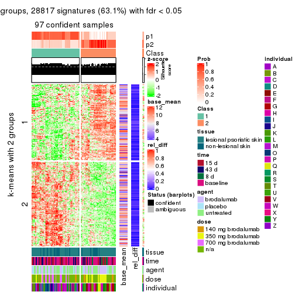</p>

</div>
<div id='tab-SD-pam-get-signatures-2'>
<pre><code class="r">get_signatures(res, k = 3)
</code></pre>

<p></p>

</div>
<div id='tab-SD-pam-get-signatures-3'>
<pre><code class="r">get_signatures(res, k = 4)
</code></pre>

<p></p>

</div>
<div id='tab-SD-pam-get-signatures-4'>
<pre><code class="r">get_signatures(res, k = 5)
</code></pre>

<p></p>

</div>
<div id='tab-SD-pam-get-signatures-5'>
<pre><code class="r">get_signatures(res, k = 6)
</code></pre>

<p></p>

</div>
</div>


Signature heatmaps where rows are not scaled:


<script>
$( function() {
	$( '#tabs-SD-pam-get-signatures-no-scale' ).tabs();
} );
</script>
<div id='tabs-SD-pam-get-signatures-no-scale'>
<ul>
<li><a href='#tab-SD-pam-get-signatures-no-scale-1'>k = 2</a></li>
<li><a href='#tab-SD-pam-get-signatures-no-scale-2'>k = 3</a></li>
<li><a href='#tab-SD-pam-get-signatures-no-scale-3'>k = 4</a></li>
<li><a href='#tab-SD-pam-get-signatures-no-scale-4'>k = 5</a></li>
<li><a href='#tab-SD-pam-get-signatures-no-scale-5'>k = 6</a></li>
</ul>
<div id='tab-SD-pam-get-signatures-no-scale-1'>
<pre><code class="r">get_signatures(res, k = 2, scale_rows = FALSE)
</code></pre>

<p></p>

</div>
<div id='tab-SD-pam-get-signatures-no-scale-2'>
<pre><code class="r">get_signatures(res, k = 3, scale_rows = FALSE)
</code></pre>

<p></p>

</div>
<div id='tab-SD-pam-get-signatures-no-scale-3'>
<pre><code class="r">get_signatures(res, k = 4, scale_rows = FALSE)
</code></pre>

<p></p>

</div>
<div id='tab-SD-pam-get-signatures-no-scale-4'>
<pre><code class="r">get_signatures(res, k = 5, scale_rows = FALSE)
</code></pre>

<p></p>

</div>
<div id='tab-SD-pam-get-signatures-no-scale-5'>
<pre><code class="r">get_signatures(res, k = 6, scale_rows = FALSE)
</code></pre>

<p></p>

</div>
</div>


Compare the overlap of signatures from different k:

```r
compare_signatures(res)
```


`get_signature()` returns a data frame invisibly. TO get the list of signatures, the function
call should be assigned to a variable explicitly. In following code, if `plot` argument is set
to `FALSE`, no heatmap is plotted while only the differential analysis is performed.

```r
# code only for demonstration
tb = get_signature(res, k = ..., plot = FALSE)
```

An example of the output of `tb` is:

```
#>   which_row         fdr    mean_1    mean_2 scaled_mean_1 scaled_mean_2 km
#> 1        38 0.042760348  8.373488  9.131774    -0.5533452     0.5164555  1
#> 2        40 0.018707592  7.106213  8.469186    -0.6173731     0.5762149  1
#> 3        55 0.019134737 10.221463 11.207825    -0.6159697     0.5749050  1
#> 4        59 0.006059896  5.921854  7.869574    -0.6899429     0.6439467  1
#> 5        60 0.018055526  8.928898 10.211722    -0.6204761     0.5791110  1
#> 6        98 0.009384629 15.714769 14.887706     0.6635654    -0.6193277  2
...
```

The columns in `tb` are:

1. `which_row`: row indices corresponding to the input matrix.
2. `fdr`: FDR for the differential test. 
3. `mean_x`: The mean value in group x.
4. `scaled_mean_x`: The mean value in group x after rows are scaled.
5. `km`: Row groups if k-means clustering is applied to rows.


UMAP plot which shows how samples are separated.


<script>
$( function() {
	$( '#tabs-SD-pam-dimension-reduction' ).tabs();
} );
</script>
<div id='tabs-SD-pam-dimension-reduction'>
<ul>
<li><a href='#tab-SD-pam-dimension-reduction-1'>k = 2</a></li>
<li><a href='#tab-SD-pam-dimension-reduction-2'>k = 3</a></li>
<li><a href='#tab-SD-pam-dimension-reduction-3'>k = 4</a></li>
<li><a href='#tab-SD-pam-dimension-reduction-4'>k = 5</a></li>
<li><a href='#tab-SD-pam-dimension-reduction-5'>k = 6</a></li>
</ul>
<div id='tab-SD-pam-dimension-reduction-1'>
<pre><code class="r">dimension_reduction(res, k = 2, method = &quot;UMAP&quot;)
</code></pre>

<p></p>

</div>
<div id='tab-SD-pam-dimension-reduction-2'>
<pre><code class="r">dimension_reduction(res, k = 3, method = &quot;UMAP&quot;)
</code></pre>

<p></p>

</div>
<div id='tab-SD-pam-dimension-reduction-3'>
<pre><code class="r">dimension_reduction(res, k = 4, method = &quot;UMAP&quot;)
</code></pre>

<p></p>

</div>
<div id='tab-SD-pam-dimension-reduction-4'>
<pre><code class="r">dimension_reduction(res, k = 5, method = &quot;UMAP&quot;)
</code></pre>

<p>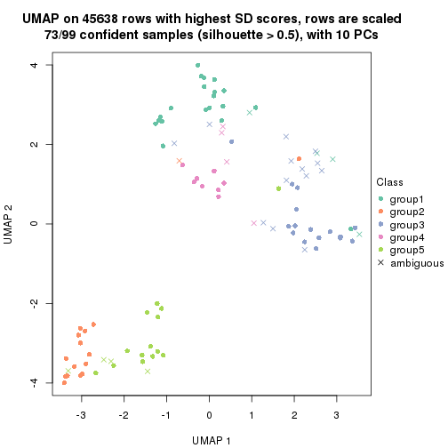</p>

</div>
<div id='tab-SD-pam-dimension-reduction-5'>
<pre><code class="r">dimension_reduction(res, k = 6, method = &quot;UMAP&quot;)
</code></pre>

<p></p>

</div>
</div>


Following heatmap shows how subgroups are split when increasing `k`:

```r
collect_classes(res)
```


Test correlation between subgroups and known annotations. If the known
annotation is numeric, one-way ANOVA test is applied, and if the known
annotation is discrete, chi-squared contingency table test is applied.

```r
test_to_known_factors(res)
```

```
#>         n tissue(p) time(p) agent(p)  dose(p) individual(p) k
#> SD:pam 97  9.15e-01  0.0508   0.6488 1.74e-05      5.77e-07 2
#> SD:pam 92  6.16e-03  0.0236   0.0118 7.56e-08      6.82e-08 3
#> SD:pam 84  3.72e-05  0.0184   0.0251 7.63e-08      9.02e-05 4
#> SD:pam 73  7.44e-04  0.2673   0.0496 3.06e-08      5.34e-06 5
#> SD:pam 88  2.04e-04  0.1396   0.1738 6.20e-06      1.27e-07 6
```


If matrix rows can be associated to genes, consider to use `functional_enrichment(res,
...)` to perform function enrichment for the signature genes. See [this vignette](http://bioconductor.org/packages/devel/bioc/vignettes/cola/inst/doc/functional_enrichment.html) for more detailed explanations.


 

---------------------------------------------------


### SD:mclust


The object with results only for a single top-value method and a single partition method 
can be extracted as:

```r
res = res_list["SD", "mclust"]
# you can also extract it by
# res = res_list["SD:mclust"]
```

A summary of `res` and all the functions that can be applied to it:

```r
res
```

```
#> A 'ConsensusPartition' object with k = 2, 3, 4, 5, 6.
#>   On a matrix with 45638 rows and 99 columns.
#>   Top rows (1000, 2000, 3000, 4000, 5000) are extracted by 'SD' method.
#>   Subgroups are detected by 'mclust' method.
#>   Performed in total 1250 partitions by row resampling.
#>   Best k for subgroups seems to be 5.
#> 
#> Following methods can be applied to this 'ConsensusPartition' object:
#>  [1] "cola_report"             "collect_classes"         "collect_plots"          
#>  [4] "collect_stats"           "colnames"                "compare_signatures"     
#>  [7] "consensus_heatmap"       "dimension_reduction"     "functional_enrichment"  
#> [10] "get_anno_col"            "get_anno"                "get_classes"            
#> [13] "get_consensus"           "get_matrix"              "get_membership"         
#> [16] "get_param"               "get_signatures"          "get_stats"              
#> [19] "is_best_k"               "is_stable_k"             "membership_heatmap"     
#> [22] "ncol"                    "nrow"                    "plot_ecdf"              
#> [25] "rownames"                "select_partition_number" "show"                   
#> [28] "suggest_best_k"          "test_to_known_factors"
```

`collect_plots()` function collects all the plots made from `res` for all `k` (number of partitions)
into one single page to provide an easy and fast comparison between different `k`.

```r
collect_plots(res)
```


The plots are:

- The first row: a plot of the ECDF (empirical cumulative distribution
  function) curves of the consensus matrix for each `k` and the heatmap of
  predicted classes for each `k`.
- The second row: heatmaps of the consensus matrix for each `k`.
- The third row: heatmaps of the membership matrix for each `k`.
- The fouth row: heatmaps of the signatures for each `k`.

All the plots in panels can be made by individual functions and they are
plotted later in this section.

`select_partition_number()` produces several plots showing different
statistics for choosing "optimized" `k`. There are following statistics:

- ECDF curves of the consensus matrix for each `k`;
- 1-PAC. [The PAC
  score](https://en.wikipedia.org/wiki/Consensus_clustering#Over-interpretation_potential_of_consensus_clustering)
  measures the proportion of the ambiguous subgrouping.
- Mean silhouette score.
- Concordance. The mean probability of fiting the consensus class ids in all
  partitions.
- Area increased. Denote $A_k$ as the area under the ECDF curve for current
  `k`, the area increased is defined as $A_k - A_{k-1}$.
- Rand index. The percent of pairs of samples that are both in a same cluster
  or both are not in a same cluster in the partition of k and k-1.
- Jaccard index. The ratio of pairs of samples are both in a same cluster in
  the partition of k and k-1 and the pairs of samples are both in a same
  cluster in the partition k or k-1.

The detailed explanations of these statistics can be found in [the _cola_
vignette](http://bioconductor.org/packages/devel/bioc/vignettes/cola/inst/doc/cola.html#toc_13).

Generally speaking, lower PAC score, higher mean silhouette score or higher
concordance corresponds to better partition. Rand index and Jaccard index
measure how similar the current partition is compared to partition with `k-1`.
If they are too similar, we won't accept `k` is better than `k-1`.

```r
select_partition_number(res)
```


The numeric values for all these statistics can be obtained by `get_stats()`.

```r
get_stats(res)
```

```
#>   k 1-PAC mean_silhouette concordance area_increased  Rand Jaccard
#> 2 2 0.430           0.716       0.813         0.4163 0.514   0.514
#> 3 3 0.757           0.846       0.925         0.5810 0.793   0.605
#> 4 4 0.632           0.691       0.781         0.0817 0.811   0.514
#> 5 5 0.871           0.881       0.927         0.1029 0.831   0.475
#> 6 6 0.763           0.714       0.853         0.0430 0.877   0.510
```

`suggest_best_k()` suggests the best $k$ based on these statistics. The rules are as follows:

- All $k$ with Jaccard index larger than 0.95 are removed because increasing
  $k$ does not provide enough extra information. If all $k$ are removed, it is
  marked as no subgroup is detected.
- For all $k$ with 1-PAC score larger than 0.9, the maximal $k$ is taken as
  the best $k$, and other $k$ are marked as optional $k$.
- If it does not fit the second rule. The $k$ with the maximal vote of the
  highest 1-PAC score, highest mean silhouette, and highest concordance is
  taken as the best $k$.

```r
suggest_best_k(res)
```

```
#> [1] 5
```


Following shows the table of the partitions (You need to click the **show/hide
code output** link to see it). The membership matrix (columns with name `p*`)
is inferred by
[`clue::cl_consensus()`](https://www.rdocumentation.org/link/cl_consensus?package=clue)
function with the `SE` method. Basically the value in the membership matrix
represents the probability to belong to a certain group. The finall class
label for an item is determined with the group with highest probability it
belongs to.

In `get_classes()` function, the entropy is calculated from the membership
matrix and the silhouette score is calculated from the consensus matrix.


<script>
$( function() {
	$( '#tabs-SD-mclust-get-classes' ).tabs();
} );
</script>
<div id='tabs-SD-mclust-get-classes'>
<ul>
<li><a href='#tab-SD-mclust-get-classes-1'>k = 2</a></li>
<li><a href='#tab-SD-mclust-get-classes-2'>k = 3</a></li>
<li><a href='#tab-SD-mclust-get-classes-3'>k = 4</a></li>
<li><a href='#tab-SD-mclust-get-classes-4'>k = 5</a></li>
<li><a href='#tab-SD-mclust-get-classes-5'>k = 6</a></li>
</ul>

<div id='tab-SD-mclust-get-classes-1'>
<p><a id='tab-SD-mclust-get-classes-1-a' style='color:#0366d6' href='#'>show/hide code output</a></p>
<pre><code class="r">cbind(get_classes(res, k = 2), get_membership(res, k = 2))
</code></pre>

<pre><code>#&gt;            class entropy silhouette    p1    p2
#&gt; GSM1296094     1   0.983      0.683 0.576 0.424
#&gt; GSM1296119     2   0.000      0.919 0.000 1.000
#&gt; GSM1296076     1   0.996      0.614 0.536 0.464
#&gt; GSM1296092     1   0.996      0.614 0.536 0.464
#&gt; GSM1296103     1   0.983      0.683 0.576 0.424
#&gt; GSM1296078     1   0.996      0.614 0.536 0.464
#&gt; GSM1296107     2   0.000      0.919 0.000 1.000
#&gt; GSM1296109     1   0.983      0.683 0.576 0.424
#&gt; GSM1296080     1   0.971      0.694 0.600 0.400
#&gt; GSM1296090     1   0.996      0.614 0.536 0.464
#&gt; GSM1296074     1   0.996      0.614 0.536 0.464
#&gt; GSM1296111     2   0.000      0.919 0.000 1.000
#&gt; GSM1296099     1   0.983      0.683 0.576 0.424
#&gt; GSM1296086     1   0.996      0.614 0.536 0.464
#&gt; GSM1296117     2   0.000      0.919 0.000 1.000
#&gt; GSM1296113     2   0.000      0.919 0.000 1.000
#&gt; GSM1296096     1   0.983      0.683 0.576 0.424
#&gt; GSM1296105     1   0.983      0.683 0.576 0.424
#&gt; GSM1296098     1   0.983      0.683 0.576 0.424
#&gt; GSM1296101     1   0.983      0.683 0.576 0.424
#&gt; GSM1296121     2   0.000      0.919 0.000 1.000
#&gt; GSM1296088     1   0.971      0.694 0.600 0.400
#&gt; GSM1296082     1   0.996      0.614 0.536 0.464
#&gt; GSM1296115     2   0.000      0.919 0.000 1.000
#&gt; GSM1296084     1   0.971      0.694 0.600 0.400
#&gt; GSM1296072     2   0.000      0.919 0.000 1.000
#&gt; GSM1296069     2   0.000      0.919 0.000 1.000
#&gt; GSM1296071     2   0.000      0.919 0.000 1.000
#&gt; GSM1296070     2   0.000      0.919 0.000 1.000
#&gt; GSM1296073     2   0.000      0.919 0.000 1.000
#&gt; GSM1296034     1   0.983      0.683 0.576 0.424
#&gt; GSM1296041     2   0.000      0.919 0.000 1.000
#&gt; GSM1296035     1   0.983      0.683 0.576 0.424
#&gt; GSM1296038     2   0.999     -0.513 0.480 0.520
#&gt; GSM1296047     2   0.000      0.919 0.000 1.000
#&gt; GSM1296039     1   1.000      0.574 0.512 0.488
#&gt; GSM1296042     2   0.000      0.919 0.000 1.000
#&gt; GSM1296043     2   0.000      0.919 0.000 1.000
#&gt; GSM1296037     1   0.000      0.619 1.000 0.000
#&gt; GSM1296046     2   0.000      0.919 0.000 1.000
#&gt; GSM1296044     2   0.000      0.919 0.000 1.000
#&gt; GSM1296045     2   0.000      0.919 0.000 1.000
#&gt; GSM1296025     1   0.000      0.619 1.000 0.000
#&gt; GSM1296033     1   0.971      0.694 0.600 0.400
#&gt; GSM1296027     1   0.000      0.619 1.000 0.000
#&gt; GSM1296032     1   0.000      0.619 1.000 0.000
#&gt; GSM1296024     1   0.000      0.619 1.000 0.000
#&gt; GSM1296031     1   0.204      0.625 0.968 0.032
#&gt; GSM1296028     1   0.000      0.619 1.000 0.000
#&gt; GSM1296029     1   0.000      0.619 1.000 0.000
#&gt; GSM1296026     1   0.971      0.694 0.600 0.400
#&gt; GSM1296030     1   0.971      0.694 0.600 0.400
#&gt; GSM1296040     1   0.983      0.683 0.576 0.424
#&gt; GSM1296036     1   0.983      0.683 0.576 0.424
#&gt; GSM1296048     2   0.000      0.919 0.000 1.000
#&gt; GSM1296059     1   0.983      0.683 0.576 0.424
#&gt; GSM1296066     2   0.000      0.919 0.000 1.000
#&gt; GSM1296060     1   0.983      0.683 0.576 0.424
#&gt; GSM1296063     2   0.311      0.861 0.056 0.944
#&gt; GSM1296064     2   0.998     -0.502 0.476 0.524
#&gt; GSM1296067     2   0.518      0.777 0.116 0.884
#&gt; GSM1296062     1   0.983      0.683 0.576 0.424
#&gt; GSM1296068     2   0.000      0.919 0.000 1.000
#&gt; GSM1296050     1   0.788      0.647 0.764 0.236
#&gt; GSM1296057     1   0.971      0.694 0.600 0.400
#&gt; GSM1296052     1   0.000      0.619 1.000 0.000
#&gt; GSM1296054     1   0.000      0.619 1.000 0.000
#&gt; GSM1296049     1   0.000      0.619 1.000 0.000
#&gt; GSM1296055     2   0.662      0.685 0.172 0.828
#&gt; GSM1296053     1   0.000      0.619 1.000 0.000
#&gt; GSM1296058     1   0.971      0.694 0.600 0.400
#&gt; GSM1296051     1   0.993      0.634 0.548 0.452
#&gt; GSM1296056     1   0.983      0.673 0.576 0.424
#&gt; GSM1296065     2   0.343      0.855 0.064 0.936
#&gt; GSM1296061     1   0.983      0.683 0.576 0.424
#&gt; GSM1296095     2   0.529      0.771 0.120 0.880
#&gt; GSM1296120     2   0.000      0.919 0.000 1.000
#&gt; GSM1296077     1   0.000      0.619 1.000 0.000
#&gt; GSM1296093     1   0.000      0.619 1.000 0.000
#&gt; GSM1296104     2   0.653      0.686 0.168 0.832
#&gt; GSM1296079     1   0.000      0.619 1.000 0.000
#&gt; GSM1296108     2   0.000      0.919 0.000 1.000
#&gt; GSM1296110     2   0.000      0.919 0.000 1.000
#&gt; GSM1296081     1   0.000      0.619 1.000 0.000
#&gt; GSM1296091     1   0.971      0.694 0.600 0.400
#&gt; GSM1296075     1   0.999      0.580 0.520 0.480
#&gt; GSM1296112     2   0.000      0.919 0.000 1.000
#&gt; GSM1296100     1   0.000      0.619 1.000 0.000
#&gt; GSM1296087     1   0.881      0.677 0.700 0.300
#&gt; GSM1296118     2   0.000      0.919 0.000 1.000
#&gt; GSM1296114     2   0.000      0.919 0.000 1.000
#&gt; GSM1296097     2   0.738      0.577 0.208 0.792
#&gt; GSM1296106     2   0.529      0.771 0.120 0.880
#&gt; GSM1296102     1   0.975      0.688 0.592 0.408
#&gt; GSM1296122     2   0.000      0.919 0.000 1.000
#&gt; GSM1296089     1   0.529      0.626 0.880 0.120
#&gt; GSM1296083     1   0.000      0.619 1.000 0.000
#&gt; GSM1296116     2   0.000      0.919 0.000 1.000
#&gt; GSM1296085     1   0.000      0.619 1.000 0.000
</code></pre>

<script>
$('#tab-SD-mclust-get-classes-1-a').parent().next().next().hide();
$('#tab-SD-mclust-get-classes-1-a').click(function(){
  $('#tab-SD-mclust-get-classes-1-a').parent().next().next().toggle();
  return(false);
});
</script>
</div>

<div id='tab-SD-mclust-get-classes-2'>
<p><a id='tab-SD-mclust-get-classes-2-a' style='color:#0366d6' href='#'>show/hide code output</a></p>
<pre><code class="r">cbind(get_classes(res, k = 3), get_membership(res, k = 3))
</code></pre>

<pre><code>#&gt;            class entropy silhouette    p1    p2    p3
#&gt; GSM1296094     3  0.0000      0.990 0.000 0.000 1.000
#&gt; GSM1296119     2  0.0000      0.897 0.000 1.000 0.000
#&gt; GSM1296076     3  0.0000      0.990 0.000 0.000 1.000
#&gt; GSM1296092     3  0.0000      0.990 0.000 0.000 1.000
#&gt; GSM1296103     3  0.0000      0.990 0.000 0.000 1.000
#&gt; GSM1296078     3  0.0000      0.990 0.000 0.000 1.000
#&gt; GSM1296107     2  0.0000      0.897 0.000 1.000 0.000
#&gt; GSM1296109     3  0.4452      0.736 0.000 0.192 0.808
#&gt; GSM1296080     3  0.0000      0.990 0.000 0.000 1.000
#&gt; GSM1296090     3  0.0000      0.990 0.000 0.000 1.000
#&gt; GSM1296074     3  0.0000      0.990 0.000 0.000 1.000
#&gt; GSM1296111     2  0.0000      0.897 0.000 1.000 0.000
#&gt; GSM1296099     3  0.0000      0.990 0.000 0.000 1.000
#&gt; GSM1296086     3  0.0000      0.990 0.000 0.000 1.000
#&gt; GSM1296117     2  0.0000      0.897 0.000 1.000 0.000
#&gt; GSM1296113     2  0.0000      0.897 0.000 1.000 0.000
#&gt; GSM1296096     3  0.0000      0.990 0.000 0.000 1.000
#&gt; GSM1296105     1  0.6192      0.448 0.580 0.000 0.420
#&gt; GSM1296098     3  0.0000      0.990 0.000 0.000 1.000
#&gt; GSM1296101     3  0.0000      0.990 0.000 0.000 1.000
#&gt; GSM1296121     2  0.0000      0.897 0.000 1.000 0.000
#&gt; GSM1296088     3  0.0000      0.990 0.000 0.000 1.000
#&gt; GSM1296082     3  0.0000      0.990 0.000 0.000 1.000
#&gt; GSM1296115     2  0.0000      0.897 0.000 1.000 0.000
#&gt; GSM1296084     3  0.0237      0.986 0.004 0.000 0.996
#&gt; GSM1296072     2  0.0000      0.897 0.000 1.000 0.000
#&gt; GSM1296069     2  0.0000      0.897 0.000 1.000 0.000
#&gt; GSM1296071     2  0.0000      0.897 0.000 1.000 0.000
#&gt; GSM1296070     2  0.0000      0.897 0.000 1.000 0.000
#&gt; GSM1296073     2  0.0000      0.897 0.000 1.000 0.000
#&gt; GSM1296034     1  0.6274      0.360 0.544 0.000 0.456
#&gt; GSM1296041     2  0.0000      0.897 0.000 1.000 0.000
#&gt; GSM1296035     3  0.0000      0.990 0.000 0.000 1.000
#&gt; GSM1296038     2  0.6280      0.264 0.000 0.540 0.460
#&gt; GSM1296047     2  0.0000      0.897 0.000 1.000 0.000
#&gt; GSM1296039     3  0.0000      0.990 0.000 0.000 1.000
#&gt; GSM1296042     2  0.0000      0.897 0.000 1.000 0.000
#&gt; GSM1296043     2  0.0000      0.897 0.000 1.000 0.000
#&gt; GSM1296037     1  0.0000      0.870 1.000 0.000 0.000
#&gt; GSM1296046     2  0.0000      0.897 0.000 1.000 0.000
#&gt; GSM1296044     2  0.0000      0.897 0.000 1.000 0.000
#&gt; GSM1296045     2  0.0000      0.897 0.000 1.000 0.000
#&gt; GSM1296025     1  0.0000      0.870 1.000 0.000 0.000
#&gt; GSM1296033     1  0.5098      0.740 0.752 0.000 0.248
#&gt; GSM1296027     1  0.0000      0.870 1.000 0.000 0.000
#&gt; GSM1296032     1  0.0000      0.870 1.000 0.000 0.000
#&gt; GSM1296024     1  0.0000      0.870 1.000 0.000 0.000
#&gt; GSM1296031     1  0.2878      0.837 0.904 0.000 0.096
#&gt; GSM1296028     1  0.0000      0.870 1.000 0.000 0.000
#&gt; GSM1296029     1  0.0747      0.866 0.984 0.000 0.016
#&gt; GSM1296026     3  0.0000      0.990 0.000 0.000 1.000
#&gt; GSM1296030     3  0.0424      0.982 0.008 0.000 0.992
#&gt; GSM1296040     3  0.0000      0.990 0.000 0.000 1.000
#&gt; GSM1296036     3  0.0000      0.990 0.000 0.000 1.000
#&gt; GSM1296048     2  0.0000      0.897 0.000 1.000 0.000
#&gt; GSM1296059     3  0.0000      0.990 0.000 0.000 1.000
#&gt; GSM1296066     2  0.0000      0.897 0.000 1.000 0.000
#&gt; GSM1296060     3  0.0000      0.990 0.000 0.000 1.000
#&gt; GSM1296063     2  0.6421      0.351 0.004 0.572 0.424
#&gt; GSM1296064     3  0.0237      0.986 0.000 0.004 0.996
#&gt; GSM1296067     2  0.4842      0.693 0.000 0.776 0.224
#&gt; GSM1296062     3  0.0000      0.990 0.000 0.000 1.000
#&gt; GSM1296068     2  0.0000      0.897 0.000 1.000 0.000
#&gt; GSM1296050     1  0.4750      0.767 0.784 0.000 0.216
#&gt; GSM1296057     1  0.5098      0.740 0.752 0.000 0.248
#&gt; GSM1296052     1  0.0000      0.870 1.000 0.000 0.000
#&gt; GSM1296054     1  0.0000      0.870 1.000 0.000 0.000
#&gt; GSM1296049     1  0.0000      0.870 1.000 0.000 0.000
#&gt; GSM1296055     1  0.9800      0.158 0.412 0.344 0.244
#&gt; GSM1296053     1  0.0000      0.870 1.000 0.000 0.000
#&gt; GSM1296058     1  0.5098      0.740 0.752 0.000 0.248
#&gt; GSM1296051     3  0.1411      0.948 0.036 0.000 0.964
#&gt; GSM1296056     3  0.0000      0.990 0.000 0.000 1.000
#&gt; GSM1296065     2  0.9170      0.404 0.212 0.540 0.248
#&gt; GSM1296061     3  0.0000      0.990 0.000 0.000 1.000
#&gt; GSM1296095     2  0.4887      0.688 0.000 0.772 0.228
#&gt; GSM1296120     2  0.1289      0.873 0.032 0.968 0.000
#&gt; GSM1296077     1  0.0000      0.870 1.000 0.000 0.000
#&gt; GSM1296093     1  0.0000      0.870 1.000 0.000 0.000
#&gt; GSM1296104     2  0.9271      0.375 0.228 0.528 0.244
#&gt; GSM1296079     1  0.0000      0.870 1.000 0.000 0.000
#&gt; GSM1296108     2  0.0000      0.897 0.000 1.000 0.000
#&gt; GSM1296110     2  0.0000      0.897 0.000 1.000 0.000
#&gt; GSM1296081     1  0.0000      0.870 1.000 0.000 0.000
#&gt; GSM1296091     1  0.5098      0.740 0.752 0.000 0.248
#&gt; GSM1296075     1  0.5098      0.740 0.752 0.000 0.248
#&gt; GSM1296112     2  0.0000      0.897 0.000 1.000 0.000
#&gt; GSM1296100     1  0.0000      0.870 1.000 0.000 0.000
#&gt; GSM1296087     1  0.3879      0.809 0.848 0.000 0.152
#&gt; GSM1296118     2  0.0000      0.897 0.000 1.000 0.000
#&gt; GSM1296114     2  0.0000      0.897 0.000 1.000 0.000
#&gt; GSM1296097     2  0.9175      0.402 0.216 0.540 0.244
#&gt; GSM1296106     2  0.9175      0.402 0.216 0.540 0.244
#&gt; GSM1296102     1  0.5098      0.740 0.752 0.000 0.248
#&gt; GSM1296122     2  0.7899      0.591 0.144 0.664 0.192
#&gt; GSM1296089     1  0.4555      0.779 0.800 0.000 0.200
#&gt; GSM1296083     1  0.0000      0.870 1.000 0.000 0.000
#&gt; GSM1296116     2  0.0000      0.897 0.000 1.000 0.000
#&gt; GSM1296085     1  0.0000      0.870 1.000 0.000 0.000
</code></pre>

<script>
$('#tab-SD-mclust-get-classes-2-a').parent().next().next().hide();
$('#tab-SD-mclust-get-classes-2-a').click(function(){
  $('#tab-SD-mclust-get-classes-2-a').parent().next().next().toggle();
  return(false);
});
</script>
</div>

<div id='tab-SD-mclust-get-classes-3'>
<p><a id='tab-SD-mclust-get-classes-3-a' style='color:#0366d6' href='#'>show/hide code output</a></p>
<pre><code class="r">cbind(get_classes(res, k = 4), get_membership(res, k = 4))
</code></pre>

<pre><code>#&gt;            class entropy silhouette    p1    p2    p3    p4
#&gt; GSM1296094     3  0.4697      0.884 0.000 0.000 0.644 0.356
#&gt; GSM1296119     2  0.5436      0.789 0.000 0.620 0.356 0.024
#&gt; GSM1296076     4  0.0000      0.537 0.000 0.000 0.000 1.000
#&gt; GSM1296092     4  0.0000      0.537 0.000 0.000 0.000 1.000
#&gt; GSM1296103     3  0.4746      0.888 0.000 0.000 0.632 0.368
#&gt; GSM1296078     4  0.0000      0.537 0.000 0.000 0.000 1.000
#&gt; GSM1296107     2  0.4872      0.797 0.000 0.640 0.356 0.004
#&gt; GSM1296109     3  0.6347      0.733 0.000 0.064 0.524 0.412
#&gt; GSM1296080     3  0.4855      0.849 0.000 0.000 0.600 0.400
#&gt; GSM1296090     4  0.0469      0.534 0.000 0.000 0.012 0.988
#&gt; GSM1296074     4  0.1211      0.517 0.000 0.000 0.040 0.960
#&gt; GSM1296111     2  0.4872      0.797 0.000 0.640 0.356 0.004
#&gt; GSM1296099     3  0.4941      0.815 0.000 0.000 0.564 0.436
#&gt; GSM1296086     4  0.1211      0.515 0.000 0.000 0.040 0.960
#&gt; GSM1296117     2  0.5127      0.794 0.000 0.632 0.356 0.012
#&gt; GSM1296113     2  0.4872      0.797 0.000 0.640 0.356 0.004
#&gt; GSM1296096     3  0.4996      0.717 0.000 0.000 0.516 0.484
#&gt; GSM1296105     4  0.7150      0.200 0.384 0.000 0.136 0.480
#&gt; GSM1296098     3  0.4697      0.884 0.000 0.000 0.644 0.356
#&gt; GSM1296101     3  0.4776      0.885 0.000 0.000 0.624 0.376
#&gt; GSM1296121     2  0.6069      0.772 0.000 0.588 0.356 0.056
#&gt; GSM1296088     4  0.2868      0.412 0.000 0.000 0.136 0.864
#&gt; GSM1296082     4  0.0336      0.535 0.000 0.000 0.008 0.992
#&gt; GSM1296115     2  0.4872      0.797 0.000 0.640 0.356 0.004
#&gt; GSM1296084     4  0.5669      0.384 0.200 0.000 0.092 0.708
#&gt; GSM1296072     2  0.4121      0.698 0.000 0.796 0.020 0.184
#&gt; GSM1296069     2  0.3486      0.821 0.000 0.812 0.188 0.000
#&gt; GSM1296071     2  0.0000      0.828 0.000 1.000 0.000 0.000
#&gt; GSM1296070     2  0.4697      0.797 0.000 0.644 0.356 0.000
#&gt; GSM1296073     2  0.6200      0.767 0.000 0.580 0.356 0.064
#&gt; GSM1296034     3  0.7686      0.446 0.228 0.000 0.436 0.336
#&gt; GSM1296041     2  0.4872      0.797 0.000 0.640 0.356 0.004
#&gt; GSM1296035     3  0.4996      0.716 0.000 0.000 0.516 0.484
#&gt; GSM1296038     4  0.4507      0.437 0.000 0.224 0.020 0.756
#&gt; GSM1296047     2  0.0707      0.821 0.000 0.980 0.000 0.020
#&gt; GSM1296039     4  0.2334      0.477 0.000 0.004 0.088 0.908
#&gt; GSM1296042     2  0.4872      0.797 0.000 0.640 0.356 0.004
#&gt; GSM1296043     2  0.0188      0.829 0.000 0.996 0.004 0.000
#&gt; GSM1296037     1  0.0000      0.927 1.000 0.000 0.000 0.000
#&gt; GSM1296046     2  0.0000      0.828 0.000 1.000 0.000 0.000
#&gt; GSM1296044     2  0.0000      0.828 0.000 1.000 0.000 0.000
#&gt; GSM1296045     2  0.0336      0.829 0.000 0.992 0.008 0.000
#&gt; GSM1296025     1  0.0000      0.927 1.000 0.000 0.000 0.000
#&gt; GSM1296033     4  0.4720      0.408 0.324 0.000 0.004 0.672
#&gt; GSM1296027     1  0.0188      0.926 0.996 0.000 0.000 0.004
#&gt; GSM1296032     1  0.0188      0.926 0.996 0.000 0.000 0.004
#&gt; GSM1296024     1  0.0000      0.927 1.000 0.000 0.000 0.000
#&gt; GSM1296031     1  0.3356      0.757 0.824 0.000 0.000 0.176
#&gt; GSM1296028     1  0.0817      0.913 0.976 0.000 0.000 0.024
#&gt; GSM1296029     1  0.1118      0.903 0.964 0.000 0.000 0.036
#&gt; GSM1296026     4  0.3435      0.458 0.036 0.000 0.100 0.864
#&gt; GSM1296030     4  0.5775      0.373 0.212 0.000 0.092 0.696
#&gt; GSM1296040     3  0.4761      0.887 0.000 0.000 0.628 0.372
#&gt; GSM1296036     3  0.4697      0.884 0.000 0.000 0.644 0.356
#&gt; GSM1296048     2  0.6136      0.770 0.000 0.584 0.356 0.060
#&gt; GSM1296059     3  0.4761      0.887 0.000 0.000 0.628 0.372
#&gt; GSM1296066     2  0.4872      0.797 0.000 0.640 0.356 0.004
#&gt; GSM1296060     4  0.4955     -0.561 0.000 0.000 0.444 0.556
#&gt; GSM1296063     4  0.3278      0.506 0.000 0.116 0.020 0.864
#&gt; GSM1296064     4  0.2334      0.521 0.000 0.088 0.004 0.908
#&gt; GSM1296067     2  0.2342      0.765 0.000 0.912 0.008 0.080
#&gt; GSM1296062     3  0.4713      0.885 0.000 0.000 0.640 0.360
#&gt; GSM1296068     2  0.0000      0.828 0.000 1.000 0.000 0.000
#&gt; GSM1296050     1  0.3486      0.741 0.812 0.000 0.000 0.188
#&gt; GSM1296057     4  0.5161      0.309 0.476 0.000 0.004 0.520
#&gt; GSM1296052     1  0.0000      0.927 1.000 0.000 0.000 0.000
#&gt; GSM1296054     1  0.0000      0.927 1.000 0.000 0.000 0.000
#&gt; GSM1296049     1  0.0000      0.927 1.000 0.000 0.000 0.000
#&gt; GSM1296055     4  0.6964      0.434 0.196 0.196 0.004 0.604
#&gt; GSM1296053     1  0.0000      0.927 1.000 0.000 0.000 0.000
#&gt; GSM1296058     4  0.5161      0.309 0.476 0.000 0.004 0.520
#&gt; GSM1296051     4  0.0592      0.534 0.000 0.000 0.016 0.984
#&gt; GSM1296056     4  0.1389      0.512 0.000 0.000 0.048 0.952
#&gt; GSM1296065     4  0.4898      0.408 0.000 0.260 0.024 0.716
#&gt; GSM1296061     3  0.4697      0.884 0.000 0.000 0.644 0.356
#&gt; GSM1296095     4  0.5781      0.174 0.000 0.480 0.028 0.492
#&gt; GSM1296120     2  0.1913      0.798 0.040 0.940 0.000 0.020
#&gt; GSM1296077     1  0.0000      0.927 1.000 0.000 0.000 0.000
#&gt; GSM1296093     1  0.0000      0.927 1.000 0.000 0.000 0.000
#&gt; GSM1296104     4  0.5620      0.456 0.052 0.220 0.012 0.716
#&gt; GSM1296079     1  0.0000      0.927 1.000 0.000 0.000 0.000
#&gt; GSM1296108     2  0.0000      0.828 0.000 1.000 0.000 0.000
#&gt; GSM1296110     2  0.0000      0.828 0.000 1.000 0.000 0.000
#&gt; GSM1296081     1  0.0000      0.927 1.000 0.000 0.000 0.000
#&gt; GSM1296091     4  0.5161      0.309 0.476 0.000 0.004 0.520
#&gt; GSM1296075     4  0.4991      0.372 0.388 0.000 0.004 0.608
#&gt; GSM1296112     2  0.0000      0.828 0.000 1.000 0.000 0.000
#&gt; GSM1296100     1  0.0188      0.925 0.996 0.000 0.000 0.004
#&gt; GSM1296087     1  0.3266      0.768 0.832 0.000 0.000 0.168
#&gt; GSM1296118     2  0.0336      0.826 0.000 0.992 0.000 0.008
#&gt; GSM1296114     2  0.0000      0.828 0.000 1.000 0.000 0.000
#&gt; GSM1296097     4  0.6847      0.431 0.140 0.232 0.008 0.620
#&gt; GSM1296106     4  0.6411      0.296 0.056 0.424 0.004 0.516
#&gt; GSM1296102     1  0.5353     -0.072 0.556 0.000 0.012 0.432
#&gt; GSM1296122     2  0.4559      0.642 0.040 0.792 0.004 0.164
#&gt; GSM1296089     1  0.3626      0.743 0.812 0.000 0.004 0.184
#&gt; GSM1296083     1  0.0000      0.927 1.000 0.000 0.000 0.000
#&gt; GSM1296116     2  0.0000      0.828 0.000 1.000 0.000 0.000
#&gt; GSM1296085     1  0.0188      0.926 0.996 0.000 0.000 0.004
</code></pre>

<script>
$('#tab-SD-mclust-get-classes-3-a').parent().next().next().hide();
$('#tab-SD-mclust-get-classes-3-a').click(function(){
  $('#tab-SD-mclust-get-classes-3-a').parent().next().next().toggle();
  return(false);
});
</script>
</div>

<div id='tab-SD-mclust-get-classes-4'>
<p><a id='tab-SD-mclust-get-classes-4-a' style='color:#0366d6' href='#'>show/hide code output</a></p>
<pre><code class="r">cbind(get_classes(res, k = 5), get_membership(res, k = 5))
</code></pre>

<pre><code>#&gt;            class entropy silhouette    p1    p2    p3    p4    p5
#&gt; GSM1296094     3  0.0566     0.9029 0.000 0.000 0.984 0.004 0.012
#&gt; GSM1296119     5  0.1300     0.9326 0.000 0.016 0.000 0.028 0.956
#&gt; GSM1296076     4  0.0000     0.9155 0.000 0.000 0.000 1.000 0.000
#&gt; GSM1296092     4  0.0609     0.9199 0.000 0.000 0.020 0.980 0.000
#&gt; GSM1296103     3  0.0510     0.9027 0.000 0.000 0.984 0.016 0.000
#&gt; GSM1296078     4  0.0000     0.9155 0.000 0.000 0.000 1.000 0.000
#&gt; GSM1296107     5  0.1121     0.9331 0.000 0.044 0.000 0.000 0.956
#&gt; GSM1296109     3  0.2244     0.8748 0.000 0.016 0.920 0.024 0.040
#&gt; GSM1296080     3  0.0566     0.9029 0.000 0.000 0.984 0.004 0.012
#&gt; GSM1296090     4  0.0000     0.9155 0.000 0.000 0.000 1.000 0.000
#&gt; GSM1296074     4  0.0000     0.9155 0.000 0.000 0.000 1.000 0.000
#&gt; GSM1296111     5  0.1281     0.9345 0.000 0.032 0.000 0.012 0.956
#&gt; GSM1296099     3  0.1732     0.8869 0.000 0.000 0.920 0.080 0.000
#&gt; GSM1296086     4  0.1121     0.9171 0.000 0.000 0.044 0.956 0.000
#&gt; GSM1296117     5  0.1300     0.9344 0.000 0.028 0.000 0.016 0.956
#&gt; GSM1296113     5  0.1121     0.9331 0.000 0.044 0.000 0.000 0.956
#&gt; GSM1296096     3  0.3636     0.6970 0.000 0.000 0.728 0.272 0.000
#&gt; GSM1296105     1  0.3693     0.7950 0.808 0.000 0.156 0.032 0.004
#&gt; GSM1296098     3  0.0566     0.9029 0.000 0.000 0.984 0.004 0.012
#&gt; GSM1296101     3  0.1792     0.8846 0.000 0.000 0.916 0.084 0.000
#&gt; GSM1296121     5  0.1300     0.9326 0.000 0.016 0.000 0.028 0.956
#&gt; GSM1296088     4  0.3242     0.8130 0.000 0.000 0.216 0.784 0.000
#&gt; GSM1296082     4  0.0000     0.9155 0.000 0.000 0.000 1.000 0.000
#&gt; GSM1296115     5  0.1300     0.9326 0.000 0.016 0.000 0.028 0.956
#&gt; GSM1296084     4  0.3431     0.8593 0.008 0.000 0.144 0.828 0.020
#&gt; GSM1296072     5  0.2843     0.8336 0.000 0.144 0.008 0.000 0.848
#&gt; GSM1296069     2  0.1544     0.9247 0.000 0.932 0.000 0.000 0.068
#&gt; GSM1296071     2  0.0162     0.9835 0.000 0.996 0.000 0.000 0.004
#&gt; GSM1296070     5  0.1270     0.9299 0.000 0.052 0.000 0.000 0.948
#&gt; GSM1296073     5  0.1300     0.9326 0.000 0.016 0.000 0.028 0.956
#&gt; GSM1296034     3  0.3101     0.8061 0.100 0.024 0.864 0.000 0.012
#&gt; GSM1296041     5  0.1205     0.9340 0.000 0.040 0.000 0.004 0.956
#&gt; GSM1296035     3  0.3684     0.6856 0.000 0.000 0.720 0.280 0.000
#&gt; GSM1296038     5  0.5146     0.6656 0.000 0.024 0.080 0.172 0.724
#&gt; GSM1296047     2  0.0794     0.9700 0.000 0.972 0.000 0.000 0.028
#&gt; GSM1296039     4  0.0963     0.9203 0.000 0.000 0.036 0.964 0.000
#&gt; GSM1296042     5  0.1121     0.9331 0.000 0.044 0.000 0.000 0.956
#&gt; GSM1296043     2  0.0162     0.9827 0.000 0.996 0.000 0.000 0.004
#&gt; GSM1296037     1  0.0000     0.9123 1.000 0.000 0.000 0.000 0.000
#&gt; GSM1296046     2  0.0000     0.9847 0.000 1.000 0.000 0.000 0.000
#&gt; GSM1296044     2  0.0000     0.9847 0.000 1.000 0.000 0.000 0.000
#&gt; GSM1296045     2  0.0290     0.9800 0.000 0.992 0.000 0.000 0.008
#&gt; GSM1296025     1  0.0000     0.9123 1.000 0.000 0.000 0.000 0.000
#&gt; GSM1296033     1  0.7040     0.0442 0.444 0.024 0.084 0.416 0.032
#&gt; GSM1296027     1  0.0000     0.9123 1.000 0.000 0.000 0.000 0.000
#&gt; GSM1296032     1  0.0000     0.9123 1.000 0.000 0.000 0.000 0.000
#&gt; GSM1296024     1  0.0000     0.9123 1.000 0.000 0.000 0.000 0.000
#&gt; GSM1296031     1  0.1012     0.9068 0.968 0.000 0.000 0.012 0.020
#&gt; GSM1296028     1  0.0510     0.9099 0.984 0.000 0.000 0.000 0.016
#&gt; GSM1296029     1  0.0510     0.9099 0.984 0.000 0.000 0.000 0.016
#&gt; GSM1296026     4  0.2929     0.8441 0.000 0.000 0.180 0.820 0.000
#&gt; GSM1296030     4  0.3754     0.8346 0.008 0.000 0.176 0.796 0.020
#&gt; GSM1296040     3  0.0880     0.9000 0.000 0.000 0.968 0.032 0.000
#&gt; GSM1296036     3  0.0566     0.9029 0.000 0.000 0.984 0.004 0.012
#&gt; GSM1296048     5  0.1300     0.9326 0.000 0.016 0.000 0.028 0.956
#&gt; GSM1296059     3  0.1732     0.8867 0.000 0.000 0.920 0.080 0.000
#&gt; GSM1296066     5  0.1121     0.9331 0.000 0.044 0.000 0.000 0.956
#&gt; GSM1296060     3  0.3707     0.6581 0.000 0.000 0.716 0.284 0.000
#&gt; GSM1296063     5  0.3815     0.8289 0.000 0.008 0.080 0.088 0.824
#&gt; GSM1296064     4  0.1124     0.9197 0.000 0.000 0.036 0.960 0.004
#&gt; GSM1296067     2  0.0671     0.9755 0.000 0.980 0.004 0.000 0.016
#&gt; GSM1296062     3  0.0566     0.9029 0.000 0.000 0.984 0.004 0.012
#&gt; GSM1296068     2  0.0000     0.9847 0.000 1.000 0.000 0.000 0.000
#&gt; GSM1296050     1  0.1173     0.9058 0.964 0.004 0.000 0.012 0.020
#&gt; GSM1296057     1  0.3732     0.8464 0.848 0.024 0.084 0.012 0.032
#&gt; GSM1296052     1  0.0000     0.9123 1.000 0.000 0.000 0.000 0.000
#&gt; GSM1296054     1  0.0000     0.9123 1.000 0.000 0.000 0.000 0.000
#&gt; GSM1296049     1  0.0000     0.9123 1.000 0.000 0.000 0.000 0.000
#&gt; GSM1296055     1  0.4132     0.8368 0.828 0.044 0.084 0.012 0.032
#&gt; GSM1296053     1  0.0000     0.9123 1.000 0.000 0.000 0.000 0.000
#&gt; GSM1296058     1  0.6711     0.4716 0.580 0.024 0.084 0.280 0.032
#&gt; GSM1296051     4  0.2727     0.8725 0.000 0.000 0.116 0.868 0.016
#&gt; GSM1296056     4  0.0963     0.9203 0.000 0.000 0.036 0.964 0.000
#&gt; GSM1296065     5  0.3802     0.8154 0.004 0.024 0.084 0.048 0.840
#&gt; GSM1296061     3  0.0566     0.9029 0.000 0.000 0.984 0.004 0.012
#&gt; GSM1296095     5  0.2754     0.8530 0.000 0.040 0.080 0.000 0.880
#&gt; GSM1296120     2  0.0794     0.9700 0.000 0.972 0.000 0.000 0.028
#&gt; GSM1296077     1  0.0000     0.9123 1.000 0.000 0.000 0.000 0.000
#&gt; GSM1296093     1  0.0000     0.9123 1.000 0.000 0.000 0.000 0.000
#&gt; GSM1296104     1  0.7039     0.2950 0.496 0.024 0.084 0.036 0.360
#&gt; GSM1296079     1  0.0000     0.9123 1.000 0.000 0.000 0.000 0.000
#&gt; GSM1296108     2  0.0000     0.9847 0.000 1.000 0.000 0.000 0.000
#&gt; GSM1296110     2  0.0000     0.9847 0.000 1.000 0.000 0.000 0.000
#&gt; GSM1296081     1  0.0000     0.9123 1.000 0.000 0.000 0.000 0.000
#&gt; GSM1296091     1  0.3732     0.8464 0.848 0.024 0.084 0.012 0.032
#&gt; GSM1296075     1  0.4132     0.8368 0.828 0.044 0.084 0.012 0.032
#&gt; GSM1296112     2  0.0000     0.9847 0.000 1.000 0.000 0.000 0.000
#&gt; GSM1296100     1  0.0000     0.9123 1.000 0.000 0.000 0.000 0.000
#&gt; GSM1296087     1  0.0771     0.9086 0.976 0.000 0.000 0.004 0.020
#&gt; GSM1296118     2  0.0510     0.9771 0.000 0.984 0.000 0.000 0.016
#&gt; GSM1296114     2  0.0000     0.9847 0.000 1.000 0.000 0.000 0.000
#&gt; GSM1296097     1  0.4132     0.8368 0.828 0.044 0.084 0.012 0.032
#&gt; GSM1296106     1  0.4171     0.8388 0.828 0.064 0.064 0.012 0.032
#&gt; GSM1296102     1  0.3320     0.8604 0.872 0.024 0.068 0.012 0.024
#&gt; GSM1296122     2  0.1399     0.9507 0.000 0.952 0.020 0.000 0.028
#&gt; GSM1296089     1  0.1173     0.9058 0.964 0.004 0.000 0.012 0.020
#&gt; GSM1296083     1  0.0000     0.9123 1.000 0.000 0.000 0.000 0.000
#&gt; GSM1296116     2  0.0000     0.9847 0.000 1.000 0.000 0.000 0.000
#&gt; GSM1296085     1  0.0162     0.9118 0.996 0.000 0.000 0.000 0.004
</code></pre>

<script>
$('#tab-SD-mclust-get-classes-4-a').parent().next().next().hide();
$('#tab-SD-mclust-get-classes-4-a').click(function(){
  $('#tab-SD-mclust-get-classes-4-a').parent().next().next().toggle();
  return(false);
});
</script>
</div>

<div id='tab-SD-mclust-get-classes-5'>
<p><a id='tab-SD-mclust-get-classes-5-a' style='color:#0366d6' href='#'>show/hide code output</a></p>
<pre><code class="r">cbind(get_classes(res, k = 6), get_membership(res, k = 6))
</code></pre>

<pre><code>#&gt;            class entropy silhouette    p1    p2    p3    p4    p5    p6
#&gt; GSM1296094     3  0.0000     0.7919 0.000 0.000 1.000 0.000 0.000 0.000
#&gt; GSM1296119     5  0.0000     0.9790 0.000 0.000 0.000 0.000 1.000 0.000
#&gt; GSM1296076     4  0.0000     0.8199 0.000 0.000 0.000 1.000 0.000 0.000
#&gt; GSM1296092     4  0.0000     0.8199 0.000 0.000 0.000 1.000 0.000 0.000
#&gt; GSM1296103     3  0.0000     0.7919 0.000 0.000 1.000 0.000 0.000 0.000
#&gt; GSM1296078     4  0.0000     0.8199 0.000 0.000 0.000 1.000 0.000 0.000
#&gt; GSM1296107     5  0.0000     0.9790 0.000 0.000 0.000 0.000 1.000 0.000
#&gt; GSM1296109     3  0.4504     0.6280 0.000 0.000 0.724 0.052 0.196 0.028
#&gt; GSM1296080     3  0.4131     0.2615 0.000 0.000 0.624 0.020 0.000 0.356
#&gt; GSM1296090     4  0.0000     0.8199 0.000 0.000 0.000 1.000 0.000 0.000
#&gt; GSM1296074     4  0.0000     0.8199 0.000 0.000 0.000 1.000 0.000 0.000
#&gt; GSM1296111     5  0.0000     0.9790 0.000 0.000 0.000 0.000 1.000 0.000
#&gt; GSM1296099     3  0.1806     0.7763 0.000 0.000 0.908 0.088 0.000 0.004
#&gt; GSM1296086     4  0.0000     0.8199 0.000 0.000 0.000 1.000 0.000 0.000
#&gt; GSM1296117     5  0.0000     0.9790 0.000 0.000 0.000 0.000 1.000 0.000
#&gt; GSM1296113     5  0.0000     0.9790 0.000 0.000 0.000 0.000 1.000 0.000
#&gt; GSM1296096     3  0.3290     0.6305 0.000 0.000 0.744 0.252 0.000 0.004
#&gt; GSM1296105     6  0.3858     0.6476 0.012 0.000 0.228 0.020 0.000 0.740
#&gt; GSM1296098     3  0.0146     0.7916 0.000 0.000 0.996 0.000 0.000 0.004
#&gt; GSM1296101     3  0.1556     0.7734 0.000 0.000 0.920 0.080 0.000 0.000
#&gt; GSM1296121     5  0.0000     0.9790 0.000 0.000 0.000 0.000 1.000 0.000
#&gt; GSM1296088     3  0.5530     0.3707 0.000 0.000 0.560 0.216 0.000 0.224
#&gt; GSM1296082     4  0.0000     0.8199 0.000 0.000 0.000 1.000 0.000 0.000
#&gt; GSM1296115     5  0.0000     0.9790 0.000 0.000 0.000 0.000 1.000 0.000
#&gt; GSM1296084     6  0.5691     0.2526 0.000 0.000 0.368 0.164 0.000 0.468
#&gt; GSM1296072     2  0.4570     0.6693 0.000 0.704 0.000 0.004 0.188 0.104
#&gt; GSM1296069     2  0.3782     0.3362 0.000 0.588 0.000 0.000 0.412 0.000
#&gt; GSM1296071     2  0.0000     0.8953 0.000 1.000 0.000 0.000 0.000 0.000
#&gt; GSM1296070     5  0.2178     0.8284 0.000 0.132 0.000 0.000 0.868 0.000
#&gt; GSM1296073     5  0.1610     0.8891 0.000 0.000 0.000 0.084 0.916 0.000
#&gt; GSM1296034     6  0.6179     0.2075 0.200 0.000 0.368 0.012 0.000 0.420
#&gt; GSM1296041     5  0.0000     0.9790 0.000 0.000 0.000 0.000 1.000 0.000
#&gt; GSM1296035     3  0.3265     0.6349 0.000 0.000 0.748 0.248 0.000 0.004
#&gt; GSM1296038     4  0.6466    -0.0626 0.000 0.000 0.288 0.364 0.016 0.332
#&gt; GSM1296047     2  0.0260     0.8908 0.000 0.992 0.000 0.000 0.000 0.008
#&gt; GSM1296039     4  0.2432     0.7614 0.000 0.000 0.100 0.876 0.000 0.024
#&gt; GSM1296042     5  0.0000     0.9790 0.000 0.000 0.000 0.000 1.000 0.000
#&gt; GSM1296043     2  0.1765     0.8339 0.000 0.904 0.000 0.000 0.096 0.000
#&gt; GSM1296037     1  0.3847     0.6963 0.644 0.000 0.000 0.008 0.000 0.348
#&gt; GSM1296046     2  0.0000     0.8953 0.000 1.000 0.000 0.000 0.000 0.000
#&gt; GSM1296044     2  0.0000     0.8953 0.000 1.000 0.000 0.000 0.000 0.000
#&gt; GSM1296045     2  0.2260     0.7923 0.000 0.860 0.000 0.000 0.140 0.000
#&gt; GSM1296025     1  0.0000     0.7500 1.000 0.000 0.000 0.000 0.000 0.000
#&gt; GSM1296033     6  0.1036     0.7377 0.004 0.000 0.008 0.024 0.000 0.964
#&gt; GSM1296027     1  0.3198     0.8177 0.740 0.000 0.000 0.000 0.000 0.260
#&gt; GSM1296032     1  0.3198     0.8177 0.740 0.000 0.000 0.000 0.000 0.260
#&gt; GSM1296024     1  0.0000     0.7500 1.000 0.000 0.000 0.000 0.000 0.000
#&gt; GSM1296031     6  0.2996     0.5177 0.228 0.000 0.000 0.000 0.000 0.772
#&gt; GSM1296028     1  0.3607     0.7273 0.652 0.000 0.000 0.000 0.000 0.348
#&gt; GSM1296029     1  0.3867     0.4452 0.512 0.000 0.000 0.000 0.000 0.488
#&gt; GSM1296026     6  0.5758     0.2282 0.000 0.000 0.368 0.176 0.000 0.456
#&gt; GSM1296030     6  0.5691     0.2526 0.000 0.000 0.368 0.164 0.000 0.468
#&gt; GSM1296040     3  0.0000     0.7919 0.000 0.000 1.000 0.000 0.000 0.000
#&gt; GSM1296036     3  0.0146     0.7916 0.000 0.000 0.996 0.000 0.000 0.004
#&gt; GSM1296048     5  0.0000     0.9790 0.000 0.000 0.000 0.000 1.000 0.000
#&gt; GSM1296059     3  0.2178     0.7413 0.000 0.000 0.868 0.132 0.000 0.000
#&gt; GSM1296066     5  0.0000     0.9790 0.000 0.000 0.000 0.000 1.000 0.000
#&gt; GSM1296060     3  0.3333     0.7017 0.000 0.000 0.784 0.192 0.000 0.024
#&gt; GSM1296063     4  0.4407     0.5199 0.000 0.000 0.008 0.664 0.292 0.036
#&gt; GSM1296064     4  0.2432     0.7614 0.000 0.000 0.100 0.876 0.000 0.024
#&gt; GSM1296067     2  0.3804     0.3946 0.000 0.656 0.000 0.008 0.000 0.336
#&gt; GSM1296062     3  0.4004     0.2535 0.000 0.000 0.620 0.012 0.000 0.368
#&gt; GSM1296068     2  0.0000     0.8953 0.000 1.000 0.000 0.000 0.000 0.000
#&gt; GSM1296050     6  0.2883     0.5498 0.212 0.000 0.000 0.000 0.000 0.788
#&gt; GSM1296057     6  0.1167     0.7390 0.012 0.000 0.008 0.020 0.000 0.960
#&gt; GSM1296052     1  0.3198     0.8177 0.740 0.000 0.000 0.000 0.000 0.260
#&gt; GSM1296054     1  0.0000     0.7500 1.000 0.000 0.000 0.000 0.000 0.000
#&gt; GSM1296049     1  0.2941     0.8169 0.780 0.000 0.000 0.000 0.000 0.220
#&gt; GSM1296055     6  0.1167     0.7390 0.012 0.000 0.008 0.020 0.000 0.960
#&gt; GSM1296053     1  0.2883     0.8162 0.788 0.000 0.000 0.000 0.000 0.212
#&gt; GSM1296058     6  0.1167     0.7390 0.012 0.000 0.008 0.020 0.000 0.960
#&gt; GSM1296051     4  0.4654     0.1148 0.000 0.000 0.044 0.544 0.000 0.412
#&gt; GSM1296056     4  0.2432     0.7614 0.000 0.000 0.100 0.876 0.000 0.024
#&gt; GSM1296065     6  0.1483     0.7303 0.000 0.000 0.008 0.036 0.012 0.944
#&gt; GSM1296061     3  0.0260     0.7914 0.000 0.000 0.992 0.000 0.000 0.008
#&gt; GSM1296095     6  0.7297    -0.0314 0.000 0.000 0.312 0.112 0.216 0.360
#&gt; GSM1296120     2  0.0000     0.8953 0.000 1.000 0.000 0.000 0.000 0.000
#&gt; GSM1296077     1  0.3198     0.8177 0.740 0.000 0.000 0.000 0.000 0.260
#&gt; GSM1296093     1  0.0000     0.7500 1.000 0.000 0.000 0.000 0.000 0.000
#&gt; GSM1296104     6  0.1167     0.7356 0.000 0.000 0.008 0.020 0.012 0.960
#&gt; GSM1296079     1  0.3198     0.8177 0.740 0.000 0.000 0.000 0.000 0.260
#&gt; GSM1296108     2  0.0000     0.8953 0.000 1.000 0.000 0.000 0.000 0.000
#&gt; GSM1296110     2  0.0000     0.8953 0.000 1.000 0.000 0.000 0.000 0.000
#&gt; GSM1296081     1  0.0790     0.7619 0.968 0.000 0.000 0.000 0.000 0.032
#&gt; GSM1296091     6  0.0984     0.7348 0.012 0.000 0.008 0.012 0.000 0.968
#&gt; GSM1296075     6  0.1167     0.7390 0.012 0.000 0.008 0.020 0.000 0.960
#&gt; GSM1296112     2  0.0000     0.8953 0.000 1.000 0.000 0.000 0.000 0.000
#&gt; GSM1296100     1  0.3955     0.6271 0.608 0.000 0.000 0.008 0.000 0.384
#&gt; GSM1296087     6  0.2941     0.5345 0.220 0.000 0.000 0.000 0.000 0.780
#&gt; GSM1296118     2  0.2664     0.7124 0.000 0.816 0.000 0.000 0.000 0.184
#&gt; GSM1296114     2  0.0000     0.8953 0.000 1.000 0.000 0.000 0.000 0.000
#&gt; GSM1296097     6  0.1167     0.7390 0.012 0.000 0.008 0.020 0.000 0.960
#&gt; GSM1296106     6  0.1312     0.7387 0.012 0.004 0.008 0.020 0.000 0.956
#&gt; GSM1296102     6  0.3159     0.6455 0.152 0.000 0.008 0.020 0.000 0.820
#&gt; GSM1296122     6  0.4136     0.2217 0.000 0.428 0.000 0.012 0.000 0.560
#&gt; GSM1296089     6  0.2883     0.5498 0.212 0.000 0.000 0.000 0.000 0.788
#&gt; GSM1296083     1  0.0000     0.7500 1.000 0.000 0.000 0.000 0.000 0.000
#&gt; GSM1296116     2  0.0000     0.8953 0.000 1.000 0.000 0.000 0.000 0.000
#&gt; GSM1296085     1  0.3198     0.8177 0.740 0.000 0.000 0.000 0.000 0.260
</code></pre>

<script>
$('#tab-SD-mclust-get-classes-5-a').parent().next().next().hide();
$('#tab-SD-mclust-get-classes-5-a').click(function(){
  $('#tab-SD-mclust-get-classes-5-a').parent().next().next().toggle();
  return(false);
});
</script>
</div>
</div>

Heatmaps for the consensus matrix. It visualizes the probability of two
samples to be in a same group.


<script>
$( function() {
	$( '#tabs-SD-mclust-consensus-heatmap' ).tabs();
} );
</script>
<div id='tabs-SD-mclust-consensus-heatmap'>
<ul>
<li><a href='#tab-SD-mclust-consensus-heatmap-1'>k = 2</a></li>
<li><a href='#tab-SD-mclust-consensus-heatmap-2'>k = 3</a></li>
<li><a href='#tab-SD-mclust-consensus-heatmap-3'>k = 4</a></li>
<li><a href='#tab-SD-mclust-consensus-heatmap-4'>k = 5</a></li>
<li><a href='#tab-SD-mclust-consensus-heatmap-5'>k = 6</a></li>
</ul>
<div id='tab-SD-mclust-consensus-heatmap-1'>
<pre><code class="r">consensus_heatmap(res, k = 2)
</code></pre>

<p></p>

</div>
<div id='tab-SD-mclust-consensus-heatmap-2'>
<pre><code class="r">consensus_heatmap(res, k = 3)
</code></pre>

<p></p>

</div>
<div id='tab-SD-mclust-consensus-heatmap-3'>
<pre><code class="r">consensus_heatmap(res, k = 4)
</code></pre>

<p></p>

</div>
<div id='tab-SD-mclust-consensus-heatmap-4'>
<pre><code class="r">consensus_heatmap(res, k = 5)
</code></pre>

<p>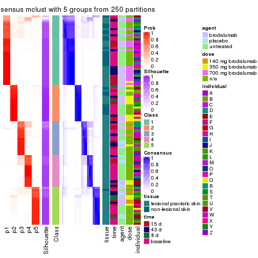</p>

</div>
<div id='tab-SD-mclust-consensus-heatmap-5'>
<pre><code class="r">consensus_heatmap(res, k = 6)
</code></pre>

<p></p>

</div>
</div>

Heatmaps for the membership of samples in all partitions to see how consistent they are:


<script>
$( function() {
	$( '#tabs-SD-mclust-membership-heatmap' ).tabs();
} );
</script>
<div id='tabs-SD-mclust-membership-heatmap'>
<ul>
<li><a href='#tab-SD-mclust-membership-heatmap-1'>k = 2</a></li>
<li><a href='#tab-SD-mclust-membership-heatmap-2'>k = 3</a></li>
<li><a href='#tab-SD-mclust-membership-heatmap-3'>k = 4</a></li>
<li><a href='#tab-SD-mclust-membership-heatmap-4'>k = 5</a></li>
<li><a href='#tab-SD-mclust-membership-heatmap-5'>k = 6</a></li>
</ul>
<div id='tab-SD-mclust-membership-heatmap-1'>
<pre><code class="r">membership_heatmap(res, k = 2)
</code></pre>

<p></p>

</div>
<div id='tab-SD-mclust-membership-heatmap-2'>
<pre><code class="r">membership_heatmap(res, k = 3)
</code></pre>

<p>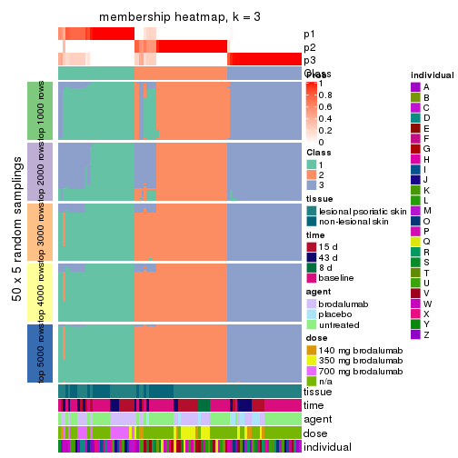</p>

</div>
<div id='tab-SD-mclust-membership-heatmap-3'>
<pre><code class="r">membership_heatmap(res, k = 4)
</code></pre>

<p></p>

</div>
<div id='tab-SD-mclust-membership-heatmap-4'>
<pre><code class="r">membership_heatmap(res, k = 5)
</code></pre>

<p></p>

</div>
<div id='tab-SD-mclust-membership-heatmap-5'>
<pre><code class="r">membership_heatmap(res, k = 6)
</code></pre>

<p></p>

</div>
</div>

As soon as we have had the classes for columns, we can look for signatures
which are significantly different between classes which can be candidate marks
for certain classes. Following are the heatmaps for signatures.


Signature heatmaps where rows are scaled:


<script>
$( function() {
	$( '#tabs-SD-mclust-get-signatures' ).tabs();
} );
</script>
<div id='tabs-SD-mclust-get-signatures'>
<ul>
<li><a href='#tab-SD-mclust-get-signatures-1'>k = 2</a></li>
<li><a href='#tab-SD-mclust-get-signatures-2'>k = 3</a></li>
<li><a href='#tab-SD-mclust-get-signatures-3'>k = 4</a></li>
<li><a href='#tab-SD-mclust-get-signatures-4'>k = 5</a></li>
<li><a href='#tab-SD-mclust-get-signatures-5'>k = 6</a></li>
</ul>
<div id='tab-SD-mclust-get-signatures-1'>
<pre><code class="r">get_signatures(res, k = 2)
</code></pre>

<p></p>

</div>
<div id='tab-SD-mclust-get-signatures-2'>
<pre><code class="r">get_signatures(res, k = 3)
</code></pre>

<p>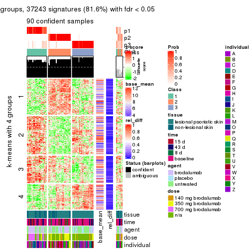</p>

</div>
<div id='tab-SD-mclust-get-signatures-3'>
<pre><code class="r">get_signatures(res, k = 4)
</code></pre>

<p></p>

</div>
<div id='tab-SD-mclust-get-signatures-4'>
<pre><code class="r">get_signatures(res, k = 5)
</code></pre>

<p></p>

</div>
<div id='tab-SD-mclust-get-signatures-5'>
<pre><code class="r">get_signatures(res, k = 6)
</code></pre>

<p></p>

</div>
</div>


Signature heatmaps where rows are not scaled:


<script>
$( function() {
	$( '#tabs-SD-mclust-get-signatures-no-scale' ).tabs();
} );
</script>
<div id='tabs-SD-mclust-get-signatures-no-scale'>
<ul>
<li><a href='#tab-SD-mclust-get-signatures-no-scale-1'>k = 2</a></li>
<li><a href='#tab-SD-mclust-get-signatures-no-scale-2'>k = 3</a></li>
<li><a href='#tab-SD-mclust-get-signatures-no-scale-3'>k = 4</a></li>
<li><a href='#tab-SD-mclust-get-signatures-no-scale-4'>k = 5</a></li>
<li><a href='#tab-SD-mclust-get-signatures-no-scale-5'>k = 6</a></li>
</ul>
<div id='tab-SD-mclust-get-signatures-no-scale-1'>
<pre><code class="r">get_signatures(res, k = 2, scale_rows = FALSE)
</code></pre>

<p>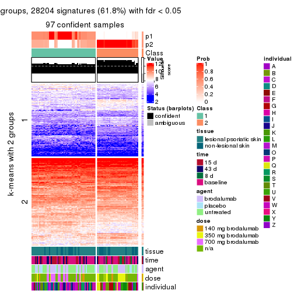</p>

</div>
<div id='tab-SD-mclust-get-signatures-no-scale-2'>
<pre><code class="r">get_signatures(res, k = 3, scale_rows = FALSE)
</code></pre>

<p>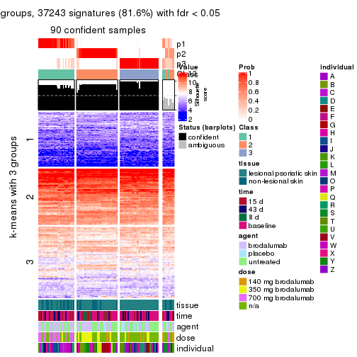</p>

</div>
<div id='tab-SD-mclust-get-signatures-no-scale-3'>
<pre><code class="r">get_signatures(res, k = 4, scale_rows = FALSE)
</code></pre>

<p></p>

</div>
<div id='tab-SD-mclust-get-signatures-no-scale-4'>
<pre><code class="r">get_signatures(res, k = 5, scale_rows = FALSE)
</code></pre>

<p></p>

</div>
<div id='tab-SD-mclust-get-signatures-no-scale-5'>
<pre><code class="r">get_signatures(res, k = 6, scale_rows = FALSE)
</code></pre>

<p></p>

</div>
</div>


Compare the overlap of signatures from different k:

```r
compare_signatures(res)
```


`get_signature()` returns a data frame invisibly. TO get the list of signatures, the function
call should be assigned to a variable explicitly. In following code, if `plot` argument is set
to `FALSE`, no heatmap is plotted while only the differential analysis is performed.

```r
# code only for demonstration
tb = get_signature(res, k = ..., plot = FALSE)
```

An example of the output of `tb` is:

```
#>   which_row         fdr    mean_1    mean_2 scaled_mean_1 scaled_mean_2 km
#> 1        38 0.042760348  8.373488  9.131774    -0.5533452     0.5164555  1
#> 2        40 0.018707592  7.106213  8.469186    -0.6173731     0.5762149  1
#> 3        55 0.019134737 10.221463 11.207825    -0.6159697     0.5749050  1
#> 4        59 0.006059896  5.921854  7.869574    -0.6899429     0.6439467  1
#> 5        60 0.018055526  8.928898 10.211722    -0.6204761     0.5791110  1
#> 6        98 0.009384629 15.714769 14.887706     0.6635654    -0.6193277  2
...
```

The columns in `tb` are:

1. `which_row`: row indices corresponding to the input matrix.
2. `fdr`: FDR for the differential test. 
3. `mean_x`: The mean value in group x.
4. `scaled_mean_x`: The mean value in group x after rows are scaled.
5. `km`: Row groups if k-means clustering is applied to rows.


UMAP plot which shows how samples are separated.


<script>
$( function() {
	$( '#tabs-SD-mclust-dimension-reduction' ).tabs();
} );
</script>
<div id='tabs-SD-mclust-dimension-reduction'>
<ul>
<li><a href='#tab-SD-mclust-dimension-reduction-1'>k = 2</a></li>
<li><a href='#tab-SD-mclust-dimension-reduction-2'>k = 3</a></li>
<li><a href='#tab-SD-mclust-dimension-reduction-3'>k = 4</a></li>
<li><a href='#tab-SD-mclust-dimension-reduction-4'>k = 5</a></li>
<li><a href='#tab-SD-mclust-dimension-reduction-5'>k = 6</a></li>
</ul>
<div id='tab-SD-mclust-dimension-reduction-1'>
<pre><code class="r">dimension_reduction(res, k = 2, method = &quot;UMAP&quot;)
</code></pre>

<p></p>

</div>
<div id='tab-SD-mclust-dimension-reduction-2'>
<pre><code class="r">dimension_reduction(res, k = 3, method = &quot;UMAP&quot;)
</code></pre>

<p></p>

</div>
<div id='tab-SD-mclust-dimension-reduction-3'>
<pre><code class="r">dimension_reduction(res, k = 4, method = &quot;UMAP&quot;)
</code></pre>

<p></p>

</div>
<div id='tab-SD-mclust-dimension-reduction-4'>
<pre><code class="r">dimension_reduction(res, k = 5, method = &quot;UMAP&quot;)
</code></pre>

<p></p>

</div>
<div id='tab-SD-mclust-dimension-reduction-5'>
<pre><code class="r">dimension_reduction(res, k = 6, method = &quot;UMAP&quot;)
</code></pre>

<p>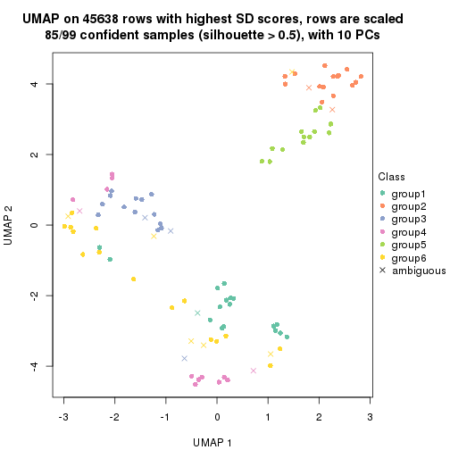</p>

</div>
</div>


Following heatmap shows how subgroups are split when increasing `k`:

```r
collect_classes(res)
```


Test correlation between subgroups and known annotations. If the known
annotation is numeric, one-way ANOVA test is applied, and if the known
annotation is discrete, chi-squared contingency table test is applied.

```r
test_to_known_factors(res)
```

```
#>            n tissue(p) time(p) agent(p)  dose(p) individual(p) k
#> SD:mclust 97  3.12e-01  0.0356  0.78134 4.61e-04      4.28e-07 2
#> SD:mclust 90  4.29e-04  0.0454  0.00638 3.71e-09      1.32e-07 3
#> SD:mclust 78  7.47e-03  0.0691  0.08315 4.16e-07      2.20e-07 4
#> SD:mclust 96  2.41e-05  0.5305  0.05245 1.66e-09      4.79e-07 5
#> SD:mclust 85  3.06e-04  0.3664  0.30681 1.02e-06      5.15e-07 6
```


If matrix rows can be associated to genes, consider to use `functional_enrichment(res,
...)` to perform function enrichment for the signature genes. See [this vignette](http://bioconductor.org/packages/devel/bioc/vignettes/cola/inst/doc/functional_enrichment.html) for more detailed explanations.


 

---------------------------------------------------


### SD:NMF**


The object with results only for a single top-value method and a single partition method 
can be extracted as:

```r
res = res_list["SD", "NMF"]
# you can also extract it by
# res = res_list["SD:NMF"]
```

A summary of `res` and all the functions that can be applied to it:

```r
res
```

```
#> A 'ConsensusPartition' object with k = 2, 3, 4, 5, 6.
#>   On a matrix with 45638 rows and 99 columns.
#>   Top rows (1000, 2000, 3000, 4000, 5000) are extracted by 'SD' method.
#>   Subgroups are detected by 'NMF' method.
#>   Performed in total 1250 partitions by row resampling.
#>   Best k for subgroups seems to be 2.
#> 
#> Following methods can be applied to this 'ConsensusPartition' object:
#>  [1] "cola_report"             "collect_classes"         "collect_plots"          
#>  [4] "collect_stats"           "colnames"                "compare_signatures"     
#>  [7] "consensus_heatmap"       "dimension_reduction"     "functional_enrichment"  
#> [10] "get_anno_col"            "get_anno"                "get_classes"            
#> [13] "get_consensus"           "get_matrix"              "get_membership"         
#> [16] "get_param"               "get_signatures"          "get_stats"              
#> [19] "is_best_k"               "is_stable_k"             "membership_heatmap"     
#> [22] "ncol"                    "nrow"                    "plot_ecdf"              
#> [25] "rownames"                "select_partition_number" "show"                   
#> [28] "suggest_best_k"          "test_to_known_factors"
```

`collect_plots()` function collects all the plots made from `res` for all `k` (number of partitions)
into one single page to provide an easy and fast comparison between different `k`.

```r
collect_plots(res)
```


The plots are:

- The first row: a plot of the ECDF (empirical cumulative distribution
  function) curves of the consensus matrix for each `k` and the heatmap of
  predicted classes for each `k`.
- The second row: heatmaps of the consensus matrix for each `k`.
- The third row: heatmaps of the membership matrix for each `k`.
- The fouth row: heatmaps of the signatures for each `k`.

All the plots in panels can be made by individual functions and they are
plotted later in this section.

`select_partition_number()` produces several plots showing different
statistics for choosing "optimized" `k`. There are following statistics:

- ECDF curves of the consensus matrix for each `k`;
- 1-PAC. [The PAC
  score](https://en.wikipedia.org/wiki/Consensus_clustering#Over-interpretation_potential_of_consensus_clustering)
  measures the proportion of the ambiguous subgrouping.
- Mean silhouette score.
- Concordance. The mean probability of fiting the consensus class ids in all
  partitions.
- Area increased. Denote $A_k$ as the area under the ECDF curve for current
  `k`, the area increased is defined as $A_k - A_{k-1}$.
- Rand index. The percent of pairs of samples that are both in a same cluster
  or both are not in a same cluster in the partition of k and k-1.
- Jaccard index. The ratio of pairs of samples are both in a same cluster in
  the partition of k and k-1 and the pairs of samples are both in a same
  cluster in the partition k or k-1.

The detailed explanations of these statistics can be found in [the _cola_
vignette](http://bioconductor.org/packages/devel/bioc/vignettes/cola/inst/doc/cola.html#toc_13).

Generally speaking, lower PAC score, higher mean silhouette score or higher
concordance corresponds to better partition. Rand index and Jaccard index
measure how similar the current partition is compared to partition with `k-1`.
If they are too similar, we won't accept `k` is better than `k-1`.

```r
select_partition_number(res)
```


The numeric values for all these statistics can be obtained by `get_stats()`.

```r
get_stats(res)
```

```
#>   k 1-PAC mean_silhouette concordance area_increased  Rand Jaccard
#> 2 2 0.978           0.956       0.982         0.4939 0.506   0.506
#> 3 3 0.863           0.882       0.949         0.3578 0.744   0.531
#> 4 4 0.755           0.776       0.887         0.1017 0.825   0.544
#> 5 5 0.763           0.774       0.874         0.0691 0.878   0.586
#> 6 6 0.739           0.706       0.831         0.0325 0.943   0.744
```

`suggest_best_k()` suggests the best $k$ based on these statistics. The rules are as follows:

- All $k$ with Jaccard index larger than 0.95 are removed because increasing
  $k$ does not provide enough extra information. If all $k$ are removed, it is
  marked as no subgroup is detected.
- For all $k$ with 1-PAC score larger than 0.9, the maximal $k$ is taken as
  the best $k$, and other $k$ are marked as optional $k$.
- If it does not fit the second rule. The $k$ with the maximal vote of the
  highest 1-PAC score, highest mean silhouette, and highest concordance is
  taken as the best $k$.

```r
suggest_best_k(res)
```

```
#> [1] 2
```


Following shows the table of the partitions (You need to click the **show/hide
code output** link to see it). The membership matrix (columns with name `p*`)
is inferred by
[`clue::cl_consensus()`](https://www.rdocumentation.org/link/cl_consensus?package=clue)
function with the `SE` method. Basically the value in the membership matrix
represents the probability to belong to a certain group. The finall class
label for an item is determined with the group with highest probability it
belongs to.

In `get_classes()` function, the entropy is calculated from the membership
matrix and the silhouette score is calculated from the consensus matrix.


<script>
$( function() {
	$( '#tabs-SD-NMF-get-classes' ).tabs();
} );
</script>
<div id='tabs-SD-NMF-get-classes'>
<ul>
<li><a href='#tab-SD-NMF-get-classes-1'>k = 2</a></li>
<li><a href='#tab-SD-NMF-get-classes-2'>k = 3</a></li>
<li><a href='#tab-SD-NMF-get-classes-3'>k = 4</a></li>
<li><a href='#tab-SD-NMF-get-classes-4'>k = 5</a></li>
<li><a href='#tab-SD-NMF-get-classes-5'>k = 6</a></li>
</ul>

<div id='tab-SD-NMF-get-classes-1'>
<p><a id='tab-SD-NMF-get-classes-1-a' style='color:#0366d6' href='#'>show/hide code output</a></p>
<pre><code class="r">cbind(get_classes(res, k = 2), get_membership(res, k = 2))
</code></pre>

<pre><code>#&gt;            class entropy silhouette    p1    p2
#&gt; GSM1296094     2  0.0000     0.9824 0.000 1.000
#&gt; GSM1296119     2  0.0000     0.9824 0.000 1.000
#&gt; GSM1296076     2  0.0000     0.9824 0.000 1.000
#&gt; GSM1296092     2  0.0000     0.9824 0.000 1.000
#&gt; GSM1296103     2  0.0000     0.9824 0.000 1.000
#&gt; GSM1296078     2  0.0000     0.9824 0.000 1.000
#&gt; GSM1296107     2  0.0000     0.9824 0.000 1.000
#&gt; GSM1296109     2  0.0000     0.9824 0.000 1.000
#&gt; GSM1296080     1  0.0000     0.9782 1.000 0.000
#&gt; GSM1296090     2  0.0000     0.9824 0.000 1.000
#&gt; GSM1296074     2  0.0000     0.9824 0.000 1.000
#&gt; GSM1296111     2  0.0000     0.9824 0.000 1.000
#&gt; GSM1296099     2  0.0000     0.9824 0.000 1.000
#&gt; GSM1296086     2  0.0000     0.9824 0.000 1.000
#&gt; GSM1296117     2  0.0000     0.9824 0.000 1.000
#&gt; GSM1296113     2  0.0000     0.9824 0.000 1.000
#&gt; GSM1296096     2  0.0000     0.9824 0.000 1.000
#&gt; GSM1296105     1  0.0000     0.9782 1.000 0.000
#&gt; GSM1296098     2  0.0376     0.9794 0.004 0.996
#&gt; GSM1296101     2  0.0000     0.9824 0.000 1.000
#&gt; GSM1296121     2  0.0000     0.9824 0.000 1.000
#&gt; GSM1296088     2  0.3431     0.9213 0.064 0.936
#&gt; GSM1296082     2  0.0000     0.9824 0.000 1.000
#&gt; GSM1296115     2  0.0000     0.9824 0.000 1.000
#&gt; GSM1296084     1  0.0000     0.9782 1.000 0.000
#&gt; GSM1296072     2  0.0000     0.9824 0.000 1.000
#&gt; GSM1296069     2  0.0000     0.9824 0.000 1.000
#&gt; GSM1296071     2  0.0000     0.9824 0.000 1.000
#&gt; GSM1296070     2  0.0000     0.9824 0.000 1.000
#&gt; GSM1296073     2  0.0000     0.9824 0.000 1.000
#&gt; GSM1296034     1  0.0000     0.9782 1.000 0.000
#&gt; GSM1296041     2  0.0000     0.9824 0.000 1.000
#&gt; GSM1296035     2  0.0000     0.9824 0.000 1.000
#&gt; GSM1296038     2  0.0000     0.9824 0.000 1.000
#&gt; GSM1296047     2  0.1184     0.9696 0.016 0.984
#&gt; GSM1296039     2  0.0000     0.9824 0.000 1.000
#&gt; GSM1296042     2  0.0000     0.9824 0.000 1.000
#&gt; GSM1296043     2  0.0000     0.9824 0.000 1.000
#&gt; GSM1296037     1  0.0000     0.9782 1.000 0.000
#&gt; GSM1296046     2  0.0000     0.9824 0.000 1.000
#&gt; GSM1296044     2  0.0000     0.9824 0.000 1.000
#&gt; GSM1296045     2  0.0000     0.9824 0.000 1.000
#&gt; GSM1296025     1  0.0000     0.9782 1.000 0.000
#&gt; GSM1296033     1  0.0000     0.9782 1.000 0.000
#&gt; GSM1296027     1  0.0000     0.9782 1.000 0.000
#&gt; GSM1296032     1  0.0000     0.9782 1.000 0.000
#&gt; GSM1296024     1  0.0000     0.9782 1.000 0.000
#&gt; GSM1296031     1  0.0000     0.9782 1.000 0.000
#&gt; GSM1296028     1  0.0000     0.9782 1.000 0.000
#&gt; GSM1296029     1  0.0000     0.9782 1.000 0.000
#&gt; GSM1296026     1  0.8016     0.6863 0.756 0.244
#&gt; GSM1296030     1  0.0000     0.9782 1.000 0.000
#&gt; GSM1296040     2  0.9983     0.0459 0.476 0.524
#&gt; GSM1296036     1  0.9248     0.5001 0.660 0.340
#&gt; GSM1296048     2  0.0000     0.9824 0.000 1.000
#&gt; GSM1296059     2  0.0000     0.9824 0.000 1.000
#&gt; GSM1296066     2  0.0000     0.9824 0.000 1.000
#&gt; GSM1296060     2  0.0000     0.9824 0.000 1.000
#&gt; GSM1296063     2  0.0000     0.9824 0.000 1.000
#&gt; GSM1296064     2  0.0000     0.9824 0.000 1.000
#&gt; GSM1296067     2  0.1184     0.9700 0.016 0.984
#&gt; GSM1296062     1  0.0000     0.9782 1.000 0.000
#&gt; GSM1296068     2  0.6712     0.7843 0.176 0.824
#&gt; GSM1296050     1  0.0000     0.9782 1.000 0.000
#&gt; GSM1296057     1  0.0000     0.9782 1.000 0.000
#&gt; GSM1296052     1  0.0000     0.9782 1.000 0.000
#&gt; GSM1296054     1  0.0000     0.9782 1.000 0.000
#&gt; GSM1296049     1  0.0000     0.9782 1.000 0.000
#&gt; GSM1296055     1  0.0000     0.9782 1.000 0.000
#&gt; GSM1296053     1  0.0000     0.9782 1.000 0.000
#&gt; GSM1296058     1  0.0000     0.9782 1.000 0.000
#&gt; GSM1296051     2  0.0000     0.9824 0.000 1.000
#&gt; GSM1296056     2  0.0000     0.9824 0.000 1.000
#&gt; GSM1296065     2  0.0000     0.9824 0.000 1.000
#&gt; GSM1296061     1  0.4022     0.9037 0.920 0.080
#&gt; GSM1296095     2  0.0000     0.9824 0.000 1.000
#&gt; GSM1296120     2  0.5519     0.8489 0.128 0.872
#&gt; GSM1296077     1  0.0000     0.9782 1.000 0.000
#&gt; GSM1296093     1  0.0000     0.9782 1.000 0.000
#&gt; GSM1296104     2  0.0376     0.9794 0.004 0.996
#&gt; GSM1296079     1  0.0000     0.9782 1.000 0.000
#&gt; GSM1296108     2  0.0672     0.9763 0.008 0.992
#&gt; GSM1296110     2  0.0000     0.9824 0.000 1.000
#&gt; GSM1296081     1  0.0000     0.9782 1.000 0.000
#&gt; GSM1296091     1  0.0000     0.9782 1.000 0.000
#&gt; GSM1296075     1  0.0000     0.9782 1.000 0.000
#&gt; GSM1296112     2  0.3114     0.9312 0.056 0.944
#&gt; GSM1296100     1  0.0000     0.9782 1.000 0.000
#&gt; GSM1296087     1  0.0000     0.9782 1.000 0.000
#&gt; GSM1296118     1  0.2236     0.9469 0.964 0.036
#&gt; GSM1296114     2  0.0000     0.9824 0.000 1.000
#&gt; GSM1296097     1  0.6623     0.7907 0.828 0.172
#&gt; GSM1296106     1  0.0000     0.9782 1.000 0.000
#&gt; GSM1296102     1  0.0000     0.9782 1.000 0.000
#&gt; GSM1296122     1  0.0000     0.9782 1.000 0.000
#&gt; GSM1296089     1  0.0000     0.9782 1.000 0.000
#&gt; GSM1296083     1  0.0000     0.9782 1.000 0.000
#&gt; GSM1296116     2  0.0000     0.9824 0.000 1.000
#&gt; GSM1296085     1  0.0000     0.9782 1.000 0.000
</code></pre>

<script>
$('#tab-SD-NMF-get-classes-1-a').parent().next().next().hide();
$('#tab-SD-NMF-get-classes-1-a').click(function(){
  $('#tab-SD-NMF-get-classes-1-a').parent().next().next().toggle();
  return(false);
});
</script>
</div>

<div id='tab-SD-NMF-get-classes-2'>
<p><a id='tab-SD-NMF-get-classes-2-a' style='color:#0366d6' href='#'>show/hide code output</a></p>
<pre><code class="r">cbind(get_classes(res, k = 3), get_membership(res, k = 3))
</code></pre>

<pre><code>#&gt;            class entropy silhouette    p1    p2    p3
#&gt; GSM1296094     3  0.0000     0.9180 0.000 0.000 1.000
#&gt; GSM1296119     3  0.6308     0.1244 0.000 0.492 0.508
#&gt; GSM1296076     3  0.0000     0.9180 0.000 0.000 1.000
#&gt; GSM1296092     3  0.0000     0.9180 0.000 0.000 1.000
#&gt; GSM1296103     3  0.0000     0.9180 0.000 0.000 1.000
#&gt; GSM1296078     3  0.0000     0.9180 0.000 0.000 1.000
#&gt; GSM1296107     2  0.0237     0.9513 0.000 0.996 0.004
#&gt; GSM1296109     3  0.0000     0.9180 0.000 0.000 1.000
#&gt; GSM1296080     1  0.3412     0.8467 0.876 0.000 0.124
#&gt; GSM1296090     3  0.0000     0.9180 0.000 0.000 1.000
#&gt; GSM1296074     3  0.0000     0.9180 0.000 0.000 1.000
#&gt; GSM1296111     2  0.5560     0.5143 0.000 0.700 0.300
#&gt; GSM1296099     3  0.0000     0.9180 0.000 0.000 1.000
#&gt; GSM1296086     3  0.0000     0.9180 0.000 0.000 1.000
#&gt; GSM1296117     3  0.3340     0.8356 0.000 0.120 0.880
#&gt; GSM1296113     2  0.1964     0.9106 0.000 0.944 0.056
#&gt; GSM1296096     3  0.0000     0.9180 0.000 0.000 1.000
#&gt; GSM1296105     1  0.0000     0.9621 1.000 0.000 0.000
#&gt; GSM1296098     3  0.0000     0.9180 0.000 0.000 1.000
#&gt; GSM1296101     3  0.0000     0.9180 0.000 0.000 1.000
#&gt; GSM1296121     3  0.5948     0.4996 0.000 0.360 0.640
#&gt; GSM1296088     3  0.0000     0.9180 0.000 0.000 1.000
#&gt; GSM1296082     3  0.0000     0.9180 0.000 0.000 1.000
#&gt; GSM1296115     3  0.5591     0.6031 0.000 0.304 0.696
#&gt; GSM1296084     1  0.4346     0.7697 0.816 0.000 0.184
#&gt; GSM1296072     2  0.0000     0.9537 0.000 1.000 0.000
#&gt; GSM1296069     2  0.0000     0.9537 0.000 1.000 0.000
#&gt; GSM1296071     2  0.0000     0.9537 0.000 1.000 0.000
#&gt; GSM1296070     2  0.0000     0.9537 0.000 1.000 0.000
#&gt; GSM1296073     3  0.2537     0.8687 0.000 0.080 0.920
#&gt; GSM1296034     1  0.0000     0.9621 1.000 0.000 0.000
#&gt; GSM1296041     3  0.5254     0.6654 0.000 0.264 0.736
#&gt; GSM1296035     3  0.0000     0.9180 0.000 0.000 1.000
#&gt; GSM1296038     3  0.0000     0.9180 0.000 0.000 1.000
#&gt; GSM1296047     2  0.0000     0.9537 0.000 1.000 0.000
#&gt; GSM1296039     3  0.0000     0.9180 0.000 0.000 1.000
#&gt; GSM1296042     2  0.2066     0.9066 0.000 0.940 0.060
#&gt; GSM1296043     2  0.0000     0.9537 0.000 1.000 0.000
#&gt; GSM1296037     1  0.0000     0.9621 1.000 0.000 0.000
#&gt; GSM1296046     2  0.0000     0.9537 0.000 1.000 0.000
#&gt; GSM1296044     2  0.0000     0.9537 0.000 1.000 0.000
#&gt; GSM1296045     2  0.0000     0.9537 0.000 1.000 0.000
#&gt; GSM1296025     1  0.0000     0.9621 1.000 0.000 0.000
#&gt; GSM1296033     1  0.0000     0.9621 1.000 0.000 0.000
#&gt; GSM1296027     1  0.0000     0.9621 1.000 0.000 0.000
#&gt; GSM1296032     1  0.0000     0.9621 1.000 0.000 0.000
#&gt; GSM1296024     1  0.0000     0.9621 1.000 0.000 0.000
#&gt; GSM1296031     1  0.0000     0.9621 1.000 0.000 0.000
#&gt; GSM1296028     1  0.0000     0.9621 1.000 0.000 0.000
#&gt; GSM1296029     1  0.0000     0.9621 1.000 0.000 0.000
#&gt; GSM1296026     3  0.5650     0.5199 0.312 0.000 0.688
#&gt; GSM1296030     1  0.2448     0.8984 0.924 0.000 0.076
#&gt; GSM1296040     3  0.0892     0.9043 0.020 0.000 0.980
#&gt; GSM1296036     3  0.0000     0.9180 0.000 0.000 1.000
#&gt; GSM1296048     3  0.6154     0.3900 0.000 0.408 0.592
#&gt; GSM1296059     3  0.0000     0.9180 0.000 0.000 1.000
#&gt; GSM1296066     2  0.0000     0.9537 0.000 1.000 0.000
#&gt; GSM1296060     3  0.0000     0.9180 0.000 0.000 1.000
#&gt; GSM1296063     3  0.2711     0.8631 0.000 0.088 0.912
#&gt; GSM1296064     3  0.0000     0.9180 0.000 0.000 1.000
#&gt; GSM1296067     2  0.0000     0.9537 0.000 1.000 0.000
#&gt; GSM1296062     1  0.1289     0.9369 0.968 0.000 0.032
#&gt; GSM1296068     2  0.0000     0.9537 0.000 1.000 0.000
#&gt; GSM1296050     1  0.0000     0.9621 1.000 0.000 0.000
#&gt; GSM1296057     1  0.0000     0.9621 1.000 0.000 0.000
#&gt; GSM1296052     1  0.0000     0.9621 1.000 0.000 0.000
#&gt; GSM1296054     1  0.0000     0.9621 1.000 0.000 0.000
#&gt; GSM1296049     1  0.0000     0.9621 1.000 0.000 0.000
#&gt; GSM1296055     1  0.6307     0.0321 0.512 0.488 0.000
#&gt; GSM1296053     1  0.0000     0.9621 1.000 0.000 0.000
#&gt; GSM1296058     1  0.0424     0.9562 0.992 0.000 0.008
#&gt; GSM1296051     3  0.0000     0.9180 0.000 0.000 1.000
#&gt; GSM1296056     3  0.0000     0.9180 0.000 0.000 1.000
#&gt; GSM1296065     2  0.2537     0.8864 0.000 0.920 0.080
#&gt; GSM1296061     3  0.4062     0.7645 0.164 0.000 0.836
#&gt; GSM1296095     3  0.2796     0.8607 0.000 0.092 0.908
#&gt; GSM1296120     2  0.0000     0.9537 0.000 1.000 0.000
#&gt; GSM1296077     1  0.0000     0.9621 1.000 0.000 0.000
#&gt; GSM1296093     1  0.0000     0.9621 1.000 0.000 0.000
#&gt; GSM1296104     2  0.2280     0.9150 0.052 0.940 0.008
#&gt; GSM1296079     1  0.0000     0.9621 1.000 0.000 0.000
#&gt; GSM1296108     2  0.0000     0.9537 0.000 1.000 0.000
#&gt; GSM1296110     2  0.0000     0.9537 0.000 1.000 0.000
#&gt; GSM1296081     1  0.0000     0.9621 1.000 0.000 0.000
#&gt; GSM1296091     1  0.0000     0.9621 1.000 0.000 0.000
#&gt; GSM1296075     2  0.4796     0.7132 0.220 0.780 0.000
#&gt; GSM1296112     2  0.0000     0.9537 0.000 1.000 0.000
#&gt; GSM1296100     1  0.0000     0.9621 1.000 0.000 0.000
#&gt; GSM1296087     1  0.0000     0.9621 1.000 0.000 0.000
#&gt; GSM1296118     2  0.0424     0.9487 0.008 0.992 0.000
#&gt; GSM1296114     2  0.0000     0.9537 0.000 1.000 0.000
#&gt; GSM1296097     1  0.5678     0.5267 0.684 0.316 0.000
#&gt; GSM1296106     2  0.5216     0.6447 0.260 0.740 0.000
#&gt; GSM1296102     1  0.0000     0.9621 1.000 0.000 0.000
#&gt; GSM1296122     2  0.2165     0.9039 0.064 0.936 0.000
#&gt; GSM1296089     1  0.0000     0.9621 1.000 0.000 0.000
#&gt; GSM1296083     1  0.0000     0.9621 1.000 0.000 0.000
#&gt; GSM1296116     2  0.0000     0.9537 0.000 1.000 0.000
#&gt; GSM1296085     1  0.0000     0.9621 1.000 0.000 0.000
</code></pre>

<script>
$('#tab-SD-NMF-get-classes-2-a').parent().next().next().hide();
$('#tab-SD-NMF-get-classes-2-a').click(function(){
  $('#tab-SD-NMF-get-classes-2-a').parent().next().next().toggle();
  return(false);
});
</script>
</div>

<div id='tab-SD-NMF-get-classes-3'>
<p><a id='tab-SD-NMF-get-classes-3-a' style='color:#0366d6' href='#'>show/hide code output</a></p>
<pre><code class="r">cbind(get_classes(res, k = 4), get_membership(res, k = 4))
</code></pre>

<pre><code>#&gt;            class entropy silhouette    p1    p2    p3    p4
#&gt; GSM1296094     3  0.2589     0.7909 0.000 0.000 0.884 0.116
#&gt; GSM1296119     2  0.6442     0.0837 0.000 0.492 0.068 0.440
#&gt; GSM1296076     4  0.0707     0.8164 0.000 0.000 0.020 0.980
#&gt; GSM1296092     4  0.1743     0.8075 0.004 0.000 0.056 0.940
#&gt; GSM1296103     3  0.3123     0.7664 0.000 0.000 0.844 0.156
#&gt; GSM1296078     4  0.0000     0.8127 0.000 0.000 0.000 1.000
#&gt; GSM1296107     2  0.0592     0.8885 0.000 0.984 0.000 0.016
#&gt; GSM1296109     3  0.4072     0.6548 0.000 0.000 0.748 0.252
#&gt; GSM1296080     3  0.2450     0.7933 0.072 0.000 0.912 0.016
#&gt; GSM1296090     4  0.0937     0.8046 0.012 0.000 0.012 0.976
#&gt; GSM1296074     4  0.2345     0.7780 0.000 0.000 0.100 0.900
#&gt; GSM1296111     2  0.3975     0.7060 0.000 0.760 0.000 0.240
#&gt; GSM1296099     3  0.4543     0.5193 0.000 0.000 0.676 0.324
#&gt; GSM1296086     4  0.0895     0.8150 0.004 0.000 0.020 0.976
#&gt; GSM1296117     4  0.4440     0.7305 0.000 0.060 0.136 0.804
#&gt; GSM1296113     2  0.0336     0.8901 0.000 0.992 0.000 0.008
#&gt; GSM1296096     4  0.4817     0.3502 0.000 0.000 0.388 0.612
#&gt; GSM1296105     3  0.2773     0.7540 0.116 0.000 0.880 0.004
#&gt; GSM1296098     3  0.2198     0.8056 0.008 0.000 0.920 0.072
#&gt; GSM1296101     3  0.3123     0.7679 0.000 0.000 0.844 0.156
#&gt; GSM1296121     2  0.5004     0.4417 0.000 0.604 0.004 0.392
#&gt; GSM1296088     4  0.3726     0.6845 0.000 0.000 0.212 0.788
#&gt; GSM1296082     4  0.1022     0.8157 0.000 0.000 0.032 0.968
#&gt; GSM1296115     2  0.5050     0.4018 0.000 0.588 0.004 0.408
#&gt; GSM1296084     1  0.4203     0.7983 0.824 0.000 0.068 0.108
#&gt; GSM1296072     2  0.1109     0.8851 0.000 0.968 0.004 0.028
#&gt; GSM1296069     2  0.0592     0.8887 0.000 0.984 0.000 0.016
#&gt; GSM1296071     2  0.0188     0.8902 0.000 0.996 0.004 0.000
#&gt; GSM1296070     2  0.2266     0.8510 0.000 0.912 0.004 0.084
#&gt; GSM1296073     4  0.0937     0.8123 0.000 0.012 0.012 0.976
#&gt; GSM1296034     3  0.3569     0.6661 0.196 0.000 0.804 0.000
#&gt; GSM1296041     2  0.5649     0.5482 0.000 0.664 0.052 0.284
#&gt; GSM1296035     4  0.4967     0.1624 0.000 0.000 0.452 0.548
#&gt; GSM1296038     4  0.2156     0.8088 0.004 0.008 0.060 0.928
#&gt; GSM1296047     2  0.0188     0.8903 0.004 0.996 0.000 0.000
#&gt; GSM1296039     4  0.1637     0.8084 0.000 0.000 0.060 0.940
#&gt; GSM1296042     2  0.2408     0.8375 0.000 0.896 0.000 0.104
#&gt; GSM1296043     2  0.0000     0.8903 0.000 1.000 0.000 0.000
#&gt; GSM1296037     1  0.2149     0.9029 0.912 0.000 0.088 0.000
#&gt; GSM1296046     2  0.0000     0.8903 0.000 1.000 0.000 0.000
#&gt; GSM1296044     2  0.0188     0.8902 0.000 0.996 0.004 0.000
#&gt; GSM1296045     2  0.1398     0.8775 0.000 0.956 0.004 0.040
#&gt; GSM1296025     1  0.1118     0.9296 0.964 0.000 0.036 0.000
#&gt; GSM1296033     1  0.0657     0.9287 0.984 0.000 0.004 0.012
#&gt; GSM1296027     1  0.0592     0.9328 0.984 0.000 0.016 0.000
#&gt; GSM1296032     1  0.0188     0.9323 0.996 0.000 0.004 0.000
#&gt; GSM1296024     1  0.1474     0.9262 0.948 0.000 0.052 0.000
#&gt; GSM1296031     1  0.0817     0.9324 0.976 0.000 0.024 0.000
#&gt; GSM1296028     1  0.0336     0.9319 0.992 0.000 0.008 0.000
#&gt; GSM1296029     1  0.0817     0.9323 0.976 0.000 0.024 0.000
#&gt; GSM1296026     4  0.5849     0.6095 0.164 0.000 0.132 0.704
#&gt; GSM1296030     1  0.2021     0.9166 0.932 0.000 0.056 0.012
#&gt; GSM1296040     3  0.1890     0.8085 0.008 0.000 0.936 0.056
#&gt; GSM1296036     3  0.1722     0.8077 0.008 0.000 0.944 0.048
#&gt; GSM1296048     4  0.4546     0.5390 0.000 0.256 0.012 0.732
#&gt; GSM1296059     3  0.3975     0.6759 0.000 0.000 0.760 0.240
#&gt; GSM1296066     2  0.0336     0.8901 0.000 0.992 0.000 0.008
#&gt; GSM1296060     4  0.4999     0.0174 0.000 0.000 0.492 0.508
#&gt; GSM1296063     4  0.1406     0.8009 0.000 0.024 0.016 0.960
#&gt; GSM1296064     4  0.0817     0.8162 0.000 0.000 0.024 0.976
#&gt; GSM1296067     2  0.1118     0.8799 0.000 0.964 0.036 0.000
#&gt; GSM1296062     3  0.1824     0.7910 0.060 0.000 0.936 0.004
#&gt; GSM1296068     2  0.0188     0.8902 0.000 0.996 0.004 0.000
#&gt; GSM1296050     1  0.0469     0.9292 0.988 0.000 0.012 0.000
#&gt; GSM1296057     1  0.0895     0.9298 0.976 0.000 0.020 0.004
#&gt; GSM1296052     1  0.0707     0.9328 0.980 0.000 0.020 0.000
#&gt; GSM1296054     1  0.1211     0.9293 0.960 0.000 0.040 0.000
#&gt; GSM1296049     1  0.1118     0.9305 0.964 0.000 0.036 0.000
#&gt; GSM1296055     1  0.4254     0.8428 0.848 0.056 0.036 0.060
#&gt; GSM1296053     1  0.1474     0.9265 0.948 0.000 0.052 0.000
#&gt; GSM1296058     1  0.3787     0.8258 0.840 0.000 0.036 0.124
#&gt; GSM1296051     4  0.2207     0.7730 0.056 0.004 0.012 0.928
#&gt; GSM1296056     4  0.0817     0.8156 0.000 0.000 0.024 0.976
#&gt; GSM1296065     4  0.5476     0.1535 0.000 0.396 0.020 0.584
#&gt; GSM1296061     3  0.1584     0.8064 0.012 0.000 0.952 0.036
#&gt; GSM1296095     2  0.7289     0.3363 0.000 0.536 0.252 0.212
#&gt; GSM1296120     2  0.0672     0.8884 0.008 0.984 0.008 0.000
#&gt; GSM1296077     1  0.0469     0.9326 0.988 0.000 0.012 0.000
#&gt; GSM1296093     1  0.1557     0.9227 0.944 0.000 0.056 0.000
#&gt; GSM1296104     1  0.8398     0.2323 0.468 0.224 0.036 0.272
#&gt; GSM1296079     1  0.0188     0.9323 0.996 0.000 0.004 0.000
#&gt; GSM1296108     2  0.0188     0.8902 0.000 0.996 0.004 0.000
#&gt; GSM1296110     2  0.0592     0.8878 0.000 0.984 0.016 0.000
#&gt; GSM1296081     1  0.1118     0.9296 0.964 0.000 0.036 0.000
#&gt; GSM1296091     1  0.1042     0.9252 0.972 0.000 0.020 0.008
#&gt; GSM1296075     1  0.2923     0.8809 0.908 0.036 0.020 0.036
#&gt; GSM1296112     2  0.0188     0.8902 0.000 0.996 0.004 0.000
#&gt; GSM1296100     1  0.2704     0.8712 0.876 0.000 0.124 0.000
#&gt; GSM1296087     1  0.0804     0.9298 0.980 0.000 0.012 0.008
#&gt; GSM1296118     2  0.1042     0.8853 0.008 0.972 0.020 0.000
#&gt; GSM1296114     2  0.0188     0.8902 0.000 0.996 0.004 0.000
#&gt; GSM1296097     1  0.5890     0.7290 0.752 0.112 0.044 0.092
#&gt; GSM1296106     2  0.4755     0.6762 0.200 0.760 0.040 0.000
#&gt; GSM1296102     3  0.4999    -0.0472 0.492 0.000 0.508 0.000
#&gt; GSM1296122     2  0.1938     0.8583 0.052 0.936 0.012 0.000
#&gt; GSM1296089     1  0.0592     0.9317 0.984 0.000 0.016 0.000
#&gt; GSM1296083     1  0.1474     0.9256 0.948 0.000 0.052 0.000
#&gt; GSM1296116     2  0.0000     0.8903 0.000 1.000 0.000 0.000
#&gt; GSM1296085     1  0.0188     0.9322 0.996 0.000 0.004 0.000
</code></pre>

<script>
$('#tab-SD-NMF-get-classes-3-a').parent().next().next().hide();
$('#tab-SD-NMF-get-classes-3-a').click(function(){
  $('#tab-SD-NMF-get-classes-3-a').parent().next().next().toggle();
  return(false);
});
</script>
</div>

<div id='tab-SD-NMF-get-classes-4'>
<p><a id='tab-SD-NMF-get-classes-4-a' style='color:#0366d6' href='#'>show/hide code output</a></p>
<pre><code class="r">cbind(get_classes(res, k = 5), get_membership(res, k = 5))
</code></pre>

<pre><code>#&gt;            class entropy silhouette    p1    p2    p3    p4    p5
#&gt; GSM1296094     3  0.1043     0.8574 0.000 0.000 0.960 0.000 0.040
#&gt; GSM1296119     5  0.5788     0.0988 0.000 0.440 0.076 0.004 0.480
#&gt; GSM1296076     5  0.0613     0.8105 0.000 0.004 0.004 0.008 0.984
#&gt; GSM1296092     5  0.1251     0.8086 0.008 0.000 0.036 0.000 0.956
#&gt; GSM1296103     3  0.1671     0.8534 0.000 0.000 0.924 0.000 0.076
#&gt; GSM1296078     5  0.0486     0.8102 0.000 0.004 0.004 0.004 0.988
#&gt; GSM1296107     2  0.0000     0.9097 0.000 1.000 0.000 0.000 0.000
#&gt; GSM1296109     3  0.3167     0.7934 0.000 0.004 0.820 0.004 0.172
#&gt; GSM1296080     3  0.3002     0.7969 0.116 0.000 0.856 0.000 0.028
#&gt; GSM1296090     5  0.0740     0.8096 0.008 0.004 0.008 0.000 0.980
#&gt; GSM1296074     5  0.2112     0.7775 0.000 0.004 0.084 0.004 0.908
#&gt; GSM1296111     2  0.3317     0.7546 0.000 0.804 0.004 0.004 0.188
#&gt; GSM1296099     3  0.3318     0.7783 0.000 0.000 0.800 0.008 0.192
#&gt; GSM1296086     5  0.1399     0.8077 0.020 0.000 0.028 0.000 0.952
#&gt; GSM1296117     2  0.5851     0.3226 0.000 0.572 0.104 0.004 0.320
#&gt; GSM1296113     2  0.0740     0.9073 0.000 0.980 0.008 0.004 0.008
#&gt; GSM1296096     5  0.4644    -0.0685 0.000 0.000 0.460 0.012 0.528
#&gt; GSM1296105     3  0.3033     0.7993 0.084 0.000 0.864 0.052 0.000
#&gt; GSM1296098     3  0.1082     0.8573 0.008 0.000 0.964 0.000 0.028
#&gt; GSM1296101     3  0.3080     0.8360 0.008 0.000 0.872 0.060 0.060
#&gt; GSM1296121     5  0.5036     0.0816 0.000 0.452 0.004 0.024 0.520
#&gt; GSM1296088     5  0.5394     0.5646 0.160 0.000 0.144 0.008 0.688
#&gt; GSM1296082     5  0.0794     0.8111 0.000 0.000 0.028 0.000 0.972
#&gt; GSM1296115     2  0.4387     0.4797 0.000 0.652 0.008 0.004 0.336
#&gt; GSM1296084     1  0.3489     0.7969 0.820 0.000 0.144 0.000 0.036
#&gt; GSM1296072     2  0.2754     0.8436 0.000 0.880 0.000 0.040 0.080
#&gt; GSM1296069     2  0.0510     0.9079 0.000 0.984 0.000 0.000 0.016
#&gt; GSM1296071     2  0.0162     0.9096 0.000 0.996 0.000 0.004 0.000
#&gt; GSM1296070     2  0.1216     0.9016 0.000 0.960 0.000 0.020 0.020
#&gt; GSM1296073     5  0.0727     0.8060 0.000 0.012 0.004 0.004 0.980
#&gt; GSM1296034     3  0.3339     0.7552 0.112 0.000 0.840 0.048 0.000
#&gt; GSM1296041     2  0.2797     0.8376 0.000 0.880 0.060 0.000 0.060
#&gt; GSM1296035     3  0.4862     0.4600 0.000 0.000 0.604 0.032 0.364
#&gt; GSM1296038     4  0.5533     0.3802 0.012 0.000 0.052 0.580 0.356
#&gt; GSM1296047     2  0.0510     0.9070 0.000 0.984 0.000 0.016 0.000
#&gt; GSM1296039     5  0.0955     0.8105 0.000 0.000 0.028 0.004 0.968
#&gt; GSM1296042     2  0.1281     0.8985 0.000 0.956 0.000 0.012 0.032
#&gt; GSM1296043     2  0.0000     0.9097 0.000 1.000 0.000 0.000 0.000
#&gt; GSM1296037     4  0.3495     0.7194 0.160 0.000 0.028 0.812 0.000
#&gt; GSM1296046     2  0.0162     0.9097 0.000 0.996 0.000 0.004 0.000
#&gt; GSM1296044     2  0.0162     0.9096 0.000 0.996 0.000 0.004 0.000
#&gt; GSM1296045     2  0.1281     0.8999 0.000 0.956 0.000 0.032 0.012
#&gt; GSM1296025     1  0.1168     0.9206 0.960 0.000 0.008 0.032 0.000
#&gt; GSM1296033     1  0.1502     0.9164 0.940 0.000 0.004 0.056 0.000
#&gt; GSM1296027     1  0.0566     0.9145 0.984 0.000 0.012 0.004 0.000
#&gt; GSM1296032     1  0.2017     0.9081 0.912 0.000 0.008 0.080 0.000
#&gt; GSM1296024     1  0.0794     0.9130 0.972 0.000 0.028 0.000 0.000
#&gt; GSM1296031     1  0.1956     0.8960 0.916 0.000 0.008 0.076 0.000
#&gt; GSM1296028     1  0.2020     0.9019 0.900 0.000 0.000 0.100 0.000
#&gt; GSM1296029     1  0.0865     0.9120 0.972 0.000 0.024 0.004 0.000
#&gt; GSM1296026     1  0.5322     0.5648 0.660 0.000 0.112 0.000 0.228
#&gt; GSM1296030     1  0.1901     0.8895 0.928 0.000 0.056 0.004 0.012
#&gt; GSM1296040     3  0.1560     0.8534 0.004 0.000 0.948 0.028 0.020
#&gt; GSM1296036     3  0.1012     0.8536 0.020 0.000 0.968 0.000 0.012
#&gt; GSM1296048     5  0.2609     0.7633 0.000 0.048 0.004 0.052 0.896
#&gt; GSM1296059     3  0.2825     0.8322 0.000 0.000 0.860 0.016 0.124
#&gt; GSM1296066     2  0.0162     0.9100 0.000 0.996 0.004 0.000 0.000
#&gt; GSM1296060     3  0.6133     0.4332 0.000 0.000 0.540 0.160 0.300
#&gt; GSM1296063     5  0.3053     0.6826 0.000 0.000 0.008 0.164 0.828
#&gt; GSM1296064     5  0.0992     0.8098 0.000 0.000 0.024 0.008 0.968
#&gt; GSM1296067     2  0.1310     0.8989 0.000 0.956 0.020 0.024 0.000
#&gt; GSM1296062     3  0.1195     0.8451 0.028 0.000 0.960 0.012 0.000
#&gt; GSM1296068     2  0.0162     0.9096 0.000 0.996 0.000 0.004 0.000
#&gt; GSM1296050     1  0.2304     0.8960 0.892 0.000 0.008 0.100 0.000
#&gt; GSM1296057     4  0.2672     0.7563 0.116 0.000 0.008 0.872 0.004
#&gt; GSM1296052     1  0.0451     0.9154 0.988 0.000 0.008 0.004 0.000
#&gt; GSM1296054     1  0.1764     0.9145 0.928 0.000 0.008 0.064 0.000
#&gt; GSM1296049     1  0.0865     0.9195 0.972 0.000 0.004 0.024 0.000
#&gt; GSM1296055     4  0.2818     0.7544 0.128 0.004 0.000 0.860 0.008
#&gt; GSM1296053     1  0.1493     0.9168 0.948 0.000 0.028 0.024 0.000
#&gt; GSM1296058     4  0.3174     0.7434 0.020 0.000 0.004 0.844 0.132
#&gt; GSM1296051     5  0.3644     0.6349 0.180 0.008 0.008 0.004 0.800
#&gt; GSM1296056     5  0.2208     0.7747 0.000 0.000 0.020 0.072 0.908
#&gt; GSM1296065     4  0.4313     0.6680 0.004 0.020 0.008 0.744 0.224
#&gt; GSM1296061     3  0.1281     0.8530 0.032 0.000 0.956 0.000 0.012
#&gt; GSM1296095     4  0.7695     0.3398 0.000 0.072 0.232 0.440 0.256
#&gt; GSM1296120     2  0.4560     0.0451 0.000 0.508 0.008 0.484 0.000
#&gt; GSM1296077     1  0.1908     0.9079 0.908 0.000 0.000 0.092 0.000
#&gt; GSM1296093     1  0.2563     0.8945 0.872 0.000 0.008 0.120 0.000
#&gt; GSM1296104     4  0.2237     0.7640 0.008 0.004 0.000 0.904 0.084
#&gt; GSM1296079     1  0.0510     0.9201 0.984 0.000 0.000 0.016 0.000
#&gt; GSM1296108     2  0.0290     0.9097 0.000 0.992 0.000 0.008 0.000
#&gt; GSM1296110     2  0.0898     0.9059 0.000 0.972 0.008 0.020 0.000
#&gt; GSM1296081     1  0.1041     0.9186 0.964 0.000 0.004 0.032 0.000
#&gt; GSM1296091     1  0.3320     0.8572 0.828 0.000 0.008 0.152 0.012
#&gt; GSM1296075     1  0.4682     0.7363 0.728 0.016 0.012 0.228 0.016
#&gt; GSM1296112     2  0.0290     0.9097 0.000 0.992 0.000 0.008 0.000
#&gt; GSM1296100     4  0.3577     0.7176 0.160 0.000 0.032 0.808 0.000
#&gt; GSM1296087     1  0.0880     0.9142 0.968 0.000 0.000 0.032 0.000
#&gt; GSM1296118     2  0.2753     0.8304 0.008 0.876 0.012 0.104 0.000
#&gt; GSM1296114     2  0.0290     0.9095 0.000 0.992 0.000 0.008 0.000
#&gt; GSM1296097     4  0.2393     0.7657 0.016 0.000 0.004 0.900 0.080
#&gt; GSM1296106     4  0.3463     0.7512 0.040 0.056 0.044 0.860 0.000
#&gt; GSM1296102     4  0.4078     0.7295 0.148 0.000 0.068 0.784 0.000
#&gt; GSM1296122     4  0.5381     0.2067 0.056 0.428 0.000 0.516 0.000
#&gt; GSM1296089     1  0.2017     0.8924 0.912 0.000 0.008 0.080 0.000
#&gt; GSM1296083     1  0.1106     0.9186 0.964 0.000 0.012 0.024 0.000
#&gt; GSM1296116     2  0.0609     0.9069 0.000 0.980 0.000 0.020 0.000
#&gt; GSM1296085     1  0.1792     0.9102 0.916 0.000 0.000 0.084 0.000
</code></pre>

<script>
$('#tab-SD-NMF-get-classes-4-a').parent().next().next().hide();
$('#tab-SD-NMF-get-classes-4-a').click(function(){
  $('#tab-SD-NMF-get-classes-4-a').parent().next().next().toggle();
  return(false);
});
</script>
</div>

<div id='tab-SD-NMF-get-classes-5'>
<p><a id='tab-SD-NMF-get-classes-5-a' style='color:#0366d6' href='#'>show/hide code output</a></p>
<pre><code class="r">cbind(get_classes(res, k = 6), get_membership(res, k = 6))
</code></pre>

<pre><code>#&gt;            class entropy silhouette    p1    p2    p3    p4    p5    p6
#&gt; GSM1296094     3  0.1141     0.8108 0.000 0.000 0.948 0.052 0.000 0.000
#&gt; GSM1296119     4  0.4584     0.5690 0.000 0.244 0.052 0.688 0.016 0.000
#&gt; GSM1296076     4  0.0547     0.8006 0.000 0.000 0.020 0.980 0.000 0.000
#&gt; GSM1296092     4  0.1672     0.7982 0.012 0.000 0.028 0.940 0.016 0.004
#&gt; GSM1296103     3  0.2003     0.8007 0.000 0.000 0.884 0.116 0.000 0.000
#&gt; GSM1296078     4  0.0508     0.8000 0.000 0.000 0.000 0.984 0.004 0.012
#&gt; GSM1296107     2  0.0000     0.8911 0.000 1.000 0.000 0.000 0.000 0.000
#&gt; GSM1296109     3  0.3290     0.7012 0.000 0.004 0.744 0.252 0.000 0.000
#&gt; GSM1296080     3  0.3382     0.7338 0.124 0.000 0.820 0.048 0.008 0.000
#&gt; GSM1296090     4  0.1794     0.7912 0.024 0.000 0.000 0.932 0.016 0.028
#&gt; GSM1296074     4  0.1285     0.7882 0.000 0.000 0.052 0.944 0.004 0.000
#&gt; GSM1296111     2  0.3141     0.7223 0.000 0.788 0.000 0.200 0.012 0.000
#&gt; GSM1296099     3  0.3593     0.7373 0.000 0.000 0.748 0.228 0.000 0.024
#&gt; GSM1296086     4  0.2276     0.7852 0.052 0.000 0.020 0.908 0.016 0.004
#&gt; GSM1296117     4  0.5121     0.5012 0.000 0.268 0.092 0.628 0.012 0.000
#&gt; GSM1296113     2  0.1666     0.8757 0.000 0.936 0.008 0.036 0.020 0.000
#&gt; GSM1296096     3  0.4841     0.4070 0.000 0.000 0.536 0.412 0.004 0.048
#&gt; GSM1296105     3  0.3704     0.7438 0.112 0.000 0.820 0.016 0.028 0.024
#&gt; GSM1296098     3  0.1049     0.8104 0.008 0.000 0.960 0.032 0.000 0.000
#&gt; GSM1296101     3  0.4117     0.6660 0.000 0.000 0.740 0.044 0.012 0.204
#&gt; GSM1296121     2  0.4346     0.1481 0.000 0.524 0.004 0.460 0.004 0.008
#&gt; GSM1296088     4  0.6305     0.3021 0.344 0.000 0.144 0.480 0.020 0.012
#&gt; GSM1296082     4  0.0891     0.8004 0.000 0.000 0.024 0.968 0.008 0.000
#&gt; GSM1296115     2  0.3489     0.6039 0.000 0.708 0.000 0.288 0.000 0.004
#&gt; GSM1296084     1  0.5249     0.6315 0.696 0.000 0.180 0.064 0.044 0.016
#&gt; GSM1296072     2  0.4625     0.6705 0.000 0.740 0.000 0.072 0.144 0.044
#&gt; GSM1296069     2  0.1148     0.8855 0.000 0.960 0.000 0.020 0.016 0.004
#&gt; GSM1296071     2  0.0508     0.8909 0.000 0.984 0.004 0.000 0.012 0.000
#&gt; GSM1296070     2  0.1245     0.8816 0.000 0.952 0.000 0.000 0.016 0.032
#&gt; GSM1296073     4  0.0935     0.7935 0.000 0.000 0.004 0.964 0.000 0.032
#&gt; GSM1296034     3  0.3309     0.7423 0.052 0.000 0.844 0.000 0.028 0.076
#&gt; GSM1296041     2  0.3453     0.7502 0.000 0.808 0.040 0.144 0.008 0.000
#&gt; GSM1296035     3  0.4969     0.6109 0.000 0.000 0.616 0.280 0.000 0.104
#&gt; GSM1296038     6  0.3259     0.6958 0.000 0.000 0.048 0.104 0.012 0.836
#&gt; GSM1296047     2  0.3354     0.6949 0.004 0.780 0.000 0.008 0.204 0.004
#&gt; GSM1296039     4  0.1088     0.7973 0.000 0.000 0.016 0.960 0.000 0.024
#&gt; GSM1296042     2  0.0777     0.8877 0.000 0.972 0.000 0.024 0.004 0.000
#&gt; GSM1296043     2  0.0260     0.8914 0.000 0.992 0.000 0.000 0.008 0.000
#&gt; GSM1296037     5  0.4731     0.2365 0.060 0.000 0.020 0.000 0.684 0.236
#&gt; GSM1296046     2  0.0405     0.8918 0.000 0.988 0.000 0.004 0.008 0.000
#&gt; GSM1296044     2  0.0603     0.8906 0.000 0.980 0.004 0.000 0.016 0.000
#&gt; GSM1296045     2  0.1989     0.8613 0.000 0.916 0.000 0.004 0.028 0.052
#&gt; GSM1296025     1  0.1493     0.8563 0.936 0.000 0.004 0.000 0.056 0.004
#&gt; GSM1296033     1  0.1738     0.8556 0.928 0.000 0.004 0.016 0.052 0.000
#&gt; GSM1296027     1  0.1151     0.8576 0.956 0.000 0.012 0.000 0.032 0.000
#&gt; GSM1296032     1  0.2838     0.7570 0.808 0.000 0.000 0.000 0.188 0.004
#&gt; GSM1296024     1  0.1138     0.8604 0.960 0.000 0.012 0.000 0.024 0.004
#&gt; GSM1296031     1  0.3883     0.7756 0.804 0.000 0.032 0.000 0.080 0.084
#&gt; GSM1296028     1  0.2520     0.8047 0.844 0.000 0.000 0.000 0.152 0.004
#&gt; GSM1296029     1  0.2173     0.8403 0.904 0.000 0.064 0.000 0.028 0.004
#&gt; GSM1296026     1  0.4959     0.5800 0.688 0.000 0.064 0.208 0.040 0.000
#&gt; GSM1296030     1  0.2662     0.8341 0.888 0.000 0.048 0.016 0.044 0.004
#&gt; GSM1296040     3  0.2044     0.8050 0.008 0.000 0.920 0.028 0.004 0.040
#&gt; GSM1296036     3  0.0964     0.8059 0.016 0.000 0.968 0.012 0.004 0.000
#&gt; GSM1296048     4  0.4370     0.6284 0.000 0.088 0.000 0.740 0.012 0.160
#&gt; GSM1296059     3  0.3066     0.7920 0.000 0.000 0.832 0.124 0.000 0.044
#&gt; GSM1296066     2  0.0551     0.8914 0.000 0.984 0.004 0.004 0.008 0.000
#&gt; GSM1296060     3  0.5497     0.4106 0.000 0.000 0.556 0.140 0.004 0.300
#&gt; GSM1296063     6  0.3584     0.5095 0.000 0.000 0.000 0.308 0.004 0.688
#&gt; GSM1296064     4  0.1138     0.7970 0.000 0.004 0.012 0.960 0.000 0.024
#&gt; GSM1296067     2  0.1871     0.8693 0.000 0.928 0.016 0.000 0.032 0.024
#&gt; GSM1296062     3  0.1406     0.8023 0.016 0.000 0.952 0.008 0.004 0.020
#&gt; GSM1296068     2  0.0291     0.8911 0.000 0.992 0.004 0.000 0.004 0.000
#&gt; GSM1296050     1  0.2494     0.8380 0.864 0.000 0.000 0.000 0.120 0.016
#&gt; GSM1296057     6  0.4661     0.6045 0.060 0.000 0.004 0.016 0.216 0.704
#&gt; GSM1296052     1  0.1225     0.8574 0.952 0.000 0.012 0.000 0.036 0.000
#&gt; GSM1296054     1  0.2664     0.7674 0.816 0.000 0.000 0.000 0.184 0.000
#&gt; GSM1296049     1  0.1075     0.8558 0.952 0.000 0.000 0.000 0.048 0.000
#&gt; GSM1296055     6  0.3509     0.6530 0.056 0.012 0.016 0.004 0.068 0.844
#&gt; GSM1296053     1  0.2247     0.8505 0.904 0.000 0.060 0.000 0.024 0.012
#&gt; GSM1296058     6  0.2583     0.7112 0.000 0.000 0.016 0.044 0.052 0.888
#&gt; GSM1296051     4  0.4284     0.4925 0.304 0.000 0.004 0.664 0.024 0.004
#&gt; GSM1296056     4  0.3999     0.5095 0.000 0.000 0.032 0.696 0.000 0.272
#&gt; GSM1296065     6  0.4357     0.6402 0.004 0.008 0.004 0.232 0.036 0.716
#&gt; GSM1296061     3  0.1293     0.8047 0.020 0.000 0.956 0.016 0.004 0.004
#&gt; GSM1296095     6  0.5424     0.6262 0.000 0.024 0.188 0.088 0.024 0.676
#&gt; GSM1296120     5  0.4311     0.4273 0.008 0.220 0.000 0.000 0.716 0.056
#&gt; GSM1296077     1  0.2170     0.8445 0.888 0.000 0.000 0.000 0.100 0.012
#&gt; GSM1296093     1  0.4205     0.2427 0.564 0.000 0.000 0.000 0.420 0.016
#&gt; GSM1296104     6  0.4537     0.4117 0.000 0.000 0.000 0.036 0.412 0.552
#&gt; GSM1296079     1  0.1471     0.8567 0.932 0.000 0.000 0.000 0.064 0.004
#&gt; GSM1296108     2  0.0291     0.8911 0.000 0.992 0.004 0.000 0.004 0.000
#&gt; GSM1296110     2  0.0665     0.8906 0.000 0.980 0.004 0.000 0.008 0.008
#&gt; GSM1296081     1  0.1340     0.8602 0.948 0.000 0.004 0.000 0.040 0.008
#&gt; GSM1296091     5  0.4450     0.2782 0.364 0.000 0.004 0.016 0.608 0.008
#&gt; GSM1296075     5  0.4512    -0.0424 0.456 0.004 0.000 0.016 0.520 0.004
#&gt; GSM1296112     2  0.0508     0.8914 0.000 0.984 0.004 0.000 0.012 0.000
#&gt; GSM1296100     5  0.4599     0.3022 0.064 0.000 0.024 0.000 0.716 0.196
#&gt; GSM1296087     1  0.2176     0.8487 0.916 0.000 0.024 0.004 0.036 0.020
#&gt; GSM1296118     5  0.4208     0.1717 0.008 0.452 0.000 0.000 0.536 0.004
#&gt; GSM1296114     2  0.0806     0.8895 0.000 0.972 0.008 0.000 0.020 0.000
#&gt; GSM1296097     6  0.2202     0.7083 0.000 0.000 0.012 0.028 0.052 0.908
#&gt; GSM1296106     6  0.5819     0.3228 0.024 0.028 0.044 0.000 0.420 0.484
#&gt; GSM1296102     6  0.4129     0.6069 0.020 0.000 0.200 0.000 0.036 0.744
#&gt; GSM1296122     5  0.5607     0.3926 0.028 0.340 0.000 0.000 0.548 0.084
#&gt; GSM1296089     1  0.3680     0.7860 0.816 0.000 0.024 0.000 0.084 0.076
#&gt; GSM1296083     1  0.1820     0.8604 0.928 0.000 0.016 0.000 0.044 0.012
#&gt; GSM1296116     2  0.0909     0.8865 0.000 0.968 0.000 0.000 0.012 0.020
#&gt; GSM1296085     1  0.2146     0.8319 0.880 0.000 0.000 0.000 0.116 0.004
</code></pre>

<script>
$('#tab-SD-NMF-get-classes-5-a').parent().next().next().hide();
$('#tab-SD-NMF-get-classes-5-a').click(function(){
  $('#tab-SD-NMF-get-classes-5-a').parent().next().next().toggle();
  return(false);
});
</script>
</div>
</div>

Heatmaps for the consensus matrix. It visualizes the probability of two
samples to be in a same group.


<script>
$( function() {
	$( '#tabs-SD-NMF-consensus-heatmap' ).tabs();
} );
</script>
<div id='tabs-SD-NMF-consensus-heatmap'>
<ul>
<li><a href='#tab-SD-NMF-consensus-heatmap-1'>k = 2</a></li>
<li><a href='#tab-SD-NMF-consensus-heatmap-2'>k = 3</a></li>
<li><a href='#tab-SD-NMF-consensus-heatmap-3'>k = 4</a></li>
<li><a href='#tab-SD-NMF-consensus-heatmap-4'>k = 5</a></li>
<li><a href='#tab-SD-NMF-consensus-heatmap-5'>k = 6</a></li>
</ul>
<div id='tab-SD-NMF-consensus-heatmap-1'>
<pre><code class="r">consensus_heatmap(res, k = 2)
</code></pre>

<p></p>

</div>
<div id='tab-SD-NMF-consensus-heatmap-2'>
<pre><code class="r">consensus_heatmap(res, k = 3)
</code></pre>

<p></p>

</div>
<div id='tab-SD-NMF-consensus-heatmap-3'>
<pre><code class="r">consensus_heatmap(res, k = 4)
</code></pre>

<p></p>

</div>
<div id='tab-SD-NMF-consensus-heatmap-4'>
<pre><code class="r">consensus_heatmap(res, k = 5)
</code></pre>

<p></p>

</div>
<div id='tab-SD-NMF-consensus-heatmap-5'>
<pre><code class="r">consensus_heatmap(res, k = 6)
</code></pre>

<p></p>

</div>
</div>

Heatmaps for the membership of samples in all partitions to see how consistent they are:


<script>
$( function() {
	$( '#tabs-SD-NMF-membership-heatmap' ).tabs();
} );
</script>
<div id='tabs-SD-NMF-membership-heatmap'>
<ul>
<li><a href='#tab-SD-NMF-membership-heatmap-1'>k = 2</a></li>
<li><a href='#tab-SD-NMF-membership-heatmap-2'>k = 3</a></li>
<li><a href='#tab-SD-NMF-membership-heatmap-3'>k = 4</a></li>
<li><a href='#tab-SD-NMF-membership-heatmap-4'>k = 5</a></li>
<li><a href='#tab-SD-NMF-membership-heatmap-5'>k = 6</a></li>
</ul>
<div id='tab-SD-NMF-membership-heatmap-1'>
<pre><code class="r">membership_heatmap(res, k = 2)
</code></pre>

<p></p>

</div>
<div id='tab-SD-NMF-membership-heatmap-2'>
<pre><code class="r">membership_heatmap(res, k = 3)
</code></pre>

<p></p>

</div>
<div id='tab-SD-NMF-membership-heatmap-3'>
<pre><code class="r">membership_heatmap(res, k = 4)
</code></pre>

<p></p>

</div>
<div id='tab-SD-NMF-membership-heatmap-4'>
<pre><code class="r">membership_heatmap(res, k = 5)
</code></pre>

<p></p>

</div>
<div id='tab-SD-NMF-membership-heatmap-5'>
<pre><code class="r">membership_heatmap(res, k = 6)
</code></pre>

<p></p>

</div>
</div>

As soon as we have had the classes for columns, we can look for signatures
which are significantly different between classes which can be candidate marks
for certain classes. Following are the heatmaps for signatures.


Signature heatmaps where rows are scaled:


<script>
$( function() {
	$( '#tabs-SD-NMF-get-signatures' ).tabs();
} );
</script>
<div id='tabs-SD-NMF-get-signatures'>
<ul>
<li><a href='#tab-SD-NMF-get-signatures-1'>k = 2</a></li>
<li><a href='#tab-SD-NMF-get-signatures-2'>k = 3</a></li>
<li><a href='#tab-SD-NMF-get-signatures-3'>k = 4</a></li>
<li><a href='#tab-SD-NMF-get-signatures-4'>k = 5</a></li>
<li><a href='#tab-SD-NMF-get-signatures-5'>k = 6</a></li>
</ul>
<div id='tab-SD-NMF-get-signatures-1'>
<pre><code class="r">get_signatures(res, k = 2)
</code></pre>

<p></p>

</div>
<div id='tab-SD-NMF-get-signatures-2'>
<pre><code class="r">get_signatures(res, k = 3)
</code></pre>

<p></p>

</div>
<div id='tab-SD-NMF-get-signatures-3'>
<pre><code class="r">get_signatures(res, k = 4)
</code></pre>

<p></p>

</div>
<div id='tab-SD-NMF-get-signatures-4'>
<pre><code class="r">get_signatures(res, k = 5)
</code></pre>

<p></p>

</div>
<div id='tab-SD-NMF-get-signatures-5'>
<pre><code class="r">get_signatures(res, k = 6)
</code></pre>

<p></p>

</div>
</div>


Signature heatmaps where rows are not scaled:


<script>
$( function() {
	$( '#tabs-SD-NMF-get-signatures-no-scale' ).tabs();
} );
</script>
<div id='tabs-SD-NMF-get-signatures-no-scale'>
<ul>
<li><a href='#tab-SD-NMF-get-signatures-no-scale-1'>k = 2</a></li>
<li><a href='#tab-SD-NMF-get-signatures-no-scale-2'>k = 3</a></li>
<li><a href='#tab-SD-NMF-get-signatures-no-scale-3'>k = 4</a></li>
<li><a href='#tab-SD-NMF-get-signatures-no-scale-4'>k = 5</a></li>
<li><a href='#tab-SD-NMF-get-signatures-no-scale-5'>k = 6</a></li>
</ul>
<div id='tab-SD-NMF-get-signatures-no-scale-1'>
<pre><code class="r">get_signatures(res, k = 2, scale_rows = FALSE)
</code></pre>

<p></p>

</div>
<div id='tab-SD-NMF-get-signatures-no-scale-2'>
<pre><code class="r">get_signatures(res, k = 3, scale_rows = FALSE)
</code></pre>

<p></p>

</div>
<div id='tab-SD-NMF-get-signatures-no-scale-3'>
<pre><code class="r">get_signatures(res, k = 4, scale_rows = FALSE)
</code></pre>

<p></p>

</div>
<div id='tab-SD-NMF-get-signatures-no-scale-4'>
<pre><code class="r">get_signatures(res, k = 5, scale_rows = FALSE)
</code></pre>

<p></p>

</div>
<div id='tab-SD-NMF-get-signatures-no-scale-5'>
<pre><code class="r">get_signatures(res, k = 6, scale_rows = FALSE)
</code></pre>

<p></p>

</div>
</div>


Compare the overlap of signatures from different k:

```r
compare_signatures(res)
```


`get_signature()` returns a data frame invisibly. TO get the list of signatures, the function
call should be assigned to a variable explicitly. In following code, if `plot` argument is set
to `FALSE`, no heatmap is plotted while only the differential analysis is performed.

```r
# code only for demonstration
tb = get_signature(res, k = ..., plot = FALSE)
```

An example of the output of `tb` is:

```
#>   which_row         fdr    mean_1    mean_2 scaled_mean_1 scaled_mean_2 km
#> 1        38 0.042760348  8.373488  9.131774    -0.5533452     0.5164555  1
#> 2        40 0.018707592  7.106213  8.469186    -0.6173731     0.5762149  1
#> 3        55 0.019134737 10.221463 11.207825    -0.6159697     0.5749050  1
#> 4        59 0.006059896  5.921854  7.869574    -0.6899429     0.6439467  1
#> 5        60 0.018055526  8.928898 10.211722    -0.6204761     0.5791110  1
#> 6        98 0.009384629 15.714769 14.887706     0.6635654    -0.6193277  2
...
```

The columns in `tb` are:

1. `which_row`: row indices corresponding to the input matrix.
2. `fdr`: FDR for the differential test. 
3. `mean_x`: The mean value in group x.
4. `scaled_mean_x`: The mean value in group x after rows are scaled.
5. `km`: Row groups if k-means clustering is applied to rows.


UMAP plot which shows how samples are separated.


<script>
$( function() {
	$( '#tabs-SD-NMF-dimension-reduction' ).tabs();
} );
</script>
<div id='tabs-SD-NMF-dimension-reduction'>
<ul>
<li><a href='#tab-SD-NMF-dimension-reduction-1'>k = 2</a></li>
<li><a href='#tab-SD-NMF-dimension-reduction-2'>k = 3</a></li>
<li><a href='#tab-SD-NMF-dimension-reduction-3'>k = 4</a></li>
<li><a href='#tab-SD-NMF-dimension-reduction-4'>k = 5</a></li>
<li><a href='#tab-SD-NMF-dimension-reduction-5'>k = 6</a></li>
</ul>
<div id='tab-SD-NMF-dimension-reduction-1'>
<pre><code class="r">dimension_reduction(res, k = 2, method = &quot;UMAP&quot;)
</code></pre>

<p></p>

</div>
<div id='tab-SD-NMF-dimension-reduction-2'>
<pre><code class="r">dimension_reduction(res, k = 3, method = &quot;UMAP&quot;)
</code></pre>

<p></p>

</div>
<div id='tab-SD-NMF-dimension-reduction-3'>
<pre><code class="r">dimension_reduction(res, k = 4, method = &quot;UMAP&quot;)
</code></pre>

<p></p>

</div>
<div id='tab-SD-NMF-dimension-reduction-4'>
<pre><code class="r">dimension_reduction(res, k = 5, method = &quot;UMAP&quot;)
</code></pre>

<p></p>

</div>
<div id='tab-SD-NMF-dimension-reduction-5'>
<pre><code class="r">dimension_reduction(res, k = 6, method = &quot;UMAP&quot;)
</code></pre>

<p></p>

</div>
</div>


Following heatmap shows how subgroups are split when increasing `k`:

```r
collect_classes(res)
```


Test correlation between subgroups and known annotations. If the known
annotation is numeric, one-way ANOVA test is applied, and if the known
annotation is discrete, chi-squared contingency table test is applied.

```r
test_to_known_factors(res)
```

```
#>         n tissue(p) time(p) agent(p)  dose(p) individual(p) k
#> SD:NMF 98   0.01332  0.1242  0.70657 1.03e-06      2.80e-03 2
#> SD:NMF 95   0.00125  0.2005  0.02270 2.79e-09      1.41e-05 3
#> SD:NMF 89   0.00139  0.3857  0.00928 1.76e-08      8.72e-09 4
#> SD:NMF 88   0.00307  0.2091  0.09137 2.98e-07      2.41e-08 5
#> SD:NMF 84   0.03292  0.0655  0.08509 7.51e-09      7.60e-08 6
```


If matrix rows can be associated to genes, consider to use `functional_enrichment(res,
...)` to perform function enrichment for the signature genes. See [this vignette](http://bioconductor.org/packages/devel/bioc/vignettes/cola/inst/doc/functional_enrichment.html) for more detailed explanations.


 

---------------------------------------------------


### CV:hclust


The object with results only for a single top-value method and a single partition method 
can be extracted as:

```r
res = res_list["CV", "hclust"]
# you can also extract it by
# res = res_list["CV:hclust"]
```

A summary of `res` and all the functions that can be applied to it:

```r
res
```

```
#> A 'ConsensusPartition' object with k = 2, 3, 4, 5, 6.
#>   On a matrix with 45638 rows and 99 columns.
#>   Top rows (1000, 2000, 3000, 4000, 5000) are extracted by 'CV' method.
#>   Subgroups are detected by 'hclust' method.
#>   Performed in total 1250 partitions by row resampling.
#>   Best k for subgroups seems to be 2.
#> 
#> Following methods can be applied to this 'ConsensusPartition' object:
#>  [1] "cola_report"             "collect_classes"         "collect_plots"          
#>  [4] "collect_stats"           "colnames"                "compare_signatures"     
#>  [7] "consensus_heatmap"       "dimension_reduction"     "functional_enrichment"  
#> [10] "get_anno_col"            "get_anno"                "get_classes"            
#> [13] "get_consensus"           "get_matrix"              "get_membership"         
#> [16] "get_param"               "get_signatures"          "get_stats"              
#> [19] "is_best_k"               "is_stable_k"             "membership_heatmap"     
#> [22] "ncol"                    "nrow"                    "plot_ecdf"              
#> [25] "rownames"                "select_partition_number" "show"                   
#> [28] "suggest_best_k"          "test_to_known_factors"
```

`collect_plots()` function collects all the plots made from `res` for all `k` (number of partitions)
into one single page to provide an easy and fast comparison between different `k`.

```r
collect_plots(res)
```


The plots are:

- The first row: a plot of the ECDF (empirical cumulative distribution
  function) curves of the consensus matrix for each `k` and the heatmap of
  predicted classes for each `k`.
- The second row: heatmaps of the consensus matrix for each `k`.
- The third row: heatmaps of the membership matrix for each `k`.
- The fouth row: heatmaps of the signatures for each `k`.

All the plots in panels can be made by individual functions and they are
plotted later in this section.

`select_partition_number()` produces several plots showing different
statistics for choosing "optimized" `k`. There are following statistics:

- ECDF curves of the consensus matrix for each `k`;
- 1-PAC. [The PAC
  score](https://en.wikipedia.org/wiki/Consensus_clustering#Over-interpretation_potential_of_consensus_clustering)
  measures the proportion of the ambiguous subgrouping.
- Mean silhouette score.
- Concordance. The mean probability of fiting the consensus class ids in all
  partitions.
- Area increased. Denote $A_k$ as the area under the ECDF curve for current
  `k`, the area increased is defined as $A_k - A_{k-1}$.
- Rand index. The percent of pairs of samples that are both in a same cluster
  or both are not in a same cluster in the partition of k and k-1.
- Jaccard index. The ratio of pairs of samples are both in a same cluster in
  the partition of k and k-1 and the pairs of samples are both in a same
  cluster in the partition k or k-1.

The detailed explanations of these statistics can be found in [the _cola_
vignette](http://bioconductor.org/packages/devel/bioc/vignettes/cola/inst/doc/cola.html#toc_13).

Generally speaking, lower PAC score, higher mean silhouette score or higher
concordance corresponds to better partition. Rand index and Jaccard index
measure how similar the current partition is compared to partition with `k-1`.
If they are too similar, we won't accept `k` is better than `k-1`.

```r
select_partition_number(res)
```

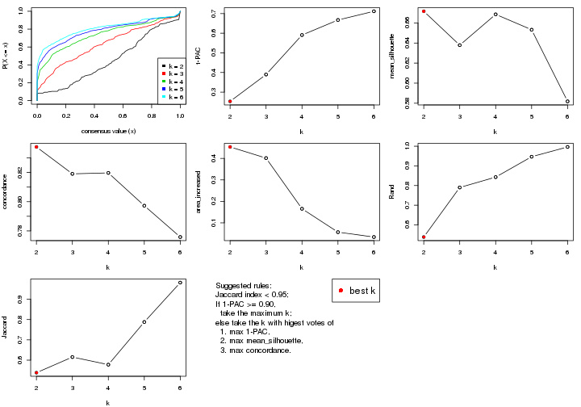

The numeric values for all these statistics can be obtained by `get_stats()`.

```r
get_stats(res)
```

```
#>   k 1-PAC mean_silhouette concordance area_increased  Rand Jaccard
#> 2 2 0.253           0.672       0.837         0.4534 0.538   0.538
#> 3 3 0.390           0.638       0.819         0.4015 0.790   0.615
#> 4 4 0.591           0.669       0.820         0.1655 0.843   0.578
#> 5 5 0.667           0.653       0.797         0.0566 0.947   0.788
#> 6 6 0.712           0.582       0.776         0.0339 0.996   0.982
```

`suggest_best_k()` suggests the best $k$ based on these statistics. The rules are as follows:

- All $k$ with Jaccard index larger than 0.95 are removed because increasing
  $k$ does not provide enough extra information. If all $k$ are removed, it is
  marked as no subgroup is detected.
- For all $k$ with 1-PAC score larger than 0.9, the maximal $k$ is taken as
  the best $k$, and other $k$ are marked as optional $k$.
- If it does not fit the second rule. The $k$ with the maximal vote of the
  highest 1-PAC score, highest mean silhouette, and highest concordance is
  taken as the best $k$.

```r
suggest_best_k(res)
```

```
#> [1] 2
```


Following shows the table of the partitions (You need to click the **show/hide
code output** link to see it). The membership matrix (columns with name `p*`)
is inferred by
[`clue::cl_consensus()`](https://www.rdocumentation.org/link/cl_consensus?package=clue)
function with the `SE` method. Basically the value in the membership matrix
represents the probability to belong to a certain group. The finall class
label for an item is determined with the group with highest probability it
belongs to.

In `get_classes()` function, the entropy is calculated from the membership
matrix and the silhouette score is calculated from the consensus matrix.


<script>
$( function() {
	$( '#tabs-CV-hclust-get-classes' ).tabs();
} );
</script>
<div id='tabs-CV-hclust-get-classes'>
<ul>
<li><a href='#tab-CV-hclust-get-classes-1'>k = 2</a></li>
<li><a href='#tab-CV-hclust-get-classes-2'>k = 3</a></li>
<li><a href='#tab-CV-hclust-get-classes-3'>k = 4</a></li>
<li><a href='#tab-CV-hclust-get-classes-4'>k = 5</a></li>
<li><a href='#tab-CV-hclust-get-classes-5'>k = 6</a></li>
</ul>

<div id='tab-CV-hclust-get-classes-1'>
<p><a id='tab-CV-hclust-get-classes-1-a' style='color:#0366d6' href='#'>show/hide code output</a></p>
<pre><code class="r">cbind(get_classes(res, k = 2), get_membership(res, k = 2))
</code></pre>

<pre><code>#&gt;            class entropy silhouette    p1    p2
#&gt; GSM1296094     2  0.8861      0.581 0.304 0.696
#&gt; GSM1296119     2  0.0000      0.763 0.000 1.000
#&gt; GSM1296076     2  0.0000      0.763 0.000 1.000
#&gt; GSM1296092     2  0.0000      0.763 0.000 1.000
#&gt; GSM1296103     2  0.8499      0.617 0.276 0.724
#&gt; GSM1296078     2  0.0000      0.763 0.000 1.000
#&gt; GSM1296107     2  0.0000      0.763 0.000 1.000
#&gt; GSM1296109     2  0.0000      0.763 0.000 1.000
#&gt; GSM1296080     2  1.0000      0.144 0.500 0.500
#&gt; GSM1296090     2  0.0000      0.763 0.000 1.000
#&gt; GSM1296074     2  0.0000      0.763 0.000 1.000
#&gt; GSM1296111     2  0.0000      0.763 0.000 1.000
#&gt; GSM1296099     2  0.8955      0.573 0.312 0.688
#&gt; GSM1296086     2  0.7219      0.700 0.200 0.800
#&gt; GSM1296117     2  0.0000      0.763 0.000 1.000
#&gt; GSM1296113     2  0.0000      0.763 0.000 1.000
#&gt; GSM1296096     2  0.8813      0.586 0.300 0.700
#&gt; GSM1296105     2  0.9775      0.426 0.412 0.588
#&gt; GSM1296098     2  0.9993      0.207 0.484 0.516
#&gt; GSM1296101     2  0.6623      0.704 0.172 0.828
#&gt; GSM1296121     2  0.0000      0.763 0.000 1.000
#&gt; GSM1296088     2  0.9580      0.435 0.380 0.620
#&gt; GSM1296082     2  0.0000      0.763 0.000 1.000
#&gt; GSM1296115     2  0.0000      0.763 0.000 1.000
#&gt; GSM1296084     1  0.7815      0.655 0.768 0.232
#&gt; GSM1296072     2  0.8386      0.677 0.268 0.732
#&gt; GSM1296069     2  0.6048      0.741 0.148 0.852
#&gt; GSM1296071     2  0.7602      0.707 0.220 0.780
#&gt; GSM1296070     2  0.6048      0.741 0.148 0.852
#&gt; GSM1296073     2  0.0000      0.763 0.000 1.000
#&gt; GSM1296034     1  0.4431      0.800 0.908 0.092
#&gt; GSM1296041     2  0.0000      0.763 0.000 1.000
#&gt; GSM1296035     2  0.8813      0.586 0.300 0.700
#&gt; GSM1296038     2  0.0000      0.763 0.000 1.000
#&gt; GSM1296047     2  0.8386      0.677 0.268 0.732
#&gt; GSM1296039     2  0.0000      0.763 0.000 1.000
#&gt; GSM1296042     2  0.0000      0.763 0.000 1.000
#&gt; GSM1296043     2  0.6048      0.741 0.148 0.852
#&gt; GSM1296037     1  0.2603      0.824 0.956 0.044
#&gt; GSM1296046     2  0.7602      0.707 0.220 0.780
#&gt; GSM1296044     2  0.8016      0.691 0.244 0.756
#&gt; GSM1296045     2  0.6048      0.741 0.148 0.852
#&gt; GSM1296025     1  0.0000      0.834 1.000 0.000
#&gt; GSM1296033     1  0.7602      0.676 0.780 0.220
#&gt; GSM1296027     1  0.0000      0.834 1.000 0.000
#&gt; GSM1296032     1  0.0000      0.834 1.000 0.000
#&gt; GSM1296024     1  0.0000      0.834 1.000 0.000
#&gt; GSM1296031     1  0.7815      0.666 0.768 0.232
#&gt; GSM1296028     1  0.0000      0.834 1.000 0.000
#&gt; GSM1296029     1  0.5946      0.761 0.856 0.144
#&gt; GSM1296026     2  0.9795      0.366 0.416 0.584
#&gt; GSM1296030     1  0.9795      0.141 0.584 0.416
#&gt; GSM1296040     2  0.9635      0.494 0.388 0.612
#&gt; GSM1296036     2  0.9993      0.207 0.484 0.516
#&gt; GSM1296048     2  0.0000      0.763 0.000 1.000
#&gt; GSM1296059     2  0.8909      0.574 0.308 0.692
#&gt; GSM1296066     2  0.0000      0.763 0.000 1.000
#&gt; GSM1296060     2  0.8813      0.586 0.300 0.700
#&gt; GSM1296063     2  0.0000      0.763 0.000 1.000
#&gt; GSM1296064     2  0.0000      0.763 0.000 1.000
#&gt; GSM1296067     2  0.8909      0.627 0.308 0.692
#&gt; GSM1296062     1  0.9850      0.148 0.572 0.428
#&gt; GSM1296068     2  0.8016      0.691 0.244 0.756
#&gt; GSM1296050     1  0.0000      0.834 1.000 0.000
#&gt; GSM1296057     1  0.7815      0.661 0.768 0.232
#&gt; GSM1296052     1  0.0000      0.834 1.000 0.000
#&gt; GSM1296054     1  0.0000      0.834 1.000 0.000
#&gt; GSM1296049     1  0.0000      0.834 1.000 0.000
#&gt; GSM1296055     1  0.7815      0.666 0.768 0.232
#&gt; GSM1296053     1  0.0000      0.834 1.000 0.000
#&gt; GSM1296058     1  0.8813      0.554 0.700 0.300
#&gt; GSM1296051     2  0.9661      0.405 0.392 0.608
#&gt; GSM1296056     2  0.0376      0.762 0.004 0.996
#&gt; GSM1296065     2  0.9754      0.436 0.408 0.592
#&gt; GSM1296061     2  0.9993      0.207 0.484 0.516
#&gt; GSM1296095     2  0.8207      0.685 0.256 0.744
#&gt; GSM1296120     2  0.8386      0.677 0.268 0.732
#&gt; GSM1296077     1  0.0000      0.834 1.000 0.000
#&gt; GSM1296093     1  0.0000      0.834 1.000 0.000
#&gt; GSM1296104     2  0.9087      0.606 0.324 0.676
#&gt; GSM1296079     1  0.0000      0.834 1.000 0.000
#&gt; GSM1296108     2  0.8016      0.691 0.244 0.756
#&gt; GSM1296110     2  0.8909      0.627 0.308 0.692
#&gt; GSM1296081     1  0.0000      0.834 1.000 0.000
#&gt; GSM1296091     1  0.6712      0.739 0.824 0.176
#&gt; GSM1296075     1  0.9635      0.320 0.612 0.388
#&gt; GSM1296112     2  0.8016      0.691 0.244 0.756
#&gt; GSM1296100     1  0.2603      0.824 0.956 0.044
#&gt; GSM1296087     1  0.0672      0.833 0.992 0.008
#&gt; GSM1296118     2  0.8207      0.681 0.256 0.744
#&gt; GSM1296114     2  0.8016      0.691 0.244 0.756
#&gt; GSM1296097     1  0.8909      0.540 0.692 0.308
#&gt; GSM1296106     2  0.9754      0.436 0.408 0.592
#&gt; GSM1296102     1  0.4022      0.809 0.920 0.080
#&gt; GSM1296122     1  0.9087      0.478 0.676 0.324
#&gt; GSM1296089     1  0.7815      0.666 0.768 0.232
#&gt; GSM1296083     1  0.0000      0.834 1.000 0.000
#&gt; GSM1296116     2  0.7528      0.712 0.216 0.784
#&gt; GSM1296085     1  0.0000      0.834 1.000 0.000
</code></pre>

<script>
$('#tab-CV-hclust-get-classes-1-a').parent().next().next().hide();
$('#tab-CV-hclust-get-classes-1-a').click(function(){
  $('#tab-CV-hclust-get-classes-1-a').parent().next().next().toggle();
  return(false);
});
</script>
</div>

<div id='tab-CV-hclust-get-classes-2'>
<p><a id='tab-CV-hclust-get-classes-2-a' style='color:#0366d6' href='#'>show/hide code output</a></p>
<pre><code class="r">cbind(get_classes(res, k = 3), get_membership(res, k = 3))
</code></pre>

<pre><code>#&gt;            class entropy silhouette    p1    p2    p3
#&gt; GSM1296094     3  0.7128     0.5430 0.284 0.052 0.664
#&gt; GSM1296119     3  0.3816     0.7028 0.000 0.148 0.852
#&gt; GSM1296076     3  0.0424     0.7301 0.000 0.008 0.992
#&gt; GSM1296092     3  0.0424     0.7301 0.000 0.008 0.992
#&gt; GSM1296103     3  0.6894     0.5749 0.256 0.052 0.692
#&gt; GSM1296078     3  0.0424     0.7301 0.000 0.008 0.992
#&gt; GSM1296107     3  0.3879     0.7007 0.000 0.152 0.848
#&gt; GSM1296109     3  0.3482     0.7161 0.000 0.128 0.872
#&gt; GSM1296080     1  0.7996    -0.0981 0.476 0.060 0.464
#&gt; GSM1296090     3  0.0424     0.7301 0.000 0.008 0.992
#&gt; GSM1296074     3  0.0424     0.7301 0.000 0.008 0.992
#&gt; GSM1296111     3  0.4121     0.6892 0.000 0.168 0.832
#&gt; GSM1296099     3  0.7424     0.5289 0.288 0.064 0.648
#&gt; GSM1296086     3  0.5574     0.6410 0.184 0.032 0.784
#&gt; GSM1296117     3  0.3879     0.7007 0.000 0.152 0.848
#&gt; GSM1296113     3  0.3879     0.7007 0.000 0.152 0.848
#&gt; GSM1296096     3  0.7277     0.5439 0.280 0.060 0.660
#&gt; GSM1296105     2  0.9484     0.1889 0.328 0.472 0.200
#&gt; GSM1296098     3  0.8068     0.1190 0.456 0.064 0.480
#&gt; GSM1296101     3  0.6719     0.6555 0.160 0.096 0.744
#&gt; GSM1296121     3  0.3752     0.7047 0.000 0.144 0.856
#&gt; GSM1296088     3  0.7328     0.3930 0.364 0.040 0.596
#&gt; GSM1296082     3  0.0424     0.7301 0.000 0.008 0.992
#&gt; GSM1296115     3  0.3879     0.7007 0.000 0.152 0.848
#&gt; GSM1296084     1  0.6843     0.6880 0.740 0.116 0.144
#&gt; GSM1296072     2  0.2804     0.8178 0.060 0.924 0.016
#&gt; GSM1296069     2  0.2796     0.7775 0.000 0.908 0.092
#&gt; GSM1296071     2  0.1491     0.8272 0.016 0.968 0.016
#&gt; GSM1296070     2  0.3267     0.7558 0.000 0.884 0.116
#&gt; GSM1296073     3  0.3752     0.7047 0.000 0.144 0.856
#&gt; GSM1296034     1  0.3896     0.7784 0.888 0.060 0.052
#&gt; GSM1296041     3  0.3879     0.7007 0.000 0.152 0.848
#&gt; GSM1296035     3  0.7277     0.5439 0.280 0.060 0.660
#&gt; GSM1296038     3  0.3340     0.6970 0.000 0.120 0.880
#&gt; GSM1296047     2  0.2804     0.8178 0.060 0.924 0.016
#&gt; GSM1296039     3  0.0424     0.7301 0.000 0.008 0.992
#&gt; GSM1296042     3  0.4121     0.6877 0.000 0.168 0.832
#&gt; GSM1296043     2  0.2796     0.7775 0.000 0.908 0.092
#&gt; GSM1296037     1  0.2165     0.7934 0.936 0.064 0.000
#&gt; GSM1296046     2  0.1491     0.8272 0.016 0.968 0.016
#&gt; GSM1296044     2  0.1031     0.8277 0.024 0.976 0.000
#&gt; GSM1296045     2  0.2448     0.7888 0.000 0.924 0.076
#&gt; GSM1296025     1  0.0000     0.8115 1.000 0.000 0.000
#&gt; GSM1296033     1  0.6911     0.6782 0.728 0.180 0.092
#&gt; GSM1296027     1  0.0000     0.8115 1.000 0.000 0.000
#&gt; GSM1296032     1  0.0000     0.8115 1.000 0.000 0.000
#&gt; GSM1296024     1  0.0000     0.8115 1.000 0.000 0.000
#&gt; GSM1296031     1  0.6104     0.5005 0.648 0.348 0.004
#&gt; GSM1296028     1  0.0000     0.8115 1.000 0.000 0.000
#&gt; GSM1296029     1  0.5229     0.7508 0.828 0.104 0.068
#&gt; GSM1296026     3  0.7809     0.2870 0.396 0.056 0.548
#&gt; GSM1296030     1  0.7438     0.1858 0.568 0.040 0.392
#&gt; GSM1296040     3  0.9981     0.0263 0.316 0.320 0.364
#&gt; GSM1296036     3  0.8068     0.1190 0.456 0.064 0.480
#&gt; GSM1296048     3  0.3752     0.7047 0.000 0.144 0.856
#&gt; GSM1296059     3  0.7159     0.5368 0.288 0.052 0.660
#&gt; GSM1296066     3  0.3879     0.7007 0.000 0.152 0.848
#&gt; GSM1296060     3  0.7277     0.5439 0.280 0.060 0.660
#&gt; GSM1296063     3  0.3340     0.6970 0.000 0.120 0.880
#&gt; GSM1296064     3  0.0424     0.7301 0.000 0.008 0.992
#&gt; GSM1296067     2  0.3267     0.7764 0.116 0.884 0.000
#&gt; GSM1296062     1  0.8034     0.1567 0.540 0.068 0.392
#&gt; GSM1296068     2  0.1031     0.8277 0.024 0.976 0.000
#&gt; GSM1296050     1  0.0000     0.8115 1.000 0.000 0.000
#&gt; GSM1296057     1  0.7059     0.6677 0.716 0.192 0.092
#&gt; GSM1296052     1  0.0000     0.8115 1.000 0.000 0.000
#&gt; GSM1296054     1  0.0000     0.8115 1.000 0.000 0.000
#&gt; GSM1296049     1  0.0000     0.8115 1.000 0.000 0.000
#&gt; GSM1296055     1  0.6104     0.5005 0.648 0.348 0.004
#&gt; GSM1296053     1  0.0000     0.8115 1.000 0.000 0.000
#&gt; GSM1296058     1  0.8271     0.5820 0.632 0.212 0.156
#&gt; GSM1296051     3  0.7726     0.3461 0.372 0.056 0.572
#&gt; GSM1296056     3  0.0000     0.7282 0.000 0.000 1.000
#&gt; GSM1296065     2  0.9470     0.2015 0.324 0.476 0.200
#&gt; GSM1296061     3  0.8068     0.1190 0.456 0.064 0.480
#&gt; GSM1296095     2  0.9162     0.2907 0.160 0.500 0.340
#&gt; GSM1296120     2  0.2804     0.8178 0.060 0.924 0.016
#&gt; GSM1296077     1  0.0000     0.8115 1.000 0.000 0.000
#&gt; GSM1296093     1  0.0000     0.8115 1.000 0.000 0.000
#&gt; GSM1296104     2  0.8069     0.4848 0.244 0.636 0.120
#&gt; GSM1296079     1  0.0000     0.8115 1.000 0.000 0.000
#&gt; GSM1296108     2  0.1031     0.8277 0.024 0.976 0.000
#&gt; GSM1296110     2  0.3267     0.7764 0.116 0.884 0.000
#&gt; GSM1296081     1  0.0000     0.8115 1.000 0.000 0.000
#&gt; GSM1296091     1  0.5852     0.6982 0.776 0.180 0.044
#&gt; GSM1296075     1  0.7841     0.2795 0.536 0.408 0.056
#&gt; GSM1296112     2  0.1031     0.8277 0.024 0.976 0.000
#&gt; GSM1296100     1  0.2165     0.7934 0.936 0.064 0.000
#&gt; GSM1296087     1  0.0829     0.8083 0.984 0.012 0.004
#&gt; GSM1296118     2  0.1643     0.8237 0.044 0.956 0.000
#&gt; GSM1296114     2  0.1031     0.8277 0.024 0.976 0.000
#&gt; GSM1296097     1  0.8361     0.5723 0.624 0.216 0.160
#&gt; GSM1296106     2  0.9470     0.2015 0.324 0.476 0.200
#&gt; GSM1296102     1  0.4465     0.7298 0.820 0.176 0.004
#&gt; GSM1296122     1  0.6521     0.0831 0.504 0.492 0.004
#&gt; GSM1296089     1  0.6081     0.5052 0.652 0.344 0.004
#&gt; GSM1296083     1  0.0000     0.8115 1.000 0.000 0.000
#&gt; GSM1296116     2  0.1015     0.8239 0.008 0.980 0.012
#&gt; GSM1296085     1  0.0000     0.8115 1.000 0.000 0.000
</code></pre>

<script>
$('#tab-CV-hclust-get-classes-2-a').parent().next().next().hide();
$('#tab-CV-hclust-get-classes-2-a').click(function(){
  $('#tab-CV-hclust-get-classes-2-a').parent().next().next().toggle();
  return(false);
});
</script>
</div>

<div id='tab-CV-hclust-get-classes-3'>
<p><a id='tab-CV-hclust-get-classes-3-a' style='color:#0366d6' href='#'>show/hide code output</a></p>
<pre><code class="r">cbind(get_classes(res, k = 4), get_membership(res, k = 4))
</code></pre>

<pre><code>#&gt;            class entropy silhouette    p1    p2    p3    p4
#&gt; GSM1296094     3  0.3801     0.7020 0.000 0.000 0.780 0.220
#&gt; GSM1296119     4  0.2011     0.8822 0.000 0.080 0.000 0.920
#&gt; GSM1296076     4  0.2149     0.8530 0.000 0.000 0.088 0.912
#&gt; GSM1296092     4  0.2149     0.8530 0.000 0.000 0.088 0.912
#&gt; GSM1296103     3  0.4193     0.6603 0.000 0.000 0.732 0.268
#&gt; GSM1296078     4  0.2149     0.8530 0.000 0.000 0.088 0.912
#&gt; GSM1296107     4  0.2081     0.8808 0.000 0.084 0.000 0.916
#&gt; GSM1296109     4  0.4829     0.7581 0.000 0.068 0.156 0.776
#&gt; GSM1296080     3  0.1871     0.6975 0.016 0.012 0.948 0.024
#&gt; GSM1296090     4  0.2149     0.8530 0.000 0.000 0.088 0.912
#&gt; GSM1296074     4  0.2149     0.8530 0.000 0.000 0.088 0.912
#&gt; GSM1296111     4  0.2345     0.8714 0.000 0.100 0.000 0.900
#&gt; GSM1296099     3  0.4137     0.7093 0.000 0.012 0.780 0.208
#&gt; GSM1296086     3  0.4977     0.2043 0.000 0.000 0.540 0.460
#&gt; GSM1296117     4  0.2081     0.8808 0.000 0.084 0.000 0.916
#&gt; GSM1296113     4  0.2081     0.8808 0.000 0.084 0.000 0.916
#&gt; GSM1296096     3  0.4228     0.6971 0.000 0.008 0.760 0.232
#&gt; GSM1296105     2  0.8193     0.1946 0.096 0.440 0.396 0.068
#&gt; GSM1296098     3  0.2010     0.7077 0.008 0.012 0.940 0.040
#&gt; GSM1296101     3  0.6213     0.2280 0.000 0.052 0.484 0.464
#&gt; GSM1296121     4  0.1940     0.8828 0.000 0.076 0.000 0.924
#&gt; GSM1296088     3  0.3725     0.7090 0.008 0.000 0.812 0.180
#&gt; GSM1296082     4  0.2149     0.8530 0.000 0.000 0.088 0.912
#&gt; GSM1296115     4  0.2081     0.8808 0.000 0.084 0.000 0.916
#&gt; GSM1296084     3  0.6790    -0.0376 0.408 0.084 0.504 0.004
#&gt; GSM1296072     2  0.1854     0.7741 0.012 0.940 0.048 0.000
#&gt; GSM1296069     2  0.3123     0.7119 0.000 0.844 0.000 0.156
#&gt; GSM1296071     2  0.0817     0.7806 0.000 0.976 0.000 0.024
#&gt; GSM1296070     2  0.3400     0.6936 0.000 0.820 0.000 0.180
#&gt; GSM1296073     4  0.1940     0.8828 0.000 0.076 0.000 0.924
#&gt; GSM1296034     1  0.5856     0.3575 0.556 0.036 0.408 0.000
#&gt; GSM1296041     4  0.2081     0.8808 0.000 0.084 0.000 0.916
#&gt; GSM1296035     3  0.4228     0.6971 0.000 0.008 0.760 0.232
#&gt; GSM1296038     4  0.4549     0.7677 0.000 0.096 0.100 0.804
#&gt; GSM1296047     2  0.1854     0.7741 0.012 0.940 0.048 0.000
#&gt; GSM1296039     4  0.2149     0.8530 0.000 0.000 0.088 0.912
#&gt; GSM1296042     4  0.2345     0.8696 0.000 0.100 0.000 0.900
#&gt; GSM1296043     2  0.3123     0.7119 0.000 0.844 0.000 0.156
#&gt; GSM1296037     1  0.4356     0.7057 0.804 0.048 0.148 0.000
#&gt; GSM1296046     2  0.0817     0.7806 0.000 0.976 0.000 0.024
#&gt; GSM1296044     2  0.0000     0.7825 0.000 1.000 0.000 0.000
#&gt; GSM1296045     2  0.2760     0.7313 0.000 0.872 0.000 0.128
#&gt; GSM1296025     1  0.0336     0.8135 0.992 0.000 0.008 0.000
#&gt; GSM1296033     1  0.7383     0.1620 0.440 0.140 0.416 0.004
#&gt; GSM1296027     1  0.0469     0.8128 0.988 0.000 0.012 0.000
#&gt; GSM1296032     1  0.0188     0.8122 0.996 0.000 0.004 0.000
#&gt; GSM1296024     1  0.0336     0.8135 0.992 0.000 0.008 0.000
#&gt; GSM1296031     1  0.7239     0.3100 0.500 0.344 0.156 0.000
#&gt; GSM1296028     1  0.0336     0.8127 0.992 0.000 0.008 0.000
#&gt; GSM1296029     1  0.6319     0.4700 0.604 0.084 0.312 0.000
#&gt; GSM1296026     3  0.5086     0.7135 0.060 0.012 0.776 0.152
#&gt; GSM1296030     3  0.5312     0.5412 0.236 0.000 0.712 0.052
#&gt; GSM1296040     3  0.6829     0.3754 0.008 0.280 0.600 0.112
#&gt; GSM1296036     3  0.2010     0.7077 0.008 0.012 0.940 0.040
#&gt; GSM1296048     4  0.1940     0.8828 0.000 0.076 0.000 0.924
#&gt; GSM1296059     3  0.3764     0.7044 0.000 0.000 0.784 0.216
#&gt; GSM1296066     4  0.2081     0.8808 0.000 0.084 0.000 0.916
#&gt; GSM1296060     3  0.4228     0.6971 0.000 0.008 0.760 0.232
#&gt; GSM1296063     4  0.4426     0.7773 0.000 0.096 0.092 0.812
#&gt; GSM1296064     4  0.2149     0.8530 0.000 0.000 0.088 0.912
#&gt; GSM1296067     2  0.2676     0.7507 0.012 0.896 0.092 0.000
#&gt; GSM1296062     3  0.4481     0.6427 0.124 0.024 0.820 0.032
#&gt; GSM1296068     2  0.0000     0.7825 0.000 1.000 0.000 0.000
#&gt; GSM1296050     1  0.0336     0.8135 0.992 0.000 0.008 0.000
#&gt; GSM1296057     1  0.7477     0.1421 0.428 0.152 0.416 0.004
#&gt; GSM1296052     1  0.0469     0.8128 0.988 0.000 0.012 0.000
#&gt; GSM1296054     1  0.0188     0.8122 0.996 0.000 0.004 0.000
#&gt; GSM1296049     1  0.0336     0.8135 0.992 0.000 0.008 0.000
#&gt; GSM1296055     1  0.7239     0.3100 0.500 0.344 0.156 0.000
#&gt; GSM1296053     1  0.0336     0.8127 0.992 0.000 0.008 0.000
#&gt; GSM1296058     3  0.7284     0.1925 0.276 0.172 0.548 0.004
#&gt; GSM1296051     3  0.5123     0.7042 0.048 0.012 0.764 0.176
#&gt; GSM1296056     4  0.2589     0.8255 0.000 0.000 0.116 0.884
#&gt; GSM1296065     2  0.8190     0.2042 0.096 0.444 0.392 0.068
#&gt; GSM1296061     3  0.2010     0.7077 0.008 0.012 0.940 0.040
#&gt; GSM1296095     2  0.7683     0.2277 0.000 0.452 0.304 0.244
#&gt; GSM1296120     2  0.1854     0.7741 0.012 0.940 0.048 0.000
#&gt; GSM1296077     1  0.0336     0.8135 0.992 0.000 0.008 0.000
#&gt; GSM1296093     1  0.0000     0.8118 1.000 0.000 0.000 0.000
#&gt; GSM1296104     2  0.5990     0.4421 0.008 0.604 0.352 0.036
#&gt; GSM1296079     1  0.0336     0.8135 0.992 0.000 0.008 0.000
#&gt; GSM1296108     2  0.0000     0.7825 0.000 1.000 0.000 0.000
#&gt; GSM1296110     2  0.2676     0.7507 0.012 0.896 0.092 0.000
#&gt; GSM1296081     1  0.0188     0.8132 0.996 0.000 0.004 0.000
#&gt; GSM1296091     1  0.6401     0.5626 0.652 0.172 0.176 0.000
#&gt; GSM1296075     2  0.7768     0.0187 0.360 0.400 0.240 0.000
#&gt; GSM1296112     2  0.0469     0.7826 0.000 0.988 0.000 0.012
#&gt; GSM1296100     1  0.4356     0.7057 0.804 0.048 0.148 0.000
#&gt; GSM1296087     1  0.1302     0.7981 0.956 0.000 0.044 0.000
#&gt; GSM1296118     2  0.0895     0.7818 0.020 0.976 0.004 0.000
#&gt; GSM1296114     2  0.0000     0.7825 0.000 1.000 0.000 0.000
#&gt; GSM1296097     3  0.7428     0.1999 0.272 0.176 0.544 0.008
#&gt; GSM1296106     2  0.8190     0.2042 0.096 0.444 0.392 0.068
#&gt; GSM1296102     1  0.6685     0.5472 0.616 0.160 0.224 0.000
#&gt; GSM1296122     2  0.7175     0.1231 0.360 0.496 0.144 0.000
#&gt; GSM1296089     1  0.7133     0.3236 0.512 0.344 0.144 0.000
#&gt; GSM1296083     1  0.0188     0.8132 0.996 0.000 0.004 0.000
#&gt; GSM1296116     2  0.1211     0.7748 0.000 0.960 0.000 0.040
#&gt; GSM1296085     1  0.0000     0.8118 1.000 0.000 0.000 0.000
</code></pre>

<script>
$('#tab-CV-hclust-get-classes-3-a').parent().next().next().hide();
$('#tab-CV-hclust-get-classes-3-a').click(function(){
  $('#tab-CV-hclust-get-classes-3-a').parent().next().next().toggle();
  return(false);
});
</script>
</div>

<div id='tab-CV-hclust-get-classes-4'>
<p><a id='tab-CV-hclust-get-classes-4-a' style='color:#0366d6' href='#'>show/hide code output</a></p>
<pre><code class="r">cbind(get_classes(res, k = 5), get_membership(res, k = 5))
</code></pre>

<pre><code>#&gt;            class entropy silhouette    p1    p2    p3    p4    p5
#&gt; GSM1296094     3  0.2806    0.71608 0.000 0.000 0.844 0.004 0.152
#&gt; GSM1296119     5  0.1270    0.85485 0.000 0.052 0.000 0.000 0.948
#&gt; GSM1296076     5  0.3579    0.81723 0.000 0.000 0.100 0.072 0.828
#&gt; GSM1296092     5  0.3579    0.81723 0.000 0.000 0.100 0.072 0.828
#&gt; GSM1296103     3  0.3462    0.69597 0.000 0.000 0.792 0.012 0.196
#&gt; GSM1296078     5  0.3579    0.81723 0.000 0.000 0.100 0.072 0.828
#&gt; GSM1296107     5  0.1341    0.85309 0.000 0.056 0.000 0.000 0.944
#&gt; GSM1296109     5  0.3922    0.70124 0.000 0.040 0.180 0.000 0.780
#&gt; GSM1296080     3  0.2911    0.61229 0.004 0.000 0.852 0.136 0.008
#&gt; GSM1296090     5  0.3579    0.81723 0.000 0.000 0.100 0.072 0.828
#&gt; GSM1296074     5  0.3579    0.81723 0.000 0.000 0.100 0.072 0.828
#&gt; GSM1296111     5  0.1608    0.84339 0.000 0.072 0.000 0.000 0.928
#&gt; GSM1296099     3  0.3379    0.71558 0.000 0.008 0.828 0.016 0.148
#&gt; GSM1296086     3  0.6081    0.24192 0.000 0.000 0.476 0.124 0.400
#&gt; GSM1296117     5  0.1341    0.85309 0.000 0.056 0.000 0.000 0.944
#&gt; GSM1296113     5  0.1341    0.85309 0.000 0.056 0.000 0.000 0.944
#&gt; GSM1296096     3  0.3516    0.71207 0.000 0.004 0.812 0.020 0.164
#&gt; GSM1296105     4  0.8103    0.56409 0.076 0.244 0.160 0.484 0.036
#&gt; GSM1296098     3  0.2189    0.63802 0.000 0.000 0.904 0.084 0.012
#&gt; GSM1296101     3  0.6484    0.30081 0.000 0.012 0.484 0.136 0.368
#&gt; GSM1296121     5  0.1197    0.85480 0.000 0.048 0.000 0.000 0.952
#&gt; GSM1296088     3  0.5144    0.62628 0.000 0.000 0.692 0.176 0.132
#&gt; GSM1296082     5  0.3579    0.81723 0.000 0.000 0.100 0.072 0.828
#&gt; GSM1296115     5  0.1341    0.85309 0.000 0.056 0.000 0.000 0.944
#&gt; GSM1296084     4  0.7158    0.25513 0.344 0.008 0.280 0.364 0.004
#&gt; GSM1296072     2  0.2046    0.80252 0.000 0.916 0.016 0.068 0.000
#&gt; GSM1296069     2  0.2966    0.73489 0.000 0.816 0.000 0.000 0.184
#&gt; GSM1296071     2  0.0794    0.84167 0.000 0.972 0.000 0.000 0.028
#&gt; GSM1296070     2  0.3177    0.70915 0.000 0.792 0.000 0.000 0.208
#&gt; GSM1296073     5  0.1197    0.85480 0.000 0.048 0.000 0.000 0.952
#&gt; GSM1296034     1  0.6615    0.11756 0.504 0.012 0.312 0.172 0.000
#&gt; GSM1296041     5  0.1341    0.85309 0.000 0.056 0.000 0.000 0.944
#&gt; GSM1296035     3  0.3516    0.71207 0.000 0.004 0.812 0.020 0.164
#&gt; GSM1296038     5  0.5568    0.72965 0.000 0.060 0.096 0.128 0.716
#&gt; GSM1296047     2  0.2046    0.80252 0.000 0.916 0.016 0.068 0.000
#&gt; GSM1296039     5  0.3639    0.81706 0.000 0.000 0.100 0.076 0.824
#&gt; GSM1296042     5  0.1608    0.84321 0.000 0.072 0.000 0.000 0.928
#&gt; GSM1296043     2  0.2966    0.73489 0.000 0.816 0.000 0.000 0.184
#&gt; GSM1296037     1  0.3628    0.61856 0.772 0.012 0.000 0.216 0.000
#&gt; GSM1296046     2  0.0794    0.84167 0.000 0.972 0.000 0.000 0.028
#&gt; GSM1296044     2  0.0000    0.84167 0.000 1.000 0.000 0.000 0.000
#&gt; GSM1296045     2  0.2648    0.76397 0.000 0.848 0.000 0.000 0.152
#&gt; GSM1296025     1  0.0162    0.79779 0.996 0.000 0.000 0.004 0.000
#&gt; GSM1296033     4  0.6845    0.34540 0.372 0.036 0.124 0.468 0.000
#&gt; GSM1296027     1  0.0609    0.79437 0.980 0.000 0.000 0.020 0.000
#&gt; GSM1296032     1  0.0609    0.79539 0.980 0.000 0.000 0.020 0.000
#&gt; GSM1296024     1  0.0162    0.79779 0.996 0.000 0.000 0.004 0.000
#&gt; GSM1296031     1  0.6781    0.00442 0.448 0.208 0.008 0.336 0.000
#&gt; GSM1296028     1  0.0703    0.79440 0.976 0.000 0.000 0.024 0.000
#&gt; GSM1296029     1  0.6137    0.09099 0.540 0.008 0.116 0.336 0.000
#&gt; GSM1296026     3  0.6151    0.51742 0.020 0.000 0.580 0.296 0.104
#&gt; GSM1296030     3  0.6501    0.33200 0.208 0.000 0.572 0.200 0.020
#&gt; GSM1296040     3  0.7546    0.07033 0.004 0.148 0.476 0.296 0.076
#&gt; GSM1296036     3  0.2189    0.63802 0.000 0.000 0.904 0.084 0.012
#&gt; GSM1296048     5  0.1197    0.85480 0.000 0.048 0.000 0.000 0.952
#&gt; GSM1296059     3  0.2763    0.71606 0.000 0.000 0.848 0.004 0.148
#&gt; GSM1296066     5  0.1341    0.85309 0.000 0.056 0.000 0.000 0.944
#&gt; GSM1296060     3  0.3516    0.71207 0.000 0.004 0.812 0.020 0.164
#&gt; GSM1296063     5  0.5508    0.73664 0.000 0.060 0.088 0.132 0.720
#&gt; GSM1296064     5  0.3639    0.81706 0.000 0.000 0.100 0.076 0.824
#&gt; GSM1296067     2  0.3388    0.67340 0.000 0.792 0.008 0.200 0.000
#&gt; GSM1296062     3  0.4701    0.50677 0.108 0.004 0.764 0.116 0.008
#&gt; GSM1296068     2  0.0000    0.84167 0.000 1.000 0.000 0.000 0.000
#&gt; GSM1296050     1  0.0162    0.79779 0.996 0.000 0.000 0.004 0.000
#&gt; GSM1296057     4  0.6479    0.36008 0.360 0.036 0.088 0.516 0.000
#&gt; GSM1296052     1  0.0609    0.79437 0.980 0.000 0.000 0.020 0.000
#&gt; GSM1296054     1  0.0609    0.79539 0.980 0.000 0.000 0.020 0.000
#&gt; GSM1296049     1  0.0162    0.79779 0.996 0.000 0.000 0.004 0.000
#&gt; GSM1296055     1  0.6781    0.00442 0.448 0.208 0.008 0.336 0.000
#&gt; GSM1296053     1  0.0703    0.79440 0.976 0.000 0.000 0.024 0.000
#&gt; GSM1296058     4  0.6219    0.54324 0.208 0.024 0.152 0.616 0.000
#&gt; GSM1296051     3  0.6056    0.52477 0.008 0.000 0.576 0.292 0.124
#&gt; GSM1296056     5  0.3992    0.78841 0.000 0.000 0.124 0.080 0.796
#&gt; GSM1296065     4  0.8075    0.56482 0.076 0.244 0.156 0.488 0.036
#&gt; GSM1296061     3  0.2189    0.63802 0.000 0.000 0.904 0.084 0.012
#&gt; GSM1296095     4  0.8200    0.32764 0.000 0.280 0.136 0.380 0.204
#&gt; GSM1296120     2  0.2046    0.80252 0.000 0.916 0.016 0.068 0.000
#&gt; GSM1296077     1  0.0162    0.79779 0.996 0.000 0.000 0.004 0.000
#&gt; GSM1296093     1  0.0162    0.79675 0.996 0.000 0.000 0.004 0.000
#&gt; GSM1296104     4  0.5976    0.32502 0.000 0.368 0.092 0.532 0.008
#&gt; GSM1296079     1  0.0162    0.79779 0.996 0.000 0.000 0.004 0.000
#&gt; GSM1296108     2  0.0000    0.84167 0.000 1.000 0.000 0.000 0.000
#&gt; GSM1296110     2  0.3388    0.67340 0.000 0.792 0.008 0.200 0.000
#&gt; GSM1296081     1  0.0000    0.79706 1.000 0.000 0.000 0.000 0.000
#&gt; GSM1296091     1  0.6084    0.24755 0.608 0.068 0.044 0.280 0.000
#&gt; GSM1296075     4  0.7712    0.38382 0.312 0.280 0.052 0.356 0.000
#&gt; GSM1296112     2  0.0510    0.84297 0.000 0.984 0.000 0.000 0.016
#&gt; GSM1296100     1  0.3628    0.61856 0.772 0.012 0.000 0.216 0.000
#&gt; GSM1296087     1  0.1608    0.76165 0.928 0.000 0.000 0.072 0.000
#&gt; GSM1296118     2  0.0912    0.83565 0.012 0.972 0.000 0.016 0.000
#&gt; GSM1296114     2  0.0000    0.84167 0.000 1.000 0.000 0.000 0.000
#&gt; GSM1296097     4  0.6447    0.54798 0.208 0.028 0.152 0.608 0.004
#&gt; GSM1296106     4  0.8075    0.56482 0.076 0.244 0.156 0.488 0.036
#&gt; GSM1296102     1  0.5882    0.32901 0.572 0.084 0.012 0.332 0.000
#&gt; GSM1296122     2  0.6941   -0.28425 0.304 0.368 0.004 0.324 0.000
#&gt; GSM1296089     1  0.6758    0.03326 0.460 0.208 0.008 0.324 0.000
#&gt; GSM1296083     1  0.0000    0.79706 1.000 0.000 0.000 0.000 0.000
#&gt; GSM1296116     2  0.1121    0.83492 0.000 0.956 0.000 0.000 0.044
#&gt; GSM1296085     1  0.0162    0.79675 0.996 0.000 0.000 0.004 0.000
</code></pre>

<script>
$('#tab-CV-hclust-get-classes-4-a').parent().next().next().hide();
$('#tab-CV-hclust-get-classes-4-a').click(function(){
  $('#tab-CV-hclust-get-classes-4-a').parent().next().next().toggle();
  return(false);
});
</script>
</div>

<div id='tab-CV-hclust-get-classes-5'>
<p><a id='tab-CV-hclust-get-classes-5-a' style='color:#0366d6' href='#'>show/hide code output</a></p>
<pre><code class="r">cbind(get_classes(res, k = 6), get_membership(res, k = 6))
</code></pre>

<pre><code>#&gt;            class entropy silhouette    p1    p2    p3    p4    p5    p6
#&gt; GSM1296094     3  0.2135   0.685537 0.000 0.000 0.872 0.000 0.128 0.000
#&gt; GSM1296119     5  0.0363   0.830670 0.000 0.012 0.000 0.000 0.988 0.000
#&gt; GSM1296076     5  0.4120   0.788399 0.000 0.000 0.096 0.160 0.744 0.000
#&gt; GSM1296092     5  0.4120   0.788399 0.000 0.000 0.096 0.160 0.744 0.000
#&gt; GSM1296103     3  0.3073   0.667478 0.000 0.000 0.816 0.016 0.164 0.004
#&gt; GSM1296078     5  0.4120   0.788399 0.000 0.000 0.096 0.160 0.744 0.000
#&gt; GSM1296107     5  0.0748   0.827723 0.000 0.016 0.000 0.004 0.976 0.004
#&gt; GSM1296109     5  0.2980   0.667521 0.000 0.008 0.192 0.000 0.800 0.000
#&gt; GSM1296080     3  0.4121   0.554396 0.004 0.000 0.736 0.200 0.000 0.060
#&gt; GSM1296090     5  0.4120   0.788399 0.000 0.000 0.096 0.160 0.744 0.000
#&gt; GSM1296074     5  0.4120   0.788399 0.000 0.000 0.096 0.160 0.744 0.000
#&gt; GSM1296111     5  0.1080   0.819133 0.000 0.032 0.000 0.004 0.960 0.004
#&gt; GSM1296099     3  0.2755   0.685046 0.000 0.000 0.856 0.012 0.120 0.012
#&gt; GSM1296086     3  0.6733   0.230086 0.000 0.000 0.444 0.136 0.336 0.084
#&gt; GSM1296117     5  0.0748   0.827723 0.000 0.016 0.000 0.004 0.976 0.004
#&gt; GSM1296113     5  0.0748   0.827723 0.000 0.016 0.000 0.004 0.976 0.004
#&gt; GSM1296096     3  0.3002   0.681741 0.000 0.000 0.836 0.020 0.136 0.008
#&gt; GSM1296105     6  0.7067   0.450179 0.032 0.092 0.092 0.172 0.028 0.584
#&gt; GSM1296098     3  0.2398   0.601568 0.000 0.000 0.876 0.104 0.000 0.020
#&gt; GSM1296101     3  0.6395   0.286736 0.000 0.000 0.492 0.136 0.316 0.056
#&gt; GSM1296121     5  0.0260   0.830551 0.000 0.008 0.000 0.000 0.992 0.000
#&gt; GSM1296088     3  0.6263   0.521939 0.000 0.000 0.580 0.196 0.092 0.132
#&gt; GSM1296082     5  0.4120   0.788399 0.000 0.000 0.096 0.160 0.744 0.000
#&gt; GSM1296115     5  0.0748   0.827723 0.000 0.016 0.000 0.004 0.976 0.004
#&gt; GSM1296084     6  0.7400   0.219882 0.284 0.000 0.152 0.188 0.000 0.376
#&gt; GSM1296072     2  0.2002   0.785029 0.000 0.908 0.004 0.012 0.000 0.076
#&gt; GSM1296069     2  0.3043   0.707193 0.000 0.796 0.000 0.004 0.196 0.004
#&gt; GSM1296071     2  0.0713   0.841307 0.000 0.972 0.000 0.000 0.028 0.000
#&gt; GSM1296070     2  0.3221   0.677795 0.000 0.772 0.000 0.004 0.220 0.004
#&gt; GSM1296073     5  0.0260   0.830551 0.000 0.008 0.000 0.000 0.992 0.000
#&gt; GSM1296034     1  0.7045  -0.000874 0.424 0.004 0.268 0.236 0.000 0.068
#&gt; GSM1296041     5  0.0748   0.827723 0.000 0.016 0.000 0.004 0.976 0.004
#&gt; GSM1296035     3  0.3002   0.681741 0.000 0.000 0.836 0.020 0.136 0.008
#&gt; GSM1296038     5  0.6002   0.697445 0.000 0.032 0.092 0.180 0.644 0.052
#&gt; GSM1296047     2  0.2002   0.785029 0.000 0.908 0.004 0.012 0.000 0.076
#&gt; GSM1296039     5  0.4259   0.786611 0.000 0.000 0.096 0.160 0.740 0.004
#&gt; GSM1296042     5  0.1080   0.818387 0.000 0.032 0.000 0.004 0.960 0.004
#&gt; GSM1296043     2  0.3043   0.707193 0.000 0.796 0.000 0.004 0.196 0.004
#&gt; GSM1296037     1  0.4633   0.440242 0.676 0.000 0.000 0.100 0.000 0.224
#&gt; GSM1296046     2  0.0713   0.841307 0.000 0.972 0.000 0.000 0.028 0.000
#&gt; GSM1296044     2  0.0000   0.839366 0.000 1.000 0.000 0.000 0.000 0.000
#&gt; GSM1296045     2  0.2527   0.743260 0.000 0.832 0.000 0.000 0.168 0.000
#&gt; GSM1296025     1  0.0146   0.744689 0.996 0.000 0.000 0.000 0.000 0.004
#&gt; GSM1296033     6  0.5525   0.312456 0.304 0.008 0.024 0.072 0.000 0.592
#&gt; GSM1296027     1  0.0891   0.737662 0.968 0.000 0.000 0.008 0.000 0.024
#&gt; GSM1296032     1  0.0692   0.741460 0.976 0.000 0.000 0.004 0.000 0.020
#&gt; GSM1296024     1  0.0146   0.744689 0.996 0.000 0.000 0.000 0.000 0.004
#&gt; GSM1296031     1  0.7399  -0.669149 0.340 0.160 0.000 0.332 0.000 0.168
#&gt; GSM1296028     1  0.0858   0.738866 0.968 0.000 0.000 0.004 0.000 0.028
#&gt; GSM1296029     1  0.5900  -0.021265 0.480 0.000 0.020 0.124 0.000 0.376
#&gt; GSM1296026     3  0.6951   0.370675 0.012 0.000 0.452 0.232 0.048 0.256
#&gt; GSM1296030     3  0.7247   0.245195 0.176 0.000 0.464 0.180 0.004 0.176
#&gt; GSM1296040     3  0.7137   0.003907 0.000 0.048 0.420 0.096 0.064 0.372
#&gt; GSM1296036     3  0.2398   0.601568 0.000 0.000 0.876 0.104 0.000 0.020
#&gt; GSM1296048     5  0.0260   0.830551 0.000 0.008 0.000 0.000 0.992 0.000
#&gt; GSM1296059     3  0.2092   0.685545 0.000 0.000 0.876 0.000 0.124 0.000
#&gt; GSM1296066     5  0.0748   0.827723 0.000 0.016 0.000 0.004 0.976 0.004
#&gt; GSM1296060     3  0.3002   0.681741 0.000 0.000 0.836 0.020 0.136 0.008
#&gt; GSM1296063     5  0.5941   0.704506 0.000 0.032 0.084 0.184 0.648 0.052
#&gt; GSM1296064     5  0.4259   0.786611 0.000 0.000 0.096 0.160 0.740 0.004
#&gt; GSM1296067     2  0.3720   0.496853 0.000 0.736 0.000 0.236 0.000 0.028
#&gt; GSM1296062     3  0.4543   0.518591 0.076 0.000 0.756 0.112 0.000 0.056
#&gt; GSM1296068     2  0.0000   0.839366 0.000 1.000 0.000 0.000 0.000 0.000
#&gt; GSM1296050     1  0.0146   0.744689 0.996 0.000 0.000 0.000 0.000 0.004
#&gt; GSM1296057     6  0.4723   0.329678 0.292 0.004 0.016 0.036 0.000 0.652
#&gt; GSM1296052     1  0.0891   0.737662 0.968 0.000 0.000 0.008 0.000 0.024
#&gt; GSM1296054     1  0.0692   0.741460 0.976 0.000 0.000 0.004 0.000 0.020
#&gt; GSM1296049     1  0.0146   0.744689 0.996 0.000 0.000 0.000 0.000 0.004
#&gt; GSM1296055     1  0.7399  -0.669149 0.340 0.160 0.000 0.332 0.000 0.168
#&gt; GSM1296053     1  0.0858   0.738866 0.968 0.000 0.000 0.004 0.000 0.028
#&gt; GSM1296058     6  0.4121   0.429257 0.156 0.000 0.028 0.048 0.000 0.768
#&gt; GSM1296051     3  0.6858   0.377992 0.000 0.000 0.448 0.232 0.068 0.252
#&gt; GSM1296056     5  0.4617   0.767158 0.000 0.000 0.104 0.168 0.716 0.012
#&gt; GSM1296065     6  0.7052   0.450858 0.032 0.092 0.088 0.176 0.028 0.584
#&gt; GSM1296061     3  0.2398   0.601568 0.000 0.000 0.876 0.104 0.000 0.020
#&gt; GSM1296095     6  0.8097   0.307933 0.000 0.112 0.080 0.200 0.192 0.416
#&gt; GSM1296120     2  0.2002   0.785029 0.000 0.908 0.004 0.012 0.000 0.076
#&gt; GSM1296077     1  0.0146   0.744689 0.996 0.000 0.000 0.000 0.000 0.004
#&gt; GSM1296093     1  0.0146   0.743663 0.996 0.000 0.000 0.000 0.000 0.004
#&gt; GSM1296104     6  0.5240   0.356530 0.000 0.132 0.020 0.192 0.000 0.656
#&gt; GSM1296079     1  0.0146   0.744689 0.996 0.000 0.000 0.000 0.000 0.004
#&gt; GSM1296108     2  0.0000   0.839366 0.000 1.000 0.000 0.000 0.000 0.000
#&gt; GSM1296110     2  0.3645   0.502979 0.000 0.740 0.000 0.236 0.000 0.024
#&gt; GSM1296081     1  0.0000   0.744150 1.000 0.000 0.000 0.000 0.000 0.000
#&gt; GSM1296091     1  0.4904   0.216790 0.588 0.012 0.000 0.048 0.000 0.352
#&gt; GSM1296075     6  0.6851  -0.224340 0.272 0.188 0.000 0.080 0.000 0.460
#&gt; GSM1296112     2  0.0458   0.841676 0.000 0.984 0.000 0.000 0.016 0.000
#&gt; GSM1296100     1  0.4633   0.440242 0.676 0.000 0.000 0.100 0.000 0.224
#&gt; GSM1296087     1  0.2250   0.688966 0.896 0.000 0.000 0.040 0.000 0.064
#&gt; GSM1296118     2  0.1370   0.816585 0.012 0.948 0.000 0.036 0.000 0.004
#&gt; GSM1296114     2  0.0000   0.839366 0.000 1.000 0.000 0.000 0.000 0.000
#&gt; GSM1296097     6  0.4322   0.433490 0.156 0.000 0.028 0.052 0.004 0.760
#&gt; GSM1296106     6  0.7052   0.450858 0.032 0.092 0.088 0.176 0.028 0.584
#&gt; GSM1296102     1  0.6841  -0.045292 0.460 0.040 0.012 0.224 0.000 0.264
#&gt; GSM1296122     4  0.7550   0.000000 0.240 0.300 0.000 0.308 0.000 0.152
#&gt; GSM1296089     1  0.7361  -0.646701 0.360 0.160 0.000 0.320 0.000 0.160
#&gt; GSM1296083     1  0.0000   0.744150 1.000 0.000 0.000 0.000 0.000 0.000
#&gt; GSM1296116     2  0.1007   0.835318 0.000 0.956 0.000 0.000 0.044 0.000
#&gt; GSM1296085     1  0.0146   0.743663 0.996 0.000 0.000 0.000 0.000 0.004
</code></pre>

<script>
$('#tab-CV-hclust-get-classes-5-a').parent().next().next().hide();
$('#tab-CV-hclust-get-classes-5-a').click(function(){
  $('#tab-CV-hclust-get-classes-5-a').parent().next().next().toggle();
  return(false);
});
</script>
</div>
</div>

Heatmaps for the consensus matrix. It visualizes the probability of two
samples to be in a same group.


<script>
$( function() {
	$( '#tabs-CV-hclust-consensus-heatmap' ).tabs();
} );
</script>
<div id='tabs-CV-hclust-consensus-heatmap'>
<ul>
<li><a href='#tab-CV-hclust-consensus-heatmap-1'>k = 2</a></li>
<li><a href='#tab-CV-hclust-consensus-heatmap-2'>k = 3</a></li>
<li><a href='#tab-CV-hclust-consensus-heatmap-3'>k = 4</a></li>
<li><a href='#tab-CV-hclust-consensus-heatmap-4'>k = 5</a></li>
<li><a href='#tab-CV-hclust-consensus-heatmap-5'>k = 6</a></li>
</ul>
<div id='tab-CV-hclust-consensus-heatmap-1'>
<pre><code class="r">consensus_heatmap(res, k = 2)
</code></pre>

<p></p>

</div>
<div id='tab-CV-hclust-consensus-heatmap-2'>
<pre><code class="r">consensus_heatmap(res, k = 3)
</code></pre>

<p></p>

</div>
<div id='tab-CV-hclust-consensus-heatmap-3'>
<pre><code class="r">consensus_heatmap(res, k = 4)
</code></pre>

<p>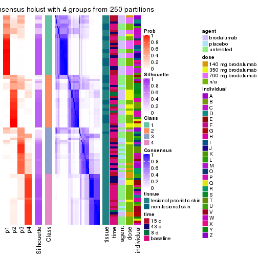</p>

</div>
<div id='tab-CV-hclust-consensus-heatmap-4'>
<pre><code class="r">consensus_heatmap(res, k = 5)
</code></pre>

<p></p>

</div>
<div id='tab-CV-hclust-consensus-heatmap-5'>
<pre><code class="r">consensus_heatmap(res, k = 6)
</code></pre>

<p></p>

</div>
</div>

Heatmaps for the membership of samples in all partitions to see how consistent they are:


<script>
$( function() {
	$( '#tabs-CV-hclust-membership-heatmap' ).tabs();
} );
</script>
<div id='tabs-CV-hclust-membership-heatmap'>
<ul>
<li><a href='#tab-CV-hclust-membership-heatmap-1'>k = 2</a></li>
<li><a href='#tab-CV-hclust-membership-heatmap-2'>k = 3</a></li>
<li><a href='#tab-CV-hclust-membership-heatmap-3'>k = 4</a></li>
<li><a href='#tab-CV-hclust-membership-heatmap-4'>k = 5</a></li>
<li><a href='#tab-CV-hclust-membership-heatmap-5'>k = 6</a></li>
</ul>
<div id='tab-CV-hclust-membership-heatmap-1'>
<pre><code class="r">membership_heatmap(res, k = 2)
</code></pre>

<p></p>

</div>
<div id='tab-CV-hclust-membership-heatmap-2'>
<pre><code class="r">membership_heatmap(res, k = 3)
</code></pre>

<p></p>

</div>
<div id='tab-CV-hclust-membership-heatmap-3'>
<pre><code class="r">membership_heatmap(res, k = 4)
</code></pre>

<p></p>

</div>
<div id='tab-CV-hclust-membership-heatmap-4'>
<pre><code class="r">membership_heatmap(res, k = 5)
</code></pre>

<p></p>

</div>
<div id='tab-CV-hclust-membership-heatmap-5'>
<pre><code class="r">membership_heatmap(res, k = 6)
</code></pre>

<p></p>

</div>
</div>

As soon as we have had the classes for columns, we can look for signatures
which are significantly different between classes which can be candidate marks
for certain classes. Following are the heatmaps for signatures.


Signature heatmaps where rows are scaled:


<script>
$( function() {
	$( '#tabs-CV-hclust-get-signatures' ).tabs();
} );
</script>
<div id='tabs-CV-hclust-get-signatures'>
<ul>
<li><a href='#tab-CV-hclust-get-signatures-1'>k = 2</a></li>
<li><a href='#tab-CV-hclust-get-signatures-2'>k = 3</a></li>
<li><a href='#tab-CV-hclust-get-signatures-3'>k = 4</a></li>
<li><a href='#tab-CV-hclust-get-signatures-4'>k = 5</a></li>
<li><a href='#tab-CV-hclust-get-signatures-5'>k = 6</a></li>
</ul>
<div id='tab-CV-hclust-get-signatures-1'>
<pre><code class="r">get_signatures(res, k = 2)
</code></pre>

<p></p>

</div>
<div id='tab-CV-hclust-get-signatures-2'>
<pre><code class="r">get_signatures(res, k = 3)
</code></pre>

<p></p>

</div>
<div id='tab-CV-hclust-get-signatures-3'>
<pre><code class="r">get_signatures(res, k = 4)
</code></pre>

<p></p>

</div>
<div id='tab-CV-hclust-get-signatures-4'>
<pre><code class="r">get_signatures(res, k = 5)
</code></pre>

<p></p>

</div>
<div id='tab-CV-hclust-get-signatures-5'>
<pre><code class="r">get_signatures(res, k = 6)
</code></pre>

<p></p>

</div>
</div>


Signature heatmaps where rows are not scaled:


<script>
$( function() {
	$( '#tabs-CV-hclust-get-signatures-no-scale' ).tabs();
} );
</script>
<div id='tabs-CV-hclust-get-signatures-no-scale'>
<ul>
<li><a href='#tab-CV-hclust-get-signatures-no-scale-1'>k = 2</a></li>
<li><a href='#tab-CV-hclust-get-signatures-no-scale-2'>k = 3</a></li>
<li><a href='#tab-CV-hclust-get-signatures-no-scale-3'>k = 4</a></li>
<li><a href='#tab-CV-hclust-get-signatures-no-scale-4'>k = 5</a></li>
<li><a href='#tab-CV-hclust-get-signatures-no-scale-5'>k = 6</a></li>
</ul>
<div id='tab-CV-hclust-get-signatures-no-scale-1'>
<pre><code class="r">get_signatures(res, k = 2, scale_rows = FALSE)
</code></pre>

<p></p>

</div>
<div id='tab-CV-hclust-get-signatures-no-scale-2'>
<pre><code class="r">get_signatures(res, k = 3, scale_rows = FALSE)
</code></pre>

<p></p>

</div>
<div id='tab-CV-hclust-get-signatures-no-scale-3'>
<pre><code class="r">get_signatures(res, k = 4, scale_rows = FALSE)
</code></pre>

<p></p>

</div>
<div id='tab-CV-hclust-get-signatures-no-scale-4'>
<pre><code class="r">get_signatures(res, k = 5, scale_rows = FALSE)
</code></pre>

<p></p>

</div>
<div id='tab-CV-hclust-get-signatures-no-scale-5'>
<pre><code class="r">get_signatures(res, k = 6, scale_rows = FALSE)
</code></pre>

<p></p>

</div>
</div>


Compare the overlap of signatures from different k:

```r
compare_signatures(res)
```


`get_signature()` returns a data frame invisibly. TO get the list of signatures, the function
call should be assigned to a variable explicitly. In following code, if `plot` argument is set
to `FALSE`, no heatmap is plotted while only the differential analysis is performed.

```r
# code only for demonstration
tb = get_signature(res, k = ..., plot = FALSE)
```

An example of the output of `tb` is:

```
#>   which_row         fdr    mean_1    mean_2 scaled_mean_1 scaled_mean_2 km
#> 1        38 0.042760348  8.373488  9.131774    -0.5533452     0.5164555  1
#> 2        40 0.018707592  7.106213  8.469186    -0.6173731     0.5762149  1
#> 3        55 0.019134737 10.221463 11.207825    -0.6159697     0.5749050  1
#> 4        59 0.006059896  5.921854  7.869574    -0.6899429     0.6439467  1
#> 5        60 0.018055526  8.928898 10.211722    -0.6204761     0.5791110  1
#> 6        98 0.009384629 15.714769 14.887706     0.6635654    -0.6193277  2
...
```

The columns in `tb` are:

1. `which_row`: row indices corresponding to the input matrix.
2. `fdr`: FDR for the differential test. 
3. `mean_x`: The mean value in group x.
4. `scaled_mean_x`: The mean value in group x after rows are scaled.
5. `km`: Row groups if k-means clustering is applied to rows.


UMAP plot which shows how samples are separated.


<script>
$( function() {
	$( '#tabs-CV-hclust-dimension-reduction' ).tabs();
} );
</script>
<div id='tabs-CV-hclust-dimension-reduction'>
<ul>
<li><a href='#tab-CV-hclust-dimension-reduction-1'>k = 2</a></li>
<li><a href='#tab-CV-hclust-dimension-reduction-2'>k = 3</a></li>
<li><a href='#tab-CV-hclust-dimension-reduction-3'>k = 4</a></li>
<li><a href='#tab-CV-hclust-dimension-reduction-4'>k = 5</a></li>
<li><a href='#tab-CV-hclust-dimension-reduction-5'>k = 6</a></li>
</ul>
<div id='tab-CV-hclust-dimension-reduction-1'>
<pre><code class="r">dimension_reduction(res, k = 2, method = &quot;UMAP&quot;)
</code></pre>

<p></p>

</div>
<div id='tab-CV-hclust-dimension-reduction-2'>
<pre><code class="r">dimension_reduction(res, k = 3, method = &quot;UMAP&quot;)
</code></pre>

<p></p>

</div>
<div id='tab-CV-hclust-dimension-reduction-3'>
<pre><code class="r">dimension_reduction(res, k = 4, method = &quot;UMAP&quot;)
</code></pre>

<p></p>

</div>
<div id='tab-CV-hclust-dimension-reduction-4'>
<pre><code class="r">dimension_reduction(res, k = 5, method = &quot;UMAP&quot;)
</code></pre>

<p></p>

</div>
<div id='tab-CV-hclust-dimension-reduction-5'>
<pre><code class="r">dimension_reduction(res, k = 6, method = &quot;UMAP&quot;)
</code></pre>

<p></p>

</div>
</div>


Following heatmap shows how subgroups are split when increasing `k`:

```r
collect_classes(res)
```

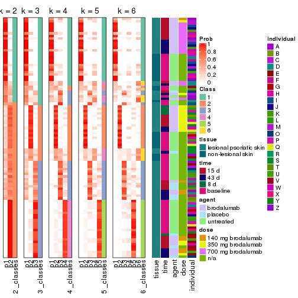


Test correlation between subgroups and known annotations. If the known
annotation is numeric, one-way ANOVA test is applied, and if the known
annotation is discrete, chi-squared contingency table test is applied.

```r
test_to_known_factors(res)
```

```
#>            n tissue(p) time(p) agent(p)  dose(p) individual(p) k
#> CV:hclust 84  5.02e-02  0.1230   0.1476 5.78e-08      4.69e-04 2
#> CV:hclust 82  2.42e-04  0.0268   0.0489 3.65e-11      1.59e-04 3
#> CV:hclust 79  4.77e-05  0.1667   0.0127 4.91e-09      2.64e-05 4
#> CV:hclust 81  4.91e-04  0.1810   0.0627 1.43e-08      2.81e-08 5
#> CV:hclust 71  2.76e-04  0.1167   0.1713 1.80e-09      6.96e-06 6
```


If matrix rows can be associated to genes, consider to use `functional_enrichment(res,
...)` to perform function enrichment for the signature genes. See [this vignette](http://bioconductor.org/packages/devel/bioc/vignettes/cola/inst/doc/functional_enrichment.html) for more detailed explanations.


 

---------------------------------------------------


### CV:kmeans


The object with results only for a single top-value method and a single partition method 
can be extracted as:

```r
res = res_list["CV", "kmeans"]
# you can also extract it by
# res = res_list["CV:kmeans"]
```

A summary of `res` and all the functions that can be applied to it:

```r
res
```

```
#> A 'ConsensusPartition' object with k = 2, 3, 4, 5, 6.
#>   On a matrix with 45638 rows and 99 columns.
#>   Top rows (1000, 2000, 3000, 4000, 5000) are extracted by 'CV' method.
#>   Subgroups are detected by 'kmeans' method.
#>   Performed in total 1250 partitions by row resampling.
#>   Best k for subgroups seems to be 3.
#> 
#> Following methods can be applied to this 'ConsensusPartition' object:
#>  [1] "cola_report"             "collect_classes"         "collect_plots"          
#>  [4] "collect_stats"           "colnames"                "compare_signatures"     
#>  [7] "consensus_heatmap"       "dimension_reduction"     "functional_enrichment"  
#> [10] "get_anno_col"            "get_anno"                "get_classes"            
#> [13] "get_consensus"           "get_matrix"              "get_membership"         
#> [16] "get_param"               "get_signatures"          "get_stats"              
#> [19] "is_best_k"               "is_stable_k"             "membership_heatmap"     
#> [22] "ncol"                    "nrow"                    "plot_ecdf"              
#> [25] "rownames"                "select_partition_number" "show"                   
#> [28] "suggest_best_k"          "test_to_known_factors"
```

`collect_plots()` function collects all the plots made from `res` for all `k` (number of partitions)
into one single page to provide an easy and fast comparison between different `k`.

```r
collect_plots(res)
```


The plots are:

- The first row: a plot of the ECDF (empirical cumulative distribution
  function) curves of the consensus matrix for each `k` and the heatmap of
  predicted classes for each `k`.
- The second row: heatmaps of the consensus matrix for each `k`.
- The third row: heatmaps of the membership matrix for each `k`.
- The fouth row: heatmaps of the signatures for each `k`.

All the plots in panels can be made by individual functions and they are
plotted later in this section.

`select_partition_number()` produces several plots showing different
statistics for choosing "optimized" `k`. There are following statistics:

- ECDF curves of the consensus matrix for each `k`;
- 1-PAC. [The PAC
  score](https://en.wikipedia.org/wiki/Consensus_clustering#Over-interpretation_potential_of_consensus_clustering)
  measures the proportion of the ambiguous subgrouping.
- Mean silhouette score.
- Concordance. The mean probability of fiting the consensus class ids in all
  partitions.
- Area increased. Denote $A_k$ as the area under the ECDF curve for current
  `k`, the area increased is defined as $A_k - A_{k-1}$.
- Rand index. The percent of pairs of samples that are both in a same cluster
  or both are not in a same cluster in the partition of k and k-1.
- Jaccard index. The ratio of pairs of samples are both in a same cluster in
  the partition of k and k-1 and the pairs of samples are both in a same
  cluster in the partition k or k-1.

The detailed explanations of these statistics can be found in [the _cola_
vignette](http://bioconductor.org/packages/devel/bioc/vignettes/cola/inst/doc/cola.html#toc_13).

Generally speaking, lower PAC score, higher mean silhouette score or higher
concordance corresponds to better partition. Rand index and Jaccard index
measure how similar the current partition is compared to partition with `k-1`.
If they are too similar, we won't accept `k` is better than `k-1`.

```r
select_partition_number(res)
```


The numeric values for all these statistics can be obtained by `get_stats()`.

```r
get_stats(res)
```

```
#>   k 1-PAC mean_silhouette concordance area_increased  Rand Jaccard
#> 2 2 0.744           0.918       0.958         0.4883 0.510   0.510
#> 3 3 0.882           0.942       0.970         0.3704 0.734   0.518
#> 4 4 0.709           0.602       0.771         0.1066 0.912   0.753
#> 5 5 0.701           0.614       0.735         0.0706 0.870   0.590
#> 6 6 0.727           0.711       0.793         0.0423 0.925   0.669
```

`suggest_best_k()` suggests the best $k$ based on these statistics. The rules are as follows:

- All $k$ with Jaccard index larger than 0.95 are removed because increasing
  $k$ does not provide enough extra information. If all $k$ are removed, it is
  marked as no subgroup is detected.
- For all $k$ with 1-PAC score larger than 0.9, the maximal $k$ is taken as
  the best $k$, and other $k$ are marked as optional $k$.
- If it does not fit the second rule. The $k$ with the maximal vote of the
  highest 1-PAC score, highest mean silhouette, and highest concordance is
  taken as the best $k$.

```r
suggest_best_k(res)
```

```
#> [1] 3
```


Following shows the table of the partitions (You need to click the **show/hide
code output** link to see it). The membership matrix (columns with name `p*`)
is inferred by
[`clue::cl_consensus()`](https://www.rdocumentation.org/link/cl_consensus?package=clue)
function with the `SE` method. Basically the value in the membership matrix
represents the probability to belong to a certain group. The finall class
label for an item is determined with the group with highest probability it
belongs to.

In `get_classes()` function, the entropy is calculated from the membership
matrix and the silhouette score is calculated from the consensus matrix.


<script>
$( function() {
	$( '#tabs-CV-kmeans-get-classes' ).tabs();
} );
</script>
<div id='tabs-CV-kmeans-get-classes'>
<ul>
<li><a href='#tab-CV-kmeans-get-classes-1'>k = 2</a></li>
<li><a href='#tab-CV-kmeans-get-classes-2'>k = 3</a></li>
<li><a href='#tab-CV-kmeans-get-classes-3'>k = 4</a></li>
<li><a href='#tab-CV-kmeans-get-classes-4'>k = 5</a></li>
<li><a href='#tab-CV-kmeans-get-classes-5'>k = 6</a></li>
</ul>

<div id='tab-CV-kmeans-get-classes-1'>
<p><a id='tab-CV-kmeans-get-classes-1-a' style='color:#0366d6' href='#'>show/hide code output</a></p>
<pre><code class="r">cbind(get_classes(res, k = 2), get_membership(res, k = 2))
</code></pre>

<pre><code>#&gt;            class entropy silhouette    p1    p2
#&gt; GSM1296094     2  0.5946      0.875 0.144 0.856
#&gt; GSM1296119     2  0.0000      0.946 0.000 1.000
#&gt; GSM1296076     2  0.0938      0.944 0.012 0.988
#&gt; GSM1296092     2  0.5946      0.875 0.144 0.856
#&gt; GSM1296103     2  0.5946      0.875 0.144 0.856
#&gt; GSM1296078     2  0.0376      0.946 0.004 0.996
#&gt; GSM1296107     2  0.0000      0.946 0.000 1.000
#&gt; GSM1296109     2  0.0000      0.946 0.000 1.000
#&gt; GSM1296080     1  0.0000      0.967 1.000 0.000
#&gt; GSM1296090     2  0.1843      0.941 0.028 0.972
#&gt; GSM1296074     2  0.1633      0.942 0.024 0.976
#&gt; GSM1296111     2  0.0000      0.946 0.000 1.000
#&gt; GSM1296099     2  0.3879      0.918 0.076 0.924
#&gt; GSM1296086     2  0.5946      0.875 0.144 0.856
#&gt; GSM1296117     2  0.0000      0.946 0.000 1.000
#&gt; GSM1296113     2  0.0000      0.946 0.000 1.000
#&gt; GSM1296096     2  0.1843      0.941 0.028 0.972
#&gt; GSM1296105     1  0.0000      0.967 1.000 0.000
#&gt; GSM1296098     2  0.5946      0.875 0.144 0.856
#&gt; GSM1296101     2  0.5946      0.875 0.144 0.856
#&gt; GSM1296121     2  0.0000      0.946 0.000 1.000
#&gt; GSM1296088     2  0.6048      0.871 0.148 0.852
#&gt; GSM1296082     2  0.1633      0.942 0.024 0.976
#&gt; GSM1296115     2  0.0000      0.946 0.000 1.000
#&gt; GSM1296084     1  0.0000      0.967 1.000 0.000
#&gt; GSM1296072     2  0.0000      0.946 0.000 1.000
#&gt; GSM1296069     2  0.0000      0.946 0.000 1.000
#&gt; GSM1296071     2  0.0000      0.946 0.000 1.000
#&gt; GSM1296070     2  0.0000      0.946 0.000 1.000
#&gt; GSM1296073     2  0.0000      0.946 0.000 1.000
#&gt; GSM1296034     1  0.0000      0.967 1.000 0.000
#&gt; GSM1296041     2  0.0000      0.946 0.000 1.000
#&gt; GSM1296035     2  0.5946      0.875 0.144 0.856
#&gt; GSM1296038     2  0.1633      0.942 0.024 0.976
#&gt; GSM1296047     2  0.4431      0.887 0.092 0.908
#&gt; GSM1296039     2  0.1633      0.942 0.024 0.976
#&gt; GSM1296042     2  0.0000      0.946 0.000 1.000
#&gt; GSM1296043     2  0.0000      0.946 0.000 1.000
#&gt; GSM1296037     1  0.0000      0.967 1.000 0.000
#&gt; GSM1296046     2  0.0000      0.946 0.000 1.000
#&gt; GSM1296044     2  0.0000      0.946 0.000 1.000
#&gt; GSM1296045     2  0.0000      0.946 0.000 1.000
#&gt; GSM1296025     1  0.0000      0.967 1.000 0.000
#&gt; GSM1296033     1  0.0000      0.967 1.000 0.000
#&gt; GSM1296027     1  0.0000      0.967 1.000 0.000
#&gt; GSM1296032     1  0.0000      0.967 1.000 0.000
#&gt; GSM1296024     1  0.0000      0.967 1.000 0.000
#&gt; GSM1296031     1  0.0000      0.967 1.000 0.000
#&gt; GSM1296028     1  0.0000      0.967 1.000 0.000
#&gt; GSM1296029     1  0.0000      0.967 1.000 0.000
#&gt; GSM1296026     1  0.9170      0.459 0.668 0.332
#&gt; GSM1296030     1  0.0000      0.967 1.000 0.000
#&gt; GSM1296040     2  0.5946      0.875 0.144 0.856
#&gt; GSM1296036     2  0.5946      0.875 0.144 0.856
#&gt; GSM1296048     2  0.0000      0.946 0.000 1.000
#&gt; GSM1296059     2  0.5946      0.875 0.144 0.856
#&gt; GSM1296066     2  0.0000      0.946 0.000 1.000
#&gt; GSM1296060     2  0.5946      0.875 0.144 0.856
#&gt; GSM1296063     2  0.0000      0.946 0.000 1.000
#&gt; GSM1296064     2  0.0000      0.946 0.000 1.000
#&gt; GSM1296067     2  0.3274      0.914 0.060 0.940
#&gt; GSM1296062     1  0.0000      0.967 1.000 0.000
#&gt; GSM1296068     2  0.2236      0.930 0.036 0.964
#&gt; GSM1296050     1  0.0000      0.967 1.000 0.000
#&gt; GSM1296057     1  0.0000      0.967 1.000 0.000
#&gt; GSM1296052     1  0.0000      0.967 1.000 0.000
#&gt; GSM1296054     1  0.0000      0.967 1.000 0.000
#&gt; GSM1296049     1  0.0000      0.967 1.000 0.000
#&gt; GSM1296055     1  0.0000      0.967 1.000 0.000
#&gt; GSM1296053     1  0.0000      0.967 1.000 0.000
#&gt; GSM1296058     1  0.0000      0.967 1.000 0.000
#&gt; GSM1296051     2  0.5946      0.875 0.144 0.856
#&gt; GSM1296056     2  0.5946      0.875 0.144 0.856
#&gt; GSM1296065     2  0.1633      0.942 0.024 0.976
#&gt; GSM1296061     1  1.0000     -0.116 0.500 0.500
#&gt; GSM1296095     2  0.0376      0.946 0.004 0.996
#&gt; GSM1296120     2  0.6438      0.803 0.164 0.836
#&gt; GSM1296077     1  0.0000      0.967 1.000 0.000
#&gt; GSM1296093     1  0.0000      0.967 1.000 0.000
#&gt; GSM1296104     2  0.7299      0.809 0.204 0.796
#&gt; GSM1296079     1  0.0000      0.967 1.000 0.000
#&gt; GSM1296108     2  0.0000      0.946 0.000 1.000
#&gt; GSM1296110     2  0.0000      0.946 0.000 1.000
#&gt; GSM1296081     1  0.0000      0.967 1.000 0.000
#&gt; GSM1296091     1  0.0000      0.967 1.000 0.000
#&gt; GSM1296075     1  0.0000      0.967 1.000 0.000
#&gt; GSM1296112     2  0.2236      0.930 0.036 0.964
#&gt; GSM1296100     1  0.0000      0.967 1.000 0.000
#&gt; GSM1296087     1  0.0000      0.967 1.000 0.000
#&gt; GSM1296118     1  0.9608      0.406 0.616 0.384
#&gt; GSM1296114     2  0.0000      0.946 0.000 1.000
#&gt; GSM1296097     1  0.1843      0.939 0.972 0.028
#&gt; GSM1296106     1  0.0000      0.967 1.000 0.000
#&gt; GSM1296102     1  0.0000      0.967 1.000 0.000
#&gt; GSM1296122     1  0.0000      0.967 1.000 0.000
#&gt; GSM1296089     1  0.0000      0.967 1.000 0.000
#&gt; GSM1296083     1  0.0000      0.967 1.000 0.000
#&gt; GSM1296116     2  0.0000      0.946 0.000 1.000
#&gt; GSM1296085     1  0.0000      0.967 1.000 0.000
</code></pre>

<script>
$('#tab-CV-kmeans-get-classes-1-a').parent().next().next().hide();
$('#tab-CV-kmeans-get-classes-1-a').click(function(){
  $('#tab-CV-kmeans-get-classes-1-a').parent().next().next().toggle();
  return(false);
});
</script>
</div>

<div id='tab-CV-kmeans-get-classes-2'>
<p><a id='tab-CV-kmeans-get-classes-2-a' style='color:#0366d6' href='#'>show/hide code output</a></p>
<pre><code class="r">cbind(get_classes(res, k = 3), get_membership(res, k = 3))
</code></pre>

<pre><code>#&gt;            class entropy silhouette    p1    p2    p3
#&gt; GSM1296094     3  0.0000      0.951 0.000 0.000 1.000
#&gt; GSM1296119     2  0.3116      0.907 0.000 0.892 0.108
#&gt; GSM1296076     3  0.0237      0.951 0.000 0.004 0.996
#&gt; GSM1296092     3  0.0237      0.951 0.000 0.004 0.996
#&gt; GSM1296103     3  0.0000      0.951 0.000 0.000 1.000
#&gt; GSM1296078     3  0.0237      0.951 0.000 0.004 0.996
#&gt; GSM1296107     2  0.0424      0.972 0.000 0.992 0.008
#&gt; GSM1296109     3  0.0892      0.943 0.000 0.020 0.980
#&gt; GSM1296080     3  0.4654      0.746 0.208 0.000 0.792
#&gt; GSM1296090     3  0.0237      0.951 0.000 0.004 0.996
#&gt; GSM1296074     3  0.0237      0.951 0.000 0.004 0.996
#&gt; GSM1296111     2  0.1031      0.965 0.000 0.976 0.024
#&gt; GSM1296099     3  0.0000      0.951 0.000 0.000 1.000
#&gt; GSM1296086     3  0.0424      0.950 0.000 0.008 0.992
#&gt; GSM1296117     2  0.3116      0.907 0.000 0.892 0.108
#&gt; GSM1296113     2  0.0424      0.972 0.000 0.992 0.008
#&gt; GSM1296096     3  0.0000      0.951 0.000 0.000 1.000
#&gt; GSM1296105     1  0.3752      0.834 0.856 0.000 0.144
#&gt; GSM1296098     3  0.0000      0.951 0.000 0.000 1.000
#&gt; GSM1296101     3  0.0237      0.950 0.000 0.004 0.996
#&gt; GSM1296121     2  0.3116      0.904 0.000 0.892 0.108
#&gt; GSM1296088     3  0.0475      0.949 0.004 0.004 0.992
#&gt; GSM1296082     3  0.0237      0.951 0.000 0.004 0.996
#&gt; GSM1296115     2  0.3038      0.907 0.000 0.896 0.104
#&gt; GSM1296084     3  0.5178      0.675 0.256 0.000 0.744
#&gt; GSM1296072     2  0.0592      0.972 0.000 0.988 0.012
#&gt; GSM1296069     2  0.0424      0.972 0.000 0.992 0.008
#&gt; GSM1296071     2  0.0592      0.972 0.000 0.988 0.012
#&gt; GSM1296070     2  0.0237      0.971 0.000 0.996 0.004
#&gt; GSM1296073     3  0.4796      0.700 0.000 0.220 0.780
#&gt; GSM1296034     1  0.0000      0.985 1.000 0.000 0.000
#&gt; GSM1296041     2  0.3116      0.907 0.000 0.892 0.108
#&gt; GSM1296035     3  0.0000      0.951 0.000 0.000 1.000
#&gt; GSM1296038     3  0.0237      0.950 0.000 0.004 0.996
#&gt; GSM1296047     2  0.0592      0.972 0.000 0.988 0.012
#&gt; GSM1296039     3  0.0237      0.951 0.000 0.004 0.996
#&gt; GSM1296042     2  0.0237      0.971 0.000 0.996 0.004
#&gt; GSM1296043     2  0.0424      0.972 0.000 0.992 0.008
#&gt; GSM1296037     1  0.0000      0.985 1.000 0.000 0.000
#&gt; GSM1296046     2  0.0424      0.972 0.000 0.992 0.008
#&gt; GSM1296044     2  0.0592      0.972 0.000 0.988 0.012
#&gt; GSM1296045     2  0.0237      0.971 0.000 0.996 0.004
#&gt; GSM1296025     1  0.0237      0.984 0.996 0.004 0.000
#&gt; GSM1296033     1  0.0000      0.985 1.000 0.000 0.000
#&gt; GSM1296027     1  0.0000      0.985 1.000 0.000 0.000
#&gt; GSM1296032     1  0.0000      0.985 1.000 0.000 0.000
#&gt; GSM1296024     1  0.0237      0.984 0.996 0.004 0.000
#&gt; GSM1296031     1  0.0000      0.985 1.000 0.000 0.000
#&gt; GSM1296028     1  0.0000      0.985 1.000 0.000 0.000
#&gt; GSM1296029     1  0.0000      0.985 1.000 0.000 0.000
#&gt; GSM1296026     3  0.0237      0.950 0.004 0.000 0.996
#&gt; GSM1296030     3  0.6008      0.440 0.372 0.000 0.628
#&gt; GSM1296040     3  0.0000      0.951 0.000 0.000 1.000
#&gt; GSM1296036     3  0.0000      0.951 0.000 0.000 1.000
#&gt; GSM1296048     2  0.3116      0.904 0.000 0.892 0.108
#&gt; GSM1296059     3  0.0000      0.951 0.000 0.000 1.000
#&gt; GSM1296066     2  0.0424      0.972 0.000 0.992 0.008
#&gt; GSM1296060     3  0.0000      0.951 0.000 0.000 1.000
#&gt; GSM1296063     3  0.1031      0.940 0.000 0.024 0.976
#&gt; GSM1296064     3  0.0237      0.951 0.000 0.004 0.996
#&gt; GSM1296067     2  0.0424      0.971 0.000 0.992 0.008
#&gt; GSM1296062     3  0.5016      0.698 0.240 0.000 0.760
#&gt; GSM1296068     2  0.0592      0.972 0.000 0.988 0.012
#&gt; GSM1296050     1  0.0237      0.984 0.996 0.004 0.000
#&gt; GSM1296057     1  0.0237      0.983 0.996 0.000 0.004
#&gt; GSM1296052     1  0.0000      0.985 1.000 0.000 0.000
#&gt; GSM1296054     1  0.0000      0.985 1.000 0.000 0.000
#&gt; GSM1296049     1  0.0237      0.984 0.996 0.004 0.000
#&gt; GSM1296055     1  0.0237      0.983 0.996 0.000 0.004
#&gt; GSM1296053     1  0.0000      0.985 1.000 0.000 0.000
#&gt; GSM1296058     1  0.3340      0.864 0.880 0.000 0.120
#&gt; GSM1296051     3  0.0237      0.951 0.000 0.004 0.996
#&gt; GSM1296056     3  0.0424      0.950 0.000 0.008 0.992
#&gt; GSM1296065     3  0.0000      0.951 0.000 0.000 1.000
#&gt; GSM1296061     3  0.0237      0.950 0.004 0.000 0.996
#&gt; GSM1296095     3  0.2711      0.875 0.000 0.088 0.912
#&gt; GSM1296120     2  0.0661      0.970 0.004 0.988 0.008
#&gt; GSM1296077     1  0.0237      0.984 0.996 0.004 0.000
#&gt; GSM1296093     1  0.0000      0.985 1.000 0.000 0.000
#&gt; GSM1296104     3  0.2537      0.888 0.080 0.000 0.920
#&gt; GSM1296079     1  0.0237      0.984 0.996 0.004 0.000
#&gt; GSM1296108     2  0.0592      0.972 0.000 0.988 0.012
#&gt; GSM1296110     2  0.0424      0.971 0.000 0.992 0.008
#&gt; GSM1296081     1  0.0000      0.985 1.000 0.000 0.000
#&gt; GSM1296091     1  0.0000      0.985 1.000 0.000 0.000
#&gt; GSM1296075     1  0.0475      0.982 0.992 0.004 0.004
#&gt; GSM1296112     2  0.0592      0.972 0.000 0.988 0.012
#&gt; GSM1296100     1  0.0000      0.985 1.000 0.000 0.000
#&gt; GSM1296087     1  0.0000      0.985 1.000 0.000 0.000
#&gt; GSM1296118     2  0.2682      0.905 0.076 0.920 0.004
#&gt; GSM1296114     2  0.0592      0.972 0.000 0.988 0.012
#&gt; GSM1296097     1  0.4121      0.801 0.832 0.000 0.168
#&gt; GSM1296106     1  0.0475      0.982 0.992 0.004 0.004
#&gt; GSM1296102     1  0.0237      0.983 0.996 0.000 0.004
#&gt; GSM1296122     1  0.0475      0.982 0.992 0.004 0.004
#&gt; GSM1296089     1  0.0000      0.985 1.000 0.000 0.000
#&gt; GSM1296083     1  0.0000      0.985 1.000 0.000 0.000
#&gt; GSM1296116     2  0.0424      0.971 0.000 0.992 0.008
#&gt; GSM1296085     1  0.0000      0.985 1.000 0.000 0.000
</code></pre>

<script>
$('#tab-CV-kmeans-get-classes-2-a').parent().next().next().hide();
$('#tab-CV-kmeans-get-classes-2-a').click(function(){
  $('#tab-CV-kmeans-get-classes-2-a').parent().next().next().toggle();
  return(false);
});
</script>
</div>

<div id='tab-CV-kmeans-get-classes-3'>
<p><a id='tab-CV-kmeans-get-classes-3-a' style='color:#0366d6' href='#'>show/hide code output</a></p>
<pre><code class="r">cbind(get_classes(res, k = 4), get_membership(res, k = 4))
</code></pre>

<pre><code>#&gt;            class entropy silhouette    p1    p2    p3    p4
#&gt; GSM1296094     3  0.1637     0.7929 0.000 0.000 0.940 0.060
#&gt; GSM1296119     2  0.2830     0.5121 0.000 0.900 0.040 0.060
#&gt; GSM1296076     3  0.5670     0.7234 0.000 0.152 0.720 0.128
#&gt; GSM1296092     3  0.4940     0.7526 0.000 0.096 0.776 0.128
#&gt; GSM1296103     3  0.1302     0.7957 0.000 0.000 0.956 0.044
#&gt; GSM1296078     3  0.5670     0.7234 0.000 0.152 0.720 0.128
#&gt; GSM1296107     2  0.1302     0.5867 0.000 0.956 0.000 0.044
#&gt; GSM1296109     3  0.5570     0.3685 0.000 0.440 0.540 0.020
#&gt; GSM1296080     3  0.2909     0.7803 0.020 0.000 0.888 0.092
#&gt; GSM1296090     3  0.5531     0.7309 0.000 0.140 0.732 0.128
#&gt; GSM1296074     3  0.5670     0.7234 0.000 0.152 0.720 0.128
#&gt; GSM1296111     2  0.0188     0.5742 0.000 0.996 0.004 0.000
#&gt; GSM1296099     3  0.0000     0.7984 0.000 0.000 1.000 0.000
#&gt; GSM1296086     3  0.4940     0.7526 0.000 0.096 0.776 0.128
#&gt; GSM1296117     2  0.0804     0.5684 0.000 0.980 0.012 0.008
#&gt; GSM1296113     2  0.1637     0.5890 0.000 0.940 0.000 0.060
#&gt; GSM1296096     3  0.0000     0.7984 0.000 0.000 1.000 0.000
#&gt; GSM1296105     3  0.6599     0.2701 0.080 0.000 0.488 0.432
#&gt; GSM1296098     3  0.2011     0.7876 0.000 0.000 0.920 0.080
#&gt; GSM1296101     3  0.1557     0.7938 0.000 0.000 0.944 0.056
#&gt; GSM1296121     2  0.3667     0.4755 0.000 0.856 0.056 0.088
#&gt; GSM1296088     3  0.1940     0.7967 0.000 0.000 0.924 0.076
#&gt; GSM1296082     3  0.5670     0.7234 0.000 0.152 0.720 0.128
#&gt; GSM1296115     2  0.0804     0.5684 0.000 0.980 0.012 0.008
#&gt; GSM1296084     3  0.3048     0.7790 0.016 0.000 0.876 0.108
#&gt; GSM1296072     2  0.4981     0.4284 0.000 0.536 0.000 0.464
#&gt; GSM1296069     2  0.3528     0.5637 0.000 0.808 0.000 0.192
#&gt; GSM1296071     2  0.4948     0.4718 0.000 0.560 0.000 0.440
#&gt; GSM1296070     2  0.2530     0.5824 0.000 0.888 0.000 0.112
#&gt; GSM1296073     2  0.6819    -0.0958 0.000 0.540 0.348 0.112
#&gt; GSM1296034     1  0.4535     0.7051 0.744 0.000 0.016 0.240
#&gt; GSM1296041     2  0.0804     0.5684 0.000 0.980 0.012 0.008
#&gt; GSM1296035     3  0.0000     0.7984 0.000 0.000 1.000 0.000
#&gt; GSM1296038     3  0.2089     0.7914 0.000 0.020 0.932 0.048
#&gt; GSM1296047     4  0.4955    -0.3241 0.000 0.444 0.000 0.556
#&gt; GSM1296039     3  0.5462     0.7274 0.000 0.152 0.736 0.112
#&gt; GSM1296042     2  0.1637     0.5890 0.000 0.940 0.000 0.060
#&gt; GSM1296043     2  0.4855     0.4914 0.000 0.600 0.000 0.400
#&gt; GSM1296037     1  0.4585     0.6263 0.668 0.000 0.000 0.332
#&gt; GSM1296046     2  0.4948     0.4718 0.000 0.560 0.000 0.440
#&gt; GSM1296044     2  0.4948     0.4718 0.000 0.560 0.000 0.440
#&gt; GSM1296045     2  0.4679     0.5110 0.000 0.648 0.000 0.352
#&gt; GSM1296025     1  0.0000     0.8733 1.000 0.000 0.000 0.000
#&gt; GSM1296033     1  0.2973     0.8018 0.856 0.000 0.000 0.144
#&gt; GSM1296027     1  0.0000     0.8733 1.000 0.000 0.000 0.000
#&gt; GSM1296032     1  0.0000     0.8733 1.000 0.000 0.000 0.000
#&gt; GSM1296024     1  0.0000     0.8733 1.000 0.000 0.000 0.000
#&gt; GSM1296031     1  0.2589     0.8191 0.884 0.000 0.000 0.116
#&gt; GSM1296028     1  0.0000     0.8733 1.000 0.000 0.000 0.000
#&gt; GSM1296029     1  0.0000     0.8733 1.000 0.000 0.000 0.000
#&gt; GSM1296026     3  0.2281     0.7930 0.000 0.000 0.904 0.096
#&gt; GSM1296030     3  0.5325     0.6626 0.160 0.000 0.744 0.096
#&gt; GSM1296040     3  0.2081     0.7861 0.000 0.000 0.916 0.084
#&gt; GSM1296036     3  0.2011     0.7876 0.000 0.000 0.920 0.080
#&gt; GSM1296048     2  0.4401     0.4342 0.000 0.812 0.076 0.112
#&gt; GSM1296059     3  0.0592     0.7985 0.000 0.000 0.984 0.016
#&gt; GSM1296066     2  0.1940     0.5880 0.000 0.924 0.000 0.076
#&gt; GSM1296060     3  0.0469     0.7986 0.000 0.000 0.988 0.012
#&gt; GSM1296063     2  0.6980    -0.2329 0.000 0.484 0.400 0.116
#&gt; GSM1296064     3  0.5462     0.7274 0.000 0.152 0.736 0.112
#&gt; GSM1296067     2  0.4981     0.4238 0.000 0.536 0.000 0.464
#&gt; GSM1296062     3  0.4679     0.5297 0.000 0.000 0.648 0.352
#&gt; GSM1296068     2  0.4948     0.4718 0.000 0.560 0.000 0.440
#&gt; GSM1296050     1  0.0000     0.8733 1.000 0.000 0.000 0.000
#&gt; GSM1296057     1  0.5440     0.5298 0.596 0.000 0.020 0.384
#&gt; GSM1296052     1  0.0000     0.8733 1.000 0.000 0.000 0.000
#&gt; GSM1296054     1  0.0000     0.8733 1.000 0.000 0.000 0.000
#&gt; GSM1296049     1  0.0000     0.8733 1.000 0.000 0.000 0.000
#&gt; GSM1296055     1  0.5476     0.5087 0.584 0.000 0.020 0.396
#&gt; GSM1296053     1  0.0000     0.8733 1.000 0.000 0.000 0.000
#&gt; GSM1296058     4  0.7787    -0.1154 0.244 0.000 0.372 0.384
#&gt; GSM1296051     3  0.4688     0.7590 0.000 0.080 0.792 0.128
#&gt; GSM1296056     3  0.4753     0.7577 0.000 0.084 0.788 0.128
#&gt; GSM1296065     3  0.5517     0.4393 0.000 0.020 0.568 0.412
#&gt; GSM1296061     3  0.2011     0.7876 0.000 0.000 0.920 0.080
#&gt; GSM1296095     3  0.4542     0.7288 0.000 0.088 0.804 0.108
#&gt; GSM1296120     4  0.4933    -0.3022 0.000 0.432 0.000 0.568
#&gt; GSM1296077     1  0.0000     0.8733 1.000 0.000 0.000 0.000
#&gt; GSM1296093     1  0.0000     0.8733 1.000 0.000 0.000 0.000
#&gt; GSM1296104     3  0.5657     0.3837 0.024 0.000 0.540 0.436
#&gt; GSM1296079     1  0.0000     0.8733 1.000 0.000 0.000 0.000
#&gt; GSM1296108     2  0.4948     0.4718 0.000 0.560 0.000 0.440
#&gt; GSM1296110     2  0.4948     0.4718 0.000 0.560 0.000 0.440
#&gt; GSM1296081     1  0.0000     0.8733 1.000 0.000 0.000 0.000
#&gt; GSM1296091     1  0.3837     0.7331 0.776 0.000 0.000 0.224
#&gt; GSM1296075     1  0.4661     0.6017 0.652 0.000 0.000 0.348
#&gt; GSM1296112     2  0.4948     0.4718 0.000 0.560 0.000 0.440
#&gt; GSM1296100     1  0.4585     0.6263 0.668 0.000 0.000 0.332
#&gt; GSM1296087     1  0.0000     0.8733 1.000 0.000 0.000 0.000
#&gt; GSM1296118     4  0.4989    -0.3848 0.000 0.472 0.000 0.528
#&gt; GSM1296114     2  0.4948     0.4718 0.000 0.560 0.000 0.440
#&gt; GSM1296097     3  0.7372     0.0554 0.160 0.000 0.420 0.420
#&gt; GSM1296106     4  0.5417    -0.2086 0.412 0.000 0.016 0.572
#&gt; GSM1296102     1  0.5339     0.5361 0.600 0.000 0.016 0.384
#&gt; GSM1296122     4  0.4790    -0.0777 0.380 0.000 0.000 0.620
#&gt; GSM1296089     1  0.2589     0.8191 0.884 0.000 0.000 0.116
#&gt; GSM1296083     1  0.0000     0.8733 1.000 0.000 0.000 0.000
#&gt; GSM1296116     2  0.4948     0.4718 0.000 0.560 0.000 0.440
#&gt; GSM1296085     1  0.0000     0.8733 1.000 0.000 0.000 0.000
</code></pre>

<script>
$('#tab-CV-kmeans-get-classes-3-a').parent().next().next().hide();
$('#tab-CV-kmeans-get-classes-3-a').click(function(){
  $('#tab-CV-kmeans-get-classes-3-a').parent().next().next().toggle();
  return(false);
});
</script>
</div>

<div id='tab-CV-kmeans-get-classes-4'>
<p><a id='tab-CV-kmeans-get-classes-4-a' style='color:#0366d6' href='#'>show/hide code output</a></p>
<pre><code class="r">cbind(get_classes(res, k = 5), get_membership(res, k = 5))
</code></pre>

<pre><code>#&gt;            class entropy silhouette    p1    p2    p3    p4    p5
#&gt; GSM1296094     3  0.6512     0.6482 0.000 0.348 0.452 0.200 0.000
#&gt; GSM1296119     5  0.3231     0.6252 0.000 0.004 0.196 0.000 0.800
#&gt; GSM1296076     3  0.1965     0.5447 0.000 0.000 0.904 0.000 0.096
#&gt; GSM1296092     3  0.1836     0.5894 0.000 0.000 0.932 0.032 0.036
#&gt; GSM1296103     3  0.6410     0.6638 0.000 0.320 0.488 0.192 0.000
#&gt; GSM1296078     3  0.1965     0.5447 0.000 0.000 0.904 0.000 0.096
#&gt; GSM1296107     5  0.0000     0.6255 0.000 0.000 0.000 0.000 1.000
#&gt; GSM1296109     5  0.6348     0.2761 0.000 0.204 0.208 0.012 0.576
#&gt; GSM1296080     3  0.7310     0.5996 0.032 0.344 0.404 0.220 0.000
#&gt; GSM1296090     3  0.2362     0.5539 0.000 0.000 0.900 0.024 0.076
#&gt; GSM1296074     3  0.1965     0.5447 0.000 0.000 0.904 0.000 0.096
#&gt; GSM1296111     5  0.1043     0.6505 0.000 0.000 0.040 0.000 0.960
#&gt; GSM1296099     3  0.6130     0.6759 0.000 0.264 0.556 0.180 0.000
#&gt; GSM1296086     3  0.1836     0.5894 0.000 0.000 0.932 0.032 0.036
#&gt; GSM1296117     5  0.1410     0.6577 0.000 0.000 0.060 0.000 0.940
#&gt; GSM1296113     5  0.0000     0.6255 0.000 0.000 0.000 0.000 1.000
#&gt; GSM1296096     3  0.6073     0.6762 0.000 0.264 0.564 0.172 0.000
#&gt; GSM1296105     4  0.4322     0.5025 0.032 0.084 0.080 0.804 0.000
#&gt; GSM1296098     3  0.6582     0.6410 0.000 0.344 0.440 0.216 0.000
#&gt; GSM1296101     3  0.6507     0.6569 0.000 0.316 0.472 0.212 0.000
#&gt; GSM1296121     5  0.3551     0.6148 0.000 0.008 0.220 0.000 0.772
#&gt; GSM1296088     3  0.6166     0.6572 0.000 0.272 0.548 0.180 0.000
#&gt; GSM1296082     3  0.1965     0.5447 0.000 0.000 0.904 0.000 0.096
#&gt; GSM1296115     5  0.1478     0.6576 0.000 0.000 0.064 0.000 0.936
#&gt; GSM1296084     3  0.7524     0.5749 0.044 0.296 0.408 0.252 0.000
#&gt; GSM1296072     2  0.6021     0.7605 0.000 0.552 0.000 0.144 0.304
#&gt; GSM1296069     5  0.3550     0.0355 0.000 0.236 0.000 0.004 0.760
#&gt; GSM1296071     2  0.4249     0.8788 0.000 0.568 0.000 0.000 0.432
#&gt; GSM1296070     5  0.1638     0.5221 0.000 0.064 0.000 0.004 0.932
#&gt; GSM1296073     5  0.4505     0.4623 0.000 0.008 0.368 0.004 0.620
#&gt; GSM1296034     1  0.5792     0.3816 0.612 0.164 0.000 0.224 0.000
#&gt; GSM1296041     5  0.1410     0.6577 0.000 0.000 0.060 0.000 0.940
#&gt; GSM1296035     3  0.6073     0.6762 0.000 0.264 0.564 0.172 0.000
#&gt; GSM1296038     3  0.6590     0.5937 0.000 0.176 0.516 0.296 0.012
#&gt; GSM1296047     2  0.6202     0.6676 0.000 0.552 0.000 0.228 0.220
#&gt; GSM1296039     3  0.3594     0.5585 0.000 0.032 0.844 0.028 0.096
#&gt; GSM1296042     5  0.0000     0.6255 0.000 0.000 0.000 0.000 1.000
#&gt; GSM1296043     5  0.4448    -0.7441 0.000 0.480 0.000 0.004 0.516
#&gt; GSM1296037     4  0.4827     0.1856 0.476 0.020 0.000 0.504 0.000
#&gt; GSM1296046     2  0.4397     0.8770 0.000 0.564 0.000 0.004 0.432
#&gt; GSM1296044     2  0.4397     0.8798 0.000 0.564 0.000 0.004 0.432
#&gt; GSM1296045     5  0.4443    -0.7281 0.000 0.472 0.000 0.004 0.524
#&gt; GSM1296025     1  0.1485     0.8685 0.948 0.032 0.000 0.020 0.000
#&gt; GSM1296033     1  0.5274     0.3079 0.596 0.036 0.012 0.356 0.000
#&gt; GSM1296027     1  0.1082     0.8688 0.964 0.028 0.000 0.008 0.000
#&gt; GSM1296032     1  0.0290     0.8732 0.992 0.008 0.000 0.000 0.000
#&gt; GSM1296024     1  0.1485     0.8685 0.948 0.032 0.000 0.020 0.000
#&gt; GSM1296031     1  0.4141     0.5683 0.728 0.024 0.000 0.248 0.000
#&gt; GSM1296028     1  0.0992     0.8678 0.968 0.024 0.000 0.008 0.000
#&gt; GSM1296029     1  0.1364     0.8651 0.952 0.036 0.000 0.012 0.000
#&gt; GSM1296026     3  0.5880     0.6531 0.000 0.228 0.600 0.172 0.000
#&gt; GSM1296030     3  0.8235     0.4771 0.144 0.248 0.388 0.220 0.000
#&gt; GSM1296040     3  0.6674     0.6340 0.000 0.324 0.428 0.248 0.000
#&gt; GSM1296036     3  0.6582     0.6410 0.000 0.344 0.440 0.216 0.000
#&gt; GSM1296048     5  0.3700     0.6041 0.000 0.008 0.240 0.000 0.752
#&gt; GSM1296059     3  0.6155     0.6753 0.000 0.276 0.548 0.176 0.000
#&gt; GSM1296066     5  0.0404     0.6098 0.000 0.012 0.000 0.000 0.988
#&gt; GSM1296060     3  0.6185     0.6725 0.000 0.264 0.548 0.188 0.000
#&gt; GSM1296063     5  0.5099     0.2547 0.000 0.012 0.484 0.016 0.488
#&gt; GSM1296064     3  0.3594     0.5585 0.000 0.032 0.844 0.028 0.096
#&gt; GSM1296067     2  0.5142     0.8547 0.000 0.564 0.000 0.044 0.392
#&gt; GSM1296062     4  0.6646    -0.2830 0.004 0.356 0.196 0.444 0.000
#&gt; GSM1296068     2  0.4397     0.8798 0.000 0.564 0.000 0.004 0.432
#&gt; GSM1296050     1  0.1485     0.8685 0.948 0.032 0.000 0.020 0.000
#&gt; GSM1296057     4  0.3366     0.6368 0.232 0.000 0.000 0.768 0.000
#&gt; GSM1296052     1  0.1082     0.8688 0.964 0.028 0.000 0.008 0.000
#&gt; GSM1296054     1  0.0290     0.8732 0.992 0.008 0.000 0.000 0.000
#&gt; GSM1296049     1  0.1399     0.8692 0.952 0.028 0.000 0.020 0.000
#&gt; GSM1296055     4  0.3877     0.6489 0.212 0.024 0.000 0.764 0.000
#&gt; GSM1296053     1  0.0798     0.8704 0.976 0.016 0.000 0.008 0.000
#&gt; GSM1296058     4  0.2569     0.6785 0.068 0.004 0.032 0.896 0.000
#&gt; GSM1296051     3  0.2074     0.5898 0.000 0.000 0.920 0.044 0.036
#&gt; GSM1296056     3  0.2149     0.5955 0.000 0.012 0.924 0.028 0.036
#&gt; GSM1296065     4  0.3061     0.5885 0.000 0.020 0.136 0.844 0.000
#&gt; GSM1296061     3  0.6582     0.6410 0.000 0.344 0.440 0.216 0.000
#&gt; GSM1296095     3  0.7106     0.3965 0.000 0.140 0.424 0.392 0.044
#&gt; GSM1296120     2  0.6174     0.6303 0.000 0.552 0.000 0.256 0.192
#&gt; GSM1296077     1  0.1485     0.8685 0.948 0.032 0.000 0.020 0.000
#&gt; GSM1296093     1  0.0609     0.8730 0.980 0.020 0.000 0.000 0.000
#&gt; GSM1296104     4  0.2828     0.6223 0.004 0.020 0.104 0.872 0.000
#&gt; GSM1296079     1  0.1485     0.8685 0.948 0.032 0.000 0.020 0.000
#&gt; GSM1296108     2  0.4397     0.8798 0.000 0.564 0.000 0.004 0.432
#&gt; GSM1296110     2  0.4249     0.8788 0.000 0.568 0.000 0.000 0.432
#&gt; GSM1296081     1  0.0771     0.8724 0.976 0.020 0.000 0.004 0.000
#&gt; GSM1296091     1  0.4824    -0.0951 0.512 0.020 0.000 0.468 0.000
#&gt; GSM1296075     4  0.4227     0.5554 0.292 0.016 0.000 0.692 0.000
#&gt; GSM1296112     2  0.4397     0.8770 0.000 0.564 0.000 0.004 0.432
#&gt; GSM1296100     4  0.4827     0.1856 0.476 0.020 0.000 0.504 0.000
#&gt; GSM1296087     1  0.1281     0.8659 0.956 0.032 0.000 0.012 0.000
#&gt; GSM1296118     2  0.5820     0.7839 0.000 0.572 0.000 0.120 0.308
#&gt; GSM1296114     2  0.4397     0.8798 0.000 0.564 0.000 0.004 0.432
#&gt; GSM1296097     4  0.3048     0.6580 0.036 0.024 0.060 0.880 0.000
#&gt; GSM1296106     4  0.4559     0.6523 0.100 0.152 0.000 0.748 0.000
#&gt; GSM1296102     4  0.4014     0.6138 0.256 0.016 0.000 0.728 0.000
#&gt; GSM1296122     4  0.5304     0.4851 0.080 0.292 0.000 0.628 0.000
#&gt; GSM1296089     1  0.4141     0.5683 0.728 0.024 0.000 0.248 0.000
#&gt; GSM1296083     1  0.0771     0.8724 0.976 0.020 0.000 0.004 0.000
#&gt; GSM1296116     2  0.4397     0.8770 0.000 0.564 0.000 0.004 0.432
#&gt; GSM1296085     1  0.0451     0.8728 0.988 0.008 0.000 0.004 0.000
</code></pre>

<script>
$('#tab-CV-kmeans-get-classes-4-a').parent().next().next().hide();
$('#tab-CV-kmeans-get-classes-4-a').click(function(){
  $('#tab-CV-kmeans-get-classes-4-a').parent().next().next().toggle();
  return(false);
});
</script>
</div>

<div id='tab-CV-kmeans-get-classes-5'>
<p><a id='tab-CV-kmeans-get-classes-5-a' style='color:#0366d6' href='#'>show/hide code output</a></p>
<pre><code class="r">cbind(get_classes(res, k = 6), get_membership(res, k = 6))
</code></pre>

<pre><code>#&gt;            class entropy silhouette    p1    p2    p3    p4    p5    p6
#&gt; GSM1296094     3  0.0405     0.7113 0.000 0.000 0.988 0.008 0.004 0.000
#&gt; GSM1296119     5  0.5052     0.7482 0.000 0.096 0.000 0.176 0.692 0.036
#&gt; GSM1296076     4  0.3154     0.9448 0.000 0.000 0.184 0.800 0.012 0.004
#&gt; GSM1296092     4  0.3253     0.9374 0.000 0.000 0.192 0.788 0.020 0.000
#&gt; GSM1296103     3  0.1707     0.7050 0.000 0.000 0.928 0.056 0.004 0.012
#&gt; GSM1296078     4  0.3154     0.9448 0.000 0.000 0.184 0.800 0.012 0.004
#&gt; GSM1296107     5  0.3853     0.7870 0.000 0.272 0.000 0.008 0.708 0.012
#&gt; GSM1296109     5  0.4574     0.6087 0.000 0.004 0.208 0.064 0.712 0.012
#&gt; GSM1296080     3  0.3400     0.6628 0.008 0.000 0.836 0.044 0.100 0.012
#&gt; GSM1296090     4  0.2948     0.9462 0.000 0.000 0.188 0.804 0.008 0.000
#&gt; GSM1296074     4  0.3089     0.9460 0.000 0.000 0.188 0.800 0.008 0.004
#&gt; GSM1296111     5  0.4203     0.7941 0.000 0.260 0.000 0.028 0.700 0.012
#&gt; GSM1296099     3  0.3924     0.6385 0.000 0.000 0.772 0.164 0.012 0.052
#&gt; GSM1296086     4  0.3558     0.9275 0.000 0.000 0.184 0.780 0.032 0.004
#&gt; GSM1296117     5  0.4107     0.7956 0.000 0.256 0.000 0.024 0.708 0.012
#&gt; GSM1296113     5  0.3767     0.7833 0.000 0.276 0.000 0.004 0.708 0.012
#&gt; GSM1296096     3  0.4108     0.6271 0.000 0.000 0.756 0.172 0.012 0.060
#&gt; GSM1296105     6  0.4215     0.4702 0.016 0.000 0.300 0.004 0.008 0.672
#&gt; GSM1296098     3  0.1152     0.7076 0.000 0.000 0.952 0.000 0.044 0.004
#&gt; GSM1296101     3  0.2755     0.7085 0.000 0.000 0.876 0.040 0.016 0.068
#&gt; GSM1296121     5  0.4674     0.7103 0.000 0.056 0.000 0.212 0.704 0.028
#&gt; GSM1296088     3  0.4725     0.4384 0.000 0.000 0.648 0.264 0.088 0.000
#&gt; GSM1296082     4  0.2948     0.9462 0.000 0.000 0.188 0.804 0.008 0.000
#&gt; GSM1296115     5  0.3888     0.7947 0.000 0.252 0.000 0.032 0.716 0.000
#&gt; GSM1296084     3  0.6414     0.5412 0.068 0.000 0.632 0.132 0.108 0.060
#&gt; GSM1296072     2  0.3525     0.7574 0.000 0.800 0.000 0.012 0.032 0.156
#&gt; GSM1296069     2  0.4696     0.1232 0.000 0.600 0.000 0.040 0.352 0.008
#&gt; GSM1296071     2  0.0000     0.8839 0.000 1.000 0.000 0.000 0.000 0.000
#&gt; GSM1296070     5  0.4489     0.7291 0.000 0.296 0.000 0.040 0.656 0.008
#&gt; GSM1296073     5  0.4023     0.6359 0.000 0.000 0.004 0.264 0.704 0.028
#&gt; GSM1296034     1  0.7106     0.2447 0.456 0.000 0.324 0.028 0.096 0.096
#&gt; GSM1296041     5  0.4107     0.7956 0.000 0.256 0.000 0.024 0.708 0.012
#&gt; GSM1296035     3  0.4108     0.6271 0.000 0.000 0.756 0.172 0.012 0.060
#&gt; GSM1296038     3  0.6404     0.4095 0.000 0.000 0.496 0.192 0.040 0.272
#&gt; GSM1296047     2  0.3376     0.7315 0.000 0.792 0.000 0.004 0.024 0.180
#&gt; GSM1296039     4  0.4447     0.8756 0.000 0.000 0.224 0.712 0.036 0.028
#&gt; GSM1296042     5  0.3717     0.7809 0.000 0.276 0.000 0.016 0.708 0.000
#&gt; GSM1296043     2  0.2420     0.8199 0.000 0.892 0.000 0.032 0.068 0.008
#&gt; GSM1296037     6  0.5092     0.4204 0.352 0.000 0.000 0.028 0.040 0.580
#&gt; GSM1296046     2  0.1036     0.8751 0.000 0.964 0.000 0.024 0.004 0.008
#&gt; GSM1296044     2  0.0146     0.8842 0.000 0.996 0.000 0.000 0.000 0.004
#&gt; GSM1296045     2  0.3075     0.7622 0.000 0.844 0.000 0.040 0.108 0.008
#&gt; GSM1296025     1  0.2736     0.8154 0.876 0.000 0.000 0.028 0.076 0.020
#&gt; GSM1296033     1  0.6305     0.1317 0.504 0.000 0.008 0.068 0.076 0.344
#&gt; GSM1296027     1  0.2231     0.8155 0.908 0.000 0.000 0.048 0.028 0.016
#&gt; GSM1296032     1  0.1173     0.8289 0.960 0.000 0.000 0.016 0.008 0.016
#&gt; GSM1296024     1  0.2736     0.8154 0.876 0.000 0.000 0.028 0.076 0.020
#&gt; GSM1296031     1  0.5159     0.4013 0.624 0.000 0.000 0.056 0.032 0.288
#&gt; GSM1296028     1  0.2510     0.8086 0.892 0.000 0.000 0.060 0.024 0.024
#&gt; GSM1296029     1  0.2620     0.8054 0.888 0.000 0.000 0.052 0.028 0.032
#&gt; GSM1296026     3  0.5963    -0.0654 0.000 0.000 0.452 0.416 0.096 0.036
#&gt; GSM1296030     3  0.7348     0.4041 0.172 0.000 0.516 0.156 0.112 0.044
#&gt; GSM1296040     3  0.1806     0.7075 0.000 0.000 0.908 0.004 0.000 0.088
#&gt; GSM1296036     3  0.1152     0.7076 0.000 0.000 0.952 0.000 0.044 0.004
#&gt; GSM1296048     5  0.4454     0.6823 0.000 0.032 0.000 0.236 0.704 0.028
#&gt; GSM1296059     3  0.3889     0.6420 0.000 0.000 0.776 0.160 0.012 0.052
#&gt; GSM1296066     5  0.3650     0.7786 0.000 0.280 0.000 0.000 0.708 0.012
#&gt; GSM1296060     3  0.4062     0.6395 0.000 0.000 0.764 0.160 0.012 0.064
#&gt; GSM1296063     5  0.5320     0.1385 0.000 0.000 0.020 0.460 0.464 0.056
#&gt; GSM1296064     4  0.4486     0.8751 0.000 0.000 0.220 0.712 0.040 0.028
#&gt; GSM1296067     2  0.1364     0.8718 0.000 0.952 0.000 0.012 0.016 0.020
#&gt; GSM1296062     3  0.3780     0.6054 0.000 0.000 0.788 0.012 0.052 0.148
#&gt; GSM1296068     2  0.0146     0.8842 0.000 0.996 0.000 0.000 0.000 0.004
#&gt; GSM1296050     1  0.2865     0.8140 0.868 0.000 0.000 0.032 0.080 0.020
#&gt; GSM1296057     6  0.2635     0.7698 0.100 0.000 0.020 0.004 0.004 0.872
#&gt; GSM1296052     1  0.2231     0.8155 0.908 0.000 0.000 0.048 0.028 0.016
#&gt; GSM1296054     1  0.1173     0.8289 0.960 0.000 0.000 0.016 0.008 0.016
#&gt; GSM1296049     1  0.2828     0.8168 0.872 0.000 0.000 0.036 0.072 0.020
#&gt; GSM1296055     6  0.3772     0.7727 0.084 0.008 0.020 0.036 0.020 0.832
#&gt; GSM1296053     1  0.1773     0.8245 0.932 0.000 0.000 0.036 0.016 0.016
#&gt; GSM1296058     6  0.2557     0.7573 0.036 0.000 0.056 0.012 0.004 0.892
#&gt; GSM1296051     4  0.4354     0.8863 0.000 0.000 0.184 0.740 0.048 0.028
#&gt; GSM1296056     4  0.3958     0.9125 0.000 0.000 0.196 0.756 0.020 0.028
#&gt; GSM1296065     6  0.3515     0.6889 0.000 0.012 0.104 0.032 0.020 0.832
#&gt; GSM1296061     3  0.1152     0.7076 0.000 0.000 0.952 0.000 0.044 0.004
#&gt; GSM1296095     3  0.6652     0.3821 0.000 0.024 0.464 0.124 0.036 0.352
#&gt; GSM1296120     2  0.3473     0.7129 0.000 0.780 0.000 0.004 0.024 0.192
#&gt; GSM1296077     1  0.2865     0.8140 0.868 0.000 0.000 0.032 0.080 0.020
#&gt; GSM1296093     1  0.2032     0.8284 0.920 0.000 0.000 0.020 0.036 0.024
#&gt; GSM1296104     6  0.3067     0.7353 0.008 0.012 0.068 0.024 0.016 0.872
#&gt; GSM1296079     1  0.2865     0.8140 0.868 0.000 0.000 0.032 0.080 0.020
#&gt; GSM1296108     2  0.0146     0.8842 0.000 0.996 0.000 0.000 0.000 0.004
#&gt; GSM1296110     2  0.0146     0.8836 0.000 0.996 0.000 0.004 0.000 0.000
#&gt; GSM1296081     1  0.1873     0.8275 0.924 0.000 0.000 0.020 0.048 0.008
#&gt; GSM1296091     6  0.5452     0.0627 0.456 0.000 0.000 0.056 0.028 0.460
#&gt; GSM1296075     6  0.4286     0.7237 0.140 0.016 0.000 0.032 0.036 0.776
#&gt; GSM1296112     2  0.0717     0.8798 0.000 0.976 0.000 0.016 0.000 0.008
#&gt; GSM1296100     6  0.5092     0.4204 0.352 0.000 0.000 0.028 0.040 0.580
#&gt; GSM1296087     1  0.2216     0.8116 0.908 0.000 0.000 0.052 0.024 0.016
#&gt; GSM1296118     2  0.1745     0.8467 0.000 0.924 0.000 0.000 0.020 0.056
#&gt; GSM1296114     2  0.0146     0.8842 0.000 0.996 0.000 0.000 0.000 0.004
#&gt; GSM1296097     6  0.2781     0.7404 0.012 0.012 0.068 0.020 0.004 0.884
#&gt; GSM1296106     6  0.3470     0.7554 0.036 0.076 0.016 0.004 0.020 0.848
#&gt; GSM1296102     6  0.3999     0.7545 0.112 0.000 0.016 0.032 0.036 0.804
#&gt; GSM1296122     6  0.5239     0.6076 0.024 0.216 0.000 0.032 0.048 0.680
#&gt; GSM1296089     1  0.5159     0.4013 0.624 0.000 0.000 0.056 0.032 0.288
#&gt; GSM1296083     1  0.1873     0.8275 0.924 0.000 0.000 0.020 0.048 0.008
#&gt; GSM1296116     2  0.0972     0.8757 0.000 0.964 0.000 0.028 0.000 0.008
#&gt; GSM1296085     1  0.1173     0.8289 0.960 0.000 0.000 0.016 0.008 0.016
</code></pre>

<script>
$('#tab-CV-kmeans-get-classes-5-a').parent().next().next().hide();
$('#tab-CV-kmeans-get-classes-5-a').click(function(){
  $('#tab-CV-kmeans-get-classes-5-a').parent().next().next().toggle();
  return(false);
});
</script>
</div>
</div>

Heatmaps for the consensus matrix. It visualizes the probability of two
samples to be in a same group.


<script>
$( function() {
	$( '#tabs-CV-kmeans-consensus-heatmap' ).tabs();
} );
</script>
<div id='tabs-CV-kmeans-consensus-heatmap'>
<ul>
<li><a href='#tab-CV-kmeans-consensus-heatmap-1'>k = 2</a></li>
<li><a href='#tab-CV-kmeans-consensus-heatmap-2'>k = 3</a></li>
<li><a href='#tab-CV-kmeans-consensus-heatmap-3'>k = 4</a></li>
<li><a href='#tab-CV-kmeans-consensus-heatmap-4'>k = 5</a></li>
<li><a href='#tab-CV-kmeans-consensus-heatmap-5'>k = 6</a></li>
</ul>
<div id='tab-CV-kmeans-consensus-heatmap-1'>
<pre><code class="r">consensus_heatmap(res, k = 2)
</code></pre>

<p></p>

</div>
<div id='tab-CV-kmeans-consensus-heatmap-2'>
<pre><code class="r">consensus_heatmap(res, k = 3)
</code></pre>

<p></p>

</div>
<div id='tab-CV-kmeans-consensus-heatmap-3'>
<pre><code class="r">consensus_heatmap(res, k = 4)
</code></pre>

<p></p>

</div>
<div id='tab-CV-kmeans-consensus-heatmap-4'>
<pre><code class="r">consensus_heatmap(res, k = 5)
</code></pre>

<p>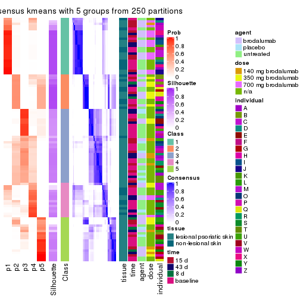</p>

</div>
<div id='tab-CV-kmeans-consensus-heatmap-5'>
<pre><code class="r">consensus_heatmap(res, k = 6)
</code></pre>

<p></p>

</div>
</div>

Heatmaps for the membership of samples in all partitions to see how consistent they are:


<script>
$( function() {
	$( '#tabs-CV-kmeans-membership-heatmap' ).tabs();
} );
</script>
<div id='tabs-CV-kmeans-membership-heatmap'>
<ul>
<li><a href='#tab-CV-kmeans-membership-heatmap-1'>k = 2</a></li>
<li><a href='#tab-CV-kmeans-membership-heatmap-2'>k = 3</a></li>
<li><a href='#tab-CV-kmeans-membership-heatmap-3'>k = 4</a></li>
<li><a href='#tab-CV-kmeans-membership-heatmap-4'>k = 5</a></li>
<li><a href='#tab-CV-kmeans-membership-heatmap-5'>k = 6</a></li>
</ul>
<div id='tab-CV-kmeans-membership-heatmap-1'>
<pre><code class="r">membership_heatmap(res, k = 2)
</code></pre>

<p></p>

</div>
<div id='tab-CV-kmeans-membership-heatmap-2'>
<pre><code class="r">membership_heatmap(res, k = 3)
</code></pre>

<p></p>

</div>
<div id='tab-CV-kmeans-membership-heatmap-3'>
<pre><code class="r">membership_heatmap(res, k = 4)
</code></pre>

<p></p>

</div>
<div id='tab-CV-kmeans-membership-heatmap-4'>
<pre><code class="r">membership_heatmap(res, k = 5)
</code></pre>

<p></p>

</div>
<div id='tab-CV-kmeans-membership-heatmap-5'>
<pre><code class="r">membership_heatmap(res, k = 6)
</code></pre>

<p></p>

</div>
</div>

As soon as we have had the classes for columns, we can look for signatures
which are significantly different between classes which can be candidate marks
for certain classes. Following are the heatmaps for signatures.


Signature heatmaps where rows are scaled:


<script>
$( function() {
	$( '#tabs-CV-kmeans-get-signatures' ).tabs();
} );
</script>
<div id='tabs-CV-kmeans-get-signatures'>
<ul>
<li><a href='#tab-CV-kmeans-get-signatures-1'>k = 2</a></li>
<li><a href='#tab-CV-kmeans-get-signatures-2'>k = 3</a></li>
<li><a href='#tab-CV-kmeans-get-signatures-3'>k = 4</a></li>
<li><a href='#tab-CV-kmeans-get-signatures-4'>k = 5</a></li>
<li><a href='#tab-CV-kmeans-get-signatures-5'>k = 6</a></li>
</ul>
<div id='tab-CV-kmeans-get-signatures-1'>
<pre><code class="r">get_signatures(res, k = 2)
</code></pre>

<p></p>

</div>
<div id='tab-CV-kmeans-get-signatures-2'>
<pre><code class="r">get_signatures(res, k = 3)
</code></pre>

<p></p>

</div>
<div id='tab-CV-kmeans-get-signatures-3'>
<pre><code class="r">get_signatures(res, k = 4)
</code></pre>

<p></p>

</div>
<div id='tab-CV-kmeans-get-signatures-4'>
<pre><code class="r">get_signatures(res, k = 5)
</code></pre>

<p></p>

</div>
<div id='tab-CV-kmeans-get-signatures-5'>
<pre><code class="r">get_signatures(res, k = 6)
</code></pre>

<p></p>

</div>
</div>


Signature heatmaps where rows are not scaled:


<script>
$( function() {
	$( '#tabs-CV-kmeans-get-signatures-no-scale' ).tabs();
} );
</script>
<div id='tabs-CV-kmeans-get-signatures-no-scale'>
<ul>
<li><a href='#tab-CV-kmeans-get-signatures-no-scale-1'>k = 2</a></li>
<li><a href='#tab-CV-kmeans-get-signatures-no-scale-2'>k = 3</a></li>
<li><a href='#tab-CV-kmeans-get-signatures-no-scale-3'>k = 4</a></li>
<li><a href='#tab-CV-kmeans-get-signatures-no-scale-4'>k = 5</a></li>
<li><a href='#tab-CV-kmeans-get-signatures-no-scale-5'>k = 6</a></li>
</ul>
<div id='tab-CV-kmeans-get-signatures-no-scale-1'>
<pre><code class="r">get_signatures(res, k = 2, scale_rows = FALSE)
</code></pre>

<p></p>

</div>
<div id='tab-CV-kmeans-get-signatures-no-scale-2'>
<pre><code class="r">get_signatures(res, k = 3, scale_rows = FALSE)
</code></pre>

<p></p>

</div>
<div id='tab-CV-kmeans-get-signatures-no-scale-3'>
<pre><code class="r">get_signatures(res, k = 4, scale_rows = FALSE)
</code></pre>

<p></p>

</div>
<div id='tab-CV-kmeans-get-signatures-no-scale-4'>
<pre><code class="r">get_signatures(res, k = 5, scale_rows = FALSE)
</code></pre>

<p></p>

</div>
<div id='tab-CV-kmeans-get-signatures-no-scale-5'>
<pre><code class="r">get_signatures(res, k = 6, scale_rows = FALSE)
</code></pre>

<p></p>

</div>
</div>


Compare the overlap of signatures from different k:

```r
compare_signatures(res)
```


`get_signature()` returns a data frame invisibly. TO get the list of signatures, the function
call should be assigned to a variable explicitly. In following code, if `plot` argument is set
to `FALSE`, no heatmap is plotted while only the differential analysis is performed.

```r
# code only for demonstration
tb = get_signature(res, k = ..., plot = FALSE)
```

An example of the output of `tb` is:

```
#>   which_row         fdr    mean_1    mean_2 scaled_mean_1 scaled_mean_2 km
#> 1        38 0.042760348  8.373488  9.131774    -0.5533452     0.5164555  1
#> 2        40 0.018707592  7.106213  8.469186    -0.6173731     0.5762149  1
#> 3        55 0.019134737 10.221463 11.207825    -0.6159697     0.5749050  1
#> 4        59 0.006059896  5.921854  7.869574    -0.6899429     0.6439467  1
#> 5        60 0.018055526  8.928898 10.211722    -0.6204761     0.5791110  1
#> 6        98 0.009384629 15.714769 14.887706     0.6635654    -0.6193277  2
...
```

The columns in `tb` are:

1. `which_row`: row indices corresponding to the input matrix.
2. `fdr`: FDR for the differential test. 
3. `mean_x`: The mean value in group x.
4. `scaled_mean_x`: The mean value in group x after rows are scaled.
5. `km`: Row groups if k-means clustering is applied to rows.


UMAP plot which shows how samples are separated.


<script>
$( function() {
	$( '#tabs-CV-kmeans-dimension-reduction' ).tabs();
} );
</script>
<div id='tabs-CV-kmeans-dimension-reduction'>
<ul>
<li><a href='#tab-CV-kmeans-dimension-reduction-1'>k = 2</a></li>
<li><a href='#tab-CV-kmeans-dimension-reduction-2'>k = 3</a></li>
<li><a href='#tab-CV-kmeans-dimension-reduction-3'>k = 4</a></li>
<li><a href='#tab-CV-kmeans-dimension-reduction-4'>k = 5</a></li>
<li><a href='#tab-CV-kmeans-dimension-reduction-5'>k = 6</a></li>
</ul>
<div id='tab-CV-kmeans-dimension-reduction-1'>
<pre><code class="r">dimension_reduction(res, k = 2, method = &quot;UMAP&quot;)
</code></pre>

<p></p>

</div>
<div id='tab-CV-kmeans-dimension-reduction-2'>
<pre><code class="r">dimension_reduction(res, k = 3, method = &quot;UMAP&quot;)
</code></pre>

<p></p>

</div>
<div id='tab-CV-kmeans-dimension-reduction-3'>
<pre><code class="r">dimension_reduction(res, k = 4, method = &quot;UMAP&quot;)
</code></pre>

<p></p>

</div>
<div id='tab-CV-kmeans-dimension-reduction-4'>
<pre><code class="r">dimension_reduction(res, k = 5, method = &quot;UMAP&quot;)
</code></pre>

<p></p>

</div>
<div id='tab-CV-kmeans-dimension-reduction-5'>
<pre><code class="r">dimension_reduction(res, k = 6, method = &quot;UMAP&quot;)
</code></pre>

<p></p>

</div>
</div>


Following heatmap shows how subgroups are split when increasing `k`:

```r
collect_classes(res)
```


Test correlation between subgroups and known annotations. If the known
annotation is numeric, one-way ANOVA test is applied, and if the known
annotation is discrete, chi-squared contingency table test is applied.

```r
test_to_known_factors(res)
```

```
#>            n tissue(p) time(p) agent(p)  dose(p) individual(p) k
#> CV:kmeans 96  8.33e-03  0.2370  0.16620 4.04e-07      1.28e-03 2
#> CV:kmeans 98  1.03e-03  0.1296  0.00319 1.77e-09      9.50e-08 3
#> CV:kmeans 72  1.29e-04  0.0524  0.00529 4.79e-06      1.79e-05 4
#> CV:kmeans 84  6.44e-05  0.2446  0.09096 2.60e-08      4.48e-05 5
#> CV:kmeans 84  1.12e-04  0.2974  0.20704 2.22e-08      2.66e-06 6
```


If matrix rows can be associated to genes, consider to use `functional_enrichment(res,
...)` to perform function enrichment for the signature genes. See [this vignette](http://bioconductor.org/packages/devel/bioc/vignettes/cola/inst/doc/functional_enrichment.html) for more detailed explanations.


 

---------------------------------------------------


### CV:skmeans*


The object with results only for a single top-value method and a single partition method 
can be extracted as:

```r
res = res_list["CV", "skmeans"]
# you can also extract it by
# res = res_list["CV:skmeans"]
```

A summary of `res` and all the functions that can be applied to it:

```r
res
```

```
#> A 'ConsensusPartition' object with k = 2, 3, 4, 5, 6.
#>   On a matrix with 45638 rows and 99 columns.
#>   Top rows (1000, 2000, 3000, 4000, 5000) are extracted by 'CV' method.
#>   Subgroups are detected by 'skmeans' method.
#>   Performed in total 1250 partitions by row resampling.
#>   Best k for subgroups seems to be 3.
#> 
#> Following methods can be applied to this 'ConsensusPartition' object:
#>  [1] "cola_report"             "collect_classes"         "collect_plots"          
#>  [4] "collect_stats"           "colnames"                "compare_signatures"     
#>  [7] "consensus_heatmap"       "dimension_reduction"     "functional_enrichment"  
#> [10] "get_anno_col"            "get_anno"                "get_classes"            
#> [13] "get_consensus"           "get_matrix"              "get_membership"         
#> [16] "get_param"               "get_signatures"          "get_stats"              
#> [19] "is_best_k"               "is_stable_k"             "membership_heatmap"     
#> [22] "ncol"                    "nrow"                    "plot_ecdf"              
#> [25] "rownames"                "select_partition_number" "show"                   
#> [28] "suggest_best_k"          "test_to_known_factors"
```

`collect_plots()` function collects all the plots made from `res` for all `k` (number of partitions)
into one single page to provide an easy and fast comparison between different `k`.

```r
collect_plots(res)
```


The plots are:

- The first row: a plot of the ECDF (empirical cumulative distribution
  function) curves of the consensus matrix for each `k` and the heatmap of
  predicted classes for each `k`.
- The second row: heatmaps of the consensus matrix for each `k`.
- The third row: heatmaps of the membership matrix for each `k`.
- The fouth row: heatmaps of the signatures for each `k`.

All the plots in panels can be made by individual functions and they are
plotted later in this section.

`select_partition_number()` produces several plots showing different
statistics for choosing "optimized" `k`. There are following statistics:

- ECDF curves of the consensus matrix for each `k`;
- 1-PAC. [The PAC
  score](https://en.wikipedia.org/wiki/Consensus_clustering#Over-interpretation_potential_of_consensus_clustering)
  measures the proportion of the ambiguous subgrouping.
- Mean silhouette score.
- Concordance. The mean probability of fiting the consensus class ids in all
  partitions.
- Area increased. Denote $A_k$ as the area under the ECDF curve for current
  `k`, the area increased is defined as $A_k - A_{k-1}$.
- Rand index. The percent of pairs of samples that are both in a same cluster
  or both are not in a same cluster in the partition of k and k-1.
- Jaccard index. The ratio of pairs of samples are both in a same cluster in
  the partition of k and k-1 and the pairs of samples are both in a same
  cluster in the partition k or k-1.

The detailed explanations of these statistics can be found in [the _cola_
vignette](http://bioconductor.org/packages/devel/bioc/vignettes/cola/inst/doc/cola.html#toc_13).

Generally speaking, lower PAC score, higher mean silhouette score or higher
concordance corresponds to better partition. Rand index and Jaccard index
measure how similar the current partition is compared to partition with `k-1`.
If they are too similar, we won't accept `k` is better than `k-1`.

```r
select_partition_number(res)
```


The numeric values for all these statistics can be obtained by `get_stats()`.

```r
get_stats(res)
```

```
#>   k 1-PAC mean_silhouette concordance area_increased  Rand Jaccard
#> 2 2 0.877           0.916       0.966         0.5012 0.504   0.504
#> 3 3 0.944           0.912       0.966         0.3382 0.752   0.541
#> 4 4 0.759           0.581       0.779         0.1002 0.853   0.599
#> 5 5 0.747           0.727       0.837         0.0625 0.873   0.576
#> 6 6 0.802           0.716       0.852         0.0442 0.957   0.806
```

`suggest_best_k()` suggests the best $k$ based on these statistics. The rules are as follows:

- All $k$ with Jaccard index larger than 0.95 are removed because increasing
  $k$ does not provide enough extra information. If all $k$ are removed, it is
  marked as no subgroup is detected.
- For all $k$ with 1-PAC score larger than 0.9, the maximal $k$ is taken as
  the best $k$, and other $k$ are marked as optional $k$.
- If it does not fit the second rule. The $k$ with the maximal vote of the
  highest 1-PAC score, highest mean silhouette, and highest concordance is
  taken as the best $k$.

```r
suggest_best_k(res)
```

```
#> [1] 3
```


Following shows the table of the partitions (You need to click the **show/hide
code output** link to see it). The membership matrix (columns with name `p*`)
is inferred by
[`clue::cl_consensus()`](https://www.rdocumentation.org/link/cl_consensus?package=clue)
function with the `SE` method. Basically the value in the membership matrix
represents the probability to belong to a certain group. The finall class
label for an item is determined with the group with highest probability it
belongs to.

In `get_classes()` function, the entropy is calculated from the membership
matrix and the silhouette score is calculated from the consensus matrix.


<script>
$( function() {
	$( '#tabs-CV-skmeans-get-classes' ).tabs();
} );
</script>
<div id='tabs-CV-skmeans-get-classes'>
<ul>
<li><a href='#tab-CV-skmeans-get-classes-1'>k = 2</a></li>
<li><a href='#tab-CV-skmeans-get-classes-2'>k = 3</a></li>
<li><a href='#tab-CV-skmeans-get-classes-3'>k = 4</a></li>
<li><a href='#tab-CV-skmeans-get-classes-4'>k = 5</a></li>
<li><a href='#tab-CV-skmeans-get-classes-5'>k = 6</a></li>
</ul>

<div id='tab-CV-skmeans-get-classes-1'>
<p><a id='tab-CV-skmeans-get-classes-1-a' style='color:#0366d6' href='#'>show/hide code output</a></p>
<pre><code class="r">cbind(get_classes(res, k = 2), get_membership(res, k = 2))
</code></pre>

<pre><code>#&gt;            class entropy silhouette    p1    p2
#&gt; GSM1296094     2  0.0000     0.9495 0.000 1.000
#&gt; GSM1296119     2  0.0000     0.9495 0.000 1.000
#&gt; GSM1296076     2  0.0000     0.9495 0.000 1.000
#&gt; GSM1296092     2  0.0000     0.9495 0.000 1.000
#&gt; GSM1296103     2  0.0000     0.9495 0.000 1.000
#&gt; GSM1296078     2  0.0000     0.9495 0.000 1.000
#&gt; GSM1296107     2  0.0000     0.9495 0.000 1.000
#&gt; GSM1296109     2  0.0000     0.9495 0.000 1.000
#&gt; GSM1296080     1  0.0000     0.9829 1.000 0.000
#&gt; GSM1296090     2  0.0000     0.9495 0.000 1.000
#&gt; GSM1296074     2  0.0000     0.9495 0.000 1.000
#&gt; GSM1296111     2  0.0000     0.9495 0.000 1.000
#&gt; GSM1296099     2  0.0000     0.9495 0.000 1.000
#&gt; GSM1296086     2  0.0000     0.9495 0.000 1.000
#&gt; GSM1296117     2  0.0000     0.9495 0.000 1.000
#&gt; GSM1296113     2  0.0000     0.9495 0.000 1.000
#&gt; GSM1296096     2  0.0000     0.9495 0.000 1.000
#&gt; GSM1296105     1  0.0000     0.9829 1.000 0.000
#&gt; GSM1296098     2  0.6623     0.7733 0.172 0.828
#&gt; GSM1296101     2  0.0000     0.9495 0.000 1.000
#&gt; GSM1296121     2  0.0000     0.9495 0.000 1.000
#&gt; GSM1296088     1  0.9522     0.3777 0.628 0.372
#&gt; GSM1296082     2  0.0000     0.9495 0.000 1.000
#&gt; GSM1296115     2  0.0000     0.9495 0.000 1.000
#&gt; GSM1296084     1  0.0000     0.9829 1.000 0.000
#&gt; GSM1296072     2  0.0000     0.9495 0.000 1.000
#&gt; GSM1296069     2  0.0000     0.9495 0.000 1.000
#&gt; GSM1296071     2  0.0000     0.9495 0.000 1.000
#&gt; GSM1296070     2  0.0000     0.9495 0.000 1.000
#&gt; GSM1296073     2  0.0000     0.9495 0.000 1.000
#&gt; GSM1296034     1  0.0000     0.9829 1.000 0.000
#&gt; GSM1296041     2  0.0000     0.9495 0.000 1.000
#&gt; GSM1296035     2  0.0000     0.9495 0.000 1.000
#&gt; GSM1296038     2  0.0000     0.9495 0.000 1.000
#&gt; GSM1296047     2  0.9833     0.3077 0.424 0.576
#&gt; GSM1296039     2  0.0000     0.9495 0.000 1.000
#&gt; GSM1296042     2  0.0000     0.9495 0.000 1.000
#&gt; GSM1296043     2  0.0000     0.9495 0.000 1.000
#&gt; GSM1296037     1  0.0000     0.9829 1.000 0.000
#&gt; GSM1296046     2  0.0000     0.9495 0.000 1.000
#&gt; GSM1296044     2  0.0000     0.9495 0.000 1.000
#&gt; GSM1296045     2  0.0000     0.9495 0.000 1.000
#&gt; GSM1296025     1  0.0000     0.9829 1.000 0.000
#&gt; GSM1296033     1  0.0000     0.9829 1.000 0.000
#&gt; GSM1296027     1  0.0000     0.9829 1.000 0.000
#&gt; GSM1296032     1  0.0000     0.9829 1.000 0.000
#&gt; GSM1296024     1  0.0000     0.9829 1.000 0.000
#&gt; GSM1296031     1  0.0000     0.9829 1.000 0.000
#&gt; GSM1296028     1  0.0000     0.9829 1.000 0.000
#&gt; GSM1296029     1  0.0000     0.9829 1.000 0.000
#&gt; GSM1296026     1  0.6048     0.8114 0.852 0.148
#&gt; GSM1296030     1  0.0000     0.9829 1.000 0.000
#&gt; GSM1296040     2  0.9754     0.3212 0.408 0.592
#&gt; GSM1296036     2  0.9988     0.0901 0.480 0.520
#&gt; GSM1296048     2  0.0000     0.9495 0.000 1.000
#&gt; GSM1296059     2  0.0000     0.9495 0.000 1.000
#&gt; GSM1296066     2  0.0000     0.9495 0.000 1.000
#&gt; GSM1296060     2  0.0000     0.9495 0.000 1.000
#&gt; GSM1296063     2  0.0000     0.9495 0.000 1.000
#&gt; GSM1296064     2  0.0000     0.9495 0.000 1.000
#&gt; GSM1296067     2  0.9129     0.5324 0.328 0.672
#&gt; GSM1296062     1  0.0000     0.9829 1.000 0.000
#&gt; GSM1296068     2  0.6712     0.7744 0.176 0.824
#&gt; GSM1296050     1  0.0000     0.9829 1.000 0.000
#&gt; GSM1296057     1  0.0000     0.9829 1.000 0.000
#&gt; GSM1296052     1  0.0000     0.9829 1.000 0.000
#&gt; GSM1296054     1  0.0000     0.9829 1.000 0.000
#&gt; GSM1296049     1  0.0000     0.9829 1.000 0.000
#&gt; GSM1296055     1  0.0000     0.9829 1.000 0.000
#&gt; GSM1296053     1  0.0000     0.9829 1.000 0.000
#&gt; GSM1296058     1  0.0000     0.9829 1.000 0.000
#&gt; GSM1296051     2  0.0376     0.9464 0.004 0.996
#&gt; GSM1296056     2  0.0000     0.9495 0.000 1.000
#&gt; GSM1296065     2  0.0000     0.9495 0.000 1.000
#&gt; GSM1296061     1  0.1184     0.9679 0.984 0.016
#&gt; GSM1296095     2  0.0000     0.9495 0.000 1.000
#&gt; GSM1296120     2  0.9881     0.2737 0.436 0.564
#&gt; GSM1296077     1  0.0000     0.9829 1.000 0.000
#&gt; GSM1296093     1  0.0000     0.9829 1.000 0.000
#&gt; GSM1296104     1  0.0376     0.9793 0.996 0.004
#&gt; GSM1296079     1  0.0000     0.9829 1.000 0.000
#&gt; GSM1296108     2  0.2603     0.9130 0.044 0.956
#&gt; GSM1296110     2  0.0000     0.9495 0.000 1.000
#&gt; GSM1296081     1  0.0000     0.9829 1.000 0.000
#&gt; GSM1296091     1  0.0000     0.9829 1.000 0.000
#&gt; GSM1296075     1  0.0000     0.9829 1.000 0.000
#&gt; GSM1296112     2  0.6887     0.7643 0.184 0.816
#&gt; GSM1296100     1  0.0000     0.9829 1.000 0.000
#&gt; GSM1296087     1  0.0000     0.9829 1.000 0.000
#&gt; GSM1296118     1  0.5408     0.8415 0.876 0.124
#&gt; GSM1296114     2  0.0000     0.9495 0.000 1.000
#&gt; GSM1296097     1  0.0000     0.9829 1.000 0.000
#&gt; GSM1296106     1  0.0000     0.9829 1.000 0.000
#&gt; GSM1296102     1  0.0000     0.9829 1.000 0.000
#&gt; GSM1296122     1  0.0000     0.9829 1.000 0.000
#&gt; GSM1296089     1  0.0000     0.9829 1.000 0.000
#&gt; GSM1296083     1  0.0000     0.9829 1.000 0.000
#&gt; GSM1296116     2  0.0000     0.9495 0.000 1.000
#&gt; GSM1296085     1  0.0000     0.9829 1.000 0.000
</code></pre>

<script>
$('#tab-CV-skmeans-get-classes-1-a').parent().next().next().hide();
$('#tab-CV-skmeans-get-classes-1-a').click(function(){
  $('#tab-CV-skmeans-get-classes-1-a').parent().next().next().toggle();
  return(false);
});
</script>
</div>

<div id='tab-CV-skmeans-get-classes-2'>
<p><a id='tab-CV-skmeans-get-classes-2-a' style='color:#0366d6' href='#'>show/hide code output</a></p>
<pre><code class="r">cbind(get_classes(res, k = 3), get_membership(res, k = 3))
</code></pre>

<pre><code>#&gt;            class entropy silhouette    p1    p2    p3
#&gt; GSM1296094     3  0.0000      0.952 0.000 0.000 1.000
#&gt; GSM1296119     2  0.0000      0.943 0.000 1.000 0.000
#&gt; GSM1296076     3  0.0000      0.952 0.000 0.000 1.000
#&gt; GSM1296092     3  0.0000      0.952 0.000 0.000 1.000
#&gt; GSM1296103     3  0.0000      0.952 0.000 0.000 1.000
#&gt; GSM1296078     3  0.0000      0.952 0.000 0.000 1.000
#&gt; GSM1296107     2  0.0000      0.943 0.000 1.000 0.000
#&gt; GSM1296109     3  0.0424      0.944 0.000 0.008 0.992
#&gt; GSM1296080     3  0.5810      0.493 0.336 0.000 0.664
#&gt; GSM1296090     3  0.0000      0.952 0.000 0.000 1.000
#&gt; GSM1296074     3  0.0000      0.952 0.000 0.000 1.000
#&gt; GSM1296111     2  0.0000      0.943 0.000 1.000 0.000
#&gt; GSM1296099     3  0.0000      0.952 0.000 0.000 1.000
#&gt; GSM1296086     3  0.0000      0.952 0.000 0.000 1.000
#&gt; GSM1296117     2  0.0000      0.943 0.000 1.000 0.000
#&gt; GSM1296113     2  0.0000      0.943 0.000 1.000 0.000
#&gt; GSM1296096     3  0.0000      0.952 0.000 0.000 1.000
#&gt; GSM1296105     1  0.0000      0.988 1.000 0.000 0.000
#&gt; GSM1296098     3  0.0000      0.952 0.000 0.000 1.000
#&gt; GSM1296101     3  0.0000      0.952 0.000 0.000 1.000
#&gt; GSM1296121     2  0.0000      0.943 0.000 1.000 0.000
#&gt; GSM1296088     3  0.0000      0.952 0.000 0.000 1.000
#&gt; GSM1296082     3  0.0000      0.952 0.000 0.000 1.000
#&gt; GSM1296115     2  0.0000      0.943 0.000 1.000 0.000
#&gt; GSM1296084     3  0.6280      0.167 0.460 0.000 0.540
#&gt; GSM1296072     2  0.0000      0.943 0.000 1.000 0.000
#&gt; GSM1296069     2  0.0000      0.943 0.000 1.000 0.000
#&gt; GSM1296071     2  0.0000      0.943 0.000 1.000 0.000
#&gt; GSM1296070     2  0.0000      0.943 0.000 1.000 0.000
#&gt; GSM1296073     2  0.6225      0.321 0.000 0.568 0.432
#&gt; GSM1296034     1  0.0000      0.988 1.000 0.000 0.000
#&gt; GSM1296041     2  0.0000      0.943 0.000 1.000 0.000
#&gt; GSM1296035     3  0.0000      0.952 0.000 0.000 1.000
#&gt; GSM1296038     3  0.0000      0.952 0.000 0.000 1.000
#&gt; GSM1296047     2  0.0000      0.943 0.000 1.000 0.000
#&gt; GSM1296039     3  0.0000      0.952 0.000 0.000 1.000
#&gt; GSM1296042     2  0.0000      0.943 0.000 1.000 0.000
#&gt; GSM1296043     2  0.0000      0.943 0.000 1.000 0.000
#&gt; GSM1296037     1  0.0000      0.988 1.000 0.000 0.000
#&gt; GSM1296046     2  0.0000      0.943 0.000 1.000 0.000
#&gt; GSM1296044     2  0.0000      0.943 0.000 1.000 0.000
#&gt; GSM1296045     2  0.0000      0.943 0.000 1.000 0.000
#&gt; GSM1296025     1  0.0000      0.988 1.000 0.000 0.000
#&gt; GSM1296033     1  0.0000      0.988 1.000 0.000 0.000
#&gt; GSM1296027     1  0.0000      0.988 1.000 0.000 0.000
#&gt; GSM1296032     1  0.0000      0.988 1.000 0.000 0.000
#&gt; GSM1296024     1  0.0000      0.988 1.000 0.000 0.000
#&gt; GSM1296031     1  0.0000      0.988 1.000 0.000 0.000
#&gt; GSM1296028     1  0.0000      0.988 1.000 0.000 0.000
#&gt; GSM1296029     1  0.0000      0.988 1.000 0.000 0.000
#&gt; GSM1296026     3  0.0000      0.952 0.000 0.000 1.000
#&gt; GSM1296030     3  0.6192      0.291 0.420 0.000 0.580
#&gt; GSM1296040     3  0.0000      0.952 0.000 0.000 1.000
#&gt; GSM1296036     3  0.0000      0.952 0.000 0.000 1.000
#&gt; GSM1296048     2  0.0000      0.943 0.000 1.000 0.000
#&gt; GSM1296059     3  0.0000      0.952 0.000 0.000 1.000
#&gt; GSM1296066     2  0.0000      0.943 0.000 1.000 0.000
#&gt; GSM1296060     3  0.0000      0.952 0.000 0.000 1.000
#&gt; GSM1296063     2  0.6307      0.160 0.000 0.512 0.488
#&gt; GSM1296064     3  0.0000      0.952 0.000 0.000 1.000
#&gt; GSM1296067     2  0.0000      0.943 0.000 1.000 0.000
#&gt; GSM1296062     1  0.5706      0.496 0.680 0.000 0.320
#&gt; GSM1296068     2  0.0000      0.943 0.000 1.000 0.000
#&gt; GSM1296050     1  0.0000      0.988 1.000 0.000 0.000
#&gt; GSM1296057     1  0.0000      0.988 1.000 0.000 0.000
#&gt; GSM1296052     1  0.0000      0.988 1.000 0.000 0.000
#&gt; GSM1296054     1  0.0000      0.988 1.000 0.000 0.000
#&gt; GSM1296049     1  0.0000      0.988 1.000 0.000 0.000
#&gt; GSM1296055     1  0.0000      0.988 1.000 0.000 0.000
#&gt; GSM1296053     1  0.0000      0.988 1.000 0.000 0.000
#&gt; GSM1296058     1  0.0000      0.988 1.000 0.000 0.000
#&gt; GSM1296051     3  0.0000      0.952 0.000 0.000 1.000
#&gt; GSM1296056     3  0.0000      0.952 0.000 0.000 1.000
#&gt; GSM1296065     2  0.5650      0.574 0.000 0.688 0.312
#&gt; GSM1296061     3  0.0000      0.952 0.000 0.000 1.000
#&gt; GSM1296095     2  0.6126      0.400 0.000 0.600 0.400
#&gt; GSM1296120     2  0.0000      0.943 0.000 1.000 0.000
#&gt; GSM1296077     1  0.0000      0.988 1.000 0.000 0.000
#&gt; GSM1296093     1  0.0000      0.988 1.000 0.000 0.000
#&gt; GSM1296104     1  0.2261      0.913 0.932 0.000 0.068
#&gt; GSM1296079     1  0.0000      0.988 1.000 0.000 0.000
#&gt; GSM1296108     2  0.0000      0.943 0.000 1.000 0.000
#&gt; GSM1296110     2  0.0000      0.943 0.000 1.000 0.000
#&gt; GSM1296081     1  0.0000      0.988 1.000 0.000 0.000
#&gt; GSM1296091     1  0.0000      0.988 1.000 0.000 0.000
#&gt; GSM1296075     1  0.0000      0.988 1.000 0.000 0.000
#&gt; GSM1296112     2  0.0000      0.943 0.000 1.000 0.000
#&gt; GSM1296100     1  0.0000      0.988 1.000 0.000 0.000
#&gt; GSM1296087     1  0.0000      0.988 1.000 0.000 0.000
#&gt; GSM1296118     2  0.3752      0.799 0.144 0.856 0.000
#&gt; GSM1296114     2  0.0000      0.943 0.000 1.000 0.000
#&gt; GSM1296097     1  0.0000      0.988 1.000 0.000 0.000
#&gt; GSM1296106     1  0.0000      0.988 1.000 0.000 0.000
#&gt; GSM1296102     1  0.0000      0.988 1.000 0.000 0.000
#&gt; GSM1296122     1  0.0000      0.988 1.000 0.000 0.000
#&gt; GSM1296089     1  0.0000      0.988 1.000 0.000 0.000
#&gt; GSM1296083     1  0.0000      0.988 1.000 0.000 0.000
#&gt; GSM1296116     2  0.0000      0.943 0.000 1.000 0.000
#&gt; GSM1296085     1  0.0000      0.988 1.000 0.000 0.000
</code></pre>

<script>
$('#tab-CV-skmeans-get-classes-2-a').parent().next().next().hide();
$('#tab-CV-skmeans-get-classes-2-a').click(function(){
  $('#tab-CV-skmeans-get-classes-2-a').parent().next().next().toggle();
  return(false);
});
</script>
</div>

<div id='tab-CV-skmeans-get-classes-3'>
<p><a id='tab-CV-skmeans-get-classes-3-a' style='color:#0366d6' href='#'>show/hide code output</a></p>
<pre><code class="r">cbind(get_classes(res, k = 4), get_membership(res, k = 4))
</code></pre>

<pre><code>#&gt;            class entropy silhouette    p1    p2    p3    p4
#&gt; GSM1296094     3  0.4898     0.3413 0.000 0.000 0.584 0.416
#&gt; GSM1296119     3  0.7854    -0.1817 0.000 0.296 0.400 0.304
#&gt; GSM1296076     4  0.2216     0.5344 0.000 0.000 0.092 0.908
#&gt; GSM1296092     4  0.1389     0.5109 0.000 0.000 0.048 0.952
#&gt; GSM1296103     3  0.4941     0.3358 0.000 0.000 0.564 0.436
#&gt; GSM1296078     4  0.3024     0.5128 0.000 0.000 0.148 0.852
#&gt; GSM1296107     2  0.7474     0.3389 0.000 0.424 0.400 0.176
#&gt; GSM1296109     3  0.5453    -0.1812 0.000 0.036 0.660 0.304
#&gt; GSM1296080     3  0.6189     0.2900 0.060 0.000 0.568 0.372
#&gt; GSM1296090     4  0.0000     0.5488 0.000 0.000 0.000 1.000
#&gt; GSM1296074     4  0.0000     0.5488 0.000 0.000 0.000 1.000
#&gt; GSM1296111     3  0.7808    -0.2528 0.000 0.344 0.400 0.256
#&gt; GSM1296099     3  0.4989     0.3099 0.000 0.000 0.528 0.472
#&gt; GSM1296086     4  0.1389     0.5109 0.000 0.000 0.048 0.952
#&gt; GSM1296117     3  0.7836    -0.2246 0.000 0.328 0.400 0.272
#&gt; GSM1296113     2  0.7240     0.3918 0.000 0.456 0.400 0.144
#&gt; GSM1296096     3  0.4998     0.2912 0.000 0.000 0.512 0.488
#&gt; GSM1296105     1  0.3688     0.7408 0.792 0.000 0.208 0.000
#&gt; GSM1296098     3  0.4898     0.3413 0.000 0.000 0.584 0.416
#&gt; GSM1296101     3  0.4948     0.3340 0.000 0.000 0.560 0.440
#&gt; GSM1296121     3  0.7816    -0.1375 0.000 0.260 0.400 0.340
#&gt; GSM1296088     4  0.4972    -0.2346 0.000 0.000 0.456 0.544
#&gt; GSM1296082     4  0.0000     0.5488 0.000 0.000 0.000 1.000
#&gt; GSM1296115     3  0.7830    -0.2312 0.000 0.332 0.400 0.268
#&gt; GSM1296084     4  0.7788    -0.1236 0.244 0.000 0.376 0.380
#&gt; GSM1296072     2  0.1022     0.8211 0.000 0.968 0.032 0.000
#&gt; GSM1296069     2  0.3942     0.7064 0.000 0.764 0.236 0.000
#&gt; GSM1296071     2  0.0000     0.8320 0.000 1.000 0.000 0.000
#&gt; GSM1296070     2  0.6417     0.4976 0.000 0.540 0.388 0.072
#&gt; GSM1296073     4  0.5487     0.3109 0.000 0.020 0.400 0.580
#&gt; GSM1296034     1  0.2011     0.8957 0.920 0.000 0.080 0.000
#&gt; GSM1296041     3  0.7836    -0.2246 0.000 0.328 0.400 0.272
#&gt; GSM1296035     3  0.4996     0.2968 0.000 0.000 0.516 0.484
#&gt; GSM1296038     4  0.4661     0.4140 0.000 0.000 0.348 0.652
#&gt; GSM1296047     2  0.0000     0.8320 0.000 1.000 0.000 0.000
#&gt; GSM1296039     4  0.0921     0.5431 0.000 0.000 0.028 0.972
#&gt; GSM1296042     2  0.7304     0.3797 0.000 0.448 0.400 0.152
#&gt; GSM1296043     2  0.2973     0.7687 0.000 0.856 0.144 0.000
#&gt; GSM1296037     1  0.0592     0.9533 0.984 0.000 0.016 0.000
#&gt; GSM1296046     2  0.0000     0.8320 0.000 1.000 0.000 0.000
#&gt; GSM1296044     2  0.0000     0.8320 0.000 1.000 0.000 0.000
#&gt; GSM1296045     2  0.3074     0.7646 0.000 0.848 0.152 0.000
#&gt; GSM1296025     1  0.0000     0.9592 1.000 0.000 0.000 0.000
#&gt; GSM1296033     1  0.0000     0.9592 1.000 0.000 0.000 0.000
#&gt; GSM1296027     1  0.0000     0.9592 1.000 0.000 0.000 0.000
#&gt; GSM1296032     1  0.0000     0.9592 1.000 0.000 0.000 0.000
#&gt; GSM1296024     1  0.0000     0.9592 1.000 0.000 0.000 0.000
#&gt; GSM1296031     1  0.0000     0.9592 1.000 0.000 0.000 0.000
#&gt; GSM1296028     1  0.0000     0.9592 1.000 0.000 0.000 0.000
#&gt; GSM1296029     1  0.0000     0.9592 1.000 0.000 0.000 0.000
#&gt; GSM1296026     4  0.5306    -0.0315 0.020 0.000 0.348 0.632
#&gt; GSM1296030     4  0.7919    -0.0684 0.336 0.000 0.316 0.348
#&gt; GSM1296040     3  0.4888     0.3404 0.000 0.000 0.588 0.412
#&gt; GSM1296036     3  0.4898     0.3413 0.000 0.000 0.584 0.416
#&gt; GSM1296048     4  0.7546     0.1006 0.000 0.188 0.400 0.412
#&gt; GSM1296059     3  0.4977     0.3210 0.000 0.000 0.540 0.460
#&gt; GSM1296066     2  0.6895     0.4405 0.000 0.492 0.400 0.108
#&gt; GSM1296060     3  0.4992     0.3065 0.000 0.000 0.524 0.476
#&gt; GSM1296063     4  0.5172     0.3199 0.000 0.008 0.404 0.588
#&gt; GSM1296064     4  0.3528     0.4958 0.000 0.000 0.192 0.808
#&gt; GSM1296067     2  0.0000     0.8320 0.000 1.000 0.000 0.000
#&gt; GSM1296062     3  0.6908     0.1732 0.188 0.000 0.592 0.220
#&gt; GSM1296068     2  0.0000     0.8320 0.000 1.000 0.000 0.000
#&gt; GSM1296050     1  0.0000     0.9592 1.000 0.000 0.000 0.000
#&gt; GSM1296057     1  0.0592     0.9533 0.984 0.000 0.016 0.000
#&gt; GSM1296052     1  0.0000     0.9592 1.000 0.000 0.000 0.000
#&gt; GSM1296054     1  0.0000     0.9592 1.000 0.000 0.000 0.000
#&gt; GSM1296049     1  0.0000     0.9592 1.000 0.000 0.000 0.000
#&gt; GSM1296055     1  0.0592     0.9533 0.984 0.000 0.016 0.000
#&gt; GSM1296053     1  0.0000     0.9592 1.000 0.000 0.000 0.000
#&gt; GSM1296058     1  0.0592     0.9533 0.984 0.000 0.016 0.000
#&gt; GSM1296051     4  0.0336     0.5444 0.000 0.000 0.008 0.992
#&gt; GSM1296056     4  0.1474     0.5083 0.000 0.000 0.052 0.948
#&gt; GSM1296065     4  0.6617     0.2881 0.000 0.088 0.380 0.532
#&gt; GSM1296061     3  0.5060     0.3402 0.004 0.000 0.584 0.412
#&gt; GSM1296095     3  0.7432    -0.1991 0.000 0.184 0.480 0.336
#&gt; GSM1296120     2  0.0000     0.8320 0.000 1.000 0.000 0.000
#&gt; GSM1296077     1  0.0000     0.9592 1.000 0.000 0.000 0.000
#&gt; GSM1296093     1  0.0000     0.9592 1.000 0.000 0.000 0.000
#&gt; GSM1296104     1  0.6519     0.5762 0.672 0.048 0.052 0.228
#&gt; GSM1296079     1  0.0000     0.9592 1.000 0.000 0.000 0.000
#&gt; GSM1296108     2  0.0000     0.8320 0.000 1.000 0.000 0.000
#&gt; GSM1296110     2  0.0000     0.8320 0.000 1.000 0.000 0.000
#&gt; GSM1296081     1  0.0000     0.9592 1.000 0.000 0.000 0.000
#&gt; GSM1296091     1  0.0000     0.9592 1.000 0.000 0.000 0.000
#&gt; GSM1296075     1  0.0927     0.9471 0.976 0.016 0.008 0.000
#&gt; GSM1296112     2  0.0000     0.8320 0.000 1.000 0.000 0.000
#&gt; GSM1296100     1  0.0592     0.9533 0.984 0.000 0.016 0.000
#&gt; GSM1296087     1  0.0000     0.9592 1.000 0.000 0.000 0.000
#&gt; GSM1296118     2  0.0000     0.8320 0.000 1.000 0.000 0.000
#&gt; GSM1296114     2  0.0000     0.8320 0.000 1.000 0.000 0.000
#&gt; GSM1296097     1  0.1209     0.9418 0.964 0.004 0.032 0.000
#&gt; GSM1296106     1  0.4012     0.7757 0.800 0.184 0.016 0.000
#&gt; GSM1296102     1  0.0592     0.9533 0.984 0.000 0.016 0.000
#&gt; GSM1296122     1  0.5310     0.3747 0.576 0.412 0.012 0.000
#&gt; GSM1296089     1  0.0000     0.9592 1.000 0.000 0.000 0.000
#&gt; GSM1296083     1  0.0000     0.9592 1.000 0.000 0.000 0.000
#&gt; GSM1296116     2  0.0000     0.8320 0.000 1.000 0.000 0.000
#&gt; GSM1296085     1  0.0000     0.9592 1.000 0.000 0.000 0.000
</code></pre>

<script>
$('#tab-CV-skmeans-get-classes-3-a').parent().next().next().hide();
$('#tab-CV-skmeans-get-classes-3-a').click(function(){
  $('#tab-CV-skmeans-get-classes-3-a').parent().next().next().toggle();
  return(false);
});
</script>
</div>

<div id='tab-CV-skmeans-get-classes-4'>
<p><a id='tab-CV-skmeans-get-classes-4-a' style='color:#0366d6' href='#'>show/hide code output</a></p>
<pre><code class="r">cbind(get_classes(res, k = 5), get_membership(res, k = 5))
</code></pre>

<pre><code>#&gt;            class entropy silhouette    p1    p2    p3    p4    p5
#&gt; GSM1296094     3  0.2377     0.7988 0.000 0.000 0.872 0.128 0.000
#&gt; GSM1296119     5  0.3644     0.8011 0.000 0.096 0.000 0.080 0.824
#&gt; GSM1296076     4  0.1478     0.8077 0.000 0.000 0.000 0.936 0.064
#&gt; GSM1296092     4  0.1469     0.7926 0.000 0.000 0.036 0.948 0.016
#&gt; GSM1296103     3  0.3366     0.7881 0.000 0.000 0.768 0.232 0.000
#&gt; GSM1296078     4  0.1792     0.7923 0.000 0.000 0.000 0.916 0.084
#&gt; GSM1296107     5  0.3280     0.7868 0.000 0.176 0.000 0.012 0.812
#&gt; GSM1296109     5  0.4166     0.6874 0.000 0.004 0.160 0.056 0.780
#&gt; GSM1296080     3  0.4835     0.6307 0.128 0.000 0.736 0.132 0.004
#&gt; GSM1296090     4  0.1341     0.8107 0.000 0.000 0.000 0.944 0.056
#&gt; GSM1296074     4  0.1341     0.8107 0.000 0.000 0.000 0.944 0.056
#&gt; GSM1296111     5  0.3565     0.8019 0.000 0.144 0.000 0.040 0.816
#&gt; GSM1296099     3  0.3884     0.7574 0.000 0.000 0.708 0.288 0.004
#&gt; GSM1296086     4  0.1485     0.7955 0.000 0.000 0.032 0.948 0.020
#&gt; GSM1296117     5  0.3647     0.8044 0.000 0.132 0.000 0.052 0.816
#&gt; GSM1296113     5  0.3003     0.7787 0.000 0.188 0.000 0.000 0.812
#&gt; GSM1296096     3  0.3990     0.7387 0.000 0.000 0.688 0.308 0.004
#&gt; GSM1296105     1  0.6261     0.2613 0.492 0.000 0.400 0.020 0.088
#&gt; GSM1296098     3  0.2471     0.7982 0.000 0.000 0.864 0.136 0.000
#&gt; GSM1296101     3  0.3333     0.7946 0.000 0.000 0.788 0.208 0.004
#&gt; GSM1296121     5  0.3648     0.7999 0.000 0.092 0.000 0.084 0.824
#&gt; GSM1296088     4  0.4299     0.1666 0.000 0.000 0.388 0.608 0.004
#&gt; GSM1296082     4  0.1341     0.8107 0.000 0.000 0.000 0.944 0.056
#&gt; GSM1296115     5  0.3622     0.8042 0.000 0.136 0.000 0.048 0.816
#&gt; GSM1296084     3  0.7019     0.0740 0.316 0.000 0.384 0.292 0.008
#&gt; GSM1296072     2  0.2852     0.6808 0.000 0.828 0.000 0.000 0.172
#&gt; GSM1296069     5  0.4268     0.3404 0.000 0.444 0.000 0.000 0.556
#&gt; GSM1296071     2  0.0000     0.8608 0.000 1.000 0.000 0.000 0.000
#&gt; GSM1296070     5  0.3636     0.6832 0.000 0.272 0.000 0.000 0.728
#&gt; GSM1296073     5  0.3236     0.7369 0.000 0.020 0.000 0.152 0.828
#&gt; GSM1296034     1  0.2911     0.8078 0.852 0.000 0.136 0.004 0.008
#&gt; GSM1296041     5  0.3622     0.8042 0.000 0.136 0.000 0.048 0.816
#&gt; GSM1296035     3  0.3990     0.7387 0.000 0.000 0.688 0.308 0.004
#&gt; GSM1296038     5  0.6660    -0.1169 0.000 0.000 0.228 0.384 0.388
#&gt; GSM1296047     2  0.0290     0.8561 0.000 0.992 0.000 0.000 0.008
#&gt; GSM1296039     4  0.3586     0.7241 0.000 0.000 0.096 0.828 0.076
#&gt; GSM1296042     5  0.3003     0.7787 0.000 0.188 0.000 0.000 0.812
#&gt; GSM1296043     2  0.3913     0.3645 0.000 0.676 0.000 0.000 0.324
#&gt; GSM1296037     1  0.3561     0.8245 0.844 0.000 0.060 0.012 0.084
#&gt; GSM1296046     2  0.0290     0.8552 0.000 0.992 0.000 0.000 0.008
#&gt; GSM1296044     2  0.0000     0.8608 0.000 1.000 0.000 0.000 0.000
#&gt; GSM1296045     2  0.4101     0.2204 0.000 0.628 0.000 0.000 0.372
#&gt; GSM1296025     1  0.0000     0.9018 1.000 0.000 0.000 0.000 0.000
#&gt; GSM1296033     1  0.0798     0.8904 0.976 0.000 0.000 0.016 0.008
#&gt; GSM1296027     1  0.0000     0.9018 1.000 0.000 0.000 0.000 0.000
#&gt; GSM1296032     1  0.0000     0.9018 1.000 0.000 0.000 0.000 0.000
#&gt; GSM1296024     1  0.0000     0.9018 1.000 0.000 0.000 0.000 0.000
#&gt; GSM1296031     1  0.0290     0.8994 0.992 0.000 0.000 0.000 0.008
#&gt; GSM1296028     1  0.0000     0.9018 1.000 0.000 0.000 0.000 0.000
#&gt; GSM1296029     1  0.0162     0.9004 0.996 0.000 0.000 0.000 0.004
#&gt; GSM1296026     4  0.4231     0.6028 0.060 0.000 0.160 0.776 0.004
#&gt; GSM1296030     1  0.6977    -0.1063 0.404 0.000 0.272 0.316 0.008
#&gt; GSM1296040     3  0.2233     0.7877 0.000 0.000 0.892 0.104 0.004
#&gt; GSM1296036     3  0.2471     0.7982 0.000 0.000 0.864 0.136 0.000
#&gt; GSM1296048     5  0.3569     0.7835 0.000 0.068 0.000 0.104 0.828
#&gt; GSM1296059     3  0.3906     0.7538 0.000 0.000 0.704 0.292 0.004
#&gt; GSM1296066     5  0.3039     0.7752 0.000 0.192 0.000 0.000 0.808
#&gt; GSM1296060     3  0.3969     0.7427 0.000 0.000 0.692 0.304 0.004
#&gt; GSM1296063     5  0.4265     0.6049 0.000 0.012 0.008 0.268 0.712
#&gt; GSM1296064     4  0.4555     0.6258 0.000 0.000 0.068 0.732 0.200
#&gt; GSM1296067     2  0.0000     0.8608 0.000 1.000 0.000 0.000 0.000
#&gt; GSM1296062     3  0.2460     0.6987 0.072 0.000 0.900 0.024 0.004
#&gt; GSM1296068     2  0.0000     0.8608 0.000 1.000 0.000 0.000 0.000
#&gt; GSM1296050     1  0.0000     0.9018 1.000 0.000 0.000 0.000 0.000
#&gt; GSM1296057     1  0.5759     0.7068 0.688 0.000 0.120 0.040 0.152
#&gt; GSM1296052     1  0.0000     0.9018 1.000 0.000 0.000 0.000 0.000
#&gt; GSM1296054     1  0.0000     0.9018 1.000 0.000 0.000 0.000 0.000
#&gt; GSM1296049     1  0.0000     0.9018 1.000 0.000 0.000 0.000 0.000
#&gt; GSM1296055     1  0.5908     0.6945 0.676 0.000 0.124 0.044 0.156
#&gt; GSM1296053     1  0.0000     0.9018 1.000 0.000 0.000 0.000 0.000
#&gt; GSM1296058     1  0.6330     0.6584 0.640 0.000 0.140 0.056 0.164
#&gt; GSM1296051     4  0.1270     0.8102 0.000 0.000 0.000 0.948 0.052
#&gt; GSM1296056     4  0.2233     0.7640 0.000 0.000 0.080 0.904 0.016
#&gt; GSM1296065     5  0.7349     0.1760 0.000 0.080 0.152 0.260 0.508
#&gt; GSM1296061     3  0.2471     0.7982 0.000 0.000 0.864 0.136 0.000
#&gt; GSM1296095     5  0.7227     0.4533 0.000 0.108 0.260 0.104 0.528
#&gt; GSM1296120     2  0.0290     0.8561 0.000 0.992 0.000 0.000 0.008
#&gt; GSM1296077     1  0.0000     0.9018 1.000 0.000 0.000 0.000 0.000
#&gt; GSM1296093     1  0.0000     0.9018 1.000 0.000 0.000 0.000 0.000
#&gt; GSM1296104     4  0.9198     0.0258 0.260 0.036 0.260 0.264 0.180
#&gt; GSM1296079     1  0.0000     0.9018 1.000 0.000 0.000 0.000 0.000
#&gt; GSM1296108     2  0.0000     0.8608 0.000 1.000 0.000 0.000 0.000
#&gt; GSM1296110     2  0.0000     0.8608 0.000 1.000 0.000 0.000 0.000
#&gt; GSM1296081     1  0.0000     0.9018 1.000 0.000 0.000 0.000 0.000
#&gt; GSM1296091     1  0.0693     0.8956 0.980 0.000 0.008 0.000 0.012
#&gt; GSM1296075     1  0.2596     0.8606 0.908 0.036 0.032 0.004 0.020
#&gt; GSM1296112     2  0.0000     0.8608 0.000 1.000 0.000 0.000 0.000
#&gt; GSM1296100     1  0.3561     0.8246 0.844 0.000 0.060 0.012 0.084
#&gt; GSM1296087     1  0.0000     0.9018 1.000 0.000 0.000 0.000 0.000
#&gt; GSM1296118     2  0.0000     0.8608 0.000 1.000 0.000 0.000 0.000
#&gt; GSM1296114     2  0.0000     0.8608 0.000 1.000 0.000 0.000 0.000
#&gt; GSM1296097     1  0.7283     0.5526 0.556 0.012 0.204 0.060 0.168
#&gt; GSM1296106     2  0.8776     0.0174 0.316 0.364 0.116 0.044 0.160
#&gt; GSM1296102     1  0.4584     0.7823 0.780 0.000 0.072 0.028 0.120
#&gt; GSM1296122     2  0.5519     0.5113 0.256 0.664 0.012 0.012 0.056
#&gt; GSM1296089     1  0.0000     0.9018 1.000 0.000 0.000 0.000 0.000
#&gt; GSM1296083     1  0.0000     0.9018 1.000 0.000 0.000 0.000 0.000
#&gt; GSM1296116     2  0.0000     0.8608 0.000 1.000 0.000 0.000 0.000
#&gt; GSM1296085     1  0.0000     0.9018 1.000 0.000 0.000 0.000 0.000
</code></pre>

<script>
$('#tab-CV-skmeans-get-classes-4-a').parent().next().next().hide();
$('#tab-CV-skmeans-get-classes-4-a').click(function(){
  $('#tab-CV-skmeans-get-classes-4-a').parent().next().next().toggle();
  return(false);
});
</script>
</div>

<div id='tab-CV-skmeans-get-classes-5'>
<p><a id='tab-CV-skmeans-get-classes-5-a' style='color:#0366d6' href='#'>show/hide code output</a></p>
<pre><code class="r">cbind(get_classes(res, k = 6), get_membership(res, k = 6))
</code></pre>

<pre><code>#&gt;            class entropy silhouette    p1    p2    p3    p4    p5    p6
#&gt; GSM1296094     3  0.1408     0.7741 0.000 0.000 0.944 0.036 0.000 0.020
#&gt; GSM1296119     5  0.1293     0.8748 0.000 0.020 0.004 0.016 0.956 0.004
#&gt; GSM1296076     4  0.1196     0.8402 0.000 0.000 0.000 0.952 0.040 0.008
#&gt; GSM1296092     4  0.1230     0.8401 0.000 0.000 0.008 0.956 0.028 0.008
#&gt; GSM1296103     3  0.3557     0.7616 0.000 0.000 0.800 0.148 0.008 0.044
#&gt; GSM1296078     4  0.1196     0.8402 0.000 0.000 0.000 0.952 0.040 0.008
#&gt; GSM1296107     5  0.1075     0.8788 0.000 0.048 0.000 0.000 0.952 0.000
#&gt; GSM1296109     5  0.2518     0.8022 0.000 0.004 0.096 0.012 0.880 0.008
#&gt; GSM1296080     3  0.4513     0.5869 0.112 0.004 0.776 0.048 0.012 0.048
#&gt; GSM1296090     4  0.0935     0.8414 0.000 0.000 0.004 0.964 0.032 0.000
#&gt; GSM1296074     4  0.1080     0.8415 0.000 0.000 0.004 0.960 0.032 0.004
#&gt; GSM1296111     5  0.1010     0.8810 0.000 0.036 0.000 0.004 0.960 0.000
#&gt; GSM1296099     3  0.4498     0.7355 0.000 0.000 0.716 0.188 0.008 0.088
#&gt; GSM1296086     4  0.1534     0.8384 0.000 0.004 0.004 0.944 0.032 0.016
#&gt; GSM1296117     5  0.1010     0.8810 0.000 0.036 0.000 0.004 0.960 0.000
#&gt; GSM1296113     5  0.1204     0.8754 0.000 0.056 0.000 0.000 0.944 0.000
#&gt; GSM1296096     3  0.4685     0.7119 0.000 0.000 0.692 0.208 0.008 0.092
#&gt; GSM1296105     1  0.6701    -0.2779 0.360 0.004 0.352 0.008 0.012 0.264
#&gt; GSM1296098     3  0.1092     0.7558 0.000 0.000 0.960 0.020 0.000 0.020
#&gt; GSM1296101     3  0.4233     0.7557 0.000 0.000 0.752 0.140 0.008 0.100
#&gt; GSM1296121     5  0.1495     0.8714 0.000 0.020 0.004 0.020 0.948 0.008
#&gt; GSM1296088     4  0.4877     0.3739 0.000 0.004 0.348 0.596 0.008 0.044
#&gt; GSM1296082     4  0.0935     0.8414 0.000 0.000 0.004 0.964 0.032 0.000
#&gt; GSM1296115     5  0.1268     0.8806 0.000 0.036 0.000 0.004 0.952 0.008
#&gt; GSM1296084     3  0.7800    -0.0482 0.292 0.004 0.332 0.240 0.012 0.120
#&gt; GSM1296072     2  0.3722     0.7210 0.000 0.764 0.000 0.004 0.196 0.036
#&gt; GSM1296069     5  0.3850     0.4575 0.000 0.340 0.000 0.004 0.652 0.004
#&gt; GSM1296071     2  0.0508     0.8886 0.000 0.984 0.000 0.000 0.012 0.004
#&gt; GSM1296070     5  0.2848     0.7794 0.000 0.160 0.000 0.004 0.828 0.008
#&gt; GSM1296073     5  0.1477     0.8486 0.000 0.000 0.004 0.048 0.940 0.008
#&gt; GSM1296034     1  0.4141     0.5927 0.740 0.000 0.188 0.004 0.000 0.068
#&gt; GSM1296041     5  0.1010     0.8810 0.000 0.036 0.000 0.004 0.960 0.000
#&gt; GSM1296035     3  0.4658     0.7164 0.000 0.000 0.696 0.204 0.008 0.092
#&gt; GSM1296038     4  0.7722    -0.0202 0.000 0.000 0.236 0.268 0.228 0.268
#&gt; GSM1296047     2  0.0972     0.8701 0.000 0.964 0.000 0.000 0.008 0.028
#&gt; GSM1296039     4  0.4156     0.7304 0.000 0.000 0.092 0.788 0.064 0.056
#&gt; GSM1296042     5  0.1349     0.8757 0.000 0.056 0.000 0.000 0.940 0.004
#&gt; GSM1296043     2  0.3976     0.3675 0.000 0.612 0.000 0.004 0.380 0.004
#&gt; GSM1296037     1  0.3499     0.4172 0.680 0.000 0.000 0.000 0.000 0.320
#&gt; GSM1296046     2  0.1080     0.8778 0.000 0.960 0.000 0.004 0.032 0.004
#&gt; GSM1296044     2  0.0508     0.8891 0.000 0.984 0.000 0.000 0.012 0.004
#&gt; GSM1296045     2  0.4100     0.3375 0.000 0.600 0.000 0.004 0.388 0.008
#&gt; GSM1296025     1  0.0692     0.8504 0.976 0.000 0.000 0.004 0.000 0.020
#&gt; GSM1296033     1  0.2933     0.7590 0.860 0.004 0.000 0.032 0.008 0.096
#&gt; GSM1296027     1  0.0405     0.8506 0.988 0.000 0.000 0.000 0.004 0.008
#&gt; GSM1296032     1  0.0000     0.8518 1.000 0.000 0.000 0.000 0.000 0.000
#&gt; GSM1296024     1  0.0777     0.8503 0.972 0.000 0.000 0.004 0.000 0.024
#&gt; GSM1296031     1  0.1701     0.8122 0.920 0.000 0.000 0.008 0.000 0.072
#&gt; GSM1296028     1  0.0291     0.8517 0.992 0.000 0.000 0.000 0.004 0.004
#&gt; GSM1296029     1  0.0837     0.8474 0.972 0.000 0.000 0.004 0.004 0.020
#&gt; GSM1296026     4  0.3896     0.7234 0.016 0.004 0.068 0.816 0.012 0.084
#&gt; GSM1296030     1  0.7457    -0.0486 0.412 0.004 0.200 0.288 0.016 0.080
#&gt; GSM1296040     3  0.1750     0.7640 0.000 0.000 0.932 0.016 0.012 0.040
#&gt; GSM1296036     3  0.1092     0.7558 0.000 0.000 0.960 0.020 0.000 0.020
#&gt; GSM1296048     5  0.1476     0.8662 0.000 0.012 0.004 0.028 0.948 0.008
#&gt; GSM1296059     3  0.4352     0.7366 0.000 0.000 0.728 0.188 0.008 0.076
#&gt; GSM1296066     5  0.1327     0.8700 0.000 0.064 0.000 0.000 0.936 0.000
#&gt; GSM1296060     3  0.4662     0.7254 0.000 0.000 0.700 0.192 0.008 0.100
#&gt; GSM1296063     5  0.4258     0.6221 0.000 0.000 0.004 0.204 0.724 0.068
#&gt; GSM1296064     4  0.5109     0.6474 0.000 0.000 0.080 0.696 0.168 0.056
#&gt; GSM1296067     2  0.0665     0.8854 0.000 0.980 0.000 0.004 0.008 0.008
#&gt; GSM1296062     3  0.1707     0.7442 0.012 0.000 0.928 0.004 0.000 0.056
#&gt; GSM1296068     2  0.0508     0.8891 0.000 0.984 0.000 0.000 0.012 0.004
#&gt; GSM1296050     1  0.0777     0.8495 0.972 0.000 0.000 0.004 0.000 0.024
#&gt; GSM1296057     6  0.3789     0.3757 0.416 0.000 0.000 0.000 0.000 0.584
#&gt; GSM1296052     1  0.0363     0.8523 0.988 0.000 0.000 0.000 0.000 0.012
#&gt; GSM1296054     1  0.0000     0.8518 1.000 0.000 0.000 0.000 0.000 0.000
#&gt; GSM1296049     1  0.0692     0.8504 0.976 0.000 0.000 0.004 0.000 0.020
#&gt; GSM1296055     6  0.3847     0.5059 0.348 0.000 0.000 0.008 0.000 0.644
#&gt; GSM1296053     1  0.0260     0.8516 0.992 0.000 0.000 0.000 0.000 0.008
#&gt; GSM1296058     6  0.2794     0.7080 0.144 0.000 0.012 0.004 0.000 0.840
#&gt; GSM1296051     4  0.2077     0.8291 0.000 0.004 0.004 0.916 0.044 0.032
#&gt; GSM1296056     4  0.2985     0.7844 0.000 0.000 0.056 0.864 0.020 0.060
#&gt; GSM1296065     6  0.6630     0.4009 0.000 0.024 0.088 0.120 0.188 0.580
#&gt; GSM1296061     3  0.1092     0.7558 0.000 0.000 0.960 0.020 0.000 0.020
#&gt; GSM1296095     5  0.8021     0.0892 0.000 0.068 0.228 0.092 0.396 0.216
#&gt; GSM1296120     2  0.1124     0.8667 0.000 0.956 0.000 0.000 0.008 0.036
#&gt; GSM1296077     1  0.0692     0.8504 0.976 0.000 0.000 0.004 0.000 0.020
#&gt; GSM1296093     1  0.0260     0.8522 0.992 0.000 0.000 0.000 0.000 0.008
#&gt; GSM1296104     6  0.3229     0.6735 0.056 0.012 0.020 0.044 0.004 0.864
#&gt; GSM1296079     1  0.0692     0.8504 0.976 0.000 0.000 0.004 0.000 0.020
#&gt; GSM1296108     2  0.0260     0.8883 0.000 0.992 0.000 0.000 0.008 0.000
#&gt; GSM1296110     2  0.0508     0.8886 0.000 0.984 0.000 0.004 0.012 0.000
#&gt; GSM1296081     1  0.0146     0.8520 0.996 0.000 0.000 0.000 0.000 0.004
#&gt; GSM1296091     1  0.1410     0.8309 0.944 0.000 0.000 0.004 0.008 0.044
#&gt; GSM1296075     1  0.3879     0.6523 0.772 0.040 0.000 0.008 0.004 0.176
#&gt; GSM1296112     2  0.0363     0.8887 0.000 0.988 0.000 0.000 0.012 0.000
#&gt; GSM1296100     1  0.3371     0.4783 0.708 0.000 0.000 0.000 0.000 0.292
#&gt; GSM1296087     1  0.0951     0.8447 0.968 0.000 0.000 0.004 0.008 0.020
#&gt; GSM1296118     2  0.0458     0.8805 0.000 0.984 0.000 0.000 0.000 0.016
#&gt; GSM1296114     2  0.0508     0.8891 0.000 0.984 0.000 0.000 0.012 0.004
#&gt; GSM1296097     6  0.2685     0.6868 0.080 0.000 0.044 0.000 0.004 0.872
#&gt; GSM1296106     6  0.5452     0.5272 0.120 0.264 0.004 0.004 0.004 0.604
#&gt; GSM1296102     1  0.4117    -0.0666 0.528 0.000 0.004 0.004 0.000 0.464
#&gt; GSM1296122     2  0.5072     0.4257 0.160 0.660 0.000 0.008 0.000 0.172
#&gt; GSM1296089     1  0.1398     0.8278 0.940 0.000 0.000 0.008 0.000 0.052
#&gt; GSM1296083     1  0.0260     0.8517 0.992 0.000 0.000 0.000 0.000 0.008
#&gt; GSM1296116     2  0.0653     0.8877 0.000 0.980 0.000 0.004 0.012 0.004
#&gt; GSM1296085     1  0.0291     0.8518 0.992 0.000 0.000 0.000 0.004 0.004
</code></pre>

<script>
$('#tab-CV-skmeans-get-classes-5-a').parent().next().next().hide();
$('#tab-CV-skmeans-get-classes-5-a').click(function(){
  $('#tab-CV-skmeans-get-classes-5-a').parent().next().next().toggle();
  return(false);
});
</script>
</div>
</div>

Heatmaps for the consensus matrix. It visualizes the probability of two
samples to be in a same group.


<script>
$( function() {
	$( '#tabs-CV-skmeans-consensus-heatmap' ).tabs();
} );
</script>
<div id='tabs-CV-skmeans-consensus-heatmap'>
<ul>
<li><a href='#tab-CV-skmeans-consensus-heatmap-1'>k = 2</a></li>
<li><a href='#tab-CV-skmeans-consensus-heatmap-2'>k = 3</a></li>
<li><a href='#tab-CV-skmeans-consensus-heatmap-3'>k = 4</a></li>
<li><a href='#tab-CV-skmeans-consensus-heatmap-4'>k = 5</a></li>
<li><a href='#tab-CV-skmeans-consensus-heatmap-5'>k = 6</a></li>
</ul>
<div id='tab-CV-skmeans-consensus-heatmap-1'>
<pre><code class="r">consensus_heatmap(res, k = 2)
</code></pre>

<p></p>

</div>
<div id='tab-CV-skmeans-consensus-heatmap-2'>
<pre><code class="r">consensus_heatmap(res, k = 3)
</code></pre>

<p>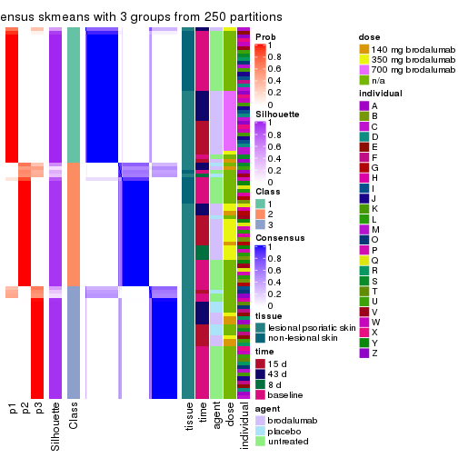</p>

</div>
<div id='tab-CV-skmeans-consensus-heatmap-3'>
<pre><code class="r">consensus_heatmap(res, k = 4)
</code></pre>

<p></p>

</div>
<div id='tab-CV-skmeans-consensus-heatmap-4'>
<pre><code class="r">consensus_heatmap(res, k = 5)
</code></pre>

<p></p>

</div>
<div id='tab-CV-skmeans-consensus-heatmap-5'>
<pre><code class="r">consensus_heatmap(res, k = 6)
</code></pre>

<p></p>

</div>
</div>

Heatmaps for the membership of samples in all partitions to see how consistent they are:


<script>
$( function() {
	$( '#tabs-CV-skmeans-membership-heatmap' ).tabs();
} );
</script>
<div id='tabs-CV-skmeans-membership-heatmap'>
<ul>
<li><a href='#tab-CV-skmeans-membership-heatmap-1'>k = 2</a></li>
<li><a href='#tab-CV-skmeans-membership-heatmap-2'>k = 3</a></li>
<li><a href='#tab-CV-skmeans-membership-heatmap-3'>k = 4</a></li>
<li><a href='#tab-CV-skmeans-membership-heatmap-4'>k = 5</a></li>
<li><a href='#tab-CV-skmeans-membership-heatmap-5'>k = 6</a></li>
</ul>
<div id='tab-CV-skmeans-membership-heatmap-1'>
<pre><code class="r">membership_heatmap(res, k = 2)
</code></pre>

<p></p>

</div>
<div id='tab-CV-skmeans-membership-heatmap-2'>
<pre><code class="r">membership_heatmap(res, k = 3)
</code></pre>

<p></p>

</div>
<div id='tab-CV-skmeans-membership-heatmap-3'>
<pre><code class="r">membership_heatmap(res, k = 4)
</code></pre>

<p></p>

</div>
<div id='tab-CV-skmeans-membership-heatmap-4'>
<pre><code class="r">membership_heatmap(res, k = 5)
</code></pre>

<p></p>

</div>
<div id='tab-CV-skmeans-membership-heatmap-5'>
<pre><code class="r">membership_heatmap(res, k = 6)
</code></pre>

<p></p>

</div>
</div>

As soon as we have had the classes for columns, we can look for signatures
which are significantly different between classes which can be candidate marks
for certain classes. Following are the heatmaps for signatures.


Signature heatmaps where rows are scaled:


<script>
$( function() {
	$( '#tabs-CV-skmeans-get-signatures' ).tabs();
} );
</script>
<div id='tabs-CV-skmeans-get-signatures'>
<ul>
<li><a href='#tab-CV-skmeans-get-signatures-1'>k = 2</a></li>
<li><a href='#tab-CV-skmeans-get-signatures-2'>k = 3</a></li>
<li><a href='#tab-CV-skmeans-get-signatures-3'>k = 4</a></li>
<li><a href='#tab-CV-skmeans-get-signatures-4'>k = 5</a></li>
<li><a href='#tab-CV-skmeans-get-signatures-5'>k = 6</a></li>
</ul>
<div id='tab-CV-skmeans-get-signatures-1'>
<pre><code class="r">get_signatures(res, k = 2)
</code></pre>

<p></p>

</div>
<div id='tab-CV-skmeans-get-signatures-2'>
<pre><code class="r">get_signatures(res, k = 3)
</code></pre>

<p></p>

</div>
<div id='tab-CV-skmeans-get-signatures-3'>
<pre><code class="r">get_signatures(res, k = 4)
</code></pre>

<p></p>

</div>
<div id='tab-CV-skmeans-get-signatures-4'>
<pre><code class="r">get_signatures(res, k = 5)
</code></pre>

<p></p>

</div>
<div id='tab-CV-skmeans-get-signatures-5'>
<pre><code class="r">get_signatures(res, k = 6)
</code></pre>

<p></p>

</div>
</div>


Signature heatmaps where rows are not scaled:


<script>
$( function() {
	$( '#tabs-CV-skmeans-get-signatures-no-scale' ).tabs();
} );
</script>
<div id='tabs-CV-skmeans-get-signatures-no-scale'>
<ul>
<li><a href='#tab-CV-skmeans-get-signatures-no-scale-1'>k = 2</a></li>
<li><a href='#tab-CV-skmeans-get-signatures-no-scale-2'>k = 3</a></li>
<li><a href='#tab-CV-skmeans-get-signatures-no-scale-3'>k = 4</a></li>
<li><a href='#tab-CV-skmeans-get-signatures-no-scale-4'>k = 5</a></li>
<li><a href='#tab-CV-skmeans-get-signatures-no-scale-5'>k = 6</a></li>
</ul>
<div id='tab-CV-skmeans-get-signatures-no-scale-1'>
<pre><code class="r">get_signatures(res, k = 2, scale_rows = FALSE)
</code></pre>

<p>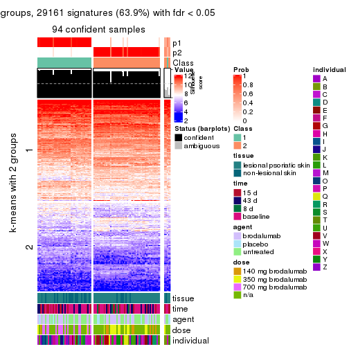</p>

</div>
<div id='tab-CV-skmeans-get-signatures-no-scale-2'>
<pre><code class="r">get_signatures(res, k = 3, scale_rows = FALSE)
</code></pre>

<p></p>

</div>
<div id='tab-CV-skmeans-get-signatures-no-scale-3'>
<pre><code class="r">get_signatures(res, k = 4, scale_rows = FALSE)
</code></pre>

<p></p>

</div>
<div id='tab-CV-skmeans-get-signatures-no-scale-4'>
<pre><code class="r">get_signatures(res, k = 5, scale_rows = FALSE)
</code></pre>

<p></p>

</div>
<div id='tab-CV-skmeans-get-signatures-no-scale-5'>
<pre><code class="r">get_signatures(res, k = 6, scale_rows = FALSE)
</code></pre>

<p></p>

</div>
</div>


Compare the overlap of signatures from different k:

```r
compare_signatures(res)
```

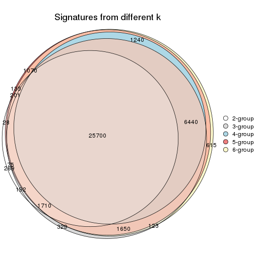

`get_signature()` returns a data frame invisibly. TO get the list of signatures, the function
call should be assigned to a variable explicitly. In following code, if `plot` argument is set
to `FALSE`, no heatmap is plotted while only the differential analysis is performed.

```r
# code only for demonstration
tb = get_signature(res, k = ..., plot = FALSE)
```

An example of the output of `tb` is:

```
#>   which_row         fdr    mean_1    mean_2 scaled_mean_1 scaled_mean_2 km
#> 1        38 0.042760348  8.373488  9.131774    -0.5533452     0.5164555  1
#> 2        40 0.018707592  7.106213  8.469186    -0.6173731     0.5762149  1
#> 3        55 0.019134737 10.221463 11.207825    -0.6159697     0.5749050  1
#> 4        59 0.006059896  5.921854  7.869574    -0.6899429     0.6439467  1
#> 5        60 0.018055526  8.928898 10.211722    -0.6204761     0.5791110  1
#> 6        98 0.009384629 15.714769 14.887706     0.6635654    -0.6193277  2
...
```

The columns in `tb` are:

1. `which_row`: row indices corresponding to the input matrix.
2. `fdr`: FDR for the differential test. 
3. `mean_x`: The mean value in group x.
4. `scaled_mean_x`: The mean value in group x after rows are scaled.
5. `km`: Row groups if k-means clustering is applied to rows.


UMAP plot which shows how samples are separated.


<script>
$( function() {
	$( '#tabs-CV-skmeans-dimension-reduction' ).tabs();
} );
</script>
<div id='tabs-CV-skmeans-dimension-reduction'>
<ul>
<li><a href='#tab-CV-skmeans-dimension-reduction-1'>k = 2</a></li>
<li><a href='#tab-CV-skmeans-dimension-reduction-2'>k = 3</a></li>
<li><a href='#tab-CV-skmeans-dimension-reduction-3'>k = 4</a></li>
<li><a href='#tab-CV-skmeans-dimension-reduction-4'>k = 5</a></li>
<li><a href='#tab-CV-skmeans-dimension-reduction-5'>k = 6</a></li>
</ul>
<div id='tab-CV-skmeans-dimension-reduction-1'>
<pre><code class="r">dimension_reduction(res, k = 2, method = &quot;UMAP&quot;)
</code></pre>

<p></p>

</div>
<div id='tab-CV-skmeans-dimension-reduction-2'>
<pre><code class="r">dimension_reduction(res, k = 3, method = &quot;UMAP&quot;)
</code></pre>

<p>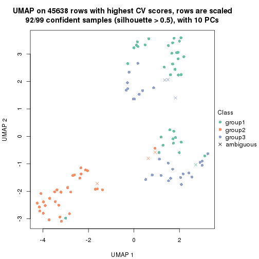</p>

</div>
<div id='tab-CV-skmeans-dimension-reduction-3'>
<pre><code class="r">dimension_reduction(res, k = 4, method = &quot;UMAP&quot;)
</code></pre>

<p></p>

</div>
<div id='tab-CV-skmeans-dimension-reduction-4'>
<pre><code class="r">dimension_reduction(res, k = 5, method = &quot;UMAP&quot;)
</code></pre>

<p></p>

</div>
<div id='tab-CV-skmeans-dimension-reduction-5'>
<pre><code class="r">dimension_reduction(res, k = 6, method = &quot;UMAP&quot;)
</code></pre>

<p></p>

</div>
</div>


Following heatmap shows how subgroups are split when increasing `k`:

```r
collect_classes(res)
```


Test correlation between subgroups and known annotations. If the known
annotation is numeric, one-way ANOVA test is applied, and if the known
annotation is discrete, chi-squared contingency table test is applied.

```r
test_to_known_factors(res)
```

```
#>             n tissue(p) time(p) agent(p)  dose(p) individual(p) k
#> CV:skmeans 94  2.67e-03  0.1564  0.77486 1.93e-06      6.19e-03 2
#> CV:skmeans 92  1.98e-04  0.1405  0.01357 1.93e-08      6.66e-07 3
#> CV:skmeans 61  3.35e-02  0.0916  0.00478 3.69e-06      1.22e-03 4
#> CV:skmeans 87  4.20e-05  0.5135  0.05125 2.07e-07      4.60e-07 5
#> CV:skmeans 84  9.19e-05  0.5458  0.14642 6.41e-07      1.18e-06 6
```


If matrix rows can be associated to genes, consider to use `functional_enrichment(res,
...)` to perform function enrichment for the signature genes. See [this vignette](http://bioconductor.org/packages/devel/bioc/vignettes/cola/inst/doc/functional_enrichment.html) for more detailed explanations.


 

---------------------------------------------------


### CV:pam


The object with results only for a single top-value method and a single partition method 
can be extracted as:

```r
res = res_list["CV", "pam"]
# you can also extract it by
# res = res_list["CV:pam"]
```

A summary of `res` and all the functions that can be applied to it:

```r
res
```

```
#> A 'ConsensusPartition' object with k = 2, 3, 4, 5, 6.
#>   On a matrix with 45638 rows and 99 columns.
#>   Top rows (1000, 2000, 3000, 4000, 5000) are extracted by 'CV' method.
#>   Subgroups are detected by 'pam' method.
#>   Performed in total 1250 partitions by row resampling.
#>   Best k for subgroups seems to be 3.
#> 
#> Following methods can be applied to this 'ConsensusPartition' object:
#>  [1] "cola_report"             "collect_classes"         "collect_plots"          
#>  [4] "collect_stats"           "colnames"                "compare_signatures"     
#>  [7] "consensus_heatmap"       "dimension_reduction"     "functional_enrichment"  
#> [10] "get_anno_col"            "get_anno"                "get_classes"            
#> [13] "get_consensus"           "get_matrix"              "get_membership"         
#> [16] "get_param"               "get_signatures"          "get_stats"              
#> [19] "is_best_k"               "is_stable_k"             "membership_heatmap"     
#> [22] "ncol"                    "nrow"                    "plot_ecdf"              
#> [25] "rownames"                "select_partition_number" "show"                   
#> [28] "suggest_best_k"          "test_to_known_factors"
```

`collect_plots()` function collects all the plots made from `res` for all `k` (number of partitions)
into one single page to provide an easy and fast comparison between different `k`.

```r
collect_plots(res)
```


The plots are:

- The first row: a plot of the ECDF (empirical cumulative distribution
  function) curves of the consensus matrix for each `k` and the heatmap of
  predicted classes for each `k`.
- The second row: heatmaps of the consensus matrix for each `k`.
- The third row: heatmaps of the membership matrix for each `k`.
- The fouth row: heatmaps of the signatures for each `k`.

All the plots in panels can be made by individual functions and they are
plotted later in this section.

`select_partition_number()` produces several plots showing different
statistics for choosing "optimized" `k`. There are following statistics:

- ECDF curves of the consensus matrix for each `k`;
- 1-PAC. [The PAC
  score](https://en.wikipedia.org/wiki/Consensus_clustering#Over-interpretation_potential_of_consensus_clustering)
  measures the proportion of the ambiguous subgrouping.
- Mean silhouette score.
- Concordance. The mean probability of fiting the consensus class ids in all
  partitions.
- Area increased. Denote $A_k$ as the area under the ECDF curve for current
  `k`, the area increased is defined as $A_k - A_{k-1}$.
- Rand index. The percent of pairs of samples that are both in a same cluster
  or both are not in a same cluster in the partition of k and k-1.
- Jaccard index. The ratio of pairs of samples are both in a same cluster in
  the partition of k and k-1 and the pairs of samples are both in a same
  cluster in the partition k or k-1.

The detailed explanations of these statistics can be found in [the _cola_
vignette](http://bioconductor.org/packages/devel/bioc/vignettes/cola/inst/doc/cola.html#toc_13).

Generally speaking, lower PAC score, higher mean silhouette score or higher
concordance corresponds to better partition. Rand index and Jaccard index
measure how similar the current partition is compared to partition with `k-1`.
If they are too similar, we won't accept `k` is better than `k-1`.

```r
select_partition_number(res)
```


The numeric values for all these statistics can be obtained by `get_stats()`.

```r
get_stats(res)
```

```
#>   k 1-PAC mean_silhouette concordance area_increased  Rand Jaccard
#> 2 2 0.265           0.413       0.751         0.4952 0.504   0.504
#> 3 3 0.724           0.855       0.931         0.3452 0.664   0.426
#> 4 4 0.762           0.682       0.844         0.1120 0.879   0.657
#> 5 5 0.859           0.839       0.915         0.0660 0.894   0.629
#> 6 6 0.803           0.741       0.842         0.0437 0.967   0.847
```

`suggest_best_k()` suggests the best $k$ based on these statistics. The rules are as follows:

- All $k$ with Jaccard index larger than 0.95 are removed because increasing
  $k$ does not provide enough extra information. If all $k$ are removed, it is
  marked as no subgroup is detected.
- For all $k$ with 1-PAC score larger than 0.9, the maximal $k$ is taken as
  the best $k$, and other $k$ are marked as optional $k$.
- If it does not fit the second rule. The $k$ with the maximal vote of the
  highest 1-PAC score, highest mean silhouette, and highest concordance is
  taken as the best $k$.

```r
suggest_best_k(res)
```

```
#> [1] 3
```


Following shows the table of the partitions (You need to click the **show/hide
code output** link to see it). The membership matrix (columns with name `p*`)
is inferred by
[`clue::cl_consensus()`](https://www.rdocumentation.org/link/cl_consensus?package=clue)
function with the `SE` method. Basically the value in the membership matrix
represents the probability to belong to a certain group. The finall class
label for an item is determined with the group with highest probability it
belongs to.

In `get_classes()` function, the entropy is calculated from the membership
matrix and the silhouette score is calculated from the consensus matrix.


<script>
$( function() {
	$( '#tabs-CV-pam-get-classes' ).tabs();
} );
</script>
<div id='tabs-CV-pam-get-classes'>
<ul>
<li><a href='#tab-CV-pam-get-classes-1'>k = 2</a></li>
<li><a href='#tab-CV-pam-get-classes-2'>k = 3</a></li>
<li><a href='#tab-CV-pam-get-classes-3'>k = 4</a></li>
<li><a href='#tab-CV-pam-get-classes-4'>k = 5</a></li>
<li><a href='#tab-CV-pam-get-classes-5'>k = 6</a></li>
</ul>

<div id='tab-CV-pam-get-classes-1'>
<p><a id='tab-CV-pam-get-classes-1-a' style='color:#0366d6' href='#'>show/hide code output</a></p>
<pre><code class="r">cbind(get_classes(res, k = 2), get_membership(res, k = 2))
</code></pre>

<pre><code>#&gt;            class entropy silhouette    p1    p2
#&gt; GSM1296094     2  0.9850     0.3981 0.428 0.572
#&gt; GSM1296119     2  0.0000     0.5097 0.000 1.000
#&gt; GSM1296076     2  0.6531     0.5205 0.168 0.832
#&gt; GSM1296092     2  0.9866     0.3922 0.432 0.568
#&gt; GSM1296103     2  0.9833     0.4019 0.424 0.576
#&gt; GSM1296078     2  0.6438     0.5215 0.164 0.836
#&gt; GSM1296107     2  0.0000     0.5097 0.000 1.000
#&gt; GSM1296109     2  0.5946     0.5239 0.144 0.856
#&gt; GSM1296080     1  0.9998    -0.2934 0.508 0.492
#&gt; GSM1296090     2  0.9710     0.4219 0.400 0.600
#&gt; GSM1296074     2  0.9491     0.4414 0.368 0.632
#&gt; GSM1296111     2  0.0000     0.5097 0.000 1.000
#&gt; GSM1296099     2  0.9732     0.4182 0.404 0.596
#&gt; GSM1296086     2  0.9795     0.4096 0.416 0.584
#&gt; GSM1296117     2  0.0000     0.5097 0.000 1.000
#&gt; GSM1296113     2  0.0000     0.5097 0.000 1.000
#&gt; GSM1296096     2  0.9087     0.4612 0.324 0.676
#&gt; GSM1296105     1  0.0938     0.7423 0.988 0.012
#&gt; GSM1296098     2  0.9754     0.4169 0.408 0.592
#&gt; GSM1296101     2  0.9850     0.3979 0.428 0.572
#&gt; GSM1296121     2  0.2423     0.5166 0.040 0.960
#&gt; GSM1296088     2  0.9983     0.3194 0.476 0.524
#&gt; GSM1296082     2  0.9491     0.4414 0.368 0.632
#&gt; GSM1296115     2  0.0000     0.5097 0.000 1.000
#&gt; GSM1296084     1  0.9998    -0.2934 0.508 0.492
#&gt; GSM1296072     2  0.9933    -0.0553 0.452 0.548
#&gt; GSM1296069     2  0.8555     0.2249 0.280 0.720
#&gt; GSM1296071     2  0.9998    -0.1082 0.492 0.508
#&gt; GSM1296070     2  0.8081     0.2723 0.248 0.752
#&gt; GSM1296073     2  0.5946     0.5239 0.144 0.856
#&gt; GSM1296034     1  0.0000     0.7450 1.000 0.000
#&gt; GSM1296041     2  0.0000     0.5097 0.000 1.000
#&gt; GSM1296035     2  0.9866     0.3922 0.432 0.568
#&gt; GSM1296038     2  0.6148     0.5233 0.152 0.848
#&gt; GSM1296047     1  1.0000     0.0870 0.500 0.500
#&gt; GSM1296039     2  0.6148     0.5234 0.152 0.848
#&gt; GSM1296042     2  0.0000     0.5097 0.000 1.000
#&gt; GSM1296043     2  0.9970    -0.0775 0.468 0.532
#&gt; GSM1296037     1  0.0000     0.7450 1.000 0.000
#&gt; GSM1296046     2  0.9998    -0.1082 0.492 0.508
#&gt; GSM1296044     2  1.0000    -0.1142 0.496 0.504
#&gt; GSM1296045     2  0.9998    -0.1082 0.492 0.508
#&gt; GSM1296025     1  0.5408     0.6959 0.876 0.124
#&gt; GSM1296033     1  0.2948     0.6871 0.948 0.052
#&gt; GSM1296027     1  0.0000     0.7450 1.000 0.000
#&gt; GSM1296032     1  0.0672     0.7455 0.992 0.008
#&gt; GSM1296024     1  0.5842     0.6836 0.860 0.140
#&gt; GSM1296031     1  0.5946     0.6802 0.856 0.144
#&gt; GSM1296028     1  0.0000     0.7450 1.000 0.000
#&gt; GSM1296029     1  0.0000     0.7450 1.000 0.000
#&gt; GSM1296026     2  0.9998     0.2901 0.492 0.508
#&gt; GSM1296030     1  0.9998    -0.2934 0.508 0.492
#&gt; GSM1296040     2  0.9909     0.3792 0.444 0.556
#&gt; GSM1296036     2  0.9866     0.3923 0.432 0.568
#&gt; GSM1296048     2  0.0000     0.5097 0.000 1.000
#&gt; GSM1296059     2  0.9833     0.4019 0.424 0.576
#&gt; GSM1296066     2  0.4690     0.4425 0.100 0.900
#&gt; GSM1296060     2  0.9775     0.4125 0.412 0.588
#&gt; GSM1296063     2  0.5946     0.5239 0.144 0.856
#&gt; GSM1296064     2  0.6048     0.5237 0.148 0.852
#&gt; GSM1296067     2  1.0000    -0.1142 0.496 0.504
#&gt; GSM1296062     1  0.9977    -0.2637 0.528 0.472
#&gt; GSM1296068     2  1.0000    -0.1142 0.496 0.504
#&gt; GSM1296050     1  0.5946     0.6802 0.856 0.144
#&gt; GSM1296057     1  0.1184     0.7376 0.984 0.016
#&gt; GSM1296052     1  0.0938     0.7449 0.988 0.012
#&gt; GSM1296054     1  0.0376     0.7456 0.996 0.004
#&gt; GSM1296049     1  0.5519     0.6930 0.872 0.128
#&gt; GSM1296055     1  0.8763     0.4857 0.704 0.296
#&gt; GSM1296053     1  0.0000     0.7450 1.000 0.000
#&gt; GSM1296058     1  0.8016     0.3270 0.756 0.244
#&gt; GSM1296051     2  0.9866     0.3922 0.432 0.568
#&gt; GSM1296056     2  0.9795     0.4096 0.416 0.584
#&gt; GSM1296065     1  0.8555     0.3966 0.720 0.280
#&gt; GSM1296061     2  0.9963     0.3478 0.464 0.536
#&gt; GSM1296095     1  0.9954     0.0320 0.540 0.460
#&gt; GSM1296120     2  1.0000    -0.1154 0.496 0.504
#&gt; GSM1296077     1  0.5294     0.6984 0.880 0.120
#&gt; GSM1296093     1  0.0000     0.7450 1.000 0.000
#&gt; GSM1296104     1  0.2043     0.7282 0.968 0.032
#&gt; GSM1296079     1  0.5946     0.6802 0.856 0.144
#&gt; GSM1296108     2  1.0000    -0.1227 0.500 0.500
#&gt; GSM1296110     2  1.0000    -0.1142 0.496 0.504
#&gt; GSM1296081     1  0.0000     0.7450 1.000 0.000
#&gt; GSM1296091     1  0.0672     0.7422 0.992 0.008
#&gt; GSM1296075     1  0.6343     0.6731 0.840 0.160
#&gt; GSM1296112     2  1.0000    -0.1142 0.496 0.504
#&gt; GSM1296100     1  0.0000     0.7450 1.000 0.000
#&gt; GSM1296087     1  0.0000     0.7450 1.000 0.000
#&gt; GSM1296118     1  0.9996     0.1131 0.512 0.488
#&gt; GSM1296114     2  1.0000    -0.1142 0.496 0.504
#&gt; GSM1296097     1  0.2778     0.7243 0.952 0.048
#&gt; GSM1296106     1  0.7528     0.6097 0.784 0.216
#&gt; GSM1296102     1  0.4022     0.7194 0.920 0.080
#&gt; GSM1296122     1  0.8861     0.4752 0.696 0.304
#&gt; GSM1296089     1  0.5946     0.6802 0.856 0.144
#&gt; GSM1296083     1  0.0376     0.7456 0.996 0.004
#&gt; GSM1296116     2  1.0000    -0.1142 0.496 0.504
#&gt; GSM1296085     1  0.0000     0.7450 1.000 0.000
</code></pre>

<script>
$('#tab-CV-pam-get-classes-1-a').parent().next().next().hide();
$('#tab-CV-pam-get-classes-1-a').click(function(){
  $('#tab-CV-pam-get-classes-1-a').parent().next().next().toggle();
  return(false);
});
</script>
</div>

<div id='tab-CV-pam-get-classes-2'>
<p><a id='tab-CV-pam-get-classes-2-a' style='color:#0366d6' href='#'>show/hide code output</a></p>
<pre><code class="r">cbind(get_classes(res, k = 3), get_membership(res, k = 3))
</code></pre>

<pre><code>#&gt;            class entropy silhouette    p1    p2    p3
#&gt; GSM1296094     3  0.0000      0.920 0.000 0.000 1.000
#&gt; GSM1296119     2  0.3038      0.848 0.000 0.896 0.104
#&gt; GSM1296076     3  0.0000      0.920 0.000 0.000 1.000
#&gt; GSM1296092     3  0.0000      0.920 0.000 0.000 1.000
#&gt; GSM1296103     3  0.0000      0.920 0.000 0.000 1.000
#&gt; GSM1296078     3  0.0592      0.914 0.000 0.012 0.988
#&gt; GSM1296107     2  0.0237      0.892 0.000 0.996 0.004
#&gt; GSM1296109     3  0.0892      0.909 0.000 0.020 0.980
#&gt; GSM1296080     3  0.5988      0.398 0.368 0.000 0.632
#&gt; GSM1296090     3  0.0000      0.920 0.000 0.000 1.000
#&gt; GSM1296074     3  0.0000      0.920 0.000 0.000 1.000
#&gt; GSM1296111     2  0.0592      0.889 0.000 0.988 0.012
#&gt; GSM1296099     3  0.0000      0.920 0.000 0.000 1.000
#&gt; GSM1296086     3  0.0000      0.920 0.000 0.000 1.000
#&gt; GSM1296117     2  0.1163      0.888 0.000 0.972 0.028
#&gt; GSM1296113     2  0.0000      0.893 0.000 1.000 0.000
#&gt; GSM1296096     3  0.0000      0.920 0.000 0.000 1.000
#&gt; GSM1296105     3  0.3755      0.823 0.120 0.008 0.872
#&gt; GSM1296098     3  0.0000      0.920 0.000 0.000 1.000
#&gt; GSM1296101     3  0.0000      0.920 0.000 0.000 1.000
#&gt; GSM1296121     2  0.4887      0.663 0.000 0.772 0.228
#&gt; GSM1296088     3  0.0000      0.920 0.000 0.000 1.000
#&gt; GSM1296082     3  0.0000      0.920 0.000 0.000 1.000
#&gt; GSM1296115     2  0.6154      0.247 0.000 0.592 0.408
#&gt; GSM1296084     3  0.4346      0.750 0.184 0.000 0.816
#&gt; GSM1296072     2  0.0000      0.893 0.000 1.000 0.000
#&gt; GSM1296069     2  0.0000      0.893 0.000 1.000 0.000
#&gt; GSM1296071     2  0.2066      0.882 0.060 0.940 0.000
#&gt; GSM1296070     2  0.0000      0.893 0.000 1.000 0.000
#&gt; GSM1296073     3  0.6126      0.370 0.000 0.400 0.600
#&gt; GSM1296034     1  0.3551      0.829 0.868 0.000 0.132
#&gt; GSM1296041     2  0.2165      0.860 0.000 0.936 0.064
#&gt; GSM1296035     3  0.0000      0.920 0.000 0.000 1.000
#&gt; GSM1296038     3  0.1753      0.892 0.000 0.048 0.952
#&gt; GSM1296047     2  0.3715      0.843 0.128 0.868 0.004
#&gt; GSM1296039     3  0.0000      0.920 0.000 0.000 1.000
#&gt; GSM1296042     2  0.0000      0.893 0.000 1.000 0.000
#&gt; GSM1296043     2  0.0000      0.893 0.000 1.000 0.000
#&gt; GSM1296037     1  0.0000      0.961 1.000 0.000 0.000
#&gt; GSM1296046     2  0.0000      0.893 0.000 1.000 0.000
#&gt; GSM1296044     2  0.2796      0.870 0.092 0.908 0.000
#&gt; GSM1296045     2  0.0000      0.893 0.000 1.000 0.000
#&gt; GSM1296025     1  0.0000      0.961 1.000 0.000 0.000
#&gt; GSM1296033     1  0.0000      0.961 1.000 0.000 0.000
#&gt; GSM1296027     1  0.0000      0.961 1.000 0.000 0.000
#&gt; GSM1296032     1  0.0000      0.961 1.000 0.000 0.000
#&gt; GSM1296024     1  0.0000      0.961 1.000 0.000 0.000
#&gt; GSM1296031     1  0.0000      0.961 1.000 0.000 0.000
#&gt; GSM1296028     1  0.0000      0.961 1.000 0.000 0.000
#&gt; GSM1296029     1  0.0000      0.961 1.000 0.000 0.000
#&gt; GSM1296026     3  0.0000      0.920 0.000 0.000 1.000
#&gt; GSM1296030     1  0.5529      0.579 0.704 0.000 0.296
#&gt; GSM1296040     3  0.0424      0.916 0.008 0.000 0.992
#&gt; GSM1296036     3  0.0000      0.920 0.000 0.000 1.000
#&gt; GSM1296048     2  0.2711      0.839 0.000 0.912 0.088
#&gt; GSM1296059     3  0.0000      0.920 0.000 0.000 1.000
#&gt; GSM1296066     2  0.0000      0.893 0.000 1.000 0.000
#&gt; GSM1296060     3  0.0000      0.920 0.000 0.000 1.000
#&gt; GSM1296063     3  0.6126      0.370 0.000 0.400 0.600
#&gt; GSM1296064     3  0.0000      0.920 0.000 0.000 1.000
#&gt; GSM1296067     2  0.2711      0.872 0.088 0.912 0.000
#&gt; GSM1296062     3  0.0424      0.916 0.008 0.000 0.992
#&gt; GSM1296068     2  0.2796      0.870 0.092 0.908 0.000
#&gt; GSM1296050     1  0.0237      0.958 0.996 0.004 0.000
#&gt; GSM1296057     1  0.4233      0.791 0.836 0.004 0.160
#&gt; GSM1296052     1  0.0000      0.961 1.000 0.000 0.000
#&gt; GSM1296054     1  0.0000      0.961 1.000 0.000 0.000
#&gt; GSM1296049     1  0.0000      0.961 1.000 0.000 0.000
#&gt; GSM1296055     2  0.8440      0.595 0.184 0.620 0.196
#&gt; GSM1296053     1  0.0000      0.961 1.000 0.000 0.000
#&gt; GSM1296058     3  0.2959      0.853 0.100 0.000 0.900
#&gt; GSM1296051     3  0.0000      0.920 0.000 0.000 1.000
#&gt; GSM1296056     3  0.0000      0.920 0.000 0.000 1.000
#&gt; GSM1296065     3  0.8103      0.496 0.120 0.248 0.632
#&gt; GSM1296061     3  0.0000      0.920 0.000 0.000 1.000
#&gt; GSM1296095     3  0.7624      0.568 0.104 0.224 0.672
#&gt; GSM1296120     2  0.3340      0.851 0.120 0.880 0.000
#&gt; GSM1296077     1  0.0000      0.961 1.000 0.000 0.000
#&gt; GSM1296093     1  0.0000      0.961 1.000 0.000 0.000
#&gt; GSM1296104     3  0.5944      0.751 0.120 0.088 0.792
#&gt; GSM1296079     1  0.0000      0.961 1.000 0.000 0.000
#&gt; GSM1296108     2  0.3340      0.851 0.120 0.880 0.000
#&gt; GSM1296110     2  0.0000      0.893 0.000 1.000 0.000
#&gt; GSM1296081     1  0.0000      0.961 1.000 0.000 0.000
#&gt; GSM1296091     1  0.0000      0.961 1.000 0.000 0.000
#&gt; GSM1296075     1  0.5810      0.423 0.664 0.336 0.000
#&gt; GSM1296112     2  0.2796      0.870 0.092 0.908 0.000
#&gt; GSM1296100     1  0.0000      0.961 1.000 0.000 0.000
#&gt; GSM1296087     1  0.0000      0.961 1.000 0.000 0.000
#&gt; GSM1296118     2  0.3816      0.828 0.148 0.852 0.000
#&gt; GSM1296114     2  0.2796      0.870 0.092 0.908 0.000
#&gt; GSM1296097     3  0.5334      0.780 0.120 0.060 0.820
#&gt; GSM1296106     2  0.8568      0.575 0.200 0.608 0.192
#&gt; GSM1296102     1  0.1399      0.935 0.968 0.004 0.028
#&gt; GSM1296122     2  0.6126      0.407 0.400 0.600 0.000
#&gt; GSM1296089     1  0.0000      0.961 1.000 0.000 0.000
#&gt; GSM1296083     1  0.0000      0.961 1.000 0.000 0.000
#&gt; GSM1296116     2  0.0000      0.893 0.000 1.000 0.000
#&gt; GSM1296085     1  0.0000      0.961 1.000 0.000 0.000
</code></pre>

<script>
$('#tab-CV-pam-get-classes-2-a').parent().next().next().hide();
$('#tab-CV-pam-get-classes-2-a').click(function(){
  $('#tab-CV-pam-get-classes-2-a').parent().next().next().toggle();
  return(false);
});
</script>
</div>

<div id='tab-CV-pam-get-classes-3'>
<p><a id='tab-CV-pam-get-classes-3-a' style='color:#0366d6' href='#'>show/hide code output</a></p>
<pre><code class="r">cbind(get_classes(res, k = 4), get_membership(res, k = 4))
</code></pre>

<pre><code>#&gt;            class entropy silhouette    p1    p2    p3    p4
#&gt; GSM1296094     3  0.0000     0.9256 0.000 0.000 1.000 0.000
#&gt; GSM1296119     2  0.4150     0.7193 0.000 0.824 0.120 0.056
#&gt; GSM1296076     3  0.0188     0.9230 0.000 0.004 0.996 0.000
#&gt; GSM1296092     3  0.0000     0.9256 0.000 0.000 1.000 0.000
#&gt; GSM1296103     3  0.0000     0.9256 0.000 0.000 1.000 0.000
#&gt; GSM1296078     3  0.1792     0.8697 0.000 0.068 0.932 0.000
#&gt; GSM1296107     2  0.0000     0.8698 0.000 1.000 0.000 0.000
#&gt; GSM1296109     3  0.1557     0.8800 0.000 0.056 0.944 0.000
#&gt; GSM1296080     3  0.4967     0.1468 0.452 0.000 0.548 0.000
#&gt; GSM1296090     3  0.0000     0.9256 0.000 0.000 1.000 0.000
#&gt; GSM1296074     3  0.0000     0.9256 0.000 0.000 1.000 0.000
#&gt; GSM1296111     2  0.0000     0.8698 0.000 1.000 0.000 0.000
#&gt; GSM1296099     3  0.0000     0.9256 0.000 0.000 1.000 0.000
#&gt; GSM1296086     3  0.0000     0.9256 0.000 0.000 1.000 0.000
#&gt; GSM1296117     2  0.2797     0.8223 0.000 0.900 0.032 0.068
#&gt; GSM1296113     2  0.4164     0.6068 0.000 0.736 0.000 0.264
#&gt; GSM1296096     3  0.0000     0.9256 0.000 0.000 1.000 0.000
#&gt; GSM1296105     3  0.4994     0.1075 0.000 0.000 0.520 0.480
#&gt; GSM1296098     3  0.0000     0.9256 0.000 0.000 1.000 0.000
#&gt; GSM1296101     3  0.0000     0.9256 0.000 0.000 1.000 0.000
#&gt; GSM1296121     2  0.0000     0.8698 0.000 1.000 0.000 0.000
#&gt; GSM1296088     3  0.0000     0.9256 0.000 0.000 1.000 0.000
#&gt; GSM1296082     3  0.0000     0.9256 0.000 0.000 1.000 0.000
#&gt; GSM1296115     2  0.0000     0.8698 0.000 1.000 0.000 0.000
#&gt; GSM1296084     3  0.2921     0.7822 0.140 0.000 0.860 0.000
#&gt; GSM1296072     2  0.4989     0.1853 0.000 0.528 0.000 0.472
#&gt; GSM1296069     2  0.1867     0.8506 0.000 0.928 0.000 0.072
#&gt; GSM1296071     4  0.4916     0.0767 0.000 0.424 0.000 0.576
#&gt; GSM1296070     2  0.1940     0.8487 0.000 0.924 0.000 0.076
#&gt; GSM1296073     2  0.0000     0.8698 0.000 1.000 0.000 0.000
#&gt; GSM1296034     1  0.5519     0.6491 0.684 0.000 0.052 0.264
#&gt; GSM1296041     2  0.0000     0.8698 0.000 1.000 0.000 0.000
#&gt; GSM1296035     3  0.0000     0.9256 0.000 0.000 1.000 0.000
#&gt; GSM1296038     3  0.2469     0.8261 0.000 0.108 0.892 0.000
#&gt; GSM1296047     4  0.0000     0.5883 0.000 0.000 0.000 1.000
#&gt; GSM1296039     3  0.0000     0.9256 0.000 0.000 1.000 0.000
#&gt; GSM1296042     2  0.0188     0.8695 0.000 0.996 0.000 0.004
#&gt; GSM1296043     2  0.2921     0.8007 0.000 0.860 0.000 0.140
#&gt; GSM1296037     1  0.4992     0.4445 0.524 0.000 0.000 0.476
#&gt; GSM1296046     2  0.4989     0.1846 0.000 0.528 0.000 0.472
#&gt; GSM1296044     4  0.4830     0.1774 0.000 0.392 0.000 0.608
#&gt; GSM1296045     2  0.2081     0.8440 0.000 0.916 0.000 0.084
#&gt; GSM1296025     1  0.0000     0.8318 1.000 0.000 0.000 0.000
#&gt; GSM1296033     1  0.3015     0.7841 0.884 0.000 0.024 0.092
#&gt; GSM1296027     1  0.0000     0.8318 1.000 0.000 0.000 0.000
#&gt; GSM1296032     1  0.0000     0.8318 1.000 0.000 0.000 0.000
#&gt; GSM1296024     1  0.0000     0.8318 1.000 0.000 0.000 0.000
#&gt; GSM1296031     1  0.4697     0.6034 0.644 0.000 0.000 0.356
#&gt; GSM1296028     1  0.1637     0.8128 0.940 0.000 0.000 0.060
#&gt; GSM1296029     1  0.0000     0.8318 1.000 0.000 0.000 0.000
#&gt; GSM1296026     3  0.0000     0.9256 0.000 0.000 1.000 0.000
#&gt; GSM1296030     1  0.4304     0.5289 0.716 0.000 0.284 0.000
#&gt; GSM1296040     3  0.0188     0.9228 0.000 0.000 0.996 0.004
#&gt; GSM1296036     3  0.0000     0.9256 0.000 0.000 1.000 0.000
#&gt; GSM1296048     2  0.0000     0.8698 0.000 1.000 0.000 0.000
#&gt; GSM1296059     3  0.0000     0.9256 0.000 0.000 1.000 0.000
#&gt; GSM1296066     2  0.0000     0.8698 0.000 1.000 0.000 0.000
#&gt; GSM1296060     3  0.0000     0.9256 0.000 0.000 1.000 0.000
#&gt; GSM1296063     2  0.1302     0.8423 0.000 0.956 0.044 0.000
#&gt; GSM1296064     3  0.0000     0.9256 0.000 0.000 1.000 0.000
#&gt; GSM1296067     4  0.4790     0.2063 0.000 0.380 0.000 0.620
#&gt; GSM1296062     3  0.0336     0.9197 0.000 0.000 0.992 0.008
#&gt; GSM1296068     4  0.4761     0.2192 0.000 0.372 0.000 0.628
#&gt; GSM1296050     1  0.4713     0.5924 0.640 0.000 0.000 0.360
#&gt; GSM1296057     4  0.6953    -0.2988 0.412 0.000 0.112 0.476
#&gt; GSM1296052     1  0.0000     0.8318 1.000 0.000 0.000 0.000
#&gt; GSM1296054     1  0.0000     0.8318 1.000 0.000 0.000 0.000
#&gt; GSM1296049     1  0.0000     0.8318 1.000 0.000 0.000 0.000
#&gt; GSM1296055     4  0.5046     0.4963 0.064 0.040 0.092 0.804
#&gt; GSM1296053     1  0.0000     0.8318 1.000 0.000 0.000 0.000
#&gt; GSM1296058     3  0.4360     0.6169 0.008 0.000 0.744 0.248
#&gt; GSM1296051     3  0.0000     0.9256 0.000 0.000 1.000 0.000
#&gt; GSM1296056     3  0.0000     0.9256 0.000 0.000 1.000 0.000
#&gt; GSM1296065     4  0.4585     0.3165 0.000 0.000 0.332 0.668
#&gt; GSM1296061     3  0.0000     0.9256 0.000 0.000 1.000 0.000
#&gt; GSM1296095     3  0.4992     0.1104 0.000 0.000 0.524 0.476
#&gt; GSM1296120     4  0.0000     0.5883 0.000 0.000 0.000 1.000
#&gt; GSM1296077     1  0.3311     0.7569 0.828 0.000 0.000 0.172
#&gt; GSM1296093     1  0.0817     0.8269 0.976 0.000 0.000 0.024
#&gt; GSM1296104     4  0.4985    -0.0229 0.000 0.000 0.468 0.532
#&gt; GSM1296079     1  0.2149     0.8048 0.912 0.000 0.000 0.088
#&gt; GSM1296108     4  0.2281     0.5414 0.000 0.096 0.000 0.904
#&gt; GSM1296110     4  0.4992    -0.1178 0.000 0.476 0.000 0.524
#&gt; GSM1296081     1  0.0000     0.8318 1.000 0.000 0.000 0.000
#&gt; GSM1296091     1  0.4164     0.6868 0.736 0.000 0.000 0.264
#&gt; GSM1296075     4  0.4222     0.1745 0.272 0.000 0.000 0.728
#&gt; GSM1296112     4  0.4830     0.1774 0.000 0.392 0.000 0.608
#&gt; GSM1296100     1  0.4992     0.4445 0.524 0.000 0.000 0.476
#&gt; GSM1296087     1  0.0000     0.8318 1.000 0.000 0.000 0.000
#&gt; GSM1296118     4  0.0000     0.5883 0.000 0.000 0.000 1.000
#&gt; GSM1296114     4  0.4830     0.1774 0.000 0.392 0.000 0.608
#&gt; GSM1296097     4  0.4994    -0.0567 0.000 0.000 0.480 0.520
#&gt; GSM1296106     4  0.0000     0.5883 0.000 0.000 0.000 1.000
#&gt; GSM1296102     1  0.5292     0.4263 0.512 0.000 0.008 0.480
#&gt; GSM1296122     4  0.0000     0.5883 0.000 0.000 0.000 1.000
#&gt; GSM1296089     1  0.4972     0.4746 0.544 0.000 0.000 0.456
#&gt; GSM1296083     1  0.0000     0.8318 1.000 0.000 0.000 0.000
#&gt; GSM1296116     2  0.2081     0.8440 0.000 0.916 0.000 0.084
#&gt; GSM1296085     1  0.0000     0.8318 1.000 0.000 0.000 0.000
</code></pre>

<script>
$('#tab-CV-pam-get-classes-3-a').parent().next().next().hide();
$('#tab-CV-pam-get-classes-3-a').click(function(){
  $('#tab-CV-pam-get-classes-3-a').parent().next().next().toggle();
  return(false);
});
</script>
</div>

<div id='tab-CV-pam-get-classes-4'>
<p><a id='tab-CV-pam-get-classes-4-a' style='color:#0366d6' href='#'>show/hide code output</a></p>
<pre><code class="r">cbind(get_classes(res, k = 5), get_membership(res, k = 5))
</code></pre>

<pre><code>#&gt;            class entropy silhouette    p1    p2    p3    p4    p5
#&gt; GSM1296094     3  0.0404     0.9481 0.000 0.000 0.988 0.012 0.000
#&gt; GSM1296119     5  0.3398     0.7759 0.000 0.024 0.144 0.004 0.828
#&gt; GSM1296076     3  0.0794     0.9432 0.000 0.000 0.972 0.028 0.000
#&gt; GSM1296092     3  0.1638     0.9272 0.000 0.004 0.932 0.064 0.000
#&gt; GSM1296103     3  0.0404     0.9481 0.000 0.000 0.988 0.012 0.000
#&gt; GSM1296078     3  0.1981     0.9143 0.000 0.000 0.924 0.028 0.048
#&gt; GSM1296107     5  0.0000     0.9501 0.000 0.000 0.000 0.000 1.000
#&gt; GSM1296109     3  0.1197     0.9298 0.000 0.000 0.952 0.000 0.048
#&gt; GSM1296080     3  0.5505     0.1565 0.412 0.004 0.528 0.056 0.000
#&gt; GSM1296090     3  0.0794     0.9432 0.000 0.000 0.972 0.028 0.000
#&gt; GSM1296074     3  0.0794     0.9432 0.000 0.000 0.972 0.028 0.000
#&gt; GSM1296111     5  0.0000     0.9501 0.000 0.000 0.000 0.000 1.000
#&gt; GSM1296099     3  0.0404     0.9481 0.000 0.000 0.988 0.012 0.000
#&gt; GSM1296086     3  0.0880     0.9424 0.000 0.000 0.968 0.032 0.000
#&gt; GSM1296117     5  0.1725     0.9116 0.000 0.020 0.044 0.000 0.936
#&gt; GSM1296113     2  0.2966     0.8062 0.000 0.816 0.000 0.000 0.184
#&gt; GSM1296096     3  0.0404     0.9481 0.000 0.000 0.988 0.012 0.000
#&gt; GSM1296105     4  0.1478     0.7812 0.000 0.000 0.064 0.936 0.000
#&gt; GSM1296098     3  0.0404     0.9481 0.000 0.000 0.988 0.012 0.000
#&gt; GSM1296101     3  0.0404     0.9481 0.000 0.000 0.988 0.012 0.000
#&gt; GSM1296121     5  0.0000     0.9501 0.000 0.000 0.000 0.000 1.000
#&gt; GSM1296088     3  0.0963     0.9361 0.000 0.000 0.964 0.036 0.000
#&gt; GSM1296082     3  0.0794     0.9432 0.000 0.000 0.972 0.028 0.000
#&gt; GSM1296115     5  0.0000     0.9501 0.000 0.000 0.000 0.000 1.000
#&gt; GSM1296084     3  0.3909     0.7797 0.124 0.004 0.808 0.064 0.000
#&gt; GSM1296072     2  0.2798     0.8484 0.000 0.852 0.000 0.008 0.140
#&gt; GSM1296069     5  0.1544     0.9244 0.000 0.068 0.000 0.000 0.932
#&gt; GSM1296071     2  0.0162     0.9402 0.000 0.996 0.000 0.000 0.004
#&gt; GSM1296070     5  0.1608     0.9221 0.000 0.072 0.000 0.000 0.928
#&gt; GSM1296073     5  0.0000     0.9501 0.000 0.000 0.000 0.000 1.000
#&gt; GSM1296034     4  0.4283     0.2625 0.456 0.000 0.000 0.544 0.000
#&gt; GSM1296041     5  0.0000     0.9501 0.000 0.000 0.000 0.000 1.000
#&gt; GSM1296035     3  0.0404     0.9481 0.000 0.000 0.988 0.012 0.000
#&gt; GSM1296038     3  0.2293     0.8858 0.000 0.000 0.900 0.016 0.084
#&gt; GSM1296047     4  0.4287     0.1481 0.000 0.460 0.000 0.540 0.000
#&gt; GSM1296039     3  0.0703     0.9439 0.000 0.000 0.976 0.024 0.000
#&gt; GSM1296042     5  0.0162     0.9496 0.000 0.004 0.000 0.000 0.996
#&gt; GSM1296043     5  0.2020     0.9004 0.000 0.100 0.000 0.000 0.900
#&gt; GSM1296037     4  0.1908     0.7692 0.092 0.000 0.000 0.908 0.000
#&gt; GSM1296046     2  0.2230     0.8743 0.000 0.884 0.000 0.000 0.116
#&gt; GSM1296044     2  0.0162     0.9402 0.000 0.996 0.000 0.000 0.004
#&gt; GSM1296045     5  0.1732     0.9161 0.000 0.080 0.000 0.000 0.920
#&gt; GSM1296025     1  0.0000     0.8981 1.000 0.000 0.000 0.000 0.000
#&gt; GSM1296033     1  0.3759     0.7757 0.792 0.004 0.024 0.180 0.000
#&gt; GSM1296027     1  0.1502     0.8937 0.940 0.004 0.000 0.056 0.000
#&gt; GSM1296032     1  0.0794     0.9015 0.972 0.000 0.000 0.028 0.000
#&gt; GSM1296024     1  0.0000     0.8981 1.000 0.000 0.000 0.000 0.000
#&gt; GSM1296031     4  0.4161     0.3525 0.392 0.000 0.000 0.608 0.000
#&gt; GSM1296028     1  0.2488     0.8521 0.872 0.004 0.000 0.124 0.000
#&gt; GSM1296029     1  0.1571     0.8918 0.936 0.004 0.000 0.060 0.000
#&gt; GSM1296026     3  0.1502     0.9264 0.000 0.004 0.940 0.056 0.000
#&gt; GSM1296030     1  0.5026     0.5846 0.684 0.004 0.244 0.068 0.000
#&gt; GSM1296040     3  0.0794     0.9420 0.000 0.000 0.972 0.028 0.000
#&gt; GSM1296036     3  0.0404     0.9481 0.000 0.000 0.988 0.012 0.000
#&gt; GSM1296048     5  0.0000     0.9501 0.000 0.000 0.000 0.000 1.000
#&gt; GSM1296059     3  0.0404     0.9481 0.000 0.000 0.988 0.012 0.000
#&gt; GSM1296066     5  0.0162     0.9491 0.000 0.004 0.000 0.000 0.996
#&gt; GSM1296060     3  0.0404     0.9481 0.000 0.000 0.988 0.012 0.000
#&gt; GSM1296063     5  0.1121     0.9240 0.000 0.000 0.044 0.000 0.956
#&gt; GSM1296064     3  0.0794     0.9432 0.000 0.000 0.972 0.028 0.000
#&gt; GSM1296067     2  0.3416     0.8431 0.000 0.840 0.000 0.088 0.072
#&gt; GSM1296062     3  0.0794     0.9409 0.000 0.000 0.972 0.028 0.000
#&gt; GSM1296068     2  0.0162     0.9402 0.000 0.996 0.000 0.000 0.004
#&gt; GSM1296050     4  0.4126     0.4472 0.380 0.000 0.000 0.620 0.000
#&gt; GSM1296057     4  0.0955     0.7832 0.000 0.004 0.028 0.968 0.000
#&gt; GSM1296052     1  0.1205     0.8991 0.956 0.004 0.000 0.040 0.000
#&gt; GSM1296054     1  0.0794     0.9015 0.972 0.000 0.000 0.028 0.000
#&gt; GSM1296049     1  0.0000     0.8981 1.000 0.000 0.000 0.000 0.000
#&gt; GSM1296055     4  0.2284     0.7736 0.000 0.056 0.028 0.912 0.004
#&gt; GSM1296053     1  0.0794     0.9015 0.972 0.000 0.000 0.028 0.000
#&gt; GSM1296058     4  0.4440     0.0953 0.000 0.004 0.468 0.528 0.000
#&gt; GSM1296051     3  0.1768     0.9242 0.000 0.004 0.924 0.072 0.000
#&gt; GSM1296056     3  0.0794     0.9432 0.000 0.000 0.972 0.028 0.000
#&gt; GSM1296065     4  0.2221     0.7779 0.000 0.036 0.052 0.912 0.000
#&gt; GSM1296061     3  0.0404     0.9481 0.000 0.000 0.988 0.012 0.000
#&gt; GSM1296095     4  0.4822     0.4597 0.000 0.032 0.352 0.616 0.000
#&gt; GSM1296120     2  0.0162     0.9381 0.000 0.996 0.000 0.004 0.000
#&gt; GSM1296077     1  0.3480     0.5951 0.752 0.000 0.000 0.248 0.000
#&gt; GSM1296093     1  0.0880     0.8900 0.968 0.000 0.000 0.032 0.000
#&gt; GSM1296104     4  0.1608     0.7782 0.000 0.000 0.072 0.928 0.000
#&gt; GSM1296079     1  0.2127     0.8188 0.892 0.000 0.000 0.108 0.000
#&gt; GSM1296108     2  0.0162     0.9381 0.000 0.996 0.000 0.004 0.000
#&gt; GSM1296110     2  0.0162     0.9402 0.000 0.996 0.000 0.000 0.004
#&gt; GSM1296081     1  0.0000     0.8981 1.000 0.000 0.000 0.000 0.000
#&gt; GSM1296091     1  0.4341     0.4002 0.592 0.004 0.000 0.404 0.000
#&gt; GSM1296075     4  0.1282     0.7766 0.004 0.044 0.000 0.952 0.000
#&gt; GSM1296112     2  0.0510     0.9370 0.000 0.984 0.000 0.000 0.016
#&gt; GSM1296100     4  0.1908     0.7683 0.092 0.000 0.000 0.908 0.000
#&gt; GSM1296087     1  0.1571     0.8918 0.936 0.004 0.000 0.060 0.000
#&gt; GSM1296118     2  0.1478     0.8987 0.000 0.936 0.000 0.064 0.000
#&gt; GSM1296114     2  0.0162     0.9402 0.000 0.996 0.000 0.000 0.004
#&gt; GSM1296097     4  0.1851     0.7729 0.000 0.000 0.088 0.912 0.000
#&gt; GSM1296106     4  0.2020     0.7511 0.000 0.100 0.000 0.900 0.000
#&gt; GSM1296102     4  0.1410     0.7788 0.060 0.000 0.000 0.940 0.000
#&gt; GSM1296122     4  0.2929     0.6911 0.000 0.180 0.000 0.820 0.000
#&gt; GSM1296089     4  0.2852     0.7103 0.172 0.000 0.000 0.828 0.000
#&gt; GSM1296083     1  0.0000     0.8981 1.000 0.000 0.000 0.000 0.000
#&gt; GSM1296116     5  0.1792     0.9135 0.000 0.084 0.000 0.000 0.916
#&gt; GSM1296085     1  0.0703     0.9009 0.976 0.000 0.000 0.024 0.000
</code></pre>

<script>
$('#tab-CV-pam-get-classes-4-a').parent().next().next().hide();
$('#tab-CV-pam-get-classes-4-a').click(function(){
  $('#tab-CV-pam-get-classes-4-a').parent().next().next().toggle();
  return(false);
});
</script>
</div>

<div id='tab-CV-pam-get-classes-5'>
<p><a id='tab-CV-pam-get-classes-5-a' style='color:#0366d6' href='#'>show/hide code output</a></p>
<pre><code class="r">cbind(get_classes(res, k = 6), get_membership(res, k = 6))
</code></pre>

<pre><code>#&gt;            class entropy silhouette    p1    p2    p3    p4    p5    p6
#&gt; GSM1296094     3  0.0000    0.82949 0.000 0.000 1.000 0.000 0.000 0.000
#&gt; GSM1296119     5  0.3233    0.81474 0.000 0.024 0.132 0.016 0.828 0.000
#&gt; GSM1296076     3  0.3607    0.72171 0.000 0.000 0.652 0.348 0.000 0.000
#&gt; GSM1296092     3  0.6066    0.40595 0.268 0.000 0.392 0.340 0.000 0.000
#&gt; GSM1296103     3  0.0000    0.82949 0.000 0.000 1.000 0.000 0.000 0.000
#&gt; GSM1296078     3  0.4251    0.70463 0.000 0.000 0.624 0.348 0.028 0.000
#&gt; GSM1296107     5  0.0260    0.94962 0.000 0.000 0.000 0.008 0.992 0.000
#&gt; GSM1296109     3  0.1444    0.80666 0.000 0.000 0.928 0.000 0.072 0.000
#&gt; GSM1296080     1  0.4399   -0.00584 0.516 0.000 0.460 0.024 0.000 0.000
#&gt; GSM1296090     3  0.3607    0.72171 0.000 0.000 0.652 0.348 0.000 0.000
#&gt; GSM1296074     3  0.3592    0.72365 0.000 0.000 0.656 0.344 0.000 0.000
#&gt; GSM1296111     5  0.0260    0.94962 0.000 0.000 0.000 0.008 0.992 0.000
#&gt; GSM1296099     3  0.0000    0.82949 0.000 0.000 1.000 0.000 0.000 0.000
#&gt; GSM1296086     3  0.3512    0.75775 0.008 0.000 0.720 0.272 0.000 0.000
#&gt; GSM1296117     5  0.1974    0.91130 0.000 0.020 0.048 0.012 0.920 0.000
#&gt; GSM1296113     2  0.2631    0.83733 0.000 0.840 0.000 0.008 0.152 0.000
#&gt; GSM1296096     3  0.0000    0.82949 0.000 0.000 1.000 0.000 0.000 0.000
#&gt; GSM1296105     6  0.0713    0.81230 0.000 0.000 0.028 0.000 0.000 0.972
#&gt; GSM1296098     3  0.0458    0.82609 0.000 0.000 0.984 0.016 0.000 0.000
#&gt; GSM1296101     3  0.0000    0.82949 0.000 0.000 1.000 0.000 0.000 0.000
#&gt; GSM1296121     5  0.0363    0.94922 0.000 0.000 0.000 0.012 0.988 0.000
#&gt; GSM1296088     3  0.3707    0.72598 0.136 0.000 0.784 0.080 0.000 0.000
#&gt; GSM1296082     3  0.3547    0.73041 0.000 0.000 0.668 0.332 0.000 0.000
#&gt; GSM1296115     5  0.0000    0.94960 0.000 0.000 0.000 0.000 1.000 0.000
#&gt; GSM1296084     3  0.4209    0.34694 0.384 0.000 0.596 0.020 0.000 0.000
#&gt; GSM1296072     2  0.2833    0.82967 0.000 0.836 0.000 0.004 0.148 0.012
#&gt; GSM1296069     5  0.1387    0.92624 0.000 0.068 0.000 0.000 0.932 0.000
#&gt; GSM1296071     2  0.0000    0.94022 0.000 1.000 0.000 0.000 0.000 0.000
#&gt; GSM1296070     5  0.1444    0.92390 0.000 0.072 0.000 0.000 0.928 0.000
#&gt; GSM1296073     5  0.0260    0.94925 0.000 0.000 0.000 0.008 0.992 0.000
#&gt; GSM1296034     6  0.5624    0.19800 0.268 0.000 0.008 0.160 0.000 0.564
#&gt; GSM1296041     5  0.0260    0.94962 0.000 0.000 0.000 0.008 0.992 0.000
#&gt; GSM1296035     3  0.0000    0.82949 0.000 0.000 1.000 0.000 0.000 0.000
#&gt; GSM1296038     3  0.2170    0.79015 0.000 0.000 0.888 0.000 0.100 0.012
#&gt; GSM1296047     6  0.3804    0.24329 0.000 0.424 0.000 0.000 0.000 0.576
#&gt; GSM1296039     3  0.2178    0.80737 0.000 0.000 0.868 0.132 0.000 0.000
#&gt; GSM1296042     5  0.0146    0.94979 0.000 0.004 0.000 0.000 0.996 0.000
#&gt; GSM1296043     5  0.1814    0.90404 0.000 0.100 0.000 0.000 0.900 0.000
#&gt; GSM1296037     6  0.1124    0.80594 0.036 0.000 0.000 0.008 0.000 0.956
#&gt; GSM1296046     2  0.2003    0.87056 0.000 0.884 0.000 0.000 0.116 0.000
#&gt; GSM1296044     2  0.0000    0.94022 0.000 1.000 0.000 0.000 0.000 0.000
#&gt; GSM1296045     5  0.1501    0.92104 0.000 0.076 0.000 0.000 0.924 0.000
#&gt; GSM1296025     4  0.3911    0.89966 0.368 0.000 0.000 0.624 0.000 0.008
#&gt; GSM1296033     1  0.3727    0.56039 0.816 0.000 0.032 0.076 0.000 0.076
#&gt; GSM1296027     1  0.0458    0.62939 0.984 0.000 0.000 0.016 0.000 0.000
#&gt; GSM1296032     1  0.2838    0.43483 0.808 0.000 0.000 0.188 0.000 0.004
#&gt; GSM1296024     4  0.3911    0.89966 0.368 0.000 0.000 0.624 0.000 0.008
#&gt; GSM1296031     6  0.3608    0.52506 0.272 0.000 0.000 0.012 0.000 0.716
#&gt; GSM1296028     1  0.1196    0.62683 0.952 0.000 0.000 0.008 0.000 0.040
#&gt; GSM1296029     1  0.0000    0.63221 1.000 0.000 0.000 0.000 0.000 0.000
#&gt; GSM1296026     3  0.5803    0.46042 0.284 0.000 0.540 0.164 0.000 0.012
#&gt; GSM1296030     1  0.4297    0.47038 0.724 0.000 0.176 0.100 0.000 0.000
#&gt; GSM1296040     3  0.0363    0.82739 0.000 0.000 0.988 0.000 0.000 0.012
#&gt; GSM1296036     3  0.0458    0.82609 0.000 0.000 0.984 0.016 0.000 0.000
#&gt; GSM1296048     5  0.0146    0.94965 0.000 0.000 0.000 0.004 0.996 0.000
#&gt; GSM1296059     3  0.0000    0.82949 0.000 0.000 1.000 0.000 0.000 0.000
#&gt; GSM1296066     5  0.0405    0.94931 0.000 0.004 0.000 0.008 0.988 0.000
#&gt; GSM1296060     3  0.0000    0.82949 0.000 0.000 1.000 0.000 0.000 0.000
#&gt; GSM1296063     5  0.1429    0.91873 0.000 0.000 0.052 0.004 0.940 0.004
#&gt; GSM1296064     3  0.2793    0.78537 0.000 0.000 0.800 0.200 0.000 0.000
#&gt; GSM1296067     2  0.3206    0.83146 0.000 0.828 0.000 0.000 0.068 0.104
#&gt; GSM1296062     3  0.0363    0.82709 0.000 0.000 0.988 0.012 0.000 0.000
#&gt; GSM1296068     2  0.0000    0.94022 0.000 1.000 0.000 0.000 0.000 0.000
#&gt; GSM1296050     4  0.5214    0.58776 0.172 0.000 0.000 0.612 0.000 0.216
#&gt; GSM1296057     6  0.3840    0.55099 0.284 0.000 0.020 0.000 0.000 0.696
#&gt; GSM1296052     1  0.2482    0.51095 0.848 0.000 0.000 0.148 0.000 0.004
#&gt; GSM1296054     1  0.2668    0.48392 0.828 0.000 0.000 0.168 0.000 0.004
#&gt; GSM1296049     4  0.3819    0.89766 0.372 0.000 0.000 0.624 0.000 0.004
#&gt; GSM1296055     6  0.0436    0.81163 0.004 0.004 0.004 0.000 0.000 0.988
#&gt; GSM1296053     1  0.1958    0.57220 0.896 0.000 0.000 0.100 0.000 0.004
#&gt; GSM1296058     6  0.6011    0.21095 0.272 0.000 0.296 0.000 0.000 0.432
#&gt; GSM1296051     3  0.6381    0.37885 0.280 0.000 0.376 0.332 0.000 0.012
#&gt; GSM1296056     3  0.2762    0.78748 0.000 0.000 0.804 0.196 0.000 0.000
#&gt; GSM1296065     6  0.0777    0.81324 0.000 0.004 0.024 0.000 0.000 0.972
#&gt; GSM1296061     3  0.0458    0.82609 0.000 0.000 0.984 0.016 0.000 0.000
#&gt; GSM1296095     6  0.3874    0.43531 0.000 0.008 0.356 0.000 0.000 0.636
#&gt; GSM1296120     2  0.0000    0.94022 0.000 1.000 0.000 0.000 0.000 0.000
#&gt; GSM1296077     4  0.4420    0.87794 0.340 0.000 0.000 0.620 0.000 0.040
#&gt; GSM1296093     1  0.4010   -0.42896 0.584 0.000 0.000 0.408 0.000 0.008
#&gt; GSM1296104     6  0.1141    0.80675 0.000 0.000 0.052 0.000 0.000 0.948
#&gt; GSM1296079     4  0.4319    0.88797 0.348 0.000 0.000 0.620 0.000 0.032
#&gt; GSM1296108     2  0.0000    0.94022 0.000 1.000 0.000 0.000 0.000 0.000
#&gt; GSM1296110     2  0.0000    0.94022 0.000 1.000 0.000 0.000 0.000 0.000
#&gt; GSM1296081     4  0.3934    0.89541 0.376 0.000 0.000 0.616 0.000 0.008
#&gt; GSM1296091     1  0.2902    0.51044 0.800 0.000 0.000 0.004 0.000 0.196
#&gt; GSM1296075     6  0.0717    0.81252 0.008 0.016 0.000 0.000 0.000 0.976
#&gt; GSM1296112     2  0.0363    0.93666 0.000 0.988 0.000 0.000 0.012 0.000
#&gt; GSM1296100     6  0.1124    0.80532 0.036 0.000 0.000 0.008 0.000 0.956
#&gt; GSM1296087     1  0.0547    0.63070 0.980 0.000 0.000 0.000 0.000 0.020
#&gt; GSM1296118     2  0.1387    0.89554 0.000 0.932 0.000 0.000 0.000 0.068
#&gt; GSM1296114     2  0.0000    0.94022 0.000 1.000 0.000 0.000 0.000 0.000
#&gt; GSM1296097     6  0.1267    0.80227 0.000 0.000 0.060 0.000 0.000 0.940
#&gt; GSM1296106     6  0.0713    0.81003 0.000 0.028 0.000 0.000 0.000 0.972
#&gt; GSM1296102     6  0.0458    0.80965 0.016 0.000 0.000 0.000 0.000 0.984
#&gt; GSM1296122     6  0.2053    0.76426 0.004 0.108 0.000 0.000 0.000 0.888
#&gt; GSM1296089     6  0.1444    0.78226 0.072 0.000 0.000 0.000 0.000 0.928
#&gt; GSM1296083     4  0.3930    0.82912 0.420 0.000 0.000 0.576 0.000 0.004
#&gt; GSM1296116     5  0.1556    0.91863 0.000 0.080 0.000 0.000 0.920 0.000
#&gt; GSM1296085     1  0.3405    0.13721 0.724 0.000 0.000 0.272 0.000 0.004
</code></pre>

<script>
$('#tab-CV-pam-get-classes-5-a').parent().next().next().hide();
$('#tab-CV-pam-get-classes-5-a').click(function(){
  $('#tab-CV-pam-get-classes-5-a').parent().next().next().toggle();
  return(false);
});
</script>
</div>
</div>

Heatmaps for the consensus matrix. It visualizes the probability of two
samples to be in a same group.


<script>
$( function() {
	$( '#tabs-CV-pam-consensus-heatmap' ).tabs();
} );
</script>
<div id='tabs-CV-pam-consensus-heatmap'>
<ul>
<li><a href='#tab-CV-pam-consensus-heatmap-1'>k = 2</a></li>
<li><a href='#tab-CV-pam-consensus-heatmap-2'>k = 3</a></li>
<li><a href='#tab-CV-pam-consensus-heatmap-3'>k = 4</a></li>
<li><a href='#tab-CV-pam-consensus-heatmap-4'>k = 5</a></li>
<li><a href='#tab-CV-pam-consensus-heatmap-5'>k = 6</a></li>
</ul>
<div id='tab-CV-pam-consensus-heatmap-1'>
<pre><code class="r">consensus_heatmap(res, k = 2)
</code></pre>

<p></p>

</div>
<div id='tab-CV-pam-consensus-heatmap-2'>
<pre><code class="r">consensus_heatmap(res, k = 3)
</code></pre>

<p></p>

</div>
<div id='tab-CV-pam-consensus-heatmap-3'>
<pre><code class="r">consensus_heatmap(res, k = 4)
</code></pre>

<p></p>

</div>
<div id='tab-CV-pam-consensus-heatmap-4'>
<pre><code class="r">consensus_heatmap(res, k = 5)
</code></pre>

<p></p>

</div>
<div id='tab-CV-pam-consensus-heatmap-5'>
<pre><code class="r">consensus_heatmap(res, k = 6)
</code></pre>

<p></p>

</div>
</div>

Heatmaps for the membership of samples in all partitions to see how consistent they are:


<script>
$( function() {
	$( '#tabs-CV-pam-membership-heatmap' ).tabs();
} );
</script>
<div id='tabs-CV-pam-membership-heatmap'>
<ul>
<li><a href='#tab-CV-pam-membership-heatmap-1'>k = 2</a></li>
<li><a href='#tab-CV-pam-membership-heatmap-2'>k = 3</a></li>
<li><a href='#tab-CV-pam-membership-heatmap-3'>k = 4</a></li>
<li><a href='#tab-CV-pam-membership-heatmap-4'>k = 5</a></li>
<li><a href='#tab-CV-pam-membership-heatmap-5'>k = 6</a></li>
</ul>
<div id='tab-CV-pam-membership-heatmap-1'>
<pre><code class="r">membership_heatmap(res, k = 2)
</code></pre>

<p></p>

</div>
<div id='tab-CV-pam-membership-heatmap-2'>
<pre><code class="r">membership_heatmap(res, k = 3)
</code></pre>

<p></p>

</div>
<div id='tab-CV-pam-membership-heatmap-3'>
<pre><code class="r">membership_heatmap(res, k = 4)
</code></pre>

<p></p>

</div>
<div id='tab-CV-pam-membership-heatmap-4'>
<pre><code class="r">membership_heatmap(res, k = 5)
</code></pre>

<p></p>

</div>
<div id='tab-CV-pam-membership-heatmap-5'>
<pre><code class="r">membership_heatmap(res, k = 6)
</code></pre>

<p></p>

</div>
</div>

As soon as we have had the classes for columns, we can look for signatures
which are significantly different between classes which can be candidate marks
for certain classes. Following are the heatmaps for signatures.


Signature heatmaps where rows are scaled:


<script>
$( function() {
	$( '#tabs-CV-pam-get-signatures' ).tabs();
} );
</script>
<div id='tabs-CV-pam-get-signatures'>
<ul>
<li><a href='#tab-CV-pam-get-signatures-1'>k = 2</a></li>
<li><a href='#tab-CV-pam-get-signatures-2'>k = 3</a></li>
<li><a href='#tab-CV-pam-get-signatures-3'>k = 4</a></li>
<li><a href='#tab-CV-pam-get-signatures-4'>k = 5</a></li>
<li><a href='#tab-CV-pam-get-signatures-5'>k = 6</a></li>
</ul>
<div id='tab-CV-pam-get-signatures-1'>
<pre><code class="r">get_signatures(res, k = 2)
</code></pre>

<p></p>

</div>
<div id='tab-CV-pam-get-signatures-2'>
<pre><code class="r">get_signatures(res, k = 3)
</code></pre>

<p></p>

</div>
<div id='tab-CV-pam-get-signatures-3'>
<pre><code class="r">get_signatures(res, k = 4)
</code></pre>

<p></p>

</div>
<div id='tab-CV-pam-get-signatures-4'>
<pre><code class="r">get_signatures(res, k = 5)
</code></pre>

<p>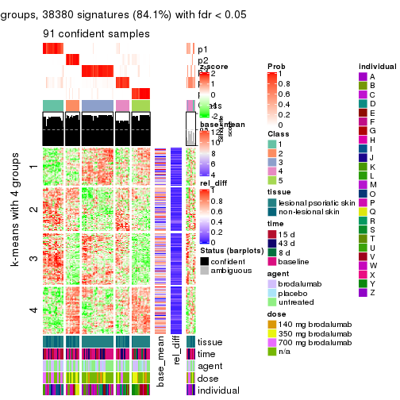</p>

</div>
<div id='tab-CV-pam-get-signatures-5'>
<pre><code class="r">get_signatures(res, k = 6)
</code></pre>

<p></p>

</div>
</div>


Signature heatmaps where rows are not scaled:


<script>
$( function() {
	$( '#tabs-CV-pam-get-signatures-no-scale' ).tabs();
} );
</script>
<div id='tabs-CV-pam-get-signatures-no-scale'>
<ul>
<li><a href='#tab-CV-pam-get-signatures-no-scale-1'>k = 2</a></li>
<li><a href='#tab-CV-pam-get-signatures-no-scale-2'>k = 3</a></li>
<li><a href='#tab-CV-pam-get-signatures-no-scale-3'>k = 4</a></li>
<li><a href='#tab-CV-pam-get-signatures-no-scale-4'>k = 5</a></li>
<li><a href='#tab-CV-pam-get-signatures-no-scale-5'>k = 6</a></li>
</ul>
<div id='tab-CV-pam-get-signatures-no-scale-1'>
<pre><code class="r">get_signatures(res, k = 2, scale_rows = FALSE)
</code></pre>

<p></p>

</div>
<div id='tab-CV-pam-get-signatures-no-scale-2'>
<pre><code class="r">get_signatures(res, k = 3, scale_rows = FALSE)
</code></pre>

<p></p>

</div>
<div id='tab-CV-pam-get-signatures-no-scale-3'>
<pre><code class="r">get_signatures(res, k = 4, scale_rows = FALSE)
</code></pre>

<p></p>

</div>
<div id='tab-CV-pam-get-signatures-no-scale-4'>
<pre><code class="r">get_signatures(res, k = 5, scale_rows = FALSE)
</code></pre>

<p></p>

</div>
<div id='tab-CV-pam-get-signatures-no-scale-5'>
<pre><code class="r">get_signatures(res, k = 6, scale_rows = FALSE)
</code></pre>

<p></p>

</div>
</div>


Compare the overlap of signatures from different k:

```r
compare_signatures(res)
```


`get_signature()` returns a data frame invisibly. TO get the list of signatures, the function
call should be assigned to a variable explicitly. In following code, if `plot` argument is set
to `FALSE`, no heatmap is plotted while only the differential analysis is performed.

```r
# code only for demonstration
tb = get_signature(res, k = ..., plot = FALSE)
```

An example of the output of `tb` is:

```
#>   which_row         fdr    mean_1    mean_2 scaled_mean_1 scaled_mean_2 km
#> 1        38 0.042760348  8.373488  9.131774    -0.5533452     0.5164555  1
#> 2        40 0.018707592  7.106213  8.469186    -0.6173731     0.5762149  1
#> 3        55 0.019134737 10.221463 11.207825    -0.6159697     0.5749050  1
#> 4        59 0.006059896  5.921854  7.869574    -0.6899429     0.6439467  1
#> 5        60 0.018055526  8.928898 10.211722    -0.6204761     0.5791110  1
#> 6        98 0.009384629 15.714769 14.887706     0.6635654    -0.6193277  2
...
```

The columns in `tb` are:

1. `which_row`: row indices corresponding to the input matrix.
2. `fdr`: FDR for the differential test. 
3. `mean_x`: The mean value in group x.
4. `scaled_mean_x`: The mean value in group x after rows are scaled.
5. `km`: Row groups if k-means clustering is applied to rows.


UMAP plot which shows how samples are separated.


<script>
$( function() {
	$( '#tabs-CV-pam-dimension-reduction' ).tabs();
} );
</script>
<div id='tabs-CV-pam-dimension-reduction'>
<ul>
<li><a href='#tab-CV-pam-dimension-reduction-1'>k = 2</a></li>
<li><a href='#tab-CV-pam-dimension-reduction-2'>k = 3</a></li>
<li><a href='#tab-CV-pam-dimension-reduction-3'>k = 4</a></li>
<li><a href='#tab-CV-pam-dimension-reduction-4'>k = 5</a></li>
<li><a href='#tab-CV-pam-dimension-reduction-5'>k = 6</a></li>
</ul>
<div id='tab-CV-pam-dimension-reduction-1'>
<pre><code class="r">dimension_reduction(res, k = 2, method = &quot;UMAP&quot;)
</code></pre>

<p></p>

</div>
<div id='tab-CV-pam-dimension-reduction-2'>
<pre><code class="r">dimension_reduction(res, k = 3, method = &quot;UMAP&quot;)
</code></pre>

<p></p>

</div>
<div id='tab-CV-pam-dimension-reduction-3'>
<pre><code class="r">dimension_reduction(res, k = 4, method = &quot;UMAP&quot;)
</code></pre>

<p></p>

</div>
<div id='tab-CV-pam-dimension-reduction-4'>
<pre><code class="r">dimension_reduction(res, k = 5, method = &quot;UMAP&quot;)
</code></pre>

<p></p>

</div>
<div id='tab-CV-pam-dimension-reduction-5'>
<pre><code class="r">dimension_reduction(res, k = 6, method = &quot;UMAP&quot;)
</code></pre>

<p></p>

</div>
</div>


Following heatmap shows how subgroups are split when increasing `k`:

```r
collect_classes(res)
```


Test correlation between subgroups and known annotations. If the known
annotation is numeric, one-way ANOVA test is applied, and if the known
annotation is discrete, chi-squared contingency table test is applied.

```r
test_to_known_factors(res)
```

```
#>         n tissue(p) time(p) agent(p)  dose(p) individual(p) k
#> CV:pam 50  1.63e-03  0.5101   0.1135 3.30e-03      2.09e-02 2
#> CV:pam 92  1.82e-02  0.0418   0.0275 1.28e-07      1.84e-07 3
#> CV:pam 77  1.40e-06  0.0353   0.0924 1.15e-05      1.01e-04 4
#> CV:pam 91  1.70e-05  0.1135   0.1798 8.52e-08      1.82e-08 5
#> CV:pam 85  1.20e-04  0.3799   0.3805 1.59e-06      1.98e-08 6
```


If matrix rows can be associated to genes, consider to use `functional_enrichment(res,
...)` to perform function enrichment for the signature genes. See [this vignette](http://bioconductor.org/packages/devel/bioc/vignettes/cola/inst/doc/functional_enrichment.html) for more detailed explanations.


 

---------------------------------------------------


### CV:mclust


The object with results only for a single top-value method and a single partition method 
can be extracted as:

```r
res = res_list["CV", "mclust"]
# you can also extract it by
# res = res_list["CV:mclust"]
```

A summary of `res` and all the functions that can be applied to it:

```r
res
```

```
#> A 'ConsensusPartition' object with k = 2, 3, 4, 5, 6.
#>   On a matrix with 45638 rows and 99 columns.
#>   Top rows (1000, 2000, 3000, 4000, 5000) are extracted by 'CV' method.
#>   Subgroups are detected by 'mclust' method.
#>   Performed in total 1250 partitions by row resampling.
#>   Best k for subgroups seems to be 3.
#> 
#> Following methods can be applied to this 'ConsensusPartition' object:
#>  [1] "cola_report"             "collect_classes"         "collect_plots"          
#>  [4] "collect_stats"           "colnames"                "compare_signatures"     
#>  [7] "consensus_heatmap"       "dimension_reduction"     "functional_enrichment"  
#> [10] "get_anno_col"            "get_anno"                "get_classes"            
#> [13] "get_consensus"           "get_matrix"              "get_membership"         
#> [16] "get_param"               "get_signatures"          "get_stats"              
#> [19] "is_best_k"               "is_stable_k"             "membership_heatmap"     
#> [22] "ncol"                    "nrow"                    "plot_ecdf"              
#> [25] "rownames"                "select_partition_number" "show"                   
#> [28] "suggest_best_k"          "test_to_known_factors"
```

`collect_plots()` function collects all the plots made from `res` for all `k` (number of partitions)
into one single page to provide an easy and fast comparison between different `k`.

```r
collect_plots(res)
```


The plots are:

- The first row: a plot of the ECDF (empirical cumulative distribution
  function) curves of the consensus matrix for each `k` and the heatmap of
  predicted classes for each `k`.
- The second row: heatmaps of the consensus matrix for each `k`.
- The third row: heatmaps of the membership matrix for each `k`.
- The fouth row: heatmaps of the signatures for each `k`.

All the plots in panels can be made by individual functions and they are
plotted later in this section.

`select_partition_number()` produces several plots showing different
statistics for choosing "optimized" `k`. There are following statistics:

- ECDF curves of the consensus matrix for each `k`;
- 1-PAC. [The PAC
  score](https://en.wikipedia.org/wiki/Consensus_clustering#Over-interpretation_potential_of_consensus_clustering)
  measures the proportion of the ambiguous subgrouping.
- Mean silhouette score.
- Concordance. The mean probability of fiting the consensus class ids in all
  partitions.
- Area increased. Denote $A_k$ as the area under the ECDF curve for current
  `k`, the area increased is defined as $A_k - A_{k-1}$.
- Rand index. The percent of pairs of samples that are both in a same cluster
  or both are not in a same cluster in the partition of k and k-1.
- Jaccard index. The ratio of pairs of samples are both in a same cluster in
  the partition of k and k-1 and the pairs of samples are both in a same
  cluster in the partition k or k-1.

The detailed explanations of these statistics can be found in [the _cola_
vignette](http://bioconductor.org/packages/devel/bioc/vignettes/cola/inst/doc/cola.html#toc_13).

Generally speaking, lower PAC score, higher mean silhouette score or higher
concordance corresponds to better partition. Rand index and Jaccard index
measure how similar the current partition is compared to partition with `k-1`.
If they are too similar, we won't accept `k` is better than `k-1`.

```r
select_partition_number(res)
```


The numeric values for all these statistics can be obtained by `get_stats()`.

```r
get_stats(res)
```

```
#>   k 1-PAC mean_silhouette concordance area_increased  Rand Jaccard
#> 2 2 0.450           0.635       0.764         0.3760 0.640   0.640
#> 3 3 0.479           0.768       0.837         0.6407 0.593   0.407
#> 4 4 0.522           0.594       0.735         0.1666 0.797   0.482
#> 5 5 0.566           0.638       0.761         0.0619 0.843   0.495
#> 6 6 0.724           0.763       0.845         0.0650 0.852   0.449
```

`suggest_best_k()` suggests the best $k$ based on these statistics. The rules are as follows:

- All $k$ with Jaccard index larger than 0.95 are removed because increasing
  $k$ does not provide enough extra information. If all $k$ are removed, it is
  marked as no subgroup is detected.
- For all $k$ with 1-PAC score larger than 0.9, the maximal $k$ is taken as
  the best $k$, and other $k$ are marked as optional $k$.
- If it does not fit the second rule. The $k$ with the maximal vote of the
  highest 1-PAC score, highest mean silhouette, and highest concordance is
  taken as the best $k$.

```r
suggest_best_k(res)
```

```
#> [1] 3
```


Following shows the table of the partitions (You need to click the **show/hide
code output** link to see it). The membership matrix (columns with name `p*`)
is inferred by
[`clue::cl_consensus()`](https://www.rdocumentation.org/link/cl_consensus?package=clue)
function with the `SE` method. Basically the value in the membership matrix
represents the probability to belong to a certain group. The finall class
label for an item is determined with the group with highest probability it
belongs to.

In `get_classes()` function, the entropy is calculated from the membership
matrix and the silhouette score is calculated from the consensus matrix.


<script>
$( function() {
	$( '#tabs-CV-mclust-get-classes' ).tabs();
} );
</script>
<div id='tabs-CV-mclust-get-classes'>
<ul>
<li><a href='#tab-CV-mclust-get-classes-1'>k = 2</a></li>
<li><a href='#tab-CV-mclust-get-classes-2'>k = 3</a></li>
<li><a href='#tab-CV-mclust-get-classes-3'>k = 4</a></li>
<li><a href='#tab-CV-mclust-get-classes-4'>k = 5</a></li>
<li><a href='#tab-CV-mclust-get-classes-5'>k = 6</a></li>
</ul>

<div id='tab-CV-mclust-get-classes-1'>
<p><a id='tab-CV-mclust-get-classes-1-a' style='color:#0366d6' href='#'>show/hide code output</a></p>
<pre><code class="r">cbind(get_classes(res, k = 2), get_membership(res, k = 2))
</code></pre>

<pre><code>#&gt;            class entropy silhouette    p1    p2
#&gt; GSM1296094     2   0.995      0.598 0.460 0.540
#&gt; GSM1296119     2   0.456      0.647 0.096 0.904
#&gt; GSM1296076     2   0.980      0.628 0.416 0.584
#&gt; GSM1296092     2   0.980      0.628 0.416 0.584
#&gt; GSM1296103     2   0.995      0.598 0.460 0.540
#&gt; GSM1296078     2   0.980      0.628 0.416 0.584
#&gt; GSM1296107     2   0.184      0.630 0.028 0.972
#&gt; GSM1296109     2   0.980      0.605 0.416 0.584
#&gt; GSM1296080     2   0.995      0.598 0.460 0.540
#&gt; GSM1296090     2   0.980      0.628 0.416 0.584
#&gt; GSM1296074     2   0.980      0.628 0.416 0.584
#&gt; GSM1296111     2   0.184      0.630 0.028 0.972
#&gt; GSM1296099     2   0.995      0.598 0.460 0.540
#&gt; GSM1296086     2   0.969      0.619 0.396 0.604
#&gt; GSM1296117     2   0.184      0.630 0.028 0.972
#&gt; GSM1296113     2   0.184      0.630 0.028 0.972
#&gt; GSM1296096     2   0.995      0.598 0.460 0.540
#&gt; GSM1296105     2   0.995      0.598 0.460 0.540
#&gt; GSM1296098     2   0.995      0.598 0.460 0.540
#&gt; GSM1296101     2   0.987      0.591 0.432 0.568
#&gt; GSM1296121     2   0.358      0.643 0.068 0.932
#&gt; GSM1296088     2   0.987      0.591 0.432 0.568
#&gt; GSM1296082     2   0.980      0.628 0.416 0.584
#&gt; GSM1296115     2   0.000      0.616 0.000 1.000
#&gt; GSM1296084     2   0.995      0.598 0.460 0.540
#&gt; GSM1296072     2   0.456      0.647 0.096 0.904
#&gt; GSM1296069     2   0.184      0.630 0.028 0.972
#&gt; GSM1296071     2   0.184      0.630 0.028 0.972
#&gt; GSM1296070     2   0.000      0.616 0.000 1.000
#&gt; GSM1296073     2   0.358      0.643 0.068 0.932
#&gt; GSM1296034     2   0.999      0.553 0.484 0.516
#&gt; GSM1296041     2   0.184      0.630 0.028 0.972
#&gt; GSM1296035     2   0.995      0.598 0.460 0.540
#&gt; GSM1296038     2   0.980      0.608 0.416 0.584
#&gt; GSM1296047     2   0.456      0.647 0.096 0.904
#&gt; GSM1296039     2   0.991      0.612 0.444 0.556
#&gt; GSM1296042     2   0.000      0.616 0.000 1.000
#&gt; GSM1296043     2   0.184      0.630 0.028 0.972
#&gt; GSM1296037     1   0.000      0.871 1.000 0.000
#&gt; GSM1296046     2   0.184      0.630 0.028 0.972
#&gt; GSM1296044     2   0.184      0.630 0.028 0.972
#&gt; GSM1296045     2   0.000      0.616 0.000 1.000
#&gt; GSM1296025     1   0.000      0.871 1.000 0.000
#&gt; GSM1296033     2   0.995      0.598 0.460 0.540
#&gt; GSM1296027     1   0.000      0.871 1.000 0.000
#&gt; GSM1296032     1   0.000      0.871 1.000 0.000
#&gt; GSM1296024     1   0.000      0.871 1.000 0.000
#&gt; GSM1296031     1   0.662      0.686 0.828 0.172
#&gt; GSM1296028     1   0.000      0.871 1.000 0.000
#&gt; GSM1296029     1   0.388      0.792 0.924 0.076
#&gt; GSM1296026     2   0.995      0.598 0.460 0.540
#&gt; GSM1296030     2   0.987      0.591 0.432 0.568
#&gt; GSM1296040     2   0.995      0.598 0.460 0.540
#&gt; GSM1296036     2   0.995      0.598 0.460 0.540
#&gt; GSM1296048     2   0.358      0.643 0.068 0.932
#&gt; GSM1296059     2   0.995      0.598 0.460 0.540
#&gt; GSM1296066     2   0.184      0.630 0.028 0.972
#&gt; GSM1296060     2   0.995      0.598 0.460 0.540
#&gt; GSM1296063     2   0.358      0.643 0.068 0.932
#&gt; GSM1296064     2   0.983      0.625 0.424 0.576
#&gt; GSM1296067     2   0.358      0.643 0.068 0.932
#&gt; GSM1296062     2   0.995      0.598 0.460 0.540
#&gt; GSM1296068     2   0.184      0.630 0.028 0.972
#&gt; GSM1296050     1   0.980     -0.287 0.584 0.416
#&gt; GSM1296057     2   0.995      0.598 0.460 0.540
#&gt; GSM1296052     1   0.000      0.871 1.000 0.000
#&gt; GSM1296054     1   0.000      0.871 1.000 0.000
#&gt; GSM1296049     1   0.000      0.871 1.000 0.000
#&gt; GSM1296055     2   0.975      0.613 0.408 0.592
#&gt; GSM1296053     1   0.000      0.871 1.000 0.000
#&gt; GSM1296058     2   0.988      0.593 0.436 0.564
#&gt; GSM1296051     2   0.980      0.628 0.416 0.584
#&gt; GSM1296056     2   0.981      0.605 0.420 0.580
#&gt; GSM1296065     2   0.821      0.642 0.256 0.744
#&gt; GSM1296061     2   0.995      0.598 0.460 0.540
#&gt; GSM1296095     2   0.963      0.632 0.388 0.612
#&gt; GSM1296120     2   0.456      0.647 0.096 0.904
#&gt; GSM1296077     1   0.000      0.871 1.000 0.000
#&gt; GSM1296093     1   0.000      0.871 1.000 0.000
#&gt; GSM1296104     2   0.991      0.612 0.444 0.556
#&gt; GSM1296079     1   0.000      0.871 1.000 0.000
#&gt; GSM1296108     2   0.184      0.630 0.028 0.972
#&gt; GSM1296110     2   0.000      0.616 0.000 1.000
#&gt; GSM1296081     1   0.000      0.871 1.000 0.000
#&gt; GSM1296091     1   0.988     -0.355 0.564 0.436
#&gt; GSM1296075     2   0.985      0.622 0.428 0.572
#&gt; GSM1296112     2   0.184      0.630 0.028 0.972
#&gt; GSM1296100     1   0.343      0.805 0.936 0.064
#&gt; GSM1296087     1   0.990     -0.266 0.560 0.440
#&gt; GSM1296118     2   0.184      0.630 0.028 0.972
#&gt; GSM1296114     2   0.184      0.630 0.028 0.972
#&gt; GSM1296097     2   0.992      0.609 0.448 0.552
#&gt; GSM1296106     2   0.827      0.640 0.260 0.740
#&gt; GSM1296102     2   0.992      0.564 0.448 0.552
#&gt; GSM1296122     2   0.358      0.643 0.068 0.932
#&gt; GSM1296089     1   0.730      0.621 0.796 0.204
#&gt; GSM1296083     1   0.000      0.871 1.000 0.000
#&gt; GSM1296116     2   0.000      0.616 0.000 1.000
#&gt; GSM1296085     1   0.000      0.871 1.000 0.000
</code></pre>

<script>
$('#tab-CV-mclust-get-classes-1-a').parent().next().next().hide();
$('#tab-CV-mclust-get-classes-1-a').click(function(){
  $('#tab-CV-mclust-get-classes-1-a').parent().next().next().toggle();
  return(false);
});
</script>
</div>

<div id='tab-CV-mclust-get-classes-2'>
<p><a id='tab-CV-mclust-get-classes-2-a' style='color:#0366d6' href='#'>show/hide code output</a></p>
<pre><code class="r">cbind(get_classes(res, k = 3), get_membership(res, k = 3))
</code></pre>

<pre><code>#&gt;            class entropy silhouette    p1    p2    p3
#&gt; GSM1296094     3  0.2492      0.904 0.016 0.048 0.936
#&gt; GSM1296119     2  0.4062      0.877 0.000 0.836 0.164
#&gt; GSM1296076     3  0.2550      0.904 0.024 0.040 0.936
#&gt; GSM1296092     3  0.2550      0.904 0.024 0.040 0.936
#&gt; GSM1296103     3  0.0747      0.882 0.016 0.000 0.984
#&gt; GSM1296078     3  0.2550      0.904 0.024 0.040 0.936
#&gt; GSM1296107     2  0.3482      0.893 0.000 0.872 0.128
#&gt; GSM1296109     3  0.3941      0.835 0.000 0.156 0.844
#&gt; GSM1296080     3  0.3670      0.898 0.020 0.092 0.888
#&gt; GSM1296090     3  0.2550      0.904 0.024 0.040 0.936
#&gt; GSM1296074     3  0.2550      0.904 0.024 0.040 0.936
#&gt; GSM1296111     2  0.3482      0.893 0.000 0.872 0.128
#&gt; GSM1296099     3  0.1636      0.894 0.016 0.020 0.964
#&gt; GSM1296086     3  0.3375      0.891 0.008 0.100 0.892
#&gt; GSM1296117     2  0.3482      0.893 0.000 0.872 0.128
#&gt; GSM1296113     2  0.3482      0.893 0.000 0.872 0.128
#&gt; GSM1296096     3  0.0747      0.882 0.016 0.000 0.984
#&gt; GSM1296105     1  0.8581      0.223 0.456 0.096 0.448
#&gt; GSM1296098     3  0.3091      0.904 0.016 0.072 0.912
#&gt; GSM1296101     3  0.2261      0.902 0.000 0.068 0.932
#&gt; GSM1296121     2  0.4346      0.871 0.000 0.816 0.184
#&gt; GSM1296088     3  0.3295      0.895 0.008 0.096 0.896
#&gt; GSM1296082     3  0.2550      0.904 0.024 0.040 0.936
#&gt; GSM1296115     2  0.3752      0.891 0.000 0.856 0.144
#&gt; GSM1296084     3  0.4683      0.867 0.024 0.140 0.836
#&gt; GSM1296072     2  0.4062      0.877 0.000 0.836 0.164
#&gt; GSM1296069     2  0.3340      0.892 0.000 0.880 0.120
#&gt; GSM1296071     2  0.0237      0.832 0.000 0.996 0.004
#&gt; GSM1296070     2  0.3752      0.891 0.000 0.856 0.144
#&gt; GSM1296073     2  0.4555      0.858 0.000 0.800 0.200
#&gt; GSM1296034     1  0.8236      0.332 0.508 0.076 0.416
#&gt; GSM1296041     2  0.3482      0.893 0.000 0.872 0.128
#&gt; GSM1296035     3  0.0747      0.882 0.016 0.000 0.984
#&gt; GSM1296038     3  0.6521     -0.185 0.004 0.496 0.500
#&gt; GSM1296047     2  0.3816      0.885 0.000 0.852 0.148
#&gt; GSM1296039     3  0.2414      0.905 0.020 0.040 0.940
#&gt; GSM1296042     2  0.3752      0.891 0.000 0.856 0.144
#&gt; GSM1296043     2  0.2878      0.884 0.000 0.904 0.096
#&gt; GSM1296037     1  0.0424      0.765 0.992 0.000 0.008
#&gt; GSM1296046     2  0.0592      0.837 0.000 0.988 0.012
#&gt; GSM1296044     2  0.0000      0.828 0.000 1.000 0.000
#&gt; GSM1296045     2  0.3619      0.892 0.000 0.864 0.136
#&gt; GSM1296025     1  0.0000      0.767 1.000 0.000 0.000
#&gt; GSM1296033     1  0.8939      0.384 0.520 0.140 0.340
#&gt; GSM1296027     1  0.0424      0.766 0.992 0.008 0.000
#&gt; GSM1296032     1  0.0000      0.767 1.000 0.000 0.000
#&gt; GSM1296024     1  0.0000      0.767 1.000 0.000 0.000
#&gt; GSM1296031     1  0.4966      0.720 0.840 0.100 0.060
#&gt; GSM1296028     1  0.0747      0.765 0.984 0.016 0.000
#&gt; GSM1296029     1  0.3129      0.740 0.904 0.088 0.008
#&gt; GSM1296026     3  0.4799      0.872 0.032 0.132 0.836
#&gt; GSM1296030     3  0.4411      0.855 0.016 0.140 0.844
#&gt; GSM1296040     3  0.3359      0.901 0.016 0.084 0.900
#&gt; GSM1296036     3  0.3091      0.904 0.016 0.072 0.912
#&gt; GSM1296048     2  0.4346      0.871 0.000 0.816 0.184
#&gt; GSM1296059     3  0.0747      0.882 0.016 0.000 0.984
#&gt; GSM1296066     2  0.3482      0.893 0.000 0.872 0.128
#&gt; GSM1296060     3  0.2703      0.906 0.016 0.056 0.928
#&gt; GSM1296063     2  0.5982      0.654 0.004 0.668 0.328
#&gt; GSM1296064     3  0.2414      0.905 0.020 0.040 0.940
#&gt; GSM1296067     2  0.4178      0.878 0.000 0.828 0.172
#&gt; GSM1296062     3  0.3528      0.897 0.016 0.092 0.892
#&gt; GSM1296068     2  0.0000      0.828 0.000 1.000 0.000
#&gt; GSM1296050     1  0.6902      0.642 0.732 0.100 0.168
#&gt; GSM1296057     1  0.9030      0.393 0.520 0.152 0.328
#&gt; GSM1296052     1  0.0000      0.767 1.000 0.000 0.000
#&gt; GSM1296054     1  0.0000      0.767 1.000 0.000 0.000
#&gt; GSM1296049     1  0.0000      0.767 1.000 0.000 0.000
#&gt; GSM1296055     1  0.9189      0.377 0.492 0.160 0.348
#&gt; GSM1296053     1  0.0000      0.767 1.000 0.000 0.000
#&gt; GSM1296058     1  0.9074      0.388 0.516 0.156 0.328
#&gt; GSM1296051     3  0.3742      0.900 0.036 0.072 0.892
#&gt; GSM1296056     3  0.3826      0.874 0.008 0.124 0.868
#&gt; GSM1296065     2  0.6859      0.533 0.024 0.620 0.356
#&gt; GSM1296061     3  0.3445      0.899 0.016 0.088 0.896
#&gt; GSM1296095     2  0.5785      0.615 0.000 0.668 0.332
#&gt; GSM1296120     2  0.4261      0.883 0.012 0.848 0.140
#&gt; GSM1296077     1  0.0000      0.767 1.000 0.000 0.000
#&gt; GSM1296093     1  0.0000      0.767 1.000 0.000 0.000
#&gt; GSM1296104     2  0.7864      0.509 0.072 0.596 0.332
#&gt; GSM1296079     1  0.0000      0.767 1.000 0.000 0.000
#&gt; GSM1296108     2  0.0000      0.828 0.000 1.000 0.000
#&gt; GSM1296110     2  0.0892      0.831 0.000 0.980 0.020
#&gt; GSM1296081     1  0.0000      0.767 1.000 0.000 0.000
#&gt; GSM1296091     1  0.8349      0.471 0.584 0.108 0.308
#&gt; GSM1296075     1  0.9277      0.382 0.496 0.176 0.328
#&gt; GSM1296112     2  0.0000      0.828 0.000 1.000 0.000
#&gt; GSM1296100     1  0.0747      0.764 0.984 0.000 0.016
#&gt; GSM1296087     1  0.7034      0.647 0.728 0.148 0.124
#&gt; GSM1296118     2  0.3116      0.889 0.000 0.892 0.108
#&gt; GSM1296114     2  0.0000      0.828 0.000 1.000 0.000
#&gt; GSM1296097     1  0.9968      0.149 0.368 0.300 0.332
#&gt; GSM1296106     1  0.9920      0.214 0.388 0.280 0.332
#&gt; GSM1296102     1  0.9062      0.410 0.512 0.152 0.336
#&gt; GSM1296122     2  0.5901      0.832 0.040 0.768 0.192
#&gt; GSM1296089     1  0.5191      0.715 0.828 0.112 0.060
#&gt; GSM1296083     1  0.0000      0.767 1.000 0.000 0.000
#&gt; GSM1296116     2  0.1163      0.837 0.000 0.972 0.028
#&gt; GSM1296085     1  0.0000      0.767 1.000 0.000 0.000
</code></pre>

<script>
$('#tab-CV-mclust-get-classes-2-a').parent().next().next().hide();
$('#tab-CV-mclust-get-classes-2-a').click(function(){
  $('#tab-CV-mclust-get-classes-2-a').parent().next().next().toggle();
  return(false);
});
</script>
</div>

<div id='tab-CV-mclust-get-classes-3'>
<p><a id='tab-CV-mclust-get-classes-3-a' style='color:#0366d6' href='#'>show/hide code output</a></p>
<pre><code class="r">cbind(get_classes(res, k = 4), get_membership(res, k = 4))
</code></pre>

<pre><code>#&gt;            class entropy silhouette    p1    p2    p3    p4
#&gt; GSM1296094     3  0.0657    0.83581 0.000 0.004 0.984 0.012
#&gt; GSM1296119     4  0.7154   -0.07427 0.000 0.428 0.132 0.440
#&gt; GSM1296076     4  0.4284    0.55113 0.020 0.000 0.200 0.780
#&gt; GSM1296092     4  0.5494    0.51617 0.076 0.000 0.208 0.716
#&gt; GSM1296103     3  0.0592    0.83471 0.000 0.000 0.984 0.016
#&gt; GSM1296078     4  0.4284    0.55113 0.020 0.000 0.200 0.780
#&gt; GSM1296107     2  0.3306    0.81871 0.000 0.840 0.004 0.156
#&gt; GSM1296109     4  0.5938    0.10795 0.008 0.024 0.424 0.544
#&gt; GSM1296080     3  0.7725   -0.00691 0.296 0.004 0.476 0.224
#&gt; GSM1296090     4  0.4361    0.54532 0.020 0.000 0.208 0.772
#&gt; GSM1296074     4  0.4361    0.54532 0.020 0.000 0.208 0.772
#&gt; GSM1296111     2  0.3157    0.82257 0.000 0.852 0.004 0.144
#&gt; GSM1296099     3  0.0817    0.83332 0.000 0.000 0.976 0.024
#&gt; GSM1296086     4  0.3984    0.56048 0.040 0.000 0.132 0.828
#&gt; GSM1296117     2  0.3257    0.82026 0.000 0.844 0.004 0.152
#&gt; GSM1296113     2  0.3157    0.82257 0.000 0.852 0.004 0.144
#&gt; GSM1296096     3  0.1022    0.82791 0.000 0.000 0.968 0.032
#&gt; GSM1296105     3  0.7407   -0.00798 0.176 0.004 0.524 0.296
#&gt; GSM1296098     3  0.0524    0.83257 0.000 0.004 0.988 0.008
#&gt; GSM1296101     3  0.2345    0.75664 0.000 0.000 0.900 0.100
#&gt; GSM1296121     4  0.7002    0.06574 0.000 0.352 0.128 0.520
#&gt; GSM1296088     4  0.7080    0.39503 0.236 0.000 0.196 0.568
#&gt; GSM1296082     4  0.4361    0.54532 0.020 0.000 0.208 0.772
#&gt; GSM1296115     2  0.3801    0.79166 0.000 0.780 0.000 0.220
#&gt; GSM1296084     1  0.7661    0.12241 0.464 0.004 0.192 0.340
#&gt; GSM1296072     2  0.7415    0.03163 0.008 0.500 0.140 0.352
#&gt; GSM1296069     2  0.2593    0.83068 0.000 0.892 0.004 0.104
#&gt; GSM1296071     2  0.0188    0.82790 0.000 0.996 0.000 0.004
#&gt; GSM1296070     2  0.3688    0.79744 0.000 0.792 0.000 0.208
#&gt; GSM1296073     4  0.5280    0.51787 0.000 0.120 0.128 0.752
#&gt; GSM1296034     3  0.4949    0.58684 0.180 0.000 0.760 0.060
#&gt; GSM1296041     2  0.3208    0.82153 0.000 0.848 0.004 0.148
#&gt; GSM1296035     3  0.1022    0.82791 0.000 0.000 0.968 0.032
#&gt; GSM1296038     4  0.5441    0.49571 0.016 0.008 0.332 0.644
#&gt; GSM1296047     2  0.7332    0.00115 0.008 0.520 0.136 0.336
#&gt; GSM1296039     4  0.4790    0.48038 0.000 0.000 0.380 0.620
#&gt; GSM1296042     2  0.3764    0.79361 0.000 0.784 0.000 0.216
#&gt; GSM1296043     2  0.0592    0.82921 0.000 0.984 0.000 0.016
#&gt; GSM1296037     1  0.4168    0.65890 0.828 0.000 0.080 0.092
#&gt; GSM1296046     2  0.0188    0.82790 0.000 0.996 0.000 0.004
#&gt; GSM1296044     2  0.0000    0.82687 0.000 1.000 0.000 0.000
#&gt; GSM1296045     2  0.2589    0.81359 0.000 0.884 0.000 0.116
#&gt; GSM1296025     1  0.0000    0.75826 1.000 0.000 0.000 0.000
#&gt; GSM1296033     1  0.6376    0.48066 0.608 0.004 0.076 0.312
#&gt; GSM1296027     1  0.0592    0.75694 0.984 0.000 0.000 0.016
#&gt; GSM1296032     1  0.0469    0.75748 0.988 0.000 0.000 0.012
#&gt; GSM1296024     1  0.0000    0.75826 1.000 0.000 0.000 0.000
#&gt; GSM1296031     1  0.4585    0.56631 0.668 0.000 0.000 0.332
#&gt; GSM1296028     1  0.2345    0.72758 0.900 0.000 0.000 0.100
#&gt; GSM1296029     1  0.3855    0.69263 0.820 0.004 0.012 0.164
#&gt; GSM1296026     4  0.7487    0.33886 0.280 0.004 0.196 0.520
#&gt; GSM1296030     1  0.7015    0.22113 0.484 0.000 0.120 0.396
#&gt; GSM1296040     3  0.0779    0.83582 0.000 0.004 0.980 0.016
#&gt; GSM1296036     3  0.0524    0.83257 0.000 0.004 0.988 0.008
#&gt; GSM1296048     4  0.6939    0.11766 0.000 0.332 0.128 0.540
#&gt; GSM1296059     3  0.0707    0.83418 0.000 0.000 0.980 0.020
#&gt; GSM1296066     2  0.3157    0.82257 0.000 0.852 0.004 0.144
#&gt; GSM1296060     3  0.3649    0.54423 0.000 0.000 0.796 0.204
#&gt; GSM1296063     4  0.4100    0.54754 0.000 0.036 0.148 0.816
#&gt; GSM1296064     4  0.4761    0.48877 0.000 0.000 0.372 0.628
#&gt; GSM1296067     2  0.5420    0.40218 0.008 0.628 0.012 0.352
#&gt; GSM1296062     3  0.1697    0.82437 0.016 0.004 0.952 0.028
#&gt; GSM1296068     2  0.0000    0.82687 0.000 1.000 0.000 0.000
#&gt; GSM1296050     1  0.5260    0.37710 0.568 0.004 0.004 0.424
#&gt; GSM1296057     1  0.5369    0.53725 0.652 0.004 0.020 0.324
#&gt; GSM1296052     1  0.0188    0.75717 0.996 0.000 0.000 0.004
#&gt; GSM1296054     1  0.0000    0.75826 1.000 0.000 0.000 0.000
#&gt; GSM1296049     1  0.0000    0.75826 1.000 0.000 0.000 0.000
#&gt; GSM1296055     4  0.7389    0.36003 0.272 0.000 0.212 0.516
#&gt; GSM1296053     1  0.0000    0.75826 1.000 0.000 0.000 0.000
#&gt; GSM1296058     1  0.5601    0.46485 0.596 0.004 0.020 0.380
#&gt; GSM1296051     4  0.5522    0.54773 0.080 0.000 0.204 0.716
#&gt; GSM1296056     4  0.4100    0.57310 0.036 0.000 0.148 0.816
#&gt; GSM1296065     4  0.6375    0.50498 0.012 0.060 0.312 0.616
#&gt; GSM1296061     3  0.0657    0.83159 0.000 0.004 0.984 0.012
#&gt; GSM1296095     4  0.7899    0.44729 0.016 0.188 0.312 0.484
#&gt; GSM1296120     2  0.7230    0.09869 0.008 0.548 0.136 0.308
#&gt; GSM1296077     1  0.0188    0.75835 0.996 0.000 0.000 0.004
#&gt; GSM1296093     1  0.0000    0.75826 1.000 0.000 0.000 0.000
#&gt; GSM1296104     4  0.8151    0.46132 0.204 0.032 0.260 0.504
#&gt; GSM1296079     1  0.0000    0.75826 1.000 0.000 0.000 0.000
#&gt; GSM1296108     2  0.0000    0.82687 0.000 1.000 0.000 0.000
#&gt; GSM1296110     2  0.2011    0.81141 0.000 0.920 0.000 0.080
#&gt; GSM1296081     1  0.0000    0.75826 1.000 0.000 0.000 0.000
#&gt; GSM1296091     1  0.5679    0.46543 0.608 0.008 0.020 0.364
#&gt; GSM1296075     1  0.6834    0.20647 0.484 0.060 0.016 0.440
#&gt; GSM1296112     2  0.0000    0.82687 0.000 1.000 0.000 0.000
#&gt; GSM1296100     1  0.6397    0.41409 0.652 0.000 0.164 0.184
#&gt; GSM1296087     1  0.4477    0.58853 0.688 0.000 0.000 0.312
#&gt; GSM1296118     2  0.2530    0.76014 0.000 0.888 0.000 0.112
#&gt; GSM1296114     2  0.0000    0.82687 0.000 1.000 0.000 0.000
#&gt; GSM1296097     4  0.7769    0.37669 0.264 0.008 0.232 0.496
#&gt; GSM1296106     4  0.9248    0.43784 0.220 0.116 0.228 0.436
#&gt; GSM1296102     4  0.7768    0.31264 0.260 0.000 0.312 0.428
#&gt; GSM1296122     4  0.8121    0.40635 0.048 0.312 0.136 0.504
#&gt; GSM1296089     1  0.4898    0.42682 0.584 0.000 0.000 0.416
#&gt; GSM1296083     1  0.0000    0.75826 1.000 0.000 0.000 0.000
#&gt; GSM1296116     2  0.2011    0.81141 0.000 0.920 0.000 0.080
#&gt; GSM1296085     1  0.0336    0.75792 0.992 0.000 0.000 0.008
</code></pre>

<script>
$('#tab-CV-mclust-get-classes-3-a').parent().next().next().hide();
$('#tab-CV-mclust-get-classes-3-a').click(function(){
  $('#tab-CV-mclust-get-classes-3-a').parent().next().next().toggle();
  return(false);
});
</script>
</div>

<div id='tab-CV-mclust-get-classes-4'>
<p><a id='tab-CV-mclust-get-classes-4-a' style='color:#0366d6' href='#'>show/hide code output</a></p>
<pre><code class="r">cbind(get_classes(res, k = 5), get_membership(res, k = 5))
</code></pre>

<pre><code>#&gt;            class entropy silhouette    p1    p2    p3    p4    p5
#&gt; GSM1296094     3  0.1121     0.7571 0.000 0.000 0.956 0.044 0.000
#&gt; GSM1296119     5  0.5218     0.6698 0.000 0.120 0.008 0.168 0.704
#&gt; GSM1296076     4  0.1341     0.7252 0.000 0.000 0.056 0.944 0.000
#&gt; GSM1296092     4  0.1341     0.7252 0.000 0.000 0.056 0.944 0.000
#&gt; GSM1296103     3  0.2127     0.7445 0.000 0.000 0.892 0.108 0.000
#&gt; GSM1296078     4  0.1341     0.7252 0.000 0.000 0.056 0.944 0.000
#&gt; GSM1296107     5  0.3305     0.6857 0.000 0.224 0.000 0.000 0.776
#&gt; GSM1296109     3  0.6501     0.4855 0.000 0.076 0.632 0.132 0.160
#&gt; GSM1296080     3  0.3446     0.6493 0.048 0.000 0.840 0.108 0.004
#&gt; GSM1296090     4  0.1341     0.7252 0.000 0.000 0.056 0.944 0.000
#&gt; GSM1296074     4  0.1341     0.7252 0.000 0.000 0.056 0.944 0.000
#&gt; GSM1296111     5  0.3305     0.6857 0.000 0.224 0.000 0.000 0.776
#&gt; GSM1296099     3  0.1732     0.7538 0.000 0.000 0.920 0.080 0.000
#&gt; GSM1296086     4  0.1965     0.6933 0.000 0.000 0.024 0.924 0.052
#&gt; GSM1296117     5  0.3305     0.6857 0.000 0.224 0.000 0.000 0.776
#&gt; GSM1296113     5  0.3305     0.6857 0.000 0.224 0.000 0.000 0.776
#&gt; GSM1296096     3  0.2773     0.7098 0.000 0.000 0.836 0.164 0.000
#&gt; GSM1296105     3  0.6448     0.0447 0.336 0.000 0.524 0.120 0.020
#&gt; GSM1296098     3  0.0510     0.7600 0.000 0.000 0.984 0.016 0.000
#&gt; GSM1296101     3  0.3146     0.7270 0.000 0.000 0.856 0.092 0.052
#&gt; GSM1296121     5  0.4777     0.6575 0.000 0.064 0.012 0.188 0.736
#&gt; GSM1296088     4  0.5938     0.4861 0.032 0.000 0.336 0.576 0.056
#&gt; GSM1296082     4  0.1341     0.7252 0.000 0.000 0.056 0.944 0.000
#&gt; GSM1296115     5  0.3461     0.6835 0.000 0.168 0.004 0.016 0.812
#&gt; GSM1296084     4  0.6917     0.4464 0.056 0.000 0.332 0.504 0.108
#&gt; GSM1296072     5  0.7591     0.4242 0.000 0.164 0.196 0.128 0.512
#&gt; GSM1296069     2  0.4170     0.4393 0.000 0.712 0.004 0.012 0.272
#&gt; GSM1296071     2  0.0162     0.8157 0.000 0.996 0.000 0.000 0.004
#&gt; GSM1296070     5  0.4337     0.6044 0.000 0.284 0.004 0.016 0.696
#&gt; GSM1296073     5  0.6290     0.5461 0.000 0.052 0.104 0.216 0.628
#&gt; GSM1296034     3  0.5569     0.5577 0.140 0.004 0.708 0.120 0.028
#&gt; GSM1296041     5  0.3305     0.6857 0.000 0.224 0.000 0.000 0.776
#&gt; GSM1296035     3  0.2852     0.7023 0.000 0.000 0.828 0.172 0.000
#&gt; GSM1296038     3  0.7603    -0.0217 0.000 0.048 0.396 0.292 0.264
#&gt; GSM1296047     2  0.6373     0.4494 0.000 0.652 0.136 0.112 0.100
#&gt; GSM1296039     4  0.4297     0.6550 0.000 0.000 0.236 0.728 0.036
#&gt; GSM1296042     5  0.3556     0.6837 0.000 0.168 0.004 0.020 0.808
#&gt; GSM1296043     2  0.0510     0.8102 0.000 0.984 0.000 0.000 0.016
#&gt; GSM1296037     1  0.2358     0.7152 0.888 0.000 0.008 0.104 0.000
#&gt; GSM1296046     2  0.0162     0.8150 0.000 0.996 0.000 0.000 0.004
#&gt; GSM1296044     2  0.0000     0.8161 0.000 1.000 0.000 0.000 0.000
#&gt; GSM1296045     2  0.2511     0.7717 0.000 0.892 0.004 0.016 0.088
#&gt; GSM1296025     1  0.0000     0.7431 1.000 0.000 0.000 0.000 0.000
#&gt; GSM1296033     1  0.7642     0.4824 0.492 0.000 0.240 0.140 0.128
#&gt; GSM1296027     1  0.1251     0.7427 0.956 0.000 0.000 0.008 0.036
#&gt; GSM1296032     1  0.0290     0.7434 0.992 0.000 0.000 0.000 0.008
#&gt; GSM1296024     1  0.0000     0.7431 1.000 0.000 0.000 0.000 0.000
#&gt; GSM1296031     1  0.5583     0.6560 0.680 0.000 0.016 0.132 0.172
#&gt; GSM1296028     1  0.2124     0.7352 0.900 0.000 0.000 0.004 0.096
#&gt; GSM1296029     1  0.4231     0.7146 0.800 0.000 0.036 0.036 0.128
#&gt; GSM1296026     4  0.6436     0.4983 0.032 0.000 0.352 0.524 0.092
#&gt; GSM1296030     4  0.7053     0.4784 0.052 0.000 0.268 0.524 0.156
#&gt; GSM1296040     3  0.0162     0.7580 0.000 0.000 0.996 0.004 0.000
#&gt; GSM1296036     3  0.0290     0.7591 0.000 0.000 0.992 0.008 0.000
#&gt; GSM1296048     5  0.4777     0.6575 0.000 0.064 0.012 0.188 0.736
#&gt; GSM1296059     3  0.2329     0.7375 0.000 0.000 0.876 0.124 0.000
#&gt; GSM1296066     5  0.3305     0.6857 0.000 0.224 0.000 0.000 0.776
#&gt; GSM1296060     3  0.3366     0.6239 0.000 0.000 0.768 0.232 0.000
#&gt; GSM1296063     5  0.7158     0.3527 0.000 0.048 0.196 0.244 0.512
#&gt; GSM1296064     4  0.4352     0.6474 0.000 0.000 0.244 0.720 0.036
#&gt; GSM1296067     2  0.5519     0.5860 0.000 0.712 0.040 0.128 0.120
#&gt; GSM1296062     3  0.1952     0.7134 0.004 0.000 0.912 0.084 0.000
#&gt; GSM1296068     2  0.0000     0.8161 0.000 1.000 0.000 0.000 0.000
#&gt; GSM1296050     1  0.6202     0.6470 0.664 0.000 0.076 0.132 0.128
#&gt; GSM1296057     1  0.7690     0.4992 0.492 0.000 0.224 0.152 0.132
#&gt; GSM1296052     1  0.0000     0.7431 1.000 0.000 0.000 0.000 0.000
#&gt; GSM1296054     1  0.0000     0.7431 1.000 0.000 0.000 0.000 0.000
#&gt; GSM1296049     1  0.0000     0.7431 1.000 0.000 0.000 0.000 0.000
#&gt; GSM1296055     1  0.8100     0.4278 0.428 0.000 0.208 0.148 0.216
#&gt; GSM1296053     1  0.0000     0.7431 1.000 0.000 0.000 0.000 0.000
#&gt; GSM1296058     1  0.7972     0.4518 0.456 0.000 0.212 0.168 0.164
#&gt; GSM1296051     4  0.5090     0.6097 0.000 0.004 0.264 0.668 0.064
#&gt; GSM1296056     4  0.4305     0.6605 0.000 0.000 0.200 0.748 0.052
#&gt; GSM1296065     5  0.7361     0.3293 0.000 0.088 0.272 0.136 0.504
#&gt; GSM1296061     3  0.0000     0.7565 0.000 0.000 1.000 0.000 0.000
#&gt; GSM1296095     5  0.7432     0.3639 0.000 0.108 0.264 0.124 0.504
#&gt; GSM1296120     2  0.4952     0.6077 0.000 0.756 0.032 0.112 0.100
#&gt; GSM1296077     1  0.0162     0.7434 0.996 0.000 0.000 0.000 0.004
#&gt; GSM1296093     1  0.0000     0.7431 1.000 0.000 0.000 0.000 0.000
#&gt; GSM1296104     1  0.8298     0.4083 0.412 0.004 0.240 0.172 0.172
#&gt; GSM1296079     1  0.0000     0.7431 1.000 0.000 0.000 0.000 0.000
#&gt; GSM1296108     2  0.0000     0.8161 0.000 1.000 0.000 0.000 0.000
#&gt; GSM1296110     2  0.2074     0.7847 0.000 0.920 0.004 0.016 0.060
#&gt; GSM1296081     1  0.0000     0.7431 1.000 0.000 0.000 0.000 0.000
#&gt; GSM1296091     1  0.7532     0.5245 0.528 0.004 0.216 0.128 0.124
#&gt; GSM1296075     1  0.8568     0.4409 0.436 0.032 0.224 0.180 0.128
#&gt; GSM1296112     2  0.0000     0.8161 0.000 1.000 0.000 0.000 0.000
#&gt; GSM1296100     1  0.3192     0.7015 0.848 0.000 0.040 0.112 0.000
#&gt; GSM1296087     1  0.4319     0.7023 0.772 0.000 0.024 0.028 0.176
#&gt; GSM1296118     2  0.1988     0.7833 0.000 0.928 0.016 0.008 0.048
#&gt; GSM1296114     2  0.0000     0.8161 0.000 1.000 0.000 0.000 0.000
#&gt; GSM1296097     1  0.8214     0.4355 0.428 0.004 0.236 0.160 0.172
#&gt; GSM1296106     1  0.8616     0.4375 0.440 0.040 0.232 0.136 0.152
#&gt; GSM1296102     1  0.7956     0.4331 0.444 0.000 0.248 0.136 0.172
#&gt; GSM1296122     2  0.8052     0.1708 0.004 0.456 0.208 0.132 0.200
#&gt; GSM1296089     1  0.5713     0.6507 0.672 0.000 0.020 0.136 0.172
#&gt; GSM1296083     1  0.0000     0.7431 1.000 0.000 0.000 0.000 0.000
#&gt; GSM1296116     2  0.2074     0.7847 0.000 0.920 0.004 0.016 0.060
#&gt; GSM1296085     1  0.0693     0.7436 0.980 0.000 0.000 0.008 0.012
</code></pre>

<script>
$('#tab-CV-mclust-get-classes-4-a').parent().next().next().hide();
$('#tab-CV-mclust-get-classes-4-a').click(function(){
  $('#tab-CV-mclust-get-classes-4-a').parent().next().next().toggle();
  return(false);
});
</script>
</div>

<div id='tab-CV-mclust-get-classes-5'>
<p><a id='tab-CV-mclust-get-classes-5-a' style='color:#0366d6' href='#'>show/hide code output</a></p>
<pre><code class="r">cbind(get_classes(res, k = 6), get_membership(res, k = 6))
</code></pre>

<pre><code>#&gt;            class entropy silhouette    p1    p2    p3    p4    p5    p6
#&gt; GSM1296094     3  0.1152     0.8682 0.000 0.000 0.952 0.044 0.000 0.004
#&gt; GSM1296119     5  0.2898     0.8326 0.000 0.000 0.016 0.056 0.868 0.060
#&gt; GSM1296076     4  0.1950     0.9131 0.000 0.000 0.024 0.912 0.000 0.064
#&gt; GSM1296092     4  0.2009     0.9116 0.000 0.000 0.024 0.908 0.000 0.068
#&gt; GSM1296103     3  0.2320     0.8576 0.000 0.000 0.864 0.132 0.000 0.004
#&gt; GSM1296078     4  0.1950     0.9131 0.000 0.000 0.024 0.912 0.000 0.064
#&gt; GSM1296107     5  0.0000     0.8623 0.000 0.000 0.000 0.000 1.000 0.000
#&gt; GSM1296109     3  0.5954     0.5273 0.000 0.000 0.624 0.092 0.128 0.156
#&gt; GSM1296080     6  0.4800     0.5131 0.036 0.000 0.380 0.012 0.000 0.572
#&gt; GSM1296090     4  0.1950     0.9131 0.000 0.000 0.024 0.912 0.000 0.064
#&gt; GSM1296074     4  0.1950     0.9131 0.000 0.000 0.024 0.912 0.000 0.064
#&gt; GSM1296111     5  0.0000     0.8623 0.000 0.000 0.000 0.000 1.000 0.000
#&gt; GSM1296099     3  0.1700     0.8711 0.000 0.000 0.916 0.080 0.000 0.004
#&gt; GSM1296086     4  0.2509     0.8518 0.000 0.000 0.036 0.876 0.000 0.088
#&gt; GSM1296117     5  0.0000     0.8623 0.000 0.000 0.000 0.000 1.000 0.000
#&gt; GSM1296113     5  0.0000     0.8623 0.000 0.000 0.000 0.000 1.000 0.000
#&gt; GSM1296096     3  0.2703     0.8298 0.000 0.000 0.824 0.172 0.000 0.004
#&gt; GSM1296105     6  0.2520     0.7579 0.004 0.000 0.152 0.000 0.000 0.844
#&gt; GSM1296098     3  0.1261     0.8653 0.000 0.000 0.952 0.024 0.000 0.024
#&gt; GSM1296101     3  0.2680     0.8194 0.000 0.000 0.860 0.108 0.000 0.032
#&gt; GSM1296121     5  0.4295     0.8139 0.000 0.000 0.048 0.080 0.776 0.096
#&gt; GSM1296088     6  0.5778     0.4012 0.000 0.000 0.320 0.196 0.000 0.484
#&gt; GSM1296082     4  0.1950     0.9131 0.000 0.000 0.024 0.912 0.000 0.064
#&gt; GSM1296115     5  0.2345     0.8570 0.000 0.000 0.036 0.024 0.904 0.036
#&gt; GSM1296084     6  0.3371     0.7668 0.036 0.000 0.116 0.020 0.000 0.828
#&gt; GSM1296072     6  0.5959     0.5465 0.000 0.208 0.012 0.060 0.096 0.624
#&gt; GSM1296069     5  0.4006     0.7336 0.000 0.216 0.008 0.008 0.744 0.024
#&gt; GSM1296071     2  0.0000     0.8538 0.000 1.000 0.000 0.000 0.000 0.000
#&gt; GSM1296070     5  0.4191     0.8154 0.000 0.108 0.036 0.024 0.796 0.036
#&gt; GSM1296073     5  0.4975     0.7741 0.000 0.000 0.052 0.128 0.716 0.104
#&gt; GSM1296034     6  0.4148     0.7495 0.148 0.000 0.108 0.000 0.000 0.744
#&gt; GSM1296041     5  0.0000     0.8623 0.000 0.000 0.000 0.000 1.000 0.000
#&gt; GSM1296035     3  0.2703     0.8298 0.000 0.000 0.824 0.172 0.000 0.004
#&gt; GSM1296038     6  0.6123     0.4524 0.000 0.000 0.288 0.156 0.032 0.524
#&gt; GSM1296047     2  0.5059     0.2047 0.000 0.540 0.012 0.052 0.000 0.396
#&gt; GSM1296039     4  0.4203     0.7897 0.000 0.000 0.124 0.740 0.000 0.136
#&gt; GSM1296042     5  0.2345     0.8570 0.000 0.000 0.036 0.024 0.904 0.036
#&gt; GSM1296043     2  0.1204     0.8302 0.000 0.944 0.000 0.000 0.056 0.000
#&gt; GSM1296037     1  0.3938     0.4528 0.672 0.000 0.012 0.004 0.000 0.312
#&gt; GSM1296046     2  0.0146     0.8531 0.000 0.996 0.000 0.000 0.004 0.000
#&gt; GSM1296044     2  0.0000     0.8538 0.000 1.000 0.000 0.000 0.000 0.000
#&gt; GSM1296045     2  0.4223     0.7054 0.000 0.784 0.032 0.020 0.132 0.032
#&gt; GSM1296025     1  0.0260     0.8901 0.992 0.000 0.000 0.008 0.000 0.000
#&gt; GSM1296033     6  0.2333     0.7581 0.120 0.000 0.004 0.004 0.000 0.872
#&gt; GSM1296027     1  0.0891     0.8884 0.968 0.000 0.000 0.008 0.000 0.024
#&gt; GSM1296032     1  0.0806     0.8904 0.972 0.000 0.000 0.008 0.000 0.020
#&gt; GSM1296024     1  0.0260     0.8901 0.992 0.000 0.000 0.008 0.000 0.000
#&gt; GSM1296031     6  0.4650     0.6378 0.260 0.000 0.040 0.024 0.000 0.676
#&gt; GSM1296028     1  0.2389     0.7941 0.864 0.000 0.000 0.008 0.000 0.128
#&gt; GSM1296029     1  0.4317     0.0382 0.520 0.000 0.008 0.008 0.000 0.464
#&gt; GSM1296026     6  0.3853     0.7519 0.036 0.000 0.148 0.028 0.000 0.788
#&gt; GSM1296030     6  0.3988     0.7685 0.036 0.000 0.140 0.040 0.000 0.784
#&gt; GSM1296040     3  0.1141     0.8555 0.000 0.000 0.948 0.000 0.000 0.052
#&gt; GSM1296036     3  0.1141     0.8535 0.000 0.000 0.948 0.000 0.000 0.052
#&gt; GSM1296048     5  0.4406     0.8103 0.000 0.000 0.052 0.084 0.768 0.096
#&gt; GSM1296059     3  0.2558     0.8438 0.000 0.000 0.840 0.156 0.000 0.004
#&gt; GSM1296066     5  0.0000     0.8623 0.000 0.000 0.000 0.000 1.000 0.000
#&gt; GSM1296060     3  0.2762     0.8620 0.000 0.000 0.860 0.092 0.000 0.048
#&gt; GSM1296063     5  0.6175     0.5434 0.000 0.000 0.052 0.272 0.544 0.132
#&gt; GSM1296064     4  0.3637     0.7388 0.000 0.000 0.124 0.792 0.000 0.084
#&gt; GSM1296067     2  0.5237     0.5791 0.000 0.644 0.036 0.072 0.000 0.248
#&gt; GSM1296062     6  0.3867     0.3115 0.000 0.000 0.488 0.000 0.000 0.512
#&gt; GSM1296068     2  0.0000     0.8538 0.000 1.000 0.000 0.000 0.000 0.000
#&gt; GSM1296050     6  0.3290     0.6623 0.252 0.000 0.000 0.004 0.000 0.744
#&gt; GSM1296057     6  0.1349     0.7747 0.056 0.000 0.000 0.004 0.000 0.940
#&gt; GSM1296052     1  0.0806     0.8904 0.972 0.000 0.000 0.008 0.000 0.020
#&gt; GSM1296054     1  0.0260     0.8901 0.992 0.000 0.000 0.008 0.000 0.000
#&gt; GSM1296049     1  0.0146     0.8902 0.996 0.000 0.000 0.000 0.000 0.004
#&gt; GSM1296055     6  0.1806     0.7667 0.008 0.000 0.044 0.020 0.000 0.928
#&gt; GSM1296053     1  0.0260     0.8901 0.992 0.000 0.000 0.008 0.000 0.000
#&gt; GSM1296058     6  0.2629     0.7734 0.048 0.000 0.036 0.028 0.000 0.888
#&gt; GSM1296051     6  0.4856     0.4120 0.000 0.000 0.068 0.360 0.000 0.572
#&gt; GSM1296056     4  0.3958     0.7987 0.000 0.000 0.108 0.764 0.000 0.128
#&gt; GSM1296065     6  0.3156     0.7595 0.004 0.004 0.076 0.052 0.008 0.856
#&gt; GSM1296061     3  0.1444     0.8401 0.000 0.000 0.928 0.000 0.000 0.072
#&gt; GSM1296095     6  0.6048     0.5385 0.000 0.008 0.256 0.064 0.084 0.588
#&gt; GSM1296120     2  0.4322     0.6490 0.000 0.720 0.012 0.052 0.000 0.216
#&gt; GSM1296077     1  0.0806     0.8904 0.972 0.000 0.000 0.008 0.000 0.020
#&gt; GSM1296093     1  0.0260     0.8901 0.992 0.000 0.000 0.008 0.000 0.000
#&gt; GSM1296104     6  0.0767     0.7727 0.008 0.004 0.012 0.000 0.000 0.976
#&gt; GSM1296079     1  0.0806     0.8904 0.972 0.000 0.000 0.008 0.000 0.020
#&gt; GSM1296108     2  0.0000     0.8538 0.000 1.000 0.000 0.000 0.000 0.000
#&gt; GSM1296110     2  0.2038     0.8231 0.000 0.920 0.032 0.020 0.000 0.028
#&gt; GSM1296081     1  0.0260     0.8901 0.992 0.000 0.000 0.008 0.000 0.000
#&gt; GSM1296091     6  0.2662     0.7459 0.152 0.004 0.000 0.004 0.000 0.840
#&gt; GSM1296075     6  0.1606     0.7748 0.056 0.008 0.000 0.004 0.000 0.932
#&gt; GSM1296112     2  0.0000     0.8538 0.000 1.000 0.000 0.000 0.000 0.000
#&gt; GSM1296100     1  0.4136     0.1082 0.560 0.000 0.012 0.000 0.000 0.428
#&gt; GSM1296087     6  0.4634     0.6295 0.268 0.000 0.032 0.028 0.000 0.672
#&gt; GSM1296118     2  0.3229     0.7522 0.000 0.816 0.000 0.044 0.000 0.140
#&gt; GSM1296114     2  0.0000     0.8538 0.000 1.000 0.000 0.000 0.000 0.000
#&gt; GSM1296097     6  0.0912     0.7733 0.008 0.004 0.012 0.004 0.000 0.972
#&gt; GSM1296106     6  0.2634     0.7679 0.032 0.012 0.012 0.052 0.000 0.892
#&gt; GSM1296102     6  0.3228     0.7668 0.092 0.000 0.044 0.020 0.000 0.844
#&gt; GSM1296122     6  0.4498     0.6815 0.000 0.136 0.044 0.068 0.000 0.752
#&gt; GSM1296089     6  0.4244     0.7140 0.196 0.000 0.040 0.024 0.000 0.740
#&gt; GSM1296083     1  0.0260     0.8901 0.992 0.000 0.000 0.008 0.000 0.000
#&gt; GSM1296116     2  0.2115     0.8209 0.000 0.916 0.032 0.020 0.000 0.032
#&gt; GSM1296085     1  0.0806     0.8904 0.972 0.000 0.000 0.008 0.000 0.020
</code></pre>

<script>
$('#tab-CV-mclust-get-classes-5-a').parent().next().next().hide();
$('#tab-CV-mclust-get-classes-5-a').click(function(){
  $('#tab-CV-mclust-get-classes-5-a').parent().next().next().toggle();
  return(false);
});
</script>
</div>
</div>

Heatmaps for the consensus matrix. It visualizes the probability of two
samples to be in a same group.


<script>
$( function() {
	$( '#tabs-CV-mclust-consensus-heatmap' ).tabs();
} );
</script>
<div id='tabs-CV-mclust-consensus-heatmap'>
<ul>
<li><a href='#tab-CV-mclust-consensus-heatmap-1'>k = 2</a></li>
<li><a href='#tab-CV-mclust-consensus-heatmap-2'>k = 3</a></li>
<li><a href='#tab-CV-mclust-consensus-heatmap-3'>k = 4</a></li>
<li><a href='#tab-CV-mclust-consensus-heatmap-4'>k = 5</a></li>
<li><a href='#tab-CV-mclust-consensus-heatmap-5'>k = 6</a></li>
</ul>
<div id='tab-CV-mclust-consensus-heatmap-1'>
<pre><code class="r">consensus_heatmap(res, k = 2)
</code></pre>

<p></p>

</div>
<div id='tab-CV-mclust-consensus-heatmap-2'>
<pre><code class="r">consensus_heatmap(res, k = 3)
</code></pre>

<p></p>

</div>
<div id='tab-CV-mclust-consensus-heatmap-3'>
<pre><code class="r">consensus_heatmap(res, k = 4)
</code></pre>

<p>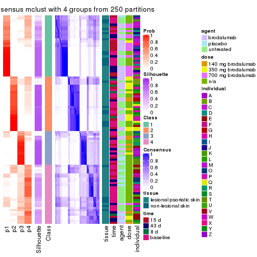</p>

</div>
<div id='tab-CV-mclust-consensus-heatmap-4'>
<pre><code class="r">consensus_heatmap(res, k = 5)
</code></pre>

<p></p>

</div>
<div id='tab-CV-mclust-consensus-heatmap-5'>
<pre><code class="r">consensus_heatmap(res, k = 6)
</code></pre>

<p></p>

</div>
</div>

Heatmaps for the membership of samples in all partitions to see how consistent they are:


<script>
$( function() {
	$( '#tabs-CV-mclust-membership-heatmap' ).tabs();
} );
</script>
<div id='tabs-CV-mclust-membership-heatmap'>
<ul>
<li><a href='#tab-CV-mclust-membership-heatmap-1'>k = 2</a></li>
<li><a href='#tab-CV-mclust-membership-heatmap-2'>k = 3</a></li>
<li><a href='#tab-CV-mclust-membership-heatmap-3'>k = 4</a></li>
<li><a href='#tab-CV-mclust-membership-heatmap-4'>k = 5</a></li>
<li><a href='#tab-CV-mclust-membership-heatmap-5'>k = 6</a></li>
</ul>
<div id='tab-CV-mclust-membership-heatmap-1'>
<pre><code class="r">membership_heatmap(res, k = 2)
</code></pre>

<p></p>

</div>
<div id='tab-CV-mclust-membership-heatmap-2'>
<pre><code class="r">membership_heatmap(res, k = 3)
</code></pre>

<p></p>

</div>
<div id='tab-CV-mclust-membership-heatmap-3'>
<pre><code class="r">membership_heatmap(res, k = 4)
</code></pre>

<p></p>

</div>
<div id='tab-CV-mclust-membership-heatmap-4'>
<pre><code class="r">membership_heatmap(res, k = 5)
</code></pre>

<p></p>

</div>
<div id='tab-CV-mclust-membership-heatmap-5'>
<pre><code class="r">membership_heatmap(res, k = 6)
</code></pre>

<p></p>

</div>
</div>

As soon as we have had the classes for columns, we can look for signatures
which are significantly different between classes which can be candidate marks
for certain classes. Following are the heatmaps for signatures.


Signature heatmaps where rows are scaled:


<script>
$( function() {
	$( '#tabs-CV-mclust-get-signatures' ).tabs();
} );
</script>
<div id='tabs-CV-mclust-get-signatures'>
<ul>
<li><a href='#tab-CV-mclust-get-signatures-1'>k = 2</a></li>
<li><a href='#tab-CV-mclust-get-signatures-2'>k = 3</a></li>
<li><a href='#tab-CV-mclust-get-signatures-3'>k = 4</a></li>
<li><a href='#tab-CV-mclust-get-signatures-4'>k = 5</a></li>
<li><a href='#tab-CV-mclust-get-signatures-5'>k = 6</a></li>
</ul>
<div id='tab-CV-mclust-get-signatures-1'>
<pre><code class="r">get_signatures(res, k = 2)
</code></pre>

<p></p>

</div>
<div id='tab-CV-mclust-get-signatures-2'>
<pre><code class="r">get_signatures(res, k = 3)
</code></pre>

<p></p>

</div>
<div id='tab-CV-mclust-get-signatures-3'>
<pre><code class="r">get_signatures(res, k = 4)
</code></pre>

<p></p>

</div>
<div id='tab-CV-mclust-get-signatures-4'>
<pre><code class="r">get_signatures(res, k = 5)
</code></pre>

<p></p>

</div>
<div id='tab-CV-mclust-get-signatures-5'>
<pre><code class="r">get_signatures(res, k = 6)
</code></pre>

<p></p>

</div>
</div>


Signature heatmaps where rows are not scaled:


<script>
$( function() {
	$( '#tabs-CV-mclust-get-signatures-no-scale' ).tabs();
} );
</script>
<div id='tabs-CV-mclust-get-signatures-no-scale'>
<ul>
<li><a href='#tab-CV-mclust-get-signatures-no-scale-1'>k = 2</a></li>
<li><a href='#tab-CV-mclust-get-signatures-no-scale-2'>k = 3</a></li>
<li><a href='#tab-CV-mclust-get-signatures-no-scale-3'>k = 4</a></li>
<li><a href='#tab-CV-mclust-get-signatures-no-scale-4'>k = 5</a></li>
<li><a href='#tab-CV-mclust-get-signatures-no-scale-5'>k = 6</a></li>
</ul>
<div id='tab-CV-mclust-get-signatures-no-scale-1'>
<pre><code class="r">get_signatures(res, k = 2, scale_rows = FALSE)
</code></pre>

<p></p>

</div>
<div id='tab-CV-mclust-get-signatures-no-scale-2'>
<pre><code class="r">get_signatures(res, k = 3, scale_rows = FALSE)
</code></pre>

<p></p>

</div>
<div id='tab-CV-mclust-get-signatures-no-scale-3'>
<pre><code class="r">get_signatures(res, k = 4, scale_rows = FALSE)
</code></pre>

<p></p>

</div>
<div id='tab-CV-mclust-get-signatures-no-scale-4'>
<pre><code class="r">get_signatures(res, k = 5, scale_rows = FALSE)
</code></pre>

<p></p>

</div>
<div id='tab-CV-mclust-get-signatures-no-scale-5'>
<pre><code class="r">get_signatures(res, k = 6, scale_rows = FALSE)
</code></pre>

<p></p>

</div>
</div>


Compare the overlap of signatures from different k:

```r
compare_signatures(res)
```


`get_signature()` returns a data frame invisibly. TO get the list of signatures, the function
call should be assigned to a variable explicitly. In following code, if `plot` argument is set
to `FALSE`, no heatmap is plotted while only the differential analysis is performed.

```r
# code only for demonstration
tb = get_signature(res, k = ..., plot = FALSE)
```

An example of the output of `tb` is:

```
#>   which_row         fdr    mean_1    mean_2 scaled_mean_1 scaled_mean_2 km
#> 1        38 0.042760348  8.373488  9.131774    -0.5533452     0.5164555  1
#> 2        40 0.018707592  7.106213  8.469186    -0.6173731     0.5762149  1
#> 3        55 0.019134737 10.221463 11.207825    -0.6159697     0.5749050  1
#> 4        59 0.006059896  5.921854  7.869574    -0.6899429     0.6439467  1
#> 5        60 0.018055526  8.928898 10.211722    -0.6204761     0.5791110  1
#> 6        98 0.009384629 15.714769 14.887706     0.6635654    -0.6193277  2
...
```

The columns in `tb` are:

1. `which_row`: row indices corresponding to the input matrix.
2. `fdr`: FDR for the differential test. 
3. `mean_x`: The mean value in group x.
4. `scaled_mean_x`: The mean value in group x after rows are scaled.
5. `km`: Row groups if k-means clustering is applied to rows.


UMAP plot which shows how samples are separated.


<script>
$( function() {
	$( '#tabs-CV-mclust-dimension-reduction' ).tabs();
} );
</script>
<div id='tabs-CV-mclust-dimension-reduction'>
<ul>
<li><a href='#tab-CV-mclust-dimension-reduction-1'>k = 2</a></li>
<li><a href='#tab-CV-mclust-dimension-reduction-2'>k = 3</a></li>
<li><a href='#tab-CV-mclust-dimension-reduction-3'>k = 4</a></li>
<li><a href='#tab-CV-mclust-dimension-reduction-4'>k = 5</a></li>
<li><a href='#tab-CV-mclust-dimension-reduction-5'>k = 6</a></li>
</ul>
<div id='tab-CV-mclust-dimension-reduction-1'>
<pre><code class="r">dimension_reduction(res, k = 2, method = &quot;UMAP&quot;)
</code></pre>

<p>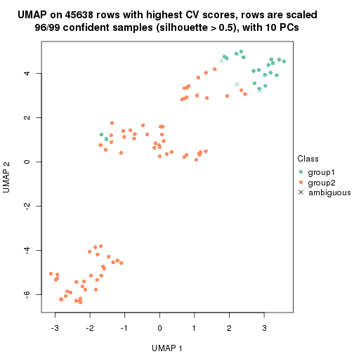</p>

</div>
<div id='tab-CV-mclust-dimension-reduction-2'>
<pre><code class="r">dimension_reduction(res, k = 3, method = &quot;UMAP&quot;)
</code></pre>

<p></p>

</div>
<div id='tab-CV-mclust-dimension-reduction-3'>
<pre><code class="r">dimension_reduction(res, k = 4, method = &quot;UMAP&quot;)
</code></pre>

<p></p>

</div>
<div id='tab-CV-mclust-dimension-reduction-4'>
<pre><code class="r">dimension_reduction(res, k = 5, method = &quot;UMAP&quot;)
</code></pre>

<p></p>

</div>
<div id='tab-CV-mclust-dimension-reduction-5'>
<pre><code class="r">dimension_reduction(res, k = 6, method = &quot;UMAP&quot;)
</code></pre>

<p></p>

</div>
</div>


Following heatmap shows how subgroups are split when increasing `k`:

```r
collect_classes(res)
```


Test correlation between subgroups and known annotations. If the known
annotation is numeric, one-way ANOVA test is applied, and if the known
annotation is discrete, chi-squared contingency table test is applied.

```r
test_to_known_factors(res)
```

```
#>            n tissue(p) time(p) agent(p)  dose(p) individual(p) k
#> CV:mclust 96  0.081160   0.305  0.06788 9.22e-07      5.12e-03 2
#> CV:mclust 87  0.000912   0.109  0.01545 7.11e-09      7.56e-06 3
#> CV:mclust 68  0.015782   0.176  0.00401 3.46e-08      2.54e-07 4
#> CV:mclust 76  0.000111   0.519  0.19781 3.27e-07      1.34e-06 5
#> CV:mclust 91  0.000417   0.691  0.37174 4.40e-07      9.00e-06 6
```


If matrix rows can be associated to genes, consider to use `functional_enrichment(res,
...)` to perform function enrichment for the signature genes. See [this vignette](http://bioconductor.org/packages/devel/bioc/vignettes/cola/inst/doc/functional_enrichment.html) for more detailed explanations.


 

---------------------------------------------------


### CV:NMF*


The object with results only for a single top-value method and a single partition method 
can be extracted as:

```r
res = res_list["CV", "NMF"]
# you can also extract it by
# res = res_list["CV:NMF"]
```

A summary of `res` and all the functions that can be applied to it:

```r
res
```

```
#> A 'ConsensusPartition' object with k = 2, 3, 4, 5, 6.
#>   On a matrix with 45638 rows and 99 columns.
#>   Top rows (1000, 2000, 3000, 4000, 5000) are extracted by 'CV' method.
#>   Subgroups are detected by 'NMF' method.
#>   Performed in total 1250 partitions by row resampling.
#>   Best k for subgroups seems to be 2.
#> 
#> Following methods can be applied to this 'ConsensusPartition' object:
#>  [1] "cola_report"             "collect_classes"         "collect_plots"          
#>  [4] "collect_stats"           "colnames"                "compare_signatures"     
#>  [7] "consensus_heatmap"       "dimension_reduction"     "functional_enrichment"  
#> [10] "get_anno_col"            "get_anno"                "get_classes"            
#> [13] "get_consensus"           "get_matrix"              "get_membership"         
#> [16] "get_param"               "get_signatures"          "get_stats"              
#> [19] "is_best_k"               "is_stable_k"             "membership_heatmap"     
#> [22] "ncol"                    "nrow"                    "plot_ecdf"              
#> [25] "rownames"                "select_partition_number" "show"                   
#> [28] "suggest_best_k"          "test_to_known_factors"
```

`collect_plots()` function collects all the plots made from `res` for all `k` (number of partitions)
into one single page to provide an easy and fast comparison between different `k`.

```r
collect_plots(res)
```


The plots are:

- The first row: a plot of the ECDF (empirical cumulative distribution
  function) curves of the consensus matrix for each `k` and the heatmap of
  predicted classes for each `k`.
- The second row: heatmaps of the consensus matrix for each `k`.
- The third row: heatmaps of the membership matrix for each `k`.
- The fouth row: heatmaps of the signatures for each `k`.

All the plots in panels can be made by individual functions and they are
plotted later in this section.

`select_partition_number()` produces several plots showing different
statistics for choosing "optimized" `k`. There are following statistics:

- ECDF curves of the consensus matrix for each `k`;
- 1-PAC. [The PAC
  score](https://en.wikipedia.org/wiki/Consensus_clustering#Over-interpretation_potential_of_consensus_clustering)
  measures the proportion of the ambiguous subgrouping.
- Mean silhouette score.
- Concordance. The mean probability of fiting the consensus class ids in all
  partitions.
- Area increased. Denote $A_k$ as the area under the ECDF curve for current
  `k`, the area increased is defined as $A_k - A_{k-1}$.
- Rand index. The percent of pairs of samples that are both in a same cluster
  or both are not in a same cluster in the partition of k and k-1.
- Jaccard index. The ratio of pairs of samples are both in a same cluster in
  the partition of k and k-1 and the pairs of samples are both in a same
  cluster in the partition k or k-1.

The detailed explanations of these statistics can be found in [the _cola_
vignette](http://bioconductor.org/packages/devel/bioc/vignettes/cola/inst/doc/cola.html#toc_13).

Generally speaking, lower PAC score, higher mean silhouette score or higher
concordance corresponds to better partition. Rand index and Jaccard index
measure how similar the current partition is compared to partition with `k-1`.
If they are too similar, we won't accept `k` is better than `k-1`.

```r
select_partition_number(res)
```


The numeric values for all these statistics can be obtained by `get_stats()`.

```r
get_stats(res)
```

```
#>   k 1-PAC mean_silhouette concordance area_increased  Rand Jaccard
#> 2 2 0.916           0.927       0.970         0.5021 0.496   0.496
#> 3 3 0.887           0.889       0.951         0.3205 0.772   0.571
#> 4 4 0.653           0.714       0.832         0.1156 0.863   0.630
#> 5 5 0.663           0.720       0.803         0.0649 0.905   0.663
#> 6 6 0.678           0.577       0.754         0.0386 0.959   0.817
```

`suggest_best_k()` suggests the best $k$ based on these statistics. The rules are as follows:

- All $k$ with Jaccard index larger than 0.95 are removed because increasing
  $k$ does not provide enough extra information. If all $k$ are removed, it is
  marked as no subgroup is detected.
- For all $k$ with 1-PAC score larger than 0.9, the maximal $k$ is taken as
  the best $k$, and other $k$ are marked as optional $k$.
- If it does not fit the second rule. The $k$ with the maximal vote of the
  highest 1-PAC score, highest mean silhouette, and highest concordance is
  taken as the best $k$.

```r
suggest_best_k(res)
```

```
#> [1] 2
```


Following shows the table of the partitions (You need to click the **show/hide
code output** link to see it). The membership matrix (columns with name `p*`)
is inferred by
[`clue::cl_consensus()`](https://www.rdocumentation.org/link/cl_consensus?package=clue)
function with the `SE` method. Basically the value in the membership matrix
represents the probability to belong to a certain group. The finall class
label for an item is determined with the group with highest probability it
belongs to.

In `get_classes()` function, the entropy is calculated from the membership
matrix and the silhouette score is calculated from the consensus matrix.


<script>
$( function() {
	$( '#tabs-CV-NMF-get-classes' ).tabs();
} );
</script>
<div id='tabs-CV-NMF-get-classes'>
<ul>
<li><a href='#tab-CV-NMF-get-classes-1'>k = 2</a></li>
<li><a href='#tab-CV-NMF-get-classes-2'>k = 3</a></li>
<li><a href='#tab-CV-NMF-get-classes-3'>k = 4</a></li>
<li><a href='#tab-CV-NMF-get-classes-4'>k = 5</a></li>
<li><a href='#tab-CV-NMF-get-classes-5'>k = 6</a></li>
</ul>

<div id='tab-CV-NMF-get-classes-1'>
<p><a id='tab-CV-NMF-get-classes-1-a' style='color:#0366d6' href='#'>show/hide code output</a></p>
<pre><code class="r">cbind(get_classes(res, k = 2), get_membership(res, k = 2))
</code></pre>

<pre><code>#&gt;            class entropy silhouette    p1    p2
#&gt; GSM1296094     2  0.0000      0.979 0.000 1.000
#&gt; GSM1296119     2  0.0000      0.979 0.000 1.000
#&gt; GSM1296076     2  0.0000      0.979 0.000 1.000
#&gt; GSM1296092     2  0.0000      0.979 0.000 1.000
#&gt; GSM1296103     2  0.0000      0.979 0.000 1.000
#&gt; GSM1296078     2  0.0000      0.979 0.000 1.000
#&gt; GSM1296107     2  0.0000      0.979 0.000 1.000
#&gt; GSM1296109     2  0.0000      0.979 0.000 1.000
#&gt; GSM1296080     1  0.0000      0.956 1.000 0.000
#&gt; GSM1296090     2  0.0000      0.979 0.000 1.000
#&gt; GSM1296074     2  0.0000      0.979 0.000 1.000
#&gt; GSM1296111     2  0.0000      0.979 0.000 1.000
#&gt; GSM1296099     2  0.0000      0.979 0.000 1.000
#&gt; GSM1296086     2  0.0000      0.979 0.000 1.000
#&gt; GSM1296117     2  0.0000      0.979 0.000 1.000
#&gt; GSM1296113     2  0.0000      0.979 0.000 1.000
#&gt; GSM1296096     2  0.0000      0.979 0.000 1.000
#&gt; GSM1296105     1  0.0000      0.956 1.000 0.000
#&gt; GSM1296098     2  0.6712      0.776 0.176 0.824
#&gt; GSM1296101     2  0.0376      0.976 0.004 0.996
#&gt; GSM1296121     2  0.0000      0.979 0.000 1.000
#&gt; GSM1296088     1  0.9286      0.505 0.656 0.344
#&gt; GSM1296082     2  0.0000      0.979 0.000 1.000
#&gt; GSM1296115     2  0.0000      0.979 0.000 1.000
#&gt; GSM1296084     1  0.0000      0.956 1.000 0.000
#&gt; GSM1296072     2  0.0000      0.979 0.000 1.000
#&gt; GSM1296069     2  0.0000      0.979 0.000 1.000
#&gt; GSM1296071     2  0.0000      0.979 0.000 1.000
#&gt; GSM1296070     2  0.0000      0.979 0.000 1.000
#&gt; GSM1296073     2  0.0000      0.979 0.000 1.000
#&gt; GSM1296034     1  0.0000      0.956 1.000 0.000
#&gt; GSM1296041     2  0.0000      0.979 0.000 1.000
#&gt; GSM1296035     2  0.0000      0.979 0.000 1.000
#&gt; GSM1296038     2  0.0000      0.979 0.000 1.000
#&gt; GSM1296047     1  0.9710      0.351 0.600 0.400
#&gt; GSM1296039     2  0.0000      0.979 0.000 1.000
#&gt; GSM1296042     2  0.0000      0.979 0.000 1.000
#&gt; GSM1296043     2  0.0000      0.979 0.000 1.000
#&gt; GSM1296037     1  0.0000      0.956 1.000 0.000
#&gt; GSM1296046     2  0.0000      0.979 0.000 1.000
#&gt; GSM1296044     2  0.0000      0.979 0.000 1.000
#&gt; GSM1296045     2  0.0000      0.979 0.000 1.000
#&gt; GSM1296025     1  0.0000      0.956 1.000 0.000
#&gt; GSM1296033     1  0.0000      0.956 1.000 0.000
#&gt; GSM1296027     1  0.0000      0.956 1.000 0.000
#&gt; GSM1296032     1  0.0000      0.956 1.000 0.000
#&gt; GSM1296024     1  0.0000      0.956 1.000 0.000
#&gt; GSM1296031     1  0.0000      0.956 1.000 0.000
#&gt; GSM1296028     1  0.0000      0.956 1.000 0.000
#&gt; GSM1296029     1  0.0000      0.956 1.000 0.000
#&gt; GSM1296026     1  0.3431      0.902 0.936 0.064
#&gt; GSM1296030     1  0.0000      0.956 1.000 0.000
#&gt; GSM1296040     1  0.9248      0.511 0.660 0.340
#&gt; GSM1296036     1  0.8763      0.599 0.704 0.296
#&gt; GSM1296048     2  0.0000      0.979 0.000 1.000
#&gt; GSM1296059     2  0.0000      0.979 0.000 1.000
#&gt; GSM1296066     2  0.0000      0.979 0.000 1.000
#&gt; GSM1296060     2  0.0000      0.979 0.000 1.000
#&gt; GSM1296063     2  0.0000      0.979 0.000 1.000
#&gt; GSM1296064     2  0.0000      0.979 0.000 1.000
#&gt; GSM1296067     2  0.9881      0.190 0.436 0.564
#&gt; GSM1296062     1  0.0000      0.956 1.000 0.000
#&gt; GSM1296068     2  0.5629      0.839 0.132 0.868
#&gt; GSM1296050     1  0.0000      0.956 1.000 0.000
#&gt; GSM1296057     1  0.0000      0.956 1.000 0.000
#&gt; GSM1296052     1  0.0000      0.956 1.000 0.000
#&gt; GSM1296054     1  0.0000      0.956 1.000 0.000
#&gt; GSM1296049     1  0.0000      0.956 1.000 0.000
#&gt; GSM1296055     1  0.0000      0.956 1.000 0.000
#&gt; GSM1296053     1  0.0000      0.956 1.000 0.000
#&gt; GSM1296058     1  0.0000      0.956 1.000 0.000
#&gt; GSM1296051     2  0.4298      0.891 0.088 0.912
#&gt; GSM1296056     2  0.0000      0.979 0.000 1.000
#&gt; GSM1296065     2  0.0000      0.979 0.000 1.000
#&gt; GSM1296061     1  0.0000      0.956 1.000 0.000
#&gt; GSM1296095     2  0.0000      0.979 0.000 1.000
#&gt; GSM1296120     1  0.9795      0.304 0.584 0.416
#&gt; GSM1296077     1  0.0000      0.956 1.000 0.000
#&gt; GSM1296093     1  0.0000      0.956 1.000 0.000
#&gt; GSM1296104     1  0.4161      0.882 0.916 0.084
#&gt; GSM1296079     1  0.0000      0.956 1.000 0.000
#&gt; GSM1296108     2  0.1184      0.965 0.016 0.984
#&gt; GSM1296110     2  0.0000      0.979 0.000 1.000
#&gt; GSM1296081     1  0.0000      0.956 1.000 0.000
#&gt; GSM1296091     1  0.0000      0.956 1.000 0.000
#&gt; GSM1296075     1  0.0000      0.956 1.000 0.000
#&gt; GSM1296112     2  0.6247      0.807 0.156 0.844
#&gt; GSM1296100     1  0.0000      0.956 1.000 0.000
#&gt; GSM1296087     1  0.0000      0.956 1.000 0.000
#&gt; GSM1296118     1  0.0672      0.950 0.992 0.008
#&gt; GSM1296114     2  0.0000      0.979 0.000 1.000
#&gt; GSM1296097     1  0.0000      0.956 1.000 0.000
#&gt; GSM1296106     1  0.0000      0.956 1.000 0.000
#&gt; GSM1296102     1  0.0000      0.956 1.000 0.000
#&gt; GSM1296122     1  0.0000      0.956 1.000 0.000
#&gt; GSM1296089     1  0.0000      0.956 1.000 0.000
#&gt; GSM1296083     1  0.0000      0.956 1.000 0.000
#&gt; GSM1296116     2  0.0000      0.979 0.000 1.000
#&gt; GSM1296085     1  0.0000      0.956 1.000 0.000
</code></pre>

<script>
$('#tab-CV-NMF-get-classes-1-a').parent().next().next().hide();
$('#tab-CV-NMF-get-classes-1-a').click(function(){
  $('#tab-CV-NMF-get-classes-1-a').parent().next().next().toggle();
  return(false);
});
</script>
</div>

<div id='tab-CV-NMF-get-classes-2'>
<p><a id='tab-CV-NMF-get-classes-2-a' style='color:#0366d6' href='#'>show/hide code output</a></p>
<pre><code class="r">cbind(get_classes(res, k = 3), get_membership(res, k = 3))
</code></pre>

<pre><code>#&gt;            class entropy silhouette    p1    p2    p3
#&gt; GSM1296094     3  0.0000      0.915 0.000 0.000 1.000
#&gt; GSM1296119     3  0.5497      0.640 0.000 0.292 0.708
#&gt; GSM1296076     3  0.0000      0.915 0.000 0.000 1.000
#&gt; GSM1296092     3  0.0000      0.915 0.000 0.000 1.000
#&gt; GSM1296103     3  0.0000      0.915 0.000 0.000 1.000
#&gt; GSM1296078     3  0.0000      0.915 0.000 0.000 1.000
#&gt; GSM1296107     2  0.0747      0.945 0.000 0.984 0.016
#&gt; GSM1296109     3  0.0424      0.912 0.000 0.008 0.992
#&gt; GSM1296080     1  0.1860      0.927 0.948 0.000 0.052
#&gt; GSM1296090     3  0.0000      0.915 0.000 0.000 1.000
#&gt; GSM1296074     3  0.0000      0.915 0.000 0.000 1.000
#&gt; GSM1296111     2  0.5733      0.430 0.000 0.676 0.324
#&gt; GSM1296099     3  0.0000      0.915 0.000 0.000 1.000
#&gt; GSM1296086     3  0.0000      0.915 0.000 0.000 1.000
#&gt; GSM1296117     3  0.5291      0.674 0.000 0.268 0.732
#&gt; GSM1296113     2  0.0747      0.945 0.000 0.984 0.016
#&gt; GSM1296096     3  0.0000      0.915 0.000 0.000 1.000
#&gt; GSM1296105     1  0.0000      0.966 1.000 0.000 0.000
#&gt; GSM1296098     3  0.0000      0.915 0.000 0.000 1.000
#&gt; GSM1296101     3  0.0000      0.915 0.000 0.000 1.000
#&gt; GSM1296121     3  0.5678      0.602 0.000 0.316 0.684
#&gt; GSM1296088     3  0.1163      0.896 0.028 0.000 0.972
#&gt; GSM1296082     3  0.0000      0.915 0.000 0.000 1.000
#&gt; GSM1296115     3  0.6305      0.186 0.000 0.484 0.516
#&gt; GSM1296084     1  0.1289      0.944 0.968 0.000 0.032
#&gt; GSM1296072     2  0.0000      0.956 0.000 1.000 0.000
#&gt; GSM1296069     2  0.0000      0.956 0.000 1.000 0.000
#&gt; GSM1296071     2  0.0000      0.956 0.000 1.000 0.000
#&gt; GSM1296070     2  0.0000      0.956 0.000 1.000 0.000
#&gt; GSM1296073     3  0.1031      0.904 0.000 0.024 0.976
#&gt; GSM1296034     1  0.0000      0.966 1.000 0.000 0.000
#&gt; GSM1296041     3  0.6008      0.493 0.000 0.372 0.628
#&gt; GSM1296035     3  0.0000      0.915 0.000 0.000 1.000
#&gt; GSM1296038     3  0.0000      0.915 0.000 0.000 1.000
#&gt; GSM1296047     2  0.0592      0.948 0.012 0.988 0.000
#&gt; GSM1296039     3  0.0000      0.915 0.000 0.000 1.000
#&gt; GSM1296042     2  0.2261      0.890 0.000 0.932 0.068
#&gt; GSM1296043     2  0.0000      0.956 0.000 1.000 0.000
#&gt; GSM1296037     1  0.0000      0.966 1.000 0.000 0.000
#&gt; GSM1296046     2  0.0000      0.956 0.000 1.000 0.000
#&gt; GSM1296044     2  0.0000      0.956 0.000 1.000 0.000
#&gt; GSM1296045     2  0.0000      0.956 0.000 1.000 0.000
#&gt; GSM1296025     1  0.0000      0.966 1.000 0.000 0.000
#&gt; GSM1296033     1  0.0237      0.964 0.996 0.000 0.004
#&gt; GSM1296027     1  0.0000      0.966 1.000 0.000 0.000
#&gt; GSM1296032     1  0.0000      0.966 1.000 0.000 0.000
#&gt; GSM1296024     1  0.0000      0.966 1.000 0.000 0.000
#&gt; GSM1296031     1  0.0000      0.966 1.000 0.000 0.000
#&gt; GSM1296028     1  0.0000      0.966 1.000 0.000 0.000
#&gt; GSM1296029     1  0.0000      0.966 1.000 0.000 0.000
#&gt; GSM1296026     1  0.6180      0.315 0.584 0.000 0.416
#&gt; GSM1296030     1  0.1529      0.938 0.960 0.000 0.040
#&gt; GSM1296040     3  0.2959      0.829 0.100 0.000 0.900
#&gt; GSM1296036     3  0.1964      0.873 0.056 0.000 0.944
#&gt; GSM1296048     3  0.5529      0.635 0.000 0.296 0.704
#&gt; GSM1296059     3  0.0000      0.915 0.000 0.000 1.000
#&gt; GSM1296066     2  0.0424      0.951 0.000 0.992 0.008
#&gt; GSM1296060     3  0.0000      0.915 0.000 0.000 1.000
#&gt; GSM1296063     3  0.1753      0.890 0.000 0.048 0.952
#&gt; GSM1296064     3  0.0000      0.915 0.000 0.000 1.000
#&gt; GSM1296067     2  0.0592      0.948 0.012 0.988 0.000
#&gt; GSM1296062     1  0.0747      0.956 0.984 0.000 0.016
#&gt; GSM1296068     2  0.0000      0.956 0.000 1.000 0.000
#&gt; GSM1296050     1  0.0000      0.966 1.000 0.000 0.000
#&gt; GSM1296057     1  0.0000      0.966 1.000 0.000 0.000
#&gt; GSM1296052     1  0.0000      0.966 1.000 0.000 0.000
#&gt; GSM1296054     1  0.0000      0.966 1.000 0.000 0.000
#&gt; GSM1296049     1  0.0000      0.966 1.000 0.000 0.000
#&gt; GSM1296055     1  0.1411      0.939 0.964 0.036 0.000
#&gt; GSM1296053     1  0.0000      0.966 1.000 0.000 0.000
#&gt; GSM1296058     1  0.0424      0.961 0.992 0.000 0.008
#&gt; GSM1296051     3  0.0424      0.911 0.008 0.000 0.992
#&gt; GSM1296056     3  0.0000      0.915 0.000 0.000 1.000
#&gt; GSM1296065     3  0.6441      0.639 0.028 0.276 0.696
#&gt; GSM1296061     1  0.4796      0.725 0.780 0.000 0.220
#&gt; GSM1296095     3  0.3116      0.847 0.000 0.108 0.892
#&gt; GSM1296120     2  0.0424      0.951 0.008 0.992 0.000
#&gt; GSM1296077     1  0.0000      0.966 1.000 0.000 0.000
#&gt; GSM1296093     1  0.0000      0.966 1.000 0.000 0.000
#&gt; GSM1296104     1  0.1315      0.951 0.972 0.020 0.008
#&gt; GSM1296079     1  0.0000      0.966 1.000 0.000 0.000
#&gt; GSM1296108     2  0.0000      0.956 0.000 1.000 0.000
#&gt; GSM1296110     2  0.0000      0.956 0.000 1.000 0.000
#&gt; GSM1296081     1  0.0000      0.966 1.000 0.000 0.000
#&gt; GSM1296091     1  0.0000      0.966 1.000 0.000 0.000
#&gt; GSM1296075     1  0.2711      0.887 0.912 0.088 0.000
#&gt; GSM1296112     2  0.0000      0.956 0.000 1.000 0.000
#&gt; GSM1296100     1  0.0000      0.966 1.000 0.000 0.000
#&gt; GSM1296087     1  0.0000      0.966 1.000 0.000 0.000
#&gt; GSM1296118     2  0.0892      0.941 0.020 0.980 0.000
#&gt; GSM1296114     2  0.0000      0.956 0.000 1.000 0.000
#&gt; GSM1296097     1  0.0424      0.961 0.992 0.008 0.000
#&gt; GSM1296106     1  0.5733      0.519 0.676 0.324 0.000
#&gt; GSM1296102     1  0.0000      0.966 1.000 0.000 0.000
#&gt; GSM1296122     2  0.6045      0.350 0.380 0.620 0.000
#&gt; GSM1296089     1  0.0000      0.966 1.000 0.000 0.000
#&gt; GSM1296083     1  0.0000      0.966 1.000 0.000 0.000
#&gt; GSM1296116     2  0.0000      0.956 0.000 1.000 0.000
#&gt; GSM1296085     1  0.0000      0.966 1.000 0.000 0.000
</code></pre>

<script>
$('#tab-CV-NMF-get-classes-2-a').parent().next().next().hide();
$('#tab-CV-NMF-get-classes-2-a').click(function(){
  $('#tab-CV-NMF-get-classes-2-a').parent().next().next().toggle();
  return(false);
});
</script>
</div>

<div id='tab-CV-NMF-get-classes-3'>
<p><a id='tab-CV-NMF-get-classes-3-a' style='color:#0366d6' href='#'>show/hide code output</a></p>
<pre><code class="r">cbind(get_classes(res, k = 4), get_membership(res, k = 4))
</code></pre>

<pre><code>#&gt;            class entropy silhouette    p1    p2    p3    p4
#&gt; GSM1296094     3  0.4560     0.5953 0.004 0.000 0.700 0.296
#&gt; GSM1296119     4  0.4307     0.6543 0.000 0.192 0.024 0.784
#&gt; GSM1296076     4  0.0592     0.7517 0.000 0.000 0.016 0.984
#&gt; GSM1296092     4  0.0895     0.7520 0.004 0.000 0.020 0.976
#&gt; GSM1296103     3  0.4790     0.5066 0.000 0.000 0.620 0.380
#&gt; GSM1296078     4  0.0469     0.7546 0.000 0.000 0.012 0.988
#&gt; GSM1296107     2  0.1305     0.9160 0.000 0.960 0.004 0.036
#&gt; GSM1296109     4  0.5535    -0.0724 0.000 0.020 0.420 0.560
#&gt; GSM1296080     3  0.5358     0.6072 0.252 0.000 0.700 0.048
#&gt; GSM1296090     4  0.1576     0.7504 0.004 0.000 0.048 0.948
#&gt; GSM1296074     4  0.0817     0.7469 0.000 0.000 0.024 0.976
#&gt; GSM1296111     2  0.3539     0.7873 0.000 0.820 0.004 0.176
#&gt; GSM1296099     3  0.4985     0.3522 0.000 0.000 0.532 0.468
#&gt; GSM1296086     4  0.1706     0.7488 0.016 0.000 0.036 0.948
#&gt; GSM1296117     4  0.6111     0.3103 0.000 0.392 0.052 0.556
#&gt; GSM1296113     2  0.0895     0.9190 0.000 0.976 0.004 0.020
#&gt; GSM1296096     4  0.4564     0.2655 0.000 0.000 0.328 0.672
#&gt; GSM1296105     3  0.4222     0.5236 0.272 0.000 0.728 0.000
#&gt; GSM1296098     3  0.4781     0.6511 0.036 0.000 0.752 0.212
#&gt; GSM1296101     3  0.5050     0.6010 0.028 0.000 0.704 0.268
#&gt; GSM1296121     4  0.6262     0.5251 0.000 0.280 0.092 0.628
#&gt; GSM1296088     4  0.4673     0.6504 0.076 0.000 0.132 0.792
#&gt; GSM1296082     4  0.0336     0.7516 0.000 0.000 0.008 0.992
#&gt; GSM1296115     2  0.5137     0.6493 0.000 0.716 0.040 0.244
#&gt; GSM1296084     1  0.3862     0.7883 0.824 0.000 0.152 0.024
#&gt; GSM1296072     2  0.2901     0.9063 0.016 0.908 0.040 0.036
#&gt; GSM1296069     2  0.1042     0.9229 0.000 0.972 0.020 0.008
#&gt; GSM1296071     2  0.0376     0.9232 0.000 0.992 0.004 0.004
#&gt; GSM1296070     2  0.2401     0.8955 0.000 0.904 0.092 0.004
#&gt; GSM1296073     4  0.3307     0.7279 0.000 0.028 0.104 0.868
#&gt; GSM1296034     3  0.4277     0.5116 0.280 0.000 0.720 0.000
#&gt; GSM1296041     2  0.5746     0.2613 0.000 0.572 0.032 0.396
#&gt; GSM1296035     4  0.4697     0.1793 0.000 0.000 0.356 0.644
#&gt; GSM1296038     4  0.5516     0.6658 0.040 0.032 0.180 0.748
#&gt; GSM1296047     2  0.2908     0.8754 0.040 0.896 0.064 0.000
#&gt; GSM1296039     4  0.1474     0.7321 0.000 0.000 0.052 0.948
#&gt; GSM1296042     2  0.3056     0.8873 0.000 0.888 0.072 0.040
#&gt; GSM1296043     2  0.0188     0.9237 0.000 0.996 0.000 0.004
#&gt; GSM1296037     1  0.3873     0.7370 0.772 0.000 0.228 0.000
#&gt; GSM1296046     2  0.0592     0.9227 0.000 0.984 0.016 0.000
#&gt; GSM1296044     2  0.0000     0.9236 0.000 1.000 0.000 0.000
#&gt; GSM1296045     2  0.2466     0.8934 0.000 0.900 0.096 0.004
#&gt; GSM1296025     1  0.2469     0.8437 0.892 0.000 0.108 0.000
#&gt; GSM1296033     1  0.1488     0.8534 0.956 0.000 0.032 0.012
#&gt; GSM1296027     1  0.1305     0.8589 0.960 0.000 0.036 0.004
#&gt; GSM1296032     1  0.1118     0.8595 0.964 0.000 0.036 0.000
#&gt; GSM1296024     1  0.2589     0.8400 0.884 0.000 0.116 0.000
#&gt; GSM1296031     1  0.1637     0.8535 0.940 0.000 0.060 0.000
#&gt; GSM1296028     1  0.0895     0.8614 0.976 0.000 0.020 0.004
#&gt; GSM1296029     1  0.1474     0.8585 0.948 0.000 0.052 0.000
#&gt; GSM1296026     1  0.5780     0.0577 0.496 0.000 0.028 0.476
#&gt; GSM1296030     1  0.3392     0.8272 0.856 0.000 0.124 0.020
#&gt; GSM1296040     3  0.4875     0.6673 0.068 0.000 0.772 0.160
#&gt; GSM1296036     3  0.4832     0.6642 0.056 0.000 0.768 0.176
#&gt; GSM1296048     4  0.5689     0.6136 0.000 0.184 0.104 0.712
#&gt; GSM1296059     3  0.4994     0.3252 0.000 0.000 0.520 0.480
#&gt; GSM1296066     2  0.0672     0.9232 0.000 0.984 0.008 0.008
#&gt; GSM1296060     3  0.4996     0.3134 0.000 0.000 0.516 0.484
#&gt; GSM1296063     4  0.5022     0.6716 0.004 0.080 0.140 0.776
#&gt; GSM1296064     4  0.0817     0.7472 0.000 0.000 0.024 0.976
#&gt; GSM1296067     2  0.1824     0.9141 0.004 0.936 0.060 0.000
#&gt; GSM1296062     3  0.4088     0.5922 0.232 0.000 0.764 0.004
#&gt; GSM1296068     2  0.0336     0.9242 0.000 0.992 0.008 0.000
#&gt; GSM1296050     1  0.1398     0.8582 0.956 0.000 0.040 0.004
#&gt; GSM1296057     1  0.1022     0.8619 0.968 0.000 0.032 0.000
#&gt; GSM1296052     1  0.1109     0.8616 0.968 0.000 0.028 0.004
#&gt; GSM1296054     1  0.2530     0.8427 0.888 0.000 0.112 0.000
#&gt; GSM1296049     1  0.1211     0.8599 0.960 0.000 0.040 0.000
#&gt; GSM1296055     1  0.4092     0.7650 0.800 0.008 0.184 0.008
#&gt; GSM1296053     1  0.2589     0.8386 0.884 0.000 0.116 0.000
#&gt; GSM1296058     1  0.4182     0.7841 0.796 0.000 0.180 0.024
#&gt; GSM1296051     4  0.3734     0.6704 0.108 0.000 0.044 0.848
#&gt; GSM1296056     4  0.2125     0.7485 0.004 0.000 0.076 0.920
#&gt; GSM1296065     4  0.6855     0.5852 0.060 0.152 0.104 0.684
#&gt; GSM1296061     3  0.4784     0.6643 0.100 0.000 0.788 0.112
#&gt; GSM1296095     3  0.7765     0.1340 0.012 0.160 0.420 0.408
#&gt; GSM1296120     2  0.2670     0.8922 0.052 0.908 0.040 0.000
#&gt; GSM1296077     1  0.1474     0.8572 0.948 0.000 0.052 0.000
#&gt; GSM1296093     1  0.2704     0.8293 0.876 0.000 0.124 0.000
#&gt; GSM1296104     1  0.4793     0.7447 0.756 0.000 0.204 0.040
#&gt; GSM1296079     1  0.1716     0.8558 0.936 0.000 0.064 0.000
#&gt; GSM1296108     2  0.0188     0.9236 0.000 0.996 0.004 0.000
#&gt; GSM1296110     2  0.1302     0.9167 0.000 0.956 0.044 0.000
#&gt; GSM1296081     1  0.1940     0.8539 0.924 0.000 0.076 0.000
#&gt; GSM1296091     1  0.2473     0.8452 0.908 0.000 0.080 0.012
#&gt; GSM1296075     1  0.3006     0.8382 0.888 0.008 0.092 0.012
#&gt; GSM1296112     2  0.0469     0.9223 0.000 0.988 0.012 0.000
#&gt; GSM1296100     1  0.4406     0.6299 0.700 0.000 0.300 0.000
#&gt; GSM1296087     1  0.2101     0.8460 0.928 0.000 0.060 0.012
#&gt; GSM1296118     2  0.2522     0.8811 0.016 0.908 0.076 0.000
#&gt; GSM1296114     2  0.0000     0.9236 0.000 1.000 0.000 0.000
#&gt; GSM1296097     1  0.3610     0.7941 0.800 0.000 0.200 0.000
#&gt; GSM1296106     1  0.7412     0.3304 0.504 0.296 0.200 0.000
#&gt; GSM1296102     3  0.4941     0.0712 0.436 0.000 0.564 0.000
#&gt; GSM1296122     1  0.6549     0.3490 0.556 0.356 0.088 0.000
#&gt; GSM1296089     1  0.1302     0.8554 0.956 0.000 0.044 0.000
#&gt; GSM1296083     1  0.3266     0.8028 0.832 0.000 0.168 0.000
#&gt; GSM1296116     2  0.1474     0.9143 0.000 0.948 0.052 0.000
#&gt; GSM1296085     1  0.0707     0.8605 0.980 0.000 0.020 0.000
</code></pre>

<script>
$('#tab-CV-NMF-get-classes-3-a').parent().next().next().hide();
$('#tab-CV-NMF-get-classes-3-a').click(function(){
  $('#tab-CV-NMF-get-classes-3-a').parent().next().next().toggle();
  return(false);
});
</script>
</div>

<div id='tab-CV-NMF-get-classes-4'>
<p><a id='tab-CV-NMF-get-classes-4-a' style='color:#0366d6' href='#'>show/hide code output</a></p>
<pre><code class="r">cbind(get_classes(res, k = 5), get_membership(res, k = 5))
</code></pre>

<pre><code>#&gt;            class entropy silhouette    p1    p2    p3    p4    p5
#&gt; GSM1296094     3  0.2330      0.729 0.004 0.004 0.900 0.004 0.088
#&gt; GSM1296119     5  0.4748      0.628 0.000 0.172 0.100 0.000 0.728
#&gt; GSM1296076     5  0.2424      0.741 0.000 0.000 0.132 0.000 0.868
#&gt; GSM1296092     5  0.2612      0.742 0.008 0.000 0.124 0.000 0.868
#&gt; GSM1296103     3  0.3081      0.704 0.000 0.000 0.832 0.012 0.156
#&gt; GSM1296078     5  0.1732      0.760 0.000 0.000 0.080 0.000 0.920
#&gt; GSM1296107     2  0.0671      0.888 0.000 0.980 0.004 0.000 0.016
#&gt; GSM1296109     3  0.4311      0.600 0.000 0.020 0.712 0.004 0.264
#&gt; GSM1296080     3  0.5260      0.466 0.288 0.000 0.652 0.024 0.036
#&gt; GSM1296090     5  0.2054      0.761 0.004 0.000 0.072 0.008 0.916
#&gt; GSM1296074     5  0.2852      0.707 0.000 0.000 0.172 0.000 0.828
#&gt; GSM1296111     2  0.3921      0.741 0.000 0.800 0.072 0.000 0.128
#&gt; GSM1296099     3  0.4645      0.667 0.000 0.000 0.724 0.072 0.204
#&gt; GSM1296086     5  0.3856      0.736 0.028 0.000 0.104 0.040 0.828
#&gt; GSM1296117     2  0.6108      0.396 0.000 0.592 0.156 0.008 0.244
#&gt; GSM1296113     2  0.1278      0.882 0.000 0.960 0.020 0.004 0.016
#&gt; GSM1296096     3  0.5439      0.291 0.000 0.000 0.508 0.060 0.432
#&gt; GSM1296105     3  0.4968      0.571 0.152 0.000 0.712 0.136 0.000
#&gt; GSM1296098     3  0.2318      0.734 0.020 0.004 0.916 0.008 0.052
#&gt; GSM1296101     3  0.5174      0.647 0.056 0.000 0.724 0.180 0.040
#&gt; GSM1296121     5  0.5217      0.451 0.000 0.288 0.008 0.056 0.648
#&gt; GSM1296088     5  0.7854      0.110 0.320 0.000 0.204 0.084 0.392
#&gt; GSM1296082     5  0.1965      0.757 0.000 0.000 0.096 0.000 0.904
#&gt; GSM1296115     2  0.3080      0.809 0.000 0.852 0.020 0.004 0.124
#&gt; GSM1296084     1  0.3332      0.804 0.844 0.000 0.120 0.028 0.008
#&gt; GSM1296072     2  0.6586      0.357 0.020 0.556 0.012 0.304 0.108
#&gt; GSM1296069     2  0.0579      0.890 0.000 0.984 0.000 0.008 0.008
#&gt; GSM1296071     2  0.0162      0.890 0.000 0.996 0.004 0.000 0.000
#&gt; GSM1296070     2  0.0898      0.887 0.000 0.972 0.000 0.008 0.020
#&gt; GSM1296073     5  0.1588      0.736 0.000 0.008 0.016 0.028 0.948
#&gt; GSM1296034     3  0.4864      0.549 0.164 0.000 0.720 0.116 0.000
#&gt; GSM1296041     2  0.5009      0.623 0.000 0.716 0.112 0.004 0.168
#&gt; GSM1296035     3  0.5759      0.367 0.000 0.000 0.520 0.092 0.388
#&gt; GSM1296038     4  0.6409      0.379 0.036 0.028 0.044 0.588 0.304
#&gt; GSM1296047     2  0.3701      0.786 0.044 0.836 0.020 0.100 0.000
#&gt; GSM1296039     5  0.2574      0.750 0.000 0.000 0.112 0.012 0.876
#&gt; GSM1296042     2  0.1412      0.880 0.000 0.952 0.004 0.008 0.036
#&gt; GSM1296043     2  0.0000      0.890 0.000 1.000 0.000 0.000 0.000
#&gt; GSM1296037     4  0.5341      0.698 0.212 0.000 0.124 0.664 0.000
#&gt; GSM1296046     2  0.0162      0.890 0.000 0.996 0.000 0.004 0.000
#&gt; GSM1296044     2  0.0324      0.890 0.000 0.992 0.004 0.004 0.000
#&gt; GSM1296045     2  0.1117      0.885 0.000 0.964 0.000 0.020 0.016
#&gt; GSM1296025     1  0.1626      0.870 0.940 0.000 0.016 0.044 0.000
#&gt; GSM1296033     1  0.1952      0.859 0.912 0.000 0.004 0.084 0.000
#&gt; GSM1296027     1  0.1568      0.859 0.944 0.000 0.020 0.036 0.000
#&gt; GSM1296032     1  0.2193      0.848 0.900 0.000 0.008 0.092 0.000
#&gt; GSM1296024     1  0.1399      0.868 0.952 0.000 0.028 0.020 0.000
#&gt; GSM1296031     1  0.4578      0.672 0.712 0.004 0.040 0.244 0.000
#&gt; GSM1296028     1  0.1544      0.867 0.932 0.000 0.000 0.068 0.000
#&gt; GSM1296029     1  0.2645      0.848 0.888 0.000 0.044 0.068 0.000
#&gt; GSM1296026     1  0.5270      0.566 0.704 0.000 0.112 0.012 0.172
#&gt; GSM1296030     1  0.3916      0.774 0.812 0.000 0.092 0.092 0.004
#&gt; GSM1296040     3  0.2664      0.729 0.000 0.004 0.892 0.064 0.040
#&gt; GSM1296036     3  0.2026      0.731 0.024 0.004 0.932 0.008 0.032
#&gt; GSM1296048     5  0.4176      0.611 0.000 0.080 0.008 0.116 0.796
#&gt; GSM1296059     3  0.4612      0.649 0.000 0.000 0.712 0.056 0.232
#&gt; GSM1296066     2  0.0324      0.890 0.000 0.992 0.000 0.004 0.004
#&gt; GSM1296060     3  0.5625      0.631 0.000 0.000 0.636 0.204 0.160
#&gt; GSM1296063     5  0.4438      0.525 0.000 0.032 0.008 0.228 0.732
#&gt; GSM1296064     5  0.2570      0.756 0.000 0.000 0.084 0.028 0.888
#&gt; GSM1296067     2  0.2339      0.853 0.008 0.908 0.008 0.072 0.004
#&gt; GSM1296062     3  0.3806      0.654 0.084 0.000 0.812 0.104 0.000
#&gt; GSM1296068     2  0.0451      0.890 0.000 0.988 0.004 0.008 0.000
#&gt; GSM1296050     1  0.2522      0.842 0.880 0.000 0.012 0.108 0.000
#&gt; GSM1296057     4  0.4204      0.734 0.216 0.000 0.020 0.752 0.012
#&gt; GSM1296052     1  0.1579      0.858 0.944 0.000 0.024 0.032 0.000
#&gt; GSM1296054     1  0.1809      0.871 0.928 0.000 0.012 0.060 0.000
#&gt; GSM1296049     1  0.1800      0.870 0.932 0.000 0.020 0.048 0.000
#&gt; GSM1296055     4  0.3783      0.712 0.120 0.016 0.000 0.824 0.040
#&gt; GSM1296053     1  0.2782      0.852 0.880 0.000 0.048 0.072 0.000
#&gt; GSM1296058     4  0.4554      0.740 0.100 0.000 0.012 0.772 0.116
#&gt; GSM1296051     5  0.6069      0.184 0.420 0.000 0.084 0.012 0.484
#&gt; GSM1296056     5  0.2813      0.708 0.000 0.000 0.024 0.108 0.868
#&gt; GSM1296065     4  0.6419      0.623 0.104 0.024 0.032 0.648 0.192
#&gt; GSM1296061     3  0.2507      0.705 0.072 0.000 0.900 0.016 0.012
#&gt; GSM1296095     3  0.7464      0.313 0.004 0.056 0.452 0.328 0.160
#&gt; GSM1296120     2  0.6036      0.192 0.064 0.524 0.024 0.388 0.000
#&gt; GSM1296077     1  0.2464      0.846 0.888 0.000 0.016 0.096 0.000
#&gt; GSM1296093     1  0.3409      0.809 0.824 0.000 0.032 0.144 0.000
#&gt; GSM1296104     4  0.4698      0.747 0.120 0.004 0.008 0.764 0.104
#&gt; GSM1296079     1  0.1894      0.856 0.920 0.000 0.008 0.072 0.000
#&gt; GSM1296108     2  0.0162      0.890 0.000 0.996 0.004 0.000 0.000
#&gt; GSM1296110     2  0.0932      0.886 0.000 0.972 0.004 0.020 0.004
#&gt; GSM1296081     1  0.1800      0.870 0.932 0.000 0.020 0.048 0.000
#&gt; GSM1296091     1  0.3359      0.780 0.816 0.000 0.020 0.164 0.000
#&gt; GSM1296075     1  0.3840      0.768 0.796 0.004 0.024 0.172 0.004
#&gt; GSM1296112     2  0.0324      0.890 0.000 0.992 0.004 0.004 0.000
#&gt; GSM1296100     4  0.5399      0.688 0.188 0.000 0.148 0.664 0.000
#&gt; GSM1296087     1  0.2873      0.822 0.860 0.000 0.020 0.120 0.000
#&gt; GSM1296118     2  0.3448      0.808 0.036 0.856 0.028 0.080 0.000
#&gt; GSM1296114     2  0.0324      0.890 0.000 0.992 0.004 0.004 0.000
#&gt; GSM1296097     4  0.4728      0.753 0.124 0.004 0.020 0.772 0.080
#&gt; GSM1296106     4  0.5829      0.699 0.168 0.052 0.096 0.684 0.000
#&gt; GSM1296102     4  0.5575      0.597 0.152 0.004 0.168 0.672 0.004
#&gt; GSM1296122     4  0.6604      0.453 0.256 0.244 0.000 0.496 0.004
#&gt; GSM1296089     1  0.4342      0.747 0.764 0.004 0.044 0.184 0.004
#&gt; GSM1296083     1  0.2304      0.861 0.908 0.000 0.044 0.048 0.000
#&gt; GSM1296116     2  0.0727      0.889 0.000 0.980 0.004 0.012 0.004
#&gt; GSM1296085     1  0.1768      0.868 0.924 0.000 0.004 0.072 0.000
</code></pre>

<script>
$('#tab-CV-NMF-get-classes-4-a').parent().next().next().hide();
$('#tab-CV-NMF-get-classes-4-a').click(function(){
  $('#tab-CV-NMF-get-classes-4-a').parent().next().next().toggle();
  return(false);
});
</script>
</div>

<div id='tab-CV-NMF-get-classes-5'>
<p><a id='tab-CV-NMF-get-classes-5-a' style='color:#0366d6' href='#'>show/hide code output</a></p>
<pre><code class="r">cbind(get_classes(res, k = 6), get_membership(res, k = 6))
</code></pre>

<pre><code>#&gt;            class entropy silhouette    p1    p2    p3    p4    p5    p6
#&gt; GSM1296094     3  0.2404     0.7149 0.004 0.000 0.880 0.104 0.008 0.004
#&gt; GSM1296119     4  0.3974     0.6205 0.000 0.172 0.048 0.768 0.008 0.004
#&gt; GSM1296076     4  0.2101     0.7728 0.000 0.000 0.052 0.912 0.028 0.008
#&gt; GSM1296092     4  0.1584     0.7756 0.000 0.000 0.064 0.928 0.008 0.000
#&gt; GSM1296103     3  0.2955     0.7052 0.000 0.000 0.816 0.172 0.004 0.008
#&gt; GSM1296078     4  0.1405     0.7744 0.000 0.000 0.024 0.948 0.024 0.004
#&gt; GSM1296107     2  0.0632     0.8494 0.000 0.976 0.000 0.024 0.000 0.000
#&gt; GSM1296109     3  0.4749     0.6001 0.000 0.032 0.676 0.252 0.040 0.000
#&gt; GSM1296080     3  0.5228     0.4046 0.280 0.000 0.624 0.032 0.064 0.000
#&gt; GSM1296090     4  0.0653     0.7723 0.000 0.000 0.004 0.980 0.012 0.004
#&gt; GSM1296074     4  0.1895     0.7710 0.000 0.000 0.072 0.912 0.016 0.000
#&gt; GSM1296111     2  0.3197     0.7193 0.000 0.800 0.004 0.184 0.008 0.004
#&gt; GSM1296099     3  0.4823     0.6812 0.000 0.000 0.708 0.176 0.028 0.088
#&gt; GSM1296086     4  0.4025     0.6698 0.120 0.000 0.060 0.788 0.032 0.000
#&gt; GSM1296117     2  0.5713    -0.0269 0.000 0.452 0.104 0.428 0.016 0.000
#&gt; GSM1296113     2  0.1363     0.8421 0.000 0.952 0.004 0.028 0.012 0.004
#&gt; GSM1296096     3  0.5523     0.4146 0.000 0.000 0.516 0.392 0.036 0.056
#&gt; GSM1296105     3  0.5536     0.5994 0.076 0.000 0.676 0.004 0.100 0.144
#&gt; GSM1296098     3  0.2563     0.6992 0.028 0.000 0.892 0.036 0.044 0.000
#&gt; GSM1296101     3  0.5739     0.5327 0.036 0.000 0.672 0.040 0.160 0.092
#&gt; GSM1296121     2  0.5684     0.4039 0.000 0.572 0.012 0.280 0.132 0.004
#&gt; GSM1296088     1  0.6559     0.3165 0.528 0.000 0.220 0.172 0.080 0.000
#&gt; GSM1296082     4  0.1398     0.7777 0.000 0.000 0.052 0.940 0.008 0.000
#&gt; GSM1296115     2  0.1738     0.8320 0.000 0.928 0.004 0.052 0.016 0.000
#&gt; GSM1296084     1  0.4398     0.6506 0.748 0.000 0.160 0.016 0.072 0.004
#&gt; GSM1296072     6  0.6845     0.1115 0.000 0.360 0.000 0.088 0.144 0.408
#&gt; GSM1296069     2  0.0837     0.8525 0.000 0.972 0.004 0.004 0.020 0.000
#&gt; GSM1296071     2  0.0547     0.8522 0.000 0.980 0.000 0.000 0.020 0.000
#&gt; GSM1296070     2  0.0865     0.8496 0.000 0.964 0.000 0.000 0.036 0.000
#&gt; GSM1296073     4  0.1923     0.7542 0.000 0.000 0.016 0.916 0.064 0.004
#&gt; GSM1296034     3  0.4350     0.6132 0.056 0.000 0.772 0.000 0.068 0.104
#&gt; GSM1296041     2  0.4219     0.6120 0.000 0.720 0.048 0.224 0.008 0.000
#&gt; GSM1296035     3  0.5866     0.5279 0.000 0.000 0.552 0.312 0.048 0.088
#&gt; GSM1296038     5  0.8068     0.4665 0.036 0.020 0.112 0.140 0.396 0.296
#&gt; GSM1296047     2  0.6201     0.2686 0.040 0.532 0.000 0.008 0.112 0.308
#&gt; GSM1296039     4  0.2102     0.7706 0.000 0.000 0.068 0.908 0.012 0.012
#&gt; GSM1296042     2  0.0632     0.8509 0.000 0.976 0.000 0.000 0.024 0.000
#&gt; GSM1296043     2  0.0260     0.8524 0.000 0.992 0.000 0.000 0.008 0.000
#&gt; GSM1296037     6  0.3190     0.3454 0.056 0.000 0.088 0.000 0.012 0.844
#&gt; GSM1296046     2  0.0508     0.8524 0.000 0.984 0.000 0.000 0.012 0.004
#&gt; GSM1296044     2  0.0458     0.8519 0.000 0.984 0.000 0.000 0.016 0.000
#&gt; GSM1296045     2  0.1219     0.8447 0.000 0.948 0.004 0.000 0.048 0.000
#&gt; GSM1296025     1  0.4138     0.7208 0.752 0.000 0.020 0.000 0.184 0.044
#&gt; GSM1296033     1  0.3553     0.7320 0.804 0.000 0.000 0.004 0.064 0.128
#&gt; GSM1296027     1  0.1649     0.7387 0.936 0.000 0.008 0.000 0.040 0.016
#&gt; GSM1296032     1  0.4275     0.6924 0.728 0.000 0.004 0.000 0.076 0.192
#&gt; GSM1296024     1  0.3513     0.7316 0.804 0.000 0.020 0.000 0.152 0.024
#&gt; GSM1296031     1  0.5314     0.5103 0.656 0.004 0.048 0.000 0.232 0.060
#&gt; GSM1296028     1  0.3715     0.7053 0.764 0.000 0.000 0.000 0.048 0.188
#&gt; GSM1296029     1  0.3316     0.7072 0.840 0.000 0.056 0.000 0.084 0.020
#&gt; GSM1296026     1  0.4896     0.6382 0.708 0.000 0.028 0.148 0.116 0.000
#&gt; GSM1296030     1  0.3565     0.6822 0.808 0.000 0.096 0.004 0.092 0.000
#&gt; GSM1296040     3  0.3008     0.7018 0.000 0.000 0.864 0.032 0.036 0.068
#&gt; GSM1296036     3  0.2100     0.6954 0.032 0.000 0.916 0.016 0.036 0.000
#&gt; GSM1296048     4  0.5826     0.2946 0.000 0.148 0.000 0.568 0.260 0.024
#&gt; GSM1296059     3  0.4627     0.6785 0.000 0.000 0.704 0.216 0.024 0.056
#&gt; GSM1296066     2  0.0260     0.8524 0.000 0.992 0.000 0.000 0.008 0.000
#&gt; GSM1296060     3  0.5903     0.5821 0.000 0.000 0.620 0.128 0.072 0.180
#&gt; GSM1296063     4  0.5655    -0.0669 0.000 0.004 0.004 0.480 0.396 0.116
#&gt; GSM1296064     4  0.2172     0.7768 0.000 0.000 0.044 0.912 0.024 0.020
#&gt; GSM1296067     2  0.2376     0.8003 0.012 0.884 0.008 0.000 0.096 0.000
#&gt; GSM1296062     3  0.2871     0.6728 0.008 0.000 0.852 0.000 0.024 0.116
#&gt; GSM1296068     2  0.0260     0.8524 0.000 0.992 0.000 0.000 0.008 0.000
#&gt; GSM1296050     1  0.4418     0.6890 0.700 0.000 0.004 0.000 0.228 0.068
#&gt; GSM1296057     6  0.4887     0.1195 0.072 0.000 0.020 0.000 0.236 0.672
#&gt; GSM1296052     1  0.1321     0.7428 0.952 0.000 0.020 0.000 0.024 0.004
#&gt; GSM1296054     1  0.3971     0.7220 0.772 0.000 0.012 0.000 0.060 0.156
#&gt; GSM1296049     1  0.3979     0.7298 0.772 0.000 0.016 0.000 0.160 0.052
#&gt; GSM1296055     5  0.6201     0.4438 0.144 0.000 0.032 0.000 0.472 0.352
#&gt; GSM1296053     1  0.3759     0.7235 0.816 0.000 0.052 0.000 0.048 0.084
#&gt; GSM1296058     6  0.5473    -0.3231 0.008 0.000 0.032 0.040 0.388 0.532
#&gt; GSM1296051     4  0.5775     0.0393 0.388 0.000 0.008 0.480 0.120 0.004
#&gt; GSM1296056     4  0.4370     0.5720 0.000 0.000 0.024 0.736 0.188 0.052
#&gt; GSM1296065     6  0.6512     0.0602 0.016 0.012 0.012 0.248 0.184 0.528
#&gt; GSM1296061     3  0.2706     0.6749 0.060 0.000 0.876 0.008 0.056 0.000
#&gt; GSM1296095     3  0.7557     0.1566 0.000 0.024 0.412 0.116 0.156 0.292
#&gt; GSM1296120     6  0.5686     0.2484 0.040 0.220 0.004 0.004 0.096 0.636
#&gt; GSM1296077     1  0.5087     0.6471 0.628 0.000 0.004 0.000 0.252 0.116
#&gt; GSM1296093     1  0.5282     0.4890 0.548 0.000 0.012 0.000 0.076 0.364
#&gt; GSM1296104     6  0.4283     0.1399 0.004 0.000 0.032 0.016 0.224 0.724
#&gt; GSM1296079     1  0.4259     0.6999 0.716 0.000 0.004 0.000 0.220 0.060
#&gt; GSM1296108     2  0.0363     0.8525 0.000 0.988 0.000 0.000 0.012 0.000
#&gt; GSM1296110     2  0.1075     0.8425 0.000 0.952 0.000 0.000 0.048 0.000
#&gt; GSM1296081     1  0.2226     0.7509 0.904 0.000 0.008 0.000 0.060 0.028
#&gt; GSM1296091     1  0.5964     0.3404 0.444 0.000 0.004 0.004 0.164 0.384
#&gt; GSM1296075     1  0.6682     0.3192 0.400 0.008 0.004 0.012 0.284 0.292
#&gt; GSM1296112     2  0.0260     0.8525 0.000 0.992 0.000 0.000 0.008 0.000
#&gt; GSM1296100     6  0.3653     0.3387 0.048 0.000 0.132 0.000 0.016 0.804
#&gt; GSM1296087     1  0.2999     0.7124 0.860 0.000 0.032 0.000 0.084 0.024
#&gt; GSM1296118     2  0.4975     0.5761 0.020 0.692 0.004 0.000 0.092 0.192
#&gt; GSM1296114     2  0.0547     0.8509 0.000 0.980 0.000 0.000 0.020 0.000
#&gt; GSM1296097     6  0.5079    -0.1698 0.004 0.000 0.068 0.004 0.344 0.580
#&gt; GSM1296106     6  0.4860     0.3291 0.052 0.004 0.092 0.000 0.116 0.736
#&gt; GSM1296102     6  0.6869    -0.5000 0.076 0.000 0.172 0.000 0.340 0.412
#&gt; GSM1296122     2  0.7564    -0.2772 0.128 0.344 0.008 0.000 0.200 0.320
#&gt; GSM1296089     1  0.4743     0.5902 0.712 0.000 0.044 0.000 0.192 0.052
#&gt; GSM1296083     1  0.2765     0.7422 0.872 0.000 0.056 0.000 0.064 0.008
#&gt; GSM1296116     2  0.0790     0.8493 0.000 0.968 0.000 0.000 0.032 0.000
#&gt; GSM1296085     1  0.2887     0.7402 0.844 0.000 0.000 0.000 0.036 0.120
</code></pre>

<script>
$('#tab-CV-NMF-get-classes-5-a').parent().next().next().hide();
$('#tab-CV-NMF-get-classes-5-a').click(function(){
  $('#tab-CV-NMF-get-classes-5-a').parent().next().next().toggle();
  return(false);
});
</script>
</div>
</div>

Heatmaps for the consensus matrix. It visualizes the probability of two
samples to be in a same group.


<script>
$( function() {
	$( '#tabs-CV-NMF-consensus-heatmap' ).tabs();
} );
</script>
<div id='tabs-CV-NMF-consensus-heatmap'>
<ul>
<li><a href='#tab-CV-NMF-consensus-heatmap-1'>k = 2</a></li>
<li><a href='#tab-CV-NMF-consensus-heatmap-2'>k = 3</a></li>
<li><a href='#tab-CV-NMF-consensus-heatmap-3'>k = 4</a></li>
<li><a href='#tab-CV-NMF-consensus-heatmap-4'>k = 5</a></li>
<li><a href='#tab-CV-NMF-consensus-heatmap-5'>k = 6</a></li>
</ul>
<div id='tab-CV-NMF-consensus-heatmap-1'>
<pre><code class="r">consensus_heatmap(res, k = 2)
</code></pre>

<p></p>

</div>
<div id='tab-CV-NMF-consensus-heatmap-2'>
<pre><code class="r">consensus_heatmap(res, k = 3)
</code></pre>

<p></p>

</div>
<div id='tab-CV-NMF-consensus-heatmap-3'>
<pre><code class="r">consensus_heatmap(res, k = 4)
</code></pre>

<p></p>

</div>
<div id='tab-CV-NMF-consensus-heatmap-4'>
<pre><code class="r">consensus_heatmap(res, k = 5)
</code></pre>

<p></p>

</div>
<div id='tab-CV-NMF-consensus-heatmap-5'>
<pre><code class="r">consensus_heatmap(res, k = 6)
</code></pre>

<p></p>

</div>
</div>

Heatmaps for the membership of samples in all partitions to see how consistent they are:


<script>
$( function() {
	$( '#tabs-CV-NMF-membership-heatmap' ).tabs();
} );
</script>
<div id='tabs-CV-NMF-membership-heatmap'>
<ul>
<li><a href='#tab-CV-NMF-membership-heatmap-1'>k = 2</a></li>
<li><a href='#tab-CV-NMF-membership-heatmap-2'>k = 3</a></li>
<li><a href='#tab-CV-NMF-membership-heatmap-3'>k = 4</a></li>
<li><a href='#tab-CV-NMF-membership-heatmap-4'>k = 5</a></li>
<li><a href='#tab-CV-NMF-membership-heatmap-5'>k = 6</a></li>
</ul>
<div id='tab-CV-NMF-membership-heatmap-1'>
<pre><code class="r">membership_heatmap(res, k = 2)
</code></pre>

<p></p>

</div>
<div id='tab-CV-NMF-membership-heatmap-2'>
<pre><code class="r">membership_heatmap(res, k = 3)
</code></pre>

<p></p>

</div>
<div id='tab-CV-NMF-membership-heatmap-3'>
<pre><code class="r">membership_heatmap(res, k = 4)
</code></pre>

<p></p>

</div>
<div id='tab-CV-NMF-membership-heatmap-4'>
<pre><code class="r">membership_heatmap(res, k = 5)
</code></pre>

<p></p>

</div>
<div id='tab-CV-NMF-membership-heatmap-5'>
<pre><code class="r">membership_heatmap(res, k = 6)
</code></pre>

<p></p>

</div>
</div>

As soon as we have had the classes for columns, we can look for signatures
which are significantly different between classes which can be candidate marks
for certain classes. Following are the heatmaps for signatures.


Signature heatmaps where rows are scaled:


<script>
$( function() {
	$( '#tabs-CV-NMF-get-signatures' ).tabs();
} );
</script>
<div id='tabs-CV-NMF-get-signatures'>
<ul>
<li><a href='#tab-CV-NMF-get-signatures-1'>k = 2</a></li>
<li><a href='#tab-CV-NMF-get-signatures-2'>k = 3</a></li>
<li><a href='#tab-CV-NMF-get-signatures-3'>k = 4</a></li>
<li><a href='#tab-CV-NMF-get-signatures-4'>k = 5</a></li>
<li><a href='#tab-CV-NMF-get-signatures-5'>k = 6</a></li>
</ul>
<div id='tab-CV-NMF-get-signatures-1'>
<pre><code class="r">get_signatures(res, k = 2)
</code></pre>

<p></p>

</div>
<div id='tab-CV-NMF-get-signatures-2'>
<pre><code class="r">get_signatures(res, k = 3)
</code></pre>

<p></p>

</div>
<div id='tab-CV-NMF-get-signatures-3'>
<pre><code class="r">get_signatures(res, k = 4)
</code></pre>

<p></p>

</div>
<div id='tab-CV-NMF-get-signatures-4'>
<pre><code class="r">get_signatures(res, k = 5)
</code></pre>

<p></p>

</div>
<div id='tab-CV-NMF-get-signatures-5'>
<pre><code class="r">get_signatures(res, k = 6)
</code></pre>

<p></p>

</div>
</div>


Signature heatmaps where rows are not scaled:


<script>
$( function() {
	$( '#tabs-CV-NMF-get-signatures-no-scale' ).tabs();
} );
</script>
<div id='tabs-CV-NMF-get-signatures-no-scale'>
<ul>
<li><a href='#tab-CV-NMF-get-signatures-no-scale-1'>k = 2</a></li>
<li><a href='#tab-CV-NMF-get-signatures-no-scale-2'>k = 3</a></li>
<li><a href='#tab-CV-NMF-get-signatures-no-scale-3'>k = 4</a></li>
<li><a href='#tab-CV-NMF-get-signatures-no-scale-4'>k = 5</a></li>
<li><a href='#tab-CV-NMF-get-signatures-no-scale-5'>k = 6</a></li>
</ul>
<div id='tab-CV-NMF-get-signatures-no-scale-1'>
<pre><code class="r">get_signatures(res, k = 2, scale_rows = FALSE)
</code></pre>

<p></p>

</div>
<div id='tab-CV-NMF-get-signatures-no-scale-2'>
<pre><code class="r">get_signatures(res, k = 3, scale_rows = FALSE)
</code></pre>

<p></p>

</div>
<div id='tab-CV-NMF-get-signatures-no-scale-3'>
<pre><code class="r">get_signatures(res, k = 4, scale_rows = FALSE)
</code></pre>

<p></p>

</div>
<div id='tab-CV-NMF-get-signatures-no-scale-4'>
<pre><code class="r">get_signatures(res, k = 5, scale_rows = FALSE)
</code></pre>

<p></p>

</div>
<div id='tab-CV-NMF-get-signatures-no-scale-5'>
<pre><code class="r">get_signatures(res, k = 6, scale_rows = FALSE)
</code></pre>

<p></p>

</div>
</div>


Compare the overlap of signatures from different k:

```r
compare_signatures(res)
```


`get_signature()` returns a data frame invisibly. TO get the list of signatures, the function
call should be assigned to a variable explicitly. In following code, if `plot` argument is set
to `FALSE`, no heatmap is plotted while only the differential analysis is performed.

```r
# code only for demonstration
tb = get_signature(res, k = ..., plot = FALSE)
```

An example of the output of `tb` is:

```
#>   which_row         fdr    mean_1    mean_2 scaled_mean_1 scaled_mean_2 km
#> 1        38 0.042760348  8.373488  9.131774    -0.5533452     0.5164555  1
#> 2        40 0.018707592  7.106213  8.469186    -0.6173731     0.5762149  1
#> 3        55 0.019134737 10.221463 11.207825    -0.6159697     0.5749050  1
#> 4        59 0.006059896  5.921854  7.869574    -0.6899429     0.6439467  1
#> 5        60 0.018055526  8.928898 10.211722    -0.6204761     0.5791110  1
#> 6        98 0.009384629 15.714769 14.887706     0.6635654    -0.6193277  2
...
```

The columns in `tb` are:

1. `which_row`: row indices corresponding to the input matrix.
2. `fdr`: FDR for the differential test. 
3. `mean_x`: The mean value in group x.
4. `scaled_mean_x`: The mean value in group x after rows are scaled.
5. `km`: Row groups if k-means clustering is applied to rows.


UMAP plot which shows how samples are separated.


<script>
$( function() {
	$( '#tabs-CV-NMF-dimension-reduction' ).tabs();
} );
</script>
<div id='tabs-CV-NMF-dimension-reduction'>
<ul>
<li><a href='#tab-CV-NMF-dimension-reduction-1'>k = 2</a></li>
<li><a href='#tab-CV-NMF-dimension-reduction-2'>k = 3</a></li>
<li><a href='#tab-CV-NMF-dimension-reduction-3'>k = 4</a></li>
<li><a href='#tab-CV-NMF-dimension-reduction-4'>k = 5</a></li>
<li><a href='#tab-CV-NMF-dimension-reduction-5'>k = 6</a></li>
</ul>
<div id='tab-CV-NMF-dimension-reduction-1'>
<pre><code class="r">dimension_reduction(res, k = 2, method = &quot;UMAP&quot;)
</code></pre>

<p></p>

</div>
<div id='tab-CV-NMF-dimension-reduction-2'>
<pre><code class="r">dimension_reduction(res, k = 3, method = &quot;UMAP&quot;)
</code></pre>

<p></p>

</div>
<div id='tab-CV-NMF-dimension-reduction-3'>
<pre><code class="r">dimension_reduction(res, k = 4, method = &quot;UMAP&quot;)
</code></pre>

<p></p>

</div>
<div id='tab-CV-NMF-dimension-reduction-4'>
<pre><code class="r">dimension_reduction(res, k = 5, method = &quot;UMAP&quot;)
</code></pre>

<p></p>

</div>
<div id='tab-CV-NMF-dimension-reduction-5'>
<pre><code class="r">dimension_reduction(res, k = 6, method = &quot;UMAP&quot;)
</code></pre>

<p></p>

</div>
</div>


Following heatmap shows how subgroups are split when increasing `k`:

```r
collect_classes(res)
```


Test correlation between subgroups and known annotations. If the known
annotation is numeric, one-way ANOVA test is applied, and if the known
annotation is discrete, chi-squared contingency table test is applied.

```r
test_to_known_factors(res)
```

```
#>         n tissue(p) time(p) agent(p)  dose(p) individual(p) k
#> CV:NMF 96   0.00614  0.1060  0.82842 3.64e-06      4.26e-03 2
#> CV:NMF 94   0.00152  0.0648  0.00783 6.44e-10      6.58e-07 3
#> CV:NMF 86   0.00184  0.3345  0.00826 4.12e-08      4.29e-09 4
#> CV:NMF 87   0.00373  0.3843  0.26943 6.49e-07      3.25e-08 5
#> CV:NMF 72   0.02235  0.2778  0.12889 1.83e-08      2.83e-08 6
```


If matrix rows can be associated to genes, consider to use `functional_enrichment(res,
...)` to perform function enrichment for the signature genes. See [this vignette](http://bioconductor.org/packages/devel/bioc/vignettes/cola/inst/doc/functional_enrichment.html) for more detailed explanations.


 

---------------------------------------------------


### MAD:hclust


The object with results only for a single top-value method and a single partition method 
can be extracted as:

```r
res = res_list["MAD", "hclust"]
# you can also extract it by
# res = res_list["MAD:hclust"]
```

A summary of `res` and all the functions that can be applied to it:

```r
res
```

```
#> A 'ConsensusPartition' object with k = 2, 3, 4, 5, 6.
#>   On a matrix with 45638 rows and 99 columns.
#>   Top rows (1000, 2000, 3000, 4000, 5000) are extracted by 'MAD' method.
#>   Subgroups are detected by 'hclust' method.
#>   Performed in total 1250 partitions by row resampling.
#>   Best k for subgroups seems to be 2.
#> 
#> Following methods can be applied to this 'ConsensusPartition' object:
#>  [1] "cola_report"             "collect_classes"         "collect_plots"          
#>  [4] "collect_stats"           "colnames"                "compare_signatures"     
#>  [7] "consensus_heatmap"       "dimension_reduction"     "functional_enrichment"  
#> [10] "get_anno_col"            "get_anno"                "get_classes"            
#> [13] "get_consensus"           "get_matrix"              "get_membership"         
#> [16] "get_param"               "get_signatures"          "get_stats"              
#> [19] "is_best_k"               "is_stable_k"             "membership_heatmap"     
#> [22] "ncol"                    "nrow"                    "plot_ecdf"              
#> [25] "rownames"                "select_partition_number" "show"                   
#> [28] "suggest_best_k"          "test_to_known_factors"
```

`collect_plots()` function collects all the plots made from `res` for all `k` (number of partitions)
into one single page to provide an easy and fast comparison between different `k`.

```r
collect_plots(res)
```


The plots are:

- The first row: a plot of the ECDF (empirical cumulative distribution
  function) curves of the consensus matrix for each `k` and the heatmap of
  predicted classes for each `k`.
- The second row: heatmaps of the consensus matrix for each `k`.
- The third row: heatmaps of the membership matrix for each `k`.
- The fouth row: heatmaps of the signatures for each `k`.

All the plots in panels can be made by individual functions and they are
plotted later in this section.

`select_partition_number()` produces several plots showing different
statistics for choosing "optimized" `k`. There are following statistics:

- ECDF curves of the consensus matrix for each `k`;
- 1-PAC. [The PAC
  score](https://en.wikipedia.org/wiki/Consensus_clustering#Over-interpretation_potential_of_consensus_clustering)
  measures the proportion of the ambiguous subgrouping.
- Mean silhouette score.
- Concordance. The mean probability of fiting the consensus class ids in all
  partitions.
- Area increased. Denote $A_k$ as the area under the ECDF curve for current
  `k`, the area increased is defined as $A_k - A_{k-1}$.
- Rand index. The percent of pairs of samples that are both in a same cluster
  or both are not in a same cluster in the partition of k and k-1.
- Jaccard index. The ratio of pairs of samples are both in a same cluster in
  the partition of k and k-1 and the pairs of samples are both in a same
  cluster in the partition k or k-1.

The detailed explanations of these statistics can be found in [the _cola_
vignette](http://bioconductor.org/packages/devel/bioc/vignettes/cola/inst/doc/cola.html#toc_13).

Generally speaking, lower PAC score, higher mean silhouette score or higher
concordance corresponds to better partition. Rand index and Jaccard index
measure how similar the current partition is compared to partition with `k-1`.
If they are too similar, we won't accept `k` is better than `k-1`.

```r
select_partition_number(res)
```


The numeric values for all these statistics can be obtained by `get_stats()`.

```r
get_stats(res)
```

```
#>   k 1-PAC mean_silhouette concordance area_increased  Rand Jaccard
#> 2 2 0.451           0.737       0.877         0.4518 0.558   0.558
#> 3 3 0.420           0.619       0.808         0.4079 0.796   0.638
#> 4 4 0.619           0.661       0.806         0.1585 0.830   0.568
#> 5 5 0.700           0.668       0.822         0.0614 0.963   0.853
#> 6 6 0.770           0.666       0.780         0.0460 0.886   0.558
```

`suggest_best_k()` suggests the best $k$ based on these statistics. The rules are as follows:

- All $k$ with Jaccard index larger than 0.95 are removed because increasing
  $k$ does not provide enough extra information. If all $k$ are removed, it is
  marked as no subgroup is detected.
- For all $k$ with 1-PAC score larger than 0.9, the maximal $k$ is taken as
  the best $k$, and other $k$ are marked as optional $k$.
- If it does not fit the second rule. The $k$ with the maximal vote of the
  highest 1-PAC score, highest mean silhouette, and highest concordance is
  taken as the best $k$.

```r
suggest_best_k(res)
```

```
#> [1] 2
```


Following shows the table of the partitions (You need to click the **show/hide
code output** link to see it). The membership matrix (columns with name `p*`)
is inferred by
[`clue::cl_consensus()`](https://www.rdocumentation.org/link/cl_consensus?package=clue)
function with the `SE` method. Basically the value in the membership matrix
represents the probability to belong to a certain group. The finall class
label for an item is determined with the group with highest probability it
belongs to.

In `get_classes()` function, the entropy is calculated from the membership
matrix and the silhouette score is calculated from the consensus matrix.


<script>
$( function() {
	$( '#tabs-MAD-hclust-get-classes' ).tabs();
} );
</script>
<div id='tabs-MAD-hclust-get-classes'>
<ul>
<li><a href='#tab-MAD-hclust-get-classes-1'>k = 2</a></li>
<li><a href='#tab-MAD-hclust-get-classes-2'>k = 3</a></li>
<li><a href='#tab-MAD-hclust-get-classes-3'>k = 4</a></li>
<li><a href='#tab-MAD-hclust-get-classes-4'>k = 5</a></li>
<li><a href='#tab-MAD-hclust-get-classes-5'>k = 6</a></li>
</ul>

<div id='tab-MAD-hclust-get-classes-1'>
<p><a id='tab-MAD-hclust-get-classes-1-a' style='color:#0366d6' href='#'>show/hide code output</a></p>
<pre><code class="r">cbind(get_classes(res, k = 2), get_membership(res, k = 2))
</code></pre>

<pre><code>#&gt;            class entropy silhouette    p1    p2
#&gt; GSM1296094     2  0.6343     0.7687 0.160 0.840
#&gt; GSM1296119     2  0.0000     0.8404 0.000 1.000
#&gt; GSM1296076     2  0.0000     0.8404 0.000 1.000
#&gt; GSM1296092     2  0.0000     0.8404 0.000 1.000
#&gt; GSM1296103     2  0.6343     0.7687 0.160 0.840
#&gt; GSM1296078     2  0.0000     0.8404 0.000 1.000
#&gt; GSM1296107     2  0.0000     0.8404 0.000 1.000
#&gt; GSM1296109     2  0.1184     0.8404 0.016 0.984
#&gt; GSM1296080     2  0.9661     0.4540 0.392 0.608
#&gt; GSM1296090     2  0.0000     0.8404 0.000 1.000
#&gt; GSM1296074     2  0.0000     0.8404 0.000 1.000
#&gt; GSM1296111     2  0.0000     0.8404 0.000 1.000
#&gt; GSM1296099     2  0.5842     0.7841 0.140 0.860
#&gt; GSM1296086     2  0.3584     0.8330 0.068 0.932
#&gt; GSM1296117     2  0.0000     0.8404 0.000 1.000
#&gt; GSM1296113     2  0.0000     0.8404 0.000 1.000
#&gt; GSM1296096     2  0.5842     0.7841 0.140 0.860
#&gt; GSM1296105     2  0.9427     0.4896 0.360 0.640
#&gt; GSM1296098     2  0.9552     0.4861 0.376 0.624
#&gt; GSM1296101     2  0.6343     0.7760 0.160 0.840
#&gt; GSM1296121     2  0.0000     0.8404 0.000 1.000
#&gt; GSM1296088     2  0.9286     0.5493 0.344 0.656
#&gt; GSM1296082     2  0.0000     0.8404 0.000 1.000
#&gt; GSM1296115     2  0.0000     0.8404 0.000 1.000
#&gt; GSM1296084     2  0.9998     0.2325 0.492 0.508
#&gt; GSM1296072     2  0.3879     0.8344 0.076 0.924
#&gt; GSM1296069     2  0.3879     0.8344 0.076 0.924
#&gt; GSM1296071     2  0.3879     0.8344 0.076 0.924
#&gt; GSM1296070     2  0.3879     0.8344 0.076 0.924
#&gt; GSM1296073     2  0.0000     0.8404 0.000 1.000
#&gt; GSM1296034     1  0.0000     0.8748 1.000 0.000
#&gt; GSM1296041     2  0.0000     0.8404 0.000 1.000
#&gt; GSM1296035     2  0.5842     0.7841 0.140 0.860
#&gt; GSM1296038     2  0.3114     0.8349 0.056 0.944
#&gt; GSM1296047     2  0.3879     0.8344 0.076 0.924
#&gt; GSM1296039     2  0.0000     0.8404 0.000 1.000
#&gt; GSM1296042     2  0.0000     0.8404 0.000 1.000
#&gt; GSM1296043     2  0.3879     0.8344 0.076 0.924
#&gt; GSM1296037     1  0.0000     0.8748 1.000 0.000
#&gt; GSM1296046     2  0.3879     0.8344 0.076 0.924
#&gt; GSM1296044     2  0.3879     0.8344 0.076 0.924
#&gt; GSM1296045     2  0.3879     0.8344 0.076 0.924
#&gt; GSM1296025     1  0.0000     0.8748 1.000 0.000
#&gt; GSM1296033     2  0.9998     0.1492 0.492 0.508
#&gt; GSM1296027     1  0.0000     0.8748 1.000 0.000
#&gt; GSM1296032     1  0.0000     0.8748 1.000 0.000
#&gt; GSM1296024     1  0.0000     0.8748 1.000 0.000
#&gt; GSM1296031     1  0.4690     0.8101 0.900 0.100
#&gt; GSM1296028     1  0.0000     0.8748 1.000 0.000
#&gt; GSM1296029     1  0.0938     0.8689 0.988 0.012
#&gt; GSM1296026     2  0.9323     0.5424 0.348 0.652
#&gt; GSM1296030     2  0.9710     0.4409 0.400 0.600
#&gt; GSM1296040     2  0.9866     0.3430 0.432 0.568
#&gt; GSM1296036     2  0.9552     0.4861 0.376 0.624
#&gt; GSM1296048     2  0.0000     0.8404 0.000 1.000
#&gt; GSM1296059     2  0.6343     0.7687 0.160 0.840
#&gt; GSM1296066     2  0.0000     0.8404 0.000 1.000
#&gt; GSM1296060     2  0.5842     0.7841 0.140 0.860
#&gt; GSM1296063     2  0.2236     0.8358 0.036 0.964
#&gt; GSM1296064     2  0.0000     0.8404 0.000 1.000
#&gt; GSM1296067     2  0.6887     0.7518 0.184 0.816
#&gt; GSM1296062     2  0.9635     0.4590 0.388 0.612
#&gt; GSM1296068     2  0.3879     0.8344 0.076 0.924
#&gt; GSM1296050     1  0.3431     0.8376 0.936 0.064
#&gt; GSM1296057     1  0.9209     0.4568 0.664 0.336
#&gt; GSM1296052     1  0.0000     0.8748 1.000 0.000
#&gt; GSM1296054     1  0.0000     0.8748 1.000 0.000
#&gt; GSM1296049     1  0.0000     0.8748 1.000 0.000
#&gt; GSM1296055     1  0.4690     0.8101 0.900 0.100
#&gt; GSM1296053     1  0.0000     0.8748 1.000 0.000
#&gt; GSM1296058     1  0.9635     0.3267 0.612 0.388
#&gt; GSM1296051     2  0.9286     0.5500 0.344 0.656
#&gt; GSM1296056     2  0.0672     0.8406 0.008 0.992
#&gt; GSM1296065     1  0.9993     0.0457 0.516 0.484
#&gt; GSM1296061     2  0.9552     0.4861 0.376 0.624
#&gt; GSM1296095     2  0.5519     0.7999 0.128 0.872
#&gt; GSM1296120     2  0.3879     0.8344 0.076 0.924
#&gt; GSM1296077     1  0.0000     0.8748 1.000 0.000
#&gt; GSM1296093     1  0.0000     0.8748 1.000 0.000
#&gt; GSM1296104     2  0.9954     0.1260 0.460 0.540
#&gt; GSM1296079     1  0.0000     0.8748 1.000 0.000
#&gt; GSM1296108     2  0.3879     0.8344 0.076 0.924
#&gt; GSM1296110     2  0.3879     0.8344 0.076 0.924
#&gt; GSM1296081     1  0.0000     0.8748 1.000 0.000
#&gt; GSM1296091     1  0.9248     0.4614 0.660 0.340
#&gt; GSM1296075     1  0.9248     0.4614 0.660 0.340
#&gt; GSM1296112     2  0.3879     0.8344 0.076 0.924
#&gt; GSM1296100     1  0.0000     0.8748 1.000 0.000
#&gt; GSM1296087     1  0.0000     0.8748 1.000 0.000
#&gt; GSM1296118     2  0.8016     0.6738 0.244 0.756
#&gt; GSM1296114     2  0.3879     0.8344 0.076 0.924
#&gt; GSM1296097     1  0.9795     0.2434 0.584 0.416
#&gt; GSM1296106     1  0.9993     0.0457 0.516 0.484
#&gt; GSM1296102     1  0.0376     0.8730 0.996 0.004
#&gt; GSM1296122     2  0.8016     0.6738 0.244 0.756
#&gt; GSM1296089     1  0.4690     0.8101 0.900 0.100
#&gt; GSM1296083     1  0.0000     0.8748 1.000 0.000
#&gt; GSM1296116     2  0.3879     0.8344 0.076 0.924
#&gt; GSM1296085     1  0.0000     0.8748 1.000 0.000
</code></pre>

<script>
$('#tab-MAD-hclust-get-classes-1-a').parent().next().next().hide();
$('#tab-MAD-hclust-get-classes-1-a').click(function(){
  $('#tab-MAD-hclust-get-classes-1-a').parent().next().next().toggle();
  return(false);
});
</script>
</div>

<div id='tab-MAD-hclust-get-classes-2'>
<p><a id='tab-MAD-hclust-get-classes-2-a' style='color:#0366d6' href='#'>show/hide code output</a></p>
<pre><code class="r">cbind(get_classes(res, k = 3), get_membership(res, k = 3))
</code></pre>

<pre><code>#&gt;            class entropy silhouette    p1    p2    p3
#&gt; GSM1296094     3  0.4326     0.5811 0.144 0.012 0.844
#&gt; GSM1296119     3  0.6295     0.2032 0.000 0.472 0.528
#&gt; GSM1296076     3  0.3192     0.6328 0.000 0.112 0.888
#&gt; GSM1296092     3  0.3192     0.6328 0.000 0.112 0.888
#&gt; GSM1296103     3  0.4326     0.5811 0.144 0.012 0.844
#&gt; GSM1296078     3  0.3192     0.6328 0.000 0.112 0.888
#&gt; GSM1296107     3  0.6295     0.2032 0.000 0.472 0.528
#&gt; GSM1296109     3  0.0892     0.6333 0.000 0.020 0.980
#&gt; GSM1296080     3  0.6566     0.2798 0.376 0.012 0.612
#&gt; GSM1296090     3  0.3192     0.6328 0.000 0.112 0.888
#&gt; GSM1296074     3  0.3192     0.6328 0.000 0.112 0.888
#&gt; GSM1296111     3  0.6295     0.2032 0.000 0.472 0.528
#&gt; GSM1296099     3  0.6519     0.6344 0.132 0.108 0.760
#&gt; GSM1296086     3  0.5588     0.6462 0.068 0.124 0.808
#&gt; GSM1296117     3  0.6295     0.2032 0.000 0.472 0.528
#&gt; GSM1296113     3  0.6295     0.2032 0.000 0.472 0.528
#&gt; GSM1296096     3  0.6519     0.6344 0.132 0.108 0.760
#&gt; GSM1296105     3  0.8345     0.2392 0.344 0.096 0.560
#&gt; GSM1296098     3  0.6490     0.3125 0.360 0.012 0.628
#&gt; GSM1296101     3  0.6823     0.6229 0.152 0.108 0.740
#&gt; GSM1296121     3  0.6295     0.2032 0.000 0.472 0.528
#&gt; GSM1296088     3  0.6307     0.3637 0.328 0.012 0.660
#&gt; GSM1296082     3  0.3192     0.6328 0.000 0.112 0.888
#&gt; GSM1296115     3  0.6295     0.2032 0.000 0.472 0.528
#&gt; GSM1296084     3  0.6819    -0.0278 0.476 0.012 0.512
#&gt; GSM1296072     2  0.0000     0.9678 0.000 1.000 0.000
#&gt; GSM1296069     2  0.0000     0.9678 0.000 1.000 0.000
#&gt; GSM1296071     2  0.0000     0.9678 0.000 1.000 0.000
#&gt; GSM1296070     2  0.0000     0.9678 0.000 1.000 0.000
#&gt; GSM1296073     3  0.6295     0.2032 0.000 0.472 0.528
#&gt; GSM1296034     1  0.0000     0.8587 1.000 0.000 0.000
#&gt; GSM1296041     3  0.6295     0.2032 0.000 0.472 0.528
#&gt; GSM1296035     3  0.6519     0.6344 0.132 0.108 0.760
#&gt; GSM1296038     3  0.6302     0.6194 0.048 0.208 0.744
#&gt; GSM1296047     2  0.0000     0.9678 0.000 1.000 0.000
#&gt; GSM1296039     3  0.3267     0.6313 0.000 0.116 0.884
#&gt; GSM1296042     3  0.6299     0.1960 0.000 0.476 0.524
#&gt; GSM1296043     2  0.0000     0.9678 0.000 1.000 0.000
#&gt; GSM1296037     1  0.0000     0.8587 1.000 0.000 0.000
#&gt; GSM1296046     2  0.0000     0.9678 0.000 1.000 0.000
#&gt; GSM1296044     2  0.0000     0.9678 0.000 1.000 0.000
#&gt; GSM1296045     2  0.0000     0.9678 0.000 1.000 0.000
#&gt; GSM1296025     1  0.0000     0.8587 1.000 0.000 0.000
#&gt; GSM1296033     3  0.7759    -0.0317 0.476 0.048 0.476
#&gt; GSM1296027     1  0.0000     0.8587 1.000 0.000 0.000
#&gt; GSM1296032     1  0.0000     0.8587 1.000 0.000 0.000
#&gt; GSM1296024     1  0.0000     0.8587 1.000 0.000 0.000
#&gt; GSM1296031     1  0.3832     0.7927 0.880 0.100 0.020
#&gt; GSM1296028     1  0.0000     0.8587 1.000 0.000 0.000
#&gt; GSM1296029     1  0.0592     0.8525 0.988 0.012 0.000
#&gt; GSM1296026     3  0.7379     0.3853 0.336 0.048 0.616
#&gt; GSM1296030     3  0.6617     0.2571 0.388 0.012 0.600
#&gt; GSM1296040     3  0.6973     0.1747 0.416 0.020 0.564
#&gt; GSM1296036     3  0.6490     0.3125 0.360 0.012 0.628
#&gt; GSM1296048     3  0.6295     0.2032 0.000 0.472 0.528
#&gt; GSM1296059     3  0.4326     0.5811 0.144 0.012 0.844
#&gt; GSM1296066     3  0.6295     0.2032 0.000 0.472 0.528
#&gt; GSM1296060     3  0.6519     0.6344 0.132 0.108 0.760
#&gt; GSM1296063     3  0.5660     0.6177 0.028 0.200 0.772
#&gt; GSM1296064     3  0.3267     0.6313 0.000 0.116 0.884
#&gt; GSM1296067     2  0.3116     0.8601 0.108 0.892 0.000
#&gt; GSM1296062     3  0.6548     0.2883 0.372 0.012 0.616
#&gt; GSM1296068     2  0.0000     0.9678 0.000 1.000 0.000
#&gt; GSM1296050     1  0.2804     0.8200 0.924 0.060 0.016
#&gt; GSM1296057     1  0.7338     0.4795 0.652 0.060 0.288
#&gt; GSM1296052     1  0.0000     0.8587 1.000 0.000 0.000
#&gt; GSM1296054     1  0.0000     0.8587 1.000 0.000 0.000
#&gt; GSM1296049     1  0.0000     0.8587 1.000 0.000 0.000
#&gt; GSM1296055     1  0.3832     0.7927 0.880 0.100 0.020
#&gt; GSM1296053     1  0.0000     0.8587 1.000 0.000 0.000
#&gt; GSM1296058     1  0.7665     0.3603 0.600 0.060 0.340
#&gt; GSM1296051     3  0.7357     0.3924 0.332 0.048 0.620
#&gt; GSM1296056     3  0.3607     0.6358 0.008 0.112 0.880
#&gt; GSM1296065     1  0.9029     0.2400 0.504 0.144 0.352
#&gt; GSM1296061     3  0.6490     0.3125 0.360 0.012 0.628
#&gt; GSM1296095     3  0.7860     0.5936 0.116 0.228 0.656
#&gt; GSM1296120     2  0.0000     0.9678 0.000 1.000 0.000
#&gt; GSM1296077     1  0.0000     0.8587 1.000 0.000 0.000
#&gt; GSM1296093     1  0.0000     0.8587 1.000 0.000 0.000
#&gt; GSM1296104     1  0.9144     0.0949 0.448 0.144 0.408
#&gt; GSM1296079     1  0.0000     0.8587 1.000 0.000 0.000
#&gt; GSM1296108     2  0.0000     0.9678 0.000 1.000 0.000
#&gt; GSM1296110     2  0.0000     0.9678 0.000 1.000 0.000
#&gt; GSM1296081     1  0.0000     0.8587 1.000 0.000 0.000
#&gt; GSM1296091     1  0.7497     0.4938 0.652 0.072 0.276
#&gt; GSM1296075     1  0.7497     0.4938 0.652 0.072 0.276
#&gt; GSM1296112     2  0.0000     0.9678 0.000 1.000 0.000
#&gt; GSM1296100     1  0.0000     0.8587 1.000 0.000 0.000
#&gt; GSM1296087     1  0.0237     0.8570 0.996 0.000 0.004
#&gt; GSM1296118     2  0.4121     0.7878 0.168 0.832 0.000
#&gt; GSM1296114     2  0.0000     0.9678 0.000 1.000 0.000
#&gt; GSM1296097     1  0.7858     0.3044 0.572 0.064 0.364
#&gt; GSM1296106     1  0.9029     0.2400 0.504 0.144 0.352
#&gt; GSM1296102     1  0.0424     0.8544 0.992 0.008 0.000
#&gt; GSM1296122     2  0.4121     0.7878 0.168 0.832 0.000
#&gt; GSM1296089     1  0.3832     0.7927 0.880 0.100 0.020
#&gt; GSM1296083     1  0.0000     0.8587 1.000 0.000 0.000
#&gt; GSM1296116     2  0.0000     0.9678 0.000 1.000 0.000
#&gt; GSM1296085     1  0.0000     0.8587 1.000 0.000 0.000
</code></pre>

<script>
$('#tab-MAD-hclust-get-classes-2-a').parent().next().next().hide();
$('#tab-MAD-hclust-get-classes-2-a').click(function(){
  $('#tab-MAD-hclust-get-classes-2-a').parent().next().next().toggle();
  return(false);
});
</script>
</div>

<div id='tab-MAD-hclust-get-classes-3'>
<p><a id='tab-MAD-hclust-get-classes-3-a' style='color:#0366d6' href='#'>show/hide code output</a></p>
<pre><code class="r">cbind(get_classes(res, k = 4), get_membership(res, k = 4))
</code></pre>

<pre><code>#&gt;            class entropy silhouette    p1    p2    p3    p4
#&gt; GSM1296094     3  0.4898     0.3234 0.000 0.000 0.584 0.416
#&gt; GSM1296119     4  0.4564     0.5225 0.000 0.328 0.000 0.672
#&gt; GSM1296076     4  0.1022     0.5912 0.000 0.000 0.032 0.968
#&gt; GSM1296092     4  0.1022     0.5912 0.000 0.000 0.032 0.968
#&gt; GSM1296103     3  0.4898     0.3234 0.000 0.000 0.584 0.416
#&gt; GSM1296078     4  0.1022     0.5912 0.000 0.000 0.032 0.968
#&gt; GSM1296107     4  0.4564     0.5225 0.000 0.328 0.000 0.672
#&gt; GSM1296109     4  0.5060     0.0453 0.000 0.004 0.412 0.584
#&gt; GSM1296080     3  0.3498     0.6118 0.008 0.000 0.832 0.160
#&gt; GSM1296090     4  0.1022     0.5912 0.000 0.000 0.032 0.968
#&gt; GSM1296074     4  0.1022     0.5912 0.000 0.000 0.032 0.968
#&gt; GSM1296111     4  0.4564     0.5225 0.000 0.328 0.000 0.672
#&gt; GSM1296099     4  0.4713     0.1349 0.000 0.000 0.360 0.640
#&gt; GSM1296086     4  0.4040     0.3205 0.000 0.000 0.248 0.752
#&gt; GSM1296117     4  0.4564     0.5225 0.000 0.328 0.000 0.672
#&gt; GSM1296113     4  0.4564     0.5225 0.000 0.328 0.000 0.672
#&gt; GSM1296096     4  0.4713     0.1349 0.000 0.000 0.360 0.640
#&gt; GSM1296105     3  0.6975     0.6118 0.088 0.084 0.680 0.148
#&gt; GSM1296098     3  0.3266     0.6053 0.000 0.000 0.832 0.168
#&gt; GSM1296101     4  0.4776     0.0894 0.000 0.000 0.376 0.624
#&gt; GSM1296121     4  0.4564     0.5225 0.000 0.328 0.000 0.672
#&gt; GSM1296088     3  0.5256     0.6001 0.040 0.000 0.700 0.260
#&gt; GSM1296082     4  0.1022     0.5912 0.000 0.000 0.032 0.968
#&gt; GSM1296115     4  0.4564     0.5225 0.000 0.328 0.000 0.672
#&gt; GSM1296084     3  0.7369     0.5402 0.228 0.000 0.524 0.248
#&gt; GSM1296072     2  0.0000     0.9521 0.000 1.000 0.000 0.000
#&gt; GSM1296069     2  0.1557     0.9125 0.000 0.944 0.000 0.056
#&gt; GSM1296071     2  0.0000     0.9521 0.000 1.000 0.000 0.000
#&gt; GSM1296070     2  0.1557     0.9125 0.000 0.944 0.000 0.056
#&gt; GSM1296073     4  0.4564     0.5225 0.000 0.328 0.000 0.672
#&gt; GSM1296034     1  0.1792     0.8862 0.932 0.000 0.068 0.000
#&gt; GSM1296041     4  0.4564     0.5225 0.000 0.328 0.000 0.672
#&gt; GSM1296035     4  0.4713     0.1349 0.000 0.000 0.360 0.640
#&gt; GSM1296038     4  0.6080     0.2638 0.000 0.100 0.236 0.664
#&gt; GSM1296047     2  0.0000     0.9521 0.000 1.000 0.000 0.000
#&gt; GSM1296039     4  0.0921     0.5917 0.000 0.000 0.028 0.972
#&gt; GSM1296042     4  0.4585     0.5172 0.000 0.332 0.000 0.668
#&gt; GSM1296043     2  0.1557     0.9125 0.000 0.944 0.000 0.056
#&gt; GSM1296037     1  0.0000     0.9487 1.000 0.000 0.000 0.000
#&gt; GSM1296046     2  0.0000     0.9521 0.000 1.000 0.000 0.000
#&gt; GSM1296044     2  0.0000     0.9521 0.000 1.000 0.000 0.000
#&gt; GSM1296045     2  0.1557     0.9125 0.000 0.944 0.000 0.056
#&gt; GSM1296025     1  0.0000     0.9487 1.000 0.000 0.000 0.000
#&gt; GSM1296033     3  0.8143     0.5922 0.176 0.040 0.516 0.268
#&gt; GSM1296027     1  0.0000     0.9487 1.000 0.000 0.000 0.000
#&gt; GSM1296032     1  0.0000     0.9487 1.000 0.000 0.000 0.000
#&gt; GSM1296024     1  0.0000     0.9487 1.000 0.000 0.000 0.000
#&gt; GSM1296031     1  0.5594     0.6917 0.720 0.100 0.180 0.000
#&gt; GSM1296028     1  0.0000     0.9487 1.000 0.000 0.000 0.000
#&gt; GSM1296029     1  0.1118     0.9188 0.964 0.000 0.036 0.000
#&gt; GSM1296026     3  0.5929     0.5410 0.048 0.000 0.596 0.356
#&gt; GSM1296030     3  0.5842     0.6264 0.092 0.000 0.688 0.220
#&gt; GSM1296040     3  0.4597     0.6289 0.044 0.008 0.800 0.148
#&gt; GSM1296036     3  0.3266     0.6053 0.000 0.000 0.832 0.168
#&gt; GSM1296048     4  0.4564     0.5225 0.000 0.328 0.000 0.672
#&gt; GSM1296059     3  0.4898     0.3234 0.000 0.000 0.584 0.416
#&gt; GSM1296066     4  0.4564     0.5225 0.000 0.328 0.000 0.672
#&gt; GSM1296060     4  0.4713     0.1349 0.000 0.000 0.360 0.640
#&gt; GSM1296063     4  0.4359     0.5042 0.000 0.100 0.084 0.816
#&gt; GSM1296064     4  0.0921     0.5917 0.000 0.000 0.028 0.972
#&gt; GSM1296067     2  0.2675     0.8605 0.100 0.892 0.008 0.000
#&gt; GSM1296062     3  0.3625     0.6134 0.012 0.000 0.828 0.160
#&gt; GSM1296068     2  0.0000     0.9521 0.000 1.000 0.000 0.000
#&gt; GSM1296050     1  0.4440     0.7792 0.804 0.060 0.136 0.000
#&gt; GSM1296057     3  0.7946     0.3032 0.384 0.052 0.468 0.096
#&gt; GSM1296052     1  0.0000     0.9487 1.000 0.000 0.000 0.000
#&gt; GSM1296054     1  0.0000     0.9487 1.000 0.000 0.000 0.000
#&gt; GSM1296049     1  0.0000     0.9487 1.000 0.000 0.000 0.000
#&gt; GSM1296055     1  0.5594     0.6917 0.720 0.100 0.180 0.000
#&gt; GSM1296053     1  0.0000     0.9487 1.000 0.000 0.000 0.000
#&gt; GSM1296058     3  0.7685     0.4479 0.312 0.048 0.544 0.096
#&gt; GSM1296051     3  0.5971     0.5263 0.048 0.000 0.584 0.368
#&gt; GSM1296056     4  0.1474     0.5793 0.000 0.000 0.052 0.948
#&gt; GSM1296065     3  0.8547     0.5317 0.212 0.132 0.536 0.120
#&gt; GSM1296061     3  0.3266     0.6053 0.000 0.000 0.832 0.168
#&gt; GSM1296095     4  0.7095    -0.0372 0.004 0.128 0.328 0.540
#&gt; GSM1296120     2  0.0000     0.9521 0.000 1.000 0.000 0.000
#&gt; GSM1296077     1  0.0000     0.9487 1.000 0.000 0.000 0.000
#&gt; GSM1296093     1  0.0000     0.9487 1.000 0.000 0.000 0.000
#&gt; GSM1296104     3  0.8570     0.5196 0.156 0.132 0.544 0.168
#&gt; GSM1296079     1  0.0000     0.9487 1.000 0.000 0.000 0.000
#&gt; GSM1296108     2  0.0000     0.9521 0.000 1.000 0.000 0.000
#&gt; GSM1296110     2  0.0000     0.9521 0.000 1.000 0.000 0.000
#&gt; GSM1296081     1  0.0000     0.9487 1.000 0.000 0.000 0.000
#&gt; GSM1296091     3  0.8003     0.2333 0.400 0.064 0.452 0.084
#&gt; GSM1296075     3  0.8003     0.2333 0.400 0.064 0.452 0.084
#&gt; GSM1296112     2  0.0000     0.9521 0.000 1.000 0.000 0.000
#&gt; GSM1296100     1  0.0000     0.9487 1.000 0.000 0.000 0.000
#&gt; GSM1296087     1  0.0188     0.9456 0.996 0.000 0.004 0.000
#&gt; GSM1296118     2  0.3577     0.7945 0.156 0.832 0.012 0.000
#&gt; GSM1296114     2  0.0000     0.9521 0.000 1.000 0.000 0.000
#&gt; GSM1296097     3  0.7912     0.4888 0.284 0.052 0.544 0.120
#&gt; GSM1296106     3  0.8547     0.5317 0.212 0.132 0.536 0.120
#&gt; GSM1296102     1  0.0524     0.9414 0.988 0.008 0.004 0.000
#&gt; GSM1296122     2  0.3577     0.7945 0.156 0.832 0.012 0.000
#&gt; GSM1296089     1  0.5594     0.6917 0.720 0.100 0.180 0.000
#&gt; GSM1296083     1  0.0000     0.9487 1.000 0.000 0.000 0.000
#&gt; GSM1296116     2  0.0000     0.9521 0.000 1.000 0.000 0.000
#&gt; GSM1296085     1  0.0000     0.9487 1.000 0.000 0.000 0.000
</code></pre>

<script>
$('#tab-MAD-hclust-get-classes-3-a').parent().next().next().hide();
$('#tab-MAD-hclust-get-classes-3-a').click(function(){
  $('#tab-MAD-hclust-get-classes-3-a').parent().next().next().toggle();
  return(false);
});
</script>
</div>

<div id='tab-MAD-hclust-get-classes-4'>
<p><a id='tab-MAD-hclust-get-classes-4-a' style='color:#0366d6' href='#'>show/hide code output</a></p>
<pre><code class="r">cbind(get_classes(res, k = 5), get_membership(res, k = 5))
</code></pre>

<pre><code>#&gt;            class entropy silhouette    p1    p2    p3    p4    p5
#&gt; GSM1296094     3  0.3774    0.55743 0.000 0.000 0.704 0.000 0.296
#&gt; GSM1296119     5  0.5032    0.62378 0.000 0.220 0.000 0.092 0.688
#&gt; GSM1296076     5  0.1430    0.61423 0.000 0.000 0.052 0.004 0.944
#&gt; GSM1296092     5  0.1430    0.61423 0.000 0.000 0.052 0.004 0.944
#&gt; GSM1296103     3  0.3774    0.55743 0.000 0.000 0.704 0.000 0.296
#&gt; GSM1296078     5  0.1430    0.61423 0.000 0.000 0.052 0.004 0.944
#&gt; GSM1296107     5  0.5032    0.62378 0.000 0.220 0.000 0.092 0.688
#&gt; GSM1296109     3  0.4437    0.20122 0.000 0.000 0.532 0.004 0.464
#&gt; GSM1296080     3  0.0960    0.65475 0.008 0.000 0.972 0.016 0.004
#&gt; GSM1296090     5  0.1430    0.61423 0.000 0.000 0.052 0.004 0.944
#&gt; GSM1296074     5  0.1430    0.61423 0.000 0.000 0.052 0.004 0.944
#&gt; GSM1296111     5  0.5032    0.62378 0.000 0.220 0.000 0.092 0.688
#&gt; GSM1296099     5  0.4367    0.11065 0.000 0.000 0.372 0.008 0.620
#&gt; GSM1296086     5  0.3885    0.36005 0.000 0.000 0.268 0.008 0.724
#&gt; GSM1296117     5  0.5032    0.62378 0.000 0.220 0.000 0.092 0.688
#&gt; GSM1296113     5  0.5032    0.62378 0.000 0.220 0.000 0.092 0.688
#&gt; GSM1296096     5  0.4367    0.11065 0.000 0.000 0.372 0.008 0.620
#&gt; GSM1296105     3  0.6273   -0.00146 0.016 0.060 0.516 0.392 0.016
#&gt; GSM1296098     3  0.0162    0.66538 0.000 0.000 0.996 0.000 0.004
#&gt; GSM1296101     5  0.5505    0.11943 0.000 0.000 0.304 0.092 0.604
#&gt; GSM1296121     5  0.5032    0.62378 0.000 0.220 0.000 0.092 0.688
#&gt; GSM1296088     3  0.4941    0.62334 0.004 0.000 0.708 0.080 0.208
#&gt; GSM1296082     5  0.1430    0.61423 0.000 0.000 0.052 0.004 0.944
#&gt; GSM1296115     5  0.5032    0.62378 0.000 0.220 0.000 0.092 0.688
#&gt; GSM1296084     3  0.7616    0.41687 0.192 0.000 0.500 0.108 0.200
#&gt; GSM1296072     2  0.0000    0.93988 0.000 1.000 0.000 0.000 0.000
#&gt; GSM1296069     2  0.2344    0.88133 0.000 0.904 0.000 0.032 0.064
#&gt; GSM1296071     2  0.0000    0.93988 0.000 1.000 0.000 0.000 0.000
#&gt; GSM1296070     2  0.2344    0.88133 0.000 0.904 0.000 0.032 0.064
#&gt; GSM1296073     5  0.5032    0.62378 0.000 0.220 0.000 0.092 0.688
#&gt; GSM1296034     1  0.1704    0.83959 0.928 0.000 0.068 0.004 0.000
#&gt; GSM1296041     5  0.5032    0.62378 0.000 0.220 0.000 0.092 0.688
#&gt; GSM1296035     5  0.4367    0.11065 0.000 0.000 0.372 0.008 0.620
#&gt; GSM1296038     5  0.6247    0.35090 0.000 0.076 0.096 0.176 0.652
#&gt; GSM1296047     2  0.0000    0.93988 0.000 1.000 0.000 0.000 0.000
#&gt; GSM1296039     5  0.1357    0.61501 0.000 0.000 0.048 0.004 0.948
#&gt; GSM1296042     5  0.5060    0.62093 0.000 0.224 0.000 0.092 0.684
#&gt; GSM1296043     2  0.2344    0.88133 0.000 0.904 0.000 0.032 0.064
#&gt; GSM1296037     1  0.2074    0.83337 0.896 0.000 0.000 0.104 0.000
#&gt; GSM1296046     2  0.0000    0.93988 0.000 1.000 0.000 0.000 0.000
#&gt; GSM1296044     2  0.0000    0.93988 0.000 1.000 0.000 0.000 0.000
#&gt; GSM1296045     2  0.2344    0.88133 0.000 0.904 0.000 0.032 0.064
#&gt; GSM1296025     1  0.0000    0.88893 1.000 0.000 0.000 0.000 0.000
#&gt; GSM1296033     4  0.7880    0.28688 0.088 0.008 0.228 0.472 0.204
#&gt; GSM1296027     1  0.0000    0.88893 1.000 0.000 0.000 0.000 0.000
#&gt; GSM1296032     1  0.0000    0.88893 1.000 0.000 0.000 0.000 0.000
#&gt; GSM1296024     1  0.0000    0.88893 1.000 0.000 0.000 0.000 0.000
#&gt; GSM1296031     1  0.5320    0.17828 0.488 0.040 0.004 0.468 0.000
#&gt; GSM1296028     1  0.0000    0.88893 1.000 0.000 0.000 0.000 0.000
#&gt; GSM1296029     1  0.1205    0.86283 0.956 0.000 0.004 0.040 0.000
#&gt; GSM1296026     3  0.5739    0.54408 0.008 0.000 0.596 0.088 0.308
#&gt; GSM1296030     3  0.5825    0.60220 0.048 0.000 0.684 0.104 0.164
#&gt; GSM1296040     3  0.4684    0.34086 0.012 0.000 0.664 0.308 0.016
#&gt; GSM1296036     3  0.0162    0.66538 0.000 0.000 0.996 0.000 0.004
#&gt; GSM1296048     5  0.5032    0.62378 0.000 0.220 0.000 0.092 0.688
#&gt; GSM1296059     3  0.3774    0.55743 0.000 0.000 0.704 0.000 0.296
#&gt; GSM1296066     5  0.5032    0.62378 0.000 0.220 0.000 0.092 0.688
#&gt; GSM1296060     5  0.4367    0.11065 0.000 0.000 0.372 0.008 0.620
#&gt; GSM1296063     5  0.4293    0.53498 0.000 0.076 0.028 0.092 0.804
#&gt; GSM1296064     5  0.1357    0.61501 0.000 0.000 0.048 0.004 0.948
#&gt; GSM1296067     2  0.2983    0.83154 0.096 0.868 0.004 0.032 0.000
#&gt; GSM1296062     3  0.0854    0.65783 0.008 0.000 0.976 0.012 0.004
#&gt; GSM1296068     2  0.0000    0.93988 0.000 1.000 0.000 0.000 0.000
#&gt; GSM1296050     1  0.4801    0.41691 0.604 0.020 0.004 0.372 0.000
#&gt; GSM1296057     4  0.4848    0.78351 0.168 0.008 0.016 0.752 0.056
#&gt; GSM1296052     1  0.0000    0.88893 1.000 0.000 0.000 0.000 0.000
#&gt; GSM1296054     1  0.0000    0.88893 1.000 0.000 0.000 0.000 0.000
#&gt; GSM1296049     1  0.0000    0.88893 1.000 0.000 0.000 0.000 0.000
#&gt; GSM1296055     1  0.5320    0.17828 0.488 0.040 0.004 0.468 0.000
#&gt; GSM1296053     1  0.0000    0.88893 1.000 0.000 0.000 0.000 0.000
#&gt; GSM1296058     4  0.4320    0.80986 0.096 0.004 0.028 0.808 0.064
#&gt; GSM1296051     3  0.5786    0.53650 0.008 0.000 0.584 0.088 0.320
#&gt; GSM1296056     5  0.1877    0.60186 0.000 0.000 0.064 0.012 0.924
#&gt; GSM1296065     4  0.4883    0.78738 0.028 0.076 0.028 0.788 0.080
#&gt; GSM1296061     3  0.0162    0.66538 0.000 0.000 0.996 0.000 0.004
#&gt; GSM1296095     5  0.6336    0.07663 0.000 0.084 0.032 0.348 0.536
#&gt; GSM1296120     2  0.0000    0.93988 0.000 1.000 0.000 0.000 0.000
#&gt; GSM1296077     1  0.0000    0.88893 1.000 0.000 0.000 0.000 0.000
#&gt; GSM1296093     1  0.0000    0.88893 1.000 0.000 0.000 0.000 0.000
#&gt; GSM1296104     4  0.5161    0.74344 0.012 0.076 0.028 0.752 0.132
#&gt; GSM1296079     1  0.1544    0.85540 0.932 0.000 0.000 0.068 0.000
#&gt; GSM1296108     2  0.0000    0.93988 0.000 1.000 0.000 0.000 0.000
#&gt; GSM1296110     2  0.0404    0.93465 0.000 0.988 0.000 0.012 0.000
#&gt; GSM1296081     1  0.0000    0.88893 1.000 0.000 0.000 0.000 0.000
#&gt; GSM1296091     4  0.4622    0.78155 0.156 0.008 0.020 0.772 0.044
#&gt; GSM1296075     4  0.4622    0.78155 0.156 0.008 0.020 0.772 0.044
#&gt; GSM1296112     2  0.0000    0.93988 0.000 1.000 0.000 0.000 0.000
#&gt; GSM1296100     1  0.2074    0.83337 0.896 0.000 0.000 0.104 0.000
#&gt; GSM1296087     1  0.0404    0.88366 0.988 0.000 0.000 0.012 0.000
#&gt; GSM1296118     2  0.3849    0.76076 0.136 0.808 0.004 0.052 0.000
#&gt; GSM1296114     2  0.0000    0.93988 0.000 1.000 0.000 0.000 0.000
#&gt; GSM1296097     4  0.4397    0.80849 0.068 0.008 0.028 0.808 0.088
#&gt; GSM1296106     4  0.4883    0.78738 0.028 0.076 0.028 0.788 0.080
#&gt; GSM1296102     1  0.2338    0.82528 0.884 0.004 0.000 0.112 0.000
#&gt; GSM1296122     2  0.3849    0.76076 0.136 0.808 0.004 0.052 0.000
#&gt; GSM1296089     1  0.5320    0.17828 0.488 0.040 0.004 0.468 0.000
#&gt; GSM1296083     1  0.0000    0.88893 1.000 0.000 0.000 0.000 0.000
#&gt; GSM1296116     2  0.0000    0.93988 0.000 1.000 0.000 0.000 0.000
#&gt; GSM1296085     1  0.0000    0.88893 1.000 0.000 0.000 0.000 0.000
</code></pre>

<script>
$('#tab-MAD-hclust-get-classes-4-a').parent().next().next().hide();
$('#tab-MAD-hclust-get-classes-4-a').click(function(){
  $('#tab-MAD-hclust-get-classes-4-a').parent().next().next().toggle();
  return(false);
});
</script>
</div>

<div id='tab-MAD-hclust-get-classes-5'>
<p><a id='tab-MAD-hclust-get-classes-5-a' style='color:#0366d6' href='#'>show/hide code output</a></p>
<pre><code class="r">cbind(get_classes(res, k = 6), get_membership(res, k = 6))
</code></pre>

<pre><code>#&gt;            class entropy silhouette    p1    p2    p3    p4    p5    p6
#&gt; GSM1296094     4  0.4481    -0.1981 0.000 0.000 0.296 0.648 0.056 0.000
#&gt; GSM1296119     5  0.1556     0.9978 0.000 0.080 0.000 0.000 0.920 0.000
#&gt; GSM1296076     4  0.4864     0.4942 0.000 0.000 0.064 0.552 0.384 0.000
#&gt; GSM1296092     4  0.4864     0.4942 0.000 0.000 0.064 0.552 0.384 0.000
#&gt; GSM1296103     4  0.4481    -0.1981 0.000 0.000 0.296 0.648 0.056 0.000
#&gt; GSM1296078     4  0.4864     0.4942 0.000 0.000 0.064 0.552 0.384 0.000
#&gt; GSM1296107     5  0.1556     0.9978 0.000 0.080 0.000 0.000 0.920 0.000
#&gt; GSM1296109     4  0.5818     0.0818 0.000 0.000 0.280 0.492 0.228 0.000
#&gt; GSM1296080     3  0.4189     0.7918 0.008 0.000 0.552 0.436 0.000 0.004
#&gt; GSM1296090     4  0.4864     0.4942 0.000 0.000 0.064 0.552 0.384 0.000
#&gt; GSM1296074     4  0.4864     0.4942 0.000 0.000 0.064 0.552 0.384 0.000
#&gt; GSM1296111     5  0.1556     0.9978 0.000 0.080 0.000 0.000 0.920 0.000
#&gt; GSM1296099     4  0.2588     0.4980 0.000 0.000 0.012 0.860 0.124 0.004
#&gt; GSM1296086     4  0.4861     0.5584 0.000 0.000 0.088 0.644 0.264 0.004
#&gt; GSM1296117     5  0.1556     0.9978 0.000 0.080 0.000 0.000 0.920 0.000
#&gt; GSM1296113     5  0.1556     0.9978 0.000 0.080 0.000 0.000 0.920 0.000
#&gt; GSM1296096     4  0.2588     0.4980 0.000 0.000 0.012 0.860 0.124 0.004
#&gt; GSM1296105     3  0.5619     0.2293 0.008 0.004 0.492 0.100 0.000 0.396
#&gt; GSM1296098     3  0.3851     0.7974 0.000 0.000 0.540 0.460 0.000 0.000
#&gt; GSM1296101     4  0.4360     0.4927 0.000 0.000 0.048 0.768 0.116 0.068
#&gt; GSM1296121     5  0.1700     0.9948 0.000 0.080 0.000 0.004 0.916 0.000
#&gt; GSM1296088     4  0.4990    -0.3646 0.000 0.000 0.276 0.616 0.000 0.108
#&gt; GSM1296082     4  0.4864     0.4942 0.000 0.000 0.064 0.552 0.384 0.000
#&gt; GSM1296115     5  0.1556     0.9978 0.000 0.080 0.000 0.000 0.920 0.000
#&gt; GSM1296084     4  0.7134    -0.3051 0.180 0.000 0.240 0.448 0.000 0.132
#&gt; GSM1296072     2  0.0260     0.9260 0.000 0.992 0.008 0.000 0.000 0.000
#&gt; GSM1296069     2  0.2302     0.8532 0.000 0.872 0.008 0.000 0.120 0.000
#&gt; GSM1296071     2  0.0260     0.9260 0.000 0.992 0.008 0.000 0.000 0.000
#&gt; GSM1296070     2  0.2302     0.8532 0.000 0.872 0.008 0.000 0.120 0.000
#&gt; GSM1296073     5  0.1700     0.9948 0.000 0.080 0.000 0.004 0.916 0.000
#&gt; GSM1296034     1  0.1806     0.8724 0.908 0.000 0.088 0.000 0.000 0.004
#&gt; GSM1296041     5  0.1556     0.9978 0.000 0.080 0.000 0.000 0.920 0.000
#&gt; GSM1296035     4  0.2588     0.4980 0.000 0.000 0.012 0.860 0.124 0.004
#&gt; GSM1296038     4  0.6995     0.4686 0.000 0.008 0.136 0.516 0.180 0.160
#&gt; GSM1296047     2  0.0260     0.9260 0.000 0.992 0.008 0.000 0.000 0.000
#&gt; GSM1296039     4  0.4872     0.4890 0.000 0.000 0.064 0.548 0.388 0.000
#&gt; GSM1296042     5  0.1610     0.9925 0.000 0.084 0.000 0.000 0.916 0.000
#&gt; GSM1296043     2  0.2302     0.8532 0.000 0.872 0.008 0.000 0.120 0.000
#&gt; GSM1296037     1  0.2404     0.8531 0.872 0.000 0.016 0.000 0.000 0.112
#&gt; GSM1296046     2  0.0260     0.9260 0.000 0.992 0.008 0.000 0.000 0.000
#&gt; GSM1296044     2  0.0000     0.9262 0.000 1.000 0.000 0.000 0.000 0.000
#&gt; GSM1296045     2  0.2302     0.8532 0.000 0.872 0.008 0.000 0.120 0.000
#&gt; GSM1296025     1  0.0000     0.9401 1.000 0.000 0.000 0.000 0.000 0.000
#&gt; GSM1296033     6  0.5818     0.2431 0.056 0.000 0.080 0.292 0.000 0.572
#&gt; GSM1296027     1  0.0000     0.9401 1.000 0.000 0.000 0.000 0.000 0.000
#&gt; GSM1296032     1  0.0000     0.9401 1.000 0.000 0.000 0.000 0.000 0.000
#&gt; GSM1296024     1  0.0000     0.9401 1.000 0.000 0.000 0.000 0.000 0.000
#&gt; GSM1296031     6  0.6908     0.4300 0.276 0.000 0.216 0.000 0.072 0.436
#&gt; GSM1296028     1  0.0000     0.9401 1.000 0.000 0.000 0.000 0.000 0.000
#&gt; GSM1296029     1  0.1334     0.9043 0.948 0.000 0.020 0.000 0.000 0.032
#&gt; GSM1296026     4  0.4835    -0.0926 0.000 0.000 0.180 0.692 0.012 0.116
#&gt; GSM1296030     4  0.6081    -0.4417 0.044 0.000 0.304 0.532 0.000 0.120
#&gt; GSM1296040     3  0.6151     0.5127 0.008 0.000 0.444 0.232 0.000 0.316
#&gt; GSM1296036     3  0.3851     0.7974 0.000 0.000 0.540 0.460 0.000 0.000
#&gt; GSM1296048     5  0.1700     0.9948 0.000 0.080 0.000 0.004 0.916 0.000
#&gt; GSM1296059     4  0.4481    -0.1981 0.000 0.000 0.296 0.648 0.056 0.000
#&gt; GSM1296066     5  0.1556     0.9978 0.000 0.080 0.000 0.000 0.920 0.000
#&gt; GSM1296060     4  0.2588     0.4980 0.000 0.000 0.012 0.860 0.124 0.004
#&gt; GSM1296063     4  0.6986     0.4408 0.000 0.008 0.132 0.456 0.308 0.096
#&gt; GSM1296064     4  0.4872     0.4890 0.000 0.000 0.064 0.548 0.388 0.000
#&gt; GSM1296067     2  0.3248     0.8013 0.000 0.804 0.164 0.000 0.032 0.000
#&gt; GSM1296062     3  0.4296     0.7946 0.008 0.000 0.544 0.440 0.000 0.008
#&gt; GSM1296068     2  0.0000     0.9262 0.000 1.000 0.000 0.000 0.000 0.000
#&gt; GSM1296050     1  0.5844     0.0503 0.508 0.000 0.096 0.000 0.032 0.364
#&gt; GSM1296057     6  0.3092     0.6614 0.120 0.000 0.028 0.012 0.000 0.840
#&gt; GSM1296052     1  0.0000     0.9401 1.000 0.000 0.000 0.000 0.000 0.000
#&gt; GSM1296054     1  0.0000     0.9401 1.000 0.000 0.000 0.000 0.000 0.000
#&gt; GSM1296049     1  0.0000     0.9401 1.000 0.000 0.000 0.000 0.000 0.000
#&gt; GSM1296055     6  0.6908     0.4300 0.276 0.000 0.216 0.000 0.072 0.436
#&gt; GSM1296053     1  0.0000     0.9401 1.000 0.000 0.000 0.000 0.000 0.000
#&gt; GSM1296058     6  0.2182     0.6640 0.068 0.000 0.008 0.020 0.000 0.904
#&gt; GSM1296051     4  0.4974    -0.0587 0.000 0.000 0.176 0.688 0.020 0.116
#&gt; GSM1296056     4  0.4951     0.5071 0.000 0.000 0.064 0.568 0.364 0.004
#&gt; GSM1296065     6  0.2326     0.6276 0.000 0.012 0.092 0.008 0.000 0.888
#&gt; GSM1296061     3  0.3851     0.7974 0.000 0.000 0.540 0.460 0.000 0.000
#&gt; GSM1296095     6  0.7423    -0.1935 0.000 0.012 0.124 0.352 0.148 0.364
#&gt; GSM1296120     2  0.0260     0.9260 0.000 0.992 0.008 0.000 0.000 0.000
#&gt; GSM1296077     1  0.0000     0.9401 1.000 0.000 0.000 0.000 0.000 0.000
#&gt; GSM1296093     1  0.0000     0.9401 1.000 0.000 0.000 0.000 0.000 0.000
#&gt; GSM1296104     6  0.3094     0.6106 0.000 0.012 0.092 0.032 0.008 0.856
#&gt; GSM1296079     1  0.2277     0.8645 0.892 0.000 0.032 0.000 0.000 0.076
#&gt; GSM1296108     2  0.0146     0.9256 0.000 0.996 0.004 0.000 0.000 0.000
#&gt; GSM1296110     2  0.1075     0.9080 0.000 0.952 0.048 0.000 0.000 0.000
#&gt; GSM1296081     1  0.0000     0.9401 1.000 0.000 0.000 0.000 0.000 0.000
#&gt; GSM1296091     6  0.2830     0.6625 0.068 0.000 0.064 0.000 0.004 0.864
#&gt; GSM1296075     6  0.2830     0.6625 0.068 0.000 0.064 0.000 0.004 0.864
#&gt; GSM1296112     2  0.0146     0.9256 0.000 0.996 0.004 0.000 0.000 0.000
#&gt; GSM1296100     1  0.2404     0.8531 0.872 0.000 0.016 0.000 0.000 0.112
#&gt; GSM1296087     1  0.0405     0.9333 0.988 0.000 0.004 0.000 0.000 0.008
#&gt; GSM1296118     2  0.4193     0.7306 0.004 0.736 0.188 0.000 0.072 0.000
#&gt; GSM1296114     2  0.0000     0.9262 0.000 1.000 0.000 0.000 0.000 0.000
#&gt; GSM1296097     6  0.1881     0.6595 0.040 0.004 0.008 0.020 0.000 0.928
#&gt; GSM1296106     6  0.2326     0.6276 0.000 0.012 0.092 0.008 0.000 0.888
#&gt; GSM1296102     1  0.2618     0.8422 0.860 0.000 0.024 0.000 0.000 0.116
#&gt; GSM1296122     2  0.4193     0.7306 0.004 0.736 0.188 0.000 0.072 0.000
#&gt; GSM1296089     6  0.6908     0.4300 0.276 0.000 0.216 0.000 0.072 0.436
#&gt; GSM1296083     1  0.0000     0.9401 1.000 0.000 0.000 0.000 0.000 0.000
#&gt; GSM1296116     2  0.0146     0.9256 0.000 0.996 0.004 0.000 0.000 0.000
#&gt; GSM1296085     1  0.0000     0.9401 1.000 0.000 0.000 0.000 0.000 0.000
</code></pre>

<script>
$('#tab-MAD-hclust-get-classes-5-a').parent().next().next().hide();
$('#tab-MAD-hclust-get-classes-5-a').click(function(){
  $('#tab-MAD-hclust-get-classes-5-a').parent().next().next().toggle();
  return(false);
});
</script>
</div>
</div>

Heatmaps for the consensus matrix. It visualizes the probability of two
samples to be in a same group.


<script>
$( function() {
	$( '#tabs-MAD-hclust-consensus-heatmap' ).tabs();
} );
</script>
<div id='tabs-MAD-hclust-consensus-heatmap'>
<ul>
<li><a href='#tab-MAD-hclust-consensus-heatmap-1'>k = 2</a></li>
<li><a href='#tab-MAD-hclust-consensus-heatmap-2'>k = 3</a></li>
<li><a href='#tab-MAD-hclust-consensus-heatmap-3'>k = 4</a></li>
<li><a href='#tab-MAD-hclust-consensus-heatmap-4'>k = 5</a></li>
<li><a href='#tab-MAD-hclust-consensus-heatmap-5'>k = 6</a></li>
</ul>
<div id='tab-MAD-hclust-consensus-heatmap-1'>
<pre><code class="r">consensus_heatmap(res, k = 2)
</code></pre>

<p></p>

</div>
<div id='tab-MAD-hclust-consensus-heatmap-2'>
<pre><code class="r">consensus_heatmap(res, k = 3)
</code></pre>

<p></p>

</div>
<div id='tab-MAD-hclust-consensus-heatmap-3'>
<pre><code class="r">consensus_heatmap(res, k = 4)
</code></pre>

<p></p>

</div>
<div id='tab-MAD-hclust-consensus-heatmap-4'>
<pre><code class="r">consensus_heatmap(res, k = 5)
</code></pre>

<p></p>

</div>
<div id='tab-MAD-hclust-consensus-heatmap-5'>
<pre><code class="r">consensus_heatmap(res, k = 6)
</code></pre>

<p></p>

</div>
</div>

Heatmaps for the membership of samples in all partitions to see how consistent they are:


<script>
$( function() {
	$( '#tabs-MAD-hclust-membership-heatmap' ).tabs();
} );
</script>
<div id='tabs-MAD-hclust-membership-heatmap'>
<ul>
<li><a href='#tab-MAD-hclust-membership-heatmap-1'>k = 2</a></li>
<li><a href='#tab-MAD-hclust-membership-heatmap-2'>k = 3</a></li>
<li><a href='#tab-MAD-hclust-membership-heatmap-3'>k = 4</a></li>
<li><a href='#tab-MAD-hclust-membership-heatmap-4'>k = 5</a></li>
<li><a href='#tab-MAD-hclust-membership-heatmap-5'>k = 6</a></li>
</ul>
<div id='tab-MAD-hclust-membership-heatmap-1'>
<pre><code class="r">membership_heatmap(res, k = 2)
</code></pre>

<p></p>

</div>
<div id='tab-MAD-hclust-membership-heatmap-2'>
<pre><code class="r">membership_heatmap(res, k = 3)
</code></pre>

<p></p>

</div>
<div id='tab-MAD-hclust-membership-heatmap-3'>
<pre><code class="r">membership_heatmap(res, k = 4)
</code></pre>

<p></p>

</div>
<div id='tab-MAD-hclust-membership-heatmap-4'>
<pre><code class="r">membership_heatmap(res, k = 5)
</code></pre>

<p></p>

</div>
<div id='tab-MAD-hclust-membership-heatmap-5'>
<pre><code class="r">membership_heatmap(res, k = 6)
</code></pre>

<p></p>

</div>
</div>

As soon as we have had the classes for columns, we can look for signatures
which are significantly different between classes which can be candidate marks
for certain classes. Following are the heatmaps for signatures.


Signature heatmaps where rows are scaled:


<script>
$( function() {
	$( '#tabs-MAD-hclust-get-signatures' ).tabs();
} );
</script>
<div id='tabs-MAD-hclust-get-signatures'>
<ul>
<li><a href='#tab-MAD-hclust-get-signatures-1'>k = 2</a></li>
<li><a href='#tab-MAD-hclust-get-signatures-2'>k = 3</a></li>
<li><a href='#tab-MAD-hclust-get-signatures-3'>k = 4</a></li>
<li><a href='#tab-MAD-hclust-get-signatures-4'>k = 5</a></li>
<li><a href='#tab-MAD-hclust-get-signatures-5'>k = 6</a></li>
</ul>
<div id='tab-MAD-hclust-get-signatures-1'>
<pre><code class="r">get_signatures(res, k = 2)
</code></pre>

<p></p>

</div>
<div id='tab-MAD-hclust-get-signatures-2'>
<pre><code class="r">get_signatures(res, k = 3)
</code></pre>

<p>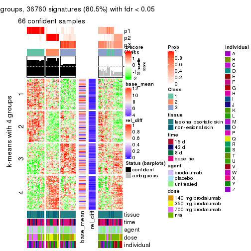</p>

</div>
<div id='tab-MAD-hclust-get-signatures-3'>
<pre><code class="r">get_signatures(res, k = 4)
</code></pre>

<p>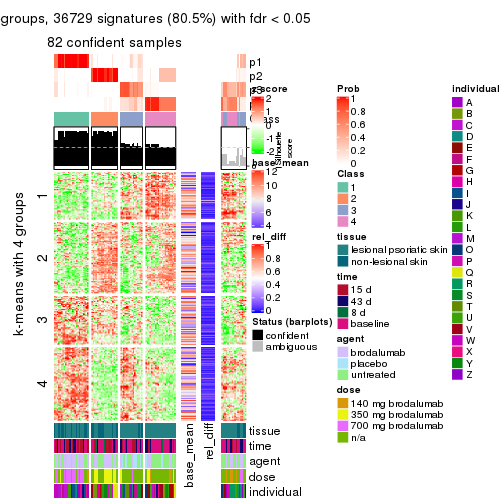</p>

</div>
<div id='tab-MAD-hclust-get-signatures-4'>
<pre><code class="r">get_signatures(res, k = 5)
</code></pre>

<p></p>

</div>
<div id='tab-MAD-hclust-get-signatures-5'>
<pre><code class="r">get_signatures(res, k = 6)
</code></pre>

<p></p>

</div>
</div>


Signature heatmaps where rows are not scaled:


<script>
$( function() {
	$( '#tabs-MAD-hclust-get-signatures-no-scale' ).tabs();
} );
</script>
<div id='tabs-MAD-hclust-get-signatures-no-scale'>
<ul>
<li><a href='#tab-MAD-hclust-get-signatures-no-scale-1'>k = 2</a></li>
<li><a href='#tab-MAD-hclust-get-signatures-no-scale-2'>k = 3</a></li>
<li><a href='#tab-MAD-hclust-get-signatures-no-scale-3'>k = 4</a></li>
<li><a href='#tab-MAD-hclust-get-signatures-no-scale-4'>k = 5</a></li>
<li><a href='#tab-MAD-hclust-get-signatures-no-scale-5'>k = 6</a></li>
</ul>
<div id='tab-MAD-hclust-get-signatures-no-scale-1'>
<pre><code class="r">get_signatures(res, k = 2, scale_rows = FALSE)
</code></pre>

<p></p>

</div>
<div id='tab-MAD-hclust-get-signatures-no-scale-2'>
<pre><code class="r">get_signatures(res, k = 3, scale_rows = FALSE)
</code></pre>

<p></p>

</div>
<div id='tab-MAD-hclust-get-signatures-no-scale-3'>
<pre><code class="r">get_signatures(res, k = 4, scale_rows = FALSE)
</code></pre>

<p></p>

</div>
<div id='tab-MAD-hclust-get-signatures-no-scale-4'>
<pre><code class="r">get_signatures(res, k = 5, scale_rows = FALSE)
</code></pre>

<p></p>

</div>
<div id='tab-MAD-hclust-get-signatures-no-scale-5'>
<pre><code class="r">get_signatures(res, k = 6, scale_rows = FALSE)
</code></pre>

<p></p>

</div>
</div>


Compare the overlap of signatures from different k:

```r
compare_signatures(res)
```


`get_signature()` returns a data frame invisibly. TO get the list of signatures, the function
call should be assigned to a variable explicitly. In following code, if `plot` argument is set
to `FALSE`, no heatmap is plotted while only the differential analysis is performed.

```r
# code only for demonstration
tb = get_signature(res, k = ..., plot = FALSE)
```

An example of the output of `tb` is:

```
#>   which_row         fdr    mean_1    mean_2 scaled_mean_1 scaled_mean_2 km
#> 1        38 0.042760348  8.373488  9.131774    -0.5533452     0.5164555  1
#> 2        40 0.018707592  7.106213  8.469186    -0.6173731     0.5762149  1
#> 3        55 0.019134737 10.221463 11.207825    -0.6159697     0.5749050  1
#> 4        59 0.006059896  5.921854  7.869574    -0.6899429     0.6439467  1
#> 5        60 0.018055526  8.928898 10.211722    -0.6204761     0.5791110  1
#> 6        98 0.009384629 15.714769 14.887706     0.6635654    -0.6193277  2
...
```

The columns in `tb` are:

1. `which_row`: row indices corresponding to the input matrix.
2. `fdr`: FDR for the differential test. 
3. `mean_x`: The mean value in group x.
4. `scaled_mean_x`: The mean value in group x after rows are scaled.
5. `km`: Row groups if k-means clustering is applied to rows.


UMAP plot which shows how samples are separated.


<script>
$( function() {
	$( '#tabs-MAD-hclust-dimension-reduction' ).tabs();
} );
</script>
<div id='tabs-MAD-hclust-dimension-reduction'>
<ul>
<li><a href='#tab-MAD-hclust-dimension-reduction-1'>k = 2</a></li>
<li><a href='#tab-MAD-hclust-dimension-reduction-2'>k = 3</a></li>
<li><a href='#tab-MAD-hclust-dimension-reduction-3'>k = 4</a></li>
<li><a href='#tab-MAD-hclust-dimension-reduction-4'>k = 5</a></li>
<li><a href='#tab-MAD-hclust-dimension-reduction-5'>k = 6</a></li>
</ul>
<div id='tab-MAD-hclust-dimension-reduction-1'>
<pre><code class="r">dimension_reduction(res, k = 2, method = &quot;UMAP&quot;)
</code></pre>

<p></p>

</div>
<div id='tab-MAD-hclust-dimension-reduction-2'>
<pre><code class="r">dimension_reduction(res, k = 3, method = &quot;UMAP&quot;)
</code></pre>

<p></p>

</div>
<div id='tab-MAD-hclust-dimension-reduction-3'>
<pre><code class="r">dimension_reduction(res, k = 4, method = &quot;UMAP&quot;)
</code></pre>

<p></p>

</div>
<div id='tab-MAD-hclust-dimension-reduction-4'>
<pre><code class="r">dimension_reduction(res, k = 5, method = &quot;UMAP&quot;)
</code></pre>

<p></p>

</div>
<div id='tab-MAD-hclust-dimension-reduction-5'>
<pre><code class="r">dimension_reduction(res, k = 6, method = &quot;UMAP&quot;)
</code></pre>

<p></p>

</div>
</div>


Following heatmap shows how subgroups are split when increasing `k`:

```r
collect_classes(res)
```


Test correlation between subgroups and known annotations. If the known
annotation is numeric, one-way ANOVA test is applied, and if the known
annotation is discrete, chi-squared contingency table test is applied.

```r
test_to_known_factors(res)
```

```
#>             n tissue(p) time(p) agent(p)  dose(p) individual(p) k
#> MAD:hclust 81  0.039026  0.1809 0.088676 7.22e-08      2.60e-03 2
#> MAD:hclust 66  0.008723  0.0211 0.217499 1.47e-08      5.19e-05 3
#> MAD:hclust 82  0.001940  0.1470 0.000135 8.49e-09      1.84e-04 4
#> MAD:hclust 82  0.000148  0.1220 0.004760 8.38e-07      1.43e-04 5
#> MAD:hclust 68  0.011383  0.3139 0.009474 5.73e-05      2.85e-06 6
```


If matrix rows can be associated to genes, consider to use `functional_enrichment(res,
...)` to perform function enrichment for the signature genes. See [this vignette](http://bioconductor.org/packages/devel/bioc/vignettes/cola/inst/doc/functional_enrichment.html) for more detailed explanations.


 

---------------------------------------------------


### MAD:kmeans


The object with results only for a single top-value method and a single partition method 
can be extracted as:

```r
res = res_list["MAD", "kmeans"]
# you can also extract it by
# res = res_list["MAD:kmeans"]
```

A summary of `res` and all the functions that can be applied to it:

```r
res
```

```
#> A 'ConsensusPartition' object with k = 2, 3, 4, 5, 6.
#>   On a matrix with 45638 rows and 99 columns.
#>   Top rows (1000, 2000, 3000, 4000, 5000) are extracted by 'MAD' method.
#>   Subgroups are detected by 'kmeans' method.
#>   Performed in total 1250 partitions by row resampling.
#>   Best k for subgroups seems to be 3.
#> 
#> Following methods can be applied to this 'ConsensusPartition' object:
#>  [1] "cola_report"             "collect_classes"         "collect_plots"          
#>  [4] "collect_stats"           "colnames"                "compare_signatures"     
#>  [7] "consensus_heatmap"       "dimension_reduction"     "functional_enrichment"  
#> [10] "get_anno_col"            "get_anno"                "get_classes"            
#> [13] "get_consensus"           "get_matrix"              "get_membership"         
#> [16] "get_param"               "get_signatures"          "get_stats"              
#> [19] "is_best_k"               "is_stable_k"             "membership_heatmap"     
#> [22] "ncol"                    "nrow"                    "plot_ecdf"              
#> [25] "rownames"                "select_partition_number" "show"                   
#> [28] "suggest_best_k"          "test_to_known_factors"
```

`collect_plots()` function collects all the plots made from `res` for all `k` (number of partitions)
into one single page to provide an easy and fast comparison between different `k`.

```r
collect_plots(res)
```


The plots are:

- The first row: a plot of the ECDF (empirical cumulative distribution
  function) curves of the consensus matrix for each `k` and the heatmap of
  predicted classes for each `k`.
- The second row: heatmaps of the consensus matrix for each `k`.
- The third row: heatmaps of the membership matrix for each `k`.
- The fouth row: heatmaps of the signatures for each `k`.

All the plots in panels can be made by individual functions and they are
plotted later in this section.

`select_partition_number()` produces several plots showing different
statistics for choosing "optimized" `k`. There are following statistics:

- ECDF curves of the consensus matrix for each `k`;
- 1-PAC. [The PAC
  score](https://en.wikipedia.org/wiki/Consensus_clustering#Over-interpretation_potential_of_consensus_clustering)
  measures the proportion of the ambiguous subgrouping.
- Mean silhouette score.
- Concordance. The mean probability of fiting the consensus class ids in all
  partitions.
- Area increased. Denote $A_k$ as the area under the ECDF curve for current
  `k`, the area increased is defined as $A_k - A_{k-1}$.
- Rand index. The percent of pairs of samples that are both in a same cluster
  or both are not in a same cluster in the partition of k and k-1.
- Jaccard index. The ratio of pairs of samples are both in a same cluster in
  the partition of k and k-1 and the pairs of samples are both in a same
  cluster in the partition k or k-1.

The detailed explanations of these statistics can be found in [the _cola_
vignette](http://bioconductor.org/packages/devel/bioc/vignettes/cola/inst/doc/cola.html#toc_13).

Generally speaking, lower PAC score, higher mean silhouette score or higher
concordance corresponds to better partition. Rand index and Jaccard index
measure how similar the current partition is compared to partition with `k-1`.
If they are too similar, we won't accept `k` is better than `k-1`.

```r
select_partition_number(res)
```


The numeric values for all these statistics can be obtained by `get_stats()`.

```r
get_stats(res)
```

```
#>   k 1-PAC mean_silhouette concordance area_increased  Rand Jaccard
#> 2 2 0.710           0.897       0.946         0.4895 0.518   0.518
#> 3 3 0.846           0.905       0.956         0.3720 0.725   0.509
#> 4 4 0.752           0.712       0.845         0.1113 0.810   0.504
#> 5 5 0.772           0.741       0.850         0.0651 0.894   0.617
#> 6 6 0.862           0.885       0.896         0.0406 0.942   0.725
```

`suggest_best_k()` suggests the best $k$ based on these statistics. The rules are as follows:

- All $k$ with Jaccard index larger than 0.95 are removed because increasing
  $k$ does not provide enough extra information. If all $k$ are removed, it is
  marked as no subgroup is detected.
- For all $k$ with 1-PAC score larger than 0.9, the maximal $k$ is taken as
  the best $k$, and other $k$ are marked as optional $k$.
- If it does not fit the second rule. The $k$ with the maximal vote of the
  highest 1-PAC score, highest mean silhouette, and highest concordance is
  taken as the best $k$.

```r
suggest_best_k(res)
```

```
#> [1] 3
```


Following shows the table of the partitions (You need to click the **show/hide
code output** link to see it). The membership matrix (columns with name `p*`)
is inferred by
[`clue::cl_consensus()`](https://www.rdocumentation.org/link/cl_consensus?package=clue)
function with the `SE` method. Basically the value in the membership matrix
represents the probability to belong to a certain group. The finall class
label for an item is determined with the group with highest probability it
belongs to.

In `get_classes()` function, the entropy is calculated from the membership
matrix and the silhouette score is calculated from the consensus matrix.


<script>
$( function() {
	$( '#tabs-MAD-kmeans-get-classes' ).tabs();
} );
</script>
<div id='tabs-MAD-kmeans-get-classes'>
<ul>
<li><a href='#tab-MAD-kmeans-get-classes-1'>k = 2</a></li>
<li><a href='#tab-MAD-kmeans-get-classes-2'>k = 3</a></li>
<li><a href='#tab-MAD-kmeans-get-classes-3'>k = 4</a></li>
<li><a href='#tab-MAD-kmeans-get-classes-4'>k = 5</a></li>
<li><a href='#tab-MAD-kmeans-get-classes-5'>k = 6</a></li>
</ul>

<div id='tab-MAD-kmeans-get-classes-1'>
<p><a id='tab-MAD-kmeans-get-classes-1-a' style='color:#0366d6' href='#'>show/hide code output</a></p>
<pre><code class="r">cbind(get_classes(res, k = 2), get_membership(res, k = 2))
</code></pre>

<pre><code>#&gt;            class entropy silhouette    p1    p2
#&gt; GSM1296094     2  0.7376      0.792 0.208 0.792
#&gt; GSM1296119     2  0.0000      0.913 0.000 1.000
#&gt; GSM1296076     2  0.0000      0.913 0.000 1.000
#&gt; GSM1296092     2  0.7376      0.792 0.208 0.792
#&gt; GSM1296103     2  0.7376      0.792 0.208 0.792
#&gt; GSM1296078     2  0.0000      0.913 0.000 1.000
#&gt; GSM1296107     2  0.0000      0.913 0.000 1.000
#&gt; GSM1296109     2  0.0000      0.913 0.000 1.000
#&gt; GSM1296080     1  0.0000      0.983 1.000 0.000
#&gt; GSM1296090     2  0.0000      0.913 0.000 1.000
#&gt; GSM1296074     2  0.0000      0.913 0.000 1.000
#&gt; GSM1296111     2  0.0000      0.913 0.000 1.000
#&gt; GSM1296099     2  0.7376      0.792 0.208 0.792
#&gt; GSM1296086     2  0.7376      0.792 0.208 0.792
#&gt; GSM1296117     2  0.0000      0.913 0.000 1.000
#&gt; GSM1296113     2  0.0000      0.913 0.000 1.000
#&gt; GSM1296096     2  0.4939      0.862 0.108 0.892
#&gt; GSM1296105     1  0.0000      0.983 1.000 0.000
#&gt; GSM1296098     2  0.7528      0.784 0.216 0.784
#&gt; GSM1296101     2  0.7376      0.792 0.208 0.792
#&gt; GSM1296121     2  0.0000      0.913 0.000 1.000
#&gt; GSM1296088     2  0.7528      0.784 0.216 0.784
#&gt; GSM1296082     2  0.0000      0.913 0.000 1.000
#&gt; GSM1296115     2  0.0000      0.913 0.000 1.000
#&gt; GSM1296084     1  0.0000      0.983 1.000 0.000
#&gt; GSM1296072     2  0.0000      0.913 0.000 1.000
#&gt; GSM1296069     2  0.0000      0.913 0.000 1.000
#&gt; GSM1296071     2  0.0000      0.913 0.000 1.000
#&gt; GSM1296070     2  0.0000      0.913 0.000 1.000
#&gt; GSM1296073     2  0.0000      0.913 0.000 1.000
#&gt; GSM1296034     1  0.0000      0.983 1.000 0.000
#&gt; GSM1296041     2  0.0000      0.913 0.000 1.000
#&gt; GSM1296035     2  0.7376      0.792 0.208 0.792
#&gt; GSM1296038     2  0.0000      0.913 0.000 1.000
#&gt; GSM1296047     2  0.4161      0.868 0.084 0.916
#&gt; GSM1296039     2  0.0000      0.913 0.000 1.000
#&gt; GSM1296042     2  0.0000      0.913 0.000 1.000
#&gt; GSM1296043     2  0.0000      0.913 0.000 1.000
#&gt; GSM1296037     1  0.0000      0.983 1.000 0.000
#&gt; GSM1296046     2  0.0000      0.913 0.000 1.000
#&gt; GSM1296044     2  0.0000      0.913 0.000 1.000
#&gt; GSM1296045     2  0.0000      0.913 0.000 1.000
#&gt; GSM1296025     1  0.0000      0.983 1.000 0.000
#&gt; GSM1296033     1  0.0000      0.983 1.000 0.000
#&gt; GSM1296027     1  0.0000      0.983 1.000 0.000
#&gt; GSM1296032     1  0.0000      0.983 1.000 0.000
#&gt; GSM1296024     1  0.0000      0.983 1.000 0.000
#&gt; GSM1296031     1  0.0000      0.983 1.000 0.000
#&gt; GSM1296028     1  0.0000      0.983 1.000 0.000
#&gt; GSM1296029     1  0.0000      0.983 1.000 0.000
#&gt; GSM1296026     1  0.9209      0.409 0.664 0.336
#&gt; GSM1296030     1  0.0000      0.983 1.000 0.000
#&gt; GSM1296040     2  0.8861      0.661 0.304 0.696
#&gt; GSM1296036     2  0.8499      0.705 0.276 0.724
#&gt; GSM1296048     2  0.0000      0.913 0.000 1.000
#&gt; GSM1296059     2  0.7376      0.792 0.208 0.792
#&gt; GSM1296066     2  0.0000      0.913 0.000 1.000
#&gt; GSM1296060     2  0.7376      0.792 0.208 0.792
#&gt; GSM1296063     2  0.0000      0.913 0.000 1.000
#&gt; GSM1296064     2  0.0000      0.913 0.000 1.000
#&gt; GSM1296067     2  0.4815      0.852 0.104 0.896
#&gt; GSM1296062     1  0.0000      0.983 1.000 0.000
#&gt; GSM1296068     2  0.4161      0.868 0.084 0.916
#&gt; GSM1296050     1  0.0000      0.983 1.000 0.000
#&gt; GSM1296057     1  0.0000      0.983 1.000 0.000
#&gt; GSM1296052     1  0.0000      0.983 1.000 0.000
#&gt; GSM1296054     1  0.0000      0.983 1.000 0.000
#&gt; GSM1296049     1  0.0000      0.983 1.000 0.000
#&gt; GSM1296055     1  0.0000      0.983 1.000 0.000
#&gt; GSM1296053     1  0.0000      0.983 1.000 0.000
#&gt; GSM1296058     1  0.0000      0.983 1.000 0.000
#&gt; GSM1296051     2  0.7376      0.792 0.208 0.792
#&gt; GSM1296056     2  0.7376      0.792 0.208 0.792
#&gt; GSM1296065     2  0.0000      0.913 0.000 1.000
#&gt; GSM1296061     1  0.1843      0.954 0.972 0.028
#&gt; GSM1296095     2  0.0000      0.913 0.000 1.000
#&gt; GSM1296120     2  0.4161      0.868 0.084 0.916
#&gt; GSM1296077     1  0.0000      0.983 1.000 0.000
#&gt; GSM1296093     1  0.0000      0.983 1.000 0.000
#&gt; GSM1296104     2  0.0000      0.913 0.000 1.000
#&gt; GSM1296079     1  0.0000      0.983 1.000 0.000
#&gt; GSM1296108     2  0.3879      0.873 0.076 0.924
#&gt; GSM1296110     2  0.0938      0.909 0.012 0.988
#&gt; GSM1296081     1  0.0000      0.983 1.000 0.000
#&gt; GSM1296091     1  0.0000      0.983 1.000 0.000
#&gt; GSM1296075     1  0.0000      0.983 1.000 0.000
#&gt; GSM1296112     2  0.4161      0.868 0.084 0.916
#&gt; GSM1296100     1  0.0000      0.983 1.000 0.000
#&gt; GSM1296087     1  0.0000      0.983 1.000 0.000
#&gt; GSM1296118     2  0.9922      0.190 0.448 0.552
#&gt; GSM1296114     2  0.0672      0.910 0.008 0.992
#&gt; GSM1296097     2  0.9170      0.633 0.332 0.668
#&gt; GSM1296106     1  0.0000      0.983 1.000 0.000
#&gt; GSM1296102     1  0.0000      0.983 1.000 0.000
#&gt; GSM1296122     1  0.7453      0.705 0.788 0.212
#&gt; GSM1296089     1  0.0000      0.983 1.000 0.000
#&gt; GSM1296083     1  0.0000      0.983 1.000 0.000
#&gt; GSM1296116     2  0.0672      0.910 0.008 0.992
#&gt; GSM1296085     1  0.0000      0.983 1.000 0.000
</code></pre>

<script>
$('#tab-MAD-kmeans-get-classes-1-a').parent().next().next().hide();
$('#tab-MAD-kmeans-get-classes-1-a').click(function(){
  $('#tab-MAD-kmeans-get-classes-1-a').parent().next().next().toggle();
  return(false);
});
</script>
</div>

<div id='tab-MAD-kmeans-get-classes-2'>
<p><a id='tab-MAD-kmeans-get-classes-2-a' style='color:#0366d6' href='#'>show/hide code output</a></p>
<pre><code class="r">cbind(get_classes(res, k = 3), get_membership(res, k = 3))
</code></pre>

<pre><code>#&gt;            class entropy silhouette    p1    p2    p3
#&gt; GSM1296094     3  0.0000     0.9430 0.000 0.000 1.000
#&gt; GSM1296119     2  0.2959     0.9199 0.000 0.900 0.100
#&gt; GSM1296076     3  0.0000     0.9430 0.000 0.000 1.000
#&gt; GSM1296092     3  0.0000     0.9430 0.000 0.000 1.000
#&gt; GSM1296103     3  0.0000     0.9430 0.000 0.000 1.000
#&gt; GSM1296078     3  0.0000     0.9430 0.000 0.000 1.000
#&gt; GSM1296107     2  0.1964     0.9434 0.000 0.944 0.056
#&gt; GSM1296109     3  0.0000     0.9430 0.000 0.000 1.000
#&gt; GSM1296080     3  0.2959     0.8572 0.100 0.000 0.900
#&gt; GSM1296090     3  0.0000     0.9430 0.000 0.000 1.000
#&gt; GSM1296074     3  0.0000     0.9430 0.000 0.000 1.000
#&gt; GSM1296111     2  0.2796     0.9250 0.000 0.908 0.092
#&gt; GSM1296099     3  0.0000     0.9430 0.000 0.000 1.000
#&gt; GSM1296086     3  0.0000     0.9430 0.000 0.000 1.000
#&gt; GSM1296117     2  0.2959     0.9199 0.000 0.900 0.100
#&gt; GSM1296113     2  0.2165     0.9398 0.000 0.936 0.064
#&gt; GSM1296096     3  0.0000     0.9430 0.000 0.000 1.000
#&gt; GSM1296105     1  0.4291     0.7632 0.820 0.000 0.180
#&gt; GSM1296098     3  0.0000     0.9430 0.000 0.000 1.000
#&gt; GSM1296101     3  0.0000     0.9430 0.000 0.000 1.000
#&gt; GSM1296121     2  0.2959     0.9199 0.000 0.900 0.100
#&gt; GSM1296088     3  0.0000     0.9430 0.000 0.000 1.000
#&gt; GSM1296082     3  0.0000     0.9430 0.000 0.000 1.000
#&gt; GSM1296115     2  0.2959     0.9199 0.000 0.900 0.100
#&gt; GSM1296084     3  0.2796     0.8650 0.092 0.000 0.908
#&gt; GSM1296072     2  0.0000     0.9619 0.000 1.000 0.000
#&gt; GSM1296069     2  0.0000     0.9619 0.000 1.000 0.000
#&gt; GSM1296071     2  0.0000     0.9619 0.000 1.000 0.000
#&gt; GSM1296070     2  0.0000     0.9619 0.000 1.000 0.000
#&gt; GSM1296073     2  0.2959     0.9199 0.000 0.900 0.100
#&gt; GSM1296034     1  0.0000     0.9548 1.000 0.000 0.000
#&gt; GSM1296041     2  0.2959     0.9199 0.000 0.900 0.100
#&gt; GSM1296035     3  0.0000     0.9430 0.000 0.000 1.000
#&gt; GSM1296038     3  0.0000     0.9430 0.000 0.000 1.000
#&gt; GSM1296047     2  0.0000     0.9619 0.000 1.000 0.000
#&gt; GSM1296039     3  0.0000     0.9430 0.000 0.000 1.000
#&gt; GSM1296042     2  0.1860     0.9449 0.000 0.948 0.052
#&gt; GSM1296043     2  0.0000     0.9619 0.000 1.000 0.000
#&gt; GSM1296037     1  0.0000     0.9548 1.000 0.000 0.000
#&gt; GSM1296046     2  0.0000     0.9619 0.000 1.000 0.000
#&gt; GSM1296044     2  0.0000     0.9619 0.000 1.000 0.000
#&gt; GSM1296045     2  0.0000     0.9619 0.000 1.000 0.000
#&gt; GSM1296025     1  0.0000     0.9548 1.000 0.000 0.000
#&gt; GSM1296033     1  0.0000     0.9548 1.000 0.000 0.000
#&gt; GSM1296027     1  0.0000     0.9548 1.000 0.000 0.000
#&gt; GSM1296032     1  0.0000     0.9548 1.000 0.000 0.000
#&gt; GSM1296024     1  0.0000     0.9548 1.000 0.000 0.000
#&gt; GSM1296031     1  0.0000     0.9548 1.000 0.000 0.000
#&gt; GSM1296028     1  0.0000     0.9548 1.000 0.000 0.000
#&gt; GSM1296029     1  0.0000     0.9548 1.000 0.000 0.000
#&gt; GSM1296026     3  0.0000     0.9430 0.000 0.000 1.000
#&gt; GSM1296030     3  0.4504     0.7399 0.196 0.000 0.804
#&gt; GSM1296040     3  0.0000     0.9430 0.000 0.000 1.000
#&gt; GSM1296036     3  0.0000     0.9430 0.000 0.000 1.000
#&gt; GSM1296048     2  0.2959     0.9199 0.000 0.900 0.100
#&gt; GSM1296059     3  0.0000     0.9430 0.000 0.000 1.000
#&gt; GSM1296066     2  0.0237     0.9610 0.000 0.996 0.004
#&gt; GSM1296060     3  0.0000     0.9430 0.000 0.000 1.000
#&gt; GSM1296063     3  0.5926     0.4445 0.000 0.356 0.644
#&gt; GSM1296064     3  0.0000     0.9430 0.000 0.000 1.000
#&gt; GSM1296067     2  0.0000     0.9619 0.000 1.000 0.000
#&gt; GSM1296062     3  0.2959     0.8572 0.100 0.000 0.900
#&gt; GSM1296068     2  0.0000     0.9619 0.000 1.000 0.000
#&gt; GSM1296050     1  0.0000     0.9548 1.000 0.000 0.000
#&gt; GSM1296057     1  0.0000     0.9548 1.000 0.000 0.000
#&gt; GSM1296052     1  0.0000     0.9548 1.000 0.000 0.000
#&gt; GSM1296054     1  0.0000     0.9548 1.000 0.000 0.000
#&gt; GSM1296049     1  0.0000     0.9548 1.000 0.000 0.000
#&gt; GSM1296055     1  0.2066     0.9101 0.940 0.060 0.000
#&gt; GSM1296053     1  0.0000     0.9548 1.000 0.000 0.000
#&gt; GSM1296058     1  0.3551     0.8264 0.868 0.000 0.132
#&gt; GSM1296051     3  0.0000     0.9430 0.000 0.000 1.000
#&gt; GSM1296056     3  0.0000     0.9430 0.000 0.000 1.000
#&gt; GSM1296065     3  0.6126     0.3509 0.000 0.400 0.600
#&gt; GSM1296061     3  0.0000     0.9430 0.000 0.000 1.000
#&gt; GSM1296095     3  0.4974     0.6856 0.000 0.236 0.764
#&gt; GSM1296120     2  0.0000     0.9619 0.000 1.000 0.000
#&gt; GSM1296077     1  0.0000     0.9548 1.000 0.000 0.000
#&gt; GSM1296093     1  0.0000     0.9548 1.000 0.000 0.000
#&gt; GSM1296104     3  0.5835     0.5388 0.000 0.340 0.660
#&gt; GSM1296079     1  0.0000     0.9548 1.000 0.000 0.000
#&gt; GSM1296108     2  0.0000     0.9619 0.000 1.000 0.000
#&gt; GSM1296110     2  0.0000     0.9619 0.000 1.000 0.000
#&gt; GSM1296081     1  0.0000     0.9548 1.000 0.000 0.000
#&gt; GSM1296091     1  0.0000     0.9548 1.000 0.000 0.000
#&gt; GSM1296075     1  0.2261     0.9034 0.932 0.068 0.000
#&gt; GSM1296112     2  0.0000     0.9619 0.000 1.000 0.000
#&gt; GSM1296100     1  0.0000     0.9548 1.000 0.000 0.000
#&gt; GSM1296087     1  0.0000     0.9548 1.000 0.000 0.000
#&gt; GSM1296118     2  0.2261     0.9049 0.068 0.932 0.000
#&gt; GSM1296114     2  0.0000     0.9619 0.000 1.000 0.000
#&gt; GSM1296097     1  0.9172     0.2062 0.488 0.156 0.356
#&gt; GSM1296106     1  0.2261     0.9034 0.932 0.068 0.000
#&gt; GSM1296102     1  0.0000     0.9548 1.000 0.000 0.000
#&gt; GSM1296122     1  0.6309     0.0497 0.500 0.500 0.000
#&gt; GSM1296089     1  0.0000     0.9548 1.000 0.000 0.000
#&gt; GSM1296083     1  0.0000     0.9548 1.000 0.000 0.000
#&gt; GSM1296116     2  0.0000     0.9619 0.000 1.000 0.000
#&gt; GSM1296085     1  0.0000     0.9548 1.000 0.000 0.000
</code></pre>

<script>
$('#tab-MAD-kmeans-get-classes-2-a').parent().next().next().hide();
$('#tab-MAD-kmeans-get-classes-2-a').click(function(){
  $('#tab-MAD-kmeans-get-classes-2-a').parent().next().next().toggle();
  return(false);
});
</script>
</div>

<div id='tab-MAD-kmeans-get-classes-3'>
<p><a id='tab-MAD-kmeans-get-classes-3-a' style='color:#0366d6' href='#'>show/hide code output</a></p>
<pre><code class="r">cbind(get_classes(res, k = 4), get_membership(res, k = 4))
</code></pre>

<pre><code>#&gt;            class entropy silhouette    p1    p2    p3    p4
#&gt; GSM1296094     3  0.0188     0.8424 0.000 0.004 0.996 0.000
#&gt; GSM1296119     4  0.0188     0.7371 0.000 0.000 0.004 0.996
#&gt; GSM1296076     4  0.6993     0.1555 0.000 0.124 0.364 0.512
#&gt; GSM1296092     3  0.3694     0.7866 0.000 0.124 0.844 0.032
#&gt; GSM1296103     3  0.0000     0.8422 0.000 0.000 1.000 0.000
#&gt; GSM1296078     4  0.6993     0.1555 0.000 0.124 0.364 0.512
#&gt; GSM1296107     4  0.1022     0.7121 0.000 0.032 0.000 0.968
#&gt; GSM1296109     4  0.6197     0.1683 0.000 0.056 0.400 0.544
#&gt; GSM1296080     3  0.0804     0.8388 0.008 0.012 0.980 0.000
#&gt; GSM1296090     3  0.7003     0.2477 0.000 0.124 0.508 0.368
#&gt; GSM1296074     3  0.7012     0.2372 0.000 0.124 0.504 0.372
#&gt; GSM1296111     4  0.0188     0.7371 0.000 0.000 0.004 0.996
#&gt; GSM1296099     3  0.1557     0.8331 0.000 0.056 0.944 0.000
#&gt; GSM1296086     3  0.3694     0.7866 0.000 0.124 0.844 0.032
#&gt; GSM1296117     4  0.0188     0.7371 0.000 0.000 0.004 0.996
#&gt; GSM1296113     4  0.1022     0.7121 0.000 0.032 0.000 0.968
#&gt; GSM1296096     3  0.1557     0.8331 0.000 0.056 0.944 0.000
#&gt; GSM1296105     3  0.6449     0.5205 0.152 0.204 0.644 0.000
#&gt; GSM1296098     3  0.0469     0.8419 0.000 0.012 0.988 0.000
#&gt; GSM1296101     3  0.0336     0.8424 0.000 0.008 0.992 0.000
#&gt; GSM1296121     4  0.0188     0.7371 0.000 0.000 0.004 0.996
#&gt; GSM1296088     3  0.0000     0.8422 0.000 0.000 1.000 0.000
#&gt; GSM1296082     3  0.7028     0.2150 0.000 0.124 0.496 0.380
#&gt; GSM1296115     4  0.0188     0.7371 0.000 0.000 0.004 0.996
#&gt; GSM1296084     3  0.0657     0.8406 0.004 0.012 0.984 0.000
#&gt; GSM1296072     2  0.4500     0.7333 0.000 0.684 0.000 0.316
#&gt; GSM1296069     4  0.4843    -0.2632 0.000 0.396 0.000 0.604
#&gt; GSM1296071     2  0.4564     0.7325 0.000 0.672 0.000 0.328
#&gt; GSM1296070     4  0.3311     0.4807 0.000 0.172 0.000 0.828
#&gt; GSM1296073     4  0.3280     0.6677 0.000 0.124 0.016 0.860
#&gt; GSM1296034     1  0.0000     0.9679 1.000 0.000 0.000 0.000
#&gt; GSM1296041     4  0.0188     0.7371 0.000 0.000 0.004 0.996
#&gt; GSM1296035     3  0.1557     0.8331 0.000 0.056 0.944 0.000
#&gt; GSM1296038     3  0.3757     0.7879 0.000 0.152 0.828 0.020
#&gt; GSM1296047     2  0.4431     0.7327 0.000 0.696 0.000 0.304
#&gt; GSM1296039     3  0.7078     0.0896 0.000 0.124 0.456 0.420
#&gt; GSM1296042     4  0.1022     0.7121 0.000 0.032 0.000 0.968
#&gt; GSM1296043     2  0.4948     0.5871 0.000 0.560 0.000 0.440
#&gt; GSM1296037     1  0.2216     0.9186 0.908 0.092 0.000 0.000
#&gt; GSM1296046     2  0.4564     0.7325 0.000 0.672 0.000 0.328
#&gt; GSM1296044     2  0.4564     0.7325 0.000 0.672 0.000 0.328
#&gt; GSM1296045     2  0.4843     0.6538 0.000 0.604 0.000 0.396
#&gt; GSM1296025     1  0.0000     0.9679 1.000 0.000 0.000 0.000
#&gt; GSM1296033     1  0.1557     0.9388 0.944 0.056 0.000 0.000
#&gt; GSM1296027     1  0.0000     0.9679 1.000 0.000 0.000 0.000
#&gt; GSM1296032     1  0.0000     0.9679 1.000 0.000 0.000 0.000
#&gt; GSM1296024     1  0.0000     0.9679 1.000 0.000 0.000 0.000
#&gt; GSM1296031     1  0.1118     0.9529 0.964 0.036 0.000 0.000
#&gt; GSM1296028     1  0.0000     0.9679 1.000 0.000 0.000 0.000
#&gt; GSM1296029     1  0.0000     0.9679 1.000 0.000 0.000 0.000
#&gt; GSM1296026     3  0.0469     0.8419 0.000 0.012 0.988 0.000
#&gt; GSM1296030     3  0.2021     0.8042 0.056 0.012 0.932 0.000
#&gt; GSM1296040     3  0.0469     0.8419 0.000 0.012 0.988 0.000
#&gt; GSM1296036     3  0.0469     0.8419 0.000 0.012 0.988 0.000
#&gt; GSM1296048     4  0.0188     0.7371 0.000 0.000 0.004 0.996
#&gt; GSM1296059     3  0.0000     0.8422 0.000 0.000 1.000 0.000
#&gt; GSM1296066     4  0.1022     0.7121 0.000 0.032 0.000 0.968
#&gt; GSM1296060     3  0.1637     0.8338 0.000 0.060 0.940 0.000
#&gt; GSM1296063     4  0.5141     0.6088 0.000 0.160 0.084 0.756
#&gt; GSM1296064     4  0.6924     0.2167 0.000 0.124 0.340 0.536
#&gt; GSM1296067     2  0.4406     0.7316 0.000 0.700 0.000 0.300
#&gt; GSM1296062     3  0.0657     0.8406 0.004 0.012 0.984 0.000
#&gt; GSM1296068     2  0.4564     0.7325 0.000 0.672 0.000 0.328
#&gt; GSM1296050     1  0.1118     0.9529 0.964 0.036 0.000 0.000
#&gt; GSM1296057     1  0.3649     0.8184 0.796 0.204 0.000 0.000
#&gt; GSM1296052     1  0.0000     0.9679 1.000 0.000 0.000 0.000
#&gt; GSM1296054     1  0.0000     0.9679 1.000 0.000 0.000 0.000
#&gt; GSM1296049     1  0.0000     0.9679 1.000 0.000 0.000 0.000
#&gt; GSM1296055     2  0.4543     0.3184 0.324 0.676 0.000 0.000
#&gt; GSM1296053     1  0.0000     0.9679 1.000 0.000 0.000 0.000
#&gt; GSM1296058     3  0.7529     0.1968 0.324 0.204 0.472 0.000
#&gt; GSM1296051     3  0.3787     0.7836 0.000 0.124 0.840 0.036
#&gt; GSM1296056     3  0.3161     0.7986 0.000 0.124 0.864 0.012
#&gt; GSM1296065     2  0.4824     0.3906 0.000 0.780 0.144 0.076
#&gt; GSM1296061     3  0.0469     0.8419 0.000 0.012 0.988 0.000
#&gt; GSM1296095     2  0.6944    -0.2169 0.000 0.484 0.404 0.112
#&gt; GSM1296120     2  0.4431     0.7327 0.000 0.696 0.000 0.304
#&gt; GSM1296077     1  0.0000     0.9679 1.000 0.000 0.000 0.000
#&gt; GSM1296093     1  0.0000     0.9679 1.000 0.000 0.000 0.000
#&gt; GSM1296104     2  0.4370     0.4111 0.000 0.800 0.156 0.044
#&gt; GSM1296079     1  0.0000     0.9679 1.000 0.000 0.000 0.000
#&gt; GSM1296108     2  0.4564     0.7325 0.000 0.672 0.000 0.328
#&gt; GSM1296110     2  0.4564     0.7325 0.000 0.672 0.000 0.328
#&gt; GSM1296081     1  0.0000     0.9679 1.000 0.000 0.000 0.000
#&gt; GSM1296091     1  0.2973     0.8768 0.856 0.144 0.000 0.000
#&gt; GSM1296075     2  0.4406     0.3699 0.300 0.700 0.000 0.000
#&gt; GSM1296112     2  0.4564     0.7325 0.000 0.672 0.000 0.328
#&gt; GSM1296100     1  0.2216     0.9186 0.908 0.092 0.000 0.000
#&gt; GSM1296087     1  0.0000     0.9679 1.000 0.000 0.000 0.000
#&gt; GSM1296118     2  0.4382     0.7302 0.000 0.704 0.000 0.296
#&gt; GSM1296114     2  0.4564     0.7325 0.000 0.672 0.000 0.328
#&gt; GSM1296097     2  0.5906     0.4398 0.148 0.700 0.152 0.000
#&gt; GSM1296106     2  0.4277     0.4074 0.280 0.720 0.000 0.000
#&gt; GSM1296102     1  0.3649     0.8184 0.796 0.204 0.000 0.000
#&gt; GSM1296122     2  0.3533     0.6148 0.056 0.864 0.000 0.080
#&gt; GSM1296089     1  0.1118     0.9529 0.964 0.036 0.000 0.000
#&gt; GSM1296083     1  0.0000     0.9679 1.000 0.000 0.000 0.000
#&gt; GSM1296116     2  0.4564     0.7325 0.000 0.672 0.000 0.328
#&gt; GSM1296085     1  0.0000     0.9679 1.000 0.000 0.000 0.000
</code></pre>

<script>
$('#tab-MAD-kmeans-get-classes-3-a').parent().next().next().hide();
$('#tab-MAD-kmeans-get-classes-3-a').click(function(){
  $('#tab-MAD-kmeans-get-classes-3-a').parent().next().next().toggle();
  return(false);
});
</script>
</div>

<div id='tab-MAD-kmeans-get-classes-4'>
<p><a id='tab-MAD-kmeans-get-classes-4-a' style='color:#0366d6' href='#'>show/hide code output</a></p>
<pre><code class="r">cbind(get_classes(res, k = 5), get_membership(res, k = 5))
</code></pre>

<pre><code>#&gt;            class entropy silhouette    p1    p2    p3    p4    p5
#&gt; GSM1296094     3  0.0000   0.879934 0.000 0.000 1.000 0.000 0.000
#&gt; GSM1296119     5  0.2813   0.677625 0.000 0.168 0.000 0.000 0.832
#&gt; GSM1296076     5  0.6185   0.367293 0.000 0.000 0.188 0.264 0.548
#&gt; GSM1296092     3  0.6067   0.519066 0.000 0.000 0.560 0.276 0.164
#&gt; GSM1296103     3  0.0162   0.880320 0.000 0.000 0.996 0.004 0.000
#&gt; GSM1296078     5  0.6185   0.367293 0.000 0.000 0.188 0.264 0.548
#&gt; GSM1296107     5  0.3003   0.666098 0.000 0.188 0.000 0.000 0.812
#&gt; GSM1296109     5  0.3388   0.583852 0.000 0.000 0.200 0.008 0.792
#&gt; GSM1296080     3  0.0486   0.876179 0.004 0.000 0.988 0.004 0.004
#&gt; GSM1296090     5  0.6765   0.000396 0.000 0.000 0.344 0.272 0.384
#&gt; GSM1296074     5  0.6756   0.008176 0.000 0.000 0.344 0.268 0.388
#&gt; GSM1296111     5  0.2852   0.677652 0.000 0.172 0.000 0.000 0.828
#&gt; GSM1296099     3  0.2694   0.842993 0.000 0.000 0.884 0.076 0.040
#&gt; GSM1296086     3  0.6067   0.519066 0.000 0.000 0.560 0.276 0.164
#&gt; GSM1296117     5  0.2852   0.677652 0.000 0.172 0.000 0.000 0.828
#&gt; GSM1296113     5  0.3003   0.666098 0.000 0.188 0.000 0.000 0.812
#&gt; GSM1296096     3  0.2694   0.842993 0.000 0.000 0.884 0.076 0.040
#&gt; GSM1296105     4  0.4016   0.587389 0.012 0.000 0.272 0.716 0.000
#&gt; GSM1296098     3  0.0000   0.879934 0.000 0.000 1.000 0.000 0.000
#&gt; GSM1296101     3  0.0404   0.879719 0.000 0.000 0.988 0.012 0.000
#&gt; GSM1296121     5  0.2813   0.677625 0.000 0.168 0.000 0.000 0.832
#&gt; GSM1296088     3  0.0671   0.879573 0.000 0.000 0.980 0.016 0.004
#&gt; GSM1296082     5  0.6753   0.020837 0.000 0.000 0.340 0.268 0.392
#&gt; GSM1296115     5  0.2852   0.677652 0.000 0.172 0.000 0.000 0.828
#&gt; GSM1296084     3  0.1082   0.873486 0.000 0.000 0.964 0.028 0.008
#&gt; GSM1296072     2  0.0566   0.915732 0.000 0.984 0.000 0.012 0.004
#&gt; GSM1296069     2  0.4306  -0.041891 0.000 0.508 0.000 0.000 0.492
#&gt; GSM1296071     2  0.0162   0.920113 0.000 0.996 0.000 0.000 0.004
#&gt; GSM1296070     5  0.3932   0.455552 0.000 0.328 0.000 0.000 0.672
#&gt; GSM1296073     5  0.0865   0.651377 0.000 0.024 0.000 0.004 0.972
#&gt; GSM1296034     1  0.0854   0.947616 0.976 0.000 0.012 0.008 0.004
#&gt; GSM1296041     5  0.2852   0.677652 0.000 0.172 0.000 0.000 0.828
#&gt; GSM1296035     3  0.2694   0.842993 0.000 0.000 0.884 0.076 0.040
#&gt; GSM1296038     4  0.4902   0.334039 0.000 0.000 0.304 0.648 0.048
#&gt; GSM1296047     2  0.1205   0.899008 0.000 0.956 0.000 0.040 0.004
#&gt; GSM1296039     5  0.6692   0.147686 0.000 0.000 0.296 0.272 0.432
#&gt; GSM1296042     5  0.3003   0.666098 0.000 0.188 0.000 0.000 0.812
#&gt; GSM1296043     2  0.2377   0.781172 0.000 0.872 0.000 0.000 0.128
#&gt; GSM1296037     1  0.2605   0.804500 0.852 0.000 0.000 0.148 0.000
#&gt; GSM1296046     2  0.0000   0.920482 0.000 1.000 0.000 0.000 0.000
#&gt; GSM1296044     2  0.0000   0.920482 0.000 1.000 0.000 0.000 0.000
#&gt; GSM1296045     2  0.0703   0.901809 0.000 0.976 0.000 0.000 0.024
#&gt; GSM1296025     1  0.0451   0.953546 0.988 0.000 0.000 0.008 0.004
#&gt; GSM1296033     1  0.4565   0.116786 0.580 0.000 0.000 0.408 0.012
#&gt; GSM1296027     1  0.0162   0.953860 0.996 0.000 0.000 0.000 0.004
#&gt; GSM1296032     1  0.0000   0.954227 1.000 0.000 0.000 0.000 0.000
#&gt; GSM1296024     1  0.0451   0.953546 0.988 0.000 0.000 0.008 0.004
#&gt; GSM1296031     1  0.1018   0.946339 0.968 0.000 0.000 0.016 0.016
#&gt; GSM1296028     1  0.0290   0.952845 0.992 0.000 0.000 0.000 0.008
#&gt; GSM1296029     1  0.0404   0.952030 0.988 0.000 0.000 0.000 0.012
#&gt; GSM1296026     3  0.0955   0.875075 0.000 0.000 0.968 0.028 0.004
#&gt; GSM1296030     3  0.1498   0.865290 0.016 0.000 0.952 0.024 0.008
#&gt; GSM1296040     3  0.0290   0.879872 0.000 0.000 0.992 0.008 0.000
#&gt; GSM1296036     3  0.0000   0.879934 0.000 0.000 1.000 0.000 0.000
#&gt; GSM1296048     5  0.2813   0.677625 0.000 0.168 0.000 0.000 0.832
#&gt; GSM1296059     3  0.0510   0.879992 0.000 0.000 0.984 0.016 0.000
#&gt; GSM1296066     5  0.3039   0.663229 0.000 0.192 0.000 0.000 0.808
#&gt; GSM1296060     3  0.2694   0.842993 0.000 0.000 0.884 0.076 0.040
#&gt; GSM1296063     5  0.4110   0.552960 0.000 0.012 0.008 0.244 0.736
#&gt; GSM1296064     5  0.4924   0.518266 0.000 0.000 0.060 0.272 0.668
#&gt; GSM1296067     2  0.1205   0.899008 0.000 0.956 0.000 0.040 0.004
#&gt; GSM1296062     3  0.0566   0.874043 0.000 0.000 0.984 0.012 0.004
#&gt; GSM1296068     2  0.0162   0.920883 0.000 0.996 0.000 0.004 0.000
#&gt; GSM1296050     1  0.1018   0.946339 0.968 0.000 0.000 0.016 0.016
#&gt; GSM1296057     4  0.3730   0.584946 0.288 0.000 0.000 0.712 0.000
#&gt; GSM1296052     1  0.0162   0.953860 0.996 0.000 0.000 0.000 0.004
#&gt; GSM1296054     1  0.0000   0.954227 1.000 0.000 0.000 0.000 0.000
#&gt; GSM1296049     1  0.0162   0.953953 0.996 0.000 0.000 0.004 0.000
#&gt; GSM1296055     4  0.4737   0.710278 0.068 0.224 0.000 0.708 0.000
#&gt; GSM1296053     1  0.0162   0.953953 0.996 0.000 0.000 0.004 0.000
#&gt; GSM1296058     4  0.4840   0.685593 0.124 0.000 0.152 0.724 0.000
#&gt; GSM1296051     3  0.6273   0.456390 0.000 0.000 0.500 0.336 0.164
#&gt; GSM1296056     3  0.5905   0.541028 0.000 0.000 0.580 0.276 0.144
#&gt; GSM1296065     4  0.3177   0.703034 0.000 0.208 0.000 0.792 0.000
#&gt; GSM1296061     3  0.0000   0.879934 0.000 0.000 1.000 0.000 0.000
#&gt; GSM1296095     4  0.5917   0.608948 0.000 0.140 0.100 0.688 0.072
#&gt; GSM1296120     2  0.1205   0.899008 0.000 0.956 0.000 0.040 0.004
#&gt; GSM1296077     1  0.0693   0.952456 0.980 0.000 0.000 0.008 0.012
#&gt; GSM1296093     1  0.0162   0.953953 0.996 0.000 0.000 0.004 0.000
#&gt; GSM1296104     4  0.3274   0.699936 0.000 0.220 0.000 0.780 0.000
#&gt; GSM1296079     1  0.0566   0.952369 0.984 0.000 0.000 0.004 0.012
#&gt; GSM1296108     2  0.0162   0.920883 0.000 0.996 0.000 0.004 0.000
#&gt; GSM1296110     2  0.0162   0.920883 0.000 0.996 0.000 0.004 0.000
#&gt; GSM1296081     1  0.0451   0.953546 0.988 0.000 0.000 0.008 0.004
#&gt; GSM1296091     4  0.4743   0.145684 0.472 0.000 0.000 0.512 0.016
#&gt; GSM1296075     4  0.4793   0.704336 0.056 0.236 0.000 0.704 0.004
#&gt; GSM1296112     2  0.0162   0.920883 0.000 0.996 0.000 0.004 0.000
#&gt; GSM1296100     1  0.2605   0.804500 0.852 0.000 0.000 0.148 0.000
#&gt; GSM1296087     1  0.0404   0.952030 0.988 0.000 0.000 0.000 0.012
#&gt; GSM1296118     2  0.1205   0.899008 0.000 0.956 0.000 0.040 0.004
#&gt; GSM1296114     2  0.0000   0.920482 0.000 1.000 0.000 0.000 0.000
#&gt; GSM1296097     4  0.3720   0.702886 0.012 0.228 0.000 0.760 0.000
#&gt; GSM1296106     4  0.4589   0.694082 0.048 0.248 0.000 0.704 0.000
#&gt; GSM1296102     4  0.3796   0.569153 0.300 0.000 0.000 0.700 0.000
#&gt; GSM1296122     2  0.3373   0.678361 0.008 0.816 0.000 0.168 0.008
#&gt; GSM1296089     1  0.1018   0.946339 0.968 0.000 0.000 0.016 0.016
#&gt; GSM1296083     1  0.0451   0.953546 0.988 0.000 0.000 0.008 0.004
#&gt; GSM1296116     2  0.0000   0.920482 0.000 1.000 0.000 0.000 0.000
#&gt; GSM1296085     1  0.0000   0.954227 1.000 0.000 0.000 0.000 0.000
</code></pre>

<script>
$('#tab-MAD-kmeans-get-classes-4-a').parent().next().next().hide();
$('#tab-MAD-kmeans-get-classes-4-a').click(function(){
  $('#tab-MAD-kmeans-get-classes-4-a').parent().next().next().toggle();
  return(false);
});
</script>
</div>

<div id='tab-MAD-kmeans-get-classes-5'>
<p><a id='tab-MAD-kmeans-get-classes-5-a' style='color:#0366d6' href='#'>show/hide code output</a></p>
<pre><code class="r">cbind(get_classes(res, k = 6), get_membership(res, k = 6))
</code></pre>

<pre><code>#&gt;            class entropy silhouette    p1    p2    p3    p4    p5    p6
#&gt; GSM1296094     3  0.0260      0.939 0.000 0.000 0.992 0.000 0.008 0.000
#&gt; GSM1296119     5  0.1714      0.944 0.000 0.092 0.000 0.000 0.908 0.000
#&gt; GSM1296076     4  0.3596      0.840 0.000 0.000 0.040 0.784 0.172 0.004
#&gt; GSM1296092     4  0.3052      0.819 0.000 0.000 0.216 0.780 0.000 0.004
#&gt; GSM1296103     3  0.0508      0.939 0.000 0.000 0.984 0.004 0.012 0.000
#&gt; GSM1296078     4  0.3596      0.840 0.000 0.000 0.040 0.784 0.172 0.004
#&gt; GSM1296107     5  0.1858      0.944 0.000 0.092 0.000 0.000 0.904 0.004
#&gt; GSM1296109     5  0.2809      0.720 0.000 0.000 0.168 0.004 0.824 0.004
#&gt; GSM1296080     3  0.1713      0.920 0.000 0.000 0.928 0.000 0.028 0.044
#&gt; GSM1296090     4  0.3777      0.881 0.000 0.000 0.124 0.788 0.084 0.004
#&gt; GSM1296074     4  0.3718      0.881 0.000 0.000 0.132 0.784 0.084 0.000
#&gt; GSM1296111     5  0.1858      0.944 0.000 0.092 0.000 0.000 0.904 0.004
#&gt; GSM1296099     3  0.2045      0.909 0.000 0.000 0.916 0.052 0.016 0.016
#&gt; GSM1296086     4  0.3052      0.819 0.000 0.000 0.216 0.780 0.000 0.004
#&gt; GSM1296117     5  0.1714      0.944 0.000 0.092 0.000 0.000 0.908 0.000
#&gt; GSM1296113     5  0.1714      0.944 0.000 0.092 0.000 0.000 0.908 0.000
#&gt; GSM1296096     3  0.2108      0.908 0.000 0.000 0.912 0.056 0.016 0.016
#&gt; GSM1296105     6  0.2699      0.780 0.008 0.000 0.124 0.012 0.000 0.856
#&gt; GSM1296098     3  0.0000      0.939 0.000 0.000 1.000 0.000 0.000 0.000
#&gt; GSM1296101     3  0.0717      0.938 0.000 0.000 0.976 0.000 0.016 0.008
#&gt; GSM1296121     5  0.1858      0.943 0.000 0.092 0.000 0.000 0.904 0.004
#&gt; GSM1296088     3  0.2345      0.912 0.000 0.000 0.904 0.040 0.028 0.028
#&gt; GSM1296082     4  0.3718      0.881 0.000 0.000 0.132 0.784 0.084 0.000
#&gt; GSM1296115     5  0.1714      0.944 0.000 0.092 0.000 0.000 0.908 0.000
#&gt; GSM1296084     3  0.3176      0.883 0.000 0.000 0.856 0.048 0.040 0.056
#&gt; GSM1296072     2  0.1320      0.950 0.000 0.948 0.000 0.016 0.000 0.036
#&gt; GSM1296069     5  0.4273      0.736 0.000 0.248 0.000 0.036 0.704 0.012
#&gt; GSM1296071     2  0.0603      0.957 0.000 0.980 0.000 0.000 0.004 0.016
#&gt; GSM1296070     5  0.3802      0.834 0.000 0.180 0.000 0.036 0.772 0.012
#&gt; GSM1296073     5  0.2114      0.839 0.000 0.012 0.000 0.076 0.904 0.008
#&gt; GSM1296034     1  0.1503      0.942 0.944 0.000 0.016 0.032 0.008 0.000
#&gt; GSM1296041     5  0.1714      0.944 0.000 0.092 0.000 0.000 0.908 0.000
#&gt; GSM1296035     3  0.2108      0.908 0.000 0.000 0.912 0.056 0.016 0.016
#&gt; GSM1296038     6  0.3546      0.746 0.000 0.000 0.108 0.064 0.012 0.816
#&gt; GSM1296047     2  0.1391      0.946 0.000 0.944 0.000 0.016 0.000 0.040
#&gt; GSM1296039     4  0.4334      0.870 0.000 0.000 0.092 0.756 0.132 0.020
#&gt; GSM1296042     5  0.1858      0.944 0.000 0.092 0.000 0.000 0.904 0.004
#&gt; GSM1296043     2  0.2414      0.891 0.000 0.896 0.000 0.036 0.056 0.012
#&gt; GSM1296037     1  0.3039      0.871 0.852 0.000 0.000 0.056 0.008 0.084
#&gt; GSM1296046     2  0.1268      0.937 0.000 0.952 0.000 0.036 0.004 0.008
#&gt; GSM1296044     2  0.0748      0.957 0.000 0.976 0.000 0.004 0.004 0.016
#&gt; GSM1296045     2  0.2351      0.895 0.000 0.900 0.000 0.036 0.052 0.012
#&gt; GSM1296025     1  0.1151      0.943 0.956 0.000 0.000 0.032 0.012 0.000
#&gt; GSM1296033     6  0.5905      0.143 0.412 0.000 0.000 0.064 0.056 0.468
#&gt; GSM1296027     1  0.1418      0.940 0.944 0.000 0.000 0.032 0.024 0.000
#&gt; GSM1296032     1  0.0909      0.948 0.968 0.000 0.000 0.020 0.012 0.000
#&gt; GSM1296024     1  0.0806      0.946 0.972 0.000 0.000 0.020 0.008 0.000
#&gt; GSM1296031     1  0.2537      0.924 0.880 0.000 0.000 0.088 0.024 0.008
#&gt; GSM1296028     1  0.2285      0.929 0.900 0.000 0.000 0.064 0.028 0.008
#&gt; GSM1296029     1  0.2101      0.931 0.912 0.000 0.000 0.052 0.028 0.008
#&gt; GSM1296026     3  0.2763      0.902 0.000 0.000 0.880 0.040 0.028 0.052
#&gt; GSM1296030     3  0.3555      0.862 0.000 0.000 0.832 0.060 0.052 0.056
#&gt; GSM1296040     3  0.0862      0.937 0.000 0.000 0.972 0.004 0.008 0.016
#&gt; GSM1296036     3  0.0363      0.939 0.000 0.000 0.988 0.000 0.000 0.012
#&gt; GSM1296048     5  0.1858      0.943 0.000 0.092 0.000 0.000 0.904 0.004
#&gt; GSM1296059     3  0.0862      0.937 0.000 0.000 0.972 0.004 0.016 0.008
#&gt; GSM1296066     5  0.1858      0.944 0.000 0.092 0.000 0.000 0.904 0.004
#&gt; GSM1296060     3  0.2108      0.908 0.000 0.000 0.912 0.056 0.016 0.016
#&gt; GSM1296063     4  0.3936      0.697 0.000 0.000 0.000 0.688 0.288 0.024
#&gt; GSM1296064     4  0.3865      0.795 0.000 0.000 0.016 0.748 0.216 0.020
#&gt; GSM1296067     2  0.1313      0.950 0.000 0.952 0.000 0.016 0.004 0.028
#&gt; GSM1296062     3  0.0713      0.935 0.000 0.000 0.972 0.000 0.000 0.028
#&gt; GSM1296068     2  0.0748      0.957 0.000 0.976 0.000 0.004 0.004 0.016
#&gt; GSM1296050     1  0.2094      0.930 0.900 0.000 0.000 0.080 0.020 0.000
#&gt; GSM1296057     6  0.1779      0.825 0.064 0.000 0.000 0.016 0.000 0.920
#&gt; GSM1296052     1  0.1418      0.940 0.944 0.000 0.000 0.032 0.024 0.000
#&gt; GSM1296054     1  0.0806      0.947 0.972 0.000 0.000 0.020 0.008 0.000
#&gt; GSM1296049     1  0.0777      0.949 0.972 0.000 0.000 0.024 0.004 0.000
#&gt; GSM1296055     6  0.2557      0.837 0.028 0.044 0.000 0.028 0.004 0.896
#&gt; GSM1296053     1  0.1003      0.946 0.964 0.000 0.000 0.020 0.016 0.000
#&gt; GSM1296058     6  0.1722      0.828 0.008 0.000 0.036 0.016 0.004 0.936
#&gt; GSM1296051     4  0.3345      0.832 0.000 0.000 0.184 0.788 0.000 0.028
#&gt; GSM1296056     4  0.3596      0.815 0.000 0.000 0.216 0.760 0.008 0.016
#&gt; GSM1296065     6  0.1483      0.839 0.000 0.036 0.008 0.012 0.000 0.944
#&gt; GSM1296061     3  0.0363      0.939 0.000 0.000 0.988 0.000 0.000 0.012
#&gt; GSM1296095     6  0.3182      0.793 0.000 0.028 0.024 0.064 0.020 0.864
#&gt; GSM1296120     2  0.1391      0.946 0.000 0.944 0.000 0.016 0.000 0.040
#&gt; GSM1296077     1  0.1367      0.941 0.944 0.000 0.000 0.044 0.012 0.000
#&gt; GSM1296093     1  0.0692      0.946 0.976 0.000 0.000 0.020 0.004 0.000
#&gt; GSM1296104     6  0.1382      0.839 0.000 0.036 0.008 0.008 0.000 0.948
#&gt; GSM1296079     1  0.1434      0.941 0.940 0.000 0.000 0.048 0.012 0.000
#&gt; GSM1296108     2  0.0748      0.957 0.000 0.976 0.000 0.004 0.004 0.016
#&gt; GSM1296110     2  0.0603      0.957 0.000 0.980 0.000 0.000 0.004 0.016
#&gt; GSM1296081     1  0.0622      0.948 0.980 0.000 0.000 0.012 0.008 0.000
#&gt; GSM1296091     6  0.5579      0.255 0.388 0.000 0.000 0.072 0.028 0.512
#&gt; GSM1296075     6  0.2123      0.839 0.024 0.052 0.000 0.012 0.000 0.912
#&gt; GSM1296112     2  0.1003      0.946 0.000 0.964 0.000 0.028 0.004 0.004
#&gt; GSM1296100     1  0.3039      0.871 0.852 0.000 0.000 0.056 0.008 0.084
#&gt; GSM1296087     1  0.2226      0.925 0.904 0.000 0.000 0.060 0.028 0.008
#&gt; GSM1296118     2  0.1390      0.948 0.000 0.948 0.000 0.016 0.004 0.032
#&gt; GSM1296114     2  0.0748      0.957 0.000 0.976 0.000 0.004 0.004 0.016
#&gt; GSM1296097     6  0.1453      0.839 0.000 0.040 0.008 0.008 0.000 0.944
#&gt; GSM1296106     6  0.1643      0.832 0.008 0.068 0.000 0.000 0.000 0.924
#&gt; GSM1296102     6  0.2842      0.800 0.104 0.000 0.000 0.044 0.000 0.852
#&gt; GSM1296122     2  0.3082      0.839 0.004 0.844 0.000 0.036 0.004 0.112
#&gt; GSM1296089     1  0.2537      0.924 0.880 0.000 0.000 0.088 0.024 0.008
#&gt; GSM1296083     1  0.0622      0.948 0.980 0.000 0.000 0.012 0.008 0.000
#&gt; GSM1296116     2  0.1155      0.939 0.000 0.956 0.000 0.036 0.004 0.004
#&gt; GSM1296085     1  0.1088      0.947 0.960 0.000 0.000 0.024 0.016 0.000
</code></pre>

<script>
$('#tab-MAD-kmeans-get-classes-5-a').parent().next().next().hide();
$('#tab-MAD-kmeans-get-classes-5-a').click(function(){
  $('#tab-MAD-kmeans-get-classes-5-a').parent().next().next().toggle();
  return(false);
});
</script>
</div>
</div>

Heatmaps for the consensus matrix. It visualizes the probability of two
samples to be in a same group.


<script>
$( function() {
	$( '#tabs-MAD-kmeans-consensus-heatmap' ).tabs();
} );
</script>
<div id='tabs-MAD-kmeans-consensus-heatmap'>
<ul>
<li><a href='#tab-MAD-kmeans-consensus-heatmap-1'>k = 2</a></li>
<li><a href='#tab-MAD-kmeans-consensus-heatmap-2'>k = 3</a></li>
<li><a href='#tab-MAD-kmeans-consensus-heatmap-3'>k = 4</a></li>
<li><a href='#tab-MAD-kmeans-consensus-heatmap-4'>k = 5</a></li>
<li><a href='#tab-MAD-kmeans-consensus-heatmap-5'>k = 6</a></li>
</ul>
<div id='tab-MAD-kmeans-consensus-heatmap-1'>
<pre><code class="r">consensus_heatmap(res, k = 2)
</code></pre>

<p></p>

</div>
<div id='tab-MAD-kmeans-consensus-heatmap-2'>
<pre><code class="r">consensus_heatmap(res, k = 3)
</code></pre>

<p></p>

</div>
<div id='tab-MAD-kmeans-consensus-heatmap-3'>
<pre><code class="r">consensus_heatmap(res, k = 4)
</code></pre>

<p></p>

</div>
<div id='tab-MAD-kmeans-consensus-heatmap-4'>
<pre><code class="r">consensus_heatmap(res, k = 5)
</code></pre>

<p></p>

</div>
<div id='tab-MAD-kmeans-consensus-heatmap-5'>
<pre><code class="r">consensus_heatmap(res, k = 6)
</code></pre>

<p></p>

</div>
</div>

Heatmaps for the membership of samples in all partitions to see how consistent they are:


<script>
$( function() {
	$( '#tabs-MAD-kmeans-membership-heatmap' ).tabs();
} );
</script>
<div id='tabs-MAD-kmeans-membership-heatmap'>
<ul>
<li><a href='#tab-MAD-kmeans-membership-heatmap-1'>k = 2</a></li>
<li><a href='#tab-MAD-kmeans-membership-heatmap-2'>k = 3</a></li>
<li><a href='#tab-MAD-kmeans-membership-heatmap-3'>k = 4</a></li>
<li><a href='#tab-MAD-kmeans-membership-heatmap-4'>k = 5</a></li>
<li><a href='#tab-MAD-kmeans-membership-heatmap-5'>k = 6</a></li>
</ul>
<div id='tab-MAD-kmeans-membership-heatmap-1'>
<pre><code class="r">membership_heatmap(res, k = 2)
</code></pre>

<p></p>

</div>
<div id='tab-MAD-kmeans-membership-heatmap-2'>
<pre><code class="r">membership_heatmap(res, k = 3)
</code></pre>

<p></p>

</div>
<div id='tab-MAD-kmeans-membership-heatmap-3'>
<pre><code class="r">membership_heatmap(res, k = 4)
</code></pre>

<p></p>

</div>
<div id='tab-MAD-kmeans-membership-heatmap-4'>
<pre><code class="r">membership_heatmap(res, k = 5)
</code></pre>

<p></p>

</div>
<div id='tab-MAD-kmeans-membership-heatmap-5'>
<pre><code class="r">membership_heatmap(res, k = 6)
</code></pre>

<p></p>

</div>
</div>

As soon as we have had the classes for columns, we can look for signatures
which are significantly different between classes which can be candidate marks
for certain classes. Following are the heatmaps for signatures.


Signature heatmaps where rows are scaled:


<script>
$( function() {
	$( '#tabs-MAD-kmeans-get-signatures' ).tabs();
} );
</script>
<div id='tabs-MAD-kmeans-get-signatures'>
<ul>
<li><a href='#tab-MAD-kmeans-get-signatures-1'>k = 2</a></li>
<li><a href='#tab-MAD-kmeans-get-signatures-2'>k = 3</a></li>
<li><a href='#tab-MAD-kmeans-get-signatures-3'>k = 4</a></li>
<li><a href='#tab-MAD-kmeans-get-signatures-4'>k = 5</a></li>
<li><a href='#tab-MAD-kmeans-get-signatures-5'>k = 6</a></li>
</ul>
<div id='tab-MAD-kmeans-get-signatures-1'>
<pre><code class="r">get_signatures(res, k = 2)
</code></pre>

<p></p>

</div>
<div id='tab-MAD-kmeans-get-signatures-2'>
<pre><code class="r">get_signatures(res, k = 3)
</code></pre>

<p></p>

</div>
<div id='tab-MAD-kmeans-get-signatures-3'>
<pre><code class="r">get_signatures(res, k = 4)
</code></pre>

<p></p>

</div>
<div id='tab-MAD-kmeans-get-signatures-4'>
<pre><code class="r">get_signatures(res, k = 5)
</code></pre>

<p></p>

</div>
<div id='tab-MAD-kmeans-get-signatures-5'>
<pre><code class="r">get_signatures(res, k = 6)
</code></pre>

<p></p>

</div>
</div>


Signature heatmaps where rows are not scaled:


<script>
$( function() {
	$( '#tabs-MAD-kmeans-get-signatures-no-scale' ).tabs();
} );
</script>
<div id='tabs-MAD-kmeans-get-signatures-no-scale'>
<ul>
<li><a href='#tab-MAD-kmeans-get-signatures-no-scale-1'>k = 2</a></li>
<li><a href='#tab-MAD-kmeans-get-signatures-no-scale-2'>k = 3</a></li>
<li><a href='#tab-MAD-kmeans-get-signatures-no-scale-3'>k = 4</a></li>
<li><a href='#tab-MAD-kmeans-get-signatures-no-scale-4'>k = 5</a></li>
<li><a href='#tab-MAD-kmeans-get-signatures-no-scale-5'>k = 6</a></li>
</ul>
<div id='tab-MAD-kmeans-get-signatures-no-scale-1'>
<pre><code class="r">get_signatures(res, k = 2, scale_rows = FALSE)
</code></pre>

<p></p>

</div>
<div id='tab-MAD-kmeans-get-signatures-no-scale-2'>
<pre><code class="r">get_signatures(res, k = 3, scale_rows = FALSE)
</code></pre>

<p></p>

</div>
<div id='tab-MAD-kmeans-get-signatures-no-scale-3'>
<pre><code class="r">get_signatures(res, k = 4, scale_rows = FALSE)
</code></pre>

<p></p>

</div>
<div id='tab-MAD-kmeans-get-signatures-no-scale-4'>
<pre><code class="r">get_signatures(res, k = 5, scale_rows = FALSE)
</code></pre>

<p></p>

</div>
<div id='tab-MAD-kmeans-get-signatures-no-scale-5'>
<pre><code class="r">get_signatures(res, k = 6, scale_rows = FALSE)
</code></pre>

<p></p>

</div>
</div>


Compare the overlap of signatures from different k:

```r
compare_signatures(res)
```


`get_signature()` returns a data frame invisibly. TO get the list of signatures, the function
call should be assigned to a variable explicitly. In following code, if `plot` argument is set
to `FALSE`, no heatmap is plotted while only the differential analysis is performed.

```r
# code only for demonstration
tb = get_signature(res, k = ..., plot = FALSE)
```

An example of the output of `tb` is:

```
#>   which_row         fdr    mean_1    mean_2 scaled_mean_1 scaled_mean_2 km
#> 1        38 0.042760348  8.373488  9.131774    -0.5533452     0.5164555  1
#> 2        40 0.018707592  7.106213  8.469186    -0.6173731     0.5762149  1
#> 3        55 0.019134737 10.221463 11.207825    -0.6159697     0.5749050  1
#> 4        59 0.006059896  5.921854  7.869574    -0.6899429     0.6439467  1
#> 5        60 0.018055526  8.928898 10.211722    -0.6204761     0.5791110  1
#> 6        98 0.009384629 15.714769 14.887706     0.6635654    -0.6193277  2
...
```

The columns in `tb` are:

1. `which_row`: row indices corresponding to the input matrix.
2. `fdr`: FDR for the differential test. 
3. `mean_x`: The mean value in group x.
4. `scaled_mean_x`: The mean value in group x after rows are scaled.
5. `km`: Row groups if k-means clustering is applied to rows.


UMAP plot which shows how samples are separated.


<script>
$( function() {
	$( '#tabs-MAD-kmeans-dimension-reduction' ).tabs();
} );
</script>
<div id='tabs-MAD-kmeans-dimension-reduction'>
<ul>
<li><a href='#tab-MAD-kmeans-dimension-reduction-1'>k = 2</a></li>
<li><a href='#tab-MAD-kmeans-dimension-reduction-2'>k = 3</a></li>
<li><a href='#tab-MAD-kmeans-dimension-reduction-3'>k = 4</a></li>
<li><a href='#tab-MAD-kmeans-dimension-reduction-4'>k = 5</a></li>
<li><a href='#tab-MAD-kmeans-dimension-reduction-5'>k = 6</a></li>
</ul>
<div id='tab-MAD-kmeans-dimension-reduction-1'>
<pre><code class="r">dimension_reduction(res, k = 2, method = &quot;UMAP&quot;)
</code></pre>

<p></p>

</div>
<div id='tab-MAD-kmeans-dimension-reduction-2'>
<pre><code class="r">dimension_reduction(res, k = 3, method = &quot;UMAP&quot;)
</code></pre>

<p></p>

</div>
<div id='tab-MAD-kmeans-dimension-reduction-3'>
<pre><code class="r">dimension_reduction(res, k = 4, method = &quot;UMAP&quot;)
</code></pre>

<p></p>

</div>
<div id='tab-MAD-kmeans-dimension-reduction-4'>
<pre><code class="r">dimension_reduction(res, k = 5, method = &quot;UMAP&quot;)
</code></pre>

<p></p>

</div>
<div id='tab-MAD-kmeans-dimension-reduction-5'>
<pre><code class="r">dimension_reduction(res, k = 6, method = &quot;UMAP&quot;)
</code></pre>

<p></p>

</div>
</div>


Following heatmap shows how subgroups are split when increasing `k`:

```r
collect_classes(res)
```


Test correlation between subgroups and known annotations. If the known
annotation is numeric, one-way ANOVA test is applied, and if the known
annotation is discrete, chi-squared contingency table test is applied.

```r
test_to_known_factors(res)
```

```
#>             n tissue(p) time(p) agent(p)  dose(p) individual(p) k
#> MAD:kmeans 97  2.81e-02  0.1766  0.28175 3.51e-07      8.99e-04 2
#> MAD:kmeans 95  4.28e-03  0.0282  0.00738 2.66e-09      1.38e-08 3
#> MAD:kmeans 81  1.00e-04  0.5558  0.00649 1.90e-09      2.22e-05 4
#> MAD:kmeans 87  1.25e-04  0.3311  0.01999 5.74e-08      5.60e-05 5
#> MAD:kmeans 97  6.48e-05  0.1362  0.08301 7.95e-07      7.79e-06 6
```


If matrix rows can be associated to genes, consider to use `functional_enrichment(res,
...)` to perform function enrichment for the signature genes. See [this vignette](http://bioconductor.org/packages/devel/bioc/vignettes/cola/inst/doc/functional_enrichment.html) for more detailed explanations.


 

---------------------------------------------------


### MAD:skmeans**


The object with results only for a single top-value method and a single partition method 
can be extracted as:

```r
res = res_list["MAD", "skmeans"]
# you can also extract it by
# res = res_list["MAD:skmeans"]
```

A summary of `res` and all the functions that can be applied to it:

```r
res
```

```
#> A 'ConsensusPartition' object with k = 2, 3, 4, 5, 6.
#>   On a matrix with 45638 rows and 99 columns.
#>   Top rows (1000, 2000, 3000, 4000, 5000) are extracted by 'MAD' method.
#>   Subgroups are detected by 'skmeans' method.
#>   Performed in total 1250 partitions by row resampling.
#>   Best k for subgroups seems to be 4.
#> 
#> Following methods can be applied to this 'ConsensusPartition' object:
#>  [1] "cola_report"             "collect_classes"         "collect_plots"          
#>  [4] "collect_stats"           "colnames"                "compare_signatures"     
#>  [7] "consensus_heatmap"       "dimension_reduction"     "functional_enrichment"  
#> [10] "get_anno_col"            "get_anno"                "get_classes"            
#> [13] "get_consensus"           "get_matrix"              "get_membership"         
#> [16] "get_param"               "get_signatures"          "get_stats"              
#> [19] "is_best_k"               "is_stable_k"             "membership_heatmap"     
#> [22] "ncol"                    "nrow"                    "plot_ecdf"              
#> [25] "rownames"                "select_partition_number" "show"                   
#> [28] "suggest_best_k"          "test_to_known_factors"
```

`collect_plots()` function collects all the plots made from `res` for all `k` (number of partitions)
into one single page to provide an easy and fast comparison between different `k`.

```r
collect_plots(res)
```


The plots are:

- The first row: a plot of the ECDF (empirical cumulative distribution
  function) curves of the consensus matrix for each `k` and the heatmap of
  predicted classes for each `k`.
- The second row: heatmaps of the consensus matrix for each `k`.
- The third row: heatmaps of the membership matrix for each `k`.
- The fouth row: heatmaps of the signatures for each `k`.

All the plots in panels can be made by individual functions and they are
plotted later in this section.

`select_partition_number()` produces several plots showing different
statistics for choosing "optimized" `k`. There are following statistics:

- ECDF curves of the consensus matrix for each `k`;
- 1-PAC. [The PAC
  score](https://en.wikipedia.org/wiki/Consensus_clustering#Over-interpretation_potential_of_consensus_clustering)
  measures the proportion of the ambiguous subgrouping.
- Mean silhouette score.
- Concordance. The mean probability of fiting the consensus class ids in all
  partitions.
- Area increased. Denote $A_k$ as the area under the ECDF curve for current
  `k`, the area increased is defined as $A_k - A_{k-1}$.
- Rand index. The percent of pairs of samples that are both in a same cluster
  or both are not in a same cluster in the partition of k and k-1.
- Jaccard index. The ratio of pairs of samples are both in a same cluster in
  the partition of k and k-1 and the pairs of samples are both in a same
  cluster in the partition k or k-1.

The detailed explanations of these statistics can be found in [the _cola_
vignette](http://bioconductor.org/packages/devel/bioc/vignettes/cola/inst/doc/cola.html#toc_13).

Generally speaking, lower PAC score, higher mean silhouette score or higher
concordance corresponds to better partition. Rand index and Jaccard index
measure how similar the current partition is compared to partition with `k-1`.
If they are too similar, we won't accept `k` is better than `k-1`.

```r
select_partition_number(res)
```


The numeric values for all these statistics can be obtained by `get_stats()`.

```r
get_stats(res)
```

```
#>   k 1-PAC mean_silhouette concordance area_increased  Rand Jaccard
#> 2 2 0.757           0.899       0.955         0.5024 0.499   0.499
#> 3 3 1.000           0.985       0.994         0.3397 0.728   0.505
#> 4 4 0.997           0.965       0.981         0.1111 0.856   0.603
#> 5 5 0.841           0.853       0.919         0.0548 0.929   0.737
#> 6 6 0.895           0.867       0.930         0.0420 0.949   0.770
```

`suggest_best_k()` suggests the best $k$ based on these statistics. The rules are as follows:

- All $k$ with Jaccard index larger than 0.95 are removed because increasing
  $k$ does not provide enough extra information. If all $k$ are removed, it is
  marked as no subgroup is detected.
- For all $k$ with 1-PAC score larger than 0.9, the maximal $k$ is taken as
  the best $k$, and other $k$ are marked as optional $k$.
- If it does not fit the second rule. The $k$ with the maximal vote of the
  highest 1-PAC score, highest mean silhouette, and highest concordance is
  taken as the best $k$.

```r
suggest_best_k(res)
```

```
#> [1] 4
#> attr(,"optional")
#> [1] 3
```

There is also optional best $k$ = 3 that is worth to check.

Following shows the table of the partitions (You need to click the **show/hide
code output** link to see it). The membership matrix (columns with name `p*`)
is inferred by
[`clue::cl_consensus()`](https://www.rdocumentation.org/link/cl_consensus?package=clue)
function with the `SE` method. Basically the value in the membership matrix
represents the probability to belong to a certain group. The finall class
label for an item is determined with the group with highest probability it
belongs to.

In `get_classes()` function, the entropy is calculated from the membership
matrix and the silhouette score is calculated from the consensus matrix.


<script>
$( function() {
	$( '#tabs-MAD-skmeans-get-classes' ).tabs();
} );
</script>
<div id='tabs-MAD-skmeans-get-classes'>
<ul>
<li><a href='#tab-MAD-skmeans-get-classes-1'>k = 2</a></li>
<li><a href='#tab-MAD-skmeans-get-classes-2'>k = 3</a></li>
<li><a href='#tab-MAD-skmeans-get-classes-3'>k = 4</a></li>
<li><a href='#tab-MAD-skmeans-get-classes-4'>k = 5</a></li>
<li><a href='#tab-MAD-skmeans-get-classes-5'>k = 6</a></li>
</ul>

<div id='tab-MAD-skmeans-get-classes-1'>
<p><a id='tab-MAD-skmeans-get-classes-1-a' style='color:#0366d6' href='#'>show/hide code output</a></p>
<pre><code class="r">cbind(get_classes(res, k = 2), get_membership(res, k = 2))
</code></pre>

<pre><code>#&gt;            class entropy silhouette    p1    p2
#&gt; GSM1296094     2  0.9358      0.441 0.352 0.648
#&gt; GSM1296119     2  0.0000      0.945 0.000 1.000
#&gt; GSM1296076     2  0.0000      0.945 0.000 1.000
#&gt; GSM1296092     2  0.2236      0.925 0.036 0.964
#&gt; GSM1296103     2  0.2236      0.925 0.036 0.964
#&gt; GSM1296078     2  0.0000      0.945 0.000 1.000
#&gt; GSM1296107     2  0.0000      0.945 0.000 1.000
#&gt; GSM1296109     2  0.0000      0.945 0.000 1.000
#&gt; GSM1296080     1  0.0000      0.956 1.000 0.000
#&gt; GSM1296090     2  0.0000      0.945 0.000 1.000
#&gt; GSM1296074     2  0.0000      0.945 0.000 1.000
#&gt; GSM1296111     2  0.0000      0.945 0.000 1.000
#&gt; GSM1296099     2  0.0938      0.939 0.012 0.988
#&gt; GSM1296086     2  0.2236      0.925 0.036 0.964
#&gt; GSM1296117     2  0.0000      0.945 0.000 1.000
#&gt; GSM1296113     2  0.0000      0.945 0.000 1.000
#&gt; GSM1296096     2  0.0000      0.945 0.000 1.000
#&gt; GSM1296105     1  0.0000      0.956 1.000 0.000
#&gt; GSM1296098     1  0.9427      0.465 0.640 0.360
#&gt; GSM1296101     2  0.9358      0.441 0.352 0.648
#&gt; GSM1296121     2  0.0000      0.945 0.000 1.000
#&gt; GSM1296088     1  0.9491      0.446 0.632 0.368
#&gt; GSM1296082     2  0.0000      0.945 0.000 1.000
#&gt; GSM1296115     2  0.0000      0.945 0.000 1.000
#&gt; GSM1296084     1  0.0000      0.956 1.000 0.000
#&gt; GSM1296072     2  0.0000      0.945 0.000 1.000
#&gt; GSM1296069     2  0.0000      0.945 0.000 1.000
#&gt; GSM1296071     2  0.0000      0.945 0.000 1.000
#&gt; GSM1296070     2  0.0000      0.945 0.000 1.000
#&gt; GSM1296073     2  0.0000      0.945 0.000 1.000
#&gt; GSM1296034     1  0.0000      0.956 1.000 0.000
#&gt; GSM1296041     2  0.0000      0.945 0.000 1.000
#&gt; GSM1296035     2  0.2236      0.925 0.036 0.964
#&gt; GSM1296038     2  0.0000      0.945 0.000 1.000
#&gt; GSM1296047     2  0.6801      0.793 0.180 0.820
#&gt; GSM1296039     2  0.0000      0.945 0.000 1.000
#&gt; GSM1296042     2  0.0000      0.945 0.000 1.000
#&gt; GSM1296043     2  0.0000      0.945 0.000 1.000
#&gt; GSM1296037     1  0.0000      0.956 1.000 0.000
#&gt; GSM1296046     2  0.0000      0.945 0.000 1.000
#&gt; GSM1296044     2  0.1184      0.937 0.016 0.984
#&gt; GSM1296045     2  0.0000      0.945 0.000 1.000
#&gt; GSM1296025     1  0.0000      0.956 1.000 0.000
#&gt; GSM1296033     1  0.0000      0.956 1.000 0.000
#&gt; GSM1296027     1  0.0000      0.956 1.000 0.000
#&gt; GSM1296032     1  0.0000      0.956 1.000 0.000
#&gt; GSM1296024     1  0.0000      0.956 1.000 0.000
#&gt; GSM1296031     1  0.0000      0.956 1.000 0.000
#&gt; GSM1296028     1  0.0000      0.956 1.000 0.000
#&gt; GSM1296029     1  0.0000      0.956 1.000 0.000
#&gt; GSM1296026     1  0.6801      0.777 0.820 0.180
#&gt; GSM1296030     1  0.0000      0.956 1.000 0.000
#&gt; GSM1296040     1  0.6801      0.777 0.820 0.180
#&gt; GSM1296036     1  0.6801      0.777 0.820 0.180
#&gt; GSM1296048     2  0.0000      0.945 0.000 1.000
#&gt; GSM1296059     2  0.2236      0.925 0.036 0.964
#&gt; GSM1296066     2  0.0000      0.945 0.000 1.000
#&gt; GSM1296060     2  0.2236      0.925 0.036 0.964
#&gt; GSM1296063     2  0.0000      0.945 0.000 1.000
#&gt; GSM1296064     2  0.0000      0.945 0.000 1.000
#&gt; GSM1296067     2  0.9686      0.393 0.396 0.604
#&gt; GSM1296062     1  0.0000      0.956 1.000 0.000
#&gt; GSM1296068     2  0.6801      0.793 0.180 0.820
#&gt; GSM1296050     1  0.0000      0.956 1.000 0.000
#&gt; GSM1296057     1  0.0000      0.956 1.000 0.000
#&gt; GSM1296052     1  0.0000      0.956 1.000 0.000
#&gt; GSM1296054     1  0.0000      0.956 1.000 0.000
#&gt; GSM1296049     1  0.0000      0.956 1.000 0.000
#&gt; GSM1296055     1  0.0000      0.956 1.000 0.000
#&gt; GSM1296053     1  0.0000      0.956 1.000 0.000
#&gt; GSM1296058     1  0.0000      0.956 1.000 0.000
#&gt; GSM1296051     2  0.0000      0.945 0.000 1.000
#&gt; GSM1296056     2  0.2043      0.928 0.032 0.968
#&gt; GSM1296065     2  0.0000      0.945 0.000 1.000
#&gt; GSM1296061     1  0.4939      0.858 0.892 0.108
#&gt; GSM1296095     2  0.0000      0.945 0.000 1.000
#&gt; GSM1296120     2  0.6801      0.793 0.180 0.820
#&gt; GSM1296077     1  0.0000      0.956 1.000 0.000
#&gt; GSM1296093     1  0.0000      0.956 1.000 0.000
#&gt; GSM1296104     2  0.0000      0.945 0.000 1.000
#&gt; GSM1296079     1  0.0000      0.956 1.000 0.000
#&gt; GSM1296108     2  0.6801      0.793 0.180 0.820
#&gt; GSM1296110     2  0.6623      0.802 0.172 0.828
#&gt; GSM1296081     1  0.0000      0.956 1.000 0.000
#&gt; GSM1296091     1  0.0000      0.956 1.000 0.000
#&gt; GSM1296075     1  0.2043      0.929 0.968 0.032
#&gt; GSM1296112     2  0.6801      0.793 0.180 0.820
#&gt; GSM1296100     1  0.0000      0.956 1.000 0.000
#&gt; GSM1296087     1  0.0000      0.956 1.000 0.000
#&gt; GSM1296118     1  0.9358      0.416 0.648 0.352
#&gt; GSM1296114     2  0.4939      0.865 0.108 0.892
#&gt; GSM1296097     1  0.0000      0.956 1.000 0.000
#&gt; GSM1296106     1  0.0000      0.956 1.000 0.000
#&gt; GSM1296102     1  0.0000      0.956 1.000 0.000
#&gt; GSM1296122     1  0.2236      0.925 0.964 0.036
#&gt; GSM1296089     1  0.0000      0.956 1.000 0.000
#&gt; GSM1296083     1  0.0000      0.956 1.000 0.000
#&gt; GSM1296116     2  0.5519      0.847 0.128 0.872
#&gt; GSM1296085     1  0.0000      0.956 1.000 0.000
</code></pre>

<script>
$('#tab-MAD-skmeans-get-classes-1-a').parent().next().next().hide();
$('#tab-MAD-skmeans-get-classes-1-a').click(function(){
  $('#tab-MAD-skmeans-get-classes-1-a').parent().next().next().toggle();
  return(false);
});
</script>
</div>

<div id='tab-MAD-skmeans-get-classes-2'>
<p><a id='tab-MAD-skmeans-get-classes-2-a' style='color:#0366d6' href='#'>show/hide code output</a></p>
<pre><code class="r">cbind(get_classes(res, k = 3), get_membership(res, k = 3))
</code></pre>

<pre><code>#&gt;            class entropy silhouette    p1    p2    p3
#&gt; GSM1296094     3  0.0000      0.998 0.000 0.000 1.000
#&gt; GSM1296119     2  0.0000      0.994 0.000 1.000 0.000
#&gt; GSM1296076     3  0.0000      0.998 0.000 0.000 1.000
#&gt; GSM1296092     3  0.0000      0.998 0.000 0.000 1.000
#&gt; GSM1296103     3  0.0000      0.998 0.000 0.000 1.000
#&gt; GSM1296078     3  0.0000      0.998 0.000 0.000 1.000
#&gt; GSM1296107     2  0.0000      0.994 0.000 1.000 0.000
#&gt; GSM1296109     3  0.0000      0.998 0.000 0.000 1.000
#&gt; GSM1296080     3  0.0000      0.998 0.000 0.000 1.000
#&gt; GSM1296090     3  0.0000      0.998 0.000 0.000 1.000
#&gt; GSM1296074     3  0.0000      0.998 0.000 0.000 1.000
#&gt; GSM1296111     2  0.0000      0.994 0.000 1.000 0.000
#&gt; GSM1296099     3  0.0000      0.998 0.000 0.000 1.000
#&gt; GSM1296086     3  0.0000      0.998 0.000 0.000 1.000
#&gt; GSM1296117     2  0.0000      0.994 0.000 1.000 0.000
#&gt; GSM1296113     2  0.0000      0.994 0.000 1.000 0.000
#&gt; GSM1296096     3  0.0000      0.998 0.000 0.000 1.000
#&gt; GSM1296105     1  0.0000      0.988 1.000 0.000 0.000
#&gt; GSM1296098     3  0.0000      0.998 0.000 0.000 1.000
#&gt; GSM1296101     3  0.0000      0.998 0.000 0.000 1.000
#&gt; GSM1296121     2  0.0000      0.994 0.000 1.000 0.000
#&gt; GSM1296088     3  0.0000      0.998 0.000 0.000 1.000
#&gt; GSM1296082     3  0.0000      0.998 0.000 0.000 1.000
#&gt; GSM1296115     2  0.0000      0.994 0.000 1.000 0.000
#&gt; GSM1296084     3  0.0000      0.998 0.000 0.000 1.000
#&gt; GSM1296072     2  0.0000      0.994 0.000 1.000 0.000
#&gt; GSM1296069     2  0.0000      0.994 0.000 1.000 0.000
#&gt; GSM1296071     2  0.0000      0.994 0.000 1.000 0.000
#&gt; GSM1296070     2  0.0000      0.994 0.000 1.000 0.000
#&gt; GSM1296073     2  0.0000      0.994 0.000 1.000 0.000
#&gt; GSM1296034     1  0.0000      0.988 1.000 0.000 0.000
#&gt; GSM1296041     2  0.0000      0.994 0.000 1.000 0.000
#&gt; GSM1296035     3  0.0000      0.998 0.000 0.000 1.000
#&gt; GSM1296038     3  0.0000      0.998 0.000 0.000 1.000
#&gt; GSM1296047     2  0.0000      0.994 0.000 1.000 0.000
#&gt; GSM1296039     3  0.0000      0.998 0.000 0.000 1.000
#&gt; GSM1296042     2  0.0000      0.994 0.000 1.000 0.000
#&gt; GSM1296043     2  0.0000      0.994 0.000 1.000 0.000
#&gt; GSM1296037     1  0.0000      0.988 1.000 0.000 0.000
#&gt; GSM1296046     2  0.0000      0.994 0.000 1.000 0.000
#&gt; GSM1296044     2  0.0000      0.994 0.000 1.000 0.000
#&gt; GSM1296045     2  0.0000      0.994 0.000 1.000 0.000
#&gt; GSM1296025     1  0.0000      0.988 1.000 0.000 0.000
#&gt; GSM1296033     1  0.0000      0.988 1.000 0.000 0.000
#&gt; GSM1296027     1  0.0000      0.988 1.000 0.000 0.000
#&gt; GSM1296032     1  0.0000      0.988 1.000 0.000 0.000
#&gt; GSM1296024     1  0.0000      0.988 1.000 0.000 0.000
#&gt; GSM1296031     1  0.0000      0.988 1.000 0.000 0.000
#&gt; GSM1296028     1  0.0000      0.988 1.000 0.000 0.000
#&gt; GSM1296029     1  0.0000      0.988 1.000 0.000 0.000
#&gt; GSM1296026     3  0.0000      0.998 0.000 0.000 1.000
#&gt; GSM1296030     3  0.1529      0.959 0.040 0.000 0.960
#&gt; GSM1296040     3  0.0000      0.998 0.000 0.000 1.000
#&gt; GSM1296036     3  0.0000      0.998 0.000 0.000 1.000
#&gt; GSM1296048     2  0.0000      0.994 0.000 1.000 0.000
#&gt; GSM1296059     3  0.0000      0.998 0.000 0.000 1.000
#&gt; GSM1296066     2  0.0000      0.994 0.000 1.000 0.000
#&gt; GSM1296060     3  0.0000      0.998 0.000 0.000 1.000
#&gt; GSM1296063     2  0.0000      0.994 0.000 1.000 0.000
#&gt; GSM1296064     3  0.0000      0.998 0.000 0.000 1.000
#&gt; GSM1296067     2  0.0000      0.994 0.000 1.000 0.000
#&gt; GSM1296062     3  0.0424      0.991 0.008 0.000 0.992
#&gt; GSM1296068     2  0.0000      0.994 0.000 1.000 0.000
#&gt; GSM1296050     1  0.0000      0.988 1.000 0.000 0.000
#&gt; GSM1296057     1  0.0000      0.988 1.000 0.000 0.000
#&gt; GSM1296052     1  0.0000      0.988 1.000 0.000 0.000
#&gt; GSM1296054     1  0.0000      0.988 1.000 0.000 0.000
#&gt; GSM1296049     1  0.0000      0.988 1.000 0.000 0.000
#&gt; GSM1296055     1  0.0000      0.988 1.000 0.000 0.000
#&gt; GSM1296053     1  0.0000      0.988 1.000 0.000 0.000
#&gt; GSM1296058     1  0.0000      0.988 1.000 0.000 0.000
#&gt; GSM1296051     3  0.0000      0.998 0.000 0.000 1.000
#&gt; GSM1296056     3  0.0000      0.998 0.000 0.000 1.000
#&gt; GSM1296065     2  0.0000      0.994 0.000 1.000 0.000
#&gt; GSM1296061     3  0.0000      0.998 0.000 0.000 1.000
#&gt; GSM1296095     2  0.0000      0.994 0.000 1.000 0.000
#&gt; GSM1296120     2  0.0000      0.994 0.000 1.000 0.000
#&gt; GSM1296077     1  0.0000      0.988 1.000 0.000 0.000
#&gt; GSM1296093     1  0.0000      0.988 1.000 0.000 0.000
#&gt; GSM1296104     2  0.0000      0.994 0.000 1.000 0.000
#&gt; GSM1296079     1  0.0000      0.988 1.000 0.000 0.000
#&gt; GSM1296108     2  0.0000      0.994 0.000 1.000 0.000
#&gt; GSM1296110     2  0.0000      0.994 0.000 1.000 0.000
#&gt; GSM1296081     1  0.0000      0.988 1.000 0.000 0.000
#&gt; GSM1296091     1  0.0000      0.988 1.000 0.000 0.000
#&gt; GSM1296075     1  0.0000      0.988 1.000 0.000 0.000
#&gt; GSM1296112     2  0.0000      0.994 0.000 1.000 0.000
#&gt; GSM1296100     1  0.0000      0.988 1.000 0.000 0.000
#&gt; GSM1296087     1  0.0000      0.988 1.000 0.000 0.000
#&gt; GSM1296118     2  0.4291      0.776 0.180 0.820 0.000
#&gt; GSM1296114     2  0.0000      0.994 0.000 1.000 0.000
#&gt; GSM1296097     1  0.0000      0.988 1.000 0.000 0.000
#&gt; GSM1296106     1  0.0000      0.988 1.000 0.000 0.000
#&gt; GSM1296102     1  0.0000      0.988 1.000 0.000 0.000
#&gt; GSM1296122     1  0.6062      0.367 0.616 0.384 0.000
#&gt; GSM1296089     1  0.0000      0.988 1.000 0.000 0.000
#&gt; GSM1296083     1  0.0000      0.988 1.000 0.000 0.000
#&gt; GSM1296116     2  0.0000      0.994 0.000 1.000 0.000
#&gt; GSM1296085     1  0.0000      0.988 1.000 0.000 0.000
</code></pre>

<script>
$('#tab-MAD-skmeans-get-classes-2-a').parent().next().next().hide();
$('#tab-MAD-skmeans-get-classes-2-a').click(function(){
  $('#tab-MAD-skmeans-get-classes-2-a').parent().next().next().toggle();
  return(false);
});
</script>
</div>

<div id='tab-MAD-skmeans-get-classes-3'>
<p><a id='tab-MAD-skmeans-get-classes-3-a' style='color:#0366d6' href='#'>show/hide code output</a></p>
<pre><code class="r">cbind(get_classes(res, k = 4), get_membership(res, k = 4))
</code></pre>

<pre><code>#&gt;            class entropy silhouette    p1    p2    p3    p4
#&gt; GSM1296094     3  0.0000      0.994 0.000 0.000 1.000 0.000
#&gt; GSM1296119     4  0.1022      0.968 0.000 0.032 0.000 0.968
#&gt; GSM1296076     4  0.0188      0.965 0.000 0.000 0.004 0.996
#&gt; GSM1296092     3  0.1118      0.968 0.000 0.000 0.964 0.036
#&gt; GSM1296103     3  0.0000      0.994 0.000 0.000 1.000 0.000
#&gt; GSM1296078     4  0.0188      0.965 0.000 0.000 0.004 0.996
#&gt; GSM1296107     4  0.1118      0.966 0.000 0.036 0.000 0.964
#&gt; GSM1296109     4  0.1022      0.960 0.000 0.000 0.032 0.968
#&gt; GSM1296080     3  0.0000      0.994 0.000 0.000 1.000 0.000
#&gt; GSM1296090     4  0.1637      0.937 0.000 0.000 0.060 0.940
#&gt; GSM1296074     4  0.1637      0.937 0.000 0.000 0.060 0.940
#&gt; GSM1296111     4  0.1022      0.968 0.000 0.032 0.000 0.968
#&gt; GSM1296099     3  0.0000      0.994 0.000 0.000 1.000 0.000
#&gt; GSM1296086     3  0.1118      0.968 0.000 0.000 0.964 0.036
#&gt; GSM1296117     4  0.1022      0.968 0.000 0.032 0.000 0.968
#&gt; GSM1296113     4  0.1118      0.966 0.000 0.036 0.000 0.964
#&gt; GSM1296096     3  0.0000      0.994 0.000 0.000 1.000 0.000
#&gt; GSM1296105     1  0.3024      0.826 0.852 0.000 0.148 0.000
#&gt; GSM1296098     3  0.0000      0.994 0.000 0.000 1.000 0.000
#&gt; GSM1296101     3  0.0000      0.994 0.000 0.000 1.000 0.000
#&gt; GSM1296121     4  0.1022      0.968 0.000 0.032 0.000 0.968
#&gt; GSM1296088     3  0.0000      0.994 0.000 0.000 1.000 0.000
#&gt; GSM1296082     4  0.1637      0.937 0.000 0.000 0.060 0.940
#&gt; GSM1296115     4  0.1022      0.968 0.000 0.032 0.000 0.968
#&gt; GSM1296084     3  0.0000      0.994 0.000 0.000 1.000 0.000
#&gt; GSM1296072     2  0.0000      0.977 0.000 1.000 0.000 0.000
#&gt; GSM1296069     2  0.1637      0.926 0.000 0.940 0.000 0.060
#&gt; GSM1296071     2  0.0000      0.977 0.000 1.000 0.000 0.000
#&gt; GSM1296070     2  0.4522      0.524 0.000 0.680 0.000 0.320
#&gt; GSM1296073     4  0.0000      0.966 0.000 0.000 0.000 1.000
#&gt; GSM1296034     1  0.0000      0.982 1.000 0.000 0.000 0.000
#&gt; GSM1296041     4  0.1022      0.968 0.000 0.032 0.000 0.968
#&gt; GSM1296035     3  0.0000      0.994 0.000 0.000 1.000 0.000
#&gt; GSM1296038     4  0.0817      0.960 0.000 0.000 0.024 0.976
#&gt; GSM1296047     2  0.0000      0.977 0.000 1.000 0.000 0.000
#&gt; GSM1296039     4  0.1211      0.951 0.000 0.000 0.040 0.960
#&gt; GSM1296042     4  0.1211      0.964 0.000 0.040 0.000 0.960
#&gt; GSM1296043     2  0.0188      0.974 0.000 0.996 0.000 0.004
#&gt; GSM1296037     1  0.0000      0.982 1.000 0.000 0.000 0.000
#&gt; GSM1296046     2  0.0000      0.977 0.000 1.000 0.000 0.000
#&gt; GSM1296044     2  0.0000      0.977 0.000 1.000 0.000 0.000
#&gt; GSM1296045     2  0.0000      0.977 0.000 1.000 0.000 0.000
#&gt; GSM1296025     1  0.0000      0.982 1.000 0.000 0.000 0.000
#&gt; GSM1296033     1  0.0000      0.982 1.000 0.000 0.000 0.000
#&gt; GSM1296027     1  0.0000      0.982 1.000 0.000 0.000 0.000
#&gt; GSM1296032     1  0.0000      0.982 1.000 0.000 0.000 0.000
#&gt; GSM1296024     1  0.0000      0.982 1.000 0.000 0.000 0.000
#&gt; GSM1296031     1  0.0000      0.982 1.000 0.000 0.000 0.000
#&gt; GSM1296028     1  0.0000      0.982 1.000 0.000 0.000 0.000
#&gt; GSM1296029     1  0.0000      0.982 1.000 0.000 0.000 0.000
#&gt; GSM1296026     3  0.0000      0.994 0.000 0.000 1.000 0.000
#&gt; GSM1296030     3  0.0188      0.990 0.004 0.000 0.996 0.000
#&gt; GSM1296040     3  0.0000      0.994 0.000 0.000 1.000 0.000
#&gt; GSM1296036     3  0.0000      0.994 0.000 0.000 1.000 0.000
#&gt; GSM1296048     4  0.1022      0.968 0.000 0.032 0.000 0.968
#&gt; GSM1296059     3  0.0000      0.994 0.000 0.000 1.000 0.000
#&gt; GSM1296066     4  0.1211      0.964 0.000 0.040 0.000 0.960
#&gt; GSM1296060     3  0.0000      0.994 0.000 0.000 1.000 0.000
#&gt; GSM1296063     4  0.0000      0.966 0.000 0.000 0.000 1.000
#&gt; GSM1296064     4  0.0000      0.966 0.000 0.000 0.000 1.000
#&gt; GSM1296067     2  0.0000      0.977 0.000 1.000 0.000 0.000
#&gt; GSM1296062     3  0.0188      0.990 0.004 0.000 0.996 0.000
#&gt; GSM1296068     2  0.0000      0.977 0.000 1.000 0.000 0.000
#&gt; GSM1296050     1  0.0000      0.982 1.000 0.000 0.000 0.000
#&gt; GSM1296057     1  0.0000      0.982 1.000 0.000 0.000 0.000
#&gt; GSM1296052     1  0.0000      0.982 1.000 0.000 0.000 0.000
#&gt; GSM1296054     1  0.0000      0.982 1.000 0.000 0.000 0.000
#&gt; GSM1296049     1  0.0000      0.982 1.000 0.000 0.000 0.000
#&gt; GSM1296055     1  0.0336      0.975 0.992 0.008 0.000 0.000
#&gt; GSM1296053     1  0.0000      0.982 1.000 0.000 0.000 0.000
#&gt; GSM1296058     1  0.0000      0.982 1.000 0.000 0.000 0.000
#&gt; GSM1296051     4  0.1940      0.923 0.000 0.000 0.076 0.924
#&gt; GSM1296056     3  0.1389      0.958 0.000 0.000 0.952 0.048
#&gt; GSM1296065     4  0.1211      0.951 0.000 0.040 0.000 0.960
#&gt; GSM1296061     3  0.0000      0.994 0.000 0.000 1.000 0.000
#&gt; GSM1296095     4  0.0188      0.967 0.000 0.004 0.000 0.996
#&gt; GSM1296120     2  0.0000      0.977 0.000 1.000 0.000 0.000
#&gt; GSM1296077     1  0.0000      0.982 1.000 0.000 0.000 0.000
#&gt; GSM1296093     1  0.0000      0.982 1.000 0.000 0.000 0.000
#&gt; GSM1296104     2  0.1302      0.941 0.000 0.956 0.000 0.044
#&gt; GSM1296079     1  0.0000      0.982 1.000 0.000 0.000 0.000
#&gt; GSM1296108     2  0.0000      0.977 0.000 1.000 0.000 0.000
#&gt; GSM1296110     2  0.0000      0.977 0.000 1.000 0.000 0.000
#&gt; GSM1296081     1  0.0000      0.982 1.000 0.000 0.000 0.000
#&gt; GSM1296091     1  0.0000      0.982 1.000 0.000 0.000 0.000
#&gt; GSM1296075     1  0.0921      0.959 0.972 0.028 0.000 0.000
#&gt; GSM1296112     2  0.0000      0.977 0.000 1.000 0.000 0.000
#&gt; GSM1296100     1  0.0000      0.982 1.000 0.000 0.000 0.000
#&gt; GSM1296087     1  0.0000      0.982 1.000 0.000 0.000 0.000
#&gt; GSM1296118     2  0.0000      0.977 0.000 1.000 0.000 0.000
#&gt; GSM1296114     2  0.0000      0.977 0.000 1.000 0.000 0.000
#&gt; GSM1296097     1  0.3764      0.736 0.784 0.216 0.000 0.000
#&gt; GSM1296106     1  0.3444      0.780 0.816 0.184 0.000 0.000
#&gt; GSM1296102     1  0.0000      0.982 1.000 0.000 0.000 0.000
#&gt; GSM1296122     2  0.0000      0.977 0.000 1.000 0.000 0.000
#&gt; GSM1296089     1  0.0000      0.982 1.000 0.000 0.000 0.000
#&gt; GSM1296083     1  0.0000      0.982 1.000 0.000 0.000 0.000
#&gt; GSM1296116     2  0.0000      0.977 0.000 1.000 0.000 0.000
#&gt; GSM1296085     1  0.0000      0.982 1.000 0.000 0.000 0.000
</code></pre>

<script>
$('#tab-MAD-skmeans-get-classes-3-a').parent().next().next().hide();
$('#tab-MAD-skmeans-get-classes-3-a').click(function(){
  $('#tab-MAD-skmeans-get-classes-3-a').parent().next().next().toggle();
  return(false);
});
</script>
</div>

<div id='tab-MAD-skmeans-get-classes-4'>
<p><a id='tab-MAD-skmeans-get-classes-4-a' style='color:#0366d6' href='#'>show/hide code output</a></p>
<pre><code class="r">cbind(get_classes(res, k = 5), get_membership(res, k = 5))
</code></pre>

<pre><code>#&gt;            class entropy silhouette    p1    p2    p3    p4    p5
#&gt; GSM1296094     3  0.0000     0.9056 0.000 0.000 1.000 0.000 0.000
#&gt; GSM1296119     5  0.0162     0.9182 0.000 0.004 0.000 0.000 0.996
#&gt; GSM1296076     4  0.2471     0.8964 0.000 0.000 0.000 0.864 0.136
#&gt; GSM1296092     4  0.2583     0.7948 0.000 0.000 0.132 0.864 0.004
#&gt; GSM1296103     3  0.1197     0.9004 0.000 0.000 0.952 0.048 0.000
#&gt; GSM1296078     4  0.2471     0.8964 0.000 0.000 0.000 0.864 0.136
#&gt; GSM1296107     5  0.0162     0.9182 0.000 0.004 0.000 0.000 0.996
#&gt; GSM1296109     5  0.3323     0.7586 0.000 0.000 0.100 0.056 0.844
#&gt; GSM1296080     3  0.0000     0.9056 0.000 0.000 1.000 0.000 0.000
#&gt; GSM1296090     4  0.2583     0.8982 0.000 0.000 0.004 0.864 0.132
#&gt; GSM1296074     4  0.2583     0.8982 0.000 0.000 0.004 0.864 0.132
#&gt; GSM1296111     5  0.0162     0.9182 0.000 0.004 0.000 0.000 0.996
#&gt; GSM1296099     3  0.2605     0.8458 0.000 0.000 0.852 0.148 0.000
#&gt; GSM1296086     4  0.2583     0.7948 0.000 0.000 0.132 0.864 0.004
#&gt; GSM1296117     5  0.0162     0.9182 0.000 0.004 0.000 0.000 0.996
#&gt; GSM1296113     5  0.0162     0.9182 0.000 0.004 0.000 0.000 0.996
#&gt; GSM1296096     3  0.2690     0.8380 0.000 0.000 0.844 0.156 0.000
#&gt; GSM1296105     1  0.5234     0.2992 0.560 0.000 0.396 0.040 0.004
#&gt; GSM1296098     3  0.0000     0.9056 0.000 0.000 1.000 0.000 0.000
#&gt; GSM1296101     3  0.1043     0.9022 0.000 0.000 0.960 0.040 0.000
#&gt; GSM1296121     5  0.0162     0.9182 0.000 0.004 0.000 0.000 0.996
#&gt; GSM1296088     3  0.2966     0.7922 0.000 0.000 0.816 0.184 0.000
#&gt; GSM1296082     4  0.2660     0.8982 0.000 0.000 0.008 0.864 0.128
#&gt; GSM1296115     5  0.0162     0.9182 0.000 0.004 0.000 0.000 0.996
#&gt; GSM1296084     3  0.2127     0.8572 0.000 0.000 0.892 0.108 0.000
#&gt; GSM1296072     2  0.1270     0.8759 0.000 0.948 0.000 0.000 0.052
#&gt; GSM1296069     5  0.2732     0.7657 0.000 0.160 0.000 0.000 0.840
#&gt; GSM1296071     2  0.0162     0.9118 0.000 0.996 0.000 0.000 0.004
#&gt; GSM1296070     5  0.2280     0.8083 0.000 0.120 0.000 0.000 0.880
#&gt; GSM1296073     5  0.0290     0.9113 0.000 0.000 0.000 0.008 0.992
#&gt; GSM1296034     1  0.0000     0.9447 1.000 0.000 0.000 0.000 0.000
#&gt; GSM1296041     5  0.0162     0.9182 0.000 0.004 0.000 0.000 0.996
#&gt; GSM1296035     3  0.2648     0.8421 0.000 0.000 0.848 0.152 0.000
#&gt; GSM1296038     4  0.5639     0.6639 0.000 0.000 0.124 0.616 0.260
#&gt; GSM1296047     2  0.0162     0.9118 0.000 0.996 0.000 0.000 0.004
#&gt; GSM1296039     4  0.2848     0.8833 0.000 0.000 0.004 0.840 0.156
#&gt; GSM1296042     5  0.0162     0.9182 0.000 0.004 0.000 0.000 0.996
#&gt; GSM1296043     2  0.4304     0.0291 0.000 0.516 0.000 0.000 0.484
#&gt; GSM1296037     1  0.0771     0.9326 0.976 0.000 0.000 0.020 0.004
#&gt; GSM1296046     2  0.0162     0.9118 0.000 0.996 0.000 0.000 0.004
#&gt; GSM1296044     2  0.0162     0.9118 0.000 0.996 0.000 0.000 0.004
#&gt; GSM1296045     2  0.2648     0.7750 0.000 0.848 0.000 0.000 0.152
#&gt; GSM1296025     1  0.0000     0.9447 1.000 0.000 0.000 0.000 0.000
#&gt; GSM1296033     1  0.0000     0.9447 1.000 0.000 0.000 0.000 0.000
#&gt; GSM1296027     1  0.0000     0.9447 1.000 0.000 0.000 0.000 0.000
#&gt; GSM1296032     1  0.0000     0.9447 1.000 0.000 0.000 0.000 0.000
#&gt; GSM1296024     1  0.0000     0.9447 1.000 0.000 0.000 0.000 0.000
#&gt; GSM1296031     1  0.0000     0.9447 1.000 0.000 0.000 0.000 0.000
#&gt; GSM1296028     1  0.0000     0.9447 1.000 0.000 0.000 0.000 0.000
#&gt; GSM1296029     1  0.0000     0.9447 1.000 0.000 0.000 0.000 0.000
#&gt; GSM1296026     3  0.3177     0.7613 0.000 0.000 0.792 0.208 0.000
#&gt; GSM1296030     3  0.3242     0.8218 0.040 0.000 0.844 0.116 0.000
#&gt; GSM1296040     3  0.0000     0.9056 0.000 0.000 1.000 0.000 0.000
#&gt; GSM1296036     3  0.0000     0.9056 0.000 0.000 1.000 0.000 0.000
#&gt; GSM1296048     5  0.0162     0.9182 0.000 0.004 0.000 0.000 0.996
#&gt; GSM1296059     3  0.1732     0.8882 0.000 0.000 0.920 0.080 0.000
#&gt; GSM1296066     5  0.0290     0.9157 0.000 0.008 0.000 0.000 0.992
#&gt; GSM1296060     3  0.2605     0.8458 0.000 0.000 0.852 0.148 0.000
#&gt; GSM1296063     5  0.3999     0.3337 0.000 0.000 0.000 0.344 0.656
#&gt; GSM1296064     4  0.3752     0.7173 0.000 0.000 0.000 0.708 0.292
#&gt; GSM1296067     2  0.0162     0.9118 0.000 0.996 0.000 0.000 0.004
#&gt; GSM1296062     3  0.0000     0.9056 0.000 0.000 1.000 0.000 0.000
#&gt; GSM1296068     2  0.0162     0.9118 0.000 0.996 0.000 0.000 0.004
#&gt; GSM1296050     1  0.0000     0.9447 1.000 0.000 0.000 0.000 0.000
#&gt; GSM1296057     1  0.2787     0.8507 0.856 0.004 0.000 0.136 0.004
#&gt; GSM1296052     1  0.0000     0.9447 1.000 0.000 0.000 0.000 0.000
#&gt; GSM1296054     1  0.0000     0.9447 1.000 0.000 0.000 0.000 0.000
#&gt; GSM1296049     1  0.0000     0.9447 1.000 0.000 0.000 0.000 0.000
#&gt; GSM1296055     1  0.3634     0.8211 0.820 0.040 0.000 0.136 0.004
#&gt; GSM1296053     1  0.0000     0.9447 1.000 0.000 0.000 0.000 0.000
#&gt; GSM1296058     1  0.2787     0.8507 0.856 0.004 0.000 0.136 0.004
#&gt; GSM1296051     4  0.2660     0.8982 0.000 0.000 0.008 0.864 0.128
#&gt; GSM1296056     4  0.2583     0.7948 0.000 0.000 0.132 0.864 0.004
#&gt; GSM1296065     5  0.5353     0.5597 0.000 0.092 0.000 0.272 0.636
#&gt; GSM1296061     3  0.0000     0.9056 0.000 0.000 1.000 0.000 0.000
#&gt; GSM1296095     5  0.0510     0.9104 0.000 0.000 0.000 0.016 0.984
#&gt; GSM1296120     2  0.0162     0.9118 0.000 0.996 0.000 0.000 0.004
#&gt; GSM1296077     1  0.0000     0.9447 1.000 0.000 0.000 0.000 0.000
#&gt; GSM1296093     1  0.0000     0.9447 1.000 0.000 0.000 0.000 0.000
#&gt; GSM1296104     2  0.4668     0.5056 0.000 0.624 0.000 0.352 0.024
#&gt; GSM1296079     1  0.0000     0.9447 1.000 0.000 0.000 0.000 0.000
#&gt; GSM1296108     2  0.0162     0.9118 0.000 0.996 0.000 0.000 0.004
#&gt; GSM1296110     2  0.0162     0.9118 0.000 0.996 0.000 0.000 0.004
#&gt; GSM1296081     1  0.0000     0.9447 1.000 0.000 0.000 0.000 0.000
#&gt; GSM1296091     1  0.0162     0.9428 0.996 0.000 0.000 0.004 0.000
#&gt; GSM1296075     1  0.5260     0.5378 0.648 0.264 0.000 0.088 0.000
#&gt; GSM1296112     2  0.0162     0.9118 0.000 0.996 0.000 0.000 0.004
#&gt; GSM1296100     1  0.0771     0.9326 0.976 0.000 0.000 0.020 0.004
#&gt; GSM1296087     1  0.0000     0.9447 1.000 0.000 0.000 0.000 0.000
#&gt; GSM1296118     2  0.0162     0.9118 0.000 0.996 0.000 0.000 0.004
#&gt; GSM1296114     2  0.0162     0.9118 0.000 0.996 0.000 0.000 0.004
#&gt; GSM1296097     1  0.6156     0.3566 0.540 0.320 0.000 0.136 0.004
#&gt; GSM1296106     2  0.6001     0.4184 0.280 0.580 0.000 0.136 0.004
#&gt; GSM1296102     1  0.0865     0.9305 0.972 0.000 0.000 0.024 0.004
#&gt; GSM1296122     2  0.0000     0.9086 0.000 1.000 0.000 0.000 0.000
#&gt; GSM1296089     1  0.0000     0.9447 1.000 0.000 0.000 0.000 0.000
#&gt; GSM1296083     1  0.0000     0.9447 1.000 0.000 0.000 0.000 0.000
#&gt; GSM1296116     2  0.0162     0.9118 0.000 0.996 0.000 0.000 0.004
#&gt; GSM1296085     1  0.0000     0.9447 1.000 0.000 0.000 0.000 0.000
</code></pre>

<script>
$('#tab-MAD-skmeans-get-classes-4-a').parent().next().next().hide();
$('#tab-MAD-skmeans-get-classes-4-a').click(function(){
  $('#tab-MAD-skmeans-get-classes-4-a').parent().next().next().toggle();
  return(false);
});
</script>
</div>

<div id='tab-MAD-skmeans-get-classes-5'>
<p><a id='tab-MAD-skmeans-get-classes-5-a' style='color:#0366d6' href='#'>show/hide code output</a></p>
<pre><code class="r">cbind(get_classes(res, k = 6), get_membership(res, k = 6))
</code></pre>

<pre><code>#&gt;            class entropy silhouette    p1    p2    p3    p4    p5    p6
#&gt; GSM1296094     3  0.0603     0.8124 0.000 0.000 0.980 0.004 0.000 0.016
#&gt; GSM1296119     5  0.0000     0.9546 0.000 0.000 0.000 0.000 1.000 0.000
#&gt; GSM1296076     4  0.0632     0.9311 0.000 0.000 0.000 0.976 0.024 0.000
#&gt; GSM1296092     4  0.0603     0.9200 0.000 0.000 0.016 0.980 0.004 0.000
#&gt; GSM1296103     3  0.1950     0.8054 0.000 0.000 0.912 0.064 0.000 0.024
#&gt; GSM1296078     4  0.0632     0.9311 0.000 0.000 0.000 0.976 0.024 0.000
#&gt; GSM1296107     5  0.0146     0.9536 0.000 0.004 0.000 0.000 0.996 0.000
#&gt; GSM1296109     5  0.2401     0.8683 0.000 0.000 0.028 0.048 0.900 0.024
#&gt; GSM1296080     3  0.0146     0.8115 0.000 0.000 0.996 0.000 0.000 0.004
#&gt; GSM1296090     4  0.0632     0.9311 0.000 0.000 0.000 0.976 0.024 0.000
#&gt; GSM1296074     4  0.0632     0.9311 0.000 0.000 0.000 0.976 0.024 0.000
#&gt; GSM1296111     5  0.0000     0.9546 0.000 0.000 0.000 0.000 1.000 0.000
#&gt; GSM1296099     3  0.4121     0.6838 0.000 0.000 0.720 0.220 0.000 0.060
#&gt; GSM1296086     4  0.0603     0.9200 0.000 0.000 0.016 0.980 0.004 0.000
#&gt; GSM1296117     5  0.0000     0.9546 0.000 0.000 0.000 0.000 1.000 0.000
#&gt; GSM1296113     5  0.0146     0.9536 0.000 0.004 0.000 0.000 0.996 0.000
#&gt; GSM1296096     3  0.4301     0.6563 0.000 0.000 0.696 0.240 0.000 0.064
#&gt; GSM1296105     3  0.5910     0.0713 0.400 0.000 0.452 0.016 0.000 0.132
#&gt; GSM1296098     3  0.0000     0.8124 0.000 0.000 1.000 0.000 0.000 0.000
#&gt; GSM1296101     3  0.2451     0.7983 0.000 0.000 0.884 0.056 0.000 0.060
#&gt; GSM1296121     5  0.0000     0.9546 0.000 0.000 0.000 0.000 1.000 0.000
#&gt; GSM1296088     3  0.3221     0.6300 0.000 0.000 0.736 0.264 0.000 0.000
#&gt; GSM1296082     4  0.0632     0.9311 0.000 0.000 0.000 0.976 0.024 0.000
#&gt; GSM1296115     5  0.0000     0.9546 0.000 0.000 0.000 0.000 1.000 0.000
#&gt; GSM1296084     3  0.2149     0.7732 0.004 0.000 0.888 0.104 0.000 0.004
#&gt; GSM1296072     2  0.0972     0.9407 0.000 0.964 0.000 0.000 0.028 0.008
#&gt; GSM1296069     5  0.1219     0.9126 0.000 0.048 0.000 0.000 0.948 0.004
#&gt; GSM1296071     2  0.0000     0.9665 0.000 1.000 0.000 0.000 0.000 0.000
#&gt; GSM1296070     5  0.0858     0.9324 0.000 0.028 0.000 0.000 0.968 0.004
#&gt; GSM1296073     5  0.0000     0.9546 0.000 0.000 0.000 0.000 1.000 0.000
#&gt; GSM1296034     1  0.0692     0.9506 0.976 0.000 0.020 0.004 0.000 0.000
#&gt; GSM1296041     5  0.0000     0.9546 0.000 0.000 0.000 0.000 1.000 0.000
#&gt; GSM1296035     3  0.4253     0.6672 0.000 0.000 0.704 0.232 0.000 0.064
#&gt; GSM1296038     4  0.6202     0.5587 0.000 0.000 0.148 0.600 0.124 0.128
#&gt; GSM1296047     2  0.0146     0.9651 0.000 0.996 0.000 0.000 0.000 0.004
#&gt; GSM1296039     4  0.1760     0.9051 0.000 0.000 0.004 0.928 0.048 0.020
#&gt; GSM1296042     5  0.0146     0.9536 0.000 0.004 0.000 0.000 0.996 0.000
#&gt; GSM1296043     2  0.3383     0.6392 0.000 0.728 0.000 0.000 0.268 0.004
#&gt; GSM1296037     1  0.2595     0.7893 0.836 0.000 0.000 0.004 0.000 0.160
#&gt; GSM1296046     2  0.0146     0.9644 0.000 0.996 0.000 0.000 0.000 0.004
#&gt; GSM1296044     2  0.0000     0.9665 0.000 1.000 0.000 0.000 0.000 0.000
#&gt; GSM1296045     2  0.2191     0.8413 0.000 0.876 0.000 0.000 0.120 0.004
#&gt; GSM1296025     1  0.0146     0.9670 0.996 0.000 0.000 0.004 0.000 0.000
#&gt; GSM1296033     1  0.0260     0.9650 0.992 0.000 0.000 0.000 0.000 0.008
#&gt; GSM1296027     1  0.0146     0.9667 0.996 0.000 0.000 0.000 0.000 0.004
#&gt; GSM1296032     1  0.0000     0.9679 1.000 0.000 0.000 0.000 0.000 0.000
#&gt; GSM1296024     1  0.0000     0.9679 1.000 0.000 0.000 0.000 0.000 0.000
#&gt; GSM1296031     1  0.0291     0.9652 0.992 0.000 0.000 0.004 0.000 0.004
#&gt; GSM1296028     1  0.0146     0.9667 0.996 0.000 0.000 0.000 0.000 0.004
#&gt; GSM1296029     1  0.0146     0.9667 0.996 0.000 0.000 0.000 0.000 0.004
#&gt; GSM1296026     3  0.3409     0.5719 0.000 0.000 0.700 0.300 0.000 0.000
#&gt; GSM1296030     3  0.4131     0.6206 0.180 0.000 0.744 0.072 0.000 0.004
#&gt; GSM1296040     3  0.0508     0.8127 0.000 0.000 0.984 0.004 0.000 0.012
#&gt; GSM1296036     3  0.0000     0.8124 0.000 0.000 1.000 0.000 0.000 0.000
#&gt; GSM1296048     5  0.0000     0.9546 0.000 0.000 0.000 0.000 1.000 0.000
#&gt; GSM1296059     3  0.2997     0.7802 0.000 0.000 0.844 0.096 0.000 0.060
#&gt; GSM1296066     5  0.0146     0.9536 0.000 0.004 0.000 0.000 0.996 0.000
#&gt; GSM1296060     3  0.4176     0.6815 0.000 0.000 0.716 0.220 0.000 0.064
#&gt; GSM1296063     5  0.3819     0.5526 0.000 0.000 0.000 0.280 0.700 0.020
#&gt; GSM1296064     4  0.3017     0.7884 0.000 0.000 0.000 0.816 0.164 0.020
#&gt; GSM1296067     2  0.0000     0.9665 0.000 1.000 0.000 0.000 0.000 0.000
#&gt; GSM1296062     3  0.0000     0.8124 0.000 0.000 1.000 0.000 0.000 0.000
#&gt; GSM1296068     2  0.0000     0.9665 0.000 1.000 0.000 0.000 0.000 0.000
#&gt; GSM1296050     1  0.0291     0.9652 0.992 0.000 0.000 0.004 0.000 0.004
#&gt; GSM1296057     6  0.2402     0.7970 0.140 0.000 0.000 0.004 0.000 0.856
#&gt; GSM1296052     1  0.0000     0.9679 1.000 0.000 0.000 0.000 0.000 0.000
#&gt; GSM1296054     1  0.0000     0.9679 1.000 0.000 0.000 0.000 0.000 0.000
#&gt; GSM1296049     1  0.0000     0.9679 1.000 0.000 0.000 0.000 0.000 0.000
#&gt; GSM1296055     6  0.1806     0.8302 0.088 0.000 0.000 0.004 0.000 0.908
#&gt; GSM1296053     1  0.0000     0.9679 1.000 0.000 0.000 0.000 0.000 0.000
#&gt; GSM1296058     6  0.1349     0.8349 0.056 0.000 0.000 0.004 0.000 0.940
#&gt; GSM1296051     4  0.0632     0.9311 0.000 0.000 0.000 0.976 0.024 0.000
#&gt; GSM1296056     4  0.1682     0.8903 0.000 0.000 0.020 0.928 0.000 0.052
#&gt; GSM1296065     6  0.3441     0.6767 0.000 0.004 0.000 0.024 0.188 0.784
#&gt; GSM1296061     3  0.0000     0.8124 0.000 0.000 1.000 0.000 0.000 0.000
#&gt; GSM1296095     5  0.2664     0.8294 0.000 0.000 0.000 0.016 0.848 0.136
#&gt; GSM1296120     2  0.0146     0.9651 0.000 0.996 0.000 0.000 0.000 0.004
#&gt; GSM1296077     1  0.0146     0.9670 0.996 0.000 0.000 0.004 0.000 0.000
#&gt; GSM1296093     1  0.0000     0.9679 1.000 0.000 0.000 0.000 0.000 0.000
#&gt; GSM1296104     6  0.0713     0.8157 0.000 0.028 0.000 0.000 0.000 0.972
#&gt; GSM1296079     1  0.0146     0.9670 0.996 0.000 0.000 0.004 0.000 0.000
#&gt; GSM1296108     2  0.0000     0.9665 0.000 1.000 0.000 0.000 0.000 0.000
#&gt; GSM1296110     2  0.0000     0.9665 0.000 1.000 0.000 0.000 0.000 0.000
#&gt; GSM1296081     1  0.0000     0.9679 1.000 0.000 0.000 0.000 0.000 0.000
#&gt; GSM1296091     1  0.0458     0.9591 0.984 0.000 0.000 0.000 0.000 0.016
#&gt; GSM1296075     6  0.5028     0.3790 0.400 0.056 0.000 0.008 0.000 0.536
#&gt; GSM1296112     2  0.0000     0.9665 0.000 1.000 0.000 0.000 0.000 0.000
#&gt; GSM1296100     1  0.2595     0.7893 0.836 0.000 0.000 0.004 0.000 0.160
#&gt; GSM1296087     1  0.0146     0.9667 0.996 0.000 0.000 0.000 0.000 0.004
#&gt; GSM1296118     2  0.0146     0.9651 0.000 0.996 0.000 0.000 0.000 0.004
#&gt; GSM1296114     2  0.0000     0.9665 0.000 1.000 0.000 0.000 0.000 0.000
#&gt; GSM1296097     6  0.0806     0.8271 0.020 0.008 0.000 0.000 0.000 0.972
#&gt; GSM1296106     6  0.2367     0.8039 0.016 0.088 0.000 0.008 0.000 0.888
#&gt; GSM1296102     1  0.3448     0.5864 0.716 0.000 0.000 0.004 0.000 0.280
#&gt; GSM1296122     2  0.0260     0.9628 0.000 0.992 0.000 0.000 0.000 0.008
#&gt; GSM1296089     1  0.0291     0.9652 0.992 0.000 0.000 0.004 0.000 0.004
#&gt; GSM1296083     1  0.0000     0.9679 1.000 0.000 0.000 0.000 0.000 0.000
#&gt; GSM1296116     2  0.0000     0.9665 0.000 1.000 0.000 0.000 0.000 0.000
#&gt; GSM1296085     1  0.0000     0.9679 1.000 0.000 0.000 0.000 0.000 0.000
</code></pre>

<script>
$('#tab-MAD-skmeans-get-classes-5-a').parent().next().next().hide();
$('#tab-MAD-skmeans-get-classes-5-a').click(function(){
  $('#tab-MAD-skmeans-get-classes-5-a').parent().next().next().toggle();
  return(false);
});
</script>
</div>
</div>

Heatmaps for the consensus matrix. It visualizes the probability of two
samples to be in a same group.


<script>
$( function() {
	$( '#tabs-MAD-skmeans-consensus-heatmap' ).tabs();
} );
</script>
<div id='tabs-MAD-skmeans-consensus-heatmap'>
<ul>
<li><a href='#tab-MAD-skmeans-consensus-heatmap-1'>k = 2</a></li>
<li><a href='#tab-MAD-skmeans-consensus-heatmap-2'>k = 3</a></li>
<li><a href='#tab-MAD-skmeans-consensus-heatmap-3'>k = 4</a></li>
<li><a href='#tab-MAD-skmeans-consensus-heatmap-4'>k = 5</a></li>
<li><a href='#tab-MAD-skmeans-consensus-heatmap-5'>k = 6</a></li>
</ul>
<div id='tab-MAD-skmeans-consensus-heatmap-1'>
<pre><code class="r">consensus_heatmap(res, k = 2)
</code></pre>

<p></p>

</div>
<div id='tab-MAD-skmeans-consensus-heatmap-2'>
<pre><code class="r">consensus_heatmap(res, k = 3)
</code></pre>

<p></p>

</div>
<div id='tab-MAD-skmeans-consensus-heatmap-3'>
<pre><code class="r">consensus_heatmap(res, k = 4)
</code></pre>

<p></p>

</div>
<div id='tab-MAD-skmeans-consensus-heatmap-4'>
<pre><code class="r">consensus_heatmap(res, k = 5)
</code></pre>

<p></p>

</div>
<div id='tab-MAD-skmeans-consensus-heatmap-5'>
<pre><code class="r">consensus_heatmap(res, k = 6)
</code></pre>

<p></p>

</div>
</div>

Heatmaps for the membership of samples in all partitions to see how consistent they are:


<script>
$( function() {
	$( '#tabs-MAD-skmeans-membership-heatmap' ).tabs();
} );
</script>
<div id='tabs-MAD-skmeans-membership-heatmap'>
<ul>
<li><a href='#tab-MAD-skmeans-membership-heatmap-1'>k = 2</a></li>
<li><a href='#tab-MAD-skmeans-membership-heatmap-2'>k = 3</a></li>
<li><a href='#tab-MAD-skmeans-membership-heatmap-3'>k = 4</a></li>
<li><a href='#tab-MAD-skmeans-membership-heatmap-4'>k = 5</a></li>
<li><a href='#tab-MAD-skmeans-membership-heatmap-5'>k = 6</a></li>
</ul>
<div id='tab-MAD-skmeans-membership-heatmap-1'>
<pre><code class="r">membership_heatmap(res, k = 2)
</code></pre>

<p></p>

</div>
<div id='tab-MAD-skmeans-membership-heatmap-2'>
<pre><code class="r">membership_heatmap(res, k = 3)
</code></pre>

<p></p>

</div>
<div id='tab-MAD-skmeans-membership-heatmap-3'>
<pre><code class="r">membership_heatmap(res, k = 4)
</code></pre>

<p></p>

</div>
<div id='tab-MAD-skmeans-membership-heatmap-4'>
<pre><code class="r">membership_heatmap(res, k = 5)
</code></pre>

<p></p>

</div>
<div id='tab-MAD-skmeans-membership-heatmap-5'>
<pre><code class="r">membership_heatmap(res, k = 6)
</code></pre>

<p></p>

</div>
</div>

As soon as we have had the classes for columns, we can look for signatures
which are significantly different between classes which can be candidate marks
for certain classes. Following are the heatmaps for signatures.


Signature heatmaps where rows are scaled:


<script>
$( function() {
	$( '#tabs-MAD-skmeans-get-signatures' ).tabs();
} );
</script>
<div id='tabs-MAD-skmeans-get-signatures'>
<ul>
<li><a href='#tab-MAD-skmeans-get-signatures-1'>k = 2</a></li>
<li><a href='#tab-MAD-skmeans-get-signatures-2'>k = 3</a></li>
<li><a href='#tab-MAD-skmeans-get-signatures-3'>k = 4</a></li>
<li><a href='#tab-MAD-skmeans-get-signatures-4'>k = 5</a></li>
<li><a href='#tab-MAD-skmeans-get-signatures-5'>k = 6</a></li>
</ul>
<div id='tab-MAD-skmeans-get-signatures-1'>
<pre><code class="r">get_signatures(res, k = 2)
</code></pre>

<p></p>

</div>
<div id='tab-MAD-skmeans-get-signatures-2'>
<pre><code class="r">get_signatures(res, k = 3)
</code></pre>

<p></p>

</div>
<div id='tab-MAD-skmeans-get-signatures-3'>
<pre><code class="r">get_signatures(res, k = 4)
</code></pre>

<p></p>

</div>
<div id='tab-MAD-skmeans-get-signatures-4'>
<pre><code class="r">get_signatures(res, k = 5)
</code></pre>

<p></p>

</div>
<div id='tab-MAD-skmeans-get-signatures-5'>
<pre><code class="r">get_signatures(res, k = 6)
</code></pre>

<p></p>

</div>
</div>


Signature heatmaps where rows are not scaled:


<script>
$( function() {
	$( '#tabs-MAD-skmeans-get-signatures-no-scale' ).tabs();
} );
</script>
<div id='tabs-MAD-skmeans-get-signatures-no-scale'>
<ul>
<li><a href='#tab-MAD-skmeans-get-signatures-no-scale-1'>k = 2</a></li>
<li><a href='#tab-MAD-skmeans-get-signatures-no-scale-2'>k = 3</a></li>
<li><a href='#tab-MAD-skmeans-get-signatures-no-scale-3'>k = 4</a></li>
<li><a href='#tab-MAD-skmeans-get-signatures-no-scale-4'>k = 5</a></li>
<li><a href='#tab-MAD-skmeans-get-signatures-no-scale-5'>k = 6</a></li>
</ul>
<div id='tab-MAD-skmeans-get-signatures-no-scale-1'>
<pre><code class="r">get_signatures(res, k = 2, scale_rows = FALSE)
</code></pre>

<p></p>

</div>
<div id='tab-MAD-skmeans-get-signatures-no-scale-2'>
<pre><code class="r">get_signatures(res, k = 3, scale_rows = FALSE)
</code></pre>

<p></p>

</div>
<div id='tab-MAD-skmeans-get-signatures-no-scale-3'>
<pre><code class="r">get_signatures(res, k = 4, scale_rows = FALSE)
</code></pre>

<p></p>

</div>
<div id='tab-MAD-skmeans-get-signatures-no-scale-4'>
<pre><code class="r">get_signatures(res, k = 5, scale_rows = FALSE)
</code></pre>

<p></p>

</div>
<div id='tab-MAD-skmeans-get-signatures-no-scale-5'>
<pre><code class="r">get_signatures(res, k = 6, scale_rows = FALSE)
</code></pre>

<p></p>

</div>
</div>


Compare the overlap of signatures from different k:

```r
compare_signatures(res)
```


`get_signature()` returns a data frame invisibly. TO get the list of signatures, the function
call should be assigned to a variable explicitly. In following code, if `plot` argument is set
to `FALSE`, no heatmap is plotted while only the differential analysis is performed.

```r
# code only for demonstration
tb = get_signature(res, k = ..., plot = FALSE)
```

An example of the output of `tb` is:

```
#>   which_row         fdr    mean_1    mean_2 scaled_mean_1 scaled_mean_2 km
#> 1        38 0.042760348  8.373488  9.131774    -0.5533452     0.5164555  1
#> 2        40 0.018707592  7.106213  8.469186    -0.6173731     0.5762149  1
#> 3        55 0.019134737 10.221463 11.207825    -0.6159697     0.5749050  1
#> 4        59 0.006059896  5.921854  7.869574    -0.6899429     0.6439467  1
#> 5        60 0.018055526  8.928898 10.211722    -0.6204761     0.5791110  1
#> 6        98 0.009384629 15.714769 14.887706     0.6635654    -0.6193277  2
...
```

The columns in `tb` are:

1. `which_row`: row indices corresponding to the input matrix.
2. `fdr`: FDR for the differential test. 
3. `mean_x`: The mean value in group x.
4. `scaled_mean_x`: The mean value in group x after rows are scaled.
5. `km`: Row groups if k-means clustering is applied to rows.


UMAP plot which shows how samples are separated.


<script>
$( function() {
	$( '#tabs-MAD-skmeans-dimension-reduction' ).tabs();
} );
</script>
<div id='tabs-MAD-skmeans-dimension-reduction'>
<ul>
<li><a href='#tab-MAD-skmeans-dimension-reduction-1'>k = 2</a></li>
<li><a href='#tab-MAD-skmeans-dimension-reduction-2'>k = 3</a></li>
<li><a href='#tab-MAD-skmeans-dimension-reduction-3'>k = 4</a></li>
<li><a href='#tab-MAD-skmeans-dimension-reduction-4'>k = 5</a></li>
<li><a href='#tab-MAD-skmeans-dimension-reduction-5'>k = 6</a></li>
</ul>
<div id='tab-MAD-skmeans-dimension-reduction-1'>
<pre><code class="r">dimension_reduction(res, k = 2, method = &quot;UMAP&quot;)
</code></pre>

<p></p>

</div>
<div id='tab-MAD-skmeans-dimension-reduction-2'>
<pre><code class="r">dimension_reduction(res, k = 3, method = &quot;UMAP&quot;)
</code></pre>

<p></p>

</div>
<div id='tab-MAD-skmeans-dimension-reduction-3'>
<pre><code class="r">dimension_reduction(res, k = 4, method = &quot;UMAP&quot;)
</code></pre>

<p></p>

</div>
<div id='tab-MAD-skmeans-dimension-reduction-4'>
<pre><code class="r">dimension_reduction(res, k = 5, method = &quot;UMAP&quot;)
</code></pre>

<p></p>

</div>
<div id='tab-MAD-skmeans-dimension-reduction-5'>
<pre><code class="r">dimension_reduction(res, k = 6, method = &quot;UMAP&quot;)
</code></pre>

<p></p>

</div>
</div>


Following heatmap shows how subgroups are split when increasing `k`:

```r
collect_classes(res)
```


Test correlation between subgroups and known annotations. If the known
annotation is numeric, one-way ANOVA test is applied, and if the known
annotation is discrete, chi-squared contingency table test is applied.

```r
test_to_known_factors(res)
```

```
#>              n tissue(p) time(p) agent(p)  dose(p) individual(p) k
#> MAD:skmeans 93  4.70e-02   0.109  0.73529 2.08e-06      7.18e-04 2
#> MAD:skmeans 98  2.92e-04   0.087  0.01369 1.07e-08      1.82e-06 3
#> MAD:skmeans 99  4.18e-05   0.118  0.00306 1.00e-10      5.61e-05 4
#> MAD:skmeans 94  5.12e-05   0.317  0.02353 7.87e-08      1.60e-05 5
#> MAD:skmeans 97  2.35e-04   0.145  0.10802 3.47e-07      3.45e-05 6
```


If matrix rows can be associated to genes, consider to use `functional_enrichment(res,
...)` to perform function enrichment for the signature genes. See [this vignette](http://bioconductor.org/packages/devel/bioc/vignettes/cola/inst/doc/functional_enrichment.html) for more detailed explanations.


 

---------------------------------------------------


### MAD:pam*


The object with results only for a single top-value method and a single partition method 
can be extracted as:

```r
res = res_list["MAD", "pam"]
# you can also extract it by
# res = res_list["MAD:pam"]
```

A summary of `res` and all the functions that can be applied to it:

```r
res
```

```
#> A 'ConsensusPartition' object with k = 2, 3, 4, 5, 6.
#>   On a matrix with 45638 rows and 99 columns.
#>   Top rows (1000, 2000, 3000, 4000, 5000) are extracted by 'MAD' method.
#>   Subgroups are detected by 'pam' method.
#>   Performed in total 1250 partitions by row resampling.
#>   Best k for subgroups seems to be 3.
#> 
#> Following methods can be applied to this 'ConsensusPartition' object:
#>  [1] "cola_report"             "collect_classes"         "collect_plots"          
#>  [4] "collect_stats"           "colnames"                "compare_signatures"     
#>  [7] "consensus_heatmap"       "dimension_reduction"     "functional_enrichment"  
#> [10] "get_anno_col"            "get_anno"                "get_classes"            
#> [13] "get_consensus"           "get_matrix"              "get_membership"         
#> [16] "get_param"               "get_signatures"          "get_stats"              
#> [19] "is_best_k"               "is_stable_k"             "membership_heatmap"     
#> [22] "ncol"                    "nrow"                    "plot_ecdf"              
#> [25] "rownames"                "select_partition_number" "show"                   
#> [28] "suggest_best_k"          "test_to_known_factors"
```

`collect_plots()` function collects all the plots made from `res` for all `k` (number of partitions)
into one single page to provide an easy and fast comparison between different `k`.

```r
collect_plots(res)
```


The plots are:

- The first row: a plot of the ECDF (empirical cumulative distribution
  function) curves of the consensus matrix for each `k` and the heatmap of
  predicted classes for each `k`.
- The second row: heatmaps of the consensus matrix for each `k`.
- The third row: heatmaps of the membership matrix for each `k`.
- The fouth row: heatmaps of the signatures for each `k`.

All the plots in panels can be made by individual functions and they are
plotted later in this section.

`select_partition_number()` produces several plots showing different
statistics for choosing "optimized" `k`. There are following statistics:

- ECDF curves of the consensus matrix for each `k`;
- 1-PAC. [The PAC
  score](https://en.wikipedia.org/wiki/Consensus_clustering#Over-interpretation_potential_of_consensus_clustering)
  measures the proportion of the ambiguous subgrouping.
- Mean silhouette score.
- Concordance. The mean probability of fiting the consensus class ids in all
  partitions.
- Area increased. Denote $A_k$ as the area under the ECDF curve for current
  `k`, the area increased is defined as $A_k - A_{k-1}$.
- Rand index. The percent of pairs of samples that are both in a same cluster
  or both are not in a same cluster in the partition of k and k-1.
- Jaccard index. The ratio of pairs of samples are both in a same cluster in
  the partition of k and k-1 and the pairs of samples are both in a same
  cluster in the partition k or k-1.

The detailed explanations of these statistics can be found in [the _cola_
vignette](http://bioconductor.org/packages/devel/bioc/vignettes/cola/inst/doc/cola.html#toc_13).

Generally speaking, lower PAC score, higher mean silhouette score or higher
concordance corresponds to better partition. Rand index and Jaccard index
measure how similar the current partition is compared to partition with `k-1`.
If they are too similar, we won't accept `k` is better than `k-1`.

```r
select_partition_number(res)
```


The numeric values for all these statistics can be obtained by `get_stats()`.

```r
get_stats(res)
```

```
#>   k 1-PAC mean_silhouette concordance area_increased  Rand Jaccard
#> 2 2 0.300           0.780       0.856         0.4832 0.514   0.514
#> 3 3 0.914           0.910       0.961         0.3782 0.716   0.499
#> 4 4 0.784           0.822       0.915         0.1187 0.867   0.632
#> 5 5 0.815           0.779       0.874         0.0593 0.922   0.714
#> 6 6 0.801           0.712       0.828         0.0462 0.951   0.774
```

`suggest_best_k()` suggests the best $k$ based on these statistics. The rules are as follows:

- All $k$ with Jaccard index larger than 0.95 are removed because increasing
  $k$ does not provide enough extra information. If all $k$ are removed, it is
  marked as no subgroup is detected.
- For all $k$ with 1-PAC score larger than 0.9, the maximal $k$ is taken as
  the best $k$, and other $k$ are marked as optional $k$.
- If it does not fit the second rule. The $k$ with the maximal vote of the
  highest 1-PAC score, highest mean silhouette, and highest concordance is
  taken as the best $k$.

```r
suggest_best_k(res)
```

```
#> [1] 3
```


Following shows the table of the partitions (You need to click the **show/hide
code output** link to see it). The membership matrix (columns with name `p*`)
is inferred by
[`clue::cl_consensus()`](https://www.rdocumentation.org/link/cl_consensus?package=clue)
function with the `SE` method. Basically the value in the membership matrix
represents the probability to belong to a certain group. The finall class
label for an item is determined with the group with highest probability it
belongs to.

In `get_classes()` function, the entropy is calculated from the membership
matrix and the silhouette score is calculated from the consensus matrix.


<script>
$( function() {
	$( '#tabs-MAD-pam-get-classes' ).tabs();
} );
</script>
<div id='tabs-MAD-pam-get-classes'>
<ul>
<li><a href='#tab-MAD-pam-get-classes-1'>k = 2</a></li>
<li><a href='#tab-MAD-pam-get-classes-2'>k = 3</a></li>
<li><a href='#tab-MAD-pam-get-classes-3'>k = 4</a></li>
<li><a href='#tab-MAD-pam-get-classes-4'>k = 5</a></li>
<li><a href='#tab-MAD-pam-get-classes-5'>k = 6</a></li>
</ul>

<div id='tab-MAD-pam-get-classes-1'>
<p><a id='tab-MAD-pam-get-classes-1-a' style='color:#0366d6' href='#'>show/hide code output</a></p>
<pre><code class="r">cbind(get_classes(res, k = 2), get_membership(res, k = 2))
</code></pre>

<pre><code>#&gt;            class entropy silhouette    p1    p2
#&gt; GSM1296094     1  0.8909      0.749 0.692 0.308
#&gt; GSM1296119     2  0.0000      0.827 0.000 1.000
#&gt; GSM1296076     2  0.6148      0.724 0.152 0.848
#&gt; GSM1296092     1  0.8909      0.749 0.692 0.308
#&gt; GSM1296103     1  0.8909      0.749 0.692 0.308
#&gt; GSM1296078     2  0.6148      0.724 0.152 0.848
#&gt; GSM1296107     2  0.0000      0.827 0.000 1.000
#&gt; GSM1296109     2  0.6148      0.724 0.152 0.848
#&gt; GSM1296080     1  0.7139      0.780 0.804 0.196
#&gt; GSM1296090     1  0.8909      0.749 0.692 0.308
#&gt; GSM1296074     1  0.8909      0.749 0.692 0.308
#&gt; GSM1296111     2  0.0000      0.827 0.000 1.000
#&gt; GSM1296099     1  0.8909      0.749 0.692 0.308
#&gt; GSM1296086     1  0.8909      0.749 0.692 0.308
#&gt; GSM1296117     2  0.0000      0.827 0.000 1.000
#&gt; GSM1296113     2  0.0000      0.827 0.000 1.000
#&gt; GSM1296096     1  0.9248      0.708 0.660 0.340
#&gt; GSM1296105     1  0.3733      0.811 0.928 0.072
#&gt; GSM1296098     1  0.8909      0.749 0.692 0.308
#&gt; GSM1296101     1  0.8909      0.749 0.692 0.308
#&gt; GSM1296121     2  0.0000      0.827 0.000 1.000
#&gt; GSM1296088     1  0.8813      0.753 0.700 0.300
#&gt; GSM1296082     1  0.8909      0.749 0.692 0.308
#&gt; GSM1296115     2  0.0000      0.827 0.000 1.000
#&gt; GSM1296084     1  0.7883      0.778 0.764 0.236
#&gt; GSM1296072     2  0.6438      0.824 0.164 0.836
#&gt; GSM1296069     2  0.5059      0.832 0.112 0.888
#&gt; GSM1296071     2  0.6438      0.824 0.164 0.836
#&gt; GSM1296070     2  0.0938      0.829 0.012 0.988
#&gt; GSM1296073     2  0.5842      0.736 0.140 0.860
#&gt; GSM1296034     1  0.0000      0.815 1.000 0.000
#&gt; GSM1296041     2  0.0000      0.827 0.000 1.000
#&gt; GSM1296035     1  0.8909      0.749 0.692 0.308
#&gt; GSM1296038     2  0.6148      0.724 0.152 0.848
#&gt; GSM1296047     2  0.6438      0.824 0.164 0.836
#&gt; GSM1296039     2  0.6148      0.724 0.152 0.848
#&gt; GSM1296042     2  0.0000      0.827 0.000 1.000
#&gt; GSM1296043     2  0.6438      0.824 0.164 0.836
#&gt; GSM1296037     1  0.0000      0.815 1.000 0.000
#&gt; GSM1296046     2  0.6438      0.824 0.164 0.836
#&gt; GSM1296044     2  0.6438      0.824 0.164 0.836
#&gt; GSM1296045     2  0.6438      0.824 0.164 0.836
#&gt; GSM1296025     1  0.0000      0.815 1.000 0.000
#&gt; GSM1296033     1  0.2603      0.815 0.956 0.044
#&gt; GSM1296027     1  0.0000      0.815 1.000 0.000
#&gt; GSM1296032     1  0.0000      0.815 1.000 0.000
#&gt; GSM1296024     1  0.0000      0.815 1.000 0.000
#&gt; GSM1296031     1  0.5178      0.714 0.884 0.116
#&gt; GSM1296028     1  0.0000      0.815 1.000 0.000
#&gt; GSM1296029     1  0.0000      0.815 1.000 0.000
#&gt; GSM1296026     1  0.8016      0.776 0.756 0.244
#&gt; GSM1296030     1  0.7883      0.778 0.764 0.236
#&gt; GSM1296040     1  0.8861      0.751 0.696 0.304
#&gt; GSM1296036     1  0.8813      0.754 0.700 0.300
#&gt; GSM1296048     2  0.0000      0.827 0.000 1.000
#&gt; GSM1296059     1  0.8909      0.749 0.692 0.308
#&gt; GSM1296066     2  0.0000      0.827 0.000 1.000
#&gt; GSM1296060     1  0.8909      0.749 0.692 0.308
#&gt; GSM1296063     2  0.5842      0.736 0.140 0.860
#&gt; GSM1296064     2  0.6148      0.724 0.152 0.848
#&gt; GSM1296067     2  0.7139      0.804 0.196 0.804
#&gt; GSM1296062     1  0.7453      0.781 0.788 0.212
#&gt; GSM1296068     2  0.7139      0.804 0.196 0.804
#&gt; GSM1296050     1  0.5842      0.684 0.860 0.140
#&gt; GSM1296057     1  0.3584      0.811 0.932 0.068
#&gt; GSM1296052     1  0.0000      0.815 1.000 0.000
#&gt; GSM1296054     1  0.0000      0.815 1.000 0.000
#&gt; GSM1296049     1  0.0000      0.815 1.000 0.000
#&gt; GSM1296055     1  0.6531      0.710 0.832 0.168
#&gt; GSM1296053     1  0.0000      0.815 1.000 0.000
#&gt; GSM1296058     1  0.3733      0.811 0.928 0.072
#&gt; GSM1296051     1  0.8909      0.749 0.692 0.308
#&gt; GSM1296056     1  0.8909      0.749 0.692 0.308
#&gt; GSM1296065     2  0.9000      0.700 0.316 0.684
#&gt; GSM1296061     1  0.7883      0.778 0.764 0.236
#&gt; GSM1296095     2  0.6712      0.730 0.176 0.824
#&gt; GSM1296120     2  0.6438      0.824 0.164 0.836
#&gt; GSM1296077     1  0.0000      0.815 1.000 0.000
#&gt; GSM1296093     1  0.0000      0.815 1.000 0.000
#&gt; GSM1296104     1  0.8713      0.562 0.708 0.292
#&gt; GSM1296079     1  0.0000      0.815 1.000 0.000
#&gt; GSM1296108     2  0.7139      0.804 0.196 0.804
#&gt; GSM1296110     2  0.7056      0.807 0.192 0.808
#&gt; GSM1296081     1  0.0000      0.815 1.000 0.000
#&gt; GSM1296091     1  0.0000      0.815 1.000 0.000
#&gt; GSM1296075     1  0.6801      0.685 0.820 0.180
#&gt; GSM1296112     2  0.7219      0.800 0.200 0.800
#&gt; GSM1296100     1  0.0000      0.815 1.000 0.000
#&gt; GSM1296087     1  0.0000      0.815 1.000 0.000
#&gt; GSM1296118     2  0.8608      0.710 0.284 0.716
#&gt; GSM1296114     2  0.6623      0.820 0.172 0.828
#&gt; GSM1296097     1  0.5629      0.786 0.868 0.132
#&gt; GSM1296106     1  0.6887      0.685 0.816 0.184
#&gt; GSM1296102     1  0.2423      0.812 0.960 0.040
#&gt; GSM1296122     2  0.8713      0.699 0.292 0.708
#&gt; GSM1296089     1  0.5842      0.684 0.860 0.140
#&gt; GSM1296083     1  0.0000      0.815 1.000 0.000
#&gt; GSM1296116     2  0.7056      0.807 0.192 0.808
#&gt; GSM1296085     1  0.0000      0.815 1.000 0.000
</code></pre>

<script>
$('#tab-MAD-pam-get-classes-1-a').parent().next().next().hide();
$('#tab-MAD-pam-get-classes-1-a').click(function(){
  $('#tab-MAD-pam-get-classes-1-a').parent().next().next().toggle();
  return(false);
});
</script>
</div>

<div id='tab-MAD-pam-get-classes-2'>
<p><a id='tab-MAD-pam-get-classes-2-a' style='color:#0366d6' href='#'>show/hide code output</a></p>
<pre><code class="r">cbind(get_classes(res, k = 3), get_membership(res, k = 3))
</code></pre>

<pre><code>#&gt;            class entropy silhouette    p1    p2    p3
#&gt; GSM1296094     3  0.0000      0.950 0.000 0.000 1.000
#&gt; GSM1296119     2  0.0592      0.945 0.000 0.988 0.012
#&gt; GSM1296076     3  0.0000      0.950 0.000 0.000 1.000
#&gt; GSM1296092     3  0.0000      0.950 0.000 0.000 1.000
#&gt; GSM1296103     3  0.0000      0.950 0.000 0.000 1.000
#&gt; GSM1296078     3  0.0000      0.950 0.000 0.000 1.000
#&gt; GSM1296107     2  0.0000      0.953 0.000 1.000 0.000
#&gt; GSM1296109     3  0.0000      0.950 0.000 0.000 1.000
#&gt; GSM1296080     3  0.1964      0.910 0.056 0.000 0.944
#&gt; GSM1296090     3  0.0000      0.950 0.000 0.000 1.000
#&gt; GSM1296074     3  0.0000      0.950 0.000 0.000 1.000
#&gt; GSM1296111     2  0.0000      0.953 0.000 1.000 0.000
#&gt; GSM1296099     3  0.0000      0.950 0.000 0.000 1.000
#&gt; GSM1296086     3  0.0000      0.950 0.000 0.000 1.000
#&gt; GSM1296117     2  0.1163      0.932 0.000 0.972 0.028
#&gt; GSM1296113     2  0.0000      0.953 0.000 1.000 0.000
#&gt; GSM1296096     3  0.0000      0.950 0.000 0.000 1.000
#&gt; GSM1296105     3  0.0000      0.950 0.000 0.000 1.000
#&gt; GSM1296098     3  0.0000      0.950 0.000 0.000 1.000
#&gt; GSM1296101     3  0.0000      0.950 0.000 0.000 1.000
#&gt; GSM1296121     2  0.1163      0.932 0.000 0.972 0.028
#&gt; GSM1296088     3  0.0000      0.950 0.000 0.000 1.000
#&gt; GSM1296082     3  0.0000      0.950 0.000 0.000 1.000
#&gt; GSM1296115     2  0.4452      0.749 0.000 0.808 0.192
#&gt; GSM1296084     3  0.2796      0.875 0.092 0.000 0.908
#&gt; GSM1296072     2  0.0000      0.953 0.000 1.000 0.000
#&gt; GSM1296069     2  0.0000      0.953 0.000 1.000 0.000
#&gt; GSM1296071     2  0.0000      0.953 0.000 1.000 0.000
#&gt; GSM1296070     2  0.0000      0.953 0.000 1.000 0.000
#&gt; GSM1296073     2  0.5560      0.571 0.000 0.700 0.300
#&gt; GSM1296034     1  0.0000      0.978 1.000 0.000 0.000
#&gt; GSM1296041     2  0.0237      0.950 0.000 0.996 0.004
#&gt; GSM1296035     3  0.0000      0.950 0.000 0.000 1.000
#&gt; GSM1296038     3  0.0000      0.950 0.000 0.000 1.000
#&gt; GSM1296047     2  0.0000      0.953 0.000 1.000 0.000
#&gt; GSM1296039     3  0.0000      0.950 0.000 0.000 1.000
#&gt; GSM1296042     2  0.0000      0.953 0.000 1.000 0.000
#&gt; GSM1296043     2  0.0000      0.953 0.000 1.000 0.000
#&gt; GSM1296037     1  0.0000      0.978 1.000 0.000 0.000
#&gt; GSM1296046     2  0.0000      0.953 0.000 1.000 0.000
#&gt; GSM1296044     2  0.0000      0.953 0.000 1.000 0.000
#&gt; GSM1296045     2  0.0000      0.953 0.000 1.000 0.000
#&gt; GSM1296025     1  0.0000      0.978 1.000 0.000 0.000
#&gt; GSM1296033     1  0.4974      0.668 0.764 0.000 0.236
#&gt; GSM1296027     1  0.0000      0.978 1.000 0.000 0.000
#&gt; GSM1296032     1  0.0000      0.978 1.000 0.000 0.000
#&gt; GSM1296024     1  0.0000      0.978 1.000 0.000 0.000
#&gt; GSM1296031     1  0.0000      0.978 1.000 0.000 0.000
#&gt; GSM1296028     1  0.0000      0.978 1.000 0.000 0.000
#&gt; GSM1296029     1  0.0000      0.978 1.000 0.000 0.000
#&gt; GSM1296026     3  0.0000      0.950 0.000 0.000 1.000
#&gt; GSM1296030     3  0.6095      0.387 0.392 0.000 0.608
#&gt; GSM1296040     3  0.0000      0.950 0.000 0.000 1.000
#&gt; GSM1296036     3  0.0000      0.950 0.000 0.000 1.000
#&gt; GSM1296048     2  0.0000      0.953 0.000 1.000 0.000
#&gt; GSM1296059     3  0.0000      0.950 0.000 0.000 1.000
#&gt; GSM1296066     2  0.0000      0.953 0.000 1.000 0.000
#&gt; GSM1296060     3  0.0000      0.950 0.000 0.000 1.000
#&gt; GSM1296063     2  0.5591      0.563 0.000 0.696 0.304
#&gt; GSM1296064     3  0.0000      0.950 0.000 0.000 1.000
#&gt; GSM1296067     2  0.0237      0.950 0.004 0.996 0.000
#&gt; GSM1296062     3  0.0000      0.950 0.000 0.000 1.000
#&gt; GSM1296068     2  0.0000      0.953 0.000 1.000 0.000
#&gt; GSM1296050     1  0.0000      0.978 1.000 0.000 0.000
#&gt; GSM1296057     3  0.4931      0.705 0.232 0.000 0.768
#&gt; GSM1296052     1  0.0000      0.978 1.000 0.000 0.000
#&gt; GSM1296054     1  0.0000      0.978 1.000 0.000 0.000
#&gt; GSM1296049     1  0.0000      0.978 1.000 0.000 0.000
#&gt; GSM1296055     3  0.9337      0.363 0.208 0.280 0.512
#&gt; GSM1296053     1  0.0000      0.978 1.000 0.000 0.000
#&gt; GSM1296058     3  0.4121      0.790 0.168 0.000 0.832
#&gt; GSM1296051     3  0.0000      0.950 0.000 0.000 1.000
#&gt; GSM1296056     3  0.0000      0.950 0.000 0.000 1.000
#&gt; GSM1296065     3  0.1289      0.928 0.000 0.032 0.968
#&gt; GSM1296061     3  0.0000      0.950 0.000 0.000 1.000
#&gt; GSM1296095     3  0.0424      0.945 0.000 0.008 0.992
#&gt; GSM1296120     2  0.0000      0.953 0.000 1.000 0.000
#&gt; GSM1296077     1  0.0000      0.978 1.000 0.000 0.000
#&gt; GSM1296093     1  0.0000      0.978 1.000 0.000 0.000
#&gt; GSM1296104     3  0.1031      0.934 0.000 0.024 0.976
#&gt; GSM1296079     1  0.0000      0.978 1.000 0.000 0.000
#&gt; GSM1296108     2  0.0000      0.953 0.000 1.000 0.000
#&gt; GSM1296110     2  0.0000      0.953 0.000 1.000 0.000
#&gt; GSM1296081     1  0.0000      0.978 1.000 0.000 0.000
#&gt; GSM1296091     1  0.1031      0.956 0.976 0.000 0.024
#&gt; GSM1296075     1  0.6143      0.629 0.720 0.256 0.024
#&gt; GSM1296112     2  0.0000      0.953 0.000 1.000 0.000
#&gt; GSM1296100     1  0.0000      0.978 1.000 0.000 0.000
#&gt; GSM1296087     1  0.0000      0.978 1.000 0.000 0.000
#&gt; GSM1296118     2  0.0424      0.947 0.008 0.992 0.000
#&gt; GSM1296114     2  0.0000      0.953 0.000 1.000 0.000
#&gt; GSM1296097     3  0.1163      0.931 0.000 0.028 0.972
#&gt; GSM1296106     3  0.8869      0.385 0.148 0.304 0.548
#&gt; GSM1296102     1  0.0237      0.975 0.996 0.000 0.004
#&gt; GSM1296122     2  0.6260      0.150 0.448 0.552 0.000
#&gt; GSM1296089     1  0.0000      0.978 1.000 0.000 0.000
#&gt; GSM1296083     1  0.0000      0.978 1.000 0.000 0.000
#&gt; GSM1296116     2  0.0000      0.953 0.000 1.000 0.000
#&gt; GSM1296085     1  0.0000      0.978 1.000 0.000 0.000
</code></pre>

<script>
$('#tab-MAD-pam-get-classes-2-a').parent().next().next().hide();
$('#tab-MAD-pam-get-classes-2-a').click(function(){
  $('#tab-MAD-pam-get-classes-2-a').parent().next().next().toggle();
  return(false);
});
</script>
</div>

<div id='tab-MAD-pam-get-classes-3'>
<p><a id='tab-MAD-pam-get-classes-3-a' style='color:#0366d6' href='#'>show/hide code output</a></p>
<pre><code class="r">cbind(get_classes(res, k = 4), get_membership(res, k = 4))
</code></pre>

<pre><code>#&gt;            class entropy silhouette    p1    p2    p3    p4
#&gt; GSM1296094     3  0.0000    0.92325 0.000 0.000 1.000 0.000
#&gt; GSM1296119     4  0.0000    0.83467 0.000 0.000 0.000 1.000
#&gt; GSM1296076     4  0.3907    0.68511 0.000 0.000 0.232 0.768
#&gt; GSM1296092     3  0.0000    0.92325 0.000 0.000 1.000 0.000
#&gt; GSM1296103     3  0.0000    0.92325 0.000 0.000 1.000 0.000
#&gt; GSM1296078     4  0.3311    0.73662 0.000 0.000 0.172 0.828
#&gt; GSM1296107     4  0.0000    0.83467 0.000 0.000 0.000 1.000
#&gt; GSM1296109     4  0.3610    0.71874 0.000 0.000 0.200 0.800
#&gt; GSM1296080     3  0.2281    0.85539 0.096 0.000 0.904 0.000
#&gt; GSM1296090     3  0.2281    0.83990 0.000 0.000 0.904 0.096
#&gt; GSM1296074     3  0.4164    0.60019 0.000 0.000 0.736 0.264
#&gt; GSM1296111     4  0.0000    0.83467 0.000 0.000 0.000 1.000
#&gt; GSM1296099     3  0.0000    0.92325 0.000 0.000 1.000 0.000
#&gt; GSM1296086     3  0.0000    0.92325 0.000 0.000 1.000 0.000
#&gt; GSM1296117     4  0.0000    0.83467 0.000 0.000 0.000 1.000
#&gt; GSM1296113     4  0.0188    0.83261 0.000 0.004 0.000 0.996
#&gt; GSM1296096     3  0.0000    0.92325 0.000 0.000 1.000 0.000
#&gt; GSM1296105     3  0.3074    0.82671 0.000 0.152 0.848 0.000
#&gt; GSM1296098     3  0.0000    0.92325 0.000 0.000 1.000 0.000
#&gt; GSM1296101     3  0.0000    0.92325 0.000 0.000 1.000 0.000
#&gt; GSM1296121     4  0.0000    0.83467 0.000 0.000 0.000 1.000
#&gt; GSM1296088     3  0.0000    0.92325 0.000 0.000 1.000 0.000
#&gt; GSM1296082     4  0.4999    0.06477 0.000 0.000 0.492 0.508
#&gt; GSM1296115     4  0.0000    0.83467 0.000 0.000 0.000 1.000
#&gt; GSM1296084     3  0.0188    0.92121 0.004 0.000 0.996 0.000
#&gt; GSM1296072     2  0.3356    0.84139 0.000 0.824 0.000 0.176
#&gt; GSM1296069     2  0.4761    0.53899 0.000 0.628 0.000 0.372
#&gt; GSM1296071     2  0.3219    0.84807 0.000 0.836 0.000 0.164
#&gt; GSM1296070     4  0.4981   -0.12632 0.000 0.464 0.000 0.536
#&gt; GSM1296073     4  0.0000    0.83467 0.000 0.000 0.000 1.000
#&gt; GSM1296034     1  0.1118    0.93503 0.964 0.036 0.000 0.000
#&gt; GSM1296041     4  0.0000    0.83467 0.000 0.000 0.000 1.000
#&gt; GSM1296035     3  0.0000    0.92325 0.000 0.000 1.000 0.000
#&gt; GSM1296038     3  0.0000    0.92325 0.000 0.000 1.000 0.000
#&gt; GSM1296047     2  0.0000    0.81908 0.000 1.000 0.000 0.000
#&gt; GSM1296039     3  0.4382    0.52432 0.000 0.000 0.704 0.296
#&gt; GSM1296042     4  0.4134    0.50531 0.000 0.260 0.000 0.740
#&gt; GSM1296043     2  0.3311    0.84430 0.000 0.828 0.000 0.172
#&gt; GSM1296037     1  0.3074    0.85709 0.848 0.152 0.000 0.000
#&gt; GSM1296046     2  0.3219    0.84807 0.000 0.836 0.000 0.164
#&gt; GSM1296044     2  0.3074    0.85118 0.000 0.848 0.000 0.152
#&gt; GSM1296045     2  0.3356    0.84147 0.000 0.824 0.000 0.176
#&gt; GSM1296025     1  0.0000    0.95164 1.000 0.000 0.000 0.000
#&gt; GSM1296033     1  0.4372    0.60530 0.728 0.004 0.268 0.000
#&gt; GSM1296027     1  0.0000    0.95164 1.000 0.000 0.000 0.000
#&gt; GSM1296032     1  0.0000    0.95164 1.000 0.000 0.000 0.000
#&gt; GSM1296024     1  0.0000    0.95164 1.000 0.000 0.000 0.000
#&gt; GSM1296031     1  0.0592    0.94501 0.984 0.016 0.000 0.000
#&gt; GSM1296028     1  0.0000    0.95164 1.000 0.000 0.000 0.000
#&gt; GSM1296029     1  0.0000    0.95164 1.000 0.000 0.000 0.000
#&gt; GSM1296026     3  0.0000    0.92325 0.000 0.000 1.000 0.000
#&gt; GSM1296030     3  0.4967    0.21756 0.452 0.000 0.548 0.000
#&gt; GSM1296040     3  0.0000    0.92325 0.000 0.000 1.000 0.000
#&gt; GSM1296036     3  0.0000    0.92325 0.000 0.000 1.000 0.000
#&gt; GSM1296048     4  0.0000    0.83467 0.000 0.000 0.000 1.000
#&gt; GSM1296059     3  0.0000    0.92325 0.000 0.000 1.000 0.000
#&gt; GSM1296066     4  0.3942    0.54794 0.000 0.236 0.000 0.764
#&gt; GSM1296060     3  0.0000    0.92325 0.000 0.000 1.000 0.000
#&gt; GSM1296063     4  0.0000    0.83467 0.000 0.000 0.000 1.000
#&gt; GSM1296064     4  0.3400    0.73186 0.000 0.000 0.180 0.820
#&gt; GSM1296067     2  0.0000    0.81908 0.000 1.000 0.000 0.000
#&gt; GSM1296062     3  0.0000    0.92325 0.000 0.000 1.000 0.000
#&gt; GSM1296068     2  0.2647    0.85308 0.000 0.880 0.000 0.120
#&gt; GSM1296050     1  0.1716    0.91941 0.936 0.064 0.000 0.000
#&gt; GSM1296057     3  0.3529    0.81771 0.012 0.152 0.836 0.000
#&gt; GSM1296052     1  0.0000    0.95164 1.000 0.000 0.000 0.000
#&gt; GSM1296054     1  0.0000    0.95164 1.000 0.000 0.000 0.000
#&gt; GSM1296049     1  0.0000    0.95164 1.000 0.000 0.000 0.000
#&gt; GSM1296055     2  0.3610    0.60462 0.000 0.800 0.200 0.000
#&gt; GSM1296053     1  0.0000    0.95164 1.000 0.000 0.000 0.000
#&gt; GSM1296058     3  0.3401    0.82077 0.008 0.152 0.840 0.000
#&gt; GSM1296051     3  0.0000    0.92325 0.000 0.000 1.000 0.000
#&gt; GSM1296056     3  0.0000    0.92325 0.000 0.000 1.000 0.000
#&gt; GSM1296065     3  0.3074    0.82671 0.000 0.152 0.848 0.000
#&gt; GSM1296061     3  0.0000    0.92325 0.000 0.000 1.000 0.000
#&gt; GSM1296095     3  0.0336    0.91983 0.000 0.008 0.992 0.000
#&gt; GSM1296120     2  0.0000    0.81908 0.000 1.000 0.000 0.000
#&gt; GSM1296077     1  0.0000    0.95164 1.000 0.000 0.000 0.000
#&gt; GSM1296093     1  0.0000    0.95164 1.000 0.000 0.000 0.000
#&gt; GSM1296104     3  0.3074    0.82671 0.000 0.152 0.848 0.000
#&gt; GSM1296079     1  0.0000    0.95164 1.000 0.000 0.000 0.000
#&gt; GSM1296108     2  0.2216    0.84833 0.000 0.908 0.000 0.092
#&gt; GSM1296110     2  0.3074    0.85118 0.000 0.848 0.000 0.152
#&gt; GSM1296081     1  0.0000    0.95164 1.000 0.000 0.000 0.000
#&gt; GSM1296091     1  0.3813    0.84359 0.828 0.148 0.024 0.000
#&gt; GSM1296075     2  0.4941   -0.00998 0.436 0.564 0.000 0.000
#&gt; GSM1296112     2  0.2814    0.85349 0.000 0.868 0.000 0.132
#&gt; GSM1296100     1  0.2921    0.86650 0.860 0.140 0.000 0.000
#&gt; GSM1296087     1  0.0000    0.95164 1.000 0.000 0.000 0.000
#&gt; GSM1296118     2  0.0000    0.81908 0.000 1.000 0.000 0.000
#&gt; GSM1296114     2  0.3074    0.85118 0.000 0.848 0.000 0.152
#&gt; GSM1296097     3  0.3074    0.82671 0.000 0.152 0.848 0.000
#&gt; GSM1296106     2  0.0469    0.81344 0.000 0.988 0.012 0.000
#&gt; GSM1296102     1  0.3074    0.85709 0.848 0.152 0.000 0.000
#&gt; GSM1296122     2  0.0000    0.81908 0.000 1.000 0.000 0.000
#&gt; GSM1296089     1  0.3074    0.85709 0.848 0.152 0.000 0.000
#&gt; GSM1296083     1  0.0000    0.95164 1.000 0.000 0.000 0.000
#&gt; GSM1296116     2  0.3266    0.84645 0.000 0.832 0.000 0.168
#&gt; GSM1296085     1  0.0000    0.95164 1.000 0.000 0.000 0.000
</code></pre>

<script>
$('#tab-MAD-pam-get-classes-3-a').parent().next().next().hide();
$('#tab-MAD-pam-get-classes-3-a').click(function(){
  $('#tab-MAD-pam-get-classes-3-a').parent().next().next().toggle();
  return(false);
});
</script>
</div>

<div id='tab-MAD-pam-get-classes-4'>
<p><a id='tab-MAD-pam-get-classes-4-a' style='color:#0366d6' href='#'>show/hide code output</a></p>
<pre><code class="r">cbind(get_classes(res, k = 5), get_membership(res, k = 5))
</code></pre>

<pre><code>#&gt;            class entropy silhouette    p1    p2    p3    p4    p5
#&gt; GSM1296094     3  0.3707      0.841 0.000 0.000 0.716 0.284 0.000
#&gt; GSM1296119     5  0.0000      0.903 0.000 0.000 0.000 0.000 1.000
#&gt; GSM1296076     4  0.1965      0.772 0.000 0.000 0.000 0.904 0.096
#&gt; GSM1296092     4  0.0794      0.768 0.000 0.000 0.028 0.972 0.000
#&gt; GSM1296103     3  0.3707      0.841 0.000 0.000 0.716 0.284 0.000
#&gt; GSM1296078     4  0.3636      0.492 0.000 0.000 0.000 0.728 0.272
#&gt; GSM1296107     5  0.0000      0.903 0.000 0.000 0.000 0.000 1.000
#&gt; GSM1296109     5  0.5256      0.395 0.000 0.000 0.116 0.212 0.672
#&gt; GSM1296080     3  0.5029      0.773 0.060 0.000 0.648 0.292 0.000
#&gt; GSM1296090     4  0.2388      0.776 0.000 0.000 0.028 0.900 0.072
#&gt; GSM1296074     4  0.1041      0.779 0.000 0.000 0.004 0.964 0.032
#&gt; GSM1296111     5  0.0000      0.903 0.000 0.000 0.000 0.000 1.000
#&gt; GSM1296099     3  0.3707      0.841 0.000 0.000 0.716 0.284 0.000
#&gt; GSM1296086     4  0.0794      0.768 0.000 0.000 0.028 0.972 0.000
#&gt; GSM1296117     5  0.0000      0.903 0.000 0.000 0.000 0.000 1.000
#&gt; GSM1296113     5  0.1608      0.850 0.000 0.072 0.000 0.000 0.928
#&gt; GSM1296096     3  0.3707      0.841 0.000 0.000 0.716 0.284 0.000
#&gt; GSM1296105     3  0.1661      0.622 0.000 0.036 0.940 0.024 0.000
#&gt; GSM1296098     3  0.3707      0.841 0.000 0.000 0.716 0.284 0.000
#&gt; GSM1296101     3  0.3707      0.841 0.000 0.000 0.716 0.284 0.000
#&gt; GSM1296121     5  0.0000      0.903 0.000 0.000 0.000 0.000 1.000
#&gt; GSM1296088     4  0.2605      0.602 0.000 0.000 0.148 0.852 0.000
#&gt; GSM1296082     4  0.2233      0.761 0.000 0.000 0.004 0.892 0.104
#&gt; GSM1296115     5  0.0000      0.903 0.000 0.000 0.000 0.000 1.000
#&gt; GSM1296084     3  0.3816      0.829 0.000 0.000 0.696 0.304 0.000
#&gt; GSM1296072     2  0.2605      0.854 0.000 0.852 0.000 0.000 0.148
#&gt; GSM1296069     2  0.4045      0.545 0.000 0.644 0.000 0.000 0.356
#&gt; GSM1296071     2  0.1341      0.896 0.000 0.944 0.000 0.000 0.056
#&gt; GSM1296070     5  0.4060      0.294 0.000 0.360 0.000 0.000 0.640
#&gt; GSM1296073     5  0.0000      0.903 0.000 0.000 0.000 0.000 1.000
#&gt; GSM1296034     1  0.0955      0.889 0.968 0.000 0.004 0.028 0.000
#&gt; GSM1296041     5  0.0000      0.903 0.000 0.000 0.000 0.000 1.000
#&gt; GSM1296035     3  0.3707      0.841 0.000 0.000 0.716 0.284 0.000
#&gt; GSM1296038     3  0.3707      0.841 0.000 0.000 0.716 0.284 0.000
#&gt; GSM1296047     2  0.0510      0.883 0.000 0.984 0.016 0.000 0.000
#&gt; GSM1296039     3  0.5558      0.662 0.000 0.000 0.620 0.268 0.112
#&gt; GSM1296042     5  0.2424      0.784 0.000 0.132 0.000 0.000 0.868
#&gt; GSM1296043     2  0.2516      0.860 0.000 0.860 0.000 0.000 0.140
#&gt; GSM1296037     1  0.4479      0.676 0.700 0.036 0.264 0.000 0.000
#&gt; GSM1296046     2  0.1851      0.886 0.000 0.912 0.000 0.000 0.088
#&gt; GSM1296044     2  0.0963      0.900 0.000 0.964 0.000 0.000 0.036
#&gt; GSM1296045     2  0.2690      0.847 0.000 0.844 0.000 0.000 0.156
#&gt; GSM1296025     1  0.0794      0.890 0.972 0.000 0.000 0.028 0.000
#&gt; GSM1296033     4  0.5992      0.139 0.416 0.000 0.112 0.472 0.000
#&gt; GSM1296027     1  0.0000      0.892 1.000 0.000 0.000 0.000 0.000
#&gt; GSM1296032     1  0.0000      0.892 1.000 0.000 0.000 0.000 0.000
#&gt; GSM1296024     1  0.0794      0.890 0.972 0.000 0.000 0.028 0.000
#&gt; GSM1296031     1  0.0771      0.884 0.976 0.004 0.020 0.000 0.000
#&gt; GSM1296028     1  0.0290      0.890 0.992 0.000 0.008 0.000 0.000
#&gt; GSM1296029     1  0.0000      0.892 1.000 0.000 0.000 0.000 0.000
#&gt; GSM1296026     3  0.3837      0.826 0.000 0.000 0.692 0.308 0.000
#&gt; GSM1296030     4  0.4508      0.488 0.332 0.000 0.020 0.648 0.000
#&gt; GSM1296040     3  0.3707      0.841 0.000 0.000 0.716 0.284 0.000
#&gt; GSM1296036     3  0.3707      0.841 0.000 0.000 0.716 0.284 0.000
#&gt; GSM1296048     5  0.0000      0.903 0.000 0.000 0.000 0.000 1.000
#&gt; GSM1296059     3  0.3707      0.841 0.000 0.000 0.716 0.284 0.000
#&gt; GSM1296066     5  0.0703      0.886 0.000 0.024 0.000 0.000 0.976
#&gt; GSM1296060     3  0.3707      0.841 0.000 0.000 0.716 0.284 0.000
#&gt; GSM1296063     5  0.0000      0.903 0.000 0.000 0.000 0.000 1.000
#&gt; GSM1296064     5  0.4072      0.675 0.000 0.000 0.100 0.108 0.792
#&gt; GSM1296067     2  0.1197      0.869 0.000 0.952 0.048 0.000 0.000
#&gt; GSM1296062     3  0.3707      0.841 0.000 0.000 0.716 0.284 0.000
#&gt; GSM1296068     2  0.0963      0.900 0.000 0.964 0.000 0.000 0.036
#&gt; GSM1296050     1  0.1750      0.877 0.936 0.000 0.036 0.028 0.000
#&gt; GSM1296057     3  0.1251      0.589 0.008 0.036 0.956 0.000 0.000
#&gt; GSM1296052     1  0.0000      0.892 1.000 0.000 0.000 0.000 0.000
#&gt; GSM1296054     1  0.0000      0.892 1.000 0.000 0.000 0.000 0.000
#&gt; GSM1296049     1  0.0794      0.890 0.972 0.000 0.000 0.028 0.000
#&gt; GSM1296055     3  0.4306     -0.374 0.000 0.492 0.508 0.000 0.000
#&gt; GSM1296053     1  0.0000      0.892 1.000 0.000 0.000 0.000 0.000
#&gt; GSM1296058     3  0.2894      0.672 0.004 0.036 0.876 0.084 0.000
#&gt; GSM1296051     4  0.0794      0.768 0.000 0.000 0.028 0.972 0.000
#&gt; GSM1296056     3  0.4060      0.768 0.000 0.000 0.640 0.360 0.000
#&gt; GSM1296065     3  0.1124      0.595 0.000 0.036 0.960 0.000 0.004
#&gt; GSM1296061     3  0.3707      0.841 0.000 0.000 0.716 0.284 0.000
#&gt; GSM1296095     3  0.3579      0.818 0.000 0.004 0.756 0.240 0.000
#&gt; GSM1296120     2  0.0000      0.888 0.000 1.000 0.000 0.000 0.000
#&gt; GSM1296077     1  0.0794      0.890 0.972 0.000 0.000 0.028 0.000
#&gt; GSM1296093     1  0.0794      0.890 0.972 0.000 0.000 0.028 0.000
#&gt; GSM1296104     3  0.2221      0.650 0.000 0.036 0.912 0.052 0.000
#&gt; GSM1296079     1  0.0794      0.890 0.972 0.000 0.000 0.028 0.000
#&gt; GSM1296108     2  0.0880      0.900 0.000 0.968 0.000 0.000 0.032
#&gt; GSM1296110     2  0.0963      0.900 0.000 0.964 0.000 0.000 0.036
#&gt; GSM1296081     1  0.0794      0.890 0.972 0.000 0.000 0.028 0.000
#&gt; GSM1296091     1  0.5873      0.591 0.624 0.036 0.276 0.064 0.000
#&gt; GSM1296075     1  0.6760      0.179 0.400 0.316 0.284 0.000 0.000
#&gt; GSM1296112     2  0.0963      0.900 0.000 0.964 0.000 0.000 0.036
#&gt; GSM1296100     1  0.4455      0.678 0.704 0.036 0.260 0.000 0.000
#&gt; GSM1296087     1  0.0000      0.892 1.000 0.000 0.000 0.000 0.000
#&gt; GSM1296118     2  0.0000      0.888 0.000 1.000 0.000 0.000 0.000
#&gt; GSM1296114     2  0.0963      0.900 0.000 0.964 0.000 0.000 0.036
#&gt; GSM1296097     3  0.2221      0.650 0.000 0.036 0.912 0.052 0.000
#&gt; GSM1296106     2  0.3949      0.610 0.000 0.668 0.332 0.000 0.000
#&gt; GSM1296102     1  0.4637      0.647 0.672 0.036 0.292 0.000 0.000
#&gt; GSM1296122     2  0.3534      0.684 0.000 0.744 0.256 0.000 0.000
#&gt; GSM1296089     1  0.4503      0.671 0.696 0.036 0.268 0.000 0.000
#&gt; GSM1296083     1  0.0794      0.890 0.972 0.000 0.000 0.028 0.000
#&gt; GSM1296116     2  0.2424      0.865 0.000 0.868 0.000 0.000 0.132
#&gt; GSM1296085     1  0.0000      0.892 1.000 0.000 0.000 0.000 0.000
</code></pre>

<script>
$('#tab-MAD-pam-get-classes-4-a').parent().next().next().hide();
$('#tab-MAD-pam-get-classes-4-a').click(function(){
  $('#tab-MAD-pam-get-classes-4-a').parent().next().next().toggle();
  return(false);
});
</script>
</div>

<div id='tab-MAD-pam-get-classes-5'>
<p><a id='tab-MAD-pam-get-classes-5-a' style='color:#0366d6' href='#'>show/hide code output</a></p>
<pre><code class="r">cbind(get_classes(res, k = 6), get_membership(res, k = 6))
</code></pre>

<pre><code>#&gt;            class entropy silhouette    p1    p2    p3    p4    p5    p6
#&gt; GSM1296094     3  0.2340     0.7950 0.000 0.000 0.852 0.000 0.000 0.148
#&gt; GSM1296119     5  0.0000     0.9024 0.000 0.000 0.000 0.000 1.000 0.000
#&gt; GSM1296076     4  0.0260     0.8458 0.000 0.000 0.008 0.992 0.000 0.000
#&gt; GSM1296092     4  0.0260     0.8458 0.000 0.000 0.008 0.992 0.000 0.000
#&gt; GSM1296103     3  0.2300     0.7964 0.000 0.000 0.856 0.000 0.000 0.144
#&gt; GSM1296078     4  0.0458     0.8334 0.000 0.000 0.000 0.984 0.016 0.000
#&gt; GSM1296107     5  0.0000     0.9024 0.000 0.000 0.000 0.000 1.000 0.000
#&gt; GSM1296109     5  0.3737     0.3467 0.000 0.000 0.392 0.000 0.608 0.000
#&gt; GSM1296080     3  0.3133     0.7626 0.008 0.000 0.804 0.008 0.000 0.180
#&gt; GSM1296090     4  0.0260     0.8458 0.000 0.000 0.008 0.992 0.000 0.000
#&gt; GSM1296074     4  0.0260     0.8458 0.000 0.000 0.008 0.992 0.000 0.000
#&gt; GSM1296111     5  0.0000     0.9024 0.000 0.000 0.000 0.000 1.000 0.000
#&gt; GSM1296099     3  0.0000     0.8303 0.000 0.000 1.000 0.000 0.000 0.000
#&gt; GSM1296086     4  0.0260     0.8458 0.000 0.000 0.008 0.992 0.000 0.000
#&gt; GSM1296117     5  0.0000     0.9024 0.000 0.000 0.000 0.000 1.000 0.000
#&gt; GSM1296113     5  0.2135     0.8023 0.000 0.128 0.000 0.000 0.872 0.000
#&gt; GSM1296096     3  0.0000     0.8303 0.000 0.000 1.000 0.000 0.000 0.000
#&gt; GSM1296105     3  0.3997    -0.0399 0.000 0.004 0.508 0.000 0.000 0.488
#&gt; GSM1296098     3  0.2340     0.7950 0.000 0.000 0.852 0.000 0.000 0.148
#&gt; GSM1296101     3  0.0000     0.8303 0.000 0.000 1.000 0.000 0.000 0.000
#&gt; GSM1296121     5  0.0000     0.9024 0.000 0.000 0.000 0.000 1.000 0.000
#&gt; GSM1296088     4  0.3857     0.1002 0.000 0.000 0.468 0.532 0.000 0.000
#&gt; GSM1296082     4  0.0260     0.8458 0.000 0.000 0.008 0.992 0.000 0.000
#&gt; GSM1296115     5  0.0000     0.9024 0.000 0.000 0.000 0.000 1.000 0.000
#&gt; GSM1296084     3  0.1219     0.8137 0.000 0.000 0.948 0.048 0.000 0.004
#&gt; GSM1296072     2  0.2597     0.8090 0.000 0.824 0.000 0.000 0.176 0.000
#&gt; GSM1296069     2  0.3756     0.4444 0.000 0.600 0.000 0.000 0.400 0.000
#&gt; GSM1296071     2  0.0632     0.8748 0.000 0.976 0.000 0.000 0.024 0.000
#&gt; GSM1296070     5  0.3371     0.4747 0.000 0.292 0.000 0.000 0.708 0.000
#&gt; GSM1296073     5  0.0000     0.9024 0.000 0.000 0.000 0.000 1.000 0.000
#&gt; GSM1296034     1  0.0937     0.7354 0.960 0.000 0.000 0.000 0.000 0.040
#&gt; GSM1296041     5  0.0000     0.9024 0.000 0.000 0.000 0.000 1.000 0.000
#&gt; GSM1296035     3  0.0000     0.8303 0.000 0.000 1.000 0.000 0.000 0.000
#&gt; GSM1296038     3  0.0000     0.8303 0.000 0.000 1.000 0.000 0.000 0.000
#&gt; GSM1296047     2  0.1007     0.8562 0.000 0.956 0.000 0.000 0.000 0.044
#&gt; GSM1296039     3  0.3862     0.6700 0.000 0.000 0.772 0.132 0.096 0.000
#&gt; GSM1296042     5  0.2003     0.7932 0.000 0.116 0.000 0.000 0.884 0.000
#&gt; GSM1296043     2  0.2730     0.7952 0.000 0.808 0.000 0.000 0.192 0.000
#&gt; GSM1296037     6  0.2902     0.5134 0.196 0.004 0.000 0.000 0.000 0.800
#&gt; GSM1296046     2  0.1501     0.8603 0.000 0.924 0.000 0.000 0.076 0.000
#&gt; GSM1296044     2  0.0146     0.8779 0.000 0.996 0.000 0.000 0.004 0.000
#&gt; GSM1296045     2  0.2793     0.7869 0.000 0.800 0.000 0.000 0.200 0.000
#&gt; GSM1296025     1  0.0000     0.7716 1.000 0.000 0.000 0.000 0.000 0.000
#&gt; GSM1296033     4  0.5963     0.2430 0.072 0.000 0.056 0.488 0.000 0.384
#&gt; GSM1296027     1  0.3547     0.7499 0.668 0.000 0.000 0.000 0.000 0.332
#&gt; GSM1296032     1  0.3547     0.7499 0.668 0.000 0.000 0.000 0.000 0.332
#&gt; GSM1296024     1  0.0000     0.7716 1.000 0.000 0.000 0.000 0.000 0.000
#&gt; GSM1296031     1  0.3717     0.6806 0.616 0.000 0.000 0.000 0.000 0.384
#&gt; GSM1296028     1  0.3547     0.7499 0.668 0.000 0.000 0.000 0.000 0.332
#&gt; GSM1296029     1  0.3547     0.7499 0.668 0.000 0.000 0.000 0.000 0.332
#&gt; GSM1296026     3  0.0790     0.8221 0.000 0.000 0.968 0.032 0.000 0.000
#&gt; GSM1296030     4  0.5343     0.4657 0.036 0.000 0.068 0.616 0.000 0.280
#&gt; GSM1296040     3  0.0000     0.8303 0.000 0.000 1.000 0.000 0.000 0.000
#&gt; GSM1296036     3  0.2340     0.7950 0.000 0.000 0.852 0.000 0.000 0.148
#&gt; GSM1296048     5  0.0000     0.9024 0.000 0.000 0.000 0.000 1.000 0.000
#&gt; GSM1296059     3  0.0000     0.8303 0.000 0.000 1.000 0.000 0.000 0.000
#&gt; GSM1296066     5  0.0000     0.9024 0.000 0.000 0.000 0.000 1.000 0.000
#&gt; GSM1296060     3  0.0000     0.8303 0.000 0.000 1.000 0.000 0.000 0.000
#&gt; GSM1296063     5  0.0000     0.9024 0.000 0.000 0.000 0.000 1.000 0.000
#&gt; GSM1296064     5  0.4403     0.6109 0.000 0.000 0.196 0.096 0.708 0.000
#&gt; GSM1296067     2  0.2003     0.8005 0.000 0.884 0.000 0.000 0.000 0.116
#&gt; GSM1296062     3  0.2378     0.7943 0.000 0.000 0.848 0.000 0.000 0.152
#&gt; GSM1296068     2  0.0146     0.8779 0.000 0.996 0.000 0.000 0.004 0.000
#&gt; GSM1296050     1  0.0632     0.7555 0.976 0.000 0.000 0.000 0.000 0.024
#&gt; GSM1296057     6  0.4217     0.0368 0.000 0.004 0.464 0.008 0.000 0.524
#&gt; GSM1296052     1  0.3547     0.7499 0.668 0.000 0.000 0.000 0.000 0.332
#&gt; GSM1296054     1  0.3547     0.7499 0.668 0.000 0.000 0.000 0.000 0.332
#&gt; GSM1296049     1  0.0000     0.7716 1.000 0.000 0.000 0.000 0.000 0.000
#&gt; GSM1296055     6  0.5853     0.3443 0.000 0.288 0.184 0.008 0.000 0.520
#&gt; GSM1296053     1  0.3547     0.7499 0.668 0.000 0.000 0.000 0.000 0.332
#&gt; GSM1296058     3  0.3693     0.4955 0.000 0.004 0.708 0.008 0.000 0.280
#&gt; GSM1296051     4  0.0260     0.8458 0.000 0.000 0.008 0.992 0.000 0.000
#&gt; GSM1296056     3  0.3101     0.6328 0.000 0.000 0.756 0.244 0.000 0.000
#&gt; GSM1296065     6  0.4220     0.0236 0.000 0.004 0.468 0.008 0.000 0.520
#&gt; GSM1296061     3  0.2340     0.7950 0.000 0.000 0.852 0.000 0.000 0.148
#&gt; GSM1296095     3  0.1049     0.8157 0.000 0.000 0.960 0.008 0.000 0.032
#&gt; GSM1296120     2  0.0000     0.8757 0.000 1.000 0.000 0.000 0.000 0.000
#&gt; GSM1296077     1  0.0000     0.7716 1.000 0.000 0.000 0.000 0.000 0.000
#&gt; GSM1296093     1  0.0865     0.7732 0.964 0.000 0.000 0.000 0.000 0.036
#&gt; GSM1296104     3  0.4144     0.2111 0.000 0.004 0.580 0.008 0.000 0.408
#&gt; GSM1296079     1  0.0000     0.7716 1.000 0.000 0.000 0.000 0.000 0.000
#&gt; GSM1296108     2  0.0146     0.8779 0.000 0.996 0.000 0.000 0.004 0.000
#&gt; GSM1296110     2  0.0146     0.8779 0.000 0.996 0.000 0.000 0.004 0.000
#&gt; GSM1296081     1  0.0000     0.7716 1.000 0.000 0.000 0.000 0.000 0.000
#&gt; GSM1296091     6  0.2454     0.5656 0.160 0.000 0.000 0.000 0.000 0.840
#&gt; GSM1296075     6  0.3095     0.5890 0.036 0.116 0.000 0.008 0.000 0.840
#&gt; GSM1296112     2  0.0146     0.8779 0.000 0.996 0.000 0.000 0.004 0.000
#&gt; GSM1296100     6  0.2738     0.5500 0.176 0.004 0.000 0.000 0.000 0.820
#&gt; GSM1296087     1  0.3547     0.7499 0.668 0.000 0.000 0.000 0.000 0.332
#&gt; GSM1296118     2  0.0000     0.8757 0.000 1.000 0.000 0.000 0.000 0.000
#&gt; GSM1296114     2  0.0146     0.8779 0.000 0.996 0.000 0.000 0.004 0.000
#&gt; GSM1296097     3  0.4151     0.1965 0.000 0.004 0.576 0.008 0.000 0.412
#&gt; GSM1296106     6  0.5051     0.1029 0.000 0.416 0.056 0.008 0.000 0.520
#&gt; GSM1296102     6  0.2876     0.5795 0.148 0.004 0.004 0.008 0.000 0.836
#&gt; GSM1296122     2  0.3838     0.1509 0.000 0.552 0.000 0.000 0.000 0.448
#&gt; GSM1296089     6  0.2632     0.5650 0.164 0.004 0.000 0.000 0.000 0.832
#&gt; GSM1296083     1  0.0000     0.7716 1.000 0.000 0.000 0.000 0.000 0.000
#&gt; GSM1296116     2  0.2454     0.8186 0.000 0.840 0.000 0.000 0.160 0.000
#&gt; GSM1296085     1  0.3547     0.7499 0.668 0.000 0.000 0.000 0.000 0.332
</code></pre>

<script>
$('#tab-MAD-pam-get-classes-5-a').parent().next().next().hide();
$('#tab-MAD-pam-get-classes-5-a').click(function(){
  $('#tab-MAD-pam-get-classes-5-a').parent().next().next().toggle();
  return(false);
});
</script>
</div>
</div>

Heatmaps for the consensus matrix. It visualizes the probability of two
samples to be in a same group.


<script>
$( function() {
	$( '#tabs-MAD-pam-consensus-heatmap' ).tabs();
} );
</script>
<div id='tabs-MAD-pam-consensus-heatmap'>
<ul>
<li><a href='#tab-MAD-pam-consensus-heatmap-1'>k = 2</a></li>
<li><a href='#tab-MAD-pam-consensus-heatmap-2'>k = 3</a></li>
<li><a href='#tab-MAD-pam-consensus-heatmap-3'>k = 4</a></li>
<li><a href='#tab-MAD-pam-consensus-heatmap-4'>k = 5</a></li>
<li><a href='#tab-MAD-pam-consensus-heatmap-5'>k = 6</a></li>
</ul>
<div id='tab-MAD-pam-consensus-heatmap-1'>
<pre><code class="r">consensus_heatmap(res, k = 2)
</code></pre>

<p></p>

</div>
<div id='tab-MAD-pam-consensus-heatmap-2'>
<pre><code class="r">consensus_heatmap(res, k = 3)
</code></pre>

<p></p>

</div>
<div id='tab-MAD-pam-consensus-heatmap-3'>
<pre><code class="r">consensus_heatmap(res, k = 4)
</code></pre>

<p></p>

</div>
<div id='tab-MAD-pam-consensus-heatmap-4'>
<pre><code class="r">consensus_heatmap(res, k = 5)
</code></pre>

<p></p>

</div>
<div id='tab-MAD-pam-consensus-heatmap-5'>
<pre><code class="r">consensus_heatmap(res, k = 6)
</code></pre>

<p></p>

</div>
</div>

Heatmaps for the membership of samples in all partitions to see how consistent they are:


<script>
$( function() {
	$( '#tabs-MAD-pam-membership-heatmap' ).tabs();
} );
</script>
<div id='tabs-MAD-pam-membership-heatmap'>
<ul>
<li><a href='#tab-MAD-pam-membership-heatmap-1'>k = 2</a></li>
<li><a href='#tab-MAD-pam-membership-heatmap-2'>k = 3</a></li>
<li><a href='#tab-MAD-pam-membership-heatmap-3'>k = 4</a></li>
<li><a href='#tab-MAD-pam-membership-heatmap-4'>k = 5</a></li>
<li><a href='#tab-MAD-pam-membership-heatmap-5'>k = 6</a></li>
</ul>
<div id='tab-MAD-pam-membership-heatmap-1'>
<pre><code class="r">membership_heatmap(res, k = 2)
</code></pre>

<p></p>

</div>
<div id='tab-MAD-pam-membership-heatmap-2'>
<pre><code class="r">membership_heatmap(res, k = 3)
</code></pre>

<p></p>

</div>
<div id='tab-MAD-pam-membership-heatmap-3'>
<pre><code class="r">membership_heatmap(res, k = 4)
</code></pre>

<p></p>

</div>
<div id='tab-MAD-pam-membership-heatmap-4'>
<pre><code class="r">membership_heatmap(res, k = 5)
</code></pre>

<p></p>

</div>
<div id='tab-MAD-pam-membership-heatmap-5'>
<pre><code class="r">membership_heatmap(res, k = 6)
</code></pre>

<p></p>

</div>
</div>

As soon as we have had the classes for columns, we can look for signatures
which are significantly different between classes which can be candidate marks
for certain classes. Following are the heatmaps for signatures.


Signature heatmaps where rows are scaled:


<script>
$( function() {
	$( '#tabs-MAD-pam-get-signatures' ).tabs();
} );
</script>
<div id='tabs-MAD-pam-get-signatures'>
<ul>
<li><a href='#tab-MAD-pam-get-signatures-1'>k = 2</a></li>
<li><a href='#tab-MAD-pam-get-signatures-2'>k = 3</a></li>
<li><a href='#tab-MAD-pam-get-signatures-3'>k = 4</a></li>
<li><a href='#tab-MAD-pam-get-signatures-4'>k = 5</a></li>
<li><a href='#tab-MAD-pam-get-signatures-5'>k = 6</a></li>
</ul>
<div id='tab-MAD-pam-get-signatures-1'>
<pre><code class="r">get_signatures(res, k = 2)
</code></pre>

<p>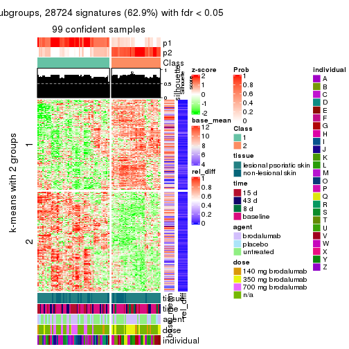</p>

</div>
<div id='tab-MAD-pam-get-signatures-2'>
<pre><code class="r">get_signatures(res, k = 3)
</code></pre>

<p></p>

</div>
<div id='tab-MAD-pam-get-signatures-3'>
<pre><code class="r">get_signatures(res, k = 4)
</code></pre>

<p></p>

</div>
<div id='tab-MAD-pam-get-signatures-4'>
<pre><code class="r">get_signatures(res, k = 5)
</code></pre>

<p></p>

</div>
<div id='tab-MAD-pam-get-signatures-5'>
<pre><code class="r">get_signatures(res, k = 6)
</code></pre>

<p></p>

</div>
</div>


Signature heatmaps where rows are not scaled:


<script>
$( function() {
	$( '#tabs-MAD-pam-get-signatures-no-scale' ).tabs();
} );
</script>
<div id='tabs-MAD-pam-get-signatures-no-scale'>
<ul>
<li><a href='#tab-MAD-pam-get-signatures-no-scale-1'>k = 2</a></li>
<li><a href='#tab-MAD-pam-get-signatures-no-scale-2'>k = 3</a></li>
<li><a href='#tab-MAD-pam-get-signatures-no-scale-3'>k = 4</a></li>
<li><a href='#tab-MAD-pam-get-signatures-no-scale-4'>k = 5</a></li>
<li><a href='#tab-MAD-pam-get-signatures-no-scale-5'>k = 6</a></li>
</ul>
<div id='tab-MAD-pam-get-signatures-no-scale-1'>
<pre><code class="r">get_signatures(res, k = 2, scale_rows = FALSE)
</code></pre>

<p></p>

</div>
<div id='tab-MAD-pam-get-signatures-no-scale-2'>
<pre><code class="r">get_signatures(res, k = 3, scale_rows = FALSE)
</code></pre>

<p></p>

</div>
<div id='tab-MAD-pam-get-signatures-no-scale-3'>
<pre><code class="r">get_signatures(res, k = 4, scale_rows = FALSE)
</code></pre>

<p></p>

</div>
<div id='tab-MAD-pam-get-signatures-no-scale-4'>
<pre><code class="r">get_signatures(res, k = 5, scale_rows = FALSE)
</code></pre>

<p></p>

</div>
<div id='tab-MAD-pam-get-signatures-no-scale-5'>
<pre><code class="r">get_signatures(res, k = 6, scale_rows = FALSE)
</code></pre>

<p></p>

</div>
</div>


Compare the overlap of signatures from different k:

```r
compare_signatures(res)
```


`get_signature()` returns a data frame invisibly. TO get the list of signatures, the function
call should be assigned to a variable explicitly. In following code, if `plot` argument is set
to `FALSE`, no heatmap is plotted while only the differential analysis is performed.

```r
# code only for demonstration
tb = get_signature(res, k = ..., plot = FALSE)
```

An example of the output of `tb` is:

```
#>   which_row         fdr    mean_1    mean_2 scaled_mean_1 scaled_mean_2 km
#> 1        38 0.042760348  8.373488  9.131774    -0.5533452     0.5164555  1
#> 2        40 0.018707592  7.106213  8.469186    -0.6173731     0.5762149  1
#> 3        55 0.019134737 10.221463 11.207825    -0.6159697     0.5749050  1
#> 4        59 0.006059896  5.921854  7.869574    -0.6899429     0.6439467  1
#> 5        60 0.018055526  8.928898 10.211722    -0.6204761     0.5791110  1
#> 6        98 0.009384629 15.714769 14.887706     0.6635654    -0.6193277  2
...
```

The columns in `tb` are:

1. `which_row`: row indices corresponding to the input matrix.
2. `fdr`: FDR for the differential test. 
3. `mean_x`: The mean value in group x.
4. `scaled_mean_x`: The mean value in group x after rows are scaled.
5. `km`: Row groups if k-means clustering is applied to rows.


UMAP plot which shows how samples are separated.


<script>
$( function() {
	$( '#tabs-MAD-pam-dimension-reduction' ).tabs();
} );
</script>
<div id='tabs-MAD-pam-dimension-reduction'>
<ul>
<li><a href='#tab-MAD-pam-dimension-reduction-1'>k = 2</a></li>
<li><a href='#tab-MAD-pam-dimension-reduction-2'>k = 3</a></li>
<li><a href='#tab-MAD-pam-dimension-reduction-3'>k = 4</a></li>
<li><a href='#tab-MAD-pam-dimension-reduction-4'>k = 5</a></li>
<li><a href='#tab-MAD-pam-dimension-reduction-5'>k = 6</a></li>
</ul>
<div id='tab-MAD-pam-dimension-reduction-1'>
<pre><code class="r">dimension_reduction(res, k = 2, method = &quot;UMAP&quot;)
</code></pre>

<p></p>

</div>
<div id='tab-MAD-pam-dimension-reduction-2'>
<pre><code class="r">dimension_reduction(res, k = 3, method = &quot;UMAP&quot;)
</code></pre>

<p></p>

</div>
<div id='tab-MAD-pam-dimension-reduction-3'>
<pre><code class="r">dimension_reduction(res, k = 4, method = &quot;UMAP&quot;)
</code></pre>

<p></p>

</div>
<div id='tab-MAD-pam-dimension-reduction-4'>
<pre><code class="r">dimension_reduction(res, k = 5, method = &quot;UMAP&quot;)
</code></pre>

<p></p>

</div>
<div id='tab-MAD-pam-dimension-reduction-5'>
<pre><code class="r">dimension_reduction(res, k = 6, method = &quot;UMAP&quot;)
</code></pre>

<p></p>

</div>
</div>


Following heatmap shows how subgroups are split when increasing `k`:

```r
collect_classes(res)
```


Test correlation between subgroups and known annotations. If the known
annotation is numeric, one-way ANOVA test is applied, and if the known
annotation is discrete, chi-squared contingency table test is applied.

```r
test_to_known_factors(res)
```

```
#>          n tissue(p) time(p) agent(p)  dose(p) individual(p) k
#> MAD:pam 99  9.25e-01  0.0397   0.6523 8.96e-06      1.16e-07 2
#> MAD:pam 95  3.04e-03  0.0175   0.0234 1.40e-07      4.34e-08 3
#> MAD:pam 95  3.28e-04  0.1725   0.0157 6.47e-08      4.03e-05 4
#> MAD:pam 92  5.65e-04  0.1533   0.0210 1.13e-07      5.35e-05 5
#> MAD:pam 84  4.81e-05  0.3129   0.0115 1.77e-09      6.83e-05 6
```


If matrix rows can be associated to genes, consider to use `functional_enrichment(res,
...)` to perform function enrichment for the signature genes. See [this vignette](http://bioconductor.org/packages/devel/bioc/vignettes/cola/inst/doc/functional_enrichment.html) for more detailed explanations.


 

---------------------------------------------------


### MAD:mclust


The object with results only for a single top-value method and a single partition method 
can be extracted as:

```r
res = res_list["MAD", "mclust"]
# you can also extract it by
# res = res_list["MAD:mclust"]
```

A summary of `res` and all the functions that can be applied to it:

```r
res
```

```
#> A 'ConsensusPartition' object with k = 2, 3, 4, 5, 6.
#>   On a matrix with 45638 rows and 99 columns.
#>   Top rows (1000, 2000, 3000, 4000, 5000) are extracted by 'MAD' method.
#>   Subgroups are detected by 'mclust' method.
#>   Performed in total 1250 partitions by row resampling.
#>   Best k for subgroups seems to be 3.
#> 
#> Following methods can be applied to this 'ConsensusPartition' object:
#>  [1] "cola_report"             "collect_classes"         "collect_plots"          
#>  [4] "collect_stats"           "colnames"                "compare_signatures"     
#>  [7] "consensus_heatmap"       "dimension_reduction"     "functional_enrichment"  
#> [10] "get_anno_col"            "get_anno"                "get_classes"            
#> [13] "get_consensus"           "get_matrix"              "get_membership"         
#> [16] "get_param"               "get_signatures"          "get_stats"              
#> [19] "is_best_k"               "is_stable_k"             "membership_heatmap"     
#> [22] "ncol"                    "nrow"                    "plot_ecdf"              
#> [25] "rownames"                "select_partition_number" "show"                   
#> [28] "suggest_best_k"          "test_to_known_factors"
```

`collect_plots()` function collects all the plots made from `res` for all `k` (number of partitions)
into one single page to provide an easy and fast comparison between different `k`.

```r
collect_plots(res)
```


The plots are:

- The first row: a plot of the ECDF (empirical cumulative distribution
  function) curves of the consensus matrix for each `k` and the heatmap of
  predicted classes for each `k`.
- The second row: heatmaps of the consensus matrix for each `k`.
- The third row: heatmaps of the membership matrix for each `k`.
- The fouth row: heatmaps of the signatures for each `k`.

All the plots in panels can be made by individual functions and they are
plotted later in this section.

`select_partition_number()` produces several plots showing different
statistics for choosing "optimized" `k`. There are following statistics:

- ECDF curves of the consensus matrix for each `k`;
- 1-PAC. [The PAC
  score](https://en.wikipedia.org/wiki/Consensus_clustering#Over-interpretation_potential_of_consensus_clustering)
  measures the proportion of the ambiguous subgrouping.
- Mean silhouette score.
- Concordance. The mean probability of fiting the consensus class ids in all
  partitions.
- Area increased. Denote $A_k$ as the area under the ECDF curve for current
  `k`, the area increased is defined as $A_k - A_{k-1}$.
- Rand index. The percent of pairs of samples that are both in a same cluster
  or both are not in a same cluster in the partition of k and k-1.
- Jaccard index. The ratio of pairs of samples are both in a same cluster in
  the partition of k and k-1 and the pairs of samples are both in a same
  cluster in the partition k or k-1.

The detailed explanations of these statistics can be found in [the _cola_
vignette](http://bioconductor.org/packages/devel/bioc/vignettes/cola/inst/doc/cola.html#toc_13).

Generally speaking, lower PAC score, higher mean silhouette score or higher
concordance corresponds to better partition. Rand index and Jaccard index
measure how similar the current partition is compared to partition with `k-1`.
If they are too similar, we won't accept `k` is better than `k-1`.

```r
select_partition_number(res)
```


The numeric values for all these statistics can be obtained by `get_stats()`.

```r
get_stats(res)
```

```
#>   k 1-PAC mean_silhouette concordance area_increased  Rand Jaccard
#> 2 2 0.440           0.410       0.778         0.3964 0.499   0.499
#> 3 3 0.796           0.886       0.937         0.6588 0.673   0.434
#> 4 4 0.629           0.618       0.752         0.0730 0.806   0.514
#> 5 5 0.788           0.795       0.872         0.0976 0.801   0.422
#> 6 6 0.793           0.791       0.885         0.0609 0.871   0.498
```

`suggest_best_k()` suggests the best $k$ based on these statistics. The rules are as follows:

- All $k$ with Jaccard index larger than 0.95 are removed because increasing
  $k$ does not provide enough extra information. If all $k$ are removed, it is
  marked as no subgroup is detected.
- For all $k$ with 1-PAC score larger than 0.9, the maximal $k$ is taken as
  the best $k$, and other $k$ are marked as optional $k$.
- If it does not fit the second rule. The $k$ with the maximal vote of the
  highest 1-PAC score, highest mean silhouette, and highest concordance is
  taken as the best $k$.

```r
suggest_best_k(res)
```

```
#> [1] 3
```


Following shows the table of the partitions (You need to click the **show/hide
code output** link to see it). The membership matrix (columns with name `p*`)
is inferred by
[`clue::cl_consensus()`](https://www.rdocumentation.org/link/cl_consensus?package=clue)
function with the `SE` method. Basically the value in the membership matrix
represents the probability to belong to a certain group. The finall class
label for an item is determined with the group with highest probability it
belongs to.

In `get_classes()` function, the entropy is calculated from the membership
matrix and the silhouette score is calculated from the consensus matrix.


<script>
$( function() {
	$( '#tabs-MAD-mclust-get-classes' ).tabs();
} );
</script>
<div id='tabs-MAD-mclust-get-classes'>
<ul>
<li><a href='#tab-MAD-mclust-get-classes-1'>k = 2</a></li>
<li><a href='#tab-MAD-mclust-get-classes-2'>k = 3</a></li>
<li><a href='#tab-MAD-mclust-get-classes-3'>k = 4</a></li>
<li><a href='#tab-MAD-mclust-get-classes-4'>k = 5</a></li>
<li><a href='#tab-MAD-mclust-get-classes-5'>k = 6</a></li>
</ul>

<div id='tab-MAD-mclust-get-classes-1'>
<p><a id='tab-MAD-mclust-get-classes-1-a' style='color:#0366d6' href='#'>show/hide code output</a></p>
<pre><code class="r">cbind(get_classes(res, k = 2), get_membership(res, k = 2))
</code></pre>

<pre><code>#&gt;            class entropy silhouette    p1    p2
#&gt; GSM1296094     2   1.000    -0.1077 0.488 0.512
#&gt; GSM1296119     2   0.000     0.6612 0.000 1.000
#&gt; GSM1296076     1   0.983     0.4284 0.576 0.424
#&gt; GSM1296092     1   0.983     0.4284 0.576 0.424
#&gt; GSM1296103     2   1.000    -0.1077 0.488 0.512
#&gt; GSM1296078     1   0.983     0.4284 0.576 0.424
#&gt; GSM1296107     2   0.000     0.6612 0.000 1.000
#&gt; GSM1296109     2   1.000    -0.1077 0.488 0.512
#&gt; GSM1296080     1   0.991     0.3663 0.556 0.444
#&gt; GSM1296090     1   0.983     0.4284 0.576 0.424
#&gt; GSM1296074     1   0.983     0.4284 0.576 0.424
#&gt; GSM1296111     2   0.000     0.6612 0.000 1.000
#&gt; GSM1296099     2   1.000    -0.1077 0.488 0.512
#&gt; GSM1296086     1   0.983     0.4284 0.576 0.424
#&gt; GSM1296117     2   0.000     0.6612 0.000 1.000
#&gt; GSM1296113     2   0.000     0.6612 0.000 1.000
#&gt; GSM1296096     2   1.000    -0.1077 0.488 0.512
#&gt; GSM1296105     1   0.998     0.2426 0.524 0.476
#&gt; GSM1296098     2   1.000    -0.1077 0.488 0.512
#&gt; GSM1296101     2   1.000    -0.1077 0.488 0.512
#&gt; GSM1296121     2   0.000     0.6612 0.000 1.000
#&gt; GSM1296088     1   0.983     0.4284 0.576 0.424
#&gt; GSM1296082     1   0.983     0.4284 0.576 0.424
#&gt; GSM1296115     2   0.000     0.6612 0.000 1.000
#&gt; GSM1296084     1   0.983     0.4284 0.576 0.424
#&gt; GSM1296072     2   0.000     0.6612 0.000 1.000
#&gt; GSM1296069     2   0.000     0.6612 0.000 1.000
#&gt; GSM1296071     2   0.000     0.6612 0.000 1.000
#&gt; GSM1296070     2   0.000     0.6612 0.000 1.000
#&gt; GSM1296073     2   0.000     0.6612 0.000 1.000
#&gt; GSM1296034     2   1.000    -0.1077 0.488 0.512
#&gt; GSM1296041     2   0.000     0.6612 0.000 1.000
#&gt; GSM1296035     2   1.000    -0.1077 0.488 0.512
#&gt; GSM1296038     2   1.000    -0.1077 0.488 0.512
#&gt; GSM1296047     2   0.000     0.6612 0.000 1.000
#&gt; GSM1296039     2   1.000    -0.1452 0.496 0.504
#&gt; GSM1296042     2   0.000     0.6612 0.000 1.000
#&gt; GSM1296043     2   0.000     0.6612 0.000 1.000
#&gt; GSM1296037     1   0.000     0.6033 1.000 0.000
#&gt; GSM1296046     2   0.000     0.6612 0.000 1.000
#&gt; GSM1296044     2   0.000     0.6612 0.000 1.000
#&gt; GSM1296045     2   0.000     0.6612 0.000 1.000
#&gt; GSM1296025     1   0.000     0.6033 1.000 0.000
#&gt; GSM1296033     1   0.983     0.4284 0.576 0.424
#&gt; GSM1296027     1   0.000     0.6033 1.000 0.000
#&gt; GSM1296032     1   0.000     0.6033 1.000 0.000
#&gt; GSM1296024     1   0.000     0.6033 1.000 0.000
#&gt; GSM1296031     1   0.000     0.6033 1.000 0.000
#&gt; GSM1296028     1   0.295     0.5927 0.948 0.052
#&gt; GSM1296029     1   0.000     0.6033 1.000 0.000
#&gt; GSM1296026     1   0.983     0.4284 0.576 0.424
#&gt; GSM1296030     1   0.983     0.4284 0.576 0.424
#&gt; GSM1296040     2   1.000    -0.1077 0.488 0.512
#&gt; GSM1296036     2   1.000    -0.1077 0.488 0.512
#&gt; GSM1296048     2   0.000     0.6612 0.000 1.000
#&gt; GSM1296059     2   1.000    -0.1077 0.488 0.512
#&gt; GSM1296066     2   0.000     0.6612 0.000 1.000
#&gt; GSM1296060     2   1.000    -0.1077 0.488 0.512
#&gt; GSM1296063     2   0.788     0.4374 0.236 0.764
#&gt; GSM1296064     2   0.999    -0.0985 0.484 0.516
#&gt; GSM1296067     2   0.900     0.3015 0.316 0.684
#&gt; GSM1296062     2   1.000    -0.1077 0.488 0.512
#&gt; GSM1296068     2   0.000     0.6612 0.000 1.000
#&gt; GSM1296050     1   0.973     0.4402 0.596 0.404
#&gt; GSM1296057     1   0.983     0.4284 0.576 0.424
#&gt; GSM1296052     1   0.000     0.6033 1.000 0.000
#&gt; GSM1296054     1   0.000     0.6033 1.000 0.000
#&gt; GSM1296049     1   0.000     0.6033 1.000 0.000
#&gt; GSM1296055     1   0.997     0.3068 0.532 0.468
#&gt; GSM1296053     1   0.000     0.6033 1.000 0.000
#&gt; GSM1296058     1   0.983     0.4284 0.576 0.424
#&gt; GSM1296051     1   0.983     0.4284 0.576 0.424
#&gt; GSM1296056     1   0.983     0.4284 0.576 0.424
#&gt; GSM1296065     2   0.978     0.0653 0.412 0.588
#&gt; GSM1296061     2   1.000    -0.1077 0.488 0.512
#&gt; GSM1296095     2   0.994    -0.0290 0.456 0.544
#&gt; GSM1296120     2   0.000     0.6612 0.000 1.000
#&gt; GSM1296077     1   0.000     0.6033 1.000 0.000
#&gt; GSM1296093     1   0.000     0.6033 1.000 0.000
#&gt; GSM1296104     1   1.000     0.2292 0.508 0.492
#&gt; GSM1296079     1   0.000     0.6033 1.000 0.000
#&gt; GSM1296108     2   0.000     0.6612 0.000 1.000
#&gt; GSM1296110     2   0.000     0.6612 0.000 1.000
#&gt; GSM1296081     1   0.000     0.6033 1.000 0.000
#&gt; GSM1296091     1   0.983     0.4284 0.576 0.424
#&gt; GSM1296075     1   0.983     0.4284 0.576 0.424
#&gt; GSM1296112     2   0.000     0.6612 0.000 1.000
#&gt; GSM1296100     1   0.000     0.6033 1.000 0.000
#&gt; GSM1296087     1   0.929     0.4682 0.656 0.344
#&gt; GSM1296118     2   0.000     0.6612 0.000 1.000
#&gt; GSM1296114     2   0.000     0.6612 0.000 1.000
#&gt; GSM1296097     1   0.995     0.3160 0.540 0.460
#&gt; GSM1296106     2   0.996    -0.0508 0.464 0.536
#&gt; GSM1296102     2   1.000    -0.1395 0.496 0.504
#&gt; GSM1296122     2   0.000     0.6612 0.000 1.000
#&gt; GSM1296089     1   0.402     0.5832 0.920 0.080
#&gt; GSM1296083     1   0.000     0.6033 1.000 0.000
#&gt; GSM1296116     2   0.000     0.6612 0.000 1.000
#&gt; GSM1296085     1   0.000     0.6033 1.000 0.000
</code></pre>

<script>
$('#tab-MAD-mclust-get-classes-1-a').parent().next().next().hide();
$('#tab-MAD-mclust-get-classes-1-a').click(function(){
  $('#tab-MAD-mclust-get-classes-1-a').parent().next().next().toggle();
  return(false);
});
</script>
</div>

<div id='tab-MAD-mclust-get-classes-2'>
<p><a id='tab-MAD-mclust-get-classes-2-a' style='color:#0366d6' href='#'>show/hide code output</a></p>
<pre><code class="r">cbind(get_classes(res, k = 3), get_membership(res, k = 3))
</code></pre>

<pre><code>#&gt;            class entropy silhouette    p1    p2    p3
#&gt; GSM1296094     3  0.0000      0.999 0.000 0.000 1.000
#&gt; GSM1296119     2  0.0747      0.920 0.000 0.984 0.016
#&gt; GSM1296076     3  0.0000      0.999 0.000 0.000 1.000
#&gt; GSM1296092     3  0.0000      0.999 0.000 0.000 1.000
#&gt; GSM1296103     3  0.0000      0.999 0.000 0.000 1.000
#&gt; GSM1296078     3  0.0000      0.999 0.000 0.000 1.000
#&gt; GSM1296107     2  0.0747      0.920 0.000 0.984 0.016
#&gt; GSM1296109     3  0.0747      0.980 0.000 0.016 0.984
#&gt; GSM1296080     3  0.0000      0.999 0.000 0.000 1.000
#&gt; GSM1296090     3  0.0000      0.999 0.000 0.000 1.000
#&gt; GSM1296074     3  0.0000      0.999 0.000 0.000 1.000
#&gt; GSM1296111     2  0.0747      0.920 0.000 0.984 0.016
#&gt; GSM1296099     3  0.0000      0.999 0.000 0.000 1.000
#&gt; GSM1296086     3  0.0000      0.999 0.000 0.000 1.000
#&gt; GSM1296117     2  0.0747      0.920 0.000 0.984 0.016
#&gt; GSM1296113     2  0.0747      0.920 0.000 0.984 0.016
#&gt; GSM1296096     3  0.0000      0.999 0.000 0.000 1.000
#&gt; GSM1296105     1  0.5859      0.623 0.656 0.000 0.344
#&gt; GSM1296098     3  0.0000      0.999 0.000 0.000 1.000
#&gt; GSM1296101     3  0.0000      0.999 0.000 0.000 1.000
#&gt; GSM1296121     2  0.0892      0.919 0.000 0.980 0.020
#&gt; GSM1296088     3  0.0000      0.999 0.000 0.000 1.000
#&gt; GSM1296082     3  0.0000      0.999 0.000 0.000 1.000
#&gt; GSM1296115     2  0.0747      0.920 0.000 0.984 0.016
#&gt; GSM1296084     3  0.0000      0.999 0.000 0.000 1.000
#&gt; GSM1296072     2  0.1031      0.917 0.000 0.976 0.024
#&gt; GSM1296069     2  0.0747      0.920 0.000 0.984 0.016
#&gt; GSM1296071     2  0.0000      0.916 0.000 1.000 0.000
#&gt; GSM1296070     2  0.0747      0.920 0.000 0.984 0.016
#&gt; GSM1296073     2  0.1031      0.917 0.000 0.976 0.024
#&gt; GSM1296034     1  0.5560      0.694 0.700 0.000 0.300
#&gt; GSM1296041     2  0.0747      0.920 0.000 0.984 0.016
#&gt; GSM1296035     3  0.0000      0.999 0.000 0.000 1.000
#&gt; GSM1296038     2  0.5859      0.562 0.000 0.656 0.344
#&gt; GSM1296047     2  0.0237      0.917 0.000 0.996 0.004
#&gt; GSM1296039     3  0.0000      0.999 0.000 0.000 1.000
#&gt; GSM1296042     2  0.0747      0.920 0.000 0.984 0.016
#&gt; GSM1296043     2  0.0000      0.916 0.000 1.000 0.000
#&gt; GSM1296037     1  0.0000      0.879 1.000 0.000 0.000
#&gt; GSM1296046     2  0.0000      0.916 0.000 1.000 0.000
#&gt; GSM1296044     2  0.0000      0.916 0.000 1.000 0.000
#&gt; GSM1296045     2  0.0592      0.919 0.000 0.988 0.012
#&gt; GSM1296025     1  0.0000      0.879 1.000 0.000 0.000
#&gt; GSM1296033     1  0.5327      0.729 0.728 0.000 0.272
#&gt; GSM1296027     1  0.0000      0.879 1.000 0.000 0.000
#&gt; GSM1296032     1  0.0000      0.879 1.000 0.000 0.000
#&gt; GSM1296024     1  0.0000      0.879 1.000 0.000 0.000
#&gt; GSM1296031     1  0.0000      0.879 1.000 0.000 0.000
#&gt; GSM1296028     1  0.0747      0.875 0.984 0.000 0.016
#&gt; GSM1296029     1  0.0892      0.874 0.980 0.000 0.020
#&gt; GSM1296026     3  0.0000      0.999 0.000 0.000 1.000
#&gt; GSM1296030     3  0.0000      0.999 0.000 0.000 1.000
#&gt; GSM1296040     3  0.0000      0.999 0.000 0.000 1.000
#&gt; GSM1296036     3  0.0000      0.999 0.000 0.000 1.000
#&gt; GSM1296048     2  0.1031      0.917 0.000 0.976 0.024
#&gt; GSM1296059     3  0.0000      0.999 0.000 0.000 1.000
#&gt; GSM1296066     2  0.0747      0.920 0.000 0.984 0.016
#&gt; GSM1296060     3  0.0000      0.999 0.000 0.000 1.000
#&gt; GSM1296063     2  0.6129      0.590 0.008 0.668 0.324
#&gt; GSM1296064     3  0.0000      0.999 0.000 0.000 1.000
#&gt; GSM1296067     2  0.5285      0.709 0.004 0.752 0.244
#&gt; GSM1296062     3  0.0000      0.999 0.000 0.000 1.000
#&gt; GSM1296068     2  0.0000      0.916 0.000 1.000 0.000
#&gt; GSM1296050     1  0.5327      0.729 0.728 0.000 0.272
#&gt; GSM1296057     1  0.5327      0.729 0.728 0.000 0.272
#&gt; GSM1296052     1  0.0000      0.879 1.000 0.000 0.000
#&gt; GSM1296054     1  0.0000      0.879 1.000 0.000 0.000
#&gt; GSM1296049     1  0.0000      0.879 1.000 0.000 0.000
#&gt; GSM1296055     1  0.5728      0.723 0.720 0.008 0.272
#&gt; GSM1296053     1  0.0000      0.879 1.000 0.000 0.000
#&gt; GSM1296058     1  0.5327      0.729 0.728 0.000 0.272
#&gt; GSM1296051     3  0.0000      0.999 0.000 0.000 1.000
#&gt; GSM1296056     3  0.0000      0.999 0.000 0.000 1.000
#&gt; GSM1296065     2  0.7465      0.609 0.072 0.656 0.272
#&gt; GSM1296061     3  0.0000      0.999 0.000 0.000 1.000
#&gt; GSM1296095     2  0.5327      0.673 0.000 0.728 0.272
#&gt; GSM1296120     2  0.0237      0.917 0.000 0.996 0.004
#&gt; GSM1296077     1  0.0000      0.879 1.000 0.000 0.000
#&gt; GSM1296093     1  0.0000      0.879 1.000 0.000 0.000
#&gt; GSM1296104     2  0.7465      0.609 0.072 0.656 0.272
#&gt; GSM1296079     1  0.0000      0.879 1.000 0.000 0.000
#&gt; GSM1296108     2  0.0000      0.916 0.000 1.000 0.000
#&gt; GSM1296110     2  0.0000      0.916 0.000 1.000 0.000
#&gt; GSM1296081     1  0.0000      0.879 1.000 0.000 0.000
#&gt; GSM1296091     1  0.5327      0.729 0.728 0.000 0.272
#&gt; GSM1296075     1  0.5327      0.729 0.728 0.000 0.272
#&gt; GSM1296112     2  0.0000      0.916 0.000 1.000 0.000
#&gt; GSM1296100     1  0.0000      0.879 1.000 0.000 0.000
#&gt; GSM1296087     1  0.3412      0.827 0.876 0.000 0.124
#&gt; GSM1296118     2  0.0000      0.916 0.000 1.000 0.000
#&gt; GSM1296114     2  0.0000      0.916 0.000 1.000 0.000
#&gt; GSM1296097     2  0.7697      0.594 0.084 0.644 0.272
#&gt; GSM1296106     1  0.8817      0.549 0.568 0.160 0.272
#&gt; GSM1296102     1  0.5291      0.732 0.732 0.000 0.268
#&gt; GSM1296122     2  0.4883      0.744 0.004 0.788 0.208
#&gt; GSM1296089     1  0.0747      0.876 0.984 0.000 0.016
#&gt; GSM1296083     1  0.0000      0.879 1.000 0.000 0.000
#&gt; GSM1296116     2  0.0000      0.916 0.000 1.000 0.000
#&gt; GSM1296085     1  0.0000      0.879 1.000 0.000 0.000
</code></pre>

<script>
$('#tab-MAD-mclust-get-classes-2-a').parent().next().next().hide();
$('#tab-MAD-mclust-get-classes-2-a').click(function(){
  $('#tab-MAD-mclust-get-classes-2-a').parent().next().next().toggle();
  return(false);
});
</script>
</div>

<div id='tab-MAD-mclust-get-classes-3'>
<p><a id='tab-MAD-mclust-get-classes-3-a' style='color:#0366d6' href='#'>show/hide code output</a></p>
<pre><code class="r">cbind(get_classes(res, k = 4), get_membership(res, k = 4))
</code></pre>

<pre><code>#&gt;            class entropy silhouette    p1    p2    p3    p4
#&gt; GSM1296094     3  0.4866    0.93776 0.000 0.000 0.596 0.404
#&gt; GSM1296119     2  0.1302    0.76181 0.000 0.956 0.000 0.044
#&gt; GSM1296076     4  0.1109    0.45232 0.004 0.000 0.028 0.968
#&gt; GSM1296092     4  0.1109    0.45232 0.004 0.000 0.028 0.968
#&gt; GSM1296103     3  0.4877    0.94133 0.000 0.000 0.592 0.408
#&gt; GSM1296078     4  0.1109    0.45232 0.004 0.000 0.028 0.968
#&gt; GSM1296107     2  0.1118    0.76490 0.000 0.964 0.000 0.036
#&gt; GSM1296109     4  0.5143   -0.63563 0.000 0.004 0.456 0.540
#&gt; GSM1296080     3  0.5000    0.73810 0.000 0.000 0.500 0.500
#&gt; GSM1296090     4  0.1109    0.45232 0.004 0.000 0.028 0.968
#&gt; GSM1296074     4  0.1109    0.45232 0.004 0.000 0.028 0.968
#&gt; GSM1296111     2  0.1118    0.76490 0.000 0.964 0.000 0.036
#&gt; GSM1296099     4  0.4977   -0.64093 0.000 0.000 0.460 0.540
#&gt; GSM1296086     4  0.0657    0.44778 0.004 0.000 0.012 0.984
#&gt; GSM1296117     2  0.1118    0.76490 0.000 0.964 0.000 0.036
#&gt; GSM1296113     2  0.1118    0.76490 0.000 0.964 0.000 0.036
#&gt; GSM1296096     4  0.4985   -0.66213 0.000 0.000 0.468 0.532
#&gt; GSM1296105     4  0.7188    0.18778 0.308 0.000 0.164 0.528
#&gt; GSM1296098     3  0.4866    0.93776 0.000 0.000 0.596 0.404
#&gt; GSM1296101     3  0.4888    0.94195 0.000 0.000 0.588 0.412
#&gt; GSM1296121     2  0.1302    0.76181 0.000 0.956 0.000 0.044
#&gt; GSM1296088     4  0.4509   -0.09951 0.004 0.000 0.288 0.708
#&gt; GSM1296082     4  0.1109    0.45232 0.004 0.000 0.028 0.968
#&gt; GSM1296115     2  0.1118    0.76490 0.000 0.964 0.000 0.036
#&gt; GSM1296084     4  0.6142    0.18463 0.140 0.000 0.184 0.676
#&gt; GSM1296072     2  0.5923    0.81045 0.000 0.580 0.376 0.044
#&gt; GSM1296069     2  0.5062    0.81493 0.000 0.680 0.300 0.020
#&gt; GSM1296071     2  0.5085    0.81910 0.000 0.616 0.376 0.008
#&gt; GSM1296070     2  0.1305    0.76594 0.000 0.960 0.004 0.036
#&gt; GSM1296073     2  0.1743    0.75134 0.000 0.940 0.004 0.056
#&gt; GSM1296034     4  0.7927   -0.00538 0.324 0.004 0.252 0.420
#&gt; GSM1296041     2  0.1118    0.76490 0.000 0.964 0.000 0.036
#&gt; GSM1296035     3  0.4996    0.78553 0.000 0.000 0.516 0.484
#&gt; GSM1296038     4  0.4584    0.34628 0.004 0.300 0.000 0.696
#&gt; GSM1296047     2  0.5085    0.81910 0.000 0.616 0.376 0.008
#&gt; GSM1296039     4  0.3760    0.35112 0.004 0.012 0.156 0.828
#&gt; GSM1296042     2  0.1118    0.76490 0.000 0.964 0.000 0.036
#&gt; GSM1296043     2  0.4776    0.82051 0.000 0.624 0.376 0.000
#&gt; GSM1296037     1  0.0000    0.92452 1.000 0.000 0.000 0.000
#&gt; GSM1296046     2  0.4776    0.82051 0.000 0.624 0.376 0.000
#&gt; GSM1296044     2  0.4776    0.82051 0.000 0.624 0.376 0.000
#&gt; GSM1296045     2  0.5313    0.81905 0.000 0.608 0.376 0.016
#&gt; GSM1296025     1  0.0000    0.92452 1.000 0.000 0.000 0.000
#&gt; GSM1296033     4  0.5097    0.32258 0.428 0.004 0.000 0.568
#&gt; GSM1296027     1  0.0188    0.92322 0.996 0.000 0.000 0.004
#&gt; GSM1296032     1  0.0336    0.92160 0.992 0.000 0.000 0.008
#&gt; GSM1296024     1  0.0000    0.92452 1.000 0.000 0.000 0.000
#&gt; GSM1296031     1  0.0707    0.91555 0.980 0.000 0.000 0.020
#&gt; GSM1296028     1  0.1716    0.88098 0.936 0.000 0.000 0.064
#&gt; GSM1296029     1  0.1637    0.88091 0.940 0.000 0.000 0.060
#&gt; GSM1296026     4  0.5527    0.23533 0.104 0.000 0.168 0.728
#&gt; GSM1296030     4  0.6065    0.20061 0.140 0.000 0.176 0.684
#&gt; GSM1296040     3  0.4888    0.94195 0.000 0.000 0.588 0.412
#&gt; GSM1296036     3  0.4866    0.93776 0.000 0.000 0.596 0.404
#&gt; GSM1296048     2  0.1302    0.76181 0.000 0.956 0.000 0.044
#&gt; GSM1296059     3  0.4898    0.93732 0.000 0.000 0.584 0.416
#&gt; GSM1296066     2  0.1118    0.76490 0.000 0.964 0.000 0.036
#&gt; GSM1296060     4  0.5060   -0.48600 0.004 0.000 0.412 0.584
#&gt; GSM1296063     4  0.2831    0.43850 0.004 0.120 0.000 0.876
#&gt; GSM1296064     4  0.3067    0.45054 0.004 0.084 0.024 0.888
#&gt; GSM1296067     2  0.7563    0.66132 0.004 0.452 0.376 0.168
#&gt; GSM1296062     3  0.4916    0.92873 0.000 0.000 0.576 0.424
#&gt; GSM1296068     2  0.4776    0.82051 0.000 0.624 0.376 0.000
#&gt; GSM1296050     1  0.4819    0.32738 0.652 0.004 0.000 0.344
#&gt; GSM1296057     4  0.5126    0.31457 0.444 0.004 0.000 0.552
#&gt; GSM1296052     1  0.0000    0.92452 1.000 0.000 0.000 0.000
#&gt; GSM1296054     1  0.0000    0.92452 1.000 0.000 0.000 0.000
#&gt; GSM1296049     1  0.0000    0.92452 1.000 0.000 0.000 0.000
#&gt; GSM1296055     4  0.5618    0.40195 0.288 0.028 0.012 0.672
#&gt; GSM1296053     1  0.0000    0.92452 1.000 0.000 0.000 0.000
#&gt; GSM1296058     4  0.5126    0.31457 0.444 0.004 0.000 0.552
#&gt; GSM1296051     4  0.0376    0.45172 0.004 0.004 0.000 0.992
#&gt; GSM1296056     4  0.3402    0.33454 0.004 0.000 0.164 0.832
#&gt; GSM1296065     4  0.4844    0.35055 0.012 0.300 0.000 0.688
#&gt; GSM1296061     3  0.4888    0.93921 0.000 0.000 0.588 0.412
#&gt; GSM1296095     4  0.5105    0.22329 0.004 0.432 0.000 0.564
#&gt; GSM1296120     2  0.5085    0.81910 0.000 0.616 0.376 0.008
#&gt; GSM1296077     1  0.0000    0.92452 1.000 0.000 0.000 0.000
#&gt; GSM1296093     1  0.0000    0.92452 1.000 0.000 0.000 0.000
#&gt; GSM1296104     4  0.4820    0.35331 0.012 0.296 0.000 0.692
#&gt; GSM1296079     1  0.0000    0.92452 1.000 0.000 0.000 0.000
#&gt; GSM1296108     2  0.4776    0.82051 0.000 0.624 0.376 0.000
#&gt; GSM1296110     2  0.5085    0.81733 0.000 0.616 0.376 0.008
#&gt; GSM1296081     1  0.0000    0.92452 1.000 0.000 0.000 0.000
#&gt; GSM1296091     4  0.5119    0.31717 0.440 0.004 0.000 0.556
#&gt; GSM1296075     4  0.4634    0.40133 0.280 0.004 0.004 0.712
#&gt; GSM1296112     2  0.4776    0.82051 0.000 0.624 0.376 0.000
#&gt; GSM1296100     1  0.0000    0.92452 1.000 0.000 0.000 0.000
#&gt; GSM1296087     1  0.3494    0.73965 0.824 0.004 0.000 0.172
#&gt; GSM1296118     2  0.5085    0.81910 0.000 0.616 0.376 0.008
#&gt; GSM1296114     2  0.4776    0.82051 0.000 0.624 0.376 0.000
#&gt; GSM1296097     4  0.4933    0.35370 0.016 0.296 0.000 0.688
#&gt; GSM1296106     4  0.7056    0.40905 0.188 0.128 0.036 0.648
#&gt; GSM1296102     1  0.5155   -0.18682 0.528 0.004 0.000 0.468
#&gt; GSM1296122     2  0.6648    0.74680 0.000 0.536 0.372 0.092
#&gt; GSM1296089     1  0.2530    0.82723 0.888 0.000 0.000 0.112
#&gt; GSM1296083     1  0.0000    0.92452 1.000 0.000 0.000 0.000
#&gt; GSM1296116     2  0.4776    0.82051 0.000 0.624 0.376 0.000
#&gt; GSM1296085     1  0.0707    0.91525 0.980 0.000 0.000 0.020
</code></pre>

<script>
$('#tab-MAD-mclust-get-classes-3-a').parent().next().next().hide();
$('#tab-MAD-mclust-get-classes-3-a').click(function(){
  $('#tab-MAD-mclust-get-classes-3-a').parent().next().next().toggle();
  return(false);
});
</script>
</div>

<div id='tab-MAD-mclust-get-classes-4'>
<p><a id='tab-MAD-mclust-get-classes-4-a' style='color:#0366d6' href='#'>show/hide code output</a></p>
<pre><code class="r">cbind(get_classes(res, k = 5), get_membership(res, k = 5))
</code></pre>

<pre><code>#&gt;            class entropy silhouette    p1    p2    p3    p4    p5
#&gt; GSM1296094     3  0.0000      0.887 0.000 0.000 1.000 0.000 0.000
#&gt; GSM1296119     5  0.1544      0.884 0.000 0.068 0.000 0.000 0.932
#&gt; GSM1296076     4  0.0324      0.809 0.000 0.000 0.004 0.992 0.004
#&gt; GSM1296092     4  0.1041      0.814 0.000 0.000 0.032 0.964 0.004
#&gt; GSM1296103     3  0.0000      0.887 0.000 0.000 1.000 0.000 0.000
#&gt; GSM1296078     4  0.0324      0.809 0.000 0.000 0.004 0.992 0.004
#&gt; GSM1296107     5  0.1544      0.884 0.000 0.068 0.000 0.000 0.932
#&gt; GSM1296109     3  0.1908      0.870 0.000 0.000 0.908 0.092 0.000
#&gt; GSM1296080     3  0.1908      0.870 0.000 0.000 0.908 0.092 0.000
#&gt; GSM1296090     4  0.0324      0.809 0.000 0.000 0.004 0.992 0.004
#&gt; GSM1296074     4  0.0324      0.809 0.000 0.000 0.004 0.992 0.004
#&gt; GSM1296111     5  0.1544      0.884 0.000 0.068 0.000 0.000 0.932
#&gt; GSM1296099     3  0.1908      0.870 0.000 0.000 0.908 0.092 0.000
#&gt; GSM1296086     4  0.1121      0.814 0.000 0.000 0.044 0.956 0.000
#&gt; GSM1296117     5  0.1544      0.884 0.000 0.068 0.000 0.000 0.932
#&gt; GSM1296113     5  0.1544      0.884 0.000 0.068 0.000 0.000 0.932
#&gt; GSM1296096     3  0.2329      0.844 0.000 0.000 0.876 0.124 0.000
#&gt; GSM1296105     1  0.5615      0.474 0.584 0.000 0.320 0.096 0.000
#&gt; GSM1296098     3  0.0000      0.887 0.000 0.000 1.000 0.000 0.000
#&gt; GSM1296101     3  0.0000      0.887 0.000 0.000 1.000 0.000 0.000
#&gt; GSM1296121     5  0.1544      0.884 0.000 0.068 0.000 0.000 0.932
#&gt; GSM1296088     4  0.4114      0.558 0.000 0.000 0.376 0.624 0.000
#&gt; GSM1296082     4  0.0324      0.809 0.000 0.000 0.004 0.992 0.004
#&gt; GSM1296115     5  0.1544      0.884 0.000 0.068 0.000 0.000 0.932
#&gt; GSM1296084     4  0.4003      0.692 0.000 0.000 0.288 0.704 0.008
#&gt; GSM1296072     2  0.3809      0.602 0.000 0.736 0.000 0.008 0.256
#&gt; GSM1296069     2  0.2966      0.769 0.000 0.816 0.000 0.000 0.184
#&gt; GSM1296071     2  0.0162      0.967 0.000 0.996 0.000 0.000 0.004
#&gt; GSM1296070     5  0.1671      0.878 0.000 0.076 0.000 0.000 0.924
#&gt; GSM1296073     5  0.2046      0.876 0.000 0.068 0.000 0.016 0.916
#&gt; GSM1296034     3  0.5192      0.515 0.244 0.000 0.664 0.092 0.000
#&gt; GSM1296041     5  0.1544      0.884 0.000 0.068 0.000 0.000 0.932
#&gt; GSM1296035     3  0.2424      0.836 0.000 0.000 0.868 0.132 0.000
#&gt; GSM1296038     5  0.7236      0.404 0.000 0.068 0.220 0.184 0.528
#&gt; GSM1296047     2  0.0162      0.962 0.000 0.996 0.000 0.004 0.000
#&gt; GSM1296039     4  0.2848      0.803 0.000 0.000 0.156 0.840 0.004
#&gt; GSM1296042     5  0.1544      0.884 0.000 0.068 0.000 0.000 0.932
#&gt; GSM1296043     2  0.0162      0.967 0.000 0.996 0.000 0.000 0.004
#&gt; GSM1296037     1  0.0000      0.823 1.000 0.000 0.000 0.000 0.000
#&gt; GSM1296046     2  0.0162      0.967 0.000 0.996 0.000 0.000 0.004
#&gt; GSM1296044     2  0.0162      0.967 0.000 0.996 0.000 0.000 0.004
#&gt; GSM1296045     2  0.0162      0.967 0.000 0.996 0.000 0.000 0.004
#&gt; GSM1296025     1  0.0000      0.823 1.000 0.000 0.000 0.000 0.000
#&gt; GSM1296033     1  0.7653      0.369 0.472 0.004 0.208 0.248 0.068
#&gt; GSM1296027     1  0.0000      0.823 1.000 0.000 0.000 0.000 0.000
#&gt; GSM1296032     1  0.0880      0.815 0.968 0.000 0.000 0.000 0.032
#&gt; GSM1296024     1  0.0000      0.823 1.000 0.000 0.000 0.000 0.000
#&gt; GSM1296031     1  0.0000      0.823 1.000 0.000 0.000 0.000 0.000
#&gt; GSM1296028     1  0.1704      0.803 0.928 0.004 0.000 0.000 0.068
#&gt; GSM1296029     1  0.0000      0.823 1.000 0.000 0.000 0.000 0.000
#&gt; GSM1296026     4  0.3928      0.684 0.000 0.000 0.296 0.700 0.004
#&gt; GSM1296030     4  0.4046      0.682 0.000 0.000 0.296 0.696 0.008
#&gt; GSM1296040     3  0.0000      0.887 0.000 0.000 1.000 0.000 0.000
#&gt; GSM1296036     3  0.0000      0.887 0.000 0.000 1.000 0.000 0.000
#&gt; GSM1296048     5  0.1830      0.880 0.000 0.068 0.000 0.008 0.924
#&gt; GSM1296059     3  0.0000      0.887 0.000 0.000 1.000 0.000 0.000
#&gt; GSM1296066     5  0.1544      0.884 0.000 0.068 0.000 0.000 0.932
#&gt; GSM1296060     3  0.3074      0.750 0.000 0.000 0.804 0.196 0.000
#&gt; GSM1296063     5  0.6022      0.456 0.000 0.008 0.204 0.176 0.612
#&gt; GSM1296064     4  0.2929      0.803 0.000 0.000 0.152 0.840 0.008
#&gt; GSM1296067     2  0.0324      0.963 0.000 0.992 0.004 0.004 0.000
#&gt; GSM1296062     3  0.1908      0.870 0.000 0.000 0.908 0.092 0.000
#&gt; GSM1296068     2  0.0162      0.967 0.000 0.996 0.000 0.000 0.004
#&gt; GSM1296050     1  0.6052      0.661 0.684 0.004 0.144 0.100 0.068
#&gt; GSM1296057     1  0.6706      0.585 0.608 0.004 0.208 0.112 0.068
#&gt; GSM1296052     1  0.0000      0.823 1.000 0.000 0.000 0.000 0.000
#&gt; GSM1296054     1  0.0000      0.823 1.000 0.000 0.000 0.000 0.000
#&gt; GSM1296049     1  0.0000      0.823 1.000 0.000 0.000 0.000 0.000
#&gt; GSM1296055     1  0.6980      0.580 0.608 0.052 0.200 0.112 0.028
#&gt; GSM1296053     1  0.0000      0.823 1.000 0.000 0.000 0.000 0.000
#&gt; GSM1296058     1  0.7341      0.496 0.532 0.004 0.208 0.188 0.068
#&gt; GSM1296051     4  0.3398      0.756 0.000 0.004 0.216 0.780 0.000
#&gt; GSM1296056     4  0.2806      0.805 0.000 0.000 0.152 0.844 0.004
#&gt; GSM1296065     5  0.6610      0.536 0.000 0.072 0.208 0.112 0.608
#&gt; GSM1296061     3  0.0000      0.887 0.000 0.000 1.000 0.000 0.000
#&gt; GSM1296095     5  0.6540      0.537 0.000 0.068 0.212 0.108 0.612
#&gt; GSM1296120     2  0.0162      0.962 0.000 0.996 0.000 0.004 0.000
#&gt; GSM1296077     1  0.0000      0.823 1.000 0.000 0.000 0.000 0.000
#&gt; GSM1296093     1  0.0000      0.823 1.000 0.000 0.000 0.000 0.000
#&gt; GSM1296104     1  0.8273      0.178 0.340 0.004 0.208 0.116 0.332
#&gt; GSM1296079     1  0.0000      0.823 1.000 0.000 0.000 0.000 0.000
#&gt; GSM1296108     2  0.0162      0.967 0.000 0.996 0.000 0.000 0.004
#&gt; GSM1296110     2  0.0162      0.967 0.000 0.996 0.000 0.000 0.004
#&gt; GSM1296081     1  0.0000      0.823 1.000 0.000 0.000 0.000 0.000
#&gt; GSM1296091     1  0.6706      0.585 0.608 0.004 0.208 0.112 0.068
#&gt; GSM1296075     1  0.6706      0.585 0.608 0.004 0.208 0.112 0.068
#&gt; GSM1296112     2  0.0162      0.967 0.000 0.996 0.000 0.000 0.004
#&gt; GSM1296100     1  0.0000      0.823 1.000 0.000 0.000 0.000 0.000
#&gt; GSM1296087     1  0.2206      0.798 0.912 0.004 0.000 0.016 0.068
#&gt; GSM1296118     2  0.0000      0.964 0.000 1.000 0.000 0.000 0.000
#&gt; GSM1296114     2  0.0162      0.967 0.000 0.996 0.000 0.000 0.004
#&gt; GSM1296097     1  0.6874      0.583 0.608 0.020 0.208 0.112 0.052
#&gt; GSM1296106     1  0.6691      0.570 0.608 0.092 0.196 0.104 0.000
#&gt; GSM1296102     1  0.4803      0.650 0.720 0.000 0.184 0.096 0.000
#&gt; GSM1296122     2  0.0955      0.932 0.000 0.968 0.004 0.028 0.000
#&gt; GSM1296089     1  0.0000      0.823 1.000 0.000 0.000 0.000 0.000
#&gt; GSM1296083     1  0.0000      0.823 1.000 0.000 0.000 0.000 0.000
#&gt; GSM1296116     2  0.0162      0.967 0.000 0.996 0.000 0.000 0.004
#&gt; GSM1296085     1  0.1544      0.804 0.932 0.000 0.000 0.000 0.068
</code></pre>

<script>
$('#tab-MAD-mclust-get-classes-4-a').parent().next().next().hide();
$('#tab-MAD-mclust-get-classes-4-a').click(function(){
  $('#tab-MAD-mclust-get-classes-4-a').parent().next().next().toggle();
  return(false);
});
</script>
</div>

<div id='tab-MAD-mclust-get-classes-5'>
<p><a id='tab-MAD-mclust-get-classes-5-a' style='color:#0366d6' href='#'>show/hide code output</a></p>
<pre><code class="r">cbind(get_classes(res, k = 6), get_membership(res, k = 6))
</code></pre>

<pre><code>#&gt;            class entropy silhouette    p1    p2    p3    p4    p5    p6
#&gt; GSM1296094     3  0.0000     0.7959 0.000 0.000 1.000 0.000 0.000 0.000
#&gt; GSM1296119     5  0.0000     0.9880 0.000 0.000 0.000 0.000 1.000 0.000
#&gt; GSM1296076     4  0.0632     0.8579 0.000 0.000 0.000 0.976 0.000 0.024
#&gt; GSM1296092     4  0.0777     0.8571 0.000 0.000 0.004 0.972 0.000 0.024
#&gt; GSM1296103     3  0.0000     0.7959 0.000 0.000 1.000 0.000 0.000 0.000
#&gt; GSM1296078     4  0.0632     0.8579 0.000 0.000 0.000 0.976 0.000 0.024
#&gt; GSM1296107     5  0.0000     0.9880 0.000 0.000 0.000 0.000 1.000 0.000
#&gt; GSM1296109     3  0.6339     0.5364 0.000 0.000 0.576 0.180 0.100 0.144
#&gt; GSM1296080     6  0.3838     0.3256 0.000 0.000 0.448 0.000 0.000 0.552
#&gt; GSM1296090     4  0.0632     0.8579 0.000 0.000 0.000 0.976 0.000 0.024
#&gt; GSM1296074     4  0.0632     0.8579 0.000 0.000 0.000 0.976 0.000 0.024
#&gt; GSM1296111     5  0.0000     0.9880 0.000 0.000 0.000 0.000 1.000 0.000
#&gt; GSM1296099     3  0.4143     0.6639 0.000 0.000 0.736 0.180 0.000 0.084
#&gt; GSM1296086     4  0.1492     0.8408 0.000 0.000 0.036 0.940 0.000 0.024
#&gt; GSM1296117     5  0.0000     0.9880 0.000 0.000 0.000 0.000 1.000 0.000
#&gt; GSM1296113     5  0.0000     0.9880 0.000 0.000 0.000 0.000 1.000 0.000
#&gt; GSM1296096     3  0.4843     0.5180 0.000 0.000 0.616 0.300 0.000 0.084
#&gt; GSM1296105     6  0.2491     0.7393 0.000 0.000 0.164 0.000 0.000 0.836
#&gt; GSM1296098     3  0.0000     0.7959 0.000 0.000 1.000 0.000 0.000 0.000
#&gt; GSM1296101     3  0.0000     0.7959 0.000 0.000 1.000 0.000 0.000 0.000
#&gt; GSM1296121     5  0.0000     0.9880 0.000 0.000 0.000 0.000 1.000 0.000
#&gt; GSM1296088     3  0.6014     0.2142 0.000 0.000 0.428 0.264 0.000 0.308
#&gt; GSM1296082     4  0.0632     0.8579 0.000 0.000 0.000 0.976 0.000 0.024
#&gt; GSM1296115     5  0.0000     0.9880 0.000 0.000 0.000 0.000 1.000 0.000
#&gt; GSM1296084     6  0.4202     0.6450 0.000 0.000 0.224 0.064 0.000 0.712
#&gt; GSM1296072     2  0.0000     0.9569 0.000 1.000 0.000 0.000 0.000 0.000
#&gt; GSM1296069     2  0.3607     0.4508 0.000 0.652 0.000 0.000 0.348 0.000
#&gt; GSM1296071     2  0.0000     0.9569 0.000 1.000 0.000 0.000 0.000 0.000
#&gt; GSM1296070     5  0.1556     0.9049 0.000 0.080 0.000 0.000 0.920 0.000
#&gt; GSM1296073     5  0.1007     0.9430 0.000 0.000 0.000 0.044 0.956 0.000
#&gt; GSM1296034     6  0.3792     0.7405 0.108 0.000 0.112 0.000 0.000 0.780
#&gt; GSM1296041     5  0.0000     0.9880 0.000 0.000 0.000 0.000 1.000 0.000
#&gt; GSM1296035     3  0.4827     0.5249 0.000 0.000 0.620 0.296 0.000 0.084
#&gt; GSM1296038     6  0.5721     0.1657 0.000 0.000 0.176 0.344 0.000 0.480
#&gt; GSM1296047     2  0.0000     0.9569 0.000 1.000 0.000 0.000 0.000 0.000
#&gt; GSM1296039     4  0.2846     0.8068 0.000 0.000 0.060 0.856 0.000 0.084
#&gt; GSM1296042     5  0.0000     0.9880 0.000 0.000 0.000 0.000 1.000 0.000
#&gt; GSM1296043     2  0.0000     0.9569 0.000 1.000 0.000 0.000 0.000 0.000
#&gt; GSM1296037     1  0.2631     0.8623 0.840 0.000 0.008 0.000 0.000 0.152
#&gt; GSM1296046     2  0.0000     0.9569 0.000 1.000 0.000 0.000 0.000 0.000
#&gt; GSM1296044     2  0.0000     0.9569 0.000 1.000 0.000 0.000 0.000 0.000
#&gt; GSM1296045     2  0.0000     0.9569 0.000 1.000 0.000 0.000 0.000 0.000
#&gt; GSM1296025     1  0.0632     0.8583 0.976 0.000 0.000 0.024 0.000 0.000
#&gt; GSM1296033     6  0.0000     0.7936 0.000 0.000 0.000 0.000 0.000 1.000
#&gt; GSM1296027     1  0.1957     0.8993 0.888 0.000 0.000 0.000 0.000 0.112
#&gt; GSM1296032     1  0.1957     0.8993 0.888 0.000 0.000 0.000 0.000 0.112
#&gt; GSM1296024     1  0.0632     0.8583 0.976 0.000 0.000 0.024 0.000 0.000
#&gt; GSM1296031     1  0.3717     0.5724 0.616 0.000 0.000 0.000 0.000 0.384
#&gt; GSM1296028     1  0.3446     0.7161 0.692 0.000 0.000 0.000 0.000 0.308
#&gt; GSM1296029     1  0.3547     0.6754 0.668 0.000 0.000 0.000 0.000 0.332
#&gt; GSM1296026     6  0.4999     0.5503 0.000 0.000 0.240 0.128 0.000 0.632
#&gt; GSM1296030     6  0.4228     0.6409 0.000 0.000 0.228 0.064 0.000 0.708
#&gt; GSM1296040     3  0.0000     0.7959 0.000 0.000 1.000 0.000 0.000 0.000
#&gt; GSM1296036     3  0.0000     0.7959 0.000 0.000 1.000 0.000 0.000 0.000
#&gt; GSM1296048     5  0.0000     0.9880 0.000 0.000 0.000 0.000 1.000 0.000
#&gt; GSM1296059     3  0.0458     0.7911 0.000 0.000 0.984 0.016 0.000 0.000
#&gt; GSM1296066     5  0.0000     0.9880 0.000 0.000 0.000 0.000 1.000 0.000
#&gt; GSM1296060     3  0.4422     0.6307 0.000 0.000 0.700 0.212 0.000 0.088
#&gt; GSM1296063     4  0.5331     0.6178 0.000 0.000 0.024 0.652 0.184 0.140
#&gt; GSM1296064     4  0.2846     0.8068 0.000 0.000 0.060 0.856 0.000 0.084
#&gt; GSM1296067     2  0.3373     0.5976 0.000 0.744 0.008 0.000 0.000 0.248
#&gt; GSM1296062     6  0.3868     0.2029 0.000 0.000 0.492 0.000 0.000 0.508
#&gt; GSM1296068     2  0.0000     0.9569 0.000 1.000 0.000 0.000 0.000 0.000
#&gt; GSM1296050     6  0.2135     0.7294 0.128 0.000 0.000 0.000 0.000 0.872
#&gt; GSM1296057     6  0.0291     0.7944 0.004 0.000 0.004 0.000 0.000 0.992
#&gt; GSM1296052     1  0.1957     0.8993 0.888 0.000 0.000 0.000 0.000 0.112
#&gt; GSM1296054     1  0.0632     0.8583 0.976 0.000 0.000 0.024 0.000 0.000
#&gt; GSM1296049     1  0.1714     0.8973 0.908 0.000 0.000 0.000 0.000 0.092
#&gt; GSM1296055     6  0.0260     0.7961 0.000 0.000 0.008 0.000 0.000 0.992
#&gt; GSM1296053     1  0.2006     0.8990 0.892 0.000 0.000 0.004 0.000 0.104
#&gt; GSM1296058     6  0.0260     0.7961 0.000 0.000 0.008 0.000 0.000 0.992
#&gt; GSM1296051     4  0.5061     0.0751 0.000 0.000 0.076 0.496 0.000 0.428
#&gt; GSM1296056     4  0.2846     0.8068 0.000 0.000 0.060 0.856 0.000 0.084
#&gt; GSM1296065     6  0.1950     0.7619 0.000 0.000 0.024 0.064 0.000 0.912
#&gt; GSM1296061     3  0.0000     0.7959 0.000 0.000 1.000 0.000 0.000 0.000
#&gt; GSM1296095     6  0.6612     0.3387 0.000 0.000 0.128 0.240 0.108 0.524
#&gt; GSM1296120     2  0.0000     0.9569 0.000 1.000 0.000 0.000 0.000 0.000
#&gt; GSM1296077     1  0.1957     0.8993 0.888 0.000 0.000 0.000 0.000 0.112
#&gt; GSM1296093     1  0.0632     0.8583 0.976 0.000 0.000 0.024 0.000 0.000
#&gt; GSM1296104     6  0.0363     0.7956 0.000 0.000 0.012 0.000 0.000 0.988
#&gt; GSM1296079     1  0.1957     0.8993 0.888 0.000 0.000 0.000 0.000 0.112
#&gt; GSM1296108     2  0.0000     0.9569 0.000 1.000 0.000 0.000 0.000 0.000
#&gt; GSM1296110     2  0.0000     0.9569 0.000 1.000 0.000 0.000 0.000 0.000
#&gt; GSM1296081     1  0.1563     0.8869 0.932 0.000 0.000 0.012 0.000 0.056
#&gt; GSM1296091     6  0.0000     0.7936 0.000 0.000 0.000 0.000 0.000 1.000
#&gt; GSM1296075     6  0.0146     0.7952 0.000 0.000 0.004 0.000 0.000 0.996
#&gt; GSM1296112     2  0.0000     0.9569 0.000 1.000 0.000 0.000 0.000 0.000
#&gt; GSM1296100     1  0.2948     0.8279 0.804 0.000 0.008 0.000 0.000 0.188
#&gt; GSM1296087     6  0.2664     0.6514 0.184 0.000 0.000 0.000 0.000 0.816
#&gt; GSM1296118     2  0.0146     0.9534 0.000 0.996 0.000 0.000 0.000 0.004
#&gt; GSM1296114     2  0.0000     0.9569 0.000 1.000 0.000 0.000 0.000 0.000
#&gt; GSM1296097     6  0.0260     0.7961 0.000 0.000 0.008 0.000 0.000 0.992
#&gt; GSM1296106     6  0.0260     0.7961 0.000 0.000 0.008 0.000 0.000 0.992
#&gt; GSM1296102     6  0.2212     0.7502 0.112 0.000 0.008 0.000 0.000 0.880
#&gt; GSM1296122     6  0.3508     0.5780 0.000 0.292 0.004 0.000 0.000 0.704
#&gt; GSM1296089     6  0.2664     0.6642 0.184 0.000 0.000 0.000 0.000 0.816
#&gt; GSM1296083     1  0.0632     0.8583 0.976 0.000 0.000 0.024 0.000 0.000
#&gt; GSM1296116     2  0.0000     0.9569 0.000 1.000 0.000 0.000 0.000 0.000
#&gt; GSM1296085     1  0.1957     0.8993 0.888 0.000 0.000 0.000 0.000 0.112
</code></pre>

<script>
$('#tab-MAD-mclust-get-classes-5-a').parent().next().next().hide();
$('#tab-MAD-mclust-get-classes-5-a').click(function(){
  $('#tab-MAD-mclust-get-classes-5-a').parent().next().next().toggle();
  return(false);
});
</script>
</div>
</div>

Heatmaps for the consensus matrix. It visualizes the probability of two
samples to be in a same group.


<script>
$( function() {
	$( '#tabs-MAD-mclust-consensus-heatmap' ).tabs();
} );
</script>
<div id='tabs-MAD-mclust-consensus-heatmap'>
<ul>
<li><a href='#tab-MAD-mclust-consensus-heatmap-1'>k = 2</a></li>
<li><a href='#tab-MAD-mclust-consensus-heatmap-2'>k = 3</a></li>
<li><a href='#tab-MAD-mclust-consensus-heatmap-3'>k = 4</a></li>
<li><a href='#tab-MAD-mclust-consensus-heatmap-4'>k = 5</a></li>
<li><a href='#tab-MAD-mclust-consensus-heatmap-5'>k = 6</a></li>
</ul>
<div id='tab-MAD-mclust-consensus-heatmap-1'>
<pre><code class="r">consensus_heatmap(res, k = 2)
</code></pre>

<p></p>

</div>
<div id='tab-MAD-mclust-consensus-heatmap-2'>
<pre><code class="r">consensus_heatmap(res, k = 3)
</code></pre>

<p></p>

</div>
<div id='tab-MAD-mclust-consensus-heatmap-3'>
<pre><code class="r">consensus_heatmap(res, k = 4)
</code></pre>

<p></p>

</div>
<div id='tab-MAD-mclust-consensus-heatmap-4'>
<pre><code class="r">consensus_heatmap(res, k = 5)
</code></pre>

<p></p>

</div>
<div id='tab-MAD-mclust-consensus-heatmap-5'>
<pre><code class="r">consensus_heatmap(res, k = 6)
</code></pre>

<p></p>

</div>
</div>

Heatmaps for the membership of samples in all partitions to see how consistent they are:


<script>
$( function() {
	$( '#tabs-MAD-mclust-membership-heatmap' ).tabs();
} );
</script>
<div id='tabs-MAD-mclust-membership-heatmap'>
<ul>
<li><a href='#tab-MAD-mclust-membership-heatmap-1'>k = 2</a></li>
<li><a href='#tab-MAD-mclust-membership-heatmap-2'>k = 3</a></li>
<li><a href='#tab-MAD-mclust-membership-heatmap-3'>k = 4</a></li>
<li><a href='#tab-MAD-mclust-membership-heatmap-4'>k = 5</a></li>
<li><a href='#tab-MAD-mclust-membership-heatmap-5'>k = 6</a></li>
</ul>
<div id='tab-MAD-mclust-membership-heatmap-1'>
<pre><code class="r">membership_heatmap(res, k = 2)
</code></pre>

<p></p>

</div>
<div id='tab-MAD-mclust-membership-heatmap-2'>
<pre><code class="r">membership_heatmap(res, k = 3)
</code></pre>

<p></p>

</div>
<div id='tab-MAD-mclust-membership-heatmap-3'>
<pre><code class="r">membership_heatmap(res, k = 4)
</code></pre>

<p></p>

</div>
<div id='tab-MAD-mclust-membership-heatmap-4'>
<pre><code class="r">membership_heatmap(res, k = 5)
</code></pre>

<p></p>

</div>
<div id='tab-MAD-mclust-membership-heatmap-5'>
<pre><code class="r">membership_heatmap(res, k = 6)
</code></pre>

<p></p>

</div>
</div>

As soon as we have had the classes for columns, we can look for signatures
which are significantly different between classes which can be candidate marks
for certain classes. Following are the heatmaps for signatures.


Signature heatmaps where rows are scaled:


<script>
$( function() {
	$( '#tabs-MAD-mclust-get-signatures' ).tabs();
} );
</script>
<div id='tabs-MAD-mclust-get-signatures'>
<ul>
<li><a href='#tab-MAD-mclust-get-signatures-1'>k = 2</a></li>
<li><a href='#tab-MAD-mclust-get-signatures-2'>k = 3</a></li>
<li><a href='#tab-MAD-mclust-get-signatures-3'>k = 4</a></li>
<li><a href='#tab-MAD-mclust-get-signatures-4'>k = 5</a></li>
<li><a href='#tab-MAD-mclust-get-signatures-5'>k = 6</a></li>
</ul>
<div id='tab-MAD-mclust-get-signatures-1'>
<pre><code class="r">get_signatures(res, k = 2)
</code></pre>

<p></p>

</div>
<div id='tab-MAD-mclust-get-signatures-2'>
<pre><code class="r">get_signatures(res, k = 3)
</code></pre>

<p>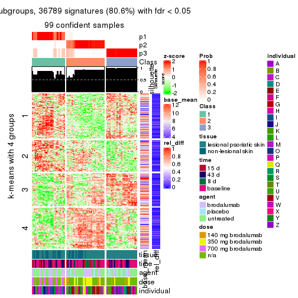</p>

</div>
<div id='tab-MAD-mclust-get-signatures-3'>
<pre><code class="r">get_signatures(res, k = 4)
</code></pre>

<p></p>

</div>
<div id='tab-MAD-mclust-get-signatures-4'>
<pre><code class="r">get_signatures(res, k = 5)
</code></pre>

<p></p>

</div>
<div id='tab-MAD-mclust-get-signatures-5'>
<pre><code class="r">get_signatures(res, k = 6)
</code></pre>

<p></p>

</div>
</div>


Signature heatmaps where rows are not scaled:


<script>
$( function() {
	$( '#tabs-MAD-mclust-get-signatures-no-scale' ).tabs();
} );
</script>
<div id='tabs-MAD-mclust-get-signatures-no-scale'>
<ul>
<li><a href='#tab-MAD-mclust-get-signatures-no-scale-1'>k = 2</a></li>
<li><a href='#tab-MAD-mclust-get-signatures-no-scale-2'>k = 3</a></li>
<li><a href='#tab-MAD-mclust-get-signatures-no-scale-3'>k = 4</a></li>
<li><a href='#tab-MAD-mclust-get-signatures-no-scale-4'>k = 5</a></li>
<li><a href='#tab-MAD-mclust-get-signatures-no-scale-5'>k = 6</a></li>
</ul>
<div id='tab-MAD-mclust-get-signatures-no-scale-1'>
<pre><code class="r">get_signatures(res, k = 2, scale_rows = FALSE)
</code></pre>

<p></p>

</div>
<div id='tab-MAD-mclust-get-signatures-no-scale-2'>
<pre><code class="r">get_signatures(res, k = 3, scale_rows = FALSE)
</code></pre>

<p></p>

</div>
<div id='tab-MAD-mclust-get-signatures-no-scale-3'>
<pre><code class="r">get_signatures(res, k = 4, scale_rows = FALSE)
</code></pre>

<p></p>

</div>
<div id='tab-MAD-mclust-get-signatures-no-scale-4'>
<pre><code class="r">get_signatures(res, k = 5, scale_rows = FALSE)
</code></pre>

<p></p>

</div>
<div id='tab-MAD-mclust-get-signatures-no-scale-5'>
<pre><code class="r">get_signatures(res, k = 6, scale_rows = FALSE)
</code></pre>

<p></p>

</div>
</div>


Compare the overlap of signatures from different k:

```r
compare_signatures(res)
```


`get_signature()` returns a data frame invisibly. TO get the list of signatures, the function
call should be assigned to a variable explicitly. In following code, if `plot` argument is set
to `FALSE`, no heatmap is plotted while only the differential analysis is performed.

```r
# code only for demonstration
tb = get_signature(res, k = ..., plot = FALSE)
```

An example of the output of `tb` is:

```
#>   which_row         fdr    mean_1    mean_2 scaled_mean_1 scaled_mean_2 km
#> 1        38 0.042760348  8.373488  9.131774    -0.5533452     0.5164555  1
#> 2        40 0.018707592  7.106213  8.469186    -0.6173731     0.5762149  1
#> 3        55 0.019134737 10.221463 11.207825    -0.6159697     0.5749050  1
#> 4        59 0.006059896  5.921854  7.869574    -0.6899429     0.6439467  1
#> 5        60 0.018055526  8.928898 10.211722    -0.6204761     0.5791110  1
#> 6        98 0.009384629 15.714769 14.887706     0.6635654    -0.6193277  2
...
```

The columns in `tb` are:

1. `which_row`: row indices corresponding to the input matrix.
2. `fdr`: FDR for the differential test. 
3. `mean_x`: The mean value in group x.
4. `scaled_mean_x`: The mean value in group x after rows are scaled.
5. `km`: Row groups if k-means clustering is applied to rows.


UMAP plot which shows how samples are separated.


<script>
$( function() {
	$( '#tabs-MAD-mclust-dimension-reduction' ).tabs();
} );
</script>
<div id='tabs-MAD-mclust-dimension-reduction'>
<ul>
<li><a href='#tab-MAD-mclust-dimension-reduction-1'>k = 2</a></li>
<li><a href='#tab-MAD-mclust-dimension-reduction-2'>k = 3</a></li>
<li><a href='#tab-MAD-mclust-dimension-reduction-3'>k = 4</a></li>
<li><a href='#tab-MAD-mclust-dimension-reduction-4'>k = 5</a></li>
<li><a href='#tab-MAD-mclust-dimension-reduction-5'>k = 6</a></li>
</ul>
<div id='tab-MAD-mclust-dimension-reduction-1'>
<pre><code class="r">dimension_reduction(res, k = 2, method = &quot;UMAP&quot;)
</code></pre>

<p></p>

</div>
<div id='tab-MAD-mclust-dimension-reduction-2'>
<pre><code class="r">dimension_reduction(res, k = 3, method = &quot;UMAP&quot;)
</code></pre>

<p></p>

</div>
<div id='tab-MAD-mclust-dimension-reduction-3'>
<pre><code class="r">dimension_reduction(res, k = 4, method = &quot;UMAP&quot;)
</code></pre>

<p></p>

</div>
<div id='tab-MAD-mclust-dimension-reduction-4'>
<pre><code class="r">dimension_reduction(res, k = 5, method = &quot;UMAP&quot;)
</code></pre>

<p></p>

</div>
<div id='tab-MAD-mclust-dimension-reduction-5'>
<pre><code class="r">dimension_reduction(res, k = 6, method = &quot;UMAP&quot;)
</code></pre>

<p></p>

</div>
</div>


Following heatmap shows how subgroups are split when increasing `k`:

```r
collect_classes(res)
```


Test correlation between subgroups and known annotations. If the known
annotation is numeric, one-way ANOVA test is applied, and if the known
annotation is discrete, chi-squared contingency table test is applied.

```r
test_to_known_factors(res)
```

```
#>             n tissue(p) time(p) agent(p)  dose(p) individual(p) k
#> MAD:mclust 50  4.96e-01  0.1097   0.3229 3.16e-05      4.22e-05 2
#> MAD:mclust 99  5.86e-04  0.0873   0.0065 9.07e-09      1.87e-06 3
#> MAD:mclust 63  3.38e-02  0.2615   0.0771 5.41e-06      3.04e-07 4
#> MAD:mclust 93  4.57e-05  0.4726   0.0295 6.96e-10      5.63e-07 5
#> MAD:mclust 92  8.03e-04  0.3884   0.1802 5.82e-08      3.63e-06 6
```


If matrix rows can be associated to genes, consider to use `functional_enrichment(res,
...)` to perform function enrichment for the signature genes. See [this vignette](http://bioconductor.org/packages/devel/bioc/vignettes/cola/inst/doc/functional_enrichment.html) for more detailed explanations.


 

---------------------------------------------------


### MAD:NMF*


The object with results only for a single top-value method and a single partition method 
can be extracted as:

```r
res = res_list["MAD", "NMF"]
# you can also extract it by
# res = res_list["MAD:NMF"]
```

A summary of `res` and all the functions that can be applied to it:

```r
res
```

```
#> A 'ConsensusPartition' object with k = 2, 3, 4, 5, 6.
#>   On a matrix with 45638 rows and 99 columns.
#>   Top rows (1000, 2000, 3000, 4000, 5000) are extracted by 'MAD' method.
#>   Subgroups are detected by 'NMF' method.
#>   Performed in total 1250 partitions by row resampling.
#>   Best k for subgroups seems to be 3.
#> 
#> Following methods can be applied to this 'ConsensusPartition' object:
#>  [1] "cola_report"             "collect_classes"         "collect_plots"          
#>  [4] "collect_stats"           "colnames"                "compare_signatures"     
#>  [7] "consensus_heatmap"       "dimension_reduction"     "functional_enrichment"  
#> [10] "get_anno_col"            "get_anno"                "get_classes"            
#> [13] "get_consensus"           "get_matrix"              "get_membership"         
#> [16] "get_param"               "get_signatures"          "get_stats"              
#> [19] "is_best_k"               "is_stable_k"             "membership_heatmap"     
#> [22] "ncol"                    "nrow"                    "plot_ecdf"              
#> [25] "rownames"                "select_partition_number" "show"                   
#> [28] "suggest_best_k"          "test_to_known_factors"
```

`collect_plots()` function collects all the plots made from `res` for all `k` (number of partitions)
into one single page to provide an easy and fast comparison between different `k`.

```r
collect_plots(res)
```


The plots are:

- The first row: a plot of the ECDF (empirical cumulative distribution
  function) curves of the consensus matrix for each `k` and the heatmap of
  predicted classes for each `k`.
- The second row: heatmaps of the consensus matrix for each `k`.
- The third row: heatmaps of the membership matrix for each `k`.
- The fouth row: heatmaps of the signatures for each `k`.

All the plots in panels can be made by individual functions and they are
plotted later in this section.

`select_partition_number()` produces several plots showing different
statistics for choosing "optimized" `k`. There are following statistics:

- ECDF curves of the consensus matrix for each `k`;
- 1-PAC. [The PAC
  score](https://en.wikipedia.org/wiki/Consensus_clustering#Over-interpretation_potential_of_consensus_clustering)
  measures the proportion of the ambiguous subgrouping.
- Mean silhouette score.
- Concordance. The mean probability of fiting the consensus class ids in all
  partitions.
- Area increased. Denote $A_k$ as the area under the ECDF curve for current
  `k`, the area increased is defined as $A_k - A_{k-1}$.
- Rand index. The percent of pairs of samples that are both in a same cluster
  or both are not in a same cluster in the partition of k and k-1.
- Jaccard index. The ratio of pairs of samples are both in a same cluster in
  the partition of k and k-1 and the pairs of samples are both in a same
  cluster in the partition k or k-1.

The detailed explanations of these statistics can be found in [the _cola_
vignette](http://bioconductor.org/packages/devel/bioc/vignettes/cola/inst/doc/cola.html#toc_13).

Generally speaking, lower PAC score, higher mean silhouette score or higher
concordance corresponds to better partition. Rand index and Jaccard index
measure how similar the current partition is compared to partition with `k-1`.
If they are too similar, we won't accept `k` is better than `k-1`.

```r
select_partition_number(res)
```


The numeric values for all these statistics can be obtained by `get_stats()`.

```r
get_stats(res)
```

```
#>   k 1-PAC mean_silhouette concordance area_increased  Rand Jaccard
#> 2 2 0.958           0.934       0.974         0.4929 0.506   0.506
#> 3 3 0.905           0.904       0.959         0.3613 0.729   0.510
#> 4 4 0.812           0.790       0.901         0.1020 0.820   0.528
#> 5 5 0.844           0.816       0.905         0.0669 0.892   0.625
#> 6 6 0.713           0.657       0.804         0.0294 0.959   0.818
```

`suggest_best_k()` suggests the best $k$ based on these statistics. The rules are as follows:

- All $k$ with Jaccard index larger than 0.95 are removed because increasing
  $k$ does not provide enough extra information. If all $k$ are removed, it is
  marked as no subgroup is detected.
- For all $k$ with 1-PAC score larger than 0.9, the maximal $k$ is taken as
  the best $k$, and other $k$ are marked as optional $k$.
- If it does not fit the second rule. The $k$ with the maximal vote of the
  highest 1-PAC score, highest mean silhouette, and highest concordance is
  taken as the best $k$.

```r
suggest_best_k(res)
```

```
#> [1] 3
#> attr(,"optional")
#> [1] 2
```

There is also optional best $k$ = 2 that is worth to check.

Following shows the table of the partitions (You need to click the **show/hide
code output** link to see it). The membership matrix (columns with name `p*`)
is inferred by
[`clue::cl_consensus()`](https://www.rdocumentation.org/link/cl_consensus?package=clue)
function with the `SE` method. Basically the value in the membership matrix
represents the probability to belong to a certain group. The finall class
label for an item is determined with the group with highest probability it
belongs to.

In `get_classes()` function, the entropy is calculated from the membership
matrix and the silhouette score is calculated from the consensus matrix.


<script>
$( function() {
	$( '#tabs-MAD-NMF-get-classes' ).tabs();
} );
</script>
<div id='tabs-MAD-NMF-get-classes'>
<ul>
<li><a href='#tab-MAD-NMF-get-classes-1'>k = 2</a></li>
<li><a href='#tab-MAD-NMF-get-classes-2'>k = 3</a></li>
<li><a href='#tab-MAD-NMF-get-classes-3'>k = 4</a></li>
<li><a href='#tab-MAD-NMF-get-classes-4'>k = 5</a></li>
<li><a href='#tab-MAD-NMF-get-classes-5'>k = 6</a></li>
</ul>

<div id='tab-MAD-NMF-get-classes-1'>
<p><a id='tab-MAD-NMF-get-classes-1-a' style='color:#0366d6' href='#'>show/hide code output</a></p>
<pre><code class="r">cbind(get_classes(res, k = 2), get_membership(res, k = 2))
</code></pre>

<pre><code>#&gt;            class entropy silhouette    p1    p2
#&gt; GSM1296094     2  0.0376      0.973 0.004 0.996
#&gt; GSM1296119     2  0.0000      0.977 0.000 1.000
#&gt; GSM1296076     2  0.0000      0.977 0.000 1.000
#&gt; GSM1296092     2  0.0000      0.977 0.000 1.000
#&gt; GSM1296103     2  0.0000      0.977 0.000 1.000
#&gt; GSM1296078     2  0.0000      0.977 0.000 1.000
#&gt; GSM1296107     2  0.0000      0.977 0.000 1.000
#&gt; GSM1296109     2  0.0000      0.977 0.000 1.000
#&gt; GSM1296080     1  0.0000      0.966 1.000 0.000
#&gt; GSM1296090     2  0.0000      0.977 0.000 1.000
#&gt; GSM1296074     2  0.0000      0.977 0.000 1.000
#&gt; GSM1296111     2  0.0000      0.977 0.000 1.000
#&gt; GSM1296099     2  0.0000      0.977 0.000 1.000
#&gt; GSM1296086     2  0.0000      0.977 0.000 1.000
#&gt; GSM1296117     2  0.0000      0.977 0.000 1.000
#&gt; GSM1296113     2  0.0000      0.977 0.000 1.000
#&gt; GSM1296096     2  0.0000      0.977 0.000 1.000
#&gt; GSM1296105     1  0.0000      0.966 1.000 0.000
#&gt; GSM1296098     2  0.8955      0.524 0.312 0.688
#&gt; GSM1296101     2  0.2423      0.937 0.040 0.960
#&gt; GSM1296121     2  0.0000      0.977 0.000 1.000
#&gt; GSM1296088     2  0.9881      0.190 0.436 0.564
#&gt; GSM1296082     2  0.0000      0.977 0.000 1.000
#&gt; GSM1296115     2  0.0000      0.977 0.000 1.000
#&gt; GSM1296084     1  0.0000      0.966 1.000 0.000
#&gt; GSM1296072     2  0.0000      0.977 0.000 1.000
#&gt; GSM1296069     2  0.0000      0.977 0.000 1.000
#&gt; GSM1296071     2  0.0000      0.977 0.000 1.000
#&gt; GSM1296070     2  0.0000      0.977 0.000 1.000
#&gt; GSM1296073     2  0.0000      0.977 0.000 1.000
#&gt; GSM1296034     1  0.0000      0.966 1.000 0.000
#&gt; GSM1296041     2  0.0000      0.977 0.000 1.000
#&gt; GSM1296035     2  0.0000      0.977 0.000 1.000
#&gt; GSM1296038     2  0.0000      0.977 0.000 1.000
#&gt; GSM1296047     2  0.0000      0.977 0.000 1.000
#&gt; GSM1296039     2  0.0000      0.977 0.000 1.000
#&gt; GSM1296042     2  0.0000      0.977 0.000 1.000
#&gt; GSM1296043     2  0.0000      0.977 0.000 1.000
#&gt; GSM1296037     1  0.0000      0.966 1.000 0.000
#&gt; GSM1296046     2  0.0000      0.977 0.000 1.000
#&gt; GSM1296044     2  0.0000      0.977 0.000 1.000
#&gt; GSM1296045     2  0.0000      0.977 0.000 1.000
#&gt; GSM1296025     1  0.0000      0.966 1.000 0.000
#&gt; GSM1296033     1  0.0000      0.966 1.000 0.000
#&gt; GSM1296027     1  0.0000      0.966 1.000 0.000
#&gt; GSM1296032     1  0.0000      0.966 1.000 0.000
#&gt; GSM1296024     1  0.0000      0.966 1.000 0.000
#&gt; GSM1296031     1  0.0000      0.966 1.000 0.000
#&gt; GSM1296028     1  0.0000      0.966 1.000 0.000
#&gt; GSM1296029     1  0.0000      0.966 1.000 0.000
#&gt; GSM1296026     1  0.7528      0.722 0.784 0.216
#&gt; GSM1296030     1  0.0000      0.966 1.000 0.000
#&gt; GSM1296040     1  0.9170      0.515 0.668 0.332
#&gt; GSM1296036     1  0.8909      0.566 0.692 0.308
#&gt; GSM1296048     2  0.0000      0.977 0.000 1.000
#&gt; GSM1296059     2  0.0000      0.977 0.000 1.000
#&gt; GSM1296066     2  0.0000      0.977 0.000 1.000
#&gt; GSM1296060     2  0.0000      0.977 0.000 1.000
#&gt; GSM1296063     2  0.0000      0.977 0.000 1.000
#&gt; GSM1296064     2  0.0000      0.977 0.000 1.000
#&gt; GSM1296067     2  0.0672      0.969 0.008 0.992
#&gt; GSM1296062     1  0.0000      0.966 1.000 0.000
#&gt; GSM1296068     2  0.0000      0.977 0.000 1.000
#&gt; GSM1296050     1  0.0000      0.966 1.000 0.000
#&gt; GSM1296057     1  0.0000      0.966 1.000 0.000
#&gt; GSM1296052     1  0.0000      0.966 1.000 0.000
#&gt; GSM1296054     1  0.0000      0.966 1.000 0.000
#&gt; GSM1296049     1  0.0000      0.966 1.000 0.000
#&gt; GSM1296055     1  0.0000      0.966 1.000 0.000
#&gt; GSM1296053     1  0.0000      0.966 1.000 0.000
#&gt; GSM1296058     1  0.0000      0.966 1.000 0.000
#&gt; GSM1296051     2  0.0000      0.977 0.000 1.000
#&gt; GSM1296056     2  0.0000      0.977 0.000 1.000
#&gt; GSM1296065     2  0.0000      0.977 0.000 1.000
#&gt; GSM1296061     1  0.1184      0.954 0.984 0.016
#&gt; GSM1296095     2  0.0000      0.977 0.000 1.000
#&gt; GSM1296120     2  0.0000      0.977 0.000 1.000
#&gt; GSM1296077     1  0.0000      0.966 1.000 0.000
#&gt; GSM1296093     1  0.0000      0.966 1.000 0.000
#&gt; GSM1296104     2  0.0000      0.977 0.000 1.000
#&gt; GSM1296079     1  0.0000      0.966 1.000 0.000
#&gt; GSM1296108     2  0.0000      0.977 0.000 1.000
#&gt; GSM1296110     2  0.0000      0.977 0.000 1.000
#&gt; GSM1296081     1  0.0000      0.966 1.000 0.000
#&gt; GSM1296091     1  0.0000      0.966 1.000 0.000
#&gt; GSM1296075     1  0.1184      0.954 0.984 0.016
#&gt; GSM1296112     2  0.0000      0.977 0.000 1.000
#&gt; GSM1296100     1  0.0000      0.966 1.000 0.000
#&gt; GSM1296087     1  0.0000      0.966 1.000 0.000
#&gt; GSM1296118     2  0.9866      0.223 0.432 0.568
#&gt; GSM1296114     2  0.0000      0.977 0.000 1.000
#&gt; GSM1296097     1  0.9661      0.373 0.608 0.392
#&gt; GSM1296106     1  0.0000      0.966 1.000 0.000
#&gt; GSM1296102     1  0.0000      0.966 1.000 0.000
#&gt; GSM1296122     1  0.2778      0.925 0.952 0.048
#&gt; GSM1296089     1  0.0000      0.966 1.000 0.000
#&gt; GSM1296083     1  0.0000      0.966 1.000 0.000
#&gt; GSM1296116     2  0.0000      0.977 0.000 1.000
#&gt; GSM1296085     1  0.0000      0.966 1.000 0.000
</code></pre>

<script>
$('#tab-MAD-NMF-get-classes-1-a').parent().next().next().hide();
$('#tab-MAD-NMF-get-classes-1-a').click(function(){
  $('#tab-MAD-NMF-get-classes-1-a').parent().next().next().toggle();
  return(false);
});
</script>
</div>

<div id='tab-MAD-NMF-get-classes-2'>
<p><a id='tab-MAD-NMF-get-classes-2-a' style='color:#0366d6' href='#'>show/hide code output</a></p>
<pre><code class="r">cbind(get_classes(res, k = 3), get_membership(res, k = 3))
</code></pre>

<pre><code>#&gt;            class entropy silhouette    p1    p2    p3
#&gt; GSM1296094     3  0.0000     0.9346 0.000 0.000 1.000
#&gt; GSM1296119     3  0.6192     0.3480 0.000 0.420 0.580
#&gt; GSM1296076     3  0.0000     0.9346 0.000 0.000 1.000
#&gt; GSM1296092     3  0.0000     0.9346 0.000 0.000 1.000
#&gt; GSM1296103     3  0.0000     0.9346 0.000 0.000 1.000
#&gt; GSM1296078     3  0.0000     0.9346 0.000 0.000 1.000
#&gt; GSM1296107     2  0.0237     0.9558 0.000 0.996 0.004
#&gt; GSM1296109     3  0.0000     0.9346 0.000 0.000 1.000
#&gt; GSM1296080     1  0.2356     0.9118 0.928 0.000 0.072
#&gt; GSM1296090     3  0.0000     0.9346 0.000 0.000 1.000
#&gt; GSM1296074     3  0.0000     0.9346 0.000 0.000 1.000
#&gt; GSM1296111     2  0.5968     0.3502 0.000 0.636 0.364
#&gt; GSM1296099     3  0.0000     0.9346 0.000 0.000 1.000
#&gt; GSM1296086     3  0.0000     0.9346 0.000 0.000 1.000
#&gt; GSM1296117     3  0.2448     0.8883 0.000 0.076 0.924
#&gt; GSM1296113     2  0.1964     0.9095 0.000 0.944 0.056
#&gt; GSM1296096     3  0.0000     0.9346 0.000 0.000 1.000
#&gt; GSM1296105     1  0.0000     0.9745 1.000 0.000 0.000
#&gt; GSM1296098     3  0.0000     0.9346 0.000 0.000 1.000
#&gt; GSM1296101     3  0.0000     0.9346 0.000 0.000 1.000
#&gt; GSM1296121     3  0.4887     0.7287 0.000 0.228 0.772
#&gt; GSM1296088     3  0.0000     0.9346 0.000 0.000 1.000
#&gt; GSM1296082     3  0.0000     0.9346 0.000 0.000 1.000
#&gt; GSM1296115     3  0.4796     0.7391 0.000 0.220 0.780
#&gt; GSM1296084     1  0.4235     0.7834 0.824 0.000 0.176
#&gt; GSM1296072     2  0.0000     0.9582 0.000 1.000 0.000
#&gt; GSM1296069     2  0.0000     0.9582 0.000 1.000 0.000
#&gt; GSM1296071     2  0.0000     0.9582 0.000 1.000 0.000
#&gt; GSM1296070     2  0.0000     0.9582 0.000 1.000 0.000
#&gt; GSM1296073     3  0.1860     0.9045 0.000 0.052 0.948
#&gt; GSM1296034     1  0.0000     0.9745 1.000 0.000 0.000
#&gt; GSM1296041     3  0.4750     0.7444 0.000 0.216 0.784
#&gt; GSM1296035     3  0.0000     0.9346 0.000 0.000 1.000
#&gt; GSM1296038     3  0.0000     0.9346 0.000 0.000 1.000
#&gt; GSM1296047     2  0.0000     0.9582 0.000 1.000 0.000
#&gt; GSM1296039     3  0.0000     0.9346 0.000 0.000 1.000
#&gt; GSM1296042     2  0.0747     0.9468 0.000 0.984 0.016
#&gt; GSM1296043     2  0.0000     0.9582 0.000 1.000 0.000
#&gt; GSM1296037     1  0.0000     0.9745 1.000 0.000 0.000
#&gt; GSM1296046     2  0.0000     0.9582 0.000 1.000 0.000
#&gt; GSM1296044     2  0.0000     0.9582 0.000 1.000 0.000
#&gt; GSM1296045     2  0.0000     0.9582 0.000 1.000 0.000
#&gt; GSM1296025     1  0.0000     0.9745 1.000 0.000 0.000
#&gt; GSM1296033     1  0.0000     0.9745 1.000 0.000 0.000
#&gt; GSM1296027     1  0.0000     0.9745 1.000 0.000 0.000
#&gt; GSM1296032     1  0.0000     0.9745 1.000 0.000 0.000
#&gt; GSM1296024     1  0.0000     0.9745 1.000 0.000 0.000
#&gt; GSM1296031     1  0.0000     0.9745 1.000 0.000 0.000
#&gt; GSM1296028     1  0.0000     0.9745 1.000 0.000 0.000
#&gt; GSM1296029     1  0.0000     0.9745 1.000 0.000 0.000
#&gt; GSM1296026     3  0.5678     0.5246 0.316 0.000 0.684
#&gt; GSM1296030     1  0.1529     0.9419 0.960 0.000 0.040
#&gt; GSM1296040     3  0.0747     0.9240 0.016 0.000 0.984
#&gt; GSM1296036     3  0.0000     0.9346 0.000 0.000 1.000
#&gt; GSM1296048     3  0.5810     0.5459 0.000 0.336 0.664
#&gt; GSM1296059     3  0.0000     0.9346 0.000 0.000 1.000
#&gt; GSM1296066     2  0.0000     0.9582 0.000 1.000 0.000
#&gt; GSM1296060     3  0.0000     0.9346 0.000 0.000 1.000
#&gt; GSM1296063     3  0.2165     0.8969 0.000 0.064 0.936
#&gt; GSM1296064     3  0.0000     0.9346 0.000 0.000 1.000
#&gt; GSM1296067     2  0.0000     0.9582 0.000 1.000 0.000
#&gt; GSM1296062     1  0.1411     0.9455 0.964 0.000 0.036
#&gt; GSM1296068     2  0.0000     0.9582 0.000 1.000 0.000
#&gt; GSM1296050     1  0.0424     0.9678 0.992 0.008 0.000
#&gt; GSM1296057     1  0.0000     0.9745 1.000 0.000 0.000
#&gt; GSM1296052     1  0.0000     0.9745 1.000 0.000 0.000
#&gt; GSM1296054     1  0.0000     0.9745 1.000 0.000 0.000
#&gt; GSM1296049     1  0.0000     0.9745 1.000 0.000 0.000
#&gt; GSM1296055     2  0.6140     0.3071 0.404 0.596 0.000
#&gt; GSM1296053     1  0.0000     0.9745 1.000 0.000 0.000
#&gt; GSM1296058     1  0.0000     0.9745 1.000 0.000 0.000
#&gt; GSM1296051     3  0.0000     0.9346 0.000 0.000 1.000
#&gt; GSM1296056     3  0.0000     0.9346 0.000 0.000 1.000
#&gt; GSM1296065     2  0.1529     0.9258 0.000 0.960 0.040
#&gt; GSM1296061     3  0.3879     0.7938 0.152 0.000 0.848
#&gt; GSM1296095     3  0.2537     0.8857 0.000 0.080 0.920
#&gt; GSM1296120     2  0.0000     0.9582 0.000 1.000 0.000
#&gt; GSM1296077     1  0.0000     0.9745 1.000 0.000 0.000
#&gt; GSM1296093     1  0.0000     0.9745 1.000 0.000 0.000
#&gt; GSM1296104     2  0.0237     0.9559 0.000 0.996 0.004
#&gt; GSM1296079     1  0.0000     0.9745 1.000 0.000 0.000
#&gt; GSM1296108     2  0.0000     0.9582 0.000 1.000 0.000
#&gt; GSM1296110     2  0.0000     0.9582 0.000 1.000 0.000
#&gt; GSM1296081     1  0.0000     0.9745 1.000 0.000 0.000
#&gt; GSM1296091     1  0.0000     0.9745 1.000 0.000 0.000
#&gt; GSM1296075     2  0.2066     0.9096 0.060 0.940 0.000
#&gt; GSM1296112     2  0.0000     0.9582 0.000 1.000 0.000
#&gt; GSM1296100     1  0.0000     0.9745 1.000 0.000 0.000
#&gt; GSM1296087     1  0.0000     0.9745 1.000 0.000 0.000
#&gt; GSM1296118     2  0.0000     0.9582 0.000 1.000 0.000
#&gt; GSM1296114     2  0.0000     0.9582 0.000 1.000 0.000
#&gt; GSM1296097     1  0.6302     0.0508 0.520 0.480 0.000
#&gt; GSM1296106     2  0.3038     0.8624 0.104 0.896 0.000
#&gt; GSM1296102     1  0.0000     0.9745 1.000 0.000 0.000
#&gt; GSM1296122     2  0.0592     0.9497 0.012 0.988 0.000
#&gt; GSM1296089     1  0.0000     0.9745 1.000 0.000 0.000
#&gt; GSM1296083     1  0.0000     0.9745 1.000 0.000 0.000
#&gt; GSM1296116     2  0.0000     0.9582 0.000 1.000 0.000
#&gt; GSM1296085     1  0.0000     0.9745 1.000 0.000 0.000
</code></pre>

<script>
$('#tab-MAD-NMF-get-classes-2-a').parent().next().next().hide();
$('#tab-MAD-NMF-get-classes-2-a').click(function(){
  $('#tab-MAD-NMF-get-classes-2-a').parent().next().next().toggle();
  return(false);
});
</script>
</div>

<div id='tab-MAD-NMF-get-classes-3'>
<p><a id='tab-MAD-NMF-get-classes-3-a' style='color:#0366d6' href='#'>show/hide code output</a></p>
<pre><code class="r">cbind(get_classes(res, k = 4), get_membership(res, k = 4))
</code></pre>

<pre><code>#&gt;            class entropy silhouette    p1    p2    p3    p4
#&gt; GSM1296094     3  0.2408    0.82144 0.000 0.000 0.896 0.104
#&gt; GSM1296119     2  0.5858   -0.00993 0.000 0.500 0.032 0.468
#&gt; GSM1296076     4  0.0336    0.80708 0.000 0.000 0.008 0.992
#&gt; GSM1296092     4  0.0895    0.80747 0.004 0.000 0.020 0.976
#&gt; GSM1296103     3  0.2647    0.81461 0.000 0.000 0.880 0.120
#&gt; GSM1296078     4  0.0188    0.80618 0.000 0.000 0.004 0.996
#&gt; GSM1296107     2  0.0336    0.90557 0.000 0.992 0.000 0.008
#&gt; GSM1296109     3  0.3074    0.79630 0.000 0.000 0.848 0.152
#&gt; GSM1296080     3  0.2489    0.81191 0.068 0.000 0.912 0.020
#&gt; GSM1296090     4  0.0657    0.80027 0.012 0.000 0.004 0.984
#&gt; GSM1296074     4  0.0921    0.80627 0.000 0.000 0.028 0.972
#&gt; GSM1296111     2  0.4454    0.53945 0.000 0.692 0.000 0.308
#&gt; GSM1296099     3  0.3873    0.71895 0.000 0.000 0.772 0.228
#&gt; GSM1296086     4  0.1174    0.80584 0.012 0.000 0.020 0.968
#&gt; GSM1296117     4  0.3301    0.76592 0.000 0.048 0.076 0.876
#&gt; GSM1296113     2  0.0524    0.90444 0.000 0.988 0.008 0.004
#&gt; GSM1296096     4  0.4996   -0.14186 0.000 0.000 0.484 0.516
#&gt; GSM1296105     3  0.2053    0.79842 0.072 0.000 0.924 0.004
#&gt; GSM1296098     3  0.2081    0.82743 0.000 0.000 0.916 0.084
#&gt; GSM1296101     3  0.2081    0.82707 0.000 0.000 0.916 0.084
#&gt; GSM1296121     2  0.5231    0.50674 0.000 0.676 0.028 0.296
#&gt; GSM1296088     4  0.3801    0.60685 0.000 0.000 0.220 0.780
#&gt; GSM1296082     4  0.0707    0.80769 0.000 0.000 0.020 0.980
#&gt; GSM1296115     4  0.5928    0.08919 0.000 0.456 0.036 0.508
#&gt; GSM1296084     1  0.4182    0.74771 0.796 0.000 0.024 0.180
#&gt; GSM1296072     2  0.0592    0.90179 0.000 0.984 0.000 0.016
#&gt; GSM1296069     2  0.0188    0.90700 0.000 0.996 0.000 0.004
#&gt; GSM1296071     2  0.0000    0.90767 0.000 1.000 0.000 0.000
#&gt; GSM1296070     2  0.0188    0.90700 0.000 0.996 0.000 0.004
#&gt; GSM1296073     4  0.1004    0.80764 0.000 0.004 0.024 0.972
#&gt; GSM1296034     3  0.3400    0.69629 0.180 0.000 0.820 0.000
#&gt; GSM1296041     2  0.5602    0.23546 0.000 0.568 0.024 0.408
#&gt; GSM1296035     3  0.4804    0.45661 0.000 0.000 0.616 0.384
#&gt; GSM1296038     4  0.2760    0.72981 0.000 0.000 0.128 0.872
#&gt; GSM1296047     2  0.0000    0.90767 0.000 1.000 0.000 0.000
#&gt; GSM1296039     4  0.1302    0.79990 0.000 0.000 0.044 0.956
#&gt; GSM1296042     2  0.0779    0.90053 0.000 0.980 0.004 0.016
#&gt; GSM1296043     2  0.0000    0.90767 0.000 1.000 0.000 0.000
#&gt; GSM1296037     1  0.1940    0.93750 0.924 0.000 0.076 0.000
#&gt; GSM1296046     2  0.0000    0.90767 0.000 1.000 0.000 0.000
#&gt; GSM1296044     2  0.0000    0.90767 0.000 1.000 0.000 0.000
#&gt; GSM1296045     2  0.0188    0.90700 0.000 0.996 0.000 0.004
#&gt; GSM1296025     1  0.1302    0.95295 0.956 0.000 0.044 0.000
#&gt; GSM1296033     1  0.0592    0.95538 0.984 0.000 0.000 0.016
#&gt; GSM1296027     1  0.0524    0.95962 0.988 0.000 0.008 0.004
#&gt; GSM1296032     1  0.0000    0.95986 1.000 0.000 0.000 0.000
#&gt; GSM1296024     1  0.1211    0.95435 0.960 0.000 0.040 0.000
#&gt; GSM1296031     1  0.0336    0.96031 0.992 0.000 0.008 0.000
#&gt; GSM1296028     1  0.0376    0.95959 0.992 0.000 0.004 0.004
#&gt; GSM1296029     1  0.0469    0.95992 0.988 0.000 0.012 0.000
#&gt; GSM1296026     4  0.5550    0.53382 0.248 0.000 0.060 0.692
#&gt; GSM1296030     1  0.0895    0.95808 0.976 0.000 0.020 0.004
#&gt; GSM1296040     3  0.1677    0.82684 0.012 0.000 0.948 0.040
#&gt; GSM1296036     3  0.1398    0.82583 0.004 0.000 0.956 0.040
#&gt; GSM1296048     4  0.4800    0.43196 0.000 0.340 0.004 0.656
#&gt; GSM1296059     3  0.2973    0.80144 0.000 0.000 0.856 0.144
#&gt; GSM1296066     2  0.0188    0.90696 0.000 0.996 0.004 0.000
#&gt; GSM1296060     3  0.4843    0.42534 0.000 0.000 0.604 0.396
#&gt; GSM1296063     4  0.0469    0.80359 0.000 0.000 0.012 0.988
#&gt; GSM1296064     4  0.0921    0.80668 0.000 0.000 0.028 0.972
#&gt; GSM1296067     2  0.1118    0.89147 0.000 0.964 0.036 0.000
#&gt; GSM1296062     3  0.1824    0.80430 0.060 0.000 0.936 0.004
#&gt; GSM1296068     2  0.0000    0.90767 0.000 1.000 0.000 0.000
#&gt; GSM1296050     1  0.0712    0.95595 0.984 0.008 0.004 0.004
#&gt; GSM1296057     1  0.0921    0.95715 0.972 0.000 0.028 0.000
#&gt; GSM1296052     1  0.0524    0.95962 0.988 0.000 0.008 0.004
#&gt; GSM1296054     1  0.1118    0.95580 0.964 0.000 0.036 0.000
#&gt; GSM1296049     1  0.0469    0.96028 0.988 0.000 0.012 0.000
#&gt; GSM1296055     1  0.2660    0.91207 0.908 0.056 0.036 0.000
#&gt; GSM1296053     1  0.1302    0.95296 0.956 0.000 0.044 0.000
#&gt; GSM1296058     1  0.2363    0.93811 0.920 0.000 0.056 0.024
#&gt; GSM1296051     4  0.1302    0.78257 0.044 0.000 0.000 0.956
#&gt; GSM1296056     4  0.1211    0.80183 0.000 0.000 0.040 0.960
#&gt; GSM1296065     4  0.4920    0.37469 0.000 0.368 0.004 0.628
#&gt; GSM1296061     3  0.1629    0.82159 0.024 0.000 0.952 0.024
#&gt; GSM1296095     2  0.7605    0.03508 0.000 0.452 0.212 0.336
#&gt; GSM1296120     2  0.0188    0.90687 0.000 0.996 0.004 0.000
#&gt; GSM1296077     1  0.0592    0.96045 0.984 0.000 0.016 0.000
#&gt; GSM1296093     1  0.1474    0.94852 0.948 0.000 0.052 0.000
#&gt; GSM1296104     4  0.7707    0.19829 0.108 0.372 0.032 0.488
#&gt; GSM1296079     1  0.0000    0.95986 1.000 0.000 0.000 0.000
#&gt; GSM1296108     2  0.0000    0.90767 0.000 1.000 0.000 0.000
#&gt; GSM1296110     2  0.0817    0.89858 0.000 0.976 0.024 0.000
#&gt; GSM1296081     1  0.1022    0.95636 0.968 0.000 0.032 0.000
#&gt; GSM1296091     1  0.0927    0.95258 0.976 0.000 0.008 0.016
#&gt; GSM1296075     1  0.2831    0.90321 0.908 0.040 0.008 0.044
#&gt; GSM1296112     2  0.0000    0.90767 0.000 1.000 0.000 0.000
#&gt; GSM1296100     1  0.2408    0.91567 0.896 0.000 0.104 0.000
#&gt; GSM1296087     1  0.0336    0.95813 0.992 0.000 0.000 0.008
#&gt; GSM1296118     2  0.0000    0.90767 0.000 1.000 0.000 0.000
#&gt; GSM1296114     2  0.0188    0.90696 0.000 0.996 0.004 0.000
#&gt; GSM1296097     1  0.5446    0.79250 0.784 0.092 0.064 0.060
#&gt; GSM1296106     2  0.3320    0.80797 0.056 0.876 0.068 0.000
#&gt; GSM1296102     3  0.4981    0.02772 0.464 0.000 0.536 0.000
#&gt; GSM1296122     2  0.0336    0.90495 0.000 0.992 0.008 0.000
#&gt; GSM1296089     1  0.0000    0.95986 1.000 0.000 0.000 0.000
#&gt; GSM1296083     1  0.1211    0.95435 0.960 0.000 0.040 0.000
#&gt; GSM1296116     2  0.0000    0.90767 0.000 1.000 0.000 0.000
#&gt; GSM1296085     1  0.0000    0.95986 1.000 0.000 0.000 0.000
</code></pre>

<script>
$('#tab-MAD-NMF-get-classes-3-a').parent().next().next().hide();
$('#tab-MAD-NMF-get-classes-3-a').click(function(){
  $('#tab-MAD-NMF-get-classes-3-a').parent().next().next().toggle();
  return(false);
});
</script>
</div>

<div id='tab-MAD-NMF-get-classes-4'>
<p><a id='tab-MAD-NMF-get-classes-4-a' style='color:#0366d6' href='#'>show/hide code output</a></p>
<pre><code class="r">cbind(get_classes(res, k = 5), get_membership(res, k = 5))
</code></pre>

<pre><code>#&gt;            class entropy silhouette    p1    p2    p3    p4    p5
#&gt; GSM1296094     3  0.0671      0.870 0.004 0.000 0.980 0.000 0.016
#&gt; GSM1296119     5  0.4450     -0.110 0.000 0.488 0.004 0.000 0.508
#&gt; GSM1296076     5  0.0671      0.868 0.000 0.004 0.016 0.000 0.980
#&gt; GSM1296092     5  0.1408      0.871 0.008 0.000 0.044 0.000 0.948
#&gt; GSM1296103     3  0.0955      0.870 0.000 0.000 0.968 0.004 0.028
#&gt; GSM1296078     5  0.0566      0.867 0.000 0.004 0.012 0.000 0.984
#&gt; GSM1296107     2  0.0404      0.907 0.000 0.988 0.000 0.000 0.012
#&gt; GSM1296109     3  0.1571      0.863 0.000 0.000 0.936 0.004 0.060
#&gt; GSM1296080     3  0.2719      0.766 0.144 0.000 0.852 0.000 0.004
#&gt; GSM1296090     5  0.0566      0.868 0.004 0.000 0.012 0.000 0.984
#&gt; GSM1296074     5  0.1341      0.867 0.000 0.000 0.056 0.000 0.944
#&gt; GSM1296111     2  0.3534      0.684 0.000 0.744 0.000 0.000 0.256
#&gt; GSM1296099     3  0.2389      0.828 0.000 0.000 0.880 0.004 0.116
#&gt; GSM1296086     5  0.2054      0.858 0.028 0.000 0.052 0.000 0.920
#&gt; GSM1296117     2  0.5580      0.362 0.000 0.576 0.088 0.000 0.336
#&gt; GSM1296113     2  0.0404      0.907 0.000 0.988 0.000 0.000 0.012
#&gt; GSM1296096     3  0.4383      0.305 0.000 0.000 0.572 0.004 0.424
#&gt; GSM1296105     3  0.2300      0.833 0.024 0.000 0.904 0.072 0.000
#&gt; GSM1296098     3  0.0771      0.868 0.020 0.000 0.976 0.000 0.004
#&gt; GSM1296101     3  0.1582      0.867 0.000 0.000 0.944 0.028 0.028
#&gt; GSM1296121     2  0.5091      0.348 0.000 0.584 0.044 0.000 0.372
#&gt; GSM1296088     5  0.6323      0.331 0.220 0.000 0.252 0.000 0.528
#&gt; GSM1296082     5  0.1197      0.870 0.000 0.000 0.048 0.000 0.952
#&gt; GSM1296115     2  0.4132      0.638 0.000 0.720 0.020 0.000 0.260
#&gt; GSM1296084     1  0.2554      0.878 0.892 0.000 0.036 0.000 0.072
#&gt; GSM1296072     2  0.1408      0.895 0.000 0.948 0.000 0.008 0.044
#&gt; GSM1296069     2  0.0992      0.903 0.000 0.968 0.000 0.008 0.024
#&gt; GSM1296071     2  0.0613      0.905 0.000 0.984 0.008 0.004 0.004
#&gt; GSM1296070     2  0.0794      0.904 0.000 0.972 0.000 0.000 0.028
#&gt; GSM1296073     5  0.0880      0.871 0.000 0.000 0.032 0.000 0.968
#&gt; GSM1296034     3  0.4073      0.732 0.104 0.000 0.792 0.104 0.000
#&gt; GSM1296041     2  0.1894      0.875 0.000 0.920 0.008 0.000 0.072
#&gt; GSM1296035     3  0.4404      0.635 0.000 0.000 0.704 0.032 0.264
#&gt; GSM1296038     4  0.6127      0.114 0.000 0.000 0.128 0.456 0.416
#&gt; GSM1296047     2  0.0404      0.907 0.000 0.988 0.000 0.000 0.012
#&gt; GSM1296039     5  0.1697      0.863 0.000 0.000 0.060 0.008 0.932
#&gt; GSM1296042     2  0.0404      0.907 0.000 0.988 0.000 0.000 0.012
#&gt; GSM1296043     2  0.0404      0.907 0.000 0.988 0.000 0.000 0.012
#&gt; GSM1296037     4  0.1697      0.826 0.060 0.000 0.008 0.932 0.000
#&gt; GSM1296046     2  0.0404      0.907 0.000 0.988 0.000 0.000 0.012
#&gt; GSM1296044     2  0.0613      0.905 0.000 0.984 0.008 0.004 0.004
#&gt; GSM1296045     2  0.0865      0.904 0.000 0.972 0.000 0.004 0.024
#&gt; GSM1296025     1  0.0404      0.952 0.988 0.000 0.000 0.012 0.000
#&gt; GSM1296033     1  0.0162      0.951 0.996 0.000 0.004 0.000 0.000
#&gt; GSM1296027     1  0.0162      0.951 0.996 0.000 0.004 0.000 0.000
#&gt; GSM1296032     1  0.0609      0.950 0.980 0.000 0.000 0.020 0.000
#&gt; GSM1296024     1  0.0451      0.951 0.988 0.000 0.008 0.004 0.000
#&gt; GSM1296031     1  0.0880      0.947 0.968 0.000 0.000 0.032 0.000
#&gt; GSM1296028     1  0.0000      0.952 1.000 0.000 0.000 0.000 0.000
#&gt; GSM1296029     1  0.0404      0.949 0.988 0.000 0.012 0.000 0.000
#&gt; GSM1296026     1  0.3412      0.785 0.820 0.000 0.028 0.000 0.152
#&gt; GSM1296030     1  0.0609      0.945 0.980 0.000 0.020 0.000 0.000
#&gt; GSM1296040     3  0.1560      0.869 0.004 0.000 0.948 0.028 0.020
#&gt; GSM1296036     3  0.0794      0.864 0.028 0.000 0.972 0.000 0.000
#&gt; GSM1296048     5  0.1914      0.827 0.000 0.056 0.008 0.008 0.928
#&gt; GSM1296059     3  0.1444      0.867 0.000 0.000 0.948 0.012 0.040
#&gt; GSM1296066     2  0.0404      0.907 0.000 0.988 0.000 0.000 0.012
#&gt; GSM1296060     3  0.5703      0.563 0.000 0.000 0.616 0.140 0.244
#&gt; GSM1296063     5  0.2700      0.811 0.000 0.004 0.024 0.088 0.884
#&gt; GSM1296064     5  0.1557      0.867 0.000 0.000 0.052 0.008 0.940
#&gt; GSM1296067     2  0.1059      0.900 0.000 0.968 0.020 0.004 0.008
#&gt; GSM1296062     3  0.1211      0.866 0.024 0.000 0.960 0.016 0.000
#&gt; GSM1296068     2  0.0162      0.906 0.000 0.996 0.000 0.000 0.004
#&gt; GSM1296050     1  0.2074      0.897 0.896 0.000 0.000 0.104 0.000
#&gt; GSM1296057     4  0.1205      0.841 0.040 0.000 0.000 0.956 0.004
#&gt; GSM1296052     1  0.0162      0.951 0.996 0.000 0.004 0.000 0.000
#&gt; GSM1296054     1  0.0162      0.952 0.996 0.000 0.004 0.000 0.000
#&gt; GSM1296049     1  0.0162      0.951 0.996 0.000 0.004 0.000 0.000
#&gt; GSM1296055     4  0.0609      0.844 0.020 0.000 0.000 0.980 0.000
#&gt; GSM1296053     1  0.0798      0.949 0.976 0.000 0.016 0.008 0.000
#&gt; GSM1296058     4  0.0912      0.844 0.012 0.000 0.000 0.972 0.016
#&gt; GSM1296051     5  0.2991      0.747 0.120 0.012 0.004 0.004 0.860
#&gt; GSM1296056     5  0.2221      0.852 0.000 0.000 0.052 0.036 0.912
#&gt; GSM1296065     4  0.4010      0.647 0.004 0.008 0.004 0.744 0.240
#&gt; GSM1296061     3  0.1043      0.858 0.040 0.000 0.960 0.000 0.000
#&gt; GSM1296095     4  0.6908      0.111 0.000 0.036 0.128 0.428 0.408
#&gt; GSM1296120     2  0.3508      0.661 0.000 0.748 0.000 0.252 0.000
#&gt; GSM1296077     1  0.2230      0.890 0.884 0.000 0.000 0.116 0.000
#&gt; GSM1296093     1  0.2286      0.895 0.888 0.000 0.004 0.108 0.000
#&gt; GSM1296104     4  0.1041      0.836 0.000 0.004 0.000 0.964 0.032
#&gt; GSM1296079     1  0.0290      0.951 0.992 0.000 0.000 0.008 0.000
#&gt; GSM1296108     2  0.0613      0.905 0.000 0.984 0.008 0.004 0.004
#&gt; GSM1296110     2  0.1059      0.900 0.000 0.968 0.020 0.004 0.008
#&gt; GSM1296081     1  0.1043      0.943 0.960 0.000 0.000 0.040 0.000
#&gt; GSM1296091     1  0.1996      0.927 0.928 0.004 0.000 0.036 0.032
#&gt; GSM1296075     1  0.4703      0.763 0.768 0.032 0.000 0.140 0.060
#&gt; GSM1296112     2  0.0162      0.906 0.000 0.996 0.000 0.000 0.004
#&gt; GSM1296100     4  0.1894      0.818 0.072 0.000 0.008 0.920 0.000
#&gt; GSM1296087     1  0.0162      0.951 0.996 0.000 0.004 0.000 0.000
#&gt; GSM1296118     2  0.0955      0.900 0.000 0.968 0.000 0.028 0.004
#&gt; GSM1296114     2  0.0613      0.905 0.000 0.984 0.008 0.004 0.004
#&gt; GSM1296097     4  0.0290      0.842 0.008 0.000 0.000 0.992 0.000
#&gt; GSM1296106     4  0.1278      0.839 0.016 0.020 0.004 0.960 0.000
#&gt; GSM1296102     4  0.1800      0.821 0.020 0.000 0.048 0.932 0.000
#&gt; GSM1296122     2  0.4565      0.323 0.012 0.580 0.000 0.408 0.000
#&gt; GSM1296089     1  0.0794      0.948 0.972 0.000 0.000 0.028 0.000
#&gt; GSM1296083     1  0.1341      0.935 0.944 0.000 0.000 0.056 0.000
#&gt; GSM1296116     2  0.0162      0.907 0.000 0.996 0.000 0.000 0.004
#&gt; GSM1296085     1  0.0609      0.950 0.980 0.000 0.000 0.020 0.000
</code></pre>

<script>
$('#tab-MAD-NMF-get-classes-4-a').parent().next().next().hide();
$('#tab-MAD-NMF-get-classes-4-a').click(function(){
  $('#tab-MAD-NMF-get-classes-4-a').parent().next().next().toggle();
  return(false);
});
</script>
</div>

<div id='tab-MAD-NMF-get-classes-5'>
<p><a id='tab-MAD-NMF-get-classes-5-a' style='color:#0366d6' href='#'>show/hide code output</a></p>
<pre><code class="r">cbind(get_classes(res, k = 6), get_membership(res, k = 6))
</code></pre>

<pre><code>#&gt;            class entropy silhouette    p1    p2    p3    p4    p5    p6
#&gt; GSM1296094     3  0.2006     0.7662 0.000 0.000 0.892 0.104 0.000 0.004
#&gt; GSM1296119     4  0.4891     0.3099 0.000 0.384 0.036 0.564 0.016 0.000
#&gt; GSM1296076     4  0.0665     0.7443 0.000 0.004 0.000 0.980 0.008 0.008
#&gt; GSM1296092     4  0.2463     0.7308 0.068 0.000 0.020 0.892 0.020 0.000
#&gt; GSM1296103     3  0.2595     0.7549 0.000 0.000 0.836 0.160 0.000 0.004
#&gt; GSM1296078     4  0.1053     0.7402 0.000 0.000 0.004 0.964 0.012 0.020
#&gt; GSM1296107     2  0.0405     0.9030 0.000 0.988 0.000 0.004 0.008 0.000
#&gt; GSM1296109     3  0.3589     0.7222 0.000 0.000 0.752 0.228 0.008 0.012
#&gt; GSM1296080     3  0.3957     0.5601 0.260 0.000 0.712 0.008 0.020 0.000
#&gt; GSM1296090     4  0.3328     0.7158 0.064 0.004 0.004 0.852 0.056 0.020
#&gt; GSM1296074     4  0.1124     0.7399 0.000 0.000 0.036 0.956 0.000 0.008
#&gt; GSM1296111     2  0.3720     0.7030 0.000 0.760 0.012 0.208 0.020 0.000
#&gt; GSM1296099     3  0.3819     0.6811 0.000 0.000 0.700 0.280 0.000 0.020
#&gt; GSM1296086     4  0.3585     0.6803 0.140 0.000 0.012 0.808 0.036 0.004
#&gt; GSM1296117     4  0.5171     0.2357 0.000 0.408 0.076 0.512 0.000 0.004
#&gt; GSM1296113     2  0.1944     0.8884 0.000 0.924 0.016 0.036 0.024 0.000
#&gt; GSM1296096     3  0.4892     0.3766 0.000 0.000 0.500 0.440 0.000 0.060
#&gt; GSM1296105     3  0.5347     0.6421 0.072 0.000 0.704 0.024 0.152 0.048
#&gt; GSM1296098     3  0.1405     0.7618 0.024 0.000 0.948 0.024 0.004 0.000
#&gt; GSM1296101     3  0.3473     0.7130 0.000 0.000 0.804 0.048 0.004 0.144
#&gt; GSM1296121     4  0.4703     0.0842 0.000 0.464 0.044 0.492 0.000 0.000
#&gt; GSM1296088     1  0.6205     0.0724 0.444 0.000 0.220 0.324 0.012 0.000
#&gt; GSM1296082     4  0.1959     0.7437 0.024 0.000 0.020 0.924 0.032 0.000
#&gt; GSM1296115     2  0.4223     0.3712 0.000 0.612 0.016 0.368 0.004 0.000
#&gt; GSM1296084     1  0.2502     0.7578 0.884 0.000 0.084 0.012 0.020 0.000
#&gt; GSM1296072     2  0.3260     0.8402 0.000 0.856 0.008 0.056 0.056 0.024
#&gt; GSM1296069     2  0.1218     0.9007 0.000 0.956 0.004 0.012 0.028 0.000
#&gt; GSM1296071     2  0.0547     0.9017 0.000 0.980 0.020 0.000 0.000 0.000
#&gt; GSM1296070     2  0.1232     0.8999 0.000 0.956 0.004 0.016 0.024 0.000
#&gt; GSM1296073     4  0.0632     0.7437 0.000 0.000 0.024 0.976 0.000 0.000
#&gt; GSM1296034     3  0.4661     0.6035 0.176 0.000 0.724 0.000 0.036 0.064
#&gt; GSM1296041     2  0.3101     0.7986 0.000 0.832 0.020 0.136 0.012 0.000
#&gt; GSM1296035     3  0.5288     0.5740 0.000 0.000 0.592 0.252 0.000 0.156
#&gt; GSM1296038     6  0.4821     0.5799 0.000 0.000 0.088 0.196 0.020 0.696
#&gt; GSM1296047     2  0.2425     0.8486 0.000 0.880 0.008 0.000 0.100 0.012
#&gt; GSM1296039     4  0.1168     0.7416 0.000 0.000 0.028 0.956 0.000 0.016
#&gt; GSM1296042     2  0.1409     0.8949 0.000 0.948 0.008 0.032 0.012 0.000
#&gt; GSM1296043     2  0.0632     0.9017 0.000 0.976 0.000 0.000 0.024 0.000
#&gt; GSM1296037     5  0.4791    -0.0582 0.020 0.000 0.020 0.000 0.516 0.444
#&gt; GSM1296046     2  0.0820     0.9028 0.000 0.972 0.012 0.000 0.016 0.000
#&gt; GSM1296044     2  0.1261     0.8985 0.000 0.952 0.024 0.000 0.024 0.000
#&gt; GSM1296045     2  0.1442     0.8979 0.000 0.944 0.012 0.000 0.040 0.004
#&gt; GSM1296025     1  0.3394     0.7307 0.752 0.000 0.000 0.000 0.236 0.012
#&gt; GSM1296033     1  0.1851     0.7837 0.928 0.000 0.024 0.012 0.036 0.000
#&gt; GSM1296027     1  0.1151     0.7861 0.956 0.000 0.032 0.000 0.012 0.000
#&gt; GSM1296032     1  0.3003     0.7276 0.812 0.000 0.000 0.000 0.172 0.016
#&gt; GSM1296024     1  0.2886     0.7760 0.836 0.000 0.016 0.000 0.144 0.004
#&gt; GSM1296031     1  0.3817     0.7559 0.792 0.000 0.020 0.000 0.140 0.048
#&gt; GSM1296028     1  0.1500     0.7857 0.936 0.000 0.012 0.000 0.052 0.000
#&gt; GSM1296029     1  0.2046     0.7903 0.916 0.000 0.044 0.000 0.032 0.008
#&gt; GSM1296026     1  0.6166     0.5510 0.612 0.000 0.072 0.156 0.152 0.008
#&gt; GSM1296030     1  0.1549     0.7817 0.936 0.000 0.044 0.000 0.020 0.000
#&gt; GSM1296040     3  0.2852     0.7544 0.000 0.000 0.856 0.064 0.000 0.080
#&gt; GSM1296036     3  0.1788     0.7512 0.052 0.000 0.928 0.004 0.012 0.004
#&gt; GSM1296048     4  0.3252     0.6787 0.000 0.128 0.004 0.832 0.020 0.016
#&gt; GSM1296059     3  0.3492     0.7520 0.000 0.000 0.804 0.120 0.000 0.076
#&gt; GSM1296066     2  0.0603     0.9033 0.000 0.980 0.000 0.004 0.016 0.000
#&gt; GSM1296060     3  0.5716     0.3258 0.000 0.000 0.500 0.188 0.000 0.312
#&gt; GSM1296063     4  0.4636    -0.0823 0.000 0.000 0.008 0.484 0.024 0.484
#&gt; GSM1296064     4  0.1176     0.7419 0.000 0.000 0.024 0.956 0.000 0.020
#&gt; GSM1296067     2  0.1148     0.9010 0.000 0.960 0.020 0.000 0.016 0.004
#&gt; GSM1296062     3  0.1577     0.7576 0.036 0.000 0.940 0.008 0.000 0.016
#&gt; GSM1296068     2  0.0806     0.9011 0.000 0.972 0.020 0.000 0.008 0.000
#&gt; GSM1296050     1  0.4575     0.5667 0.600 0.000 0.000 0.000 0.352 0.048
#&gt; GSM1296057     6  0.3697     0.5337 0.004 0.000 0.016 0.000 0.248 0.732
#&gt; GSM1296052     1  0.0993     0.7884 0.964 0.000 0.024 0.000 0.012 0.000
#&gt; GSM1296054     1  0.2263     0.7799 0.884 0.000 0.016 0.000 0.100 0.000
#&gt; GSM1296049     1  0.2196     0.7837 0.884 0.000 0.004 0.000 0.108 0.004
#&gt; GSM1296055     6  0.3263     0.6082 0.004 0.004 0.020 0.000 0.160 0.812
#&gt; GSM1296053     1  0.2389     0.7899 0.888 0.000 0.060 0.000 0.052 0.000
#&gt; GSM1296058     6  0.1408     0.6705 0.000 0.000 0.036 0.000 0.020 0.944
#&gt; GSM1296051     4  0.4200     0.5240 0.240 0.008 0.000 0.716 0.032 0.004
#&gt; GSM1296056     4  0.4019     0.5473 0.000 0.000 0.028 0.740 0.016 0.216
#&gt; GSM1296065     6  0.4012     0.5590 0.000 0.008 0.000 0.232 0.032 0.728
#&gt; GSM1296061     3  0.2067     0.7436 0.064 0.000 0.912 0.004 0.016 0.004
#&gt; GSM1296095     6  0.5229     0.6063 0.000 0.028 0.112 0.152 0.012 0.696
#&gt; GSM1296120     2  0.5630     0.2644 0.004 0.540 0.004 0.000 0.320 0.132
#&gt; GSM1296077     1  0.4452     0.6234 0.636 0.000 0.000 0.000 0.316 0.048
#&gt; GSM1296093     1  0.4862     0.2088 0.520 0.000 0.004 0.000 0.428 0.048
#&gt; GSM1296104     6  0.4293     0.4671 0.000 0.000 0.012 0.024 0.292 0.672
#&gt; GSM1296079     1  0.3514     0.7248 0.752 0.000 0.000 0.000 0.228 0.020
#&gt; GSM1296108     2  0.0820     0.9018 0.000 0.972 0.016 0.000 0.012 0.000
#&gt; GSM1296110     2  0.0692     0.9012 0.000 0.976 0.020 0.000 0.004 0.000
#&gt; GSM1296081     1  0.3025     0.7650 0.820 0.000 0.000 0.000 0.156 0.024
#&gt; GSM1296091     1  0.4947     0.4495 0.652 0.004 0.004 0.040 0.280 0.020
#&gt; GSM1296075     5  0.5699    -0.3020 0.448 0.016 0.000 0.040 0.464 0.032
#&gt; GSM1296112     2  0.0909     0.9025 0.000 0.968 0.012 0.000 0.020 0.000
#&gt; GSM1296100     5  0.5424     0.0660 0.052 0.000 0.032 0.000 0.516 0.400
#&gt; GSM1296087     1  0.1003     0.7923 0.964 0.000 0.016 0.000 0.020 0.000
#&gt; GSM1296118     2  0.3654     0.6991 0.004 0.764 0.004 0.000 0.208 0.020
#&gt; GSM1296114     2  0.1176     0.8986 0.000 0.956 0.020 0.000 0.024 0.000
#&gt; GSM1296097     6  0.1296     0.6698 0.000 0.000 0.032 0.004 0.012 0.952
#&gt; GSM1296106     6  0.4467     0.3834 0.000 0.000 0.048 0.000 0.320 0.632
#&gt; GSM1296102     6  0.4495     0.5505 0.004 0.000 0.196 0.000 0.092 0.708
#&gt; GSM1296122     5  0.5748     0.2142 0.032 0.324 0.000 0.000 0.548 0.096
#&gt; GSM1296089     1  0.2428     0.7894 0.896 0.000 0.020 0.000 0.060 0.024
#&gt; GSM1296083     1  0.3279     0.7537 0.796 0.000 0.000 0.000 0.176 0.028
#&gt; GSM1296116     2  0.0972     0.9022 0.000 0.964 0.008 0.000 0.028 0.000
#&gt; GSM1296085     1  0.2019     0.7806 0.900 0.000 0.000 0.000 0.088 0.012
</code></pre>

<script>
$('#tab-MAD-NMF-get-classes-5-a').parent().next().next().hide();
$('#tab-MAD-NMF-get-classes-5-a').click(function(){
  $('#tab-MAD-NMF-get-classes-5-a').parent().next().next().toggle();
  return(false);
});
</script>
</div>
</div>

Heatmaps for the consensus matrix. It visualizes the probability of two
samples to be in a same group.


<script>
$( function() {
	$( '#tabs-MAD-NMF-consensus-heatmap' ).tabs();
} );
</script>
<div id='tabs-MAD-NMF-consensus-heatmap'>
<ul>
<li><a href='#tab-MAD-NMF-consensus-heatmap-1'>k = 2</a></li>
<li><a href='#tab-MAD-NMF-consensus-heatmap-2'>k = 3</a></li>
<li><a href='#tab-MAD-NMF-consensus-heatmap-3'>k = 4</a></li>
<li><a href='#tab-MAD-NMF-consensus-heatmap-4'>k = 5</a></li>
<li><a href='#tab-MAD-NMF-consensus-heatmap-5'>k = 6</a></li>
</ul>
<div id='tab-MAD-NMF-consensus-heatmap-1'>
<pre><code class="r">consensus_heatmap(res, k = 2)
</code></pre>

<p></p>

</div>
<div id='tab-MAD-NMF-consensus-heatmap-2'>
<pre><code class="r">consensus_heatmap(res, k = 3)
</code></pre>

<p></p>

</div>
<div id='tab-MAD-NMF-consensus-heatmap-3'>
<pre><code class="r">consensus_heatmap(res, k = 4)
</code></pre>

<p></p>

</div>
<div id='tab-MAD-NMF-consensus-heatmap-4'>
<pre><code class="r">consensus_heatmap(res, k = 5)
</code></pre>

<p>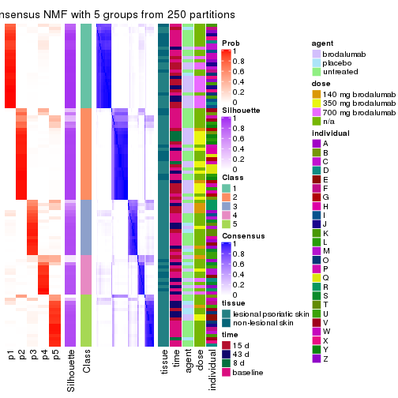</p>

</div>
<div id='tab-MAD-NMF-consensus-heatmap-5'>
<pre><code class="r">consensus_heatmap(res, k = 6)
</code></pre>

<p></p>

</div>
</div>

Heatmaps for the membership of samples in all partitions to see how consistent they are:


<script>
$( function() {
	$( '#tabs-MAD-NMF-membership-heatmap' ).tabs();
} );
</script>
<div id='tabs-MAD-NMF-membership-heatmap'>
<ul>
<li><a href='#tab-MAD-NMF-membership-heatmap-1'>k = 2</a></li>
<li><a href='#tab-MAD-NMF-membership-heatmap-2'>k = 3</a></li>
<li><a href='#tab-MAD-NMF-membership-heatmap-3'>k = 4</a></li>
<li><a href='#tab-MAD-NMF-membership-heatmap-4'>k = 5</a></li>
<li><a href='#tab-MAD-NMF-membership-heatmap-5'>k = 6</a></li>
</ul>
<div id='tab-MAD-NMF-membership-heatmap-1'>
<pre><code class="r">membership_heatmap(res, k = 2)
</code></pre>

<p></p>

</div>
<div id='tab-MAD-NMF-membership-heatmap-2'>
<pre><code class="r">membership_heatmap(res, k = 3)
</code></pre>

<p></p>

</div>
<div id='tab-MAD-NMF-membership-heatmap-3'>
<pre><code class="r">membership_heatmap(res, k = 4)
</code></pre>

<p></p>

</div>
<div id='tab-MAD-NMF-membership-heatmap-4'>
<pre><code class="r">membership_heatmap(res, k = 5)
</code></pre>

<p></p>

</div>
<div id='tab-MAD-NMF-membership-heatmap-5'>
<pre><code class="r">membership_heatmap(res, k = 6)
</code></pre>

<p></p>

</div>
</div>

As soon as we have had the classes for columns, we can look for signatures
which are significantly different between classes which can be candidate marks
for certain classes. Following are the heatmaps for signatures.


Signature heatmaps where rows are scaled:


<script>
$( function() {
	$( '#tabs-MAD-NMF-get-signatures' ).tabs();
} );
</script>
<div id='tabs-MAD-NMF-get-signatures'>
<ul>
<li><a href='#tab-MAD-NMF-get-signatures-1'>k = 2</a></li>
<li><a href='#tab-MAD-NMF-get-signatures-2'>k = 3</a></li>
<li><a href='#tab-MAD-NMF-get-signatures-3'>k = 4</a></li>
<li><a href='#tab-MAD-NMF-get-signatures-4'>k = 5</a></li>
<li><a href='#tab-MAD-NMF-get-signatures-5'>k = 6</a></li>
</ul>
<div id='tab-MAD-NMF-get-signatures-1'>
<pre><code class="r">get_signatures(res, k = 2)
</code></pre>

<p></p>

</div>
<div id='tab-MAD-NMF-get-signatures-2'>
<pre><code class="r">get_signatures(res, k = 3)
</code></pre>

<p></p>

</div>
<div id='tab-MAD-NMF-get-signatures-3'>
<pre><code class="r">get_signatures(res, k = 4)
</code></pre>

<p></p>

</div>
<div id='tab-MAD-NMF-get-signatures-4'>
<pre><code class="r">get_signatures(res, k = 5)
</code></pre>

<p></p>

</div>
<div id='tab-MAD-NMF-get-signatures-5'>
<pre><code class="r">get_signatures(res, k = 6)
</code></pre>

<p></p>

</div>
</div>


Signature heatmaps where rows are not scaled:


<script>
$( function() {
	$( '#tabs-MAD-NMF-get-signatures-no-scale' ).tabs();
} );
</script>
<div id='tabs-MAD-NMF-get-signatures-no-scale'>
<ul>
<li><a href='#tab-MAD-NMF-get-signatures-no-scale-1'>k = 2</a></li>
<li><a href='#tab-MAD-NMF-get-signatures-no-scale-2'>k = 3</a></li>
<li><a href='#tab-MAD-NMF-get-signatures-no-scale-3'>k = 4</a></li>
<li><a href='#tab-MAD-NMF-get-signatures-no-scale-4'>k = 5</a></li>
<li><a href='#tab-MAD-NMF-get-signatures-no-scale-5'>k = 6</a></li>
</ul>
<div id='tab-MAD-NMF-get-signatures-no-scale-1'>
<pre><code class="r">get_signatures(res, k = 2, scale_rows = FALSE)
</code></pre>

<p></p>

</div>
<div id='tab-MAD-NMF-get-signatures-no-scale-2'>
<pre><code class="r">get_signatures(res, k = 3, scale_rows = FALSE)
</code></pre>

<p></p>

</div>
<div id='tab-MAD-NMF-get-signatures-no-scale-3'>
<pre><code class="r">get_signatures(res, k = 4, scale_rows = FALSE)
</code></pre>

<p></p>

</div>
<div id='tab-MAD-NMF-get-signatures-no-scale-4'>
<pre><code class="r">get_signatures(res, k = 5, scale_rows = FALSE)
</code></pre>

<p></p>

</div>
<div id='tab-MAD-NMF-get-signatures-no-scale-5'>
<pre><code class="r">get_signatures(res, k = 6, scale_rows = FALSE)
</code></pre>

<p></p>

</div>
</div>


Compare the overlap of signatures from different k:

```r
compare_signatures(res)
```


`get_signature()` returns a data frame invisibly. TO get the list of signatures, the function
call should be assigned to a variable explicitly. In following code, if `plot` argument is set
to `FALSE`, no heatmap is plotted while only the differential analysis is performed.

```r
# code only for demonstration
tb = get_signature(res, k = ..., plot = FALSE)
```

An example of the output of `tb` is:

```
#>   which_row         fdr    mean_1    mean_2 scaled_mean_1 scaled_mean_2 km
#> 1        38 0.042760348  8.373488  9.131774    -0.5533452     0.5164555  1
#> 2        40 0.018707592  7.106213  8.469186    -0.6173731     0.5762149  1
#> 3        55 0.019134737 10.221463 11.207825    -0.6159697     0.5749050  1
#> 4        59 0.006059896  5.921854  7.869574    -0.6899429     0.6439467  1
#> 5        60 0.018055526  8.928898 10.211722    -0.6204761     0.5791110  1
#> 6        98 0.009384629 15.714769 14.887706     0.6635654    -0.6193277  2
...
```

The columns in `tb` are:

1. `which_row`: row indices corresponding to the input matrix.
2. `fdr`: FDR for the differential test. 
3. `mean_x`: The mean value in group x.
4. `scaled_mean_x`: The mean value in group x after rows are scaled.
5. `km`: Row groups if k-means clustering is applied to rows.


UMAP plot which shows how samples are separated.


<script>
$( function() {
	$( '#tabs-MAD-NMF-dimension-reduction' ).tabs();
} );
</script>
<div id='tabs-MAD-NMF-dimension-reduction'>
<ul>
<li><a href='#tab-MAD-NMF-dimension-reduction-1'>k = 2</a></li>
<li><a href='#tab-MAD-NMF-dimension-reduction-2'>k = 3</a></li>
<li><a href='#tab-MAD-NMF-dimension-reduction-3'>k = 4</a></li>
<li><a href='#tab-MAD-NMF-dimension-reduction-4'>k = 5</a></li>
<li><a href='#tab-MAD-NMF-dimension-reduction-5'>k = 6</a></li>
</ul>
<div id='tab-MAD-NMF-dimension-reduction-1'>
<pre><code class="r">dimension_reduction(res, k = 2, method = &quot;UMAP&quot;)
</code></pre>

<p></p>

</div>
<div id='tab-MAD-NMF-dimension-reduction-2'>
<pre><code class="r">dimension_reduction(res, k = 3, method = &quot;UMAP&quot;)
</code></pre>

<p></p>

</div>
<div id='tab-MAD-NMF-dimension-reduction-3'>
<pre><code class="r">dimension_reduction(res, k = 4, method = &quot;UMAP&quot;)
</code></pre>

<p></p>

</div>
<div id='tab-MAD-NMF-dimension-reduction-4'>
<pre><code class="r">dimension_reduction(res, k = 5, method = &quot;UMAP&quot;)
</code></pre>

<p></p>

</div>
<div id='tab-MAD-NMF-dimension-reduction-5'>
<pre><code class="r">dimension_reduction(res, k = 6, method = &quot;UMAP&quot;)
</code></pre>

<p></p>

</div>
</div>


Following heatmap shows how subgroups are split when increasing `k`:

```r
collect_classes(res)
```

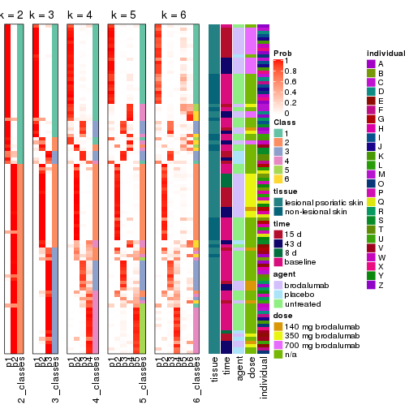


Test correlation between subgroups and known annotations. If the known
annotation is numeric, one-way ANOVA test is applied, and if the known
annotation is discrete, chi-squared contingency table test is applied.

```r
test_to_known_factors(res)
```

```
#>          n tissue(p) time(p) agent(p)  dose(p) individual(p) k
#> MAD:NMF 96  0.043926  0.0862   0.5448 9.92e-07      3.71e-04 2
#> MAD:NMF 95  0.000819  0.1790   0.0107 9.41e-10      5.49e-06 3
#> MAD:NMF 88  0.001708  0.3431   0.0223 2.08e-08      3.05e-08 4
#> MAD:NMF 91  0.002645  0.2701   0.1798 8.21e-08      8.09e-09 5
#> MAD:NMF 82  0.028707  0.1962   0.0732 2.64e-08      1.23e-07 6
```


If matrix rows can be associated to genes, consider to use `functional_enrichment(res,
...)` to perform function enrichment for the signature genes. See [this vignette](http://bioconductor.org/packages/devel/bioc/vignettes/cola/inst/doc/functional_enrichment.html) for more detailed explanations.


 

---------------------------------------------------


### ATC:hclust


The object with results only for a single top-value method and a single partition method 
can be extracted as:

```r
res = res_list["ATC", "hclust"]
# you can also extract it by
# res = res_list["ATC:hclust"]
```

A summary of `res` and all the functions that can be applied to it:

```r
res
```

```
#> A 'ConsensusPartition' object with k = 2, 3, 4, 5, 6.
#>   On a matrix with 45638 rows and 99 columns.
#>   Top rows (1000, 2000, 3000, 4000, 5000) are extracted by 'ATC' method.
#>   Subgroups are detected by 'hclust' method.
#>   Performed in total 1250 partitions by row resampling.
#>   Best k for subgroups seems to be 5.
#> 
#> Following methods can be applied to this 'ConsensusPartition' object:
#>  [1] "cola_report"             "collect_classes"         "collect_plots"          
#>  [4] "collect_stats"           "colnames"                "compare_signatures"     
#>  [7] "consensus_heatmap"       "dimension_reduction"     "functional_enrichment"  
#> [10] "get_anno_col"            "get_anno"                "get_classes"            
#> [13] "get_consensus"           "get_matrix"              "get_membership"         
#> [16] "get_param"               "get_signatures"          "get_stats"              
#> [19] "is_best_k"               "is_stable_k"             "membership_heatmap"     
#> [22] "ncol"                    "nrow"                    "plot_ecdf"              
#> [25] "rownames"                "select_partition_number" "show"                   
#> [28] "suggest_best_k"          "test_to_known_factors"
```

`collect_plots()` function collects all the plots made from `res` for all `k` (number of partitions)
into one single page to provide an easy and fast comparison between different `k`.

```r
collect_plots(res)
```


The plots are:

- The first row: a plot of the ECDF (empirical cumulative distribution
  function) curves of the consensus matrix for each `k` and the heatmap of
  predicted classes for each `k`.
- The second row: heatmaps of the consensus matrix for each `k`.
- The third row: heatmaps of the membership matrix for each `k`.
- The fouth row: heatmaps of the signatures for each `k`.

All the plots in panels can be made by individual functions and they are
plotted later in this section.

`select_partition_number()` produces several plots showing different
statistics for choosing "optimized" `k`. There are following statistics:

- ECDF curves of the consensus matrix for each `k`;
- 1-PAC. [The PAC
  score](https://en.wikipedia.org/wiki/Consensus_clustering#Over-interpretation_potential_of_consensus_clustering)
  measures the proportion of the ambiguous subgrouping.
- Mean silhouette score.
- Concordance. The mean probability of fiting the consensus class ids in all
  partitions.
- Area increased. Denote $A_k$ as the area under the ECDF curve for current
  `k`, the area increased is defined as $A_k - A_{k-1}$.
- Rand index. The percent of pairs of samples that are both in a same cluster
  or both are not in a same cluster in the partition of k and k-1.
- Jaccard index. The ratio of pairs of samples are both in a same cluster in
  the partition of k and k-1 and the pairs of samples are both in a same
  cluster in the partition k or k-1.

The detailed explanations of these statistics can be found in [the _cola_
vignette](http://bioconductor.org/packages/devel/bioc/vignettes/cola/inst/doc/cola.html#toc_13).

Generally speaking, lower PAC score, higher mean silhouette score or higher
concordance corresponds to better partition. Rand index and Jaccard index
measure how similar the current partition is compared to partition with `k-1`.
If they are too similar, we won't accept `k` is better than `k-1`.

```r
select_partition_number(res)
```


The numeric values for all these statistics can be obtained by `get_stats()`.

```r
get_stats(res)
```

```
#>   k 1-PAC mean_silhouette concordance area_increased  Rand Jaccard
#> 2 2 0.867           0.860       0.946         0.4945 0.496   0.496
#> 3 3 0.659           0.745       0.816         0.2905 0.841   0.689
#> 4 4 0.762           0.795       0.875         0.1134 0.951   0.868
#> 5 5 0.876           0.885       0.931         0.1095 0.880   0.643
#> 6 6 0.852           0.884       0.912         0.0259 0.977   0.893
```

`suggest_best_k()` suggests the best $k$ based on these statistics. The rules are as follows:

- All $k$ with Jaccard index larger than 0.95 are removed because increasing
  $k$ does not provide enough extra information. If all $k$ are removed, it is
  marked as no subgroup is detected.
- For all $k$ with 1-PAC score larger than 0.9, the maximal $k$ is taken as
  the best $k$, and other $k$ are marked as optional $k$.
- If it does not fit the second rule. The $k$ with the maximal vote of the
  highest 1-PAC score, highest mean silhouette, and highest concordance is
  taken as the best $k$.

```r
suggest_best_k(res)
```

```
#> [1] 5
```


Following shows the table of the partitions (You need to click the **show/hide
code output** link to see it). The membership matrix (columns with name `p*`)
is inferred by
[`clue::cl_consensus()`](https://www.rdocumentation.org/link/cl_consensus?package=clue)
function with the `SE` method. Basically the value in the membership matrix
represents the probability to belong to a certain group. The finall class
label for an item is determined with the group with highest probability it
belongs to.

In `get_classes()` function, the entropy is calculated from the membership
matrix and the silhouette score is calculated from the consensus matrix.


<script>
$( function() {
	$( '#tabs-ATC-hclust-get-classes' ).tabs();
} );
</script>
<div id='tabs-ATC-hclust-get-classes'>
<ul>
<li><a href='#tab-ATC-hclust-get-classes-1'>k = 2</a></li>
<li><a href='#tab-ATC-hclust-get-classes-2'>k = 3</a></li>
<li><a href='#tab-ATC-hclust-get-classes-3'>k = 4</a></li>
<li><a href='#tab-ATC-hclust-get-classes-4'>k = 5</a></li>
<li><a href='#tab-ATC-hclust-get-classes-5'>k = 6</a></li>
</ul>

<div id='tab-ATC-hclust-get-classes-1'>
<p><a id='tab-ATC-hclust-get-classes-1-a' style='color:#0366d6' href='#'>show/hide code output</a></p>
<pre><code class="r">cbind(get_classes(res, k = 2), get_membership(res, k = 2))
</code></pre>

<pre><code>#&gt;            class entropy silhouette    p1    p2
#&gt; GSM1296094     1   0.204     0.9232 0.968 0.032
#&gt; GSM1296119     2   0.000     0.9490 0.000 1.000
#&gt; GSM1296076     2   0.000     0.9490 0.000 1.000
#&gt; GSM1296092     2   0.430     0.8883 0.088 0.912
#&gt; GSM1296103     1   0.242     0.9176 0.960 0.040
#&gt; GSM1296078     2   0.000     0.9490 0.000 1.000
#&gt; GSM1296107     2   0.000     0.9490 0.000 1.000
#&gt; GSM1296109     2   0.141     0.9396 0.020 0.980
#&gt; GSM1296080     1   0.000     0.9297 1.000 0.000
#&gt; GSM1296090     2   0.430     0.8883 0.088 0.912
#&gt; GSM1296074     2   0.000     0.9490 0.000 1.000
#&gt; GSM1296111     2   0.000     0.9490 0.000 1.000
#&gt; GSM1296099     2   0.430     0.8883 0.088 0.912
#&gt; GSM1296086     2   0.456     0.8803 0.096 0.904
#&gt; GSM1296117     2   0.000     0.9490 0.000 1.000
#&gt; GSM1296113     2   0.000     0.9490 0.000 1.000
#&gt; GSM1296096     2   0.430     0.8883 0.088 0.912
#&gt; GSM1296105     1   0.204     0.9232 0.968 0.032
#&gt; GSM1296098     1   0.000     0.9297 1.000 0.000
#&gt; GSM1296101     1   0.224     0.9206 0.964 0.036
#&gt; GSM1296121     2   0.000     0.9490 0.000 1.000
#&gt; GSM1296088     1   0.242     0.9176 0.960 0.040
#&gt; GSM1296082     2   0.184     0.9348 0.028 0.972
#&gt; GSM1296115     2   0.000     0.9490 0.000 1.000
#&gt; GSM1296084     1   0.184     0.9251 0.972 0.028
#&gt; GSM1296072     2   0.000     0.9490 0.000 1.000
#&gt; GSM1296069     2   0.000     0.9490 0.000 1.000
#&gt; GSM1296071     2   0.000     0.9490 0.000 1.000
#&gt; GSM1296070     2   0.000     0.9490 0.000 1.000
#&gt; GSM1296073     2   0.000     0.9490 0.000 1.000
#&gt; GSM1296034     1   0.000     0.9297 1.000 0.000
#&gt; GSM1296041     2   0.000     0.9490 0.000 1.000
#&gt; GSM1296035     2   0.430     0.8883 0.088 0.912
#&gt; GSM1296038     2   0.184     0.9348 0.028 0.972
#&gt; GSM1296047     2   0.000     0.9490 0.000 1.000
#&gt; GSM1296039     2   0.000     0.9490 0.000 1.000
#&gt; GSM1296042     2   0.000     0.9490 0.000 1.000
#&gt; GSM1296043     2   0.000     0.9490 0.000 1.000
#&gt; GSM1296037     1   0.141     0.9280 0.980 0.020
#&gt; GSM1296046     2   0.000     0.9490 0.000 1.000
#&gt; GSM1296044     2   0.000     0.9490 0.000 1.000
#&gt; GSM1296045     2   0.000     0.9490 0.000 1.000
#&gt; GSM1296025     1   0.000     0.9297 1.000 0.000
#&gt; GSM1296033     1   0.184     0.9251 0.972 0.028
#&gt; GSM1296027     1   0.000     0.9297 1.000 0.000
#&gt; GSM1296032     1   0.000     0.9297 1.000 0.000
#&gt; GSM1296024     1   0.000     0.9297 1.000 0.000
#&gt; GSM1296031     1   0.141     0.9280 0.980 0.020
#&gt; GSM1296028     1   0.000     0.9297 1.000 0.000
#&gt; GSM1296029     1   0.000     0.9297 1.000 0.000
#&gt; GSM1296026     1   0.204     0.9232 0.968 0.032
#&gt; GSM1296030     1   0.000     0.9297 1.000 0.000
#&gt; GSM1296040     1   0.224     0.9206 0.964 0.036
#&gt; GSM1296036     1   0.000     0.9297 1.000 0.000
#&gt; GSM1296048     2   0.000     0.9490 0.000 1.000
#&gt; GSM1296059     1   0.242     0.9176 0.960 0.040
#&gt; GSM1296066     2   0.000     0.9490 0.000 1.000
#&gt; GSM1296060     2   0.430     0.8883 0.088 0.912
#&gt; GSM1296063     2   0.000     0.9490 0.000 1.000
#&gt; GSM1296064     2   0.000     0.9490 0.000 1.000
#&gt; GSM1296067     1   0.999     0.0750 0.516 0.484
#&gt; GSM1296062     1   0.141     0.9280 0.980 0.020
#&gt; GSM1296068     2   0.000     0.9490 0.000 1.000
#&gt; GSM1296050     1   0.999     0.0888 0.520 0.480
#&gt; GSM1296057     1   0.163     0.9268 0.976 0.024
#&gt; GSM1296052     1   0.000     0.9297 1.000 0.000
#&gt; GSM1296054     1   0.000     0.9297 1.000 0.000
#&gt; GSM1296049     1   0.000     0.9297 1.000 0.000
#&gt; GSM1296055     2   1.000    -0.0335 0.496 0.504
#&gt; GSM1296053     1   0.000     0.9297 1.000 0.000
#&gt; GSM1296058     1   0.163     0.9268 0.976 0.024
#&gt; GSM1296051     1   0.999     0.0750 0.516 0.484
#&gt; GSM1296056     2   0.430     0.8883 0.088 0.912
#&gt; GSM1296065     2   0.163     0.9372 0.024 0.976
#&gt; GSM1296061     1   0.000     0.9297 1.000 0.000
#&gt; GSM1296095     2   0.163     0.9372 0.024 0.976
#&gt; GSM1296120     2   0.000     0.9490 0.000 1.000
#&gt; GSM1296077     1   0.000     0.9297 1.000 0.000
#&gt; GSM1296093     1   0.000     0.9297 1.000 0.000
#&gt; GSM1296104     2   0.163     0.9372 0.024 0.976
#&gt; GSM1296079     1   0.000     0.9297 1.000 0.000
#&gt; GSM1296108     2   0.000     0.9490 0.000 1.000
#&gt; GSM1296110     2   0.000     0.9490 0.000 1.000
#&gt; GSM1296081     1   0.000     0.9297 1.000 0.000
#&gt; GSM1296091     1   0.204     0.9232 0.968 0.032
#&gt; GSM1296075     1   0.999     0.0750 0.516 0.484
#&gt; GSM1296112     2   0.000     0.9490 0.000 1.000
#&gt; GSM1296100     1   0.141     0.9280 0.980 0.020
#&gt; GSM1296087     1   0.000     0.9297 1.000 0.000
#&gt; GSM1296118     2   0.000     0.9490 0.000 1.000
#&gt; GSM1296114     2   0.000     0.9490 0.000 1.000
#&gt; GSM1296097     2   1.000    -0.0335 0.496 0.504
#&gt; GSM1296106     2   1.000    -0.0335 0.496 0.504
#&gt; GSM1296102     1   0.141     0.9280 0.980 0.020
#&gt; GSM1296122     1   0.999     0.0750 0.516 0.484
#&gt; GSM1296089     1   0.141     0.9280 0.980 0.020
#&gt; GSM1296083     1   0.000     0.9297 1.000 0.000
#&gt; GSM1296116     2   0.000     0.9490 0.000 1.000
#&gt; GSM1296085     1   0.000     0.9297 1.000 0.000
</code></pre>

<script>
$('#tab-ATC-hclust-get-classes-1-a').parent().next().next().hide();
$('#tab-ATC-hclust-get-classes-1-a').click(function(){
  $('#tab-ATC-hclust-get-classes-1-a').parent().next().next().toggle();
  return(false);
});
</script>
</div>

<div id='tab-ATC-hclust-get-classes-2'>
<p><a id='tab-ATC-hclust-get-classes-2-a' style='color:#0366d6' href='#'>show/hide code output</a></p>
<pre><code class="r">cbind(get_classes(res, k = 3), get_membership(res, k = 3))
</code></pre>

<pre><code>#&gt;            class entropy silhouette    p1    p2    p3
#&gt; GSM1296094     3  0.6267      0.685 0.452 0.000 0.548
#&gt; GSM1296119     2  0.0000      0.848 0.000 1.000 0.000
#&gt; GSM1296076     2  0.4974      0.806 0.000 0.764 0.236
#&gt; GSM1296092     2  0.6215      0.680 0.000 0.572 0.428
#&gt; GSM1296103     3  0.6244      0.687 0.440 0.000 0.560
#&gt; GSM1296078     2  0.4974      0.806 0.000 0.764 0.236
#&gt; GSM1296107     2  0.0000      0.848 0.000 1.000 0.000
#&gt; GSM1296109     2  0.5560      0.777 0.000 0.700 0.300
#&gt; GSM1296080     1  0.0000      0.920 1.000 0.000 0.000
#&gt; GSM1296090     2  0.6215      0.680 0.000 0.572 0.428
#&gt; GSM1296074     2  0.4974      0.806 0.000 0.764 0.236
#&gt; GSM1296111     2  0.0000      0.848 0.000 1.000 0.000
#&gt; GSM1296099     2  0.6215      0.680 0.000 0.572 0.428
#&gt; GSM1296086     2  0.6235      0.672 0.000 0.564 0.436
#&gt; GSM1296117     2  0.0000      0.848 0.000 1.000 0.000
#&gt; GSM1296113     2  0.0000      0.848 0.000 1.000 0.000
#&gt; GSM1296096     2  0.6215      0.680 0.000 0.572 0.428
#&gt; GSM1296105     3  0.6260      0.687 0.448 0.000 0.552
#&gt; GSM1296098     1  0.6309     -0.625 0.500 0.000 0.500
#&gt; GSM1296101     3  0.6252      0.688 0.444 0.000 0.556
#&gt; GSM1296121     2  0.0000      0.848 0.000 1.000 0.000
#&gt; GSM1296088     3  0.6244      0.687 0.440 0.000 0.560
#&gt; GSM1296082     2  0.5988      0.736 0.000 0.632 0.368
#&gt; GSM1296115     2  0.0000      0.848 0.000 1.000 0.000
#&gt; GSM1296084     3  0.6267      0.685 0.452 0.000 0.548
#&gt; GSM1296072     2  0.4399      0.779 0.000 0.812 0.188
#&gt; GSM1296069     2  0.0000      0.848 0.000 1.000 0.000
#&gt; GSM1296071     2  0.1163      0.847 0.000 0.972 0.028
#&gt; GSM1296070     2  0.0000      0.848 0.000 1.000 0.000
#&gt; GSM1296073     2  0.0000      0.848 0.000 1.000 0.000
#&gt; GSM1296034     1  0.0000      0.920 1.000 0.000 0.000
#&gt; GSM1296041     2  0.0000      0.848 0.000 1.000 0.000
#&gt; GSM1296035     2  0.6215      0.680 0.000 0.572 0.428
#&gt; GSM1296038     2  0.5926      0.745 0.000 0.644 0.356
#&gt; GSM1296047     2  0.4399      0.779 0.000 0.812 0.188
#&gt; GSM1296039     2  0.4974      0.806 0.000 0.764 0.236
#&gt; GSM1296042     2  0.0000      0.848 0.000 1.000 0.000
#&gt; GSM1296043     2  0.0000      0.848 0.000 1.000 0.000
#&gt; GSM1296037     3  0.6286      0.671 0.464 0.000 0.536
#&gt; GSM1296046     2  0.0000      0.848 0.000 1.000 0.000
#&gt; GSM1296044     2  0.0000      0.848 0.000 1.000 0.000
#&gt; GSM1296045     2  0.0000      0.848 0.000 1.000 0.000
#&gt; GSM1296025     1  0.0000      0.920 1.000 0.000 0.000
#&gt; GSM1296033     3  0.6267      0.685 0.452 0.000 0.548
#&gt; GSM1296027     1  0.0000      0.920 1.000 0.000 0.000
#&gt; GSM1296032     1  0.0000      0.920 1.000 0.000 0.000
#&gt; GSM1296024     1  0.0000      0.920 1.000 0.000 0.000
#&gt; GSM1296031     3  0.6286      0.671 0.464 0.000 0.536
#&gt; GSM1296028     1  0.0000      0.920 1.000 0.000 0.000
#&gt; GSM1296029     1  0.0000      0.920 1.000 0.000 0.000
#&gt; GSM1296026     3  0.6260      0.687 0.448 0.000 0.552
#&gt; GSM1296030     1  0.0424      0.911 0.992 0.000 0.008
#&gt; GSM1296040     3  0.6252      0.688 0.444 0.000 0.556
#&gt; GSM1296036     1  0.6309     -0.625 0.500 0.000 0.500
#&gt; GSM1296048     2  0.0000      0.848 0.000 1.000 0.000
#&gt; GSM1296059     3  0.6244      0.687 0.440 0.000 0.560
#&gt; GSM1296066     2  0.0000      0.848 0.000 1.000 0.000
#&gt; GSM1296060     2  0.6215      0.680 0.000 0.572 0.428
#&gt; GSM1296063     2  0.4974      0.806 0.000 0.764 0.236
#&gt; GSM1296064     2  0.4974      0.806 0.000 0.764 0.236
#&gt; GSM1296067     3  0.0237      0.513 0.000 0.004 0.996
#&gt; GSM1296062     3  0.6286      0.671 0.464 0.000 0.536
#&gt; GSM1296068     2  0.1163      0.847 0.000 0.972 0.028
#&gt; GSM1296050     3  0.0000      0.514 0.000 0.000 1.000
#&gt; GSM1296057     3  0.6274      0.681 0.456 0.000 0.544
#&gt; GSM1296052     1  0.0000      0.920 1.000 0.000 0.000
#&gt; GSM1296054     1  0.0000      0.920 1.000 0.000 0.000
#&gt; GSM1296049     1  0.0000      0.920 1.000 0.000 0.000
#&gt; GSM1296055     3  0.1031      0.500 0.000 0.024 0.976
#&gt; GSM1296053     1  0.0000      0.920 1.000 0.000 0.000
#&gt; GSM1296058     3  0.6274      0.681 0.456 0.000 0.544
#&gt; GSM1296051     3  0.0237      0.513 0.000 0.004 0.996
#&gt; GSM1296056     2  0.6215      0.680 0.000 0.572 0.428
#&gt; GSM1296065     2  0.5905      0.748 0.000 0.648 0.352
#&gt; GSM1296061     3  0.6309      0.592 0.500 0.000 0.500
#&gt; GSM1296095     2  0.5905      0.748 0.000 0.648 0.352
#&gt; GSM1296120     2  0.4399      0.779 0.000 0.812 0.188
#&gt; GSM1296077     1  0.0424      0.910 0.992 0.000 0.008
#&gt; GSM1296093     1  0.0000      0.920 1.000 0.000 0.000
#&gt; GSM1296104     2  0.5905      0.748 0.000 0.648 0.352
#&gt; GSM1296079     1  0.0424      0.910 0.992 0.000 0.008
#&gt; GSM1296108     2  0.1163      0.847 0.000 0.972 0.028
#&gt; GSM1296110     2  0.4399      0.779 0.000 0.812 0.188
#&gt; GSM1296081     1  0.0000      0.920 1.000 0.000 0.000
#&gt; GSM1296091     3  0.6260      0.687 0.448 0.000 0.552
#&gt; GSM1296075     3  0.0237      0.513 0.000 0.004 0.996
#&gt; GSM1296112     2  0.1163      0.847 0.000 0.972 0.028
#&gt; GSM1296100     3  0.6286      0.671 0.464 0.000 0.536
#&gt; GSM1296087     1  0.0000      0.920 1.000 0.000 0.000
#&gt; GSM1296118     2  0.4399      0.779 0.000 0.812 0.188
#&gt; GSM1296114     2  0.0000      0.848 0.000 1.000 0.000
#&gt; GSM1296097     3  0.1031      0.500 0.000 0.024 0.976
#&gt; GSM1296106     3  0.1031      0.500 0.000 0.024 0.976
#&gt; GSM1296102     3  0.6286      0.671 0.464 0.000 0.536
#&gt; GSM1296122     3  0.0237      0.513 0.000 0.004 0.996
#&gt; GSM1296089     3  0.6286      0.671 0.464 0.000 0.536
#&gt; GSM1296083     1  0.0000      0.920 1.000 0.000 0.000
#&gt; GSM1296116     2  0.0000      0.848 0.000 1.000 0.000
#&gt; GSM1296085     1  0.0000      0.920 1.000 0.000 0.000
</code></pre>

<script>
$('#tab-ATC-hclust-get-classes-2-a').parent().next().next().hide();
$('#tab-ATC-hclust-get-classes-2-a').click(function(){
  $('#tab-ATC-hclust-get-classes-2-a').parent().next().next().toggle();
  return(false);
});
</script>
</div>

<div id='tab-ATC-hclust-get-classes-3'>
<p><a id='tab-ATC-hclust-get-classes-3-a' style='color:#0366d6' href='#'>show/hide code output</a></p>
<pre><code class="r">cbind(get_classes(res, k = 4), get_membership(res, k = 4))
</code></pre>

<pre><code>#&gt;            class entropy silhouette    p1    p2    p3    p4
#&gt; GSM1296094     3  0.0524      0.834 0.004 0.000 0.988 0.008
#&gt; GSM1296119     2  0.0000      0.796 0.000 1.000 0.000 0.000
#&gt; GSM1296076     2  0.4222      0.707 0.000 0.728 0.000 0.272
#&gt; GSM1296092     2  0.4985      0.501 0.000 0.532 0.000 0.468
#&gt; GSM1296103     3  0.0592      0.832 0.000 0.000 0.984 0.016
#&gt; GSM1296078     2  0.4222      0.707 0.000 0.728 0.000 0.272
#&gt; GSM1296107     2  0.0000      0.796 0.000 1.000 0.000 0.000
#&gt; GSM1296109     2  0.4605      0.660 0.000 0.664 0.000 0.336
#&gt; GSM1296080     1  0.0000      0.998 1.000 0.000 0.000 0.000
#&gt; GSM1296090     2  0.4985      0.501 0.000 0.532 0.000 0.468
#&gt; GSM1296074     2  0.4222      0.707 0.000 0.728 0.000 0.272
#&gt; GSM1296111     2  0.0000      0.796 0.000 1.000 0.000 0.000
#&gt; GSM1296099     2  0.4985      0.501 0.000 0.532 0.000 0.468
#&gt; GSM1296086     2  0.5388      0.495 0.000 0.532 0.012 0.456
#&gt; GSM1296117     2  0.0000      0.796 0.000 1.000 0.000 0.000
#&gt; GSM1296113     2  0.0000      0.796 0.000 1.000 0.000 0.000
#&gt; GSM1296096     2  0.4985      0.501 0.000 0.532 0.000 0.468
#&gt; GSM1296105     3  0.3266      0.760 0.000 0.000 0.832 0.168
#&gt; GSM1296098     3  0.1302      0.814 0.044 0.000 0.956 0.000
#&gt; GSM1296101     3  0.0469      0.833 0.000 0.000 0.988 0.012
#&gt; GSM1296121     2  0.0000      0.796 0.000 1.000 0.000 0.000
#&gt; GSM1296088     3  0.4855      0.571 0.000 0.000 0.600 0.400
#&gt; GSM1296082     2  0.4877      0.586 0.000 0.592 0.000 0.408
#&gt; GSM1296115     2  0.0000      0.796 0.000 1.000 0.000 0.000
#&gt; GSM1296084     3  0.4817      0.586 0.000 0.000 0.612 0.388
#&gt; GSM1296072     2  0.3528      0.695 0.000 0.808 0.000 0.192
#&gt; GSM1296069     2  0.0000      0.796 0.000 1.000 0.000 0.000
#&gt; GSM1296071     2  0.1022      0.793 0.000 0.968 0.000 0.032
#&gt; GSM1296070     2  0.0000      0.796 0.000 1.000 0.000 0.000
#&gt; GSM1296073     2  0.0000      0.796 0.000 1.000 0.000 0.000
#&gt; GSM1296034     1  0.0000      0.998 1.000 0.000 0.000 0.000
#&gt; GSM1296041     2  0.0000      0.796 0.000 1.000 0.000 0.000
#&gt; GSM1296035     2  0.4985      0.501 0.000 0.532 0.000 0.468
#&gt; GSM1296038     2  0.4843      0.600 0.000 0.604 0.000 0.396
#&gt; GSM1296047     2  0.3528      0.695 0.000 0.808 0.000 0.192
#&gt; GSM1296039     2  0.4222      0.707 0.000 0.728 0.000 0.272
#&gt; GSM1296042     2  0.0000      0.796 0.000 1.000 0.000 0.000
#&gt; GSM1296043     2  0.0000      0.796 0.000 1.000 0.000 0.000
#&gt; GSM1296037     3  0.0336      0.834 0.008 0.000 0.992 0.000
#&gt; GSM1296046     2  0.0000      0.796 0.000 1.000 0.000 0.000
#&gt; GSM1296044     2  0.0000      0.796 0.000 1.000 0.000 0.000
#&gt; GSM1296045     2  0.0000      0.796 0.000 1.000 0.000 0.000
#&gt; GSM1296025     1  0.0000      0.998 1.000 0.000 0.000 0.000
#&gt; GSM1296033     3  0.4817      0.586 0.000 0.000 0.612 0.388
#&gt; GSM1296027     1  0.0000      0.998 1.000 0.000 0.000 0.000
#&gt; GSM1296032     1  0.0000      0.998 1.000 0.000 0.000 0.000
#&gt; GSM1296024     1  0.0000      0.998 1.000 0.000 0.000 0.000
#&gt; GSM1296031     3  0.5112      0.591 0.008 0.000 0.608 0.384
#&gt; GSM1296028     1  0.0000      0.998 1.000 0.000 0.000 0.000
#&gt; GSM1296029     1  0.0000      0.998 1.000 0.000 0.000 0.000
#&gt; GSM1296026     3  0.4830      0.582 0.000 0.000 0.608 0.392
#&gt; GSM1296030     1  0.0336      0.991 0.992 0.000 0.008 0.000
#&gt; GSM1296040     3  0.0469      0.833 0.000 0.000 0.988 0.012
#&gt; GSM1296036     3  0.1302      0.814 0.044 0.000 0.956 0.000
#&gt; GSM1296048     2  0.0000      0.796 0.000 1.000 0.000 0.000
#&gt; GSM1296059     3  0.0592      0.832 0.000 0.000 0.984 0.016
#&gt; GSM1296066     2  0.0000      0.796 0.000 1.000 0.000 0.000
#&gt; GSM1296060     2  0.4985      0.501 0.000 0.532 0.000 0.468
#&gt; GSM1296063     2  0.4222      0.707 0.000 0.728 0.000 0.272
#&gt; GSM1296064     2  0.4222      0.707 0.000 0.728 0.000 0.272
#&gt; GSM1296067     4  0.1211      0.985 0.000 0.000 0.040 0.960
#&gt; GSM1296062     3  0.0336      0.834 0.008 0.000 0.992 0.000
#&gt; GSM1296068     2  0.1022      0.793 0.000 0.968 0.000 0.032
#&gt; GSM1296050     4  0.1389      0.976 0.000 0.000 0.048 0.952
#&gt; GSM1296057     3  0.0000      0.834 0.000 0.000 1.000 0.000
#&gt; GSM1296052     1  0.0000      0.998 1.000 0.000 0.000 0.000
#&gt; GSM1296054     1  0.0000      0.998 1.000 0.000 0.000 0.000
#&gt; GSM1296049     1  0.0000      0.998 1.000 0.000 0.000 0.000
#&gt; GSM1296055     4  0.1004      0.977 0.000 0.004 0.024 0.972
#&gt; GSM1296053     1  0.0000      0.998 1.000 0.000 0.000 0.000
#&gt; GSM1296058     3  0.0000      0.834 0.000 0.000 1.000 0.000
#&gt; GSM1296051     4  0.1211      0.985 0.000 0.000 0.040 0.960
#&gt; GSM1296056     2  0.4985      0.501 0.000 0.532 0.000 0.468
#&gt; GSM1296065     2  0.4830      0.605 0.000 0.608 0.000 0.392
#&gt; GSM1296061     3  0.1302      0.814 0.044 0.000 0.956 0.000
#&gt; GSM1296095     2  0.4830      0.605 0.000 0.608 0.000 0.392
#&gt; GSM1296120     2  0.3528      0.695 0.000 0.808 0.000 0.192
#&gt; GSM1296077     1  0.0469      0.987 0.988 0.000 0.012 0.000
#&gt; GSM1296093     1  0.0000      0.998 1.000 0.000 0.000 0.000
#&gt; GSM1296104     2  0.4830      0.605 0.000 0.608 0.000 0.392
#&gt; GSM1296079     1  0.0469      0.987 0.988 0.000 0.012 0.000
#&gt; GSM1296108     2  0.1022      0.793 0.000 0.968 0.000 0.032
#&gt; GSM1296110     2  0.3528      0.695 0.000 0.808 0.000 0.192
#&gt; GSM1296081     1  0.0000      0.998 1.000 0.000 0.000 0.000
#&gt; GSM1296091     3  0.4830      0.582 0.000 0.000 0.608 0.392
#&gt; GSM1296075     4  0.1211      0.985 0.000 0.000 0.040 0.960
#&gt; GSM1296112     2  0.1022      0.793 0.000 0.968 0.000 0.032
#&gt; GSM1296100     3  0.0336      0.834 0.008 0.000 0.992 0.000
#&gt; GSM1296087     1  0.0000      0.998 1.000 0.000 0.000 0.000
#&gt; GSM1296118     2  0.3528      0.695 0.000 0.808 0.000 0.192
#&gt; GSM1296114     2  0.0000      0.796 0.000 1.000 0.000 0.000
#&gt; GSM1296097     4  0.1004      0.977 0.000 0.004 0.024 0.972
#&gt; GSM1296106     4  0.1004      0.977 0.000 0.004 0.024 0.972
#&gt; GSM1296102     3  0.0336      0.834 0.008 0.000 0.992 0.000
#&gt; GSM1296122     4  0.1211      0.985 0.000 0.000 0.040 0.960
#&gt; GSM1296089     3  0.5112      0.591 0.008 0.000 0.608 0.384
#&gt; GSM1296083     1  0.0000      0.998 1.000 0.000 0.000 0.000
#&gt; GSM1296116     2  0.0000      0.796 0.000 1.000 0.000 0.000
#&gt; GSM1296085     1  0.0000      0.998 1.000 0.000 0.000 0.000
</code></pre>

<script>
$('#tab-ATC-hclust-get-classes-3-a').parent().next().next().hide();
$('#tab-ATC-hclust-get-classes-3-a').click(function(){
  $('#tab-ATC-hclust-get-classes-3-a').parent().next().next().toggle();
  return(false);
});
</script>
</div>

<div id='tab-ATC-hclust-get-classes-4'>
<p><a id='tab-ATC-hclust-get-classes-4-a' style='color:#0366d6' href='#'>show/hide code output</a></p>
<pre><code class="r">cbind(get_classes(res, k = 5), get_membership(res, k = 5))
</code></pre>

<pre><code>#&gt;            class entropy silhouette    p1    p2    p3    p4    p5
#&gt; GSM1296094     3  0.0404      0.821 0.000 0.000 0.988 0.000 0.012
#&gt; GSM1296119     2  0.0000      0.947 0.000 1.000 0.000 0.000 0.000
#&gt; GSM1296076     4  0.2648      0.848 0.000 0.152 0.000 0.848 0.000
#&gt; GSM1296092     4  0.1121      0.890 0.000 0.000 0.000 0.956 0.044
#&gt; GSM1296103     3  0.0794      0.819 0.000 0.000 0.972 0.000 0.028
#&gt; GSM1296078     4  0.2648      0.848 0.000 0.152 0.000 0.848 0.000
#&gt; GSM1296107     2  0.0000      0.947 0.000 1.000 0.000 0.000 0.000
#&gt; GSM1296109     4  0.1851      0.881 0.000 0.088 0.000 0.912 0.000
#&gt; GSM1296080     1  0.0000      0.998 1.000 0.000 0.000 0.000 0.000
#&gt; GSM1296090     4  0.1121      0.890 0.000 0.000 0.000 0.956 0.044
#&gt; GSM1296074     4  0.2648      0.848 0.000 0.152 0.000 0.848 0.000
#&gt; GSM1296111     2  0.0000      0.947 0.000 1.000 0.000 0.000 0.000
#&gt; GSM1296099     4  0.1121      0.890 0.000 0.000 0.000 0.956 0.044
#&gt; GSM1296086     4  0.1544      0.879 0.000 0.000 0.000 0.932 0.068
#&gt; GSM1296117     2  0.0000      0.947 0.000 1.000 0.000 0.000 0.000
#&gt; GSM1296113     2  0.0000      0.947 0.000 1.000 0.000 0.000 0.000
#&gt; GSM1296096     4  0.1121      0.890 0.000 0.000 0.000 0.956 0.044
#&gt; GSM1296105     3  0.3003      0.733 0.000 0.000 0.812 0.000 0.188
#&gt; GSM1296098     3  0.1251      0.800 0.036 0.000 0.956 0.000 0.008
#&gt; GSM1296101     3  0.0609      0.820 0.000 0.000 0.980 0.000 0.020
#&gt; GSM1296121     2  0.0000      0.947 0.000 1.000 0.000 0.000 0.000
#&gt; GSM1296088     3  0.4242      0.507 0.000 0.000 0.572 0.000 0.428
#&gt; GSM1296082     4  0.0510      0.900 0.000 0.016 0.000 0.984 0.000
#&gt; GSM1296115     2  0.0000      0.947 0.000 1.000 0.000 0.000 0.000
#&gt; GSM1296084     3  0.4219      0.522 0.000 0.000 0.584 0.000 0.416
#&gt; GSM1296072     2  0.4317      0.792 0.000 0.764 0.000 0.076 0.160
#&gt; GSM1296069     2  0.0000      0.947 0.000 1.000 0.000 0.000 0.000
#&gt; GSM1296071     2  0.1671      0.913 0.000 0.924 0.000 0.076 0.000
#&gt; GSM1296070     2  0.0290      0.946 0.000 0.992 0.000 0.008 0.000
#&gt; GSM1296073     2  0.0000      0.947 0.000 1.000 0.000 0.000 0.000
#&gt; GSM1296034     1  0.0000      0.998 1.000 0.000 0.000 0.000 0.000
#&gt; GSM1296041     2  0.0000      0.947 0.000 1.000 0.000 0.000 0.000
#&gt; GSM1296035     4  0.1121      0.890 0.000 0.000 0.000 0.956 0.044
#&gt; GSM1296038     4  0.0794      0.902 0.000 0.028 0.000 0.972 0.000
#&gt; GSM1296047     2  0.4317      0.792 0.000 0.764 0.000 0.076 0.160
#&gt; GSM1296039     4  0.2648      0.848 0.000 0.152 0.000 0.848 0.000
#&gt; GSM1296042     2  0.0000      0.947 0.000 1.000 0.000 0.000 0.000
#&gt; GSM1296043     2  0.0290      0.946 0.000 0.992 0.000 0.008 0.000
#&gt; GSM1296037     3  0.0162      0.819 0.000 0.000 0.996 0.000 0.004
#&gt; GSM1296046     2  0.0404      0.945 0.000 0.988 0.000 0.012 0.000
#&gt; GSM1296044     2  0.0404      0.945 0.000 0.988 0.000 0.012 0.000
#&gt; GSM1296045     2  0.0290      0.946 0.000 0.992 0.000 0.008 0.000
#&gt; GSM1296025     1  0.0000      0.998 1.000 0.000 0.000 0.000 0.000
#&gt; GSM1296033     3  0.4219      0.522 0.000 0.000 0.584 0.000 0.416
#&gt; GSM1296027     1  0.0000      0.998 1.000 0.000 0.000 0.000 0.000
#&gt; GSM1296032     1  0.0000      0.998 1.000 0.000 0.000 0.000 0.000
#&gt; GSM1296024     1  0.0000      0.998 1.000 0.000 0.000 0.000 0.000
#&gt; GSM1296031     3  0.4192      0.530 0.000 0.000 0.596 0.000 0.404
#&gt; GSM1296028     1  0.0000      0.998 1.000 0.000 0.000 0.000 0.000
#&gt; GSM1296029     1  0.0000      0.998 1.000 0.000 0.000 0.000 0.000
#&gt; GSM1296026     3  0.4235      0.516 0.000 0.000 0.576 0.000 0.424
#&gt; GSM1296030     1  0.0290      0.991 0.992 0.000 0.008 0.000 0.000
#&gt; GSM1296040     3  0.0609      0.820 0.000 0.000 0.980 0.000 0.020
#&gt; GSM1296036     3  0.1251      0.800 0.036 0.000 0.956 0.000 0.008
#&gt; GSM1296048     2  0.0000      0.947 0.000 1.000 0.000 0.000 0.000
#&gt; GSM1296059     3  0.0794      0.819 0.000 0.000 0.972 0.000 0.028
#&gt; GSM1296066     2  0.0000      0.947 0.000 1.000 0.000 0.000 0.000
#&gt; GSM1296060     4  0.1121      0.890 0.000 0.000 0.000 0.956 0.044
#&gt; GSM1296063     4  0.2648      0.848 0.000 0.152 0.000 0.848 0.000
#&gt; GSM1296064     4  0.2648      0.848 0.000 0.152 0.000 0.848 0.000
#&gt; GSM1296067     5  0.0404      0.980 0.000 0.000 0.000 0.012 0.988
#&gt; GSM1296062     3  0.0162      0.819 0.000 0.000 0.996 0.000 0.004
#&gt; GSM1296068     2  0.1671      0.913 0.000 0.924 0.000 0.076 0.000
#&gt; GSM1296050     5  0.0451      0.973 0.000 0.000 0.004 0.008 0.988
#&gt; GSM1296057     3  0.0290      0.821 0.000 0.000 0.992 0.000 0.008
#&gt; GSM1296052     1  0.0000      0.998 1.000 0.000 0.000 0.000 0.000
#&gt; GSM1296054     1  0.0000      0.998 1.000 0.000 0.000 0.000 0.000
#&gt; GSM1296049     1  0.0000      0.998 1.000 0.000 0.000 0.000 0.000
#&gt; GSM1296055     5  0.1121      0.968 0.000 0.000 0.000 0.044 0.956
#&gt; GSM1296053     1  0.0000      0.998 1.000 0.000 0.000 0.000 0.000
#&gt; GSM1296058     3  0.0290      0.821 0.000 0.000 0.992 0.000 0.008
#&gt; GSM1296051     5  0.0404      0.980 0.000 0.000 0.000 0.012 0.988
#&gt; GSM1296056     4  0.1121      0.890 0.000 0.000 0.000 0.956 0.044
#&gt; GSM1296065     4  0.0880      0.903 0.000 0.032 0.000 0.968 0.000
#&gt; GSM1296061     3  0.1251      0.800 0.036 0.000 0.956 0.000 0.008
#&gt; GSM1296095     4  0.0880      0.903 0.000 0.032 0.000 0.968 0.000
#&gt; GSM1296120     2  0.4317      0.792 0.000 0.764 0.000 0.076 0.160
#&gt; GSM1296077     1  0.0451      0.989 0.988 0.000 0.004 0.000 0.008
#&gt; GSM1296093     1  0.0000      0.998 1.000 0.000 0.000 0.000 0.000
#&gt; GSM1296104     4  0.0880      0.903 0.000 0.032 0.000 0.968 0.000
#&gt; GSM1296079     1  0.0451      0.989 0.988 0.000 0.004 0.000 0.008
#&gt; GSM1296108     2  0.1671      0.913 0.000 0.924 0.000 0.076 0.000
#&gt; GSM1296110     2  0.4317      0.792 0.000 0.764 0.000 0.076 0.160
#&gt; GSM1296081     1  0.0000      0.998 1.000 0.000 0.000 0.000 0.000
#&gt; GSM1296091     3  0.4227      0.518 0.000 0.000 0.580 0.000 0.420
#&gt; GSM1296075     5  0.0404      0.980 0.000 0.000 0.000 0.012 0.988
#&gt; GSM1296112     2  0.1671      0.913 0.000 0.924 0.000 0.076 0.000
#&gt; GSM1296100     3  0.0162      0.819 0.000 0.000 0.996 0.000 0.004
#&gt; GSM1296087     1  0.0000      0.998 1.000 0.000 0.000 0.000 0.000
#&gt; GSM1296118     2  0.4317      0.792 0.000 0.764 0.000 0.076 0.160
#&gt; GSM1296114     2  0.0404      0.945 0.000 0.988 0.000 0.012 0.000
#&gt; GSM1296097     5  0.1121      0.968 0.000 0.000 0.000 0.044 0.956
#&gt; GSM1296106     5  0.1121      0.968 0.000 0.000 0.000 0.044 0.956
#&gt; GSM1296102     3  0.0162      0.819 0.000 0.000 0.996 0.000 0.004
#&gt; GSM1296122     5  0.0404      0.980 0.000 0.000 0.000 0.012 0.988
#&gt; GSM1296089     3  0.4192      0.530 0.000 0.000 0.596 0.000 0.404
#&gt; GSM1296083     1  0.0000      0.998 1.000 0.000 0.000 0.000 0.000
#&gt; GSM1296116     2  0.0404      0.945 0.000 0.988 0.000 0.012 0.000
#&gt; GSM1296085     1  0.0000      0.998 1.000 0.000 0.000 0.000 0.000
</code></pre>

<script>
$('#tab-ATC-hclust-get-classes-4-a').parent().next().next().hide();
$('#tab-ATC-hclust-get-classes-4-a').click(function(){
  $('#tab-ATC-hclust-get-classes-4-a').parent().next().next().toggle();
  return(false);
});
</script>
</div>

<div id='tab-ATC-hclust-get-classes-5'>
<p><a id='tab-ATC-hclust-get-classes-5-a' style='color:#0366d6' href='#'>show/hide code output</a></p>
<pre><code class="r">cbind(get_classes(res, k = 6), get_membership(res, k = 6))
</code></pre>

<pre><code>#&gt;            class entropy silhouette    p1    p2    p3    p4    p5    p6
#&gt; GSM1296094     3  0.2402     0.7811 0.000 0.000 0.856 0.000 0.140 0.004
#&gt; GSM1296119     2  0.0000     0.9326 0.000 1.000 0.000 0.000 0.000 0.000
#&gt; GSM1296076     4  0.2048     0.8386 0.000 0.120 0.000 0.880 0.000 0.000
#&gt; GSM1296092     4  0.2263     0.8763 0.000 0.000 0.000 0.896 0.048 0.056
#&gt; GSM1296103     3  0.2706     0.7744 0.000 0.000 0.832 0.000 0.160 0.008
#&gt; GSM1296078     4  0.2048     0.8386 0.000 0.120 0.000 0.880 0.000 0.000
#&gt; GSM1296107     2  0.0000     0.9326 0.000 1.000 0.000 0.000 0.000 0.000
#&gt; GSM1296109     4  0.2554     0.8731 0.000 0.076 0.000 0.876 0.048 0.000
#&gt; GSM1296080     1  0.0146     0.9943 0.996 0.000 0.004 0.000 0.000 0.000
#&gt; GSM1296090     4  0.2263     0.8763 0.000 0.000 0.000 0.896 0.048 0.056
#&gt; GSM1296074     4  0.2048     0.8386 0.000 0.120 0.000 0.880 0.000 0.000
#&gt; GSM1296111     2  0.0000     0.9326 0.000 1.000 0.000 0.000 0.000 0.000
#&gt; GSM1296099     4  0.2263     0.8763 0.000 0.000 0.000 0.896 0.048 0.056
#&gt; GSM1296086     4  0.2451     0.8677 0.000 0.000 0.000 0.884 0.056 0.060
#&gt; GSM1296117     2  0.0000     0.9326 0.000 1.000 0.000 0.000 0.000 0.000
#&gt; GSM1296113     2  0.0000     0.9326 0.000 1.000 0.000 0.000 0.000 0.000
#&gt; GSM1296096     4  0.2263     0.8763 0.000 0.000 0.000 0.896 0.048 0.056
#&gt; GSM1296105     5  0.3774    -0.0323 0.000 0.000 0.408 0.000 0.592 0.000
#&gt; GSM1296098     3  0.0000     0.7668 0.000 0.000 1.000 0.000 0.000 0.000
#&gt; GSM1296101     3  0.2558     0.7785 0.000 0.000 0.840 0.000 0.156 0.004
#&gt; GSM1296121     2  0.0000     0.9326 0.000 1.000 0.000 0.000 0.000 0.000
#&gt; GSM1296088     5  0.1196     0.8644 0.000 0.000 0.040 0.000 0.952 0.008
#&gt; GSM1296082     4  0.0748     0.8899 0.000 0.004 0.000 0.976 0.016 0.004
#&gt; GSM1296115     2  0.0000     0.9326 0.000 1.000 0.000 0.000 0.000 0.000
#&gt; GSM1296084     5  0.1267     0.8728 0.000 0.000 0.060 0.000 0.940 0.000
#&gt; GSM1296072     2  0.4253     0.7697 0.000 0.732 0.000 0.108 0.000 0.160
#&gt; GSM1296069     2  0.0000     0.9326 0.000 1.000 0.000 0.000 0.000 0.000
#&gt; GSM1296071     2  0.1910     0.8935 0.000 0.892 0.000 0.108 0.000 0.000
#&gt; GSM1296070     2  0.0547     0.9319 0.000 0.980 0.000 0.020 0.000 0.000
#&gt; GSM1296073     2  0.0000     0.9326 0.000 1.000 0.000 0.000 0.000 0.000
#&gt; GSM1296034     1  0.0865     0.9679 0.964 0.000 0.036 0.000 0.000 0.000
#&gt; GSM1296041     2  0.0000     0.9326 0.000 1.000 0.000 0.000 0.000 0.000
#&gt; GSM1296035     4  0.2263     0.8763 0.000 0.000 0.000 0.896 0.048 0.056
#&gt; GSM1296038     4  0.0146     0.8894 0.000 0.000 0.000 0.996 0.000 0.004
#&gt; GSM1296047     2  0.4253     0.7697 0.000 0.732 0.000 0.108 0.000 0.160
#&gt; GSM1296039     4  0.2048     0.8386 0.000 0.120 0.000 0.880 0.000 0.000
#&gt; GSM1296042     2  0.0000     0.9326 0.000 1.000 0.000 0.000 0.000 0.000
#&gt; GSM1296043     2  0.0547     0.9319 0.000 0.980 0.000 0.020 0.000 0.000
#&gt; GSM1296037     3  0.3175     0.7152 0.000 0.000 0.744 0.000 0.256 0.000
#&gt; GSM1296046     2  0.0865     0.9288 0.000 0.964 0.000 0.036 0.000 0.000
#&gt; GSM1296044     2  0.0865     0.9288 0.000 0.964 0.000 0.036 0.000 0.000
#&gt; GSM1296045     2  0.0547     0.9319 0.000 0.980 0.000 0.020 0.000 0.000
#&gt; GSM1296025     1  0.0000     0.9965 1.000 0.000 0.000 0.000 0.000 0.000
#&gt; GSM1296033     5  0.1267     0.8728 0.000 0.000 0.060 0.000 0.940 0.000
#&gt; GSM1296027     1  0.0000     0.9965 1.000 0.000 0.000 0.000 0.000 0.000
#&gt; GSM1296032     1  0.0000     0.9965 1.000 0.000 0.000 0.000 0.000 0.000
#&gt; GSM1296024     1  0.0000     0.9965 1.000 0.000 0.000 0.000 0.000 0.000
#&gt; GSM1296031     5  0.2454     0.8101 0.000 0.000 0.160 0.000 0.840 0.000
#&gt; GSM1296028     1  0.0000     0.9965 1.000 0.000 0.000 0.000 0.000 0.000
#&gt; GSM1296029     1  0.0000     0.9965 1.000 0.000 0.000 0.000 0.000 0.000
#&gt; GSM1296026     5  0.1204     0.8686 0.000 0.000 0.056 0.000 0.944 0.000
#&gt; GSM1296030     1  0.0260     0.9907 0.992 0.000 0.000 0.000 0.008 0.000
#&gt; GSM1296040     3  0.2558     0.7785 0.000 0.000 0.840 0.000 0.156 0.004
#&gt; GSM1296036     3  0.0000     0.7668 0.000 0.000 1.000 0.000 0.000 0.000
#&gt; GSM1296048     2  0.0000     0.9326 0.000 1.000 0.000 0.000 0.000 0.000
#&gt; GSM1296059     3  0.2706     0.7744 0.000 0.000 0.832 0.000 0.160 0.008
#&gt; GSM1296066     2  0.0000     0.9326 0.000 1.000 0.000 0.000 0.000 0.000
#&gt; GSM1296060     4  0.2263     0.8763 0.000 0.000 0.000 0.896 0.048 0.056
#&gt; GSM1296063     4  0.2048     0.8386 0.000 0.120 0.000 0.880 0.000 0.000
#&gt; GSM1296064     4  0.2048     0.8386 0.000 0.120 0.000 0.880 0.000 0.000
#&gt; GSM1296067     6  0.0000     0.9801 0.000 0.000 0.000 0.000 0.000 1.000
#&gt; GSM1296062     3  0.3076     0.7296 0.000 0.000 0.760 0.000 0.240 0.000
#&gt; GSM1296068     2  0.1910     0.8935 0.000 0.892 0.000 0.108 0.000 0.000
#&gt; GSM1296050     6  0.0260     0.9739 0.000 0.000 0.000 0.000 0.008 0.992
#&gt; GSM1296057     3  0.3409     0.7047 0.000 0.000 0.700 0.000 0.300 0.000
#&gt; GSM1296052     1  0.0000     0.9965 1.000 0.000 0.000 0.000 0.000 0.000
#&gt; GSM1296054     1  0.0000     0.9965 1.000 0.000 0.000 0.000 0.000 0.000
#&gt; GSM1296049     1  0.0000     0.9965 1.000 0.000 0.000 0.000 0.000 0.000
#&gt; GSM1296055     6  0.0790     0.9684 0.000 0.000 0.000 0.032 0.000 0.968
#&gt; GSM1296053     1  0.0000     0.9965 1.000 0.000 0.000 0.000 0.000 0.000
#&gt; GSM1296058     3  0.3409     0.7047 0.000 0.000 0.700 0.000 0.300 0.000
#&gt; GSM1296051     6  0.0000     0.9801 0.000 0.000 0.000 0.000 0.000 1.000
#&gt; GSM1296056     4  0.2263     0.8763 0.000 0.000 0.000 0.896 0.048 0.056
#&gt; GSM1296065     4  0.0291     0.8898 0.000 0.004 0.000 0.992 0.000 0.004
#&gt; GSM1296061     3  0.0000     0.7668 0.000 0.000 1.000 0.000 0.000 0.000
#&gt; GSM1296095     4  0.0291     0.8898 0.000 0.004 0.000 0.992 0.000 0.004
#&gt; GSM1296120     2  0.4253     0.7697 0.000 0.732 0.000 0.108 0.000 0.160
#&gt; GSM1296077     1  0.0363     0.9886 0.988 0.000 0.012 0.000 0.000 0.000
#&gt; GSM1296093     1  0.0000     0.9965 1.000 0.000 0.000 0.000 0.000 0.000
#&gt; GSM1296104     4  0.0291     0.8898 0.000 0.004 0.000 0.992 0.000 0.004
#&gt; GSM1296079     1  0.0363     0.9886 0.988 0.000 0.012 0.000 0.000 0.000
#&gt; GSM1296108     2  0.1910     0.8935 0.000 0.892 0.000 0.108 0.000 0.000
#&gt; GSM1296110     2  0.4253     0.7697 0.000 0.732 0.000 0.108 0.000 0.160
#&gt; GSM1296081     1  0.0000     0.9965 1.000 0.000 0.000 0.000 0.000 0.000
#&gt; GSM1296091     5  0.1075     0.8697 0.000 0.000 0.048 0.000 0.952 0.000
#&gt; GSM1296075     6  0.0000     0.9801 0.000 0.000 0.000 0.000 0.000 1.000
#&gt; GSM1296112     2  0.1910     0.8935 0.000 0.892 0.000 0.108 0.000 0.000
#&gt; GSM1296100     3  0.3175     0.7152 0.000 0.000 0.744 0.000 0.256 0.000
#&gt; GSM1296087     1  0.0000     0.9965 1.000 0.000 0.000 0.000 0.000 0.000
#&gt; GSM1296118     2  0.4253     0.7697 0.000 0.732 0.000 0.108 0.000 0.160
#&gt; GSM1296114     2  0.0865     0.9288 0.000 0.964 0.000 0.036 0.000 0.000
#&gt; GSM1296097     6  0.0790     0.9684 0.000 0.000 0.000 0.032 0.000 0.968
#&gt; GSM1296106     6  0.0790     0.9684 0.000 0.000 0.000 0.032 0.000 0.968
#&gt; GSM1296102     3  0.3175     0.7152 0.000 0.000 0.744 0.000 0.256 0.000
#&gt; GSM1296122     6  0.0000     0.9801 0.000 0.000 0.000 0.000 0.000 1.000
#&gt; GSM1296089     5  0.2454     0.8101 0.000 0.000 0.160 0.000 0.840 0.000
#&gt; GSM1296083     1  0.0000     0.9965 1.000 0.000 0.000 0.000 0.000 0.000
#&gt; GSM1296116     2  0.0865     0.9288 0.000 0.964 0.000 0.036 0.000 0.000
#&gt; GSM1296085     1  0.0000     0.9965 1.000 0.000 0.000 0.000 0.000 0.000
</code></pre>

<script>
$('#tab-ATC-hclust-get-classes-5-a').parent().next().next().hide();
$('#tab-ATC-hclust-get-classes-5-a').click(function(){
  $('#tab-ATC-hclust-get-classes-5-a').parent().next().next().toggle();
  return(false);
});
</script>
</div>
</div>

Heatmaps for the consensus matrix. It visualizes the probability of two
samples to be in a same group.


<script>
$( function() {
	$( '#tabs-ATC-hclust-consensus-heatmap' ).tabs();
} );
</script>
<div id='tabs-ATC-hclust-consensus-heatmap'>
<ul>
<li><a href='#tab-ATC-hclust-consensus-heatmap-1'>k = 2</a></li>
<li><a href='#tab-ATC-hclust-consensus-heatmap-2'>k = 3</a></li>
<li><a href='#tab-ATC-hclust-consensus-heatmap-3'>k = 4</a></li>
<li><a href='#tab-ATC-hclust-consensus-heatmap-4'>k = 5</a></li>
<li><a href='#tab-ATC-hclust-consensus-heatmap-5'>k = 6</a></li>
</ul>
<div id='tab-ATC-hclust-consensus-heatmap-1'>
<pre><code class="r">consensus_heatmap(res, k = 2)
</code></pre>

<p></p>

</div>
<div id='tab-ATC-hclust-consensus-heatmap-2'>
<pre><code class="r">consensus_heatmap(res, k = 3)
</code></pre>

<p></p>

</div>
<div id='tab-ATC-hclust-consensus-heatmap-3'>
<pre><code class="r">consensus_heatmap(res, k = 4)
</code></pre>

<p></p>

</div>
<div id='tab-ATC-hclust-consensus-heatmap-4'>
<pre><code class="r">consensus_heatmap(res, k = 5)
</code></pre>

<p></p>

</div>
<div id='tab-ATC-hclust-consensus-heatmap-5'>
<pre><code class="r">consensus_heatmap(res, k = 6)
</code></pre>

<p></p>

</div>
</div>

Heatmaps for the membership of samples in all partitions to see how consistent they are:


<script>
$( function() {
	$( '#tabs-ATC-hclust-membership-heatmap' ).tabs();
} );
</script>
<div id='tabs-ATC-hclust-membership-heatmap'>
<ul>
<li><a href='#tab-ATC-hclust-membership-heatmap-1'>k = 2</a></li>
<li><a href='#tab-ATC-hclust-membership-heatmap-2'>k = 3</a></li>
<li><a href='#tab-ATC-hclust-membership-heatmap-3'>k = 4</a></li>
<li><a href='#tab-ATC-hclust-membership-heatmap-4'>k = 5</a></li>
<li><a href='#tab-ATC-hclust-membership-heatmap-5'>k = 6</a></li>
</ul>
<div id='tab-ATC-hclust-membership-heatmap-1'>
<pre><code class="r">membership_heatmap(res, k = 2)
</code></pre>

<p></p>

</div>
<div id='tab-ATC-hclust-membership-heatmap-2'>
<pre><code class="r">membership_heatmap(res, k = 3)
</code></pre>

<p></p>

</div>
<div id='tab-ATC-hclust-membership-heatmap-3'>
<pre><code class="r">membership_heatmap(res, k = 4)
</code></pre>

<p></p>

</div>
<div id='tab-ATC-hclust-membership-heatmap-4'>
<pre><code class="r">membership_heatmap(res, k = 5)
</code></pre>

<p></p>

</div>
<div id='tab-ATC-hclust-membership-heatmap-5'>
<pre><code class="r">membership_heatmap(res, k = 6)
</code></pre>

<p></p>

</div>
</div>

As soon as we have had the classes for columns, we can look for signatures
which are significantly different between classes which can be candidate marks
for certain classes. Following are the heatmaps for signatures.


Signature heatmaps where rows are scaled:


<script>
$( function() {
	$( '#tabs-ATC-hclust-get-signatures' ).tabs();
} );
</script>
<div id='tabs-ATC-hclust-get-signatures'>
<ul>
<li><a href='#tab-ATC-hclust-get-signatures-1'>k = 2</a></li>
<li><a href='#tab-ATC-hclust-get-signatures-2'>k = 3</a></li>
<li><a href='#tab-ATC-hclust-get-signatures-3'>k = 4</a></li>
<li><a href='#tab-ATC-hclust-get-signatures-4'>k = 5</a></li>
<li><a href='#tab-ATC-hclust-get-signatures-5'>k = 6</a></li>
</ul>
<div id='tab-ATC-hclust-get-signatures-1'>
<pre><code class="r">get_signatures(res, k = 2)
</code></pre>

<p></p>

</div>
<div id='tab-ATC-hclust-get-signatures-2'>
<pre><code class="r">get_signatures(res, k = 3)
</code></pre>

<p></p>

</div>
<div id='tab-ATC-hclust-get-signatures-3'>
<pre><code class="r">get_signatures(res, k = 4)
</code></pre>

<p></p>

</div>
<div id='tab-ATC-hclust-get-signatures-4'>
<pre><code class="r">get_signatures(res, k = 5)
</code></pre>

<p></p>

</div>
<div id='tab-ATC-hclust-get-signatures-5'>
<pre><code class="r">get_signatures(res, k = 6)
</code></pre>

<p></p>

</div>
</div>


Signature heatmaps where rows are not scaled:


<script>
$( function() {
	$( '#tabs-ATC-hclust-get-signatures-no-scale' ).tabs();
} );
</script>
<div id='tabs-ATC-hclust-get-signatures-no-scale'>
<ul>
<li><a href='#tab-ATC-hclust-get-signatures-no-scale-1'>k = 2</a></li>
<li><a href='#tab-ATC-hclust-get-signatures-no-scale-2'>k = 3</a></li>
<li><a href='#tab-ATC-hclust-get-signatures-no-scale-3'>k = 4</a></li>
<li><a href='#tab-ATC-hclust-get-signatures-no-scale-4'>k = 5</a></li>
<li><a href='#tab-ATC-hclust-get-signatures-no-scale-5'>k = 6</a></li>
</ul>
<div id='tab-ATC-hclust-get-signatures-no-scale-1'>
<pre><code class="r">get_signatures(res, k = 2, scale_rows = FALSE)
</code></pre>

<p></p>

</div>
<div id='tab-ATC-hclust-get-signatures-no-scale-2'>
<pre><code class="r">get_signatures(res, k = 3, scale_rows = FALSE)
</code></pre>

<p></p>

</div>
<div id='tab-ATC-hclust-get-signatures-no-scale-3'>
<pre><code class="r">get_signatures(res, k = 4, scale_rows = FALSE)
</code></pre>

<p></p>

</div>
<div id='tab-ATC-hclust-get-signatures-no-scale-4'>
<pre><code class="r">get_signatures(res, k = 5, scale_rows = FALSE)
</code></pre>

<p></p>

</div>
<div id='tab-ATC-hclust-get-signatures-no-scale-5'>
<pre><code class="r">get_signatures(res, k = 6, scale_rows = FALSE)
</code></pre>

<p></p>

</div>
</div>


Compare the overlap of signatures from different k:

```r
compare_signatures(res)
```


`get_signature()` returns a data frame invisibly. TO get the list of signatures, the function
call should be assigned to a variable explicitly. In following code, if `plot` argument is set
to `FALSE`, no heatmap is plotted while only the differential analysis is performed.

```r
# code only for demonstration
tb = get_signature(res, k = ..., plot = FALSE)
```

An example of the output of `tb` is:

```
#>   which_row         fdr    mean_1    mean_2 scaled_mean_1 scaled_mean_2 km
#> 1        38 0.042760348  8.373488  9.131774    -0.5533452     0.5164555  1
#> 2        40 0.018707592  7.106213  8.469186    -0.6173731     0.5762149  1
#> 3        55 0.019134737 10.221463 11.207825    -0.6159697     0.5749050  1
#> 4        59 0.006059896  5.921854  7.869574    -0.6899429     0.6439467  1
#> 5        60 0.018055526  8.928898 10.211722    -0.6204761     0.5791110  1
#> 6        98 0.009384629 15.714769 14.887706     0.6635654    -0.6193277  2
...
```

The columns in `tb` are:

1. `which_row`: row indices corresponding to the input matrix.
2. `fdr`: FDR for the differential test. 
3. `mean_x`: The mean value in group x.
4. `scaled_mean_x`: The mean value in group x after rows are scaled.
5. `km`: Row groups if k-means clustering is applied to rows.


UMAP plot which shows how samples are separated.


<script>
$( function() {
	$( '#tabs-ATC-hclust-dimension-reduction' ).tabs();
} );
</script>
<div id='tabs-ATC-hclust-dimension-reduction'>
<ul>
<li><a href='#tab-ATC-hclust-dimension-reduction-1'>k = 2</a></li>
<li><a href='#tab-ATC-hclust-dimension-reduction-2'>k = 3</a></li>
<li><a href='#tab-ATC-hclust-dimension-reduction-3'>k = 4</a></li>
<li><a href='#tab-ATC-hclust-dimension-reduction-4'>k = 5</a></li>
<li><a href='#tab-ATC-hclust-dimension-reduction-5'>k = 6</a></li>
</ul>
<div id='tab-ATC-hclust-dimension-reduction-1'>
<pre><code class="r">dimension_reduction(res, k = 2, method = &quot;UMAP&quot;)
</code></pre>

<p></p>

</div>
<div id='tab-ATC-hclust-dimension-reduction-2'>
<pre><code class="r">dimension_reduction(res, k = 3, method = &quot;UMAP&quot;)
</code></pre>

<p></p>

</div>
<div id='tab-ATC-hclust-dimension-reduction-3'>
<pre><code class="r">dimension_reduction(res, k = 4, method = &quot;UMAP&quot;)
</code></pre>

<p></p>

</div>
<div id='tab-ATC-hclust-dimension-reduction-4'>
<pre><code class="r">dimension_reduction(res, k = 5, method = &quot;UMAP&quot;)
</code></pre>

<p></p>

</div>
<div id='tab-ATC-hclust-dimension-reduction-5'>
<pre><code class="r">dimension_reduction(res, k = 6, method = &quot;UMAP&quot;)
</code></pre>

<p>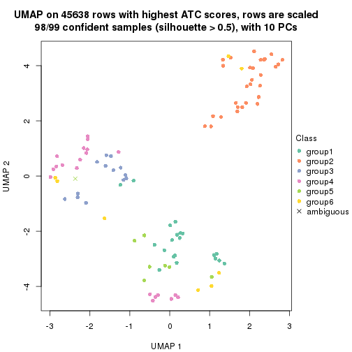</p>

</div>
</div>


Following heatmap shows how subgroups are split when increasing `k`:

```r
collect_classes(res)
```


Test correlation between subgroups and known annotations. If the known
annotation is numeric, one-way ANOVA test is applied, and if the known
annotation is discrete, chi-squared contingency table test is applied.

```r
test_to_known_factors(res)
```

```
#>             n tissue(p) time(p) agent(p)  dose(p) individual(p) k
#> ATC:hclust 91     0.519  0.1024    0.707 2.12e-05      4.11e-04 2
#> ATC:hclust 94     0.333  0.1340    0.514 2.05e-05      3.43e-04 3
#> ATC:hclust 98     0.149  0.1308    0.677 1.36e-04      2.90e-04 4
#> ATC:hclust 99     0.147  0.0209    0.731 3.70e-05      2.57e-07 5
#> ATC:hclust 98     0.211  0.0234    0.832 1.80e-04      1.40e-08 6
```


If matrix rows can be associated to genes, consider to use `functional_enrichment(res,
...)` to perform function enrichment for the signature genes. See [this vignette](http://bioconductor.org/packages/devel/bioc/vignettes/cola/inst/doc/functional_enrichment.html) for more detailed explanations.


 

---------------------------------------------------


### ATC:kmeans**


The object with results only for a single top-value method and a single partition method 
can be extracted as:

```r
res = res_list["ATC", "kmeans"]
# you can also extract it by
# res = res_list["ATC:kmeans"]
```

A summary of `res` and all the functions that can be applied to it:

```r
res
```

```
#> A 'ConsensusPartition' object with k = 2, 3, 4, 5, 6.
#>   On a matrix with 45638 rows and 99 columns.
#>   Top rows (1000, 2000, 3000, 4000, 5000) are extracted by 'ATC' method.
#>   Subgroups are detected by 'kmeans' method.
#>   Performed in total 1250 partitions by row resampling.
#>   Best k for subgroups seems to be 2.
#> 
#> Following methods can be applied to this 'ConsensusPartition' object:
#>  [1] "cola_report"             "collect_classes"         "collect_plots"          
#>  [4] "collect_stats"           "colnames"                "compare_signatures"     
#>  [7] "consensus_heatmap"       "dimension_reduction"     "functional_enrichment"  
#> [10] "get_anno_col"            "get_anno"                "get_classes"            
#> [13] "get_consensus"           "get_matrix"              "get_membership"         
#> [16] "get_param"               "get_signatures"          "get_stats"              
#> [19] "is_best_k"               "is_stable_k"             "membership_heatmap"     
#> [22] "ncol"                    "nrow"                    "plot_ecdf"              
#> [25] "rownames"                "select_partition_number" "show"                   
#> [28] "suggest_best_k"          "test_to_known_factors"
```

`collect_plots()` function collects all the plots made from `res` for all `k` (number of partitions)
into one single page to provide an easy and fast comparison between different `k`.

```r
collect_plots(res)
```


The plots are:

- The first row: a plot of the ECDF (empirical cumulative distribution
  function) curves of the consensus matrix for each `k` and the heatmap of
  predicted classes for each `k`.
- The second row: heatmaps of the consensus matrix for each `k`.
- The third row: heatmaps of the membership matrix for each `k`.
- The fouth row: heatmaps of the signatures for each `k`.

All the plots in panels can be made by individual functions and they are
plotted later in this section.

`select_partition_number()` produces several plots showing different
statistics for choosing "optimized" `k`. There are following statistics:

- ECDF curves of the consensus matrix for each `k`;
- 1-PAC. [The PAC
  score](https://en.wikipedia.org/wiki/Consensus_clustering#Over-interpretation_potential_of_consensus_clustering)
  measures the proportion of the ambiguous subgrouping.
- Mean silhouette score.
- Concordance. The mean probability of fiting the consensus class ids in all
  partitions.
- Area increased. Denote $A_k$ as the area under the ECDF curve for current
  `k`, the area increased is defined as $A_k - A_{k-1}$.
- Rand index. The percent of pairs of samples that are both in a same cluster
  or both are not in a same cluster in the partition of k and k-1.
- Jaccard index. The ratio of pairs of samples are both in a same cluster in
  the partition of k and k-1 and the pairs of samples are both in a same
  cluster in the partition k or k-1.

The detailed explanations of these statistics can be found in [the _cola_
vignette](http://bioconductor.org/packages/devel/bioc/vignettes/cola/inst/doc/cola.html#toc_13).

Generally speaking, lower PAC score, higher mean silhouette score or higher
concordance corresponds to better partition. Rand index and Jaccard index
measure how similar the current partition is compared to partition with `k-1`.
If they are too similar, we won't accept `k` is better than `k-1`.

```r
select_partition_number(res)
```


The numeric values for all these statistics can be obtained by `get_stats()`.

```r
get_stats(res)
```

```
#>   k 1-PAC mean_silhouette concordance area_increased  Rand Jaccard
#> 2 2 1.000           1.000       1.000         0.4969 0.504   0.504
#> 3 3 0.886           0.955       0.979         0.3517 0.728   0.507
#> 4 4 0.748           0.856       0.898         0.1152 0.829   0.543
#> 5 5 0.790           0.767       0.854         0.0606 0.946   0.788
#> 6 6 0.782           0.666       0.768         0.0371 0.973   0.877
```

`suggest_best_k()` suggests the best $k$ based on these statistics. The rules are as follows:

- All $k$ with Jaccard index larger than 0.95 are removed because increasing
  $k$ does not provide enough extra information. If all $k$ are removed, it is
  marked as no subgroup is detected.
- For all $k$ with 1-PAC score larger than 0.9, the maximal $k$ is taken as
  the best $k$, and other $k$ are marked as optional $k$.
- If it does not fit the second rule. The $k$ with the maximal vote of the
  highest 1-PAC score, highest mean silhouette, and highest concordance is
  taken as the best $k$.

```r
suggest_best_k(res)
```

```
#> [1] 2
```


Following shows the table of the partitions (You need to click the **show/hide
code output** link to see it). The membership matrix (columns with name `p*`)
is inferred by
[`clue::cl_consensus()`](https://www.rdocumentation.org/link/cl_consensus?package=clue)
function with the `SE` method. Basically the value in the membership matrix
represents the probability to belong to a certain group. The finall class
label for an item is determined with the group with highest probability it
belongs to.

In `get_classes()` function, the entropy is calculated from the membership
matrix and the silhouette score is calculated from the consensus matrix.


<script>
$( function() {
	$( '#tabs-ATC-kmeans-get-classes' ).tabs();
} );
</script>
<div id='tabs-ATC-kmeans-get-classes'>
<ul>
<li><a href='#tab-ATC-kmeans-get-classes-1'>k = 2</a></li>
<li><a href='#tab-ATC-kmeans-get-classes-2'>k = 3</a></li>
<li><a href='#tab-ATC-kmeans-get-classes-3'>k = 4</a></li>
<li><a href='#tab-ATC-kmeans-get-classes-4'>k = 5</a></li>
<li><a href='#tab-ATC-kmeans-get-classes-5'>k = 6</a></li>
</ul>

<div id='tab-ATC-kmeans-get-classes-1'>
<p><a id='tab-ATC-kmeans-get-classes-1-a' style='color:#0366d6' href='#'>show/hide code output</a></p>
<pre><code class="r">cbind(get_classes(res, k = 2), get_membership(res, k = 2))
</code></pre>

<pre><code>#&gt;            class entropy silhouette    p1    p2
#&gt; GSM1296094     1  0.0000      1.000 1.000 0.000
#&gt; GSM1296119     2  0.0000      1.000 0.000 1.000
#&gt; GSM1296076     2  0.0000      1.000 0.000 1.000
#&gt; GSM1296092     2  0.0000      1.000 0.000 1.000
#&gt; GSM1296103     1  0.0376      0.996 0.996 0.004
#&gt; GSM1296078     2  0.0000      1.000 0.000 1.000
#&gt; GSM1296107     2  0.0000      1.000 0.000 1.000
#&gt; GSM1296109     2  0.0000      1.000 0.000 1.000
#&gt; GSM1296080     1  0.0000      1.000 1.000 0.000
#&gt; GSM1296090     2  0.0000      1.000 0.000 1.000
#&gt; GSM1296074     2  0.0000      1.000 0.000 1.000
#&gt; GSM1296111     2  0.0000      1.000 0.000 1.000
#&gt; GSM1296099     2  0.0000      1.000 0.000 1.000
#&gt; GSM1296086     2  0.0000      1.000 0.000 1.000
#&gt; GSM1296117     2  0.0000      1.000 0.000 1.000
#&gt; GSM1296113     2  0.0000      1.000 0.000 1.000
#&gt; GSM1296096     2  0.0000      1.000 0.000 1.000
#&gt; GSM1296105     1  0.0000      1.000 1.000 0.000
#&gt; GSM1296098     1  0.0000      1.000 1.000 0.000
#&gt; GSM1296101     1  0.0000      1.000 1.000 0.000
#&gt; GSM1296121     2  0.0000      1.000 0.000 1.000
#&gt; GSM1296088     1  0.0000      1.000 1.000 0.000
#&gt; GSM1296082     2  0.0000      1.000 0.000 1.000
#&gt; GSM1296115     2  0.0000      1.000 0.000 1.000
#&gt; GSM1296084     1  0.0000      1.000 1.000 0.000
#&gt; GSM1296072     2  0.0000      1.000 0.000 1.000
#&gt; GSM1296069     2  0.0000      1.000 0.000 1.000
#&gt; GSM1296071     2  0.0000      1.000 0.000 1.000
#&gt; GSM1296070     2  0.0000      1.000 0.000 1.000
#&gt; GSM1296073     2  0.0000      1.000 0.000 1.000
#&gt; GSM1296034     1  0.0000      1.000 1.000 0.000
#&gt; GSM1296041     2  0.0000      1.000 0.000 1.000
#&gt; GSM1296035     2  0.0000      1.000 0.000 1.000
#&gt; GSM1296038     2  0.0000      1.000 0.000 1.000
#&gt; GSM1296047     2  0.0000      1.000 0.000 1.000
#&gt; GSM1296039     2  0.0000      1.000 0.000 1.000
#&gt; GSM1296042     2  0.0000      1.000 0.000 1.000
#&gt; GSM1296043     2  0.0000      1.000 0.000 1.000
#&gt; GSM1296037     1  0.0000      1.000 1.000 0.000
#&gt; GSM1296046     2  0.0000      1.000 0.000 1.000
#&gt; GSM1296044     2  0.0000      1.000 0.000 1.000
#&gt; GSM1296045     2  0.0000      1.000 0.000 1.000
#&gt; GSM1296025     1  0.0000      1.000 1.000 0.000
#&gt; GSM1296033     1  0.0000      1.000 1.000 0.000
#&gt; GSM1296027     1  0.0000      1.000 1.000 0.000
#&gt; GSM1296032     1  0.0000      1.000 1.000 0.000
#&gt; GSM1296024     1  0.0000      1.000 1.000 0.000
#&gt; GSM1296031     1  0.0000      1.000 1.000 0.000
#&gt; GSM1296028     1  0.0000      1.000 1.000 0.000
#&gt; GSM1296029     1  0.0000      1.000 1.000 0.000
#&gt; GSM1296026     1  0.0000      1.000 1.000 0.000
#&gt; GSM1296030     1  0.0000      1.000 1.000 0.000
#&gt; GSM1296040     1  0.0000      1.000 1.000 0.000
#&gt; GSM1296036     1  0.0000      1.000 1.000 0.000
#&gt; GSM1296048     2  0.0000      1.000 0.000 1.000
#&gt; GSM1296059     1  0.0000      1.000 1.000 0.000
#&gt; GSM1296066     2  0.0000      1.000 0.000 1.000
#&gt; GSM1296060     2  0.0000      1.000 0.000 1.000
#&gt; GSM1296063     2  0.0000      1.000 0.000 1.000
#&gt; GSM1296064     2  0.0000      1.000 0.000 1.000
#&gt; GSM1296067     2  0.0000      1.000 0.000 1.000
#&gt; GSM1296062     1  0.0000      1.000 1.000 0.000
#&gt; GSM1296068     2  0.0000      1.000 0.000 1.000
#&gt; GSM1296050     1  0.0000      1.000 1.000 0.000
#&gt; GSM1296057     1  0.0000      1.000 1.000 0.000
#&gt; GSM1296052     1  0.0000      1.000 1.000 0.000
#&gt; GSM1296054     1  0.0000      1.000 1.000 0.000
#&gt; GSM1296049     1  0.0000      1.000 1.000 0.000
#&gt; GSM1296055     2  0.0000      1.000 0.000 1.000
#&gt; GSM1296053     1  0.0000      1.000 1.000 0.000
#&gt; GSM1296058     1  0.0000      1.000 1.000 0.000
#&gt; GSM1296051     2  0.0000      1.000 0.000 1.000
#&gt; GSM1296056     2  0.0000      1.000 0.000 1.000
#&gt; GSM1296065     2  0.0000      1.000 0.000 1.000
#&gt; GSM1296061     1  0.0000      1.000 1.000 0.000
#&gt; GSM1296095     2  0.0000      1.000 0.000 1.000
#&gt; GSM1296120     2  0.0000      1.000 0.000 1.000
#&gt; GSM1296077     1  0.0000      1.000 1.000 0.000
#&gt; GSM1296093     1  0.0000      1.000 1.000 0.000
#&gt; GSM1296104     2  0.0000      1.000 0.000 1.000
#&gt; GSM1296079     1  0.0000      1.000 1.000 0.000
#&gt; GSM1296108     2  0.0000      1.000 0.000 1.000
#&gt; GSM1296110     2  0.0000      1.000 0.000 1.000
#&gt; GSM1296081     1  0.0000      1.000 1.000 0.000
#&gt; GSM1296091     1  0.0000      1.000 1.000 0.000
#&gt; GSM1296075     2  0.0000      1.000 0.000 1.000
#&gt; GSM1296112     2  0.0000      1.000 0.000 1.000
#&gt; GSM1296100     1  0.0000      1.000 1.000 0.000
#&gt; GSM1296087     1  0.0000      1.000 1.000 0.000
#&gt; GSM1296118     2  0.0000      1.000 0.000 1.000
#&gt; GSM1296114     2  0.0000      1.000 0.000 1.000
#&gt; GSM1296097     2  0.0000      1.000 0.000 1.000
#&gt; GSM1296106     2  0.0938      0.988 0.012 0.988
#&gt; GSM1296102     1  0.0000      1.000 1.000 0.000
#&gt; GSM1296122     2  0.0000      1.000 0.000 1.000
#&gt; GSM1296089     1  0.0000      1.000 1.000 0.000
#&gt; GSM1296083     1  0.0000      1.000 1.000 0.000
#&gt; GSM1296116     2  0.0000      1.000 0.000 1.000
#&gt; GSM1296085     1  0.0000      1.000 1.000 0.000
</code></pre>

<script>
$('#tab-ATC-kmeans-get-classes-1-a').parent().next().next().hide();
$('#tab-ATC-kmeans-get-classes-1-a').click(function(){
  $('#tab-ATC-kmeans-get-classes-1-a').parent().next().next().toggle();
  return(false);
});
</script>
</div>

<div id='tab-ATC-kmeans-get-classes-2'>
<p><a id='tab-ATC-kmeans-get-classes-2-a' style='color:#0366d6' href='#'>show/hide code output</a></p>
<pre><code class="r">cbind(get_classes(res, k = 3), get_membership(res, k = 3))
</code></pre>

<pre><code>#&gt;            class entropy silhouette    p1    p2    p3
#&gt; GSM1296094     3   0.000      0.954 0.000 0.000 1.000
#&gt; GSM1296119     2   0.000      0.995 0.000 1.000 0.000
#&gt; GSM1296076     2   0.000      0.995 0.000 1.000 0.000
#&gt; GSM1296092     3   0.000      0.954 0.000 0.000 1.000
#&gt; GSM1296103     3   0.000      0.954 0.000 0.000 1.000
#&gt; GSM1296078     2   0.000      0.995 0.000 1.000 0.000
#&gt; GSM1296107     2   0.000      0.995 0.000 1.000 0.000
#&gt; GSM1296109     3   0.497      0.719 0.000 0.236 0.764
#&gt; GSM1296080     1   0.000      0.980 1.000 0.000 0.000
#&gt; GSM1296090     3   0.000      0.954 0.000 0.000 1.000
#&gt; GSM1296074     2   0.394      0.801 0.000 0.844 0.156
#&gt; GSM1296111     2   0.000      0.995 0.000 1.000 0.000
#&gt; GSM1296099     3   0.000      0.954 0.000 0.000 1.000
#&gt; GSM1296086     3   0.000      0.954 0.000 0.000 1.000
#&gt; GSM1296117     2   0.000      0.995 0.000 1.000 0.000
#&gt; GSM1296113     2   0.000      0.995 0.000 1.000 0.000
#&gt; GSM1296096     3   0.000      0.954 0.000 0.000 1.000
#&gt; GSM1296105     3   0.000      0.954 0.000 0.000 1.000
#&gt; GSM1296098     1   0.319      0.880 0.888 0.000 0.112
#&gt; GSM1296101     3   0.000      0.954 0.000 0.000 1.000
#&gt; GSM1296121     2   0.000      0.995 0.000 1.000 0.000
#&gt; GSM1296088     3   0.000      0.954 0.000 0.000 1.000
#&gt; GSM1296082     3   0.348      0.845 0.000 0.128 0.872
#&gt; GSM1296115     2   0.000      0.995 0.000 1.000 0.000
#&gt; GSM1296084     1   0.375      0.845 0.856 0.000 0.144
#&gt; GSM1296072     2   0.000      0.995 0.000 1.000 0.000
#&gt; GSM1296069     2   0.000      0.995 0.000 1.000 0.000
#&gt; GSM1296071     2   0.000      0.995 0.000 1.000 0.000
#&gt; GSM1296070     2   0.000      0.995 0.000 1.000 0.000
#&gt; GSM1296073     2   0.000      0.995 0.000 1.000 0.000
#&gt; GSM1296034     1   0.000      0.980 1.000 0.000 0.000
#&gt; GSM1296041     2   0.000      0.995 0.000 1.000 0.000
#&gt; GSM1296035     3   0.000      0.954 0.000 0.000 1.000
#&gt; GSM1296038     3   0.000      0.954 0.000 0.000 1.000
#&gt; GSM1296047     2   0.000      0.995 0.000 1.000 0.000
#&gt; GSM1296039     2   0.000      0.995 0.000 1.000 0.000
#&gt; GSM1296042     2   0.000      0.995 0.000 1.000 0.000
#&gt; GSM1296043     2   0.000      0.995 0.000 1.000 0.000
#&gt; GSM1296037     1   0.000      0.980 1.000 0.000 0.000
#&gt; GSM1296046     2   0.000      0.995 0.000 1.000 0.000
#&gt; GSM1296044     2   0.000      0.995 0.000 1.000 0.000
#&gt; GSM1296045     2   0.000      0.995 0.000 1.000 0.000
#&gt; GSM1296025     1   0.000      0.980 1.000 0.000 0.000
#&gt; GSM1296033     1   0.000      0.980 1.000 0.000 0.000
#&gt; GSM1296027     1   0.000      0.980 1.000 0.000 0.000
#&gt; GSM1296032     1   0.000      0.980 1.000 0.000 0.000
#&gt; GSM1296024     1   0.000      0.980 1.000 0.000 0.000
#&gt; GSM1296031     1   0.000      0.980 1.000 0.000 0.000
#&gt; GSM1296028     1   0.000      0.980 1.000 0.000 0.000
#&gt; GSM1296029     1   0.000      0.980 1.000 0.000 0.000
#&gt; GSM1296026     1   0.510      0.698 0.752 0.000 0.248
#&gt; GSM1296030     1   0.000      0.980 1.000 0.000 0.000
#&gt; GSM1296040     3   0.000      0.954 0.000 0.000 1.000
#&gt; GSM1296036     1   0.319      0.880 0.888 0.000 0.112
#&gt; GSM1296048     2   0.000      0.995 0.000 1.000 0.000
#&gt; GSM1296059     3   0.000      0.954 0.000 0.000 1.000
#&gt; GSM1296066     2   0.000      0.995 0.000 1.000 0.000
#&gt; GSM1296060     3   0.000      0.954 0.000 0.000 1.000
#&gt; GSM1296063     2   0.000      0.995 0.000 1.000 0.000
#&gt; GSM1296064     2   0.000      0.995 0.000 1.000 0.000
#&gt; GSM1296067     3   0.000      0.954 0.000 0.000 1.000
#&gt; GSM1296062     1   0.000      0.980 1.000 0.000 0.000
#&gt; GSM1296068     2   0.000      0.995 0.000 1.000 0.000
#&gt; GSM1296050     3   0.000      0.954 0.000 0.000 1.000
#&gt; GSM1296057     3   0.000      0.954 0.000 0.000 1.000
#&gt; GSM1296052     1   0.000      0.980 1.000 0.000 0.000
#&gt; GSM1296054     1   0.000      0.980 1.000 0.000 0.000
#&gt; GSM1296049     1   0.000      0.980 1.000 0.000 0.000
#&gt; GSM1296055     3   0.000      0.954 0.000 0.000 1.000
#&gt; GSM1296053     1   0.000      0.980 1.000 0.000 0.000
#&gt; GSM1296058     3   0.506      0.647 0.244 0.000 0.756
#&gt; GSM1296051     3   0.000      0.954 0.000 0.000 1.000
#&gt; GSM1296056     3   0.000      0.954 0.000 0.000 1.000
#&gt; GSM1296065     3   0.497      0.719 0.000 0.236 0.764
#&gt; GSM1296061     1   0.000      0.980 1.000 0.000 0.000
#&gt; GSM1296095     3   0.497      0.719 0.000 0.236 0.764
#&gt; GSM1296120     2   0.000      0.995 0.000 1.000 0.000
#&gt; GSM1296077     1   0.000      0.980 1.000 0.000 0.000
#&gt; GSM1296093     1   0.000      0.980 1.000 0.000 0.000
#&gt; GSM1296104     3   0.497      0.719 0.000 0.236 0.764
#&gt; GSM1296079     1   0.000      0.980 1.000 0.000 0.000
#&gt; GSM1296108     2   0.000      0.995 0.000 1.000 0.000
#&gt; GSM1296110     2   0.000      0.995 0.000 1.000 0.000
#&gt; GSM1296081     1   0.000      0.980 1.000 0.000 0.000
#&gt; GSM1296091     3   0.000      0.954 0.000 0.000 1.000
#&gt; GSM1296075     3   0.000      0.954 0.000 0.000 1.000
#&gt; GSM1296112     2   0.000      0.995 0.000 1.000 0.000
#&gt; GSM1296100     1   0.000      0.980 1.000 0.000 0.000
#&gt; GSM1296087     1   0.000      0.980 1.000 0.000 0.000
#&gt; GSM1296118     2   0.000      0.995 0.000 1.000 0.000
#&gt; GSM1296114     2   0.000      0.995 0.000 1.000 0.000
#&gt; GSM1296097     3   0.000      0.954 0.000 0.000 1.000
#&gt; GSM1296106     3   0.000      0.954 0.000 0.000 1.000
#&gt; GSM1296102     1   0.000      0.980 1.000 0.000 0.000
#&gt; GSM1296122     3   0.000      0.954 0.000 0.000 1.000
#&gt; GSM1296089     1   0.000      0.980 1.000 0.000 0.000
#&gt; GSM1296083     1   0.000      0.980 1.000 0.000 0.000
#&gt; GSM1296116     2   0.000      0.995 0.000 1.000 0.000
#&gt; GSM1296085     1   0.000      0.980 1.000 0.000 0.000
</code></pre>

<script>
$('#tab-ATC-kmeans-get-classes-2-a').parent().next().next().hide();
$('#tab-ATC-kmeans-get-classes-2-a').click(function(){
  $('#tab-ATC-kmeans-get-classes-2-a').parent().next().next().toggle();
  return(false);
});
</script>
</div>

<div id='tab-ATC-kmeans-get-classes-3'>
<p><a id='tab-ATC-kmeans-get-classes-3-a' style='color:#0366d6' href='#'>show/hide code output</a></p>
<pre><code class="r">cbind(get_classes(res, k = 4), get_membership(res, k = 4))
</code></pre>

<pre><code>#&gt;            class entropy silhouette    p1    p2    p3    p4
#&gt; GSM1296094     3  0.2973      0.840 0.000 0.000 0.856 0.144
#&gt; GSM1296119     2  0.0000      0.898 0.000 1.000 0.000 0.000
#&gt; GSM1296076     4  0.4898      0.373 0.000 0.416 0.000 0.584
#&gt; GSM1296092     4  0.1474      0.886 0.000 0.000 0.052 0.948
#&gt; GSM1296103     3  0.4222      0.708 0.000 0.000 0.728 0.272
#&gt; GSM1296078     4  0.4888      0.383 0.000 0.412 0.000 0.588
#&gt; GSM1296107     2  0.0000      0.898 0.000 1.000 0.000 0.000
#&gt; GSM1296109     4  0.1151      0.882 0.000 0.024 0.008 0.968
#&gt; GSM1296080     1  0.0000      0.992 1.000 0.000 0.000 0.000
#&gt; GSM1296090     4  0.1474      0.886 0.000 0.000 0.052 0.948
#&gt; GSM1296074     4  0.3486      0.763 0.000 0.188 0.000 0.812
#&gt; GSM1296111     2  0.0000      0.898 0.000 1.000 0.000 0.000
#&gt; GSM1296099     4  0.1389      0.886 0.000 0.000 0.048 0.952
#&gt; GSM1296086     4  0.1474      0.886 0.000 0.000 0.052 0.948
#&gt; GSM1296117     2  0.0000      0.898 0.000 1.000 0.000 0.000
#&gt; GSM1296113     2  0.0000      0.898 0.000 1.000 0.000 0.000
#&gt; GSM1296096     4  0.1389      0.886 0.000 0.000 0.048 0.952
#&gt; GSM1296105     3  0.2973      0.840 0.000 0.000 0.856 0.144
#&gt; GSM1296098     3  0.3123      0.849 0.156 0.000 0.844 0.000
#&gt; GSM1296101     3  0.2973      0.840 0.000 0.000 0.856 0.144
#&gt; GSM1296121     2  0.0000      0.898 0.000 1.000 0.000 0.000
#&gt; GSM1296088     3  0.2921      0.840 0.000 0.000 0.860 0.140
#&gt; GSM1296082     4  0.1733      0.883 0.000 0.024 0.028 0.948
#&gt; GSM1296115     2  0.0000      0.898 0.000 1.000 0.000 0.000
#&gt; GSM1296084     3  0.2973      0.852 0.144 0.000 0.856 0.000
#&gt; GSM1296072     2  0.6353      0.695 0.000 0.652 0.140 0.208
#&gt; GSM1296069     2  0.0000      0.898 0.000 1.000 0.000 0.000
#&gt; GSM1296071     2  0.4088      0.851 0.000 0.820 0.140 0.040
#&gt; GSM1296070     2  0.0000      0.898 0.000 1.000 0.000 0.000
#&gt; GSM1296073     2  0.0000      0.898 0.000 1.000 0.000 0.000
#&gt; GSM1296034     1  0.0000      0.992 1.000 0.000 0.000 0.000
#&gt; GSM1296041     2  0.0000      0.898 0.000 1.000 0.000 0.000
#&gt; GSM1296035     4  0.1389      0.886 0.000 0.000 0.048 0.952
#&gt; GSM1296038     4  0.1211      0.886 0.000 0.000 0.040 0.960
#&gt; GSM1296047     2  0.6386      0.689 0.000 0.648 0.140 0.212
#&gt; GSM1296039     4  0.4585      0.554 0.000 0.332 0.000 0.668
#&gt; GSM1296042     2  0.0000      0.898 0.000 1.000 0.000 0.000
#&gt; GSM1296043     2  0.0000      0.898 0.000 1.000 0.000 0.000
#&gt; GSM1296037     3  0.3528      0.830 0.192 0.000 0.808 0.000
#&gt; GSM1296046     2  0.3143      0.873 0.000 0.876 0.100 0.024
#&gt; GSM1296044     2  0.3143      0.873 0.000 0.876 0.100 0.024
#&gt; GSM1296045     2  0.0000      0.898 0.000 1.000 0.000 0.000
#&gt; GSM1296025     1  0.0000      0.992 1.000 0.000 0.000 0.000
#&gt; GSM1296033     3  0.3528      0.830 0.192 0.000 0.808 0.000
#&gt; GSM1296027     1  0.0000      0.992 1.000 0.000 0.000 0.000
#&gt; GSM1296032     1  0.0000      0.992 1.000 0.000 0.000 0.000
#&gt; GSM1296024     1  0.0000      0.992 1.000 0.000 0.000 0.000
#&gt; GSM1296031     3  0.3528      0.830 0.192 0.000 0.808 0.000
#&gt; GSM1296028     1  0.0000      0.992 1.000 0.000 0.000 0.000
#&gt; GSM1296029     1  0.0000      0.992 1.000 0.000 0.000 0.000
#&gt; GSM1296026     3  0.2921      0.852 0.140 0.000 0.860 0.000
#&gt; GSM1296030     1  0.0000      0.992 1.000 0.000 0.000 0.000
#&gt; GSM1296040     3  0.2973      0.840 0.000 0.000 0.856 0.144
#&gt; GSM1296036     3  0.3123      0.849 0.156 0.000 0.844 0.000
#&gt; GSM1296048     2  0.0000      0.898 0.000 1.000 0.000 0.000
#&gt; GSM1296059     3  0.4193      0.713 0.000 0.000 0.732 0.268
#&gt; GSM1296066     2  0.0000      0.898 0.000 1.000 0.000 0.000
#&gt; GSM1296060     4  0.1389      0.886 0.000 0.000 0.048 0.952
#&gt; GSM1296063     2  0.3764      0.660 0.000 0.784 0.000 0.216
#&gt; GSM1296064     2  0.3764      0.660 0.000 0.784 0.000 0.216
#&gt; GSM1296067     4  0.2589      0.817 0.000 0.000 0.116 0.884
#&gt; GSM1296062     3  0.3311      0.841 0.172 0.000 0.828 0.000
#&gt; GSM1296068     2  0.4088      0.851 0.000 0.820 0.140 0.040
#&gt; GSM1296050     3  0.2593      0.836 0.004 0.000 0.892 0.104
#&gt; GSM1296057     3  0.2973      0.840 0.000 0.000 0.856 0.144
#&gt; GSM1296052     1  0.0000      0.992 1.000 0.000 0.000 0.000
#&gt; GSM1296054     1  0.0000      0.992 1.000 0.000 0.000 0.000
#&gt; GSM1296049     1  0.0000      0.992 1.000 0.000 0.000 0.000
#&gt; GSM1296055     4  0.3172      0.750 0.000 0.000 0.160 0.840
#&gt; GSM1296053     1  0.0000      0.992 1.000 0.000 0.000 0.000
#&gt; GSM1296058     3  0.3441      0.848 0.024 0.000 0.856 0.120
#&gt; GSM1296051     4  0.1302      0.887 0.000 0.000 0.044 0.956
#&gt; GSM1296056     4  0.1389      0.886 0.000 0.000 0.048 0.952
#&gt; GSM1296065     4  0.0817      0.874 0.000 0.000 0.024 0.976
#&gt; GSM1296061     3  0.3528      0.830 0.192 0.000 0.808 0.000
#&gt; GSM1296095     4  0.0817      0.874 0.000 0.000 0.024 0.976
#&gt; GSM1296120     2  0.4088      0.851 0.000 0.820 0.140 0.040
#&gt; GSM1296077     1  0.1302      0.948 0.956 0.000 0.044 0.000
#&gt; GSM1296093     1  0.0000      0.992 1.000 0.000 0.000 0.000
#&gt; GSM1296104     4  0.0817      0.874 0.000 0.000 0.024 0.976
#&gt; GSM1296079     1  0.2081      0.900 0.916 0.000 0.084 0.000
#&gt; GSM1296108     2  0.4088      0.851 0.000 0.820 0.140 0.040
#&gt; GSM1296110     2  0.6386      0.689 0.000 0.648 0.140 0.212
#&gt; GSM1296081     1  0.0000      0.992 1.000 0.000 0.000 0.000
#&gt; GSM1296091     3  0.2921      0.840 0.000 0.000 0.860 0.140
#&gt; GSM1296075     4  0.1389      0.864 0.000 0.000 0.048 0.952
#&gt; GSM1296112     2  0.4088      0.851 0.000 0.820 0.140 0.040
#&gt; GSM1296100     3  0.3528      0.830 0.192 0.000 0.808 0.000
#&gt; GSM1296087     1  0.0000      0.992 1.000 0.000 0.000 0.000
#&gt; GSM1296118     2  0.6320      0.700 0.000 0.656 0.140 0.204
#&gt; GSM1296114     2  0.3143      0.873 0.000 0.876 0.100 0.024
#&gt; GSM1296097     4  0.1211      0.886 0.000 0.000 0.040 0.960
#&gt; GSM1296106     3  0.4955      0.363 0.000 0.000 0.556 0.444
#&gt; GSM1296102     3  0.3528      0.830 0.192 0.000 0.808 0.000
#&gt; GSM1296122     4  0.2814      0.804 0.000 0.000 0.132 0.868
#&gt; GSM1296089     3  0.3528      0.830 0.192 0.000 0.808 0.000
#&gt; GSM1296083     1  0.0000      0.992 1.000 0.000 0.000 0.000
#&gt; GSM1296116     2  0.3143      0.873 0.000 0.876 0.100 0.024
#&gt; GSM1296085     1  0.0000      0.992 1.000 0.000 0.000 0.000
</code></pre>

<script>
$('#tab-ATC-kmeans-get-classes-3-a').parent().next().next().hide();
$('#tab-ATC-kmeans-get-classes-3-a').click(function(){
  $('#tab-ATC-kmeans-get-classes-3-a').parent().next().next().toggle();
  return(false);
});
</script>
</div>

<div id='tab-ATC-kmeans-get-classes-4'>
<p><a id='tab-ATC-kmeans-get-classes-4-a' style='color:#0366d6' href='#'>show/hide code output</a></p>
<pre><code class="r">cbind(get_classes(res, k = 5), get_membership(res, k = 5))
</code></pre>

<pre><code>#&gt;            class entropy silhouette    p1    p2    p3    p4    p5
#&gt; GSM1296094     3  0.2843     0.8420 0.000 0.144 0.848 0.008 0.000
#&gt; GSM1296119     5  0.0000     0.8279 0.000 0.000 0.000 0.000 1.000
#&gt; GSM1296076     4  0.5762     0.5349 0.000 0.144 0.000 0.608 0.248
#&gt; GSM1296092     4  0.0794     0.8668 0.000 0.028 0.000 0.972 0.000
#&gt; GSM1296103     3  0.6071     0.5535 0.000 0.160 0.556 0.284 0.000
#&gt; GSM1296078     4  0.5740     0.5434 0.000 0.144 0.000 0.612 0.244
#&gt; GSM1296107     5  0.0000     0.8279 0.000 0.000 0.000 0.000 1.000
#&gt; GSM1296109     4  0.1608     0.8648 0.000 0.072 0.000 0.928 0.000
#&gt; GSM1296080     1  0.0162     0.9695 0.996 0.004 0.000 0.000 0.000
#&gt; GSM1296090     4  0.1544     0.8661 0.000 0.068 0.000 0.932 0.000
#&gt; GSM1296074     4  0.2763     0.8359 0.000 0.148 0.000 0.848 0.004
#&gt; GSM1296111     5  0.0000     0.8279 0.000 0.000 0.000 0.000 1.000
#&gt; GSM1296099     4  0.0290     0.8656 0.000 0.008 0.000 0.992 0.000
#&gt; GSM1296086     4  0.1043     0.8666 0.000 0.040 0.000 0.960 0.000
#&gt; GSM1296117     5  0.0000     0.8279 0.000 0.000 0.000 0.000 1.000
#&gt; GSM1296113     5  0.0000     0.8279 0.000 0.000 0.000 0.000 1.000
#&gt; GSM1296096     4  0.0290     0.8656 0.000 0.008 0.000 0.992 0.000
#&gt; GSM1296105     3  0.1671     0.8655 0.000 0.076 0.924 0.000 0.000
#&gt; GSM1296098     3  0.3006     0.8444 0.004 0.156 0.836 0.004 0.000
#&gt; GSM1296101     3  0.3452     0.8335 0.000 0.148 0.820 0.032 0.000
#&gt; GSM1296121     5  0.0000     0.8279 0.000 0.000 0.000 0.000 1.000
#&gt; GSM1296088     3  0.3011     0.8599 0.000 0.140 0.844 0.016 0.000
#&gt; GSM1296082     4  0.1544     0.8661 0.000 0.068 0.000 0.932 0.000
#&gt; GSM1296115     5  0.0000     0.8279 0.000 0.000 0.000 0.000 1.000
#&gt; GSM1296084     3  0.2563     0.8490 0.008 0.120 0.872 0.000 0.000
#&gt; GSM1296072     2  0.4555     0.6688 0.000 0.636 0.000 0.020 0.344
#&gt; GSM1296069     5  0.0000     0.8279 0.000 0.000 0.000 0.000 1.000
#&gt; GSM1296071     2  0.4306     0.5797 0.000 0.508 0.000 0.000 0.492
#&gt; GSM1296070     5  0.0000     0.8279 0.000 0.000 0.000 0.000 1.000
#&gt; GSM1296073     5  0.0000     0.8279 0.000 0.000 0.000 0.000 1.000
#&gt; GSM1296034     1  0.0162     0.9695 0.996 0.004 0.000 0.000 0.000
#&gt; GSM1296041     5  0.0000     0.8279 0.000 0.000 0.000 0.000 1.000
#&gt; GSM1296035     4  0.0609     0.8626 0.000 0.020 0.000 0.980 0.000
#&gt; GSM1296038     4  0.0771     0.8671 0.000 0.020 0.004 0.976 0.000
#&gt; GSM1296047     2  0.4540     0.6669 0.000 0.640 0.000 0.020 0.340
#&gt; GSM1296039     4  0.4848     0.7082 0.000 0.144 0.000 0.724 0.132
#&gt; GSM1296042     5  0.0000     0.8279 0.000 0.000 0.000 0.000 1.000
#&gt; GSM1296043     5  0.0290     0.8202 0.000 0.008 0.000 0.000 0.992
#&gt; GSM1296037     3  0.0798     0.8664 0.008 0.016 0.976 0.000 0.000
#&gt; GSM1296046     5  0.3774     0.2142 0.000 0.296 0.000 0.000 0.704
#&gt; GSM1296044     5  0.3816     0.1853 0.000 0.304 0.000 0.000 0.696
#&gt; GSM1296045     5  0.0290     0.8202 0.000 0.008 0.000 0.000 0.992
#&gt; GSM1296025     1  0.0404     0.9685 0.988 0.012 0.000 0.000 0.000
#&gt; GSM1296033     3  0.2563     0.8490 0.008 0.120 0.872 0.000 0.000
#&gt; GSM1296027     1  0.0162     0.9694 0.996 0.004 0.000 0.000 0.000
#&gt; GSM1296032     1  0.0794     0.9648 0.972 0.028 0.000 0.000 0.000
#&gt; GSM1296024     1  0.0404     0.9685 0.988 0.012 0.000 0.000 0.000
#&gt; GSM1296031     3  0.2777     0.8461 0.016 0.120 0.864 0.000 0.000
#&gt; GSM1296028     1  0.0794     0.9648 0.972 0.028 0.000 0.000 0.000
#&gt; GSM1296029     1  0.0794     0.9648 0.972 0.028 0.000 0.000 0.000
#&gt; GSM1296026     3  0.2286     0.8484 0.004 0.108 0.888 0.000 0.000
#&gt; GSM1296030     1  0.0794     0.9648 0.972 0.028 0.000 0.000 0.000
#&gt; GSM1296040     3  0.2843     0.8420 0.000 0.144 0.848 0.008 0.000
#&gt; GSM1296036     3  0.2971     0.8449 0.008 0.156 0.836 0.000 0.000
#&gt; GSM1296048     5  0.0000     0.8279 0.000 0.000 0.000 0.000 1.000
#&gt; GSM1296059     3  0.6071     0.5535 0.000 0.160 0.556 0.284 0.000
#&gt; GSM1296066     5  0.0000     0.8279 0.000 0.000 0.000 0.000 1.000
#&gt; GSM1296060     4  0.0609     0.8626 0.000 0.020 0.000 0.980 0.000
#&gt; GSM1296063     5  0.5905     0.1546 0.000 0.136 0.000 0.292 0.572
#&gt; GSM1296064     5  0.5323     0.2434 0.000 0.080 0.000 0.296 0.624
#&gt; GSM1296067     2  0.5245     0.0809 0.000 0.608 0.064 0.328 0.000
#&gt; GSM1296062     3  0.2929     0.8459 0.008 0.152 0.840 0.000 0.000
#&gt; GSM1296068     2  0.4306     0.5797 0.000 0.508 0.000 0.000 0.492
#&gt; GSM1296050     3  0.3642     0.7636 0.000 0.232 0.760 0.008 0.000
#&gt; GSM1296057     3  0.1124     0.8646 0.000 0.036 0.960 0.004 0.000
#&gt; GSM1296052     1  0.0162     0.9694 0.996 0.004 0.000 0.000 0.000
#&gt; GSM1296054     1  0.0162     0.9695 0.996 0.004 0.000 0.000 0.000
#&gt; GSM1296049     1  0.0404     0.9685 0.988 0.012 0.000 0.000 0.000
#&gt; GSM1296055     4  0.5725     0.5050 0.000 0.172 0.204 0.624 0.000
#&gt; GSM1296053     1  0.0162     0.9695 0.996 0.004 0.000 0.000 0.000
#&gt; GSM1296058     3  0.0324     0.8671 0.000 0.004 0.992 0.004 0.000
#&gt; GSM1296051     4  0.2304     0.8611 0.000 0.100 0.008 0.892 0.000
#&gt; GSM1296056     4  0.0290     0.8656 0.000 0.008 0.000 0.992 0.000
#&gt; GSM1296065     4  0.2674     0.8400 0.000 0.140 0.004 0.856 0.000
#&gt; GSM1296061     3  0.2929     0.8459 0.008 0.152 0.840 0.000 0.000
#&gt; GSM1296095     4  0.2536     0.8426 0.000 0.128 0.004 0.868 0.000
#&gt; GSM1296120     2  0.4306     0.5797 0.000 0.508 0.000 0.000 0.492
#&gt; GSM1296077     1  0.4117     0.7947 0.788 0.096 0.116 0.000 0.000
#&gt; GSM1296093     1  0.0162     0.9695 0.996 0.004 0.000 0.000 0.000
#&gt; GSM1296104     4  0.2583     0.8415 0.000 0.132 0.004 0.864 0.000
#&gt; GSM1296079     1  0.4478     0.7512 0.756 0.100 0.144 0.000 0.000
#&gt; GSM1296108     2  0.4306     0.5797 0.000 0.508 0.000 0.000 0.492
#&gt; GSM1296110     2  0.4585     0.6694 0.000 0.628 0.000 0.020 0.352
#&gt; GSM1296081     1  0.0162     0.9695 0.996 0.004 0.000 0.000 0.000
#&gt; GSM1296091     3  0.2753     0.8375 0.000 0.136 0.856 0.008 0.000
#&gt; GSM1296075     4  0.3885     0.7500 0.000 0.268 0.008 0.724 0.000
#&gt; GSM1296112     2  0.4306     0.5797 0.000 0.508 0.000 0.000 0.492
#&gt; GSM1296100     3  0.0798     0.8664 0.008 0.016 0.976 0.000 0.000
#&gt; GSM1296087     1  0.0794     0.9648 0.972 0.028 0.000 0.000 0.000
#&gt; GSM1296118     2  0.4570     0.6697 0.000 0.632 0.000 0.020 0.348
#&gt; GSM1296114     5  0.3816     0.1853 0.000 0.304 0.000 0.000 0.696
#&gt; GSM1296097     4  0.3304     0.7635 0.000 0.168 0.016 0.816 0.000
#&gt; GSM1296106     3  0.6219     0.4094 0.000 0.176 0.532 0.292 0.000
#&gt; GSM1296102     3  0.0798     0.8664 0.008 0.016 0.976 0.000 0.000
#&gt; GSM1296122     2  0.5172     0.0934 0.000 0.616 0.060 0.324 0.000
#&gt; GSM1296089     3  0.2660     0.8467 0.008 0.128 0.864 0.000 0.000
#&gt; GSM1296083     1  0.0162     0.9695 0.996 0.004 0.000 0.000 0.000
#&gt; GSM1296116     5  0.3816     0.1853 0.000 0.304 0.000 0.000 0.696
#&gt; GSM1296085     1  0.0290     0.9691 0.992 0.008 0.000 0.000 0.000
</code></pre>

<script>
$('#tab-ATC-kmeans-get-classes-4-a').parent().next().next().hide();
$('#tab-ATC-kmeans-get-classes-4-a').click(function(){
  $('#tab-ATC-kmeans-get-classes-4-a').parent().next().next().toggle();
  return(false);
});
</script>
</div>

<div id='tab-ATC-kmeans-get-classes-5'>
<p><a id='tab-ATC-kmeans-get-classes-5-a' style='color:#0366d6' href='#'>show/hide code output</a></p>
<pre><code class="r">cbind(get_classes(res, k = 6), get_membership(res, k = 6))
</code></pre>

<pre><code>#&gt;            class entropy silhouette    p1    p2    p3    p4    p5 p6
#&gt; GSM1296094     3  0.3620     0.7235 0.000 0.000 0.648 0.000 0.000 NA
#&gt; GSM1296119     5  0.0000     0.8054 0.000 0.000 0.000 0.000 1.000 NA
#&gt; GSM1296076     4  0.6635     0.5324 0.000 0.136 0.000 0.528 0.112 NA
#&gt; GSM1296092     4  0.1890     0.7022 0.000 0.024 0.000 0.916 0.000 NA
#&gt; GSM1296103     4  0.6398    -0.1838 0.000 0.012 0.292 0.364 0.000 NA
#&gt; GSM1296078     4  0.6635     0.5324 0.000 0.136 0.000 0.528 0.112 NA
#&gt; GSM1296107     5  0.0000     0.8054 0.000 0.000 0.000 0.000 1.000 NA
#&gt; GSM1296109     4  0.2420     0.6984 0.000 0.040 0.000 0.884 0.000 NA
#&gt; GSM1296080     1  0.0146     0.9226 0.996 0.004 0.000 0.000 0.000 NA
#&gt; GSM1296090     4  0.3522     0.6908 0.000 0.044 0.000 0.784 0.000 NA
#&gt; GSM1296074     4  0.4908     0.6414 0.000 0.128 0.000 0.648 0.000 NA
#&gt; GSM1296111     5  0.0000     0.8054 0.000 0.000 0.000 0.000 1.000 NA
#&gt; GSM1296099     4  0.0458     0.6968 0.000 0.000 0.000 0.984 0.000 NA
#&gt; GSM1296086     4  0.1890     0.6995 0.000 0.024 0.000 0.916 0.000 NA
#&gt; GSM1296117     5  0.0000     0.8054 0.000 0.000 0.000 0.000 1.000 NA
#&gt; GSM1296113     5  0.0000     0.8054 0.000 0.000 0.000 0.000 1.000 NA
#&gt; GSM1296096     4  0.0260     0.6977 0.000 0.000 0.000 0.992 0.000 NA
#&gt; GSM1296105     3  0.2100     0.7899 0.000 0.004 0.884 0.000 0.000 NA
#&gt; GSM1296098     3  0.3636     0.7317 0.000 0.004 0.676 0.000 0.000 NA
#&gt; GSM1296101     3  0.4936     0.6680 0.000 0.012 0.576 0.048 0.000 NA
#&gt; GSM1296121     5  0.0000     0.8054 0.000 0.000 0.000 0.000 1.000 NA
#&gt; GSM1296088     3  0.3121     0.7775 0.000 0.008 0.796 0.004 0.000 NA
#&gt; GSM1296082     4  0.3974     0.6772 0.000 0.048 0.000 0.728 0.000 NA
#&gt; GSM1296115     5  0.0000     0.8054 0.000 0.000 0.000 0.000 1.000 NA
#&gt; GSM1296084     3  0.2613     0.7700 0.000 0.012 0.848 0.000 0.000 NA
#&gt; GSM1296072     2  0.3231     0.7189 0.000 0.800 0.000 0.012 0.180 NA
#&gt; GSM1296069     5  0.0000     0.8054 0.000 0.000 0.000 0.000 1.000 NA
#&gt; GSM1296071     2  0.3659     0.6413 0.000 0.636 0.000 0.000 0.364 NA
#&gt; GSM1296070     5  0.0000     0.8054 0.000 0.000 0.000 0.000 1.000 NA
#&gt; GSM1296073     5  0.0000     0.8054 0.000 0.000 0.000 0.000 1.000 NA
#&gt; GSM1296034     1  0.0146     0.9226 0.996 0.004 0.000 0.000 0.000 NA
#&gt; GSM1296041     5  0.0000     0.8054 0.000 0.000 0.000 0.000 1.000 NA
#&gt; GSM1296035     4  0.1942     0.6762 0.000 0.012 0.008 0.916 0.000 NA
#&gt; GSM1296038     4  0.0405     0.6994 0.000 0.004 0.000 0.988 0.000 NA
#&gt; GSM1296047     2  0.3121     0.7194 0.000 0.804 0.000 0.012 0.180 NA
#&gt; GSM1296039     4  0.5897     0.5977 0.000 0.132 0.000 0.596 0.048 NA
#&gt; GSM1296042     5  0.0000     0.8054 0.000 0.000 0.000 0.000 1.000 NA
#&gt; GSM1296043     5  0.0547     0.7887 0.000 0.020 0.000 0.000 0.980 NA
#&gt; GSM1296037     3  0.1257     0.7983 0.000 0.020 0.952 0.000 0.000 NA
#&gt; GSM1296046     5  0.3727     0.1055 0.000 0.388 0.000 0.000 0.612 NA
#&gt; GSM1296044     5  0.3727     0.1055 0.000 0.388 0.000 0.000 0.612 NA
#&gt; GSM1296045     5  0.0547     0.7887 0.000 0.020 0.000 0.000 0.980 NA
#&gt; GSM1296025     1  0.1572     0.9090 0.936 0.028 0.000 0.000 0.000 NA
#&gt; GSM1296033     3  0.2973     0.7670 0.004 0.024 0.836 0.000 0.000 NA
#&gt; GSM1296027     1  0.1196     0.9199 0.952 0.040 0.000 0.000 0.000 NA
#&gt; GSM1296032     1  0.2568     0.9035 0.876 0.068 0.000 0.000 0.000 NA
#&gt; GSM1296024     1  0.1572     0.9090 0.936 0.028 0.000 0.000 0.000 NA
#&gt; GSM1296031     3  0.3313     0.7633 0.016 0.024 0.820 0.000 0.000 NA
#&gt; GSM1296028     1  0.2910     0.8923 0.852 0.068 0.000 0.000 0.000 NA
#&gt; GSM1296029     1  0.2568     0.9035 0.876 0.068 0.000 0.000 0.000 NA
#&gt; GSM1296026     3  0.3023     0.7692 0.000 0.032 0.828 0.000 0.000 NA
#&gt; GSM1296030     1  0.2910     0.8923 0.852 0.068 0.000 0.000 0.000 NA
#&gt; GSM1296040     3  0.3592     0.7253 0.000 0.000 0.656 0.000 0.000 NA
#&gt; GSM1296036     3  0.3636     0.7317 0.000 0.004 0.676 0.000 0.000 NA
#&gt; GSM1296048     5  0.0000     0.8054 0.000 0.000 0.000 0.000 1.000 NA
#&gt; GSM1296059     4  0.6398    -0.1838 0.000 0.012 0.292 0.364 0.000 NA
#&gt; GSM1296066     5  0.0000     0.8054 0.000 0.000 0.000 0.000 1.000 NA
#&gt; GSM1296060     4  0.2326     0.6673 0.000 0.012 0.008 0.888 0.000 NA
#&gt; GSM1296063     5  0.7303    -0.1876 0.000 0.116 0.000 0.304 0.368 NA
#&gt; GSM1296064     5  0.6897    -0.0765 0.000 0.068 0.000 0.296 0.424 NA
#&gt; GSM1296067     2  0.5971     0.1678 0.000 0.548 0.020 0.216 0.000 NA
#&gt; GSM1296062     3  0.3690     0.7342 0.000 0.008 0.684 0.000 0.000 NA
#&gt; GSM1296068     2  0.3659     0.6413 0.000 0.636 0.000 0.000 0.364 NA
#&gt; GSM1296050     3  0.6063     0.4107 0.000 0.180 0.460 0.012 0.000 NA
#&gt; GSM1296057     3  0.2039     0.7855 0.000 0.016 0.908 0.004 0.000 NA
#&gt; GSM1296052     1  0.1196     0.9199 0.952 0.040 0.000 0.000 0.000 NA
#&gt; GSM1296054     1  0.0146     0.9226 0.996 0.004 0.000 0.000 0.000 NA
#&gt; GSM1296049     1  0.1723     0.9085 0.928 0.036 0.000 0.000 0.000 NA
#&gt; GSM1296055     4  0.7337     0.2882 0.000 0.180 0.164 0.412 0.000 NA
#&gt; GSM1296053     1  0.0146     0.9226 0.996 0.004 0.000 0.000 0.000 NA
#&gt; GSM1296058     3  0.0935     0.7985 0.000 0.004 0.964 0.000 0.000 NA
#&gt; GSM1296051     4  0.4854     0.6230 0.000 0.088 0.000 0.620 0.000 NA
#&gt; GSM1296056     4  0.0260     0.6977 0.000 0.000 0.000 0.992 0.000 NA
#&gt; GSM1296065     4  0.4721     0.6527 0.000 0.116 0.000 0.672 0.000 NA
#&gt; GSM1296061     3  0.3690     0.7342 0.000 0.008 0.684 0.000 0.000 NA
#&gt; GSM1296095     4  0.4490     0.6614 0.000 0.104 0.000 0.700 0.000 NA
#&gt; GSM1296120     2  0.3634     0.6477 0.000 0.644 0.000 0.000 0.356 NA
#&gt; GSM1296077     1  0.6181     0.6168 0.596 0.092 0.160 0.000 0.000 NA
#&gt; GSM1296093     1  0.0146     0.9226 0.996 0.004 0.000 0.000 0.000 NA
#&gt; GSM1296104     4  0.4573     0.6586 0.000 0.112 0.000 0.692 0.000 NA
#&gt; GSM1296079     1  0.6370     0.5644 0.568 0.092 0.188 0.000 0.000 NA
#&gt; GSM1296108     2  0.3659     0.6413 0.000 0.636 0.000 0.000 0.364 NA
#&gt; GSM1296110     2  0.3154     0.7206 0.000 0.800 0.000 0.012 0.184 NA
#&gt; GSM1296081     1  0.0146     0.9226 0.996 0.004 0.000 0.000 0.000 NA
#&gt; GSM1296091     3  0.4459     0.6393 0.000 0.032 0.640 0.008 0.000 NA
#&gt; GSM1296075     4  0.6076     0.4350 0.000 0.260 0.004 0.452 0.000 NA
#&gt; GSM1296112     2  0.3659     0.6413 0.000 0.636 0.000 0.000 0.364 NA
#&gt; GSM1296100     3  0.1480     0.7983 0.000 0.020 0.940 0.000 0.000 NA
#&gt; GSM1296087     1  0.2451     0.9062 0.884 0.060 0.000 0.000 0.000 NA
#&gt; GSM1296118     2  0.3154     0.7206 0.000 0.800 0.000 0.012 0.184 NA
#&gt; GSM1296114     5  0.3727     0.1055 0.000 0.388 0.000 0.000 0.612 NA
#&gt; GSM1296097     4  0.5547     0.4613 0.000 0.152 0.012 0.592 0.000 NA
#&gt; GSM1296106     4  0.7648     0.0917 0.000 0.180 0.256 0.300 0.000 NA
#&gt; GSM1296102     3  0.1461     0.7982 0.000 0.016 0.940 0.000 0.000 NA
#&gt; GSM1296122     2  0.5808     0.1905 0.000 0.568 0.016 0.208 0.000 NA
#&gt; GSM1296089     3  0.2950     0.7651 0.000 0.024 0.828 0.000 0.000 NA
#&gt; GSM1296083     1  0.0146     0.9226 0.996 0.004 0.000 0.000 0.000 NA
#&gt; GSM1296116     5  0.3727     0.1055 0.000 0.388 0.000 0.000 0.612 NA
#&gt; GSM1296085     1  0.1265     0.9198 0.948 0.044 0.000 0.000 0.000 NA
</code></pre>

<script>
$('#tab-ATC-kmeans-get-classes-5-a').parent().next().next().hide();
$('#tab-ATC-kmeans-get-classes-5-a').click(function(){
  $('#tab-ATC-kmeans-get-classes-5-a').parent().next().next().toggle();
  return(false);
});
</script>
</div>
</div>

Heatmaps for the consensus matrix. It visualizes the probability of two
samples to be in a same group.


<script>
$( function() {
	$( '#tabs-ATC-kmeans-consensus-heatmap' ).tabs();
} );
</script>
<div id='tabs-ATC-kmeans-consensus-heatmap'>
<ul>
<li><a href='#tab-ATC-kmeans-consensus-heatmap-1'>k = 2</a></li>
<li><a href='#tab-ATC-kmeans-consensus-heatmap-2'>k = 3</a></li>
<li><a href='#tab-ATC-kmeans-consensus-heatmap-3'>k = 4</a></li>
<li><a href='#tab-ATC-kmeans-consensus-heatmap-4'>k = 5</a></li>
<li><a href='#tab-ATC-kmeans-consensus-heatmap-5'>k = 6</a></li>
</ul>
<div id='tab-ATC-kmeans-consensus-heatmap-1'>
<pre><code class="r">consensus_heatmap(res, k = 2)
</code></pre>

<p></p>

</div>
<div id='tab-ATC-kmeans-consensus-heatmap-2'>
<pre><code class="r">consensus_heatmap(res, k = 3)
</code></pre>

<p></p>

</div>
<div id='tab-ATC-kmeans-consensus-heatmap-3'>
<pre><code class="r">consensus_heatmap(res, k = 4)
</code></pre>

<p></p>

</div>
<div id='tab-ATC-kmeans-consensus-heatmap-4'>
<pre><code class="r">consensus_heatmap(res, k = 5)
</code></pre>

<p></p>

</div>
<div id='tab-ATC-kmeans-consensus-heatmap-5'>
<pre><code class="r">consensus_heatmap(res, k = 6)
</code></pre>

<p>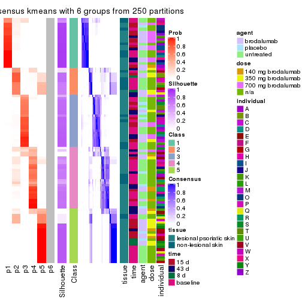</p>

</div>
</div>

Heatmaps for the membership of samples in all partitions to see how consistent they are:


<script>
$( function() {
	$( '#tabs-ATC-kmeans-membership-heatmap' ).tabs();
} );
</script>
<div id='tabs-ATC-kmeans-membership-heatmap'>
<ul>
<li><a href='#tab-ATC-kmeans-membership-heatmap-1'>k = 2</a></li>
<li><a href='#tab-ATC-kmeans-membership-heatmap-2'>k = 3</a></li>
<li><a href='#tab-ATC-kmeans-membership-heatmap-3'>k = 4</a></li>
<li><a href='#tab-ATC-kmeans-membership-heatmap-4'>k = 5</a></li>
<li><a href='#tab-ATC-kmeans-membership-heatmap-5'>k = 6</a></li>
</ul>
<div id='tab-ATC-kmeans-membership-heatmap-1'>
<pre><code class="r">membership_heatmap(res, k = 2)
</code></pre>

<p></p>

</div>
<div id='tab-ATC-kmeans-membership-heatmap-2'>
<pre><code class="r">membership_heatmap(res, k = 3)
</code></pre>

<p></p>

</div>
<div id='tab-ATC-kmeans-membership-heatmap-3'>
<pre><code class="r">membership_heatmap(res, k = 4)
</code></pre>

<p></p>

</div>
<div id='tab-ATC-kmeans-membership-heatmap-4'>
<pre><code class="r">membership_heatmap(res, k = 5)
</code></pre>

<p></p>

</div>
<div id='tab-ATC-kmeans-membership-heatmap-5'>
<pre><code class="r">membership_heatmap(res, k = 6)
</code></pre>

<p></p>

</div>
</div>

As soon as we have had the classes for columns, we can look for signatures
which are significantly different between classes which can be candidate marks
for certain classes. Following are the heatmaps for signatures.


Signature heatmaps where rows are scaled:


<script>
$( function() {
	$( '#tabs-ATC-kmeans-get-signatures' ).tabs();
} );
</script>
<div id='tabs-ATC-kmeans-get-signatures'>
<ul>
<li><a href='#tab-ATC-kmeans-get-signatures-1'>k = 2</a></li>
<li><a href='#tab-ATC-kmeans-get-signatures-2'>k = 3</a></li>
<li><a href='#tab-ATC-kmeans-get-signatures-3'>k = 4</a></li>
<li><a href='#tab-ATC-kmeans-get-signatures-4'>k = 5</a></li>
<li><a href='#tab-ATC-kmeans-get-signatures-5'>k = 6</a></li>
</ul>
<div id='tab-ATC-kmeans-get-signatures-1'>
<pre><code class="r">get_signatures(res, k = 2)
</code></pre>

<p></p>

</div>
<div id='tab-ATC-kmeans-get-signatures-2'>
<pre><code class="r">get_signatures(res, k = 3)
</code></pre>

<p></p>

</div>
<div id='tab-ATC-kmeans-get-signatures-3'>
<pre><code class="r">get_signatures(res, k = 4)
</code></pre>

<p></p>

</div>
<div id='tab-ATC-kmeans-get-signatures-4'>
<pre><code class="r">get_signatures(res, k = 5)
</code></pre>

<p></p>

</div>
<div id='tab-ATC-kmeans-get-signatures-5'>
<pre><code class="r">get_signatures(res, k = 6)
</code></pre>

<p></p>

</div>
</div>


Signature heatmaps where rows are not scaled:


<script>
$( function() {
	$( '#tabs-ATC-kmeans-get-signatures-no-scale' ).tabs();
} );
</script>
<div id='tabs-ATC-kmeans-get-signatures-no-scale'>
<ul>
<li><a href='#tab-ATC-kmeans-get-signatures-no-scale-1'>k = 2</a></li>
<li><a href='#tab-ATC-kmeans-get-signatures-no-scale-2'>k = 3</a></li>
<li><a href='#tab-ATC-kmeans-get-signatures-no-scale-3'>k = 4</a></li>
<li><a href='#tab-ATC-kmeans-get-signatures-no-scale-4'>k = 5</a></li>
<li><a href='#tab-ATC-kmeans-get-signatures-no-scale-5'>k = 6</a></li>
</ul>
<div id='tab-ATC-kmeans-get-signatures-no-scale-1'>
<pre><code class="r">get_signatures(res, k = 2, scale_rows = FALSE)
</code></pre>

<p></p>

</div>
<div id='tab-ATC-kmeans-get-signatures-no-scale-2'>
<pre><code class="r">get_signatures(res, k = 3, scale_rows = FALSE)
</code></pre>

<p></p>

</div>
<div id='tab-ATC-kmeans-get-signatures-no-scale-3'>
<pre><code class="r">get_signatures(res, k = 4, scale_rows = FALSE)
</code></pre>

<p></p>

</div>
<div id='tab-ATC-kmeans-get-signatures-no-scale-4'>
<pre><code class="r">get_signatures(res, k = 5, scale_rows = FALSE)
</code></pre>

<p></p>

</div>
<div id='tab-ATC-kmeans-get-signatures-no-scale-5'>
<pre><code class="r">get_signatures(res, k = 6, scale_rows = FALSE)
</code></pre>

<p></p>

</div>
</div>


Compare the overlap of signatures from different k:

```r
compare_signatures(res)
```


`get_signature()` returns a data frame invisibly. TO get the list of signatures, the function
call should be assigned to a variable explicitly. In following code, if `plot` argument is set
to `FALSE`, no heatmap is plotted while only the differential analysis is performed.

```r
# code only for demonstration
tb = get_signature(res, k = ..., plot = FALSE)
```

An example of the output of `tb` is:

```
#>   which_row         fdr    mean_1    mean_2 scaled_mean_1 scaled_mean_2 km
#> 1        38 0.042760348  8.373488  9.131774    -0.5533452     0.5164555  1
#> 2        40 0.018707592  7.106213  8.469186    -0.6173731     0.5762149  1
#> 3        55 0.019134737 10.221463 11.207825    -0.6159697     0.5749050  1
#> 4        59 0.006059896  5.921854  7.869574    -0.6899429     0.6439467  1
#> 5        60 0.018055526  8.928898 10.211722    -0.6204761     0.5791110  1
#> 6        98 0.009384629 15.714769 14.887706     0.6635654    -0.6193277  2
...
```

The columns in `tb` are:

1. `which_row`: row indices corresponding to the input matrix.
2. `fdr`: FDR for the differential test. 
3. `mean_x`: The mean value in group x.
4. `scaled_mean_x`: The mean value in group x after rows are scaled.
5. `km`: Row groups if k-means clustering is applied to rows.


UMAP plot which shows how samples are separated.


<script>
$( function() {
	$( '#tabs-ATC-kmeans-dimension-reduction' ).tabs();
} );
</script>
<div id='tabs-ATC-kmeans-dimension-reduction'>
<ul>
<li><a href='#tab-ATC-kmeans-dimension-reduction-1'>k = 2</a></li>
<li><a href='#tab-ATC-kmeans-dimension-reduction-2'>k = 3</a></li>
<li><a href='#tab-ATC-kmeans-dimension-reduction-3'>k = 4</a></li>
<li><a href='#tab-ATC-kmeans-dimension-reduction-4'>k = 5</a></li>
<li><a href='#tab-ATC-kmeans-dimension-reduction-5'>k = 6</a></li>
</ul>
<div id='tab-ATC-kmeans-dimension-reduction-1'>
<pre><code class="r">dimension_reduction(res, k = 2, method = &quot;UMAP&quot;)
</code></pre>

<p></p>

</div>
<div id='tab-ATC-kmeans-dimension-reduction-2'>
<pre><code class="r">dimension_reduction(res, k = 3, method = &quot;UMAP&quot;)
</code></pre>

<p></p>

</div>
<div id='tab-ATC-kmeans-dimension-reduction-3'>
<pre><code class="r">dimension_reduction(res, k = 4, method = &quot;UMAP&quot;)
</code></pre>

<p></p>

</div>
<div id='tab-ATC-kmeans-dimension-reduction-4'>
<pre><code class="r">dimension_reduction(res, k = 5, method = &quot;UMAP&quot;)
</code></pre>

<p></p>

</div>
<div id='tab-ATC-kmeans-dimension-reduction-5'>
<pre><code class="r">dimension_reduction(res, k = 6, method = &quot;UMAP&quot;)
</code></pre>

<p></p>

</div>
</div>


Following heatmap shows how subgroups are split when increasing `k`:

```r
collect_classes(res)
```


Test correlation between subgroups and known annotations. If the known
annotation is numeric, one-way ANOVA test is applied, and if the known
annotation is discrete, chi-squared contingency table test is applied.

```r
test_to_known_factors(res)
```

```
#>             n tissue(p) time(p) agent(p)  dose(p) individual(p) k
#> ATC:kmeans 99   0.97141 0.10095    0.645 2.49e-05      3.97e-04 2
#> ATC:kmeans 99   0.52302 0.00303    0.413 1.18e-05      1.51e-06 3
#> ATC:kmeans 96   0.58633 0.07008    0.451 1.65e-05      5.83e-08 4
#> ATC:kmeans 90   0.01248 0.05341    0.521 1.64e-04      3.33e-07 5
#> ATC:kmeans 84   0.00685 0.11714    0.435 5.00e-05      4.62e-07 6
```


If matrix rows can be associated to genes, consider to use `functional_enrichment(res,
...)` to perform function enrichment for the signature genes. See [this vignette](http://bioconductor.org/packages/devel/bioc/vignettes/cola/inst/doc/functional_enrichment.html) for more detailed explanations.


 

---------------------------------------------------


### ATC:skmeans**


The object with results only for a single top-value method and a single partition method 
can be extracted as:

```r
res = res_list["ATC", "skmeans"]
# you can also extract it by
# res = res_list["ATC:skmeans"]
```

A summary of `res` and all the functions that can be applied to it:

```r
res
```

```
#> A 'ConsensusPartition' object with k = 2, 3, 4, 5, 6.
#>   On a matrix with 45638 rows and 99 columns.
#>   Top rows (1000, 2000, 3000, 4000, 5000) are extracted by 'ATC' method.
#>   Subgroups are detected by 'skmeans' method.
#>   Performed in total 1250 partitions by row resampling.
#>   Best k for subgroups seems to be 3.
#> 
#> Following methods can be applied to this 'ConsensusPartition' object:
#>  [1] "cola_report"             "collect_classes"         "collect_plots"          
#>  [4] "collect_stats"           "colnames"                "compare_signatures"     
#>  [7] "consensus_heatmap"       "dimension_reduction"     "functional_enrichment"  
#> [10] "get_anno_col"            "get_anno"                "get_classes"            
#> [13] "get_consensus"           "get_matrix"              "get_membership"         
#> [16] "get_param"               "get_signatures"          "get_stats"              
#> [19] "is_best_k"               "is_stable_k"             "membership_heatmap"     
#> [22] "ncol"                    "nrow"                    "plot_ecdf"              
#> [25] "rownames"                "select_partition_number" "show"                   
#> [28] "suggest_best_k"          "test_to_known_factors"
```

`collect_plots()` function collects all the plots made from `res` for all `k` (number of partitions)
into one single page to provide an easy and fast comparison between different `k`.

```r
collect_plots(res)
```


The plots are:

- The first row: a plot of the ECDF (empirical cumulative distribution
  function) curves of the consensus matrix for each `k` and the heatmap of
  predicted classes for each `k`.
- The second row: heatmaps of the consensus matrix for each `k`.
- The third row: heatmaps of the membership matrix for each `k`.
- The fouth row: heatmaps of the signatures for each `k`.

All the plots in panels can be made by individual functions and they are
plotted later in this section.

`select_partition_number()` produces several plots showing different
statistics for choosing "optimized" `k`. There are following statistics:

- ECDF curves of the consensus matrix for each `k`;
- 1-PAC. [The PAC
  score](https://en.wikipedia.org/wiki/Consensus_clustering#Over-interpretation_potential_of_consensus_clustering)
  measures the proportion of the ambiguous subgrouping.
- Mean silhouette score.
- Concordance. The mean probability of fiting the consensus class ids in all
  partitions.
- Area increased. Denote $A_k$ as the area under the ECDF curve for current
  `k`, the area increased is defined as $A_k - A_{k-1}$.
- Rand index. The percent of pairs of samples that are both in a same cluster
  or both are not in a same cluster in the partition of k and k-1.
- Jaccard index. The ratio of pairs of samples are both in a same cluster in
  the partition of k and k-1 and the pairs of samples are both in a same
  cluster in the partition k or k-1.

The detailed explanations of these statistics can be found in [the _cola_
vignette](http://bioconductor.org/packages/devel/bioc/vignettes/cola/inst/doc/cola.html#toc_13).

Generally speaking, lower PAC score, higher mean silhouette score or higher
concordance corresponds to better partition. Rand index and Jaccard index
measure how similar the current partition is compared to partition with `k-1`.
If they are too similar, we won't accept `k` is better than `k-1`.

```r
select_partition_number(res)
```

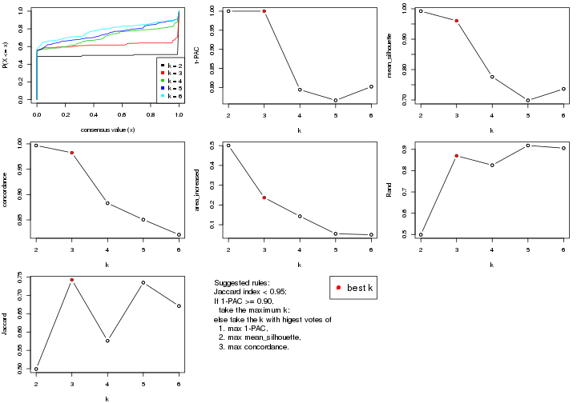

The numeric values for all these statistics can be obtained by `get_stats()`.

```r
get_stats(res)
```

```
#>   k 1-PAC mean_silhouette concordance area_increased  Rand Jaccard
#> 2 2 1.000           0.992       0.997         0.5008 0.499   0.499
#> 3 3 1.000           0.961       0.983         0.2369 0.870   0.742
#> 4 4 0.794           0.776       0.883         0.1429 0.825   0.576
#> 5 5 0.766           0.699       0.851         0.0541 0.918   0.735
#> 6 6 0.802           0.736       0.821         0.0496 0.905   0.671
```

`suggest_best_k()` suggests the best $k$ based on these statistics. The rules are as follows:

- All $k$ with Jaccard index larger than 0.95 are removed because increasing
  $k$ does not provide enough extra information. If all $k$ are removed, it is
  marked as no subgroup is detected.
- For all $k$ with 1-PAC score larger than 0.9, the maximal $k$ is taken as
  the best $k$, and other $k$ are marked as optional $k$.
- If it does not fit the second rule. The $k$ with the maximal vote of the
  highest 1-PAC score, highest mean silhouette, and highest concordance is
  taken as the best $k$.

```r
suggest_best_k(res)
```

```
#> [1] 3
#> attr(,"optional")
#> [1] 2
```

There is also optional best $k$ = 2 that is worth to check.

Following shows the table of the partitions (You need to click the **show/hide
code output** link to see it). The membership matrix (columns with name `p*`)
is inferred by
[`clue::cl_consensus()`](https://www.rdocumentation.org/link/cl_consensus?package=clue)
function with the `SE` method. Basically the value in the membership matrix
represents the probability to belong to a certain group. The finall class
label for an item is determined with the group with highest probability it
belongs to.

In `get_classes()` function, the entropy is calculated from the membership
matrix and the silhouette score is calculated from the consensus matrix.


<script>
$( function() {
	$( '#tabs-ATC-skmeans-get-classes' ).tabs();
} );
</script>
<div id='tabs-ATC-skmeans-get-classes'>
<ul>
<li><a href='#tab-ATC-skmeans-get-classes-1'>k = 2</a></li>
<li><a href='#tab-ATC-skmeans-get-classes-2'>k = 3</a></li>
<li><a href='#tab-ATC-skmeans-get-classes-3'>k = 4</a></li>
<li><a href='#tab-ATC-skmeans-get-classes-4'>k = 5</a></li>
<li><a href='#tab-ATC-skmeans-get-classes-5'>k = 6</a></li>
</ul>

<div id='tab-ATC-skmeans-get-classes-1'>
<p><a id='tab-ATC-skmeans-get-classes-1-a' style='color:#0366d6' href='#'>show/hide code output</a></p>
<pre><code class="r">cbind(get_classes(res, k = 2), get_membership(res, k = 2))
</code></pre>

<pre><code>#&gt;            class entropy silhouette    p1    p2
#&gt; GSM1296094     1     0.0      0.993 1.000 0.000
#&gt; GSM1296119     2     0.0      1.000 0.000 1.000
#&gt; GSM1296076     2     0.0      1.000 0.000 1.000
#&gt; GSM1296092     2     0.0      1.000 0.000 1.000
#&gt; GSM1296103     1     0.0      0.993 1.000 0.000
#&gt; GSM1296078     2     0.0      1.000 0.000 1.000
#&gt; GSM1296107     2     0.0      1.000 0.000 1.000
#&gt; GSM1296109     2     0.0      1.000 0.000 1.000
#&gt; GSM1296080     1     0.0      0.993 1.000 0.000
#&gt; GSM1296090     2     0.0      1.000 0.000 1.000
#&gt; GSM1296074     2     0.0      1.000 0.000 1.000
#&gt; GSM1296111     2     0.0      1.000 0.000 1.000
#&gt; GSM1296099     2     0.0      1.000 0.000 1.000
#&gt; GSM1296086     2     0.0      1.000 0.000 1.000
#&gt; GSM1296117     2     0.0      1.000 0.000 1.000
#&gt; GSM1296113     2     0.0      1.000 0.000 1.000
#&gt; GSM1296096     2     0.0      1.000 0.000 1.000
#&gt; GSM1296105     1     0.0      0.993 1.000 0.000
#&gt; GSM1296098     1     0.0      0.993 1.000 0.000
#&gt; GSM1296101     1     0.0      0.993 1.000 0.000
#&gt; GSM1296121     2     0.0      1.000 0.000 1.000
#&gt; GSM1296088     1     0.0      0.993 1.000 0.000
#&gt; GSM1296082     2     0.0      1.000 0.000 1.000
#&gt; GSM1296115     2     0.0      1.000 0.000 1.000
#&gt; GSM1296084     1     0.0      0.993 1.000 0.000
#&gt; GSM1296072     2     0.0      1.000 0.000 1.000
#&gt; GSM1296069     2     0.0      1.000 0.000 1.000
#&gt; GSM1296071     2     0.0      1.000 0.000 1.000
#&gt; GSM1296070     2     0.0      1.000 0.000 1.000
#&gt; GSM1296073     2     0.0      1.000 0.000 1.000
#&gt; GSM1296034     1     0.0      0.993 1.000 0.000
#&gt; GSM1296041     2     0.0      1.000 0.000 1.000
#&gt; GSM1296035     2     0.0      1.000 0.000 1.000
#&gt; GSM1296038     2     0.0      1.000 0.000 1.000
#&gt; GSM1296047     2     0.0      1.000 0.000 1.000
#&gt; GSM1296039     2     0.0      1.000 0.000 1.000
#&gt; GSM1296042     2     0.0      1.000 0.000 1.000
#&gt; GSM1296043     2     0.0      1.000 0.000 1.000
#&gt; GSM1296037     1     0.0      0.993 1.000 0.000
#&gt; GSM1296046     2     0.0      1.000 0.000 1.000
#&gt; GSM1296044     2     0.0      1.000 0.000 1.000
#&gt; GSM1296045     2     0.0      1.000 0.000 1.000
#&gt; GSM1296025     1     0.0      0.993 1.000 0.000
#&gt; GSM1296033     1     0.0      0.993 1.000 0.000
#&gt; GSM1296027     1     0.0      0.993 1.000 0.000
#&gt; GSM1296032     1     0.0      0.993 1.000 0.000
#&gt; GSM1296024     1     0.0      0.993 1.000 0.000
#&gt; GSM1296031     1     0.0      0.993 1.000 0.000
#&gt; GSM1296028     1     0.0      0.993 1.000 0.000
#&gt; GSM1296029     1     0.0      0.993 1.000 0.000
#&gt; GSM1296026     1     0.0      0.993 1.000 0.000
#&gt; GSM1296030     1     0.0      0.993 1.000 0.000
#&gt; GSM1296040     1     0.0      0.993 1.000 0.000
#&gt; GSM1296036     1     0.0      0.993 1.000 0.000
#&gt; GSM1296048     2     0.0      1.000 0.000 1.000
#&gt; GSM1296059     1     0.0      0.993 1.000 0.000
#&gt; GSM1296066     2     0.0      1.000 0.000 1.000
#&gt; GSM1296060     2     0.0      1.000 0.000 1.000
#&gt; GSM1296063     2     0.0      1.000 0.000 1.000
#&gt; GSM1296064     2     0.0      1.000 0.000 1.000
#&gt; GSM1296067     2     0.0      1.000 0.000 1.000
#&gt; GSM1296062     1     0.0      0.993 1.000 0.000
#&gt; GSM1296068     2     0.0      1.000 0.000 1.000
#&gt; GSM1296050     1     0.0      0.993 1.000 0.000
#&gt; GSM1296057     1     0.0      0.993 1.000 0.000
#&gt; GSM1296052     1     0.0      0.993 1.000 0.000
#&gt; GSM1296054     1     0.0      0.993 1.000 0.000
#&gt; GSM1296049     1     0.0      0.993 1.000 0.000
#&gt; GSM1296055     1     0.9      0.538 0.684 0.316
#&gt; GSM1296053     1     0.0      0.993 1.000 0.000
#&gt; GSM1296058     1     0.0      0.993 1.000 0.000
#&gt; GSM1296051     2     0.0      1.000 0.000 1.000
#&gt; GSM1296056     2     0.0      1.000 0.000 1.000
#&gt; GSM1296065     2     0.0      1.000 0.000 1.000
#&gt; GSM1296061     1     0.0      0.993 1.000 0.000
#&gt; GSM1296095     2     0.0      1.000 0.000 1.000
#&gt; GSM1296120     2     0.0      1.000 0.000 1.000
#&gt; GSM1296077     1     0.0      0.993 1.000 0.000
#&gt; GSM1296093     1     0.0      0.993 1.000 0.000
#&gt; GSM1296104     2     0.0      1.000 0.000 1.000
#&gt; GSM1296079     1     0.0      0.993 1.000 0.000
#&gt; GSM1296108     2     0.0      1.000 0.000 1.000
#&gt; GSM1296110     2     0.0      1.000 0.000 1.000
#&gt; GSM1296081     1     0.0      0.993 1.000 0.000
#&gt; GSM1296091     1     0.0      0.993 1.000 0.000
#&gt; GSM1296075     2     0.0      1.000 0.000 1.000
#&gt; GSM1296112     2     0.0      1.000 0.000 1.000
#&gt; GSM1296100     1     0.0      0.993 1.000 0.000
#&gt; GSM1296087     1     0.0      0.993 1.000 0.000
#&gt; GSM1296118     2     0.0      1.000 0.000 1.000
#&gt; GSM1296114     2     0.0      1.000 0.000 1.000
#&gt; GSM1296097     2     0.0      1.000 0.000 1.000
#&gt; GSM1296106     1     0.0      0.993 1.000 0.000
#&gt; GSM1296102     1     0.0      0.993 1.000 0.000
#&gt; GSM1296122     2     0.0      1.000 0.000 1.000
#&gt; GSM1296089     1     0.0      0.993 1.000 0.000
#&gt; GSM1296083     1     0.0      0.993 1.000 0.000
#&gt; GSM1296116     2     0.0      1.000 0.000 1.000
#&gt; GSM1296085     1     0.0      0.993 1.000 0.000
</code></pre>

<script>
$('#tab-ATC-skmeans-get-classes-1-a').parent().next().next().hide();
$('#tab-ATC-skmeans-get-classes-1-a').click(function(){
  $('#tab-ATC-skmeans-get-classes-1-a').parent().next().next().toggle();
  return(false);
});
</script>
</div>

<div id='tab-ATC-skmeans-get-classes-2'>
<p><a id='tab-ATC-skmeans-get-classes-2-a' style='color:#0366d6' href='#'>show/hide code output</a></p>
<pre><code class="r">cbind(get_classes(res, k = 3), get_membership(res, k = 3))
</code></pre>

<pre><code>#&gt;            class entropy silhouette    p1    p2    p3
#&gt; GSM1296094     1  0.0000      0.991 1.000 0.000 0.000
#&gt; GSM1296119     2  0.0000      0.983 0.000 1.000 0.000
#&gt; GSM1296076     2  0.1031      0.968 0.000 0.976 0.024
#&gt; GSM1296092     3  0.0000      0.953 0.000 0.000 1.000
#&gt; GSM1296103     3  0.0000      0.953 0.000 0.000 1.000
#&gt; GSM1296078     2  0.1031      0.968 0.000 0.976 0.024
#&gt; GSM1296107     2  0.0000      0.983 0.000 1.000 0.000
#&gt; GSM1296109     2  0.5988      0.411 0.000 0.632 0.368
#&gt; GSM1296080     1  0.0000      0.991 1.000 0.000 0.000
#&gt; GSM1296090     3  0.0000      0.953 0.000 0.000 1.000
#&gt; GSM1296074     2  0.1753      0.949 0.000 0.952 0.048
#&gt; GSM1296111     2  0.0000      0.983 0.000 1.000 0.000
#&gt; GSM1296099     3  0.0000      0.953 0.000 0.000 1.000
#&gt; GSM1296086     3  0.0000      0.953 0.000 0.000 1.000
#&gt; GSM1296117     2  0.0000      0.983 0.000 1.000 0.000
#&gt; GSM1296113     2  0.0000      0.983 0.000 1.000 0.000
#&gt; GSM1296096     3  0.0000      0.953 0.000 0.000 1.000
#&gt; GSM1296105     1  0.0000      0.991 1.000 0.000 0.000
#&gt; GSM1296098     1  0.0000      0.991 1.000 0.000 0.000
#&gt; GSM1296101     1  0.5968      0.407 0.636 0.000 0.364
#&gt; GSM1296121     2  0.0000      0.983 0.000 1.000 0.000
#&gt; GSM1296088     1  0.0000      0.991 1.000 0.000 0.000
#&gt; GSM1296082     3  0.0000      0.953 0.000 0.000 1.000
#&gt; GSM1296115     2  0.0000      0.983 0.000 1.000 0.000
#&gt; GSM1296084     1  0.0000      0.991 1.000 0.000 0.000
#&gt; GSM1296072     2  0.0000      0.983 0.000 1.000 0.000
#&gt; GSM1296069     2  0.0000      0.983 0.000 1.000 0.000
#&gt; GSM1296071     2  0.0000      0.983 0.000 1.000 0.000
#&gt; GSM1296070     2  0.0000      0.983 0.000 1.000 0.000
#&gt; GSM1296073     2  0.0000      0.983 0.000 1.000 0.000
#&gt; GSM1296034     1  0.0000      0.991 1.000 0.000 0.000
#&gt; GSM1296041     2  0.0000      0.983 0.000 1.000 0.000
#&gt; GSM1296035     3  0.0000      0.953 0.000 0.000 1.000
#&gt; GSM1296038     3  0.5465      0.581 0.000 0.288 0.712
#&gt; GSM1296047     2  0.0000      0.983 0.000 1.000 0.000
#&gt; GSM1296039     2  0.1753      0.949 0.000 0.952 0.048
#&gt; GSM1296042     2  0.0000      0.983 0.000 1.000 0.000
#&gt; GSM1296043     2  0.0000      0.983 0.000 1.000 0.000
#&gt; GSM1296037     1  0.0000      0.991 1.000 0.000 0.000
#&gt; GSM1296046     2  0.0000      0.983 0.000 1.000 0.000
#&gt; GSM1296044     2  0.0000      0.983 0.000 1.000 0.000
#&gt; GSM1296045     2  0.0000      0.983 0.000 1.000 0.000
#&gt; GSM1296025     1  0.0000      0.991 1.000 0.000 0.000
#&gt; GSM1296033     1  0.0000      0.991 1.000 0.000 0.000
#&gt; GSM1296027     1  0.0000      0.991 1.000 0.000 0.000
#&gt; GSM1296032     1  0.0000      0.991 1.000 0.000 0.000
#&gt; GSM1296024     1  0.0000      0.991 1.000 0.000 0.000
#&gt; GSM1296031     1  0.0000      0.991 1.000 0.000 0.000
#&gt; GSM1296028     1  0.0000      0.991 1.000 0.000 0.000
#&gt; GSM1296029     1  0.0000      0.991 1.000 0.000 0.000
#&gt; GSM1296026     1  0.0000      0.991 1.000 0.000 0.000
#&gt; GSM1296030     1  0.0000      0.991 1.000 0.000 0.000
#&gt; GSM1296040     1  0.0000      0.991 1.000 0.000 0.000
#&gt; GSM1296036     1  0.0000      0.991 1.000 0.000 0.000
#&gt; GSM1296048     2  0.0000      0.983 0.000 1.000 0.000
#&gt; GSM1296059     3  0.0000      0.953 0.000 0.000 1.000
#&gt; GSM1296066     2  0.0000      0.983 0.000 1.000 0.000
#&gt; GSM1296060     3  0.0000      0.953 0.000 0.000 1.000
#&gt; GSM1296063     2  0.0000      0.983 0.000 1.000 0.000
#&gt; GSM1296064     2  0.1753      0.949 0.000 0.952 0.048
#&gt; GSM1296067     2  0.0000      0.983 0.000 1.000 0.000
#&gt; GSM1296062     1  0.0000      0.991 1.000 0.000 0.000
#&gt; GSM1296068     2  0.0000      0.983 0.000 1.000 0.000
#&gt; GSM1296050     1  0.0000      0.991 1.000 0.000 0.000
#&gt; GSM1296057     1  0.0000      0.991 1.000 0.000 0.000
#&gt; GSM1296052     1  0.0000      0.991 1.000 0.000 0.000
#&gt; GSM1296054     1  0.0000      0.991 1.000 0.000 0.000
#&gt; GSM1296049     1  0.0000      0.991 1.000 0.000 0.000
#&gt; GSM1296055     3  0.8278      0.584 0.248 0.132 0.620
#&gt; GSM1296053     1  0.0000      0.991 1.000 0.000 0.000
#&gt; GSM1296058     1  0.0000      0.991 1.000 0.000 0.000
#&gt; GSM1296051     2  0.1031      0.968 0.000 0.976 0.024
#&gt; GSM1296056     3  0.0000      0.953 0.000 0.000 1.000
#&gt; GSM1296065     2  0.0892      0.971 0.000 0.980 0.020
#&gt; GSM1296061     1  0.0000      0.991 1.000 0.000 0.000
#&gt; GSM1296095     2  0.1753      0.949 0.000 0.952 0.048
#&gt; GSM1296120     2  0.0000      0.983 0.000 1.000 0.000
#&gt; GSM1296077     1  0.0000      0.991 1.000 0.000 0.000
#&gt; GSM1296093     1  0.0000      0.991 1.000 0.000 0.000
#&gt; GSM1296104     2  0.1753      0.949 0.000 0.952 0.048
#&gt; GSM1296079     1  0.0000      0.991 1.000 0.000 0.000
#&gt; GSM1296108     2  0.0000      0.983 0.000 1.000 0.000
#&gt; GSM1296110     2  0.0000      0.983 0.000 1.000 0.000
#&gt; GSM1296081     1  0.0000      0.991 1.000 0.000 0.000
#&gt; GSM1296091     1  0.0000      0.991 1.000 0.000 0.000
#&gt; GSM1296075     2  0.0000      0.983 0.000 1.000 0.000
#&gt; GSM1296112     2  0.0000      0.983 0.000 1.000 0.000
#&gt; GSM1296100     1  0.0000      0.991 1.000 0.000 0.000
#&gt; GSM1296087     1  0.0000      0.991 1.000 0.000 0.000
#&gt; GSM1296118     2  0.0000      0.983 0.000 1.000 0.000
#&gt; GSM1296114     2  0.0000      0.983 0.000 1.000 0.000
#&gt; GSM1296097     3  0.0000      0.953 0.000 0.000 1.000
#&gt; GSM1296106     1  0.0000      0.991 1.000 0.000 0.000
#&gt; GSM1296102     1  0.0000      0.991 1.000 0.000 0.000
#&gt; GSM1296122     2  0.0000      0.983 0.000 1.000 0.000
#&gt; GSM1296089     1  0.0000      0.991 1.000 0.000 0.000
#&gt; GSM1296083     1  0.0000      0.991 1.000 0.000 0.000
#&gt; GSM1296116     2  0.0000      0.983 0.000 1.000 0.000
#&gt; GSM1296085     1  0.0000      0.991 1.000 0.000 0.000
</code></pre>

<script>
$('#tab-ATC-skmeans-get-classes-2-a').parent().next().next().hide();
$('#tab-ATC-skmeans-get-classes-2-a').click(function(){
  $('#tab-ATC-skmeans-get-classes-2-a').parent().next().next().toggle();
  return(false);
});
</script>
</div>

<div id='tab-ATC-skmeans-get-classes-3'>
<p><a id='tab-ATC-skmeans-get-classes-3-a' style='color:#0366d6' href='#'>show/hide code output</a></p>
<pre><code class="r">cbind(get_classes(res, k = 4), get_membership(res, k = 4))
</code></pre>

<pre><code>#&gt;            class entropy silhouette    p1    p2    p3    p4
#&gt; GSM1296094     3  0.3266      0.793 0.168 0.000 0.832 0.000
#&gt; GSM1296119     2  0.1118      0.948 0.000 0.964 0.000 0.036
#&gt; GSM1296076     4  0.4500      0.607 0.000 0.316 0.000 0.684
#&gt; GSM1296092     4  0.1118      0.613 0.000 0.000 0.036 0.964
#&gt; GSM1296103     3  0.0707      0.656 0.000 0.000 0.980 0.020
#&gt; GSM1296078     4  0.4500      0.607 0.000 0.316 0.000 0.684
#&gt; GSM1296107     2  0.1118      0.948 0.000 0.964 0.000 0.036
#&gt; GSM1296109     4  0.5165      0.384 0.000 0.484 0.004 0.512
#&gt; GSM1296080     1  0.0000      0.937 1.000 0.000 0.000 0.000
#&gt; GSM1296090     4  0.0000      0.624 0.000 0.000 0.000 1.000
#&gt; GSM1296074     4  0.4500      0.607 0.000 0.316 0.000 0.684
#&gt; GSM1296111     2  0.1118      0.948 0.000 0.964 0.000 0.036
#&gt; GSM1296099     4  0.3356      0.595 0.000 0.000 0.176 0.824
#&gt; GSM1296086     4  0.1118      0.613 0.000 0.000 0.036 0.964
#&gt; GSM1296117     2  0.1118      0.948 0.000 0.964 0.000 0.036
#&gt; GSM1296113     2  0.1118      0.948 0.000 0.964 0.000 0.036
#&gt; GSM1296096     4  0.3356      0.595 0.000 0.000 0.176 0.824
#&gt; GSM1296105     3  0.4454      0.733 0.308 0.000 0.692 0.000
#&gt; GSM1296098     3  0.3907      0.786 0.232 0.000 0.768 0.000
#&gt; GSM1296101     3  0.1022      0.698 0.032 0.000 0.968 0.000
#&gt; GSM1296121     2  0.1118      0.948 0.000 0.964 0.000 0.036
#&gt; GSM1296088     1  0.1867      0.846 0.928 0.000 0.072 0.000
#&gt; GSM1296082     4  0.0000      0.624 0.000 0.000 0.000 1.000
#&gt; GSM1296115     2  0.1118      0.948 0.000 0.964 0.000 0.036
#&gt; GSM1296084     1  0.0000      0.937 1.000 0.000 0.000 0.000
#&gt; GSM1296072     2  0.0000      0.957 0.000 1.000 0.000 0.000
#&gt; GSM1296069     2  0.0592      0.955 0.000 0.984 0.000 0.016
#&gt; GSM1296071     2  0.0000      0.957 0.000 1.000 0.000 0.000
#&gt; GSM1296070     2  0.0592      0.955 0.000 0.984 0.000 0.016
#&gt; GSM1296073     2  0.1118      0.948 0.000 0.964 0.000 0.036
#&gt; GSM1296034     1  0.0000      0.937 1.000 0.000 0.000 0.000
#&gt; GSM1296041     2  0.1118      0.948 0.000 0.964 0.000 0.036
#&gt; GSM1296035     4  0.4193      0.528 0.000 0.000 0.268 0.732
#&gt; GSM1296038     4  0.5631      0.663 0.000 0.232 0.072 0.696
#&gt; GSM1296047     2  0.0000      0.957 0.000 1.000 0.000 0.000
#&gt; GSM1296039     4  0.4961      0.465 0.000 0.448 0.000 0.552
#&gt; GSM1296042     2  0.0592      0.955 0.000 0.984 0.000 0.016
#&gt; GSM1296043     2  0.0000      0.957 0.000 1.000 0.000 0.000
#&gt; GSM1296037     1  0.4916     -0.142 0.576 0.000 0.424 0.000
#&gt; GSM1296046     2  0.0000      0.957 0.000 1.000 0.000 0.000
#&gt; GSM1296044     2  0.0000      0.957 0.000 1.000 0.000 0.000
#&gt; GSM1296045     2  0.0000      0.957 0.000 1.000 0.000 0.000
#&gt; GSM1296025     1  0.0000      0.937 1.000 0.000 0.000 0.000
#&gt; GSM1296033     1  0.0000      0.937 1.000 0.000 0.000 0.000
#&gt; GSM1296027     1  0.0000      0.937 1.000 0.000 0.000 0.000
#&gt; GSM1296032     1  0.0000      0.937 1.000 0.000 0.000 0.000
#&gt; GSM1296024     1  0.0000      0.937 1.000 0.000 0.000 0.000
#&gt; GSM1296031     1  0.0000      0.937 1.000 0.000 0.000 0.000
#&gt; GSM1296028     1  0.0000      0.937 1.000 0.000 0.000 0.000
#&gt; GSM1296029     1  0.0000      0.937 1.000 0.000 0.000 0.000
#&gt; GSM1296026     1  0.0000      0.937 1.000 0.000 0.000 0.000
#&gt; GSM1296030     1  0.0000      0.937 1.000 0.000 0.000 0.000
#&gt; GSM1296040     3  0.3266      0.793 0.168 0.000 0.832 0.000
#&gt; GSM1296036     3  0.4250      0.764 0.276 0.000 0.724 0.000
#&gt; GSM1296048     2  0.1118      0.948 0.000 0.964 0.000 0.036
#&gt; GSM1296059     3  0.0707      0.656 0.000 0.000 0.980 0.020
#&gt; GSM1296066     2  0.1118      0.948 0.000 0.964 0.000 0.036
#&gt; GSM1296060     4  0.4193      0.528 0.000 0.000 0.268 0.732
#&gt; GSM1296063     2  0.4941     -0.171 0.000 0.564 0.000 0.436
#&gt; GSM1296064     4  0.4961      0.465 0.000 0.448 0.000 0.552
#&gt; GSM1296067     2  0.0336      0.951 0.000 0.992 0.008 0.000
#&gt; GSM1296062     3  0.4250      0.764 0.276 0.000 0.724 0.000
#&gt; GSM1296068     2  0.0000      0.957 0.000 1.000 0.000 0.000
#&gt; GSM1296050     1  0.0000      0.937 1.000 0.000 0.000 0.000
#&gt; GSM1296057     3  0.4989      0.398 0.472 0.000 0.528 0.000
#&gt; GSM1296052     1  0.0000      0.937 1.000 0.000 0.000 0.000
#&gt; GSM1296054     1  0.0000      0.937 1.000 0.000 0.000 0.000
#&gt; GSM1296049     1  0.0000      0.937 1.000 0.000 0.000 0.000
#&gt; GSM1296055     3  0.6161      0.520 0.088 0.016 0.696 0.200
#&gt; GSM1296053     1  0.0000      0.937 1.000 0.000 0.000 0.000
#&gt; GSM1296058     3  0.4989      0.398 0.472 0.000 0.528 0.000
#&gt; GSM1296051     4  0.4331      0.627 0.000 0.288 0.000 0.712
#&gt; GSM1296056     4  0.3356      0.595 0.000 0.000 0.176 0.824
#&gt; GSM1296065     4  0.5000      0.355 0.000 0.496 0.000 0.504
#&gt; GSM1296061     3  0.4250      0.764 0.276 0.000 0.724 0.000
#&gt; GSM1296095     4  0.4989      0.418 0.000 0.472 0.000 0.528
#&gt; GSM1296120     2  0.0000      0.957 0.000 1.000 0.000 0.000
#&gt; GSM1296077     1  0.0000      0.937 1.000 0.000 0.000 0.000
#&gt; GSM1296093     1  0.0000      0.937 1.000 0.000 0.000 0.000
#&gt; GSM1296104     4  0.4994      0.399 0.000 0.480 0.000 0.520
#&gt; GSM1296079     1  0.0000      0.937 1.000 0.000 0.000 0.000
#&gt; GSM1296108     2  0.0000      0.957 0.000 1.000 0.000 0.000
#&gt; GSM1296110     2  0.0000      0.957 0.000 1.000 0.000 0.000
#&gt; GSM1296081     1  0.0000      0.937 1.000 0.000 0.000 0.000
#&gt; GSM1296091     1  0.0000      0.937 1.000 0.000 0.000 0.000
#&gt; GSM1296075     2  0.2921      0.776 0.000 0.860 0.000 0.140
#&gt; GSM1296112     2  0.0000      0.957 0.000 1.000 0.000 0.000
#&gt; GSM1296100     1  0.4916     -0.142 0.576 0.000 0.424 0.000
#&gt; GSM1296087     1  0.0000      0.937 1.000 0.000 0.000 0.000
#&gt; GSM1296118     2  0.0000      0.957 0.000 1.000 0.000 0.000
#&gt; GSM1296114     2  0.0000      0.957 0.000 1.000 0.000 0.000
#&gt; GSM1296097     4  0.4250      0.527 0.000 0.000 0.276 0.724
#&gt; GSM1296106     3  0.3688      0.790 0.208 0.000 0.792 0.000
#&gt; GSM1296102     1  0.4916     -0.142 0.576 0.000 0.424 0.000
#&gt; GSM1296122     2  0.0336      0.951 0.000 0.992 0.008 0.000
#&gt; GSM1296089     1  0.0000      0.937 1.000 0.000 0.000 0.000
#&gt; GSM1296083     1  0.0000      0.937 1.000 0.000 0.000 0.000
#&gt; GSM1296116     2  0.0000      0.957 0.000 1.000 0.000 0.000
#&gt; GSM1296085     1  0.0000      0.937 1.000 0.000 0.000 0.000
</code></pre>

<script>
$('#tab-ATC-skmeans-get-classes-3-a').parent().next().next().hide();
$('#tab-ATC-skmeans-get-classes-3-a').click(function(){
  $('#tab-ATC-skmeans-get-classes-3-a').parent().next().next().toggle();
  return(false);
});
</script>
</div>

<div id='tab-ATC-skmeans-get-classes-4'>
<p><a id='tab-ATC-skmeans-get-classes-4-a' style='color:#0366d6' href='#'>show/hide code output</a></p>
<pre><code class="r">cbind(get_classes(res, k = 5), get_membership(res, k = 5))
</code></pre>

<pre><code>#&gt;            class entropy silhouette    p1    p2    p3    p4    p5
#&gt; GSM1296094     3  0.1484    0.77060 0.048 0.000 0.944 0.000 0.008
#&gt; GSM1296119     2  0.0000    0.75625 0.000 1.000 0.000 0.000 0.000
#&gt; GSM1296076     4  0.5998    0.67478 0.000 0.340 0.004 0.544 0.112
#&gt; GSM1296092     4  0.4440    0.33971 0.000 0.000 0.004 0.528 0.468
#&gt; GSM1296103     3  0.3913    0.39467 0.000 0.000 0.676 0.000 0.324
#&gt; GSM1296078     4  0.5998    0.67478 0.000 0.340 0.004 0.544 0.112
#&gt; GSM1296107     2  0.0000    0.75625 0.000 1.000 0.000 0.000 0.000
#&gt; GSM1296109     2  0.3508    0.45162 0.000 0.748 0.000 0.000 0.252
#&gt; GSM1296080     1  0.0000    0.93085 1.000 0.000 0.000 0.000 0.000
#&gt; GSM1296090     4  0.6262    0.61958 0.000 0.168 0.004 0.548 0.280
#&gt; GSM1296074     4  0.5998    0.67478 0.000 0.340 0.004 0.544 0.112
#&gt; GSM1296111     2  0.0000    0.75625 0.000 1.000 0.000 0.000 0.000
#&gt; GSM1296099     5  0.0162    0.72547 0.000 0.000 0.004 0.000 0.996
#&gt; GSM1296086     4  0.4443    0.33301 0.000 0.000 0.004 0.524 0.472
#&gt; GSM1296117     2  0.0000    0.75625 0.000 1.000 0.000 0.000 0.000
#&gt; GSM1296113     2  0.0609    0.76315 0.000 0.980 0.000 0.020 0.000
#&gt; GSM1296096     5  0.0162    0.72547 0.000 0.000 0.004 0.000 0.996
#&gt; GSM1296105     3  0.2690    0.71709 0.156 0.000 0.844 0.000 0.000
#&gt; GSM1296098     3  0.1410    0.77542 0.060 0.000 0.940 0.000 0.000
#&gt; GSM1296101     3  0.1522    0.73319 0.012 0.000 0.944 0.000 0.044
#&gt; GSM1296121     2  0.0000    0.75625 0.000 1.000 0.000 0.000 0.000
#&gt; GSM1296088     1  0.2732    0.74477 0.840 0.000 0.160 0.000 0.000
#&gt; GSM1296082     4  0.6262    0.61958 0.000 0.168 0.004 0.548 0.280
#&gt; GSM1296115     2  0.0000    0.75625 0.000 1.000 0.000 0.000 0.000
#&gt; GSM1296084     1  0.0000    0.93085 1.000 0.000 0.000 0.000 0.000
#&gt; GSM1296072     2  0.3579    0.77373 0.000 0.756 0.004 0.240 0.000
#&gt; GSM1296069     2  0.1908    0.77775 0.000 0.908 0.000 0.092 0.000
#&gt; GSM1296071     2  0.3579    0.77373 0.000 0.756 0.004 0.240 0.000
#&gt; GSM1296070     2  0.1908    0.77775 0.000 0.908 0.000 0.092 0.000
#&gt; GSM1296073     2  0.0000    0.75625 0.000 1.000 0.000 0.000 0.000
#&gt; GSM1296034     1  0.1851    0.83943 0.912 0.000 0.088 0.000 0.000
#&gt; GSM1296041     2  0.0000    0.75625 0.000 1.000 0.000 0.000 0.000
#&gt; GSM1296035     5  0.1211    0.72853 0.000 0.000 0.016 0.024 0.960
#&gt; GSM1296038     5  0.5019   -0.04384 0.000 0.396 0.000 0.036 0.568
#&gt; GSM1296047     2  0.3579    0.77373 0.000 0.756 0.004 0.240 0.000
#&gt; GSM1296039     2  0.4793    0.31956 0.000 0.684 0.000 0.056 0.260
#&gt; GSM1296042     2  0.1908    0.77775 0.000 0.908 0.000 0.092 0.000
#&gt; GSM1296043     2  0.3333    0.77778 0.000 0.788 0.004 0.208 0.000
#&gt; GSM1296037     1  0.5106   -0.09580 0.508 0.000 0.456 0.036 0.000
#&gt; GSM1296046     2  0.3579    0.77373 0.000 0.756 0.004 0.240 0.000
#&gt; GSM1296044     2  0.3579    0.77373 0.000 0.756 0.004 0.240 0.000
#&gt; GSM1296045     2  0.3333    0.77778 0.000 0.788 0.004 0.208 0.000
#&gt; GSM1296025     1  0.0000    0.93085 1.000 0.000 0.000 0.000 0.000
#&gt; GSM1296033     1  0.0000    0.93085 1.000 0.000 0.000 0.000 0.000
#&gt; GSM1296027     1  0.0000    0.93085 1.000 0.000 0.000 0.000 0.000
#&gt; GSM1296032     1  0.0000    0.93085 1.000 0.000 0.000 0.000 0.000
#&gt; GSM1296024     1  0.0000    0.93085 1.000 0.000 0.000 0.000 0.000
#&gt; GSM1296031     1  0.0000    0.93085 1.000 0.000 0.000 0.000 0.000
#&gt; GSM1296028     1  0.0000    0.93085 1.000 0.000 0.000 0.000 0.000
#&gt; GSM1296029     1  0.0000    0.93085 1.000 0.000 0.000 0.000 0.000
#&gt; GSM1296026     1  0.0000    0.93085 1.000 0.000 0.000 0.000 0.000
#&gt; GSM1296030     1  0.0000    0.93085 1.000 0.000 0.000 0.000 0.000
#&gt; GSM1296040     3  0.1484    0.77060 0.048 0.000 0.944 0.000 0.008
#&gt; GSM1296036     3  0.1478    0.77589 0.064 0.000 0.936 0.000 0.000
#&gt; GSM1296048     2  0.0000    0.75625 0.000 1.000 0.000 0.000 0.000
#&gt; GSM1296059     3  0.3949    0.37873 0.000 0.000 0.668 0.000 0.332
#&gt; GSM1296066     2  0.0609    0.76315 0.000 0.980 0.000 0.020 0.000
#&gt; GSM1296060     5  0.1484    0.72471 0.000 0.000 0.008 0.048 0.944
#&gt; GSM1296063     2  0.3102    0.60356 0.000 0.860 0.000 0.056 0.084
#&gt; GSM1296064     2  0.4666    0.36053 0.000 0.704 0.000 0.056 0.240
#&gt; GSM1296067     2  0.4935    0.64826 0.000 0.616 0.040 0.344 0.000
#&gt; GSM1296062     3  0.1544    0.77559 0.068 0.000 0.932 0.000 0.000
#&gt; GSM1296068     2  0.3579    0.77373 0.000 0.756 0.004 0.240 0.000
#&gt; GSM1296050     1  0.1041    0.89633 0.964 0.000 0.032 0.004 0.000
#&gt; GSM1296057     3  0.5836    0.27623 0.412 0.000 0.492 0.096 0.000
#&gt; GSM1296052     1  0.0000    0.93085 1.000 0.000 0.000 0.000 0.000
#&gt; GSM1296054     1  0.0000    0.93085 1.000 0.000 0.000 0.000 0.000
#&gt; GSM1296049     1  0.0000    0.93085 1.000 0.000 0.000 0.000 0.000
#&gt; GSM1296055     5  0.6846    0.18732 0.004 0.000 0.328 0.256 0.412
#&gt; GSM1296053     1  0.0000    0.93085 1.000 0.000 0.000 0.000 0.000
#&gt; GSM1296058     3  0.5597    0.21325 0.440 0.000 0.488 0.072 0.000
#&gt; GSM1296051     4  0.6135    0.67736 0.000 0.304 0.004 0.552 0.140
#&gt; GSM1296056     5  0.0162    0.72547 0.000 0.000 0.004 0.000 0.996
#&gt; GSM1296065     2  0.4525    0.40471 0.000 0.724 0.000 0.056 0.220
#&gt; GSM1296061     3  0.1544    0.77559 0.068 0.000 0.932 0.000 0.000
#&gt; GSM1296095     2  0.4969    0.24969 0.000 0.652 0.000 0.056 0.292
#&gt; GSM1296120     2  0.3579    0.77373 0.000 0.756 0.004 0.240 0.000
#&gt; GSM1296077     1  0.0000    0.93085 1.000 0.000 0.000 0.000 0.000
#&gt; GSM1296093     1  0.0000    0.93085 1.000 0.000 0.000 0.000 0.000
#&gt; GSM1296104     2  0.4928    0.27091 0.000 0.660 0.000 0.056 0.284
#&gt; GSM1296079     1  0.0000    0.93085 1.000 0.000 0.000 0.000 0.000
#&gt; GSM1296108     2  0.3579    0.77373 0.000 0.756 0.004 0.240 0.000
#&gt; GSM1296110     2  0.3579    0.77373 0.000 0.756 0.004 0.240 0.000
#&gt; GSM1296081     1  0.0000    0.93085 1.000 0.000 0.000 0.000 0.000
#&gt; GSM1296091     1  0.0000    0.93085 1.000 0.000 0.000 0.000 0.000
#&gt; GSM1296075     4  0.3398    0.36337 0.000 0.216 0.000 0.780 0.004
#&gt; GSM1296112     2  0.3579    0.77373 0.000 0.756 0.004 0.240 0.000
#&gt; GSM1296100     1  0.5039   -0.08442 0.512 0.000 0.456 0.032 0.000
#&gt; GSM1296087     1  0.0000    0.93085 1.000 0.000 0.000 0.000 0.000
#&gt; GSM1296118     2  0.3579    0.77373 0.000 0.756 0.004 0.240 0.000
#&gt; GSM1296114     2  0.3579    0.77373 0.000 0.756 0.004 0.240 0.000
#&gt; GSM1296097     5  0.3863    0.64243 0.000 0.000 0.028 0.200 0.772
#&gt; GSM1296106     3  0.3977    0.61250 0.032 0.000 0.764 0.204 0.000
#&gt; GSM1296102     1  0.4430   -0.00277 0.540 0.000 0.456 0.004 0.000
#&gt; GSM1296122     2  0.4921    0.65309 0.000 0.620 0.040 0.340 0.000
#&gt; GSM1296089     1  0.0000    0.93085 1.000 0.000 0.000 0.000 0.000
#&gt; GSM1296083     1  0.0000    0.93085 1.000 0.000 0.000 0.000 0.000
#&gt; GSM1296116     2  0.3579    0.77373 0.000 0.756 0.004 0.240 0.000
#&gt; GSM1296085     1  0.0000    0.93085 1.000 0.000 0.000 0.000 0.000
</code></pre>

<script>
$('#tab-ATC-skmeans-get-classes-4-a').parent().next().next().hide();
$('#tab-ATC-skmeans-get-classes-4-a').click(function(){
  $('#tab-ATC-skmeans-get-classes-4-a').parent().next().next().toggle();
  return(false);
});
</script>
</div>

<div id='tab-ATC-skmeans-get-classes-5'>
<p><a id='tab-ATC-skmeans-get-classes-5-a' style='color:#0366d6' href='#'>show/hide code output</a></p>
<pre><code class="r">cbind(get_classes(res, k = 6), get_membership(res, k = 6))
</code></pre>

<pre><code>#&gt;            class entropy silhouette    p1    p2    p3    p4    p5    p6
#&gt; GSM1296094     3  0.0260     0.8210 0.008 0.000 0.992 0.000 0.000 0.000
#&gt; GSM1296119     5  0.0000     0.8437 0.000 0.000 0.000 0.000 1.000 0.000
#&gt; GSM1296076     4  0.4129     0.4609 0.000 0.012 0.000 0.564 0.424 0.000
#&gt; GSM1296092     4  0.1075     0.4749 0.000 0.000 0.000 0.952 0.000 0.048
#&gt; GSM1296103     3  0.3970     0.4589 0.000 0.000 0.692 0.028 0.000 0.280
#&gt; GSM1296078     4  0.4123     0.4690 0.000 0.012 0.000 0.568 0.420 0.000
#&gt; GSM1296107     5  0.0000     0.8437 0.000 0.000 0.000 0.000 1.000 0.000
#&gt; GSM1296109     5  0.2212     0.7685 0.000 0.000 0.000 0.008 0.880 0.112
#&gt; GSM1296080     1  0.0000     0.8964 1.000 0.000 0.000 0.000 0.000 0.000
#&gt; GSM1296090     4  0.1049     0.5479 0.000 0.000 0.000 0.960 0.032 0.008
#&gt; GSM1296074     4  0.4076     0.5075 0.000 0.012 0.000 0.592 0.396 0.000
#&gt; GSM1296111     5  0.0000     0.8437 0.000 0.000 0.000 0.000 1.000 0.000
#&gt; GSM1296099     6  0.3566     0.8506 0.000 0.000 0.020 0.236 0.000 0.744
#&gt; GSM1296086     4  0.1075     0.4749 0.000 0.000 0.000 0.952 0.000 0.048
#&gt; GSM1296117     5  0.0000     0.8437 0.000 0.000 0.000 0.000 1.000 0.000
#&gt; GSM1296113     5  0.0146     0.8412 0.000 0.004 0.000 0.000 0.996 0.000
#&gt; GSM1296096     6  0.3566     0.8506 0.000 0.000 0.020 0.236 0.000 0.744
#&gt; GSM1296105     3  0.3329     0.6353 0.184 0.020 0.792 0.000 0.000 0.004
#&gt; GSM1296098     3  0.0713     0.8258 0.028 0.000 0.972 0.000 0.000 0.000
#&gt; GSM1296101     3  0.0291     0.8173 0.004 0.000 0.992 0.000 0.000 0.004
#&gt; GSM1296121     5  0.0000     0.8437 0.000 0.000 0.000 0.000 1.000 0.000
#&gt; GSM1296088     1  0.3448     0.5653 0.716 0.004 0.280 0.000 0.000 0.000
#&gt; GSM1296082     4  0.1049     0.5479 0.000 0.000 0.000 0.960 0.032 0.008
#&gt; GSM1296115     5  0.0000     0.8437 0.000 0.000 0.000 0.000 1.000 0.000
#&gt; GSM1296084     1  0.0146     0.8951 0.996 0.004 0.000 0.000 0.000 0.000
#&gt; GSM1296072     2  0.3563     0.9532 0.000 0.664 0.000 0.000 0.336 0.000
#&gt; GSM1296069     5  0.0790     0.8160 0.000 0.032 0.000 0.000 0.968 0.000
#&gt; GSM1296071     2  0.3563     0.9532 0.000 0.664 0.000 0.000 0.336 0.000
#&gt; GSM1296070     5  0.0790     0.8160 0.000 0.032 0.000 0.000 0.968 0.000
#&gt; GSM1296073     5  0.0000     0.8437 0.000 0.000 0.000 0.000 1.000 0.000
#&gt; GSM1296034     1  0.2562     0.7408 0.828 0.000 0.172 0.000 0.000 0.000
#&gt; GSM1296041     5  0.0000     0.8437 0.000 0.000 0.000 0.000 1.000 0.000
#&gt; GSM1296035     6  0.3619     0.8495 0.000 0.000 0.024 0.232 0.000 0.744
#&gt; GSM1296038     5  0.5566     0.1930 0.000 0.036 0.000 0.060 0.516 0.388
#&gt; GSM1296047     2  0.3547     0.9508 0.000 0.668 0.000 0.000 0.332 0.000
#&gt; GSM1296039     5  0.3455     0.7267 0.000 0.036 0.000 0.052 0.836 0.076
#&gt; GSM1296042     5  0.0790     0.8160 0.000 0.032 0.000 0.000 0.968 0.000
#&gt; GSM1296043     5  0.3756    -0.3045 0.000 0.400 0.000 0.000 0.600 0.000
#&gt; GSM1296037     1  0.5968     0.2810 0.528 0.068 0.336 0.000 0.000 0.068
#&gt; GSM1296046     2  0.3563     0.9532 0.000 0.664 0.000 0.000 0.336 0.000
#&gt; GSM1296044     2  0.3563     0.9532 0.000 0.664 0.000 0.000 0.336 0.000
#&gt; GSM1296045     5  0.3782    -0.3470 0.000 0.412 0.000 0.000 0.588 0.000
#&gt; GSM1296025     1  0.0291     0.8940 0.992 0.004 0.004 0.000 0.000 0.000
#&gt; GSM1296033     1  0.0146     0.8951 0.996 0.004 0.000 0.000 0.000 0.000
#&gt; GSM1296027     1  0.0000     0.8964 1.000 0.000 0.000 0.000 0.000 0.000
#&gt; GSM1296032     1  0.0000     0.8964 1.000 0.000 0.000 0.000 0.000 0.000
#&gt; GSM1296024     1  0.0291     0.8940 0.992 0.004 0.004 0.000 0.000 0.000
#&gt; GSM1296031     1  0.0000     0.8964 1.000 0.000 0.000 0.000 0.000 0.000
#&gt; GSM1296028     1  0.0000     0.8964 1.000 0.000 0.000 0.000 0.000 0.000
#&gt; GSM1296029     1  0.0000     0.8964 1.000 0.000 0.000 0.000 0.000 0.000
#&gt; GSM1296026     1  0.0291     0.8940 0.992 0.004 0.004 0.000 0.000 0.000
#&gt; GSM1296030     1  0.0146     0.8951 0.996 0.004 0.000 0.000 0.000 0.000
#&gt; GSM1296040     3  0.0260     0.8210 0.008 0.000 0.992 0.000 0.000 0.000
#&gt; GSM1296036     3  0.0790     0.8255 0.032 0.000 0.968 0.000 0.000 0.000
#&gt; GSM1296048     5  0.0000     0.8437 0.000 0.000 0.000 0.000 1.000 0.000
#&gt; GSM1296059     3  0.4029     0.4365 0.000 0.000 0.680 0.028 0.000 0.292
#&gt; GSM1296066     5  0.0146     0.8412 0.000 0.004 0.000 0.000 0.996 0.000
#&gt; GSM1296060     6  0.3541     0.8502 0.000 0.000 0.020 0.232 0.000 0.748
#&gt; GSM1296063     5  0.2186     0.7890 0.000 0.036 0.000 0.048 0.908 0.008
#&gt; GSM1296064     5  0.3345     0.7361 0.000 0.036 0.000 0.052 0.844 0.068
#&gt; GSM1296067     2  0.2178     0.7107 0.000 0.868 0.000 0.000 0.132 0.000
#&gt; GSM1296062     3  0.0865     0.8227 0.036 0.000 0.964 0.000 0.000 0.000
#&gt; GSM1296068     2  0.3563     0.9532 0.000 0.664 0.000 0.000 0.336 0.000
#&gt; GSM1296050     1  0.2145     0.8301 0.904 0.076 0.004 0.012 0.000 0.004
#&gt; GSM1296057     1  0.7108    -0.1242 0.360 0.084 0.340 0.000 0.000 0.216
#&gt; GSM1296052     1  0.0000     0.8964 1.000 0.000 0.000 0.000 0.000 0.000
#&gt; GSM1296054     1  0.0000     0.8964 1.000 0.000 0.000 0.000 0.000 0.000
#&gt; GSM1296049     1  0.0291     0.8940 0.992 0.004 0.004 0.000 0.000 0.000
#&gt; GSM1296055     6  0.4553     0.4335 0.000 0.304 0.036 0.012 0.000 0.648
#&gt; GSM1296053     1  0.0000     0.8964 1.000 0.000 0.000 0.000 0.000 0.000
#&gt; GSM1296058     1  0.6634     0.0622 0.436 0.076 0.360 0.000 0.000 0.128
#&gt; GSM1296051     4  0.3245     0.5996 0.000 0.008 0.000 0.764 0.228 0.000
#&gt; GSM1296056     6  0.3566     0.8506 0.000 0.000 0.020 0.236 0.000 0.744
#&gt; GSM1296065     5  0.3230     0.7445 0.000 0.036 0.000 0.052 0.852 0.060
#&gt; GSM1296061     3  0.0790     0.8255 0.032 0.000 0.968 0.000 0.000 0.000
#&gt; GSM1296095     5  0.4077     0.6651 0.000 0.036 0.000 0.048 0.780 0.136
#&gt; GSM1296120     2  0.3563     0.9532 0.000 0.664 0.000 0.000 0.336 0.000
#&gt; GSM1296077     1  0.0291     0.8940 0.992 0.004 0.004 0.000 0.000 0.000
#&gt; GSM1296093     1  0.0000     0.8964 1.000 0.000 0.000 0.000 0.000 0.000
#&gt; GSM1296104     5  0.3957     0.6839 0.000 0.036 0.000 0.048 0.792 0.124
#&gt; GSM1296079     1  0.0291     0.8940 0.992 0.004 0.004 0.000 0.000 0.000
#&gt; GSM1296108     2  0.3563     0.9532 0.000 0.664 0.000 0.000 0.336 0.000
#&gt; GSM1296110     2  0.3547     0.9508 0.000 0.668 0.000 0.000 0.332 0.000
#&gt; GSM1296081     1  0.0000     0.8964 1.000 0.000 0.000 0.000 0.000 0.000
#&gt; GSM1296091     1  0.0146     0.8951 0.996 0.004 0.000 0.000 0.000 0.000
#&gt; GSM1296075     4  0.4570     0.2156 0.000 0.436 0.000 0.528 0.036 0.000
#&gt; GSM1296112     2  0.3563     0.9532 0.000 0.664 0.000 0.000 0.336 0.000
#&gt; GSM1296100     1  0.5978     0.2708 0.524 0.068 0.340 0.000 0.000 0.068
#&gt; GSM1296087     1  0.0000     0.8964 1.000 0.000 0.000 0.000 0.000 0.000
#&gt; GSM1296118     2  0.3531     0.9474 0.000 0.672 0.000 0.000 0.328 0.000
#&gt; GSM1296114     2  0.3563     0.9532 0.000 0.664 0.000 0.000 0.336 0.000
#&gt; GSM1296097     6  0.1728     0.6788 0.000 0.064 0.004 0.008 0.000 0.924
#&gt; GSM1296106     3  0.6313     0.3522 0.020 0.256 0.468 0.000 0.000 0.256
#&gt; GSM1296102     1  0.4844     0.3957 0.596 0.052 0.344 0.000 0.000 0.008
#&gt; GSM1296122     2  0.2178     0.7107 0.000 0.868 0.000 0.000 0.132 0.000
#&gt; GSM1296089     1  0.0000     0.8964 1.000 0.000 0.000 0.000 0.000 0.000
#&gt; GSM1296083     1  0.0000     0.8964 1.000 0.000 0.000 0.000 0.000 0.000
#&gt; GSM1296116     2  0.3563     0.9532 0.000 0.664 0.000 0.000 0.336 0.000
#&gt; GSM1296085     1  0.0000     0.8964 1.000 0.000 0.000 0.000 0.000 0.000
</code></pre>

<script>
$('#tab-ATC-skmeans-get-classes-5-a').parent().next().next().hide();
$('#tab-ATC-skmeans-get-classes-5-a').click(function(){
  $('#tab-ATC-skmeans-get-classes-5-a').parent().next().next().toggle();
  return(false);
});
</script>
</div>
</div>

Heatmaps for the consensus matrix. It visualizes the probability of two
samples to be in a same group.


<script>
$( function() {
	$( '#tabs-ATC-skmeans-consensus-heatmap' ).tabs();
} );
</script>
<div id='tabs-ATC-skmeans-consensus-heatmap'>
<ul>
<li><a href='#tab-ATC-skmeans-consensus-heatmap-1'>k = 2</a></li>
<li><a href='#tab-ATC-skmeans-consensus-heatmap-2'>k = 3</a></li>
<li><a href='#tab-ATC-skmeans-consensus-heatmap-3'>k = 4</a></li>
<li><a href='#tab-ATC-skmeans-consensus-heatmap-4'>k = 5</a></li>
<li><a href='#tab-ATC-skmeans-consensus-heatmap-5'>k = 6</a></li>
</ul>
<div id='tab-ATC-skmeans-consensus-heatmap-1'>
<pre><code class="r">consensus_heatmap(res, k = 2)
</code></pre>

<p></p>

</div>
<div id='tab-ATC-skmeans-consensus-heatmap-2'>
<pre><code class="r">consensus_heatmap(res, k = 3)
</code></pre>

<p></p>

</div>
<div id='tab-ATC-skmeans-consensus-heatmap-3'>
<pre><code class="r">consensus_heatmap(res, k = 4)
</code></pre>

<p></p>

</div>
<div id='tab-ATC-skmeans-consensus-heatmap-4'>
<pre><code class="r">consensus_heatmap(res, k = 5)
</code></pre>

<p></p>

</div>
<div id='tab-ATC-skmeans-consensus-heatmap-5'>
<pre><code class="r">consensus_heatmap(res, k = 6)
</code></pre>

<p></p>

</div>
</div>

Heatmaps for the membership of samples in all partitions to see how consistent they are:


<script>
$( function() {
	$( '#tabs-ATC-skmeans-membership-heatmap' ).tabs();
} );
</script>
<div id='tabs-ATC-skmeans-membership-heatmap'>
<ul>
<li><a href='#tab-ATC-skmeans-membership-heatmap-1'>k = 2</a></li>
<li><a href='#tab-ATC-skmeans-membership-heatmap-2'>k = 3</a></li>
<li><a href='#tab-ATC-skmeans-membership-heatmap-3'>k = 4</a></li>
<li><a href='#tab-ATC-skmeans-membership-heatmap-4'>k = 5</a></li>
<li><a href='#tab-ATC-skmeans-membership-heatmap-5'>k = 6</a></li>
</ul>
<div id='tab-ATC-skmeans-membership-heatmap-1'>
<pre><code class="r">membership_heatmap(res, k = 2)
</code></pre>

<p></p>

</div>
<div id='tab-ATC-skmeans-membership-heatmap-2'>
<pre><code class="r">membership_heatmap(res, k = 3)
</code></pre>

<p></p>

</div>
<div id='tab-ATC-skmeans-membership-heatmap-3'>
<pre><code class="r">membership_heatmap(res, k = 4)
</code></pre>

<p></p>

</div>
<div id='tab-ATC-skmeans-membership-heatmap-4'>
<pre><code class="r">membership_heatmap(res, k = 5)
</code></pre>

<p></p>

</div>
<div id='tab-ATC-skmeans-membership-heatmap-5'>
<pre><code class="r">membership_heatmap(res, k = 6)
</code></pre>

<p></p>

</div>
</div>

As soon as we have had the classes for columns, we can look for signatures
which are significantly different between classes which can be candidate marks
for certain classes. Following are the heatmaps for signatures.


Signature heatmaps where rows are scaled:


<script>
$( function() {
	$( '#tabs-ATC-skmeans-get-signatures' ).tabs();
} );
</script>
<div id='tabs-ATC-skmeans-get-signatures'>
<ul>
<li><a href='#tab-ATC-skmeans-get-signatures-1'>k = 2</a></li>
<li><a href='#tab-ATC-skmeans-get-signatures-2'>k = 3</a></li>
<li><a href='#tab-ATC-skmeans-get-signatures-3'>k = 4</a></li>
<li><a href='#tab-ATC-skmeans-get-signatures-4'>k = 5</a></li>
<li><a href='#tab-ATC-skmeans-get-signatures-5'>k = 6</a></li>
</ul>
<div id='tab-ATC-skmeans-get-signatures-1'>
<pre><code class="r">get_signatures(res, k = 2)
</code></pre>

<p></p>

</div>
<div id='tab-ATC-skmeans-get-signatures-2'>
<pre><code class="r">get_signatures(res, k = 3)
</code></pre>

<p></p>

</div>
<div id='tab-ATC-skmeans-get-signatures-3'>
<pre><code class="r">get_signatures(res, k = 4)
</code></pre>

<p></p>

</div>
<div id='tab-ATC-skmeans-get-signatures-4'>
<pre><code class="r">get_signatures(res, k = 5)
</code></pre>

<p></p>

</div>
<div id='tab-ATC-skmeans-get-signatures-5'>
<pre><code class="r">get_signatures(res, k = 6)
</code></pre>

<p></p>

</div>
</div>


Signature heatmaps where rows are not scaled:


<script>
$( function() {
	$( '#tabs-ATC-skmeans-get-signatures-no-scale' ).tabs();
} );
</script>
<div id='tabs-ATC-skmeans-get-signatures-no-scale'>
<ul>
<li><a href='#tab-ATC-skmeans-get-signatures-no-scale-1'>k = 2</a></li>
<li><a href='#tab-ATC-skmeans-get-signatures-no-scale-2'>k = 3</a></li>
<li><a href='#tab-ATC-skmeans-get-signatures-no-scale-3'>k = 4</a></li>
<li><a href='#tab-ATC-skmeans-get-signatures-no-scale-4'>k = 5</a></li>
<li><a href='#tab-ATC-skmeans-get-signatures-no-scale-5'>k = 6</a></li>
</ul>
<div id='tab-ATC-skmeans-get-signatures-no-scale-1'>
<pre><code class="r">get_signatures(res, k = 2, scale_rows = FALSE)
</code></pre>

<p></p>

</div>
<div id='tab-ATC-skmeans-get-signatures-no-scale-2'>
<pre><code class="r">get_signatures(res, k = 3, scale_rows = FALSE)
</code></pre>

<p></p>

</div>
<div id='tab-ATC-skmeans-get-signatures-no-scale-3'>
<pre><code class="r">get_signatures(res, k = 4, scale_rows = FALSE)
</code></pre>

<p></p>

</div>
<div id='tab-ATC-skmeans-get-signatures-no-scale-4'>
<pre><code class="r">get_signatures(res, k = 5, scale_rows = FALSE)
</code></pre>

<p>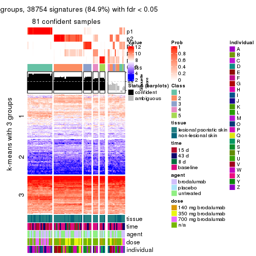</p>

</div>
<div id='tab-ATC-skmeans-get-signatures-no-scale-5'>
<pre><code class="r">get_signatures(res, k = 6, scale_rows = FALSE)
</code></pre>

<p>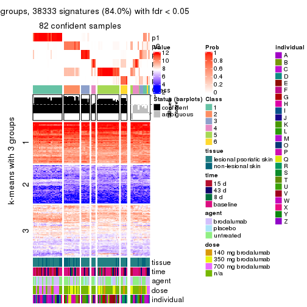</p>

</div>
</div>


Compare the overlap of signatures from different k:

```r
compare_signatures(res)
```


`get_signature()` returns a data frame invisibly. TO get the list of signatures, the function
call should be assigned to a variable explicitly. In following code, if `plot` argument is set
to `FALSE`, no heatmap is plotted while only the differential analysis is performed.

```r
# code only for demonstration
tb = get_signature(res, k = ..., plot = FALSE)
```

An example of the output of `tb` is:

```
#>   which_row         fdr    mean_1    mean_2 scaled_mean_1 scaled_mean_2 km
#> 1        38 0.042760348  8.373488  9.131774    -0.5533452     0.5164555  1
#> 2        40 0.018707592  7.106213  8.469186    -0.6173731     0.5762149  1
#> 3        55 0.019134737 10.221463 11.207825    -0.6159697     0.5749050  1
#> 4        59 0.006059896  5.921854  7.869574    -0.6899429     0.6439467  1
#> 5        60 0.018055526  8.928898 10.211722    -0.6204761     0.5791110  1
#> 6        98 0.009384629 15.714769 14.887706     0.6635654    -0.6193277  2
...
```

The columns in `tb` are:

1. `which_row`: row indices corresponding to the input matrix.
2. `fdr`: FDR for the differential test. 
3. `mean_x`: The mean value in group x.
4. `scaled_mean_x`: The mean value in group x after rows are scaled.
5. `km`: Row groups if k-means clustering is applied to rows.


UMAP plot which shows how samples are separated.


<script>
$( function() {
	$( '#tabs-ATC-skmeans-dimension-reduction' ).tabs();
} );
</script>
<div id='tabs-ATC-skmeans-dimension-reduction'>
<ul>
<li><a href='#tab-ATC-skmeans-dimension-reduction-1'>k = 2</a></li>
<li><a href='#tab-ATC-skmeans-dimension-reduction-2'>k = 3</a></li>
<li><a href='#tab-ATC-skmeans-dimension-reduction-3'>k = 4</a></li>
<li><a href='#tab-ATC-skmeans-dimension-reduction-4'>k = 5</a></li>
<li><a href='#tab-ATC-skmeans-dimension-reduction-5'>k = 6</a></li>
</ul>
<div id='tab-ATC-skmeans-dimension-reduction-1'>
<pre><code class="r">dimension_reduction(res, k = 2, method = &quot;UMAP&quot;)
</code></pre>

<p></p>

</div>
<div id='tab-ATC-skmeans-dimension-reduction-2'>
<pre><code class="r">dimension_reduction(res, k = 3, method = &quot;UMAP&quot;)
</code></pre>

<p></p>

</div>
<div id='tab-ATC-skmeans-dimension-reduction-3'>
<pre><code class="r">dimension_reduction(res, k = 4, method = &quot;UMAP&quot;)
</code></pre>

<p></p>

</div>
<div id='tab-ATC-skmeans-dimension-reduction-4'>
<pre><code class="r">dimension_reduction(res, k = 5, method = &quot;UMAP&quot;)
</code></pre>

<p></p>

</div>
<div id='tab-ATC-skmeans-dimension-reduction-5'>
<pre><code class="r">dimension_reduction(res, k = 6, method = &quot;UMAP&quot;)
</code></pre>

<p></p>

</div>
</div>


Following heatmap shows how subgroups are split when increasing `k`:

```r
collect_classes(res)
```


Test correlation between subgroups and known annotations. If the known
annotation is numeric, one-way ANOVA test is applied, and if the known
annotation is discrete, chi-squared contingency table test is applied.

```r
test_to_known_factors(res)
```

```
#>              n tissue(p) time(p) agent(p)  dose(p) individual(p) k
#> ATC:skmeans 99    0.7808  0.0917    0.656 4.03e-06      9.83e-05 2
#> ATC:skmeans 97    0.2433  0.1296    0.925 5.81e-07      1.04e-06 3
#> ATC:skmeans 87    0.1377  0.0690    0.272 3.70e-07      3.23e-11 4
#> ATC:skmeans 81    0.4093  0.2768    0.125 8.59e-07      2.92e-13 5
#> ATC:skmeans 82    0.0138  0.6681    0.265 3.73e-06      1.52e-09 6
```


If matrix rows can be associated to genes, consider to use `functional_enrichment(res,
...)` to perform function enrichment for the signature genes. See [this vignette](http://bioconductor.org/packages/devel/bioc/vignettes/cola/inst/doc/functional_enrichment.html) for more detailed explanations.


 

---------------------------------------------------


### ATC:pam**


The object with results only for a single top-value method and a single partition method 
can be extracted as:

```r
res = res_list["ATC", "pam"]
# you can also extract it by
# res = res_list["ATC:pam"]
```

A summary of `res` and all the functions that can be applied to it:

```r
res
```

```
#> A 'ConsensusPartition' object with k = 2, 3, 4, 5, 6.
#>   On a matrix with 45638 rows and 99 columns.
#>   Top rows (1000, 2000, 3000, 4000, 5000) are extracted by 'ATC' method.
#>   Subgroups are detected by 'pam' method.
#>   Performed in total 1250 partitions by row resampling.
#>   Best k for subgroups seems to be 3.
#> 
#> Following methods can be applied to this 'ConsensusPartition' object:
#>  [1] "cola_report"             "collect_classes"         "collect_plots"          
#>  [4] "collect_stats"           "colnames"                "compare_signatures"     
#>  [7] "consensus_heatmap"       "dimension_reduction"     "functional_enrichment"  
#> [10] "get_anno_col"            "get_anno"                "get_classes"            
#> [13] "get_consensus"           "get_matrix"              "get_membership"         
#> [16] "get_param"               "get_signatures"          "get_stats"              
#> [19] "is_best_k"               "is_stable_k"             "membership_heatmap"     
#> [22] "ncol"                    "nrow"                    "plot_ecdf"              
#> [25] "rownames"                "select_partition_number" "show"                   
#> [28] "suggest_best_k"          "test_to_known_factors"
```

`collect_plots()` function collects all the plots made from `res` for all `k` (number of partitions)
into one single page to provide an easy and fast comparison between different `k`.

```r
collect_plots(res)
```


The plots are:

- The first row: a plot of the ECDF (empirical cumulative distribution
  function) curves of the consensus matrix for each `k` and the heatmap of
  predicted classes for each `k`.
- The second row: heatmaps of the consensus matrix for each `k`.
- The third row: heatmaps of the membership matrix for each `k`.
- The fouth row: heatmaps of the signatures for each `k`.

All the plots in panels can be made by individual functions and they are
plotted later in this section.

`select_partition_number()` produces several plots showing different
statistics for choosing "optimized" `k`. There are following statistics:

- ECDF curves of the consensus matrix for each `k`;
- 1-PAC. [The PAC
  score](https://en.wikipedia.org/wiki/Consensus_clustering#Over-interpretation_potential_of_consensus_clustering)
  measures the proportion of the ambiguous subgrouping.
- Mean silhouette score.
- Concordance. The mean probability of fiting the consensus class ids in all
  partitions.
- Area increased. Denote $A_k$ as the area under the ECDF curve for current
  `k`, the area increased is defined as $A_k - A_{k-1}$.
- Rand index. The percent of pairs of samples that are both in a same cluster
  or both are not in a same cluster in the partition of k and k-1.
- Jaccard index. The ratio of pairs of samples are both in a same cluster in
  the partition of k and k-1 and the pairs of samples are both in a same
  cluster in the partition k or k-1.

The detailed explanations of these statistics can be found in [the _cola_
vignette](http://bioconductor.org/packages/devel/bioc/vignettes/cola/inst/doc/cola.html#toc_13).

Generally speaking, lower PAC score, higher mean silhouette score or higher
concordance corresponds to better partition. Rand index and Jaccard index
measure how similar the current partition is compared to partition with `k-1`.
If they are too similar, we won't accept `k` is better than `k-1`.

```r
select_partition_number(res)
```


The numeric values for all these statistics can be obtained by `get_stats()`.

```r
get_stats(res)
```

```
#>   k 1-PAC mean_silhouette concordance area_increased  Rand Jaccard
#> 2 2 0.763           0.859       0.941         0.4955 0.501   0.501
#> 3 3 0.987           0.941       0.978         0.3580 0.713   0.486
#> 4 4 0.888           0.838       0.935         0.0978 0.881   0.662
#> 5 5 0.810           0.813       0.906         0.0754 0.918   0.696
#> 6 6 0.837           0.779       0.864         0.0396 0.919   0.644
```

`suggest_best_k()` suggests the best $k$ based on these statistics. The rules are as follows:

- All $k$ with Jaccard index larger than 0.95 are removed because increasing
  $k$ does not provide enough extra information. If all $k$ are removed, it is
  marked as no subgroup is detected.
- For all $k$ with 1-PAC score larger than 0.9, the maximal $k$ is taken as
  the best $k$, and other $k$ are marked as optional $k$.
- If it does not fit the second rule. The $k$ with the maximal vote of the
  highest 1-PAC score, highest mean silhouette, and highest concordance is
  taken as the best $k$.

```r
suggest_best_k(res)
```

```
#> [1] 3
```


Following shows the table of the partitions (You need to click the **show/hide
code output** link to see it). The membership matrix (columns with name `p*`)
is inferred by
[`clue::cl_consensus()`](https://www.rdocumentation.org/link/cl_consensus?package=clue)
function with the `SE` method. Basically the value in the membership matrix
represents the probability to belong to a certain group. The finall class
label for an item is determined with the group with highest probability it
belongs to.

In `get_classes()` function, the entropy is calculated from the membership
matrix and the silhouette score is calculated from the consensus matrix.


<script>
$( function() {
	$( '#tabs-ATC-pam-get-classes' ).tabs();
} );
</script>
<div id='tabs-ATC-pam-get-classes'>
<ul>
<li><a href='#tab-ATC-pam-get-classes-1'>k = 2</a></li>
<li><a href='#tab-ATC-pam-get-classes-2'>k = 3</a></li>
<li><a href='#tab-ATC-pam-get-classes-3'>k = 4</a></li>
<li><a href='#tab-ATC-pam-get-classes-4'>k = 5</a></li>
<li><a href='#tab-ATC-pam-get-classes-5'>k = 6</a></li>
</ul>

<div id='tab-ATC-pam-get-classes-1'>
<p><a id='tab-ATC-pam-get-classes-1-a' style='color:#0366d6' href='#'>show/hide code output</a></p>
<pre><code class="r">cbind(get_classes(res, k = 2), get_membership(res, k = 2))
</code></pre>

<pre><code>#&gt;            class entropy silhouette    p1    p2
#&gt; GSM1296094     1   0.000      0.975 1.000 0.000
#&gt; GSM1296119     2   0.000      0.900 0.000 1.000
#&gt; GSM1296076     2   0.000      0.900 0.000 1.000
#&gt; GSM1296092     2   0.971      0.453 0.400 0.600
#&gt; GSM1296103     1   0.971      0.187 0.600 0.400
#&gt; GSM1296078     2   0.000      0.900 0.000 1.000
#&gt; GSM1296107     2   0.000      0.900 0.000 1.000
#&gt; GSM1296109     2   0.000      0.900 0.000 1.000
#&gt; GSM1296080     1   0.000      0.975 1.000 0.000
#&gt; GSM1296090     2   0.971      0.453 0.400 0.600
#&gt; GSM1296074     2   0.000      0.900 0.000 1.000
#&gt; GSM1296111     2   0.000      0.900 0.000 1.000
#&gt; GSM1296099     2   0.971      0.453 0.400 0.600
#&gt; GSM1296086     2   0.971      0.453 0.400 0.600
#&gt; GSM1296117     2   0.000      0.900 0.000 1.000
#&gt; GSM1296113     2   0.000      0.900 0.000 1.000
#&gt; GSM1296096     2   0.913      0.569 0.328 0.672
#&gt; GSM1296105     1   0.000      0.975 1.000 0.000
#&gt; GSM1296098     1   0.000      0.975 1.000 0.000
#&gt; GSM1296101     1   0.000      0.975 1.000 0.000
#&gt; GSM1296121     2   0.000      0.900 0.000 1.000
#&gt; GSM1296088     1   0.000      0.975 1.000 0.000
#&gt; GSM1296082     2   0.000      0.900 0.000 1.000
#&gt; GSM1296115     2   0.000      0.900 0.000 1.000
#&gt; GSM1296084     1   0.000      0.975 1.000 0.000
#&gt; GSM1296072     2   0.000      0.900 0.000 1.000
#&gt; GSM1296069     2   0.000      0.900 0.000 1.000
#&gt; GSM1296071     2   0.000      0.900 0.000 1.000
#&gt; GSM1296070     2   0.000      0.900 0.000 1.000
#&gt; GSM1296073     2   0.000      0.900 0.000 1.000
#&gt; GSM1296034     1   0.000      0.975 1.000 0.000
#&gt; GSM1296041     2   0.000      0.900 0.000 1.000
#&gt; GSM1296035     2   0.971      0.453 0.400 0.600
#&gt; GSM1296038     2   0.000      0.900 0.000 1.000
#&gt; GSM1296047     2   0.000      0.900 0.000 1.000
#&gt; GSM1296039     2   0.000      0.900 0.000 1.000
#&gt; GSM1296042     2   0.000      0.900 0.000 1.000
#&gt; GSM1296043     2   0.000      0.900 0.000 1.000
#&gt; GSM1296037     1   0.000      0.975 1.000 0.000
#&gt; GSM1296046     2   0.000      0.900 0.000 1.000
#&gt; GSM1296044     2   0.000      0.900 0.000 1.000
#&gt; GSM1296045     2   0.000      0.900 0.000 1.000
#&gt; GSM1296025     1   0.000      0.975 1.000 0.000
#&gt; GSM1296033     1   0.000      0.975 1.000 0.000
#&gt; GSM1296027     1   0.000      0.975 1.000 0.000
#&gt; GSM1296032     1   0.000      0.975 1.000 0.000
#&gt; GSM1296024     1   0.000      0.975 1.000 0.000
#&gt; GSM1296031     1   0.000      0.975 1.000 0.000
#&gt; GSM1296028     1   0.000      0.975 1.000 0.000
#&gt; GSM1296029     1   0.000      0.975 1.000 0.000
#&gt; GSM1296026     1   0.000      0.975 1.000 0.000
#&gt; GSM1296030     1   0.000      0.975 1.000 0.000
#&gt; GSM1296040     1   0.000      0.975 1.000 0.000
#&gt; GSM1296036     1   0.000      0.975 1.000 0.000
#&gt; GSM1296048     2   0.000      0.900 0.000 1.000
#&gt; GSM1296059     1   0.278      0.920 0.952 0.048
#&gt; GSM1296066     2   0.000      0.900 0.000 1.000
#&gt; GSM1296060     2   0.971      0.453 0.400 0.600
#&gt; GSM1296063     2   0.000      0.900 0.000 1.000
#&gt; GSM1296064     2   0.000      0.900 0.000 1.000
#&gt; GSM1296067     2   0.714      0.734 0.196 0.804
#&gt; GSM1296062     1   0.000      0.975 1.000 0.000
#&gt; GSM1296068     2   0.000      0.900 0.000 1.000
#&gt; GSM1296050     1   0.000      0.975 1.000 0.000
#&gt; GSM1296057     1   0.000      0.975 1.000 0.000
#&gt; GSM1296052     1   0.000      0.975 1.000 0.000
#&gt; GSM1296054     1   0.000      0.975 1.000 0.000
#&gt; GSM1296049     1   0.000      0.975 1.000 0.000
#&gt; GSM1296055     2   0.971      0.453 0.400 0.600
#&gt; GSM1296053     1   0.000      0.975 1.000 0.000
#&gt; GSM1296058     1   0.000      0.975 1.000 0.000
#&gt; GSM1296051     2   0.971      0.453 0.400 0.600
#&gt; GSM1296056     2   0.971      0.453 0.400 0.600
#&gt; GSM1296065     2   0.000      0.900 0.000 1.000
#&gt; GSM1296061     1   0.000      0.975 1.000 0.000
#&gt; GSM1296095     2   0.000      0.900 0.000 1.000
#&gt; GSM1296120     2   0.000      0.900 0.000 1.000
#&gt; GSM1296077     1   0.000      0.975 1.000 0.000
#&gt; GSM1296093     1   0.000      0.975 1.000 0.000
#&gt; GSM1296104     2   0.000      0.900 0.000 1.000
#&gt; GSM1296079     1   0.000      0.975 1.000 0.000
#&gt; GSM1296108     2   0.000      0.900 0.000 1.000
#&gt; GSM1296110     2   0.000      0.900 0.000 1.000
#&gt; GSM1296081     1   0.000      0.975 1.000 0.000
#&gt; GSM1296091     1   0.000      0.975 1.000 0.000
#&gt; GSM1296075     2   0.969      0.460 0.396 0.604
#&gt; GSM1296112     2   0.000      0.900 0.000 1.000
#&gt; GSM1296100     1   0.000      0.975 1.000 0.000
#&gt; GSM1296087     1   0.000      0.975 1.000 0.000
#&gt; GSM1296118     2   0.000      0.900 0.000 1.000
#&gt; GSM1296114     2   0.000      0.900 0.000 1.000
#&gt; GSM1296097     2   0.971      0.453 0.400 0.600
#&gt; GSM1296106     1   1.000     -0.152 0.512 0.488
#&gt; GSM1296102     1   0.000      0.975 1.000 0.000
#&gt; GSM1296122     2   0.000      0.900 0.000 1.000
#&gt; GSM1296089     1   0.000      0.975 1.000 0.000
#&gt; GSM1296083     1   0.000      0.975 1.000 0.000
#&gt; GSM1296116     2   0.000      0.900 0.000 1.000
#&gt; GSM1296085     1   0.000      0.975 1.000 0.000
</code></pre>

<script>
$('#tab-ATC-pam-get-classes-1-a').parent().next().next().hide();
$('#tab-ATC-pam-get-classes-1-a').click(function(){
  $('#tab-ATC-pam-get-classes-1-a').parent().next().next().toggle();
  return(false);
});
</script>
</div>

<div id='tab-ATC-pam-get-classes-2'>
<p><a id='tab-ATC-pam-get-classes-2-a' style='color:#0366d6' href='#'>show/hide code output</a></p>
<pre><code class="r">cbind(get_classes(res, k = 3), get_membership(res, k = 3))
</code></pre>

<pre><code>#&gt;            class entropy silhouette    p1    p2    p3
#&gt; GSM1296094     3   0.000     0.9594 0.000 0.000 1.000
#&gt; GSM1296119     2   0.000     0.9844 0.000 1.000 0.000
#&gt; GSM1296076     2   0.000     0.9844 0.000 1.000 0.000
#&gt; GSM1296092     3   0.000     0.9594 0.000 0.000 1.000
#&gt; GSM1296103     3   0.000     0.9594 0.000 0.000 1.000
#&gt; GSM1296078     2   0.000     0.9844 0.000 1.000 0.000
#&gt; GSM1296107     2   0.000     0.9844 0.000 1.000 0.000
#&gt; GSM1296109     3   0.000     0.9594 0.000 0.000 1.000
#&gt; GSM1296080     1   0.000     0.9871 1.000 0.000 0.000
#&gt; GSM1296090     3   0.000     0.9594 0.000 0.000 1.000
#&gt; GSM1296074     3   0.624     0.2031 0.000 0.440 0.560
#&gt; GSM1296111     2   0.000     0.9844 0.000 1.000 0.000
#&gt; GSM1296099     3   0.000     0.9594 0.000 0.000 1.000
#&gt; GSM1296086     3   0.000     0.9594 0.000 0.000 1.000
#&gt; GSM1296117     2   0.000     0.9844 0.000 1.000 0.000
#&gt; GSM1296113     2   0.000     0.9844 0.000 1.000 0.000
#&gt; GSM1296096     3   0.000     0.9594 0.000 0.000 1.000
#&gt; GSM1296105     3   0.000     0.9594 0.000 0.000 1.000
#&gt; GSM1296098     3   0.627     0.1648 0.456 0.000 0.544
#&gt; GSM1296101     3   0.000     0.9594 0.000 0.000 1.000
#&gt; GSM1296121     2   0.000     0.9844 0.000 1.000 0.000
#&gt; GSM1296088     3   0.000     0.9594 0.000 0.000 1.000
#&gt; GSM1296082     3   0.000     0.9594 0.000 0.000 1.000
#&gt; GSM1296115     2   0.000     0.9844 0.000 1.000 0.000
#&gt; GSM1296084     1   0.000     0.9871 1.000 0.000 0.000
#&gt; GSM1296072     2   0.000     0.9844 0.000 1.000 0.000
#&gt; GSM1296069     2   0.000     0.9844 0.000 1.000 0.000
#&gt; GSM1296071     2   0.000     0.9844 0.000 1.000 0.000
#&gt; GSM1296070     2   0.000     0.9844 0.000 1.000 0.000
#&gt; GSM1296073     2   0.000     0.9844 0.000 1.000 0.000
#&gt; GSM1296034     1   0.000     0.9871 1.000 0.000 0.000
#&gt; GSM1296041     2   0.000     0.9844 0.000 1.000 0.000
#&gt; GSM1296035     3   0.000     0.9594 0.000 0.000 1.000
#&gt; GSM1296038     3   0.000     0.9594 0.000 0.000 1.000
#&gt; GSM1296047     2   0.000     0.9844 0.000 1.000 0.000
#&gt; GSM1296039     2   0.631    -0.0135 0.000 0.508 0.492
#&gt; GSM1296042     2   0.000     0.9844 0.000 1.000 0.000
#&gt; GSM1296043     2   0.000     0.9844 0.000 1.000 0.000
#&gt; GSM1296037     1   0.000     0.9871 1.000 0.000 0.000
#&gt; GSM1296046     2   0.000     0.9844 0.000 1.000 0.000
#&gt; GSM1296044     2   0.000     0.9844 0.000 1.000 0.000
#&gt; GSM1296045     2   0.000     0.9844 0.000 1.000 0.000
#&gt; GSM1296025     1   0.000     0.9871 1.000 0.000 0.000
#&gt; GSM1296033     1   0.000     0.9871 1.000 0.000 0.000
#&gt; GSM1296027     1   0.000     0.9871 1.000 0.000 0.000
#&gt; GSM1296032     1   0.000     0.9871 1.000 0.000 0.000
#&gt; GSM1296024     1   0.000     0.9871 1.000 0.000 0.000
#&gt; GSM1296031     1   0.000     0.9871 1.000 0.000 0.000
#&gt; GSM1296028     1   0.000     0.9871 1.000 0.000 0.000
#&gt; GSM1296029     1   0.000     0.9871 1.000 0.000 0.000
#&gt; GSM1296026     1   0.000     0.9871 1.000 0.000 0.000
#&gt; GSM1296030     1   0.000     0.9871 1.000 0.000 0.000
#&gt; GSM1296040     3   0.000     0.9594 0.000 0.000 1.000
#&gt; GSM1296036     1   0.599     0.3846 0.632 0.000 0.368
#&gt; GSM1296048     2   0.000     0.9844 0.000 1.000 0.000
#&gt; GSM1296059     3   0.000     0.9594 0.000 0.000 1.000
#&gt; GSM1296066     2   0.000     0.9844 0.000 1.000 0.000
#&gt; GSM1296060     3   0.000     0.9594 0.000 0.000 1.000
#&gt; GSM1296063     2   0.000     0.9844 0.000 1.000 0.000
#&gt; GSM1296064     2   0.000     0.9844 0.000 1.000 0.000
#&gt; GSM1296067     3   0.000     0.9594 0.000 0.000 1.000
#&gt; GSM1296062     1   0.000     0.9871 1.000 0.000 0.000
#&gt; GSM1296068     2   0.000     0.9844 0.000 1.000 0.000
#&gt; GSM1296050     3   0.382     0.8090 0.148 0.000 0.852
#&gt; GSM1296057     3   0.000     0.9594 0.000 0.000 1.000
#&gt; GSM1296052     1   0.000     0.9871 1.000 0.000 0.000
#&gt; GSM1296054     1   0.000     0.9871 1.000 0.000 0.000
#&gt; GSM1296049     1   0.000     0.9871 1.000 0.000 0.000
#&gt; GSM1296055     3   0.000     0.9594 0.000 0.000 1.000
#&gt; GSM1296053     1   0.000     0.9871 1.000 0.000 0.000
#&gt; GSM1296058     3   0.400     0.7947 0.160 0.000 0.840
#&gt; GSM1296051     3   0.000     0.9594 0.000 0.000 1.000
#&gt; GSM1296056     3   0.000     0.9594 0.000 0.000 1.000
#&gt; GSM1296065     3   0.000     0.9594 0.000 0.000 1.000
#&gt; GSM1296061     1   0.000     0.9871 1.000 0.000 0.000
#&gt; GSM1296095     3   0.000     0.9594 0.000 0.000 1.000
#&gt; GSM1296120     2   0.000     0.9844 0.000 1.000 0.000
#&gt; GSM1296077     1   0.000     0.9871 1.000 0.000 0.000
#&gt; GSM1296093     1   0.000     0.9871 1.000 0.000 0.000
#&gt; GSM1296104     3   0.000     0.9594 0.000 0.000 1.000
#&gt; GSM1296079     1   0.000     0.9871 1.000 0.000 0.000
#&gt; GSM1296108     2   0.000     0.9844 0.000 1.000 0.000
#&gt; GSM1296110     2   0.000     0.9844 0.000 1.000 0.000
#&gt; GSM1296081     1   0.000     0.9871 1.000 0.000 0.000
#&gt; GSM1296091     3   0.263     0.8826 0.084 0.000 0.916
#&gt; GSM1296075     3   0.000     0.9594 0.000 0.000 1.000
#&gt; GSM1296112     2   0.000     0.9844 0.000 1.000 0.000
#&gt; GSM1296100     1   0.000     0.9871 1.000 0.000 0.000
#&gt; GSM1296087     1   0.000     0.9871 1.000 0.000 0.000
#&gt; GSM1296118     2   0.000     0.9844 0.000 1.000 0.000
#&gt; GSM1296114     2   0.000     0.9844 0.000 1.000 0.000
#&gt; GSM1296097     3   0.000     0.9594 0.000 0.000 1.000
#&gt; GSM1296106     3   0.000     0.9594 0.000 0.000 1.000
#&gt; GSM1296102     1   0.000     0.9871 1.000 0.000 0.000
#&gt; GSM1296122     3   0.000     0.9594 0.000 0.000 1.000
#&gt; GSM1296089     1   0.000     0.9871 1.000 0.000 0.000
#&gt; GSM1296083     1   0.000     0.9871 1.000 0.000 0.000
#&gt; GSM1296116     2   0.000     0.9844 0.000 1.000 0.000
#&gt; GSM1296085     1   0.000     0.9871 1.000 0.000 0.000
</code></pre>

<script>
$('#tab-ATC-pam-get-classes-2-a').parent().next().next().hide();
$('#tab-ATC-pam-get-classes-2-a').click(function(){
  $('#tab-ATC-pam-get-classes-2-a').parent().next().next().toggle();
  return(false);
});
</script>
</div>

<div id='tab-ATC-pam-get-classes-3'>
<p><a id='tab-ATC-pam-get-classes-3-a' style='color:#0366d6' href='#'>show/hide code output</a></p>
<pre><code class="r">cbind(get_classes(res, k = 4), get_membership(res, k = 4))
</code></pre>

<pre><code>#&gt;            class entropy silhouette    p1    p2    p3    p4
#&gt; GSM1296094     3  0.0188      0.765 0.000 0.000 0.996 0.004
#&gt; GSM1296119     2  0.0000      0.993 0.000 1.000 0.000 0.000
#&gt; GSM1296076     2  0.0000      0.993 0.000 1.000 0.000 0.000
#&gt; GSM1296092     4  0.0000      0.953 0.000 0.000 0.000 1.000
#&gt; GSM1296103     4  0.0000      0.953 0.000 0.000 0.000 1.000
#&gt; GSM1296078     2  0.0000      0.993 0.000 1.000 0.000 0.000
#&gt; GSM1296107     2  0.0000      0.993 0.000 1.000 0.000 0.000
#&gt; GSM1296109     4  0.0000      0.953 0.000 0.000 0.000 1.000
#&gt; GSM1296080     1  0.0000      0.886 1.000 0.000 0.000 0.000
#&gt; GSM1296090     4  0.0000      0.953 0.000 0.000 0.000 1.000
#&gt; GSM1296074     4  0.2197      0.864 0.000 0.080 0.004 0.916
#&gt; GSM1296111     2  0.0000      0.993 0.000 1.000 0.000 0.000
#&gt; GSM1296099     4  0.0000      0.953 0.000 0.000 0.000 1.000
#&gt; GSM1296086     4  0.0000      0.953 0.000 0.000 0.000 1.000
#&gt; GSM1296117     2  0.0000      0.993 0.000 1.000 0.000 0.000
#&gt; GSM1296113     2  0.0000      0.993 0.000 1.000 0.000 0.000
#&gt; GSM1296096     4  0.0000      0.953 0.000 0.000 0.000 1.000
#&gt; GSM1296105     3  0.0188      0.765 0.000 0.000 0.996 0.004
#&gt; GSM1296098     3  0.0188      0.766 0.004 0.000 0.996 0.000
#&gt; GSM1296101     4  0.4661      0.392 0.000 0.000 0.348 0.652
#&gt; GSM1296121     2  0.0000      0.993 0.000 1.000 0.000 0.000
#&gt; GSM1296088     3  0.4955      0.220 0.000 0.000 0.556 0.444
#&gt; GSM1296082     4  0.0000      0.953 0.000 0.000 0.000 1.000
#&gt; GSM1296115     2  0.0000      0.993 0.000 1.000 0.000 0.000
#&gt; GSM1296084     3  0.4948      0.344 0.440 0.000 0.560 0.000
#&gt; GSM1296072     2  0.0188      0.991 0.000 0.996 0.004 0.000
#&gt; GSM1296069     2  0.0000      0.993 0.000 1.000 0.000 0.000
#&gt; GSM1296071     2  0.0188      0.991 0.000 0.996 0.004 0.000
#&gt; GSM1296070     2  0.0000      0.993 0.000 1.000 0.000 0.000
#&gt; GSM1296073     2  0.0000      0.993 0.000 1.000 0.000 0.000
#&gt; GSM1296034     1  0.4040      0.568 0.752 0.000 0.248 0.000
#&gt; GSM1296041     2  0.0000      0.993 0.000 1.000 0.000 0.000
#&gt; GSM1296035     4  0.0000      0.953 0.000 0.000 0.000 1.000
#&gt; GSM1296038     4  0.0000      0.953 0.000 0.000 0.000 1.000
#&gt; GSM1296047     2  0.1978      0.921 0.000 0.928 0.004 0.068
#&gt; GSM1296039     4  0.3172      0.765 0.000 0.160 0.000 0.840
#&gt; GSM1296042     2  0.0000      0.993 0.000 1.000 0.000 0.000
#&gt; GSM1296043     2  0.0000      0.993 0.000 1.000 0.000 0.000
#&gt; GSM1296037     3  0.0188      0.766 0.004 0.000 0.996 0.000
#&gt; GSM1296046     2  0.0000      0.993 0.000 1.000 0.000 0.000
#&gt; GSM1296044     2  0.0000      0.993 0.000 1.000 0.000 0.000
#&gt; GSM1296045     2  0.0000      0.993 0.000 1.000 0.000 0.000
#&gt; GSM1296025     1  0.0000      0.886 1.000 0.000 0.000 0.000
#&gt; GSM1296033     3  0.4955      0.336 0.444 0.000 0.556 0.000
#&gt; GSM1296027     1  0.0000      0.886 1.000 0.000 0.000 0.000
#&gt; GSM1296032     1  0.0000      0.886 1.000 0.000 0.000 0.000
#&gt; GSM1296024     1  0.0000      0.886 1.000 0.000 0.000 0.000
#&gt; GSM1296031     3  0.4955      0.336 0.444 0.000 0.556 0.000
#&gt; GSM1296028     1  0.3726      0.632 0.788 0.000 0.212 0.000
#&gt; GSM1296029     1  0.0000      0.886 1.000 0.000 0.000 0.000
#&gt; GSM1296026     3  0.4916      0.373 0.424 0.000 0.576 0.000
#&gt; GSM1296030     1  0.4624      0.352 0.660 0.000 0.340 0.000
#&gt; GSM1296040     3  0.0188      0.765 0.000 0.000 0.996 0.004
#&gt; GSM1296036     3  0.0188      0.766 0.004 0.000 0.996 0.000
#&gt; GSM1296048     2  0.0000      0.993 0.000 1.000 0.000 0.000
#&gt; GSM1296059     4  0.0000      0.953 0.000 0.000 0.000 1.000
#&gt; GSM1296066     2  0.0000      0.993 0.000 1.000 0.000 0.000
#&gt; GSM1296060     4  0.0000      0.953 0.000 0.000 0.000 1.000
#&gt; GSM1296063     2  0.0000      0.993 0.000 1.000 0.000 0.000
#&gt; GSM1296064     2  0.0000      0.993 0.000 1.000 0.000 0.000
#&gt; GSM1296067     4  0.0188      0.951 0.000 0.000 0.004 0.996
#&gt; GSM1296062     3  0.0188      0.766 0.004 0.000 0.996 0.000
#&gt; GSM1296068     2  0.0188      0.991 0.000 0.996 0.004 0.000
#&gt; GSM1296050     3  0.7153      0.493 0.248 0.000 0.556 0.196
#&gt; GSM1296057     4  0.4907      0.182 0.000 0.000 0.420 0.580
#&gt; GSM1296052     1  0.0000      0.886 1.000 0.000 0.000 0.000
#&gt; GSM1296054     1  0.0000      0.886 1.000 0.000 0.000 0.000
#&gt; GSM1296049     1  0.0000      0.886 1.000 0.000 0.000 0.000
#&gt; GSM1296055     4  0.0000      0.953 0.000 0.000 0.000 1.000
#&gt; GSM1296053     1  0.0000      0.886 1.000 0.000 0.000 0.000
#&gt; GSM1296058     3  0.0188      0.765 0.000 0.000 0.996 0.004
#&gt; GSM1296051     4  0.0000      0.953 0.000 0.000 0.000 1.000
#&gt; GSM1296056     4  0.0000      0.953 0.000 0.000 0.000 1.000
#&gt; GSM1296065     4  0.0188      0.951 0.000 0.000 0.004 0.996
#&gt; GSM1296061     3  0.0188      0.766 0.004 0.000 0.996 0.000
#&gt; GSM1296095     4  0.0000      0.953 0.000 0.000 0.000 1.000
#&gt; GSM1296120     2  0.0188      0.991 0.000 0.996 0.004 0.000
#&gt; GSM1296077     1  0.4746      0.247 0.632 0.000 0.368 0.000
#&gt; GSM1296093     1  0.0000      0.886 1.000 0.000 0.000 0.000
#&gt; GSM1296104     4  0.0188      0.951 0.000 0.000 0.004 0.996
#&gt; GSM1296079     1  0.4977     -0.108 0.540 0.000 0.460 0.000
#&gt; GSM1296108     2  0.0188      0.991 0.000 0.996 0.004 0.000
#&gt; GSM1296110     2  0.2831      0.859 0.000 0.876 0.004 0.120
#&gt; GSM1296081     1  0.0000      0.886 1.000 0.000 0.000 0.000
#&gt; GSM1296091     3  0.7153      0.493 0.248 0.000 0.556 0.196
#&gt; GSM1296075     4  0.0188      0.951 0.000 0.000 0.004 0.996
#&gt; GSM1296112     2  0.0188      0.991 0.000 0.996 0.004 0.000
#&gt; GSM1296100     3  0.0188      0.766 0.004 0.000 0.996 0.000
#&gt; GSM1296087     1  0.0000      0.886 1.000 0.000 0.000 0.000
#&gt; GSM1296118     2  0.0188      0.991 0.000 0.996 0.004 0.000
#&gt; GSM1296114     2  0.0000      0.993 0.000 1.000 0.000 0.000
#&gt; GSM1296097     4  0.0000      0.953 0.000 0.000 0.000 1.000
#&gt; GSM1296106     4  0.0000      0.953 0.000 0.000 0.000 1.000
#&gt; GSM1296102     3  0.0188      0.766 0.004 0.000 0.996 0.000
#&gt; GSM1296122     4  0.0188      0.951 0.000 0.000 0.004 0.996
#&gt; GSM1296089     3  0.4955      0.336 0.444 0.000 0.556 0.000
#&gt; GSM1296083     1  0.0000      0.886 1.000 0.000 0.000 0.000
#&gt; GSM1296116     2  0.0000      0.993 0.000 1.000 0.000 0.000
#&gt; GSM1296085     1  0.0000      0.886 1.000 0.000 0.000 0.000
</code></pre>

<script>
$('#tab-ATC-pam-get-classes-3-a').parent().next().next().hide();
$('#tab-ATC-pam-get-classes-3-a').click(function(){
  $('#tab-ATC-pam-get-classes-3-a').parent().next().next().toggle();
  return(false);
});
</script>
</div>

<div id='tab-ATC-pam-get-classes-4'>
<p><a id='tab-ATC-pam-get-classes-4-a' style='color:#0366d6' href='#'>show/hide code output</a></p>
<pre><code class="r">cbind(get_classes(res, k = 5), get_membership(res, k = 5))
</code></pre>

<pre><code>#&gt;            class entropy silhouette    p1    p2    p3    p4    p5
#&gt; GSM1296094     3  0.0000      0.763 0.000 0.000 1.000 0.000 0.000
#&gt; GSM1296119     5  0.0000      0.990 0.000 0.000 0.000 0.000 1.000
#&gt; GSM1296076     5  0.0404      0.982 0.000 0.012 0.000 0.000 0.988
#&gt; GSM1296092     4  0.0162      0.940 0.000 0.004 0.000 0.996 0.000
#&gt; GSM1296103     4  0.0000      0.941 0.000 0.000 0.000 1.000 0.000
#&gt; GSM1296078     5  0.0510      0.978 0.000 0.016 0.000 0.000 0.984
#&gt; GSM1296107     5  0.0000      0.990 0.000 0.000 0.000 0.000 1.000
#&gt; GSM1296109     4  0.1478      0.905 0.000 0.064 0.000 0.936 0.000
#&gt; GSM1296080     1  0.0000      0.864 1.000 0.000 0.000 0.000 0.000
#&gt; GSM1296090     4  0.0162      0.940 0.000 0.004 0.000 0.996 0.000
#&gt; GSM1296074     4  0.2020      0.880 0.000 0.100 0.000 0.900 0.000
#&gt; GSM1296111     5  0.0000      0.990 0.000 0.000 0.000 0.000 1.000
#&gt; GSM1296099     4  0.0000      0.941 0.000 0.000 0.000 1.000 0.000
#&gt; GSM1296086     4  0.0000      0.941 0.000 0.000 0.000 1.000 0.000
#&gt; GSM1296117     5  0.0000      0.990 0.000 0.000 0.000 0.000 1.000
#&gt; GSM1296113     5  0.0000      0.990 0.000 0.000 0.000 0.000 1.000
#&gt; GSM1296096     4  0.0000      0.941 0.000 0.000 0.000 1.000 0.000
#&gt; GSM1296105     3  0.0000      0.763 0.000 0.000 1.000 0.000 0.000
#&gt; GSM1296098     3  0.0000      0.763 0.000 0.000 1.000 0.000 0.000
#&gt; GSM1296101     3  0.3895      0.500 0.000 0.000 0.680 0.320 0.000
#&gt; GSM1296121     5  0.0000      0.990 0.000 0.000 0.000 0.000 1.000
#&gt; GSM1296088     3  0.3861      0.570 0.000 0.004 0.712 0.284 0.000
#&gt; GSM1296082     4  0.0162      0.940 0.000 0.004 0.000 0.996 0.000
#&gt; GSM1296115     5  0.0000      0.990 0.000 0.000 0.000 0.000 1.000
#&gt; GSM1296084     3  0.5836      0.295 0.384 0.100 0.516 0.000 0.000
#&gt; GSM1296072     2  0.2074      0.930 0.000 0.896 0.000 0.000 0.104
#&gt; GSM1296069     5  0.0000      0.990 0.000 0.000 0.000 0.000 1.000
#&gt; GSM1296071     2  0.2074      0.930 0.000 0.896 0.000 0.000 0.104
#&gt; GSM1296070     5  0.0000      0.990 0.000 0.000 0.000 0.000 1.000
#&gt; GSM1296073     5  0.0000      0.990 0.000 0.000 0.000 0.000 1.000
#&gt; GSM1296034     1  0.3305      0.588 0.776 0.000 0.224 0.000 0.000
#&gt; GSM1296041     5  0.0000      0.990 0.000 0.000 0.000 0.000 1.000
#&gt; GSM1296035     4  0.0000      0.941 0.000 0.000 0.000 1.000 0.000
#&gt; GSM1296038     4  0.0000      0.941 0.000 0.000 0.000 1.000 0.000
#&gt; GSM1296047     2  0.2179      0.930 0.000 0.896 0.000 0.004 0.100
#&gt; GSM1296039     4  0.2632      0.870 0.000 0.072 0.000 0.888 0.040
#&gt; GSM1296042     5  0.0000      0.990 0.000 0.000 0.000 0.000 1.000
#&gt; GSM1296043     5  0.0000      0.990 0.000 0.000 0.000 0.000 1.000
#&gt; GSM1296037     3  0.0000      0.763 0.000 0.000 1.000 0.000 0.000
#&gt; GSM1296046     5  0.0290      0.984 0.000 0.008 0.000 0.000 0.992
#&gt; GSM1296044     5  0.0290      0.984 0.000 0.008 0.000 0.000 0.992
#&gt; GSM1296045     5  0.0000      0.990 0.000 0.000 0.000 0.000 1.000
#&gt; GSM1296025     1  0.0000      0.864 1.000 0.000 0.000 0.000 0.000
#&gt; GSM1296033     3  0.5843      0.287 0.388 0.100 0.512 0.000 0.000
#&gt; GSM1296027     1  0.0000      0.864 1.000 0.000 0.000 0.000 0.000
#&gt; GSM1296032     1  0.2020      0.818 0.900 0.100 0.000 0.000 0.000
#&gt; GSM1296024     1  0.0000      0.864 1.000 0.000 0.000 0.000 0.000
#&gt; GSM1296031     3  0.5843      0.287 0.388 0.100 0.512 0.000 0.000
#&gt; GSM1296028     1  0.4748      0.619 0.728 0.100 0.172 0.000 0.000
#&gt; GSM1296029     1  0.2020      0.818 0.900 0.100 0.000 0.000 0.000
#&gt; GSM1296026     3  0.5803      0.325 0.368 0.100 0.532 0.000 0.000
#&gt; GSM1296030     1  0.5544      0.376 0.608 0.100 0.292 0.000 0.000
#&gt; GSM1296040     3  0.0000      0.763 0.000 0.000 1.000 0.000 0.000
#&gt; GSM1296036     3  0.0000      0.763 0.000 0.000 1.000 0.000 0.000
#&gt; GSM1296048     5  0.0000      0.990 0.000 0.000 0.000 0.000 1.000
#&gt; GSM1296059     4  0.0000      0.941 0.000 0.000 0.000 1.000 0.000
#&gt; GSM1296066     5  0.0000      0.990 0.000 0.000 0.000 0.000 1.000
#&gt; GSM1296060     4  0.0000      0.941 0.000 0.000 0.000 1.000 0.000
#&gt; GSM1296063     5  0.0162      0.987 0.000 0.004 0.000 0.000 0.996
#&gt; GSM1296064     5  0.2674      0.806 0.000 0.004 0.000 0.140 0.856
#&gt; GSM1296067     2  0.2852      0.785 0.000 0.828 0.000 0.172 0.000
#&gt; GSM1296062     3  0.0000      0.763 0.000 0.000 1.000 0.000 0.000
#&gt; GSM1296068     2  0.2605      0.899 0.000 0.852 0.000 0.000 0.148
#&gt; GSM1296050     3  0.5114      0.352 0.004 0.456 0.512 0.028 0.000
#&gt; GSM1296057     3  0.3366      0.642 0.000 0.004 0.784 0.212 0.000
#&gt; GSM1296052     1  0.0000      0.864 1.000 0.000 0.000 0.000 0.000
#&gt; GSM1296054     1  0.0000      0.864 1.000 0.000 0.000 0.000 0.000
#&gt; GSM1296049     1  0.0000      0.864 1.000 0.000 0.000 0.000 0.000
#&gt; GSM1296055     4  0.3612      0.619 0.000 0.268 0.000 0.732 0.000
#&gt; GSM1296053     1  0.0000      0.864 1.000 0.000 0.000 0.000 0.000
#&gt; GSM1296058     3  0.0162      0.762 0.000 0.004 0.996 0.000 0.000
#&gt; GSM1296051     4  0.0162      0.940 0.000 0.004 0.000 0.996 0.000
#&gt; GSM1296056     4  0.0000      0.941 0.000 0.000 0.000 1.000 0.000
#&gt; GSM1296065     4  0.2813      0.812 0.000 0.168 0.000 0.832 0.000
#&gt; GSM1296061     3  0.0000      0.763 0.000 0.000 1.000 0.000 0.000
#&gt; GSM1296095     4  0.0290      0.938 0.000 0.008 0.000 0.992 0.000
#&gt; GSM1296120     2  0.2074      0.930 0.000 0.896 0.000 0.000 0.104
#&gt; GSM1296077     1  0.5773      0.179 0.544 0.100 0.356 0.000 0.000
#&gt; GSM1296093     1  0.0000      0.864 1.000 0.000 0.000 0.000 0.000
#&gt; GSM1296104     4  0.1732      0.897 0.000 0.080 0.000 0.920 0.000
#&gt; GSM1296079     1  0.5896     -0.165 0.452 0.100 0.448 0.000 0.000
#&gt; GSM1296108     2  0.2074      0.930 0.000 0.896 0.000 0.000 0.104
#&gt; GSM1296110     2  0.2179      0.930 0.000 0.896 0.000 0.004 0.100
#&gt; GSM1296081     1  0.0000      0.864 1.000 0.000 0.000 0.000 0.000
#&gt; GSM1296091     3  0.7069      0.378 0.308 0.100 0.512 0.080 0.000
#&gt; GSM1296075     2  0.2813      0.787 0.000 0.832 0.000 0.168 0.000
#&gt; GSM1296112     2  0.3039      0.851 0.000 0.808 0.000 0.000 0.192
#&gt; GSM1296100     3  0.0000      0.763 0.000 0.000 1.000 0.000 0.000
#&gt; GSM1296087     1  0.2020      0.818 0.900 0.100 0.000 0.000 0.000
#&gt; GSM1296118     2  0.2074      0.930 0.000 0.896 0.000 0.000 0.104
#&gt; GSM1296114     5  0.0000      0.990 0.000 0.000 0.000 0.000 1.000
#&gt; GSM1296097     4  0.0000      0.941 0.000 0.000 0.000 1.000 0.000
#&gt; GSM1296106     4  0.3966      0.481 0.000 0.336 0.000 0.664 0.000
#&gt; GSM1296102     3  0.0000      0.763 0.000 0.000 1.000 0.000 0.000
#&gt; GSM1296122     2  0.2074      0.834 0.000 0.896 0.000 0.104 0.000
#&gt; GSM1296089     3  0.5843      0.287 0.388 0.100 0.512 0.000 0.000
#&gt; GSM1296083     1  0.0000      0.864 1.000 0.000 0.000 0.000 0.000
#&gt; GSM1296116     5  0.0290      0.984 0.000 0.008 0.000 0.000 0.992
#&gt; GSM1296085     1  0.0000      0.864 1.000 0.000 0.000 0.000 0.000
</code></pre>

<script>
$('#tab-ATC-pam-get-classes-4-a').parent().next().next().hide();
$('#tab-ATC-pam-get-classes-4-a').click(function(){
  $('#tab-ATC-pam-get-classes-4-a').parent().next().next().toggle();
  return(false);
});
</script>
</div>

<div id='tab-ATC-pam-get-classes-5'>
<p><a id='tab-ATC-pam-get-classes-5-a' style='color:#0366d6' href='#'>show/hide code output</a></p>
<pre><code class="r">cbind(get_classes(res, k = 6), get_membership(res, k = 6))
</code></pre>

<pre><code>#&gt;            class entropy silhouette    p1    p2    p3    p4    p5    p6
#&gt; GSM1296094     3  0.0000      0.994 0.000 0.000 1.000 0.000 0.000 0.000
#&gt; GSM1296119     5  0.0000      0.943 0.000 0.000 0.000 0.000 1.000 0.000
#&gt; GSM1296076     5  0.4509      0.470 0.000 0.032 0.000 0.436 0.532 0.000
#&gt; GSM1296092     6  0.4011      0.633 0.000 0.024 0.000 0.304 0.000 0.672
#&gt; GSM1296103     6  0.0146      0.804 0.000 0.000 0.004 0.000 0.000 0.996
#&gt; GSM1296078     5  0.4685      0.452 0.000 0.044 0.000 0.436 0.520 0.000
#&gt; GSM1296107     5  0.0000      0.943 0.000 0.000 0.000 0.000 1.000 0.000
#&gt; GSM1296109     6  0.2234      0.736 0.000 0.124 0.000 0.004 0.000 0.872
#&gt; GSM1296080     1  0.0000      0.949 1.000 0.000 0.000 0.000 0.000 0.000
#&gt; GSM1296090     6  0.4377      0.526 0.000 0.024 0.000 0.436 0.000 0.540
#&gt; GSM1296074     4  0.5946     -0.390 0.000 0.228 0.000 0.436 0.000 0.336
#&gt; GSM1296111     5  0.0000      0.943 0.000 0.000 0.000 0.000 1.000 0.000
#&gt; GSM1296099     6  0.0000      0.804 0.000 0.000 0.000 0.000 0.000 1.000
#&gt; GSM1296086     6  0.3428      0.651 0.000 0.000 0.000 0.304 0.000 0.696
#&gt; GSM1296117     5  0.0000      0.943 0.000 0.000 0.000 0.000 1.000 0.000
#&gt; GSM1296113     5  0.0000      0.943 0.000 0.000 0.000 0.000 1.000 0.000
#&gt; GSM1296096     6  0.0000      0.804 0.000 0.000 0.000 0.000 0.000 1.000
#&gt; GSM1296105     3  0.0000      0.994 0.000 0.000 1.000 0.000 0.000 0.000
#&gt; GSM1296098     3  0.0000      0.994 0.000 0.000 1.000 0.000 0.000 0.000
#&gt; GSM1296101     6  0.2854      0.654 0.000 0.000 0.208 0.000 0.000 0.792
#&gt; GSM1296121     5  0.0000      0.943 0.000 0.000 0.000 0.000 1.000 0.000
#&gt; GSM1296088     6  0.5764      0.210 0.000 0.000 0.216 0.280 0.000 0.504
#&gt; GSM1296082     6  0.4377      0.526 0.000 0.024 0.000 0.436 0.000 0.540
#&gt; GSM1296115     5  0.0000      0.943 0.000 0.000 0.000 0.000 1.000 0.000
#&gt; GSM1296084     4  0.5360      0.672 0.308 0.000 0.136 0.556 0.000 0.000
#&gt; GSM1296072     2  0.0632      0.907 0.000 0.976 0.000 0.000 0.024 0.000
#&gt; GSM1296069     5  0.0000      0.943 0.000 0.000 0.000 0.000 1.000 0.000
#&gt; GSM1296071     2  0.0713      0.906 0.000 0.972 0.000 0.000 0.028 0.000
#&gt; GSM1296070     5  0.0000      0.943 0.000 0.000 0.000 0.000 1.000 0.000
#&gt; GSM1296073     5  0.0000      0.943 0.000 0.000 0.000 0.000 1.000 0.000
#&gt; GSM1296034     1  0.0000      0.949 1.000 0.000 0.000 0.000 0.000 0.000
#&gt; GSM1296041     5  0.0000      0.943 0.000 0.000 0.000 0.000 1.000 0.000
#&gt; GSM1296035     6  0.0000      0.804 0.000 0.000 0.000 0.000 0.000 1.000
#&gt; GSM1296038     6  0.0000      0.804 0.000 0.000 0.000 0.000 0.000 1.000
#&gt; GSM1296047     2  0.0632      0.907 0.000 0.976 0.000 0.000 0.024 0.000
#&gt; GSM1296039     4  0.6786     -0.390 0.000 0.148 0.000 0.424 0.080 0.348
#&gt; GSM1296042     5  0.0000      0.943 0.000 0.000 0.000 0.000 1.000 0.000
#&gt; GSM1296043     5  0.0000      0.943 0.000 0.000 0.000 0.000 1.000 0.000
#&gt; GSM1296037     3  0.0146      0.992 0.000 0.000 0.996 0.004 0.000 0.000
#&gt; GSM1296046     5  0.0363      0.936 0.000 0.012 0.000 0.000 0.988 0.000
#&gt; GSM1296044     5  0.0363      0.936 0.000 0.012 0.000 0.000 0.988 0.000
#&gt; GSM1296045     5  0.0000      0.943 0.000 0.000 0.000 0.000 1.000 0.000
#&gt; GSM1296025     1  0.0000      0.949 1.000 0.000 0.000 0.000 0.000 0.000
#&gt; GSM1296033     4  0.5296      0.675 0.308 0.000 0.128 0.564 0.000 0.000
#&gt; GSM1296027     1  0.0000      0.949 1.000 0.000 0.000 0.000 0.000 0.000
#&gt; GSM1296032     4  0.3828      0.500 0.440 0.000 0.000 0.560 0.000 0.000
#&gt; GSM1296024     1  0.0000      0.949 1.000 0.000 0.000 0.000 0.000 0.000
#&gt; GSM1296031     4  0.5276      0.676 0.312 0.000 0.124 0.564 0.000 0.000
#&gt; GSM1296028     4  0.5047      0.658 0.348 0.000 0.088 0.564 0.000 0.000
#&gt; GSM1296029     4  0.3838      0.484 0.448 0.000 0.000 0.552 0.000 0.000
#&gt; GSM1296026     4  0.5523      0.653 0.296 0.000 0.164 0.540 0.000 0.000
#&gt; GSM1296030     4  0.5160      0.669 0.332 0.000 0.104 0.564 0.000 0.000
#&gt; GSM1296040     3  0.0000      0.994 0.000 0.000 1.000 0.000 0.000 0.000
#&gt; GSM1296036     3  0.0000      0.994 0.000 0.000 1.000 0.000 0.000 0.000
#&gt; GSM1296048     5  0.0000      0.943 0.000 0.000 0.000 0.000 1.000 0.000
#&gt; GSM1296059     6  0.0146      0.804 0.000 0.000 0.004 0.000 0.000 0.996
#&gt; GSM1296066     5  0.0000      0.943 0.000 0.000 0.000 0.000 1.000 0.000
#&gt; GSM1296060     6  0.0000      0.804 0.000 0.000 0.000 0.000 0.000 1.000
#&gt; GSM1296063     5  0.2320      0.842 0.000 0.004 0.000 0.132 0.864 0.000
#&gt; GSM1296064     5  0.4216      0.750 0.000 0.024 0.000 0.132 0.768 0.076
#&gt; GSM1296067     2  0.2340      0.784 0.000 0.852 0.000 0.000 0.000 0.148
#&gt; GSM1296062     3  0.0000      0.994 0.000 0.000 1.000 0.000 0.000 0.000
#&gt; GSM1296068     2  0.1141      0.891 0.000 0.948 0.000 0.000 0.052 0.000
#&gt; GSM1296050     2  0.7125      0.185 0.000 0.436 0.120 0.264 0.000 0.180
#&gt; GSM1296057     6  0.4860      0.529 0.000 0.000 0.176 0.160 0.000 0.664
#&gt; GSM1296052     1  0.0000      0.949 1.000 0.000 0.000 0.000 0.000 0.000
#&gt; GSM1296054     1  0.0000      0.949 1.000 0.000 0.000 0.000 0.000 0.000
#&gt; GSM1296049     1  0.0547      0.925 0.980 0.000 0.000 0.020 0.000 0.000
#&gt; GSM1296055     6  0.2053      0.742 0.000 0.108 0.004 0.000 0.000 0.888
#&gt; GSM1296053     1  0.0000      0.949 1.000 0.000 0.000 0.000 0.000 0.000
#&gt; GSM1296058     3  0.0865      0.958 0.000 0.000 0.964 0.036 0.000 0.000
#&gt; GSM1296051     6  0.4341      0.547 0.000 0.024 0.000 0.412 0.000 0.564
#&gt; GSM1296056     6  0.0000      0.804 0.000 0.000 0.000 0.000 0.000 1.000
#&gt; GSM1296065     6  0.3810      0.272 0.000 0.428 0.000 0.000 0.000 0.572
#&gt; GSM1296061     3  0.0146      0.992 0.000 0.000 0.996 0.004 0.000 0.000
#&gt; GSM1296095     6  0.0547      0.799 0.000 0.020 0.000 0.000 0.000 0.980
#&gt; GSM1296120     2  0.0632      0.907 0.000 0.976 0.000 0.000 0.024 0.000
#&gt; GSM1296077     4  0.4923      0.634 0.368 0.000 0.072 0.560 0.000 0.000
#&gt; GSM1296093     1  0.0000      0.949 1.000 0.000 0.000 0.000 0.000 0.000
#&gt; GSM1296104     6  0.2562      0.695 0.000 0.172 0.000 0.000 0.000 0.828
#&gt; GSM1296079     4  0.5077      0.661 0.344 0.000 0.092 0.564 0.000 0.000
#&gt; GSM1296108     2  0.0632      0.907 0.000 0.976 0.000 0.000 0.024 0.000
#&gt; GSM1296110     2  0.0632      0.907 0.000 0.976 0.000 0.000 0.024 0.000
#&gt; GSM1296081     1  0.0000      0.949 1.000 0.000 0.000 0.000 0.000 0.000
#&gt; GSM1296091     4  0.2815      0.415 0.000 0.000 0.120 0.848 0.000 0.032
#&gt; GSM1296075     2  0.2092      0.795 0.000 0.876 0.000 0.000 0.000 0.124
#&gt; GSM1296112     2  0.2260      0.808 0.000 0.860 0.000 0.000 0.140 0.000
#&gt; GSM1296100     3  0.0260      0.989 0.000 0.000 0.992 0.008 0.000 0.000
#&gt; GSM1296087     1  0.3823     -0.236 0.564 0.000 0.000 0.436 0.000 0.000
#&gt; GSM1296118     2  0.0632      0.907 0.000 0.976 0.000 0.000 0.024 0.000
#&gt; GSM1296114     5  0.0000      0.943 0.000 0.000 0.000 0.000 1.000 0.000
#&gt; GSM1296097     6  0.0000      0.804 0.000 0.000 0.000 0.000 0.000 1.000
#&gt; GSM1296106     6  0.2191      0.732 0.000 0.120 0.004 0.000 0.000 0.876
#&gt; GSM1296102     3  0.0000      0.994 0.000 0.000 1.000 0.000 0.000 0.000
#&gt; GSM1296122     2  0.0790      0.885 0.000 0.968 0.000 0.000 0.000 0.032
#&gt; GSM1296089     4  0.5276      0.676 0.312 0.000 0.124 0.564 0.000 0.000
#&gt; GSM1296083     1  0.0000      0.949 1.000 0.000 0.000 0.000 0.000 0.000
#&gt; GSM1296116     5  0.0363      0.936 0.000 0.012 0.000 0.000 0.988 0.000
#&gt; GSM1296085     1  0.0000      0.949 1.000 0.000 0.000 0.000 0.000 0.000
</code></pre>

<script>
$('#tab-ATC-pam-get-classes-5-a').parent().next().next().hide();
$('#tab-ATC-pam-get-classes-5-a').click(function(){
  $('#tab-ATC-pam-get-classes-5-a').parent().next().next().toggle();
  return(false);
});
</script>
</div>
</div>

Heatmaps for the consensus matrix. It visualizes the probability of two
samples to be in a same group.


<script>
$( function() {
	$( '#tabs-ATC-pam-consensus-heatmap' ).tabs();
} );
</script>
<div id='tabs-ATC-pam-consensus-heatmap'>
<ul>
<li><a href='#tab-ATC-pam-consensus-heatmap-1'>k = 2</a></li>
<li><a href='#tab-ATC-pam-consensus-heatmap-2'>k = 3</a></li>
<li><a href='#tab-ATC-pam-consensus-heatmap-3'>k = 4</a></li>
<li><a href='#tab-ATC-pam-consensus-heatmap-4'>k = 5</a></li>
<li><a href='#tab-ATC-pam-consensus-heatmap-5'>k = 6</a></li>
</ul>
<div id='tab-ATC-pam-consensus-heatmap-1'>
<pre><code class="r">consensus_heatmap(res, k = 2)
</code></pre>

<p></p>

</div>
<div id='tab-ATC-pam-consensus-heatmap-2'>
<pre><code class="r">consensus_heatmap(res, k = 3)
</code></pre>

<p></p>

</div>
<div id='tab-ATC-pam-consensus-heatmap-3'>
<pre><code class="r">consensus_heatmap(res, k = 4)
</code></pre>

<p></p>

</div>
<div id='tab-ATC-pam-consensus-heatmap-4'>
<pre><code class="r">consensus_heatmap(res, k = 5)
</code></pre>

<p></p>

</div>
<div id='tab-ATC-pam-consensus-heatmap-5'>
<pre><code class="r">consensus_heatmap(res, k = 6)
</code></pre>

<p></p>

</div>
</div>

Heatmaps for the membership of samples in all partitions to see how consistent they are:


<script>
$( function() {
	$( '#tabs-ATC-pam-membership-heatmap' ).tabs();
} );
</script>
<div id='tabs-ATC-pam-membership-heatmap'>
<ul>
<li><a href='#tab-ATC-pam-membership-heatmap-1'>k = 2</a></li>
<li><a href='#tab-ATC-pam-membership-heatmap-2'>k = 3</a></li>
<li><a href='#tab-ATC-pam-membership-heatmap-3'>k = 4</a></li>
<li><a href='#tab-ATC-pam-membership-heatmap-4'>k = 5</a></li>
<li><a href='#tab-ATC-pam-membership-heatmap-5'>k = 6</a></li>
</ul>
<div id='tab-ATC-pam-membership-heatmap-1'>
<pre><code class="r">membership_heatmap(res, k = 2)
</code></pre>

<p></p>

</div>
<div id='tab-ATC-pam-membership-heatmap-2'>
<pre><code class="r">membership_heatmap(res, k = 3)
</code></pre>

<p></p>

</div>
<div id='tab-ATC-pam-membership-heatmap-3'>
<pre><code class="r">membership_heatmap(res, k = 4)
</code></pre>

<p></p>

</div>
<div id='tab-ATC-pam-membership-heatmap-4'>
<pre><code class="r">membership_heatmap(res, k = 5)
</code></pre>

<p></p>

</div>
<div id='tab-ATC-pam-membership-heatmap-5'>
<pre><code class="r">membership_heatmap(res, k = 6)
</code></pre>

<p></p>

</div>
</div>

As soon as we have had the classes for columns, we can look for signatures
which are significantly different between classes which can be candidate marks
for certain classes. Following are the heatmaps for signatures.


Signature heatmaps where rows are scaled:


<script>
$( function() {
	$( '#tabs-ATC-pam-get-signatures' ).tabs();
} );
</script>
<div id='tabs-ATC-pam-get-signatures'>
<ul>
<li><a href='#tab-ATC-pam-get-signatures-1'>k = 2</a></li>
<li><a href='#tab-ATC-pam-get-signatures-2'>k = 3</a></li>
<li><a href='#tab-ATC-pam-get-signatures-3'>k = 4</a></li>
<li><a href='#tab-ATC-pam-get-signatures-4'>k = 5</a></li>
<li><a href='#tab-ATC-pam-get-signatures-5'>k = 6</a></li>
</ul>
<div id='tab-ATC-pam-get-signatures-1'>
<pre><code class="r">get_signatures(res, k = 2)
</code></pre>

<p></p>

</div>
<div id='tab-ATC-pam-get-signatures-2'>
<pre><code class="r">get_signatures(res, k = 3)
</code></pre>

<p></p>

</div>
<div id='tab-ATC-pam-get-signatures-3'>
<pre><code class="r">get_signatures(res, k = 4)
</code></pre>

<p></p>

</div>
<div id='tab-ATC-pam-get-signatures-4'>
<pre><code class="r">get_signatures(res, k = 5)
</code></pre>

<p></p>

</div>
<div id='tab-ATC-pam-get-signatures-5'>
<pre><code class="r">get_signatures(res, k = 6)
</code></pre>

<p></p>

</div>
</div>


Signature heatmaps where rows are not scaled:


<script>
$( function() {
	$( '#tabs-ATC-pam-get-signatures-no-scale' ).tabs();
} );
</script>
<div id='tabs-ATC-pam-get-signatures-no-scale'>
<ul>
<li><a href='#tab-ATC-pam-get-signatures-no-scale-1'>k = 2</a></li>
<li><a href='#tab-ATC-pam-get-signatures-no-scale-2'>k = 3</a></li>
<li><a href='#tab-ATC-pam-get-signatures-no-scale-3'>k = 4</a></li>
<li><a href='#tab-ATC-pam-get-signatures-no-scale-4'>k = 5</a></li>
<li><a href='#tab-ATC-pam-get-signatures-no-scale-5'>k = 6</a></li>
</ul>
<div id='tab-ATC-pam-get-signatures-no-scale-1'>
<pre><code class="r">get_signatures(res, k = 2, scale_rows = FALSE)
</code></pre>

<p></p>

</div>
<div id='tab-ATC-pam-get-signatures-no-scale-2'>
<pre><code class="r">get_signatures(res, k = 3, scale_rows = FALSE)
</code></pre>

<p></p>

</div>
<div id='tab-ATC-pam-get-signatures-no-scale-3'>
<pre><code class="r">get_signatures(res, k = 4, scale_rows = FALSE)
</code></pre>

<p></p>

</div>
<div id='tab-ATC-pam-get-signatures-no-scale-4'>
<pre><code class="r">get_signatures(res, k = 5, scale_rows = FALSE)
</code></pre>

<p></p>

</div>
<div id='tab-ATC-pam-get-signatures-no-scale-5'>
<pre><code class="r">get_signatures(res, k = 6, scale_rows = FALSE)
</code></pre>

<p></p>

</div>
</div>


Compare the overlap of signatures from different k:

```r
compare_signatures(res)
```


`get_signature()` returns a data frame invisibly. TO get the list of signatures, the function
call should be assigned to a variable explicitly. In following code, if `plot` argument is set
to `FALSE`, no heatmap is plotted while only the differential analysis is performed.

```r
# code only for demonstration
tb = get_signature(res, k = ..., plot = FALSE)
```

An example of the output of `tb` is:

```
#>   which_row         fdr    mean_1    mean_2 scaled_mean_1 scaled_mean_2 km
#> 1        38 0.042760348  8.373488  9.131774    -0.5533452     0.5164555  1
#> 2        40 0.018707592  7.106213  8.469186    -0.6173731     0.5762149  1
#> 3        55 0.019134737 10.221463 11.207825    -0.6159697     0.5749050  1
#> 4        59 0.006059896  5.921854  7.869574    -0.6899429     0.6439467  1
#> 5        60 0.018055526  8.928898 10.211722    -0.6204761     0.5791110  1
#> 6        98 0.009384629 15.714769 14.887706     0.6635654    -0.6193277  2
...
```

The columns in `tb` are:

1. `which_row`: row indices corresponding to the input matrix.
2. `fdr`: FDR for the differential test. 
3. `mean_x`: The mean value in group x.
4. `scaled_mean_x`: The mean value in group x after rows are scaled.
5. `km`: Row groups if k-means clustering is applied to rows.


UMAP plot which shows how samples are separated.


<script>
$( function() {
	$( '#tabs-ATC-pam-dimension-reduction' ).tabs();
} );
</script>
<div id='tabs-ATC-pam-dimension-reduction'>
<ul>
<li><a href='#tab-ATC-pam-dimension-reduction-1'>k = 2</a></li>
<li><a href='#tab-ATC-pam-dimension-reduction-2'>k = 3</a></li>
<li><a href='#tab-ATC-pam-dimension-reduction-3'>k = 4</a></li>
<li><a href='#tab-ATC-pam-dimension-reduction-4'>k = 5</a></li>
<li><a href='#tab-ATC-pam-dimension-reduction-5'>k = 6</a></li>
</ul>
<div id='tab-ATC-pam-dimension-reduction-1'>
<pre><code class="r">dimension_reduction(res, k = 2, method = &quot;UMAP&quot;)
</code></pre>

<p></p>

</div>
<div id='tab-ATC-pam-dimension-reduction-2'>
<pre><code class="r">dimension_reduction(res, k = 3, method = &quot;UMAP&quot;)
</code></pre>

<p></p>

</div>
<div id='tab-ATC-pam-dimension-reduction-3'>
<pre><code class="r">dimension_reduction(res, k = 4, method = &quot;UMAP&quot;)
</code></pre>

<p></p>

</div>
<div id='tab-ATC-pam-dimension-reduction-4'>
<pre><code class="r">dimension_reduction(res, k = 5, method = &quot;UMAP&quot;)
</code></pre>

<p></p>

</div>
<div id='tab-ATC-pam-dimension-reduction-5'>
<pre><code class="r">dimension_reduction(res, k = 6, method = &quot;UMAP&quot;)
</code></pre>

<p></p>

</div>
</div>


Following heatmap shows how subgroups are split when increasing `k`:

```r
collect_classes(res)
```


Test correlation between subgroups and known annotations. If the known
annotation is numeric, one-way ANOVA test is applied, and if the known
annotation is discrete, chi-squared contingency table test is applied.

```r
test_to_known_factors(res)
```

```
#>          n tissue(p) time(p) agent(p)  dose(p) individual(p) k
#> ATC:pam 86    0.9024  0.0648   0.5796 1.69e-05      1.22e-05 2
#> ATC:pam 95    0.4686  0.0035   0.4125 1.53e-05      2.74e-06 3
#> ATC:pam 86    0.8954  0.0912   0.0824 4.59e-07      5.16e-08 4
#> ATC:pam 87    0.0090  0.2425   0.2226 3.08e-06      1.80e-06 5
#> ATC:pam 88    0.0455  0.1371   0.3002 6.25e-05      6.79e-08 6
```


If matrix rows can be associated to genes, consider to use `functional_enrichment(res,
...)` to perform function enrichment for the signature genes. See [this vignette](http://bioconductor.org/packages/devel/bioc/vignettes/cola/inst/doc/functional_enrichment.html) for more detailed explanations.


 

---------------------------------------------------


### ATC:mclust**


The object with results only for a single top-value method and a single partition method 
can be extracted as:

```r
res = res_list["ATC", "mclust"]
# you can also extract it by
# res = res_list["ATC:mclust"]
```

A summary of `res` and all the functions that can be applied to it:

```r
res
```

```
#> A 'ConsensusPartition' object with k = 2, 3, 4, 5, 6.
#>   On a matrix with 45638 rows and 99 columns.
#>   Top rows (1000, 2000, 3000, 4000, 5000) are extracted by 'ATC' method.
#>   Subgroups are detected by 'mclust' method.
#>   Performed in total 1250 partitions by row resampling.
#>   Best k for subgroups seems to be 5.
#> 
#> Following methods can be applied to this 'ConsensusPartition' object:
#>  [1] "cola_report"             "collect_classes"         "collect_plots"          
#>  [4] "collect_stats"           "colnames"                "compare_signatures"     
#>  [7] "consensus_heatmap"       "dimension_reduction"     "functional_enrichment"  
#> [10] "get_anno_col"            "get_anno"                "get_classes"            
#> [13] "get_consensus"           "get_matrix"              "get_membership"         
#> [16] "get_param"               "get_signatures"          "get_stats"              
#> [19] "is_best_k"               "is_stable_k"             "membership_heatmap"     
#> [22] "ncol"                    "nrow"                    "plot_ecdf"              
#> [25] "rownames"                "select_partition_number" "show"                   
#> [28] "suggest_best_k"          "test_to_known_factors"
```

`collect_plots()` function collects all the plots made from `res` for all `k` (number of partitions)
into one single page to provide an easy and fast comparison between different `k`.

```r
collect_plots(res)
```


The plots are:

- The first row: a plot of the ECDF (empirical cumulative distribution
  function) curves of the consensus matrix for each `k` and the heatmap of
  predicted classes for each `k`.
- The second row: heatmaps of the consensus matrix for each `k`.
- The third row: heatmaps of the membership matrix for each `k`.
- The fouth row: heatmaps of the signatures for each `k`.

All the plots in panels can be made by individual functions and they are
plotted later in this section.

`select_partition_number()` produces several plots showing different
statistics for choosing "optimized" `k`. There are following statistics:

- ECDF curves of the consensus matrix for each `k`;
- 1-PAC. [The PAC
  score](https://en.wikipedia.org/wiki/Consensus_clustering#Over-interpretation_potential_of_consensus_clustering)
  measures the proportion of the ambiguous subgrouping.
- Mean silhouette score.
- Concordance. The mean probability of fiting the consensus class ids in all
  partitions.
- Area increased. Denote $A_k$ as the area under the ECDF curve for current
  `k`, the area increased is defined as $A_k - A_{k-1}$.
- Rand index. The percent of pairs of samples that are both in a same cluster
  or both are not in a same cluster in the partition of k and k-1.
- Jaccard index. The ratio of pairs of samples are both in a same cluster in
  the partition of k and k-1 and the pairs of samples are both in a same
  cluster in the partition k or k-1.

The detailed explanations of these statistics can be found in [the _cola_
vignette](http://bioconductor.org/packages/devel/bioc/vignettes/cola/inst/doc/cola.html#toc_13).

Generally speaking, lower PAC score, higher mean silhouette score or higher
concordance corresponds to better partition. Rand index and Jaccard index
measure how similar the current partition is compared to partition with `k-1`.
If they are too similar, we won't accept `k` is better than `k-1`.

```r
select_partition_number(res)
```


The numeric values for all these statistics can be obtained by `get_stats()`.

```r
get_stats(res)
```

```
#>   k 1-PAC mean_silhouette concordance area_increased  Rand Jaccard
#> 2 2 1.000           0.995       0.997         0.4366 0.565   0.565
#> 3 3 1.000           0.994       0.996         0.5385 0.763   0.580
#> 4 4 0.875           0.955       0.950         0.0665 0.955   0.862
#> 5 5 1.000           0.973       0.981         0.0732 0.950   0.823
#> 6 6 0.842           0.846       0.903         0.0533 0.941   0.752
```

`suggest_best_k()` suggests the best $k$ based on these statistics. The rules are as follows:

- All $k$ with Jaccard index larger than 0.95 are removed because increasing
  $k$ does not provide enough extra information. If all $k$ are removed, it is
  marked as no subgroup is detected.
- For all $k$ with 1-PAC score larger than 0.9, the maximal $k$ is taken as
  the best $k$, and other $k$ are marked as optional $k$.
- If it does not fit the second rule. The $k$ with the maximal vote of the
  highest 1-PAC score, highest mean silhouette, and highest concordance is
  taken as the best $k$.

```r
suggest_best_k(res)
```

```
#> [1] 5
#> attr(,"optional")
#> [1] 2 3
```

There is also optional best $k$ = 2 3 that is worth to check.

Following shows the table of the partitions (You need to click the **show/hide
code output** link to see it). The membership matrix (columns with name `p*`)
is inferred by
[`clue::cl_consensus()`](https://www.rdocumentation.org/link/cl_consensus?package=clue)
function with the `SE` method. Basically the value in the membership matrix
represents the probability to belong to a certain group. The finall class
label for an item is determined with the group with highest probability it
belongs to.

In `get_classes()` function, the entropy is calculated from the membership
matrix and the silhouette score is calculated from the consensus matrix.


<script>
$( function() {
	$( '#tabs-ATC-mclust-get-classes' ).tabs();
} );
</script>
<div id='tabs-ATC-mclust-get-classes'>
<ul>
<li><a href='#tab-ATC-mclust-get-classes-1'>k = 2</a></li>
<li><a href='#tab-ATC-mclust-get-classes-2'>k = 3</a></li>
<li><a href='#tab-ATC-mclust-get-classes-3'>k = 4</a></li>
<li><a href='#tab-ATC-mclust-get-classes-4'>k = 5</a></li>
<li><a href='#tab-ATC-mclust-get-classes-5'>k = 6</a></li>
</ul>

<div id='tab-ATC-mclust-get-classes-1'>
<p><a id='tab-ATC-mclust-get-classes-1-a' style='color:#0366d6' href='#'>show/hide code output</a></p>
<pre><code class="r">cbind(get_classes(res, k = 2), get_membership(res, k = 2))
</code></pre>

<pre><code>#&gt;            class entropy silhouette    p1    p2
#&gt; GSM1296094     1  0.0000      0.996 1.000 0.000
#&gt; GSM1296119     2  0.0000      0.999 0.000 1.000
#&gt; GSM1296076     1  0.0000      0.996 1.000 0.000
#&gt; GSM1296092     1  0.0000      0.996 1.000 0.000
#&gt; GSM1296103     1  0.0000      0.996 1.000 0.000
#&gt; GSM1296078     1  0.0000      0.996 1.000 0.000
#&gt; GSM1296107     2  0.0000      0.999 0.000 1.000
#&gt; GSM1296109     1  0.0000      0.996 1.000 0.000
#&gt; GSM1296080     1  0.0000      0.996 1.000 0.000
#&gt; GSM1296090     1  0.0000      0.996 1.000 0.000
#&gt; GSM1296074     1  0.0000      0.996 1.000 0.000
#&gt; GSM1296111     2  0.0000      0.999 0.000 1.000
#&gt; GSM1296099     1  0.0000      0.996 1.000 0.000
#&gt; GSM1296086     1  0.0000      0.996 1.000 0.000
#&gt; GSM1296117     2  0.0000      0.999 0.000 1.000
#&gt; GSM1296113     2  0.0000      0.999 0.000 1.000
#&gt; GSM1296096     1  0.0000      0.996 1.000 0.000
#&gt; GSM1296105     1  0.0000      0.996 1.000 0.000
#&gt; GSM1296098     1  0.0000      0.996 1.000 0.000
#&gt; GSM1296101     1  0.0000      0.996 1.000 0.000
#&gt; GSM1296121     2  0.0000      0.999 0.000 1.000
#&gt; GSM1296088     1  0.0000      0.996 1.000 0.000
#&gt; GSM1296082     1  0.0000      0.996 1.000 0.000
#&gt; GSM1296115     2  0.0000      0.999 0.000 1.000
#&gt; GSM1296084     1  0.0000      0.996 1.000 0.000
#&gt; GSM1296072     2  0.0000      0.999 0.000 1.000
#&gt; GSM1296069     2  0.0000      0.999 0.000 1.000
#&gt; GSM1296071     2  0.0000      0.999 0.000 1.000
#&gt; GSM1296070     2  0.0000      0.999 0.000 1.000
#&gt; GSM1296073     2  0.0000      0.999 0.000 1.000
#&gt; GSM1296034     1  0.0000      0.996 1.000 0.000
#&gt; GSM1296041     2  0.0000      0.999 0.000 1.000
#&gt; GSM1296035     1  0.0000      0.996 1.000 0.000
#&gt; GSM1296038     1  0.0000      0.996 1.000 0.000
#&gt; GSM1296047     2  0.0000      0.999 0.000 1.000
#&gt; GSM1296039     1  0.1633      0.975 0.976 0.024
#&gt; GSM1296042     2  0.0000      0.999 0.000 1.000
#&gt; GSM1296043     2  0.0000      0.999 0.000 1.000
#&gt; GSM1296037     1  0.0000      0.996 1.000 0.000
#&gt; GSM1296046     2  0.0000      0.999 0.000 1.000
#&gt; GSM1296044     2  0.0000      0.999 0.000 1.000
#&gt; GSM1296045     2  0.0000      0.999 0.000 1.000
#&gt; GSM1296025     1  0.0000      0.996 1.000 0.000
#&gt; GSM1296033     1  0.0000      0.996 1.000 0.000
#&gt; GSM1296027     1  0.0000      0.996 1.000 0.000
#&gt; GSM1296032     1  0.0000      0.996 1.000 0.000
#&gt; GSM1296024     1  0.0000      0.996 1.000 0.000
#&gt; GSM1296031     1  0.0000      0.996 1.000 0.000
#&gt; GSM1296028     1  0.0000      0.996 1.000 0.000
#&gt; GSM1296029     1  0.0000      0.996 1.000 0.000
#&gt; GSM1296026     1  0.0000      0.996 1.000 0.000
#&gt; GSM1296030     1  0.0000      0.996 1.000 0.000
#&gt; GSM1296040     1  0.0000      0.996 1.000 0.000
#&gt; GSM1296036     1  0.0000      0.996 1.000 0.000
#&gt; GSM1296048     2  0.0000      0.999 0.000 1.000
#&gt; GSM1296059     1  0.0000      0.996 1.000 0.000
#&gt; GSM1296066     2  0.0000      0.999 0.000 1.000
#&gt; GSM1296060     1  0.0000      0.996 1.000 0.000
#&gt; GSM1296063     1  0.3733      0.927 0.928 0.072
#&gt; GSM1296064     1  0.2603      0.956 0.956 0.044
#&gt; GSM1296067     2  0.0672      0.992 0.008 0.992
#&gt; GSM1296062     1  0.0000      0.996 1.000 0.000
#&gt; GSM1296068     2  0.0000      0.999 0.000 1.000
#&gt; GSM1296050     1  0.0000      0.996 1.000 0.000
#&gt; GSM1296057     1  0.0000      0.996 1.000 0.000
#&gt; GSM1296052     1  0.0000      0.996 1.000 0.000
#&gt; GSM1296054     1  0.0000      0.996 1.000 0.000
#&gt; GSM1296049     1  0.0000      0.996 1.000 0.000
#&gt; GSM1296055     1  0.0000      0.996 1.000 0.000
#&gt; GSM1296053     1  0.0000      0.996 1.000 0.000
#&gt; GSM1296058     1  0.0000      0.996 1.000 0.000
#&gt; GSM1296051     1  0.0000      0.996 1.000 0.000
#&gt; GSM1296056     1  0.0000      0.996 1.000 0.000
#&gt; GSM1296065     1  0.2948      0.948 0.948 0.052
#&gt; GSM1296061     1  0.0000      0.996 1.000 0.000
#&gt; GSM1296095     1  0.0376      0.993 0.996 0.004
#&gt; GSM1296120     2  0.0000      0.999 0.000 1.000
#&gt; GSM1296077     1  0.0000      0.996 1.000 0.000
#&gt; GSM1296093     1  0.0000      0.996 1.000 0.000
#&gt; GSM1296104     1  0.2778      0.952 0.952 0.048
#&gt; GSM1296079     1  0.0000      0.996 1.000 0.000
#&gt; GSM1296108     2  0.0000      0.999 0.000 1.000
#&gt; GSM1296110     2  0.0672      0.992 0.008 0.992
#&gt; GSM1296081     1  0.0000      0.996 1.000 0.000
#&gt; GSM1296091     1  0.0000      0.996 1.000 0.000
#&gt; GSM1296075     1  0.0000      0.996 1.000 0.000
#&gt; GSM1296112     2  0.0000      0.999 0.000 1.000
#&gt; GSM1296100     1  0.0000      0.996 1.000 0.000
#&gt; GSM1296087     1  0.0000      0.996 1.000 0.000
#&gt; GSM1296118     2  0.0000      0.999 0.000 1.000
#&gt; GSM1296114     2  0.0000      0.999 0.000 1.000
#&gt; GSM1296097     1  0.0000      0.996 1.000 0.000
#&gt; GSM1296106     1  0.0000      0.996 1.000 0.000
#&gt; GSM1296102     1  0.0000      0.996 1.000 0.000
#&gt; GSM1296122     2  0.0000      0.999 0.000 1.000
#&gt; GSM1296089     1  0.0000      0.996 1.000 0.000
#&gt; GSM1296083     1  0.0000      0.996 1.000 0.000
#&gt; GSM1296116     2  0.0000      0.999 0.000 1.000
#&gt; GSM1296085     1  0.0000      0.996 1.000 0.000
</code></pre>

<script>
$('#tab-ATC-mclust-get-classes-1-a').parent().next().next().hide();
$('#tab-ATC-mclust-get-classes-1-a').click(function(){
  $('#tab-ATC-mclust-get-classes-1-a').parent().next().next().toggle();
  return(false);
});
</script>
</div>

<div id='tab-ATC-mclust-get-classes-2'>
<p><a id='tab-ATC-mclust-get-classes-2-a' style='color:#0366d6' href='#'>show/hide code output</a></p>
<pre><code class="r">cbind(get_classes(res, k = 3), get_membership(res, k = 3))
</code></pre>

<pre><code>#&gt;            class entropy silhouette    p1    p2    p3
#&gt; GSM1296094     3  0.0000      0.992 0.000 0.000 1.000
#&gt; GSM1296119     2  0.0000      0.999 0.000 1.000 0.000
#&gt; GSM1296076     1  0.0424      0.995 0.992 0.000 0.008
#&gt; GSM1296092     1  0.0424      0.995 0.992 0.000 0.008
#&gt; GSM1296103     3  0.0000      0.992 0.000 0.000 1.000
#&gt; GSM1296078     1  0.0424      0.995 0.992 0.000 0.008
#&gt; GSM1296107     2  0.0000      0.999 0.000 1.000 0.000
#&gt; GSM1296109     3  0.0000      0.992 0.000 0.000 1.000
#&gt; GSM1296080     1  0.0424      0.995 0.992 0.000 0.008
#&gt; GSM1296090     1  0.0424      0.995 0.992 0.000 0.008
#&gt; GSM1296074     1  0.0424      0.995 0.992 0.000 0.008
#&gt; GSM1296111     2  0.0000      0.999 0.000 1.000 0.000
#&gt; GSM1296099     3  0.0000      0.992 0.000 0.000 1.000
#&gt; GSM1296086     1  0.0424      0.995 0.992 0.000 0.008
#&gt; GSM1296117     2  0.0000      0.999 0.000 1.000 0.000
#&gt; GSM1296113     2  0.0000      0.999 0.000 1.000 0.000
#&gt; GSM1296096     3  0.0000      0.992 0.000 0.000 1.000
#&gt; GSM1296105     3  0.0000      0.992 0.000 0.000 1.000
#&gt; GSM1296098     3  0.0000      0.992 0.000 0.000 1.000
#&gt; GSM1296101     3  0.0000      0.992 0.000 0.000 1.000
#&gt; GSM1296121     2  0.0000      0.999 0.000 1.000 0.000
#&gt; GSM1296088     1  0.0424      0.995 0.992 0.000 0.008
#&gt; GSM1296082     1  0.0424      0.995 0.992 0.000 0.008
#&gt; GSM1296115     2  0.0000      0.999 0.000 1.000 0.000
#&gt; GSM1296084     1  0.0424      0.995 0.992 0.000 0.008
#&gt; GSM1296072     2  0.0000      0.999 0.000 1.000 0.000
#&gt; GSM1296069     2  0.0000      0.999 0.000 1.000 0.000
#&gt; GSM1296071     2  0.0000      0.999 0.000 1.000 0.000
#&gt; GSM1296070     2  0.0000      0.999 0.000 1.000 0.000
#&gt; GSM1296073     2  0.0000      0.999 0.000 1.000 0.000
#&gt; GSM1296034     3  0.0000      0.992 0.000 0.000 1.000
#&gt; GSM1296041     2  0.0000      0.999 0.000 1.000 0.000
#&gt; GSM1296035     3  0.0000      0.992 0.000 0.000 1.000
#&gt; GSM1296038     3  0.0592      0.986 0.000 0.012 0.988
#&gt; GSM1296047     2  0.0000      0.999 0.000 1.000 0.000
#&gt; GSM1296039     3  0.1289      0.974 0.000 0.032 0.968
#&gt; GSM1296042     2  0.0000      0.999 0.000 1.000 0.000
#&gt; GSM1296043     2  0.0000      0.999 0.000 1.000 0.000
#&gt; GSM1296037     3  0.0000      0.992 0.000 0.000 1.000
#&gt; GSM1296046     2  0.0000      0.999 0.000 1.000 0.000
#&gt; GSM1296044     2  0.0000      0.999 0.000 1.000 0.000
#&gt; GSM1296045     2  0.0000      0.999 0.000 1.000 0.000
#&gt; GSM1296025     1  0.0000      0.997 1.000 0.000 0.000
#&gt; GSM1296033     1  0.0237      0.997 0.996 0.000 0.004
#&gt; GSM1296027     1  0.0000      0.997 1.000 0.000 0.000
#&gt; GSM1296032     1  0.0000      0.997 1.000 0.000 0.000
#&gt; GSM1296024     1  0.0000      0.997 1.000 0.000 0.000
#&gt; GSM1296031     1  0.0237      0.997 0.996 0.000 0.004
#&gt; GSM1296028     1  0.0000      0.997 1.000 0.000 0.000
#&gt; GSM1296029     1  0.0000      0.997 1.000 0.000 0.000
#&gt; GSM1296026     1  0.0237      0.997 0.996 0.000 0.004
#&gt; GSM1296030     1  0.0237      0.997 0.996 0.000 0.004
#&gt; GSM1296040     3  0.0000      0.992 0.000 0.000 1.000
#&gt; GSM1296036     3  0.0000      0.992 0.000 0.000 1.000
#&gt; GSM1296048     2  0.0000      0.999 0.000 1.000 0.000
#&gt; GSM1296059     3  0.0000      0.992 0.000 0.000 1.000
#&gt; GSM1296066     2  0.0000      0.999 0.000 1.000 0.000
#&gt; GSM1296060     3  0.0000      0.992 0.000 0.000 1.000
#&gt; GSM1296063     3  0.1289      0.974 0.000 0.032 0.968
#&gt; GSM1296064     3  0.1289      0.974 0.000 0.032 0.968
#&gt; GSM1296067     2  0.0424      0.992 0.000 0.992 0.008
#&gt; GSM1296062     3  0.0000      0.992 0.000 0.000 1.000
#&gt; GSM1296068     2  0.0000      0.999 0.000 1.000 0.000
#&gt; GSM1296050     1  0.0000      0.997 1.000 0.000 0.000
#&gt; GSM1296057     3  0.0424      0.987 0.008 0.000 0.992
#&gt; GSM1296052     1  0.0000      0.997 1.000 0.000 0.000
#&gt; GSM1296054     1  0.0000      0.997 1.000 0.000 0.000
#&gt; GSM1296049     1  0.0000      0.997 1.000 0.000 0.000
#&gt; GSM1296055     3  0.1289      0.974 0.000 0.032 0.968
#&gt; GSM1296053     1  0.0000      0.997 1.000 0.000 0.000
#&gt; GSM1296058     3  0.0424      0.987 0.008 0.000 0.992
#&gt; GSM1296051     1  0.0424      0.995 0.992 0.000 0.008
#&gt; GSM1296056     3  0.0000      0.992 0.000 0.000 1.000
#&gt; GSM1296065     3  0.1289      0.974 0.000 0.032 0.968
#&gt; GSM1296061     3  0.0000      0.992 0.000 0.000 1.000
#&gt; GSM1296095     3  0.1289      0.974 0.000 0.032 0.968
#&gt; GSM1296120     2  0.0000      0.999 0.000 1.000 0.000
#&gt; GSM1296077     1  0.0000      0.997 1.000 0.000 0.000
#&gt; GSM1296093     1  0.0000      0.997 1.000 0.000 0.000
#&gt; GSM1296104     3  0.1289      0.974 0.000 0.032 0.968
#&gt; GSM1296079     1  0.0000      0.997 1.000 0.000 0.000
#&gt; GSM1296108     2  0.0000      0.999 0.000 1.000 0.000
#&gt; GSM1296110     2  0.0000      0.999 0.000 1.000 0.000
#&gt; GSM1296081     1  0.0000      0.997 1.000 0.000 0.000
#&gt; GSM1296091     1  0.0237      0.997 0.996 0.000 0.004
#&gt; GSM1296075     1  0.0237      0.997 0.996 0.000 0.004
#&gt; GSM1296112     2  0.0000      0.999 0.000 1.000 0.000
#&gt; GSM1296100     3  0.0000      0.992 0.000 0.000 1.000
#&gt; GSM1296087     1  0.0000      0.997 1.000 0.000 0.000
#&gt; GSM1296118     2  0.0000      0.999 0.000 1.000 0.000
#&gt; GSM1296114     2  0.0000      0.999 0.000 1.000 0.000
#&gt; GSM1296097     3  0.0237      0.990 0.000 0.004 0.996
#&gt; GSM1296106     3  0.0000      0.992 0.000 0.000 1.000
#&gt; GSM1296102     3  0.0000      0.992 0.000 0.000 1.000
#&gt; GSM1296122     2  0.0424      0.992 0.000 0.992 0.008
#&gt; GSM1296089     1  0.0237      0.997 0.996 0.000 0.004
#&gt; GSM1296083     1  0.0000      0.997 1.000 0.000 0.000
#&gt; GSM1296116     2  0.0000      0.999 0.000 1.000 0.000
#&gt; GSM1296085     1  0.0000      0.997 1.000 0.000 0.000
</code></pre>

<script>
$('#tab-ATC-mclust-get-classes-2-a').parent().next().next().hide();
$('#tab-ATC-mclust-get-classes-2-a').click(function(){
  $('#tab-ATC-mclust-get-classes-2-a').parent().next().next().toggle();
  return(false);
});
</script>
</div>

<div id='tab-ATC-mclust-get-classes-3'>
<p><a id='tab-ATC-mclust-get-classes-3-a' style='color:#0366d6' href='#'>show/hide code output</a></p>
<pre><code class="r">cbind(get_classes(res, k = 4), get_membership(res, k = 4))
</code></pre>

<pre><code>#&gt;            class entropy silhouette    p1    p2    p3    p4
#&gt; GSM1296094     3  0.0188      0.983 0.000 0.000 0.996 0.004
#&gt; GSM1296119     4  0.3074      1.000 0.000 0.152 0.000 0.848
#&gt; GSM1296076     1  0.5247      0.845 0.752 0.000 0.100 0.148
#&gt; GSM1296092     1  0.4840      0.864 0.784 0.000 0.100 0.116
#&gt; GSM1296103     3  0.0188      0.983 0.000 0.000 0.996 0.004
#&gt; GSM1296078     1  0.5247      0.845 0.752 0.000 0.100 0.148
#&gt; GSM1296107     4  0.3074      1.000 0.000 0.152 0.000 0.848
#&gt; GSM1296109     3  0.0000      0.983 0.000 0.000 1.000 0.000
#&gt; GSM1296080     1  0.2635      0.920 0.904 0.000 0.020 0.076
#&gt; GSM1296090     1  0.4840      0.864 0.784 0.000 0.100 0.116
#&gt; GSM1296074     1  0.5247      0.845 0.752 0.000 0.100 0.148
#&gt; GSM1296111     4  0.3074      1.000 0.000 0.152 0.000 0.848
#&gt; GSM1296099     3  0.0000      0.983 0.000 0.000 1.000 0.000
#&gt; GSM1296086     1  0.4840      0.864 0.784 0.000 0.100 0.116
#&gt; GSM1296117     4  0.3074      1.000 0.000 0.152 0.000 0.848
#&gt; GSM1296113     4  0.3074      1.000 0.000 0.152 0.000 0.848
#&gt; GSM1296096     3  0.0000      0.983 0.000 0.000 1.000 0.000
#&gt; GSM1296105     3  0.0000      0.983 0.000 0.000 1.000 0.000
#&gt; GSM1296098     3  0.0188      0.983 0.000 0.000 0.996 0.004
#&gt; GSM1296101     3  0.0188      0.983 0.000 0.000 0.996 0.004
#&gt; GSM1296121     4  0.3074      1.000 0.000 0.152 0.000 0.848
#&gt; GSM1296088     1  0.4487      0.873 0.808 0.000 0.100 0.092
#&gt; GSM1296082     1  0.4840      0.864 0.784 0.000 0.100 0.116
#&gt; GSM1296115     4  0.3074      1.000 0.000 0.152 0.000 0.848
#&gt; GSM1296084     1  0.3542      0.903 0.864 0.000 0.060 0.076
#&gt; GSM1296072     2  0.0000      0.989 0.000 1.000 0.000 0.000
#&gt; GSM1296069     2  0.0592      0.977 0.000 0.984 0.000 0.016
#&gt; GSM1296071     2  0.0000      0.989 0.000 1.000 0.000 0.000
#&gt; GSM1296070     2  0.1022      0.962 0.000 0.968 0.000 0.032
#&gt; GSM1296073     4  0.3074      1.000 0.000 0.152 0.000 0.848
#&gt; GSM1296034     3  0.0000      0.983 0.000 0.000 1.000 0.000
#&gt; GSM1296041     4  0.3074      1.000 0.000 0.152 0.000 0.848
#&gt; GSM1296035     3  0.0000      0.983 0.000 0.000 1.000 0.000
#&gt; GSM1296038     3  0.1211      0.964 0.000 0.040 0.960 0.000
#&gt; GSM1296047     2  0.0000      0.989 0.000 1.000 0.000 0.000
#&gt; GSM1296039     3  0.1211      0.964 0.000 0.040 0.960 0.000
#&gt; GSM1296042     2  0.0592      0.977 0.000 0.984 0.000 0.016
#&gt; GSM1296043     2  0.0000      0.989 0.000 1.000 0.000 0.000
#&gt; GSM1296037     3  0.0000      0.983 0.000 0.000 1.000 0.000
#&gt; GSM1296046     2  0.0000      0.989 0.000 1.000 0.000 0.000
#&gt; GSM1296044     2  0.0000      0.989 0.000 1.000 0.000 0.000
#&gt; GSM1296045     2  0.0000      0.989 0.000 1.000 0.000 0.000
#&gt; GSM1296025     1  0.0000      0.925 1.000 0.000 0.000 0.000
#&gt; GSM1296033     1  0.1940      0.924 0.924 0.000 0.000 0.076
#&gt; GSM1296027     1  0.0000      0.925 1.000 0.000 0.000 0.000
#&gt; GSM1296032     1  0.0000      0.925 1.000 0.000 0.000 0.000
#&gt; GSM1296024     1  0.0000      0.925 1.000 0.000 0.000 0.000
#&gt; GSM1296031     1  0.1940      0.924 0.924 0.000 0.000 0.076
#&gt; GSM1296028     1  0.1940      0.924 0.924 0.000 0.000 0.076
#&gt; GSM1296029     1  0.1940      0.924 0.924 0.000 0.000 0.076
#&gt; GSM1296026     1  0.1940      0.924 0.924 0.000 0.000 0.076
#&gt; GSM1296030     1  0.1940      0.924 0.924 0.000 0.000 0.076
#&gt; GSM1296040     3  0.0188      0.983 0.000 0.000 0.996 0.004
#&gt; GSM1296036     3  0.0188      0.983 0.000 0.000 0.996 0.004
#&gt; GSM1296048     4  0.3074      1.000 0.000 0.152 0.000 0.848
#&gt; GSM1296059     3  0.0188      0.983 0.000 0.000 0.996 0.004
#&gt; GSM1296066     4  0.3074      1.000 0.000 0.152 0.000 0.848
#&gt; GSM1296060     3  0.0000      0.983 0.000 0.000 1.000 0.000
#&gt; GSM1296063     3  0.1211      0.964 0.000 0.040 0.960 0.000
#&gt; GSM1296064     3  0.1211      0.964 0.000 0.040 0.960 0.000
#&gt; GSM1296067     2  0.1211      0.936 0.000 0.960 0.040 0.000
#&gt; GSM1296062     3  0.0188      0.983 0.000 0.000 0.996 0.004
#&gt; GSM1296068     2  0.0000      0.989 0.000 1.000 0.000 0.000
#&gt; GSM1296050     1  0.1211      0.918 0.960 0.000 0.000 0.040
#&gt; GSM1296057     3  0.0000      0.983 0.000 0.000 1.000 0.000
#&gt; GSM1296052     1  0.0000      0.925 1.000 0.000 0.000 0.000
#&gt; GSM1296054     1  0.0000      0.925 1.000 0.000 0.000 0.000
#&gt; GSM1296049     1  0.0000      0.925 1.000 0.000 0.000 0.000
#&gt; GSM1296055     3  0.1211      0.964 0.000 0.040 0.960 0.000
#&gt; GSM1296053     1  0.0000      0.925 1.000 0.000 0.000 0.000
#&gt; GSM1296058     3  0.0000      0.983 0.000 0.000 1.000 0.000
#&gt; GSM1296051     1  0.4780      0.867 0.788 0.000 0.096 0.116
#&gt; GSM1296056     3  0.0000      0.983 0.000 0.000 1.000 0.000
#&gt; GSM1296065     3  0.1211      0.964 0.000 0.040 0.960 0.000
#&gt; GSM1296061     3  0.0188      0.983 0.000 0.000 0.996 0.004
#&gt; GSM1296095     3  0.1211      0.964 0.000 0.040 0.960 0.000
#&gt; GSM1296120     2  0.0000      0.989 0.000 1.000 0.000 0.000
#&gt; GSM1296077     1  0.0000      0.925 1.000 0.000 0.000 0.000
#&gt; GSM1296093     1  0.0000      0.925 1.000 0.000 0.000 0.000
#&gt; GSM1296104     3  0.1211      0.964 0.000 0.040 0.960 0.000
#&gt; GSM1296079     1  0.0000      0.925 1.000 0.000 0.000 0.000
#&gt; GSM1296108     2  0.0000      0.989 0.000 1.000 0.000 0.000
#&gt; GSM1296110     2  0.0000      0.989 0.000 1.000 0.000 0.000
#&gt; GSM1296081     1  0.0000      0.925 1.000 0.000 0.000 0.000
#&gt; GSM1296091     1  0.2011      0.923 0.920 0.000 0.000 0.080
#&gt; GSM1296075     1  0.3581      0.904 0.852 0.000 0.032 0.116
#&gt; GSM1296112     2  0.0000      0.989 0.000 1.000 0.000 0.000
#&gt; GSM1296100     3  0.0000      0.983 0.000 0.000 1.000 0.000
#&gt; GSM1296087     1  0.0000      0.925 1.000 0.000 0.000 0.000
#&gt; GSM1296118     2  0.0000      0.989 0.000 1.000 0.000 0.000
#&gt; GSM1296114     2  0.0000      0.989 0.000 1.000 0.000 0.000
#&gt; GSM1296097     3  0.1211      0.964 0.000 0.040 0.960 0.000
#&gt; GSM1296106     3  0.1211      0.964 0.000 0.040 0.960 0.000
#&gt; GSM1296102     3  0.0000      0.983 0.000 0.000 1.000 0.000
#&gt; GSM1296122     2  0.1302      0.930 0.000 0.956 0.044 0.000
#&gt; GSM1296089     1  0.1940      0.924 0.924 0.000 0.000 0.076
#&gt; GSM1296083     1  0.0000      0.925 1.000 0.000 0.000 0.000
#&gt; GSM1296116     2  0.0000      0.989 0.000 1.000 0.000 0.000
#&gt; GSM1296085     1  0.0000      0.925 1.000 0.000 0.000 0.000
</code></pre>

<script>
$('#tab-ATC-mclust-get-classes-3-a').parent().next().next().hide();
$('#tab-ATC-mclust-get-classes-3-a').click(function(){
  $('#tab-ATC-mclust-get-classes-3-a').parent().next().next().toggle();
  return(false);
});
</script>
</div>

<div id='tab-ATC-mclust-get-classes-4'>
<p><a id='tab-ATC-mclust-get-classes-4-a' style='color:#0366d6' href='#'>show/hide code output</a></p>
<pre><code class="r">cbind(get_classes(res, k = 5), get_membership(res, k = 5))
</code></pre>

<pre><code>#&gt;            class entropy silhouette    p1    p2    p3    p4    p5
#&gt; GSM1296094     3  0.0162      0.991 0.000 0.000 0.996 0.000 0.004
#&gt; GSM1296119     5  0.0162      0.999 0.000 0.004 0.000 0.000 0.996
#&gt; GSM1296076     4  0.0000      0.995 0.000 0.000 0.000 1.000 0.000
#&gt; GSM1296092     4  0.0162      0.997 0.004 0.000 0.000 0.996 0.000
#&gt; GSM1296103     3  0.0162      0.991 0.000 0.000 0.996 0.000 0.004
#&gt; GSM1296078     4  0.0000      0.995 0.000 0.000 0.000 1.000 0.000
#&gt; GSM1296107     5  0.0162      0.999 0.000 0.004 0.000 0.000 0.996
#&gt; GSM1296109     3  0.0000      0.992 0.000 0.000 1.000 0.000 0.000
#&gt; GSM1296080     1  0.1544      0.966 0.932 0.000 0.000 0.068 0.000
#&gt; GSM1296090     4  0.0162      0.997 0.004 0.000 0.000 0.996 0.000
#&gt; GSM1296074     4  0.0000      0.995 0.000 0.000 0.000 1.000 0.000
#&gt; GSM1296111     5  0.0162      0.999 0.000 0.004 0.000 0.000 0.996
#&gt; GSM1296099     3  0.0000      0.992 0.000 0.000 1.000 0.000 0.000
#&gt; GSM1296086     4  0.0162      0.997 0.004 0.000 0.000 0.996 0.000
#&gt; GSM1296117     5  0.0162      0.999 0.000 0.004 0.000 0.000 0.996
#&gt; GSM1296113     5  0.0162      0.999 0.000 0.004 0.000 0.000 0.996
#&gt; GSM1296096     3  0.0000      0.992 0.000 0.000 1.000 0.000 0.000
#&gt; GSM1296105     3  0.0404      0.994 0.000 0.000 0.988 0.012 0.000
#&gt; GSM1296098     3  0.0162      0.991 0.000 0.000 0.996 0.000 0.004
#&gt; GSM1296101     3  0.0162      0.991 0.000 0.000 0.996 0.000 0.004
#&gt; GSM1296121     5  0.0162      0.999 0.000 0.004 0.000 0.000 0.996
#&gt; GSM1296088     4  0.0162      0.997 0.004 0.000 0.000 0.996 0.000
#&gt; GSM1296082     4  0.0162      0.997 0.004 0.000 0.000 0.996 0.000
#&gt; GSM1296115     5  0.0162      0.999 0.000 0.004 0.000 0.000 0.996
#&gt; GSM1296084     1  0.1544      0.966 0.932 0.000 0.000 0.068 0.000
#&gt; GSM1296072     2  0.0000      0.968 0.000 1.000 0.000 0.000 0.000
#&gt; GSM1296069     2  0.0880      0.943 0.000 0.968 0.000 0.000 0.032
#&gt; GSM1296071     2  0.0000      0.968 0.000 1.000 0.000 0.000 0.000
#&gt; GSM1296070     2  0.4291      0.151 0.000 0.536 0.000 0.000 0.464
#&gt; GSM1296073     5  0.0451      0.988 0.000 0.004 0.008 0.000 0.988
#&gt; GSM1296034     3  0.0404      0.994 0.000 0.000 0.988 0.012 0.000
#&gt; GSM1296041     5  0.0162      0.999 0.000 0.004 0.000 0.000 0.996
#&gt; GSM1296035     3  0.0000      0.992 0.000 0.000 1.000 0.000 0.000
#&gt; GSM1296038     3  0.0404      0.994 0.000 0.000 0.988 0.012 0.000
#&gt; GSM1296047     2  0.0000      0.968 0.000 1.000 0.000 0.000 0.000
#&gt; GSM1296039     3  0.0404      0.994 0.000 0.000 0.988 0.012 0.000
#&gt; GSM1296042     2  0.1851      0.887 0.000 0.912 0.000 0.000 0.088
#&gt; GSM1296043     2  0.0000      0.968 0.000 1.000 0.000 0.000 0.000
#&gt; GSM1296037     3  0.0404      0.994 0.000 0.000 0.988 0.012 0.000
#&gt; GSM1296046     2  0.0000      0.968 0.000 1.000 0.000 0.000 0.000
#&gt; GSM1296044     2  0.0000      0.968 0.000 1.000 0.000 0.000 0.000
#&gt; GSM1296045     2  0.0000      0.968 0.000 1.000 0.000 0.000 0.000
#&gt; GSM1296025     1  0.0000      0.963 1.000 0.000 0.000 0.000 0.000
#&gt; GSM1296033     1  0.1341      0.975 0.944 0.000 0.000 0.056 0.000
#&gt; GSM1296027     1  0.1341      0.975 0.944 0.000 0.000 0.056 0.000
#&gt; GSM1296032     1  0.1341      0.975 0.944 0.000 0.000 0.056 0.000
#&gt; GSM1296024     1  0.0000      0.963 1.000 0.000 0.000 0.000 0.000
#&gt; GSM1296031     1  0.0000      0.963 1.000 0.000 0.000 0.000 0.000
#&gt; GSM1296028     1  0.1341      0.975 0.944 0.000 0.000 0.056 0.000
#&gt; GSM1296029     1  0.1341      0.975 0.944 0.000 0.000 0.056 0.000
#&gt; GSM1296026     1  0.1341      0.975 0.944 0.000 0.000 0.056 0.000
#&gt; GSM1296030     1  0.1341      0.975 0.944 0.000 0.000 0.056 0.000
#&gt; GSM1296040     3  0.0162      0.991 0.000 0.000 0.996 0.000 0.004
#&gt; GSM1296036     3  0.0162      0.991 0.000 0.000 0.996 0.000 0.004
#&gt; GSM1296048     5  0.0162      0.999 0.000 0.004 0.000 0.000 0.996
#&gt; GSM1296059     3  0.0162      0.991 0.000 0.000 0.996 0.000 0.004
#&gt; GSM1296066     5  0.0162      0.999 0.000 0.004 0.000 0.000 0.996
#&gt; GSM1296060     3  0.0290      0.993 0.000 0.000 0.992 0.008 0.000
#&gt; GSM1296063     3  0.0404      0.994 0.000 0.000 0.988 0.012 0.000
#&gt; GSM1296064     3  0.0404      0.994 0.000 0.000 0.988 0.012 0.000
#&gt; GSM1296067     2  0.0000      0.968 0.000 1.000 0.000 0.000 0.000
#&gt; GSM1296062     3  0.0162      0.991 0.000 0.000 0.996 0.000 0.004
#&gt; GSM1296068     2  0.0000      0.968 0.000 1.000 0.000 0.000 0.000
#&gt; GSM1296050     1  0.1341      0.975 0.944 0.000 0.000 0.056 0.000
#&gt; GSM1296057     3  0.0404      0.994 0.000 0.000 0.988 0.012 0.000
#&gt; GSM1296052     1  0.1341      0.975 0.944 0.000 0.000 0.056 0.000
#&gt; GSM1296054     1  0.0000      0.963 1.000 0.000 0.000 0.000 0.000
#&gt; GSM1296049     1  0.0000      0.963 1.000 0.000 0.000 0.000 0.000
#&gt; GSM1296055     3  0.0404      0.994 0.000 0.000 0.988 0.012 0.000
#&gt; GSM1296053     1  0.0703      0.969 0.976 0.000 0.000 0.024 0.000
#&gt; GSM1296058     3  0.0404      0.994 0.000 0.000 0.988 0.012 0.000
#&gt; GSM1296051     4  0.0404      0.988 0.012 0.000 0.000 0.988 0.000
#&gt; GSM1296056     3  0.0290      0.993 0.000 0.000 0.992 0.008 0.000
#&gt; GSM1296065     3  0.0404      0.994 0.000 0.000 0.988 0.012 0.000
#&gt; GSM1296061     3  0.0162      0.991 0.000 0.000 0.996 0.000 0.004
#&gt; GSM1296095     3  0.0404      0.994 0.000 0.000 0.988 0.012 0.000
#&gt; GSM1296120     2  0.0000      0.968 0.000 1.000 0.000 0.000 0.000
#&gt; GSM1296077     1  0.0000      0.963 1.000 0.000 0.000 0.000 0.000
#&gt; GSM1296093     1  0.0000      0.963 1.000 0.000 0.000 0.000 0.000
#&gt; GSM1296104     3  0.0404      0.994 0.000 0.000 0.988 0.012 0.000
#&gt; GSM1296079     1  0.0000      0.963 1.000 0.000 0.000 0.000 0.000
#&gt; GSM1296108     2  0.0000      0.968 0.000 1.000 0.000 0.000 0.000
#&gt; GSM1296110     2  0.0000      0.968 0.000 1.000 0.000 0.000 0.000
#&gt; GSM1296081     1  0.1341      0.975 0.944 0.000 0.000 0.056 0.000
#&gt; GSM1296091     1  0.1341      0.975 0.944 0.000 0.000 0.056 0.000
#&gt; GSM1296075     1  0.1341      0.975 0.944 0.000 0.000 0.056 0.000
#&gt; GSM1296112     2  0.0000      0.968 0.000 1.000 0.000 0.000 0.000
#&gt; GSM1296100     3  0.0404      0.994 0.000 0.000 0.988 0.012 0.000
#&gt; GSM1296087     1  0.1341      0.975 0.944 0.000 0.000 0.056 0.000
#&gt; GSM1296118     2  0.0000      0.968 0.000 1.000 0.000 0.000 0.000
#&gt; GSM1296114     2  0.0000      0.968 0.000 1.000 0.000 0.000 0.000
#&gt; GSM1296097     3  0.0404      0.994 0.000 0.000 0.988 0.012 0.000
#&gt; GSM1296106     3  0.0404      0.994 0.000 0.000 0.988 0.012 0.000
#&gt; GSM1296102     3  0.0404      0.994 0.000 0.000 0.988 0.012 0.000
#&gt; GSM1296122     2  0.0000      0.968 0.000 1.000 0.000 0.000 0.000
#&gt; GSM1296089     1  0.0290      0.965 0.992 0.000 0.000 0.008 0.000
#&gt; GSM1296083     1  0.0000      0.963 1.000 0.000 0.000 0.000 0.000
#&gt; GSM1296116     2  0.0000      0.968 0.000 1.000 0.000 0.000 0.000
#&gt; GSM1296085     1  0.1341      0.975 0.944 0.000 0.000 0.056 0.000
</code></pre>

<script>
$('#tab-ATC-mclust-get-classes-4-a').parent().next().next().hide();
$('#tab-ATC-mclust-get-classes-4-a').click(function(){
  $('#tab-ATC-mclust-get-classes-4-a').parent().next().next().toggle();
  return(false);
});
</script>
</div>

<div id='tab-ATC-mclust-get-classes-5'>
<p><a id='tab-ATC-mclust-get-classes-5-a' style='color:#0366d6' href='#'>show/hide code output</a></p>
<pre><code class="r">cbind(get_classes(res, k = 6), get_membership(res, k = 6))
</code></pre>

<pre><code>#&gt;            class entropy silhouette    p1    p2    p3    p4    p5    p6
#&gt; GSM1296094     3  0.0865      0.838 0.000 0.000 0.964 0.000 0.000 0.036
#&gt; GSM1296119     5  0.1814      1.000 0.000 0.100 0.000 0.000 0.900 0.000
#&gt; GSM1296076     4  0.0146      0.938 0.004 0.000 0.000 0.996 0.000 0.000
#&gt; GSM1296092     4  0.0146      0.938 0.004 0.000 0.000 0.996 0.000 0.000
#&gt; GSM1296103     3  0.0865      0.838 0.000 0.000 0.964 0.000 0.000 0.036
#&gt; GSM1296078     4  0.0146      0.938 0.004 0.000 0.000 0.996 0.000 0.000
#&gt; GSM1296107     5  0.1814      1.000 0.000 0.100 0.000 0.000 0.900 0.000
#&gt; GSM1296109     3  0.2178      0.768 0.000 0.000 0.868 0.000 0.000 0.132
#&gt; GSM1296080     1  0.1219      0.909 0.948 0.000 0.000 0.048 0.000 0.004
#&gt; GSM1296090     4  0.0146      0.938 0.004 0.000 0.000 0.996 0.000 0.000
#&gt; GSM1296074     4  0.0146      0.938 0.004 0.000 0.000 0.996 0.000 0.000
#&gt; GSM1296111     5  0.1814      1.000 0.000 0.100 0.000 0.000 0.900 0.000
#&gt; GSM1296099     6  0.3482      0.673 0.000 0.000 0.316 0.000 0.000 0.684
#&gt; GSM1296086     4  0.0146      0.938 0.004 0.000 0.000 0.996 0.000 0.000
#&gt; GSM1296117     5  0.1814      1.000 0.000 0.100 0.000 0.000 0.900 0.000
#&gt; GSM1296113     5  0.1814      1.000 0.000 0.100 0.000 0.000 0.900 0.000
#&gt; GSM1296096     6  0.3868      0.213 0.000 0.000 0.496 0.000 0.000 0.504
#&gt; GSM1296105     6  0.3482      0.671 0.000 0.000 0.316 0.000 0.000 0.684
#&gt; GSM1296098     3  0.0865      0.838 0.000 0.000 0.964 0.000 0.000 0.036
#&gt; GSM1296101     3  0.0865      0.838 0.000 0.000 0.964 0.000 0.000 0.036
#&gt; GSM1296121     5  0.1814      1.000 0.000 0.100 0.000 0.000 0.900 0.000
#&gt; GSM1296088     1  0.3847      0.173 0.544 0.000 0.000 0.456 0.000 0.000
#&gt; GSM1296082     4  0.0146      0.938 0.004 0.000 0.000 0.996 0.000 0.000
#&gt; GSM1296115     5  0.1814      1.000 0.000 0.100 0.000 0.000 0.900 0.000
#&gt; GSM1296084     1  0.1204      0.909 0.944 0.000 0.000 0.056 0.000 0.000
#&gt; GSM1296072     2  0.0000      0.988 0.000 1.000 0.000 0.000 0.000 0.000
#&gt; GSM1296069     2  0.0458      0.974 0.000 0.984 0.000 0.000 0.016 0.000
#&gt; GSM1296071     2  0.0000      0.988 0.000 1.000 0.000 0.000 0.000 0.000
#&gt; GSM1296070     2  0.2491      0.783 0.000 0.836 0.000 0.000 0.164 0.000
#&gt; GSM1296073     5  0.1814      1.000 0.000 0.100 0.000 0.000 0.900 0.000
#&gt; GSM1296034     3  0.3499      0.495 0.000 0.000 0.680 0.000 0.000 0.320
#&gt; GSM1296041     5  0.1814      1.000 0.000 0.100 0.000 0.000 0.900 0.000
#&gt; GSM1296035     3  0.3851     -0.119 0.000 0.000 0.540 0.000 0.000 0.460
#&gt; GSM1296038     6  0.0000      0.736 0.000 0.000 0.000 0.000 0.000 1.000
#&gt; GSM1296047     2  0.0000      0.988 0.000 1.000 0.000 0.000 0.000 0.000
#&gt; GSM1296039     6  0.0000      0.736 0.000 0.000 0.000 0.000 0.000 1.000
#&gt; GSM1296042     2  0.0713      0.962 0.000 0.972 0.000 0.000 0.028 0.000
#&gt; GSM1296043     2  0.0000      0.988 0.000 1.000 0.000 0.000 0.000 0.000
#&gt; GSM1296037     6  0.3547      0.647 0.000 0.000 0.332 0.000 0.000 0.668
#&gt; GSM1296046     2  0.0000      0.988 0.000 1.000 0.000 0.000 0.000 0.000
#&gt; GSM1296044     2  0.0000      0.988 0.000 1.000 0.000 0.000 0.000 0.000
#&gt; GSM1296045     2  0.0000      0.988 0.000 1.000 0.000 0.000 0.000 0.000
#&gt; GSM1296025     1  0.1010      0.896 0.960 0.000 0.036 0.004 0.000 0.000
#&gt; GSM1296033     1  0.2860      0.894 0.852 0.000 0.000 0.048 0.100 0.000
#&gt; GSM1296027     1  0.2860      0.894 0.852 0.000 0.000 0.048 0.100 0.000
#&gt; GSM1296032     1  0.2860      0.894 0.852 0.000 0.000 0.048 0.100 0.000
#&gt; GSM1296024     1  0.1010      0.896 0.960 0.000 0.036 0.004 0.000 0.000
#&gt; GSM1296031     1  0.0692      0.901 0.976 0.000 0.020 0.004 0.000 0.000
#&gt; GSM1296028     1  0.2860      0.894 0.852 0.000 0.000 0.048 0.100 0.000
#&gt; GSM1296029     1  0.1075      0.909 0.952 0.000 0.000 0.048 0.000 0.000
#&gt; GSM1296026     1  0.1501      0.905 0.924 0.000 0.000 0.076 0.000 0.000
#&gt; GSM1296030     1  0.2860      0.894 0.852 0.000 0.000 0.048 0.100 0.000
#&gt; GSM1296040     3  0.0865      0.838 0.000 0.000 0.964 0.000 0.000 0.036
#&gt; GSM1296036     3  0.0865      0.838 0.000 0.000 0.964 0.000 0.000 0.036
#&gt; GSM1296048     5  0.1814      1.000 0.000 0.100 0.000 0.000 0.900 0.000
#&gt; GSM1296059     3  0.0865      0.838 0.000 0.000 0.964 0.000 0.000 0.036
#&gt; GSM1296066     5  0.1814      1.000 0.000 0.100 0.000 0.000 0.900 0.000
#&gt; GSM1296060     6  0.3221      0.720 0.000 0.000 0.264 0.000 0.000 0.736
#&gt; GSM1296063     6  0.0713      0.712 0.000 0.028 0.000 0.000 0.000 0.972
#&gt; GSM1296064     6  0.0000      0.736 0.000 0.000 0.000 0.000 0.000 1.000
#&gt; GSM1296067     2  0.0000      0.988 0.000 1.000 0.000 0.000 0.000 0.000
#&gt; GSM1296062     3  0.1267      0.825 0.000 0.000 0.940 0.000 0.000 0.060
#&gt; GSM1296068     2  0.0000      0.988 0.000 1.000 0.000 0.000 0.000 0.000
#&gt; GSM1296050     1  0.2340      0.867 0.852 0.000 0.000 0.148 0.000 0.000
#&gt; GSM1296057     6  0.3198      0.722 0.000 0.000 0.260 0.000 0.000 0.740
#&gt; GSM1296052     1  0.2860      0.894 0.852 0.000 0.000 0.048 0.100 0.000
#&gt; GSM1296054     1  0.0692      0.901 0.976 0.000 0.020 0.004 0.000 0.000
#&gt; GSM1296049     1  0.1010      0.896 0.960 0.000 0.036 0.004 0.000 0.000
#&gt; GSM1296055     6  0.2941      0.734 0.000 0.000 0.220 0.000 0.000 0.780
#&gt; GSM1296053     1  0.0603      0.905 0.980 0.000 0.016 0.004 0.000 0.000
#&gt; GSM1296058     6  0.3547      0.647 0.000 0.000 0.332 0.000 0.000 0.668
#&gt; GSM1296051     4  0.3515      0.433 0.324 0.000 0.000 0.676 0.000 0.000
#&gt; GSM1296056     6  0.3244      0.718 0.000 0.000 0.268 0.000 0.000 0.732
#&gt; GSM1296065     6  0.0146      0.734 0.000 0.004 0.000 0.000 0.000 0.996
#&gt; GSM1296061     3  0.0865      0.838 0.000 0.000 0.964 0.000 0.000 0.036
#&gt; GSM1296095     6  0.0000      0.736 0.000 0.000 0.000 0.000 0.000 1.000
#&gt; GSM1296120     2  0.0000      0.988 0.000 1.000 0.000 0.000 0.000 0.000
#&gt; GSM1296077     1  0.1010      0.896 0.960 0.000 0.036 0.004 0.000 0.000
#&gt; GSM1296093     1  0.0692      0.901 0.976 0.000 0.020 0.004 0.000 0.000
#&gt; GSM1296104     6  0.0000      0.736 0.000 0.000 0.000 0.000 0.000 1.000
#&gt; GSM1296079     1  0.1461      0.910 0.940 0.000 0.016 0.044 0.000 0.000
#&gt; GSM1296108     2  0.0000      0.988 0.000 1.000 0.000 0.000 0.000 0.000
#&gt; GSM1296110     2  0.0000      0.988 0.000 1.000 0.000 0.000 0.000 0.000
#&gt; GSM1296081     1  0.0146      0.908 0.996 0.000 0.000 0.004 0.000 0.000
#&gt; GSM1296091     1  0.2860      0.894 0.852 0.000 0.000 0.048 0.100 0.000
#&gt; GSM1296075     1  0.2340      0.867 0.852 0.000 0.000 0.148 0.000 0.000
#&gt; GSM1296112     2  0.0000      0.988 0.000 1.000 0.000 0.000 0.000 0.000
#&gt; GSM1296100     3  0.3647      0.395 0.000 0.000 0.640 0.000 0.000 0.360
#&gt; GSM1296087     1  0.2860      0.894 0.852 0.000 0.000 0.048 0.100 0.000
#&gt; GSM1296118     2  0.0000      0.988 0.000 1.000 0.000 0.000 0.000 0.000
#&gt; GSM1296114     2  0.0000      0.988 0.000 1.000 0.000 0.000 0.000 0.000
#&gt; GSM1296097     6  0.1556      0.744 0.000 0.000 0.080 0.000 0.000 0.920
#&gt; GSM1296106     6  0.3446      0.681 0.000 0.000 0.308 0.000 0.000 0.692
#&gt; GSM1296102     3  0.3592      0.439 0.000 0.000 0.656 0.000 0.000 0.344
#&gt; GSM1296122     2  0.0000      0.988 0.000 1.000 0.000 0.000 0.000 0.000
#&gt; GSM1296089     1  0.0725      0.908 0.976 0.000 0.012 0.012 0.000 0.000
#&gt; GSM1296083     1  0.0692      0.901 0.976 0.000 0.020 0.004 0.000 0.000
#&gt; GSM1296116     2  0.0000      0.988 0.000 1.000 0.000 0.000 0.000 0.000
#&gt; GSM1296085     1  0.2860      0.894 0.852 0.000 0.000 0.048 0.100 0.000
</code></pre>

<script>
$('#tab-ATC-mclust-get-classes-5-a').parent().next().next().hide();
$('#tab-ATC-mclust-get-classes-5-a').click(function(){
  $('#tab-ATC-mclust-get-classes-5-a').parent().next().next().toggle();
  return(false);
});
</script>
</div>
</div>

Heatmaps for the consensus matrix. It visualizes the probability of two
samples to be in a same group.


<script>
$( function() {
	$( '#tabs-ATC-mclust-consensus-heatmap' ).tabs();
} );
</script>
<div id='tabs-ATC-mclust-consensus-heatmap'>
<ul>
<li><a href='#tab-ATC-mclust-consensus-heatmap-1'>k = 2</a></li>
<li><a href='#tab-ATC-mclust-consensus-heatmap-2'>k = 3</a></li>
<li><a href='#tab-ATC-mclust-consensus-heatmap-3'>k = 4</a></li>
<li><a href='#tab-ATC-mclust-consensus-heatmap-4'>k = 5</a></li>
<li><a href='#tab-ATC-mclust-consensus-heatmap-5'>k = 6</a></li>
</ul>
<div id='tab-ATC-mclust-consensus-heatmap-1'>
<pre><code class="r">consensus_heatmap(res, k = 2)
</code></pre>

<p></p>

</div>
<div id='tab-ATC-mclust-consensus-heatmap-2'>
<pre><code class="r">consensus_heatmap(res, k = 3)
</code></pre>

<p></p>

</div>
<div id='tab-ATC-mclust-consensus-heatmap-3'>
<pre><code class="r">consensus_heatmap(res, k = 4)
</code></pre>

<p></p>

</div>
<div id='tab-ATC-mclust-consensus-heatmap-4'>
<pre><code class="r">consensus_heatmap(res, k = 5)
</code></pre>

<p></p>

</div>
<div id='tab-ATC-mclust-consensus-heatmap-5'>
<pre><code class="r">consensus_heatmap(res, k = 6)
</code></pre>

<p></p>

</div>
</div>

Heatmaps for the membership of samples in all partitions to see how consistent they are:


<script>
$( function() {
	$( '#tabs-ATC-mclust-membership-heatmap' ).tabs();
} );
</script>
<div id='tabs-ATC-mclust-membership-heatmap'>
<ul>
<li><a href='#tab-ATC-mclust-membership-heatmap-1'>k = 2</a></li>
<li><a href='#tab-ATC-mclust-membership-heatmap-2'>k = 3</a></li>
<li><a href='#tab-ATC-mclust-membership-heatmap-3'>k = 4</a></li>
<li><a href='#tab-ATC-mclust-membership-heatmap-4'>k = 5</a></li>
<li><a href='#tab-ATC-mclust-membership-heatmap-5'>k = 6</a></li>
</ul>
<div id='tab-ATC-mclust-membership-heatmap-1'>
<pre><code class="r">membership_heatmap(res, k = 2)
</code></pre>

<p></p>

</div>
<div id='tab-ATC-mclust-membership-heatmap-2'>
<pre><code class="r">membership_heatmap(res, k = 3)
</code></pre>

<p></p>

</div>
<div id='tab-ATC-mclust-membership-heatmap-3'>
<pre><code class="r">membership_heatmap(res, k = 4)
</code></pre>

<p></p>

</div>
<div id='tab-ATC-mclust-membership-heatmap-4'>
<pre><code class="r">membership_heatmap(res, k = 5)
</code></pre>

<p></p>

</div>
<div id='tab-ATC-mclust-membership-heatmap-5'>
<pre><code class="r">membership_heatmap(res, k = 6)
</code></pre>

<p></p>

</div>
</div>

As soon as we have had the classes for columns, we can look for signatures
which are significantly different between classes which can be candidate marks
for certain classes. Following are the heatmaps for signatures.


Signature heatmaps where rows are scaled:


<script>
$( function() {
	$( '#tabs-ATC-mclust-get-signatures' ).tabs();
} );
</script>
<div id='tabs-ATC-mclust-get-signatures'>
<ul>
<li><a href='#tab-ATC-mclust-get-signatures-1'>k = 2</a></li>
<li><a href='#tab-ATC-mclust-get-signatures-2'>k = 3</a></li>
<li><a href='#tab-ATC-mclust-get-signatures-3'>k = 4</a></li>
<li><a href='#tab-ATC-mclust-get-signatures-4'>k = 5</a></li>
<li><a href='#tab-ATC-mclust-get-signatures-5'>k = 6</a></li>
</ul>
<div id='tab-ATC-mclust-get-signatures-1'>
<pre><code class="r">get_signatures(res, k = 2)
</code></pre>

<p></p>

</div>
<div id='tab-ATC-mclust-get-signatures-2'>
<pre><code class="r">get_signatures(res, k = 3)
</code></pre>

<p></p>

</div>
<div id='tab-ATC-mclust-get-signatures-3'>
<pre><code class="r">get_signatures(res, k = 4)
</code></pre>

<p></p>

</div>
<div id='tab-ATC-mclust-get-signatures-4'>
<pre><code class="r">get_signatures(res, k = 5)
</code></pre>

<p>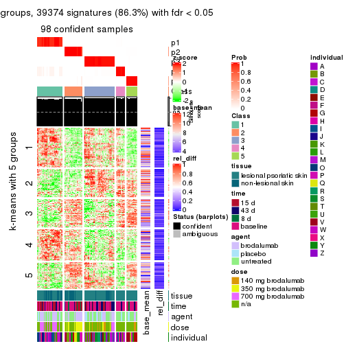</p>

</div>
<div id='tab-ATC-mclust-get-signatures-5'>
<pre><code class="r">get_signatures(res, k = 6)
</code></pre>

<p></p>

</div>
</div>


Signature heatmaps where rows are not scaled:


<script>
$( function() {
	$( '#tabs-ATC-mclust-get-signatures-no-scale' ).tabs();
} );
</script>
<div id='tabs-ATC-mclust-get-signatures-no-scale'>
<ul>
<li><a href='#tab-ATC-mclust-get-signatures-no-scale-1'>k = 2</a></li>
<li><a href='#tab-ATC-mclust-get-signatures-no-scale-2'>k = 3</a></li>
<li><a href='#tab-ATC-mclust-get-signatures-no-scale-3'>k = 4</a></li>
<li><a href='#tab-ATC-mclust-get-signatures-no-scale-4'>k = 5</a></li>
<li><a href='#tab-ATC-mclust-get-signatures-no-scale-5'>k = 6</a></li>
</ul>
<div id='tab-ATC-mclust-get-signatures-no-scale-1'>
<pre><code class="r">get_signatures(res, k = 2, scale_rows = FALSE)
</code></pre>

<p></p>

</div>
<div id='tab-ATC-mclust-get-signatures-no-scale-2'>
<pre><code class="r">get_signatures(res, k = 3, scale_rows = FALSE)
</code></pre>

<p>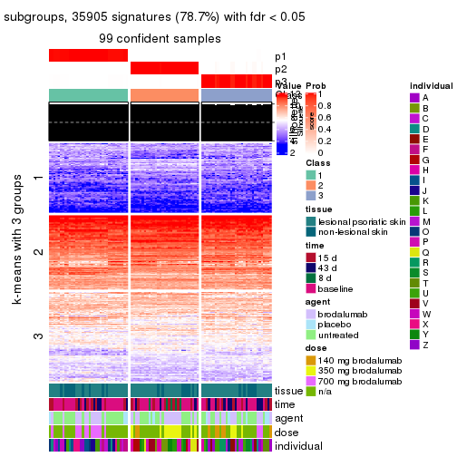</p>

</div>
<div id='tab-ATC-mclust-get-signatures-no-scale-3'>
<pre><code class="r">get_signatures(res, k = 4, scale_rows = FALSE)
</code></pre>

<p></p>

</div>
<div id='tab-ATC-mclust-get-signatures-no-scale-4'>
<pre><code class="r">get_signatures(res, k = 5, scale_rows = FALSE)
</code></pre>

<p></p>

</div>
<div id='tab-ATC-mclust-get-signatures-no-scale-5'>
<pre><code class="r">get_signatures(res, k = 6, scale_rows = FALSE)
</code></pre>

<p></p>

</div>
</div>


Compare the overlap of signatures from different k:

```r
compare_signatures(res)
```


`get_signature()` returns a data frame invisibly. TO get the list of signatures, the function
call should be assigned to a variable explicitly. In following code, if `plot` argument is set
to `FALSE`, no heatmap is plotted while only the differential analysis is performed.

```r
# code only for demonstration
tb = get_signature(res, k = ..., plot = FALSE)
```

An example of the output of `tb` is:

```
#>   which_row         fdr    mean_1    mean_2 scaled_mean_1 scaled_mean_2 km
#> 1        38 0.042760348  8.373488  9.131774    -0.5533452     0.5164555  1
#> 2        40 0.018707592  7.106213  8.469186    -0.6173731     0.5762149  1
#> 3        55 0.019134737 10.221463 11.207825    -0.6159697     0.5749050  1
#> 4        59 0.006059896  5.921854  7.869574    -0.6899429     0.6439467  1
#> 5        60 0.018055526  8.928898 10.211722    -0.6204761     0.5791110  1
#> 6        98 0.009384629 15.714769 14.887706     0.6635654    -0.6193277  2
...
```

The columns in `tb` are:

1. `which_row`: row indices corresponding to the input matrix.
2. `fdr`: FDR for the differential test. 
3. `mean_x`: The mean value in group x.
4. `scaled_mean_x`: The mean value in group x after rows are scaled.
5. `km`: Row groups if k-means clustering is applied to rows.


UMAP plot which shows how samples are separated.


<script>
$( function() {
	$( '#tabs-ATC-mclust-dimension-reduction' ).tabs();
} );
</script>
<div id='tabs-ATC-mclust-dimension-reduction'>
<ul>
<li><a href='#tab-ATC-mclust-dimension-reduction-1'>k = 2</a></li>
<li><a href='#tab-ATC-mclust-dimension-reduction-2'>k = 3</a></li>
<li><a href='#tab-ATC-mclust-dimension-reduction-3'>k = 4</a></li>
<li><a href='#tab-ATC-mclust-dimension-reduction-4'>k = 5</a></li>
<li><a href='#tab-ATC-mclust-dimension-reduction-5'>k = 6</a></li>
</ul>
<div id='tab-ATC-mclust-dimension-reduction-1'>
<pre><code class="r">dimension_reduction(res, k = 2, method = &quot;UMAP&quot;)
</code></pre>

<p></p>

</div>
<div id='tab-ATC-mclust-dimension-reduction-2'>
<pre><code class="r">dimension_reduction(res, k = 3, method = &quot;UMAP&quot;)
</code></pre>

<p></p>

</div>
<div id='tab-ATC-mclust-dimension-reduction-3'>
<pre><code class="r">dimension_reduction(res, k = 4, method = &quot;UMAP&quot;)
</code></pre>

<p></p>

</div>
<div id='tab-ATC-mclust-dimension-reduction-4'>
<pre><code class="r">dimension_reduction(res, k = 5, method = &quot;UMAP&quot;)
</code></pre>

<p></p>

</div>
<div id='tab-ATC-mclust-dimension-reduction-5'>
<pre><code class="r">dimension_reduction(res, k = 6, method = &quot;UMAP&quot;)
</code></pre>

<p></p>

</div>
</div>


Following heatmap shows how subgroups are split when increasing `k`:

```r
collect_classes(res)
```


Test correlation between subgroups and known annotations. If the known
annotation is numeric, one-way ANOVA test is applied, and if the known
annotation is discrete, chi-squared contingency table test is applied.

```r
test_to_known_factors(res)
```

```
#>             n tissue(p) time(p) agent(p)  dose(p) individual(p) k
#> ATC:mclust 99    1.0000 0.00374   0.6508 7.14e-05      1.73e-10 2
#> ATC:mclust 99    0.6663 0.01005   0.6784 9.51e-07      1.83e-16 3
#> ATC:mclust 99    0.0721 0.02007   0.2032 1.94e-09      5.15e-14 4
#> ATC:mclust 98    0.0137 0.02707   0.0705 5.50e-10      3.18e-10 5
#> ATC:mclust 92    0.0144 0.01068   0.0203 1.59e-08      3.81e-08 6
```


If matrix rows can be associated to genes, consider to use `functional_enrichment(res,
...)` to perform function enrichment for the signature genes. See [this vignette](http://bioconductor.org/packages/devel/bioc/vignettes/cola/inst/doc/functional_enrichment.html) for more detailed explanations.


 

---------------------------------------------------


### ATC:NMF**


The object with results only for a single top-value method and a single partition method 
can be extracted as:

```r
res = res_list["ATC", "NMF"]
# you can also extract it by
# res = res_list["ATC:NMF"]
```

A summary of `res` and all the functions that can be applied to it:

```r
res
```

```
#> A 'ConsensusPartition' object with k = 2, 3, 4, 5, 6.
#>   On a matrix with 45638 rows and 99 columns.
#>   Top rows (1000, 2000, 3000, 4000, 5000) are extracted by 'ATC' method.
#>   Subgroups are detected by 'NMF' method.
#>   Performed in total 1250 partitions by row resampling.
#>   Best k for subgroups seems to be 2.
#> 
#> Following methods can be applied to this 'ConsensusPartition' object:
#>  [1] "cola_report"             "collect_classes"         "collect_plots"          
#>  [4] "collect_stats"           "colnames"                "compare_signatures"     
#>  [7] "consensus_heatmap"       "dimension_reduction"     "functional_enrichment"  
#> [10] "get_anno_col"            "get_anno"                "get_classes"            
#> [13] "get_consensus"           "get_matrix"              "get_membership"         
#> [16] "get_param"               "get_signatures"          "get_stats"              
#> [19] "is_best_k"               "is_stable_k"             "membership_heatmap"     
#> [22] "ncol"                    "nrow"                    "plot_ecdf"              
#> [25] "rownames"                "select_partition_number" "show"                   
#> [28] "suggest_best_k"          "test_to_known_factors"
```

`collect_plots()` function collects all the plots made from `res` for all `k` (number of partitions)
into one single page to provide an easy and fast comparison between different `k`.

```r
collect_plots(res)
```


The plots are:

- The first row: a plot of the ECDF (empirical cumulative distribution
  function) curves of the consensus matrix for each `k` and the heatmap of
  predicted classes for each `k`.
- The second row: heatmaps of the consensus matrix for each `k`.
- The third row: heatmaps of the membership matrix for each `k`.
- The fouth row: heatmaps of the signatures for each `k`.

All the plots in panels can be made by individual functions and they are
plotted later in this section.

`select_partition_number()` produces several plots showing different
statistics for choosing "optimized" `k`. There are following statistics:

- ECDF curves of the consensus matrix for each `k`;
- 1-PAC. [The PAC
  score](https://en.wikipedia.org/wiki/Consensus_clustering#Over-interpretation_potential_of_consensus_clustering)
  measures the proportion of the ambiguous subgrouping.
- Mean silhouette score.
- Concordance. The mean probability of fiting the consensus class ids in all
  partitions.
- Area increased. Denote $A_k$ as the area under the ECDF curve for current
  `k`, the area increased is defined as $A_k - A_{k-1}$.
- Rand index. The percent of pairs of samples that are both in a same cluster
  or both are not in a same cluster in the partition of k and k-1.
- Jaccard index. The ratio of pairs of samples are both in a same cluster in
  the partition of k and k-1 and the pairs of samples are both in a same
  cluster in the partition k or k-1.

The detailed explanations of these statistics can be found in [the _cola_
vignette](http://bioconductor.org/packages/devel/bioc/vignettes/cola/inst/doc/cola.html#toc_13).

Generally speaking, lower PAC score, higher mean silhouette score or higher
concordance corresponds to better partition. Rand index and Jaccard index
measure how similar the current partition is compared to partition with `k-1`.
If they are too similar, we won't accept `k` is better than `k-1`.

```r
select_partition_number(res)
```


The numeric values for all these statistics can be obtained by `get_stats()`.

```r
get_stats(res)
```

```
#>   k 1-PAC mean_silhouette concordance area_increased  Rand Jaccard
#> 2 2 1.000           0.968       0.987         0.5021 0.499   0.499
#> 3 3 0.737           0.875       0.919         0.3069 0.770   0.567
#> 4 4 0.746           0.787       0.876         0.1107 0.864   0.633
#> 5 5 0.801           0.773       0.878         0.0578 0.921   0.725
#> 6 6 0.758           0.670       0.809         0.0398 0.946   0.774
```

`suggest_best_k()` suggests the best $k$ based on these statistics. The rules are as follows:

- All $k$ with Jaccard index larger than 0.95 are removed because increasing
  $k$ does not provide enough extra information. If all $k$ are removed, it is
  marked as no subgroup is detected.
- For all $k$ with 1-PAC score larger than 0.9, the maximal $k$ is taken as
  the best $k$, and other $k$ are marked as optional $k$.
- If it does not fit the second rule. The $k$ with the maximal vote of the
  highest 1-PAC score, highest mean silhouette, and highest concordance is
  taken as the best $k$.

```r
suggest_best_k(res)
```

```
#> [1] 2
```


Following shows the table of the partitions (You need to click the **show/hide
code output** link to see it). The membership matrix (columns with name `p*`)
is inferred by
[`clue::cl_consensus()`](https://www.rdocumentation.org/link/cl_consensus?package=clue)
function with the `SE` method. Basically the value in the membership matrix
represents the probability to belong to a certain group. The finall class
label for an item is determined with the group with highest probability it
belongs to.

In `get_classes()` function, the entropy is calculated from the membership
matrix and the silhouette score is calculated from the consensus matrix.


<script>
$( function() {
	$( '#tabs-ATC-NMF-get-classes' ).tabs();
} );
</script>
<div id='tabs-ATC-NMF-get-classes'>
<ul>
<li><a href='#tab-ATC-NMF-get-classes-1'>k = 2</a></li>
<li><a href='#tab-ATC-NMF-get-classes-2'>k = 3</a></li>
<li><a href='#tab-ATC-NMF-get-classes-3'>k = 4</a></li>
<li><a href='#tab-ATC-NMF-get-classes-4'>k = 5</a></li>
<li><a href='#tab-ATC-NMF-get-classes-5'>k = 6</a></li>
</ul>

<div id='tab-ATC-NMF-get-classes-1'>
<p><a id='tab-ATC-NMF-get-classes-1-a' style='color:#0366d6' href='#'>show/hide code output</a></p>
<pre><code class="r">cbind(get_classes(res, k = 2), get_membership(res, k = 2))
</code></pre>

<pre><code>#&gt;            class entropy silhouette    p1    p2
#&gt; GSM1296094     1  0.0000     0.9931 1.000 0.000
#&gt; GSM1296119     2  0.0000     0.9809 0.000 1.000
#&gt; GSM1296076     2  0.0000     0.9809 0.000 1.000
#&gt; GSM1296092     2  0.2778     0.9374 0.048 0.952
#&gt; GSM1296103     1  0.0000     0.9931 1.000 0.000
#&gt; GSM1296078     2  0.0000     0.9809 0.000 1.000
#&gt; GSM1296107     2  0.0000     0.9809 0.000 1.000
#&gt; GSM1296109     2  0.0000     0.9809 0.000 1.000
#&gt; GSM1296080     1  0.0000     0.9931 1.000 0.000
#&gt; GSM1296090     2  0.0000     0.9809 0.000 1.000
#&gt; GSM1296074     2  0.0000     0.9809 0.000 1.000
#&gt; GSM1296111     2  0.0000     0.9809 0.000 1.000
#&gt; GSM1296099     2  0.0000     0.9809 0.000 1.000
#&gt; GSM1296086     2  0.9993     0.0767 0.484 0.516
#&gt; GSM1296117     2  0.0000     0.9809 0.000 1.000
#&gt; GSM1296113     2  0.0000     0.9809 0.000 1.000
#&gt; GSM1296096     2  0.0000     0.9809 0.000 1.000
#&gt; GSM1296105     1  0.0000     0.9931 1.000 0.000
#&gt; GSM1296098     1  0.0000     0.9931 1.000 0.000
#&gt; GSM1296101     1  0.0000     0.9931 1.000 0.000
#&gt; GSM1296121     2  0.0000     0.9809 0.000 1.000
#&gt; GSM1296088     1  0.0000     0.9931 1.000 0.000
#&gt; GSM1296082     2  0.0000     0.9809 0.000 1.000
#&gt; GSM1296115     2  0.0000     0.9809 0.000 1.000
#&gt; GSM1296084     1  0.0000     0.9931 1.000 0.000
#&gt; GSM1296072     2  0.0000     0.9809 0.000 1.000
#&gt; GSM1296069     2  0.0000     0.9809 0.000 1.000
#&gt; GSM1296071     2  0.0000     0.9809 0.000 1.000
#&gt; GSM1296070     2  0.0000     0.9809 0.000 1.000
#&gt; GSM1296073     2  0.0000     0.9809 0.000 1.000
#&gt; GSM1296034     1  0.0000     0.9931 1.000 0.000
#&gt; GSM1296041     2  0.0000     0.9809 0.000 1.000
#&gt; GSM1296035     2  0.7602     0.7222 0.220 0.780
#&gt; GSM1296038     2  0.0000     0.9809 0.000 1.000
#&gt; GSM1296047     2  0.0000     0.9809 0.000 1.000
#&gt; GSM1296039     2  0.0000     0.9809 0.000 1.000
#&gt; GSM1296042     2  0.0000     0.9809 0.000 1.000
#&gt; GSM1296043     2  0.0000     0.9809 0.000 1.000
#&gt; GSM1296037     1  0.0000     0.9931 1.000 0.000
#&gt; GSM1296046     2  0.0000     0.9809 0.000 1.000
#&gt; GSM1296044     2  0.0000     0.9809 0.000 1.000
#&gt; GSM1296045     2  0.0000     0.9809 0.000 1.000
#&gt; GSM1296025     1  0.0000     0.9931 1.000 0.000
#&gt; GSM1296033     1  0.0000     0.9931 1.000 0.000
#&gt; GSM1296027     1  0.0000     0.9931 1.000 0.000
#&gt; GSM1296032     1  0.0000     0.9931 1.000 0.000
#&gt; GSM1296024     1  0.0000     0.9931 1.000 0.000
#&gt; GSM1296031     1  0.0000     0.9931 1.000 0.000
#&gt; GSM1296028     1  0.0000     0.9931 1.000 0.000
#&gt; GSM1296029     1  0.0000     0.9931 1.000 0.000
#&gt; GSM1296026     1  0.0000     0.9931 1.000 0.000
#&gt; GSM1296030     1  0.0000     0.9931 1.000 0.000
#&gt; GSM1296040     1  0.0000     0.9931 1.000 0.000
#&gt; GSM1296036     1  0.0000     0.9931 1.000 0.000
#&gt; GSM1296048     2  0.0000     0.9809 0.000 1.000
#&gt; GSM1296059     1  0.0000     0.9931 1.000 0.000
#&gt; GSM1296066     2  0.0000     0.9809 0.000 1.000
#&gt; GSM1296060     2  0.6712     0.7872 0.176 0.824
#&gt; GSM1296063     2  0.0000     0.9809 0.000 1.000
#&gt; GSM1296064     2  0.0000     0.9809 0.000 1.000
#&gt; GSM1296067     2  0.0376     0.9775 0.004 0.996
#&gt; GSM1296062     1  0.0000     0.9931 1.000 0.000
#&gt; GSM1296068     2  0.0000     0.9809 0.000 1.000
#&gt; GSM1296050     1  0.0000     0.9931 1.000 0.000
#&gt; GSM1296057     1  0.0000     0.9931 1.000 0.000
#&gt; GSM1296052     1  0.0000     0.9931 1.000 0.000
#&gt; GSM1296054     1  0.0000     0.9931 1.000 0.000
#&gt; GSM1296049     1  0.0000     0.9931 1.000 0.000
#&gt; GSM1296055     1  0.8443     0.6119 0.728 0.272
#&gt; GSM1296053     1  0.0000     0.9931 1.000 0.000
#&gt; GSM1296058     1  0.0000     0.9931 1.000 0.000
#&gt; GSM1296051     2  0.0000     0.9809 0.000 1.000
#&gt; GSM1296056     2  0.0000     0.9809 0.000 1.000
#&gt; GSM1296065     2  0.0000     0.9809 0.000 1.000
#&gt; GSM1296061     1  0.0000     0.9931 1.000 0.000
#&gt; GSM1296095     2  0.0000     0.9809 0.000 1.000
#&gt; GSM1296120     2  0.0000     0.9809 0.000 1.000
#&gt; GSM1296077     1  0.0000     0.9931 1.000 0.000
#&gt; GSM1296093     1  0.0000     0.9931 1.000 0.000
#&gt; GSM1296104     2  0.0000     0.9809 0.000 1.000
#&gt; GSM1296079     1  0.0000     0.9931 1.000 0.000
#&gt; GSM1296108     2  0.0000     0.9809 0.000 1.000
#&gt; GSM1296110     2  0.0000     0.9809 0.000 1.000
#&gt; GSM1296081     1  0.0000     0.9931 1.000 0.000
#&gt; GSM1296091     1  0.0000     0.9931 1.000 0.000
#&gt; GSM1296075     2  0.0000     0.9809 0.000 1.000
#&gt; GSM1296112     2  0.0000     0.9809 0.000 1.000
#&gt; GSM1296100     1  0.0000     0.9931 1.000 0.000
#&gt; GSM1296087     1  0.0000     0.9931 1.000 0.000
#&gt; GSM1296118     2  0.0000     0.9809 0.000 1.000
#&gt; GSM1296114     2  0.0000     0.9809 0.000 1.000
#&gt; GSM1296097     2  0.3584     0.9173 0.068 0.932
#&gt; GSM1296106     1  0.1414     0.9732 0.980 0.020
#&gt; GSM1296102     1  0.0000     0.9931 1.000 0.000
#&gt; GSM1296122     2  0.0000     0.9809 0.000 1.000
#&gt; GSM1296089     1  0.0000     0.9931 1.000 0.000
#&gt; GSM1296083     1  0.0000     0.9931 1.000 0.000
#&gt; GSM1296116     2  0.0000     0.9809 0.000 1.000
#&gt; GSM1296085     1  0.0000     0.9931 1.000 0.000
</code></pre>

<script>
$('#tab-ATC-NMF-get-classes-1-a').parent().next().next().hide();
$('#tab-ATC-NMF-get-classes-1-a').click(function(){
  $('#tab-ATC-NMF-get-classes-1-a').parent().next().next().toggle();
  return(false);
});
</script>
</div>

<div id='tab-ATC-NMF-get-classes-2'>
<p><a id='tab-ATC-NMF-get-classes-2-a' style='color:#0366d6' href='#'>show/hide code output</a></p>
<pre><code class="r">cbind(get_classes(res, k = 3), get_membership(res, k = 3))
</code></pre>

<pre><code>#&gt;            class entropy silhouette    p1    p2    p3
#&gt; GSM1296094     3  0.4178    0.79923 0.172 0.000 0.828
#&gt; GSM1296119     2  0.3340    0.92267 0.000 0.880 0.120
#&gt; GSM1296076     2  0.4121    0.88921 0.000 0.832 0.168
#&gt; GSM1296092     3  0.2050    0.85120 0.020 0.028 0.952
#&gt; GSM1296103     3  0.3686    0.82018 0.140 0.000 0.860
#&gt; GSM1296078     2  0.4291    0.87696 0.000 0.820 0.180
#&gt; GSM1296107     2  0.3412    0.92159 0.000 0.876 0.124
#&gt; GSM1296109     3  0.1753    0.84467 0.000 0.048 0.952
#&gt; GSM1296080     1  0.0424    0.96359 0.992 0.000 0.008
#&gt; GSM1296090     3  0.2448    0.82808 0.000 0.076 0.924
#&gt; GSM1296074     3  0.6095    0.22939 0.000 0.392 0.608
#&gt; GSM1296111     2  0.3412    0.92159 0.000 0.876 0.124
#&gt; GSM1296099     3  0.1643    0.84598 0.000 0.044 0.956
#&gt; GSM1296086     3  0.2400    0.85235 0.064 0.004 0.932
#&gt; GSM1296117     2  0.3482    0.91997 0.000 0.872 0.128
#&gt; GSM1296113     2  0.3267    0.92343 0.000 0.884 0.116
#&gt; GSM1296096     3  0.1753    0.84467 0.000 0.048 0.952
#&gt; GSM1296105     1  0.1031    0.95300 0.976 0.000 0.024
#&gt; GSM1296098     3  0.4452    0.78306 0.192 0.000 0.808
#&gt; GSM1296101     3  0.4062    0.80509 0.164 0.000 0.836
#&gt; GSM1296121     2  0.3482    0.91997 0.000 0.872 0.128
#&gt; GSM1296088     3  0.4974    0.74008 0.236 0.000 0.764
#&gt; GSM1296082     3  0.1753    0.84467 0.000 0.048 0.952
#&gt; GSM1296115     2  0.3551    0.91793 0.000 0.868 0.132
#&gt; GSM1296084     1  0.1031    0.95292 0.976 0.000 0.024
#&gt; GSM1296072     2  0.1031    0.91649 0.000 0.976 0.024
#&gt; GSM1296069     2  0.2959    0.92523 0.000 0.900 0.100
#&gt; GSM1296071     2  0.0000    0.90988 0.000 1.000 0.000
#&gt; GSM1296070     2  0.2959    0.92523 0.000 0.900 0.100
#&gt; GSM1296073     2  0.3551    0.91793 0.000 0.868 0.132
#&gt; GSM1296034     1  0.0237    0.96520 0.996 0.000 0.004
#&gt; GSM1296041     2  0.3412    0.92159 0.000 0.876 0.124
#&gt; GSM1296035     3  0.2339    0.85454 0.048 0.012 0.940
#&gt; GSM1296038     3  0.1753    0.84467 0.000 0.048 0.952
#&gt; GSM1296047     2  0.1163    0.89566 0.000 0.972 0.028
#&gt; GSM1296039     3  0.2261    0.83292 0.000 0.068 0.932
#&gt; GSM1296042     2  0.2959    0.92523 0.000 0.900 0.100
#&gt; GSM1296043     2  0.2796    0.92521 0.000 0.908 0.092
#&gt; GSM1296037     1  0.0424    0.96359 0.992 0.000 0.008
#&gt; GSM1296046     2  0.0000    0.90988 0.000 1.000 0.000
#&gt; GSM1296044     2  0.0747    0.91470 0.000 0.984 0.016
#&gt; GSM1296045     2  0.2625    0.92483 0.000 0.916 0.084
#&gt; GSM1296025     1  0.0424    0.96248 0.992 0.000 0.008
#&gt; GSM1296033     1  0.0237    0.96520 0.996 0.000 0.004
#&gt; GSM1296027     1  0.0000    0.96560 1.000 0.000 0.000
#&gt; GSM1296032     1  0.0424    0.96248 0.992 0.000 0.008
#&gt; GSM1296024     1  0.0237    0.96426 0.996 0.000 0.004
#&gt; GSM1296031     1  0.0000    0.96560 1.000 0.000 0.000
#&gt; GSM1296028     1  0.0000    0.96560 1.000 0.000 0.000
#&gt; GSM1296029     1  0.0000    0.96560 1.000 0.000 0.000
#&gt; GSM1296026     1  0.0000    0.96560 1.000 0.000 0.000
#&gt; GSM1296030     1  0.0237    0.96520 0.996 0.000 0.004
#&gt; GSM1296040     3  0.4235    0.79640 0.176 0.000 0.824
#&gt; GSM1296036     1  0.6274   -0.00745 0.544 0.000 0.456
#&gt; GSM1296048     2  0.3412    0.92159 0.000 0.876 0.124
#&gt; GSM1296059     3  0.3816    0.81570 0.148 0.000 0.852
#&gt; GSM1296066     2  0.3340    0.92267 0.000 0.880 0.120
#&gt; GSM1296060     3  0.2527    0.85466 0.044 0.020 0.936
#&gt; GSM1296063     2  0.3752    0.90991 0.000 0.856 0.144
#&gt; GSM1296064     3  0.2625    0.82029 0.000 0.084 0.916
#&gt; GSM1296067     2  0.2383    0.87384 0.016 0.940 0.044
#&gt; GSM1296062     3  0.5016    0.72989 0.240 0.000 0.760
#&gt; GSM1296068     2  0.1031    0.89810 0.000 0.976 0.024
#&gt; GSM1296050     1  0.5069    0.78983 0.828 0.128 0.044
#&gt; GSM1296057     3  0.6280    0.27951 0.460 0.000 0.540
#&gt; GSM1296052     1  0.0000    0.96560 1.000 0.000 0.000
#&gt; GSM1296054     1  0.0000    0.96560 1.000 0.000 0.000
#&gt; GSM1296049     1  0.0424    0.96248 0.992 0.000 0.008
#&gt; GSM1296055     1  0.3845    0.82163 0.872 0.116 0.012
#&gt; GSM1296053     1  0.0237    0.96520 0.996 0.000 0.004
#&gt; GSM1296058     3  0.4452    0.78306 0.192 0.000 0.808
#&gt; GSM1296051     2  0.3619    0.91565 0.000 0.864 0.136
#&gt; GSM1296056     3  0.1643    0.84598 0.000 0.044 0.956
#&gt; GSM1296065     2  0.3619    0.91563 0.000 0.864 0.136
#&gt; GSM1296061     1  0.1860    0.92615 0.948 0.000 0.052
#&gt; GSM1296095     3  0.5497    0.50749 0.000 0.292 0.708
#&gt; GSM1296120     2  0.0424    0.90634 0.000 0.992 0.008
#&gt; GSM1296077     1  0.0747    0.95726 0.984 0.000 0.016
#&gt; GSM1296093     1  0.0237    0.96520 0.996 0.000 0.004
#&gt; GSM1296104     2  0.5529    0.70795 0.000 0.704 0.296
#&gt; GSM1296079     1  0.1129    0.95138 0.976 0.004 0.020
#&gt; GSM1296108     2  0.0000    0.90988 0.000 1.000 0.000
#&gt; GSM1296110     2  0.0592    0.90440 0.000 0.988 0.012
#&gt; GSM1296081     1  0.0237    0.96520 0.996 0.000 0.004
#&gt; GSM1296091     1  0.0000    0.96560 1.000 0.000 0.000
#&gt; GSM1296075     2  0.2063    0.87980 0.008 0.948 0.044
#&gt; GSM1296112     2  0.0892    0.90027 0.000 0.980 0.020
#&gt; GSM1296100     1  0.0892    0.95609 0.980 0.000 0.020
#&gt; GSM1296087     1  0.0000    0.96560 1.000 0.000 0.000
#&gt; GSM1296118     2  0.1643    0.88509 0.000 0.956 0.044
#&gt; GSM1296114     2  0.0747    0.91479 0.000 0.984 0.016
#&gt; GSM1296097     3  0.4712    0.81147 0.044 0.108 0.848
#&gt; GSM1296106     1  0.1289    0.94071 0.968 0.032 0.000
#&gt; GSM1296102     1  0.0592    0.96150 0.988 0.000 0.012
#&gt; GSM1296122     2  0.1878    0.88230 0.004 0.952 0.044
#&gt; GSM1296089     1  0.0424    0.96248 0.992 0.000 0.008
#&gt; GSM1296083     1  0.0237    0.96520 0.996 0.000 0.004
#&gt; GSM1296116     2  0.0000    0.90988 0.000 1.000 0.000
#&gt; GSM1296085     1  0.0000    0.96560 1.000 0.000 0.000
</code></pre>

<script>
$('#tab-ATC-NMF-get-classes-2-a').parent().next().next().hide();
$('#tab-ATC-NMF-get-classes-2-a').click(function(){
  $('#tab-ATC-NMF-get-classes-2-a').parent().next().next().toggle();
  return(false);
});
</script>
</div>

<div id='tab-ATC-NMF-get-classes-3'>
<p><a id='tab-ATC-NMF-get-classes-3-a' style='color:#0366d6' href='#'>show/hide code output</a></p>
<pre><code class="r">cbind(get_classes(res, k = 4), get_membership(res, k = 4))
</code></pre>

<pre><code>#&gt;            class entropy silhouette    p1    p2    p3    p4
#&gt; GSM1296094     3  0.1174     0.7859 0.012 0.000 0.968 0.020
#&gt; GSM1296119     2  0.1792     0.8742 0.000 0.932 0.000 0.068
#&gt; GSM1296076     4  0.4137     0.7527 0.000 0.208 0.012 0.780
#&gt; GSM1296092     4  0.4400     0.7529 0.012 0.036 0.136 0.816
#&gt; GSM1296103     3  0.1716     0.7778 0.000 0.000 0.936 0.064
#&gt; GSM1296078     4  0.4098     0.7563 0.000 0.204 0.012 0.784
#&gt; GSM1296107     2  0.1792     0.8742 0.000 0.932 0.000 0.068
#&gt; GSM1296109     3  0.2489     0.7735 0.000 0.020 0.912 0.068
#&gt; GSM1296080     1  0.0817     0.9407 0.976 0.000 0.024 0.000
#&gt; GSM1296090     4  0.4327     0.7846 0.004 0.104 0.068 0.824
#&gt; GSM1296074     4  0.3969     0.7771 0.000 0.180 0.016 0.804
#&gt; GSM1296111     2  0.1867     0.8724 0.000 0.928 0.000 0.072
#&gt; GSM1296099     3  0.2345     0.7623 0.000 0.000 0.900 0.100
#&gt; GSM1296086     4  0.4441     0.7471 0.020 0.028 0.136 0.816
#&gt; GSM1296117     2  0.2011     0.8676 0.000 0.920 0.000 0.080
#&gt; GSM1296113     2  0.1716     0.8755 0.000 0.936 0.000 0.064
#&gt; GSM1296096     3  0.3801     0.6224 0.000 0.000 0.780 0.220
#&gt; GSM1296105     3  0.6107     0.6115 0.264 0.000 0.648 0.088
#&gt; GSM1296098     3  0.2589     0.7688 0.044 0.000 0.912 0.044
#&gt; GSM1296101     3  0.1452     0.7848 0.008 0.000 0.956 0.036
#&gt; GSM1296121     2  0.1867     0.8724 0.000 0.928 0.000 0.072
#&gt; GSM1296088     4  0.5267     0.5634 0.240 0.000 0.048 0.712
#&gt; GSM1296082     4  0.4312     0.7642 0.000 0.056 0.132 0.812
#&gt; GSM1296115     2  0.2469     0.8460 0.000 0.892 0.000 0.108
#&gt; GSM1296084     1  0.2081     0.8977 0.916 0.000 0.000 0.084
#&gt; GSM1296072     2  0.0336     0.8789 0.000 0.992 0.000 0.008
#&gt; GSM1296069     2  0.1637     0.8764 0.000 0.940 0.000 0.060
#&gt; GSM1296071     2  0.0336     0.8758 0.000 0.992 0.000 0.008
#&gt; GSM1296070     2  0.1389     0.8786 0.000 0.952 0.000 0.048
#&gt; GSM1296073     2  0.3172     0.7919 0.000 0.840 0.000 0.160
#&gt; GSM1296034     1  0.4511     0.5634 0.724 0.000 0.268 0.008
#&gt; GSM1296041     2  0.1867     0.8724 0.000 0.928 0.000 0.072
#&gt; GSM1296035     3  0.2589     0.7493 0.000 0.000 0.884 0.116
#&gt; GSM1296038     3  0.2530     0.7546 0.000 0.000 0.888 0.112
#&gt; GSM1296047     2  0.1022     0.8663 0.000 0.968 0.000 0.032
#&gt; GSM1296039     4  0.5861     0.6114 0.000 0.060 0.296 0.644
#&gt; GSM1296042     2  0.1389     0.8786 0.000 0.952 0.000 0.048
#&gt; GSM1296043     2  0.0921     0.8800 0.000 0.972 0.000 0.028
#&gt; GSM1296037     3  0.6249     0.4895 0.352 0.000 0.580 0.068
#&gt; GSM1296046     2  0.0188     0.8784 0.000 0.996 0.000 0.004
#&gt; GSM1296044     2  0.0000     0.8777 0.000 1.000 0.000 0.000
#&gt; GSM1296045     2  0.0921     0.8800 0.000 0.972 0.000 0.028
#&gt; GSM1296025     1  0.0376     0.9505 0.992 0.000 0.004 0.004
#&gt; GSM1296033     1  0.3311     0.8028 0.828 0.000 0.000 0.172
#&gt; GSM1296027     1  0.0336     0.9505 0.992 0.000 0.000 0.008
#&gt; GSM1296032     1  0.0336     0.9505 0.992 0.000 0.000 0.008
#&gt; GSM1296024     1  0.0524     0.9492 0.988 0.000 0.008 0.004
#&gt; GSM1296031     1  0.0000     0.9514 1.000 0.000 0.000 0.000
#&gt; GSM1296028     1  0.0469     0.9491 0.988 0.000 0.000 0.012
#&gt; GSM1296029     1  0.0000     0.9514 1.000 0.000 0.000 0.000
#&gt; GSM1296026     1  0.2281     0.8885 0.904 0.000 0.000 0.096
#&gt; GSM1296030     1  0.1389     0.9271 0.952 0.000 0.000 0.048
#&gt; GSM1296040     3  0.0592     0.7845 0.016 0.000 0.984 0.000
#&gt; GSM1296036     3  0.4411     0.7267 0.108 0.000 0.812 0.080
#&gt; GSM1296048     2  0.1792     0.8742 0.000 0.932 0.000 0.068
#&gt; GSM1296059     3  0.1716     0.7778 0.000 0.000 0.936 0.064
#&gt; GSM1296066     2  0.1716     0.8755 0.000 0.936 0.000 0.064
#&gt; GSM1296060     3  0.2149     0.7683 0.000 0.000 0.912 0.088
#&gt; GSM1296063     2  0.4950     0.3690 0.000 0.620 0.004 0.376
#&gt; GSM1296064     4  0.6654     0.5971 0.000 0.296 0.116 0.588
#&gt; GSM1296067     2  0.3304     0.7817 0.008 0.864 0.008 0.120
#&gt; GSM1296062     3  0.1637     0.7786 0.060 0.000 0.940 0.000
#&gt; GSM1296068     2  0.1022     0.8660 0.000 0.968 0.000 0.032
#&gt; GSM1296050     1  0.2245     0.9200 0.932 0.020 0.008 0.040
#&gt; GSM1296057     3  0.5008     0.6277 0.040 0.000 0.732 0.228
#&gt; GSM1296052     1  0.0336     0.9505 0.992 0.000 0.000 0.008
#&gt; GSM1296054     1  0.0336     0.9498 0.992 0.000 0.008 0.000
#&gt; GSM1296049     1  0.0000     0.9514 1.000 0.000 0.000 0.000
#&gt; GSM1296055     2  0.9253     0.0456 0.308 0.408 0.144 0.140
#&gt; GSM1296053     1  0.0469     0.9482 0.988 0.000 0.012 0.000
#&gt; GSM1296058     3  0.2521     0.7823 0.024 0.000 0.912 0.064
#&gt; GSM1296051     4  0.4387     0.7426 0.024 0.200 0.000 0.776
#&gt; GSM1296056     4  0.4907     0.3318 0.000 0.000 0.420 0.580
#&gt; GSM1296065     2  0.4313     0.6362 0.000 0.736 0.004 0.260
#&gt; GSM1296061     3  0.5072     0.6738 0.208 0.000 0.740 0.052
#&gt; GSM1296095     3  0.6224     0.4496 0.000 0.188 0.668 0.144
#&gt; GSM1296120     2  0.0336     0.8758 0.000 0.992 0.000 0.008
#&gt; GSM1296077     1  0.0188     0.9510 0.996 0.000 0.000 0.004
#&gt; GSM1296093     1  0.0592     0.9461 0.984 0.000 0.016 0.000
#&gt; GSM1296104     2  0.6835     0.2189 0.000 0.560 0.124 0.316
#&gt; GSM1296079     1  0.0336     0.9508 0.992 0.000 0.000 0.008
#&gt; GSM1296108     2  0.0921     0.8679 0.000 0.972 0.000 0.028
#&gt; GSM1296110     2  0.1792     0.8438 0.000 0.932 0.000 0.068
#&gt; GSM1296081     1  0.0336     0.9498 0.992 0.000 0.008 0.000
#&gt; GSM1296091     1  0.4220     0.6922 0.748 0.000 0.004 0.248
#&gt; GSM1296075     2  0.7330     0.3021 0.180 0.564 0.008 0.248
#&gt; GSM1296112     2  0.1022     0.8660 0.000 0.968 0.000 0.032
#&gt; GSM1296100     3  0.6022     0.6171 0.260 0.000 0.656 0.084
#&gt; GSM1296087     1  0.1211     0.9340 0.960 0.000 0.000 0.040
#&gt; GSM1296118     2  0.1792     0.8438 0.000 0.932 0.000 0.068
#&gt; GSM1296114     2  0.0336     0.8758 0.000 0.992 0.000 0.008
#&gt; GSM1296097     3  0.1585     0.7799 0.004 0.004 0.952 0.040
#&gt; GSM1296106     3  0.8959     0.4466 0.236 0.132 0.484 0.148
#&gt; GSM1296102     3  0.6366     0.6130 0.240 0.000 0.640 0.120
#&gt; GSM1296122     2  0.1940     0.8375 0.000 0.924 0.000 0.076
#&gt; GSM1296089     1  0.0188     0.9510 0.996 0.000 0.000 0.004
#&gt; GSM1296083     1  0.0469     0.9482 0.988 0.000 0.012 0.000
#&gt; GSM1296116     2  0.0592     0.8731 0.000 0.984 0.000 0.016
#&gt; GSM1296085     1  0.0000     0.9514 1.000 0.000 0.000 0.000
</code></pre>

<script>
$('#tab-ATC-NMF-get-classes-3-a').parent().next().next().hide();
$('#tab-ATC-NMF-get-classes-3-a').click(function(){
  $('#tab-ATC-NMF-get-classes-3-a').parent().next().next().toggle();
  return(false);
});
</script>
</div>

<div id='tab-ATC-NMF-get-classes-4'>
<p><a id='tab-ATC-NMF-get-classes-4-a' style='color:#0366d6' href='#'>show/hide code output</a></p>
<pre><code class="r">cbind(get_classes(res, k = 5), get_membership(res, k = 5))
</code></pre>

<pre><code>#&gt;            class entropy silhouette    p1    p2    p3    p4    p5
#&gt; GSM1296094     3  0.0510     0.7480 0.016 0.000 0.984 0.000 0.000
#&gt; GSM1296119     2  0.0794     0.9683 0.000 0.972 0.000 0.028 0.000
#&gt; GSM1296076     4  0.2377     0.6477 0.000 0.128 0.000 0.872 0.000
#&gt; GSM1296092     4  0.1200     0.6818 0.012 0.008 0.016 0.964 0.000
#&gt; GSM1296103     3  0.0290     0.7489 0.000 0.000 0.992 0.008 0.000
#&gt; GSM1296078     4  0.1965     0.6675 0.000 0.096 0.000 0.904 0.000
#&gt; GSM1296107     2  0.0510     0.9727 0.000 0.984 0.000 0.016 0.000
#&gt; GSM1296109     3  0.3530     0.5260 0.000 0.204 0.784 0.012 0.000
#&gt; GSM1296080     1  0.1914     0.9082 0.928 0.000 0.056 0.008 0.008
#&gt; GSM1296090     4  0.1362     0.6818 0.012 0.008 0.016 0.960 0.004
#&gt; GSM1296074     4  0.1393     0.6823 0.000 0.024 0.008 0.956 0.012
#&gt; GSM1296111     2  0.0794     0.9680 0.000 0.972 0.000 0.028 0.000
#&gt; GSM1296099     3  0.3339     0.7108 0.000 0.000 0.836 0.124 0.040
#&gt; GSM1296086     4  0.1982     0.6733 0.036 0.004 0.024 0.932 0.004
#&gt; GSM1296117     2  0.0880     0.9658 0.000 0.968 0.000 0.032 0.000
#&gt; GSM1296113     2  0.0404     0.9750 0.000 0.988 0.000 0.012 0.000
#&gt; GSM1296096     3  0.3650     0.6745 0.000 0.000 0.796 0.176 0.028
#&gt; GSM1296105     3  0.3990     0.4869 0.308 0.000 0.688 0.000 0.004
#&gt; GSM1296098     3  0.1798     0.7336 0.064 0.000 0.928 0.004 0.004
#&gt; GSM1296101     3  0.0162     0.7480 0.004 0.000 0.996 0.000 0.000
#&gt; GSM1296121     2  0.0880     0.9659 0.000 0.968 0.000 0.032 0.000
#&gt; GSM1296088     4  0.3940     0.5191 0.208 0.000 0.016 0.768 0.008
#&gt; GSM1296082     4  0.1393     0.6750 0.000 0.008 0.024 0.956 0.012
#&gt; GSM1296115     2  0.0963     0.9643 0.000 0.964 0.000 0.036 0.000
#&gt; GSM1296084     1  0.1697     0.9208 0.932 0.000 0.000 0.060 0.008
#&gt; GSM1296072     2  0.0865     0.9742 0.000 0.972 0.000 0.004 0.024
#&gt; GSM1296069     2  0.0162     0.9752 0.000 0.996 0.000 0.004 0.000
#&gt; GSM1296071     2  0.0566     0.9737 0.000 0.984 0.000 0.004 0.012
#&gt; GSM1296070     2  0.0162     0.9752 0.000 0.996 0.000 0.004 0.000
#&gt; GSM1296073     2  0.1270     0.9503 0.000 0.948 0.000 0.052 0.000
#&gt; GSM1296034     1  0.3183     0.7867 0.828 0.000 0.156 0.000 0.016
#&gt; GSM1296041     2  0.0880     0.9658 0.000 0.968 0.000 0.032 0.000
#&gt; GSM1296035     3  0.3714     0.6977 0.000 0.000 0.812 0.132 0.056
#&gt; GSM1296038     3  0.3814     0.6910 0.000 0.000 0.808 0.124 0.068
#&gt; GSM1296047     2  0.1341     0.9548 0.000 0.944 0.000 0.000 0.056
#&gt; GSM1296039     4  0.5635     0.5142 0.000 0.112 0.156 0.696 0.036
#&gt; GSM1296042     2  0.0162     0.9752 0.000 0.996 0.000 0.004 0.000
#&gt; GSM1296043     2  0.0162     0.9752 0.000 0.996 0.000 0.004 0.000
#&gt; GSM1296037     5  0.4584     0.5753 0.056 0.000 0.228 0.000 0.716
#&gt; GSM1296046     2  0.0404     0.9746 0.000 0.988 0.000 0.000 0.012
#&gt; GSM1296044     2  0.0566     0.9737 0.000 0.984 0.000 0.004 0.012
#&gt; GSM1296045     2  0.0566     0.9750 0.000 0.984 0.000 0.004 0.012
#&gt; GSM1296025     1  0.1341     0.9235 0.944 0.000 0.000 0.000 0.056
#&gt; GSM1296033     1  0.3455     0.7518 0.784 0.000 0.000 0.208 0.008
#&gt; GSM1296027     1  0.0955     0.9347 0.968 0.000 0.000 0.028 0.004
#&gt; GSM1296032     1  0.1195     0.9353 0.960 0.000 0.000 0.012 0.028
#&gt; GSM1296024     1  0.1341     0.9235 0.944 0.000 0.000 0.000 0.056
#&gt; GSM1296031     1  0.1608     0.9227 0.928 0.000 0.000 0.000 0.072
#&gt; GSM1296028     1  0.1043     0.9316 0.960 0.000 0.000 0.040 0.000
#&gt; GSM1296029     1  0.0703     0.9350 0.976 0.000 0.000 0.024 0.000
#&gt; GSM1296026     1  0.2046     0.9178 0.916 0.000 0.000 0.068 0.016
#&gt; GSM1296030     1  0.1697     0.9202 0.932 0.000 0.000 0.060 0.008
#&gt; GSM1296040     3  0.0290     0.7479 0.008 0.000 0.992 0.000 0.000
#&gt; GSM1296036     3  0.3707     0.6033 0.220 0.000 0.768 0.004 0.008
#&gt; GSM1296048     2  0.0880     0.9671 0.000 0.968 0.000 0.032 0.000
#&gt; GSM1296059     3  0.1386     0.7466 0.000 0.000 0.952 0.032 0.016
#&gt; GSM1296066     2  0.0290     0.9745 0.000 0.992 0.000 0.008 0.000
#&gt; GSM1296060     3  0.3416     0.7107 0.000 0.000 0.840 0.088 0.072
#&gt; GSM1296063     4  0.4978     0.1602 0.000 0.476 0.000 0.496 0.028
#&gt; GSM1296064     4  0.5386     0.4030 0.000 0.332 0.028 0.612 0.028
#&gt; GSM1296067     2  0.2286     0.8946 0.000 0.888 0.000 0.004 0.108
#&gt; GSM1296062     3  0.1908     0.7256 0.092 0.000 0.908 0.000 0.000
#&gt; GSM1296068     2  0.0771     0.9711 0.000 0.976 0.000 0.004 0.020
#&gt; GSM1296050     5  0.4651     0.1822 0.372 0.000 0.000 0.020 0.608
#&gt; GSM1296057     5  0.5088     0.5680 0.000 0.000 0.252 0.080 0.668
#&gt; GSM1296052     1  0.0955     0.9347 0.968 0.000 0.000 0.028 0.004
#&gt; GSM1296054     1  0.0898     0.9347 0.972 0.000 0.008 0.000 0.020
#&gt; GSM1296049     1  0.1197     0.9288 0.952 0.000 0.000 0.000 0.048
#&gt; GSM1296055     5  0.2507     0.6180 0.020 0.000 0.044 0.028 0.908
#&gt; GSM1296053     1  0.0566     0.9359 0.984 0.000 0.004 0.000 0.012
#&gt; GSM1296058     3  0.4431     0.6360 0.004 0.000 0.760 0.068 0.168
#&gt; GSM1296051     4  0.1913     0.6763 0.024 0.020 0.000 0.936 0.020
#&gt; GSM1296056     4  0.4885     0.3845 0.000 0.000 0.276 0.668 0.056
#&gt; GSM1296065     5  0.6019     0.3665 0.000 0.064 0.036 0.308 0.592
#&gt; GSM1296061     3  0.3796     0.5072 0.300 0.000 0.700 0.000 0.000
#&gt; GSM1296095     3  0.5182     0.5413 0.000 0.000 0.680 0.208 0.112
#&gt; GSM1296120     2  0.1041     0.9706 0.000 0.964 0.000 0.004 0.032
#&gt; GSM1296077     1  0.1965     0.9076 0.904 0.000 0.000 0.000 0.096
#&gt; GSM1296093     1  0.0912     0.9342 0.972 0.000 0.012 0.000 0.016
#&gt; GSM1296104     5  0.5730     0.5472 0.000 0.008 0.136 0.212 0.644
#&gt; GSM1296079     1  0.1908     0.9101 0.908 0.000 0.000 0.000 0.092
#&gt; GSM1296108     2  0.0771     0.9711 0.000 0.976 0.000 0.004 0.020
#&gt; GSM1296110     2  0.0579     0.9732 0.000 0.984 0.000 0.008 0.008
#&gt; GSM1296081     1  0.0510     0.9348 0.984 0.000 0.000 0.000 0.016
#&gt; GSM1296091     4  0.5165     0.2541 0.376 0.000 0.000 0.576 0.048
#&gt; GSM1296075     4  0.7110     0.0265 0.020 0.216 0.000 0.388 0.376
#&gt; GSM1296112     2  0.0771     0.9711 0.000 0.976 0.000 0.004 0.020
#&gt; GSM1296100     3  0.5618     0.2403 0.088 0.000 0.564 0.000 0.348
#&gt; GSM1296087     1  0.1484     0.9276 0.944 0.000 0.000 0.048 0.008
#&gt; GSM1296118     2  0.1410     0.9436 0.000 0.940 0.000 0.000 0.060
#&gt; GSM1296114     2  0.0451     0.9742 0.000 0.988 0.000 0.004 0.008
#&gt; GSM1296097     5  0.5080     0.4930 0.000 0.000 0.316 0.056 0.628
#&gt; GSM1296106     5  0.5253     0.5013 0.040 0.004 0.296 0.012 0.648
#&gt; GSM1296102     3  0.4342     0.6118 0.188 0.000 0.760 0.008 0.044
#&gt; GSM1296122     5  0.3863     0.4024 0.012 0.248 0.000 0.000 0.740
#&gt; GSM1296089     1  0.3326     0.8188 0.824 0.000 0.000 0.024 0.152
#&gt; GSM1296083     1  0.0671     0.9348 0.980 0.000 0.004 0.000 0.016
#&gt; GSM1296116     2  0.0566     0.9737 0.000 0.984 0.000 0.004 0.012
#&gt; GSM1296085     1  0.0865     0.9353 0.972 0.000 0.000 0.024 0.004
</code></pre>

<script>
$('#tab-ATC-NMF-get-classes-4-a').parent().next().next().hide();
$('#tab-ATC-NMF-get-classes-4-a').click(function(){
  $('#tab-ATC-NMF-get-classes-4-a').parent().next().next().toggle();
  return(false);
});
</script>
</div>

<div id='tab-ATC-NMF-get-classes-5'>
<p><a id='tab-ATC-NMF-get-classes-5-a' style='color:#0366d6' href='#'>show/hide code output</a></p>
<pre><code class="r">cbind(get_classes(res, k = 6), get_membership(res, k = 6))
</code></pre>

<pre><code>#&gt;            class entropy silhouette    p1    p2    p3    p4    p5    p6
#&gt; GSM1296094     3  0.1080     0.7205 0.032 0.000 0.960 0.004 0.004 0.000
#&gt; GSM1296119     2  0.1204     0.9281 0.000 0.944 0.000 0.056 0.000 0.000
#&gt; GSM1296076     4  0.2114     0.6881 0.000 0.076 0.008 0.904 0.012 0.000
#&gt; GSM1296092     4  0.5034     0.5977 0.112 0.000 0.008 0.696 0.168 0.016
#&gt; GSM1296103     3  0.1511     0.7210 0.004 0.000 0.940 0.012 0.000 0.044
#&gt; GSM1296078     4  0.2392     0.6959 0.000 0.048 0.008 0.896 0.048 0.000
#&gt; GSM1296107     2  0.0858     0.9385 0.000 0.968 0.000 0.028 0.004 0.000
#&gt; GSM1296109     3  0.3602     0.5808 0.000 0.136 0.812 0.028 0.008 0.016
#&gt; GSM1296080     1  0.3686     0.6111 0.788 0.000 0.088 0.000 0.124 0.000
#&gt; GSM1296090     4  0.5504     0.5563 0.136 0.004 0.000 0.648 0.184 0.028
#&gt; GSM1296074     4  0.1346     0.6867 0.000 0.024 0.016 0.952 0.000 0.008
#&gt; GSM1296111     2  0.1082     0.9348 0.000 0.956 0.000 0.040 0.004 0.000
#&gt; GSM1296099     3  0.4454     0.5868 0.000 0.000 0.724 0.128 0.004 0.144
#&gt; GSM1296086     4  0.5171     0.5704 0.144 0.000 0.012 0.668 0.172 0.004
#&gt; GSM1296117     2  0.1219     0.9324 0.000 0.948 0.000 0.048 0.000 0.004
#&gt; GSM1296113     2  0.0862     0.9406 0.000 0.972 0.000 0.016 0.004 0.008
#&gt; GSM1296096     3  0.5405     0.3958 0.000 0.000 0.568 0.312 0.008 0.112
#&gt; GSM1296105     3  0.5475     0.2567 0.224 0.000 0.588 0.000 0.184 0.004
#&gt; GSM1296098     3  0.1477     0.7166 0.048 0.000 0.940 0.000 0.008 0.004
#&gt; GSM1296101     3  0.2068     0.7096 0.008 0.000 0.904 0.008 0.000 0.080
#&gt; GSM1296121     2  0.1364     0.9312 0.000 0.944 0.000 0.048 0.004 0.004
#&gt; GSM1296088     1  0.5745     0.3186 0.536 0.000 0.004 0.256 0.204 0.000
#&gt; GSM1296082     4  0.3110     0.6782 0.020 0.000 0.016 0.836 0.128 0.000
#&gt; GSM1296115     2  0.1285     0.9309 0.000 0.944 0.000 0.052 0.004 0.000
#&gt; GSM1296084     1  0.4020     0.5834 0.744 0.000 0.008 0.044 0.204 0.000
#&gt; GSM1296072     2  0.1313     0.9371 0.000 0.952 0.000 0.028 0.016 0.004
#&gt; GSM1296069     2  0.0777     0.9392 0.000 0.972 0.000 0.024 0.004 0.000
#&gt; GSM1296071     2  0.0551     0.9362 0.000 0.984 0.004 0.000 0.008 0.004
#&gt; GSM1296070     2  0.0692     0.9396 0.000 0.976 0.000 0.020 0.004 0.000
#&gt; GSM1296073     2  0.2912     0.7261 0.000 0.784 0.000 0.216 0.000 0.000
#&gt; GSM1296034     1  0.4950     0.4355 0.652 0.000 0.184 0.000 0.164 0.000
#&gt; GSM1296041     2  0.1152     0.9332 0.000 0.952 0.000 0.044 0.004 0.000
#&gt; GSM1296035     3  0.5042     0.5298 0.000 0.000 0.664 0.168 0.008 0.160
#&gt; GSM1296038     3  0.4684     0.3660 0.000 0.000 0.640 0.052 0.008 0.300
#&gt; GSM1296047     2  0.2766     0.8369 0.000 0.852 0.004 0.000 0.124 0.020
#&gt; GSM1296039     4  0.3680     0.6510 0.000 0.088 0.052 0.824 0.004 0.032
#&gt; GSM1296042     2  0.0713     0.9392 0.000 0.972 0.000 0.028 0.000 0.000
#&gt; GSM1296043     2  0.0405     0.9393 0.000 0.988 0.000 0.008 0.004 0.000
#&gt; GSM1296037     6  0.3261     0.7875 0.024 0.000 0.144 0.000 0.012 0.820
#&gt; GSM1296046     2  0.0260     0.9371 0.000 0.992 0.000 0.000 0.008 0.000
#&gt; GSM1296044     2  0.0508     0.9359 0.000 0.984 0.000 0.000 0.012 0.004
#&gt; GSM1296045     2  0.0405     0.9393 0.000 0.988 0.000 0.008 0.004 0.000
#&gt; GSM1296025     1  0.4152     0.0470 0.548 0.000 0.012 0.000 0.440 0.000
#&gt; GSM1296033     1  0.4236     0.5771 0.740 0.000 0.000 0.060 0.188 0.012
#&gt; GSM1296027     1  0.1501     0.6886 0.924 0.000 0.000 0.000 0.076 0.000
#&gt; GSM1296032     1  0.1007     0.6983 0.956 0.000 0.000 0.000 0.044 0.000
#&gt; GSM1296024     1  0.3835     0.3938 0.668 0.000 0.012 0.000 0.320 0.000
#&gt; GSM1296031     1  0.4067     0.6022 0.760 0.000 0.008 0.004 0.176 0.052
#&gt; GSM1296028     1  0.2709     0.6578 0.848 0.000 0.000 0.020 0.132 0.000
#&gt; GSM1296029     1  0.1049     0.6995 0.960 0.000 0.008 0.000 0.032 0.000
#&gt; GSM1296026     5  0.6198     0.3414 0.360 0.000 0.008 0.176 0.448 0.008
#&gt; GSM1296030     1  0.1059     0.6998 0.964 0.000 0.004 0.016 0.016 0.000
#&gt; GSM1296040     3  0.1745     0.7162 0.012 0.000 0.920 0.000 0.000 0.068
#&gt; GSM1296036     3  0.2306     0.6879 0.092 0.000 0.888 0.000 0.016 0.004
#&gt; GSM1296048     2  0.1327     0.9225 0.000 0.936 0.000 0.064 0.000 0.000
#&gt; GSM1296059     3  0.2630     0.6927 0.000 0.000 0.872 0.032 0.004 0.092
#&gt; GSM1296066     2  0.0837     0.9400 0.000 0.972 0.000 0.020 0.004 0.004
#&gt; GSM1296060     3  0.5090     0.4381 0.000 0.000 0.636 0.128 0.004 0.232
#&gt; GSM1296063     4  0.4437     0.2141 0.000 0.436 0.000 0.540 0.004 0.020
#&gt; GSM1296064     4  0.3647     0.5645 0.000 0.216 0.008 0.760 0.004 0.012
#&gt; GSM1296067     2  0.4317     0.4773 0.000 0.640 0.004 0.000 0.328 0.028
#&gt; GSM1296062     3  0.1493     0.7180 0.056 0.000 0.936 0.000 0.004 0.004
#&gt; GSM1296068     2  0.1225     0.9225 0.000 0.952 0.000 0.000 0.036 0.012
#&gt; GSM1296050     5  0.5000     0.5464 0.180 0.008 0.000 0.016 0.696 0.100
#&gt; GSM1296057     6  0.2432     0.7820 0.000 0.000 0.100 0.024 0.000 0.876
#&gt; GSM1296052     1  0.1204     0.6961 0.944 0.000 0.000 0.000 0.056 0.000
#&gt; GSM1296054     1  0.2748     0.6560 0.848 0.000 0.024 0.000 0.128 0.000
#&gt; GSM1296049     1  0.4136     0.0868 0.560 0.000 0.012 0.000 0.428 0.000
#&gt; GSM1296055     6  0.1391     0.7438 0.000 0.000 0.040 0.000 0.016 0.944
#&gt; GSM1296053     1  0.2432     0.6695 0.876 0.000 0.024 0.000 0.100 0.000
#&gt; GSM1296058     6  0.4653     0.6584 0.032 0.000 0.304 0.020 0.000 0.644
#&gt; GSM1296051     4  0.3277     0.6775 0.020 0.008 0.000 0.836 0.120 0.016
#&gt; GSM1296056     4  0.4545     0.4807 0.000 0.000 0.136 0.728 0.012 0.124
#&gt; GSM1296065     4  0.5447     0.2742 0.000 0.060 0.020 0.564 0.008 0.348
#&gt; GSM1296061     3  0.3122     0.6174 0.160 0.000 0.816 0.000 0.020 0.004
#&gt; GSM1296095     6  0.5474     0.3604 0.000 0.012 0.404 0.088 0.000 0.496
#&gt; GSM1296120     2  0.1176     0.9313 0.000 0.956 0.000 0.000 0.020 0.024
#&gt; GSM1296077     5  0.3782     0.4341 0.360 0.000 0.004 0.000 0.636 0.000
#&gt; GSM1296093     1  0.3278     0.6196 0.808 0.000 0.040 0.000 0.152 0.000
#&gt; GSM1296104     6  0.1970     0.7624 0.000 0.000 0.060 0.028 0.000 0.912
#&gt; GSM1296079     5  0.3728     0.4616 0.344 0.000 0.004 0.000 0.652 0.000
#&gt; GSM1296108     2  0.1485     0.9193 0.000 0.944 0.004 0.000 0.028 0.024
#&gt; GSM1296110     2  0.1555     0.9204 0.000 0.940 0.008 0.000 0.040 0.012
#&gt; GSM1296081     1  0.2527     0.6674 0.868 0.000 0.024 0.000 0.108 0.000
#&gt; GSM1296091     1  0.6543     0.3435 0.536 0.000 0.000 0.176 0.204 0.084
#&gt; GSM1296075     5  0.7289     0.1863 0.016 0.152 0.000 0.228 0.476 0.128
#&gt; GSM1296112     2  0.1636     0.9143 0.000 0.936 0.004 0.000 0.036 0.024
#&gt; GSM1296100     6  0.4572     0.6444 0.040 0.000 0.316 0.000 0.008 0.636
#&gt; GSM1296087     1  0.2408     0.6721 0.876 0.000 0.000 0.012 0.108 0.004
#&gt; GSM1296118     2  0.2342     0.8745 0.000 0.888 0.004 0.000 0.088 0.020
#&gt; GSM1296114     2  0.0767     0.9337 0.000 0.976 0.004 0.000 0.012 0.008
#&gt; GSM1296097     6  0.2814     0.7875 0.000 0.000 0.172 0.008 0.000 0.820
#&gt; GSM1296106     6  0.4473     0.7107 0.000 0.000 0.252 0.000 0.072 0.676
#&gt; GSM1296102     3  0.4134     0.6369 0.116 0.000 0.772 0.000 0.016 0.096
#&gt; GSM1296122     5  0.5928     0.2145 0.004 0.264 0.000 0.000 0.496 0.236
#&gt; GSM1296089     1  0.4890     0.5307 0.684 0.000 0.000 0.024 0.216 0.076
#&gt; GSM1296083     1  0.2605     0.6627 0.864 0.000 0.028 0.000 0.108 0.000
#&gt; GSM1296116     2  0.0653     0.9350 0.000 0.980 0.004 0.000 0.012 0.004
#&gt; GSM1296085     1  0.0692     0.7010 0.976 0.000 0.004 0.000 0.020 0.000
</code></pre>

<script>
$('#tab-ATC-NMF-get-classes-5-a').parent().next().next().hide();
$('#tab-ATC-NMF-get-classes-5-a').click(function(){
  $('#tab-ATC-NMF-get-classes-5-a').parent().next().next().toggle();
  return(false);
});
</script>
</div>
</div>

Heatmaps for the consensus matrix. It visualizes the probability of two
samples to be in a same group.


<script>
$( function() {
	$( '#tabs-ATC-NMF-consensus-heatmap' ).tabs();
} );
</script>
<div id='tabs-ATC-NMF-consensus-heatmap'>
<ul>
<li><a href='#tab-ATC-NMF-consensus-heatmap-1'>k = 2</a></li>
<li><a href='#tab-ATC-NMF-consensus-heatmap-2'>k = 3</a></li>
<li><a href='#tab-ATC-NMF-consensus-heatmap-3'>k = 4</a></li>
<li><a href='#tab-ATC-NMF-consensus-heatmap-4'>k = 5</a></li>
<li><a href='#tab-ATC-NMF-consensus-heatmap-5'>k = 6</a></li>
</ul>
<div id='tab-ATC-NMF-consensus-heatmap-1'>
<pre><code class="r">consensus_heatmap(res, k = 2)
</code></pre>

<p></p>

</div>
<div id='tab-ATC-NMF-consensus-heatmap-2'>
<pre><code class="r">consensus_heatmap(res, k = 3)
</code></pre>

<p></p>

</div>
<div id='tab-ATC-NMF-consensus-heatmap-3'>
<pre><code class="r">consensus_heatmap(res, k = 4)
</code></pre>

<p></p>

</div>
<div id='tab-ATC-NMF-consensus-heatmap-4'>
<pre><code class="r">consensus_heatmap(res, k = 5)
</code></pre>

<p></p>

</div>
<div id='tab-ATC-NMF-consensus-heatmap-5'>
<pre><code class="r">consensus_heatmap(res, k = 6)
</code></pre>

<p></p>

</div>
</div>

Heatmaps for the membership of samples in all partitions to see how consistent they are:


<script>
$( function() {
	$( '#tabs-ATC-NMF-membership-heatmap' ).tabs();
} );
</script>
<div id='tabs-ATC-NMF-membership-heatmap'>
<ul>
<li><a href='#tab-ATC-NMF-membership-heatmap-1'>k = 2</a></li>
<li><a href='#tab-ATC-NMF-membership-heatmap-2'>k = 3</a></li>
<li><a href='#tab-ATC-NMF-membership-heatmap-3'>k = 4</a></li>
<li><a href='#tab-ATC-NMF-membership-heatmap-4'>k = 5</a></li>
<li><a href='#tab-ATC-NMF-membership-heatmap-5'>k = 6</a></li>
</ul>
<div id='tab-ATC-NMF-membership-heatmap-1'>
<pre><code class="r">membership_heatmap(res, k = 2)
</code></pre>

<p></p>

</div>
<div id='tab-ATC-NMF-membership-heatmap-2'>
<pre><code class="r">membership_heatmap(res, k = 3)
</code></pre>

<p></p>

</div>
<div id='tab-ATC-NMF-membership-heatmap-3'>
<pre><code class="r">membership_heatmap(res, k = 4)
</code></pre>

<p></p>

</div>
<div id='tab-ATC-NMF-membership-heatmap-4'>
<pre><code class="r">membership_heatmap(res, k = 5)
</code></pre>

<p></p>

</div>
<div id='tab-ATC-NMF-membership-heatmap-5'>
<pre><code class="r">membership_heatmap(res, k = 6)
</code></pre>

<p></p>

</div>
</div>

As soon as we have had the classes for columns, we can look for signatures
which are significantly different between classes which can be candidate marks
for certain classes. Following are the heatmaps for signatures.


Signature heatmaps where rows are scaled:


<script>
$( function() {
	$( '#tabs-ATC-NMF-get-signatures' ).tabs();
} );
</script>
<div id='tabs-ATC-NMF-get-signatures'>
<ul>
<li><a href='#tab-ATC-NMF-get-signatures-1'>k = 2</a></li>
<li><a href='#tab-ATC-NMF-get-signatures-2'>k = 3</a></li>
<li><a href='#tab-ATC-NMF-get-signatures-3'>k = 4</a></li>
<li><a href='#tab-ATC-NMF-get-signatures-4'>k = 5</a></li>
<li><a href='#tab-ATC-NMF-get-signatures-5'>k = 6</a></li>
</ul>
<div id='tab-ATC-NMF-get-signatures-1'>
<pre><code class="r">get_signatures(res, k = 2)
</code></pre>

<p></p>

</div>
<div id='tab-ATC-NMF-get-signatures-2'>
<pre><code class="r">get_signatures(res, k = 3)
</code></pre>

<p></p>

</div>
<div id='tab-ATC-NMF-get-signatures-3'>
<pre><code class="r">get_signatures(res, k = 4)
</code></pre>

<p></p>

</div>
<div id='tab-ATC-NMF-get-signatures-4'>
<pre><code class="r">get_signatures(res, k = 5)
</code></pre>

<p></p>

</div>
<div id='tab-ATC-NMF-get-signatures-5'>
<pre><code class="r">get_signatures(res, k = 6)
</code></pre>

<p></p>

</div>
</div>


Signature heatmaps where rows are not scaled:


<script>
$( function() {
	$( '#tabs-ATC-NMF-get-signatures-no-scale' ).tabs();
} );
</script>
<div id='tabs-ATC-NMF-get-signatures-no-scale'>
<ul>
<li><a href='#tab-ATC-NMF-get-signatures-no-scale-1'>k = 2</a></li>
<li><a href='#tab-ATC-NMF-get-signatures-no-scale-2'>k = 3</a></li>
<li><a href='#tab-ATC-NMF-get-signatures-no-scale-3'>k = 4</a></li>
<li><a href='#tab-ATC-NMF-get-signatures-no-scale-4'>k = 5</a></li>
<li><a href='#tab-ATC-NMF-get-signatures-no-scale-5'>k = 6</a></li>
</ul>
<div id='tab-ATC-NMF-get-signatures-no-scale-1'>
<pre><code class="r">get_signatures(res, k = 2, scale_rows = FALSE)
</code></pre>

<p></p>

</div>
<div id='tab-ATC-NMF-get-signatures-no-scale-2'>
<pre><code class="r">get_signatures(res, k = 3, scale_rows = FALSE)
</code></pre>

<p></p>

</div>
<div id='tab-ATC-NMF-get-signatures-no-scale-3'>
<pre><code class="r">get_signatures(res, k = 4, scale_rows = FALSE)
</code></pre>

<p></p>

</div>
<div id='tab-ATC-NMF-get-signatures-no-scale-4'>
<pre><code class="r">get_signatures(res, k = 5, scale_rows = FALSE)
</code></pre>

<p></p>

</div>
<div id='tab-ATC-NMF-get-signatures-no-scale-5'>
<pre><code class="r">get_signatures(res, k = 6, scale_rows = FALSE)
</code></pre>

<p></p>

</div>
</div>


Compare the overlap of signatures from different k:

```r
compare_signatures(res)
```


`get_signature()` returns a data frame invisibly. TO get the list of signatures, the function
call should be assigned to a variable explicitly. In following code, if `plot` argument is set
to `FALSE`, no heatmap is plotted while only the differential analysis is performed.

```r
# code only for demonstration
tb = get_signature(res, k = ..., plot = FALSE)
```

An example of the output of `tb` is:

```
#>   which_row         fdr    mean_1    mean_2 scaled_mean_1 scaled_mean_2 km
#> 1        38 0.042760348  8.373488  9.131774    -0.5533452     0.5164555  1
#> 2        40 0.018707592  7.106213  8.469186    -0.6173731     0.5762149  1
#> 3        55 0.019134737 10.221463 11.207825    -0.6159697     0.5749050  1
#> 4        59 0.006059896  5.921854  7.869574    -0.6899429     0.6439467  1
#> 5        60 0.018055526  8.928898 10.211722    -0.6204761     0.5791110  1
#> 6        98 0.009384629 15.714769 14.887706     0.6635654    -0.6193277  2
...
```

The columns in `tb` are:

1. `which_row`: row indices corresponding to the input matrix.
2. `fdr`: FDR for the differential test. 
3. `mean_x`: The mean value in group x.
4. `scaled_mean_x`: The mean value in group x after rows are scaled.
5. `km`: Row groups if k-means clustering is applied to rows.


UMAP plot which shows how samples are separated.


<script>
$( function() {
	$( '#tabs-ATC-NMF-dimension-reduction' ).tabs();
} );
</script>
<div id='tabs-ATC-NMF-dimension-reduction'>
<ul>
<li><a href='#tab-ATC-NMF-dimension-reduction-1'>k = 2</a></li>
<li><a href='#tab-ATC-NMF-dimension-reduction-2'>k = 3</a></li>
<li><a href='#tab-ATC-NMF-dimension-reduction-3'>k = 4</a></li>
<li><a href='#tab-ATC-NMF-dimension-reduction-4'>k = 5</a></li>
<li><a href='#tab-ATC-NMF-dimension-reduction-5'>k = 6</a></li>
</ul>
<div id='tab-ATC-NMF-dimension-reduction-1'>
<pre><code class="r">dimension_reduction(res, k = 2, method = &quot;UMAP&quot;)
</code></pre>

<p></p>

</div>
<div id='tab-ATC-NMF-dimension-reduction-2'>
<pre><code class="r">dimension_reduction(res, k = 3, method = &quot;UMAP&quot;)
</code></pre>

<p></p>

</div>
<div id='tab-ATC-NMF-dimension-reduction-3'>
<pre><code class="r">dimension_reduction(res, k = 4, method = &quot;UMAP&quot;)
</code></pre>

<p></p>

</div>
<div id='tab-ATC-NMF-dimension-reduction-4'>
<pre><code class="r">dimension_reduction(res, k = 5, method = &quot;UMAP&quot;)
</code></pre>

<p></p>

</div>
<div id='tab-ATC-NMF-dimension-reduction-5'>
<pre><code class="r">dimension_reduction(res, k = 6, method = &quot;UMAP&quot;)
</code></pre>

<p></p>

</div>
</div>


Following heatmap shows how subgroups are split when increasing `k`:

```r
collect_classes(res)
```


Test correlation between subgroups and known annotations. If the known
annotation is numeric, one-way ANOVA test is applied, and if the known
annotation is discrete, chi-squared contingency table test is applied.

```r
test_to_known_factors(res)
```

```
#>          n tissue(p) time(p) agent(p)  dose(p) individual(p) k
#> ATC:NMF 98    0.8211  0.0987    0.710 4.33e-06      8.62e-05 2
#> ATC:NMF 96    0.0635  0.0826    0.856 4.35e-06      2.64e-06 3
#> ATC:NMF 91    0.1105  0.0575    0.564 6.90e-07      7.61e-10 4
#> ATC:NMF 88    0.1601  0.0701    0.412 2.85e-06      1.21e-07 5
#> ATC:NMF 79    0.0919  0.1397    0.516 8.68e-05      5.74e-09 6
```


If matrix rows can be associated to genes, consider to use `functional_enrichment(res,
...)` to perform function enrichment for the signature genes. See [this vignette](http://bioconductor.org/packages/devel/bioc/vignettes/cola/inst/doc/functional_enrichment.html) for more detailed explanations.


 

## Session info


```r
sessionInfo()
```

```
#> R version 3.6.0 (2019-04-26)
#> Platform: x86_64-pc-linux-gnu (64-bit)
#> Running under: CentOS Linux 7 (Core)
#> 
#> Matrix products: default
#> BLAS:   /usr/lib64/libblas.so.3.4.2
#> LAPACK: /usr/lib64/liblapack.so.3.4.2
#> 
#> locale:
#>  [1] LC_CTYPE=en_GB.UTF-8       LC_NUMERIC=C               LC_TIME=en_GB.UTF-8       
#>  [4] LC_COLLATE=en_GB.UTF-8     LC_MONETARY=en_GB.UTF-8    LC_MESSAGES=en_GB.UTF-8   
#>  [7] LC_PAPER=en_GB.UTF-8       LC_NAME=C                  LC_ADDRESS=C              
#> [10] LC_TELEPHONE=C             LC_MEASUREMENT=en_GB.UTF-8 LC_IDENTIFICATION=C       
#> 
#> attached base packages:
#> [1] grid      stats     graphics  grDevices utils     datasets  methods   base     
#> 
#> other attached packages:
#> [1] genefilter_1.66.0    ComplexHeatmap_2.3.1 markdown_1.1         knitr_1.26          
#> [5] GetoptLong_0.1.7     cola_1.3.2          
#> 
#> loaded via a namespace (and not attached):
#>  [1] circlize_0.4.8       shape_1.4.4          xfun_0.11            slam_0.1-46         
#>  [5] lattice_0.20-38      splines_3.6.0        colorspace_1.4-1     vctrs_0.2.0         
#>  [9] stats4_3.6.0         blob_1.2.0           XML_3.98-1.20        survival_2.44-1.1   
#> [13] rlang_0.4.2          pillar_1.4.2         DBI_1.0.0            BiocGenerics_0.30.0 
#> [17] bit64_0.9-7          RColorBrewer_1.1-2   matrixStats_0.55.0   stringr_1.4.0       
#> [21] GlobalOptions_0.1.1  evaluate_0.14        memoise_1.1.0        Biobase_2.44.0      
#> [25] IRanges_2.18.3       parallel_3.6.0       AnnotationDbi_1.46.1 highr_0.8           
#> [29] Rcpp_1.0.3           xtable_1.8-4         backports_1.1.5      S4Vectors_0.22.1    
#> [33] annotate_1.62.0      skmeans_0.2-11       bit_1.1-14           microbenchmark_1.4-7
#> [37] brew_1.0-6           impute_1.58.0        rjson_0.2.20         png_0.1-7           
#> [41] digest_0.6.23        stringi_1.4.3        polyclip_1.10-0      clue_0.3-57         
#> [45] tools_3.6.0          bitops_1.0-6         magrittr_1.5         eulerr_6.0.0        
#> [49] RCurl_1.95-4.12      RSQLite_2.1.4        tibble_2.1.3         cluster_2.1.0       
#> [53] crayon_1.3.4         pkgconfig_2.0.3      zeallot_0.1.0        Matrix_1.2-17       
#> [57] xml2_1.2.2           httr_1.4.1           R6_2.4.1             mclust_5.4.5        
#> [61] compiler_3.6.0
```


